# DISO Embedded System

> 深入浅出嵌入式：从 STM32 裸机，到 RTOS 内核，再到 Linux 驱动开发。

这个仓库最开始只是我的 STM32F407 学习记录。但写到后面，路线已经不再是“学一块开发板”这么简单了。

前几章从寄存器、启动文件、GPIO、中断、定时器、通信协议、DMA/FSMC 一路打到 MCU 底层；中间开始讲 C 语言工程架构和手搓 FreeRTOS；再往后，如果不接 Linux 驱动开发，整个知识链条反而会有点悬在半空。

所以这个项目更准确的定位是：

```text
Part I   Bare Metal STM32
         先理解 MCU 怎么运行，外设怎么被寄存器和总线组织起来。

Part II  RTOS Kernel From Scratch
         再理解 C 工程化、任务、调度、上下文切换和同步原语。

Part III Linux Driver Fast Track
         最后把前面的外设模型、对象模型、并发模型迁移到 Linux 驱动框架。
```

换句话说，这不是一份开发板例程集合，而是一条嵌入式软件栈的纵向路线：从 bare-metal 到 RTOS，再到 Linux kernel。

## 项目状态

| 部分 | 主题 | 当前状态 |
|------|------|----------|
| Part I | STM32 裸机与外设基础 | Chapter 1-4 已成型 |
| Part II | C 工程化与手搓 FreeRTOS | Chapter 5-8 推进中 |
| Part III | Linux 驱动开发速通 | 规划中 |

> 旧仓库名如果还是 `STM32F4Learning`，建议 GitHub 上改成 `DISO_EmbeddedSystem`。原来的名字适合起步阶段，现在已经装不下后面的路线了。

## 学习路线

```mermaid
flowchart LR
    subgraph part1["Part I: Bare Metal STM32"]
        ch1["Ch1 寄存器 / 启动 / GPIO"]
        ch2["Ch2 中断 / SysTick / 定时器 / 看门狗"]
        ch3["Ch3 UART / SPI / I2C / CAN / ADC"]
        ch4["Ch4 DMA / FSMC"]
    end

    subgraph part2["Part II: RTOS Kernel From Scratch"]
        ch5["Ch5 C 语言工程化 / OOP in C"]
        ch6["Ch6 任务栈 / TCB / PendSV / SysTick"]
        ch7["Ch7 delay / 阻塞态 / 时间管理"]
        ch8["Ch8 信号量 / 队列 / 同步原语"]
    end

    subgraph part3["Part III: Linux Driver Fast Track"]
        l1["内核模块 / 字符设备"]
        l2["platform driver / device tree"]
        l3["GPIO / IRQ / timer / workqueue"]
        l4["I2C / SPI / input / misc 驱动"]
    end

    ch1 --> ch2 --> ch3 --> ch4
    ch4 --> ch5 --> ch6 --> ch7 --> ch8
    ch8 --> l1 --> l2 --> l3 --> l4
```



## 目录结构

```text
.
├── reference/                          # 参考资料区，官方资料、源码和横向对照材料
│   ├── pdf/                            # 野火 STM32 教程 PDF
│   ├── official_tutorial_code/         # 野火官方配套例程源码
│   └── rtos_src/                       # FreeRTOS / RT-Thread / Zephyr 源码 submodule
│
├── tutorials/                          # 教程正文和配套代码
│   ├── Chapter1_寄存器点亮led/
│   ├── Chapter2_基础设施_中断系统,定时器和看门狗/
│   ├── Chapter3_外设串讲_通信协议和ADC/
│   ├── Chapter4_玩转总线_DMA和FSMC/
│   ├── Chapter5_C语言面向对象工程架构基础/
│   ├── Chapter6_手搓FreeRTOS_内核基石与静态任务管理/
│   ├── Chapter7_手搓FreeRTOS_进程模型与定时/
│   └── Chapter8_手搓FreeRTOS_进程同步和信号量/
│
└── README.md
```

## 章节入口

### Part I: Bare Metal STM32

| 章节 | 标题 | 状态 |
|:---:|------|:---:|
| 1 | [寄存器点亮 LED](tutorials/Chapter1_寄存器点亮led/Chapter1_寄存器点亮led.md) | 已成型 |
| 2 | [基础设施：中断系统、定时器和看门狗](tutorials/Chapter2_基础设施_中断系统,定时器和看门狗/Chapter2_基础设施_中断系统,定时器和看门狗.md) | 已成型 |
| 3 | [外设串讲：通信协议与 ADC](tutorials/Chapter3_外设串讲_通信协议和ADC/Chapter3_外设串讲_通信协议和ADC.md) | 已成型 |
| 4 | [玩转总线：DMA 和 FSMC](tutorials/Chapter4_玩转总线_DMA和FSMC/Chapter4_玩转总线_DMA和FSMC.md) | 已成型 |

### Part II: RTOS Kernel From Scratch

| 章节 | 标题 | 状态 |
|:---:|------|:---:|
| 5 | [C 语言面向对象工程架构基础](tutorials/Chapter5_C语言面向对象工程架构基础/Chapter5_C语言面向对象工程架构基础.md) | 编写中 |
| 6 | [手搓 FreeRTOS：内核基石与静态任务管理](tutorials/Chapter6_手搓FreeRTOS_内核基石与静态任务管理/Chapter6_手搓FreeRTOS_内核基石与静态任务管理.md) | 编写中 |
| 7 | [手搓 FreeRTOS：进程模型与定时](tutorials/Chapter7_手搓FreeRTOS_进程模型与定时/Chapter7_手搓FreeRTOS_进程模型与定时.md) | 规划中 |
| 8 | [手搓 FreeRTOS：进程同步和信号量](tutorials/Chapter8_手搓FreeRTOS_进程同步和信号量/Chapter8_手搓FreeRTOS_进程同步和信号量.md) | 规划中 |

### Part III: Linux Driver Fast Track

这一部分还没正式开写，但路线建议如下：

| 章节 | 主题 | 目标 |
|:---:|------|------|
| 9 | Linux 内核模块与字符设备 | 从 `hello.ko` 到 `file_operations`，接上 Chapter5 的 ops/vtable |
| 10 | platform driver 与 device tree | 理解 Linux 如何描述硬件，以及驱动如何匹配设备 |
| 11 | GPIO / IRQ / timer / workqueue | 把 STM32 裸机里的 GPIO、中断、定时器迁移到 Linux 驱动模型 |
| 12 | I2C / SPI / input / misc 驱动 | 写几个最常见的真实设备驱动骨架 |

Part III 的主线不是“背 Linux API”，而是把前两部分的知识翻译过去：

| 前面已经学过的东西 | Linux 驱动里的对应物 |
|--------------------|----------------------|
| 外设寄存器和内存映射 | `ioremap()`、MMIO、regmap |
| 中断处理 | `request_irq()`、threaded irq |
| C 语言 ops 表 | `file_operations`、`platform_driver`、`i2c_driver`、`spi_driver` |
| RTOS 任务与延后执行 | workqueue、timer、wait queue |
| 硬件描述 | device tree、platform device |

## 参考资料

参考资料统一放在 [`reference/`](reference/) 下。

目前主要包括：

- 野火 STM32F407 教程 PDF 与官方例程
- Chapter5 相关的 C 语言工程化参考资料
- Chapter6 之后用于源码研读的 RTOS 源码：
  - FreeRTOS Kernel `V11.3.0`
  - RT-Thread `v5.2.2`
  - Zephyr `v4.4.1`

详见 [`reference/README.md`](reference/README.md)。

## 写作原则

这个仓库里的教程尽量遵守几条原则：

- 不从 API 背诵开始，而是先讲清楚问题为什么存在。
- 不把源码当圣经从第一行啃，而是带着问题进去找主线。
- 每个复杂概念都尽量配一个最小手搓版本，再对照工业源码。
- 先建立系统观，再补工程细节。

如果说普通开发板教程解决的是“这个外设怎么用”，那这个仓库更想回答的是：

> 为什么嵌入式系统会长成今天这样？

