# DISO Embedded System

> 深入浅出嵌入式：从大型 MCU 世界观，到实时系统工程，再到 Zephyr 和 Linux。

这个仓库最开始只是我的 STM32F407 学习记录。但写到后面，路线已经不再是“学一块开发板”这么简单了。

Part 1 从 STM32 开始建立大型 MCU 世界观：寄存器、启动文件、GPIO、中断、定时器、通信协议、DMA/FSMC；Part 2 走向更大的工程：C 语言工程架构、手搓 FreeRTOS、实时系统理论和 FreeRTOS 裁切；Part 3 从实时系统继续往操作系统走：用 Zephyr 接住工程体系，再进入 Linux 驱动开发。

所以这个项目更准确的定位是：

```text
Part 1   大型 MCU 世界观：从 STM32 开始
         先理解 MCU 怎么运行，外设怎么被寄存器、总线、中断和 DMA 组织起来。

Part 2   走向更大的工程：实时系统篇
         再理解 C 工程化、任务、调度、上下文切换、同步原语和实时性约束。

Part 3   从实时系统到操作系统：Zephyr 和 Linux
         最后用 Zephyr 连接 RTOS 与 OS，再把外设模型、对象模型、并发模型迁移到 Linux。
```

换句话说，这不是一份开发板例程集合，而是一条嵌入式软件栈的纵向路线：从大型 MCU，到实时系统，再到 Zephyr 和 Linux。

## 项目状态

| 部分 | 主题 | 当前状态 |
|------|------|----------|
| Part 1 | 大型 MCU 世界观：从 STM32 开始 | Chapter 1-4 已成型 |
| Part 2 | 走向更大的工程：实时系统篇 | Chapter 5-7 主线成型，持续打磨 |
| Part 3 | 从实时系统到操作系统：Zephyr 和 Linux | Chapter 8 初稿成型，Chapter 9 准备中 |

## 学习路线

```mermaid
flowchart LR
    subgraph part1["Part 1: 大型 MCU 世界观，从 STM32 开始"]
        ch1["Ch1 寄存器 / 启动 / GPIO"]
        ch2["Ch2 中断 / SysTick / 定时器 / 看门狗"]
        ch3["Ch3 UART / SPI / I2C / CAN / ADC"]
        ch4["Ch4 DMA / FSMC"]
    end

    subgraph part2["Part 2: 走向更大的工程，实时系统篇"]
        ch5["Ch5 C 语言工程化 / OOP in C"]
        ch6["Ch6 手撕 FreeRTOS<br/>底层核心机制"]
        ch7["Ch7 实时系统理论<br/>FreeRTOS 裁切优化"]
    end

    subgraph part3["Part 3: 从实时系统到操作系统，Zephyr 和 Linux"]
        ch8["Ch8 读懂 Zephyr<br/>Kconfig / Devicetree / Driver Model"]
        ch9["Ch9 Linux 驱动一本通"]
        l2["platform driver / device tree"]
        l3["GPIO / IRQ / timer / workqueue"]
        l4["I2C / SPI / input / misc 驱动"]
    end

    ch1 --> ch2 --> ch3 --> ch4
    ch4 --> ch5 --> ch6 --> ch7 --> ch8
    ch8 --> ch9 --> l2 --> l3 --> l4
```



## 目录结构

```text
.
├── reference/                          # 参考资料区，官方资料、源码和横向对照材料
│   ├── pdf/                            # 野火 STM32 教程 PDF
│   ├── official_tutorial_code/         # 野火官方配套例程源码
│   └── rtos_src/                       # FreeRTOS / RT-Thread / Zephyr 源码 submodule
│
├── tutorials/                          # 教程正文和配套代码
│   ├── Chapter1_寄存器点亮led/
│   ├── Chapter2_基础设施_中断系统,定时器和看门狗/
│   ├── Chapter3_外设串讲_通信协议和ADC/
│   ├── Chapter4_玩转总线_DMA和FSMC/
│   ├── Chapter5_C语言面向对象工程架构基础/
│   ├── Chapter6_手撕FreeRTOS_底层核心机制/
│   ├── Chapter7_实时系统理论与FreeRTOS裁切优化/
│   ├── Chapter8_读懂Zephyr_FreeRTOS以上_Linux未满/
│   └── Chapter9_Linux驱动一本通/
│
└── README.md
```

## 章节入口

### Part 1: 大型 MCU 世界观：从 STM32 开始

| 章节 | 标题 | 状态 |
|:---:|------|:---:|
| 1 | [寄存器点亮 LED](tutorials/Chapter1_寄存器点亮led/Chapter1_寄存器点亮led.md) | 已成型 |
| 2 | [基础设施：中断系统、定时器和看门狗](tutorials/Chapter2_基础设施_中断系统,定时器和看门狗/Chapter2_基础设施_中断系统,定时器和看门狗.md) | 已成型 |
| 3 | [外设串讲：通信协议与 ADC](tutorials/Chapter3_外设串讲_通信协议和ADC/Chapter3_外设串讲_通信协议和ADC.md) | 已成型 |
| 4 | [玩转总线：DMA 和 FSMC](tutorials/Chapter4_玩转总线_DMA和FSMC/Chapter4_玩转总线_DMA和FSMC.md) | 已成型 |

### Part 2: 走向更大的工程：实时系统篇

| 章节 | 标题 | 状态 |
|:---:|------|:---:|
| 5 | [C 语言面向对象工程架构基础](tutorials/Chapter5_C语言面向对象工程架构基础/Chapter5_C语言面向对象工程架构基础.md) | 持续打磨 |
| 6 | [手撕 FreeRTOS：车间工头速成指南](tutorials/Chapter6_手撕FreeRTOS_底层核心机制/Chapter6_手撕FreeRTOS_底层核心机制.md) | 已成型 |
| 7 | [实时系统理论与 FreeRTOS 裁切优化](tutorials/Chapter7_实时系统理论与FreeRTOS裁切优化/Chapter7_实时系统理论与FreeRTOS裁切优化.md) | 已成型 |

### Part 3: 从实时系统到操作系统：Zephyr 和 Linux

| 章节 | 标题 | 状态 |
|:---:|------|:---:|
| 8 | [读懂 Zephyr：FreeRTOS 以上，Linux 未满](tutorials/Chapter8_读懂Zephyr_FreeRTOS以上_Linux未满/Chapter8_读懂Zephyr_FreeRTOS以上_Linux未满.md) | 初稿成型 |
| 9 | Linux 驱动一本通 | 准备中 |

这一部分的主线不是“背 Linux API”，而是把前面几部分的知识翻译过去：

| 前面已经学过的东西 | Linux 驱动里的对应物 |
|--------------------|----------------------|
| 外设寄存器和内存映射 | `ioremap()`、MMIO、regmap |
| 中断处理 | `request_irq()`、threaded irq |
| C 语言 ops 表 | `file_operations`、`platform_driver`、`i2c_driver`、`spi_driver` |
| RTOS 任务与延后执行 | workqueue、timer、wait queue |
| Zephyr Devicetree / 设备模型 | device tree、platform device、driver binding |

## 参考资料

参考资料统一放在 [`reference/`](reference/) 下。

目前主要包括：

- 野火 STM32F407 教程 PDF 与官方例程
- Chapter5 相关的 C 语言工程化参考资料
- Chapter6/7/8 用于源码研读和工程对照的 RTOS 源码：
  - FreeRTOS Kernel `V11.3.0`
  - RT-Thread `v5.2.2`
  - Zephyr `v4.4.1`

详见 [`reference/README.md`](reference/README.md)。

## 写作原则

这个仓库里的教程尽量遵守几条原则：

- 不从 API 背诵开始，而是先讲清楚问题为什么存在。
- 不把源码当圣经从第一行啃，而是带着问题进去找主线。
- 每个复杂概念都尽量配一个最小手搓版本，再对照工业源码。
- 先建立系统观，再补工程细节。

如果说普通开发板教程解决的是“这个外设怎么用”，那这个仓库更想回答的是：

> 为什么嵌入式系统会长成今天这样？
