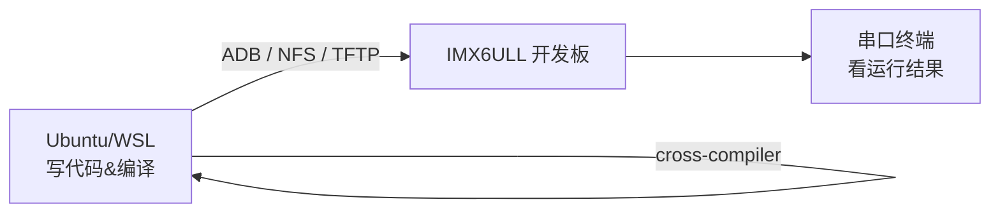

# 00 环境搭建与开发板连接

> **一句话总结**：在正式写驱动之前，先把"编译→传文件→板端运行"这条工作流跑通，后面所有实验都建立在这个基础上。

---

## 前置知识

- 能用 Linux 命令行基本操作（`ls`, `cd`, `cp`, `sudo`）
- 了解"编译"是什么意思（把 .c 文件变成可执行文件）

---

## 整体工作流



> **为什么要"交叉编译"？**
> 你的电脑是 x86 架构，开发板是 ARM 架构，两种 CPU 指令集不同。在 x86 上用普通 `gcc` 编译出来的程序，ARM 根本看不懂。所以需要一个特殊的编译器 `arm-linux-gnueabihf-gcc`，专门在 x86 上生成 ARM 能跑的代码。

---

## 1. 开发主机环境（Ubuntu / WSL）

### 1.1 安装交叉编译工具链

```bash
# 工具链已随开发板资料下载，解压到 /usr/local/arm/
sudo tar -xjf gcc-arm-linux-gnueabihf-*.tar.bz2 -C /usr/local/arm/

# 把工具链加入 PATH（写入 ~/.bashrc 永久生效）
echo 'export PATH=/usr/local/arm/gcc-arm-linux-gnueabihf-6.2.1/bin:$PATH' >> ~/.bashrc
source ~/.bashrc

# 验证安装
arm-linux-gnueabihf-gcc -v
```

### 1.2 安装必要软件包

```bash
sudo apt-get install -y \
    build-essential \   # make, gcc 等基础工具
    libncurses5-dev \   # menuconfig 图形界面
    bison flex \        # 内核编译需要
    minicom             # 串口终端
```

---

## 2. 开发板连接方式

### 2.1 串口连接（必须先连通）


```bash
# Linux 下用 minicom
sudo minicom -s         # 进入设置
# 设置：波特率 115200，数据位 8，停止位 1，无校验，无流控
# 设备：/dev/ttyUSB0（或 ttyACM0）

# 或者更简单的 picocom
sudo picocom -b 115200 /dev/ttyUSB0
```

> **波特率 115200 是什么意思？** 就是每秒传输 115200 个二进制位。双方必须说好同一个速率，否则收到的都是乱码——就像两个人说话语速差太远，就会听不懂。

### 2.2 三种文件传输方式对比

| 方式 | 速度 | 需要网络 | 适合场景 |
|------|------|----------|----------|
| **ADB**（推荐） | 快 | 不需要（USB） | 传应用程序、驱动模块 |
| **NFS 网络挂载** | 最快 | 需要以太网 | 开发调试（直接读Host文件） |
| **TFTP** | 中等 | 需要以太网 | 传内核镜像、设备树 |

### 2.3 ADB 传文件（最简单）

```bash
# 在 Ubuntu 安装 adb
sudo apt-get install adb

# 确认开发板已连接（USB线）
adb devices

# 推送文件到开发板
adb push hello_drv.ko /tmp/

# 在开发板上执行命令
adb shell "insmod /tmp/hello_drv.ko"
```

### 2.4 NFS 挂载（开发效率最高）

```bash
# Ubuntu 安装 NFS 服务
sudo apt-get install nfs-kernel-server

# 配置共享目录（/etc/exports 添加一行）
echo "/home/mosyu/linux_proj/nfs_rootfs *(rw,sync,no_subtree_check,no_root_squash)" | sudo tee -a /etc/exports
sudo exportfs -a
sudo service nfs-kernel-server restart

# 开发板串口终端上挂载（IP 根据实际填写）
mount -t nfs 192.168.1.100:/home/mosyu/linux_proj/nfs_rootfs /mnt -o nolock
```

> **NFS 的好处**：编译好的文件放在 `/nfs_rootfs` 里，开发板直接从网络读，不需要反复 `adb push`，改完代码秒生效。

### 2.5 TFTP 传内核/设备树

```bash
# Ubuntu 安装 tftp 服务
sudo apt-get install tftpd-hpa
# 共享目录对应项目的 tftpboot/
# 见 /home/mosyu/linux_proj/tftpboot/

# U-Boot 下载内核（开发板串口执行）
tftp 0x80800000 zImage
tftp 0x83000000 imx6ull-14x14-evk.dtb
bootz 0x80800000 - 0x83000000
```

---

## 3. 交叉编译工作流

### 3.1 编译一个简单应用

```bash
# 交叉编译（注意前缀 arm-linux-gnueabihf-）
arm-linux-gnueabihf-gcc hello.c -o hello

# 确认是 ARM 格式
file hello
# 输出：hello: ELF 32-bit LSB executable, ARM, ...

# 传到开发板
adb push hello /tmp/
adb shell "/tmp/hello"
```

### 3.2 编译内核模块（驱动）

```bash
# 驱动 Makefile 固定模板
KERN_DIR = /home/mosyu/linux_proj/source/kernel   # 内核源码路径
ARCH     = arm
CROSS_COMPILE = arm-linux-gnueabihf-

obj-m += my_driver.o

all:
	make -C $(KERN_DIR) M=$(PWD) modules \
	    ARCH=$(ARCH) CROSS_COMPILE=$(CROSS_COMPILE)

clean:
	make -C $(KERN_DIR) M=$(PWD) clean
```

```bash
# 编译
make

# 产出 my_driver.ko，传到开发板
adb push my_driver.ko /tmp/

# 开发板上加载/卸载
insmod /tmp/my_driver.ko     # 加载
lsmod                         # 查看已加载模块
rmmod my_driver               # 卸载
dmesg | tail -20              # 看内核日志
```

---

## 4. 目录结构说明

```
/home/mosyu/linux_proj/
├── source/
│   └── kernel/          # Linux 内核源码（用于编译驱动模块）
├── Document/
│   ├── driver_examples/ # 官方示例驱动代码
│   └── *.pdf            # 教程文档
├── nfs_rootfs/          # NFS 根文件系统（开发板挂载这里）
├── tftpboot/            # TFTP 共享目录（存放内核/DTB）
└── Driver_Notes/        # 本笔记目录
```

---

## 小结

工作流 = **编译**（交叉编译工具链）→ **传输**（ADB/NFS/TFTP）→ **加载**（insmod）→ **验证**（dmesg）。这四步跑通了，后面19章的每个驱动实验都是重复这个流程。
