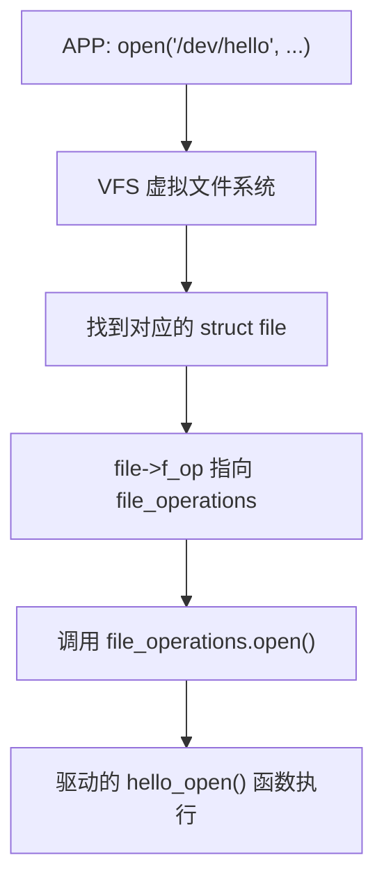
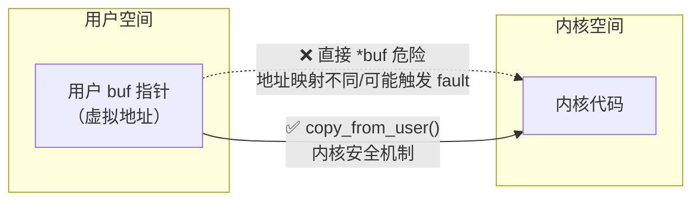
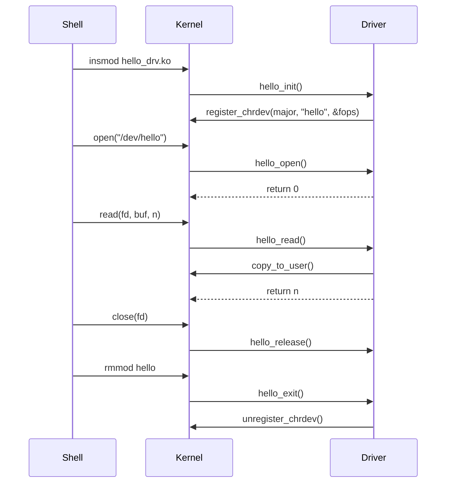

# 01 Hello 驱动入门

> **一句话总结**：Linux 驱动的本质是一组函数，APP 调用 `open/read/write` 时，内核会自动找到对应的驱动函数来执行——本章写出最小的字符设备驱动框架。

**对应 PDF**：第五篇 第1章（第292页）

---

## 前置知识

- C 语言函数指针（驱动全靠函数指针串起来）
- Linux 基本文件操作（`open/read/write/close`）
- 已完成第00章环境搭建

---

## 1. 从 APP 视角看驱动

APP 打开 `/dev/hello` 这个文件，背后发生了什么？



> **类比**：`file_operations` 就像一份"菜单"，上面列着 open、read、write 等操作。内核是"服务员"，APP 点单，服务员查菜单找到对应的"厨师"（驱动函数）来做菜。

---

## 2. 三个关键数据结构

### 2.1 struct file（每次 open 都会创建一个）

```c
struct file {
    const struct file_operations *f_op;  // 指向该文件的操作函数表
    unsigned int   f_flags;              // 打开标志（O_RDONLY, O_NONBLOCK...）
    fmode_t        f_mode;               // 访问模式（读/写）
    loff_t         f_pos;                // 当前文件读写位置（光标）
    // ...
};
```

### 2.2 struct file_operations（驱动的"菜单"）

```c
struct file_operations {
    struct module *owner;                          // 填 THIS_MODULE
    int    (*open)  (struct inode *, struct file *);
    ssize_t (*read) (struct file *, char __user *, size_t, loff_t *);
    ssize_t (*write)(struct file *, const char __user *, size_t, loff_t *);
    int    (*release)(struct inode *, struct file *); // 对应 close()
    // 还有 ioctl、mmap、poll 等...
};
```

> **`__user` 标记**：提醒内核开发者"这个指针指向用户空间"，不能直接解引用，必须用 `copy_to_user/copy_from_user`。

### 2.3 struct inode（每个文件唯一，不随 open 重建）

```c
struct inode {
    dev_t i_rdev;   // 设备号（主设备号 + 次设备号）
    // ...
};
```

---

## 3. 设备号：主设备号 vs 次设备号

```
设备号 = 主设备号(12位) + 次设备号(20位)
         └── 对应哪类驱动   └── 同类驱动中第几个设备
```

- 主设备号：内核用来找驱动（比如 `major=5` 对应 `/dev/tty`）
- 次设备号：驱动内部区分同类多个设备（比如 `/dev/ttyS0`, `/dev/ttyS1`）

---

## 4. 最小 Hello 驱动完整代码

```c
#include <linux/module.h>
#include <linux/kernel.h>
#include <linux/fs.h>
#include <linux/uaccess.h>   // copy_to_user / copy_from_user

#define DEVICE_NAME "hello"  // /dev/hello
#define BUF_SIZE    128

static int    major;                    // 动态分配的主设备号
static char   kbuf[BUF_SIZE] = "Hello from kernel!\n";

/* ===== 驱动操作函数 ===== */

static int hello_open(struct inode *inode, struct file *file)
{
    printk(KERN_INFO "hello_open called\n");
    return 0;   // 返回 0 表示成功
}

static ssize_t hello_read(struct file *file, char __user *buf,
                           size_t count, loff_t *ppos)
{
    int len = strlen(kbuf);
    int to_copy = min((size_t)len, count);   // 不能超出 kbuf 或用户缓冲区

    /* 把内核数据拷贝到用户空间，不能直接 memcpy！ */
    if (copy_to_user(buf, kbuf, to_copy))
        return -EFAULT;   // 拷贝失败

    return to_copy;   // 返回实际读取字节数
}

static ssize_t hello_write(struct file *file, const char __user *buf,
                            size_t count, loff_t *ppos)
{
    int to_copy = min(count, (size_t)(BUF_SIZE - 1));

    /* 把用户数据拷贝到内核，不能直接解引用用户指针！ */
    if (copy_from_user(kbuf, buf, to_copy))
        return -EFAULT;

    kbuf[to_copy] = '\0';   // 保证字符串终止
    printk(KERN_INFO "hello_write: received '%s'\n", kbuf);
    return to_copy;
}

static int hello_release(struct inode *inode, struct file *file)
{
    printk(KERN_INFO "hello_release called\n");
    return 0;
}

/* ===== 注册函数表 ===== */

static const struct file_operations hello_fops = {
    .owner   = THIS_MODULE,
    .open    = hello_open,
    .read    = hello_read,
    .write   = hello_write,
    .release = hello_release,
};

/* ===== 模块入口/出口 ===== */

static int __init hello_init(void)
{
    /* 动态注册：major=0 表示让内核自动分配主设备号 */
    major = register_chrdev(0, DEVICE_NAME, &hello_fops);
    if (major < 0) {
        printk(KERN_ERR "register_chrdev failed: %d\n", major);
        return major;
    }
    printk(KERN_INFO "hello: registered with major=%d\n", major);
    return 0;
}

static void __exit hello_exit(void)
{
    unregister_chrdev(major, DEVICE_NAME);
    printk(KERN_INFO "hello: unregistered\n");
}

module_init(hello_init);
module_exit(hello_exit);
MODULE_LICENSE("GPL");
MODULE_AUTHOR("你的名字");
```

---

## 5. 为什么不能直接用指针访问用户空间？



用户空间工作在用户态，地址是虚拟地址，直接解引用用户指针会导致内核崩溃。同样的，用户的代码也不能访问内核的内存区。 

---

## 6. 加载驱动 & 创建设备节点

```bash
# 编译（Makefile 见第00章模板）
make

# 加载驱动
sudo insmod hello_drv.ko

# 查看分配到的主设备号
dmesg | tail -5
# 输出：hello: registered with major=243

# 手动创建设备节点（major=243 根据 dmesg 实际值填）
sudo mknod /dev/hello c 243 0
#                      ↑   ↑  ↑
#                     设备名 字符设备 主设备号 次设备号

# 测试读
cat /dev/hello          # 应该输出：Hello from kernel!

# 测试写
echo "World" > /dev/hello

# 卸载
sudo rmmod hello
```

> **提示**：用 `class_create` + `device_create` 可以让内核自动创建 `/dev/hello`，不需要手动 `mknod`。后面章节会用到。

---

## 7. 驱动生命周期总览



---

## 小结

字符设备驱动 = **定义 `file_operations`（菜单）** + **`register_chrdev`（注册菜单）** + **`module_init/exit`（装载/卸载）**。内核负责把 APP 的系统调用路由到对应驱动函数——这个路由机制就是 VFS + `file_operations`。
