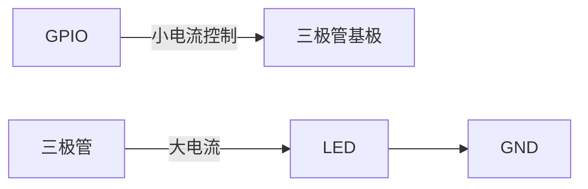
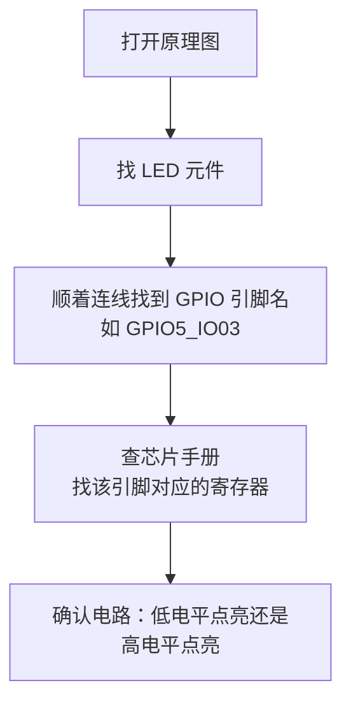

# 02 LED 原理图硬件知识

> **一句话总结**：在写 LED 驱动之前，必须先搞清楚"GPIO 输出高/低电平"和"LED 亮/灭"的对应关系——这由硬件电路决定，不同板子可能完全相反。

**对应 PDF**：第五篇 第2章（第306页）

---

## 前置知识

- 基本电路概念：电流、高低电平、GND（接地）

---

## 1. LED 四种驱动方式

> **类比**：想象 LED 是一盏灯，GPIO 引脚是开关。开关在灯的不同位置，开/关的含义就不同。

### 方式一：GPIO 高电平点亮

```
GPIO ──[限流电阻]──▷|── GND
        3.3V→亮        熄
```

GPIO 输出 1（高电平）→ 电流流过 LED → 亮

### 方式二：GPIO 低电平点亮（本板使用）

```
VCC ──[限流电阻]──▷|── GPIO
                    ↓0V→亮   ↑3.3V→灭
```

GPIO 输出 0（低电平）→ 产生电位差 → 电流流过 LED → 亮

### 方式三/四：通过三极管驱动

当 GPIO 驱动能力不足时（最大几毫安），用三极管放大电流：



> **为什么需要三极管？** GPIO 引脚最大只能输出几毫安电流，而某些 LED 需要 20mA 以上。三极管起"放大器"作用——用小电流控制大电流，就像用手指轻轻按开关控制强电。

---

## 2. 限流电阻：必须有，否则 LED 会烧掉

```
LED 正向压降 ≈ 2V（红光）
工作电流    ≈ 10mA

电阻 = (电源电压 - LED压降) / 工作电流
     = (3.3V - 2V) / 10mA
     = 130Ω  → 实际选 150Ω 或 220Ω
```

> **类比**：限流电阻就像水管里的节流阀，防止电流太大把 LED"淹死"。

---

## 3. 如何看原理图找 GPIO 引脚

**步骤：**



**100ASK IMX6ULL 板子 LED 示例：**

| LED | GPIO 引脚 | 点亮条件 |
|-----|-----------|----------|
| LED0 | GPIO5_IO03 | GPIO 输出低电平（0）点亮 |

> 原理图中如果 LED 阳极接 VCC，阴极接 GPIO，则 GPIO 输出低（接地）→ 电流从 VCC 流向 GPIO → 点亮。

---

## 4. 高低电平与 LED 状态对照表

| GPIO 输出值 | 电压 | 电流方向 | LED 状态（低电平点亮型） |
|------------|------|----------|--------------------------|
| 1（高电平） | 3.3V | 无电流（两端等电位） | 熄灭 |
| 0（低电平） | 0V | 从VCC→LED→GPIO | 点亮 |

---

## 5. 关键结论

在写 LED 驱动的 `led_ctl` 函数时，**要反转逻辑**：

```c
void board_led_ctl(int which, int status)
{
    if (status == 1) {        // APP 要点亮
        GPIO_DR &= ~(1 << 3); // 输出低电平（低电平点亮）
    } else {                  // APP 要熄灭
        GPIO_DR |= (1 << 3);  // 输出高电平
    }
}
```

不看原理图就盲目写代码，结果就是点亮/熄灭逻辑相反。

---

## 小结

驱动不是纯软件——必须先看硬件。看原理图的目的：① 确定 LED 用哪个 GPIO 控制；② 确定"输出 0 还是输出 1"点亮 LED。这两个问题搞清楚，驱动代码才能写对。
