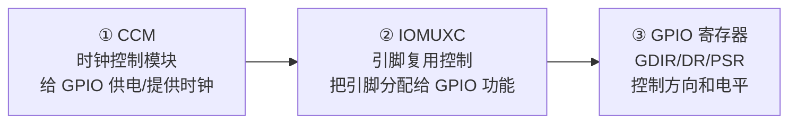
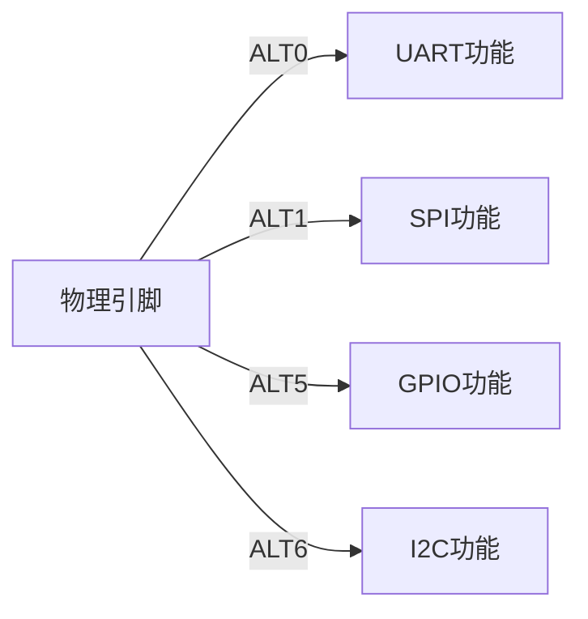
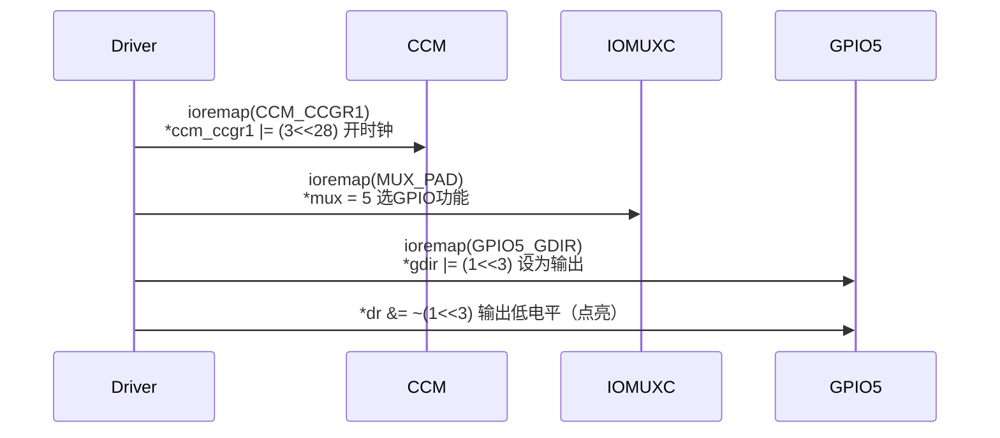

# 04 IMX6ULL GPIO 操作方法

> **一句话总结**：IMX6ULL 操作一个 GPIO 需要走三步：开时钟（CCM）→ 配引脚复用（IOMUXC）→ 操作 GPIO 寄存器，缺一不可。

**对应 PDF**：第五篇 第4章（第309页）

---

## 前置知识

- 第03章：GPIO 三寄存器操作方式
- 物理地址 vs 虚拟地址的概念

---

## 1. 为什么需要三步？



> **类比**：
> - **CCM**（时钟）= 电表总闸，不开闸，设备没电
> - **IOMUXC**（引脚复用）= 分线盒，同一根电线可以接灯/插座/空调，你得选一个
> - **GPIO 寄存器** = 具体的开关

---

## 2. 第一步：CCM 时钟使能

IMX6ULL 每个 GPIO 控制器需要时钟才能工作，通过 `CCM_CCGRx` 寄存器控制。

```c
/* CCM_CCGR1 寄存器地址（控制 GPIO5 时钟） */
#define CCM_CCGR1   0x020C406C

/* GPIO5 时钟在 CCM_CCGR1 的 bit[29:28] */
/* 写 0b11 = 始终使能 */

volatile unsigned int *ccm_ccgr1 = ioremap(CCM_CCGR1, 4);
*ccm_ccgr1 |= (3 << 28);   // 使能 GPIO5 时钟
```

| CCM_CCGRx 位域值 | 含义 |
|-----------------|------|
| 00 | 时钟关闭 |
| 01 | 仅在运行模式开启 |
| 11 | 始终开启（驱动用这个） |

---

## 3. 第二步：IOMUXC 引脚复用配置

IMX6ULL 的每个物理引脚都可以配置为多种功能（GPIO / UART / SPI / I2C...），通过 IOMUXC 寄存器选择。



```c
/* SNVS_TAMPER3 引脚（对应 GPIO5_IO03）的 MUX 寄存器 */
#define IOMUXC_SNVS_SW_MUX_CTL_PAD_SNVS_TAMPER3  0x02290014

volatile unsigned int *mux = ioremap(IOMUXC_SNVS_SW_MUX_CTL_PAD_SNVS_TAMPER3, 4);
*mux = 5;    // ALT5 = GPIO5_IO03 功能
```

> **ALT5 是什么？** 每个引脚有8种复用选项（ALT0~ALT7），ALT5 通常对应 GPIO 功能。具体查 IMX6ULL 参考手册 IOMUXC 章节。

---

## 4. 第三步：GPIO 寄存器操作

IMX6ULL 有 5 组 GPIO，每组最多 32 个引脚：

| 组 | 基地址 |
|----|--------|
| GPIO1 | 0x0209C000 |
| GPIO2 | 0x020A0000 |
| GPIO3 | 0x020A4000 |
| GPIO4 | 0x020A8000 |
| GPIO5 | 0x020AC000 |

```
每组 GPIO 寄存器布局（基地址 + 偏移）：
  +0x00  GPIO_DR     输出数据寄存器
  +0x04  GPIO_GDIR   方向寄存器（1=输出，0=输入）
  +0x08  GPIO_PSR    引脚状态寄存器（输入时读实时电平）
```

```c
#define GPIO5_BASE   0x020AC000
#define GPIO5_DR     (GPIO5_BASE + 0x00)
#define GPIO5_GDIR   (GPIO5_BASE + 0x04)

volatile unsigned int *gdir = ioremap(GPIO5_GDIR, 4);
volatile unsigned int *dr   = ioremap(GPIO5_DR,   4);

/* 配置 GPIO5_IO03 为输出 */
*gdir |= (1 << 3);

/* 输出低电平点亮 LED */
*dr &= ~(1 << 3);

/* 输出高电平熄灭 LED */
*dr |= (1 << 3);
```

---

## 5. ioremap：物理地址 → 虚拟地址

内核运行在虚拟地址空间，不能直接用物理地址访问寄存器，必须先映射：


```c
/* 映射 4 字节（一个寄存器） */
void __iomem *vaddr = ioremap(0x020AC004, 4);
if (!vaddr) {
    printk(KERN_ERR "ioremap failed!\n");
    return -ENOMEM;
}

/* 使用映射地址 */
writel(readl(vaddr) | (1 << 3), vaddr);

/* 驱动卸载时解除映射 */
iounmap(vaddr);
```

---

## 6. volatile 关键字：必须加

```c
/* 错误：编译器可能把多次读优化成只读一次 */
unsigned int *dr = ioremap(GPIO5_DR, 4);
*dr = 1;
*dr = 0;   // 编译器优化：认为上一行"没用"，直接删掉！

/* 正确：volatile 告诉编译器"每次都必须真正读写内存" */
volatile unsigned int *dr = ioremap(GPIO5_DR, 4);
*dr = 1;
*dr = 0;   // 一定会产生两次总线写操作
```

> **为什么编译器会优化掉？** 编译器看到连续对同一地址写两个值，会认为第一次写"无效"（反正被第二次覆盖了），就删除它。但对硬件寄存器来说，"写 1 再写 0"可能是产生一个脉冲，两次操作都必须执行。`volatile` 就是告诉编译器："这个变量可能被外部（硬件）改变，别做任何假设，每次都老老实实读/写。"

---

## 7. 三步操作完整流程



---

## 小结

IMX6ULL GPIO 操作链路：**CCM 开时钟** → **IOMUXC 选功能** → **GPIO 寄存器控制方向和电平**。物理地址用 `ioremap` 映射成虚拟地址，指针必须加 `volatile`。

- 内核时钟子系统参考：[source/kernel/drivers/clk/](../source/kernel/drivers/clk/)
- 内核 Pinctrl 子系统参考：[source/kernel/drivers/pinctrl/](../source/kernel/drivers/pinctrl/)
