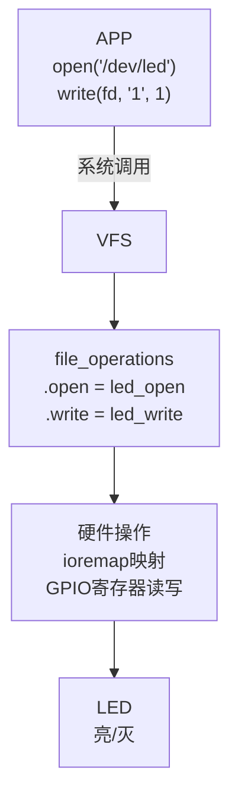
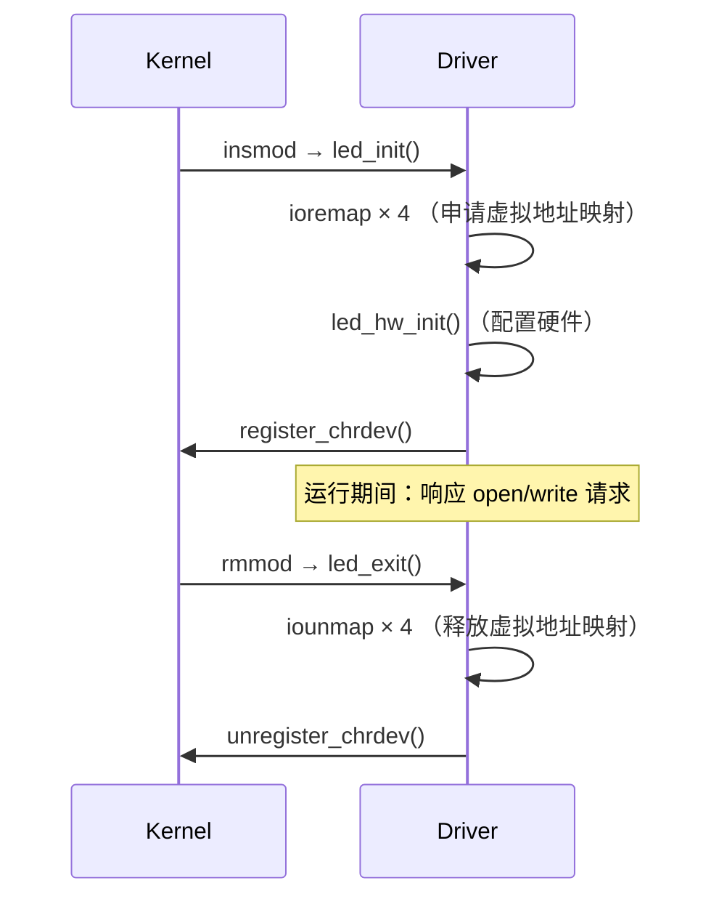

# 05 最简单的 LED 驱动程序

> **一句话总结**：把第01章的字符设备框架 + 第04章的 GPIO 操作合并，写出一个可以在真实开发板上控制 LED 的驱动程序。

**对应 PDF**：第五篇 第5章（第318页）

---

## 前置知识

- 第01章：字符设备驱动框架（file_operations、register_chrdev）
- 第04章：IMX6ULL GPIO 操作（CCM、IOMUXC、ioremap）

---

## 1. 驱动整体架构



---

## 2. 完整驱动代码

```c
#include <linux/module.h>
#include <linux/kernel.h>
#include <linux/fs.h>
#include <linux/uaccess.h>
#include <linux/io.h>          // ioremap / iounmap

/* ===== 寄存器物理地址（查 IMX6ULL 手册） ===== */
#define CCM_CCGR1                           0x020C406C
#define IOMUXC_SNVS_SW_MUX_CTL_PAD_SNVS_TAMPER3  0x02290014
#define GPIO5_GDIR                          0x020AC004
#define GPIO5_DR                            0x020AC000

/* ===== 全局虚拟地址指针 ===== */
static volatile unsigned int *ccm_ccgr1;
static volatile unsigned int *iomux_led;
static volatile unsigned int *gpio5_gdir;
static volatile unsigned int *gpio5_dr;

static int major;

/* ===== 初始化 LED 硬件 ===== */
static void led_hw_init(void)
{
    /* 1. 开 GPIO5 时钟 */
    *ccm_ccgr1 |= (3 << 28);

    /* 2. 配置引脚为 GPIO 功能（ALT5） */
    *iomux_led = 5;

    /* 3. GPIO5_IO03 设为输出 */
    *gpio5_gdir |= (1 << 3);

    /* 4. 默认熄灭（输出高电平） */
    *gpio5_dr |= (1 << 3);
}

/* ===== file_operations 实现 ===== */

static int led_open(struct inode *inode, struct file *file)
{
    return 0;
}

static ssize_t led_write(struct file *file, const char __user *buf,
                          size_t count, loff_t *ppos)
{
    char val;

    /* 从用户空间读取1字节（'0'=熄灭，'1'=点亮） */
    if (copy_from_user(&val, buf, 1))
        return -EFAULT;

    if (val == '1') {
        *gpio5_dr &= ~(1 << 3);  // 低电平 → 点亮
    } else {
        *gpio5_dr |= (1 << 3);   // 高电平 → 熄灭
    }

    return 1;
}

static const struct file_operations led_fops = {
    .owner = THIS_MODULE,
    .open  = led_open,
    .write = led_write,
};

/* ===== 模块入口：映射寄存器 + 注册驱动 ===== */
static int __init led_init(void)
{
    /* ioremap：物理地址 → 虚拟地址 */
    ccm_ccgr1   = ioremap(CCM_CCGR1, 4);
    iomux_led   = ioremap(IOMUXC_SNVS_SW_MUX_CTL_PAD_SNVS_TAMPER3, 4);
    gpio5_gdir  = ioremap(GPIO5_GDIR, 4);
    gpio5_dr    = ioremap(GPIO5_DR,   4);

    if (!ccm_ccgr1 || !iomux_led || !gpio5_gdir || !gpio5_dr) {
        printk(KERN_ERR "led: ioremap failed\n");
        return -ENOMEM;
    }

    led_hw_init();   // 初始化硬件

    major = register_chrdev(0, "led", &led_fops);
    if (major < 0) {
        printk(KERN_ERR "led: register_chrdev failed\n");
        return major;
    }

    printk(KERN_INFO "led: major=%d\n", major);
    return 0;
}

/* ===== 模块出口：解除映射 + 注销驱动 ===== */
static void __exit led_exit(void)
{
    iounmap((void *)ccm_ccgr1);
    iounmap((void *)iomux_led);
    iounmap((void *)gpio5_gdir);
    iounmap((void *)gpio5_dr);
    unregister_chrdev(major, "led");
    printk(KERN_INFO "led: unregistered\n");
}

module_init(led_init);
module_exit(led_exit);
MODULE_LICENSE("GPL");
```

---

## 3. 配套测试 APP

```c
/* led_test.c —— 运行在开发板上 */
#include <stdio.h>
#include <fcntl.h>
#include <unistd.h>
#include <string.h>

int main(int argc, char *argv[])
{
    int fd;
    char val = '0';

    if (argc != 3) {
        printf("Usage: %s /dev/led <on|off>\n", argv[0]);
        return 1;
    }

    fd = open(argv[1], O_WRONLY);
    if (fd < 0) { perror("open"); return 1; }

    val = (strcmp(argv[2], "on") == 0) ? '1' : '0';
    write(fd, &val, 1);

    close(fd);
    return 0;
}
```

---

## 4. 上机实验步骤

```bash
# === 在 Ubuntu 编译 ===
# 编译驱动模块
make                               # 产出 led_drv.ko

# 交叉编译测试 APP
arm-linux-gnueabihf-gcc led_test.c -o led_test

# === 传到开发板 ===
adb push led_drv.ko  /tmp/
adb push led_test    /tmp/

# === 在开发板串口终端执行 ===
insmod /tmp/led_drv.ko
dmesg | tail -3                    # 查看 major 号，如 243

mknod /dev/led c 243 0             # 创建设备节点

/tmp/led_test /dev/led on          # 点亮
/tmp/led_test /dev/led off         # 熄灭

rmmod led                          # 卸载驱动
```

---

## 5. 驱动生命周期与资源管理



> **资源对应关系**：`ioremap` 对应 `iounmap`，`register_chrdev` 对应 `unregister_chrdev`。驱动卸载必须全部释放，否则内核内存泄漏。

---

## 6. 常见问题

| 问题 | 原因 | 解决 |
|------|------|------|
| LED 亮灭逻辑相反 | 没看原理图，高低电平搞反 | 查原理图确认电路 |
| `insmod` 报 `invalid module format` | 内核版本与驱动编译时的内核不匹配 | 重新指向正确的 KERN_DIR |
| `/dev/led` 不存在 | 忘了 `mknod` | 手动创建或用 device_create |
| `open` 报 permission denied | 权限问题 | `chmod 666 /dev/led` |

---

## 小结

最简单的 LED 驱动 = **字符设备框架** + **ioremap 映射寄存器** + **位操作控制 GPIO**。这是所有硬件驱动的基本模型，后续章节会逐步把它改造得更通用、更规范。

示例代码参考：[Document/driver_examples/IMX6ULL/source/07_GPIO/](../Document/driver_examples/IMX6ULL/source/07_GPIO/)
