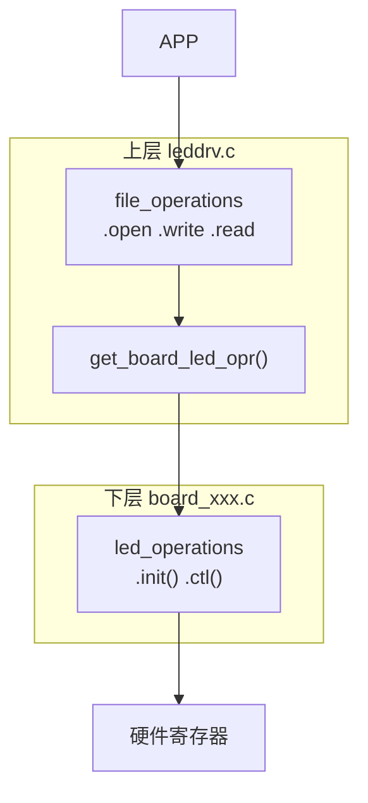

# 06 LED 驱动框架与分层思想

> **一句话总结**：第05章的驱动把"用户接口"和"硬件操作"混在一起，本章用分层思想把它们拆开——上层负责和 APP 打交道，下层负责操作具体硬件，一个驱动适配多块板子。

**对应 PDF**：第五篇 第6章（第320页）

---

## 前置知识

- C 语言函数指针（结构体中的函数指针字段）
- 第05章：最简单的 LED 驱动

---

## 1. 问题：第05章驱动的缺陷

```c
/* 第05章 led_write 里硬编码了 GPIO5_IO03 */
if (val == '1')
    *gpio5_dr &= ~(1 << 3);   // 只能控制这一块板子的这一个引脚
```

**如果要支持 5 种开发板，就要写 5 个不同的驱动文件**——代码大量重复。

---

## 2. 分层解决方案



> **类比**：`file_operations` 是餐厅的点餐系统（统一接口），`led_operations` 是各地厨房（具体实现）。点餐系统不关心食材从哪来，只要厨房遵守菜单接口就行。

---

## 3. 核心：led_operations 抽象接口

```c
/* led_operations.h —— 定义抽象接口 */
struct led_operations {
    int  (*init)(int which);          // 初始化第 which 个 LED
    int  (*ctl)(int which, char val); // 控制第 which 个 LED（val: 1=亮 0=灭）
};

/* 每块板子实现这个接口，并注册 */
struct led_operations *get_board_led_opr(void);
```

---

## 4. 上层文件：leddrv.c（不含任何硬件细节）

```c
/* leddrv.c —— 只负责和 APP 打交道 */
#include "led_operations.h"

static struct led_operations *p_led_opr;  // 指向具体板子的操作集

static int led_open(struct inode *inode, struct file *file)
{
    int which = iminor(inode);   // 次设备号对应第几个LED
    p_led_opr->init(which);      // 调用下层初始化（不关心是哪块板子）
    return 0;
}

static ssize_t led_write(struct file *file, const char __user *buf,
                          size_t count, loff_t *ppos)
{
    char val;
    int which = iminor(file_inode(file));

    copy_from_user(&val, buf, 1);
    p_led_opr->ctl(which, val);  // 调用下层控制（不关心具体GPIO）
    return 1;
}

static int __init leddrv_init(void)
{
    p_led_opr = get_board_led_opr();   // 获取当前板子的操作集
    major = register_chrdev(0, "led", &led_fops);
    return 0;
}
```

---

## 5. 下层文件：board_100ask_imx6ull.c（只含硬件细节）

```c
/* board_100ask_imx6ull.c —— 只负责操作 IMX6ULL 硬件 */

static int board_led_init(int which)
{
    /* 开时钟、配引脚、设方向 —— IMX6ULL 专用 */
    *ccm_ccgr1  |= (3 << 28);
    *iomux_led   = 5;
    *gpio5_gdir |= (1 << 3);
    return 0;
}

static int board_led_ctl(int which, char val)
{
    if (val == '1')
        *gpio5_dr &= ~(1 << 3);   // 低电平点亮
    else
        *gpio5_dr |=  (1 << 3);   // 高电平熄灭
    return 0;
}

/* 实现接口，暴露给上层 */
static struct led_operations board_led_opr = {
    .init = board_led_init,
    .ctl  = board_led_ctl,
};

struct led_operations *get_board_led_opr(void)
{
    return &board_led_opr;
}
```

---

## 6. 扩展另一块板子只需新建文件

```
board_stm32mp157.c   实现 get_board_led_opr()，内部用 STM32 寄存器
board_rk3568.c       实现 get_board_led_opr()，内部用 RK3568 寄存器
```

**上层 leddrv.c 一行代码不改。**

---

## 7. 文件编译关系

```makefile
# Makefile
obj-m += leddrv.o board_100ask_imx6ull.o
# 或者换板子：
# obj-m += leddrv.o board_stm32mp157.o
```

---

## 8. 接口设计对比

| 方案 | 优点 | 缺点 |
|------|------|------|
| 第05章：全写在一起 | 简单直接 | 换板子要改驱动核心代码 |
| 第06章：分层 | 上层不变，只换下层文件 | 多了一层抽象，初学者稍难理解 |

---

## 小结

分层思想核心：**用结构体（`led_operations`）定义接口，上层调用接口，下层实现接口**。接口不变，下层可以任意替换——这正是 Linux 内核大量使用的设计模式（GPIO子系统、pinctrl子系统都是这种思路）。

示例代码参考：[Document/driver_examples/IMX6ULL/source/07_GPIO/](../Document/driver_examples/IMX6ULL/source/07_GPIO/)
