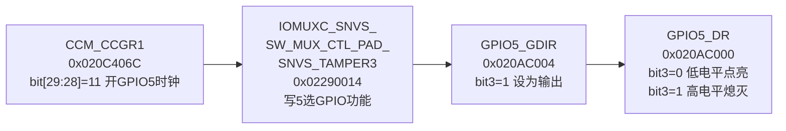
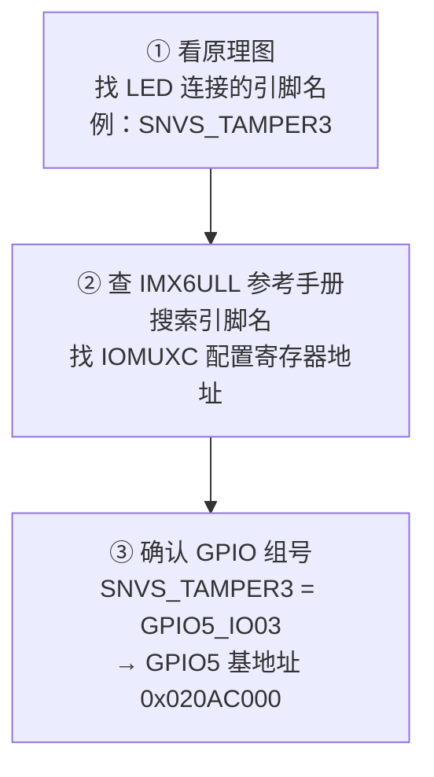

# 07 具体单板 LED 驱动实现

> **一句话总结**：把第06章的下层接口填充完整——用 IMX6ULL 的真实寄存器地址控制 GPIO5_IO03，让 LED 真正亮起来。

**对应 PDF**：第五篇 第7章（第326页）

---

## 前置知识

- 第06章：分层框架（led_operations 接口）
- 第04章：IMX6ULL GPIO 三步操作

---

## 1. 引脚信息（查原理图得到）

| 信息 | 值 |
|------|-----|
| LED 控制引脚 | GPIO5_IO03 |
| 点亮条件 | GPIO 输出低电平（0） |
| 引脚对应物理名 | SNVS_TAMPER3 |

---

## 2. 寄存器地址（查 IMX6ULL 参考手册）



---

## 3. 完整下层实现 board_100ask_imx6ull.c

```c
#include <linux/module.h>
#include <linux/io.h>
#include "led_operations.h"

/* 寄存器物理地址 */
#define CCM_CCGR1       0x020C406C
#define IOMUXC_TAMPER3  0x02290014
#define GPIO5_DR        0x020AC000
#define GPIO5_GDIR      0x020AC004

/* 全局虚拟地址 */
static volatile unsigned int *ccm_ccgr1;
static volatile unsigned int *iomux_tamper3;
static volatile unsigned int *gpio5_dr;
static volatile unsigned int *gpio5_gdir;

static int board_led_init(int which)
{
    if (which != 0) return -EINVAL;  // 本板只有1个LED

    /* ① 映射寄存器物理地址 */
    ccm_ccgr1     = ioremap(CCM_CCGR1,      4);
    iomux_tamper3 = ioremap(IOMUXC_TAMPER3, 4);
    gpio5_dr      = ioremap(GPIO5_DR,       4);
    gpio5_gdir    = ioremap(GPIO5_GDIR,     4);

    /* ② 开启 GPIO5 时钟（CCM_CCGR1 bit[29:28] = 11） */
    *ccm_ccgr1 |= (3 << 28);

    /* ③ 配置 SNVS_TAMPER3 引脚为 GPIO 功能（ALT5） */
    *iomux_tamper3 = 5;

    /* ④ GPIO5_IO03 设为输出方向 */
    *gpio5_gdir |= (1 << 3);

    /* ⑤ 默认熄灭（高电平） */
    *gpio5_dr |= (1 << 3);

    return 0;
}

static int board_led_ctl(int which, char val)
{
    if (which != 0) return -EINVAL;

    if (val == '1') {
        /* 点亮：bit3 输出 0（低电平） */
        *gpio5_dr &= ~(1 << 3);
    } else {
        /* 熄灭：bit3 输出 1（高电平） */
        *gpio5_dr |= (1 << 3);
    }
    return 0;
}

/* 提供给上层的操作集 */
static struct led_operations board_led_opr = {
    .init = board_led_init,
    .ctl  = board_led_ctl,
};

struct led_operations *get_board_led_opr(void)
{
    return &board_led_opr;
}

/* 模块卸载时释放映射 */
static void __exit board_exit(void)
{
    iounmap((void *)ccm_ccgr1);
    iounmap((void *)iomux_tamper3);
    iounmap((void *)gpio5_dr);
    iounmap((void *)gpio5_gdir);
}

module_exit(board_exit);
MODULE_LICENSE("GPL");
```

---

## 4. 如何查寄存器地址：三步法



**实际查找示例：**

1. 原理图找到：LED → `SNVS_TAMPER3`
2. 手册搜 `SNVS_TAMPER3` → 找到 `IOMUXC_SNVS_SW_MUX_CTL_PAD_SNVS_TAMPER3`，地址 `0x02290014`
3. 手册搜 `GPIO5` → 基地址 `0x020AC000`，DR 偏移 `+0x00`，GDIR 偏移 `+0x04`

---

## 5. 调试技巧

```bash
# 加载后看内核日志
dmesg | tail -20

# 直接用 devmem 读写寄存器（不用写驱动也能验证）
# 先确认 GPIO5_GDIR 当前值
devmem 0x020AC004 32

# 写 GPIO5_DR bit3 为 0（点亮）
devmem 0x020AC000 32 0xFFFFFFF7

# 读引脚实时状态
devmem 0x020AC008 32   # PSR 寄存器
```

---

## 6. 多 LED 扩展思路

如果板子有多个 LED（不同 GPIO），只需在 `board_led_init` 和 `board_led_ctl` 中用 `which` 参数区分：

```c
static int gpio_pins[] = {3, 5, 7};   // 三个LED对应 bit3/5/7

static int board_led_ctl(int which, char val)
{
    if (which >= ARRAY_SIZE(gpio_pins)) return -EINVAL;
    int pin = gpio_pins[which];

    if (val == '1')
        *gpio5_dr &= ~(1 << pin);
    else
        *gpio5_dr |=  (1 << pin);
    return 0;
}
```

---

## 小结

下层实现就是把第04章的 GPIO 三步操作包装进 `led_operations` 接口里。关键在于查对寄存器地址，其余都是机械性的位操作。

示例代码参考：[Document/driver_examples/IMX6ULL/source/07_GPIO/](../Document/driver_examples/IMX6ULL/source/07_GPIO/)
