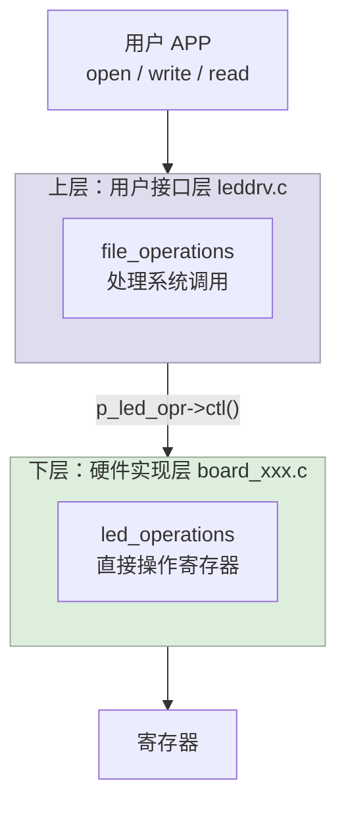
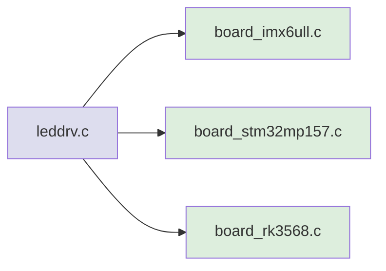
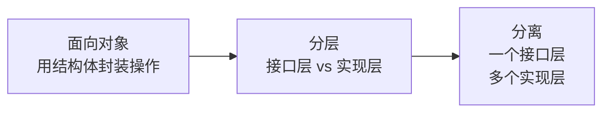

# 08 驱动设计思想：面向对象、分层、分离

> **一句话总结**：Linux 驱动用"结构体+函数指针"实现面向对象，用"分层"隔离接口与实现，用"分离"让一个驱动支持多块板子——这三个思想贯穿整个内核驱动体系。

**对应 PDF**：第五篇 第8章（第334页）

---

## 前置知识

- 第06~07章：LED 分层驱动实战
- C 语言结构体和函数指针

---

## 1. 面向对象：用 C 实现

C 没有 class，但可以用 **结构体 + 函数指针** 模拟：

```c
/* Java 写法 */
class LedOperations {
    void init(int which);
    void ctl(int which, int val);
}

/* C 写法（等价） */
struct led_operations {
    int (*init)(int which);
    int (*ctl)(int which, char val);
};
```

**调用方式对比：**

```c
// Java
led.ctl(0, 1);

// C（通过结构体指针）
p_led_opr->ctl(0, '1');
```

> **为什么 Linux 内核到处是结构体+函数指针？** 因为 C 没有继承/多态，用这个模式可以达到同样效果——不同"子类"实现同一套接口，上层代码不变。

---

## 2. 分层：隔离用户接口与硬件实现



**分层的好处**：
- 上层和下层可以**独立修改**，互不干扰
- 换板子只需替换下层文件，上层 `insmod` 命令不变

---

## 3. 分离：一个上层驱动适配多种硬件



"分离"比"分层"更进一步：**同一套上层代码，通过链接不同下层文件，适配不同硬件平台**。

---

## 4. 这三个思想在内核中的体现

| 内核子系统 | 接口结构体 | 说明 |
|------------|-----------|------|
| GPIO 子系统 | `gpio_chip` | 每种芯片实现自己的 `get/set/direction` |
| Pinctrl 子系统 | `pinctrl_ops` | 每种芯片实现自己的引脚配置 |
| I2C 子系统 | `i2c_algorithm` | 每种主控实现自己的数据传输 |
| SPI 子系统 | `spi_master` | 每种主控实现自己的传输函数 |
| VFS | `file_operations` | 每种文件系统实现自己的 read/write |

> 你写的 `led_operations` 和内核里的 `gpio_chip` 是同一个设计模式，只不过内核实现得更复杂、更完善。

---

## 5. 三种思想的递进关系



**第一步（面向对象）**：把 LED 的 `init` 和 `ctl` 放进结构体
**第二步（分层）**：上层 `leddrv.c` 只调用接口，下层实现接口
**第三步（分离）**：把下层按板子分成多个文件，编译时选其一

---

## 6. 示例：面向对象思想写代码

```c
/* 定义"类"（接口） */
struct led_operations {
    int (*init)(int which);
    int (*ctl)(int which, char val);
};

/* 定义"子类 A"（IMX6ULL 实现） */
static struct led_operations imx6ull_ops = {
    .init = imx6ull_led_init,
    .ctl  = imx6ull_led_ctl,
};

/* 定义"子类 B"（虚拟LED，用于无硬件测试） */
static struct led_operations virtual_ops = {
    .init = virtual_led_init,
    .ctl  = virtual_led_ctl,
};

/* 上层代码用"基类指针"，不关心具体子类 */
struct led_operations *p_opr = get_board_led_opr();
p_opr->init(0);
p_opr->ctl(0, '1');
```

---

## 小结

三大思想：**面向对象**（结构体+函数指针抽象行为）、**分层**（上层接口/下层实现分文件）、**分离**（上层不变，下层可换）。理解了这三点，就能看懂 Linux 内核里 90% 的驱动设计模式。
