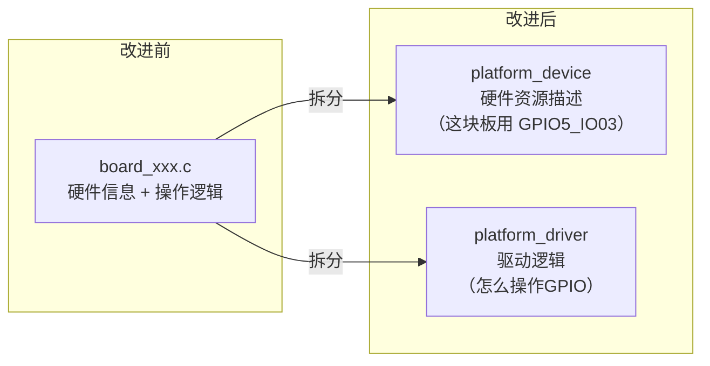
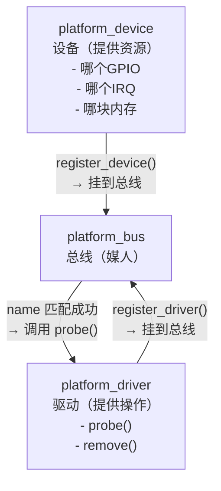

# 09 总线设备驱动模型（Bus/Dev/Drv）

> **一句话总结**：把"硬件资源描述"和"驱动逻辑"分成两个独立模块，通过"总线"自动配对——这样换板子只需更换资源描述文件，驱动代码不动。

**对应 PDF**：第五篇 第9章（第337页）

---

## 前置知识

- 第08章：分层/分离驱动设计思想
- 第06~07章：LED 分层驱动

---

## 1. 为什么要有总线设备驱动模型？

**第06~07章的问题**：

```
leddrv.c        → 上层（接口）
board_xxx.c     → 下层（硬件信息 + 操作逻辑 混在一起）
```

还可以继续拆分：把"硬件有什么资源（哪个GPIO、哪个中断）"和"怎么操作这些资源"分开：



---

## 2. 三角关系：Bus / Device / Driver



> **类比**：总线是"招聘平台"，`platform_device` 是"岗位需求"（要有GPIO5_IO03），`platform_driver` 是"应聘者"（会操作GPIO）。名字（`name`）一致就配对成功，平台自动调用 `probe` 入职。

---

## 3. 匹配规则

当一个 device 或 driver 注册时，总线会遍历对端列表尝试匹配：

```
匹配顺序（优先级从高到低）：
1. driver->id_table 中的 name 与 device->name 比较
2. driver->driver.name 与 device->name 比较
```

---

## 4. 关键数据结构

### 4.1 platform_device（描述硬件资源）

```c
struct platform_device {
    const char  *name;          // 用于匹配 driver
    int          id;            // 同名设备的编号（-1 表示唯一）
    struct resource *resource;  // 资源数组（GPIO号、内存地址、IRQ...）
    unsigned int num_resources;
};

struct resource {
    resource_size_t start;  // 起始值（如 GPIO 号，或内存基地址）
    resource_size_t end;
    unsigned long   flags;  // IORESOURCE_MEM / IORESOURCE_IRQ / IORESOURCE_IO
};
```

### 4.2 platform_driver（描述驱动逻辑）

```c
struct platform_driver {
    int (*probe)(struct platform_device *);   // 配对成功时调用
    int (*remove)(struct platform_device *);  // 设备移除时调用
    struct device_driver driver {
        .name  = "xxx",    // 用于匹配 device
        .owner = THIS_MODULE,
    };
};
```

---

## 5. 完整示例

### device 文件（描述 IMX6ULL 板子的资源）

```c
/* led_device_imx6ull.c */
static struct resource led_resources[] = {
    {
        .start = GPIO5_DR,          // LED 的 GPIO 寄存器物理地址
        .end   = GPIO5_DR + 4 - 1,
        .flags = IORESOURCE_MEM,
    },
    {
        .start = 3,                 // GPIO 引脚号（bit3）
        .end   = 3,
        .flags = IORESOURCE_IRQ,    // 借用 IRQ 类型传递引脚号
    },
};

static struct platform_device led_pdev = {
    .name          = "100ask_led",   // 必须与 driver.name 一致
    .id            = -1,
    .resource      = led_resources,
    .num_resources = ARRAY_SIZE(led_resources),
};

static int __init led_dev_init(void)
{
    return platform_device_register(&led_pdev);
}
module_init(led_dev_init);
```

### driver 文件（通用驱动逻辑）

```c
/* led_driver.c */
static int led_probe(struct platform_device *pdev)
{
    struct resource *res_mem, *res_pin;

    /* 从 device 获取资源 —— 驱动不硬编码地址 */
    res_mem = platform_get_resource(pdev, IORESOURCE_MEM, 0);
    res_pin = platform_get_resource(pdev, IORESOURCE_IRQ, 0);

    printk("LED GPIO addr=0x%x, pin=%d\n",
           (unsigned int)res_mem->start, (int)res_pin->start);

    /* 映射并初始化 GPIO ... */
    return 0;
}

static int led_remove(struct platform_device *pdev)
{
    /* 释放资源 */
    return 0;
}

static struct platform_driver led_pdrv = {
    .probe  = led_probe,
    .remove = led_remove,
    .driver = {
        .name  = "100ask_led",   // 与 device.name 一致，才能匹配
        .owner = THIS_MODULE,
    },
};

module_init platform_driver_register(&led_pdrv);
```

---

## 6. 加载顺序

```bash
# device 和 driver 谁先谁后都行，总线会自动配对
insmod led_device_imx6ull.ko   # 注册设备资源
insmod led_driver.ko           # 注册驱动 → 触发匹配 → 调用 probe()

# 查看匹配结果
ls /sys/bus/platform/devices/100ask_led/
```

---

## 7. 与第06~07章的演进对比

| 对比项 | 第06~07章 | 第09章（platform 模型） |
|--------|-----------|------------------------|
| 硬件资源在哪 | board_xxx.c 里硬编码 | platform_device 结构体中 |
| 驱动怎么获取资源 | 直接 ioremap 固定地址 | `platform_get_resource()` 动态获取 |
| 换板子改什么 | 修改 board_xxx.c 并重新编译 | 只换 led_device_xxx.ko |

---

## 小结

platform 模型 = **device（资源）** + **driver（逻辑）** + **bus（配对）**。好处是"资源"和"逻辑"分离，换板子只需替换 device 模块。这为下一章的设备树打好了基础——设备树其实就是用文本文件代替 platform_device 结构体。

内核 platform 实现参考：[source/kernel/drivers/base/platform.c](../source/kernel/drivers/base/platform.c)
