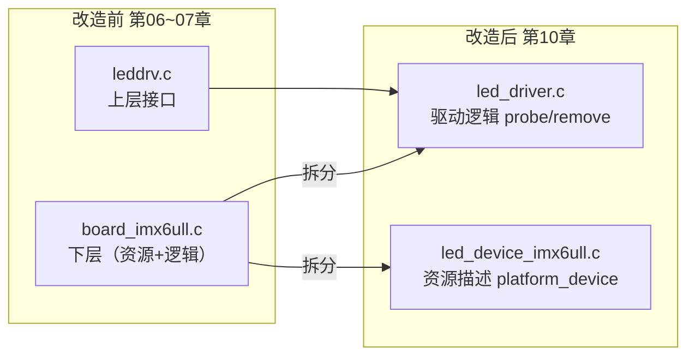
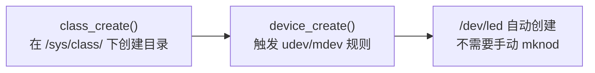

# 10 LED 驱动改造为总线模型

> **一句话总结**：把第06~07章的 LED 驱动改写成 platform_device + platform_driver 格式，实现资源与逻辑彻底分离，并用 class_create/device_create 自动创建 /dev 节点。

**对应 PDF**：第五篇 第10章（第341页）

---

## 前置知识

- 第09章：总线设备驱动模型原理
- 第06~07章：LED 分层驱动

---

## 1. 改造目标



---

## 2. device 文件（只描述资源，不写逻辑）

```c
/* led_device_100ask_imx6ull.c */
#include <linux/module.h>
#include <linux/platform_device.h>

/* 定义 LED 硬件资源 */
static struct resource led_resources[] = {
    /* 资源0：GPIO5_DR 寄存器地址 */
    [0] = {
        .start = 0x020AC000,    // GPIO5_DR 物理地址
        .end   = 0x020AC000 + 8 - 1,
        .flags = IORESOURCE_MEM,
    },
    /* 资源1：LED 对应的 GPIO 引脚号 */
    [1] = {
        .start = 3,             // GPIO5_IO03 → bit3
        .end   = 3,
        .flags = IORESOURCE_IRQ,  // 借用 IRQ 类型传递引脚号
    },
};

static void led_pdev_release(struct device *dev) {}   // 必须提供

static struct platform_device led_pdev = {
    .name          = "100ask_led",    // 与 driver 名字必须一致
    .id            = -1,
    .num_resources = ARRAY_SIZE(led_resources),
    .resource      = led_resources,
    .dev = {
        .release = led_pdev_release,
    },
};

static int __init led_dev_init(void)
{
    platform_device_register(&led_pdev);
    return 0;
}

static void __exit led_dev_exit(void)
{
    platform_device_unregister(&led_pdev);
}

module_init(led_dev_init);
module_exit(led_dev_exit);
MODULE_LICENSE("GPL");
```

---

## 3. driver 文件（只写逻辑，从资源中读取参数）

```c
/* led_driver.c */
#include <linux/module.h>
#include <linux/platform_device.h>
#include <linux/fs.h>
#include <linux/device.h>
#include <linux/io.h>
#include <linux/uaccess.h>

static int major;
static struct class  *led_class;
static struct device *led_device;

static volatile unsigned int *gpio5_dr;
static int led_pin;   // 从 resource 读到的引脚号

/* ===== file_operations ===== */

static ssize_t led_write(struct file *file, const char __user *buf,
                          size_t count, loff_t *ppos)
{
    char val;
    copy_from_user(&val, buf, 1);

    if (val == '1')
        *gpio5_dr &= ~(1 << led_pin);   // 低电平点亮
    else
        *gpio5_dr |=  (1 << led_pin);   // 高电平熄灭
    return 1;
}

static const struct file_operations led_fops = {
    .owner = THIS_MODULE,
    .write = led_write,
};

/* ===== probe：配对成功时由总线调用 ===== */

static int led_probe(struct platform_device *pdev)
{
    struct resource *res_mem, *res_pin;

    /* 获取寄存器资源 */
    res_mem = platform_get_resource(pdev, IORESOURCE_MEM, 0);
    gpio5_dr = ioremap(res_mem->start, resource_size(res_mem));

    /* 获取引脚号 */
    res_pin = platform_get_resource(pdev, IORESOURCE_IRQ, 0);
    led_pin = res_pin->start;

    /* 初始化 GPIO 方向为输出（这里简化，实际需配置CCM/IOMUXC） */
    /* ... */

    /* 注册字符设备 */
    major = register_chrdev(0, "led", &led_fops);

    /* 自动创建 /dev/led（不需要手动 mknod） */
    led_class  = class_create(THIS_MODULE, "led_class");
    led_device = device_create(led_class, NULL, MKDEV(major, 0),
                               NULL, "led");

    printk("led_probe: GPIO addr=%pa pin=%d\n", &res_mem->start, led_pin);
    return 0;
}

/* ===== remove：设备移除时由总线调用 ===== */

static int led_remove(struct platform_device *pdev)
{
    device_destroy(led_class, MKDEV(major, 0));
    class_destroy(led_class);
    unregister_chrdev(major, "led");
    iounmap((void *)gpio5_dr);
    return 0;
}

static struct platform_driver led_pdrv = {
    .probe  = led_probe,
    .remove = led_remove,
    .driver = {
        .name  = "100ask_led",    // 必须与 device.name 一致
        .owner = THIS_MODULE,
    },
};

module_init_platform_driver(led_pdrv);  // 等价于 platform_driver_register
MODULE_LICENSE("GPL");
```

---

## 4. class_create / device_create 的作用



| 函数 | 作用 |
|------|------|
| `class_create(THIS_MODULE, "led_class")` | 创建 `/sys/class/led_class/` |
| `device_create(class, NULL, devno, NULL, "led")` | 创建 `/sys/class/led_class/led`，udev 看到后自动建 `/dev/led` |
| `device_destroy(class, devno)` | 删除 sysfs 节点，udev 自动删除 `/dev/led` |
| `class_destroy(class)` | 删除 class 目录 |

---

## 5. 上机步骤

```bash
# 加载（顺序无关，总线自动配对）
insmod led_device_100ask_imx6ull.ko
insmod led_driver.ko

# 验证自动创建了 /dev/led
ls -la /dev/led

# 测试
echo 1 > /dev/led    # 点亮
echo 0 > /dev/led    # 熄灭

# 查看 sysfs
ls /sys/class/led_class/
ls /sys/bus/platform/devices/

# 卸载（顺序无关）
rmmod led_driver
rmmod led_device_100ask_imx6ull
```

---

## 6. 改造效果对比

| 场景 | 第06~07章 | 第10章（platform 模型） |
|------|-----------|------------------------|
| 换 GPIO 引脚 | 修改 board_xxx.c 重新编译 | 修改 led_device.c 的 resource，只重新编译 device 模块 |
| /dev 节点创建 | 手动 mknod | device_create 自动创建 |
| 同一驱动多个设备 | 需要修改代码 | 注册多个 platform_device（id 不同） |

---

## 小结

platform 模型改造的核心动作：① device 文件用 `resource` 描述硬件参数；② driver 文件用 `platform_get_resource` 读取参数；③ `class_create + device_create` 替代手动 `mknod`。下一步（第11章）用设备树进一步把 device 文件也省掉。

示例代码参考：[Document/driver_examples/IMX6ULL/source/07_GPIO/](../Document/driver_examples/IMX6ULL/source/07_GPIO/)
