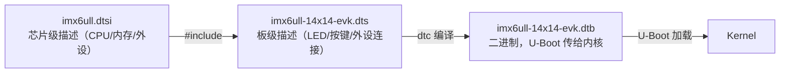
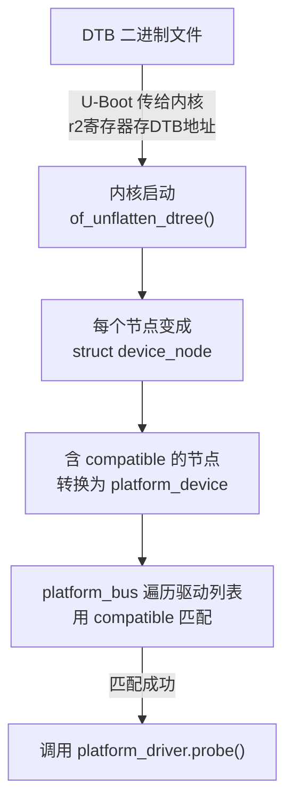

# 11 设备树引入与语法

> **一句话总结**：设备树（Device Tree）用一份文本文件描述板子上有哪些硬件，替代了第10章的 platform_device C 代码——换板子只需换一个 DTB 文件，驱动不动。

**对应 PDF**：第五篇 第11章（第346页）

---

## 前置知识

- 第09~10章：platform_device/platform_driver 模型
- 基本的文本格式（类似 JSON 的嵌套结构）

---

## 1. 设备树解决的问题

**第10章还存在的问题**：硬件资源描述（platform_device）仍然是 C 代码，每块板子编译一个不同的内核镜像。

```
ARM Linux 3.x 之前：
  板子A → 内核A（包含板A的所有硬件描述C代码）
  板子B → 内核B（包含板B的所有硬件描述C代码）
  → Linux 内核里充斥了大量 board_xxx.c，Linus Torvalds 表示不满

ARM Linux 3.x 之后（设备树方案）：
  通用内核 + 板子A的 DTB 文件 → 运行在板子A
  通用内核 + 板子B的 DTB 文件 → 运行在板子B
```

> **类比**：之前是"每家饭店有自己的厨师+菜谱（捆绑）"，现在是"厨师通用，菜谱单独一本书（分离）"。设备树就是那本"菜谱书"。

---

## 2. 设备树文件类型

| 文件类型 | 说明 |
|---------|------|
| `.dts` | Device Tree Source，人类可读的源文件 |
| `.dtsi` | 可被多个 dts 共享的头文件（芯片级公共描述） |
| `.dtb` | Device Tree Blob，编译后的二进制（内核真正用的） |



---

## 3. DTS 语法详解

### 3.1 基本结构

```dts
/dts-v1/;         /* 声明版本 */

/ {               /* 根节点，整棵树的起点 */
    model = "100ASK IMX6ULL Pro";   /* 板子描述 */
    compatible = "100ask,imx6ull-14x14-evk", "fsl,imx6ull";

    /* 告诉内核：地址用1个32位数，长度用1个32位数 */
    #address-cells = <1>;
    #size-cells = <1>;

    cpus {          /* 子节点 */
        cpu0: cpu@0 {
            compatible = "arm,cortex-a7";
            /* ... */
        };
    };

    memory@80000000 {
        reg = <0x80000000 0x20000000>;  /* 起始地址 + 大小 */
    };

    /* 自定义节点：描述 LED */
    myled {
        compatible = "100ask,leddrv";   /* 用于匹配驱动 */
        led-gpios = <&gpio5 3 GPIO_ACTIVE_LOW>;
        status = "okay";
    };
};
```

### 3.2 常用属性

| 属性 | 作用 | 示例 |
|------|------|------|
| `compatible` | 匹配驱动的字符串 | `"100ask,leddrv"` |
| `reg` | 寄存器地址和大小 | `<0x020AC000 0x4>` |
| `#address-cells` | 子节点地址占几个32位 | `<1>` |
| `#size-cells` | 子节点长度占几个32位 | `<1>` |
| `status` | 是否使能 | `"okay"` / `"disabled"` |
| `interrupts` | 中断号 | `<0 66 IRQ_TYPE_EDGE_BOTH>` |

### 3.3 节点标签（label）和引用（phandle）

```dts
/* 给节点打标签 */
gpio5: gpio@020ac000 {
    compatible = "fsl,imx6ul-gpio";
    reg = <0x020ac000 0x4000>;
};

/* 在其他节点中引用 */
myled {
    led-gpios = <&gpio5 3 GPIO_ACTIVE_LOW>;
    /*           ↑     ↑  ↑
                标签  引脚 极性 */
};
```

---

## 4. 内核如何处理设备树



---

## 5. device_node 关键数据结构

```c
struct device_node {
    const char  *name;          // 节点名称
    const char  *type;          // device_type 属性
    phandle      phandle;       // 节点唯一ID
    struct property *properties; // 属性链表
    struct device_node *parent;
    struct device_node *child;
    struct device_node *sibling;
};

struct property {
    char    *name;      // 属性名（如 "compatible"）
    int      length;    // 属性值字节长度
    void    *value;     // 属性值
    struct property *next;
};
```

---

## 6. platform_device 与 platform_driver 通过 compatible 匹配

```dts
/* 设备树节点 */
myled {
    compatible = "100ask,leddrv";   /* ← 关键 */
};
```

```c
/* 驱动代码中 */
static const struct of_device_id led_of_match[] = {
    { .compatible = "100ask,leddrv" },   /* ← 必须一致 */
    { /* 结束标记 */ }
};

static struct platform_driver led_pdrv = {
    .probe  = led_probe,
    .driver = {
        .name           = "led",
        .of_match_table = led_of_match,   /* ← 使用设备树匹配 */
    },
};
```

---

## 7. 内核中读取设备树属性的 API

```c
/* 在 probe() 函数中 */
struct device_node *np = pdev->dev.of_node;  // 获取设备树节点

/* 读取字符串属性 */
const char *str;
of_property_read_string(np, "model", &str);

/* 读取整数属性 */
u32 val;
of_property_read_u32(np, "clock-frequency", &val);

/* 读取 GPIO */
struct gpio_desc *gpiod;
gpiod = devm_gpiod_get(&pdev->dev, "led", GPIOD_OUT_LOW);

/* 读取 reg（内存地址）→ ioremap */
struct resource *res = platform_get_resource(pdev, IORESOURCE_MEM, 0);
void __iomem *base = devm_ioremap_resource(&pdev->dev, res);
```

---

## 8. platform_device 没有节点如何使用

对于 `status = "disabled"` 或者没有 `compatible` 的节点，不会自动转为 platform_device，可以手动用 `of_find_node_by_name()` 等函数读取：

```c
struct device_node *np = of_find_node_by_name(NULL, "myled");
if (np) {
    /* 读取属性... */
    of_node_put(np);  // 用完释放引用
}
```

---

## 9. 如何修改和编译设备树

```bash
# 设备树源文件位置
# /home/mosyu/linux_proj/source/kernel/arch/arm/boot/dts/

# 编译单个 DTB
cd /home/mosyu/linux_proj/source/kernel
make ARCH=arm CROSS_COMPILE=arm-linux-gnueabihf- \
     imx6ull-14x14-evk.dtb

# 产出位置
# arch/arm/boot/dts/imx6ull-14x14-evk.dtb

# 通过 TFTP 更新开发板设备树
cp arch/arm/boot/dts/imx6ull-14x14-evk.dtb /home/mosyu/linux_proj/tftpboot/
# 开发板重启，U-Boot 会自动下载新 DTB
```

---

## 小结

设备树 = 用文本文件描述硬件，替代 platform_device C 代码。流程：**DTS 源文件** →（dtc 编译）→ **DTB 二进制** →（U-Boot 加载）→ **内核解析为 device_node** →（转换）→ **platform_device** →（compatible 匹配）→ **platform_driver.probe()**。

- 内核 of 子系统参考：[source/kernel/drivers/of/](../source/kernel/drivers/of/)
- 板级 DTS 文件：[source/kernel/arch/arm/boot/dts/](../source/kernel/arch/arm/boot/dts/)
