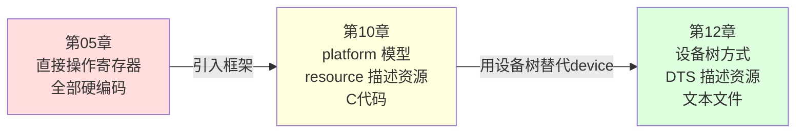

# 12 LED 驱动设备树改造

> **一句话总结**：把第10章的 platform_device C 代码全部删掉，改成一段 DTS 节点描述——驱动代码通过 `of_get_named_gpio` 从设备树读取 GPIO 信息，实现三种写法的最终版。

**对应 PDF**：第五篇 第12章（第367页）

---

## 前置知识

- 第11章：设备树语法和 compatible 匹配机制
- 第10章：platform 模型的 probe/remove

---

## 1. 三种驱动写法演进路线



---

## 2. 第一步：在 DTS 中添加 LED 节点

修改板级 DTS 文件（如 `imx6ull-14x14-evk.dts`）：

```dts
/* 在根节点或合适位置添加 */
myled {
    compatible = "100ask,leddrv";           /* 匹配驱动的字符串 */
    led-gpios = <&gpio5 3 GPIO_ACTIVE_LOW>; /* GPIO5 第3脚，低电平有效 */
    pinctrl-names = "default";
    pinctrl-0 = <&pinctrl_led>;             /* 引用引脚复用配置 */
    status = "okay";
};

/* 在 iomuxc_snvs 节点中添加引脚配置 */
&iomuxc_snvs {
    pinctrl_led: ledgrp {
        fsl,pins = <
            MX6ULL_PAD_SNVS_TAMPER3__GPIO5_IO03  0x10B0
        >;
    };
};
```

---

## 3. 第二步：驱动用 of_get_named_gpio 读取 GPIO

```c
/* led_driver_dt.c —— 设备树版本 */
#include <linux/module.h>
#include <linux/platform_device.h>
#include <linux/of_gpio.h>    // of_get_named_gpio
#include <linux/gpio.h>
#include <linux/fs.h>
#include <linux/device.h>
#include <linux/uaccess.h>

static int led_gpio;          // 从设备树读到的 GPIO 号
static int major;
static struct class  *led_class;

static ssize_t led_write(struct file *file, const char __user *buf,
                          size_t count, loff_t *ppos)
{
    char val;
    copy_from_user(&val, buf, 1);
    /* gpio_set_value 封装了底层寄存器操作 */
    gpio_set_value(led_gpio, val == '1' ? 0 : 1);  // 低电平点亮
    return 1;
}

static const struct file_operations led_fops = {
    .owner = THIS_MODULE,
    .write = led_write,
};

static int led_probe(struct platform_device *pdev)
{
    /* 从设备树节点读取 GPIO 信息 */
    led_gpio = of_get_named_gpio(pdev->dev.of_node, "led-gpios", 0);
    if (led_gpio < 0) {
        dev_err(&pdev->dev, "Failed to get led-gpios\n");
        return led_gpio;
    }

    /* 申请 GPIO 资源并设置为输出 */
    gpio_request(led_gpio, "led");
    gpio_direction_output(led_gpio, 1);  // 初始高电平（熄灭）

    /* 注册字符设备 + 自动创建 /dev/led */
    major = register_chrdev(0, "led", &led_fops);
    led_class = class_create(THIS_MODULE, "led_class");
    device_create(led_class, NULL, MKDEV(major, 0), NULL, "led");

    dev_info(&pdev->dev, "LED probe OK, gpio=%d\n", led_gpio);
    return 0;
}

static int led_remove(struct platform_device *pdev)
{
    device_destroy(led_class, MKDEV(major, 0));
    class_destroy(led_class);
    unregister_chrdev(major, "led");
    gpio_free(led_gpio);
    return 0;
}

/* 设备树匹配表 */
static const struct of_device_id led_of_match[] = {
    { .compatible = "100ask,leddrv" },   /* 与 DTS 中 compatible 一致 */
    { },
};
MODULE_DEVICE_TABLE(of, led_of_match);

static struct platform_driver led_pdrv = {
    .probe  = led_probe,
    .remove = led_remove,
    .driver = {
        .name           = "led",
        .of_match_table = led_of_match,
    },
};

module_platform_driver(led_pdrv);    /* 替代 module_init/module_exit */
MODULE_LICENSE("GPL");
```

---

## 4. 三种写法总结对比

| 对比项 | 第05章（直接操作寄存器） | 第10章（platform 模型） | 第12章（设备树） |
|--------|------------------------|------------------------|-----------------|
| 硬件信息在哪 | 驱动 C 代码里硬编码 | platform_device 结构体 | DTS 文件 |
| 换板子需改什么 | 改驱动源码，重新编译全部 | 只换 device.ko | 只换 DTB 文件，驱动不重编 |
| /dev 节点 | 手动 mknod | class_create 自动 | class_create 自动 |
| GPIO 获取方式 | 直接 ioremap 固定地址 | platform_get_resource | of_get_named_gpio |
| 推荐程度 | 学习用 | 过渡理解 | ✅ 生产标准 |

---

## 5. 上机实验步骤

```bash
# 1. 修改 DTS，添加 myled 节点
vim /home/mosyu/linux_proj/source/kernel/arch/arm/boot/dts/imx6ull-14x14-evk.dts

# 2. 重新编译 DTB
cd /home/mosyu/linux_proj/source/kernel
make ARCH=arm CROSS_COMPILE=arm-linux-gnueabihf- imx6ull-14x14-evk.dtb

# 3. 更新开发板 DTB（通过 TFTP 或 ADB）
cp arch/arm/boot/dts/imx6ull-14x14-evk.dtb /home/mosyu/linux_proj/tftpboot/
# 开发板重启加载新 DTB

# 4. 编译并加载驱动（只需一个 .ko）
make
adb push led_driver_dt.ko /tmp/
adb shell "insmod /tmp/led_driver_dt.ko"

# 5. 测试
adb shell "echo 1 > /dev/led"   # 点亮
adb shell "echo 0 > /dev/led"   # 熄灭

# 6. 调试：查看设备树是否正常解析
adb shell "ls /sys/bus/platform/devices/ | grep led"
adb shell "cat /sys/bus/platform/devices/myled/uevent"
```

---

## 6. 调试技巧

```bash
# 查看内核日志
dmesg | grep led

# 查看运行时设备树（内核解析结果）
# 每个节点对应 /sys/firmware/devicetree/base/ 下的目录
ls /sys/firmware/devicetree/base/myled/
cat /sys/firmware/devicetree/base/myled/compatible

# 查看 platform 设备是否注册成功
ls /sys/bus/platform/devices/

# 查看驱动是否绑定
ls /sys/bus/platform/drivers/led/
```

---

## 小结

设备树版本是 Linux 驱动开发的主流写法：**DTS 节点描述硬件** → **compatible 触发匹配** → **probe 用 of_xxx API 读取资源** → **gpio_request/gpio_direction/gpio_set_value 操作 GPIO**。从第05章到第12章是驱动架构的完整演进，理解了这条线，内核里任何驱动代码都能看懂其结构。

示例代码参考：[Document/driver_examples/IMX6ULL/source/07_GPIO/](../Document/driver_examples/IMX6ULL/source/07_GPIO/)
