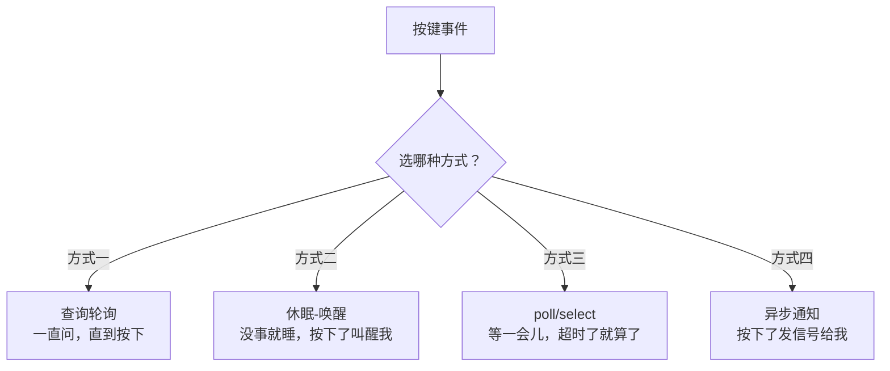
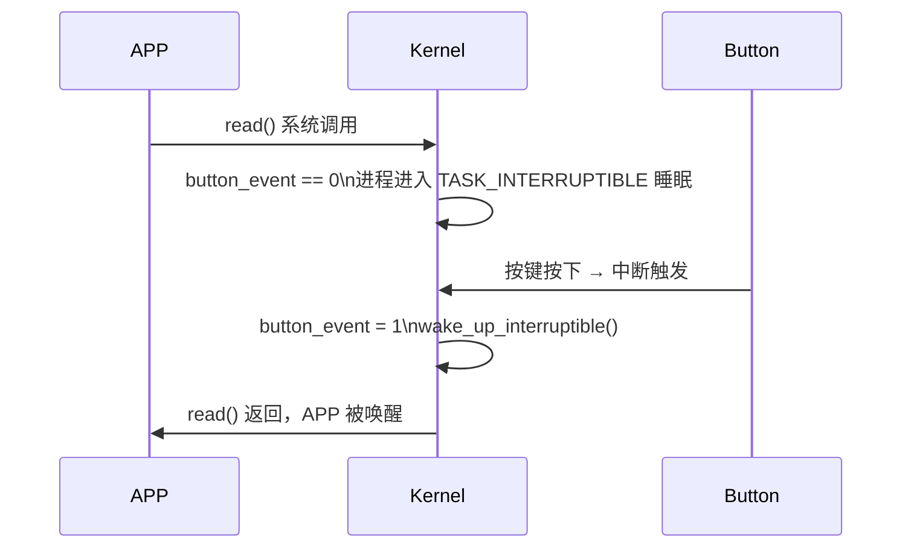

# 13 APP 读取按键的四种方法

> **一句话总结**：同一个"等按键按下"的需求，有四种实现方式——从最简单但最耗 CPU 的轮询，到最优雅的异步通知，理解每种方式的原理和取舍。

**对应 PDF**：第五篇 第13章（第372页）

---

## 前置知识

- Linux 文件 IO（open/read/write/close）
- 基本的进程/线程概念

---

## 1. 问题背景：怎么知道按键被按下了？

想象一个场景：你写了一个 APP，要在用户按下按键后做某件事。最直觉的方法是一直问驱动"按键按下了吗？"——但这样 CPU 就被占满了。有没有更好的方法？



---

## 2. 方式一：查询轮询（最简单，最废 CPU）

**原理**：APP 不停地 read，驱动直接返回当前按键状态（0 或 1）。

```c
/* APP 代码 */
int fd = open("/dev/button", O_RDONLY);
char val;

while (1) {
    read(fd, &val, 1);       // 立即返回，不阻塞
    if (val == '1') {
        printf("Button pressed!\n");
        do_something();
    }
    usleep(10000);           // 轮询间隔 10ms（不加这行CPU占用100%）
}
```

**优缺点**：

| 优点 | 缺点 |
|------|------|
| 实现简单 | CPU 大量浪费在轮询上 |
| 响应及时 | 轮询间隔越小，响应越快，CPU 越累 |

---

## 3. 方式二：休眠-唤醒（推荐！接近理想）

**原理**：APP 调用 `read` 后**阻塞休眠**，驱动里没有数据时让进程睡着；按键触发中断后，驱动把进程唤醒，`read` 才返回。

```c
/* APP 代码（简洁很多）*/
int fd = open("/dev/button", O_RDONLY);  // 默认阻塞模式
char val;

while (1) {
    read(fd, &val, 1);    // 阻塞！直到有按键事件才返回
    printf("Button: %c\n", val);
    do_something();
}
```

**驱动端需要用等待队列（wait_queue）实现**：

```c
/* 驱动端伪代码 */
static DECLARE_WAIT_QUEUE_HEAD(button_wq);  // 等待队列头
static int button_event = 0;                 // 事件标志

/* 中断处理函数：按键触发时调用 */
static irqreturn_t button_irq(int irq, void *dev)
{
    button_event = 1;
    wake_up_interruptible(&button_wq);   // 唤醒等待的进程
    return IRQ_HANDLED;
}

/* read 函数：没有事件就阻塞 */
static ssize_t button_read(struct file *file, char __user *buf,
                             size_t count, loff_t *ppos)
{
    /* 条件不满足就休眠，满足后继续 */
    wait_event_interruptible(button_wq, button_event != 0);
    button_event = 0;   // 清除事件标志

    char val = '1';
    copy_to_user(buf, &val, 1);
    return 1;
}
```

**APP 在 `read` 时的状态变化**：



---

## 4. 方式三：poll/select（可以设置超时）

**原理**：APP 用 `poll` 或 `select` 系统调用，同时监听多个文件描述符，设置超时时间。超时内有事件就处理，超时了就继续做其他事。

```c
/* APP 代码 */
#include <poll.h>

int fd = open("/dev/button", O_RDONLY | O_NONBLOCK);
struct pollfd fds[1];
fds[0].fd     = fd;
fds[0].events = POLLIN;   // 监听可读事件

while (1) {
    int ret = poll(fds, 1, 5000);   // 最多等 5000ms

    if (ret == 0) {
        printf("Timeout, no button press\n");
        continue;
    }

    if (fds[0].revents & POLLIN) {
        char val;
        read(fd, &val, 1);
        printf("Button: %c\n", val);
    }
}
```

**驱动端需要实现 `.poll` 接口**：

```c
static unsigned int button_poll(struct file *file, poll_table *wait)
{
    poll_wait(file, &button_wq, wait);   // 把等待队列注册到 poll 机制

    if (button_event)
        return POLLIN | POLLRDNORM;      // 有数据可读
    return 0;                            // 暂时没数据
}
```

---

## 5. 方式四：异步通知（信号机制）

**原理**：APP 注册一个信号处理函数，告诉驱动"数据来了发 SIGIO 给我"，然后 APP 继续干自己的事，按键发生时内核自动打断 APP 执行信号处理函数。

```c
/* APP 代码 */
#include <signal.h>
#include <fcntl.h>

static void signal_handler(int signo)
{
    char val;
    read(g_fd, &val, 1);
    printf("Button (async): %c\n", val);
}

int main()
{
    g_fd = open("/dev/button", O_RDONLY | O_NONBLOCK);

    /* 1. 注册信号处理函数 */
    signal(SIGIO, signal_handler);

    /* 2. 把自己设为该文件的接收者 */
    fcntl(g_fd, F_SETOWN, getpid());

    /* 3. 开启异步通知 */
    int flags = fcntl(g_fd, F_GETFL);
    fcntl(g_fd, F_SETFL, flags | FASYNC);

    /* APP 继续做其他事，按键触发时自动执行 signal_handler */
    while (1) {
        printf("Doing other work...\n");
        sleep(1);
    }
}
```

**驱动端需要实现 `.fasync` 接口**：

```c
static struct fasync_struct *button_async_queue;

static int button_fasync(int fd, struct file *file, int on)
{
    return fasync_helper(fd, file, on, &button_async_queue);
}

/* 中断处理函数中发送信号 */
static irqreturn_t button_irq(int irq, void *dev)
{
    button_event = 1;
    kill_fasync(&button_async_queue, SIGIO, POLL_IN);  // 发 SIGIO 信号
    return IRQ_HANDLED;
}
```

---

## 6. 四种方式对比总结

| 方式 | CPU占用 | 响应延迟 | 实现复杂度 | 适用场景 |
|------|---------|----------|-----------|----------|
| 查询轮询 | 高（100%） | 低（轮询间隔） | 最简单 | 学习/简单原型 |
| 休眠-唤醒 | 低（睡眠） | 极低（中断驱动） | 中等 | 大多数场景 |
| poll/select | 低 | 低 | 中等 | 需要同时监听多个设备 |
| 异步通知 | 最低 | 低 | 较复杂 | 事件驱动架构 |

> **类比**：
> - 查询 = 一直刷快递单
> - 休眠-唤醒 = 躺着等快递员按门铃
> - poll = 设个闹钟，到点没来就起床（但最多等到下午6点）
> - 异步通知 = 让快递员打电话给你（你还在干其他事）

---

## 小结

四种方式是**驱动机制**（wait_queue、poll、fasync）在应用层的体现。后续第14~15章实现查询方式，第19章详细实现休眠-唤醒、poll 和异步通知的驱动端代码。
