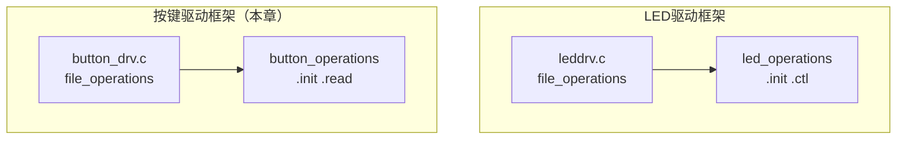
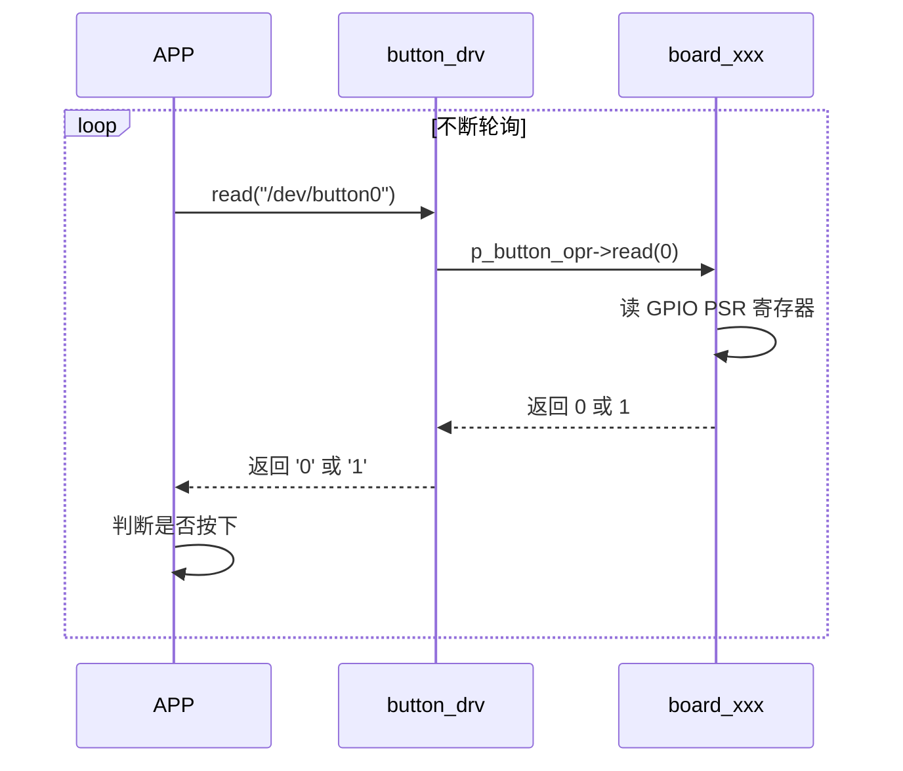

# 14 查询方式按键驱动框架

> **一句话总结**：照着 LED 驱动的分层框架，给按键也建一套——`button_operations` 接口 + 上层 `button_drv.c` + 下层板级实现，read 返回当前按键状态。

**对应 PDF**：第五篇 第14章（第377页）

---

## 前置知识

- 第06~07章：LED 分层驱动框架（本章结构完全对称）
- 第13章：查询方式是"APP 不断 read，驱动立即返回状态"

---

## 1. 框架设计（对比 LED 驱动）



**区别**：LED 的接口是 `.ctl()`（控制），按键的接口是 `.read()`（读取状态）。

---

## 2. button_operations 抽象接口

```c
/* button_operations.h */
struct button_operations {
    int  count;               // 这块板子有几个按键
    int  (*init)(int which);  // 初始化第 which 个按键
    int  (*read)(int which);  // 读取第 which 个按键（返回 0=松开 1=按下）
};

/* 注册和获取 */
void   register_button_operations(struct button_operations *opr);
struct button_operations *get_button_operations(void);
```

---

## 3. 上层文件：button_drv.c

```c
/* button_drv.c —— 与硬件无关，只和 APP 打交道 */
#include <linux/module.h>
#include <linux/kernel.h>
#include <linux/fs.h>
#include <linux/uaccess.h>
#include <linux/device.h>
#include "button_operations.h"

static int major;
static struct class *button_class;
static struct button_operations *p_button_opr;  // 指向板级实现

static int button_open(struct inode *inode, struct file *file)
{
    int which = iminor(inode);    // 次设备号 = 第几个按键

    if (!p_button_opr || which >= p_button_opr->count)
        return -ENODEV;

    p_button_opr->init(which);   // 调用下层初始化
    return 0;
}

static ssize_t button_read(struct file *file, char __user *buf,
                            size_t count, loff_t *ppos)
{
    int which = iminor(file_inode(file));
    int val;
    char kval;

    val  = p_button_opr->read(which);   // 调用下层读取按键状态
    kval = (val == 1) ? '1' : '0';

    if (copy_to_user(buf, &kval, 1))
        return -EFAULT;

    return 1;
}

static const struct file_operations button_fops = {
    .owner = THIS_MODULE,
    .open  = button_open,
    .read  = button_read,
};

/* 供下层调用：注册板级操作集 */
void register_button_operations(struct button_operations *opr)
{
    int i;
    p_button_opr = opr;

    /* 为每个按键创建设备节点（/dev/button0, /dev/button1...） */
    major = register_chrdev(0, "button", &button_fops);
    button_class = class_create(THIS_MODULE, "button_class");

    for (i = 0; i < opr->count; i++) {
        device_create(button_class, NULL, MKDEV(major, i),
                      NULL, "button%d", i);
    }
}
EXPORT_SYMBOL(register_button_operations);

struct button_operations *get_button_operations(void)
{
    return p_button_opr;
}
EXPORT_SYMBOL(get_button_operations);

static void __exit button_drv_exit(void)
{
    int i;
    if (p_button_opr) {
        for (i = 0; i < p_button_opr->count; i++)
            device_destroy(button_class, MKDEV(major, i));
    }
    class_destroy(button_class);
    unregister_chrdev(major, "button");
}
module_exit(button_drv_exit);
MODULE_LICENSE("GPL");
```

---

## 4. 查询方式：read 立即返回

本章是**查询**方式，`button_read` 调用 `p_button_opr->read()` 后立即返回当前引脚状态，不阻塞：



---

## 5. 配套测试 APP（查询方式）

```c
/* button_test.c */
#include <stdio.h>
#include <fcntl.h>
#include <unistd.h>

int main(int argc, char *argv[])
{
    int fd;
    char val;
    char last = '0';

    if (argc != 2) {
        printf("Usage: %s /dev/button0\n", argv[0]);
        return 1;
    }

    fd = open(argv[1], O_RDONLY | O_NONBLOCK);  // 非阻塞模式
    if (fd < 0) { perror("open"); return 1; }

    while (1) {
        read(fd, &val, 1);

        if (val != last) {             // 状态发生变化才打印
            last = val;
            printf("Button: %s\n", val == '1' ? "PRESSED" : "RELEASED");
        }

        usleep(20000);                 // 20ms 轮询一次
    }
}
```

---

## 6. 文件结构

```
按键驱动目录/
├── button_operations.h     # 接口定义（共享）
├── button_drv.c            # 上层：与 APP 交互
├── board_100ask_imx6ull.c  # 下层：IMX6ULL 硬件实现（见第15章）
├── button_test.c           # 测试 APP
└── Makefile
```

```makefile
# Makefile
obj-m += button_drv.o board_100ask_imx6ull.o
```

---

## 小结

按键驱动框架与 LED 驱动框架完全对称，只是接口方向相反（LED 是写/控制，按键是读/查询）。上层 `button_drv.c` 不涉及任何硬件细节，下层板级文件只负责读取 GPIO 状态——第15章填充下层实现。

查询方式的缺陷（CPU 占用高）会在第17~18章引入中断解决，第19章引入 wait_queue 实现真正的休眠-唤醒。
