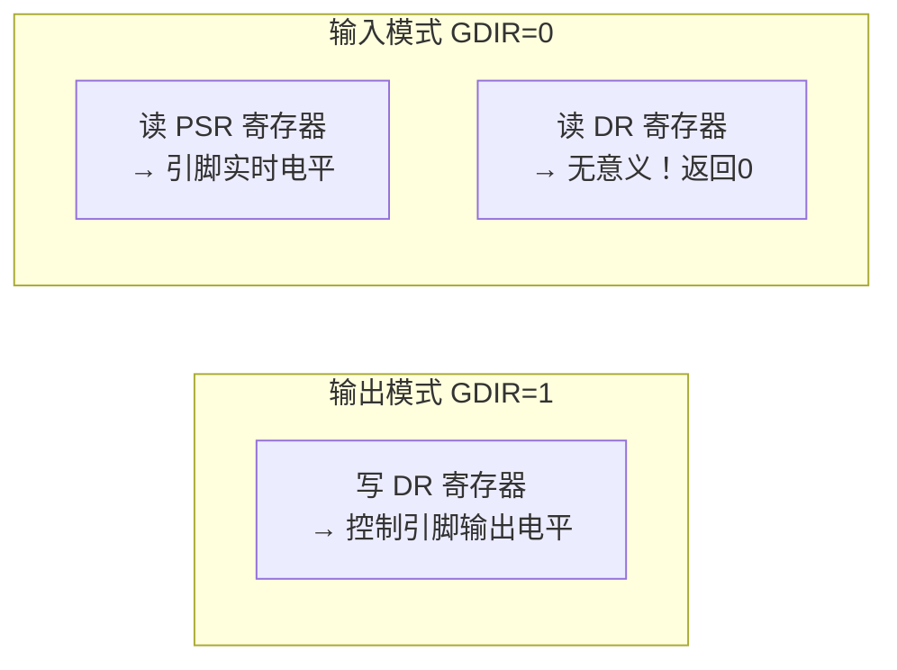

# 15 具体单板按键驱动实现（查询方式）

> **一句话总结**：实现第14章框架的下层——用 IMX6ULL 的 GPIO4_IO14 和 GPIO5_IO01 两个按键，通过读 PSR 寄存器获取实时引脚状态。

**对应 PDF**：第五篇 第15章（第382页）

---

## 前置知识

- 第14章：按键驱动框架（button_operations 接口）
- 第03~04章：GPIO 寄存器操作（PSR = 输入时读引脚状态）

---

## 1. 100ASK IMX6ULL 按键硬件信息

| 按键 | GPIO 引脚 | 对应物理名 | 按下时电平 |
|------|-----------|-----------|-----------|
| KEY1 | GPIO4_IO14 | NAND_CE1_B | 低电平（按下接 GND） |
| KEY2 | GPIO5_IO01 | SNVS_TAMPER1 | 低电平 |

> **电路原理**：按键一端接 GPIO，一端接 GND；同时通过上拉电阻接 VCC。
> - 未按下：GPIO 引脚通过上拉电阻接 VCC → PSR 读到 1（高电平）
> - 按下：GPIO 引脚直接接 GND → PSR 读到 0（低电平）

---

## 2. 寄存器地址

```
GPIO4：基地址 0x020A8000
  GPIO4_GDIR:  0x020A8004  （方向：0=输入）
  GPIO4_PSR:   0x020A8008  （引脚实时状态）

GPIO5：基地址 0x020AC000
  GPIO5_GDIR:  0x020AC004
  GPIO5_PSR:   0x020AC008

CCM（时钟）：
  CCM_CCGR3:   0x020C4074  bit[13:12] 控制 GPIO4 时钟
  CCM_CCGR1:   0x020C406C  bit[29:28] 控制 GPIO5 时钟

IOMUXC（引脚复用）：
  NAND_CE1_B:    0x020E01B0  → 写 5 选 GPIO4_IO14
  SNVS_TAMPER1:  0x02290008  → 写 5 选 GPIO5_IO01
```

---

## 3. 完整下层实现

```c
/* board_100ask_imx6ull_button.c */
#include <linux/module.h>
#include <linux/io.h>
#include "button_operations.h"

/* 每个按键的硬件信息（结构化管理） */
struct gpio_key_info {
    volatile unsigned int *gpio_psr;   // PSR 寄存器虚拟地址
    int pin;                           // 引脚号（bit 位置）
};

static struct gpio_key_info key_info[2];  // 两个按键

/* 按键 GPIO 配置信息 */
#define CCM_CCGR3      0x020C4074
#define CCM_CCGR1      0x020C406C
#define IOMUX_KEY1     0x020E01B0   // NAND_CE1_B
#define IOMUX_KEY2     0x02290008   // SNVS_TAMPER1
#define GPIO4_GDIR     0x020A8004
#define GPIO4_PSR      0x020A8008
#define GPIO5_GDIR     0x020AC004
#define GPIO5_PSR      0x020AC008

static volatile unsigned int *ccm_ccgr3;
static volatile unsigned int *ccm_ccgr1;
static volatile unsigned int *gpio4_gdir;
static volatile unsigned int *gpio5_gdir;

static int board_button_init(int which)
{
    if (which == 0) {
        /* KEY1：GPIO4_IO14 */
        if (!ccm_ccgr3) {
            ccm_ccgr3  = ioremap(CCM_CCGR3, 4);
            gpio4_gdir = ioremap(GPIO4_GDIR, 4);
            key_info[0].gpio_psr = ioremap(GPIO4_PSR, 4);
            key_info[0].pin      = 14;

            /* 开时钟 */
            *ccm_ccgr3 |= (3 << 12);
            /* 引脚复用为 GPIO4_IO14 */
            volatile unsigned int *mux = ioremap(IOMUX_KEY1, 4);
            *mux = 5;
            iounmap((void *)mux);
            /* 设为输入方向（bit14 = 0） */
            *gpio4_gdir &= ~(1 << 14);
        }
    } else if (which == 1) {
        /* KEY2：GPIO5_IO01 */
        if (!ccm_ccgr1) {
            ccm_ccgr1  = ioremap(CCM_CCGR1, 4);
            gpio5_gdir = ioremap(GPIO5_GDIR, 4);
            key_info[1].gpio_psr = ioremap(GPIO5_PSR, 4);
            key_info[1].pin      = 1;

            /* 开时钟 */
            *ccm_ccgr1 |= (3 << 28);
            /* 引脚复用为 GPIO5_IO01 */
            volatile unsigned int *mux = ioremap(IOMUX_KEY2, 4);
            *mux = 5;
            iounmap((void *)mux);
            /* 设为输入方向（bit1 = 0） */
            *gpio5_gdir &= ~(1 << 1);
        }
    } else {
        return -EINVAL;
    }
    return 0;
}

static int board_button_read(int which)
{
    int val;

    if (which > 1 || !key_info[which].gpio_psr)
        return -EINVAL;

    /* 读 PSR 寄存器中对应 bit */
    val = (*key_info[which].gpio_psr >> key_info[which].pin) & 1;

    /*
     * 按下时 PSR=0（低电平），松开时 PSR=1（高电平）
     * 返回值：1=按下，0=松开（逻辑取反）
     */
    return !val;
}

static struct button_operations board_button_opr = {
    .count = 2,
    .init  = board_button_init,
    .read  = board_button_read,
};

static int __init board_button_init_module(void)
{
    register_button_operations(&board_button_opr);
    return 0;
}

static void __exit board_button_exit(void)
{
    if (ccm_ccgr3)  iounmap((void *)ccm_ccgr3);
    if (ccm_ccgr1)  iounmap((void *)ccm_ccgr1);
    if (gpio4_gdir) iounmap((void *)gpio4_gdir);
    if (gpio5_gdir) iounmap((void *)gpio5_gdir);
    if (key_info[0].gpio_psr) iounmap((void *)key_info[0].gpio_psr);
    if (key_info[1].gpio_psr) iounmap((void *)key_info[1].gpio_psr);
}

module_init(board_button_init_module);
module_exit(board_button_exit);
MODULE_LICENSE("GPL");
```

---

## 4. PSR vs DR：输入时该读哪个寄存器？



> **注意**：输入模式下，读 DR 寄存器得到的是上次写入的值，**不是**引脚实际状态。必须读 **PSR（Pin Status Register）** 才是引脚实时电平。

---

## 5. 上机实验步骤

```bash
# 编译
make

# 加载（先加上层，再加下层，或反之均可）
adb push button_drv.ko /tmp/
adb push board_100ask_imx6ull_button.ko /tmp/
adb push button_test /tmp/

adb shell "insmod /tmp/button_drv.ko"
adb shell "insmod /tmp/board_100ask_imx6ull_button.ko"

# 验证设备节点
adb shell "ls /dev/button*"
# 应看到 /dev/button0  /dev/button1

# 测试
adb shell "/tmp/button_test /dev/button0"
# 按下 KEY1，看输出变化

# 卸载
adb shell "rmmod board_100ask_imx6ull_button"
adb shell "rmmod button_drv"
```

---

## 6. 查询方式的缺陷（引出后续章节）

```bash
# 开发板上观察 CPU 使用率
top

# 运行 button_test 后，CPU 占用明显升高（轮询消耗）
```

**解决方案**：
- 第17~18章：引入**中断机制**，按键按下才触发处理
- 第19章：用 **wait_queue** 实现休眠-唤醒，CPU 不浪费

---

## 小结

下层实现的要点：① 输入模式下读 **PSR** 不是 DR；② 注意电路逻辑（低电平按下→返回值取反）；③ `ioremap` 申请的资源在模块卸载时必须 `iounmap`。这是最后一章纯寄存器操作的实现，之后统一用 GPIO 子系统。

示例代码参考：[Document/driver_examples/IMX6ULL/source/07_GPIO/](../Document/driver_examples/IMX6ULL/source/07_GPIO/)
