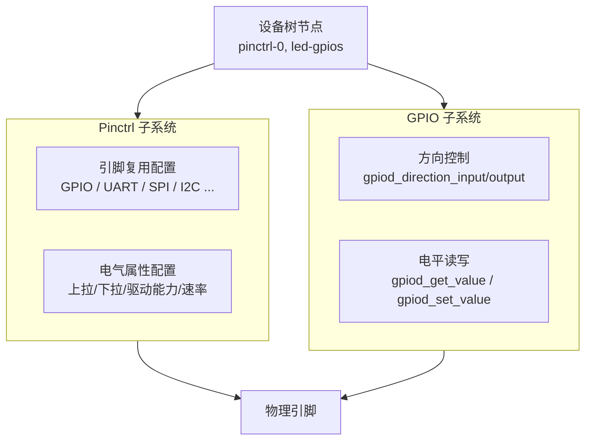
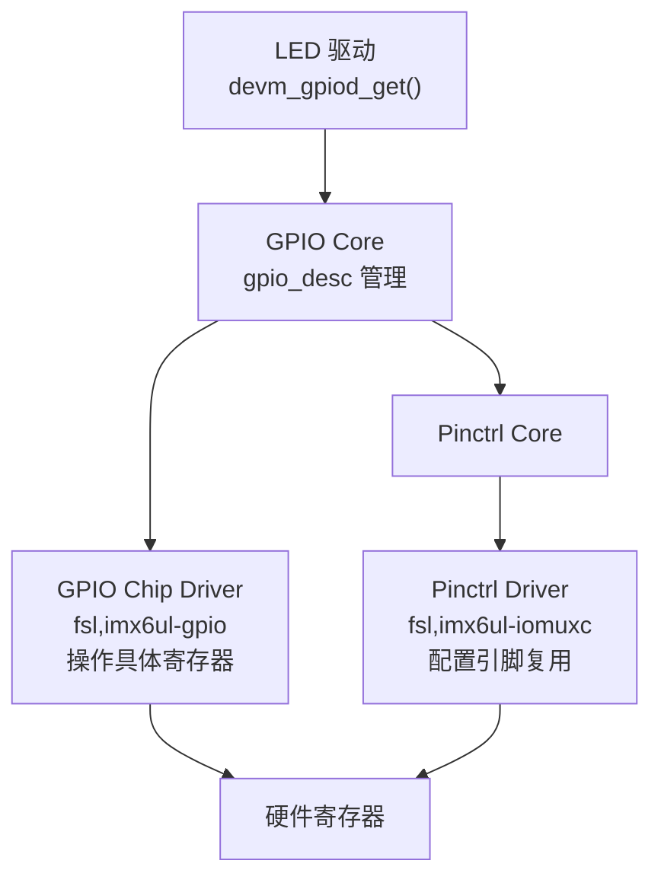

# 16 GPIO 与 Pinctrl 子系统

> **一句话总结**：用内核提供的 GPIO/Pinctrl 子系统替代手写 ioremap 操作寄存器——更安全、可移植，是现代 Linux 驱动的标准写法。

**对应 PDF**：第五篇 第16章（第389页）

---

## 前置知识

- 第11~12章：设备树节点写法
- 第03~04章：直接操作 GPIO 寄存器（理解后者为何要被替换）

---

## 1. 为什么不直接操作寄存器？

| 直接操作寄存器（第05~15章） | 用子系统（本章）|
|---------------------------|-----------------|
| 手动 ioremap 固定地址 | 内核管理，不会地址冲突 |
| 代码绑定具体寄存器 | 代码独立于寄存器地址 |
| 换芯片必须改驱动 | 驱动不变，只换芯片对应的 controller 驱动 |
| 无法统一管理引脚状态 | pinctrl 统一管理，避免冲突 |

> **类比**：之前是"每个驾驶员自己修路、自己导航"，子系统是"有了统一的道路基础设施 + 导航系统，驾驶员只需开车"。

---

## 2. 两个子系统的分工



---

## 3. Pinctrl 子系统：配置引脚复用和电气特性

### 3.1 重要概念

| 概念 | 说明 |
|------|------|
| pin controller | 管理引脚的硬件模块（即 IOMUXC），对应内核驱动 |
| client device | 使用引脚的设备（如 LED 驱动、I2C 驱动） |
| pin state | 引脚的状态集（default / sleep 等） |
| pin group | 一组引脚的配置 |

### 3.2 设备树写法

```dts
/* ① 在 iomuxc 节点中定义引脚配置组 */
&iomuxc_snvs {
    pinctrl_led: ledgrp {
        fsl,pins = <
            /* 引脚宏定义          电气配置值（含上拉/驱动能力等） */
            MX6ULL_PAD_SNVS_TAMPER3__GPIO5_IO03  0x10B0
        >;
        /*
         * 0x10B0 含义（16进制位域）：
         *   bit[16] = 0: 禁用磁滞
         *   bit[15:14] = 00: 100K 下拉
         *   bit[13] = 0: 上拉使能
         *   bit[12] = 1: 使能上拉/下拉
         *   bit[5:3] = 110: 驱动能力 R0/6
         *   bit[1:0] = 00: 速率100MHz
         */
    };
};

/* ② 在设备节点中引用引脚配置 */
myled {
    compatible     = "100ask,leddrv";
    pinctrl-names  = "default";         /* 状态名 */
    pinctrl-0      = <&pinctrl_led>;    /* default 状态用 pinctrl_led 配置 */
    led-gpios      = <&gpio5 3 GPIO_ACTIVE_LOW>;
    status         = "okay";
};
```

### 3.3 内核自动处理

设备的 `pinctrl-0` 属性会在 `probe()` 被调用前**自动被内核应用**，驱动代码里通常不需要手动调用 pinctrl API。

---

## 4. GPIO 子系统：操作引脚输入/输出

### 4.1 基于 descriptor 的新 API（推荐）

```c
/* 在 probe() 中获取 GPIO */
struct gpio_desc *led_gpiod;

/* 从设备树 "led-gpios" 属性获取，初始设为低电平输出 */
led_gpiod = devm_gpiod_get(&pdev->dev, "led", GPIOD_OUT_LOW);
if (IS_ERR(led_gpiod)) {
    dev_err(&pdev->dev, "Failed to get LED GPIO: %ld\n",
            PTR_ERR(led_gpiod));
    return PTR_ERR(led_gpiod);
}

/* 控制 LED（注意：子系统自动处理 ACTIVE_LOW 逻辑！） */
gpiod_set_value(led_gpiod, 1);   /* 点亮（逻辑1 = 激活 = 低电平输出） */
gpiod_set_value(led_gpiod, 0);   /* 熄灭 */

/* devm_xxx 系列：驱动卸载时内核自动释放，不需要手动 gpio_free */
```

> **`GPIOD_OUT_LOW` 中的 `LOW` 是逻辑值还是电平值？**
> 这是初始化时的逻辑值。由于设备树中写了 `GPIO_ACTIVE_LOW`（低电平有效），内核子系统会**自动取反**：逻辑1 → 实际输出低电平（点亮），逻辑0 → 实际输出高电平（熄灭）。驱动代码只需关注逻辑含义，不用关心实际电平！

### 4.2 两套 API 对比

| 旧 API（基于 GPIO 号） | 新 API（基于 descriptor）| 推荐 |
|----------------------|--------------------------|------|
| `gpio_request(num, label)` | `devm_gpiod_get(dev, con_id, flags)` | ✅ 新 |
| `gpio_direction_output(num, val)` | `gpiod_direction_output(desc, val)` | ✅ 新 |
| `gpio_set_value(num, val)` | `gpiod_set_value(desc, val)` | ✅ 新 |
| `gpio_get_value(num)` | `gpiod_get_value(desc)` | ✅ 新 |
| `gpio_free(num)` | 不需要（devm 自动释放） | ✅ 新 |

---

## 5. 完整驱动示例（使用子系统）

```c
/* led_driver_gpiod.c —— 使用 GPIO 子系统 */
#include <linux/module.h>
#include <linux/platform_device.h>
#include <linux/gpio/consumer.h>    // gpio_desc API
#include <linux/fs.h>
#include <linux/device.h>
#include <linux/uaccess.h>

static struct gpio_desc *led_gpiod;
static int major;
static struct class *led_class;

static ssize_t led_write(struct file *file, const char __user *buf,
                          size_t count, loff_t *ppos)
{
    char val;
    copy_from_user(&val, buf, 1);
    /* 逻辑1=亮，逻辑0=灭，极性处理由子系统完成 */
    gpiod_set_value(led_gpiod, val == '1' ? 1 : 0);
    return 1;
}

static const struct file_operations led_fops = {
    .owner = THIS_MODULE,
    .write = led_write,
};

static int led_probe(struct platform_device *pdev)
{
    /* 获取 GPIO —— 名字 "led" 对应 DTS 中 "led-gpios" 属性 */
    led_gpiod = devm_gpiod_get(&pdev->dev, "led", GPIOD_OUT_LOW);
    if (IS_ERR(led_gpiod))
        return PTR_ERR(led_gpiod);

    major = register_chrdev(0, "led", &led_fops);
    led_class = class_create(THIS_MODULE, "led_class");
    device_create(led_class, NULL, MKDEV(major, 0), NULL, "led");

    dev_info(&pdev->dev, "LED probe OK\n");
    return 0;
}

static int led_remove(struct platform_device *pdev)
{
    device_destroy(led_class, MKDEV(major, 0));
    class_destroy(led_class);
    unregister_chrdev(major, "led");
    /* led_gpiod 由 devm 自动释放，不需要手动 */
    return 0;
}

static const struct of_device_id led_of_match[] = {
    { .compatible = "100ask,leddrv" },
    { },
};

static struct platform_driver led_pdrv = {
    .probe  = led_probe,
    .remove = led_remove,
    .driver = {
        .name           = "led",
        .of_match_table = led_of_match,
    },
};
module_platform_driver(led_pdrv);
MODULE_LICENSE("GPL");
```

**对比第12章**：驱动代码减少了约30行（没有 ioremap、寄存器地址、位操作）。

---

## 6. Pinctrl 层次关系



- GPIO Chip Driver：`source/kernel/drivers/gpio/gpio-mxc.c`
- Pinctrl Driver：`source/kernel/drivers/pinctrl/freescale/pinctrl-imx6ul.c`

---

## 小结

GPIO/Pinctrl 子系统让驱动摆脱了寄存器地址的束缚。使用步骤：① 在 DTS 的 iomuxc 节点定义引脚配置；② 在设备节点用 `pinctrl-0` 引用配置；③ 在 `probe()` 中用 `devm_gpiod_get()` 获取 GPIO 描述符；④ 用 `gpiod_set/get_value()` 操作。极性（高/低电平有效）由子系统统一处理，驱动只关心逻辑。

- GPIO 子系统参考：[source/kernel/drivers/gpio/](../source/kernel/drivers/gpio/)
- Pinctrl 子系统参考：[source/kernel/drivers/pinctrl/](../source/kernel/drivers/pinctrl/)
- Pinctrl 示例：[Document/driver_examples/IMX6ULL/source/06_Pinctrl/](../Document/driver_examples/IMX6ULL/source/06_Pinctrl/)
