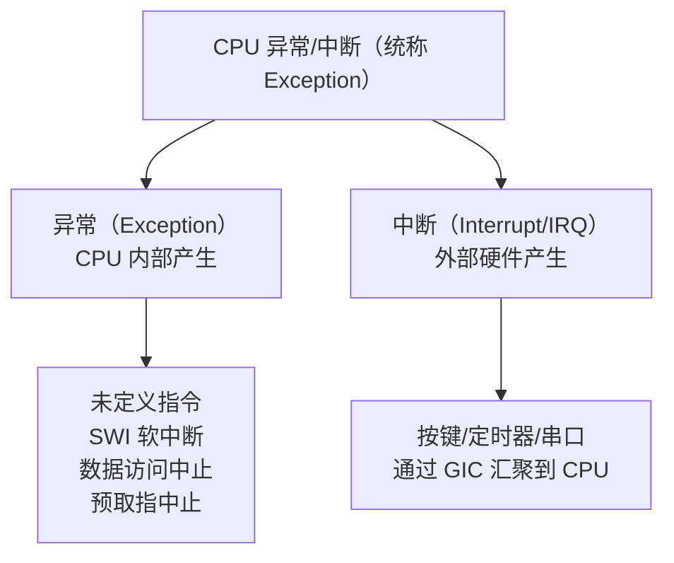
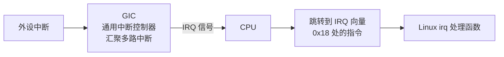
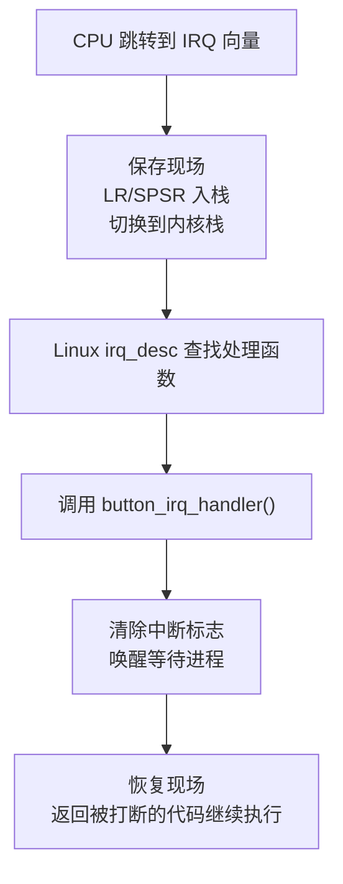

# 17 异常与中断的概念及处理流程

> **一句话总结**：中断让 CPU 不需要一直轮询等待，而是"有事才来找我"——本章从第一性原理解释中断是什么、ARM 怎么处理中断、初始化/触发/处理三阶段。

**对应 PDF**：第五篇 第17章（第403页）

---

## 前置知识

- 理解 CPU 执行程序的基本流程（顺序取指、译码、执行）
- 第15章：查询方式的缺陷（CPU 不停轮询浪费）

---

## 1. 为什么需要中断？

**没有中断时**：

```c
while (1) {
    if (key_pressed())    // CPU 一直在这里转圈
        handle_key();
}
```

CPU 被"绑架"，无法做其他事情。

**有了中断**：

```c
// CPU 正在干别的事（计算、显示、网络...）
// 用户按键 → 硬件自动发信号给CPU
// CPU 暂停当前工作 → 处理按键 → 恢复原工作
```

> **类比**：你在专心看书（CPU 执行程序），手机响了（中断发生）→ 你放书接电话（中断处理程序）→ 挂电话继续看书（恢复现场）。不需要每隔1秒看一次手机有没有来电。

---

## 2. 异常 vs 中断



| 类型 | 触发来源 | 示例 |
|------|----------|------|
| 未定义指令异常 | CPU 遇到不认识的指令 | 执行了 ARM 指令集以外的操作码 |
| 数据访问中止 | 访问非法内存地址 | 对 NULL 指针解引用 |
| SWI（软件中断） | 程序主动触发 | Linux 系统调用（`syscall` 指令） |
| IRQ（外部中断） | 外设向 CPU 发出信号 | 按键、定时器到期、网卡收包 |

---

## 3. ARM 异常向量表

ARM CPU 有一张固定的"事件处理目录"，每种异常对应一个固定地址：

```
异常向量表（地址 0x00000000 或 0xFFFF0000）：
  偏移 0x00: Reset           → 上电/复位处理
  偏移 0x04: Undefined Inst  → 未定义指令
  偏移 0x08: SWI             → 软件中断（系统调用）
  偏移 0x0C: Prefetch Abort  → 预取指令失败
  偏移 0x10: Data Abort      → 数据访问失败
  偏移 0x14: （保留）
  偏移 0x18: IRQ             → 普通外部中断
  偏移 0x1C: FIQ             → 快速中断（优先级最高）
```



---

## 4. 中断处理三阶段

### 阶段一：初始化（驱动加载时）

```c
/* 驱动中注册中断 */
int irq = gpio_to_irq(gpio_num);          // GPIO 号转 IRQ 号
request_irq(irq,                          // 中断号
            button_irq_handler,           // 处理函数
            IRQF_TRIGGER_FALLING,         // 触发方式：下降沿（按下）
            "button_key",                 // 中断名（dmesg 可见）
            NULL);                        // 传给处理函数的数据

/* 同时需要：
   1. 使能中断源（GIC 级别，request_irq 自动完成）
   2. 使能 CPU 总中断（内核启动时已完成）
*/
```

### 阶段二：触发（按键按下时）

```
1. 用户按下按键
2. GPIO 引脚电平发生变化（下降沿）
3. GPIO 控制器检测到变化 → 发信号给 GIC
4. GIC 收到信号 → 拉低 CPU 的 IRQ 线
5. CPU 完成当前指令后，检测到 IRQ 信号
6. CPU 自动切换到 IRQ 模式，跳转到向量表 0x18
```

### 阶段三：处理



---

## 5. 保存现场是什么意思？

CPU 正在执行某段代码，被中断打断了，处理完后还要回来继续——所以需要保存：

```
保存的"现场"：
  ├── PC（程序计数器）：中断时执行到哪里了
  ├── CPSR（程序状态寄存器）：当前 CPU 状态标志
  └── 通用寄存器（R0~R12）：当前运算中间值
```

ARM 的 IRQ 模式有自己的 LR（链接寄存器）和 SP（栈指针），CPU 硬件自动完成部分保存，软件（内核汇编代码）完成其余部分。

---

## 6. 中断嵌套与 preempt_count

```c
/* 内核中每个进程都有这个计数器 */
struct thread_info {
    int preempt_count;   /* 中断处理时+1，处理完-1 */
    // ...
};

/* 规则：
   preempt_count > 0 → 不允许调度（正在中断处理中）
   preempt_count == 0 → 可以调度（回到正常进程上下文）
*/
```

---

## 7. 中断请求号（IRQ）与 GPIO 引脚的关系

```c
/* 驱动中这样获取 IRQ 号 */
int gpio = of_get_named_gpio(np, "button-gpios", 0);
int irq  = gpio_to_irq(gpio);   // GPIO 号 → IRQ 号

/* 或者从设备树直接读取（更现代的写法） */
int irq = platform_get_irq(pdev, 0);   // 读设备树 interrupts 属性
```

设备树中描述中断：

```dts
mybutton {
    compatible     = "100ask,button";
    button-gpios   = <&gpio4 14 GPIO_ACTIVE_LOW>;
    interrupts     = <14 IRQ_TYPE_EDGE_BOTH>;   /* 双边沿触发 */
    interrupt-parent = <&gpio4>;
};
```

---

## 8. 触发类型

| 触发方式 | 宏定义 | 适用场景 |
|----------|--------|----------|
| 上升沿 | `IRQF_TRIGGER_RISING` | 按键松开（低→高） |
| 下降沿 | `IRQF_TRIGGER_FALLING` | 按键按下（高→低） |
| 双边沿 | `IRQF_TRIGGER_FALLING \| IRQF_TRIGGER_RISING` | 同时检测按下和松开 |
| 高电平 | `IRQF_TRIGGER_HIGH` | 持续触发（电平型） |

---

## 小结

中断 = **硬件事件** → **CPU 暂停当前工作** → **保存现场** → **执行处理函数** → **恢复现场**。驱动只需关注：① 用 `request_irq` 注册处理函数；② 在处理函数中响应事件；③ 用 `free_irq` 卸载时注销。底层跳转/现场保存/恢复由 CPU 硬件和内核汇编代码完成。

ARM 中断处理内核代码参考：[source/kernel/arch/arm/kernel/entry-armv.S](../source/kernel/arch/arm/kernel/entry-armv.S)
