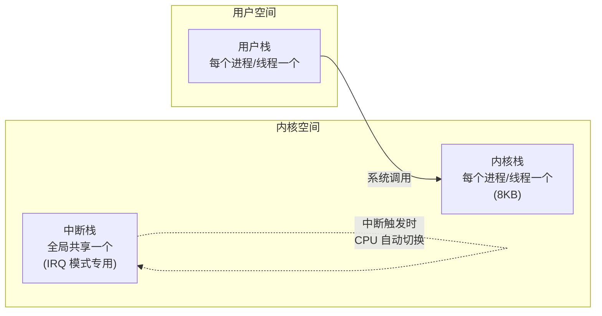
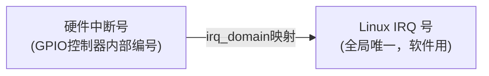
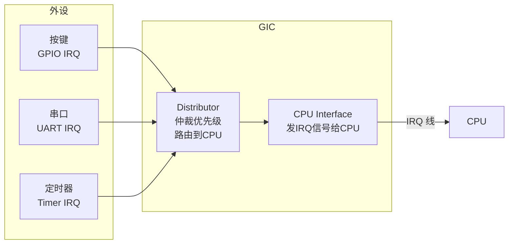
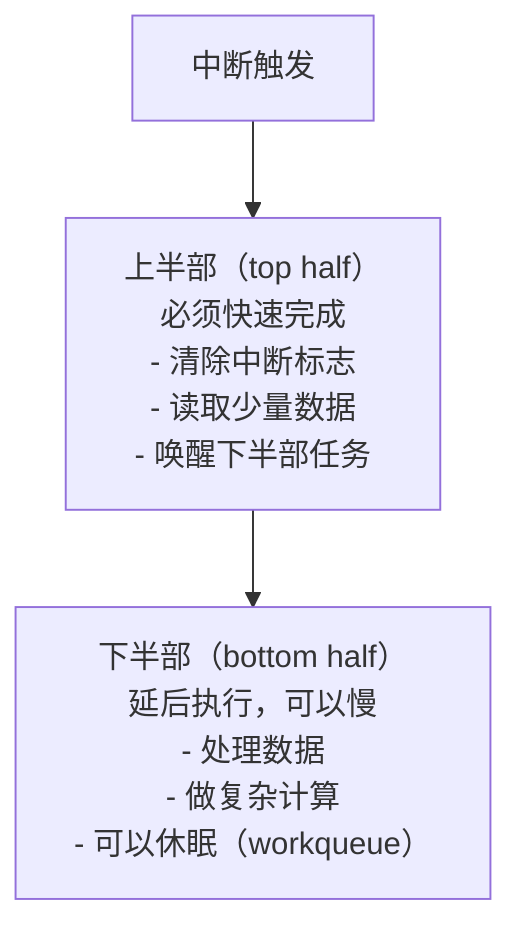
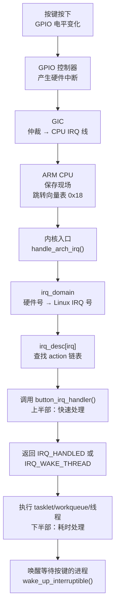

# 18 Linux 中断处理深入

> **一句话总结**：Linux 把中断处理分为"上半部（快速处理）"和"下半部（耗时处理）"，并用 irq_desc/irq_domain/GIC 三层数据结构管理数百个中断源——本章把这套机制从里到外讲清楚。

**对应 PDF**：第五篇 第18章（第406页）

---

## 前置知识

- 第17章：中断概念、ARM 异常向量表、三阶段处理
- 进程/线程概念（调度、休眠）

---

## 1. 三个独立的"栈"

内核中，进程、线程、中断各有自己独立的栈：



> **为什么要有独立的中断栈？** 中断可以发生在任何进程执行的时刻，如果复用进程的内核栈，中断处理不小心用太多栈空间就会覆盖进程数据。独立的中断栈隔离了这个风险。

---

## 2. 关键数据结构

### 2.1 irq_desc（中断描述符）

```c
struct irq_desc {
    struct irq_data    irq_data;   // 中断相关数据
    struct irqaction  *action;     // 处理函数链表（共享中断时有多个）
    irq_flow_handler_t handle_irq; // 流处理函数（level/edge）
    unsigned int       depth;      // 中断嵌套深度
    // ...
};

/* 全局数组：每个 IRQ 号对应一个 irq_desc */
/* 内核中：irq_to_desc(irq_num) 查找 */
```

### 2.2 irqaction（处理函数链）

```c
struct irqaction {
    irq_handler_t  handler;    // 你在 request_irq 里注册的函数
    void          *dev_id;     // 传给处理函数的参数
    const char    *name;       // /proc/interrupts 中显示的名字
    struct irqaction *next;    // 共享中断时指向下一个处理函数
};
```

### 2.3 irq_domain（中断号映射）



```c
struct irq_domain {
    /* 硬件中断号 → Linux IRQ 号的映射表 */
    const struct irq_domain_ops *ops;
    // linear_revmap[] 或 radix tree
};
```

> **为什么需要 irq_domain？** 系统中有多个中断控制器（GIC、GPIO 控制器），每个都有自己的中断号编号系统（都从 0 开始）。irq_domain 为每个控制器维护独立的映射，把硬件号翻译成全局唯一的 Linux IRQ 号。

---

## 3. GIC（通用中断控制器）

IMX6ULL 使用 ARM GICv2：



GIC 管理规则：
- 每个中断有优先级（0最高）
- 可以配置每个中断路由到哪个 CPU（SMP 系统）
- 支持软件中断（SGI）、私有外设中断（PPI）、共享外设中断（SPI）

---

## 4. 上半部 vs 下半部（最重要的设计）

**原则**：中断处理函数要越快越好，因为中断期间会屏蔽同优先级中断，时间太长会影响系统响应。



> **类比**：快递员按门铃（中断上半部：告诉你有快递，门铃处理完毕），你等电梯下楼取快递（下半部：真正取快递，可以慢）。

### 4.1 三种下半部实现

| 机制 | 在哪执行 | 能否休眠 | 适用场景 |
|------|----------|----------|----------|
| softirq | 软中断上下文 | 不能 | 网络收包等高频场景（内核开发者用） |
| tasklet | 软中断上下文 | 不能 | 一般驱动的下半部（**驱动开发者首选**） |
| work queue | 内核线程上下文 | **能** | 需要休眠/等待的耗时操作 |
| threaded irq | 内核线程上下文 | **能** | 现代驱动推荐方式 |

---

## 5. 使用 tasklet 实现下半部

```c
/* 定义 tasklet */
static struct tasklet_struct button_tasklet;

/* tasklet 处理函数（下半部） */
static void button_tasklet_func(unsigned long data)
{
    /* 这里处理耗时工作（但不能休眠） */
    int val = gpio_get_value(button_gpio);
    button_event = val;
    wake_up_interruptible(&button_wq);   // 唤醒等待按键的进程
    printk("tasklet: button val=%d\n", val);
}

/* 中断处理函数（上半部）——越快越好 */
static irqreturn_t button_irq_handler(int irq, void *dev_id)
{
    /* 只做最少的事情：调度 tasklet 执行下半部 */
    tasklet_schedule(&button_tasklet);
    return IRQ_HANDLED;
}

/* 驱动初始化 */
static int button_probe(struct platform_device *pdev)
{
    int irq;

    /* 初始化 tasklet */
    tasklet_init(&button_tasklet, button_tasklet_func, 0);

    /* 注册中断 */
    irq = gpio_to_irq(button_gpio);
    request_irq(irq, button_irq_handler,
                IRQF_TRIGGER_FALLING | IRQF_TRIGGER_RISING,
                "button", NULL);
    return 0;
}
```

---

## 6. 使用 work queue 实现可休眠的下半部

```c
static struct work_struct button_work;

/* work 处理函数（运行在内核线程，可以休眠） */
static void button_work_func(struct work_struct *work)
{
    msleep(50);   // 消抖：等待50ms（可以休眠！tasklet 不行）
    int val = gpio_get_value(button_gpio);
    button_event = val;
    wake_up_interruptible(&button_wq);
}

static irqreturn_t button_irq_handler(int irq, void *dev_id)
{
    schedule_work(&button_work);   // 把工作提交给内核线程
    return IRQ_HANDLED;
}

static int button_probe(struct platform_device *pdev)
{
    INIT_WORK(&button_work, button_work_func);
    // request_irq ...
    return 0;
}
```

---

## 7. 线程化中断（最现代的方式）

```c
/* request_threaded_irq：上半部在中断上下文，下半部在内核线程 */
request_threaded_irq(irq,
    button_irq_handler,          /* 上半部（中断上下文，必须快） */
    button_thread_fn,            /* 下半部（内核线程，可以休眠） */
    IRQF_TRIGGER_FALLING | IRQF_ONESHOT,
    "button", dev);

/* 如果上半部返回 IRQ_WAKE_THREAD，才会执行线程函数 */
static irqreturn_t button_irq_handler(int irq, void *dev)
{
    /* 做最少的事，然后通知线程处理 */
    return IRQ_WAKE_THREAD;
}

static irqreturn_t button_thread_fn(int irq, void *dev)
{
    msleep(50);   // 可以休眠
    /* 处理按键... */
    return IRQ_HANDLED;
}
```

---

## 8. 设备树中指定中断

```dts
mybutton {
    compatible       = "100ask,button";
    button-gpios     = <&gpio4 14 GPIO_ACTIVE_LOW>;
    interrupt-parent = <&gpio4>;       /* 中断控制器 */
    interrupts       = <14 IRQ_TYPE_EDGE_BOTH>;  /* 引脚号 + 触发方式 */
};
```

```c
/* 驱动中读取 */
int irq = platform_get_irq(pdev, 0);   /* 自动从设备树获取 IRQ 号 */
```

---

## 9. Linux 中断处理完整流程



---

## 小结

中断处理分层：**上半部**（中断上下文，快、不能休眠）→ **下半部**（softirq/tasklet/workqueue/threaded，可以慢）。数据结构层级：**GIC**（硬件）→ **irq_domain**（号码翻译）→ **irq_desc**（描述符）→ **irqaction**（处理函数）。

- 中断处理示例：[Document/driver_examples/IMX6ULL/source/08_Interrupt/](../Document/driver_examples/IMX6ULL/source/08_Interrupt/)
- 内核 IRQ 子系统：[source/kernel/kernel/irq/](../source/kernel/kernel/irq/)
- 内核 GIC 驱动：[source/kernel/drivers/irqchip/](../source/kernel/drivers/irqchip/)
