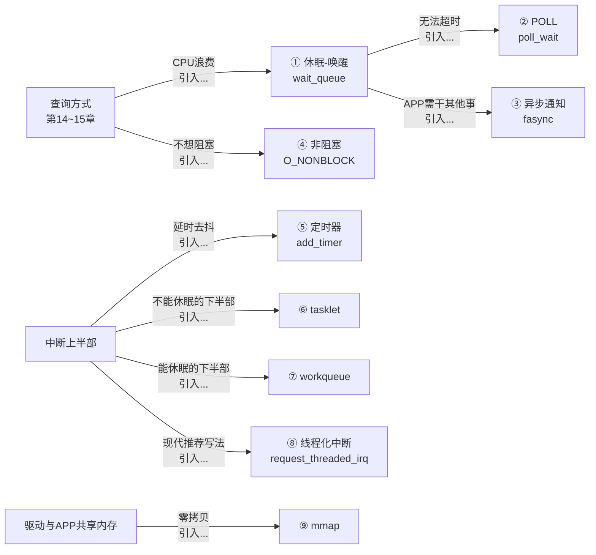
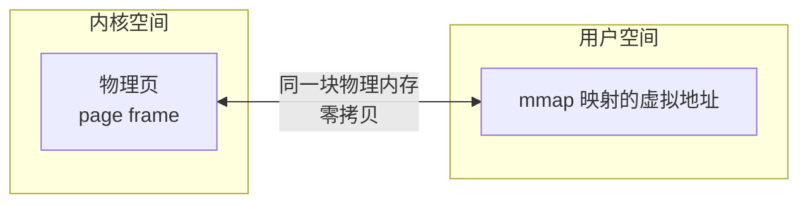

# 19 驱动程序基石

> **一句话总结**：本章是整个第五篇的压轴——九大内核机制（等待队列、POLL、异步通知、非阻塞、定时器、tasklet、workqueue、线程化中断、mmap）是驱动开发者的"武器库"，掌握了就能解决几乎所有驱动场景。

**对应 PDF**：第五篇 第19章（第432页）

---

## 前置知识

- 第13章：四种读按键方式（应用层视角）
- 第17~18章：中断机制、上下半部

---

## 九大机制关系总览

以"按键驱动演进"为主线，展示各机制在哪个阶段引入：



---

## 机制一：休眠与唤醒（wait_queue）

**解决**：read 阻塞但不浪费 CPU。

```c
/* 声明等待队列头 */
static DECLARE_WAIT_QUEUE_HEAD(button_wq);
static int button_event = 0;

/* read：没有事件就睡眠 */
static ssize_t button_read(struct file *file, char __user *buf,
                            size_t count, loff_t *ppos)
{
    /*
     * 等待条件：button_event != 0
     * 如果条件不满足 → 进程进入 TASK_INTERRUPTIBLE 睡眠
     * 有信号（Ctrl+C）可以打断
     */
    if (wait_event_interruptible(button_wq, button_event != 0))
        return -ERESTARTSYS;   // 被信号打断

    button_event = 0;          // 清除事件标志
    char val = '1';
    copy_to_user(buf, &val, 1);
    return 1;
}

/* 中断处理函数：唤醒睡眠进程 */
static irqreturn_t button_irq(int irq, void *dev)
{
    button_event = 1;
    wake_up_interruptible(&button_wq);   // 唤醒等待队列上的进程
    return IRQ_HANDLED;
}
```

| API | 说明 |
|-----|------|
| `DECLARE_WAIT_QUEUE_HEAD(name)` | 静态声明等待队列 |
| `wait_event(wq, condition)` | 等待条件，不可被信号打断 |
| `wait_event_interruptible(wq, cond)` | 等待条件，可被信号打断（推荐） |
| `wake_up(wq)` | 唤醒等待队列上所有进程 |
| `wake_up_interruptible(wq)` | 只唤醒 TASK_INTERRUPTIBLE 状态的进程 |

内核实现参考：[source/kernel/include/linux/wait.h](../source/kernel/include/linux/wait.h)

---

## 机制二：POLL 机制（poll/select/epoll）

**解决**：APP 同时监听多个文件描述符，支持超时。

```c
/* 驱动实现 .poll */
static unsigned int button_poll(struct file *file, poll_table *wait)
{
    /*
     * poll_wait：把等待队列注册到 poll 机制
     * （不阻塞，只是登记"有事件时通知我"）
     */
    poll_wait(file, &button_wq, wait);

    /* 检查是否有数据可读 */
    if (button_event)
        return POLLIN | POLLRDNORM;   // 可读

    return 0;   // 暂无数据
}

static const struct file_operations button_fops = {
    .poll = button_poll,
    // ...
};
```

```c
/* APP 端使用 poll */
struct pollfd fds = { .fd = fd, .events = POLLIN };
int ret = poll(&fds, 1, 3000);   // 最多等 3 秒

if (ret > 0 && fds.revents & POLLIN) {
    read(fd, &val, 1);
}
```

---

## 机制三：异步通知（fasync / SIGIO）

**解决**：APP 不阻塞，按键发生时内核主动发信号通知 APP。

```c
/* 驱动端 */
static struct fasync_struct *button_fasync_queue;

/* 实现 .fasync 接口 */
static int button_fasync(int fd, struct file *file, int on)
{
    /* fasync_helper 管理异步通知链表 */
    return fasync_helper(fd, file, on, &button_fasync_queue);
}

/* 中断中发信号 */
static irqreturn_t button_irq(int irq, void *dev)
{
    button_event = 1;
    wake_up_interruptible(&button_wq);
    kill_fasync(&button_fasync_queue, SIGIO, POLL_IN);  // 发 SIGIO
    return IRQ_HANDLED;
}
```

```c
/* APP 端 */
signal(SIGIO, my_handler);
fcntl(fd, F_SETOWN, getpid());
fcntl(fd, F_SETFL, fcntl(fd, F_GETFL) | FASYNC);
// APP 继续干其他事，按键时自动执行 my_handler
```

---

## 机制四：阻塞与非阻塞（O_NONBLOCK）

**解决**：APP open 时指定 `O_NONBLOCK`，read 不阻塞直接返回。

```c
/* 驱动根据 file->f_flags 判断模式 */
static ssize_t button_read(struct file *file, char __user *buf,
                            size_t count, loff_t *ppos)
{
    if (!button_event) {
        if (file->f_flags & O_NONBLOCK)
            return -EAGAIN;   // 非阻塞：没数据就直接返回错误

        /* 阻塞：等待数据 */
        wait_event_interruptible(button_wq, button_event != 0);
    }
    // 读取数据...
}
```

```c
/* APP 非阻塞用法 */
int fd = open("/dev/button0", O_RDONLY | O_NONBLOCK);
int ret = read(fd, &val, 1);
if (ret == -1 && errno == EAGAIN) {
    // 没有按键，稍后再试
}
```

---

## 机制五：定时器（内核定时器）

**经典用途**：按键去抖（按下后等50ms再读，过滤抖动）。

```c
static struct timer_list button_timer;

/* 定时器回调：延时到期后处理 */
static void button_timer_func(struct timer_list *t)
{
    int val = gpio_get_value(button_gpio);
    button_event = val ? 0 : 1;   // 低电平 = 按下
    wake_up_interruptible(&button_wq);
}

/* 中断处理：不立即读GPIO，而是起一个50ms定时器 */
static irqreturn_t button_irq(int irq, void *dev)
{
    /* 修改定时器超时时间（50ms后触发），抖动期间会不断刷新 */
    mod_timer(&button_timer, jiffies + msecs_to_jiffies(50));
    return IRQ_HANDLED;
}

static int button_probe(struct platform_device *pdev)
{
    /* 初始化定时器（内核 4.15+ 新接口） */
    timer_setup(&button_timer, button_timer_func, 0);
    // ...
}
```

| API | 说明 |
|-----|------|
| `timer_setup(t, fn, flags)` | 初始化定时器 |
| `add_timer(t)` | 启动定时器 |
| `mod_timer(t, expires)` | 修改超时时间（未触发则刷新，已触发则重启） |
| `del_timer(t)` | 删除定时器 |
| `jiffies` | 内核时间计数（每个 tick +1） |
| `msecs_to_jiffies(ms)` | 毫秒转 jiffies |

---

## 机制六：tasklet（不可休眠的下半部）

```c
static struct tasklet_struct button_tasklet;

static void button_tasklet_fn(unsigned long data)
{
    /* 下半部：处理数据（不能调用可能休眠的函数！） */
    int val = gpio_get_value(button_gpio);
    button_event = val ? 0 : 1;
    wake_up_interruptible(&button_wq);
}

static irqreturn_t button_irq(int irq, void *dev)
{
    tasklet_schedule(&button_tasklet);   // 调度下半部
    return IRQ_HANDLED;
}

/* 初始化 */
tasklet_init(&button_tasklet, button_tasklet_fn, 0);

/* 卸载时 */
tasklet_kill(&button_tasklet);
```

**注意**：tasklet 在软中断上下文运行，**不能调用可能休眠的函数**（如 `msleep`、`kmalloc(GFP_KERNEL)`）。

---

## 机制七：工作队列（workqueue，可休眠的下半部）

```c
static struct work_struct button_work;

static void button_work_fn(struct work_struct *work)
{
    /* 可以调用休眠函数！ */
    msleep(50);   // 按键去抖（休眠50ms）
    int val = gpio_get_value(button_gpio);
    button_event = val ? 0 : 1;
    wake_up_interruptible(&button_wq);
}

static irqreturn_t button_irq(int irq, void *dev)
{
    schedule_work(&button_work);   // 提交到系统默认工作队列
    return IRQ_HANDLED;
}

/* 初始化 */
INIT_WORK(&button_work, button_work_fn);

/* 延时工作队列（delay 后再执行） */
static struct delayed_work button_dwork;
INIT_DELAYED_WORK(&button_dwork, button_work_fn);
schedule_delayed_work(&button_dwork, msecs_to_jiffies(50));
```

---

## 机制八：线程化中断（现代推荐）

```c
/* 上半部（中断上下文，必须快速返回） */
static irqreturn_t button_hard_irq(int irq, void *dev)
{
    /* 只做硬件必须做的事（如清中断标志） */
    return IRQ_WAKE_THREAD;   // 告诉内核唤醒线程来处理
}

/* 下半部（内核线程上下文，可以休眠） */
static irqreturn_t button_thread_fn(int irq, void *dev)
{
    msleep(50);   // 可以休眠
    int val = gpio_get_value(button_gpio);
    button_event = val ? 0 : 1;
    wake_up_interruptible(&button_wq);
    return IRQ_HANDLED;
}

/* 注册 */
request_threaded_irq(irq,
    button_hard_irq,    /* 上半部 */
    button_thread_fn,   /* 下半部（线程函数） */
    IRQF_TRIGGER_FALLING | IRQF_ONESHOT,
    "button", dev);
```

> **IRQF_ONESHOT**：线程函数执行期间，保持中断屏蔽（防止线程还没处理完，新中断又来）。线程化中断必须加此标志。

---

## 机制九：mmap（内核用户空间共享内存）

**解决**：驱动和 APP 共享大块内存，避免 copy_to_user/copy_from_user 的拷贝开销（适合帧缓冲、音频缓冲区等）。

```c
/* 驱动实现 .mmap */
static int button_mmap(struct file *file, struct vm_area_struct *vma)
{
    unsigned long size = vma->vm_end - vma->vm_start;

    /*
     * remap_pfn_range：把内核物理页映射到用户虚拟地址空间
     * vma->vm_pgoff：用户传入的偏移（page number）
     */
    return remap_pfn_range(vma,
                           vma->vm_start,
                           vma->vm_pgoff,   // 物理页帧号
                           size,
                           vma->vm_page_prot);
}
```

```c
/* APP 端 */
void *shared_mem = mmap(NULL, size, PROT_READ | PROT_WRITE,
                        MAP_SHARED, fd, 0);
/* 直接读写 shared_mem，和内核共享同一块物理内存，零拷贝 */
munmap(shared_mem, size);
```



---

## 九大机制速查表

| 机制 | 关键 API | 能否休眠 | 使用场景 |
|------|----------|----------|----------|
| wait_queue | `wait_event_interruptible` / `wake_up_interruptible` | 是 | read 阻塞等待 |
| POLL | `poll_wait` | 否 | select/poll/epoll |
| fasync | `fasync_helper` / `kill_fasync` | 否 | 异步信号通知 |
| O_NONBLOCK | `file->f_flags & O_NONBLOCK` | 否 | 非阻塞立即返回 |
| timer | `timer_setup` / `mod_timer` | 否 | 延时、去抖、超时 |
| tasklet | `tasklet_init` / `tasklet_schedule` | 否 | 轻量下半部 |
| workqueue | `INIT_WORK` / `schedule_work` | **是** | 需要休眠的下半部 |
| threaded irq | `request_threaded_irq` | **是** | 现代驱动下半部 |
| mmap | `remap_pfn_range` | 否 | 零拷贝共享内存 |

---

## 小结

第五篇到这里全部结束。从最简单的 Hello 驱动（第01章）→ 操作寄存器（第03~05章）→ 分层框架（第06~08章）→ platform/设备树（第09~12章）→ 按键四种方式（第13~15章）→ GPIO子系统（第16章）→ 中断（第17~18章）→ 九大基石（本章），构成了一条完整的嵌入式 Linux 驱动开发知识链。

- 中断示例参考：[Document/driver_examples/IMX6ULL/source/08_Interrupt/](../Document/driver_examples/IMX6ULL/source/08_Interrupt/)
- wait.h 内核头文件：[source/kernel/include/linux/wait.h](../source/kernel/include/linux/wait.h)
- 工作队列实现：[source/kernel/kernel/workqueue.c](../source/kernel/kernel/workqueue.c)
