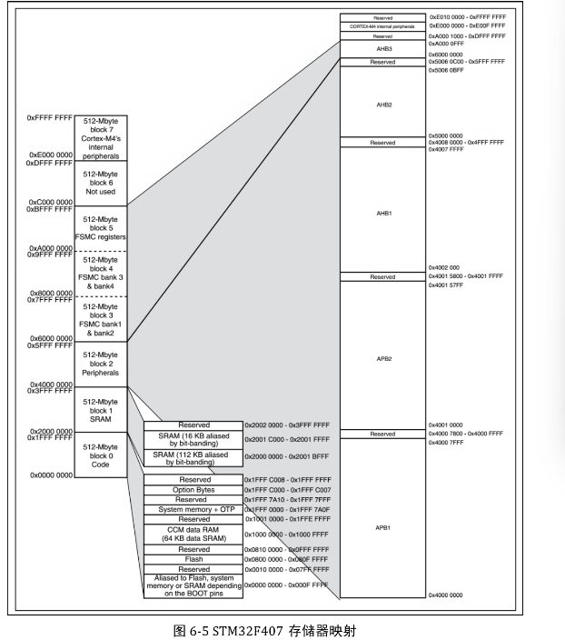

# Chapter 1 寄存器点亮led

---

点灯是嵌入式最简单的事情， 也是嵌入式最难的事情。每学一个新的嵌入式平台，第一件事情学点灯，学的也不是点灯本身。平台不同，体系不同，背后的设计哲学不同，一个点灯实验就能见微知著。笔者尽可能在本章让读者通过一个最少封装的点灯案例，深刻体悟stm32的系统哲学。只有建立了对stm32的基本认识，以后完成复杂的大工程才会确保有更多的“构建即正确”，而不是把stm32当做大号的8位MCU，或者是一个裹着层层封装库大衣的黑盒。

从8位单片机过渡到stm32，好比乡下人进大城市买房。所谓“城市套路深”，不了解大城市的运行规则，在城市落脚都可谓艰难。在本章节我们会全程贯彻这个比喻，便于读者在一开始就掌握32开发的基本框架。

## 0 本章节目录

## 1 乡下人进城买房：初识stm32


### 1.1 STM32 的基本哲学：从 8 位 MCU 到 32 位片上系统

如果你已经掌握了 8 位 MCU，比如 PIC16、C51，那么进入 STM32F4 时最重要的不是先去背寄存器名，而是先完成一次**思维方式的切换**。（如果你之前没学过8位MCU, 那你的学习会很痛苦。建议找一款去学）

PIC16、C51 这类 8 位单片机，像一个小农村：村子不大，路不多，几栋房子、几亩田地、几样农具，基本都摆在眼前。谁负责什么，往往一目了然。CPU 就像村支书，很多事情都是它亲自过问、亲自处理。

而 STM32F4 则完全不同。它不是“多几个寄存器、多几个外设”的简单加法，而更接近一句话：**more is different**。当规模上来以后，系统的组织方式、模块之间的关系、开发者观察问题的角度，都会发生质变。

如果说 8 位单片机是一个小农村，那么 STM32F4 更像一座大城市：有街道，有楼栋，有统一的水电气网络，有交通干线，有不同部门分工协作，还有一整套组织管理体系。
 因此，学习 STM32F4，本质上不是在学一个“大号 8 位机”，而是在学一个**具有内核、总线、统一存储、时钟和外设协同机制的片上系统**。

下面这几条，就是从 8位机 走向 STM32时最应该先建立起来的基本哲学。

------

#### 1.1.1 ARM 内核 + 片上系统 SoC：从小村庄到大城市，大一统的单片机

在8位MCU，比如 PIC16 的世界里，我们更容易把单片机理解成“CPU + 若干寄存器 + 若干外设”。这种理解在小型 8 位系统上通常是够用的，因为芯片规模不大，很多模块也没有明显分层。

但 STM32F4 不是这样。STM32F4 可以理解成两层结构叠在一起：

第一层是 **ARM Cortex-M4 内核**。
 这一层决定了程序如何执行、函数如何调用、中断如何进入、异常如何返回、栈如何使用、寄存器如何组织。换句话说，它规定了“这台机器的大脑是怎么思考的”。

第二层是 **片上系统 SoC（System on Chip）**。
 这一层包括 Flash、SRAM、GPIO、USART、SPI、I2C、定时器、DMA、RCC、电源管理、总线系统等。它们不是杂乱地堆在一起，而是被组织在一套统一的硬件结构中。

所以，学习 STM32F4 时必须明白：

> 你面对的不是一颗“功能多一点的单片机”，而是一颗“**ARM 内核驱动下的片上系统**”。

这句话很重要。因为从这一点出发，你后面看到的很多东西就都能串起来了：

- 为什么 STM32 要讲启动流程，而不仅仅是 `main()`；
- 为什么中断不只是“来一个信号就跳一下”；
- 为什么 DMA、RCC、总线这些东西在系统里地位这么高；
- 为什么 STM32 的开发天然比 8 位机更强调分层和协同。

比起 PIC1这种“一个人能管得过来的村庄”， STM32F4 是“必须依靠制度和组织来运转的城市”。需要严格的系统组织，复杂的管理模式。这就是第一层哲学：**STM32F4 的本质不是“更多外设”，而是“更高层次的系统组织”。**

------

#### 1.1.2 统一的地址空间与 Memory Map：在城里找房子，先拿地图，再找马路

在 PIC16 中，开发者经常是“记机关”的思路——比如记住 `PORTA`、`TRISA`、`TMR1`、`INTCON`，然后去拨动这些特殊功能寄存器。你更像是在面对一张“机关名单”。

STM32F4 则不是这种思路。它更强调 **memory map**，也就是**统一的地址映射图**。在 STM32F4 中，Flash、SRAM、外设寄存器，乃至系统控制相关部件，都被放进同一个地址空间中。对程序员来说，它们都表现为“某个地址范围里的内容”：

- Flash 在某一段地址上；
- SRAM 在另一段地址上；
- GPIO、USART、TIM 等外设也各自占有一块地址区域；
- 每个外设内部的各个寄存器，则是这块区域中的不同偏移。

这意味着，STM32F4 的世界更像一张城市地图。你不再只是记住“有几个机关”，而是要先学会看地图：

- 哪一片区域是程序存储器；
- 哪一片区域是数据存储器；
- 哪一片区域是外设区；
- GPIOA 这栋“楼”在哪；
- USART2 那栋“楼”又在哪。

所以对 STM32F4 来说，更自然的理解方式不是“寄存器名列表”，而是：**先理解地址地图，再理解地图上每栋楼的用途**。这和 PIC16 的差别很大。 PIC16 当然也有地址，也有存储划分，但它给人的编程体验更偏向“寄存器导向”；而 STM32F4 的编程体验更偏向“地址空间导向”。这就是为什么 STM32F4 的很多后续知识都依赖 memory map：

- 为什么外设寄存器可以像访问内存一样访问；
- 为什么 DMA 能在外设和 SRAM 之间搬运数据；
- 为什么链接脚本要关心段放在什么地址；
- 为什么 Bootloader 和应用程序要讨论地址布局。

如果用城市比喻来说，那么在农村找人，可以直接问“村口王大爷家在哪”；
 但在大城市找房子，你首先得看地图、认街道、找门牌号。
 STM32F4 的开发思维，就是这种“先认地图，再办事”的思维。

------

#### 1.1.3 复杂的初始化：在城里买房子，不只是拿钥匙，还要办水电气网

在 PIC16 这类 8 位 MCU 中，很多时候你想用一个外设，直觉上就是“去配它的寄存器”。
 比如想用定时器，就去配定时器；想用串口，就去配串口。虽然也有前提条件，但整体上结构比较直接。

STM32F4 则不同。
 在这个系统里，一个外设能否真正工作，往往不仅取决于“这个外设本身怎么配置”，还取决于它是否已经具备运行前提。

这就像在农村分一块地、盖一间房，可能自己收拾一下就能住；但在城市买房，拿到钥匙还远远不够，你还得处理一整套基础设施问题：水通没通?电通没通?燃气开没开?宽带有没有装?等等

对应到 STM32F4，就是这些初始化前提：

- 时钟源是否配置正确；
- RCC 是否给相应外设打开了时钟；
- GPIO 是否设置成正确模式；
- 引脚复用是否选对；
- 总线分频是否满足目标频率；
- 外设是否从复位状态切换到了可工作状态。

也就是说，在 STM32F4 中，**初始化不是简单“写几个控制位”**，而是一个系统性的前置工程。
 它要求你先把城市基础设施搭起来，后面的居民活动才能开始。

所以学习 STM32F4 时，要尽快建立这样一个意识：

> 在 STM32F4 里，功能配置之前，必须先满足系统前提。

很多初学者刚从 8 位机转过来时容易困惑：
 “明明 USART 寄存器我都配了，为什么不发？”
 “明明 GPIO 模式对了，为什么没反应？”
 问题常常不在于功能逻辑本身，而在于**时钟、复用、总线、复位状态这些前提没有搭好**。

因此，STM32F4 的初始化之所以复杂，不是因为它故意麻烦，而是因为它已经不再是一个“随手拨几个机关就能动”的小系统了。
 城市越大，基础设施越重要；系统越复杂，初始化就越必须讲秩序。

------

#### 1.1.4 总线系统和模块协同：村支书可能包办一切，但市长不可能

在 PIC16 的世界里，CPU 常常像村支书一样，很多事情都由它亲自过问：

- 轮询是它；
- 响应中断是它；
- 从寄存器里读数据是它；
- 把数据写到 RAM 里还是它。

换句话说，PIC16 这类小系统更容易形成一种“CPU 包办一切”的直觉。
 因为系统规模不大，很多事情确实可以这样做。

STM32F4 就不一样了。

在 STM32F4 这种级别的系统里，CPU 不再是唯一干活的人。
 它更像一个市长：负责决策、调度、协调，但不可能亲自去做城市里的所有具体事务。
 真正让整个系统高效运转的，是一套有分工、有道路、有协作关系的组织结构。

这套结构里，最核心的几个角色包括：

- **总线系统**：负责把各个模块连接起来，像城市里的主干道和支路；
- **RCC**：负责时钟分发，像统一的供电和能源系统；
- **NVIC**：负责中断管理，像城市事件的调度中心；
- **DMA**：负责数据搬运，像专门的物流系统；
- **各类外设模块**：像城市里的不同部门和功能单位。

因此，STM32F4 的强大，不仅仅来自主频更高、寄存器更多，而更来自：

> 各个模块已经不是孤立存在，而是在总线和时钟体系下协同工作。

这和 PIC16 的思路差别很大。
 在 PIC16 里，CPU 经常既是决策者，也是执行者，还是搬运工；
 而在 STM32F4 里，CPU 开始更多地扮演组织者的角色。

例如，在一个典型的数据采集场景中：

- 定时器负责产生周期性触发；
- ADC 负责完成采样；
- DMA 负责把采样结果搬到内存；
- CPU 最后只需要在合适的时候处理这一批数据。

这就是一种典型的“模块协同”而不是“CPU 包办”。

所以，从 PIC16 走向 STM32F4，必须建立一个新的系统观：

> STM32F4 不是一个靠 CPU 单打独斗的单片机，而是一个依靠总线、时钟、中断、DMA 和外设共同运行的片上城市。

如果你仍然习惯把所有事情都写成“CPU 轮询 + CPU 处理中断 + CPU 手动搬数据”，那么你虽然也能把 STM32F4 用起来，但很可能只是把它当成了一颗“很贵的大号 PIC”。
 而真正理解 STM32F4，意味着学会让系统里的不同模块各司其职。


### 1.2 Cortex-M内核

STM32F4 不只是 ST 做的一颗单片机，它首先是一颗**基于 Arm Cortex-M 内核**的 MCU。因此，学习 STM32F4，不能只看 GPIO、USART、TIM 这些外设，也必须知道这颗芯片的“CPU 内核”是谁，它负责什么。

#### 1.2.1 STM32 与 Cortex-M 的关系

STM32 和 Cortex-M 不是同一个概念。

- **STM32** 是 ST 推出的 MCU 产品系列
- **Cortex-M** 是 Arm 提供的处理器内核

也就是说，STM32F4 可以理解为：

- Arm 提供 Cortex-M4 内核

- ST 在这个内核周围集成 Flash、SRAM、时钟系统和各种外设

- 内核基于**总线矩阵**实现对内存和外设的管理

  

所以：**STM32 是整颗芯片，Cortex-M 是芯片的大脑。**这个区分很重要。因为以后你会发现：

- 中断和异常的很多规则，来自 Cortex-M
- GPIO、USART、RCC 这些模块的具体实现，来自 STM32 本身


#### 1.2.2 Arm Cortex-M架构概述

STM32 系列 MCU 采用 Arm 的 **Cortex-M 内核**。M的意思是Micro版本，面向嵌入式的。STM32不同系列对应不同内核，例如：

| STM32系列 | 内核      |
| --------- | --------- |
| STM32F0   | Cortex-M0 |
| STM32F1   | Cortex-M3 |
| STM32F4   | Cortex-M4 |
| STM32F7   | Cortex-M7 |

本教程主要使用STM32F4,所以内核是 Cortex-M4。

我们不必完全学会Arm Cortex-M架构的所有细节，这些自然有更好的书籍解释。但是对于32开发，我们必须要掌握Arm Cortex-M的下面五件事情：

| 关键机制                        | 基本事实                                                     |
| ------------------------------- | ------------------------------------------------------------ |
| **Thumb 指令集**                | Cortex-M 用的是Arm指令集的一个子集，能更好的节省Flash空间。但是也会带来功能受限问题和复运算速度问题。 |
| **寄存器模型**                  | Arm 的寄存器结构决定了函数调用、栈、上下文切换等底层机制，具体会体现在函数汇编的序言和尾声中。（笔者另有一本书嵌入式C入门，介绍了Arm寄存器模型和x86寄存器模型的栈帧差异） |
| **异常模型（Exception Model）** | Cortex-M 用统一的异常机制管理中断、Fault 和系统调用          |
| **NVIC（嵌套向量中断控制器）**  | 硬件级中断管理器，实现优先级和嵌套中断                       |
| **SysTick 定时器**              | Cortex-M 内置的系统定时器，RTOS 和系统节拍的基础             |

#### 1.2.3 常用寄存器定义

Cortex-M 内核提供了一组固定的核心寄存器，这些寄存器构成了所谓的 **程序员模型（Programmer's Model）**。
 无论使用 C 语言还是汇编程序，这些寄存器都会参与程序执行、函数调用、中断处理和异常返回。

对于 STM32 开发者来说，不需要记住所有寄存器的细节，但以下几个寄存器必须有基本认识。

| 寄存器                 | 名称                    | 作用                   | 说明                                                         |
| ---------------------- | ----------------------- | ---------------------- | ------------------------------------------------------------ |
| R0–R12                 | 通用寄存器              | 存储临时数据和运算结果 | CPU 最常用的工作寄存器。在函数调用中，编译器通常会使用 **R0–R3** 传递参数和返回值，所以一般是栈帧的组成部分。 |
| SP(Main SP,Process SP) | Stack Pointer           | 栈指针                 | 指向当前栈顶，用于函数调用和中断现场保存. 在普通裸机程序中通常使用 MSP，而在 RTOS 中常常会使用 PSP 来管理任务栈。 |
| LR                     | Link Register           | 链接寄存器             | 保存函数返回地址。一般是栈帧的组成部分。                     |
| PC                     | Program Counter         | 程序计数器             | 指向下一条即将执行的指令                                     |
| xPSR                   | Program Status Register | 程序状态寄存器         | 保存 CPU 状态和条件标志                                      |


#### 1.2.4 常见 Cortex-M 汇编指令

本教程不会要求读者编写汇编程序，但在阅读启动代码、反汇编调试或理解异常处理时，经常会看到一些基本的 Cortex-M 汇编指令。下面列出最常见的一些指令及其作用。

**数据传送类**

| 指令 | 作用       | 直观理解       |
| ---- | ---------- | -------------- |
| MOV  | 寄存器复制 | 寄存器之间搬值 |
| LDR  | 从内存读取 | 从内存加载     |
| STR  | 写入内存   | 写入内存       |

**算术与逻辑**

| 指令 | 作用     | 直观理解     |
| ---- | -------- | ------------ |
| ADD  | 加法运算 | 相加         |
| SUB  | 减法运算 | 相减         |
| CMP  | 比较     | 更新条件标志 |
| AND  | 按位与   | 清除某些位   |
| ORR  | 按位或   | 设置某些位   |

**控制流**

| 指令 | 作用       | 直观理解   |
| ---- | ---------- | ---------- |
| B    | 无条件跳转 | 程序跳转   |
| BL   | 函数调用   | 调用函数   |
| BX   | 跳转寄存器 | 常用于返回 |

**栈操作**

| 指令 | 作用 | 直观理解   |
| ---- | ---- | ---------- |
| PUSH | 压栈 | 保存寄存器 |
| POP  | 出栈 | 恢复寄存器 |

记住这些指令和寄存器，我们会在后面点灯的时候用到他们。

### 1.3 总线和片上资源

#### 1.3.1 总线矩阵与统一内存架构

在1.2我们讨论了arm内核和片上资源的关系，我们知道arm内核通过一个叫总线矩阵的东西完成对外设的交互。对于习惯8位单片机的读者， 可能会对总线矩阵这个概念感到陌生。事实上，这个概念正是理解stm32片上资源交互的灵魂。

我们之前在1.1里讲到，stm32具备的“多部门协同”这个设计哲学的核心，其实关键就在与两点，一方面对于从设备（如外设）而言，CPU内核不再是唯一的主设备。不光是内核可以访问FLASH,SRAM和外设，DMA设备和一些外设本身自己也能使用这些资源。另一方面，对于主设备（如Arm核心），从设备之间没有本质的差异，只需要按照地址读取写入就行了，这是主设备最擅长的， 这些外设在总线上被统一编址，因此不管你是存放代码、变量，还是放一大坨数据，又或者是改GPIO的寄存器，都是改同一片连续的内存空间。这种架构又被叫做 **统一内存架构**（Memory-Mapped Architecture）。

下面这张图来自数据手册，是我们f407xx的总线矩阵图。


从图中我们可以明显的看到，CPU,DMA,USB和Ethernet都是主设备，而外设，储存器等则是从设备。

这种架构还有一个显而易见的优点。就是只需要把片内总线的接口暴露给外部，便可以使用芯片外部低廉的存储设备的同时，让使用这些外部设备对于CPU来说如同使用片内设备一样直接，省去了繁琐的硬件的串行协议，大大提高了速度。这也就是FSMC（Flexible Static Memory Controller）这个外设的作用。

#### 1.3.2 总线：不同速度的城市道路和管网

##### 总线架构

在 stm32f4 这种基于 ARM AMBA（高级微控制器总线架构）的系统里，总线不再是简单的几根导线，而是一套**分层通信网络**。主设备（如 CPU、DMA）和从设备（如 GPIO、SRAM）之间的一切交互，都依赖总线矩阵进行调度。

这种架构设计的核心价值在于**解耦**：CPU 只需要发出一个地址请求，总线矩阵负责把信号路由到对应的硬件。对于 CPU 来说，它不需要知道对面是 Flash 还是 GPIO 寄存器，它只管按地址办事。

##### AHB 和 APB

STM32不同于大多数8位单片机，他有着168MHz的主频，如果让所有外设都跑在主频（168MHz）下，不仅低速外设也跟不上，而且芯片功耗会爆炸。因此，stm32 像城市道路分级一样，设计了 AHB 和 APB 两类总线：

- **AHB (Advanced High-performance Bus)**：**高速主干道**。 连接的是 CPU、SRAM、DMA 等核心部件。
  - **重点关注**：在 F4 架构中，**GPIO 挂载在 AHB1 上**。这意味着 CPU 访问 GPIO 的路径极短，可以实现单周期翻转。这是 F4 相比 F1（挂在低速 APB 上）最显著的硬件架构升级。
- **APB (Advanced Peripheral Bus)**：**外设支路**。 本身是通过桥接器连接到 AHB 上的支路，频率更低，主要为了降低功耗。
  - **APB2 (高速外设总线)**：挂载 ADC、SPI1、高级定时器等。
  - **APB1 (低速外设总线)**：挂载 UART2/3、I2C、普通定时器等。

##### 总线和时钟

在 8 位机里，你可能从来不关心时钟树。但在 stm32 中，由于采用了这种分层总线架构，**每一个总线时钟默认都是关闭的**。

这就引出了 stm32 编程的第一条铁律：**要在对应的总线上开启外设时钟**。如果你要点灯，你必须先在 RCC 寄存器里找到 AHB1 的使能位，把 GPIO 的时钟供上。否则，无论你如何修改 GPIO 寄存器，底层电路都不会有任何响应——这就像你在写字楼里按开关，但整栋楼的电闸根本没开。

#### 1.3.3 内存映射图（Memory Map）真的是一个Map

由于Memory-Mapped Architecture这个架构的存在，对于主设备而言，外设的寄存器也好，芯片自己的储存器也好，只不过是位于连续地址空间中的不同区域罢了。这样，对于STM32这个“城市”而言，所有的“房屋”（储存设备）都有了“邮编”（分区基址）和“门牌号”（基址偏移量）。有了这个理解，我们理解内存映射图也就不难了。本质上就是STM32内部的地图，我们要找一个具体的地方，比如要找GPIO的寄存器，按照地图找就行了。下面是f407的Memory Map, 总共规划了有4GB的空间：



显然，由于4G的内存map空间太大，远大于片上所有的储存设备实际大小之和。地址空间存在大量的地址没有实际的硬件资源与之关联。这个映射图可读性很差，我们按范围从大到小理解，最大的是block，这个类似于一个市的不同区，整个map被分成了8个block：

| 块   | 用途                 | 大小   | 地址范围                | 说明                                                     |
| ---- | -------------------- | ------ | ----------------------- | -------------------------------------------------------- |
| 0    | Code                 | 512MB  | 0x00000000 – 0x1FFFFFFF | 代码，包括了FLASH,CCM Data RAM，还有ST不让改的自举程序等 |
| 1    | SRAM                 | 512MB  | 0x20000000 – 0x3FFFFFFF | SRAM,包含了片上16KB的SRAM2和112KB的SRAM1                 |
| 2    | On-chip Peripherals  | 512MB  | 0x40000000 – 0x5FFFFFFF | 片上外设寄存器，我们要点灯就得找这一块                   |
| 3    | FSMC bank1~2         | 512MB  | 0x60000000 – 0x7FFFFFFF | FSMC外挂设备的地址空间，用于扩展外部RAM                  |
| 4    | FSMC bank3~4         | 512MB  | 0x80000000 – 0x9FFFFFFF | 同上                                                     |
| 5    | FSMC Register        | 512MB  | 0xA0000000 – 0xBFFFFFFF | 留给FSMC控制器自己的寄存器，实际上只有28个               |
| 6    | Not Used             | ·512MB | 0xC0000000 – 0xDFFFFFFF | 字面意思 没用                                            |
| 7    | Cortex-M Peripherals | 512MB  | 0xE0000000 – 0xFFFFFFFF | Cortex-M自己的外设，比如Systick，NVIC等                  |
|      |                      |        |                         |                                                          |

当然目前我们只需要着重掌握前三个block。这和我们本章任务相关。


##### Block 0：Code

| 地址范围                  | 用途说明                                                     |
| ------------------------- | ------------------------------------------------------------ |
| 0x1FFF C008 ~ 0x1FFF FFFF | 预留                                                         |
| 0x1FFF C000 ~ 0x1FFF C007 | 选项字节：用于配置读写保护、BOR 级别、软件/硬件看门狗以及器件处于待机或停止模式下的复位。当芯片不小心被锁住之后，我们可以从 RAM 里面启动来修改这部分相应的寄存器位。 |
| 0x1FFF 7A10 ~ 0x1FFF 7FFF | 预留                                                         |
| 0x1FFF 0000 ~ 0x1FFF 7A0F | 系统存储器 + OTP：系统存储器里面存的是 ST 出厂时烧写好的 ISP 自举程序，用户无法改动。串口下载的时候需要用到这部分程序。OTP 区域，其中 512 个字节只能写一次，用于存储用户数据，额外的 16 个字节用于锁定对应的 OTP 数据块。 |
| 0x1001 0000 ~ 0x1FFE FFFF | 预留                                                         |
| 0x1000 0000 ~ 0x1000 FFFF | CCM 数据 RAM：64K，CPU 直接通过 D 总线读取，不用经过总线矩阵，属于高速的 RAM。 |
| 0x0810 0000 ~ 0x000F FFFF | 预留                                                         |
| 0x0800 0000 ~ 0x080F FFFF | **FLASH(1MB)：我们的程序就放在这里。**                       |
| 0x0010 0000 ~ 0x07FF FFFF | 预留                                                         |
| 0x0000 0000 ~ 0x000F FFFF | 取决于 BOOT 引脚，为 FLASH、系统存储器、SRAM 的别名。        |


#####  Block 1：RAM

| 地址范围                  | 用途说明    |
| ------------------------- | ----------- |
| 0x2002 0000 ~ 0x3FFF FFFF | 预留        |
| 0x2001 C000 ~ 0x2001 FFFF | SRAM2 16KB  |
| 0x2000 0000 ~ 0x2001 BFFF | SRAM1 112KB |


#####  Block 2：片上外设

STM32的所有外设都挂载在总线上，分为APB(Advanced Peripheral Bus)和AHB(Advanced High-performance Bus)

| 基址        | 地址范围                  | 用途说明      |
| ----------- | ------------------------- | ------------- |
| 0x4000 0000 | 0x4000 0000 ~ 0x4000 7FFF | APB1 总线外设 |
|             | 0x4000 7800 ~ 0x4000 FFFF | 预留          |
| 0x4001 0000 | 0x4001 0000 ~ 0x4001 57FF | APB2 总线外设 |
|             | 0x4001 5800 ~ 0x4001 FFFF | 预留          |
| 0x4002 0000 | 0x4002 0000 ~ 0x4007 FFFF | AHB1 总线外设 |
|             | 0x4008 0000 ~ 0x4FFF FFFF | 预留          |
| 0x5000 0000 | 0x5000 0000 ~ 0x5006 0BFF | AHB2 总线外设 |
|             | 0x5006 0C00 ~ 0x5FFF FFFF | 预留          |

## 2 买房入住须知：启动流程，时钟树，GPIO配置

大概了解了这个大城市的地图，知道买哪儿的房子，接下来我们还得知道怎么买房。正如我们说的，城市买房，首先要去找售楼部或者中介，要签合同，然后还得办各种手续和水电气网，最后还得去物业办门禁，一通折腾才能住下来。STM32从找到外设和用外设，也是有着复杂的流程。接下来我们会就启动流程，时钟配置和GPIO配置三个重要事项开展严肃学习。

### 2.1 STM32启动代码

在 STM32 工程中，启动流程通常由一个汇编文件完成。[在这里](code/ref/startup_stm32f40xx.s)你可以找到这个文件。强烈建议一边看一遍阅读本章节，虽然大部分读者应该是“谈汇编色变”，但文档里面有保姆级的注释，不用担心。这个文件也就百来行，不过只是完成几件下面事情：

1. 定义程序运行时的 **栈和堆**
2. 定义 **中断向量表**
3. 实现 **Reset_Handler**
4. 提供默认的 **异常处理函数**

换句话说，这个文件负责把 MCU 从“刚上电的硬件状态”带入到“可以运行 C 程序的状态”。

接下来我们按顺序看这个文件最重要的几个部分。

------

#### 2.1.1 栈与堆的定义

文件最开始定义了程序运行时使用的栈和堆：

```
Stack_Size      EQU     0x00000400
AREA    STACK, NOINIT, READWRITE, ALIGN=3
Stack_Mem       SPACE   Stack_Size
__initial_sp
```

这里做了三件事情：

1 **定义栈大小**

```
Stack_Size = 0x400
```

​	也就是 **1KB 栈空间**。

**2 在内存中预留一段区域用于作为运行时栈。**

```
SPACE Stack_Size
```


**3 定义栈顶地址**

```
__initial_sp
```

这个符号稍后会被放进 **中断向量表** 的第一项。Cortex-M 规定：启动时 CPU 会把向量表第一个值加载到 **MSP（主栈指针）**，因此程序一开始就有了可用的栈。后面还有类似的代码定义堆：

```
Heap_Size       EQU     0x00000200
AREA    HEAP, NOINIT, READWRITE, ALIGN=3
```

如果你很少使用 `malloc`，堆可以设置得很小。

------

#### 2.1.2 中断向量表

接下来是启动文件中最重要的一部分：

```
AREA    RESET, DATA, READONLY
EXPORT  __Vectors
```

这里定义的是 **中断向量表（Vector Table）**。

向量表的开头如下：

```
__Vectors
    DCD __initial_sp
    DCD Reset_Handler
    DCD NMI_Handler
    DCD HardFault_Handler
```

这几行非常关键。CPU 上电以后会做两件事：

1. 读取地址 `0x00000000`
    → 设置 **MSP**
2. 读取地址 `0x00000004`
    → 跳转到 **Reset_Handler**

也就是说：

```
0x00000000 → 初始栈顶
0x00000004 → 程序入口
```

这就是为什么向量表的第一项是`__initial_sp`，第二项是`Reset_Handler`，后面则是各种异常和中断入口：

```
HardFault_Handler
SysTick_Handler
USART1_IRQHandler
TIM2_IRQHandler
...
```

每个中断都对应一个函数地址。当硬件产生中断时，CPU 会：根据中断号1.查向量表2.跳转到对应函数

------

#### 2.1.3 Reset_Handler

真正的启动逻辑在这里：

```
Reset_Handler PROC
```

核心代码只有几行：

```
IMPORT SystemInit
IMPORT __main

LDR R0, SystemInit
BLX R0

LDR R0, =__main
BX R0
```

这段代码完成两个步骤：

**第一步：调用 SystemInit()**

`SystemInit()`是启动代码给用户的第一个接口，他运行完即结束。

------

**第二步：进入 C 运行库**

接下来进入`__main`.注意这里不是 `main`。逆向过C工程的或许知道，`__main` 是 **C 运行库入口函数**。`main`才是`main()`的入口。运行前者包括了运行后者

`__main`会完成：

1. 初始化 `.data` 段
2. 清零 `.bss` 段
3. 初始化 C 运行环境
4. 最终调用`main()`


所以完整流程是：

```
复位
↓
向量表
↓
Reset_Handler
↓
SystemInit()
↓
__main
↓
main()
```

------

#### 2.1.4 默认中断处理函数

启动文件还定义了一系列默认中断：

```
NMI_Handler
HardFault_Handler
MemManage_Handler
BusFault_Handler
```

默认实现非常简单：

```
B .
```

意思是跳回自身，也就是**死循环**。这样设计的好处是：程序出现异常时，CPU 会停在这里，你可以在调试器里看到程序卡住的位置，从而定位问题。

------

#### 2.1.5 WEAK 中断机制

在文件后面可以看到大量这样的声明：

```
EXPORT USART1_IRQHandler [WEAK]
```

`WEAK` 的意思是 **弱符号**。它允许用户在 C 文件中写同名函数来覆盖默认实现，例如：

```
void USART1_IRQHandler(void)
{
    // 用户自己的中断代码
}
```

链接器会自动用你的函数替换掉启动文件中的默认版本。这样既保证默认情况下程序可以编译运行，用户又可以自由实现中断。这是 STM32 启动代码中非常常见的一种设计。

------

#### 2.1.6 启动代码在系统中的位置

综合起来，一个STM32 工程的结构大致如下：

```
Flash
│
├── 向量表
│
├── startup_stm32f4xx.s
│       Reset_Handler
│
├── system_stm32f4xx.c（SystemInit()一般单独存在，当然也可以写main.c里面）
│       SystemInit()
│
└── main.c
        main()
```

因此，最小情况下，我们需要定义两个C函数，一个SystemInit()，一个main(), 把他编译出来，用链接器一通链接，就能正常跑程序了。程序执行流程：

```
MCU复位
↓
向量表
↓
Reset_Handler
↓
SystemInit()
↓
C运行库初始化
↓
main()
```

理解这一点以后，你再去看 CubeMX 生成的工程、标准库工程，启动文件就不再是一段“神秘模板”，而是 MCU 启动流程最核心的一部分。

### 2.2 时钟配置


## 3 毛坯房：纯汇编点灯


## 4 简装房：一个标准库工程的点灯


## 5 精装房：CubeMX和固件库点灯

