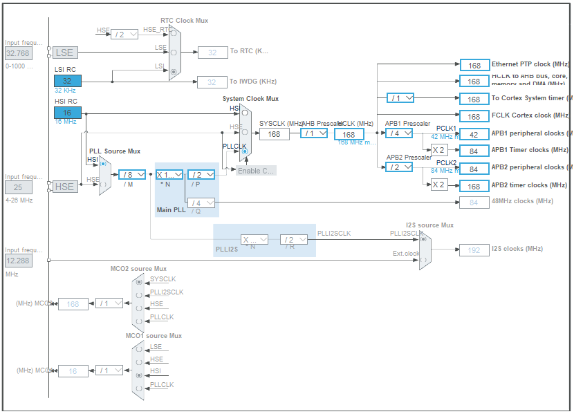
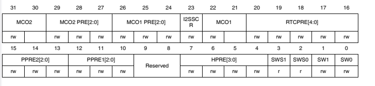
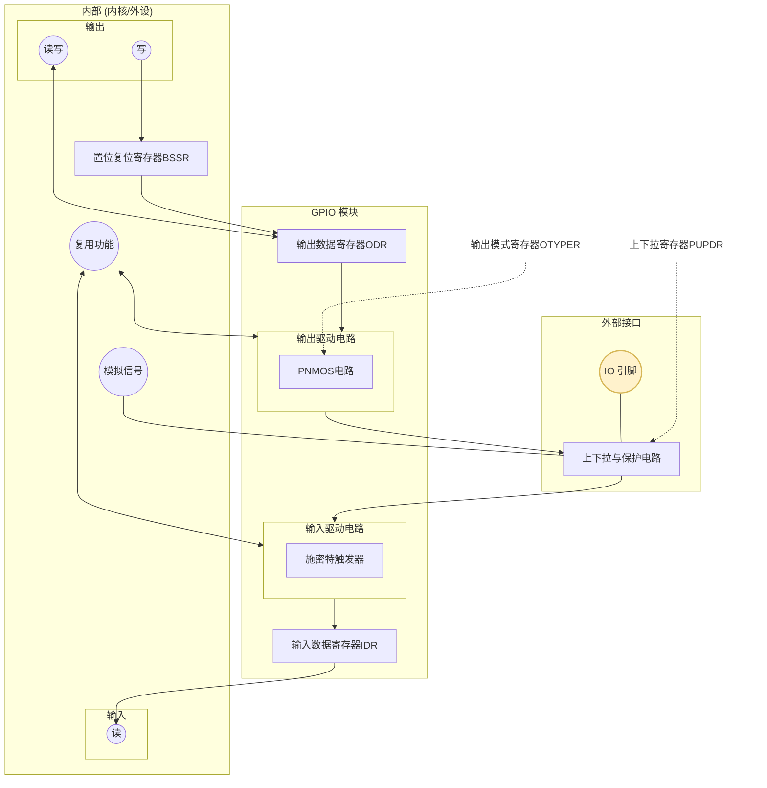
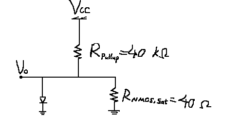
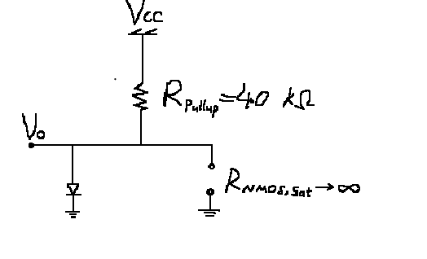

# Chapter 1 寄存器点亮led

---

点灯是嵌入式最简单的事情， 也是嵌入式最难的事情。每学一个新的嵌入式平台，第一件事情学点灯，学的也不是点灯本身。平台不同，体系不同，背后的设计哲学不同，一个点灯实验就能见微知著。笔者尽可能在本章让读者通过一个最少封装的点灯案例，深刻体悟stm32的系统哲学。只有建立了对stm32的基本认识，以后完成复杂的大工程才会确保有更多的“构建即正确”，而不是把stm32当做大号的8位MCU，或者是一个裹着层层封装库大衣的黑盒。

从8位单片机过渡到stm32，好比乡下人进大城市买房。所谓“城市套路深”，不了解大城市的运行规则，哪怕是在城市落脚都可谓艰难。在本章节我们会全程贯彻这个“乡下人进城”的比喻，便于读者在一开始就掌握32开发的基本框架。

本章重点

1.了解STM32架构的基本哲学，从8位单片机的思路，过渡到STM32多中心，统一编址的SoC的思路

2.掌握储存器映射和寄存器映射的规则，掌握如何在STM32上完成寄存器操作

3.了解ARM和ARM基础指令，分析程序启动汇编文件，掌握构建STM32的最小工程

4.学习RCC和GPIO外设，点亮第一个LED灯

5.了解标准库和HAL库的开发差异，并能构建标准库和HAL库工程。


## 0 本章节目录

## 1 乡下人进城买房：初识stm32


### 1.1 STM32 的基本哲学：从 8 位 MCU 到 32 位片上系统

如果你已经掌握了 8 位 MCU，比如 PIC16、C51，那么进入 STM32F4 时最重要的不是先去背寄存器名，而是先完成一次**思维方式的切换**。（如果你之前没学过8位MCU, 那你的学习会很痛苦。建议找一款去学）

PIC16、C51 这类 8 位单片机，像一个小农村：村子不大，路不多，几栋房子、几亩田地、几样农具，基本都摆在眼前。谁负责什么，往往一目了然。CPU 就像村支书，很多事情都是它亲自过问、亲自处理。

而 STM32F4 则完全不同。它不是“多几个寄存器、多几个外设”的简单加法，而更接近一句话：**more is different**。当规模上来以后，系统的组织方式、模块之间的关系、开发者观察问题的角度，都会发生质变。

如果说 8 位单片机是一个小农村，那么 STM32F4 更像一座大城市：有街道，有楼栋，有统一的水电气网络，有交通干线，有不同部门分工协作，还有一整套组织管理体系。
 因此，学习 STM32F4，本质上不是在学一个“大号 8 位机”，而是在学一个**具有内核、总线、统一存储、时钟和外设协同机制的片上系统**。

下面这几条，就是从 8位机 走向 STM32时最应该先建立起来的基本哲学。

------

#### 1.1.1 ARM 内核 + 片上系统 SoC：从小村庄到大城市，大一统的单片机

在8位MCU，比如 PIC16 的世界里，我们更容易把单片机理解成“CPU + 若干寄存器 + 若干外设”。这种理解在小型 8 位系统上通常是够用的，因为芯片规模不大，很多模块也没有明显分层。

但 STM32F4 不是这样。STM32F4 可以理解成两层结构叠在一起：

第一层是 **ARM Cortex-M4 内核**。
 这一层决定了程序如何执行、函数如何调用、中断如何进入、异常如何返回、栈如何使用、寄存器如何组织。换句话说，它规定了“这台机器的大脑是怎么思考的”。

第二层是 **片上系统 SoC（System on Chip）**。
 这一层包括 Flash、SRAM、GPIO、USART、SPI、I2C、定时器、DMA、RCC、电源管理、总线系统等。它们不是杂乱地堆在一起，而是被组织在一套统一的硬件结构中。

所以，学习 STM32F4 时必须明白：

> 你面对的不是一颗“功能多一点的单片机”，而是一颗“**ARM 内核驱动下的片上系统**”。

这句话很重要。因为从这一点出发，你后面看到的很多东西就都能串起来了：

- 为什么 STM32 要讲启动流程，而不仅仅是 `main()`；
- 为什么中断不只是“来一个信号就跳一下”；
- 为什么 DMA、RCC、总线这些东西在系统里地位这么高；
- 为什么 STM32 的开发天然比 8 位机更强调分层和协同。

比起 PIC1这种“一个人能管得过来的村庄”， STM32F4 是“必须依靠制度和组织来运转的城市”。需要严格的系统组织，复杂的管理模式。这就是第一层哲学：**STM32F4 的本质不是“更多外设”，而是“更高层次的系统组织”。**

------

#### 1.1.2 统一的地址空间与 Memory Map：在城里找房子，先拿地图，再找马路

在 PIC16 中，开发者经常是“记机关”的思路——比如记住 `PORTA`、`TRISA`、`TMR1`、`INTCON`，然后去拨动这些特殊功能寄存器。你更像是在面对一张“机关名单”。

STM32F4 则不是这种思路。它更强调 **memory map**，也就是**统一的地址映射图**。在 STM32F4 中，Flash、SRAM、外设寄存器，乃至系统控制相关部件，都被放进同一个地址空间中。对程序员来说，它们都表现为“某个地址范围里的内容”：

- Flash 在某一段地址上；
- SRAM 在另一段地址上；
- GPIO、USART、TIM 等外设也各自占有一块地址区域；
- 每个外设内部的各个寄存器，则是这块区域中的不同偏移。

这意味着，STM32F4 的世界更像一张城市地图。你不再只是记住“有几个机关”，而是要先学会看地图：

- 哪一片区域是程序存储器；
- 哪一片区域是数据存储器；
- 哪一片区域是外设区；
- GPIOA 这栋“楼”在哪；
- USART2 那栋“楼”又在哪。

所以对 STM32F4 来说，更自然的理解方式不是“寄存器名列表”，而是：**先理解地址地图，再理解地图上每栋楼的用途**。这和 PIC16 的差别很大。 PIC16 当然也有地址，也有存储划分，但它给人的编程体验更偏向“寄存器导向”；而 STM32F4 的编程体验更偏向“地址空间导向”。这就是为什么 STM32F4 的很多后续知识都依赖 memory map：

- 为什么外设寄存器可以像访问内存一样访问；
- 为什么 DMA 能在外设和 SRAM 之间搬运数据；
- 为什么链接脚本要关心段放在什么地址；
- 为什么 Bootloader 和应用程序要讨论地址布局。

如果用城市比喻来说，那么在农村找人，可以直接问“村口王大爷家在哪”；
 但在大城市找房子，你首先得看地图、认街道、找门牌号。
 STM32F4 的开发思维，就是这种“先认地图，再办事”的思维。

------

#### 1.1.3 复杂的初始化：在城里买房子，不只是拿钥匙，还要办水电气网

在 PIC16 这类 8 位 MCU 中，很多时候你想用一个外设，直觉上就是“去配它的寄存器”。
 比如想用定时器，就去配定时器；想用串口，就去配串口。虽然也有前提条件，但整体上结构比较直接。

STM32F4 则不同。
 在这个系统里，一个外设能否真正工作，往往不仅取决于“这个外设本身怎么配置”，还取决于它是否已经具备运行前提。

这就像在农村分一块地、盖一间房，可能自己收拾一下就能住；但在城市买房，拿到钥匙还远远不够，你还得处理一整套基础设施问题：水通没通?电通没通?燃气开没开?宽带有没有装?等等

对应到 STM32F4，就是这些初始化前提：

- 时钟源是否配置正确；
- RCC 是否给相应外设打开了时钟；
- GPIO 是否设置成正确模式；
- 引脚复用是否选对；
- 总线分频是否满足目标频率；
- 外设是否从复位状态切换到了可工作状态。

也就是说，在 STM32F4 中，**初始化不是简单“写几个控制位”**，而是一个系统性的前置工程。
 它要求你先把城市基础设施搭起来，后面的居民活动才能开始。

所以学习 STM32F4 时，要尽快建立这样一个意识：

> 在 STM32F4 里，功能配置之前，必须先满足系统前提。

很多初学者刚从 8 位机转过来时容易困惑：
 “明明 USART 寄存器我都配了，为什么不发？”
 “明明 GPIO 模式对了，为什么没反应？”
 问题常常不在于功能逻辑本身，而在于**时钟、复用、总线、复位状态这些前提没有搭好**。

因此，STM32F4 的初始化之所以复杂，不是因为它故意麻烦，而是因为它已经不再是一个“随手拨几个机关就能动”的小系统了。
 城市越大，基础设施越重要；系统越复杂，初始化就越必须讲秩序。

------

#### 1.1.4 总线系统和模块协同：村支书可能包办一切，但市长不可能

在 PIC16 的世界里，CPU 常常像村支书一样，很多事情都由它亲自过问：

- 轮询是它；
- 响应中断是它；
- 从寄存器里读数据是它；
- 把数据写到 RAM 里还是它。

换句话说，PIC16 这类小系统更容易形成一种“CPU 包办一切”的直觉。
 因为系统规模不大，很多事情确实可以这样做。

STM32F4 就不一样了。

在 STM32F4 这种级别的系统里，CPU 不再是唯一干活的人。
 它更像一个市长：负责决策、调度、协调，但不可能亲自去做城市里的所有具体事务。
 真正让整个系统高效运转的，是一套有分工、有道路、有协作关系的组织结构。

这套结构里，最核心的几个角色包括：

- **总线系统**：负责把各个模块连接起来，像城市里的主干道和支路；
- **RCC**：负责时钟分发，像统一的供电和能源系统；
- **NVIC**：负责中断管理，像城市事件的调度中心；
- **DMA**：负责数据搬运，像专门的物流系统；
- **各类外设模块**：像城市里的不同部门和功能单位。

因此，STM32F4 的强大，不仅仅来自主频更高、寄存器更多，而更来自：

> 各个模块已经不是孤立存在，而是在总线和时钟体系下协同工作。

这和 PIC16 的思路差别很大。
 在 PIC16 里，CPU 经常既是决策者，也是执行者，还是搬运工；
 而在 STM32F4 里，CPU 开始更多地扮演组织者的角色。

例如，在一个典型的数据采集场景中：

- 定时器负责产生周期性触发；
- ADC 负责完成采样；
- DMA 负责把采样结果搬到内存；
- CPU 最后只需要在合适的时候处理这一批数据。

这就是一种典型的“模块协同”而不是“CPU 包办”。

所以，从 PIC16 走向 STM32F4，必须建立一个新的系统观：

> STM32F4 不是一个靠 CPU 单打独斗的单片机，而是一个依靠总线、时钟、中断、DMA 和外设共同运行的片上城市。

如果你仍然习惯把所有事情都写成“CPU 轮询 + CPU 处理中断 + CPU 手动搬数据”，那么你虽然也能把 STM32F4 用起来，但很可能只是把它当成了一颗“很贵的大号 PIC”。
 而真正理解 STM32F4，意味着学会让系统里的不同模块各司其职。


### 1.2 Cortex-M内核

STM32F4 不只是 ST 做的一颗单片机，它首先是一颗**基于 Arm Cortex-M 内核**的 MCU。因此，学习 STM32F4，不能只看 GPIO、USART、TIM 这些外设，也必须知道这颗芯片的“CPU 内核”是谁，它负责什么。

#### 1.2.1 STM32 与 Cortex-M 的关系

STM32 和 Cortex-M 不是同一个概念。

- **STM32** 是 ST 推出的 MCU 产品系列
- **Cortex-M** 是 Arm 提供的处理器内核

也就是说，STM32F4 可以理解为：

- Arm 提供 Cortex-M4 内核

- ST 在这个内核周围集成 Flash、SRAM、时钟系统和各种外设

- 内核基于**总线矩阵**实现对内存和外设的管理

  

所以：**STM32 是整颗芯片，Cortex-M 是芯片的大脑。**这个区分很重要。因为以后你会发现：

- 中断和异常的很多规则，来自 Cortex-M
- GPIO、USART、RCC 这些模块的具体实现，来自 STM32 本身


#### 1.2.2 Arm Cortex-M架构概述

STM32 系列 MCU 采用 Arm 的 **Cortex-M 内核**。M的意思是Micro版本，面向嵌入式的。STM32不同系列对应不同内核，例如：

| STM32系列 | 内核      |
| --------- | --------- |
| STM32F0   | Cortex-M0 |
| STM32F1   | Cortex-M3 |
| STM32F4   | Cortex-M4 |
| STM32F7   | Cortex-M7 |

本教程主要使用STM32F4,所以内核是 Cortex-M4。

我们不必完全学会Arm Cortex-M架构的所有细节，这些自然有更好的书籍解释。但是对于32开发，我们必须要掌握Arm Cortex-M的下面五件事情：

| 关键机制                        | 基本事实                                                     |
| ------------------------------- | ------------------------------------------------------------ |
| **Thumb 指令集**                | Cortex-M 用的是Arm指令集的一个子集，能更好的节省Flash空间。但是也会带来功能受限问题和复杂运算的速度问题。 |
| **寄存器模型**                  | Arm 的寄存器结构决定了函数调用、栈、上下文切换等底层机制，具体会体现在函数汇编的序言和尾声中。（笔者另有一本书嵌入式C入门，介绍了Arm寄存器模型和x86寄存器模型的栈帧差异） |
| **异常模型（Exception Model）** | Cortex-M 用统一的异常机制管理中断、Fault 和系统调用          |
| **NVIC（嵌套向量中断控制器）**  | 硬件级中断管理器，实现优先级和嵌套中断                       |
| **SysTick 定时器**              | Cortex-M 内置的系统定时器，RTOS 和系统节拍的基础             |

#### 1.2.3 常用寄存器定义

Cortex-M 内核提供了一组固定的核心寄存器，这些寄存器构成了所谓的 **程序员模型（Programmer's Model）**。
 无论使用 C 语言还是汇编程序，这些寄存器都会参与程序执行、函数调用、中断处理和异常返回。

对于 STM32 开发者来说，不需要记住所有寄存器的细节，但以下几个寄存器必须有基本认识。

| 寄存器                 | 名称                    | 作用                   | 说明                                                         |
| ---------------------- | ----------------------- | ---------------------- | ------------------------------------------------------------ |
| R0–R12                 | 通用寄存器              | 存储临时数据和运算结果 | CPU 最常用的工作寄存器。在函数调用中，编译器通常会使用 **R0–R3** 传递参数和返回值，所以一般是栈帧的组成部分。 |
| SP(Main SP,Process SP) | Stack Pointer           | 栈指针                 | 指向当前栈顶，用于函数调用和中断现场保存. 在普通裸机程序中通常使用 MSP，而在 RTOS 中常常会使用 PSP 来管理任务栈。 |
| LR                     | Link Register           | 链接寄存器             | 保存函数返回地址。一般是栈帧的组成部分。                     |
| PC                     | Program Counter         | 程序计数器             | 指向下一条即将执行的指令                                     |
| xPSR                   | Program Status Register | 程序状态寄存器         | 保存 CPU 状态和条件标志                                      |


#### 1.2.4 常见 Cortex-M 汇编指令

本教程不会要求读者编写汇编程序，但在阅读启动代码、反汇编调试或理解异常处理时，经常会看到一些基本的 Cortex-M 汇编指令。下面列出最常见的一些指令及其作用。

**数据传送类**

| 指令 | 作用       | 直观理解       |
| ---- | ---------- | -------------- |
| MOV  | 寄存器复制 | 寄存器之间搬值 |
| LDR  | 从内存读取 | 从内存加载     |
| STR  | 写入内存   | 写入内存       |

**算术与逻辑**

| 指令 | 作用     | 直观理解     |
| ---- | -------- | ------------ |
| ADD  | 加法运算 | 相加         |
| SUB  | 减法运算 | 相减         |
| CMP  | 比较     | 更新条件标志 |
| AND  | 按位与   | 清除某些位   |
| ORR  | 按位或   | 设置某些位   |

**控制流**

| 指令 | 作用       | 直观理解   |
| ---- | ---------- | ---------- |
| B    | 无条件跳转 | 程序跳转   |
| BL   | 函数调用   | 调用函数   |
| BX   | 跳转寄存器 | 常用于返回 |

**栈操作**

| 指令 | 作用 | 直观理解   |
| ---- | ---- | ---------- |
| PUSH | 压栈 | 保存寄存器 |
| POP  | 出栈 | 恢复寄存器 |

记住这些指令和寄存器，我们会在后面点灯的时候用到他们。

### 1.3 总线和片上资源

#### 1.3.1 总线矩阵与统一内存架构

在1.2我们讨论了arm内核和片上资源的关系，我们知道arm内核通过一个叫总线矩阵的东西完成对外设的交互。对于习惯8位单片机的读者， 可能会对总线矩阵这个概念感到陌生。事实上，这个概念正是理解stm32片上资源交互的灵魂。

我们之前在1.1里讲到，stm32具备的“多部门协同”这个设计哲学的核心，其实关键就在与两点，一方面对于从设备（如外设）而言，CPU内核不再是唯一的主设备。不光是内核可以访问FLASH,SRAM和外设，DMA设备和一些外设本身自己也能使用这些资源。另一方面，对于主设备（如Arm核心），从设备之间没有本质的差异，只需要按照地址读取写入就行了，这是主设备最擅长的， 这些外设在总线上被统一编址，因此不管你是存放代码、变量，还是放一大坨数据，又或者是改GPIO的寄存器，都是改同一片连续的内存空间。这种架构又被叫做 **统一内存架构**（Memory-Mapped Architecture）。

下面这张图来自数据手册，是我们f407xx的总线矩阵图。


从图中我们可以明显的看到，CPU,DMA,USB和Ethernet都是主设备，而外设，储存器等则是从设备。

这种架构还有一个显而易见的优点。就是只需要把片内总线的接口暴露给外部，便可以使用芯片外部低廉的存储设备的同时，让使用这些外部设备对于CPU来说如同使用片内设备一样直接，省去了繁琐的硬件的串行协议，大大提高了速度。这也就是FSMC（Flexible Static Memory Controller）这个外设的作用。

#### 1.3.2 总线：不同速度的城市道路和管网

##### 总线架构

在 stm32f4 这种基于 ARM AMBA（高级微控制器总线架构）的系统里，总线不再是简单的几根导线，而是一套**分层通信网络**。主设备（如 CPU、DMA）和从设备（如 GPIO、SRAM）之间的一切交互，都依赖总线矩阵进行调度。

这种架构设计的核心价值在于**解耦**：CPU 只需要发出一个地址请求，总线矩阵负责把信号路由到对应的硬件。对于 CPU 来说，它不需要知道对面是 Flash 还是 GPIO 寄存器，它只管按地址办事。

##### AHB 和 APB

STM32不同于大多数8位单片机，他有着168MHz的主频，如果让所有外设都跑在主频（168MHz）下，不仅低速外设也跟不上，而且芯片功耗会爆炸。因此，stm32 像城市道路分级一样，设计了 AHB 和 APB 两类总线：

- **AHB (Advanced High-performance Bus)**：**高速主干道**。 连接的是 CPU、SRAM、DMA 等核心部件。
  - **重点关注**：在 F4 架构中，**GPIO 挂载在 AHB1 上**。这意味着 CPU 访问 GPIO 的路径极短，可以实现单周期翻转。这是 F4 相比 F1（挂在低速 APB 上）最显著的硬件架构升级。
- **APB (Advanced Peripheral Bus)**：**外设支路**。 本身是通过桥接器连接到 AHB 上的支路，频率更低，主要为了降低功耗。
  - **APB2 (高速外设总线)**：挂载 ADC、SPI1、高级定时器等。
  - **APB1 (低速外设总线)**：挂载 UART2/3、I2C、普通定时器等。


#### 1.3.3 内存映射图（Memory Map）真的是一个Map

由于Memory-Mapped Architecture这个架构的存在，对于主设备而言，外设的寄存器也好，芯片自己的储存器也好，只不过是位于连续地址空间中的不同区域罢了。这样，对于STM32这个“城市”而言，所有的“房屋”（储存设备，寄存器）都有了“邮编”（分区基址）和“门牌号”（基址偏移量）。有了这个理解，我们理解内存映射图也就不难了。本质上就是STM32内部的地图，我们要找一个具体的地方，比如要找GPIO的寄存器，按照地图找就行了。下面是f407的Memory Map, 总共规划了有4GB的空间：


显然，由于4G的内存map空间太大，远大于片上所有的储存设备实际大小之和。地址空间存在大量的地址没有实际的硬件资源与之关联。

上面这个映射图可读性很差，我们按范围从大到小理解，最大的是**块（block）**，这个类似于一个市的不同区，整个map被分成了8个block：

| 块   | 用途                 | 大小   | 地址范围                | 说明                                                     |
| ---- | -------------------- | ------ | ----------------------- | -------------------------------------------------------- |
| 0    | Code                 | 512MB  | 0x00000000 – 0x1FFFFFFF | 代码，包括了FLASH,CCM Data RAM，还有ST不让改的自举程序等 |
| 1    | SRAM                 | 512MB  | 0x20000000 – 0x3FFFFFFF | SRAM,包含了片上16KB的SRAM2和112KB的SRAM1                 |
| 2    | On-chip Peripherals  | 512MB  | 0x40000000 – 0x5FFFFFFF | 片上外设寄存器，我们要点灯就得找这一块                   |
| 3    | FSMC bank1~2         | 512MB  | 0x60000000 – 0x7FFFFFFF | FSMC外挂设备的地址空间，用于扩展外部RAM                  |
| 4    | FSMC bank3~4         | 512MB  | 0x80000000 – 0x9FFFFFFF | 同上                                                     |
| 5    | FSMC Register        | 512MB  | 0xA0000000 – 0xBFFFFFFF | 留给FSMC控制器自己的寄存器，实际上只有28个               |
| 6    | Not Used             | ·512MB | 0xC0000000 – 0xDFFFFFFF | 字面意思 没用                                            |
| 7    | Cortex-M Peripherals | 512MB  | 0xE0000000 – 0xFFFFFFFF | Cortex-M自己的外设，比如Systick，NVIC等                  |

当然目前我们只需要着重掌握前三个block。这和我们本章任务相关。块之下，分成不同的硬件资源区域，比如你可以猜想Flash作为程序代码的区域，应该在Block 0里面。硬件资源区域里面可能还有不同的寄存器等...最小的地址单元就是字（Word），大小是4Bytes（32bit），正好可以用一个int装下. stm32的寄存器都是32位的。


##### Block 0：Code

| 地址范围                  | 用途说明                                                     |
| ------------------------- | ------------------------------------------------------------ |
| 0x1FFF C008 ~ 0x1FFF FFFF | 预留                                                         |
| 0x1FFF C000 ~ 0x1FFF C007 | 选项字节：用于配置读写保护、BOR 级别、软件/硬件看门狗以及器件处于待机或停止模式下的复位。当芯片不小心被锁住之后，我们可以从 RAM 里面启动来修改这部分相应的寄存器位。 |
| 0x1FFF 7A10 ~ 0x1FFF 7FFF | 预留                                                         |
| 0x1FFF 0000 ~ 0x1FFF 7A0F | 系统存储器 + OTP：系统存储器里面存的是 ST 出厂时烧写好的 ISP 自举程序，用户无法改动。串口下载的时候需要用到这部分程序。OTP 区域，其中 512 个字节只能写一次，用于存储用户数据，额外的 16 个字节用于锁定对应的 OTP 数据块。 |
| 0x1001 0000 ~ 0x1FFE FFFF | 预留                                                         |
| 0x1000 0000 ~ 0x1000 FFFF | CCM 数据 RAM：64K，CPU 直接通过 D 总线读取，不用经过总线矩阵，属于高速的 RAM。 |
| 0x0810 0000 ~ 0x000F FFFF | 预留                                                         |
| 0x0800 0000 ~ 0x080F FFFF | **FLASH(1MB)：我们的程序就放在这里。**                       |
| 0x0010 0000 ~ 0x07FF FFFF | 预留                                                         |
| 0x0000 0000 ~ 0x000F FFFF | 取决于 BOOT 引脚，为 FLASH、系统存储器、SRAM 的别名。        |


#####  Block 1：RAM

| 地址范围                  | 用途说明    |
| ------------------------- | ----------- |
| 0x2002 0000 ~ 0x3FFF FFFF | 预留        |
| 0x2001 C000 ~ 0x2001 FFFF | SRAM2 16KB  |
| 0x2000 0000 ~ 0x2001 BFFF | SRAM1 112KB |


#####  Block 2：片上外设

STM32的所有外设都挂载在总线上，分为APB(Advanced Peripheral Bus)和AHB(Advanced High-performance Bus)

| 基址        | 地址范围                  | 用途说明      |
| ----------- | ------------------------- | ------------- |
| 0x4000 0000 | 0x4000 0000 ~ 0x4000 7FFF | APB1 总线外设 |
|             | 0x4000 7800 ~ 0x4000 FFFF | 预留          |
| 0x4001 0000 | 0x4001 0000 ~ 0x4001 57FF | APB2 总线外设 |
|             | 0x4001 5800 ~ 0x4001 FFFF | 预留          |
| 0x4002 0000 | 0x4002 0000 ~ 0x4007 FFFF | AHB1 总线外设 |
|             | 0x4008 0000 ~ 0x4FFF FFFF | 预留          |
| 0x5000 0000 | 0x5000 0000 ~ 0x5006 0BFF | AHB2 总线外设 |
|             | 0x5006 0C00 ~ 0x5FFF FFFF | 预留          |

当然 具体各个寄存器，比如RCC的各种复位时钟控制的寄存，GPIO配置寄存器等，具体在什么位置，可以在[参考手册](../../reference/pdf/STM32F4xx中文参考手册.pdf)的中**Ch2.3 储存器映射**这一章获得。这里我们至少知道他们大部分都位于Block2的这些地址中。

## 2 买房入住须知：启动流程，时钟树，GPIO配置

大概了解了这个大城市的地图，知道买哪儿的房子，接下来我们还得知道怎么买房。正如我们说的，城市买房，首先要去找售楼部或者中介，要签合同，然后还得办各种手续和水电气网，最后还得去物业办门禁，一通折腾才能住下来。STM32从找到外设和用外设，也是有着复杂的流程。接下来我们会就启动流程，时钟配置和GPIO配置三个重要事项开展严肃学习。

### 2.1 STM32启动代码

学会启动流程，如同搬新家得先找到小区门口去物业办门禁，我们需要知道我们的程序需要满足哪些最小条件才能启动。在 STM32 工程中，启动流程是一个汇编文件。[在这里](code/ref/startup_stm32f40xx.s)你可以找到这个文件。强烈建议一边汇编代码看一边阅读本章节。虽然大部分读者应该是“谈汇编色变”，但文档里面有保姆级的注释，不用担心。

这个文件也就百来行，只不过完成了几件下面事情：

1. 定义程序运行时的 **栈和堆**
2. 定义 **中断向量表**
3. 实现 **Reset_Handler**
4. 提供默认的 **异常处理函数**

换句话说，这个文件负责把 MCU 从“刚上电的硬件状态”带入到“可以运行 C 程序的状态”。

接下来我们按顺序看这个文件最重要的几个部分。

------

#### 2.1.1 栈与堆的定义

文件最开始定义了程序运行时使用的栈和堆：

```
Stack_Size      EQU     0x00000400
AREA    STACK, NOINIT, READWRITE, ALIGN=3
Stack_Mem       SPACE   Stack_Size
__initial_sp
```

这里做了三件事情：

1 **定义栈大小**

```
Stack_Size = 0x400
```

​	也就是 **1KB 栈空间**。

**2 在内存中预留一段区域用于作为运行时栈。**

```
SPACE Stack_Size
```


**3 定义栈顶地址**

```
__initial_sp
```

这个符号稍后会被放进 **中断向量表** 的第一项。Cortex-M 规定：启动时 CPU 会把向量表第一个值加载到 **MSP（主栈指针）**，因此程序一开始就有了可用的栈。后面还有类似的代码定义堆：

```
Heap_Size       EQU     0x00000200
AREA    HEAP, NOINIT, READWRITE, ALIGN=3
```

如果你很少使用 `malloc`，堆可以设置得很小。

------

#### 2.1.2 中断向量表

接下来是启动文件中最重要的一部分：

```
AREA    RESET, DATA, READONLY
EXPORT  __Vectors
```

这里定义的是 **中断向量表（Vector Table）**。

向量表的开头如下：

```
__Vectors
    DCD __initial_sp
    DCD Reset_Handler
    DCD NMI_Handler
    DCD HardFault_Handler
```

这几行非常关键。CPU 上电以后会做两件事：

1. 读取地址 `0x00000000`
    → 设置 **MSP**
2. 读取地址 `0x00000004`
    → 跳转到 **Reset_Handler**

也就是说：

```
0x00000000 → 初始栈顶
0x00000004 → 程序入口
```

这就是为什么向量表的第一项是`__initial_sp`，第二项是`Reset_Handler`，后面则是各种异常和中断入口：

```
HardFault_Handler
SysTick_Handler
USART1_IRQHandler
TIM2_IRQHandler
...
```

每个中断都对应一个函数地址。当硬件产生中断时，CPU 会：根据中断号1.查向量表2.跳转到对应函数

------

#### 2.1.3 Reset_Handler

真正的启动逻辑在这里：

```
Reset_Handler PROC
```

核心代码只有几行：

```
IMPORT SystemInit
IMPORT __main

LDR R0, SystemInit
BLX R0

LDR R0, =__main
BX R0
```

这段代码完成两个步骤：

**第一步：调用 SystemInit()**

`SystemInit()`是启动代码给用户的第一个接口，他运行完即结束。

------

**第二步：进入 C 运行库**

接下来进入`__main`.注意这里不是 `main`。逆向过C工程的或许知道，`__main` 是 **C 运行库入口函数**。`main`才是`main()`的入口。运行前者包括了运行后者

`__main`会完成：

1. 初始化 `.data` 段
2. 清零 `.bss` 段
3. 初始化 C 运行环境
4. 最终调用`main()`

所以完整流程是：

```
复位
↓
向量表
↓
Reset_Handler
↓
SystemInit()
↓
__main
↓
main()
```

------

#### 2.1.4 默认中断处理函数

启动文件还定义了一系列默认中断：

```
NMI_Handler
HardFault_Handler
MemManage_Handler
BusFault_Handler
```

默认实现非常简单：

```
B .
```

意思是跳回自身，也就是**死循环**。这样设计的好处是：程序出现异常时，CPU 会停在这里，你可以在调试器里看到程序卡住的位置，从而定位问题。

------

#### 2.1.5 WEAK 中断机制

在文件后面可以看到大量这样的声明：

```
EXPORT USART1_IRQHandler [WEAK]
```

`WEAK` 的意思是 **弱符号**。它允许用户在 C 文件中写同名函数来覆盖默认实现，例如：

```
void USART1_IRQHandler(void)
{
    // 用户自己的中断代码
}
```

链接器会自动用你的函数替换掉启动文件中的默认版本。这样既保证默认情况下程序可以编译运行，用户又可以自由实现中断。这是 STM32 启动代码中非常常见的一种设计。

------

#### 2.1.6 启动代码在系统中的位置

综合起来，一个STM32 工程的结构大致如下：

```
Flash
│
├── 向量表
│
├── startup_stm32f4xx.s
│       Reset_Handler
│
├── system_stm32f4xx.c（SystemInit()一般单独存在，当然也可以写main.c里面）
│       SystemInit()
│
└── main.c
        main()
```

因此，最小情况下，我们需要定义两个C函数，一个SystemInit()，一个main(), 把他编译出来，用链接器一通链接，就能正常跑程序了。程序执行流程：

```
MCU复位
↓
向量表
↓
Reset_Handler
↓
SystemInit()
↓
C运行库初始化
↓
main()
```

理解这一点以后，你再去看 CubeMX 生成的工程、标准库工程，启动文件就不再是一段“神秘模板”，而是 MCU 启动流程最核心的一部分。

------

#### 2.1.7 补充：GCC版启动文件和Keil版有什么不同

前面我们讲解启动流程时，用的是 Keil/MDK 风格的启动文件，因为它的结构更规整，比较适合作为入门材料。不过如果你看Keil CubeMX生成的工程，会发现它用的是一份 GCC 版启动文件：[在这里](code/cubemx_min/led_minimum/startup_stm32f407xx.s)。

这两份文件完成的任务本质上是一样的，都是为了把 MCU 从“刚上电”的状态带到“可以运行 `main()`”的状态，只不过**分工方式不同**。

Keil 版的特点是：

- 在启动文件里直接定义栈和堆
- 在 `Reset_Handler` 里主要调用 `SystemInit()`
- 然后跳到 `__main`
- 再由 Keil 的 C 运行库去完成 `.data` 初始化、`.bss` 清零等工作

GCC 版则更“直白”一点。它通常不在启动文件里自己分配栈堆，而是依赖链接脚本（`.ld` 文件）提供 `_estack`、`_sdata`、`_edata`、`_sbss`、`_ebss` 这些符号。然后在 `Reset_Handler` 里自己完成下面这些工作：

1. 设置栈指针 `sp`
2. 调用 `SystemInit()`
3. 把 `.data` 段从 FLASH 拷贝到 RAM
4. 把 `.bss` 段清零
5. 调用 `__libc_init_array`
6. 跳转到 `main()`

所以你可以简单记：

- **Keil版**：很多运行时初始化工作藏在 `__main` 里面
- **GCC版**：很多运行时初始化工作直接写在 `Reset_Handler` 里面

这也是为什么你会看到，Keil 版启动文件更像“先把流程交给物业”，而 GCC 版更像“自己把搬家具、通水电这些事情一件件做完”。

不过不要被语法差异吓到。无论是 `AREA`、`DCD`、`EXPORT [WEAK]`，还是 `.section`、`.word`、`.weak`、`.thumb_set`，说到底都只是不同工具链下的不同写法。它们背后的系统逻辑并没有变：

- 先准备栈
- 再进入复位处理函数
- 初始化运行环境
- 最后调用 `main()`

所以，前面按 Keil 版建立起对启动流程的整体理解，后面再去看 GCC 版，其实只是“换了一套方言”，不是换了一套世界观。

### 2.2 时钟配置

#### 2.2.1 时钟树

我们之前提到，STM32有一个分层的总线架构，分为高速的AHB和低速的APB。那你或许能猜到，他们一定有着不同的时钟频率。低速的总线和更低速的外设用到的时钟必须经过高速时钟层层降频获得。**从时钟源，到高速再到低速，如同树的主干和树枝**，**这就是时钟树**。在 8 位机里，时钟的配置是可选择的，无非就是几个管理源头和分频的寄存器，甚至可以不用配置也能使用。但在 stm32 中，由于采用了这种分层总线架构，**每一个总线时钟默认都是关闭的**。

这就引出了 stm32 编程的一条铁律：**要在对应的总线上开启外设时钟**。如果你要点灯，你必须先在 RCC 寄存器里找到 AHB1 的使能位，把 GPIO 的时钟供上。否则，无论你如何修改 GPIO 寄存器，底层电路都不会有任何响应——这就像你在新房子里狂按开关，但房子根本没通电。

事实上，这种如无必要不通时钟的模式，也是stm32能做到低功耗的一个原因。你要是当市长，你也不希望没住人的郊区天天灯火通明吧。

#### 2.2.2 配置时钟树

##### 从CubeMX时钟配置界面认识时钟树

下图是在CubeMX内配置工程的时钟配置界面。非常直观地展示了时钟树的结构。我们明显的看到，配置时钟无非就几件事：选择时钟源，配置AHB分频器，配置APB分频器。



可以看到STM32有**四个基本的时钟源LSI,HSI,LSE,HSE**. 这些缩写都很直接，LSI是内部(internal)RC电路的慢（Low Speed)时钟，是16KHz;HSI则是High Speed, 有16MHz. 然后我们可以使能外部(External)时钟引脚来启用LSE和HSE。他们分别是pin#8~#9（LSE）和pin#23~#24（HSE).由于上图没有使能，所以界面上默认是灰的。

##### **第一个外设，RCC**

当然CubeMX是用于HAL库工程的，我们现在需要使用寄存器操作来实现同样的效果。我们需要和一个关键的外设打交道，也就是RCC。这也是我们教程的第一个外设。

RCC全称Reset and Clock Controller, 是stm32中掌管所有复位和时钟逻辑的衙门。查阅[参考手册](../../reference/pdf/STM32F4xx中文参考手册.pdf)的Ch2.3, 我们知道RCC占据了如下地址空间`0x40023800 - 0x40023BFF`.那么**0x40023800**就是RCC的基址。

接下来我们介绍RCC一些比较基础的寄存器和基础功能。

##### **RCC_CFGR 时钟配置寄存器**

要想知道需要配哪些寄存器，我们需要查阅[参考手册](../../reference/pdf/STM32F4xx中文参考手册.pdf)的**Ch6.3 RCC寄存器**。首当其冲的就是**RCC_CFGR**(配置寄存器，Configure Register)。

**位置**：虽然数据手册写得很清楚是0x40023808, 但是我们知道，我们写一个房子的地址的方法是从大到小，从区，街道，楼栋再到门牌号。我们写寄存器的地址也要按照**基址层层加偏移量**的方法，在代码中也要提现出来。

> 0x40000000（Block3)+0x20000(AHB1)+0x3800(RCC)+0x08(RCC_CFGR)

**位定义**：见下图



**选择时钟源**：查询参考手册的同时，我们对照CubeMX的时钟界面配置图。我们知道第一件事情是选择时钟源，图形界面的System Clock Mux就是对应了这个寄存器的SW[1:0]:，他有00,01 10三个合法配置，分别对应HSI HSE和PLL。我们要选择HSI,那么位[1:0]则需要改成00. 虽然手册上说硬件和软件都能改,复位后默认是00，我们在后续的实现中还是需要显式写明。

**配置分频器**：AHB,APB1,APB2的分频器分别是HPRE[7:4],PPRE1[12:10],PPRE2[13:15].AHB最大是÷512，APB最大是÷16.

例：基于16MHz的HSI, 给APB1上的USART2配置62.5KHz的时钟：
$$
Solution: \frac{16MHz}{62.5KHz}=256=64 \times{4}, PPRE1=101_{2}, HPRE=1100_{2}, SW1=SW0=0
$$


##### **RCC_AHB1ENR  AHB1时钟使能寄存器**

储存器映射表上清楚写明了GPIO 从A到I,9个port都被放在AHB1总线上。 那么我们要点灯（如果你还记得我们的任务是点灯的话）需要给AHB1通时钟。 这个寄存器就是RCC_AHB1ENR。 以下是他的位置和位定义

**位置**：`0x40000000（Block3)+0x20000(AHB1)+0x3800(RCC)+0x30(` **`RCC_AHB1ENR `**`)`

**位定义**：见下图


​	很显然，比如我们要使能GPIOF,那么把第5位置为1即可。

##### PLL和超频

可能你已经注意到了，我们目前并没有介绍PLL这个Mux留给我们的第三个时钟源。而这个功能则是STM32主频能够用16MHz的晶振干到168MHz的关键所在。熟悉高级电路理论和IC设计的朋友可能知道，PLL全名是锁相环（Phase-Locked Loop), 是一种功能强大的电路拓扑结构，现代很多电路应用都依赖于这个电路结构，比如在高速数字电路领域赖以生存的时钟数据恢复技术（CDR）,或者模拟射频领域的载波跟踪（Carrier Tracking）等。我们这里是数字锁相环电路，主要用于超频，通过鉴相器，数字滤波器在加上分频的负反馈，就能把晶振的电压信号$V_{co}$频率$f_{vco}$干到几十上百倍而不失精度。PLL输出频率的公式如下：
$$
f_{vco}=\frac{N}{M\times P}f_{PLL,in}\text{, where N}\in{[192,432]}\text{, M}\in{[2,63]}\text{, P}\in{\{2,4,6,8\}}
$$


从公式能看出，不只是倍频， 由于分频器始终只能用除以2的次方数，精度有限，借助PLL，我们灵活地改变时钟的频率。另外，虽然理论上通过锁相环，只要令N=432,M=2, P=2我们可以把$f_{vco}$干到1.728GHz，但受制于芯片性能，这种配置是不合法的。

PLL的配置寄存器是**RCC_PLLCFGR**，他的位置和位定义如下

**位置**：`0x40000000（Block3)+0x20000(AHB1)+0x3800(RCC)+0x04(RCC_PLLCFGR)`

**位定义**：见下图


​	PLLN对应N，PLLM对应M,直接转换为2进制写入即可。PLLP则是以二为底的指数。

### 2.3 GPIO

我们终于到我们房子门口了，现在只差开锁进门了。作为乡下人，你习惯了一个弹子锁就能锁住的大铁门，但是在城里，家家户户都是高级的指纹锁，你现在连门都不知道怎么打开... 类比过来就是，习惯了8位机配一个简单的输入/输出、模拟/数字就行，但是STM32的GPIO拥有7个工作模式！牵扯到的模式配置的寄存器更是不胜枚举。接下来让我们打开GPIO厚厚的说明书，看一看怎么打开GPIO这把锁：

#### 2.3.1 GPIO的电路结构和数据流向

##### GPIO电路拓扑

下面是GPIO的电路结构，非常重要，务必入脑入心入魂：


这个电路看似复杂 实际上我们暂时无需关心具体细节。观察拓扑结构 我们可以画出GPIO的数据流向图：




------


##### 数据流向和MODER寄存器定义

这个图有三层。观察 *内部* 这一层，我们发现GPIO的信号有四个内部的流向，他们分别是模拟，输入，输出和复用。他们均由GPIOx_MODER寄存器配置.（x对应端口，从A到I）。我们知道一个端口上有16个Pin，每个Pin在MODER上各自占据两个bit。位定义如下图所示：


##### 复用（Alternate Function）——STM32的外设资源管理

过去在8位单片机里，数据手册前几页就是引脚功能，你会在某个引脚后面看到一长串功能：TIM/TX/SDA.... 但32的外设资源不是这个逻辑。一个外设资源不见得固定属于某个引脚。这就是复用。

这个可以说是stm32伟大的总线矩阵设计导致的一个炫酷功能。 **因为有总线矩阵，我们可以轻易实现外设资源和GPIO本身的分离**，外设不再是和某几个GPIO强制绑定，而是通过复用的配置实现灵活的绑定和解绑。当我们启用了复用模式后，我们可以在GPIOx_AFR中（有高低位两个寄存器，AFRL和AFRH）选择AF1~16总共十六个外设资源槽位，就可以把GPIO绑定到特定的外设上。 当然由于布线本身的限制，一个特定的GPIO一般只能绑几个特定的外设。我们在[数据手册](../../reference/pdf/STM32F407_405 Datasheet.pdf)的Table.9中可以看到这个映射关系。

同理，模拟也有映射表。在[数据手册](../../reference/pdf/STM32F407_405 Datasheet.pdf)的Table.8中可以看到哪些引脚实际上有ADC资源。

#### 2.3.2 GPIO的7种工作模式

如同迅哥必须知道茴香豆的茴字有四种写法，所有嵌入式工程师都必须知道GPIO有七种工作模式。下面列出其中工作模式, 关联寄存器，各自常见的应用场景，然后我们再结合上面的电路进行解释。

| 流向 | 模式     | 英文                              | 相关寄存器配置                 | 典型场景         |
| ---- | -------- | --------------------------------- | ------------------------------ | ---------------- |
| 模拟 | 模拟     | **Analog Mode**                   | MODER=Analog                   | ADC/DAC          |
| 输入 | 浮空输入 | **Input Floating**                | MODER=Input，PUPDR=None        | 外部电路驱动     |
|      | 上拉输入 | **Input Pull-up**                 | MODER=Input，PUPDR=Pull-up     | 开关按下后接 VCC |
|      | 下拉输入 | **Input Pull-down**               | MODER=Input，PUPDR=Pull-down   | 开关按下后接 GND |
| 输出 | 推挽输出 | **Output Push-Pull**              | MODER=Output，OTYPER=PushPull  | LED / 普通IO     |
|      | 开漏输出 | **Output Open-Drain**             | MODER=Output，OTYPER=OpenDrain | I²C / 总线共享   |
| 复用 | 复用推挽 | **Alternate Function Push-Pull**  | MODER=AF，OTYPER=PushPull      | SPI / USART      |
|      | 复用开漏 | **Alternate Function Open-Drain** | MODER=AF，OTYPER=OpenDrain     | I²C              |

相信不难看出。7种模式就是在4个流向上,对于在电路配置的使能上做一点手脚发展出来的。 观察之前的框图， 我们发现， 输入模式主要由上下拉寄存器（PUPDR）进行配置。而输出则是输出模式寄存器（OTYPER）进行配置。接下来我们讲解开漏/推挽，浮空/上拉/下拉这些名词都是什么意思，由于都是涉及到电路，我们需要看我们一开始的电路图。

##### 推挽输出和开漏输出

上面的图片其实很清晰说明了，推挽和开漏两种模式，和输出驱动电路的CMOS结构有关。我们不必非常精细的去研究模拟电路画出CMOS的Vi-Vo曲线。我们只需要关心逻辑即可。

其实推，挽，开，漏都是在描述输出驱动电路的电流行为，反应电路是否具有驱动负载的能力。

推挽的英文是Push-Pull，其实意思很明确，就是推和拉。推的意思是吐出电流，相当于拉高电平，对应逻辑1，拉的意思是吃掉电流，相当于接地，对应逻辑0.

开漏的英文是Open-Drain,drain指的是可以吃掉电流，相当于接地，对应逻辑0；open的意思是open circuit， 内部 N-MOS 管截止，也就是开路/断路的意思，既不主动吃电流也不吐出电流，又叫高阻态（High Impedance), 对应逻辑Z, **必须外部有上拉才能通过，变成高电平**。之所以会有Drain模式， 是为了方便像I2C这种外部有上拉电阻的协议，都是开漏+统一上拉有个好处，就是**线与**，只要有一个输出0，整个总线就是0，必须全部为1才能是1.这样就不用去比谁的驱动能力强，便于同步。

下面的表格直观表达了不同输出模式的区别

| 输出信号 | 开漏模式 | 推挽模式 |
| -------- | -------- | -------- |
| Lo       | 0        | 0        |
| Hi       | Z(高阻)  | 1        |


##### 浮空，上拉和下拉输入

浮空，上拉和下拉

上拉和下拉就不难理解了，看图就知道，他针对的是不同的输入信号，如果输入信号没有驱动能力（Z/0)，比如收到了一个开漏模式的输出，我们需要上拉。如果信号没有拉低电平的能力（1/Z,你开心可以管他叫开源输出）。如果信号自己既能驱动又能拉低(1/0) ，比如收到了一个推挽模式的输出，我们浮空即可

| 输入信号（Hi） | 输入信号(Lo) | 选用模式 |
| ------------- | ------------ | -------- |
| 1             | 0            | 浮空输入 |
| 1             | Z            | 下拉输入 |
| Z             | 0            | 上拉输入 |


#### 2.3.3 浅谈GPIO的等效电路模型

##### 我拉我自己？上下拉的配置会不会干扰输出？小信号等效分析

如果你细心留意了电路的结构，你会惊讶的发现，单从GPIO的电路结构来说，**似乎上下拉和开漏不冲突**。也就是说，理论上我们可以把PUPDR设置为上拉，然后OTYPER配置为开漏，从而得到一个Push-Pull。 换言之GPIO可以自己拉自己？！这是很多不深入分析数据手册，上来就用CubeMX傻瓜式初始化工程的学生会困惑的问题。

这样就涉及到上拉能力的比较。我们知道上拉就是串联一个上拉电阻接到Vcc上，上拉电阻越小，驱动能力越大。下拉同理，是串联一个下拉电阻到GND上。 首先是输入的上拉电阻$R_{\text{pullup}}$，出于功耗考虑，输入端口自带上拉电阻非常大，取经验值$R_{\text{pullup}}=40k\Omega$，. 而输出的NMOS导通后，下拉等效电阻$R_{\text{NMOS,Sat}}$非常小只在**$20\Omega \sim 50\Omega$**左右，漏电流能力极强。 **我们现在把这个IO接入一个LED，分别讨论当开漏模式分别输入Z和0时候Led的状态。**

​	画出当开漏输出为0，允许上拉场景的等效电路图：




​	假设LED关断，此时我们计算输出电压，取导通压降为0.7V
$$
V_{0}= \frac{R_{\text{NMOS,Sat}}}{R_{\text{NMOS,Sat}}+R_{\text{Pullup}}}V_{cc}= \approx 3.3 \cdot 0.001 = 0.0033V<0.7V
$$
​	此时led无法导通，按照CMOS电压标准电压为低电平

​	画出当开漏输出为Z，允许内部上拉的等效电路图：



​	由于 NMOS 支路断开，整个电路简化为一个 $V_{cc}$ 通过上拉电阻 $R_{Pullup}$ 为 LED 供电的串联电路。

​	根据欧姆定律，流过电阻的电流即为流过 LED 的电流 ($I_{LED}$)：
$$
I_{LED} =\frac{V_{cc} - V_{diode}}{R_{Pullup}}=65\mu A
$$


结论：**我当然可以拉我自己，但是我拉不动我自己**。GPIO输入上拉太弱了，几乎带不动负载。

这个分析虽然很精确，但是是比较学院派的方法，操作起来比较复杂，实际工程分析中我们可以定性地比较，如果我们同时把输入上拉和推挽输出分别接地，计算最大输出电流，一个等效电阻取**$40k\Omega$**，一个等效电阻取**$40\Omega$**, 计算得到$I_{max,pullup}=82.5\mu A<<I_{max,pushpull}=82.5 mA$, 也就是说是1000倍的差距，真是弱的可以忽略不计了。

同理，也可以分析出，下拉输入电阻即使使能，也不能影响到输出（不管是开漏还是推挽，本质都是几十欧的导通阻抗）

##### 使用合适的等效电路模型避免踩坑

**建立合适的GPIO等效电路模型是分析很多复杂工程问题的基础**，目前我们只是把CMOS电路当做开关，是因为我们现在是低频小功率信号（小信号等效）。当功率增大，或者负载改变，CMOS电路可能就不一定工作在截止区了。同时，当工作频率上升，还会出现米勒效应， 寄生电容变大，波形出现失真导致高电平时间变短(STM32的GPIO有专门服务于高速输出的配置寄存器OSPEEDR，可以详见参考手册，他是通过并联更多PNMOS来减小米勒电容来允许最高100MHz的输出频率，很有意思，读者可以自行了解）。此外比如电磁兼容性，信号完整性这些，都是需要使用合适的模型进行分析的。

实际工作中，难免没法像大学里学模电做题一样慢慢画图分析**，设计时候充分考虑边界因素，遇到问题按照数据手册多用仿真软件排查才是高效的做法**。

#### 2.3.4 GPIO寄存器速查

好了，我们最后把我们要用到的寄存器的地址记一下，就可以开始点灯任务了。

##### 基本配置

GPIOx基址：`0x40000000(Block0)+0x20000(AHB1)+0x400*N(N=0,1,2,3....,8)(GPIOx Port，x=A~I)`

GPIOx_**MODER**:`GPIOx+0x00 `    一个pin使用2 bits[1:0]。 00输入，01输出，10复用，11模拟（大端序）

##### 输出

GPIOx_**BSRR**:`GPIOx+0x18 `    低16位是16个pin的set，高16位是16个pin的reset.1是set/reset，0是不操作

GPIOx_**ODR**:`GPIOx+0x14 `  只有低16位可用，是16个pin的值

GPIOx_**OTYPER**：`GPIOx+0x04 `只有低16位可用，0是推挽，1是开漏

##### 输入

GPIOx_**IDR**:`GPIOx+0x10 `,只有低16位可用，是16个pin的值

GPIOx_**PUPDR**:`GPIOx+0x0C `, 一个pin使用2 bits[1:0]。 00浮空，01上拉，10下拉，11保留（大端序）

##### 复用

GPIOx_**AFH**:`GPIOx+0x24 `,Pin9~16的AF外设选择，一个pin使用4 bits[3:0]，对应AF1~AF16

GPIOx_**AFL**:`GPIOx+0x20 `,Pin1~8的AF外设选择，一个pin使用4 bits[3:0]，对应AF1~AF16

## 3 毛坯房：纯汇编点灯（基于ST-Link下载器自建工程）

经过艰难的适应，我们现在可以自豪地说我们已经是STM32这座大城市的本地市民了。现在需要改什么寄存器，在哪改，哪怕是大部分人颇感畏惧的汇编写程序都已经不再是问题了。 接下来我们就用汇编点灯。 点灯之前，我们还是得熟悉一下，最简陋的情况下，搭建一个STM32工程需要搭建什么样的开发环境。

### 3.1开发环境：运行之前是下载，下载之前是编译，编译之前是写代码

选择开发环境，编译软件和下载器，是看似分离实则有着严格的逻辑。笔者建议**从你手里拿到的下载器开始**。

#### 3.1.1 下载和调试平台

要确定合适的开发环境，不是根据喜好。而是看你手上拿着什么下载器:

##### CMSIS-DAP开源下载器

绝大部分开发板厂商为了省钱，都会让你使用他们开发的CMSIS-DAP下载器。如果你不知道你的下载器是CMSIS-DAP还是ST-Link,看一看上面有没有高贵的意法半导体Logo就行了。

###### Windows 平台: 破房子刷新油漆

Arm可能是最成功的RISC架构， 但是这并不意味着Arm是一个招用户喜欢的公司。由于Arm的IP核太赚钱了，躺着就能收租，以至于Arm根本没有心思去更新他的软件体系。可能熟悉C51的朋友已经知道我想说什么了——Keil μVision，一个外观古老，难用至极的IDE。但是即使是这样，也挡不住现在企业里面大把人在用他，更挡不住一大堆教程培训班都拿μVision作为开发环境。这正是因为Keil基于CMSIS架构，原生集成了闭源的调试器和下载器，而CMSIS架构，则是Arm的大作。接下来我们大概了解一下什么是CMSIS 架构。

CMSIS 全称是 **Cortex Microcontroller Software Interface Standard**，中文一般叫 **Cortex 微控制器软件接口标准**。你可以把它理解成 Arm 给 Cortex-M 单片机生态定下的一套“统一语言”。它并不是一个单独的软件，而是一整套规范：比如内核寄存器怎么封装、启动文件怎么写、中断号怎么命名、厂商外设头文件怎么组织、调试接口如何对接、RTOS怎样和内核配合等等，都尽量按统一方式来。这样一来，不同厂商虽然芯片不一样，但只要都围着 CMSIS 这套规矩做，编译器、IDE、调试器、驱动库之间就更容易互相兼容。


因此，基于CMSIS架构，Keil原生集成了闭源的调试器和下载器，允许我们在代码中打断点，步进运行，查看堆栈和内存等等。我们只需要准备一个CMSIS-DAP的下载器，就可以把我们的程序下下去和调试。最有意思的事CMSIS-DAP本身是免驱动的，理论上你可以在任何支持USB协议的平台上对单片机下载程序。包括手机。

VSCode上有Keil的插件，比如Keil Assistant.他的作用 它的作用不是替代 Keil，而是**把 Keil 工程管理、编译、烧录、调试这些能力尽量搬到 VSCode 里来**。也就是说，你底层仍然调用 Keil 的编译器、下载器和调试器，但平时写代码、看目录、全局搜索、装 AI 插件、做 Git 管理，都在 VSCode 里完成。这样一来，你一方面不用完全忍受 μVision 那套上古界面，另一方面又不用放弃它成熟的下载调试能力。对于 Windows 用户来说，这基本是一种很实用的折中方案：**前端用 VSCode 提升书写体验，后端靠 Keil 保证编译和调试稳定性。**。使用Keil+VSCode/Keil Assistant基本上能保证你在Windows上有个不错的开发环境。


###### Linux/类Unix环境：学院派和技术极客的选择

我们知道，Windows软件兼容度好，但是配个开发环境，比如C的交叉编译会要了人老命, 同时 Linux/Mac啥都好，就是软件兼容度差。如果你喜欢完全开源的环境，调试需求不高，且你讨厌Window复杂的环境配置和Keil丑陋的界面，你可以使用VSCode/Cortex-Debugger+OpenOCD的方式。

这是一个分级的结构：
 **最上层**是 VSCode，本质上只是个编辑器，负责代码编辑、插件管理和界面交互；
 **中间层**是 Cortex-Debug 这样的调试插件，它负责把“打断点、单步、看寄存器”这些 IDE 操作翻译成调试协议请求；
 **再往下**是 GDB，它是真正的调试器，负责和目标程序状态打交道；
 **最底层**是 OpenOCD，它负责和实体下载器通信，再通过 SWD/JTAG 去碰单片机。

所以整条链路大概是：

```
VSCode → Cortex-Debug → GDB → OpenOCD → CMSIS-DAP → STM32
```

这里你就能看出，开源方案的特点不是“功能少”，而是**各层拆得很开**。好处是透明、灵活、可替换，你可以自己换编译器、换调试器、换烧录工具；坏处是出了问题你得自己判断到底是哪一层炸了。比如断点打不上，有可能是编译优化的问题；连不上板子，有可能是 OpenOCD 配置文件写错；识别不到下载器，有可能是 USB 权限或者 udev 规则没配好。
 所以这套方案更适合那种**愿意折腾工具链、希望开发环境尽可能开源可控**的人。要是你只是想赶紧把程序烧进去跑起来，它未必是最省心的。

##### ST-Link下载器--除了贵没缺点

如果你买了高贵的STM32官方开发板，或者买了ST官方的下载器。那么你将获得ST亲儿子一般的呵护。’

不同于Arm, ST对自家的开发环境的耕耘十分勤劳。我们之前提到ST自家的官方配置工具CubeMX里面能够一键配置工程，连时钟树都给你画出来了，不用去查寄存器。CubeMX除了初始化一些配置代码，最重要的是引入HAL库，这个库不仅高度封装，而且能在自家产品内做到跨平台兼容。ST还在CubeMX基础上做了CubeIDE, 原生集成了编译器下载驱动调试界面，下载器也是定制了便于调试的ST-Link. 可以说几乎完成了全家桶打通。后来VSCode由于得天独厚的AI辅助环境几乎成了IDE唯一的解，ST也是很快跟进，把CubeIDE的大部分功能做成了VSCode 插件。不管你是Win还是Linux，如果你的板子给的是ST-Link，你的开发环境有且只有一个答案：VSCode+CubeIDE VSCode Extension+CubeMX。流程大概是：

```
CubeMX建立工程 → VSCode+CubeIDE VSCode Extention  → ST-Link → STM32
```

##### 没有下载器？ISP下载

ISP是 **In-System Programming**，也就是**系统内编程**。意思不是把芯片拆下来烧，而是芯片焊在板子上，直接通过某种外部接口把程序灌进去。
本开发板配置了一个USART的ISP下载器，很多刚接触单片机的人，一看到“下载器”三个字，就以为凡是往芯片里烧程序的都叫一种东西。其实不是。而 **ISP  不是一种具体的调试/下载器，是一种烧录方式**。二者不是一个层级的概念。

对于 STM32 来说，ISP 一般指的是：**不借助 SWD/JTAG 调试器，而是通过芯片内部自带的 Bootloader，用串口、USB、CAN、I2C、SPI 等接口直接下载程序。**
 也就是说，ST 在出厂时，已经在芯片内部 ROM（见1.3.3 内存映射Block0的系统内ROM）里固化了一小段官方引导程序。只要你把启动模式切到对应的 Bootloader 入口，比如配置 `BOOT0`，芯片上电后就不会先跑你自己写的 Flash 用户程序，而是先进入 ST 官方预置的下载模式，等待外部主机把程序发进来。

所以它的链路大概是这样的：

```
PC 上位机 → 串口/USB 等外设接口 → STM32 内部 Bootloader → Flash
```

这里你立刻就能看出来，**ISP 的最大特点是：不用专门的调试器。**
 只要你板子上把相关引脚引出来，理论上拿一个 USB 转串口模块，甚至某些情况下直接拿 USB 线，就能把程序烧进去。对于量产、维护、救砖、出差没带下载器，或者预算很紧的场景，这套方法非常有价值。

但是你也要立刻明白，**ISP 解决的是“把程序写进去”的问题，不是“高质量调试”的问题。**
 它通常只能完成下载、擦除、校验这一类操作，至于打断点、单步执行、查看寄存器、追踪调用栈、在线观察变量，这些调试器的看家本领，ISP 一般是不给你的。
 所以如果你只是要把程序刷进去跑，ISP 很方便；但如果你在开发阶段要认真调 bug，还是得老老实实上 ST-Link 或者别的 SWD/JTAG 调试器。

#### 3.1.2 工具链：编译、汇编与链接器

在“毛坯房”阶段，我们手里的 `.s` 汇编源文件只是几行文本，要让单片机跑起来，必须经过汇编（Assembling）和链接（Linking）两个关键步骤。针对 3.1.1 提到的不同平台，对应的工具链也各不相同。

##### ARM Compiler (Keil MDK 的灵魂)

Keil 内部集成了 ARM 官方开发的编译器。根据版本不同，你可能会遇到两个完全不同的汇编器：

- **armasm (AC5 - Arm Compiler 5):** 这是传统的汇编器。它的语法非常“独树一帜”，比如定义常量用 `EQU`，导出符号用 `EXPORT`。如果你参考的是一些十年前的经典老教程，大部分都是基于 AC5 语法的。
- **armclang (AC6 - Arm Compiler 6):** 这是基于 LLVM 架构的新一代编译器。AC6 的汇编语法默认兼容 **GNU 汇编语法**。这意味着你在 Linux 下写的汇编代码，拿到 Keil AC6 环境下大概率可以直接编译。

**核心工具：**

1. **汇编器：** 将 `.s` 文件转换成机器码组成的 `.o` 目标文件。
2. **链接器 (armlink)：** 配合 **分散加载文件 (Scatter File, .sct)**。这个文件至关重要，它规定了你的代码放在 Flash 的哪个地址，堆栈放在 RAM 的哪个位置。

------

##### GNU Arm Embedded Toolchain (开源界的标准)

无论你是在 Linux 下用命令行，还是在 Windows 下用 VSCode 或 STM32CubeIDE，底层调用的几乎都是 **GCC (arm-none-eabi-gcc)**。

在 GCC 工具链中，汇编并不是一个孤立的过程：

- **汇编器 (as):** 处理标准 GNU 汇编语法。
- **链接器 (ld):** 使用 **链接脚本 (Linker Script, .ld)**。

做完32去学Arm Linux开发，很多同学会想到，STM32 的 GCC 编译器可不可用来编译嵌入式 Linux 的程序？答案是：**不行**。

这就是我们要特别强调的：**交叉编译工具链的命名三元组（Target Triplet）**。

当你安装 GCC 时，你会发现它的名字长得像绕口令：`arm-none-eabi-gcc`。这串字符不是乱起的，它代表了编译器生成的代码“跑在什么地方”：

- **arm**: 指架构（Architecture），说明生成的是 ARM 指令。
- **none**: 指厂商（Vendor），这里通常是 `none` 或者 `unknown`，代表没有特定硬件供应商绑定。
- **eabi**: 指嵌入式应用二进制接口（Embedded ABI）。
- **关键点在中间的 OS 位**：
  - `none`：代表**裸机（Bare-metal）**。没有操作系统，代码直接控死寄存器。这就是我们点灯用的工具。
  - `linux`：比如 `arm-linux-gnueabihf-gcc`。它会链接 Linux 的标准 C 库（Glibc），支持系统调用。如果你拿它写 STM32 的点灯，编译器会试图寻找 `printf` 背后对应的打印驱动和文件描述符，而你的单片机里连个内核都没有，直接原地爆炸。

所以，虽然都叫 GCC，但 **裸机工具链（arm-none-eabi）** 和 **Linux 工具链（arm-linux-gnueabihf）** 是两条平行线。我们接下来的“毛坯房点灯”，必须认准 `arm-none-eabi`。

------

##### 工具链对比表

| 特性             | ARM Compiler (Keil AC5) | ARM Compiler (Keil AC6) | GNU Arm Toolchain (GCC) |
| ---------------- | ----------------------- | ----------------------- | ----------------------- |
| **汇编语法**     | 传统 ARM 语法           | GNU 语法 (兼容性强)     | 标准 GNU 语法           |
| **链接配置文件** | `.sct` (Scatter File)   | `.sct`                  | `.ld` (Linker Script)   |
| **常见环境**     | 传统企业项目、老教程    | 现代 Keil 工程          | VSCode, CubeIDE, Linux  |
| **价格**         | 闭源收费 (MDK 授权)     | 闭源收费                | **完全免费开源**        |


### 3.2 啰嗦完了 开始写代码了

#### 3.2.1 寄存器行为拆解

接下来开始实现。查询开发板引脚图，以野火的F407开发板为例，我们使用D3，这是一个RGB三色led，对应GPIOF的PF6、PF7和PF8。我们每间隔0.5s切换依次颜色：红->绿->蓝。


我们回顾一下需要改哪些寄存器和哪些值。

先说明一点：这个RGB灯是**低电平点亮，高电平熄灭**。

**RCC** 基址 `0x40023800`

* `RCC_CFGR: 0x08`

    选择HSI：`SW[1:0] = 00`

    默认系统时钟频率：`16MHz`

    分频器：默认

* `RCC_AHB1ENR: 0x30`

    使能GPIOF：`[5] -> 1`

**GPIOF** 基址：`0x40021400 = 0x40020000 + 0x1400`

* `GPIOF_MODER: 0x00`

    PF6~PF8：`MODER[17:12] = 0b 01 01 01 = 0x15 << 12 = 0x00015000`

* `GPIOF_OTYPER: 0x04`

    PF6~PF8：`OT[8:6] = 000b`

* `GPIOF_OSPEEDR: 0x08`

    PF6~PF8：`OSPEEDR[17:12] = 0b 00 00 00`

* `GPIOF_PUPDR: 0x0C`

    PF6~PF8：`PUPDR[17:12] = 0b 01 01 01 = 0x15 << 12 = 0x00015000`

* `GPIOF_ODR: 0x14`

    红：`PF8 PF7 PF6 = 110 -> 0b110000000 = 0x0180`

    绿：`PF8 PF7 PF6 = 101 -> 0b101000000 = 0x0140`

    蓝：`PF8 PF7 PF6 = 011 -> 0b011000000 = 0x00C0`

    全灭：`PF8 PF7 PF6 = 111 -> 0b111000000 = 0x01C0`

* `GPIOF_BSRR: 0x18`

    低16位：BS；高16位：BR
    
    红：BR6, BS7, BS8 -> `0x00400180`
    
    绿：BS6, BR7, BS8 -> `0x00800140`
    
    蓝：BS6, BS7, BR8 -> `0x010000C0`

这三个值在纯汇编里非常好用，因为可以直接 `LDR` 成立即数再写寄存器。

为了后面写汇编方便，我们把最终要用到的寄存器和值收拢一下：

| 模块 | 寄存器 | 地址 | 操作(以C语法表达) |
| ---- | ------ | ---- | ---- |
| RCC | `RCC_AHB1ENR` | `0x40023830` | `RCC_AHB1ENR |= (1U << 5);` |
| GPIOF | `GPIOF_MODER` | `0x40021400` | `GPIOF_MODER = (GPIOF_MODER & ~(0x3FU << 12)) | (0x15U << 12);` |
| GPIOF | `GPIOF_OTYPER` | `0x40021404` | `GPIOF_OTYPER &= ~(0x7U << 6);` |
| GPIOF | `GPIOF_OSPEEDR` | `0x40021408` | `GPIOF_OSPEEDR &= ~(0x3FU << 12);` |
| GPIOF | `GPIOF_PUPDR` | `0x4002140C` | `GPIOF_PUPDR = (GPIOF_PUPDR & ~(0x3FU << 12)) | (0x15U << 12);` |
| GPIOF | `GPIOF_ODR` | `0x40021414` | R:`GPIOF_ODR = 0x0180;`<br>G:`GPIOF_ODR = 0x0140;`<br>B:`GPIOF_ODR = 0x00C0;` |
| GPIOF | `GPIOF_BSRR` | `0x40021418` | `GPIOF_BSRR = 0x00400180;`<br>`GPIOF_BSRR = 0x00800140;`<br>`GPIOF_BSRR = 0x010000C0;` |

#### 3.2.2 Delay计算

过去学习八位机，我们是使用机械周期和时钟周期来计算一条汇编指令需要执行多少时间的。 这之所以可能是因为八位单片机的CPU架构简单，就是几个ALU，PC之类的组合，不涉及到各种并行优化，尤其是会影响到指令执行时间的指令级并行（流水线，超标量之类）。

但是ARM Cortex是非常复杂的流水线处理器，无法使用8位机常见的“机械周期”表述，而直接按 CPU 时钟周期估算延时循环的耗时。

如果我们使用计数器自减+跳转的方式写这个代码

```asm
delay_loop: 		
    subs r2, r2, #1  ;r2=r2-1
    bne delay_loop  
    bx lr
```

我们只能粗略的估计这个循环的周期位4个clock cycle

延时计算:$$f_{clk}=16MHz,t_{delay}=0.5s,C_{loop}=4, N_{delay}=\frac{f_{clk}\times t_{delay}}{C_{loop}}=2,000,000$$

你可能也发现了 这个估计出来时间必然不准，这也就是为啥STM32的Systick是一个几乎必须初始化的外设，我们必须依赖片内资源来给任务计时。


#### 3.2.3 编写汇编文件`led.s`

这里为了展示完整流程，我们不再借助Keil工程或者CubeMX生成的代码骨架，而是自己从零搭一个最小工程。最终工程目录只保留三个文件：

```text
ASM_LED/
├── led.s
├── STM32F407XX_FLASH.ld
└── Makefile
```

注意，**纯汇编程序不等于只写点灯逻辑**。前面 2.1 已经讲过，Cortex-M 上电以后，CPU 先去 `0x00000000` 取初始栈顶，再去 `0x00000004` 取复位入口。所以即使我们不用 C 运行库，不写 `main.c`，也仍然至少要解决三件事情：

1. 提供一个**向量表**
2. 提供一个**Reset_Handler**
3. 提供一个**初始栈顶符号** `_estack`

Keil 版启动文件把这些东西单独放在 `startup_stm32f4xx.s` 里。我们现在做得更激进一点：**不单独保留启动文件，而是把最小启动内容直接塞进 `led.s`**。这样工程更干净，也更符合“毛坯房”的定位。

先看 `led.s` 的前半部分：

```asm
    .syntax unified
    .cpu cortex-m4
    .fpu softvfp
    .thumb

    .global g_pfnVectors
    .global Reset_Handler

    .section .isr_vector,"a",%progbits
g_pfnVectors:
    .word _estack
    .word Reset_Handler
    .word Default_Handler
    .word Default_Handler
    .word Default_Handler
    .word Default_Handler
    .word Default_Handler
    .word 0
    .word 0
    .word 0
    .word 0
    .word Default_Handler
    .word Default_Handler
    .word 0
    .word Default_Handler
    .word Default_Handler
    .rept 82
        .word Default_Handler
    .endr

    .section .text.Reset_Handler,"ax",%progbits
Reset_Handler:
    bl main
reset_hang:
    b reset_hang

    .section .text.Default_Handler,"ax",%progbits
Default_Handler:
default_hang:
    b default_hang
```

这一段本质上就是把 2.1 讲的启动代码压缩到了最小：

- 向量表第一项放 `_estack`
- 第二项放 `Reset_Handler`
- 其余异常和中断全部兜底到 `Default_Handler`

这里为什么可以写得这么短？因为我们的程序有两个明显特点：

1. 没有 `.data` 初始化需求
2. 没有 `.bss` 清零需求

也就是说，我们没有全局变量，没有静态变量，没有 C 库初始化，也没有 `__main`、`__libc_init_array` 这些东西要跑。所以 Reset 阶段除了跳到自己的主逻辑外，不需要多余动作。

这也正好和 2.1 的结论呼应：

- **启动代码的职责是不变的**
- **具体要做多少事，取决于你的程序复杂度**

接着才是点灯逻辑本体。这里我们把前面表格里的寄存器操作，直接翻译成汇编：

```asm
    .equ RCC_AHB1ENR,   0x40023830
    .equ GPIOF_MODER,   0x40021400
    .equ GPIOF_OTYPER,  0x40021404
    .equ GPIOF_OSPEEDR, 0x40021408
    .equ GPIOF_PUPDR,   0x4002140C
    .equ GPIOF_BSRR,    0x40021418

    .equ GPIOF_MODER_MASK,   0x0003F000
    .equ GPIOF_MODE_OUTPUT,  0x00015000
    .equ GPIOF_OTYPER_MASK,  0x000001C0
    .equ GPIOF_OSPEEDR_MASK, 0x0003F000
    .equ GPIOF_PUPDR_MASK,   0x0003F000
    .equ GPIOF_PUPDR_UP,     0x00015000

    .equ LED_RED_BSRR,   0x00400180
    .equ LED_GREEN_BSRR, 0x00800140
    .equ LED_BLUE_BSRR,  0x010000C0
    .equ DELAY_COUNT,    2000000
```

这里统一用 `.equ` 定义常量，目的是让后面 `LDR` 装立即数时更清晰。地址、掩码、最终写入值全部展开写死，和前面的寄存器拆解一一对应。

主逻辑如下：

```asm
main:
    ldr r0, =RCC_AHB1ENR
    ldr r1, [r0]
    orr r1, r1, #(1 << 5)
    str r1, [r0]

    ldr r0, =GPIOF_MODER
    ldr r1, [r0]
    ldr r2, =GPIOF_MODER_MASK
    bic r1, r1, r2
    ldr r2, =GPIOF_MODE_OUTPUT
    orr r1, r1, r2
    str r1, [r0]

    ldr r0, =GPIOF_OTYPER
    ldr r1, [r0]
    ldr r2, =GPIOF_OTYPER_MASK
    bic r1, r1, r2
    str r1, [r0]

    ldr r0, =GPIOF_OSPEEDR
    ldr r1, [r0]
    ldr r2, =GPIOF_OSPEEDR_MASK
    bic r1, r1, r2
    str r1, [r0]

    ldr r0, =GPIOF_PUPDR
    ldr r1, [r0]
    ldr r2, =GPIOF_PUPDR_MASK
    bic r1, r1, r2
    ldr r2, =GPIOF_PUPDR_UP
    orr r1, r1, r2
    str r1, [r0]
```

这一段做的事情很单纯，就是把 RCC 和 GPIOF 的状态改到我们在 3.2.1 里算好的目标值。这里用的是“读-改-写”，而不是整寄存器硬覆盖，原因也很简单：

- `MODER/PUPDR/OSPEEDR/OTYPER` 都不只服务 PF6~PF8
- 直接整口覆盖会顺手把别的 pin 也改了

最后是循环点灯：

```asm
loop:
    ldr r0, =GPIOF_BSRR
    ldr r1, =LED_RED_BSRR
    str r1, [r0]
    bl delay

    ldr r1, =LED_GREEN_BSRR
    str r1, [r0]
    bl delay

    ldr r1, =LED_BLUE_BSRR
    str r1, [r0]
    bl delay

    b loop

delay:
    ldr r2, =DELAY_COUNT
delay_loop: 		
    subs r2, r2, #1 
    bne delay_loop  
    bx lr			
```

这里刻意选 `BSRR` 而不是 `ODR`，原因前面已经提过：`BSRR` 是原子置位/复位寄存器，单次写入就能同时完成“灭两个灯，亮一个灯”。汇编里这种写法尤其顺手，因为三个颜色值本来就是现成的立即数。

#### 3.2.4 编写链接脚本和Makefile

##### 链接脚本`STM32F407XX_FLASH.ld`

有了 `led.s` 还不够，**汇编器只负责把文本变成目标代码，不负责决定这些代码最后应该放到单片机地址空间的什么位置**。这个工作归链接器管，所以我们还需要一份链接脚本。

这一点其实也和 2.1 是一条线上的问题。前面启动代码章节里我们反复强调：

- 向量表必须放在启动地址
- 栈顶地址要有确定值
- 代码要落到 Flash 里

这些都不是 `led.s` 自己能决定的，而是链接脚本决定的。很多初学者第一次学到这里，会觉得链接脚本像是“多出来的一份神秘文件”。其实它一点也不神秘。前面的 `led.s` 只是写清楚了：

- 我们要访问哪些寄存器
- 我们要怎么点灯
- 程序从 `Reset_Handler` 开始跑

但是它没有回答下面这些问题：

1. `Reset_Handler` 最终会被放到 Flash 的哪个地址附近
2. 向量表到底要放到哪里
3. `_estack` 这个符号的值是多少
4. 代码和常量应该进 Flash 还是进 RAM

这些问题都属于“**程序布局**”问题，而不是“程序逻辑”问题。`led.s` 负责逻辑，链接脚本负责布局。

对于当前这个纯汇编最小工程，链接脚本可以极限精简成：

```ld
ENTRY(Reset_Handler)

MEMORY
{
    FLASH (rx)  : ORIGIN = 0x08000000, LENGTH = 1024K
    RAM   (xrw) : ORIGIN = 0x20000000, LENGTH = 128K
}

_estack = ORIGIN(RAM) + LENGTH(RAM);

SECTIONS
{
    .isr_vector :
    {
        . = ALIGN(4);
        KEEP(*(.isr_vector))
        . = ALIGN(4);
    } > FLASH

    .text :
    {
        . = ALIGN(4);
        *(.text)
        *(.text*)
        *(.rodata)
        *(.rodata*)
        . = ALIGN(4);
    } > FLASH
}
```

下面逐行解释。

```ld
ENTRY(Reset_Handler)
```

`ENTRY` 的意思是：**告诉链接器，程序入口符号是谁**。这里入口是 `Reset_Handler`，也就是我们在 `led.s` 里定义的复位处理函数。

虽然 Cortex-M 真正上电时最先依赖的是向量表第二项，但链接器自己也需要知道“这个程序以谁为入口”。所以 ELF 文件里会记录这个入口点。

```ld
MEMORY
{
    FLASH (rx)  : ORIGIN = 0x08000000, LENGTH = 1024K
    RAM   (xrw) : ORIGIN = 0x20000000, LENGTH = 128K
}
```

这一段是在描述这颗单片机的存储资源。

- `MEMORY`：下面开始声明可用内存区域
- `FLASH`、`RAM`：区域名字，后面分配段时会直接引用
- `(rx)`：属性，`r` 表示可读，`x` 表示可执行。程序代码要从 Flash 取指执行，所以这里是 `rx`
- `(xrw)`：可执行、可读、可写。虽然我们这里主要把 RAM 当栈空间用，但 GNU 链接脚本常常这么写
- `ORIGIN`：起始地址
- `LENGTH`：区域长度

这两个地址和前面的内存映射图完全对应：

- `0x08000000` 是片内 Flash 起始地址
- `0x20000000` 是 SRAM 起始地址

```ld
_estack = ORIGIN(RAM) + LENGTH(RAM);
```

这一行定义了符号 `_estack`。它的含义是：**RAM 的顶部地址**。

为什么栈顶放 RAM 顶部？因为 Cortex-M 的栈是向下长的。也就是说，初始时 `SP` 指向 RAM 最高地址，之后每次压栈，地址再往低地址方向移动。

前面 2.1.2 讲向量表时提到过，向量表第一项必须是初始栈顶。我们在 `led.s` 里写的是：

```asm
.word _estack
```

而 `_estack` 的真实数值，正是链接脚本在这里算出来的。所以这一行虽然短，但它是**启动代码和链接脚本之间最关键的一根线**。

```ld
SECTIONS
{
```

`SECTIONS` 表示：下面开始规定“不同段怎么摆放”。

所谓段，可以理解成程序里不同种类的内容：

- 向量表是一类
- 指令代码是一类
- 只读常量是一类
- 全局变量又是一类

我们当前这个程序足够简单，所以最终只保留了两个输出段：`.isr_vector` 和 `.text`。

```ld
    .isr_vector :
    {
        . = ALIGN(4);
        KEEP(*(.isr_vector))
        . = ALIGN(4);
    } > FLASH
```

这一段规定了向量表怎么放。

- `.isr_vector`：输出段名
- `ALIGN(4)`：按 4 字节对齐，因为向量表本质上就是一串 32 位地址
- `*(.isr_vector)`：把所有输入文件中的 `.isr_vector` 段收集进来
- `KEEP(...)`：即使启用了无用段回收，也必须保留这段
- `> FLASH`：把它放到 Flash 区域里

这里最关键的是 `KEEP`。因为我们在链接选项里打开了 `--gc-sections`，链接器会尽量删掉看起来“没被引用”的段。向量表偏偏就很容易被误判，因为它不是普通函数调用链里的一环，而是**硬件上电时直接去读**。所以这里必须 `KEEP`，不然向量表有可能被顺手删掉。

```ld
    .text :
    {
        . = ALIGN(4);
        *(.text)
        *(.text*)
        *(.rodata)
        *(.rodata*)
        . = ALIGN(4);
    } > FLASH
```

这一段规定程序代码和只读常量放到哪里。

- `*(.text)`、`*(.text*)`：收集代码段
- `*(.rodata)`、`*(.rodata*)`：收集只读常量
- `> FLASH`：全部放到 Flash 中

这里为什么既写 `.text` 又写 `.text*`？因为目标文件里的段名未必只有一个简单的 `.text`。比如我们前面的 `led.s` 就有：

- `.text.Reset_Handler`
- `.text.Default_Handler`

这种带后缀的段如果只写 `*(.text)`，就收不全。所以要写成通配形式。

同理，`.rodata` 现在虽然还不明显，但以后只要出现常量表、字符串、只读数据，就会进这里。

也正因为当前程序非常简单，我们才敢把链接脚本删到这么短。为什么可以删掉 `.data`、`.bss`、heap、TLS、C++ 构造这些段？原因不是“它们永远没用”，而是**当前这个程序根本没用到它们**。如果以后你写了：

```c
int x = 1;
int y;
```

那么：

- `x` 会进 `.data`
- `y` 会进 `.bss`

这时候链接脚本就必须重新补回 `.data/.bss`，启动代码也必须负责搬运和清零。所以链接脚本能精简到什么程度，永远取决于程序实际用了什么段。

概括一下，当前这份链接脚本完成了五件事：

- `ENTRY(Reset_Handler)`：告诉链接器程序入口是谁
- `FLASH/RAM`：告诉链接器单片机有哪些可用存储区域
- `_estack`：给向量表第一项提供初始栈顶
- `.isr_vector > FLASH`：保证向量表放到 `0x08000000` 附近
- `.text > FLASH`：保证代码和常量都放在 Flash

##### `Makefile`编写

接下来是构建和下载。虽然后面我们使用CubeMX基本上都是生成CMake的工程，但是对于这个三文件最小工程，CMake多少有一些杀鸡用牛刀了，我们直接写一个简单的Makefile，把“编译、链接、转 bin、下载、清理”这些动作组织起来，我们需要写4个Target

- `all`
  - 编译出 `ASM_LED.elf` 和 `ASM_LED.bin`
- `flash`
  - 通过 ST-Link 用 SWD 下载到 `0x08000000`
- `rebuild`
  - 先清理再重编
- `clean`
  - 删除 `elf/bin/map`

我们现在的 Makefile 如下：

```makefile
TARGET := ASM_LED
#编译器和下载器地址，你需要按照实际的地址填写
TOOLROOT := $(USERPROFILE)/AppData/Local/stm32cube/bundles/gnu-tools-for-stm32/14.3.1+st.2/bin
PROGROOT := $(USERPROFILE)/AppData/Local/stm32cube/bundles/programmer/2.22.0+st.1/bin

CC := $(TOOLROOT)/arm-none-eabi-gcc.exe
OBJCOPY := $(TOOLROOT)/arm-none-eabi-objcopy.exe
SIZE := $(TOOLROOT)/arm-none-eabi-size.exe
PROGRAMMER := $(PROGROOT)/STM32_Programmer_CLI.exe

CPU_FLAGS := -mcpu=cortex-m4 -mthumb
ASFLAGS := $(CPU_FLAGS)
LDFLAGS := $(CPU_FLAGS) -nostdlib -T STM32F407XX_FLASH.ld -Wl,-Map=$(TARGET).map -Wl,--gc-sections -Wl,--print-memory-usage
FLASH_ADDR := 0x08000000

.PHONY: all flash rebuild clean

all: $(TARGET).elf $(TARGET).bin

$(TARGET).elf: led.s STM32F407XX_FLASH.ld
	$(CC) $(ASFLAGS) $(LDFLAGS) $< -o $@
	$(SIZE) $@

$(TARGET).bin: $(TARGET).elf
	$(OBJCOPY) -O binary $< $@

flash: $(TARGET).bin
	$(PROGRAMMER) -c port=SWD -w $(TARGET).bin $(FLASH_ADDR) -v -rst

rebuild: clean all

clean:
	powershell -NoProfile -Command "Remove-Item -Force -ErrorAction SilentlyContinue '$(TARGET).elf','$(TARGET).bin','$(TARGET).map'"
```

下面也逐段拆开说。

```make
TARGET := ASM_LED
```

这一行在定义变量 `TARGET`。Makefile 里的 `:=` 是赋值语法，意思是把右边的值直接赋给左边。后面写 `$(TARGET).elf` 时，make 会把它展开成 `ASM_LED.elf`。

```make
TOOLROOT := $(USERPROFILE)/AppData/Local/stm32cube/bundles/gnu-tools-for-stm32/14.3.1+st.2/bin
PROGROOT := $(USERPROFILE)/AppData/Local/stm32cube/bundles/programmer/2.22.0+st.1/bin
```

这两行定义的是工具根目录：

- `TOOLROOT`：GNU 工具链目录
- `PROGROOT`：STM32CubeProgrammer 目录

这里为什么不直接写 `arm-none-eabi-gcc`？因为我们前面已经实际验证过：VSCode 的 STM32 插件确实把 GNU 工具链和 STM32CubeProgrammer 下载到了本地，但**默认没有加到系统环境变量**。所以最稳妥的做法，就是直接写插件安装目录的绝对路径。

```make
CC := $(TOOLROOT)/arm-none-eabi-gcc.exe
OBJCOPY := $(TOOLROOT)/arm-none-eabi-objcopy.exe
SIZE := $(TOOLROOT)/arm-none-eabi-size.exe
PROGRAMMER := $(PROGROOT)/STM32_Programmer_CLI.exe
```

这四个变量分别代表四个外部工具：

- `CC`：编译兼链接命令
- `OBJCOPY`：格式转换命令
- `SIZE`：查看代码体积命令
- `PROGRAMMER`：下载器命令行工具

这里有个小点值得专门说一下。虽然我们处理的是汇编文件，但依然可以调用 `arm-none-eabi-gcc`。原因是：`gcc` 不只是 C 编译器，它也是整个 GNU 工具链的总入口。它能替我们把“汇编 + 链接”这两个动作串起来，省得再手动分别去敲 `as` 和 `ld`。

```make
CPU_FLAGS := -mcpu=cortex-m4 -mthumb
ASFLAGS := $(CPU_FLAGS)
LDFLAGS := $(CPU_FLAGS) -nostdlib -T STM32F407XX_FLASH.ld -Wl,-Map=$(TARGET).map -Wl,--gc-sections -Wl,--print-memory-usage
FLASH_ADDR := 0x08000000
```

这一段是在整理参数。

- `-mcpu=cortex-m4`：目标内核是 Cortex-M4
- `-mthumb`：生成 Thumb 指令
- `-nostdlib`：不要链接标准 C 库
- `-T STM32F407XX_FLASH.ld`：明确指定链接脚本
- `-Wl,...`：把后面的参数转交给链接器

其中三条尤其重要：

- `-Wl,-Map=$(TARGET).map`：生成 map 文件，方便看段布局
- `-Wl,--gc-sections`：回收没用的段
- `-Wl,--print-memory-usage`：打印 Flash/RAM 使用量

`FLASH_ADDR := 0x08000000` 则是在给下载命令准备烧录地址。

```make
.PHONY: all flash rebuild clean
```

`.PHONY` 的意思是：后面这些名字是“动作名”，不是文件名。否则如果目录里恰好真的有个叫 `flash` 的文件，make 可能会误判成“这个目标已经存在，不用执行了”。

接下来就是 Makefile 最核心的“规则”。Makefile 的规则语法长这样：

```make
目标: 依赖
    命令
```

意思是：要得到这个目标，先确保依赖齐全，然后执行下面的命令。注意，命令前面必须是真正的 **Tab**，不是空格。

先看总目标：

```make
all: $(TARGET).elf $(TARGET).bin
```

这条规则本身没有命令，它只是告诉 make：执行 `make all` 时，最终要拿到两个结果：

- `ASM_LED.elf`
- `ASM_LED.bin`

如果这两个文件还不存在，make 就会继续去找生成它们的规则。

再看第一条真正干活的规则：

```make
$(TARGET).elf: led.s STM32F407XX_FLASH.ld
    $(CC) $(ASFLAGS) $(LDFLAGS) $< -o $@
    $(SIZE) $@
```

这条规则对应 Makefile 的第一件大事：**把源文件变成 ELF**。

- 目标：`ASM_LED.elf`
- 依赖：`led.s`、`STM32F407XX_FLASH.ld`

为什么链接脚本也要放在依赖里？因为只要你改了链接脚本，ELF 的布局就变了，就应该重新链接。

这里还出现了两个自动变量：

- `$<`：第一个依赖文件，这里就是 `led.s`
- `$@`：当前目标文件，这里就是 `ASM_LED.elf`

所以第一条命令展开后，本质上就是：

```bash
arm-none-eabi-gcc ... led.s -o ASM_LED.elf
```

第二条命令：

```make
    $(SIZE) $@
```

是为了打印代码体积。我们前面实际编译时已经看到它输出了 Flash 使用量和最终 ELF 大小。

再看第二条规则：

```make
$(TARGET).bin: $(TARGET).elf
    $(OBJCOPY) -O binary $< $@
```

这条规则对应 Makefile 的第二件大事：**把 ELF 转成 BIN**。

为什么要多这一步？因为：

- `ELF` 是开发格式，里面带符号表、段信息、入口信息
- `BIN` 是纯裸二进制镜像，适合直接写入 Flash

也就是说，ELF 更像“带说明书的工程产物”，BIN 更像“真正要塞进芯片里的内容”。

再看下载规则：

```make
flash: $(TARGET).bin
    $(PROGRAMMER) -c port=SWD -w $(TARGET).bin $(FLASH_ADDR) -v -rst
```

这条规则对应 Makefile 的第三件大事：**下载到板子**。

这里参数的意思也要认识：

- `-c port=SWD`：通过 ST-Link 的 SWD 接口连接目标板
- `-w $(TARGET).bin $(FLASH_ADDR)`：把 bin 文件写到 `0x08000000`
- `-v`：写完后校验
- `-rst`：下载后复位 MCU

我们前面已经实际跑过这一条命令，ST-Link 能识别，F407 也能识别，`ASM_LED.bin` 已经成功烧到了 `0x08000000`。

再看重建规则：

```make
rebuild: clean all
```

这条没有命令，只有依赖。意思是：执行 `make rebuild` 时，先做 `clean`，再做 `all`。

最后是清理规则：

```make
clean:
    powershell -NoProfile -Command "Remove-Item -Force -ErrorAction SilentlyContinue '$(TARGET).elf','$(TARGET).bin','$(TARGET).map'"
```

这条规则对应 Makefile 的第四件大事：**清理构建产物**。因为我们当前在 Windows 环境里，所以这里直接调用 PowerShell 删除 `elf/bin/map` 三个文件。

到这里，这份 Makefile 的四件事情就完全对上了：

1. 用 `arm-none-eabi-gcc` 把 `led.s` 链接成 `ASM_LED.elf`
   对应规则：`$(TARGET).elf: led.s STM32F407XX_FLASH.ld`
2. 用 `objcopy` 把 `elf` 转成裸二进制 `ASM_LED.bin`
   对应规则：`$(TARGET).bin: $(TARGET).elf`
3. 用 `size` 查看最终代码体积
   对应代码：`$(SIZE) $@`
4. 用 `STM32_Programmer_CLI` 通过 ST-Link 把 `bin` 烧到 `0x08000000`
   对应规则：`flash: $(TARGET).bin`

这里还有一个现实问题值得专门说一句：VSCode 的 STM32 插件确实帮我们下载了 GNU 工具链和 STM32CubeProgrammer，但**这些工具默认不一定在系统环境变量里**。所以 Makefile 里直接写了插件安装目录下的绝对路径，避免在 PowerShell 里敲命令时还要折腾 PATH。

换句话说，`led.s` 解决的是“程序怎么写”，链接脚本解决的是“程序放哪儿”，Makefile 解决的是“程序怎么编、怎么转、怎么下载”。三者缺一不可。

### 3.3 运行！！！

现在make all再make flash ， 你将会看到D5闪烁了起来！

恭喜你 到了现在你已经神功大成，整个stm32从硬件到软件的所有细节在你眼下都几乎是透明的了，不要说自己写库，你理论上自己做一个开发平台都是分分钟的事情。但事实上，**如果你的每个32工程都是用这个方法展开，也许你技术很好，但公司可能会开除你，同事也会嫌弃你，现实中不会有人类这么写**。这是因为stm32存在标准库（底层，但是已经停止维护）和HAL库（高封装，是ST的重点项目）两个人见人爱的大礼包，可以开袋即食。

接下来我们分别按照老旧的Keil平台和MDK启动文件编写一个最小keil工程， 体验一下这个古老的破车，自己建一个库函数; 再使用便捷的HAL库点灯，感受一下人间的美好。

## 4 简装房：基于启动代码建库（以MDK为例）


## 5 精装房：HAL库点灯

5.1 CubeMX图形化界面配置时钟和GPIO寄存器

​	有了之前的基础 相信你都无需借助任何教程，就能使用

5.2 HAL库的结构
