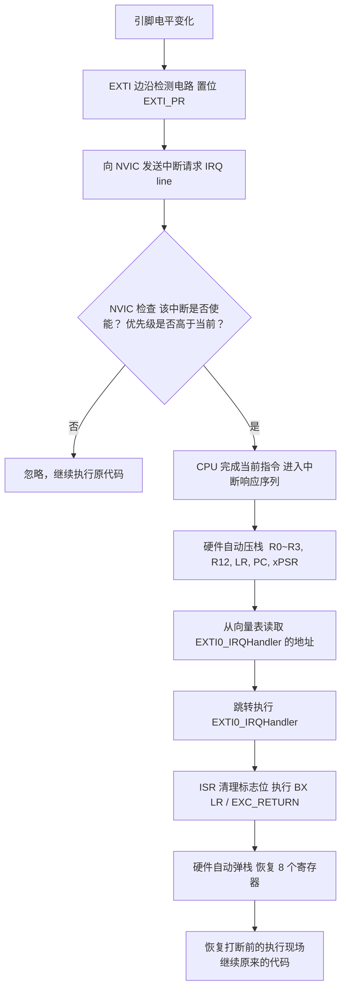
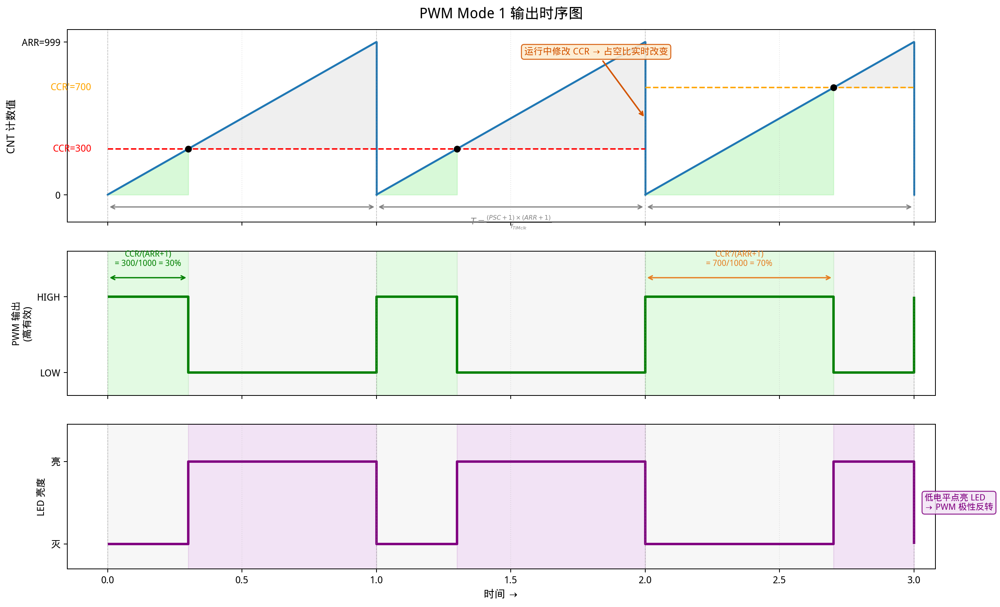
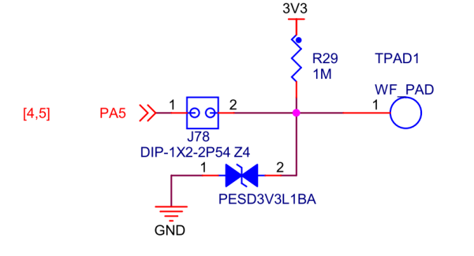
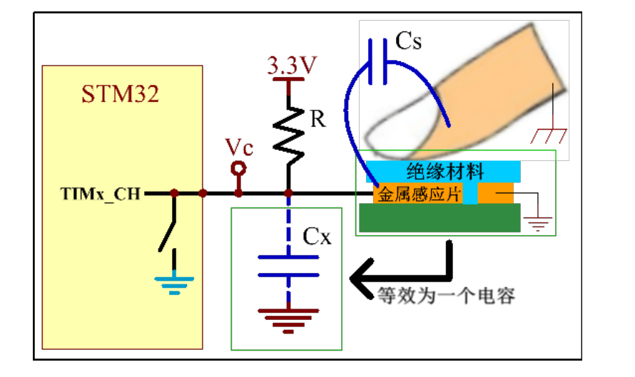
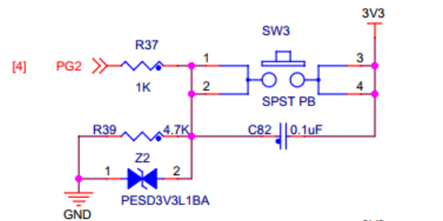
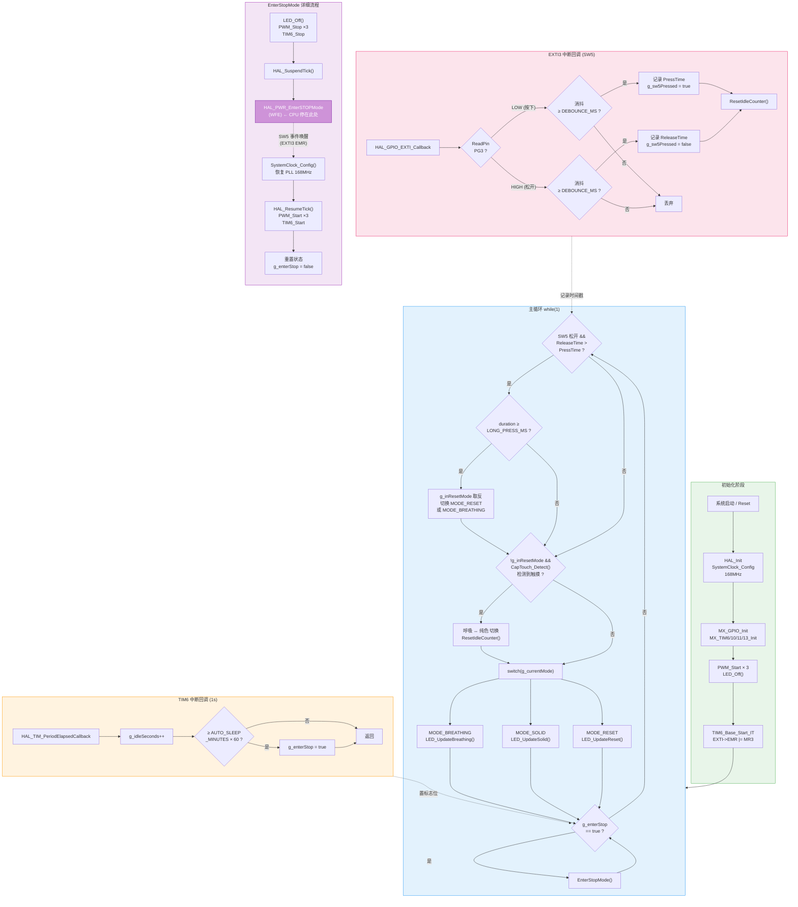

# Chapter 2 基础设施：中断系统，定时器和看门狗
---------------------------------------------------------------------------

如果你能啃下第一章，相信你对STM32已经有了相当深入的了解。本章以及后面234章本质上只是围绕第一章做补充。 中断，定时器和看门狗是大一点的MCU项目必须具备的三个外设，甚至可以说是彻底的标配。中断可以抢占式的打断现有任务，定时器是实现并发的基础，而看门狗则是系统最底层的状态监视器。

## 0 本章节目录

- **§1 中断和中断控制器 NVIC**
  - 1.1 STM32 的中断流程（软件端向量表 → 硬件端 NVIC → 上下文保存 → 完整流程）
  - 1.2 硬件配置：两级使能（EXTI 寄存器 → NVIC 使能与优先级分组）
  - 1.3 软件服务：IRQ Handler 注意事项（运行上下文 → 快进快出 → FPU 陷阱）
- **§2 定时器 (TIM) 与时间管理**
  - 2.1 硬件定时器分类（SysTick / 基本 / 通用 / 高级）
  - 2.2 时基单元：水桶模型（PSC / CNT / ARR → 滴答时间计算）
  - 2.3 内核计时器 SysTick（HAL 接管 → 非阻塞延时）
  - 2.4 通用 TIM：AF 绑定、PWM、输入捕获/输出比较、TIM 中断、定时器同步
- **§3 HAL 库实战（上篇）—— 中断按键彩色呼吸灯**
  - 3.1 项目概述（5 种运行模式）
  - 3.2 原理说明（输出引脚 → 电容按键 → 待机/TIM6 → 唤醒按键）
  - 3.3 CubeMX 配置（引脚 → 定时器 → NVIC → 时钟树 → 生成代码）
  - 3.4 重点代码拆解（宏定义 → 状态变量 → 初始化 → 主循环 → 功能函数 → 回调）
  - 3.5 调试验证（资源分析 → 断点步进 → 寄存器视图 → 变量观察/Logic Analyzer）
- **§4 看门狗 (WDG) —— 系统的最后一道保险**
  - 4.1 为什么需要看门狗（跑飞原因 → 倒计时炸弹 → 局限性）
  - 4.2 IWDG 独立看门狗（LSI 独立时钟 → 寄存器与超时计算 → 喂狗位置设计）
  - 4.3 WWDG 窗口看门狗（窗口约束 → 防盲喂 → EWI 提前唤醒中断）
  - 4.4 IWDG vs WWDG 工程选型
  - 4.5 实战：给呼吸灯工程加上 IWDG（CubeMX → 喂狗位置 → Stop 模式陷阱）

## 1 中断和中断控制器NVIC

总的来说，中断控制器是一种特殊的系统资源.不同于GPIO，RCC这种片上的外设可以集成在cpu外，**中断是和CPU设计深度绑定的异常处理机制，软硬件设计强耦合**，他也是MCU开发中，软件和硬件交互最复杂的一环。我们也难免会更多的去讨论Cortex内核和一些汇编的东西。但是不经历这些就无法真正的理解汇编，我们尽量做到简明且深入。

### 1.1 stm32的中断流程
为了建立对中断完整的认识， 我们不妨从软件端和硬件端两头夹击，搞清楚从电信号到用户函数，中断需要哪些过程。 软件端也就是我们的函数和汇编代码，而硬件端主要是一些允许中断的外设，比如gpio，uart，计时器等等。
#### 1.1.1 软件端--中断向量表→IRQ Handler

**再看启动代码`startup_stm32f407xx.s`**

我们之前分析startup.s，主要关注的是**启动流程**, 但是今天我们要关注的是他更为复杂的第二个功能**中断**. 中断的软件端的入口，其实就是startup.s。

我们需要复习之前学过的启动汇编代码，读者需要回答一个问题：启动代码主要是哪四个环节？

> 答：1.初始化堆栈位置 2.定义异常向量表，包括一大堆IRQ（中断向量表）和reset handler等其他异常 3.实现reset_handler，跳转至init和main 4.实现IRQ Handler的弱实现，用户可以写代码替代IRQHandler

很多人不明白中断，一个原因就是汇编基础不好。说白了中断在软件侧就是两件事情，按中断向量表查IRQ Handler， 强制跳转执行IRQ Handler。

**中断向量表** 

中断向量表本质就是我们看到的汇编代码开头的那一串.word，这个名字挺莫名其妙的，**中断向量表其实就是根据异常找对应的handler的一个键值映射关系，用c语言来说就是一个函数指针数组**。

我们以gcc版本的startup.s为例。这段代码就是我们的中断向量表。

```asm
g_pfnVectors:
  .word  _estack                   /* 0x00000000：初始栈顶（_estack 由链接脚本定义） */
  .word  Reset_Handler             /* 0x00000004：复位入口 */
  .word  NMI_Handler               /* 0x00000008 */
  .word  HardFault_Handler         /* 0x0000000C */
  ...（其他异常）
  .word  SysTick_Handler           /* 0x0000003C */
  .word  WWDG_IRQHandler           /* 0x00000040  ← 第一个外设中断 */
  .word  EXTI0_IRQHandler          /* ... */
  .word  USART1_IRQHandler         /* ... */
  .word  TIM2_IRQHandler           /* ... */
```
这张表被直接烧写在 Flash 的最开头。它不是普通的数据，而是 CPU 硬件会直接读取的**跳转地址列表**。每一项是一个 32 位函数指针，存的是对应处理函数的地址。

这个表不可以被理解为是一个简单的存个数组。他不是可以选择的，因为正如我们之前提到的，中断是和CPU设计深度绑定的异常处理机制，如果不在启动代码里实现中断向量表，cpu会直接报错，根本无法跑起来。

**IRQ Handler/ISR**

IRQ是Interrupt Request，意思是中断请求。**而Handle这个Request的函数，就是IRQ Handler，全称中断请求处理函数**。更专业更广泛的称呼是Interrupt Service Routine(ISR)，即中断服务程序。由于在Cortex的语义下，中断是一种特殊的异常（fault），所以本教程采用IRQ Handler而不是ISR描述这个函数。

如何写IRQ，需要注意什么是一个十分有挑战性的话题，这里暂时按下不表。我们在理解完了中断流程和中断的上下文环境后，会详细讨论这个话题。 目前我们需要记住，IRQ除了处理中断信号带来的逻辑之外，最重要的一件事情是清除中断标志位，避免重复进入整个中断流程，陷入死循环。这个不难理解，在介绍完硬件端中断发生了什么就好理解了。


#### 1.1.2 硬件端--IRQ→NVIC

**IRQ和外设中断使能**
从中断信号的电平改变，到这个信号进入内核的中断控制器，首先要经过外设自己的允许。外设有自己的中断屏蔽寄存器（比如 EXTI_IMR，TIM_DIER）。只有外设开启了对应的中断输出，电信号才会转化为一根无形的线，拉高向内核发出的中断请求（IRQ line）。也就是说，想让一个事件打断 CPU，第一步是配置外设允许中断。

**NVIC--嵌套向量中断控制器**

STM32的中断控制器大名叫Nested Vector Interrupt Controller--嵌套向量中断控制器。和 GPIO 或是 USART 这些片上外设不同，**NVIC 是 Cortex-M 内核本身的一部分，由 ARM 设计**。它驻留在内核空间，像一个拥有极高权力的保安队长，专门负责接收各个外设发来的 IRQ，然后决定是立刻打断 CPU，还是让暂缓执行。

至于为什么这个中断控制器前面会有个定语嵌套向量表，这个就是STM32这种有着正规军CPU内核的大MCU和一些八位机的区别。它有着复杂的中断管理机制，我们在后面会介绍。简单来说：
- **"向量"** 指的是它通过查向量表直接找到对应的 Handler，而不是像 51 单片机或者PIC那样进去再用 switch-case 分发。（这个我们已经感受过了）
- **"嵌套"** 指的是在处理一个低优先级中断的过程中，如果来了一个高优先级中断，NVIC 允许高优先级中断"抢占"（Preempt）执行，处理完后再返回低优先级中断，形成嵌套。

要在 NVIC 层级放行中断，你需要配置通道使能和优先级，这通常通过 `HAL_NVIC_EnableIRQ()` 和 `HAL_NVIC_SetPriority()` 完成。外设使能 + NVIC 使能，就是大名鼎鼎的中断**两级使能**。

#### 1.1.3 中断何以可能？--上下文保存

本质上，中断是脱离于正常程序的一个节外生枝的事件，在中断解决掉后，函数程序还是需要该干嘛干嘛的。这就涉及到中断的上下文保存。

我们之前研究过函数的栈帧，知道函数的跳转本质就是靠几行压栈和弹栈操作，保存了函数的执行情况。中断也不例外。但是可能你注意到了，中断是一个完全的异步操作，他随时可能发生，这和普通的函数跳转有本质的区别。函数跳转，靠的是编译器显式把压栈弹栈写进去,而中断可能在任意两条指令之间触发，编译器根本不知道"这条指令执行完之后会有中断"，也没有机会插任何保存代码，所以这个逻辑不可能在我们的代码空间里实现。

自然，这个问题由 **Cortex-M 硬件**来解决。进入中断时，CPU 会在跳转到 IRQ Handler 之前，**自动把一组寄存器压入当前栈**。这本来和普通的栈帧没有任何区别，也包括了链接寄存器LR。


进入 ISR 时，LR 会被 CPU 强制替换成一个特殊的魔数（Magic Number），名为 EXC_RETURN。这个值不是普通的返回地址，它被用来告诉内核：这是一个异常返回、要返回什么特权模式、以及该用 MSP 还是 PSP 弹栈。

这就是"EXC_RETURN"值。ISR 里执行 `BX LR` 时，CPU 识别到这个不寻常的地址，知道这是"从异常返回"，而不是普通的函数返回，于是触发**硬件弹栈**：把刚才压入的 8 个寄存器全部弹出，PC 恢复到被打断位置，程序继续运行。

所以整个过程对 C 代码来说是完全透明的——你写的 IRQ Handler 看上去就是一个普通的 `void` 函数，不需要任何特殊属性，进出上下文的保存和恢复已经由硬件完成了。


#### 1.1.4 从"电信号"到"执行函数"——中断的完整硬件流程

以一个按键触发外部中断（EXTI0）为例，整个过程是这样的：




### 1.2 硬件配置--两级使能

#### 1.2.1 中断的第一级使能--配置EXTI寄存器
首先需要说明的是，EXTI只是众多中断的一种，由于他逻辑复杂又最常用，我们以EXTI为例。事实上 对于不同的外部中断，都有着不同的中断使能寄存器。

##### 外部中断的入口：EXTI
EXTI全程是External interrupt/event controller—外部中断/事件控制器（我也不知道为啥要这么缩写，为什么不是EIEC），管理了控制器的20个中断/事件线。 每个中断/事件线都对应有一个边沿检测器，可以实现输入信号的上升沿检测和下降沿的检测。EXTI可以实现对每个中断/事件线进行单独配置， 可以单独配置为中断或者事件，以及触发事件的属性。


##### EXTI的功能框图
EXTI的功能框图包含了EXTI最核心内容，掌握了功能框图，对EXTI就有一个整体的把握，在编程时思路就非常清晰。EXTI功能框图如下


在图中可以看到很多在信号线上打一个斜杠并标注“23”字样，这个表示**在stm32f4内部类似的信号线路有23个**， 这与EXTI总共有23个中断/事件线是吻合的。所以我们只要明白其中一个的原理，那其他22个线路原理也就知道了。

为了把这个方块图看懂，我们顺着信号的流向，从左到右把它分成**信号输入**、**边沿检测**、**中断/事件分发**三个阶段来拆解：

**第一阶段：信号输入与边沿检测（带编号 1、2、3、4 的区域）**
1. **输入线（Input line）与 SYSCFG 多路复用**：这是 EXTI 的源头。在 STM32F4 中，这 23 根线有 16 根专供 GPIO 使用（EXTI0 ~ EXTI15），剩下的连到 PVD、RTC、USB 等特殊外设。
   由于 STM32 拥有众多的 GPIO 引脚（GPIOA~GPIOI），为了节约硬件资源，所有端口的同名引脚（如 PA0, PB0, ... PI0）必须**多路复用**到同一根 EXTI 中断线上（比如 EXTI0）。也就是说，在同一时刻，EXTI0 只能倾听一个端口的 Pin 0。这个“路由分发”工作我们需要在**系统配置控制器（SYSCFG）**中设置配置寄存器 `SYSCFG_EXTICR` 来完成。（*注：SYSCFG是低速外设，不在AHB上而是在APB2上，配置它前别忘了先开启 SYSCFG 的 APB2 时钟*）
2. **边沿检测电路**：这里对应两个寄存器，**RTSR（上升沿触发选择）**和 **FTSR（下降沿触发选择）**。如果在 RTSR 相应的位写 1，信号从低电平跳变到高电平时，就会触发后面的逻辑。两者可以同时写 1，实现双边沿触发。
3. **软件中断事件寄存器（SWIER）**：除了硬件引脚电平变化，我们还可以通过向 SWIER 寄存器写 1，用软件强行模拟一次中断触发，这在调试时非常有用。两者通过一个“或门”汇合。

**第二阶段：挂起（Pending）与屏蔽（Masking）**
4. **中断挂起寄存器（PR）**：如果边沿检测电路捕捉到了信号，或者软件触发了中断，这个寄存器对应的位就会被置 1，表示“有一个中断/事件正在等待处理”。（还记得 1.1.1 节里千叮咛万嘱咐的“一定要在 ISR 里清除标志位”吗？清的就是这个 **PR 寄存器**！不清它，后续的请求就发不出去，或者导致死循环。）
5. **中断屏蔽寄存器（IMR）和事件屏蔽（EMR）**：在这一步，信号出现了分流。
   - 向左走是**产生中断**：这需要通过 IMR 寄存器的“与门”。如果 IMR 被设置为 0，信号就被截断了，这就叫“中断被屏蔽”。
   - 向右走是**产生事件**：同理，需要通过 EMR 寄存器的“与门”。

**第三阶段：进入 NVIC 还是去唤醒 CPU？**
- **中断线（发往 NVIC）**：如果 IMR 设置为 1 且发生了触发，信号就被发送到 NVIC，最终由 CPU 停下当前工作去执行 `EXTI_IRQHandler`。
- **事件线（发往脉冲发生器）**：如果 EMR 设置为 1，信号不会打断 CPU 的代码执行，而是去触发一个单脉冲。这个脉冲常常被用来唤醒处于睡眠模式的 CPU，或者去触发 ADC 开始采样、定时器开始计数，这种机制完全纯硬件，不需要 CPU 浪费算力参与，也就是常说的 **"事件驱动（Event-Driven）"**。

所以，配置一个 EXTI 本质上就是做简单的填空题：选好输入线 -> 切好上升极还是下降极 -> 打开 IMR 开关 -> 准备好 NVIC。

##### EXTI 关键寄存器一览

根据 stm32f4 的参考手册，EXTI 的基地址为 `0x4001 3C00`，下面是我们最常用到的几个核心寄存器（偏移量和位定义）：

| 寄存器名称 | 偏移量 | 作用 | 核心位说明 |
|---|---|---|---|
| **EXTI_IMR** | `0x00` | 中断屏蔽寄存器 | 位 0~22：写 1 开放对应的中断线请求，写 0 屏蔽（Mask）该中断。 |
| **EXTI_EMR** | `0x04` | 事件屏蔽寄存器 | 位 0~22：写 1 开放对应的事件线请求，写 0 屏蔽事件。 |
| **EXTI_RTSR** | `0x08` | 上升沿触发选择 | 位 0~22：写 1 允许对应输入线上的上升沿触发。 |
| **EXTI_FTSR** | `0x0C` | 下降沿触发选择 | 位 0~22：写 1 允许对应输入线上的下降沿触发。（**注**：若 RTSR 和 FTSR 都写 1，则为双边沿触发） |
| **EXTI_SWIER**| `0x10` | 软件中断事件寄存器 | 位 0~22：写 1 可以靠软件强行触发一次中断/事件请求，主要用于调试。 |
| **EXTI_PR** | `0x14` | 挂起寄存器（Pending）| 位 0~22：触发后该位变为 1。**注意：往该位写 1 才能清零！**写 0 无效。中断处理函数的最后必须往对应位写 1 清除标志位。 |

这 6 个 EXTI 相关的寄存器，完美和刚才上面框图里的各个节点对应上了。

##### SYSCFG 关键寄存器一览

根据 stm32f4 的参考手册，SYSCFG 的基地址为 `0x4001 3800`。正如前面所说，我们需要用其中的 `SYSCFG_EXTICR` 寄存器来解决同名 GPIO 引脚的多路复用问题。下面是相关的几个核心寄存器（偏移量和位定义）：

| 寄存器名称 | 偏移量 | 作用 | 核心位说明 |
|---|---|---|---|
| **SYSCFG_EXTICR1** | `0x08` | 外部中断配置寄存器 1 | 配置 EXTI0 ~ EXTI3 的数据源。每 4 位控制一根线。比如位 3:0 控制 EXTI0，设为 `0000` 表示映射到 PA0，`0001` 表示 PB0，以此类推。 |
| **SYSCFG_EXTICR2** | `0x0C` | 外部中断配置寄存器 2 | 配置 EXTI4 ~ EXTI7 的数据源。功能和上述同理。 |
| **SYSCFG_EXTICR3** | `0x10` | 外部中断配置寄存器 3 | 配置 EXTI8 ~ EXTI11 的数据源。功能和上述同理。 |
| **SYSCFG_EXTICR4** | `0x14` | 外部中断配置寄存器 4 | 配置 EXTI12 ~ EXTI15 的数据源。功能和上述同理。 |

***小测：如果要使能PA5的上升沿触发中断， 需要经历哪几个核心配置步骤？IRQ Handler中需要如何完成标志位清零？***

>答：
> 1. **时钟与引脚路由：**
>    - **开启外设时钟**：GPIOA 挂载在 AHB1 总线，SYSCFG 挂载在 APB2 总线。需将 `RCC_AHB1ENR` 的第 0 位置 1，并将 `RCC_APB2ENR` 的第 14 位置 1。*(C语句：`RCC->AHB1ENR |= (1 << 0); RCC->APB2ENR |= (1 << 14);`)*
>    - **路由输入源**：配置 `SYSCFG_EXTICR2` 寄存器 (地址：`0x4001 380C`)，将控制 EXTI5 的位域 [7:4] 清零为 `0000`，即选中 PA5。*(C语句：`SYSCFG->EXTICR[1] &= ~(0x0F << 4);`)*
> 2. **配置 EXTI：**
>    - **开启上升沿触发**：将 `EXTI_RTSR` 寄存器 (地址：`0x4001 3C08`) 的第 5 位置 1。*(C语句：`EXTI->RTSR |= (1 << 5);`)*
>    - **取消中断屏蔽**：将 `EXTI_IMR` 寄存器 (地址：`0x4001 3C00`) 的第 5 位置 1。*(C语句：`EXTI->IMR |= (1 << 5);`)*
> 3. **清零标志位：**
>    - 进入对应的中断服务程序（`EXTI9_5_IRQHandler`）后，必须向 `EXTI_PR` 寄存器 (地址：`0x4001 3C14`) 的第 5 位**写 1** 以清除挂起标志，否则会导致无限触发死循环。*(C语句：`EXTI->PR |= (1 << 5);`)*

#### 1.2.2 进入内核--NVIC，中断使能和优先级管理

##### NVIC是“内核外设”
不同于 GPIO、USART 这种由 ST 设计的片上外设，NVIC（嵌套向量中断控制器）是 Cortex-M 内核本身的一部分，由 ARM 原厂设计。正因为它是“内核外设”，操作它往往涉及处理器的底层权限和复杂指令。因此，**极度不推荐直接用位操作去算 NVIC 的相关寄存器**。

ARM 官方在 CMSIS 库（如 `core_cm4.h`）里提供了一套通用的标准函数。无论你是使用寄存器开发、标准库还是 HAL 库，配置 NVIC 时最规范的做法都是直接调用内核标准接口，比如 `NVIC_SetPriorityGrouping()` 和 `NVIC_EnableIRQ()`。

##### 中断的第二级使能
配置完 EXTI 仅仅相当于让外设发出了一个电平请求（中断线 IRQ line）。这个请求能否真正打断 CPU 执行代码，完全由“安保队长” NVIC 说了算。这就是著名的**“两级使能”**机制：
1. **第一级在外设（如 EXTI_IMR）**：允许外设发出中断请求脉冲。
2. **第二级在内核控制器（NVIC_ISERx）**：决定是否放行该中断请求进入 CPU 并触发异常响应序列。

我们必须调用 `NVIC_EnableIRQ(IRQn_Type IRQn)` 给特定通道放行，对应的外部打断事件才能行云流水地进入 CPU。

##### 为什么会有优先级
系统运行中，难免会遇到两种情况：
1. 两个或多个外部事件在**同一时刻**发生并同时发出了中断请求。
2. CPU 正在处理某个中断 A 的时候，突发了另一个非常紧急的硬件危机（中断 B）。
为了让 CPU 知道“该听谁的”、“能不能放下现有的工作去救火”，NVIC 引入了复杂的优先级管理机制。通过给不同的中断源排资论辈，确保核心任务能够得到最快速的响应。

##### 响应式优先级和抢占式优先级
为了处理上述复杂场景，STM32 的中断优先级在逻辑上被分为互相配合的两个维度：

1. **抢占优先级 (Preemption Priority)：** 决定能不能 **“打断”** 别人。如果中断 A 正在执行，此时抢占优先级更高（数值更小）的中断 B 来了，B 会直接暂停 A 先跑到前台执行自己，这就是经典的 **中断嵌套**。
2. **响应优先级 (Sub-priority / 子优先级)：** 只有在两个中断**同时到达**，或者都在排队等待 CPU 叫号时才起作用。它决定了谁先“出列”。需要注意：**响应优先级无法抢占正在执行的中断！** 哪怕正在排队的 B 的响应优先级极高，只要它的抢占优先级不高于当前正在执行的 A，B 也就只能憋着干等。

> *补充：如果产生两个事件抢占和响应优先级都一模一样并且同时发生，则看硬件中断向量表的排列顺序（IRQn 编号大小），靠前（编号越小）的先执行。*

##### 内核寄存器AIRCR和优先级分组
STM32 硬件上的 Cortex-M4 内核本身规定最多支持 8 位的优先级寄存器，但 **STM32F4 在芯片设计时只使用了高 4 位**（因此单个中断只有被分配到 16 种内部优先等级的可能）。

这宝贵的 4 个 bit，必须被合理切分给“抢占”和“响应”。这就引入了**优先级分组 (PRIGROUP)** 的概念。借助 Cortex-M 核的 `SCB->AIRCR`（应用程序中断及复位控制寄存器），开发者可以设定 5 种不同的分组方式：

| 分组 | 抢占优先级位数 | 响应优先级位数 | 抢占优先级数字范围 | 响应优先级数字范围 |
|---|---|---|---|---|
| **Group 0** | 0 位 | 4 位 | 0 | 0 ~ 15 |
| **Group 1** | 1 位 | 3 位 | 0 ~ 1 | 0 ~ 7  |
| **Group 2** | 2 位 | 2 位 | 0 ~ 3 | 0 ~ 3  |
| **Group 3** | 3 位 | 1 位 | 0 ~ 7 | 0 ~ 1  |
| **Group 4** | 4 位 | 0 位 | 0 ~ 15| 0 |

**非常重要的开发约束：**
1. **一锤子买卖：** 在同一个工程项目中，你应该在初始化时调用 `NVIC_SetPriorityGrouping()` 一次性分配好。**一旦设定，之后绝不要再去修改分组！** 如果各模块各配各的分组，会造成极其灾难性的全局中断混乱。
2. **操作系统的偏好：** 如果未来你的项目需要移植 `FreeRTOS` 等实时系统，通常强烈要求（或强制要求）直接使用 **Group 4**（全部是抢占优先级，扔掉响应优先级这个概念），这样 RTOS 才能对其内核调度逻辑进行最干净利落的管理。 

### 1.3 软件服务--IRQ Handler的注意事项

我们之前介绍过，用来处理中断的函数就是IRQ Handler或者叫ISR。他有一个固定的任务就是必须要清除中断标志位。但我们难免要加入一些常见的用户逻辑，比如亮灯，蜂鸣，发消息告警等等。这就涉及到一个问题，我们真的能自由的写IRQ Handler吗？ 我们写IRQ Handler的时候需要注意什么？

#### 1.3.1 IRQ Handler运行的上下文

我们知道，IRQ Handler不是编译器编出来的，有着明确依赖关系和严谨栈帧结构的，那种有正式编制的函数调用。他是被CPU暴力拎过来的临时工。那么我们需要思考，IRQ Handler有什么运行环境？

**1. 特权模式与主堆栈 (MSP)**
在裸机环境下（没有操作系统），当 Cortex-M 响应中断并进入 IRQ Handler 时，它会被强制切入**特权模式 (Privileged Mode)**，并且强制使用**主堆栈指针 (MSP, Main Stack Pointer)**。即使打断前程序正在使用进程堆栈 (PSP)，进入中断后也会立刻切回 MSP。这意味着你在中断里定义的局部变量，都在主堆栈上分配内存。如果不加以克制，很容易导致主堆栈溢出（Stack Overflow），进而引发非常难排查的 `HardFault`。

**2. 异步性与全局变量**
因为中断随时可能发生（比如正在执行主循环的下一行代码前），主程序和中断服务程序本质上构成了两个**并发**的执行流。如果你在 IRQ Handler 中修改了某个全局变量，而主循环正在读取它，由于编译器可能会对主循环中的读取进行优化（比如把它缓存在寄存器里），主循环可能永远不知道这个变量被中断改了。
> **对策：** 凡是在中断里修改、在主程序里读取的全局变量，**必须用 `volatile` 关键字修饰**，强制编译器每次都去内存原址粗暴地读取它，禁止任何形式的缓存优化。

#### 1.3.2 黄金法则：“快进快出”
明白上下文后，我们很容易就可以总结出写 ISR 代码的黄金法则——**快进快出，做最少的事。**

由于中断会阻塞系统（特别是比他优先级低的中断），一旦你的 IRQ Handler 执行时间太长，最直接的后果就是实时性暴跌。别人发过来的高频信号你漏收了，按键没防抖变成卡死了。

在 IRQ Handler 里，**绝对禁止（或者说极其不推荐）**做以下操作：
1. **死延时：** 绝对不要出现 `Delay_ms(10)`，甚至是稍微长一点的空循环 `while(1)`。
2. **大批量数据传输/拷贝：** 如果有巨大的数组需要移动，不要在 CPU 里面做 `memcpy`，应该交给 DMA（我们后续会讲）。
3. **阻塞式外设操作：** 比如在中断里调用串口的阻塞发送函数 `printf`。`printf` 不仅本身极其耗时，而且很可能会尝试触发其他串口中断，如果那个串口的优先级比当前中断低，还会导致永久性死锁！
4. **滥用局部变量：** 如前段所述，栈空间宝贵，禁止在 ISR 里开大数组。

**最佳实践：** 
在大多数正常的工业代码中，IRQ Handler 里只会做三件事：
1. **清标志：** `EXTI->PR = 1;` 
2. **读数据：** 快速把寄存器里新来的数据扒进内存。
3. **置标志（立个 Flag 就跑）：** 将一个预先定义好的 `volatile bool flag` 置为 true。然后剩下的脏活累活和耗时运算，全部丢给 `main` 函数的 `while(1)` 里面去轮询处理。

这就是典型的**“前后台架构（Foreground-Background Architecture）”**，中断作为前台负责抢修，主循环作为后台兜底处理业务。

**一个小例子：串口收到特定指令后，触发声光报警**

假设我们的 USART 接收到一个错误指令，系统要求长亮红灯 1 秒，并同时让蜂鸣器响 1 秒作为告警。

**❌ 错误的做法（在中断里死等）：**
在 `USART_IRQHandler` 里判断若是错误指令，直接开灯、开蜂鸣器，然后调一个 `Delay_ms(1000)`，然后再关灯关蜂鸣器... 
这样会导致在这 1 秒内，整个 MCU 都在中断里“卡死”，外面的其他常规逻辑完全停摆，新的串口数据也会全部丢失！

**✅ 正确的做法（前后台架构）：**
1. 定义一个全局变量：`volatile bool g_isErrorTriggered = false;`
2. **前台（ISR，快进快出）：** 在 `USART_IRQHandler` 里判断若是错误指令，只需执行 `g_isErrorTriggered = true;` ，然后清除中断标志位，`return` 退出中断。
3. **后台（main主循环）：**
   ```c
   while(1) {
       if (g_isErrorTriggered) {
           g_isErrorTriggered = false; // 马上重置标志位
           Light_Red();
           Buzzer_On();
           Delay_ms(1000);   // 主循环里的 Delay 不会阻塞新的高优先级中断
           Light_Off();
           Buzzer_Off();
       }
       // ...处理其他的业务逻辑...
   }
   ```
   通过这种方式，中断响应极快（只有几条指令的时间），而耗时的亮灯和延时则由主循环慢慢完成，完美保证了系统的实时性和健壮性。


#### 1.3.3 浮点数核心（FPU）的上下文问题

STM32F4 搭载了 Cortex-M4F 内核，带有硬件浮点运算单元（FPU）。这就带来了一个在 F1 系列等不带 FPU 芯片上没有的隐患：**如果在主程序里正在做浮点运算，突然进了中断，中断里如果也做了浮点运算，FPU 的寄存器上下文会被破坏吗？**

ARM 为了解决这个问题，聪明地引入了**“延迟压栈（Lazy Stacking）”**机制：
1. 当进入中断时，硬件为了追求极致的响应速度，默认**只会把常规寄存器压栈，并为 FPU 寄存器预留出栈空间，但并不会真正去搬运和保存 FPU 寄存器的压栈动作**。
2. 如果你的 IRQ Handler 里**完全没用到**浮点数，那相安无事，退出中断时按常规弹出即可，这就省去了搬运大量浮点寄存器的 CPU 周期。
3. 如果你的 IRQ Handler 里**一旦执行了哪怕一条**浮点操作指令，硬件会立刻捕捉到这个动作，瞬间将打断前的 FPU 寄存器群（S0~S15 及其状态寄存器 FPSCR，共 17 个寄存器）补压入主堆栈中，然后再继续执行 ISR 的代码。

**针对 FPU 的最佳开发实践：**
尽管 Cortex-M4 硬件（Lazy Stacking）完美保证了浮点上下文的逻辑安全，但代价在实时系统中是极其昂贵的。一旦你在中断里使用了诸如 `float a = 1.23 * b;` 这样的代码：
- 主堆栈（MSP）空间会瞬间产生额外 17 个寄存器（68 字节）的额外开销，容易导致意料之外的堆栈溢出。
- 延迟压栈的临时触发，会导致这一此的中断响应时间突然变长，从而**产生不可预测的时序抖动（Jitter）**，严重破坏硬实时需求。

> **结论铁律：绝对不要在中断服务函数中进行任何浮点数（float / double）运算！** 请强迫自己只搬运整型的 ADC 或串口原始数据，复杂的物理量解算和浮点运算务必扔进后台 `while(1)` 或 RTOS 的任务中完成。

#### 1.3.4 总结

一言以蔽之，**中断服务函数大多数情况下就是一个无情的Flag传递机器**，他负责拔掉硬件传来的Flag（寄存器），然后传给软件的变量Flag。这样也许不够Fancy,但是能避开你绝大部分调不明白的逻辑问题。

## 2 定时器 (TIM) 与时间管理

有了上一节关于“中断”的基础，理解定时器就会变得水到渠成。因为在微控制器中，**定时器的本质，就是一个通过产生中断来通知 CPU 的“独立闹钟”**。

### 2.1 硬件定时器和种类
#### 2.1.1 什么是定时器 有什么用

我们知道，定时器在 MCU 开发中无处不在。不论是大型裸机工程里的非阻塞任务调度，还是 RTOS 中的实时任务心跳，底层都依赖一个稳定的时间基准。除了做"闹钟"，定时器还能输出 PWM 波控制电机和 LED、精确测量外部信号的宽度（输入捕获）、在精确时间点触发 ADC 采样，以及驱动 DAC 输出模拟波形。这些功能共用同一套硬件计数核心——时基单元，只是在其上叠加了不同的"外挂"功能。

当然，讨论如何去编写不阻塞的前后台系统程序不是这一章的重点。我们只关注他们背后的核心引擎，也就是定时器。

#### 2.1.2 STM32 的“钟表家族”

不同于比如常见的八位机，STM32F4 内部有着数量极多的定时器。如果直接看参考手册，多达十几个定时器常常让人眼花缭乱。为了方便理解，我们把它们分为四大类：

1. **内核计时器 (SysTick)**：驻留在 Cortex-M4 内核中（不是 ST 自己设计的片上外设而是 ARM 设计的）。它是一个纯粹的倒计时器，通常被实时操作系统（如 FreeRTOS）拿来纯纯作为“心跳”，或者在裸机中被配置为精准的 `Delay_ms` 发生器。
2. **基本定时器 (TIM6, TIM7)**：功能最简单，只有一个核心功能：**定时并产生中断**。它甚至连针对外部引脚操作的能力都没有，老老实实做系统幕后的闹钟。有时也被用来触发 DAC 模拟数字转换。
3. **通用定时器 (TIM2~TIM5, TIM9~TIM14)**：真正干活的主力，瑞士军刀。 除了包含基本定时器的全部定时功能外，还可以输出 **PWM 波**（用来控制电机转速或实现呼吸灯）、测量外部脉冲的长度（输入捕获）等。其中 TIM2 和 TIM5 特别强大，是 32 位的（能装下的时间极长）。
4. **高级定时器 (TIM1, TIM8)**：拥有通用定时器的全部功能，在这个基础之上增加了死区控制、互补输出等功能，这是为了控制更危险、更复杂的设备——**三相伺服电机**而生的重型武器。

对于绝大多数应用来说，学透**通用定时器**，就等于掌握了所有定时器。

#### 2.2 计时器的核心灵魂：时基单元

#### 2.2.1 时基单元--水和水桶

不管这些定时器功能套壳有多花哨，它们最核心的工作原理是完全一致的，被称为**时基单元 (Time Base Unit)**。时基单元由三个极其重要的寄存器组成。我们不妨用**“接水的水桶”**这个模型来理解它：

1. **PSC 预分频器 (Prescaler)**：**相当于水龙头的阀门。**
   STM32F4 的系统时钟往往高达 84MHz（APB1）甚至 168MHz（APB2）。这意味着 1 秒钟内“水龙头”会滴下几千万甚至上亿滴水。如果直接用水桶接，瞬间就会溢出。PSC 的作用就是对原始时钟频率进行“除法减速”。比如设定把 8400 万的时钟分频 8400 倍，那水龙头就变成了极其缓慢的每秒滴 10000 滴水（10kHz）。

2. **CNT 计数器寄存器 (Counter)**：**相当于接水的水桶本身。**
   时钟每传来一个脉冲（每滴下一滴水），CNT 里面的数字就加 1（向上计数模式）。如果这是一个 16 位的定时器，它最大能记录到 65535。一旦超过这个数，水桶就会直接“漫出来”，内部数字立刻清零。

3. **ARR 自动重装载寄存器 (Auto-Reload Register)**：**相当于在水桶上画的一条警戒线（刻度）。**
   除了等待 CNT 自己爆表，我们可以通过设置 ARR 规定一个预期的“满水线”。当 CNT 的值增长到等于 ARR 的值时，定时器会判定为“时间到！”。此时发生两件事：
   - CNT 瞬间归零（或者叫做被重新装载重置）。
   - 产生一个极其重要的事件：**更新事件 (Update Event, UEV)**。这个事件可以直接触发一次中断！

#### 2.2.2 滴答时间的计算

有了水桶模型，计算一次"水满溢出"需要多少时间就变得非常直观。核心公式如下：

$$T_{\text{interrupt}} = \frac{(\text{PSC} + 1) \times (\text{ARR} + 1)}{f_{\text{TIMclk}}}$$

其中 $f_{\text{TIMclk}}$ 是定时器的输入时钟频率（单位 Hz），等式右侧分子就是"水桶装满所需的总滴数"。

**为什么要加 1？**
PSC 和 ARR 寄存器都是"从零开始计数"的。设 PSC = 0 时，分频系数是 1（不分频）；设 PSC = 83 时，每 84 个源时钟脉冲产生一个定时器脉冲。同理，ARR = 999 代表从 0 数到 999 共 1000 步。这个细节极容易踩坑，请务必牢记：**写进寄存器的值 = 目标系数 - 1**。

**具体举例：**
假设 TIM3 挂载在 APB1（STM32F407 上定时器实际获得 84MHz），我们希望每 500ms 产生一次中断：

$$84\,000\,000 \div (8400 \times 5000) = \frac{1}{500\text{ms}} \quad \Rightarrow \quad \text{PSC} = 8399,\quad \text{ARR} = 4999$$

验算：$T = \frac{8400 \times 5000}{84\,000\,000} = 0.5\,\text{s}$ ✓

> **设计建议：** PSC 负责把时钟降到一个方便心算的整频率（如 10kHz、1kHz），ARR 再直接等于"要数几个周期"。这样调参时一目了然，不容易出错。


### 2.3 内核计时器Systick

SysTick 是 ARM 在 Cortex-M 内核里内置的一个 **24 位向下计数器**，和 GPIO、TIM2 这些 ST 自己设计的外设完全无关。它存在的意义只有一个：**给整个系统提供一个统一、稳定的时间基准（Time Base）**。

#### 2.3.1 工作原理

SysTick 的逻辑比通用定时器简单得多，只有三个核心寄存器：

| 寄存器 | 作用 |
|---|---|
| `SYST_RVR`（Reload Value Register） | 设定重装载值，相当于 ARR |
| `SYST_CVR`（Current Value Register） | 当前计数值，每个时钟周期减 1 |
| `SYST_CSR`（Control and Status Register）| 使能、时钟源选择、中断使能、COUNTFLAG |

它是一个**倒计时器**（与 TIM 向上计数相反）：从 `SYST_RVR` 装载的值开始减，一旦减到 0，就产生 `SysTick_Handler` 中断，然后自动重新装载，周而复始。

#### 2.3.2 HAL 库对 SysTick 的接管

在 HAL 库工程中，`HAL_Init()` 会自动将 SysTick 配置为 **1ms 一次中断**，并在 `SysTick_Handler` 里维护一个全局 32 位计数器 `uwTick`。

我们常用的这两个函数，其底层全部依赖 SysTick：
- `HAL_Delay(ms)`：轮询 `uwTick` 的差值，实现毫秒阻塞延时。
- `HAL_GetTick()`：返回当前 `uwTick` 值，用于非阻塞的时间差计算（这是实现前后台架构中"软件定时"的首选）。

**重要警告：** 正因为 HAL 库已经接管了 SysTick，**不要在自己的代码中去重新配置 SysTick 的频率或重装载值**，否则 `HAL_Delay` 和 `HAL_GetTick` 会完全乱套，产生极难排查的时序 bug。如果你需要更多的定时中断，请用通用定时器 TIM，把 SysTick 留给 HAL 专用。

#### 2.3.3 用 HAL_GetTick() 实现非阻塞延时

`HAL_Delay()` 是阻塞的，在等待期间 CPU 什么都做不了（虽然不影响更高优先级的中断）。对于需要"同时做多件事"的主循环，应该用 `HAL_GetTick()` 做时间差判断：

```c
uint32_t lastTick = HAL_GetTick();

while(1) {
    // 每 500ms 执行一次，不阻塞主循环
    if (HAL_GetTick() - lastTick >= 500) {
        lastTick = HAL_GetTick();
        LED_Toggle();
    }
    // 这里可以同时处理其他逻辑，不会被 LED 的定时卡住
}
```

这是裸机工程中实现"软件多任务"的基础模式，务必牢记。


### 2.4 通用TIM--瑞士军刀
#### 2.4.1 使用AF绑定引脚

在第一章中我们已经学过，STM32 的每个 GPIO 引脚都有多种工作模式，其中 **复用功能（AF，Alternate Function）** 模式就是把引脚的控制权从 GPIO 逻辑交给某个片上外设（如 TIM、USART、SPI）的信号线。

每个引脚最多可以映射 16 种复用功能（AF0 ~ AF15），具体哪个 AF 编号对应哪个外设，查芯片的**数据手册（Datasheet）** 中的"Alternate Function mapping"表即可。例如，PB4 对应 AF2 就是 TIM3 的通道 1（CH1）。

配置步骤只有两步：
1. 将 GPIO 模式设为 `GPIO_MODE_AF_PP`（复用推挽输出）。
2. 在 `GPIO_InitStruct.Alternate` 中填入对应的 AF 编号，如 `GPIO_AF2_TIM3`。

```c
GPIO_InitTypeDef GPIO_InitStruct = {0};
__HAL_RCC_GPIOB_CLK_ENABLE();
GPIO_InitStruct.Pin       = GPIO_PIN_4;
GPIO_InitStruct.Mode      = GPIO_MODE_AF_PP;   // 复用推挽
GPIO_InitStruct.Pull      = GPIO_NOPULL;
GPIO_InitStruct.Speed     = GPIO_SPEED_FREQ_LOW;
GPIO_InitStruct.Alternate = GPIO_AF2_TIM3;     // PB4 → TIM3 CH1
HAL_GPIO_Init(GPIOB, &GPIO_InitStruct);
```

完成 AF 绑定后，该引脚的电平就完全由 TIM3 的 PWM 逻辑控制，`HAL_GPIO_WritePin` 对它写值将不再有任何效果。

#### 2.4.2 功能1：PWM

**PWM（脉冲宽度调制，Pulse Width Modulation）** 是通用定时器最经典的输出功能。它的本质是：在固定周期的方波里，通过调整高电平持续时间的占比（**占空比，Duty Cycle**），来实现对负载的"模拟"控制——电机转速、LED 亮度、舵机角度，背后全是 PWM。

##### CCR：时基单元的第四个寄存器

要实现 PWM，需要引入通用定时器的第四个核心寄存器：**CCR（捕获/比较寄存器，Capture Compare Register）**。沿用之前的水桶模型，CCR 就是在 ARR 水位线以内再画的**第二条刻度线**。

**PWM Mode 1（最常用）的工作逻辑：**
- 当 `CNT < CCR` 时：输出引脚保持**高电平**。
- 当 `CNT >= CCR` 时：输出引脚切换为**低电平**。
- `CNT` 到达 `ARR` 后归零，下一个周期重来。




因此，占空比的计算公式非常简洁：

$$\text{Duty Cycle} = \frac{\text{CCR}}{\text{ARR} + 1} \times 100\%$$

**实时修改占空比**：`ARR` 决定了 PWM 的频率（周期），运行时只需动态修改 `CCR` 就可以无缝调节占空比，定时器不需要停下来重新初始化。这是实现呼吸灯、电机调速的核心操作。

```c
// 假设 TIM3 CH1 的 ARR = 999（1000 步分辨率）
// 设置占空比为 30%
__HAL_TIM_SET_COMPARE(&htim3, TIM_CHANNEL_1, 300); // CCR = 300

// 在主循环里逐渐增加，实现呼吸灯渐亮效果
for (uint16_t duty = 0; duty <= 1000; duty++) {
    __HAL_TIM_SET_COMPARE(&htim3, TIM_CHANNEL_1, duty);
    HAL_Delay(1); // 每步 1ms，整个渐亮过程 1 秒
}
```

##### PWM 频率的选择

- **LED 调光**：人眼感知不到闪烁的最低频率约为 50Hz，工程上通常选择 1kHz 以上。
- **电机控制**：一般 10kHz ~ 20kHz，低于此范围线圈会产生可听见的噪音。
- **舵机**：标准协议固定为 50Hz（20ms 周期），脉宽 1~2ms 对应 0°~180°，这个不能随意改。

#### 2.4.3 功能2：高端GPIO--输入捕获和输出比较

如果说 PWM 是定时器"**往外说话**"（输出波形），那么**输入捕获（Input Capture）**就是定时器"**对外倾听**"（测量外部信号），而**输出比较（Output Compare）**则是 PWM 的退化版本——用于在特定时刻精确地翻转/置位/清零一个引脚。

##### 输入捕获（Input Capture）

输入捕获的核心功能是：**捕捉外部引脚发生电平跳变的那一刻，把 CNT 的当前值"拍"下来存入 CCR**。

实际应用场景：
- **测量脉冲宽度**：在上升沿捕获一次 CNT（记为 $t_1$），在下降沿再捕获一次 CNT（记为 $t_2$），则脉宽为 $(t_2 - t_1) / f_{\text{TIMclk}}$。这是超声波测距（HC-SR04）的核心原理。
- **测量信号频率**：连续捕获两次上升沿，两次 CNT 的差值就是信号的周期。

**注意事项：** 若信号频率很高，需要警惕溢出（CNT 转了一圈回来但你没处理）。通常需要结合 UEV 中断来记录溢出次数以拓展时间范围。

##### 输出比较（Output Compare）

输出比较可以理解为不带"自动高低切换"的 PWM：当 CNT 到达 CCR 设定的值时，硬件根据配置对输出引脚执行**置高、拉低或翻转**中的一种。这在需要精确时间点触发某个动作时非常有用，但在绝大多数场景下，PWM 模式更直觉，输出比较使用频率相对较低。

#### 2.4.4 TIM中断

定时器产生中断的流程和 EXTI 完全一致，同样遵循**两级使能**：先使能定时器内部的中断输出，再在 NVIC 放行。不同的是，定时器的中断源有多个（UEV 更新事件、各通道 CC 捕获比较事件等），它们共享同一个 IRQ 通道，需要在 Handler 里用寄存器标志区分。

##### 关键寄存器

| 寄存器 | 作用 |
|---|---|
| `TIMx->DIER`（DMA/Interrupt Enable Register）| 中断使能：`UIE`（位0）使能更新事件中断，`CCxIE` 使能捕获比较中断 |
| `TIMx->SR`（Status Register）| 中断标志位：`UIF`（位0）为更新事件标志，**在 ISR 里必须手动清零** |

##### ISR 中必须清除 UIF 标志

和 EXTI 的 PR 寄存器一样，如果进了 TIM 中断后不清 `TIMx->SR` 的 `UIF` 位，中断会立刻再次触发，陷入无限循环。

```c
void TIM3_IRQHandler(void) {
    if (TIM3->SR & TIM_SR_UIF) {   // 确认是更新事件触发的
        TIM3->SR &= ~TIM_SR_UIF;   // 清除标志位（写0清零）

        // 你的业务逻辑：置 flag，快进快出
        g_tim3UpdateFlag = true;
    }
}
```

> **注意与 EXTI 的区别：** EXTI_PR 是**写 1 清零**，而 TIMx_SR 是**写 0 清零**。两者机制相反，是初学者最容易混淆的坑之一。HAL 库的回调函数（`HAL_TIM_PeriodElapsedCallback`）会在内部自动清标志，但理解底层行为依然至关重要。

##### HAL 库的定时器中断用法

```c
// 初始化：启动定时器并开启更新中断
HAL_TIM_Base_Start_IT(&htim3);

// HAL 库自动完成中断向量映射和标志清除
// 用户只需重写这个回调函数
void HAL_TIM_PeriodElapsedCallback(TIM_HandleTypeDef *htim) {
    if (htim->Instance == TIM3) {
        // 每次定时时间到，这里被调用一次
        g_tim3UpdateFlag = true;
    }
}
```

#### 2.4.5 定时器同步

定时器同步是通用定时器的高级功能，利用**主从模式（Master-Slave Mode）**，可以让一个定时器（主）的输出事件，直接触发另一个定时器（从）的动作，完全不消耗 CPU 算力。这是纯硬件的"链式"时序控制。

##### 主从定时器的工作原理

主定时器（Master）在特定事件（如 UEV 更新事件）发生时，通过内部的**触发输出（TRGO，Trigger Output）**向从定时器（Slave）发送一个脉冲。从定时器收到触发信号后，可以执行：启动计数、复位 CNT、门控使能等动作。

**典型应用一：超大分频**

假设需要 TIM3 每 10ms 产生一次中断，但用单个定时器的 PSC/ARR 设置已经不够用了。此时可以让 TIM2 每 1ms 产生一次 UEV 并通过 TRGO 输出，驱动 TIM3 工作在从模式（External Clock Mode 1），TIM3 的 CNT 每收到一次 TRGO 才加 1，只需将 TIM3 的 ARR 设为 9，就可以每 10ms 触发一次中断。两个定时器时序完全硬件同步，零抖动。

**典型应用二：自动触发 ADC 采样**

定时器主模式可以将 TRGO 直接接到 ADC 的外部触发源，实现"每隔固定时间自动启动一次 ADC 采样"，完全不需要 CPU 介入轮询。采样完成后再由 DMA 搬走数据，这就是工业代码中高速等间隔 ADC 采样的标准范式，也是第四章 DMA 的重要预习内容。

> **开发建议：** 主从定时器同步配置较为繁琐，强烈建议通过 CubeMX 的图形界面完成配置，然后再对照生成的初始化代码学习其原理，避免手写位操作出错。


## 3 第一个正式工程 -- 中断按键彩色呼吸灯（上篇）

不像之前就点个灯那种小打小闹，这里我们会以一个相对正式的开发者视角去解决一个常见于消费电子领域的工程问题。

虽然第一章我们按照毛坯，精装和简装，介绍了点灯这个事情的汇编层行为，和最小库函数行为，但我们确实没必要所有工程都把HAL库裁切到最小。之后的实践，我们会真正站在工程师的视角，**大大方方调库，小心翼翼调试**。 我们也会用到ARM原生调试工具Keil.（虽然他是一个IDE）。我们会使用步进调试的方法验证之前学习到的寄存器行为。

### 3.1 项目概述

相信你应该见过那种有呼吸效果的Led灯，这种灯在一些蓝牙音响上很常见。作为常见的led灯他一般有普通的闪烁模式（这里我们做有呼吸和无呼吸的两种）然后还有蓝牙配对的快闪模式。

之前ch1我们只是交替点亮了板卡上的rgb led。今天我们要充分挖掘这个led的潜力，我们实现一个双状态多颜色RGB LED。 采用物理按键和电容按键切换运行模式。
1. 普通模式1：LED是一个占空比动态改变的呼吸灯，总共有七个个颜色，见表1。 

|颜色（最亮）|LED_R DutyRatio|LED_G DutyRatio|LED_B DutyRatio|
|-----------|---------------|---------------|---------------|
|红色|100|0|0|
|黄色|50|50|0|
|绿色|0|100|0|
|青色|0|50|50|
|蓝色|0|0|100|
|品红|50|0|50|
|白色|33|33|33|

每个颜色从慢慢亮起到慢慢熄灭总共2s
2. 普通模式2：去掉呼吸效果，七种颜色均以最大亮度，每间隔2s切换下一个颜色

3. 当我们按下电容按钮后，系统进入中断，软件flag符号反转，模式1和2切换

4. 复位模式：当长按物理按钮5s，切换普通模式和复位模式，系统只有红灯快闪， 以0.2s的间隔快闪。

5. 待机模式和唤醒：关于物理按键，我们用的是带有唤醒功能的SW5. 他除了之前说的可以长按切换中断以外，还应该具备唤醒待机模式的功能。至于待机模式，我们应当设置一个亮灯后的计时器。 当这个计时器在溢出后产生中断（溢出时间设置为全局变量，以分钟计算），这个中断会让cpu进入stop模式这一块逻辑我们会详细讲。

**注意事项：**
1. 物理按键存在抖动，你需要考虑数字消抖逻辑

2. 你需要配置合理的中断优先级管理中断。

3. 保持代码的封装性，不要在main函数里写死。该用函数装起来就装起来。一些常数，比如逻辑触发需要的时间，应当采用宏定义的方式写在User Define里面。

### 3.2 原理说明

在动手配置 CubeMX 之前，我们先把每个外设的硬件原理和设计思路搞清楚。

#### 3.2.1输出引脚

首先需要配置的就是输出引脚。根据第一章提到的，板载三色LED的RGB，分别对应PF6,7,8，且低电平灯亮。那么引脚应该怎么配置呢？首先肯定是复用（AF），在CubeMX中，我们可以方便的看到PF6对应TIM10，PF7对应TIM11而PF8对应TIM13，他们都是通用定时器。这简直查Datasheet都省了。直接部署就行。然后我们还要解决是复用推挽还是复用开漏，在这里其实都可以，这里我们选择推挽。

#### 3.2.2 电容按键和输入引脚

然后是输入引脚，这里我们介绍本教程第二个板载外设--电容按键。


电容按键的电路图如下，他被绑定在PA5引脚上



如果你电路基础不好，千万不要被这个双向二极管和这个没见过的大圆盘给吓到了。这个电路的本质就是一个双向二极管把电压钳位到一定电压，而右侧的WF_PAD就是电容按键，本质一块隔着绝缘材料接地的导电皮，我们可以把他等价为一个接地电容，等效电路如图。这相当于是一个RC电路。 芯片给一个高电平后，他需要一定的充电时间后才能到高电平。当手指放上去的时候，由于手指是接地的，相当于并联了人体电容，电容变大，时间常数 $ \tau = RC $ 变大,充电时间变长。


应用时，我们只需要比较触摸后的高电平时间t1, 如果比正常情况的高电平时间t0大，我们就可以确认处于按下状态。

#### 3.2.3 待机模式进入--配置TIM6

根据项目需求，系统在无人操作一段时间后应自动进入低功耗待机模式以省电。这涉及两个问题：**什么是低功耗模式**，以及**怎么用定时器实现自动倒计时**。

##### 什么是低功耗模式？

低功耗模式的底层实现分为两层，分别来自 ARM 内核和 ST 厂商：

- **ARM Cortex-M 内核提供的**：两条休眠指令 `WFI`（Wait For Interrupt）和 `WFE`（Wait For Event）。CPU 执行到这条指令时，内核时钟停转，进入"等信号叫醒我"的状态。此外，内核的 `SCB->SCR` 寄存器中有一个关键的 `SLEEPDEEP` 位——写 0 则执行 WFI/WFE 时只做浅睡（Sleep），写 1 则进入深睡。
- **STM32 厂商提供的**：电源控制寄存器 `PWR->CR`。当 `SLEEPDEEP = 1` 进入深睡时，到底是 Stop 还是 Standby，由 `PWR_CR` 的 `PDDS` 位决定（0 = Stop, 1 = Standby）。`LPDS` 位则决定 Stop 模式下稳压器是主模式还是低功耗模式。

**信号链路：** 用户调 HAL API → HAL 设 `PWR_CR` → HAL 设 `SCB->SCR.SLEEPDEEP` → 执行 WFI/WFE → CPU 停。

STM32F4 提供了三种由浅入深的低功耗模式：

| 模式 | 休眠深度 | SLEEPDEEP | 关闭了什么 | 唤醒方式 | 唤醒后恢复 |
|---|---|---|---|---|---|
| **Sleep** | 最浅 | 0 | 仅 CPU 内核时钟，外设继续运行 | 任意中断/事件 | 立即，几乎无感 |
| **Stop** | 中等 | 1 | 所有时钟（HSE/HSI/PLL 全停），SRAM 和寄存器内容保留 | EXTI 中断/事件 | 需重新配置时钟树 |
| **Standby** | 最深 | 1 | 1.2V 稳压器关闭，SRAM 丢失，仅后备域（RTC、备份寄存器）存活 | WKUP 引脚(PA0)、RTC 闹钟、IWDG | 等同复位重启 |

在我们的项目中选择 **Stop 模式**。原因很简单：省电效果显著（典型电流降到 μA 级），同时 **SRAM 和所有寄存器内容都不会丢失**——唤醒后程序从断点继续执行，所有全局变量和当前模式状态都还在。而 Standby 模式虽然更省电，但唤醒后等同冷启动，之前的运行状态全部归零，对我们"醒来后继续之前模式"的需求非常不友好。

##### HAL 库对功耗模式管理的封装

HAL 库将电源管理封装在 `stm32f4xx_hal_pwr.c`（源文件）和 `stm32f4xx_hal_pwr.h`（头文件）中。使用前需要在 CubeMX 中使能 PWR 外设时钟（`__HAL_RCC_PWR_CLK_ENABLE()`，CubeMX 会自动处理）。核心 API 如下：

| 函数 | 作用 |
|---|---|
| `HAL_PWR_EnterSLEEPMode(Regulator, SLEEPEntry)` | 进入 Sleep 模式 |
| `HAL_PWR_EnterSTOPMode(Regulator, STOPEntry)` | 进入 Stop 模式 |
| `HAL_PWR_EnterSTANDBYMode()` | 进入 Standby 模式（无参数，因为进去就全丢了） |

对于 Stop 模式，调用方式是：

```c
HAL_PWR_EnterSTOPMode(PWR_LOWPOWERREGULATOR_ON, PWR_STOPENTRY_WFE);
```

两个参数说明：
- **第一个参数**：选择稳压器模式。`PWR_LOWPOWERREGULATOR_ON` 启用低功耗稳压器（更省电，唤醒多几 μs 等稳压器恢复），`PWR_MAINREGULATOR_ON` 则保持主稳压器。对我们"分钟级睡眠"的场景，低功耗稳压器即可。
- **第二个参数**：选择进入方式——`PWR_STOPENTRY_WFI` 或 `PWR_STOPENTRY_WFE`。这两个入口对应 ARM 内核的两条不同指令：

| 入口 | CPU 指令 | 唤醒条件 | 唤醒后行为 |
|---|---|---|---|
| `WFI` | `__WFI()` | EXTI 中断线（需 IMR 使能 + NVIC 使能） | 唤醒后**先执行 ISR**，ISR 返回后才继续主程序 |
| `WFE` | `__WFE()` | EXTI 事件线（只需 EMR 使能，不需要 NVIC） | 唤醒后**直接从下一行代码继续**，不经过任何 ISR |

还记得 §1.2.1 讲 EXTI 框图时的那个分叉吗？左边经过 IMR 走向 NVIC 产生中断，右边经过 EMR 走向脉冲发生器产生事件。**`WFE` 走的就是右边事件线**——唤醒由硬件脉冲完成，不需要经过 NVIC 中断向量表的查表跳转和 ISR 的入栈出栈流程，CPU 醒来后直接从 `HAL_PWR_EnterSTOPMode()` 的下一行代码继续执行，干净利落。我们选择 `WFE`。

**致命陷阱：时钟恢复。** 进入 Stop 后 HSE、PLL 全部被硬件强制关闭，芯片回退到内部 HSI（16MHz）。唤醒后的第一件事必须是重新配置时钟树，否则 USART 波特率、TIM 定时周期、SysTick 节拍全会乱套：

```c
HAL_SuspendTick();    // 暂停 SysTick，防止在低速时钟下产生错误 tick
HAL_PWR_EnterSTOPMode(PWR_LOWPOWERREGULATOR_ON, PWR_STOPENTRY_WFE);
// ====== 唤醒后从这里继续执行 ======
SystemClock_Config();  // 恢复 HSE + PLL → 168MHz
HAL_ResumeTick();      // 恢复 SysTick
```

为什么要 `HAL_SuspendTick()`？因为进入 Stop 的瞬间时钟就开始切换，如果 SysTick 还在跑，`uwTick` 会在 HSI 16MHz 的节拍下递增，但 HAL 以为自己还在 168MHz 的世界里——于是 `HAL_Delay(1000)` 会变成好几秒。挂起 SysTick 就是防止这种"时钟欺骗"。

##### 如何实现定时待机？

根据项目要求，系统在亮灯后启动一个倒计时器，当工作时间超过预设阈值（以分钟为单位的宏定义），自动进入 Stop 模式。这个"分钟级闹钟"由**基本定时器 TIM6** 来实现。

**为什么选 TIM6？** 它是纯粹的基本定时器，只能做定时 + 中断，不占用任何 GPIO 引脚——通用定时器 TIM10/11/13 已经分配给了 PWM 输出，TIM6 正好做这种幕后闹钟。

**时钟计算与 16 位定时器的瓶颈**

TIM6 挂载在 APB1 总线上，STM32F407 的 APB1 定时器时钟为 84MHz。我们设计的思路是：用 PSC 把 84MHz 降到较低频率，再用 ARR 凑出目标时间。但 PSC 和 ARR 都是 16 位寄存器（最大 65535），单次溢出最长时间只有：

$$T_{\text{max}} = \frac{65536 \times 65536}{84\,000\,000} \approx 51\text{s}$$

**16 位基本定时器无法单次定时超过约 51 秒**，更别说几分钟了。

**工程解法：软件倍频。** 让 TIM6 每隔固定秒数（如 1 秒）产生一次更新中断，在回调里维护一个软件计数器。当计数器累积到目标分钟数时，触发进入 Stop 模式：

```c
#define AUTO_SLEEP_MINUTES  5    // 用户可配置：无操作 5 分钟后自动待机
#define TIM6_INTERVAL_SEC   1    // TIM6 每 1 秒中断一次

volatile uint32_t g_idleSeconds = 0;  // 空闲秒数累加器

// TIM6 中断回调
void HAL_TIM_PeriodElapsedCallback(TIM_HandleTypeDef *htim) {
    if (htim->Instance == TIM6) {
        g_idleSeconds++;
        if (g_idleSeconds >= AUTO_SLEEP_MINUTES * 60) {
            g_idleSeconds = 0;
            EnterStopMode();    // 封装好的进入 Stop 的函数
        }
    }
}
```

**TIM6 参数配置（1 秒中断）：**
- PSC = 8399 → 定时器内部频率 = $84\,000\,000 \div 8400 = 10\,000\text{Hz}$
- ARR = 9999 → 溢出时间 = $10000 \div 10000 = 1\text{s}$ ✓

验算：$T = \frac{8400 \times 10000}{84\,000\,000} = 1.0\text{s}$ ✓

任何用户交互（按键、触摸）发生时，只需将 `g_idleSeconds` 清零即可重置倒计时，避免用户正在操作时系统休眠：

```c
// 任何按键/触摸中断回调中
g_idleSeconds = 0;  // 有操作，重置空闲计数
```

#### 3.2.4 唤醒 + 中断按键

我们用到的是按钮 SW5，它对应 PG3 引脚。原理图如下。其中 R39 是限流电阻，TVS 二极管用于防静电，R37 和 C82 构成一个 RC 低通滤波器，提供基本的硬件消抖。



##### SW5 的双重身份

在这个项目里，SW5 身兼两职：

| 场景 | 触发方式 | 走哪条线路 | 用途 |
|---|---|---|---|
| 正常运行时 | EXTI3 中断（IMR → NVIC） | 中断线 | 长按 5s 检测 → 切换复位模式 |
| Stop 模式下 | EXTI3 事件（EMR → 脉冲发生器） | 事件线 | 唤醒 CPU |

这两条线路来自 §1.2.1 EXTI 框图的同一个分叉——信号经过边沿检测后分别经过 IMR（中断屏蔽寄存器）和 EMR（事件屏蔽寄存器）两个"与门"，走向不同的目的地。**两者并不互斥**，可以在同一根 EXTI 线上同时使能。

##### 唤醒逻辑在哪里？

当系统处于 Stop 模式时，CPU 暂停，NVIC 无法响应中断。但 EXTI 的边沿检测电路是**纯硬件逻辑**，**不依赖 CPU 时钟**——即使在 Stop 模式下，它依然静默监听引脚电平变化。一旦 PG3 出现下降沿：

1. EXTI3 边沿检测电路捕获到跳变
2. 信号经 EMR 的"与门"（EMR 第 3 位 = 1）→ 触发脉冲发生器
3. 脉冲通过内部唤醒线路拉起 CPU 的电源管理模块
4. CPU 从 Stop 中恢复，从 `HAL_PWR_EnterSTOPMode()` 的下一行继续执行

整个过程不经过 NVIC、不进 ISR、不查向量表。这就是 `WFE` 入口的核心优势。

##### 同时配置中断和事件

在 CubeMX 中将 PG3 配置为 `GPIO_EXTI3` 并选择下降沿触发后，HAL 库生成的初始化代码会一次性完成：
- 设置 `EXTI_IMR` 第 3 位 = 1（开放中断线）
- 设置 `EXTI_EMR` 第 3 位 = 1（开放事件线）
- 设置 `EXTI_FTSR` 第 3 位 = 1（下降沿触发）
- 配置 NVIC 使能 EXTI3_IRQn

这样 PG3 在正常运行时触发中断进入 `EXTI3_IRQHandler` 处理按键逻辑，在 Stop 模式下触发事件唤醒 CPU，一个引脚两种身份，和平共存。

##### 物理按键消抖与长按检测

机械按键弹片在接触瞬间会产生数毫秒的抖动毛刺。虽然原理图的 R37 + C82 已构成 RC 低通滤波器，但软件层面还需一道保险。我们在中断里只记录时间戳（快进快出），长按判断留给主循环：

```c
volatile uint32_t g_sw5PressTime = 0;
volatile uint32_t g_sw5ReleaseTime = 0;
volatile bool g_sw5Pressed = false;

void HAL_GPIO_EXTI_Callback(uint16_t GPIO_Pin) {
    if (GPIO_Pin == GPIO_PIN_3) {
        uint32_t now = HAL_GetTick();
        if (now - g_sw5PressTime < DEBOUNCE_MS) return;  // 50ms 消抖

        if (HAL_GPIO_ReadPin(GPIOG, GPIO_PIN_3) == GPIO_PIN_RESET) {
            g_sw5PressTime = now;
            g_sw5Pressed = true;
        } else {
            g_sw5ReleaseTime = now;
            g_sw5Pressed = false;
        }
        g_idleSeconds = 0;  // 有按键操作，重置空闲计数
    }
}
```

主循环中检查按压持续时间，区分短按与长按：

```c
if (!g_sw5Pressed && g_sw5ReleaseTime > g_sw5PressTime) {
    uint32_t duration = g_sw5ReleaseTime - g_sw5PressTime;
    if (duration >= LONG_PRESS_MS) {    // LONG_PRESS_MS = 5000
        ToggleResetMode();              // 长按 ≥ 5s → 切换复位模式
    }
    g_sw5ReleaseTime = 0;  // 处理完毕，清除
}
```

这也是 §1.3.2 "快进快出"原则的又一次实践——ISR 只搬数据，主循环做决策。

### 3.3 CubeMX 配置

前面几节把每个外设的原理都拆解清楚了，下面把它们汇总到 CubeMX 里，一步到位完成全部初始化配置。

#### 3.3.1 新建工程

打开 STM32CubeMX，选择芯片型号 **STM32F407ZGT6**（或你的板卡对应型号），创建新工程。

#### 3.3.2 引脚配置

**PWM 输出引脚（RGB LED）：**

在左侧引脚图中，分别点击 PF6、PF7、PF8，选择对应的 TIMx_CH1 功能。CubeMX 会自动将引脚模式设为 AF 推挽。

| 引脚 | 功能 | 对应外设 | 控制颜色 |
|---|---|---|---|
| PF6 | TIM10_CH1 | TIM10 | 红色 LED |
| PF7 | TIM11_CH1 | TIM11 | 绿色 LED |
| PF8 | TIM13_CH1 | TIM13 | 蓝色 LED |

**电容按键引脚：**
- PA5 → GPIO 模式（先配置为 Output，检测逻辑在代码中通过输出高电平 → 切换为输入 → 测量充电时间来实现）

**物理按键引脚：**
- PG3 → GPIO_EXTI3

点击 PG3 选择 `GPIO_EXTI3`，在右侧 GPIO 配置面板中：
- GPIO mode: External Interrupt Mode with **Rising/Falling edge** trigger detection（双边沿，以便同时捕获按下和松开）
- GPIO Pull-up/Pull-down: **No Pull-up/Pull-down**（外部按键有上拉和下拉）

#### 3.3.3 定时器配置

**TIM10（红色 PWM，APB2 总线，定时器时钟 168MHz）：**

在左侧 Timers → TIM10 中：
- Channel 1: PWM Generation CH1
- Prescaler (PSC): **167** → 内部频率 = $168\text{MHz} \div 168 = 1\text{MHz}$
- Counter Period (ARR): **999** → PWM 频率 = $1\text{MHz} \div 1000 = 1\text{kHz}$
- Pulse (CCR): **0**（初始占空比 0%，程序中动态修改）

**TIM11（绿色 PWM，APB2）**：参数同 TIM10（PSC = 167，ARR = 999）。

**TIM13（蓝色 PWM，APB1 总线，定时器时钟 84MHz）**：
- PSC: **83** → 内部频率 = $84\text{MHz} \div 84 = 1\text{MHz}$
- ARR: **999** → PWM 频率 = 1kHz（与 TIM10/11 保持一致）

> **注意**：TIM10/11 挂载在 APB2（168MHz），TIM13 挂载在 APB1（84MHz），PSC 不同但最终 PWM 频率一致。

**汇总表：**

| 定时器 | 总线 | 源时钟 | PSC | ARR | 内部频率 | PWM 频率 |
|---|---|---|---|---|---|---|
| TIM10 | APB2 | 168MHz | 167 | 999 | 1MHz | 1kHz |
| TIM11 | APB2 | 168MHz | 167 | 999 | 1MHz | 1kHz |
| TIM13 | APB1 | 84MHz  | 83  | 999 | 1MHz | 1kHz |

**TIM6（空闲定时 → 自动待机，APB1）：**

在左侧 Timers → TIM6 中：
- Activated: 勾选
- Prescaler (PSC): **8399** → 内部频率 = $84\text{MHz} \div 8400 = 10\text{kHz}$
- Counter Period (ARR): **9999** → 溢出周期 = $10000 \div 10000 = 1\text{s}$
- 在 NVIC Settings 标签页中勾选 **TIM6 global interrupt**

#### 3.3.4 NVIC 中断优先级配置

在 System Core → NVIC 配置页面，确认优先级分组为 **Group 4**（4 位全部用于抢占优先级，HAL 默认值），使能并设置以下中断的优先级：

| 中断源 | 抢占优先级 | 设计理由 |
|---|---|---|
| EXTI line 3 interrupt（SW5 物理按键） | 1 | 按键响应应快速，确保任何时候都能响应 |
| TIM6 global interrupt（空闲计时） | 3 | 后台倒计时，优先级最低即可 |

> 电容按键（PA5）采用主循环轮询方式检测充电时间，不使用硬件中断，不需要配置 NVIC。SysTick 的优先级保持 HAL 默认值（最低抢占优先级 15），不要随意修改。

#### 3.3.5 时钟树配置

确保时钟树配置与第一章保持一致：
- HSE 外部晶振 8MHz
- PLL 倍频至 168MHz（HCLK）
- APB1 Prescaler = 4 → APB1 外设时钟 = 42MHz，**APB1 定时器时钟 = 84MHz**
- APB2 Prescaler = 2 → APB2 外设时钟 = 84MHz，**APB2 定时器时钟 = 168MHz**

> **回顾**：APB 总线上的定时器时钟有一个特殊规则——当 APB 分频系数 > 1 时，定时器时钟 = APB 时钟 × 2。所以 APB1 外设 42MHz 对应定时器 84MHz，APB2 外设 84MHz 对应定时器 168MHz。这个规则在 §2.2.2 时钟计算中至关重要。

#### 3.3.6 生成代码

Project Manager 页面配置：
- Project Name: 填写你的工程名
- Project Location: 选择存放路径
- Toolchain/IDE: 选择 **MDK-ARM**（Keil）
- 勾选 **Generate peripheral initialization as a pair of .c/.h files per peripheral**（每个外设一组独立的 .c/.h 文件，方便管理）

点击 **Generate Code**，CubeMX 将生成包含所有初始化代码的完整 Keil 工程。生成后，在 Keil 中打开 `.uvprojx` 文件即可开始编写用户逻辑。
### 3.4 重点代码拆解

CubeMX 生成的工程已经包含了全部外设初始化代码，我们只需要在 `USER CODE` 区域内填写用户逻辑。本节按照"数据结构 → 初始化 → 主循环 → 中断回调 → 功能函数"的顺序，逐段拆解工程中的关键代码。

**源文件索引**（点击可跳转到对应代码位置）：

| 小节 | 功能 | 源文件 | 行号 |
|---|---|---|---|
| §3.4.1 | 宏定义 | [main.h](code/Interrupt_PWM_LED_noWDG/Core/Inc/main.h#L63-L81) | L63-81 |
| §3.4.1 | 颜色表 `Color_t` / `COLOR_TABLE` | [main.c](code/Interrupt_PWM_LED_noWDG/Core/Src/main.c#L35-L63) | L35-63 |
| §3.4.2 | 全局状态变量 | [main.c](code/Interrupt_PWM_LED_noWDG/Core/Src/main.c#L75-L109) | L75-109 |
| §3.4.3 | 初始化（PWM Start / TIM6 / EMR） | [main.c](code/Interrupt_PWM_LED_noWDG/Core/Src/main.c#L170-L191) | L170-191 |
| §3.4.4 | 主循环状态机 | [main.c](code/Interrupt_PWM_LED_noWDG/Core/Src/main.c#L194-L281) | L194-281 |
| §3.4.5 | `LED_SetRGB()` | [main.c](code/Interrupt_PWM_LED_noWDG/Core/Src/main.c#L554-L559) | L554-559 |
| §3.4.6 | `LED_UpdateBreathing()` | [main.c](code/Interrupt_PWM_LED_noWDG/Core/Src/main.c#L577-L610) | L577-610 |
| §3.4.7 | `CapTouch_Detect()` | [main.c](code/Interrupt_PWM_LED_noWDG/Core/Src/main.c#L657-L690) | L657-690 |
| §3.4.8 | `EnterStopMode()` | [main.c](code/Interrupt_PWM_LED_noWDG/Core/Src/main.c#L703-L736) | L703-736 |
| §3.4.9 | `HAL_TIM_PeriodElapsedCallback()` | [main.c](code/Interrupt_PWM_LED_noWDG/Core/Src/main.c#L759-L770) | L759-770 |
| §3.4.9 | `HAL_GPIO_EXTI_Callback()` | [main.c](code/Interrupt_PWM_LED_noWDG/Core/Src/main.c#L777-L807) | L777-807 |

**程序框图**



#### 3.4.1 宏定义与常量表（main.h + main.c）

> 📄 宏定义：[main.h L63-81](code/Interrupt_PWM_LED_noWDG/Core/Inc/main.h#L63-L81) ｜ 颜色表：[main.c L35-63](code/Interrupt_PWM_LED_noWDG/Core/Src/main.c#L35-L63)

首先在 `main.h` 的 `USER CODE BEGIN Private defines` 区域集中定义所有时序参数和工程常量：

```c
/* ========================= 时序参数 ========================= */
#define AUTO_SLEEP_MINUTES   5       /* 无操作 N 分钟后自动进入 Stop 模式         */
#define DEBOUNCE_MS          50      /* 物理按键软件消抖窗口 (ms)                 */
#define LONG_PRESS_MS        5000    /* SW5 长按判定阈值 (ms)                     */
#define BREATH_PERIOD_MS     2000    /* 单色呼吸周期：渐亮 1s + 渐灭 1s          */
#define SOLID_PERIOD_MS      2000    /* 纯色模式每色停留时间 (ms)                 */
#define RESET_BLINK_MS       200     /* 复位模式红灯闪烁半周期 (ms)               */

/* ========================= PWM 参数 ========================= */
#define COLOR_COUNT          7       /* 颜色总数（红黄绿青蓝品红白）              */
#define PWM_RESOLUTION       1000    /* PWM 步数 = ARR + 1                        */

/* ========================= 电容按键参数 ===================== */
#define CAP_TOUCH_THRESHOLD  50      /* 充电计数阈值，>= 此值判定为按下（需校准） */
#define CAP_CHARGE_TIMEOUT   200     /* 充电计数超时保护                          */
#define CAP_TOUCH_DEBOUNCE   300     /* 电容按键消抖间隔 (ms)                     */
```

所有"魔法数字"集中到 `main.h`，调参时只改头文件就行，不用在几百行的 `main.c` 里满世界找。这也是 §3.1 注意事项第3条"该用宏定义就用宏定义"的实践。

然后在 `main.c` 的 `USER CODE BEGIN PD` 区域定义**颜色表**。这里用一个结构体数组存放7种颜色的 RGB 百分比：

```c
typedef struct {
    uint16_t r;    /* 红色通道亮度百分比 0-100 */
    uint16_t g;    /* 绿色通道亮度百分比 0-100 */
    uint16_t b;    /* 蓝色通道亮度百分比 0-100 */
} Color_t;

static const Color_t COLOR_TABLE[COLOR_COUNT] = {
    {100,   0,   0},   /* 红色 */
    { 50,  50,   0},   /* 黄色 */
    {  0, 100,   0},   /* 绿色 */
    {  0,  50,  50},   /* 青色 */
    {  0,   0, 100},   /* 蓝色 */
    { 50,   0,  50},   /* 品红 */
    { 33,  33,  33},   /* 白色 */
};
```

`static const` 意味着这个数组只在本文件可见，而且存放在 Flash 只读段——不占用宝贵的 SRAM。

#### 3.4.2 全局状态变量

> 📄 [main.c L75-109](code/Interrupt_PWM_LED_noWDG/Core/Src/main.c#L75-L109)

在 `USER CODE BEGIN PV` 区域定义所有运行时状态。这些变量在中断与主循环之间共享，因此需要 `volatile` 修饰：

```c
/* ===== 运行模式 ===== */
typedef enum {
    MODE_BREATHING = 0,   /* 模式1：七色呼吸灯 */
    MODE_SOLID     = 1,   /* 模式2：七色纯色循环 */
    MODE_RESET     = 2,   /* 复位模式：红灯快闪 */
} RunMode_t;

static volatile RunMode_t g_currentMode  = MODE_BREATHING;
static volatile bool      g_inResetMode  = false;

/* ===== TIM6 空闲计时（每秒 +1，达到阈值进入 Stop） ===== */
static volatile uint32_t  g_idleSeconds  = 0;
static volatile bool      g_enterStop    = false;   /* Stop 请求标志 */

/* ===== SW5 物理按键状态 ===== */
static volatile uint32_t  g_sw5PressTime   = 0;     /* 按下时刻 (tick) */
static volatile uint32_t  g_sw5ReleaseTime = 0;     /* 松开时刻 (tick) */
static volatile bool      g_sw5Pressed     = false;
```

**为什么需要 `volatile`？** 这些变量会在中断回调里被修改，如果不加 `volatile`，编译器有可能在 `-O2` 优化下认为"主循环里没人改过这个变量"，直接把它缓存到寄存器里，导致主循环永远读不到中断里更新的新值。`volatile` 就是告诉编译器"这个变量随时可能在程序控制流之外被修改，每次都必须从内存重新读取"。

另外注意 `g_enterStop` 这个标志——TIM6 回调在检测到超时后**不直接调用 `EnterStopMode()`**,而是置一个标志让主循环来做。这是 §1.3.2 "快进快出"原则的体现：进入 Stop 模式涉及停外设、挂起 SysTick、恢复时钟等一连串重操作，不适合放在 ISR 里。

#### 3.4.3 初始化阶段（USER CODE BEGIN 2）

> 📄 [main.c L170-191](code/Interrupt_PWM_LED_noWDG/Core/Src/main.c#L170-L191)

CubeMX 生成的 `MX_TIMx_Init()` 只是配置了定时器的参数（PSC、ARR、PWM 模式），但**并没有真正启动**。我们需要在 `USER CODE BEGIN 2` 中手动开启：

```c
/* ---------- 启动三路 PWM 输出 ---------- */
HAL_TIM_PWM_Start(&htim10, TIM_CHANNEL_1);   /* PF6 红 */
HAL_TIM_PWM_Start(&htim11, TIM_CHANNEL_1);   /* PF7 绿 */
HAL_TIM_PWM_Start(&htim13, TIM_CHANNEL_1);   /* PF8 蓝 */
LED_Off();   /* CubeMX 默认 Pulse=0 → CCR=0 → LED全亮，先关掉 */

/* ---------- 启动 TIM6 中断（1s 周期）---------- */
HAL_TIM_Base_Start_IT(&htim6);

/* ---------- 使能 EXTI3 事件线 (EMR) ---------- */
EXTI->EMR |= EXTI_EMR_MR3;
```

这里有三个重点：

**1. `HAL_TIM_PWM_Start` vs `MX_TIM10_Init`**

CubeMX 生成的初始化函数只做了"配置"：写 PSC/ARR、设置 PWM 模式和极性、配 GPIO 复用。但 TIM 的 `CR1` 寄存器的 `CEN`（Counter Enable）位仍然为 0——定时器还没开始计数。`HAL_TIM_PWM_Start()` 的作用就是使能 OC 输出通道并置位 `CEN`，让 PWM 波形真正出现在引脚上。

类似地，`HAL_TIM_Base_Start_IT(&htim6)` 做了两件事：使能 TIM6 的 `UIE` 中断位（DIER 寄存器），然后置位 `CEN` 启动计数。

**2. 为什么要先 `LED_Off()`？**

CubeMX 默认 Pulse（CCR）为 0。根据我们的硬件约束——低电平灯亮 + PWM Mode1 + 极性HIGH：

| CCR 值 | 引脚行为 | LED 状态 |
|---|---|---|
| 0 | `CNT` 始终 `≥ CCR` → 引脚始终 LOW | **全亮** |
| 1000 | `CNT` 始终 `< CCR` → 引脚始终 HIGH | **全灭** |

所以 Pulse=0 会导致三颗 LED 在启动瞬间全部点亮。调用 `LED_Off()` 把 CCR 置为 1000，避免初始闪烁。

**3. 为什么要手动写 `EXTI->EMR`？**

CubeMX 将 PG3 配置为 `GPIO_MODE_IT_RISING_FALLING`（外部**中断**，双边沿），生成的初始化只设置了 IMR（中断屏蔽寄存器），不会自动设置 EMR（事件屏蔽寄存器）。但我们的 Stop 模式使用 `WFE`（Wait For Event）唤醒，需要的是**事件线**而非中断线。所以必须手动补上 `EXTI->EMR |= EXTI_EMR_MR3`，让 EXTI3 同时打通中断和事件两条通路。

> 如果在 CubeMX 中将 PG3 改为 `GPIO_MODE_EVT_RISING_FALLING`（事件模式），则只会设 EMR 而不设 IMR，正常运行时的按键中断就丢了。所以两者缺一不可，用代码补 EMR 是最稳的做法。

#### 3.4.4 主循环状态机

> 📄 [main.c L194-281](code/Interrupt_PWM_LED_noWDG/Core/Src/main.c#L194-L281)

`while(1)` 主循环采用经典的**轮询 + 标志位**结构，顺序执行四步：

```c
while (1)
{
    /* 步骤1：检查 Stop 模式请求 */
    if (g_enterStop) {
        EnterStopMode();
        continue;
    }

    /* 步骤2：SW5 长按检测 */
    if (!g_sw5Pressed && g_sw5ReleaseTime > g_sw5PressTime) {
        uint32_t duration = g_sw5ReleaseTime - g_sw5PressTime;
        g_sw5ReleaseTime = 0;
        if (duration >= LONG_PRESS_MS) {
            g_inResetMode = !g_inResetMode;
            g_currentMode = g_inResetMode ? MODE_RESET : MODE_BREATHING;
            // ... 重置颜色状态
        }
    }

    /* 步骤3：电容按键检测 → 模式1 ↔ 模式2 */
    if (!g_inResetMode && CapTouch_Detect()) {
        // 消抖通过后，切换 MODE_BREATHING ↔ MODE_SOLID
    }

    /* 步骤4：根据当前模式刷新 LED */
    switch (g_currentMode) {
        case MODE_BREATHING: LED_UpdateBreathing(); break;
        case MODE_SOLID:     LED_UpdateSolid();     break;
        case MODE_RESET:     LED_UpdateReset();     break;
    }
}
```

**步骤1**放在最前面，确保 TIM6 一旦置了 `g_enterStop` 标志，系统能在下一次循环立刻响应。`EnterStopMode()` 执行完唤醒恢复后，`continue` 跳回循环头重新开始。

**步骤2**的判断条件 `!g_sw5Pressed && g_sw5ReleaseTime > g_sw5PressTime` 巧妙地实现了"松手触发"：
- `!g_sw5Pressed`：确认按键已松开（上升沿 ISR 已执行）
- `g_sw5ReleaseTime > g_sw5PressTime`：确认有一次完整的按下→松开过程，且尚未被主循环处理过

处理完后立即将 `g_sw5ReleaseTime = 0` 清零，防止下一次循环重复触发。

**步骤3**中 `CapTouch_Detect()` 是一个阻塞式检测函数（几十μs级，不影响主循环流畅度），每次循环都调用。检测到触摸后用 `g_lastCapTouchTick` 做时间窗口消抖，避免一次触碰导致连续多次模式切换。同时，复位模式下直接跳过电容按键逻辑（`!g_inResetMode` 前置判断），因为复位模式只关心 SW5 长按退出。

#### 3.4.5 LED 控制核心：PWM 极性反转

> 📄 [`LED_SetRGB()` — main.c L554-559](code/Interrupt_PWM_LED_noWDG/Core/Src/main.c#L554-L559) ｜ [`LED_Off()` — L562-565](code/Interrupt_PWM_LED_noWDG/Core/Src/main.c#L562-L565)

LED 控制的核心是 `LED_SetRGB()` 函数，只有三行宏调用：

```c
static void LED_SetRGB(uint16_t r, uint16_t g, uint16_t b)
{
  __HAL_TIM_SET_COMPARE(&htim10, TIM_CHANNEL_1, PWM_RESOLUTION - r);
  __HAL_TIM_SET_COMPARE(&htim11, TIM_CHANNEL_1, PWM_RESOLUTION - g);
  __HAL_TIM_SET_COMPARE(&htim13, TIM_CHANNEL_1, PWM_RESOLUTION - b);
}
```

关键在于 `PWM_RESOLUTION - r` 这个反转公式。让我们重新推导一遍为什么需要它。

回顾 §2.4.2 PWM Mode 1 的输出逻辑：

$$\text{输出} = \begin{cases} \text{HIGH} & \text{if } \text{CNT} < \text{CCR} \\ \text{LOW}  & \text{if } \text{CNT} \geq \text{CCR} \end{cases}$$

也就是说，**CCR 越大，高电平占比越大**。

但我们的 LED 是**低电平点亮**（低有效）——引脚 LOW 时 LED 亮，HIGH 时 LED 灭。也就是说**高电平占比越大，LED 越暗**。

如果我们希望 `r = 1000` 表示"最亮"，直接把 1000 写入 CCR，结果恰恰是 LED 最暗（几乎全 HIGH）。所以需要反转：`CCR = 1000 - r`。这样 `r = 1000` → `CCR = 0` → 全 LOW → LED 全亮。

> **替代方案**：在 CubeMX 中将 OCPolarity 改为 `TIM_OCPOLARITY_LOW` 也能实现反转，这样就不需要在代码里减了。两种方式等价，我们选择在代码里反转是因为它让意图更显式——读代码的人一眼就能看到"这里有极性补偿"。

`__HAL_TIM_SET_COMPARE` 宏展开后就是一行寄存器写入（`htim->Instance->CCRx = value`），没有函数调用开销。这也是为什么呼吸灯能在主循环里每次都调用而不卡顿——整个 LED 刷新操作只是三次 32 位寄存器写入。

#### 3.4.6 呼吸灯算法

> 📄 [`LED_UpdateBreathing()` — main.c L577-610](code/Interrupt_PWM_LED_noWDG/Core/Src/main.c#L577-L610) ｜ [`LED_UpdateSolid()` — L614-630](code/Interrupt_PWM_LED_noWDG/Core/Src/main.c#L614-L630) ｜ [`LED_UpdateReset()` — L634-641](code/Interrupt_PWM_LED_noWDG/Core/Src/main.c#L634-L641)

```c
static void LED_UpdateBreathing(void)
{
  uint32_t now     = HAL_GetTick();
  uint32_t elapsed = now - g_lastColorTick;

  if (elapsed >= BREATH_PERIOD_MS) {
    g_colorIndex    = (g_colorIndex + 1) % COLOR_COUNT;
    g_lastColorTick = now;
    elapsed = 0;
  }

  uint32_t half = BREATH_PERIOD_MS / 2;
  uint16_t brightness;
  if (elapsed < half)
    brightness = (uint16_t)(elapsed * PWM_RESOLUTION / half);
  else
    brightness = (uint16_t)((BREATH_PERIOD_MS - elapsed) * PWM_RESOLUTION / half);

  const Color_t *c = &COLOR_TABLE[g_colorIndex];
  uint16_t r = (uint16_t)((uint32_t)c->r * brightness / 100);
  uint16_t g = (uint16_t)((uint32_t)c->g * brightness / 100);
  uint16_t b = (uint16_t)((uint32_t)c->b * brightness / 100);

  LED_SetRGB(r, g, b);
}
```

呼吸灯的核心是用 `HAL_GetTick()` 的时间差计算一个 $[0, 1000]$ 的**亮度系数 `brightness`**，形成一个三角波：

$$\text{brightness}(t) = \begin{cases} \dfrac{t \times 1000}{T/2} & 0 \leq t < T/2 \quad \text{（渐亮）} \\[6pt] \dfrac{(T - t) \times 1000}{T/2} & T/2 \leq t < T \quad \text{（渐灭）} \end{cases}$$

其中 $T$ = `BREATH_PERIOD_MS` = 2000ms。前 1 秒亮度从 0 线性增长到 1000，后 1 秒从 1000 线性回落到 0。

然后将 `brightness` 乘以颜色表中的百分比得到每个通道的实际 PWM 值。以黄色 `{50, 50, 0}` 为例：当 `brightness = 800` 时，红色通道 = $50 \times 800 / 100 = 400$，绿色通道 = 400，蓝色通道 = 0。代入 `LED_SetRGB(400, 400, 0)`，最终 CCR 分别为 600, 600, 1000。

注意所有运算都使用**纯整数**。没有一行 `float`。还记得 §1.3.3 的铁律吗？虽然这段代码在主循环里而不是在中断里，但避免浮点运算是一个好习惯——Cortex-M4 的硬件 FPU 虽然快，但整数除法更快，而且不会带来浮点上下文保存的隐患。

#### 3.4.7 电容按键检测

> 📄 [`CapTouch_Detect()` — main.c L657-690](code/Interrupt_PWM_LED_noWDG/Core/Src/main.c#L657-L690)

```c
static bool CapTouch_Detect(void)
{
  GPIO_InitTypeDef gpio = {0};
  uint16_t count = 0;

  /* 第一步：推挽输出 LOW → 放电 */
  gpio.Pin   = GPIO_PIN_5;
  gpio.Mode  = GPIO_MODE_OUTPUT_PP;
  gpio.Pull  = GPIO_NOPULL;
  gpio.Speed = GPIO_SPEED_FREQ_HIGH;
  HAL_GPIO_Init(GPIOA, &gpio);
  HAL_GPIO_WritePin(GPIOA, GPIO_PIN_5, GPIO_PIN_RESET);
  for (volatile uint32_t i = 0; i < 200; i++) { __NOP(); }

  /* 第二步：切换为上拉输入 → 开始充电 */
  gpio.Mode = GPIO_MODE_INPUT;
  gpio.Pull = GPIO_PULLUP;
  HAL_GPIO_Init(GPIOA, &gpio);

  /* 第三步：计数直到引脚变 HIGH */
  while (HAL_GPIO_ReadPin(GPIOA, GPIO_PIN_5) == GPIO_PIN_RESET) {
    count++;
    if (count >= CAP_CHARGE_TIMEOUT) break;
  }

  return (count >= CAP_TOUCH_THRESHOLD);
}
```

这个函数完整实现了 §3.2.2 中描述的 RC 充电时间测量法：

1. **放电阶段**：PA5 设为推挽输出并拉低。电容通过引脚被强制放电到 0V。`__NOP()` 空循环等待放电完成——在 168MHz 下 200 次循环约 1.2μs，对于 pF 级电容绰绰有余。

2. **充电阶段**：PA5 切换为输入，启用内部上拉电阻（约 40kΩ）。此时 VCC 通过上拉电阻向电容充电，PA5 电压从 0V 缓慢上升。

3. **计数阶段**：反复读取引脚电平，每次加 1。当电压上升到逻辑高电平阈值时退出循环，返回计数值。

**为什么 `HAL_GPIO_Init` 不用先 DeInit？** 因为 `HAL_GPIO_Init()` 内部会先根据 Pin 清除旧的 MODER/OTYPER/PUPDR 配置再写入新值。所以对同一个引脚反复调用 Init 切换模式是完全安全的。

**阈值校准**：`CAP_TOUCH_THRESHOLD = 50` 是一个初始估计值。实际使用时需要先在没有手指触摸的情况下打印 `count` 的正常值（比如 10~20），然后取正常值的 2~3 倍作为阈值。不同板卡、不同 PCB 走线、甚至不同湿度下这个值都不一样，**必须实测校准**。

#### 3.4.8 Stop 模式完整流程

> 📄 [`EnterStopMode()` — main.c L703-736](code/Interrupt_PWM_LED_noWDG/Core/Src/main.c#L703-L736)

```c
static void EnterStopMode(void)
{
  /* 关灯 + 停外设 */
  LED_Off();
  HAL_TIM_PWM_Stop(&htim10, TIM_CHANNEL_1);
  HAL_TIM_PWM_Stop(&htim11, TIM_CHANNEL_1);
  HAL_TIM_PWM_Stop(&htim13, TIM_CHANNEL_1);
  HAL_TIM_Base_Stop_IT(&htim6);

  /* 暂停 SysTick */
  HAL_SuspendTick();

  /* ====== CPU 在此行暂停 ====== */
  HAL_PWR_EnterSTOPMode(PWR_LOWPOWERREGULATOR_ON, PWR_STOPENTRY_WFE);

  /* ====== 唤醒后从这里继续 ====== */
  SystemClock_Config();
  HAL_ResumeTick();

  /* 重新启动 PWM 和 TIM6 */
  HAL_TIM_PWM_Start(&htim10, TIM_CHANNEL_1);
  HAL_TIM_PWM_Start(&htim11, TIM_CHANNEL_1);
  HAL_TIM_PWM_Start(&htim13, TIM_CHANNEL_1);
  HAL_TIM_Base_Start_IT(&htim6);

  /* 重置状态 */
  g_idleSeconds   = 0;
  g_enterStop     = false;
  g_lastColorTick = HAL_GetTick();
}
```

这是整个项目中**最关键也最容易出错**的函数。让我们重新梳理一下进入 Stop 前后各自在做什么，以及为什么这个顺序不能乱：

**进入前的准备**（不能省略的"扫尾工作"）：
1. `LED_Off()` + `HAL_TIM_PWM_Stop()`：Stop 模式下所有时钟停转，但 GPIO 的电平会保持最后状态。如果不先关 PWM，OC 引脚上可能停在一个随机电平——如果恰好停在 LOW，LED 会在睡眠期间一直亮着，白白耗电。
2. `HAL_TIM_Base_Stop_IT(&htim6)`：停止 TIM6 可以防止 Stop 进入的瞬间恰好触发一次 TIM6 中断（虽然概率低，但在工程中"概率低"不等于"不会发生"）。
3. `HAL_SuspendTick()`：详见 §3.2.3 的解释——防止 HSI 16MHz 下 SysTick 产生错误计时。

**`HAL_PWR_EnterSTOPMode()` 一行的奇观**：这是唯一一行"代码执行到一半就停了"的 C 语句。函数内部最终执行的是 ARM 的 `__WFE()` 指令，CPU 流水线在这条指令之后挂起——直到 EXTI3 事件线把它唤醒。**函数的返回，就是唤醒的时刻**。对于写代码的人来说，它看起来像是一个"耗时为零"的调用（实际上中间可能过了几十分钟）。

**唤醒后的恢复**（顺序不能错）：
1. `SystemClock_Config()`：**必须第一个调**。Stop 退出后芯片回到 HSI 16MHz，如果不立即恢复 PLL → 168MHz，后面所有外设的时序都是错的。
2. `HAL_ResumeTick()`：恢复 SysTick，让 `HAL_GetTick()` 继续正常递增。
3. 重新 `HAL_TIM_PWM_Start()` / `HAL_TIM_Base_Start_IT()`：Stop 期间 TIM 的 CEN 位虽然还在（寄存器内容保留），但时钟已断。恢复时钟后重新 Start 确保定时器计数器从已知状态重新启动。
4. 重置 `g_idleSeconds`、`g_lastColorTick`：唤醒即代表用户操作，空闲计时归零；时间基准也需刷新，否则呼吸灯会"跳帧"。

#### 3.4.9 HAL 中断回调

> 📄 [`HAL_TIM_PeriodElapsedCallback()` — main.c L759-770](code/Interrupt_PWM_LED_noWDG/Core/Src/main.c#L759-L770) ｜ [`HAL_GPIO_EXTI_Callback()` — L777-807](code/Interrupt_PWM_LED_noWDG/Core/Src/main.c#L777-L807)

最后来看两个中断回调函数，它们分别处理 TIM6 更新事件和 EXTI3 外部中断。

**TIM6 空闲计时回调**：

```c
void HAL_TIM_PeriodElapsedCallback(TIM_HandleTypeDef *htim)
{
  if (htim->Instance == TIM6)
  {
    g_idleSeconds++;
    if (g_idleSeconds >= (uint32_t)AUTO_SLEEP_MINUTES * 60)
    {
      g_enterStop = true;   /* 只置标志，不直接进 Stop */
    }
  }
}
```

整个回调只做"比较 + 置 flag"，**三行代码、零外设操作、零阻塞**——堪称"快进快出"的教科书实现。

注意 `htim->Instance == TIM6` 这个卫语句：因为 `HAL_TIM_PeriodElapsedCallback` 是**所有定时器共用的一个回调**，如果以后工程中还有 TIM2 或 TIM3 的更新中断，它们也会走到这里。用 `Instance` 区分是谁在调用是标准写法。

**EXTI3 按键回调**：

```c
void HAL_GPIO_EXTI_Callback(uint16_t GPIO_Pin)
{
  if (GPIO_Pin == GPIO_PIN_3)
  {
    uint32_t now = HAL_GetTick();

    if (HAL_GPIO_ReadPin(GPIOG, GPIO_PIN_3) == GPIO_PIN_RESET)
    {
      /* 下降沿 → 按键按下 */
      if (now - g_sw5PressTime >= DEBOUNCE_MS)
      {
        g_sw5PressTime = now;
        g_sw5Pressed   = true;
      }
    }
    else
    {
      /* 上升沿 → 按键松开 */
      if (now - g_sw5ReleaseTime >= DEBOUNCE_MS)
      {
        g_sw5ReleaseTime = now;
        g_sw5Pressed     = false;
      }
    }

    ResetIdleCounter();
  }
}
```

这个回调有几个设计细节值得注意：

1. **在 ISR 里读 GPIO 判断边沿类型**：CubeMX 配置为双边沿触发，但 HAL 的 EXTI 回调只告诉你"第几号线触发了"，不告诉你是上升沿还是下降沿。所以我们用 `HAL_GPIO_ReadPin()` 主动读当前引脚电平——如果是 LOW（RESET），说明刚发生下降沿（按下）；如果是 HIGH，说明刚发生上升沿（松开）。

2. **消抖窗口**：`now - g_sw5PressTime >= DEBOUNCE_MS` 确保两次 ISR 之间至少间隔 50ms，滤掉抖动毛刺。这比传统的"`HAL_Delay(20)` 后再读一次"优雅得多——`HAL_Delay` 在中断里用是会出大问题的（SysTick 如果优先级低于当前中断，`HAL_Delay` 会死等到天荒地老）。

3. **只记录时间戳，不做逻辑判断**：ISR 的全部工作就是记下"什么时候按下的"和"什么时候松开的"，长按判断完全交给主循环。这样 ISR 的执行时间是确定的（几条寄存器读写），不会因为长按逻辑的复杂度而延长中断占用时间。

4. **`ResetIdleCounter()`**：只要有物理按键操作，就重置空闲计时。这保证了用户在操作过程中系统不会突然进入 Stop 模式。


### 3.5 调试验证

代码写完、编译通过只是万里长征的第一步。嵌入式开发区别于桌面应用的一个核心特征是：**你写的代码直接操控硬件寄存器，而硬件行为不会在编译期报错**。一个 PWM 极性配反、一个中断优先级写错、一个时钟树恢复遗漏，都可能导致"编译零警告但板子不动"的窘境。所以**调试能力和编码能力同等重要**。

本节以我们这个工程为例，展示 Keil 调试平台最常用的四板斧。如果你的下载器是 CMSIS-DAP，大部分功能同样可用，只有 SWO 相关的实时追踪受限（3.5.4 会说明替代方案）。

#### 3.5.1 程序资源分析——你的代码占了多少资源？

嵌入式开发最基本的矛盾就是**复杂的功能 vs 受限的硬件资源**。当你追加功能时——比如老板让你给音响加个呼吸灯——功能跑通之后第一件事就是看资源够不够。裸机项目尚且好估算，到了 RTOS 或嵌入式 Linux 上，没有工具几乎无法掌握资源消耗。

##### Build Output 窗口

每次编译成功后，Keil 的 **Build Output** 窗口底部会显示一行汇总：

```
Program Size: Code=XXXX RO-data=XXXX RW-data=XXXX ZI-data=XXXX
```

| 字段 | 含义 | 存储位置 |
|---|---|---|
| **Code** | 机器指令（你的代码 + 库函数代码） | Flash |
| **RO-data** | 只读常量（`const` 数组、字符串字面量等，如我们的 `COLOR_TABLE`） | Flash |
| **RW-data** | 有初始值的全局/静态变量（启动时从 Flash 搬到 SRAM） | Flash（存初始值）+ SRAM（运行时） |
| **ZI-data** | 零初始化变量（全局变量未赋初值，启动时清零） | 仅 SRAM |

据此可以算出：
- **Flash 占用** = Code + RO-data + RW-data
- **SRAM 占用** = RW-data + ZI-data（还要加上运行时的栈和堆）

在我们的工程中，STM32F407ZGT6 有 **1MB Flash + 192KB SRAM**，裸机呼吸灯项目的资源占用微乎其微。但养成每次编译后瞄一眼 Program Size 的习惯非常重要——当你发现 ZI-data 突然暴涨，可能是不小心声明了一个巨大的局部数组（吃掉了栈空间）。

##### .map 文件

如果想要更详细的分析（精确到每个函数、每个变量的地址和大小），打开工程目录下的 `.map` 文件（编译自动生成）。找到 **Memory Map of the image** 和 **Image component sizes** 段落，可以看到：

- 每个 `.o` 文件（编译单元）贡献了多少 Code / RO / RW / ZI
- 具体全局变量的 SRAM 地址和占用字节数
- 链接器放置各段的基地址

> **实用技巧**：在 **Options for Target → Listing** 中勾选所有 Linker Listing 选项，可以让 `.map` 文件输出最完整的信息。

#### 3.5.2 断点与步进运行——逐行看寄存器变化

断点和单步是所有调试器的基础功能，GDB、LLDB、Keil Debugger 都支持。但嵌入式调试的独特之处在于：**你不只是看变量的值，还要看寄存器的状态**。

##### 进入调试模式

1. **Options for Target → Debug** 右侧选择你的调试器（ST-Link / CMSIS-DAP / J-Link）
2. 点击 **Debug → Start/Stop Debug Session**（快捷键 **Ctrl+F5**）
3. 程序会自动复位并停在 `main()` 入口（或 Reset_Handler，取决于配置）

##### 三种步进方式

| 操作 | 快捷键 | 行为 |
|---|---|---|
| **Step Into** | F11 | 进入当前行调用的函数内部 |
| **Step Over** | F10 | 执行当前行，不进入函数调用 |
| **Step Out** | Ctrl+F11 | 执行完当前函数剩余部分，返回调用者 |

##### 实战：观察 PWM 启动过程

以我们的初始化代码为例，把断点设在 `HAL_TIM_PWM_Start(&htim10, TIM_CHANNEL_1);` 这一行：

1. 在代码编辑器左侧灰色边栏点击设置**断点**（出现红色圆点）
2. 按 **F5** 全速运行到断点处
3. 按 **F11 (Step Into)** 进入 `HAL_TIM_PWM_Start()` 内部

你会看到 HAL 库依次做了：
- `TIM_CCxChannelCmd()` → 设置 `TIM10->CCER` 的 `CC1E` 位（使能通道1输出）
- `__HAL_TIM_ENABLE()` → 设置 `TIM10->CR1` 的 `CEN` 位（启动计数器）

此时切到 System Viewer（下一节会讲）看 TIM10 寄存器，你会看到 `CR1` 的 `CEN` 位从 0 变成了 1。**这就是"代码到硬件"的直观映射**。

> **嵌入式调试的关键心法**：不要只看 C 代码的执行流水，要时刻关注 C 代码背后操作了哪些寄存器，对照 Reference Manual 理解每一位的意义。单步调试 + 寄存器视图的组合，是理解 HAL 库黑箱行为的最佳方式。

##### 断点的高级用法

- **条件断点**：右键断点 → **Break Condition**，输入条件表达式（如 `g_colorIndex == 3`），只有条件满足时才中断。适合调试"第4种颜色时 LED 亮度不对"这类定向问题。
- **访问断点（Watchpoint）**：在 **Debug → Breakpoints** 窗口可以设置对某个内存地址的读/写访问断点。比如你怀疑某处意外修改了 `g_idleSeconds`，设一个写访问断点，任何写入操作都会被抓住。

> **注意**：中断相关代码慎用断点。如果你在 `HAL_TIM_PeriodElapsedCallback` 里设断点，程序会在中断里停下来，此时 SysTick 也停了，`HAL_GetTick()` 不再递增——恢复运行后所有依赖 tick 的时序逻辑都会乱。调试中断回调时建议用 Watch 窗口观察变量值，或用 ITM printf 打印。

#### 3.5.3 外设寄存器视图——直接看硬件状态

Keil 提供了一个可视化的外设寄存器查看器，让你不用翻 Reference Manual 也能一目了然地看到每个寄存器的每一位当前是什么状态。

##### 打开方式

调试模式下，菜单栏 **Peripherals → System Viewer**，展开后可以看到芯片所有外设分组。对我们这个项目，重点关注：

| 外设 | 关注什么 |
|---|---|
| **TIM10** | `CR1.CEN`（计数器是否启动）、`CNT`（当前计数值）、`CCR1`（红色 PWM 占空比） |
| **TIM11** | 同上，`CCR1` = 绿色占空比 |
| **TIM13** | 同上，`CCR1` = 蓝色占空比 |
| **TIM6** | `CR1.CEN`、`CNT`、`DIER.UIE`（更新中断是否使能） |
| **GPIOG** | `IDR` 第3位 = SW5 当前电平 |
| **EXTI** | `IMR`（中断屏蔽）、`EMR`（事件屏蔽）、`PR`（挂起标志） |
| **NVIC** | 各中断使能位和优先级 |

##### 实战：验证 EXTI 的 IMR 和 EMR

在 §3.4.3 我们说 CubeMX 只设了 IMR 没设 EMR，需要手动补 `EXTI->EMR |= EXTI_EMR_MR3`。怎么验证？

1. 在 `EXTI->EMR |= EXTI_EMR_MR3;` 这行**之前**设断点
2. 运行到此处后打开 **System Viewer → EXTI**
3. 看 `IMR` 第3位 = **1**（CubeMX 已配好），`EMR` 第3位 = **0**（还没设）
4. 按 **F10** 执行这一行
5. 再看 `EMR` 第3位变成了 **1** ✓

这个操作直接验证了 §3.4.3 中关于 EMR 需要手动补上的说法，也让你直观看到一行 C 代码对应的寄存器变化。

##### 实战：验证 TIM6 中断配置

同理，在 `HAL_TIM_Base_Start_IT(&htim6);` 前后各看一次 TIM6 的寄存器：

| 寄存器 | 执行前 | 执行后 | 说明 |
|---|---|---|---|
| `TIM6->DIER` bit0 (UIE) | 0 | **1** | 更新中断使能了 |
| `TIM6->CR1` bit0 (CEN) | 0 | **1** | 计数器启动了 |
| `TIM6->CNT` | 0 | 开始递增 | 每 tick +1，到 9999 后溢出回 0 |

> **小技巧**：System Viewer 的寄存器面板在**全速运行时也会刷新**（频率取决于调试器速度）。你可以全速运行后观察 `TIM10->CCR1` 不断变化——这就是呼吸灯在实时修改占空比。

#### 3.5.4 变量观察与 Logic Analyzer——看波形

##### Watch 窗口

调试模式下 **View → Watch → Watch 1**，手动输入变量名即可实时监控。常用的观察对象：

| 变量 | 观察目的 |
|---|---|
| `g_currentMode` | 确认模式切换逻辑是否正确 |
| `g_idleSeconds` | 观察空闲计时器是否在递增、按键后是否清零 |
| `g_sw5Pressed` | 确认物理按键的按下/松开状态 |
| `g_enterStop` | 验证 TIM6 超时后是否置位 |
| `g_colorIndex` | 观察颜色切换序列 |

Watch 窗口不仅能看变量，还能输入**任意合法的 C 表达式**，比如 `htim10.Instance->CCR1`、`EXTI->EMR & 0x08` 等，非常灵活。

##### Logic Analyzer

Logic Analyzer 可以把变量的数值变化绘制成**时间-数值波形图**，特别适合观察 PWM 占空比这类连续变化的量。

**前置知识：Logic Analyzer 的两种工作模式**

| 模式 | 原理 | 调试器要求 | 采样率 |
|---|---|---|---|
| **SWO 实时流** | 通过 SWO 引脚持续推送数据 | ST-Link / J-Link（支持 SWO） | 高（MHz 级） |
| **周期轮询** | 调试器定期通过 SWD 读取内存 | **任何调试器**（包括 CMSIS-DAP） | 低（几十 Hz） |

Keil 会根据调试器能力自动选择模式。如果你用的是 CMSIS-DAP，会自动回退到轮询模式——波形刷新慢一点，但对观察呼吸灯这种秒级变化的信号完全够用。

**操作步骤（适用于所有调试器）：**

首先，需要说明的事情是，只有存在于Flash的变量（ro/rw data）且**全局可见**的变量，才能被调试器看到

以下方式是被允许的
```c
/* main.c 顶部 USER CODE 区域 */
volatile uint16_t dbg_ccr_r = 0；
uint16_t dbg_ccr_b = 0；

```
以下方式都不可以
```c
/* main.c 顶部 USER CODE 区域 */
volatile uint16_t dbg_ccr_r;//无法添加，位于SRAM
uint16_t dbg_ccr_b；//无法添加，位于SRAM
```


```c
/* main.c 顶部 USER CODE 区域 */
static volatile uint16_t dbg_ccr_r;//无法添加，虽然位于Flash不具备全局[链接]可见性
```

```c
/* main.c main()函数USER CODE 区域 */
int main(void){
    static uint16_t dbg_ccr_r;//无法添加，虽然位于Flash但没有全局[作用]可见性


}

```


正确声明后，在主循环末尾，把 TIM 的 CCR 值实时搬到全局变量中：

```c
/* while(1) 循环体末尾 */
dbg_ccr_r = TIM10->CCR1;
dbg_ccr_g = TIM11->CCR1;
dbg_ccr_b = TIM13->CCR1;
```

> 为什么不直接在 Logic Analyzer 里输入 `TIM10->CCR1`？因为 Logic Analyzer 的 Setup 输入框不是完整的 C 表达式解析器，无法处理任意指针转换和寄存器访问语法。**通过全局变量中转是真机调试下最稳妥的做法**。如果用 ST-Link + SWO，也可以尝试输入 `htim10.Instance->CCR1`，但兼容性不如全局变量。

然后：

1. **Ctrl+F5** 进入调试模式
2. 菜单 **View → Analysis Windows → Logic Analyzer**
3. 点 Logic Analyzer 窗口左上角 **Setup** 按钮
4. 依次添加三个变量名：`dbg_ccr_r`、`dbg_ccr_g`、`dbg_ccr_b`
5. 每个变量的 **Display Type** 选 **Analog**，**Range** 设为 **Min=0, Max=1000**（对应 PWM 分辨率）
6. 按 **F5** 全速运行

你会看到三条曲线随时间变化：

- **呼吸模式**下：当前颜色对应的通道呈**三角波**（渐亮-渐灭），其余通道为 0 或保持比例
- **纯色模式**下：当前颜色通道为最大值（如红色 `dbg_ccr_r` 稳定在某值），每 2 秒跳变到下一个颜色
- **复位模式**下：只有红色通道在 0 和最大值之间以 200ms 间隔**方波跳变**

> **Logic Analyzer 信号数量限制**：在非 SWO 模式下，Keil 最多允许添加约 4 个信号。如果添加到第4个时提示失败，先删掉不需要的信号再添加。

##### 如果你有 ST-Link：SWO Trace 高级功能

如果你的调试器支持 SWO（ST-Link V2/V3 或 J-Link），还能解锁以下功能：

1. 在 **Options for Target → Debug → Settings → Trace** 标签页中：
   - 勾选 **Enable**
   - **Core Clock** 填 **168**（MHz）
   - 勾选 **Trace Enable**

2. 此时 Logic Analyzer 切换到 SWO 模式，采样率大幅提升，可以看到更精细的波形。

3. 额外获得 **ITM printf** 功能——通过 SWO 引脚把调试信息发送到 Keil 的 **Debug (printf) Viewer** 窗口，相当于一个不占用 USART 的虚拟串口。

> 如果你的调试器是 CMSIS-DAP，Trace 标签页会显示为灰色——这是正常的，说明硬件不支持 SWO。不影响前面介绍的所有调试方法（断点、单步、System Viewer、Watch、Logic Analyzer 轮询模式）。


## 4 看门狗 (WDG) —— 系统的最后一道保险

### 4.1 为什么需要看门狗

在桌面操作系统上，程序如果卡死了，用户可以打开任务管理器强制结束进程。但嵌入式系统没有这个奢侈——MCU 通常独自运行在无人值守的环境里，一旦程序"跑飞"（进入死循环、野指针覆盖了关键变量、硬件干扰导致 PC 跳到非法地址），整个系统就永远卡在那里，直到有人拔电源。

**看门狗（Watchdog, WDG）** 就是为解决这个问题而生的硬件模块。它的核心思想极其简单：

> 一个独立的倒计时器持续递减。正常运行时，软件必须在倒计时归零之前"喂狗"（重置计数器）。如果软件因为任何原因没能及时喂狗——说明程序已经跑飞了——倒计时归零的瞬间，看门狗直接触发**系统复位**，让 MCU 从头开始。

这就像是给你的代码装了一个"心跳监测仪"：只要心跳还在（按时喂狗），一切正常；心跳停了（没能喂狗），立刻电击复苏（复位）。

#### 4.1.1 程序"跑飞"的常见原因

| 原因 | 典型场景 | 后果 |
|---|---|---|
| **死循环 / 死锁** | `while` 条件永远为真、等待外设应答但外设挂了 | 主循环卡死，所有功能停摆 |
| **野指针 / 栈溢出** | 局部数组过大、函数递归过深 | 覆盖关键变量或返回地址，PC 跳到非法位置 |
| **硬件干扰** | 强电磁环境、供电不稳 | Flash 里的指令被误读，CPU 执行了随机指令 |
| **寄存器被意外改写** | 未保护的全局变量被中断篡改 | 外设配置丢失，行为不可预测 |

这些故障有一个共同特点：**你事先不知道它会发生在哪一行代码**。看门狗不需要知道——它只关心一个事实："你是不是还活着？"

#### 4.1.2 看门狗不是万能的

需要清醒认识到：看门狗能做的只是**复位**，不是"修复"。如果你的程序本身有逻辑 bug（比如每次跑到第 100 次循环就必定数组越界），看门狗只会让系统陷入"跑飞 → 复位 → 跑飞 → 复位"的无限循环。看门狗是**最后一道保险**，不是**第一道防线**——代码质量和防御性编程才是根本。

### 4.2 IWDG（独立看门狗）

#### 4.2.1 核心特性

IWDG（Independent Watchdog）是 STM32 中最简单、最可靠的看门狗。它的"独立"体现在一个关键设计：**使用芯片内部独立的低速时钟 LSI（约 32kHz）作为时钟源，完全不依赖主时钟 HSE/PLL**。

这意味着：即使主时钟因为硬件故障彻底挂掉（比如外部晶振脱焊了），IWDG 依然在默默跑着倒计时。只要 MCU 还有电，它就能执行复位——这是它相比窗口看门狗（WWDG）最大的优势。

另一个关键特性：**IWDG 一旦启动，就无法通过软件停止**（除非系统复位）。这是 ST 在硬件层面的安全设计——防止跑飞的程序"恰好"把看门狗关了。

#### 4.2.2 寄存器与超时计算

IWDG 的寄存器非常少，只有四个：

| 寄存器 | 名称 | 作用 |
|---|---|---|
| `IWDG_KR` | Key Register | 喂狗（写 `0xAAAA`）、解锁 PR/RLR（写 `0x5555`）、启动 IWDG（写 `0xCCCC`） |
| `IWDG_PR` | Prescaler Register | 分频系数，可选 4/8/16/32/64/128/256 |
| `IWDG_RLR` | Reload Register | 重装载值（12 位，0~4095） |
| `IWDG_SR` | Status Register | PR 和 RLR 更新状态标志 |

有没有似曾相识？`PR` 就像定时器的 `PSC`，`RLR` 就像 `ARR`。超时时间的计算公式和 §2.2.2 的水桶模型完全一样：

$$T_{\text{timeout}} = \frac{\text{PR分频系数} \times (\text{RLR} + 1)}{f_{\text{LSI}}}$$

其中 $f_{\text{LSI}} \approx 32\text{kHz}$（注意 LSI 是 RC 振荡器，精度较差，±10% 偏差是常态）。

**举例**：设 PR = 64（分频 64 倍），RLR = 4095（最大值），则：

$$T = \frac{64 \times 4096}{32000} \approx 8.19\text{s}$$

这是 IWDG 在 PR=64 下能达到的最长超时时间。如果 PR 设为最大的 256：

$$T_{\text{max}} = \frac{256 \times 4096}{32000} \approx 32.77\text{s}$$

#### 4.2.3 HAL 库用法

```c
/* CubeMX 生成的初始化（或手动初始化） */
IWDG_HandleTypeDef hiwdg;
hiwdg.Instance       = IWDG;
hiwdg.Init.Prescaler = IWDG_PRESCALER_64;  // 分频 64
hiwdg.Init.Reload    = 4095;               // 重装载值
HAL_IWDG_Init(&hiwdg);
// IWDG 此刻已经启动，无法停止！

/* 主循环中定期喂狗 */
while (1) {
    // ... 业务逻辑 ...
    HAL_IWDG_Refresh(&hiwdg);  // 喂狗，重置倒计时
}
```

`HAL_IWDG_Refresh()` 的底层就是往 `IWDG_KR` 写 `0xAAAA`，把计数器重新装载为 `RLR` 的值。

#### 4.2.4 喂狗位置的设计原则

"在哪里喂狗"是 IWDG 使用中最关键的设计决策：

| 喂狗位置 | 优劣分析 |
|---|---|
| **主循环末尾** ✅ | 最推荐。如果主循环卡死，自然就喂不到狗了——完美符合看门狗的设计意图 |
| **定时器中断回调里** ❌ | 极其危险！即使主循环已经卡死，定时器中断照常运行、照常喂狗——看门狗永远不会触发，形同虚设 |
| **多个位置分散喂** ⚠️ | 在复杂的状态机中可能必要，但要确保每条执行路径都能走到喂狗点，否则某个分支卡死但其他分支继续喂狗 |

> **核心原则：喂狗指令必须放在你想要监控的代码路径上。** 如果你想监控主循环不死，就在主循环里喂；如果你想监控某个特定任务，就在那个任务的执行路径上喂。千万不要放在一个"无论如何都会执行"的地方——那等于没有看门狗。

### 4.3 WWDG（窗口看门狗）

#### 4.3.1 "窗口"是什么意思？

IWDG 的逻辑是"只要在超时前喂狗就行"——任何时候喂都合法。但 WWDG（Window Watchdog）加了一个额外约束：**喂狗不仅不能太晚，也不能太早**。只有在一个特定的时间窗口内喂狗才是合法的。

具体来说，WWDG 有一个 7 位递减计数器（`WWDG_CR` 的 T[6:0]），从初始值往下减。同时有一个窗口上限寄存器 `WWDG_CFR` 的 W[6:0]。规则是：

| 条件 | 结果 |
|---|---|
| 计数器 > W（窗口上限）时喂狗 | **复位！**（太早了） |
| W ≥ 计数器 > `0x3F` 时喂狗 | **合法** ✅ |
| 计数器减到 `0x3F` 还没喂 | **复位！**（太晚了） |

#### 4.3.2 为什么需要"窗口"？

表面上看，"太早喂也不行"似乎是多此一举。但考虑这个场景：

程序跑飞后，PC 跳到了内存中某个随机地址，恰好那个地址附近定义了一个常量数组，里面的数据碰巧被 CPU 当作指令执行了几条后，又恰好经过了喂狗函数的地址——IWDG 就被"盲喂"了，系统不会复位，但程序已经处于完全不可控的状态。

WWDG 的窗口机制大幅降低了这种概率：跑飞的代码不仅要恰好经过喂狗指令，还得恰好在"窗口打开"的那几毫秒内经过。双重约束让盲喂的概率从"低"变为"几乎不可能"。

#### 4.3.3 与 IWDG 的关键区别

| 特性 | IWDG | WWDG |
|---|---|---|
| **时钟源** | LSI（~32kHz，独立） | APB1（依赖主时钟） |
| **主时钟挂了** | IWDG 照常工作 ✅ | WWDG 也跟着停了 ❌ |
| **能否软件停止** | 不能（硬件保证） | 不能（同样硬件保证） |
| **喂狗时机** | 超时前任意时刻 | 仅在窗口内 |
| **计数器位宽** | 12 位（0~4095） | 7 位（0x40~0x7F） |
| **最大超时** | ~32.77s（PR=256） | ~58ms（APB1=42MHz） |
| **有中断** | 无 | 有（EWI 提前唤醒中断） |
| **典型用途** | 通用防死机 | 对执行周期有严格要求的任务 |

#### 4.3.4 WWDG 的 EWI（提前唤醒中断）

WWDG 有一个独特功能：当计数器减到 `0x40`（即即将到达复位阈值 `0x3F`）时，可以先触发一个**提前唤醒中断（Early Wakeup Interrupt, EWI）**，给你最后一次机会做紧急处理——比如保存关键数据到 Flash、记录错误日志。如果在 EWI 中断里及时喂狗，还能避免复位。

但严格来说，**在 EWI 里喂狗是一种妥协**。如果你发现自己经常需要靠 EWI 来"续命"，说明看门狗的超时时间设短了，或者业务逻辑的执行时间不稳定，需要从根本上优化代码。

### 4.4 IWDG vs WWDG 工程选型

对于大多数裸机项目，**IWDG 是首选**：

- 配置简单（就两个参数：分频 + 重装载值）
- 独立时钟，可靠性最高
- 超时时间长（最大 ~33s），适合大多数业务场景

WWDG 适用于对**任务执行周期有严格要求**的场合——比如某个控制算法必须精确每 10ms 执行一次，执行太快或太慢都意味着系统异常。这种场景在电机控制、飞控等领域比较常见，一般的 LED / 通信 / 传感器项目用不到。

> **工程建议：** 初学阶段只用 IWDG 即可。等到真正遇到需要监控任务周期性的需求时，再引入 WWDG。两者可以同时使用——IWDG 兜底防死机，WWDG 监控关键任务的时序。

### 4.5 实战：给呼吸灯工程加上 IWDG

本节在 §3 的完整工程基础上新增 IWDG 看门狗。两套工程的完整代码分别在 `code/Interrupt_PWM_LED_noWDG/`（§3 原版）和 `code/Interrupt_PWM_LED_WDG/`（本节）中。下面只展示 WDG 版本**相对于 noWDG 版本的差异部分**。

**改动文件索引**（点击可跳转到对应代码位置）：

| 小节 | 改动内容 | 源文件 | 行号 |
|---|---|---|---|
| §4.5.1 | 使能 IWDG HAL 模块 | [stm32f4xx_hal_conf.h](code/Interrupt_PWM_LED_WDG/Core/Inc/stm32f4xx_hal_conf.h#L58) | L58 |
| §4.5.1 | IWDG 宏定义 | [main.h](code/Interrupt_PWM_LED_WDG/Core/Inc/main.h#L82-L85) | L82-85 |
| §4.5.2 | `IWDG_HandleTypeDef hiwdg` 句柄 | [main.c](code/Interrupt_PWM_LED_WDG/Core/Src/main.c#L70) | L70 |
| §4.5.2 | `MX_IWDG_Init()` 初始化函数 | [main.c](code/Interrupt_PWM_LED_WDG/Core/Src/main.c#L351-L360) | L351-360 |
| §4.5.2 | `SystemClock_Config` 新增 LSI | [main.c](code/Interrupt_PWM_LED_WDG/Core/Src/main.c#L316-L319) | L316-319 |
| §4.5.3 | 主循环末尾喂狗 | [main.c](code/Interrupt_PWM_LED_WDG/Core/Src/main.c#L293-L294) | L293-294 |
| §4.5.4 | 复位标志检测 + 直接回 Stop | [main.c](code/Interrupt_PWM_LED_WDG/Core/Src/main.c#L182-L208) | L182-208 |
| §4.5.4 | `EnterStopMode()` 唤醒后喂狗 | [main.c](code/Interrupt_PWM_LED_WDG/Core/Src/main.c#L773) | L773 |

#### 4.5.1 CubeMX 配置与参数宏

> 📄 HAL 模块使能：[stm32f4xx_hal_conf.h L58](code/Interrupt_PWM_LED_WDG/Core/Inc/stm32f4xx_hal_conf.h#L58) ｜ 参数宏：[main.h L82-85](code/Interrupt_PWM_LED_WDG/Core/Inc/main.h#L82-L85)

在 §3 工程的基础上，只需要额外配置一个外设：

1. 左侧 **System Core → IWDG**，勾选 **Activated**
2. 参数配置：
   - **Prescaler divider**：64
   - **Reload value**：4095
   - 超时时间 ≈ $64 \times 4096 \div 32000 \approx 8.19\text{s}$

CubeMX 生成代码后会自动完成两件事：
- 在 `stm32f4xx_hal_conf.h` 中取消注释 `#define HAL_IWDG_MODULE_ENABLED`，让编译器引入 IWDG 的 HAL 驱动
- 在 `main.c` 中生成 `MX_IWDG_Init()` 调用

对应的参数宏定义在 `main.h` 中：

```c
/* ========================= IWDG 参数 ======================= */
#define IWDG_PRESCALER_DIV   IWDG_PRESCALER_64   /* 预分频 64                    */
#define IWDG_RELOAD_VALUE    4095                 /* 重装载值 (12-bit max)        */
/* 超时 ≈ (64 × 4096) / 32000 ≈ 8.19 s                                          */
```

> 为什么选 ~8 秒？我们主循环的一轮执行时间远小于 1ms，8 秒的余量足够宽裕。如果主循环卡死超过 8 秒，说明系统确实有问题，应该复位。

#### 4.5.2 初始化：句柄、时钟与 `MX_IWDG_Init()`

> 📄 句柄声明：[main.c L70](code/Interrupt_PWM_LED_WDG/Core/Src/main.c#L70) ｜ `MX_IWDG_Init()`：[main.c L351-360](code/Interrupt_PWM_LED_WDG/Core/Src/main.c#L351-L360) ｜ 时钟：[main.c L316-319](code/Interrupt_PWM_LED_WDG/Core/Src/main.c#L316-L319)

首先在全局变量区添加 IWDG 句柄：

```c
IWDG_HandleTypeDef hiwdg;
```

然后是 CubeMX 风格的初始化函数：

```c
static void MX_IWDG_Init(void)
{
  hiwdg.Instance = IWDG;
  hiwdg.Init.Prescaler = IWDG_PRESCALER_DIV;   /* 64 分频 */
  hiwdg.Init.Reload = IWDG_RELOAD_VALUE;       /* 4095    */
  if (HAL_IWDG_Init(&hiwdg) != HAL_OK)
  {
    Error_Handler();
  }
}
```

`HAL_IWDG_Init()` 内部会自动使能 LSI 振荡器、写入预分频和重装载值、然后启动 IWDG——**函数返回的那一刻，看门狗就已经开始倒计时了**，且无法停止。这就是为什么 IWDG 的初始化要放在所有外设初始化的**最后一个**（确保其他外设都就绪后再启动看门狗）。

IWDG 依赖 LSI 时钟，因此 `SystemClock_Config()` 也需要对应修改，声明使用 LSI：

```c
RCC_OscInitStruct.OscillatorType = RCC_OSCILLATORTYPE_HSI | RCC_OSCILLATORTYPE_LSI;
RCC_OscInitStruct.HSIState = RCC_HSI_ON;
RCC_OscInitStruct.HSICalibrationValue = RCC_HSICALIBRATION_DEFAULT;
RCC_OscInitStruct.LSIState = RCC_LSI_ON;
```

> **注意**：`HAL_IWDG_Init()` 内部确实会自行启动 LSI，即使你不在 `SystemClock_Config` 里加也能工作。但显式声明是 CubeMX 的标准做法——让时钟配置函数**完整描述系统用了哪些振荡器**，而不是让某个外设的 Init 偷偷开了一个时钟源，代码的可读性和可维护性更好。

#### 4.5.3 喂狗位置

> 📄 [主循环喂狗 — main.c L293-294](code/Interrupt_PWM_LED_WDG/Core/Src/main.c#L293-L294)

在主循环的 `switch(g_currentMode)` 之后、`while(1)` 的末尾添加喂狗：

```c
while (1)
{
    /* ... 步骤 1~4：Stop 检查、按键检测、触摸检测、LED 刷新 ... */

    /* ========== 5. 喂狗 ========== */
    HAL_IWDG_Refresh(&hiwdg);
}
```

只要主循环还在正常跑，每一轮都会喂到狗。如果任何一步卡死（比如 `CapTouch_Detect()` 里的 GPIO 操作卡住了），8 秒后系统自动复位。

**为什么不放在中断回调里喂狗？** 如果在 `HAL_TIM_PeriodElapsedCallback`（TIM6 每秒触发）里喂狗，即使主循环已经死锁，只要 TIM6 中断还在响应，看门狗就会被一直喂着——相当于守夜人自己睡着了还在梦游签到，完全丧失了看门狗的保护意义。喂狗必须放在**被保护的代码路径上**。

#### 4.5.4 致命陷阱：Stop 模式下 IWDG 还在跑！

> 📄 复位标志检测：[main.c L182-208](code/Interrupt_PWM_LED_WDG/Core/Src/main.c#L182-L208) ｜ 唤醒后喂狗：[main.c L773](code/Interrupt_PWM_LED_WDG/Core/Src/main.c#L773)

还记得 §3.2.3 说的吗？Stop 模式只关闭 HSE 和 PLL，**LSI 不受影响**。而 IWDG 用的恰恰是 LSI——这意味着进入 Stop 后，IWDG 的倒计时器**还在默默递减**。

如果我们的自动休眠时间是 5 分钟（`AUTO_SLEEP_MINUTES = 5`），但 IWDG 超时只有 ~8 秒，那么系统进入 Stop 后 8 秒就会被 IWDG 咬醒（触发系统复位），根本睡不了 5 分钟。

**解决方案：**

| 方案 | 做法 | 优缺点 |
|---|---|---|
| **进 Stop 前喂狗 + 加大超时** | 把 IWDG 超时设到大于最大可能的睡眠时间 | 简单，但 IWDG 最大 ~33s，远不够 5 分钟 |
| **不用 IWDG，只用 WWDG** | WWDG 依赖 APB1 时钟，Stop 后自然停了 | WWDG 超时太短（~58ms），不实用 |
| **Stop 改 Standby** | Standby 模式下 LSI 也停，IWDG 不工作 | 唤醒后等同冷启动，SRAM 全丢，不满足需求 |
| **接受 IWDG 唤醒，醒来后重新进 Stop** ✅ | 在启动阶段判断是 IWDG 复位还是按键唤醒 | 最实用的工程妥协 |

对于我们当前的项目，最务实的做法是**方案四**：让 IWDG 每 ~8 秒把系统"咬醒"一次，醒来后检查是否有按键事件，如果没有就重新进入 Stop。表面上系统被反复唤醒，但每次清醒时间只有几微秒（恢复时钟 + 判断 + 重新进 Stop），对功耗的影响微乎其微。

##### 复位标志检测

要区分"被 IWDG 复位唤醒"还是"正常上电/按键唤醒"，在初始化阶段读取 **RCC 复位标志寄存器**：

```c
/* ---------- 检测 IWDG 复位标志 ---------- */
bool iwdg_wakeup = __HAL_RCC_GET_FLAG(RCC_FLAG_IWDGRST);
__HAL_RCC_CLEAR_RESET_FLAGS();
```

如果 `iwdg_wakeup == true`，说明上次是 IWDG 超时触发的系统复位。此时在初始化收尾处直接设置 `g_enterStop = true`，让主循环第一轮就进入 Stop，LED 不会闪烁：

```c
/* IWDG 复位唤醒 → 直接回 Stop，用户无感知 */
if (iwdg_wakeup)
{
    g_enterStop = true;
}
```

> **注意**：严格来说 IWDG 超时触发的是**系统复位**，不是从 Stop 中"唤醒"。程序会从 `Reset_Handler` 重新开始执行——所有 `MX_xxx_Init()` 会重新跑一遍。但利用 RCC 复位标志，我们可以在复位后判断"上次是 IWDG 咬的"，从而跳过正常灯光流程直接重新进 Stop。这个技巧在低功耗设计中非常常见。

##### 唤醒后立即喂狗

`EnterStopMode()` 在唤醒恢复时钟、重启外设之后，需要**立即喂一次狗**：

```c
/* 重新启动 PWM 和 TIM6 */
HAL_TIM_PWM_Start(&htim10, TIM_CHANNEL_1);
HAL_TIM_PWM_Start(&htim11, TIM_CHANNEL_1);
HAL_TIM_PWM_Start(&htim13, TIM_CHANNEL_1);
HAL_TIM_Base_Start_IT(&htim6);

/* 唤醒后立即喂狗，防止刚恢复就超时 */
HAL_IWDG_Refresh(&hiwdg);
```

为什么？按键真正唤醒时（不是 IWDG 复位），CPU 从 `HAL_PWR_EnterSTOPMode()` 的下一行继续执行。但此时 IWDG 在 Stop 期间一直在倒计时，剩余时间可能已经所剩无几。如果不立即喂狗，恢复时钟 + 重启外设这几毫秒的初始化时间就可能把最后一点余量耗尽，导致意外复位。

#### 4.5.5 本节小结

| 要点 | 内容 |
|---|---|
| IWDG 启动后无法停止 | 这是特性不是 bug——安全保证 |
| 喂狗放主循环末尾 | 不要放中断回调里——否则看门狗形同虚设 |
| Stop 模式下 IWDG 照跑 | LSI 独立于主时钟，Sleep/Stop 都关不掉它 |
| 实际策略 | 接受周期性复位 + `RCC_FLAG_IWDGRST` 判断 → 重新进 Stop |
| 唤醒后立即喂狗 | 防止恢复初始化期间狗超时 |