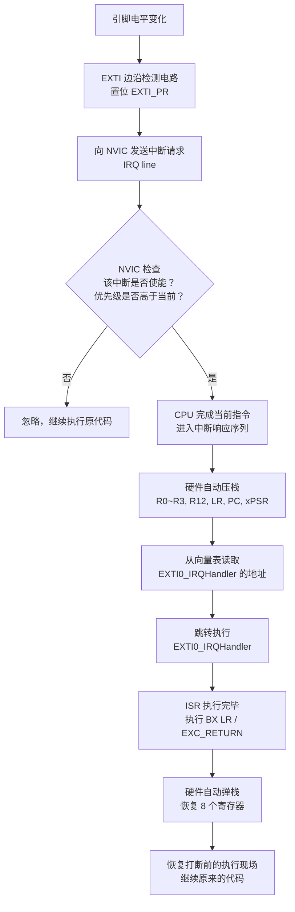

# Chapter 2 基础设施：中断系统，定时器和看门狗
---------------------------------------------------------------------------

如果你能啃下第一章，相信你对STM32已经有了相当深入的了解。本章以及后面234章本质上只是围绕第一章做补充。 中断，定时器和看门狗是大一点的MCU项目必须具备的三个外设，甚至可以说是彻底的标配。中断可以抢占式的打断现有任务，定时器是实现并发的基础，而看门狗则是系统最底层的状态监视器。

## 0 本章节目录

## 1 中断和中断控制器NVIC

总的来说，中断控制器是一种特殊的系统资源.不同于GPIO，RCC这种片上的外设可以集成在cpu外，**中断是和CPU设计深度绑定的异常处理机制，软硬件设计强耦合**，他也是MCU开发中，软件和硬件交互最复杂的一环。我们也难免会更多的去讨论Cortex内核和一些汇编的东西。但是不经历这些就无法真正的理解汇编，我们尽量做到简明且深入。

### 1.1 stm32的中断流程
为了建立对中断完整的认识， 我们不妨从软件端和硬件端两头夹击，搞清楚从电信号到用户函数，中断需要哪些过程。 软件端也就是我们的函数和汇编代码，而硬件端主要是一些允许中断的外设，比如gpio，uart，计时器等等。
#### 1.1.1 软件端--中断向量表→IRQ Handler

**再看启动代码`startup_stm32f407xx.s`**

我们之前分析startup.s，主要关注的是**启动流程**, 但是今天我们要关注的是他更为复杂的第二个功能**中断**. 中断的软件端的入口，其实就是startup.s。

我们需要复习之前学过的启动汇编代码，读者需要回答一个问题：启动代码主要是哪四个环节？

> 答：1.初始化堆栈位置 2.定义异常向量表，包括一大堆IRQ（中断向量表）和reset handler等其他异常 3.实现reset_handler，跳转至init和main 4.实现IRQ Handler的弱实现，用户可以写代码替代IRQHandler

很多人不明白中断，一个原因就是汇编基础不好。说白了中断在软件侧就是两件事情，按中断向量表查IRQ Handler， 强制跳转执行IRQ Handler。

**中断向量表** 

中断向量表本质就是我们看到的汇编代码开头的那一串.word，这个名字挺莫名其妙的，**中断向量表其实就是根据异常找对应的handler的一个键值映射关系，用c语言来说就是一个函数指针数组**。

我们以gcc版本的startup.s为例。这段代码就是我们的中断向量表。

```asm
g_pfnVectors:
  .word  _estack                   /* 0x00000000：初始栈顶（_estack 由链接脚本定义） */
  .word  Reset_Handler             /* 0x00000004：复位入口 */
  .word  NMI_Handler               /* 0x00000008 */
  .word  HardFault_Handler         /* 0x0000000C */
  ...（其他异常）
  .word  SysTick_Handler           /* 0x0000003C */
  .word  WWDG_IRQHandler           /* 0x00000040  ← 第一个外设中断 */
  .word  EXTI0_IRQHandler          /* ... */
  .word  USART1_IRQHandler         /* ... */
  .word  TIM2_IRQHandler           /* ... */
```
这张表被直接烧写在 Flash 的最开头。它不是普通的数据，而是 CPU 硬件会直接读取的**跳转地址列表**。每一项是一个 32 位函数指针，存的是对应处理函数的地址。

这个表不可以被理解为是一个简单的存个数组。他不是可以选择的，因为正如我们之前提到的，中断是和CPU设计深度绑定的异常处理机制，如果不在启动代码里实现中断向量表，cpu会直接报错，根本无法跑起来。

**IRQ Handler/ISR**

IRQ是Interrupt Request，意思是中断请求。**而Handle这个Request的函数，就是IRQ Handler，全称中断请求处理函数**。更专业更广泛的称呼是Interrupt Service Routine(ISR)，即中断服务程序。由于在Cortex的语义下，中断是一种特殊的异常（fault），所以本教程采用IRQ Handler而不是ISR描述这个函数。

如何写IRQ，需要注意什么是一个十分有挑战性的话题，这里暂时按下不表。我们在理解完了中断流程和中断的上下文环境后，会详细讨论这个话题。 目前我们需要记住，IRQ除了处理中断信号带来的逻辑之外，最重要的一件事情是清除中断标志位，避免重复进入整个中断流程，陷入死循环。这个不难理解，在介绍完硬件端中断发生了什么就好理解了。


#### 1.1.2 硬件端--IRQ→NVIC

**IRQ和外设中断使能**
从中断信号的电平改变，到这个信号进入内核的中断控制器，首先要经过外设自己的允许。外设有自己的中断屏蔽寄存器（比如 EXTI_IMR，TIM_DIER）。只有外设开启了对应的中断输出，电信号才会转化为一根无形的线，拉高向内核发出的中断请求（IRQ line）。也就是说，想让一个事件打断 CPU，第一步是配置外设允许中断。

**NVIC--嵌套向量中断控制器**

STM32的中断控制器大名叫Nested Vector Interrupt Controller--嵌套向量中断控制器。和 GPIO 或是 USART 这些片上外设不同，**NVIC 是 Cortex-M 内核本身的一部分，由 ARM 设计**。它驻留在内核空间，像一个拥有极高权力的保安队长，专门负责接收各个外设发来的 IRQ，然后决定是立刻打断 CPU，还是让暂缓执行。

至于为什么这个中断控制器前面会有个定语嵌套向量表，这个就是STM32这种有着正规军CPU内核的大MCU和一些八位机的区别。它有着复杂的中断管理机制，我们在后面会介绍。简单来说：
- **"向量"** 指的是它通过查向量表直接找到对应的 Handler，而不是像 51 单片机或者PIC那样进去再用 switch-case 分发。（这个我们已经感受过了）
- **"嵌套"** 指的是在处理一个低优先级中断的过程中，如果来了一个高优先级中断，NVIC 允许高优先级中断"抢占"（Preempt）执行，处理完后再返回低优先级中断，形成嵌套。

要在 NVIC 层级放行中断，你需要配置通道使能和优先级，这通常通过 `HAL_NVIC_EnableIRQ()` 和 `HAL_NVIC_SetPriority()` 完成。外设使能 + NVIC 使能，就是大名鼎鼎的中断**两级使能**。

#### 1.1.3 中断何以可能？--上下文保存

本质上，中断是脱离于正常程序的一个节外生枝的事件，在中断解决掉后，函数程序还是需要该干嘛干嘛的。这就涉及到中断的上下文保存。

我们之前研究过函数的栈帧，知道函数的跳转本质就是靠几行压栈和弹栈操作，保存了函数的执行情况。中断也不例外。但是可能你注意到了，中断是一个完全的异步操作，他随时可能发生，这和普通的函数跳转有本质的区别。函数跳转，靠的是编译器显式把压栈弹栈写进去,而中断可能在任意两条指令之间触发，编译器根本不知道"这条指令执行完之后会有中断"，也没有机会插任何保存代码，所以这个逻辑不可能在我们的代码空间里实现。

自然，这个问题由 **Cortex-M 硬件**来解决。进入中断时，CPU 会在跳转到 IRQ Handler 之前，**自动把一组寄存器压入当前栈**。这本来和普通的栈帧没有任何区别，也包括了链接寄存器LR。


进入 ISR 时，LR 会被 CPU 强制替换成一个特殊的魔数（Magic Number），名为 EXC_RETURN。这个值不是普通的返回地址，它被用来告诉内核：这是一个异常返回、要返回什么特权模式、以及该用 MSP 还是 PSP 弹栈。

这就是"EXC_RETURN"值。ISR 里执行 `BX LR` 时，CPU 识别到这个不寻常的地址，知道这是"从异常返回"，而不是普通的函数返回，于是触发**硬件弹栈**：把刚才压入的 8 个寄存器全部弹出，PC 恢复到被打断位置，程序继续运行。

所以整个过程对 C 代码来说是完全透明的——你写的 IRQ Handler 看上去就是一个普通的 `void` 函数，不需要任何特殊属性，进出上下文的保存和恢复已经由硬件完成了。


#### 1.1.4 从"电信号"到"执行函数"——中断的完整硬件流程

以一个按键触发外部中断（EXTI0）为例，整个过程是这样的：




### 1.2 硬件配置--两级使能

#### 1.2.1 中断的第一级使能--配置EXTI寄存器
首先需要说明的是，EXTI只是众多中断的一种，由于他逻辑复杂又最常用，我们以EXTI为例。事实上 对于不同的外部中断，都有着不同的中断使能寄存器。

##### 外部中断的入口：EXTI
EXTI全程是External interrupt/event controller—外部中断/事件控制器（我也不知道为啥要这么缩写，为什么不是EIEC），管理了控制器的20个中断/事件线。 每个中断/事件线都对应有一个边沿检测器，可以实现输入信号的上升沿检测和下降沿的检测。EXTI可以实现对每个中断/事件线进行单独配置， 可以单独配置为中断或者事件，以及触发事件的属性。


##### EXTI的功能框图
EXTI的功能框图包含了EXTI最核心内容，掌握了功能框图，对EXTI就有一个整体的把握，在编程时思路就非常清晰。EXTI功能框图如下


在图中可以看到很多在信号线上打一个斜杠并标注“23”字样，这个表示**在stm32f4内部类似的信号线路有23个**， 这与EXTI总共有23个中断/事件线是吻合的。所以我们只要明白其中一个的原理，那其他22个线路原理也就知道了。

为了把这个方块图看懂，我们顺着信号的流向，从左到右把它分成**信号输入**、**边沿检测**、**中断/事件分发**三个阶段来拆解：

**第一阶段：信号输入与边沿检测（带编号 1、2、3、4 的区域）**
1. **输入线（Input line）与 SYSCFG 多路复用**：这是 EXTI 的源头。在 STM32F4 中，这 23 根线有 16 根专供 GPIO 使用（EXTI0 ~ EXTI15），剩下的连到 PVD、RTC、USB 等特殊外设。
   由于 STM32 拥有众多的 GPIO 引脚（GPIOA~GPIOI），为了节约硬件资源，所有端口的同名引脚（如 PA0, PB0, ... PI0）必须**多路复用**到同一根 EXTI 中断线上（比如 EXTI0）。也就是说，在同一时刻，EXTI0 只能倾听一个端口的 Pin 0。这个“路由分发”工作我们需要在**系统配置控制器（SYSCFG）**中设置配置寄存器 `SYSCFG_EXTICR` 来完成。（*注：SYSCFG是低速外设，不在AHB上而是在APB2上，配置它前别忘了先开启 SYSCFG 的 APB2 时钟*）
2. **边沿检测电路**：这里对应两个寄存器，**RTSR（上升沿触发选择）**和 **FTSR（下降沿触发选择）**。如果在 RTSR 相应的位写 1，信号从低电平跳变到高电平时，就会触发后面的逻辑。两者可以同时写 1，实现双边沿触发。
3. **软件中断事件寄存器（SWIER）**：除了硬件引脚电平变化，我们还可以通过向 SWIER 寄存器写 1，用软件强行模拟一次中断触发，这在调试时非常有用。两者通过一个“或门”汇合。

**第二阶段：挂起（Pending）与屏蔽（Masking）**
4. **中断挂起寄存器（PR）**：如果边沿检测电路捕捉到了信号，或者软件触发了中断，这个寄存器对应的位就会被置 1，表示“有一个中断/事件正在等待处理”。（还记得 1.1.1 节里千叮咛万嘱咐的“一定要在 ISR 里清除标志位”吗？清的就是这个 **PR 寄存器**！不清它，后续的请求就发不出去，或者导致死循环。）
5. **中断屏蔽寄存器（IMR）和事件屏蔽（EMR）**：在这一步，信号出现了分流。
   - 向左走是**产生中断**：这需要通过 IMR 寄存器的“与门”。如果 IMR 被设置为 0，信号就被截断了，这就叫“中断被屏蔽”。
   - 向右走是**产生事件**：同理，需要通过 EMR 寄存器的“与门”。

**第三阶段：进入 NVIC 还是去唤醒 CPU？**
- **中断线（发往 NVIC）**：如果 IMR 设置为 1 且发生了触发，信号就被发送到 NVIC，最终由 CPU 停下当前工作去执行 `EXTI_IRQHandler`。
- **事件线（发往脉冲发生器）**：如果 EMR 设置为 1，信号不会打断 CPU 的代码执行，而是去触发一个单脉冲。这个脉冲常常被用来唤醒处于睡眠模式的 CPU，或者去触发 ADC 开始采样、定时器开始计数，这种机制完全纯硬件，不需要 CPU 浪费算力参与，也就是常说的 **"事件驱动（Event-Driven）"**。

所以，配置一个 EXTI 本质上就是做简单的填空题：选好输入线 -> 切好上升极还是下降极 -> 打开 IMR 开关 -> 准备好 NVIC。

##### EXTI 关键寄存器一览

根据 stm32f4 的参考手册，EXTI 的基地址为 `0x4001 3C00`，下面是我们最常用到的几个核心寄存器（偏移量和位定义）：

| 寄存器名称 | 偏移量 | 作用 | 核心位说明 |
|---|---|---|---|
| **EXTI_IMR** | `0x00` | 中断屏蔽寄存器 | 位 0~22：写 1 开放对应的中断线请求，写 0 屏蔽（Mask）该中断。 |
| **EXTI_EMR** | `0x04` | 事件屏蔽寄存器 | 位 0~22：写 1 开放对应的事件线请求，写 0 屏蔽事件。 |
| **EXTI_RTSR** | `0x08` | 上升沿触发选择 | 位 0~22：写 1 允许对应输入线上的上升沿触发。 |
| **EXTI_FTSR** | `0x0C` | 下降沿触发选择 | 位 0~22：写 1 允许对应输入线上的下降沿触发。（**注**：若 RTSR 和 FTSR 都写 1，则为双边沿触发） |
| **EXTI_SWIER**| `0x10` | 软件中断事件寄存器 | 位 0~22：写 1 可以靠软件强行触发一次中断/事件请求，主要用于调试。 |
| **EXTI_PR** | `0x14` | 挂起寄存器（Pending）| 位 0~22：触发后该位变为 1。**注意：往该位写 1 才能清零！**写 0 无效。中断处理函数的最后必须往对应位写 1 清除标志位。 |

这 6 个 EXTI 相关的寄存器，完美和刚才上面框图里的各个节点对应上了。

##### SYSCFG 关键寄存器一览

根据 stm32f4 的参考手册，SYSCFG 的基地址为 `0x4001 3800`。正如前面所说，我们需要用其中的 `SYSCFG_EXTICR` 寄存器来解决同名 GPIO 引脚的多路复用问题。下面是相关的几个核心寄存器（偏移量和位定义）：

| 寄存器名称 | 偏移量 | 作用 | 核心位说明 |
|---|---|---|---|
| **SYSCFG_EXTICR1** | `0x08` | 外部中断配置寄存器 1 | 配置 EXTI0 ~ EXTI3 的数据源。每 4 位控制一根线。比如位 3:0 控制 EXTI0，设为 `0000` 表示映射到 PA0，`0001` 表示 PB0，以此类推。 |
| **SYSCFG_EXTICR2** | `0x0C` | 外部中断配置寄存器 2 | 配置 EXTI4 ~ EXTI7 的数据源。功能和上述同理。 |
| **SYSCFG_EXTICR3** | `0x10` | 外部中断配置寄存器 3 | 配置 EXTI8 ~ EXTI11 的数据源。功能和上述同理。 |
| **SYSCFG_EXTICR4** | `0x14` | 外部中断配置寄存器 4 | 配置 EXTI12 ~ EXTI15 的数据源。功能和上述同理。 |

***小测：如果要使能PA5的上升沿触发中断， 需要经历哪几个核心配置步骤？IRQ Handler中需要如何完成标志位清零？***

>答：
> 1. **时钟与引脚路由：**
>    - **开启外设时钟**：GPIOA 挂载在 AHB1 总线，SYSCFG 挂载在 APB2 总线。需将 `RCC_AHB1ENR` 的第 0 位置 1，并将 `RCC_APB2ENR` 的第 14 位置 1。*(C语句：`RCC->AHB1ENR |= (1 << 0); RCC->APB2ENR |= (1 << 14);`)*
>    - **路由输入源**：配置 `SYSCFG_EXTICR2` 寄存器 (地址：`0x4001 380C`)，将控制 EXTI5 的位域 [7:4] 清零为 `0000`，即选中 PA5。*(C语句：`SYSCFG->EXTICR[1] &= ~(0x0F << 4);`)*
> 2. **配置 EXTI：**
>    - **开启上升沿触发**：将 `EXTI_RTSR` 寄存器 (地址：`0x4001 3C08`) 的第 5 位置 1。*(C语句：`EXTI->RTSR |= (1 << 5);`)*
>    - **取消中断屏蔽**：将 `EXTI_IMR` 寄存器 (地址：`0x4001 3C00`) 的第 5 位置 1。*(C语句：`EXTI->IMR |= (1 << 5);`)*
> 3. **清零标志位：**
>    - 进入对应的中断服务程序（`EXTI9_5_IRQHandler`）后，必须向 `EXTI_PR` 寄存器 (地址：`0x4001 3C14`) 的第 5 位**写 1** 以清除挂起标志，否则会导致无限触发死循环。*(C语句：`EXTI->PR |= (1 << 5);`)*

#### 1.2.2 进入内核--NVIC，中断使能和优先级管理

##### NVIC是“内核外设”
不同于 GPIO、USART 这种由 ST 设计的片上外设，NVIC（嵌套向量中断控制器）是 Cortex-M 内核本身的一部分，由 ARM 原厂设计。正因为它是“内核外设”，操作它往往涉及处理器的底层权限和复杂指令。因此，**极度不推荐直接用位操作去算 NVIC 的相关寄存器**。

ARM 官方在 CMSIS 库（如 `core_cm4.h`）里提供了一套通用的标准函数。无论你是使用寄存器开发、标准库还是 HAL 库，配置 NVIC 时最规范的做法都是直接调用内核标准接口，比如 `NVIC_SetPriorityGrouping()` 和 `NVIC_EnableIRQ()`。

##### 中断的第二级使能
配置完 EXTI 仅仅相当于让外设发出了一个电平请求（中断线 IRQ line）。这个请求能否真正打断 CPU 执行代码，完全由“安保队长” NVIC 说了算。这就是著名的**“两级使能”**机制：
1. **第一级在外设（如 EXTI_IMR）**：允许外设发出中断请求脉冲。
2. **第二级在内核控制器（NVIC_ISERx）**：决定是否放行该中断请求进入 CPU 并触发异常响应序列。

我们必须调用 `NVIC_EnableIRQ(IRQn_Type IRQn)` 给特定通道放行，对应的外部打断事件才能行云流水地进入 CPU。

##### 为什么会有优先级
系统运行中，难免会遇到两种情况：
1. 两个或多个外部事件在**同一时刻**发生并同时发出了中断请求。
2. CPU 正在处理某个中断 A 的时候，突发了另一个非常紧急的硬件危机（中断 B）。
为了让 CPU 知道“该听谁的”、“能不能放下现有的工作去救火”，NVIC 引入了复杂的优先级管理机制。通过给不同的中断源排资论辈，确保核心任务能够得到最快速的响应。

##### 响应式优先级和抢占式优先级
为了处理上述复杂场景，STM32 的中断优先级在逻辑上被分为互相配合的两个维度：

1. **抢占优先级 (Preemption Priority)：** 决定能不能 **“打断”** 别人。如果中断 A 正在执行，此时抢占优先级更高（数值更小）的中断 B 来了，B 会直接暂停 A 先跑到前台执行自己，这就是经典的 **中断嵌套**。
2. **响应优先级 (Sub-priority / 子优先级)：** 只有在两个中断**同时到达**，或者都在排队等待 CPU 叫号时才起作用。它决定了谁先“出列”。需要注意：**响应优先级无法抢占正在执行的中断！** 哪怕正在排队的 B 的响应优先级极高，只要它的抢占优先级不高于当前正在执行的 A，B 也就只能憋着干等。

> *补充：如果产生两个事件抢占和响应优先级都一模一样并且同时发生，则看硬件中断向量表的排列顺序（IRQn 编号大小），靠前（编号越小）的先执行。*

##### 内核寄存器AIRCR和优先级分组
STM32 硬件上的 Cortex-M4 内核本身规定最多支持 8 位的优先级寄存器，但 **STM32F4 在芯片设计时只使用了高 4 位**（因此单个中断只有被分配到 16 种内部优先等级的可能）。

这宝贵的 4 个 bit，必须被合理切分给“抢占”和“响应”。这就引入了**优先级分组 (PRIGROUP)** 的概念。借助 Cortex-M 核的 `SCB->AIRCR`（应用程序中断及复位控制寄存器），开发者可以设定 5 种不同的分组方式：

| 分组 | 抢占优先级位数 | 响应优先级位数 | 抢占优先级数字范围 | 响应优先级数字范围 |
|---|---|---|---|---|
| **Group 0** | 0 位 | 4 位 | 0 | 0 ~ 15 |
| **Group 1** | 1 位 | 3 位 | 0 ~ 1 | 0 ~ 7  |
| **Group 2** | 2 位 | 2 位 | 0 ~ 3 | 0 ~ 3  |
| **Group 3** | 3 位 | 1 位 | 0 ~ 7 | 0 ~ 1  |
| **Group 4** | 4 位 | 0 位 | 0 ~ 15| 0 |

**非常重要的开发约束：**
1. **一锤子买卖：** 在同一个工程项目中，你应该在初始化时调用 `NVIC_SetPriorityGrouping()` 一次性分配好。**一旦设定，之后绝不要再去修改分组！** 如果各模块各配各的分组，会造成极其灾难性的全局中断混乱。
2. **操作系统的偏好：** 如果未来你的项目需要移植 `FreeRTOS` 等实时系统，通常强烈要求（或强制要求）直接使用 **Group 4**（全部是抢占优先级，扔掉响应优先级这个概念），这样 RTOS 才能对其内核调度逻辑进行最干净利落的管理。 

### 1.3 软件服务--IRQ Handler的注意事项

我们之前介绍过，用来处理中断的函数就是IRQ Handler或者叫ISR。他有一个固定的任务就是必须要清除中断标志位。但我们难免要加入一些常见的用户逻辑，比如亮灯，蜂鸣，发消息告警等等。这就涉及到一个问题，我们真的能自由的写IRQ Handler吗？ 我们写IRQ Handler的时候需要注意什么？

#### 1.3.1 IRQ Handler运行的上下文

我们知道，IRQ Handler不是编译器编出来的，有着明确依赖关系和严谨栈帧结构的，那种有正式编制的函数调用。他是被CPU暴力拎过来的临时工。那么我们需要思考，IRQ Handler有什么运行环境？

**1. 特权模式与主堆栈 (MSP)**
在裸机环境下（没有操作系统），当 Cortex-M 响应中断并进入 IRQ Handler 时，它会被强制切入**特权模式 (Privileged Mode)**，并且强制使用**主堆栈指针 (MSP, Main Stack Pointer)**。即使打断前程序正在使用进程堆栈 (PSP)，进入中断后也会立刻切回 MSP。这意味着你在中断里定义的局部变量，都在主堆栈上分配内存。如果不加以克制，很容易导致主堆栈溢出（Stack Overflow），进而引发非常难排查的 `HardFault`。

**2. 异步性与全局变量**
因为中断随时可能发生（比如正在执行主循环的下一行代码前），主程序和中断服务程序本质上构成了两个**并发**的执行流。如果你在 IRQ Handler 中修改了某个全局变量，而主循环正在读取它，由于编译器可能会对主循环中的读取进行优化（比如把它缓存在寄存器里），主循环可能永远不知道这个变量被中断改了。
> **对策：** 凡是在中断里修改、在主程序里读取的全局变量，**必须用 `volatile` 关键字修饰**，强制编译器每次都去内存原址粗暴地读取它，禁止任何形式的缓存优化。

#### 1.3.2 黄金法则：“快进快出”
明白上下文后，我们很容易就可以总结出写 ISR 代码的黄金法则——**快进快出，做最少的事。**

由于中断会阻塞系统（特别是比他优先级低的中断），一旦你的 IRQ Handler 执行时间太长，最直接的后果就是实时性暴跌。别人发过来的高频信号你漏收了，按键没防抖变成卡死了。

在 IRQ Handler 里，**绝对禁止（或者说极其不推荐）**做以下操作：
1. **死延时：** 绝对不要出现 `Delay_ms(10)`，甚至是稍微长一点的空循环 `while(1)`。
2. **大批量数据传输/拷贝：** 如果有巨大的数组需要移动，不要在 CPU 里面做 `memcpy`，应该交给 DMA（我们后续会讲）。
3. **阻塞式外设操作：** 比如在中断里调用串口的阻塞发送函数 `printf`。`printf` 不仅本身极其耗时，而且很可能会尝试触发其他串口中断，如果那个串口的优先级比当前中断低，还会导致永久性死锁！
4. **滥用局部变量：** 如前段所述，栈空间宝贵，禁止在 ISR 里开大数组。

**最佳实践：** 
在大多数正常的工业代码中，IRQ Handler 里只会做三件事：
1. **清标志：** `EXTI->PR = 1;` 
2. **读数据：** 快速把寄存器里新来的数据扒进内存。
3. **置标志（立个 Flag 就跑）：** 将一个预先定义好的 `volatile bool flag` 置为 true。然后剩下的脏活累活和耗时运算，全部丢给 `main` 函数的 `while(1)` 里面去轮询处理。

这就是典型的**“前后台架构（Foreground-Background Architecture）”**，中断作为前台负责抢修，主循环作为后台兜底处理业务。

**一个小例子：串口收到特定指令后，触发声光报警**

假设我们的 USART 接收到一个错误指令，系统要求长亮红灯 1 秒，并同时让蜂鸣器响 1 秒作为告警。

**❌ 错误的做法（在中断里死等）：**
在 `USART_IRQHandler` 里判断若是错误指令，直接开灯、开蜂鸣器，然后调一个 `Delay_ms(1000)`，然后再关灯关蜂鸣器... 
这样会导致在这 1 秒内，整个 MCU 都在中断里“卡死”，外面的其他常规逻辑完全停摆，新的串口数据也会全部丢失！

**✅ 正确的做法（前后台架构）：**
1. 定义一个全局变量：`volatile bool g_isErrorTriggered = false;`
2. **前台（ISR，快进快出）：** 在 `USART_IRQHandler` 里判断若是错误指令，只需执行 `g_isErrorTriggered = true;` ，然后清除中断标志位，`return` 退出中断。
3. **后台（main主循环）：**
   ```c
   while(1) {
       if (g_isErrorTriggered) {
           g_isErrorTriggered = false; // 马上重置标志位
           Light_Red();
           Buzzer_On();
           Delay_ms(1000);   // 主循环里的 Delay 不会阻塞新的高优先级中断
           Light_Off();
           Buzzer_Off();
       }
       // ...处理其他的业务逻辑...
   }
   ```
通过这种方式，中断响应极快（只有几条指令的时间），而耗时的亮灯和延时则由主循环慢慢完成，完美保证了系统的实时性和健壮性。