# Chapter 3 外设串讲：通信协议

## 0 本章节目录

- [**§1 通信协议新手村——UART**](#1-通信协议新手村uart)
  - [1.1 UART 基础回顾](#11-uart基础回顾)（SAF 三属性 · 波特率与吞吐量 · 帧格式）
  - [1.2 这么慢，用它干啥？UART 的使用场景](#12-这么慢用它干啥uart的使用场景)（调试/上位机/外挂模块/MCU间通信）
  - [1.3 STM32 的 USART 外设](#13-stm32的usart外设)（功能框图 · 关键寄存器 · 波特率计算 · 两级双缓冲收发原理 · 轮询/中断/DMA · 环形缓冲区）
  - [1.4 代码实战：配置 USART1 并重定向 printf](#14-代码实战配置-usart1-并重定向-printf)（CMake 工程 · 寄存器直写 · `_write()` 重定向 · 中断回显）
- [**§2 总线协议理论与 SPI 实战**](#2-总线协议和spi)
  - [2.1 总线的基本概念](#21-总线的基本概念)（结构 · 序列化与广播 · 同步/异步 · 推挽/开漏/差分 · 硬件片选/帧内地址/内容寻址 · 读写控制 · 逐位仲裁）
  - [2.2 SPI——我的第一个总线协议](#22-spi我的第一个总线协议)（五个属性 · 为何速度最快 · CPOL/CPHA 四模式 · 字节交换本质）
  - [2.3 STM32 的 SPI 外设](#23-stm32的spi)（功能框图 · CR1/SR 寄存器 · NSS 两种管理 · ExchangeByte 原语 · BSY 等待）
  - [2.3.4 代码实战：W25Q128 初始化与读写测试](#234-代码实战w25q128-初始化与读写测试)（SPI1 寄存器直写 · 扇区擦除 · 页编程 · 回读验证）
- [**§3 IIC（I²C）**](#3-iici²c)
  - [3.1 为什么需要 I²C？](#31-为什么需要-i²c)（从"8个设备接线"约束推导设计目标）
  - [3.2 I²C 的属性](#32-i²c-的属性)（五属性表 · 每项从约束推导）
  - [3.3 开漏与线与：I²C 的物理基础](#33-开漏与线与i²c-的物理基础)（推挽短路 → 开漏机制 → 线与三用途 · 时钟延展 · RC 限速）
  - [3.4 总线信令：三条物理规则](#34-总线信令三条物理规则)（规则表 · ACK/NACK 机制）
  - [3.5 完整帧格式与事务](#35-完整帧格式与事务)（帧结构表 · 写事务 · 随机读 · Repeated START）
  - [3.6 多主仲裁](#36-多主仲裁进阶)（物理基础 · 逐位仲裁表）
  - [3.7 STM32 的 I²C 外设](#37-stm32-的-i²c-外设)（硬件 vs 软件 · 硬件 I²C 与 BUSY 锁死 · 软件模拟四原语）
  - [3.8 代码实战：软件模拟 I²C 读写 AT24C02](#38-代码实战软件模拟-i²c-读写-at24c02)
- [**§4 CAN 总线**](#4-can-总线)
  - [4.1 为什么需要 CAN？](#41-为什么需要-can)（汽车布线约束 → CAN 设计目标）
  - [4.2 CAN 的属性](#42-can-的属性)（五属性表 · 与 I²C/SPI 横向对比）
  - [4.3 差分信号与总线物理](#43-差分信号与总线物理)（显性/隐性电平 · 终端电阻 · 收发器芯片）
  - [4.4 帧格式](#44-帧格式)（数据帧 · 扩展帧 · 位填充规则）
  - [4.5 位定时与同步](#45-位定时与同步)（TQ · 波特率公式 · 500kbps 计算实例）
  - [4.6 仲裁：非破坏性 CSMA/CR](#46-仲裁非破坏性-csmacr)（四条规则 · 逐位仲裁表）
  - [4.7 错误检测与处理](#47-错误检测与处理)（五种错误 · TEC/REC 计数 · 三种节点状态）
  - [4.8 STM32 的 bxCAN 外设](#48-stm32-的-bxcan-外设)（功能框图 · 工作模式 · 寄存器 · 发送邮箱 · 接收 FIFO · 过滤器）
  - [4.9 代码实战：CAN 收发](#49-代码实战can-收发)

---


## 1 通信协议新手村——UART

相信你或多或少已经学习过UART了（毕竟本教程不是面向零基础读者），但是我们还是复习几个UART的基础知识。重要的不是你"见过"这些概念，而是你能不能**闭上眼复述出来**。

### 1.1 UART基础回顾

UART（Universal Asynchronous Receiver/Transmitter，通用异步收发器）可以用三个字母概括它的全部特征：**S-A-F**。

#### 1.1.1 UART的属性：SAF — Serial, Asynchronous, Full-duplex

- **Serial（串行）**：数据在一根线上逐位传输，而非多根线同时发送多个 bit。这是嵌入式中最普遍的传输方式——引脚宝贵，用一根线搞定总比拉八根线划算。

- **Asynchronous（异步）**：收发双方之间**没有共享的时钟线**。这一点意味着一个至关重要的前提——双方必须**事先约定好相同的通信速率**（波特率），否则接收方根本不知道每个 bit 持续多长时间。这也是 UART 和 SPI、I2C 最根本的区别：后两者都有一根时钟线（SCK / SCL）由主机统一指挥节拍，而 UART 全靠双方各自的本地时钟"默契配合"。

- **Full-duplex（全双工）**：TX（发送）和 RX（接收）是两根独立的线，可以**同时**进行收和发，互不干扰。相比之下，I2C 的 SDA 线是双向共用的（半双工），同一时刻只能有一个方向在说话。

把三个词组合起来，UART 的物理画面就出来了：**两根线，没有时钟，各发各的，各收各的**。

> 🔌 **接线最小集**：TX → 对方 RX，RX ← 对方 TX，再加一根共地 GND——三根线就能跑起来。

##### USART 是什么？

你会发现 STM32 的外设名叫 **USART**（Universal **Synchronous**/Asynchronous Receiver/Transmitter），比 UART 多了个 "S"。多出来的是一根可选的 **CK（时钟输出）引脚**，可以让 USART 工作在同步模式下——此时它能输出时钟信号给对端。但实际开发中，这个同步模式极少使用，99% 的场景我们都把 USART 当 UART 用。所以下文不再区分，统一叫 UART，碰到寄存器名或 HAL 函数名是 USART 的时候你知道是一回事就行。

#### 1.1.2 通信速率和波特率

两台设备要用 UART 通信，第一件事就是**对表**——约定波特率（Baud Rate）。这里有三个容易混淆的概念，有必要一次性理清楚。

**比特率 (Bit Rate) / 传输速率**：每秒在物理线路上实际传输的 bit 数，包含所有开销位（起始、校验、停止）。对于 115200 baud 的 UART，比特率就是 **115200 bps**。

**波特率 (Baud Rate)**：每秒传输的**符号（symbol）**数，单位 Baud。在 UART 这种二进制协议中，1 个符号 = 1 bit，所以数值上波特率 = 比特率。那为什么要生造出"波特率"这个词呢？I2C、SPI 我们都直接说比特率或者传输速率啊？事实上这个词来自通信领域——当通讯涉及到**调制**的时候，比如 QAM（正交幅度调制），一个符号可以携带多个 bit（例如 16-QAM 中 1 符号 = 4 bit），此时波特率和比特率就不相等了。只不过在 UART 这种最朴素的二电平编码下，两者恰好是同一个数字。其实这个概念纯属多余，还会导致误导新人，但是正如我们讲到的，UART 是通讯协议的新手村，它出现得太早了，在大家还分不清模电数电的时候就存在了，所以这个作为行业习惯被保留了下来。

**吞吐量 / 有效数据速率 (Throughput)**：去掉帧开销后，每秒实际传输的有效数据量。以最常见的 8N1 配置（8 数据位、无校验、1 停止位）为例，一帧 = 1(起始) + 8(数据) + 1(停止) = 10 bit，其中只有 8 bit 是有效载荷：

$$\text{有效数据速率} = 115200 \times \frac{8}{10} = 92160 \text{ bps} \approx 11.25 \text{ KB/s}$$

三者的关系一张表就能记住：

| 概念 | 115200-8N1 下的值 | 含义 |
|:---:|:---:|---|
| 波特率 | 115200 Baud | 每秒符号数（=线路上的 bit 切换速率）|
| 比特率 | 115200 bps | 每秒总 bit 数（含开销）|
| 有效数据速率 | 92160 bps ≈ 11.25 KB/s | 每秒有效载荷 bit 数（效率 80%）|

> 💡 **为什么效率只有 80%？** 因为每 8 bit 有效数据必须搭上 2 bit 的帧开销（起始 + 停止），这是异步协议为"没有时钟线"付出的代价。如果开了校验位（8E1），一帧变成 11 bit，效率降到 72.7%。

数值上怎么直觉？以 **115200 baud** 为例，每个 bit 持续：

$$T_{bit} = \frac{1}{115200} \approx 8.68\,\mu s$$

接收方在**每个 bit 的中间时刻**进行采样，就能稳定地读出 0 或 1。

> ⚠️ **波特率必须双方一致。** 如果发送方 115200，接收方 9600，接收方会用慢 12 倍的速率去"切"数据，结果自然是乱码。这是新手串口调试最常见的翻车现场。

#### 1.1.3 帧格式

UART 没有时钟线，接收方怎么知道"数据开始了"？靠的就是一套固定的**帧格式**（Frame Format）。一个完整的 UART 帧长这样：

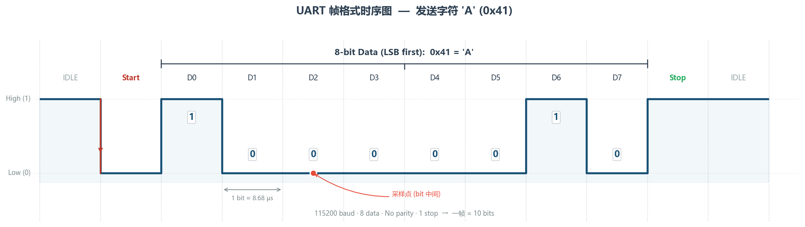

逐段拆解：

1. **空闲态**：TX 线保持**高电平**。这是 UART 的"默认安静状态"。
2. **起始位（Start Bit）**：TX 拉低一个 bit 周期。接收方检测到**下降沿**（高→低），就知道"一帧数据来了"，开始按约定的波特率逐位采样。这是 UART 唯一的同步手段。
3. **数据位**：紧跟起始位之后的 8 个 bit（也可以配成 9 位），注意是 **LSB first**（最低位先发）。
4. **校验位（Parity，可选）**：可以配置为奇校验或偶校验，用于简单的错误检测。实际项目中大多数配成 **None**（不校验），因为校验能力太弱，不如在应用层做 CRC 来得靠谱。
5. **停止位（Stop Bit）**：TX 回到高电平，持续 1 或 2 个 bit 周期。停止位结束后，线路回到空闲态，等待下一帧。

所以我们在配置串口时常见到的 **"115200-8N1"** 就是一句完整的协议描述：115200 波特率、8 位数据、No 校验、1 个停止位。

### 1.2 这么慢，用它干啥？UART的使用场景

看完上面的分析你可能会想：一百多 K 的速率，十几 KB/s 的吞吐量，在 168MHz 的 STM32 面前简直慢得离谱。确实，论速度 UART 完全不是 SPI（可以到几十 MHz）的对手。但 UART 依然是嵌入式世界里**使用频率最高**的协议之一，原因很简单：

1. **调试输出（printf 重定向）**：开发阶段你最需要的就是一个能把变量值、状态信息"打印"出来的通道。UART + 串口终端（PuTTY / SecureCRT / VSCode Serial Monitor）堪称嵌入式开发的最佳搭档。你会在后面看到，只要重定向 `__io_putchar`，`printf` 就能直接往串口写——这大概是 UART 最高频的用途了。

2. **PC / 上位机交互**：自定义指令控制（发 `LED ON\r\n` 点灯）、实时数据上报（ADC 采样值一行一行吐出来给 Python 绘图）。很多小型测试系统的通信协议就是"串口 + 自定义文本指令"。

3. **外挂模块通信**：大量常见模块——GPS（NMEA 数据流）、蓝牙 HC-05、WiFi ESP8266/ESP32（AT 指令集）、4G 模块（AT 指令）——统统走 UART。这些模块厂商选择 UART 的原因和你一样：简单、通用、不用写复杂的总线驱动。

4. **MCU 间点对点通信**：两块板子之间需要互传少量数据时（几百字节/秒级别），拉两根线接上 UART 是最省事的方案。

> 总结成一句话：UART 胜在**简单、通用、够用**。它是嵌入式世界的"普通话"——不是最快、不是最省线、但走到哪里都能用。

### 1.3 STM32的USART外设

前面两节是"通用知识"，放在任何一颗 MCU 上都成立。从这一节开始，我们把目光锁定到 **STM32F4 的 USART 外设**上，看看芯片设计者是怎么把前面那些抽象概念变成具体的硬件寄存器和数据通路的。这一章节营养丰富，因为 ST 用了精巧的缓冲机制和状态机来优化 UART 这个看似最简单的通信协议。

#### 1.3.1 功能框图

打开参考手册，你会看到如下的一张功能框图。


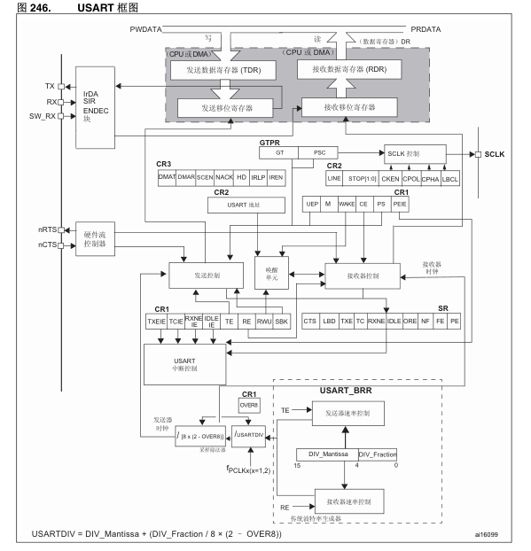


我们绘制如下的简化图，把它拆成四条通路来理解：

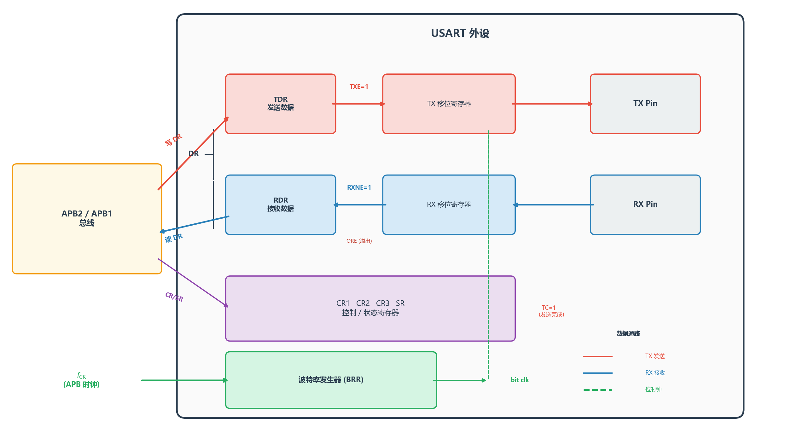

**发送通路**（上半部分）：软件往数据寄存器（DR）写入一个字节 → 硬件把它搬进 **TX 移位寄存器** → 移位寄存器在波特率时钟的驱动下，一位一位地把数据推到 TX 引脚上。当 DR 里的数据被搬走（移位寄存器接手），**TXE**（TX Empty）标志置 1，意味着你可以写下一个字节了。当移位寄存器也把最后一位发完，**TC**（Transmission Complete）标志置 1。

**接收通路**（下半部分）：RX 引脚上检测到起始位的下降沿 → **RX 移位寄存器**开始按波特率时钟逐位采样 → 一帧接收完毕后，数据搬进 DR，**RXNE**（RX Not Empty）标志置 1 → 软件读 DR 取走数据。

**波特率发生器**：APB 总线时钟 $f_{\text{CK}}$ 经过 BRR 寄存器配置的分频比，产生收发共用的位时钟。这是 UART "没有时钟线"的补偿——虽然线上没有时钟，但芯片内部必须有一个精确的时钟来驱动移位寄存器。

**控制与状态通路**：CPU 通过 APB 总线读写 CR1/CR2/CR3 三个控制寄存器来配置外设（使能、字长、停止位、中断开关、DMA 开关等），通过读 SR 状态寄存器获取外设当前状态（TXE、RXNE、TC、ORE……）。这条通路是"指挥中心"——前面三条通路的行为，全都由这里的寄存器位来决定。

> 🔑 **关键认知**：你在代码里只看到一个 `USART1->DR`，但全双工的秘密藏在它背后的**两级双缓冲**结构里——发送侧 TDR + TX 移位寄存器，接收侧 RX 移位寄存器 + RDR，两条通路完全独立。到底是"一个寄存器"还是"两个寄存器"？§1.3.4 我们结合收发流程拆开来详细讲。

#### 1.3.2 关键寄存器速查

不需要把所有位都背下来，但以下几个寄存器的核心位你必须烂熟于心。我们按功能分成三组来看。

##### 数据寄存器：DR

**地址偏移：0x04**，16 位宽，只有低 9 位有效（8 位模式下只用 [7:0]）。

| 位域 | 名称 | 读/写 | 说明 |
|:---:|:---:|:---:|---|
| [8:0] | DR | R/W | 写 = 数据送入发送缓冲；读 = 从接收缓冲取出 |
| [15:9] | — | — | 保留 |

你可能会疑惑：发送和接收共用一个地址，那全双工怎么实现的？DR 背后到底藏了什么硬件结构？这是一个很好的问题——我们留到 §1.3.4 收发流程里，结合移位寄存器一起拆开讲。

##### 波特率寄存器：BRR

**地址偏移：0x08**，16 位宽。

| 位域 | 名称 | 作用 |
|:---:|:---:|---|
| [15:4] | DIV_Mantissa | USARTDIV 的整数部分 |
| [3:0] | DIV_Fraction | USARTDIV 的小数部分（OVER16 时 4 bit 有效，OVER8 时仅低 3 bit 有效，bit[3] 必须为 0）|

具体怎么算，下一节详细推导。

> 顺便一提：USART 还有一个很少用到的 **SCLK（同步时钟输出）** 功能。当 CR2 的 CLKEN 位置 1 时，USART 会在 CK 引脚上输出与每个数据位同步的时钟信号——这就是 USART 名字里那个 "S"（Synchronous）的来源。它在和一些老式同步串行设备（如智能卡接口 ISO 7816）通信时有用，日常开发几乎碰不到，知道有这回事就行。

##### 状态与控制寄存器：SR、CR1、CR2、CR3

**SR — 状态寄存器**（地址偏移 0x00，只读为主）

| 位 | 名称 | 含义 |
|:---:|:---:|---|
| 7 | **TXE** | TX 数据寄存器空。= 1 时可以往 DR 写下一个字节 |
| 6 | **TC** | 发送完成。移位寄存器也空了，整个发送真正结束 |
| 5 | **RXNE** | RX 数据寄存器非空。= 1 时说明收到了一个字节，赶紧读走 |
| 4 | **IDLE** | 检测到空闲帧。常用于 DMA 不定长接收的"结束信号" |
| 3 | **ORE** | 溢出错误。上一个字节还没读走，新字节又来了——数据丢失！ |
| 1 | **FE** | 帧错误。没有在预期位置检测到停止位（典型原因：波特率不匹配）|
| 0 | **PE** | 校验错误 |

TXE 和 RXNE 是你用得最多的两个标志，TC 在需要精确控制发送时序时才会用到（比如 RS485 方向切换）。

**CR1 — 控制寄存器 1**（地址偏移 0x0C，最常用）

| 位 | 名称 | 说明 |
|:---:|:---:|---|
| 15 | **OVER8** | 0 = 16 倍过采样（默认），1 = 8 倍过采样 |
| 13 | **UE** | USART 使能。总开关 |
| 12 | **M** | 字长。0 = 8 位数据，1 = 9 位数据 |
| 10 | **PCE** | 校验使能 |
| 9 | **PS** | 校验选择。0 = 偶校验，1 = 奇校验 |
| 7 | **TXEIE** | TXE 中断使能 |
| 6 | **TCIE** | TC 中断使能 |
| 5 | **RXNEIE** | RXNE 中断使能（最常开的中断）|
| 3 | **TE** | 发送使能 |
| 2 | **RE** | 接收使能 |

**CR2**（地址偏移 0x10）主要管停止位（STOP[13:12]：`00` = 1 位，`10` = 2 位）和同步时钟配置（CLKEN、CPOL、CPHA）。**CR3**（地址偏移 0x14）主要管 DMA 使能（DMAT / DMAR）和硬件流控（CTSE / RTSE）。日常使用 115200-8N1 时，CR2 和 CR3 保持默认值即可。

#### 1.3.3 波特率计算

这是很多教程一笔带过、但面试和调试时经常用到的知识点。我们来把它彻底讲透。

**公式推导**

USART 的波特率由 APB 总线时钟 $f_{\text{CK}}$ 和 BRR 寄存器中的**分频因子 USARTDIV** 共同决定：

$$
\text{Baud} = \frac{f_{\text{CK}}}{8 \times (2 - \text{OVER8}) \times \text{USARTDIV}}
$$

其中：
- $f_{\text{CK}}$：APB 总线时钟。**USART1 / USART6 挂在 APB2**（默认 84 MHz），**USART2 / USART3 / UART4 / UART5 挂在 APB1**（默认 42 MHz）。
- $\text{OVER8}$：过采样选择位。$= 0$ 为 16 倍过采样（默认），$= 1$ 为 8 倍过采样。
- $\text{USARTDIV}$：定点分频因子，整数部分放在 BRR[15:4]，小数部分放在 BRR[3:0]。

把默认的 $\text{OVER8} = 0$ 代入，公式化简为：

$$
\text{Baud} = \frac{f_{\text{CK}}}{16 \times \text{USARTDIV}}
$$

反过来，已知目标波特率，求 USARTDIV：

$$
\text{USARTDIV} = \frac{f_{\text{CK}}}{16 \times \text{Baud}}
$$

**手算实例：USART1, 115200 baud**

$$
\text{USARTDIV} = \frac{84{,}000{,}000}{16 \times 115200} = \frac{84{,}000{,}000}{1{,}843{,}200} = 45.5729\overline{16}
$$

拆成整数和小数：
- 整数部分 $= 45$，即 $\text{DIV\_Mantissa} = 45 = \texttt{0x2D}$
- 小数部分 $= 0.5729\dots \times 16 = 9.166\dots$，四舍五入 $= 9$，即 $\text{DIV\_Fraction} = \texttt{0x9}$

$$
\text{BRR} = (45 \ll 4) \;|\; 9 = \texttt{0x02D9}
$$

反算实际波特率：

$$
\text{Baud}_{\text{actual}} = \frac{84{,}000{,}000}{16 \times \left(45 + \dfrac{9}{16}\right)} = \frac{84{,}000{,}000}{16 \times 45.5625} = \frac{84{,}000{,}000}{729} \approx 115226.3 \;\text{baud}
$$

$$
\text{误差} = \frac{115226.3 - 115200}{115200} \approx 0.023\%
$$

远小于 UART 通信的容许误差（一般 ±2%~3%），完全没问题。

**固件库怎么算的？**

打开 `stm32f4xx_usart.c` 的 `USART_Init()` 函数，你会看到一段看起来有点绕的整数运算：

```c
/* 先乘 25 再除，是为了用纯整数运算模拟小数除法 */
if ((USARTx->CR1 & USART_CR1_OVER8) != 0)
    integerdivider = ((25 * apbclock) / (2 * BaudRate));   // OVER8
else
    integerdivider = ((25 * apbclock) / (4 * BaudRate));   // OVER16

tmpreg = (integerdivider / 100) << 4;   // 整数部分放 [15:4]

fractionaldivider = integerdivider - (100 * (tmpreg >> 4));

if ((USARTx->CR1 & USART_CR1_OVER8) != 0)
    tmpreg |= ((((fractionaldivider * 8) + 50) / 100)) & 0x07;
else
    tmpreg |= ((((fractionaldivider * 16) + 50) / 100)) & 0x0F;

USARTx->BRR = (uint16_t)tmpreg;
```

以 OVER16 为例来"人肉跑"一遍：
1. `integerdivider = 25 × 84000000 / (4 × 115200) = 2100000000 / 460800 = 4557`（等效于 USARTDIV × 100 = 45.57... × 100，截断为 4557）
2. `tmpreg = (4557 / 100) << 4 = 45 << 4 = 720`
3. `fractionaldivider = 4557 - 100 × 45 = 57`
4. `fraction = (57 × 16 + 50) / 100 = 962 / 100 = 9`（+50 是四舍五入）
5. `BRR = 720 | 9 = 729 = 0x02D9` ✅

和我们手算的结果完全一致。固件库帮你做了这些，你调用 `USART_Init()` 填个 `115200` 就行了——但知道它背后在干什么，调试时心里才有底。

> 💡 **什么时候要用 OVER8？** 当 APB 时钟较低、目标波特率较高时，16 倍过采样可能无法产生足够精确的分频比。此时切到 8 倍过采样，等效于把分频因子减半，能达到更高的波特率——代价是抗噪声能力下降（采样点从 16 个减到 8 个）。日常使用建议保持默认的 OVER16。

#### 1.3.4 收发流程

理解了寄存器，现在来拆开 USART 的收发机制。我们分三层来讲：先看硬件到底怎么搬数据，再看软件有哪些方式去配合，最后解决一个真实工程中绕不开的问题——环形缓冲区。

##### 硬件：两级双缓冲与全双工的秘密

在 §1.3.2 我们留了一个悬念：DR 只有一个地址，全双工怎么实现？答案是：DR 背后藏着**两条独立的二级缓冲链**——发送和接收各有自己的锁存器 + 移位寄存器，互不干涉。

**收发器内部结构**

从软件角度看，数据寄存器只有一个——DR（地址偏移 0x04）。但在硬件层面，USART 的收发通路各有**两级缓冲**，总共四个独立的硬件单元：

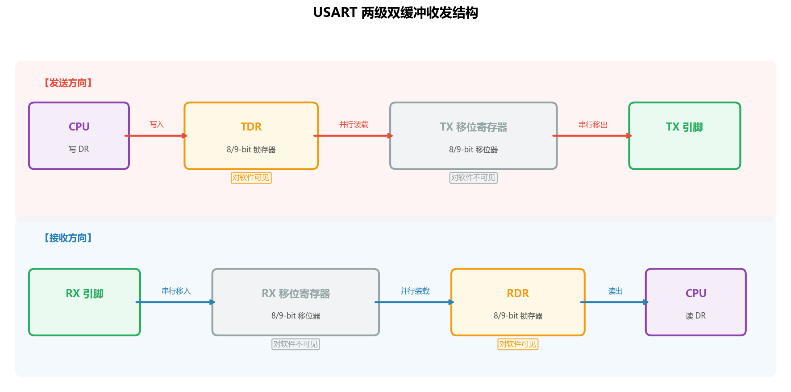

逐个认识一下：

- **TDR**（Transmit Data Register）：一个 8/9 bit 的锁存器。CPU 执行"写 DR"时，数据**只会**进入这里。它是**只写**的——你永远不需要读回自己发了什么。
- **TX 移位寄存器**：从 TDR 并行装载一整个字节后，在波特率时钟驱动下，一位一位地从 LSB 开始推到 TX 引脚上。这个寄存器对软件完全不可见，你无法读写它。
- **RX 移位寄存器**：检测到起始位后，在波特率时钟驱动下，从 RX 引脚逐位采样移入。同样对软件不可见。
- **RDR**（Receive Data Register）：一个 8/9 bit 的锁存器。RX 移位寄存器收满一帧后，一次性并行装载到这里。CPU 执行"读 DR"时，数据**只会**从这里出来。它是**只读**的。

**为什么一个地址就够了？**

关键在于：TDR 只需要写，RDR 只需要读。一次总线操作要么是读、要么是写，不可能同时发生。所以硬件设计者只需在总线接口上做一个简单的路由：

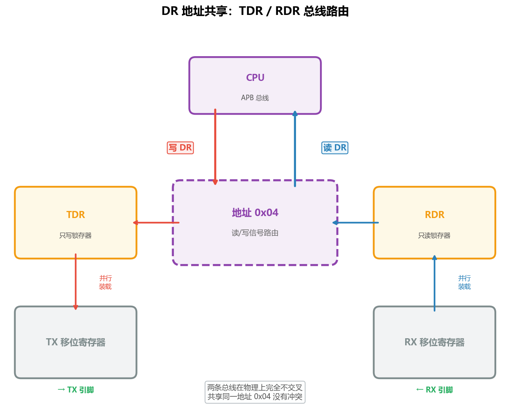

写数据总线连到 TDR 的输入，RDR 的输出连到读数据总线——两条线在物理上根本不交叉，所以共享同一个地址 0x04 完全没有冲突。这就如同一个邮箱有两个口：你从上面塞信（写 → TDR），邮递员从下面取信（读 → RDR），两个口通向完全隔离的格子。

> 所以准确地说：**DR 不是"一个寄存器复用成两个"，而是两个独立的硬件寄存器（TDR + RDR）共享了一个总线地址**。"复用"发生在地址译码层面，不是在存储单元层面。

**全双工实战推演：同时发送 'A' 并接收 'B'**

假设 USART1 已经配好 115200-8N1，此刻对端正在给我们发 'B'（0x42），而我们要发送 'A'（0x41）。看看四个硬件单元各自在干什么：

| 时刻 | 发送通路 | 接收通路 |
|---|---|---|
| T0 | TXE=1（TDR 空，可写入）| RX 移位寄存器正在逐位采集 'B' 的数据位（假设已收了 3 bit）|
| T1 | CPU 写 DR = 0x41 → **0x41 进入 TDR**，TXE→0 | RX 移位寄存器继续采，已收 4 bit（与发送完全无关）|
| T2 | 硬件检测到 TX 移位寄存器空闲 → **TDR 的 0x41 并行装载进 TX 移位寄存器**，TXE→1 | 继续采，已收 6 bit |
| T3 | TX 移位寄存器开始工作：拉低 TX 引脚输出起始位，然后逐位移出 0x41 | RX 移位寄存器收完第 8 bit + 检测到停止位 → **0x42 并行装载进 RDR**，RXNE→1 |
| T4 | TX 移位寄存器继续移出 'A' 的剩余位... | CPU 读 DR → **从 RDR 取出 0x42**，RXNE→0。此时 TX 还在忙，但丝毫不影响读操作 |
| T5 | TX 移位寄存器移出停止位，'A' 发送完毕，TC→1 | 对端又发了新字节，RX 移位寄存器检测到新的起始位，开始下一轮采集 |

整个过程中，发送侧（TDR + TX 移位寄存器）和接收侧（RX 移位寄存器 + RDR）**没有任何硬件资源是共享的**——它们唯一的交集就是 DR 这个总线地址，而 CPU 在 T1 写和 T4 读不会同时发生。这就是全双工的硬件基础。

> 💡 **TXE 和 RXNE 的本质**：现在你应该能理解这两个标志的真正含义了——TXE 监控的是 TDR 是否为空（即 CPU 能不能往里写下一个字节），RXNE 监控的是 RDR 是否有数据（即 RX 移位寄存器是否刚搬了一帧进来）。它们分属两条独立的硬件通路，各管各的。

用代码表达发送和接收：

```c
/* 发送一个字节：等待 TXE=1（TDR 空了才能写） */
while (USART_GetFlagStatus(USARTx, USART_FLAG_TXE) == RESET);
USART_SendData(USARTx, byte);

/* 接收一个字节：等待 RXNE=1（RDR 里有数据） */
while (USART_GetFlagStatus(USARTx, USART_FLAG_RXNE) == RESET);
uint8_t data = USART_ReceiveData(USARTx);
```

注意 TXE 和 TC 的区别：
- **TXE = 1**：TDR 空了，你可以写下一个字节。但前一个字节可能还在移位寄存器里往外发。
- **TC = 1**：移位寄存器也空了，整个发送彻底结束。

连续发送多个字节时，只需检查 TXE；但如果你需要确认"最后一个字节已经完全发出去了"（比如发完后要切换 RS485 的 DE 引脚方向），就必须等 TC。

##### 软件：轮询、中断与 DMA

上面的代码都是**轮询（Polling）**方式——CPU 傻等在 while 循环里。这在简单场景下没问题，但有两个明显的缺点：

1. **发送阻塞**：CPU 在等 TXE 期间什么都干不了。不过 115200 baud 下一个字节只要 ~87μs，通常可以接受。
2. **接收丢数据**：如果 CPU 忙着干别的事，没有及时读 DR，下一个字节覆盖进来就会触发 **ORE（溢出错误）**，数据丢失。

解决方案有两种：

**中断方式**：开启 RXNE 中断，每收到一个字节硬件自动跳进中断服务函数，不需要 CPU 轮询。

```c
/* 初始化时开启 RXNE 中断 */
USART_ITConfig(DEBUG_USART, USART_IT_RXNE, ENABLE);

/* 中断服务函数 */
void USART1_IRQHandler(void)
{
    if (USART_GetITStatus(DEBUG_USART, USART_IT_RXNE) != RESET)
    {
        uint8_t data = USART_ReceiveData(DEBUG_USART);
        /* 处理接收到的数据，比如回显 */
        USART_SendData(DEBUG_USART, data);
    }
}
```

这样 CPU 平时可以忙别的事，只有当 RXNE 置 1 时才被打断处理一下。但注意：中断里只是把数据**取出来**了，如果你在中断里做耗时操作（比如直接调 `printf`），后续字节照样可能丢。正确的做法是——中断里只负责**收数据存起来**，处理逻辑放到主循环里。存到哪里？这就引出了下一个话题，这里需要设计好的数据结构去存数据。

**DMA 方式**：让 DMA 控制器直接在 USART DR 和内存缓冲区之间搬运数据，CPU 完全不参与。适合大数据量传输（比如连续发送几百字节的日志）。我们在后面讲 DMA 章节时会展开，这里先知道有这个选项。

| 方式 | CPU 占用 | 实时性 | 适用场景 |
|:---:|:---:|:---:|---|
| 轮询 | 100%（死等）| 取决于轮询频率 | 简单测试、发送少量数据 |
| 中断 | 极低（每字节进一次 ISR）| 高（硬件触发）| **最常用**的接收方式 |
| DMA | 几乎为零 | 最高 | 大数据量收发、要求零 CPU 开销 |

##### 数据结构：环形缓冲区（Ring Buffer）

回顾一下 §1.1.1 的 SAF 三个字母：前面的硬件章节解决了 **F（Full-duplex）**——两级双缓冲让收发互不干扰；软件章节解决了"谁来搬数据"——轮询、中断、DMA 各有分工。**S（Serial）**自然不必多说，本来就是协议约束。但在软件层面，还有一个字母没有正面面对：**A（Asynchronous）**。

异步意味着什么？意味着**你不知道对端什么时候发数据、一次发多少、间隔多久**。发送方可不知道你现在忙不忙。比如PC的上位机，它可能发了一个字符就停了，也可能一口气灌 200 字节过来；你的GPS 模块每秒吐一句 NMEA，但每句长短不一。而你的主循环正忙着刷屏、采 ADC、跑控制算法——**消费数据的速度完全无法和数据到达的（或者说数据生产的）速度同步**。这其实是一个经典难题，如果生产更快，内存会爆仓，如果消费更快，则会造成饿死，这种现象我们称之为**生产者-消费者模型**。


在软件上，用轮询，用中断或者用DMA只能保证"是否每个字节都接住"，但接住之后放哪里？用一个普通数组？

```c
// ❌ 天真版本
uint8_t rx_buf[256];
uint16_t rx_count = 0;

void USART1_IRQHandler(void) {
    if (USART_GetITStatus(USART1, USART_IT_RXNE) != RESET) {
        rx_buf[rx_count++] = USART_ReceiveData(USART1);
    }
}
```

问题很明显：`rx_count` 到 256 就越界了。好，那到了 256 就清零？——可主循环还没来得及处理的数据就被覆盖了。用 `malloc` 动态扩容？那我们内存岂不是没用的垃圾越来越多？那么我们很自然的想到，当我们越界之后能不能回到`rx_buf`的初始地址，把初始的，可能早就被消费掉的内容覆盖掉呢？

这就是大名鼎鼎的**环形缓冲区**（Ring Buffer / Circular Buffer），嵌入式中最常用的生产者-消费者数据结构。它有两个指针，一个是 head，是**生产者**写数据时更新的，它会在内存范围内周而复始进行回绕。另外一个是 tail，是**消费者**读数据时更新的，它也会在内存范围内周而复始进行回绕。

我们以在一个8字节环形缓冲区，先后写入Hello和World为例，展示环形缓冲区的工作模式。

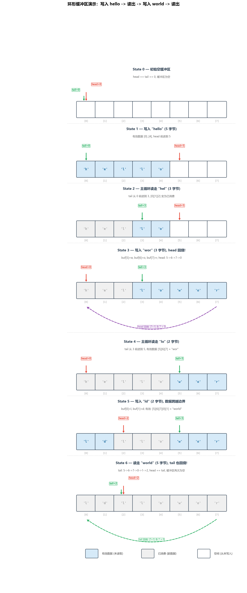

下面是一个常见的Ring Buffer的代码实现。

```c
#define RX_BUF_SIZE 256  /* 必须是 2 的幂，方便用位运算取模 */

typedef struct {
    uint8_t buf[RX_BUF_SIZE];
    volatile uint16_t head;  /* 中断写入位置（生产者）*/
    volatile uint16_t tail;  /* 主循环读取位置（消费者）*/
} RingBuffer;

RingBuffer rx_ring = {0};

/* ---- 中断中调用：写入一个字节 ---- */
static inline void RingBuf_Write(RingBuffer *rb, uint8_t data)
{
    uint16_t next = (rb->head + 1) & (RX_BUF_SIZE - 1);
    if (next != rb->tail) {          /* 没满才写 */
        rb->buf[rb->head] = data;
        rb->head = next;
    }
    /* 满了就丢弃——总比越界好 */
}

/* ---- 主循环中调用：读出一个字节 ---- */
static inline int RingBuf_Read(RingBuffer *rb, uint8_t *data)
{
    if (rb->head == rb->tail) return 0;  /* 空 */
    *data = rb->buf[rb->tail];
    rb->tail = (rb->tail + 1) & (RX_BUF_SIZE - 1);
    return 1;
}
```

几个关键设计点：

1. **大小为 2 的幂**：这样 `& (SIZE - 1)` 等价于 `% SIZE`，但在 Cortex-M 上只需 1 个时钟周期，而取模运算要 2~12 个周期。
2. **`volatile`**：head 在中断里改，tail 在主循环里改，两边必须看到对方的最新值。
3. **"满了就丢弃"**：这是最简单的策略。如果你的协议不能容忍丢字节，应该加大缓冲区或者在应用层做重传。
4. **单生产者单消费者——无需关中断**：因为 head 只有中断写、tail 只有主循环写——天然无竞争。只要读写指针的更新是原子的（Cortex-M 上 16 位对齐写入是原子的），就不需要锁。

用起来就是这样：

```c
/* 中断服务函数——只负责往环形缓冲区塞数据 */
void USART1_IRQHandler(void)
{
    if (USART_GetITStatus(USART1, USART_IT_RXNE) != RESET)
    {
        uint8_t ch = USART_ReceiveData(USART1);
        RingBuf_Write(&rx_ring, ch);
    }
}

/* 主循环——从环形缓冲区取数据处理 */
int main(void)
{
    /* ... 初始化省略 ... */
    uint8_t ch;
    while (1)
    {
        while (RingBuf_Read(&rx_ring, &ch))
        {
            /* 在这里安全地处理每个字节 */
            USART_SendData(USART1, ch);  /* 比如回显 */
            while (USART_GetFlagStatus(USART1, USART_FLAG_TXE) == RESET);
        }
        /* 没有数据时 CPU 可以干别的事 */
    }
}
```

下图展示了 ISR 与主循环之间通过环形缓冲区异步协作的完整时序：

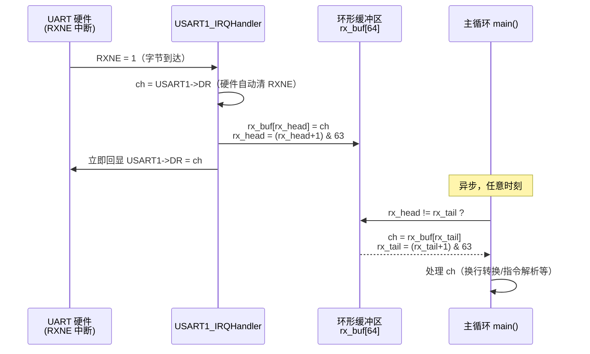

这是嵌入式领域最常接触到的数据结构，除了UART,CAN这种异步通信场景，所有的消费速率和生产速率不匹配的场景，你都可以用上这个数据结构。当然缓冲区不一定是数组，**如果堆内存方便管理**，你还可以试试**循环链表**之类的环形结构。

### 1.4 代码实战：配置 USART1 并重定向 printf

终于到写代码的环节了。我们的目标很简单：**配置 USART1 为 115200-8N1，实现 printf 输出到串口，并用中断方式回显收到的字符**。

#### 硬件连接

野火 STM32F407 开发板上，USART1 已通过板载 USB-转串口芯片（CH340 / CP2102）引出到 USB 接口，无需额外连线。

| 信号 | 引脚 | 复用功能 |
|:---:|:---:|:---:|
| TX | PA9 | GPIO_AF_USART1 (AF7) |
| RX | PA10 | GPIO_AF_USART1 (AF7) |

---

#### 工程文件组织

完整工程位于 [code/USART1_Printf_Echo/](code/USART1_Printf_Echo/)，CMake 构建，结构如下：

```
USART1_Printf_Echo/
├── CMakeLists.txt
├── cmake/
│   ├── gcc-arm-none-eabi.cmake
│   └── stm32cubemx/CMakeLists.txt   ← HAL 驱动列表（含 stm32f4xx_hal_uart.c）
├── startup_stm32f407xx.s
├── Drivers/
│   ├── CMSIS/                       ← ARM 内核头文件
│   └── STM32F4xx_HAL_Driver/        ← ST HAL 源码
├── Core/
│   ├── Inc/  main.h  stm32f4xx_hal_conf.h  stm32f4xx_it.h
│   └── Src/  main.c  stm32f4xx_it.c  stm32f4xx_hal_msp.c  syscalls.c  sysmem.c
└── Lib/
    ├── Inc/  bsp_debug_usart.h
    └── Src/  bsp_debug_usart.c
```

---

📄 [Lib/Inc/bsp_debug_usart.h](code/USART1_Printf_Echo/Lib/Inc/bsp_debug_usart.h) — USART1 HAL 接口：波特率宏、`UART_HandleTypeDef`、环形缓冲区大小

---

📄 [Lib/Src/bsp_debug_usart.c](code/USART1_Printf_Echo/Lib/Src/bsp_debug_usart.c) — `HAL_UART_Init()` 初始化、`HAL_UART_MspInit()` GPIO/NVIC 配置、`HAL_UART_RxCpltCallback()` 单字节中断接收回调、`__io_putchar()` 重定向 printf


> 💡 **为什么 ISR 里直接回显，而不等主循环来读？**
> 因为 RXNE 中断响应时间通常在几十 µs 内，而主循环每轮可能有几毫秒的处理延迟。直接在 ISR 里回显能保证你看到的字符几乎是零延迟原样反弹。环形缓冲区的存在是为了让主程序能**异步消费**接收到的数据，两者互不干扰。

---

📄 [Core/Src/main.c](code/USART1_Printf_Echo/Core/Src/main.c) — `HAL_Init()` + `SystemClock_Config()` + `USART1_Config()`，打印启动信息，主循环监听回车键

> 📝 本工程使用 CMake + arm-none-eabi-gcc + STM32 HAL 构建，printf 通过 `__io_putchar()` → `syscalls.c` 中的 `_write()` 重定向到 USART1。

打开串口终端（115200-8N1），你应该能看到启动信息，敲键盘字符会被原样回显。

> 🎓 **小结**：到这里，UART 部分就讲完了。你应该掌握了三个层次的知识：
> 1. **协议层**（§1.1）：SAF 特征、波特率/帧格式——这些和芯片无关，放到任何 MCU 都成立。
> 2. **外设层**（§1.3.1~1.3.4）：STM32 的 USART 框图、寄存器、波特率计算、收发流程——这些是读数据手册就能获得的"芯片知识"。
> 3. **代码层**（§1.4）：HAL API 调用、printf 重定向（`__io_putchar()` → `syscalls.c`）、中断回调接收——这些是"工程知识"，把前两层落地成可运行的代码。
>
> 后面讲 I2C 和 SPI 时，我们也会按这三个层次展开。


## 2 总线协议和SPI

之后我们介绍的SPI,IIC,CAN等。乃至于更复杂的以太网,DDR,PCIE等，他们的本质都是总线协议。我们之前也提到，比如DMA和FSMC，本质上也是依赖总线矩阵的Memory-Mapped IO设计。可以说理解总线是理解现代嵌入式系统的核心。也许你之前学过SPI/IIC之类，但是大多停留在协议的实现上。但站在更高的概念下，**这些协议不过是总线这个模型的具体实现罢了**。

接下来我们会用较长的篇幅介绍总线这个基础概念。

### 2.1 总线的基本概念

#### 2.1.1 何为总线

##### 总线的结构
简单来说，点对点协议的问题在于设备越多，需要的线就越多，通信链路的复杂度也会指数级升高。正如我们第一章讲到的，给门牌号统一编址才是更符合实际的做法。

如果我们**不考虑布线的成本**（想拉多少线就拉多少，这种情况常见于芯片内部），一个最简陋的总线应当由下面部分构成

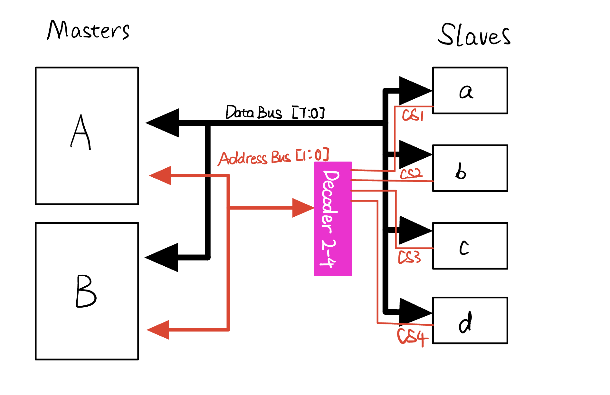

以两个主设备 Master A、Master B 和四个从设备 Slave a、b、c、d 为例：

- **数据总线 D[7:0]**：8 根共享信号线，所有节点并联其上，同一时刻只能有一个节点驱动。
- **地址总线 A[1:0]**：2 根信号线，可编码 $2^2 = 4$ 个地址（0～3 分别对应 a～d）。
- **地址译码器（Decoder）**：将 A[1:0] 的二进制值译码为 4 路独立的片选信号 CS_1、CS_2、CS_3、CS_4，低有效。
- **控制总线**（图中省略）：包括读写方向（R/W̄）和总线使能等控制信号。

现在，Master A 要向 Slave b 写入 0xAB，流程是这样的：

1. Master A 竞争并获得总线控制权（后述仲裁机制）。
2. Master A 把 Slave b 的编号（b → 1 → 二进制 `01`）放到地址总线 A[1:0]。
3. 译码器收到 `01`，将 CS_b 拉低，其余片选保持无效——只有 Slave b 被激活。
4. Master A 将 0xAB 放到数据总线 D[7:0]，控制总线置"写"。
5. Slave b 在 CS_b 有效期间锁存数据总线上的值。
6. 事务结束，Master A 释放总线，其他节点可以重新竞争。

这就是最基础的MMIO（Memory Mapped I/O）, 这也是最原汁原味的总线。我们STM32内部的总线矩阵就是这样的结构，如果把从设备abcd换成什么GPIO,RCC的寄存器，你就能理解那个4GB编址是怎么来的了。


##### 基本特点
有了总线的基本逻辑，我们来抽象一下总线具备哪些特点。

**序列化**（Serialization）：由于总线是共享链路，同一时刻只能进行一类数据传输，因此通信必须串行化。所以不要问总线的协议是串行协议还是并行协议，**总线一定是串行的**。

**广播特性**（Broadcast）：同一时间只有一个组件能发送消息，但总线上的所有其他组件都能同时接收该消息

**总线事务**（Bus Transaction）：一个事务通常由一系列消息组成，例如“内存读取事务”包括发送读取请求消息和接收返回的数据消息 。

##### 总线的Trade-off

总线这种设计显然有好处：

**极简线路设计**： 相比于每个设备都要十几根线，总线引入共享的数据线，这会大大降低线的数量和主从设备之间的耦合度。

**可扩展性**： 如果你想在现有的总线上多接一个从设备，通常不需要重新设计主板逻辑，只需要在总线上并联接入，并给新设备分配一个“身份 ID”即可。

但这不是免费的，结构的简单带来的是**复杂度**和**效率的部分牺牲**

**通信协议复杂度增加**：硬件越简单，软件就越复杂。点对点协议两端只需约定好各自的格式；而总线必须定义帧格式、地址分配规则、读写时序、仲裁握手、错误重试……每一项都是额外的工程量。这就是"总线协议"这个词的由来——协议本身就是为了驯服共享链路而生的规则集。

**帧效率随从设备数量增加而降低**：每次真正传数据之前，总线都要先完成"选中目标"的动作——无论是地址帧、片选时序还是仲裁过程，这些都是额外开销。从设备越多，总线竞争的概率越高，等待仲裁的时间越长，每个从设备能分到的有效带宽也随之摊薄。


##### 片内总线和片外总线

我们一开始举的“2主4从”的例子更贴近片内场景，但一旦把总线铺到芯片外面（PCB 板上甚至电缆里），工程上的阻力就完全不一样了：

**更大的布线成本**：在芯片内部拉多少根线都没人管你，但是在PCB板上，多一根线就是多一点麻烦，面积，布线，串扰以及后期的问题调试，这些看得见的看不见的都是布线的成本，所以我们希望线的数量尽可能的少。

**更恶劣的电磁环境**：芯片内部的环境堪称“温室”，线又短又小，还被外壳严密屏蔽；但片外的线路却是一根实打实的“天线”。打火花的继电器、大功率电机的启停、甚至旁边另一根高速走线（串扰），都会在总线上切切实实地感应出几十伏的噪声尖峰。甚至你就啥都不管，线路自己还有寄生电容和阻抗匹配的问题。这也是为什么高速信号布线要考虑阻抗匹配，要做差分线，要双绞线屏蔽等。

**更宽容的速度要求与功耗权衡**：片外挂载的一般都是相对慢速的外设实体，如温湿度传感器、EEPROM 存储器等。它们本身处理事情就需要时间，并不像 CPU 取指令那样要榨干最后一点带宽。这给了协议设计者一个好处——我们可以用牺牲速度来换取稳定性或成本的降低。比如只用引出两根线的 I²C 虽然速度慢，且需要依赖开漏带来的上拉电阻缓慢充电，但在低速传感器场景下却是极其好用且廉价的妥协方案。

我们要学到的所有如 SPI、I²C、CAN 等协议，其种种看似“奇怪”的设计，都是在应对这三个片外环境带来的麻烦。因为我们这不是IC设计课，所以后面若无特殊说明，我们说的都是片外总线。

#### 2.1.2 时序机制：同步总线和异步总线

按时序机制分，总线有两种模式：

**同步总线（Synchronous Bus）**：同步总线依赖一根专用的时钟线（CLK）来统一步调，所有设备都在时钟波形的上升沿或下降沿采发数据。这种方式逻辑非常直接，也没有额外的握手开销（比如 SPI 协议），通信速率通常能够拉得很高。但在物理面上，时钟信号和数据信号走过的路径如果有微小的长度差异，或者受到同等噪声的影响，就会在远端造成“时钟偏移（Clock Skew）”。一旦错位，本来该在这个时钟周期抓取的数据可能就采错了。

**异步总线（Asynchronous Bus）**：异步总线没有时钟线做指挥，既然没有统一步调，就必须有额外的沟通机制。一种做法是引入额外的握手信号（比如 REQ 请求和 ACK 应答信号，速度慢但非常可靠）；另外一种典型思路，就是像 UART 那样提前“对表”——大家都约定好一个固定的速率（波特率），通过数据的起始位来作为同步锚点。异步机制规避了时钟偏移的问题，更适合长距离或设备速度不一致的通信场景。和UART类似，异步总线需要大量的采样来降低错误率。

#### 2.1.3 电平：推挽，开漏和差分

在片外，对于一条线的数据线，无非有推挽输出和开漏输出两个模式，如果你对这两个名词比较陌生，在Chapter 1 的 GPIO 章节已经介绍了推挽和开漏的工作原理，我们想一个问题，总线是用开漏好还是推挽好？各自会带来什么问题？

**推挽输出（Push-Pull）**：两个方向都由内部主动驱动，边沿陡峭、驱动能力强，不需要外部上拉电阻。但对总线来说有一个致命缺陷——多个推挽输出**严禁直接并联**：若 A 输出高而 B 同时输出低，就形成 VDD→线路→GND 的低阻通路，瞬间过流可能损坏器件。这意味着推挽总线必须在仲裁机制上保证**同一时刻只有一个节点在驱动**。

**开漏输出（Open-Drain）**：输出高时引脚呈高阻悬空，需依赖**外部上拉电阻**（通常 4.7 kΩ 接至 VDD）才能建立高电平。多个开漏引脚可以安全并联：任何一个节点拉低，总线就为低；所有节点都释放，总线才通过上拉电阻缓慢升高。这就是**"线与（Wired-AND）"**——总线电平等于所有节点输出的逻辑与，这正是 I2C 仲裁机制的物理基础。代价是**高电平的建立速度由 RC 常数决定**，**上升沿出现圆角**——这也正是 I2C 波形左边那个小圆角的来由。

简单说：推挽信号边缘陡峭，信号完整性好，速度快，驱动能力强，但多个节点不能直接共享同一根线；开漏天然可以共享，线与特性还能被仲裁机制利用，但上升沿受 RC 限制，会出现圆角。因此没有统一的答案：SPI 选推挽，追求速度和驱动能力；I2C 和 SMBus 选开漏，利用线与特性实现多主共享与仲裁。

当然，如果只用一根线，速度怎么都是上不去的。我们知道高速通信，差分是基础。

**差分信号（Differential）**：不用单根信号线+参考地，而是用**一对线**（记为 D+ 和 D−）同时传输同一个信号的正相和反相。接收端只看两根线的**电压差**（$V_{D+} - V_{D-}$），而不是绝对电压。这带来两个关键好处：

- **共模噪声抑制**：外界干扰（EMI、地弹、串扰）几乎同等程度地叠加在 D+ 和 D− 上，因此在做差之后相互抵消。单端信号的噪声直接叠加到信号上，差分信号的噪声则"消失"了。
- **可以用更小的摆幅**：因为看的是差值，有效摆幅是单端的两倍（D+ 从 0 升到 0.4V 的同时 D− 从 0.4V 降到 0，接收端看到的差值变化是 0.8V），所以可以在更低的电压摆幅下保证可靠通信——这直接减少了线路充放电的时间，速度因此上去了。

嵌入式领域常见的差分总线：**RS-485**（半双工、总线型，工业现场首选）、**CAN**（片外总线标配差分，就是你们熟悉的 CANH/CANL）、**USB**（D+/D−）、**以太网**（100BASE-TX 用 MLT-3 编码的差分对）。差分是高速片外总线的标配，不是可选项。


#### 2.1.4 寻址：如何指定通信对象

主设备如何找到从设备，这个就需要一个十分擅长根据地址带路的导游，这就是寻址器。回顾我们讲片上总线的例子，主设备通过地址线，解码为片选线去指定通信对象。这个解码器就是这个总线设计的寻址器。但寻址器不一定是硬件的实现，根据实际的需求落地，我们可以选择是硬件还是软件。

**策略一：硬件片选**

最直接的方案：把寻址逻辑彻底做成硬件电平。主设备为每个从设备单独引出一根片选信号（CS，Chip Select），想和谁通信就把谁的 CS 拉低，其余从设备的 CS 保持无效，它们在电气上直接被"屏蔽"，完全不感知总线上的数据。整个选通过程不占用数据帧的任何一个 bit，协议极简，速度快。代价是：从设备越多，主设备需要的引脚越多，一对一线性增长。**SPI** 就采用这种方式。

**策略二：帧内地址**

将寻址逻辑从硬件引脚移到协议帧里：取消独立的 CS 线，在每帧数据开头附上目标从设备的地址字段。总线上所有从设备都会收到这帧数据，但只有地址匹配的设备才响应，其余设备在收到地址后自动忽略后续数据。这样无论总线上挂多少从设备，主设备只需要固定的几根线（数据 + 时钟），引脚开销与从设备数量完全解耦。代价是帧结构变复杂，且必须管理地址空间——两个地址相同的设备同时挂在总线上会产生冲突。为此，很多协议会预留若干可配置地址位，允许同型号设备通过硬件引脚电平设定不同地址加以区分。**I²C** 采用这种方式，7 位地址空间支持最多 128 个节点地址。

**策略三：内容寻址**

前两种策略都假设每条消息有明确的目标接收方。但在多播场景下，同一条消息可能被总线上多个不同节点同时需要，强行写入目标地址反而是一种负担，而且随着接收方增多，逻辑会变得愈发繁琐。

内容寻址的思路是：帧里不携带"发给谁"，而是携带消息本身的**语义标识**。接收方只关心自己感兴趣的标识，匹配则处理，不匹配则忽略；发送方也完全不需要知道谁在接收、有几个接收方。系统节点的增删对现有所有节点都透明，耦合度极低，也称**发布-订阅（Publish-Subscribe）**模型。代价是所有节点都需要持续监听总线并自行过滤，对接收端的处理能力有一定要求。**CAN** 采用这种方式。

#### 2.1.5 读写控制：控制数据的流向

寻址器解决了"和谁通信"的问题，但通信建立后，还要面临核心任务——规范"读"与"写"（数据流向）。在最原始的 CPU 片内总线中，主设备通常通过一根专门的 R/W̄ 控制线来告诉从设备当前的传输方向。而在片外总线的演进中，为了平衡引脚数量、带宽与通信模式，读写控制演化出了以下几种策略。

**策略一：双向分离（物理全双工）**

最简单粗暴的方案：既然读和写在同一根线上会抢占资源，那就给发送和接收各自配备一根独立的数据线。主设备往外写数据走一条线，读数据走另一条线。有了物理层面的隔离，不仅彻底消灭了方向切换的控制逻辑，而且读写可以同时进行。代价自然是多占用了一根宝贵的引脚。**SPI** 的 MOSI 和 MISO 线就是这种设计的典型。

**策略二：帧内声明（半双工分时复用）**

出于资源限制考虑，如果你只舍得给数据留一根总线，系统中就只能依靠时间复用来实现半双工。这就要求通信发起方必须在协议帧里显式声明接下来的数据到底是读还是写。通常的做法是：主设备先发一个命令帧（经常和地址帧合二为一），拿出一到两个 Bit 来作为读/写标志位（R/W Bit）。如果是写动作，主设备继续占据总线把数据推过去；如果是读动作，主设备发完命令后立刻"闭嘴"（释放数据线并转为输入引脚），由从设备无缝接管总线并开始往外吐数据。这种设计极其节约线束，代价是协议层必须精确把控总线所有权的“交接棒”。单数据线的 **I²C**（地址后紧跟一位 R/W 标志）就是以此为生。

**策略三：无需方向控制（多主广播交互）**

在某些典型的对等通信网络场景中，压根没有"我是主设备，我现在要读/写你"这种主从控制逻辑。所有节点都在总线上做着同样的事：广播消息和收听消息。节点状态发生变化了，就把数据打包好扔到共享总线上（自带内容标识），所有接收到帧的节点自行判断这个帧的内容是否对自身有用。这种“发布-订阅（Publish-Subscribe）”模型从根本上解构了传统的主从读写二元论，剥离了方向控制。因此总线上流转的只有单纯的数据广播。工业和汽车上无可替代的 **CAN** 总线就是这种思路的极致体现——没有谁去读谁，大家都在广播自身状态与监听所需事件。


#### 2.1.6 仲裁：多个发送方如何协调

总线的共享带来的最大的问题就是总线竞争，即多个设备抢占总线。那如何分配总线资源就涉及到一个仲裁的问题。和寻址器一样，仲裁器也不一定是硬件的实现。

如果说寻址器最重要的权衡是复杂度和通信速度，仲裁器的权衡就是**优先级和公平性**。从最简单的"根本不需要仲裁"到完全分布式的实时仲裁，按复杂度递增列出以下几种策略：

**策略一：单主机独占**

根本不需要仲裁：系统中只允许一个主设备，从设备永远不主动发起传输，竞争根本不会发生。这是零仲裁开销的设计，绝大多数嵌入式外设场景够用。**SPI** 就是这个模型。

**策略二：集中轮询**

由主控制器（或专用仲裁逻辑）周期性问询所有节点是否有发送需求，按一定顺序逐一授权。逻辑清晰，公平性好，行为完全可预测。代价是轮询动作本身占用总线时间，且仲裁逻辑是潜在单点故障。**USB** 的主机控制器对设备的轮询调度就属于这一思路。

**策略三：令牌传递**

总线上持续流转一个"令牌"，只有持有令牌的节点才被授权发送，发完后将令牌交给下一个节点。访问顺序固定，最大延迟可静态计算，适合有确定性实时要求的场景。代价是任何节点掉线都可能导致令牌丢失，需要额外的恢复机制。工业总线 **PROFIBUS-DP** 在多主站模式下就采用令牌传递机制。

**策略四：竞争检测（CSMA/CD）**

允许所有节点在监听到总线空闲后自由发送，一旦检测到冲突，各自随机退避后重试。无需任何集中式仲裁，实现简单。代价是延迟不确定——高负载时冲突频繁，吞吐反而下降，不适合硬实时场景。经典以太网（**Ethernet 802.3**，半双工模式）采用这一机制。

**策略五：逐位仲裁**

允许多个节点同时开始发送，但利用总线电平的"线与"特性（见 §2.1.2），每发出一位就立刻回读总线的实际电平。若自己发出的是高电平（释放总线），却读到总线为低电平，说明有另一个节点正在发低——对方的优先级更高，自己立即停止发送并转为接收模式，不打断胜出者，不产生任何重传。优先级完全由帧的标识字段数值决定，整个过程去中心化，无需专用仲裁器，最坏延迟可静态分析。**I²C** 多主模式和 **CAN** 都采用这一机制。

### 2.2 SPI--我的第一个总线协议

#### 2.2.1 SPI的属性

请原谅我花了大篇幅去介绍一个可能有点枯燥的概念，但是这个概念确实是嵌入式的底层知识。下面你就会看到，各种花里胡哨的通信协议，本质也不过是这个理论模型的落地罢了。接下来我们就降维打击地看一看SPI这个协议。 

下面是SPI的拓扑图
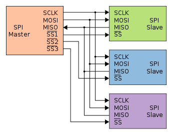

首先我们看到，SPI是有时钟线（SCLK)的，说明他是**同步**的总线. 然后他依靠主机的片选信号（SS)来找从机，所以寻址方式是**硬件片选**。然后SPI不允许多主机，所以是**单主机独占**。由于读写是两条单独的线（MOSI,MISO)，属于**物理全双工**，而且不会存在主机和从机抢线用的问题，我们可以**推挽**输出。

基于刚才我们对总线理论的介绍，我们只需要往下面的表格中填写内容即可。

|属性|SPI|
|----|----|
|时序机制|**同步**|
|电平|**推挽**|
|寻址方式|**硬件片选**|
|读写控制|**物理全双工**|
|仲裁方式|**单主机独占**|

#### 2.2.2 SPI的通信速率

在底层协议三巨头（UART、I²C、SPI）中，SPI 是毫无悬念的速度冠军，他没啥特点，就一个字——“**快**”。普通 MCU 上 SPI 的时钟频率（SCLK）轻松跑到 **10 ~ 50 MHz**，由于每个时钟周期传输一个 bit，这直接对应 **10 ~ 50 Mbps**（约 1.25 ~ 6.25 MB/s）的数据速率；而 I²C 标准模式只有 100 kHz（即 100 kbps），快速模式也不过 400 kbps，我们之前分析的UART哪怕115200的波特率也就115.2kbps。SPI 把它们甩开了**两到三个数量级**。

如果你把 §2.1 认认真真读完了，这个结论其实是水到渠成的——SPI 几乎在每一个影响速度的 Trade-off 上，都毫不犹豫地选了"快"那边：

**推挽电平：边沿陡峭，驱动能力强**

§2.1.2 讲过，推挽输出两个方向都由晶体管主动拉高/拉低，开关速度极快，波形方方正正。I²C 为了实现"线与"多主仲裁，被迫选择开漏，高电平靠外部上拉电阻充电，上升沿拖出一个圆角——这个 RC 充电时间从根本上限制了 I²C 的频率上限。SPI 没有这个包袱。

**专用时钟线：零容错开销**

SPI 是同步总线，主机把 SCLK 直接送到从机脸上，从机到点采样即可，不需要任何"自己猜速率"的容错余量。UART 是异步协议，之所以要在每个 bit 中间时刻多次过采样（通常 16 倍），就是为了抵抗本地时钟和对方时钟的微小偏差。这个过采样机制本质上就是在给不精确付出的代价，而 SPI 根本不需要。

**零帧开销：数据线上全是 Payload**

SPI 的寻址交给了片选线（CS/SS），读写方向交给了 MOSI/MISO 的物理隔离，数据线上不需要携带任何地址字段或读写方向标志位——每一个时钟周期，线上传输的都是实打实的有效数据位。而 I²C 每次通信开头要花 9 个时钟周期发一个 7bit 地址 + 1bit 读写方向 + 等待 ACK，这还没算 Start/Stop 条件。在短报文频繁通信的场景下，这些帧开销占比非常可观。


 **那 SPI 的速度上限在哪里？** 三个瓶颈：一是**外设自身的设计极限**——连接的 Flash、ADC 等器件数据手册里都写明了最大 SCLK 频率，主机再快也没用；二是**信号的电气物理极限**，SPI 作为同步总线存在时钟偏移问题，走线过长信号完整性会变差，因此 SPI 只适合板级短距离通信；三是**主设备自己的时钟极限**，以 STM32F4 为例，SPI1/SPI4 挂在 APB2（84 MHz），分频系数最小为 2，因此 SPI1 的 SCLK 最快约 **42 MHz**，对应吞吐约 **42 Mbps ≈ 5.25 MB/s**；SPI2/SPI3 挂在 APB1（42 MHz），最快约 **21 MHz / 21 Mbps ≈ 2.6 MB/s**。但是他理论是完全不受限的，**时钟有多快，信号多块不会崩，SPI就能跑多块**。


#### 2.2.3 SPI的帧格式与时序

SPI 没有像 UART 那样标准化的"帧格式"规范——它更像是一个"协议骨架"，具体怎么用取决于主从双方的约定。但所有 SPI 通信都共享同一个基本时序模型：

##### **一次 SPI 传输的基本流程：**

1. 主机拉低目标从机的 **CS/SS**（片选），告知从机"通信开始了，注意听"
2. 主机产生 **SCLK** 时钟，同时在 **MOSI** 上逐位发出数据（MSB first，通常）
3. 从机在 SCLK 的采样沿锁存 MOSI 的数据，同时在 **MISO** 上同步回传自己的数据
4. 传输完毕，主机拉高 **CS**，从机释放 MISO，本次传输结束

注意步骤 2 和 3 是**同时发生**的——SPI 的全双工不是"发完再收"，而是每一个时钟周期都在同时移入移出一个 bit。

如图，你可以把主机和从机各自想象成一个 **8-bit 移位寄存器**，SCLK 每跳一下，两个寄存器就**各自移出一位、各自移入对方的那一位**，传完 8 个时钟后，两个寄存器完成了"交换"——这就是为什么 SPI 发送和接收的字节数永远是相等的：你发出 N 个字节，就必然收到从机同时回传的 N 个字节，哪怕对方没有实际数据，也会回传 0xFF 或 0x00 之类的哑字节，这也叫做虚拟数据。

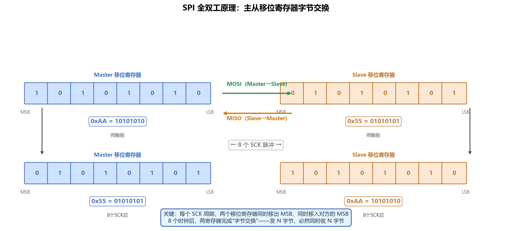

下面是两次完整事务的 Mode 0 时序图。第一次主机发 0xAA、从机回 0xFF；第二次主机只想"读"，于是发哑字节 0xFF，从机回 0x55。图中每个方格对应一个 bit，方格内的数字是该位的值；蓝色向下箭头标出每个上升沿（采样点），NSS 低电平覆盖整次事务。

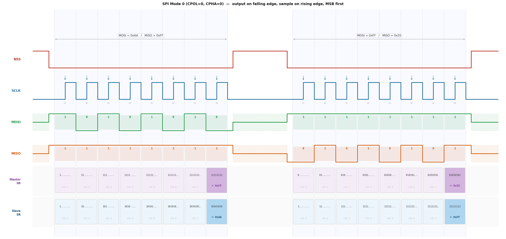


##### **CPOL 和 CPHA：四种工作模式**

SPI 有两个影响时序的参数：

- **CPOL（Clock Polarity，时钟极性，有时也叫CKP）**：定义总线空闲时（CS 无效时）SCLK 的电平。`CPOL=0` 表示空闲低，`CPOL=1` 表示空闲高。
- **CPHA（Clock Phase，时钟相位，有时也叫CKE）**：定义数据在 SCLK 的哪个边沿被**采样**。`CPHA=0` 表示在第一个边沿采样（第二个边沿驱动），`CPHA=1` 表示在第二个边沿采样（第一个边沿驱动）。

两两组合，就得到了 SPI 的四种模式：

| 模式 | CPOL | CPHA | 空闲电平 | 采样边沿 | 常见使用场景 |
|:---:|:---:|:---:|:---:|:---:|---|
| Mode 0 | 0 | 0 | 低 | 上升沿 | **最常用**，W25Q128 Flash、大多数 ADC |
| Mode 1 | 0 | 1 | 低 | 下降沿 | 部分 ADC、SD 卡的 SPI 模式 |
| Mode 2 | 1 | 0 | 高 | 下降沿 | 较少见 |
| Mode 3 | 1 | 1 | 高 | 上升沿 | 部分传感器（如 MPU-6050 的 SPI 接口）|

> ⚠️ **主从双方的模式必须一致。** 如果主机配了 Mode 0，从机却期待 Mode 3，采样点就会对不上，读出来的全是乱数据。你连一个新的 SPI 器件时，第一件事就是去它的数据手册里找"SPI Mode"或"CPOL/CPHA"这两个字，照着配就行了。

换一个角度理解 CPHA：**CPHA 决定的核心问题是"数据和时钟的相位关系"**——或者说，在第几个时钟沿采样数据。一个更直观的记法：

- **CPHA = 0**（"先备好数据，时钟来取"）：CS 拉低后，主机**立即**在 MOSI 上放好第一位数据，不等任何时钟沿；第一个时钟沿到来时，从机直接采样这已就绪的数据，同时主机切换下一位。
- **CPHA = 1**（"时钟发令，数据才上"）：CS 拉低后，第一个时钟沿的作用是**切换驱动**（主机在这个沿之后才把第一位放上 MOSI）；数据稳定后，**第二个时钟沿**才采样。

结合 CPOL（决定空闲电平，从而决定"第一个沿"是上升沿还是下降沿），四种模式可以一张表讲清楚：

| 模式 | CPOL | CPHA | 空闲 SCLK | 采样沿 | 驱动沿（切换数据）|
|:---:|:---:|:---:|:---:|:---:|:---:|
| Mode 0 | 0 | 0 | 低 | 第 1 沿（**上升**）| 第 2 沿（下降）|
| Mode 1 | 0 | 1 | 低 | 第 2 沿（**下降**）| 第 1 沿（上升）|
| Mode 2 | 1 | 0 | 高 | 第 1 沿（**下降**）| 第 2 沿（上升）|
| Mode 3 | 1 | 1 | 高 | 第 2 沿（**上升**）| 第 1 沿（下降）|

遇到新器件，对着数据手册的时序图数沿就能确认模式——不需要死记，看图找到"数据在哪个沿被锁存"，再对照上表即可。

##### **数据位宽与字节序**

标准 SPI 每帧传输 8 bit，**MSB（最高位）先发**是最主流的约定，但也有极少数器件要求 LSB first（STM32 的 SPI 控制器也支持通过 CR1 的 LSBFRIST 位切换）。多字节传输时，字节之间 CS 无需脉动，连续保持低电平即可；传输完毕后 CS 拉高，本次事务结束。

### 2.3 STM32的SPI

前面两节是"通用知识"——总线原理和 SPI 协议骨架。从这一节开始，我们把视角锁定到 **STM32F4 的 SPI 外设**，看芯片设计者怎么把协议规范落地成具体的寄存器和数据通路。结构和 §1.3 一样：框图 → 寄存器 → 收发流程。

#### 2.3.1 功能框图

打开参考手册的 SPI 章节，官方给出的功能框图高度浓缩。我们把它拆成四条通路来理解：


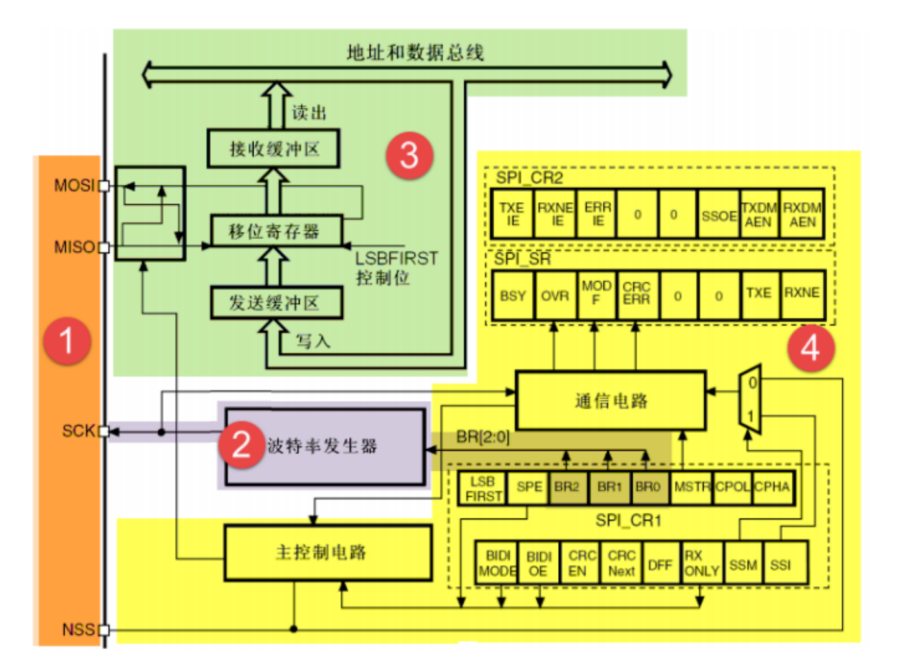

**发送通路**：CPU 往 **DR（数据寄存器）** 写一个字节 → 硬件把它装入 **TX 缓冲区（TXB）** → 一旦移位寄存器空闲，TXB 的内容被并行装载进**移位寄存器** → 在 SCLK 的每一个驱动沿，移位寄存器逐位把当前最高位（MSB first 模式下）推到 **MOSI** 引脚。TXB 被搬走时 **TXE 标志置 1**，可以写入下一个字节。

**接收通路**：SCLK 的采样沿触发硬件把 **MISO** 上的电平移入移位寄存器的最低位 → 移位寄存器移满 8/16 bit 后，并行装载进 **RX 缓冲区（RXB）** → **RXNE 标志置 1**，CPU 读 DR 取走数据。

> 🔑 **SPI 和 UART 的关键差异**：UART 的 TX 移位寄存器和 RX 移位寄存器完全独立（§1.3.4 详述）。SPI 的核心是**一个共用的移位寄存器**，它同时承担发送（出 MOSI）和接收（进 MISO）的工作——每一个 SCLK 周期，都在把一位移出去、同时把一位移进来。这就是 §2.2.3 里"两个移位寄存器交换数据"那张图的硬件基础。TXB 和 RXB 是这个共用移位寄存器两侧的"接待室"，不是独立的数据通路。

**波特率发生器**：由 CR1 的 **BR[2:0]** 三位决定对 APB 总线时钟的分频比（$f_{\text{SCLK}} = f_{\text{PCLK}} / 2^{\text{BR}+1}$），分频比可选 2、4、8、……、256。这与 UART 的 BRR 小数分频大相径庭——SPI 只支持 8 档 2 的幂次分频，没有小数调节，因此无需像 UART 那样手算小数位，代价是无法逼近任意目标频率，只能就近选档。

**NSS 与控制状态通路**：CPU 通过 APB 总线读写 CR1 / CR2 控制外设行为，通过读 SR 拿到当前状态标志（TXE、RXNE、BSY……）。片选信号 NSS 有两种模式，§2.3.3 收发流程里展开讲。

#### 2.3.2 关键寄存器速查

##### 数据寄存器：DR

**地址偏移：0x0C**，低 8 / 16 bit 有效（取决于 DFF 位配置）。

与 UART 的 DR 一模一样：**写 DR = 数据进入 TXB；读 DR = 从 RXB 取出数据**。背后的 TXB / RXB 硬件和总线地址无关，读写各走自己的通路。

##### 状态寄存器：SR

**地址偏移：0x08**

| 位 | 名称 | 含义 |
|:---:|:---:|---|
| 7 | **BSY** | SPI 忙标志。= 1 时移位寄存器或 TX 缓冲区非空，**禁止此时拉高 NSS** |
| 6 | **OVR** | 溢出错误。RXB 里的旧数据还没读走，移位寄存器又装了新数据进来，旧数据丢失 |
| 5 | **MODF** | 模式错误。软件 NSS 管理下，NSS 引脚被意外拉低（多主冲突） |
| 1 | **TXE** | TX 缓冲区空。= 1 时可以写下一个字节 |
| 0 | **RXNE** | RX 缓冲区非空。= 1 时收到了一个字节，赶紧读 |

TXE 和 RXNE 是日常收发必查的标志；**BSY** 是最容易忽视却最常引发 Bug 的标志——见 §2.3.3。

##### 控制寄存器一：CR1

**地址偏移：0x00**，这是 SPI 配置的核心寄存器。

| 位 | 名称 | 说明 |
|:---:|:---:|---|
| 15 | **BIDIMODE** | 双向数据模式使能。0 = 标准双线全双工（MOSI + MISO），1 = 单线双向模式（MOSI 兼作 MISO）|
| 11 | **DFF** | 数据帧格式。0 = 8 bit，1 = 16 bit |
| 10 | **RXONLY** | 仅接收模式（BIDIMODE = 0 时有效）。1 = 主机只产生 SCLK，不发 MOSI，只收 MISO |
| 9 | **SSM** | 软件从机管理。1 = NSS 信号由软件（SSI 位）控制，而非 NSS 引脚 |
| 8 | **SSI** | 内部从机选择。SSM=1 时有效，等效于内部 NSS 的逻辑电平。主机模式下必须置 1，否则触发 MODF |
| 7 | **LSBFRIST** | 帧格式。0 = MSB 先发（默认），1 = LSB 先发 |
| 6 | **SPE** | SPI 使能。总开关，置 1 后外设开始工作 |
| 5:3 | **BR[2:0]** | 波特率分频。`000`=÷2，`001`=÷4，……，`111`=÷256 |
| 2 | **MSTR** | 主从选择。1 = 主机模式，0 = 从机模式 |
| 1 | **CPOL** | 时钟极性。0 = 空闲低，1 = 空闲高 |
| 0 | **CPHA** | 时钟相位。0 = 第一沿采样，1 = 第二沿采样 |

配置主机模式 Mode 0（CPOL=0, CPHA=0）最常见的最小 CR1 设置：

```
MSTR=1, SPE=1, SSM=1, SSI=1, CPOL=0, CPHA=0, BR=你选的分频档
```

##### 控制寄存器二：CR2

**地址偏移：0x04**，主要管 DMA 和中断开关。

| 位 | 名称 | 说明 |
|:---:|:---:|---|
| 7 | **TXEIE** | TXE 中断使能 |
| 6 | **RXNEIE** | RXNE 中断使能 |
| 5 | **ERRIE** | 错误中断使能（OVR / MODF / CRCERR）|
| 2 | **SSOE** | NSS 输出使能（硬件 NSS 模式下，主机在事务期间自动拉低 NSS 引脚）|
| 1 | **TXDMAEN** | TX DMA 使能，TXDMAEN = 1 时 TXE 事件触发 DMA 请求 |
| 0 | **RXDMAEN** | RX DMA 使能，RXNE 事件触发 DMA 请求 |

日常轮询模式下 CR2 保持默认值（全 0）即可；用 DMA 批量传输时再打开 TXDMAEN / RXDMAEN。

#### 2.3.3 收发流程

##### NSS 的两种管理方式

在进入收发流程前，必须先搞清楚片选信号（NSS）的管理方式——这是初学者最频繁踩坑的地方。

**硬件 NSS 模式（SSM=0, SSOE=1）**：由 SPI 外设自动拉低/拉高 NSS 引脚。主机在 SPE=1 且有数据写入时自动拉低，事务完成后自动拉高。好处是不需要一行 CS 控制代码。但硬件 NSS 每次事务后会自动拉高，导致每写一个字节都会获得一次完整的 Start/Stop 周期——这对需要连续传输多字节的器件（如 Flash、ADC）几乎不可用，因为这些器件的协议通常要求整个命令序列期间 CS 保持低电平。

**软件 NSS 模式（SSM=1, SSI=1）**：NSS 引脚在硬件层面被忽略，CS 信号完全由你手动操控一个普通 GPIO。这是实际工程中的绝对主力方案，因为你可以精确控制 CS 的拉低/拉高时机，适配任意器件时序。

```c
/* 软件 NSS + GPIO 控制片选 */
#define CS_LOW()   GPIO_ResetBits(GPIOA, GPIO_Pin_4)
#define CS_HIGH()  GPIO_SetBits(GPIOA, GPIO_Pin_4)
```

##### 硬件时序：一次字节交换

SPI 全双工传输的最小单元是**一次字节交换**（Exchange）：主机输出一个字节到 MOSI，同时从 MISO 收入一个字节。哪怕你只想"写"数据给从机，底层也会收到对方同时回传的哑字节（dummy byte）。因此封装的基础函数应当是 `ExchangeByte`，而不是分开的 `WriteByte` / `ReadByte`：

```c
/**
 * @brief  向 SPI 总线交换一个字节（全双工：发 txData，收返回值）
 * @param  SPIx   目标 SPI 外设（SPI1 / SPI2 / SPI3 ...）
 * @param  txData 要发出的字节（只读时传 0xFF 作为哑字节）
 * @retval 从 MISO 收到的字节
 */
uint8_t SPI_ExchangeByte(SPI_TypeDef *SPIx, uint8_t txData)
{
    /* 等待 TX 缓冲区空，再写入 */
    while (SPI_I2S_GetFlagStatus(SPIx, SPI_I2S_FLAG_TXE) == RESET);
    SPI_I2S_SendData(SPIx, txData);

    /* 等待 RX 缓冲区非空（移位寄存器移满一帧） */
    while (SPI_I2S_GetFlagStatus(SPIx, SPI_I2S_FLAG_RXNE) == RESET);
    return (uint8_t)SPI_I2S_ReceiveData(SPIx);
}
```

> ⚠️ **TXE 和 RXNE 必须都等**。不少新手只等 RXNE 而不等 TXE，第一次调用时没问题（缓冲区初始就是空的），但连续调用时上一帧发出去之前就写入了新数据，会导致数据覆盖。也有人只等 TXE 不等 RXNE，那就根本没有读空 RX 缓冲区，下一次读到的是上一帧的残留值——这是连续读传感器时数据"滞后一帧"的经典 Bug。

##### BSY 标志的作用

用 `ExchangeByte` 显然已经能保证数据收发正确，那 BSY 标志有什么用？回顾 §2.3.2 中 BSY 的含义：**移位寄存器或 TX 缓冲区非空时为 1**。在以下场景里你必须等 BSY = 0：

1. **拉高 NSS（CS）之前**：拉高 CS 代表"事务结束"，如果此时移位寄存器还在发最后几个 bit，从机就会在数据传完之前看到 CS 拉高，导致通信出错。

2. **进入低功耗模式之前**：确保外设已经完全空闲。

正确的事务结束时序：

```c
/* 等最后一帧彻底发完再释放片选 */
while (SPI_I2S_GetFlagStatus(SPIx, SPI_I2S_FLAG_BSY) != RESET);
CS_HIGH();
```

> 💡 **为什么"等 RXNE"不够？** RXNE = 1 说明移位寄存器已经把数据装入了 RX 缓冲区，但移位寄存器发送最后几个 bit 的物理动作可能还没结束——BSY 仍是 1。因此等 RXNE 只保证"数据收到了"，BSY = 0 才是"线路真正安静了"。

##### 完整事务示例：读写一段 W25Q128 Flash

以读取 W25Q128 的 JEDEC ID 为例（SPI Mode 0，3 字节响应），把 NSS 控制 + ExchangeByte + BSY 等待串在一起：

```c
/* 命令定义 */
#define W25Q_CMD_JEDEC_ID   0x9F
#define W25Q_DUMMY          0xFF

typedef struct {
    uint8_t manufacturer;    /* e.g. 0xEF for Winbond */
    uint8_t memType;         /* e.g. 0x40 */
    uint8_t capacity;        /* e.g. 0x18 = 128Mbit */
} W25Q_JedecID_t;

W25Q_JedecID_t W25Q_ReadJedecID(void)
{
    W25Q_JedecID_t id;

    CS_LOW();                                     /* 片选拉低，事务开始 */

    SPI_ExchangeByte(SPI1, W25Q_CMD_JEDEC_ID);    /* 发命令，哑字节回传被丢弃 */
    id.manufacturer = SPI_ExchangeByte(SPI1, W25Q_DUMMY); /* 发哑字节，收 Manufacturer ID */
    id.memType      = SPI_ExchangeByte(SPI1, W25Q_DUMMY); /* 收 Memory Type */
    id.capacity     = SPI_ExchangeByte(SPI1, W25Q_DUMMY); /* 收 Capacity */

    /* 等 BSY=0（最后一帧真正发完），再拉高片选 */
    while (SPI_I2S_GetFlagStatus(SPI1, SPI_I2S_FLAG_BSY) != RESET);
    CS_HIGH();                                    /* 片选拉高，事务结束 */

    return id;
}
```

对比 UART 的中断 + 环形缓冲区接收，SPI 的轮询模式在实践中更常见——原因是 SPI 通常是**主机主动发起每一字节**，每次读写都是明确长度的命令帧，不存在"不知道什么时候来多少数据"的异步问题。只有在需要高吞吐的场景（比如从 Flash 连续读取几 KB）才需要引入 DMA，§4 章 DMA 部分会展开介绍 SPI-DMA 的配合方式。

| 方式 | CPU 占用 | 适用场景 |
|:---:|:---:|---|
| 轮询（ExchangeByte）| 死等 TXE/RXNE，但延迟可控 | **最常用**，单次命令/短帧读写 |
| 中断 | 每字节进一次 ISR | 较少用于 SPI，帧边界管理复杂 |
| DMA | 几乎为零 | 大块数据（Flash 读写、屏幕刷新）|

> 🎓 **小结**：到这里，SPI 部分就讲完了。三个层次和 UART 完全对称：
> 1. **协议层**（§2.2）：SPI 的五个属性——同步、推挽、硬件片选、物理全双工、单主独占；CPOL/CPHA 四种模式；"字节交换"本质。
> 2. **外设层**（§2.3.1~2.3.2）：STM32 SPI 框图、移位寄存器 + TXB/RXB 的双缓冲结构、CR1/CR2/SR 寄存器核心位。
> 3. **代码层**（§2.3.4）：`ExchangeByte` 原语、NSS 软件管理、BSY 等待时机、W25Q128 读 JEDEC ID 完整示例。

---

#### 2.3.4 代码实战：W25Q128 初始化与读写测试

**目标**：配置 SPI1，读出 W25Q128 的 JEDEC ID 验证通信正常，然后执行一次 **擦除 → 写入 → 回读** 完整流程，通过串口打印验证结果。

##### 硬件连接

| 信号 | STM32 引脚 | 说明 |
|:---:|:---:|---|
| SCK  | PB3 | SPI1_SCK，AF5 |
| MISO | PB4 | SPI1_MISO，AF5 |
| MOSI | PB5 | SPI1_MOSI，AF5 |
| CS   | PG6 | 普通 GPIO，软件控制 |

---

##### 工程文件组织

```
code/SPI_W25Q128_RW/
├── CMakeLists.txt
├── CMakePresets.json
├── STM32F407XX_FLASH.ld
├── startup_stm32f407xx.s
├── cmake/
│   ├── gcc-arm-none-eabi.cmake
│   └── stm32cubemx/CMakeLists.txt   ← HAL 驱动列表（含 stm32f4xx_hal_spi.c + uart.c）
├── Drivers/
│   ├── CMSIS/
│   └── STM32F4xx_HAL_Driver/
├── Core/
│   ├── Inc/  main.h  stm32f4xx_hal_conf.h  stm32f4xx_it.h
│   └── Src/  main.c  stm32f4xx_it.c  stm32f4xx_hal_msp.c  syscalls.c  sysmem.c  system_stm32f4xx.c
└── Lib/
    ├── Inc/
    │   ├── bsp_debug_usart.h
    │   └── bsp_spi_flash.h
    └── Src/
        ├── bsp_debug_usart.c
        └── bsp_spi_flash.c
```

---

📄 [Lib/Inc/bsp_spi_flash.h](code/SPI_W25Q128_RW/Lib/Inc/bsp_spi_flash.h) — SPI1 引脚定义（CS=PG6，SCK/MISO/MOSI=PB3/4/5，AF5），W25Q128 指令集宏，`FLASH_CS_HIGH/LOW()` 片选宏，函数声明

---

📄 [Lib/Src/bsp_spi_flash.c](code/SPI_W25Q128_RW/Lib/Src/bsp_spi_flash.c) — `HAL_SPI_Init()` 初始化（主模式 Mode 0，fPCLK/4）、`HAL_SPI_MspInit()` GPIO AF 配置、`HAL_SPI_TransmitReceive()` 字节交换原语、ReadID / SectorErase / PageWrite / BufferRead

---

📄 [Core/Src/main.c](code/SPI_W25Q128_RW/Core/Src/main.c) — `HAL_Init()` + `SystemClock_Config()`，ReadID 验证（期望 0xEF4018）、扇区擦除、16 字节页写入、读回 memcmp 比对

**预期串口输出：**

```
===== W25Q128 SPI Flash Test =====
JEDEC ID: 0xEF4018  [OK]
Erasing sector 0 ...
Erase done.
Writing 16 bytes ...
Read-back verify: [PASS]
Data: DE AD BE EF 12 34 56 78 AB CD EF 01 23 45 67 89
```

> ⚠️ **注意事项**
> - `SPI_FLASH_SectorErase` 可能耗时数百毫秒；`WaitForWriteEnd()` 中的 `while` 会阻塞主循环，实际项目里可改用中断或 DMA 搬运数据，用 FreeRTOS 任务挂起等代替忙等。
> - 页编程不能跨 256 字节边界。如需写入长度超过一页的数据，需要自行分包成多次 `PageWrite` 调用。
> - 每次写入前必须先擦除（Flash 只能把 1 写成 0，擦除才能把 0 还原为 1）。

---


## 3 IIC（I²C）

### 3.1 为什么需要 I²C？

在讲 I²C 之前，先设想这样一个工程场景：你正在设计一块传感器采集板，板上需要连接 8 个不同的外设——温湿度传感器、气压计、磁力计、加速度计、光照传感器、颜色传感器、EEPROM、实时时钟。

你打算怎么连？

- 用 UART？UART 是点对点协议，8 个设备就是 8 路 UART、16 个引脚（TX + RX），还不算 GND。STM32F407 只有 6 个 USART，引脚根本不够用。
- 用 SPI？可以多从机，但每个从机需要一根独立的片选线。8 个从机 = 8 根 CS + 3 根共用线 = **11 根线**。
- 有没有更优的方案？

I²C 的答案是：**只需要 2 根线——SCL（时钟）和 SDA（数据）——就可以同时挂着所有 8 个设备，按需寻址通信**。

不是"2 根线每次接一个外设"，而是 2 根线**同时挂着所有外设**。这就是 I²C 的存在价值——在极其有限的引脚预算下，实现多设备互联。所有看起来"复杂"的设计（开漏输出、帧内地址、ACK/NACK……），都是在"两根线上连多个设备"这个约束下，别无选择的最优答案。

### 3.2 I²C 的属性

带着"两线多设备"的设计目标，I²C 的每个协议决策都可以从约束里推导出来：

**时序：同步**——两根线之一就是时钟 SCL，省去了异步协议的容错成本，主机可以按需控制传输节拍（甚至随时暂停，见 §3.3 时钟延展）。

**电平：开漏**——既然 SDA 被所有设备共享，就不能用推挽。多个推挽设备同时驱动不同电平 = 短路。开漏是唯一安全选择，同时带来"线与"特性（§3.3 详述）。

**寻址：帧内地址**——片选线已用完，无法像 SPI 那样给每个从机单独一根 CS 线。地址只能放进帧里，由每个从机自己对号入座。

**读写控制：帧内 R/W 位**——SDA 是收发共用的半双工线，读写方向必须在帧里用 R/W 位显式声明，主机发完地址后按需切换角色。

**仲裁：多主逐位仲裁**——开漏的"线与"特性使多个主机可以同时发起传输并通过读回总线电平来决出胜负（§3.6 详述）。

| 属性 | I²C | 与 SPI 的对比 |
|:---:|:---:|---|
| 时序 | **同步**（SCL）| 与 SPI 相同 |
| 电平 | **开漏**（Open-Drain）| SPI 是推挽，边沿更陡峭 |
| 物理线数 | **2 根**（SCL + SDA）| SPI 最少 3~4 根 |
| 寻址 | **帧内地址**（7/10 位）| SPI 用物理片选线 |
| 读写控制 | **帧内 R/W 位**（半双工）| SPI 靠 MOSI/MISO 物理隔离（全双工）|
| 仲裁 | **多主逐位仲裁** | SPI 单主独占 |
| 速率 | 100 kbps ~ 3.4 Mbps | SPI 可到数十 Mbps |

> 💡 **一句话记住 I²C 的本质**：I²C 是对"极简布线"约束的极致响应——用最少的线，通过协议层的复杂性来弥补硬件层的简单。这和 SPI 的哲学正好相反：SPI 靠多一根线（MOSI/MISO 分离、独立 CS）来换取更简单的协议逻辑。

### 3.3 开漏与线与：I²C 的物理基础

上一节说了 I²C 用"开漏"输出。开漏到底是啥？为什么非得用它？搞明白这一段，后面帧格式、多主仲裁、甚至"硬件 I²C 为什么会出 Bug"全都一通百通。

先看电路长什么样——所有设备共享 SCL 和 SDA 两根线，线上统一接一个上拉电阻到 VDD。每个设备只能往下拉（输出低），没有谁能主动往上推（高电平靠上拉电阻"拽"上去）：

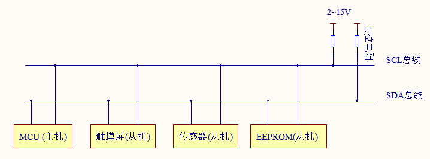

#### 为什么必须用开漏

SDA 线同时连着主机和所有从机的 I/O 引脚。如果用**推挽输出**，极端情况下设备 A 输出高（P-MOS 连通 VDD），设备 B 同时输出低（N-MOS 连通 GND），就形成了 `VDD → A 内部 P-MOS → SDA → B 内部 N-MOS → GND` 的低阻短路通路，瞬间过流可能烧毁器件。这是推挽信号不能多点直接并联的根本原因。

**开漏（Open-Drain）**的工作机制不同：
- 输出 0：内部 N-MOS 打开，引脚被主动拉到 GND
- 输出 1：内部 N-MOS 关断，引脚呈**高阻**（什么都不驱动）

多个开漏引脚并联完全安全：即使多个设备同时"拉低"，也只是多个 N-MOS 并联拉低同一个节点，不会短路。总线的高电平由**外部上拉电阻**（通常 4.7 kΩ）接到 VDD 提供。

#### 线与特性（Wired-AND）

开漏的这种行为等价于一个逻辑与门：**任意一个设备拉低 = 总线为低；所有设备都释放 = 总线为高**。这就是**线与（Wired-AND）**。

线与是 I²C 三个关键机制的共同物理基础：
1. **安全并联**：多设备共享总线不短路
2. **时钟延展**：从机可持续拉低 SCL，强迫主机等待（见下文）
3. **多主仲裁**：主机发高但读到低 → 别人在拉低 → 自己输了，立即退出（§3.6）

#### 时钟延展（Clock Stretching）

I²C 有一个 SPI 完全没有的特性：**从机可以强制拉低 SCL，让主机暂停传输**。

典型场景：主机请求读取一个需要时间才能准备好的数据（比如 ADS1115 正在做 ADC 转换，需要 8 ms）。主机发完命令帧，到了从机回应的那个 SCL 周期，从机用开漏线路**持续拉低 SCL**，主机尝试把 SCL 拉高时发现 SCL 始终是低的，于是主机进入等待——直到从机数据准备好，放开 SCL，SCL 才真正变高，主机继续传输。

整个过程对主机透明——主机代码只是"感觉时钟变慢了"，无需额外处理逻辑。这是开漏线与的一个极其优雅的副产品，完全内嵌在物理层。

> ⚠️ **软件模拟 I²C 注意**：若代码在拉高 SCL 后不读回 SCL 实际电平（只是写 GPIO 输出高，不验证），则无法支持时钟延展。绝大多数廉价传感器不使用时钟延展，但专业的 ADC / DAC 器件可能会用。

#### RC 充电与速率上限

开漏的代价：高电平不再是主动驱动，而是靠上拉电阻对总线寄生电容充电：

$$t_r \approx 0.8 \times R_{pull} \times C_{bus}$$

以典型参数 $R_{pull} = 4.7\ \text{k}\Omega$、$C_{bus} = 100\ \text{pF}$（2~3 个器件加短布线的典型值）：

$$t_r \approx 0.8 \times 4700 \times 100 \times 10^{-12} \approx 376\ \text{ns}$$

I²C Fast Mode（400 kHz）规范要求 $t_r < 300\ \text{ns}$，用 4.7 kΩ 已经卡在边界了。想更快就必须减小上拉电阻或减小总线电容——但减小 $R_{pull}$ 不是免费的：

$$P_{static} = \frac{V_{DD}^2}{R_{pull}} = \frac{(3.3\text{V})^2}{4.7\text{k}\Omega} \approx 2.3\ \text{mW}$$

把 $R_{pull}$ 从 4.7 kΩ 降到 1 kΩ 可以让上升沿快 4.7 倍，但**静态功耗涨到约 10.9 mW**，对电池供电设备很不友好，而且从机的低电平驱动能力必须足以把 1 kΩ 可靠拉低。

| 模式 | 最高速率 | 上升时间限制 | 典型上拉 |
|:---:|:---:|:---:|:---:|
| Standard Mode (SM) | 100 kbps | < 1000 ns | 4.7 kΩ ~ 10 kΩ |
| Fast Mode (FM) | 400 kbps | < 300 ns | 2.2 kΩ ~ 4.7 kΩ |
| Fast Mode Plus (FM+) | 1 Mbps | < 120 ns | 1 kΩ（需 FM+ 驱动能力）|
| High Speed Mode (HS) | 3.4 Mbps | < 40 ns | 线路阻抗要求极严苛 |

> 💡 **工程建议**：普通传感器/EEPROM 场景，4.7 kΩ + Fast Mode 够用。板子上设备超过 4 个或布线较长（> 10 cm），考虑换成 2.2 kΩ。除非有明确速率需求，别急着折腾 FM+。

### 3.4 总线信令：三条物理规则

I²C 的一切帧格式和时序，建立在**三条物理规则**上。记住这三条，你就能从第一性原理推导出任何 I²C 时序：

| # | 规则 | 含义 |
|:---:|---|---|
| ① | **SCL 高电平期间，SDA 必须稳定** | "数据有效"的定义——采样窗口 |
| ② | **START 条件**：SCL = H 时，SDA 出现 H→L 跳变 | 通信起始的唯一无歧义信号 |
| ③ | **STOP 条件**：SCL = H 时，SDA 出现 L→H 跳变 | 通信结束的唯一无歧义信号 |

规则②③是精妙的设计：正常数据传输遵循规则①（SCL 高时 SDA 不动），所以当 SCL 高时 SDA 一旦跳变，**只能**是 START 或 STOP，不可能是普通数据位。同一根 SDA 线，既携带数据，又携带帧边界信令，两种语义在时间维度上完全隔离，没有任何二义性。

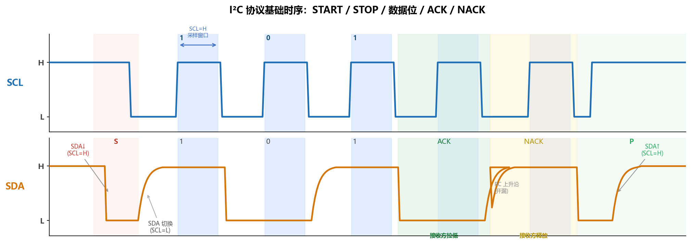

上图：SCL 高电平（淡蓝色区域）为采样窗口；SDA 只在 SCL 低时切换；START 和 STOP 是 SCL 高时 SDA 的特权跳变；第 9 个时钟（ACK 时隙）由接收方控制。

#### ACK / NACK：每字节的握手

SPI 发出的数据主机不知道从机有没有收到——SPI 的全双工只是数据交换，没有确认机制。I²C 在**每个字节之后**强制要求一次握手：

**第 9 个时钟周期（ACK 时隙）**：
1. 发送方传完 8 位后，**主动释放 SDA**（切换为高阻输入）
2. **接收方**现在控制 SDA：
   - **ACK（确认）**：接收方拉低 SDA，并保持到 SCL 第 9 个高电平结束
   - **NACK（拒绝/完成）**：接收方不拉低，SDA 靠上拉电阻维持高电平
3. 发送方在 SCL 第 9 个高电平期间读回 SDA：低 = 对方确认，高 = 对方拒绝或不存在

**关键点：ACK 由接收方主动发出，而不是发送方检测超时。**

这保证了每一个字节都有明确的"已收到 / 未收到"反馈：如果总线上没有这个地址的设备，地址帧就得不到 ACK，主机立刻知道"没人在"。SPI 永远感知不到这一点。

谁在什么情况下发 ACK，是新手最容易搞混的地方：

| 帧字段 | 谁在发送数据 | 谁发 ACK/NACK | 含义 |
|:---:|:---:|:---:|---|
| 地址帧（写模式）| 主机 | **从机** | 从机：我在这里，地址匹配 |
| 数据帧（写模式）| 主机 | **从机** | 从机：这个字节我收到了 |
| 数据帧（读模式，非最后字节）| 从机 | **主机** 发 ACK | 主机：继续发 |
| 数据帧（读模式，最后字节）| 从机 | **主机** 发 NACK | 主机：停，我够了 |

记住一个规律就不会搞混：**ACK/NACK 永远由"收数据的一方"在第 9 个时钟发出**，表达的是"我对这个字节的态度"。

### 3.5 完整帧格式与事务

#### 基本帧结构

```
  S | Addr[6:0] | R/W | ACK | Data[7:0] | ACK | ... | P
  ↑                           ↑
START 条件                  可重复多个 Data + ACK/NACK 字节
```

| 字段 | 位宽 | 控制方 | 含义 |
|:---:|:---:|:---:|---|
| S | 特殊时序 | 主机 | START 条件 |
| Addr | 7 bit | 主机 | 目标从机地址（0x00 = 广播，保留）|
| R/W | 1 bit | 主机 | 0 = 写（主→从），1 = 读（从→主）|
| ACK | 1 bit | **从机** | 0 = 地址匹配确认，1 = 无此设备 |
| Data x N | 8xN bit | 写：主机；读：从机 | 数据字节 |
| ACK/NACK x N | 1xN bit | 写：从机；读：主机 | 逐字节确认（见 §1.4）|
| P | 特殊时序 | 主机 | STOP 条件 |

> 💡 **7 位地址空间**：128 个地址，其中约 16 个被 I²C 规范保留（广播地址 0x00、高速模式主机地址 0x78~0x7B 等），实际可分配约 112 个。同型号器件通常预留 2~3 位可配置地址位（通过 A0/A1/A2 引脚接高/低），允许同一总线上挂多片同型号芯片。

#### 写事务（主机 → 从机）

以向 AT24C02 内部地址 `0x05` 写入数据 `0xAB` 为例：

```
S | 0xA0(1010000_W) | ACK | 0x05(内部地址) | ACK | 0xAB(数据) | ACK | P
```

逐步拆解：
1. **S**：主机在 SCL=H 时拉低 SDA，发出 START
2. **0xA0**：7 位设备地址 `1010 000` + R/W=0（写）= `0b10100000` = `0xA0`
3. **ACK**：AT24C02 收到匹配地址后，在 SCL 第 9 个高电平期间拉低 SDA
4. **0x05**：告诉 EEPROM 要写到内部哪个地址
5. **ACK**：AT24C02 确认内部地址已接收
6. **0xAB**：写入的数据字节
7. **ACK**：AT24C02 确认数据已进入内部写缓冲
8. **P**：主机在 SCL=H 时释放 SDA，发出 STOP

#### 随机读事务（从机 → 主机）

"随机读"（Random Read）是 I²C 最常见的读操作：先写内部地址、再切换为读方向取出数据。整个过程需要 **Repeated START（重复起始）**：

```
S | 0xA0(W) | ACK | 0x05(内部地址) | ACK | RS | 0xA1(R) | ACK | data | NACK | P
                                              ↑
                                        Repeated START（不发 STOP，直接起新 START）
```

**为什么不能用 STOP + START 替代 Repeated START？**

核心原因是**原子性（Atomicity）**。I²C 支持多主机——STOP 会使总线变为空闲，其他主机可以立即抢占总线。对 EEPROM 的随机读而言：

- "写内部地址"设置了 EEPROM 内部的地址指针
- 如果此时另一个主机抢入并向 EEPROM 发了一次写操作，地址指针可能被改变
- 随后的读操作将读到错误位置的数据

Repeated START 不释放总线——从 S 到 P 整个事务期间，总线所有权始终属于当前主机，其他主机无法插入。

> 相当于你在电话里说"等等，我还有话说……"（Repeated START），而不是挂断再重拨（STOP + START）——挂断的那一秒别人可能抢先打进来。

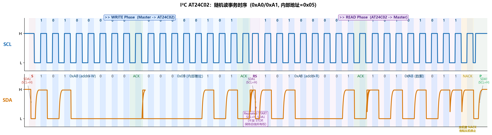

上图：写阶段（蓝色背景）和读阶段（紫色背景）以 Repeated START 直接相连，全程无 STOP，总线所有权不释放。

### 3.6 多主仲裁（进阶）

这是 I²C 最精妙的设计之一，也是开漏线与特性的直接体现。

#### 仲裁的物理基础

多个主机同时发起传输时，每个主机在**发出每一位的同时回读总线实际电平**——这在开漏输出中是免费的（SCL 高时 SDA 就是所有节点的"投票结果"）。主机将回读值与自己刚发出的值比较：

- 发出 1（释放 SDA），读回 1：没有其他主机在拉低，可继续
- 发出 1（释放 SDA），读回 0：**有其他主机正在拉低** → 自己在这一位"输了"→ **立即放弃，转为接收**
- 发出 0（拉低 SDA），读回 0：正常，可能多人同时拉低，继续发

关键洞察：**发 0 的主机永远不会因仲裁失败而退出**（它在拉低总线，读回也是低，一致）；**发 1 的主机可能被发 0 的主机"压制"**。因此，帧值越小（含越多 0 bit）的主机越容易赢得仲裁。

#### 一个具体的仲裁过程

设主机 A 想发地址 `0x48`（`0100 1000`），主机 B 想发地址 `0x50`（`0101 0000`），两者同时发出 START，开始逐位竞争：

| 位（MSB→LSB）| A 发送 | B 发送 | 总线实际 | A 读回 | B 读回 | 结果 |
|:---:|:---:|:---:|:---:|:---:|:---:|---|
| bit 7 | 0 | 0 | 0（均拉低）| 0 ✓ | 0 ✓ | 继续 |
| bit 6 | 1 | 1 | 1（均释放）| 1 ✓ | 1 ✓ | 继续 |
| bit 5 | 0 | 0 | 0 | 0 ✓ | 0 ✓ | 继续 |
| **bit 4** | **0** | **1** | **0（A 拉低）**| 0 ✓ | **1≠0 ❌** | **B 检测到冲突，立即退出** |
| bit 3~0 | 1,0,0,0 | — | — | A 继续发送 | B 转为接收监听 | A 独占总线 |

整个仲裁过程：
- A 始终不知道有人在竞争，传输毫无中断地继续
- B 在 bit 4 发现"我输出了 1，但总线是 0"，悄悄退出，不发任何额外信号
- 总线上没有出现任何冲突或数据损坏——B 在竞争期间发出的都是和 A 相同的位（bit 7~5 的 `0,1,0` 部分），等于是在帮 A 转发数据

> 💡 **I²C 仲裁的优雅之处**：去中心化，无专用仲裁器，无额外延迟，无重传，失败方在失去仲裁后立即转为接收模式——甚至能接收到胜利者发送的完整帧。这是线与特性的极致利用。

---

### 3.7 STM32 的 I²C 外设

在 STM32 上驱动 I²C 设备，你有两条完全不同的路：**用芯片内置的硬件 I²C 控制器**，或者**用两个普通 GPIO 引脚手写时序（软件模拟）**。本节先把两条路都讲清楚——各自怎么用、各自的坑在哪里——然后说明本教程为什么选择软件模拟。

---

#### 两种实现方式对比

| | 硬件 I²C 控制器 | 软件模拟 I²C |
|---|---|---|
| **原理** | 片内专用状态机，自动完成时序 | CPU 手动翻转 GPIO 引脚合成时序 |
| **引脚约束** | 固定引脚（如 PB6/PB7），须配置为 AF 复用 | 任意两个 GPIO 均可 |
| **CPU 参与度** | 低，可接 DMA | 每个 bit 都需 CPU 执行代码 |
| **HAL 入口** | `HAL_I2C_Init()` + `HAL_I2C_Mem_Write/Read()` | `HAL_GPIO_Init()` + 自己实现 Start/SendByte 等 |
| **已知 Bug** | STM32F1/F4 有 BUSY 锁死硅片勘误 | 无，代码即时序 |
| **调试难度** | 状态机不透明，出错难排查 | 每步可加断点，逻辑分析仪一一对应 |
| **适用场景** | 高速（> 400 kbps）、需要 DMA 减负 | 低速传感器/EEPROM，调试阶段 |

---

#### 硬件 I²C 控制器

##### 它是怎么工作的

和前面的SPI和UART一样，我们内部也有专门的外设用于IIC通信。

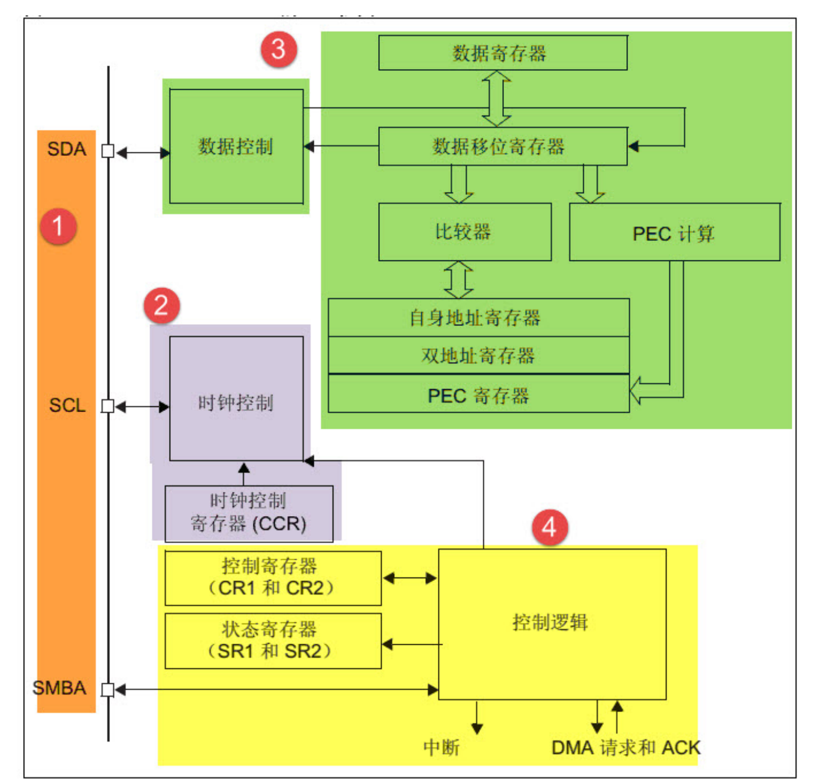

它接管了所有 I²C 时序细节：

- 自动产生 START / Repeated START / STOP
- 根据 CCR 寄存器自动计时 SCL 高低电平
- 发一个字节只需向 DR 写一次，状态机自动发 8 bit + 等 ACK
- 支持 DMA：发多字节时 CPU 完全不参与

**关键寄存器速查：**

| 寄存器 | 关键字段 | 你需要关注的内容 |
|:---:|:---:|---|
| CR1 | `PE` / `START` / `STOP` / `ACK` / `SWRST` | 外设使能（`PE=1`）；发起传输写 `START=1`；停止写 `STOP=1`；出 Bug 时用 `SWRST` |
| CR2 | `FREQ[5:0]` | **必须**填写 APB1 时钟 MHz 整数（42 MHz 填 42），填错时序全乱 |
| CCR | `F/S` / `DUTY` / `CCR[11:0]` | `F/S=0` 普通模式，`F/S=1` 快速模式；`CCR` 值控制 SCL 分频 |
| TRISE | `TRISE[5:0]` | 最大上升时间槽；SM 填 $f_{PCLK1}[\text{MHz}]+1$，FM 填 $\lfloor f_{PCLK1}[\text{MHz}]\times0.3 \rfloor+1$ |
| DR | `DR[7:0]` | 写入要发送的字节；读取接收到的字节 |
| SR1 | `SB`/`ADDR`/`TXE`/`RXNE`/`BTF`/`AF`/`BERR` | 轮询每步完成；`AF`=对方 NACK，`BERR`=总线错误 |
| SR2 | `BUSY` / `MSL` / `TRA` | `BUSY=1` 表示总线正在被占用，发起传输前必须等 `BUSY=0` |

##### HAL 初始化与读写示例

```c
I2C_HandleTypeDef hi2c1;

/* 初始化 I2C1，SCL=PB6，SDA=PB7，Fast Mode 400 kHz */
void HW_I2C1_Init(void)
{
    /* ① 使能时钟 */
    __HAL_RCC_GPIOB_CLK_ENABLE();
    __HAL_RCC_I2C1_CLK_ENABLE();

    /* ② GPIO：复用开漏（AF_OD），AF4 = I2C1 */
    GPIO_InitTypeDef gpio = {0};
    gpio.Pin       = GPIO_PIN_6 | GPIO_PIN_7;
    gpio.Mode      = GPIO_MODE_AF_OD;           /* 复用开漏，不是 OUTPUT_PP！*/
    gpio.Pull      = GPIO_NOPULL;               /* 外部已有上拉电阻 */
    gpio.Speed     = GPIO_SPEED_FREQ_VERY_HIGH;
    gpio.Alternate = GPIO_AF4_I2C1;
    HAL_GPIO_Init(GPIOB, &gpio);

    /* ③ I2C 参数 */
    hi2c1.Instance             = I2C1;
    hi2c1.Init.ClockSpeed      = 400000;            /* 400 kHz = Fast Mode */
    hi2c1.Init.DutyCycle       = I2C_DUTYCYCLE_2;   /* Tlow:Thigh = 2:1（FM 标准占空比）*/
    hi2c1.Init.OwnAddress1     = 0;                 /* 主机模式，本机地址不用填 */
    hi2c1.Init.AddressingMode  = I2C_ADDRESSINGMODE_7BIT;
    hi2c1.Init.DualAddressMode = I2C_DUALADDRESS_DISABLE;
    hi2c1.Init.GeneralCallMode = I2C_GENERALCALL_DISABLE;
    hi2c1.Init.NoStretchMode   = I2C_NOSTRETCH_DISABLE;
    HAL_I2C_Init(&hi2c1);  /* HAL 内部根据 ClockSpeed 自动计算 CCR 和 TRISE */
}
```

初始化后，`HAL_I2C_Mem_Write/Read` 把 §3.5 讲的"写地址 → Repeated START → 读/写数据"完整流程封装进去了：

```c
uint8_t write_buf[20] = "Hello AT24C02! 0123";
uint8_t read_buf[20]  = {0};

/* 向 EEPROM 内部地址 0x00 写入 20 字节（设备地址 0xA0） */
HAL_I2C_Mem_Write(&hi2c1, 0xA0, 0x00,
                  I2C_MEMADD_SIZE_8BIT, write_buf, 20, HAL_MAX_DELAY);
HAL_Delay(10);   /* AT24C02 写完成最长 5 ms，等 10 ms */

/* 从内部地址 0x00 读回 20 字节 */
HAL_I2C_Mem_Read(&hi2c1, 0xA0, 0x00,
                 I2C_MEMADD_SIZE_8BIT, read_buf, 20, HAL_MAX_DELAY);
```

看起来极简洁。**那为什么本教程要绕道去写软件模拟？**

---

##### 硅片勘误（Silicon Errata）：BUSY 位永远不清零

ST 在官方应用笔记 AN2824 中承认：**STM32F1 和 F4 的硬件 I²C，在某些错误场景下 SR2 的 BUSY 位会永远不清零，导致代码挂死。**

理解这个 Bug 分三步：

**① 什么情况会触发？**

MCU 上电或复位后，硬件 I²C 状态机一旦被使能，会去扫描 SCL/SDA 总线电平。如果此时总线上有任何低电平（从机尚未就绪、上次传输异常结束、强制复位但从机还在传输中……），状态机就认为"总线正处于传输中，我等"，进入等待——永远等待。

**② Bug 的表现**

```c
/* 程序卡死在这里，永远无法往下走 */
while (__HAL_I2C_GET_FLAG(&hi2c1, I2C_FLAG_BUSY) != RESET)
    ;
```

HAL 内部每次调用 `HAL_I2C_Mem_Write/Read` 之前都会检查这个标志，一旦 BUSY 锁死，所有 I²C 操作全部无限等待。

**③ 为什么软件复位（SWRST）也救不了？**

`SWRST` 只复位 I²C 状态机的内部逻辑寄存器，**不复位物理总线上的电平**。如果从机 SDA 仍然是低的（它认为自己还在传输中），BUSY 复位后立刻重新置位——等于没复位。

**正确的 ST 官方 workaround 分五步：**

```c
/*
 * 恢复 I²C 总线的正确步骤（参考 ST AN2824）
 * 注意：步骤 3~4 本质上就是用 GPIO 手搓了一段 I²C 时序
 */
void I2C_BusRecovery(void)
{
    /* 1. 关闭 I²C 外设 */
    __HAL_RCC_I2C1_FORCE_RESET();
    HAL_Delay(10);
    __HAL_RCC_I2C1_RELEASE_RESET();

    /* 2. 把 SCL/SDA 临时切回普通开漏 GPIO（取消复用） */
    GPIO_InitTypeDef gpio = {0};
    gpio.Pin   = GPIO_PIN_6 | GPIO_PIN_7;
    gpio.Mode  = GPIO_MODE_OUTPUT_OD;
    gpio.Pull  = GPIO_NOPULL;
    gpio.Speed = GPIO_SPEED_FREQ_LOW;
    HAL_GPIO_Init(GPIOB, &gpio);

    /* 3. 产生 9 个 SCL 脉冲——让卡住的从机完成当前字节，释放 SDA */
    HAL_GPIO_WritePin(GPIOB, GPIO_PIN_7, GPIO_PIN_SET); /* SDA 先拉高 */
    for (int i = 0; i < 9; i++) {
        HAL_GPIO_WritePin(GPIOB, GPIO_PIN_6, GPIO_PIN_RESET);
        HAL_Delay(1);
        HAL_GPIO_WritePin(GPIOB, GPIO_PIN_6, GPIO_PIN_SET);
        HAL_Delay(1);
    }

    /* 4. 手动产生 STOP 条件（SCL=H 时 SDA L→H） */
    HAL_GPIO_WritePin(GPIOB, GPIO_PIN_7, GPIO_PIN_RESET);
    HAL_Delay(1);
    HAL_GPIO_WritePin(GPIOB, GPIO_PIN_6, GPIO_PIN_SET);
    HAL_Delay(1);
    HAL_GPIO_WritePin(GPIOB, GPIO_PIN_7, GPIO_PIN_SET);
    HAL_Delay(1);

    /* 5. 把引脚改回 AF_OD，重新调用 HAL_I2C_Init() */
    gpio.Mode      = GPIO_MODE_AF_OD;
    gpio.Alternate = GPIO_AF4_I2C1;
    HAL_GPIO_Init(GPIOB, &gpio);
    HW_I2C1_Init();
}
```

留意步骤 3~4：为了修复硬件控制器，你不得不**用 GPIO 手写了一段 I²C 时序**——这本质上就是软件模拟 I²C 的子集。到这里，为什么选软件模拟就不言而喻了。

> 💡 **工程结论**
>
> 对 AT24C02 / 传感器这类低速 I²C 设备，首选软件模拟：
> - 168 MHz Cortex-M4 软件模拟 400 kbps，每 bit 约 210 个时钟，CPU 占用 < 1%，完全够用
> - 零 Bug，每步 ACK 失败都对应代码里的一行，逻辑分析仪挂上后时序一目了然
> - 需要 DMA + 高速（> 400 kbps）时再上硬件控制器，但要做好 BUSY 恢复逻辑

---

#### 软件模拟 I²C

##### 核心思路：GPIO 手工合成时序

用两个普通 GPIO（配置为**开漏输出**）分别连接 SCL 和 SDA，用代码精确控制每个引脚在每个时间点的高/低电平，从而手工"合成"出 I²C 时序——这就是软件模拟 I²C 的全部核心。

##### GPIO 配置（必须是开漏，不是推挽）

```c
void i2c_GPIO_Config(void)
{
    __HAL_RCC_GPIOB_CLK_ENABLE();

    GPIO_InitTypeDef GPIO_InitStruct = {0};
    GPIO_InitStruct.Pin   = GPIO_PIN_8 | GPIO_PIN_9; /* SCL=PB8, SDA=PB9 */
    GPIO_InitStruct.Mode  = GPIO_MODE_OUTPUT_OD;      /* 开漏！禁止用 OUTPUT_PP */
    GPIO_InitStruct.Pull  = GPIO_NOPULL;              /* 板上已有 4.7 kΩ 上拉到 3.3 V */
    GPIO_InitStruct.Speed = GPIO_SPEED_FREQ_HIGH;
    HAL_GPIO_Init(GPIOB, &GPIO_InitStruct);

    /* 空闲时 SCL 和 SDA 都应为高电平 */
    HAL_GPIO_WritePin(GPIOB, GPIO_PIN_8 | GPIO_PIN_9, GPIO_PIN_SET);
}
```

> ⚠️ **一定不能用推挽（OUTPUT_PP）**：推挽输出 1 时主机主动驱动 SDA 为高，从机拉低 SDA 的力气不够压过推挽高，ACK 读不到，还可能过电流损坏从机。详见 §3.3 开漏与线与。

##### 速率调节：改一个数字

软件模拟的速率由 `i2c_Delay()` 函数决定——它控制的就是 SCL 半周期的等待时间。回顾 §3.3 的速率表，Fast Mode 要求 SCL ≤ 400 kHz，即一个完整周期 ≥ 2.5 μs，半周期 ≥ 1.25 μs。CPU 主频 168 MHz 下：

$$n_{cycles} = 168\ \text{MHz} \times 1.25\ \mu\text{s} = 210\ \text{个时钟周期}$$

一个 `while (n--)` 循环体在 `-O0` 下大约 3~4 条指令（加载、减 1、比较、跳转），每次约 4 周期，理论上 $n \approx 210 / 4 \approx 50$。但实际上函数调用、`HAL_GPIO_WritePin` 寄存器写入本身也消耗了大量周期，所以 `n` 远小于 50——实测 `n ≈ 10` 就能达到约 400 kHz：

```c
/* Fast Mode ≈ 400 kHz（168 MHz CPU，-O0 编译，实测微调）*/
static void i2c_Delay(void)
{
    volatile uint8_t n = 10; /* 调小 → 更快；调大 → 更慢 */
    while (n--);
}
```

实际速率受编译优化级别影响，建议用逻辑分析仪测量 SCL 真实频率后再微调 `n`。

##### 四个原子操作

所有字节级操作都由四个原子操作组合而成：

| 操作 | 执行步骤 | 对应 I²C 时序规则 |
|---|---|---|
| `i2c_Start()` | SCL 保持高 → SDA 拉低 → SCL 拉低 | START：SCL=H 时 SDA 出现 H→L（§3.4 规则②）|
| `i2c_Stop()` | SCL 拉高 → SDA 先拉低再释放（L→H）| STOP：SCL=H 时 SDA 出现 L→H（§3.4 规则③）|
| `i2c_WriteBit(bit)` | SCL 低 → SDA 设为 bit → SCL 高 → 等 → SCL 低 | 数据在 SCL=H 期间稳定（§3.4 规则①）|
| `i2c_ReadBit()` | SCL 低 → **SDA 输出高（放手）** → SCL 高 → **读 SDA 电平** → SCL 低 | 放手后由从机和总线决定 SDA |

> 🔑 **`i2c_ReadBit()` 里为什么要先"输出高"才能读？**
>
> 开漏配置："输出 1"= N-MOS 断开 = 引脚高阻，SDA 由外部上拉 + 其他节点共同决定；"输出 0"= N-MOS 导通 = 主动拉低。
>
> 主机要读从机 ACK，必须先"输出 1"放手——否则 SDA 是主机自己拉低的，从机根本没机会把它拉到低表示 ACK，主机读到的永远是自己的 0，无法区分 ACK 和 NACK。

##### 调用层次

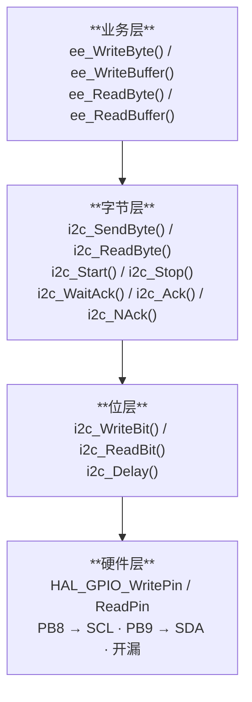

每层只依赖下一层：调试时从底往上——位层不对先查 GPIO 配置；字节层不对检查 Start/Stop 时序；业务层出问题再看页地址逻辑。

##### 硬件资源（野火 STM32F407 开发板）

| 信号 | 引脚 | 说明 |
|:---:|:---:|---|
| SCL | PB8 | 开漏输出，板载 4.7 kΩ 上拉至 3.3 V |
| SDA | PB9 | 开漏输出，板载 4.7 kΩ 上拉至 3.3 V |
---

### 3.8 代码实战：软件模拟 I²C 读写 AT24C02

#### 工程文件组织

```
code/I2C_AT24C02_RW/
├── CMakeLists.txt
├── CMakePresets.json
├── STM32F407XX_FLASH.ld
├── startup_stm32f407xx.s
├── cmake/
│   ├── gcc-arm-none-eabi.cmake
│   └── stm32cubemx/CMakeLists.txt
├── Drivers/
│   ├── CMSIS/
│   └── STM32F4xx_HAL_Driver/
├── Core/
│   ├── Inc/  main.h  stm32f4xx_hal_conf.h  stm32f4xx_it.h
│   └── Src/  main.c  stm32f4xx_it.c  stm32f4xx_hal_msp.c  syscalls.c  sysmem.c
└── Lib/
    ├── Inc/
    │   ├── bsp_debug_usart.h
    │   ├── bsp_i2c_gpio.h        ← 引脚操作宏 + 函数声明
    │   └── bsp_i2c_ee.h          ← AT24C02 设备参数 + 函数声明
    └── Src/
        ├── bsp_debug_usart.c
        ├── bsp_i2c_gpio.c        ← Start/Stop/SendByte/ReadByte/WaitAck/Ack/NAck
        └── bsp_i2c_ee.c          ← WriteByte/WriteBuffer/ReadByte/ReadBuffer
```

---

📄 [Lib/Inc/bsp_i2c_gpio.h](../Chapter3_外设串讲_通信协议和ADC/code/I2C_AT24C02_RW/Lib/Inc/bsp_i2c_gpio.h) — SCL=PB8、SDA=PB9 引脚操作宏（`HAL_GPIO_WritePin/ReadPin`），函数声明

---

📄 [Lib/Src/bsp_i2c_gpio.c](../Chapter3_外设串讲_通信协议和ADC/code/I2C_AT24C02_RW/Lib/Src/bsp_i2c_gpio.c) — `HAL_GPIO_Init()` 开漏输出配置；Start、Stop、SendByte（MSB 优先）、ReadByte、WaitAck（超时 250）、Ack、NAck

---

📄 [Lib/Inc/bsp_i2c_ee.h](../Chapter3_外设串讲_通信协议和ADC/code/I2C_AT24C02_RW/Lib/Inc/bsp_i2c_ee.h) — AT24C02 设备地址 0xA0，页大小 8 字节，容量 256 字节，函数声明

---

📄 [Lib/Src/bsp_i2c_ee.c](../Chapter3_外设串讲_通信协议和ADC/code/I2C_AT24C02_RW/Lib/Src/bsp_i2c_ee.c) — WriteByte、WriteBuffer（自动处理页边界）、ReadByte（Repeated START）、ReadBuffer（中间字节 ACK，最后 NACK）；页写等待改用 `HAL_Delay(10)`

> 💡 **为什么 `ee_WriteBuffer` 要处理页边界？**
> AT24C02 的内部地址计数器在写入时**只在页内翻转**（8 字节一圈）。如果一次 I²C 传输写了 12 字节但跨越了页边界，地址计数器回绕到页首，导致数据覆盖前几个字节。解决办法就是每次写入前计算当前页剩余空间，分成多次事务完成写入。

---

📄 [Core/Src/main.c](../Chapter3_外设串讲_通信协议和ADC/code/I2C_AT24C02_RW/Core/Src/main.c) — `HAL_Init()` + `SystemClock_Config()`，写入 "Hello AT24C02! 0123"（20 字节），读回 memcmp 验证

**预期串口输出：**

```
===== AT24C02 I2C EEPROM Test (HAL) =====
Writing: Hello AT24C02! 0123
Read back: Hello AT24C02! 0123
Verify: [PASS]
```

> ⚠️ **常见问题排查**
> - **总是 NACK**：检查 PB8/PB9 是否接了外部上拉（4.7 kΩ 到 3.3 V）；确认 GPIO 配置为**开漏输出**，不能是推挽。
> - **写入后读回错误**：确认 `HAL_Delay(10)` 等待足够（AT24C02 片内编程最长 5 ms，10 ms 为 2× 余量）。
> - **跨页数据错乱**：确认使用 `ee_WriteBuffer` 而非直接裸写超过 8 字节的数据。

> 🎓 **小结**：到这里，I²C 部分就讲完了。和 UART、SPI 一样，三个层次：
> 1. **协议层**（§3.1~§3.6）：I²C 的五个属性——同步、开漏、帧内地址、半双工、多主仲裁；开漏线与的物理原理；START/STOP/ACK 时序规则；完整帧格式与 Repeated START。
> 2. **外设层**（§3.7）：硬件 I²C 控制器的寄存器与 HAL 接口；BUSY 锁死硅片勘误；软件模拟的四原子操作与分层架构。
> 3. **代码层**（§3.8）：基于 HAL GPIO 的软件 I²C 完整实现；AT24C02 页边界处理；读写验证。

---

## 4 CAN 总线

### 4.1 为什么需要 CAN？

1980 年代，汽车行业遇到了一个严峻的布线危机：一辆中级轿车已经有了发动机 ECU、变速箱 ECU、仪表盘、ABS 控制器等十几个电子控制单元，它们之间需要交换数据。如果用点对点的硬线连接，一辆普通家用车需要几十公斤的线束，一辆豪华车甚至超过 100 公斤——重量、成本、故障率都不可接受。

问题的本质是：**你有几十个节点，它们需要互相通信，但不可能给每对节点都拉一根专线**。

让我们从约束出发，推导 CAN 必须具备的特性：

- **多节点共享一条总线**：不能像 SPI 那样每个从机一根 CS 线，也不能像 UART 那样点对点
- **发布-订阅模型**：没有固定的"主机读从机"，每个节点都可以广播消息，谁需要谁消费
- **极强的抗噪声能力**：汽车环境中有点火系统、电机驱动器、继电器等巨大的电磁干扰源
- **长距离**：线束可能跨越整辆车，长达数米甚至十余米
- **实时确定性**：ABS、安全气囊的响应时间是毫秒级的，不能有不确定延迟
- **故障容忍**：一个 ECU 死机不能拖垮整条总线

Bosch 在 1986 年推出的 CAN（Controller Area Network）就是对这些约束的工程答案。时至今日，CAN 已经远超汽车领域，在工业自动化、医疗设备、航空电子等场景无处不在。

### 4.2 CAN 的属性

带着上面的约束，CAN 的每个属性决策都是水到渠成的：

**时序：异步（但有位同步）**——没有独立的时钟线（会多一根线且对噪声敏感），而是通过**帧内同步**机制（SOF 沿触发重同步）让所有节点对齐采样点。

**电平：差分**——单端信号在长距离和强噪声环境下会累积误差；差分信号对共模噪声免疫（两根线上叠加的噪声相减后抵消）。

**寻址：内容寻址（报文 ID）**——不是"主机告诉从机地址"，而是每个报文携带 ID，**接收方自己决定是否关心这个 ID**。这就是发布-订阅模型的实现。

**读写控制：广播**——没有 R/W 方向位，每个发送方都是在广播，每个接收方按需过滤。

**仲裁：CSMA/CR 逐位非破坏性仲裁**——多节点可以同时开始发送；通过逐位比较帧 ID，低 ID（高优先级）的节点自然获胜，失败方无需重传（见 §2.6）。

| 属性 | CAN | I²C | SPI |
|:---:|:---:|:---:|:---:|
| 时序 | **异步**（位同步）| 同步（SCL）| 同步（SCLK）|
| 电平 | **差分**（CAN_H/L）| 开漏（SDA/SCL）| 推挽 |
| 物理线数 | **2 根**（信号）+2 根终端 | 2 根 | 3~4 根 |
| 寻址 | **内容寻址**（报文 ID）| 帧内地址（7位）| 硬件片选 |
| 读写控制 | **广播，无方向**| 帧内 R/W 位 | 物理全双工 |
| 仲裁 | **CSMA/CR** | 逐位仲裁 | 单主独占 |
| 最大速率 | **1 Mbps @ 40m** | 3.4 Mbps（短距）| 数十 Mbps（板级）|
| 最大距离 | **数公里**（低速）| < 1 m（典型）| < 30 cm（典型）|

> 💡 **CAN 最大的独特性**：它是三者中唯一真正面向**多主、多节点、长距离**设计的协议，付出的代价是较低的速率上限和更复杂的帧格式。其他两者都是"板级"协议，CAN 是"系统级"协议。

### 4.3 差分信号与总线物理

#### 为什么用差分

单端信号（如 UART 的 TX/RX）的参考基准是 GND。当信号线很长时，线缆两端的 GND 可能存在几十到几百 mV 的电位差（地环路噪声），加上导线拾取的共模电磁干扰，信号完整性就无法保证。

差分信号的接收方关心的是 **CAN_H − CAN_L** 的差值，而不是任一根线相对 GND 的绝对值。共模噪声会**同等叠加**在 CAN_H 和 CAN_L 上，相减后正好抵消。这就是为什么 CAN 能在充满干扰的汽车环境里可靠工作。

#### 两种总线电平

| 电平状态 | 逻辑值 | CAN_H 电压 | CAN_L 电压 | 差值 |
|:---:|:---:|:---:|:---:|:---:|
| **显性（Dominant）** | **0** | ≈ 3.5 V | ≈ 1.5 V | ≈ **+2 V** |
| **隐性（Recessive）** | **1** | ≈ 2.5 V | ≈ 2.5 V | ≈ **0 V** |

**显性覆盖隐性**（Wired-AND）：只要有**任何一个节点**驱动显性电平（拉开 CAN_H 和 CAN_L），总线就是显性；只有**所有节点都释放**（处于隐性），总线才是隐性。

这个"线与"特性和 I²C 的开漏是同一个思路——正是 CAN 非破坏性仲裁的物理基础（§2.6）。

#### 终端电阻

CAN 总线两端各需要一个 **120 Ω 终端电阻**，连接 CAN_H 和 CAN_L。原因：

1. **阻抗匹配**：CAN 总线线缆特征阻抗约 120 Ω；如果末端开路，信号到达终点后会产生**反射波**叠加在原始信号上，造成误判
2. **差分偏置**：隐性状态下，两个终端电阻将 CAN_H 和 CAN_L 拉到相同的中间电位（约 2.5 V），确保差分电压为 0

> ⚠️ **调试常见错误**：总线上只有一个终端电阻，或者终端电阻接在了总线中间而非两端——这是 CAN 通信时好时坏的常见原因，尤其在传输速率较高时。

#### CAN 收发器芯片

MCU 的 bxCAN 外设只输出/接收单端的 CAN_TX / CAN_RX 逻辑信号。要连接实际总线，必须在 MCU 和总线之间加**CAN 收发器芯片**（PHY）：

| 常用芯片 | 特点 |
|:---:|---|
| **TJA1050** | 高速 CAN 收发器（最高 1 Mbps），工业和汽车标准 |
| **SN65HVD230** | 3.3 V 供电版本，适合直接驱动 3.3 V MCU |
| **MCP2551** | Microchip 出品，常见于开发板和 Arduino 生态 |

接线：MCU CAN_TX → 收发器 TXD；收发器 CANH/CANL → 总线；收发器 RXD → MCU CAN_RX。

### 4.4 帧格式

CAN 2.0 定义了四种帧类型，日常使用最多的是数据帧。

#### 数据帧（Data Frame）

数据帧是 CAN 的主角，用于传输实际数据。CAN 2.0A（标准帧，11-bit ID）格式如下：

```
| SOF | ID[10:0] | RTR | IDE | r0 | DLC[3:0] | DATA[0~8 B] | CRC[14:0] | CRC_DEL | ACK | ACK_DEL | EOF[7b] | IFS[3b] |
```

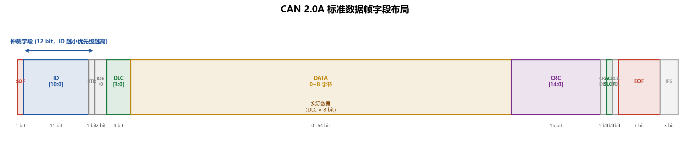

逐字段拆解：

| 字段 | 长度 | 电平/值 | 说明 |
|---|:---:|:---:|---|
| **SOF**（帧起始）| 1 bit | 显性（0）| 总线从隐性跳到显性，触发所有节点的边沿同步 |
| **ID[10:0]** | 11 bit | — | 报文标识符；值越小，优先级越高 |
| **RTR** | 1 bit | 数据帧=显性(0) | Remote Transmission Request；1=远程帧（请求数据）|
| **IDE** | 1 bit | 标准帧=显性(0) | Identifier Extension；1=扩展帧（29-bit ID）|
| **r0** | 1 bit | 显性（保留）| 保留位，接收方不检查其值 |
| **DLC[3:0]** | 4 bit | 0~8 | Data Length Code，数据字节数 |
| **DATA** | 0~64 bit | — | 实际数据（0~8 字节，由 DLC 决定）|
| **CRC[14:0]** | 15 bit | — | 15-bit CRC，覆盖 SOF 到 DATA 的全部 bit |
| **CRC_DEL** | 1 bit | 隐性（1）| CRC 定界符（固定格式，用于格式错误检测）|
| **ACK SLOT** | 1 bit | 发送方=隐性(1) | 接收方在此写入显性(0)表示"帧完整收到" |
| **ACK_DEL** | 1 bit | 隐性（1）| ACK 定界符 |
| **EOF** | 7 bit | 全隐性（7×1）| End of Frame，帧结束标志 |
| **IFS** | 3 bit | 全隐性（3×1）| 帧间隔，给节点留处理时间 |

> 💡 **CAN 的 ACK 和 I²C 的 ACK 不同**：I²C 的 ACK 是接收方对"这一个字节"的确认，逐字节握手。CAN 的 ACK 是对**整帧**的确认——总线上**所有成功通过 CRC 校验的节点都可以**在 ACK 槽里写显性，只要有一个节点确认，发送方就认为帧发送成功。发送方本身在 ACK 槽期间发隐性，如果读回显性就知道有人接收了。

#### 扩展帧（CAN 2.0B，29-bit ID）

扩展帧将 ID 扩展到 29 位（11-bit Base ID + 18-bit Extended ID），可以区分超过 5 亿种报文类型：

```
SOF | Base ID[10:0] | SRR(=1) | IDE(=1) | Ext ID[17:0] | RTR | r1 | r0 | DLC | DATA | CRC | ACK | EOF
```

SRR（Substitute Remote Request）位固定为隐性，保证标准帧（IDE=显性）在仲裁时优先于扩展帧（IDE=隐性）的同 Base ID 报文。

#### 远程帧、错误帧、过载帧

| 帧类型 | 用途 | 关键特征 |
|---|---|---|
| **远程帧** | 请求另一节点发送特定 ID 的数据帧 | RTR=1，无数据字段 |
| **错误帧** | 节点检测到错误时主动发送，通知所有节点当前帧无效 | 6 个显性位（主动错误）或 6 个隐性位（被动错误），违反填充规则，强制所有节点丢弃当前帧 |
| **过载帧** | 接收方通知"我还没处理完上一帧，稍等" | 格式类似错误帧，只能在 IFS 期间发送 |

#### 位填充规则

CAN 是异步协议，接收方靠**边沿**进行位同步（§2.5）。如果数据中连续出现很多相同极性的位，接收方长时间没有边沿，同步就会漂移。

**解决方案——位填充（Bit Stuffing）**：

- 在 SOF 到 CRC 字段范围内，连续 **5 个相同极性**的位后，自动插入 1 个**相反极性**的填充位
- 接收方检测到填充位后自动删除，对上层透明
- 填充位本身不进行再填充

位填充同时也是**错误检测**的手段：如果接收方看到连续 6 个相同极性的位（除 EOF 和错误帧外），就知道发生了**填充错误（Stuff Error）**。

### 4.5 位定时与同步

CAN 总线上没有独立的时钟线——接收方的采样时刻依赖**位定时**和**重同步**机制。这是 CAN 和 I²C/SPI 相比最独特的技术挑战。

#### 时间量子（TQ）

每个 CAN 位被分成若干个**时间量子（Time Quantum，TQ）**，这是 CAN 位定时的最小单位：

$$TQ = \frac{Prescaler}{f_{APB}}$$

在 STM32F407 中，CAN1/CAN2 由 APB1 提供时钟（最高 42 MHz）。

#### 一个位的三段结构

| 段 | 长度 | 作用 |
|---|:---:|---|
| **SS**（同步段，Sync Segment）| 固定 1 TQ | 期望总线边沿在此段内出现；用于节点同步 |
| **BS1**（缓冲段 1，Bit Segment 1）| 1~16 TQ | 可延长，补偿传播延迟和晶振偏差；**采样点在 BS1 结束处** |
| **BS2**（缓冲段 2，Bit Segment 2）| 1~8 TQ | 传输点（TxPoint），此时驱动下一位到总线 |

采样点位置通常设在 **75%~87.5%** 的 bit 时间处，CiA（CAN in Automation）推荐值。

#### 波特率公式

$$Baud = \frac{f_{APB1}}{Prescaler \times (1 + BS1 + BS2)}$$

**500 kbps 计算实例**（STM32F407，APB1 = 42 MHz）：

选 `Prescaler = 6`，`BS1 = 11`，`BS2 = 2`：

$$Baud = \frac{42{,}000{,}000}{6 \times (1 + 11 + 2)} = \frac{42{,}000{,}000}{6 \times 14} = \frac{42{,}000{,}000}{84} = 500{,}000\ \text{bps}\ ✓$$

采样点位置：

$$\text{采样点} = \frac{1 + BS1}{1 + BS1 + BS2} = \frac{1 + 11}{1 + 11 + 2} = \frac{12}{14} \approx 85.7\%\ ✓$$

> 💡 **BTR 寄存器里的值是 BS1-1 和 BS2-1**：STM32 BTR 寄存器的 TS1[3:0] 字段填 BS1 − 1（即 10），TS2[2:0] 填 BS2 − 1（即 1），BRP[9:0] 填 Prescaler − 1（即 5）。新手容易在这里差一。

**常用波特率速查表**（APB1 = 42 MHz）：

| 波特率 | Prescaler | BS1 | BS2 | 实际频率 | 采样点 |
|:---:|:---:|:---:|:---:|:---:|:---:|
| 1 Mbps | 3 | 11 | 2 | 1 Mbps | 85.7% |
| 500 kbps | 6 | 11 | 2 | 500 kbps | 85.7% |
| 250 kbps | 12 | 11 | 2 | 250 kbps | 85.7% |
| 125 kbps | 24 | 11 | 2 | 125 kbps | 85.7% |

#### 重同步跳转宽度（SJW）

当接收方检测到实际边沿与预期 SS 段有偏差时，CAN 硬件可以自动调整 BS1（延长）或 BS2（缩短）来对齐采样点：

- 最大调整量 = **SJW（Synchronization Jump Width）**，范围 1~4 TQ（BTR 寄存器 SJW[1:0] + 1）
- SJW 越大，可容忍的晶振偏差越大；通常 SJW = 1 TQ 对于优质晶振已足够

### 4.6 仲裁：非破坏性 CSMA/CR

CAN 的仲裁机制是**逐位非破坏性**——全称 CSMA/CR（Carrier Sense Multiple Access / Collision Resolution）。与以太网的 CSMA/CD（Collision **Detection**）不同，CD 检测到碰撞后双方都停下来重传；CR 是"碰撞解决"——低优先级方悄悄退出，高优先级方**根本感知不到有人在竞争**，帧无损完成。

#### 四条仲裁规则

1. 总线空闲时（连续隐性），任何节点都可以开始发送（CSMA）
2. 每发出一位，**立即回读总线实际电平**
3. **发出隐性(1)，读回显性(0)** → 有更高优先级的节点在发 → **立即停止发送，转为接收**
4. **发出显性(0)，读回显性(0)** → 正常（可能多人同时拉低），继续发

#### 逐位仲裁实例

设节点 A 发 ID = `0x101`（`0b0 0001 0000 001`，MSB 先），节点 B 发 ID = `0x201`（`0b0 0010 0000 001`），同时从 SOF 开始发送：

| bit | A 发 | B 发 | 总线电平 | A 读 | B 读 | 结果 |
|:---:|:---:|:---:|:---:|:---:|:---:|---|
| bit 10 | 0（显）| 0（显）| 显性 | 0 ✓ | 0 ✓ | 继续 |
| bit 9 | 0（显）| 0（显）| 显性 | 0 ✓ | 0 ✓ | 继续 |
| **bit 8** | **0（显）**| **1（隐）**| **显性**| 0 ✓ | **1≠0 ❌** | **B 退出，转接收** |
| bit 7~0 | A 继续发 | — | A 独占 | — | — | A 赢得仲裁，帧完整发出 |

整个过程：
- A 根本不知道有人在竞争，帧完整发出，**无重传、无延迟**
- B 在 bit 8 发现"我输出了隐性，但总线是显性"，悄悄转为接收模式
- B 在 bit 8 之前发出的 bit（都是 0，显性）和 A 完全一样，没有破坏任何数据

> 💡 **与 I²C 仲裁的对比**：机制完全相同（线与 + 逐位比较），本质差异在于：
> - I²C 仲裁的是**地址字段**（谁的目标地址小谁赢，仲裁结果决定"谁跟谁说话"）
> - CAN 仲裁的是**报文 ID**（ID 小的优先，仲裁结果决定"哪条消息先上总线"）
> - CAN 没有主从概念，赢家直接广播给所有节点

### 4.7 错误检测与处理

CAN 的错误处理机制是保证可靠性的核心，也是它能被用于汽车安全系统的底气。

#### 五种错误类型

| 错误类型 | 检测方 | 触发条件 |
|---|:---:|---|
| **位错误（Bit Error）** | 发送方 | 回读总线电平与发出的不同（仲裁阶段和 ACK 槽除外）|
| **填充错误（Stuff Error）** | 接收方 | 在需要位填充的范围内，连续出现 6 个相同极性的位 |
| **CRC 错误（CRC Error）** | 接收方 | 计算出的 CRC 与帧中的 CRC 字段不符 |
| **格式错误（Form Error）** | 接收方 | 固定格式字段（CRC_DEL / ACK_DEL / EOF）出现显性电平 |
| **ACK 错误（ACK Error）** | 发送方 | ACK 槽结束后总线仍为隐性（无任何节点确认）|

任意节点检测到错误，立即发送**错误帧**（连续 6 个显性位，违反填充规则），通知总线所有节点当前帧无效，所有接收方丢弃此帧。

#### 错误计数器与节点状态

为了防止一个故障节点持续污染总线，CAN 为每个节点维护两个计数器：

- **TEC（Transmit Error Counter）**：每次发送错误 +8，每次成功发送 −1
- **REC（Receive Error Counter）**：每次接收错误 +1，每次成功接收 −1

| 状态 | 条件 | 行为 |
|:---:|---|---|
| **主动错误（Error Active）** | TEC < 128 **且** REC < 128 | 正常参与；检测到错误发**主动错误帧**（6 个显性位）|
| **被动错误（Error Passive）** | TEC ≥ 128 **或** REC ≥ 128 | 仍可收发；但检测到错误只发**被动错误帧**（6 个隐性位，影响有限）；发完帧后需等待额外的"挂起传输间隔"（8 位）|
| **总线关闭（Bus-Off）** | TEC ≥ 256 | **强制离线**，停止发送和接收；必须等待 128 × 11 个连续隐性位后才能恢复（ABOM 可配置为自动恢复）|

> 💡 **故障遏制（Fault Confinement）的工程意义**：一个频繁出错的节点（比如线束接触不良、EMC 超标）会不断递增 TEC，逐渐从 Active → Passive → Bus-Off，而不是无限地用错误帧骚扰总线。整条总线的其他节点可以继续正常通信，坏掉的节点被"自动隔离"了。这是 CAN 在安全系统中被信任的核心机制之一。

---

### 4.8 STM32 的 bxCAN 外设

STM32F407 内置 **bxCAN**（Basic-Extended CAN）控制器，支持 CAN 2.0A/2.0B，最多 1 Mbps。芯片上有两路：CAN1 和 CAN2，共用一套 28 组过滤器（CAN1 是过滤器银行的主控制器）。

#### 功能框图

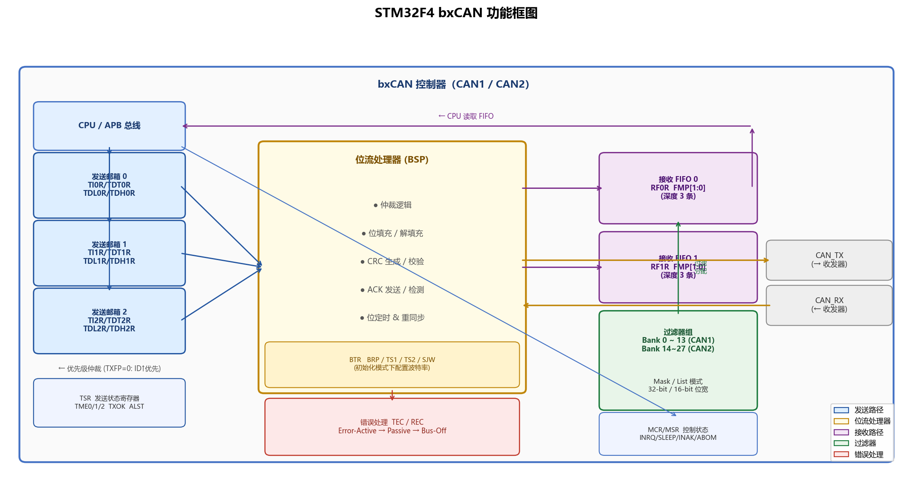

> 📸 **截图来源**：野火教程 `reference/pdf/chapters/Chapter_44_CAN—通讯实验.pdf`，或 STM32F4 参考手册 §24.4。框图展示了三个发送邮箱、两个接收 FIFO、14 组过滤器、位流处理器（BSP）和错误处理模块之间的数据通路。

框图的四条主要通路：

**发送通路**：CPU 向 **3 个发送邮箱（TxMailbox 0/1/2）** 写入帧数据和 ID；bxCAN 硬件按优先级（由 ID 大小或写入时间序决定，MCR.TXFP 配置）从邮箱取帧，经位流处理器（BSP）序列化后驱动 CAN_TX 引脚。发送成功后 TSR 中对应的 TXOK 置位。

**接收通路**：CAN_RX 引脚收到的串行位流经 BSP 还原为帧，先通过 **28 组过滤器（Filter Banks）** 筛选——匹配的帧进入指定的**接收 FIFO（FIFO0 或 FIFO1，各深 3 条报文）**；不匹配的帧直接丢弃。CPU 轮询 RF0R.FMP 或使用中断读取 FIFO 中的报文。

**错误处理**：BSP 硬件维护 TEC/REC，管理 Error Active / Passive / Bus-Off 状态机；错误事件可触发中断（CAN_SCE_IRQn）。

**位定时**：由 BTR 寄存器配置的 Prescaler/BS1/BS2/SJW 控制。

#### 工作模式

| 模式 | 进入条件 | 特点 |
|:---:|---|---|
| **初始化模式** | MCR.INRQ=1，等待 MSR.INAK=1 | **唯一可以写 BTR**；配置波特率、过滤器 |
| **正常模式** | MCR.INRQ=0，等待 MSR.INAK=0 | 正常收发，参与仲裁 |
| **睡眠模式** | MCR.SLEEP=1，等待 MSR.SLAK=1 | 降低功耗；总线活动可自动唤醒（AWUM=1）|
| **回环模式（测试）** | BTR.LBKM=1 | 发送的帧直接回到自身 FIFO，不影响总线，用于自测 |
| **静默模式（测试）** | BTR.SILM=1 | 只接收，不影响总线；用于总线监控 |

> ⚠️ BTR 寄存器**只能在初始化模式下写入**。忘了先置 INRQ 就写 BTR 是新手最常见的 Bug 之一，写完没效果，波特率乱掉，永远收不到帧。

#### 关键寄存器速查

##### MCR — 主控制寄存器

| 位 | 名称 | 说明 |
|:---:|:---:|---|
| 0 | **INRQ** | 初始化请求。1=进入初始化，0=退出 |
| 1 | **SLEEP** | 睡眠请求 |
| 2 | **TXFP** | 发送优先级。0=由 ID 决定（低 ID 先发），1=由 FIFO 顺序决定 |
| 4 | **NART** | 禁止自动重传。1=帧只发一次，不因仲裁失败或错误重试 |
| 6 | **ABOM** | 自动总线关闭管理。1=Bus-Off 后自动等待并恢复，无需软件干预 |

##### BTR — 位定时寄存器

| 位 | 名称 | 说明 |
|:---:|:---:|---|
| 9:0 | **BRP[9:0]** | 分频系数 − 1（Prescaler = BRP + 1）|
| 19:16 | **TS1[3:0]** | BS1 长度 − 1（BS1 = TS1 + 1 个 TQ）|
| 22:20 | **TS2[2:0]** | BS2 长度 − 1（BS2 = TS2 + 1 个 TQ）|
| 25:24 | **SJW[1:0]** | 重同步跳转宽度 − 1（SJW = SJW + 1 个 TQ）|
| 30 | **LBKM** | 回环模式使能 |
| 31 | **SILM** | 静默模式使能 |

##### TSR — 发送状态寄存器（只读）

| 位 | 名称 | 说明 |
|:---:|:---:|---|
| 0 | RQCP0 | 邮箱 0 请求完成（发送完成或中止）|
| 1 | TXOK0 | 邮箱 0 发送成功（帧被至少一个节点 ACK）|
| 2 | ALST0 | 邮箱 0 仲裁失败（不是错误，自动重传）|
| 26 | **TME0** | 邮箱 0 空闲，可写入新帧 |
| 27 | **TME1** | 邮箱 1 空闲 |
| 28 | **TME2** | 邮箱 2 空闲 |

##### 发送邮箱寄存器组（以邮箱 0 为例）

| 寄存器 | 关键字段 | 说明 |
|:---:|:---:|---|
| **TI0R** | STID[10:0] / EXID[28:0] / IDE / RTR / **TXRQ** | 帧 ID、类型；**写 TXRQ=1 触发发送** |
| **TDT0R** | DLC[3:0] / TGT / TIME[15:0] | 数据长度；TGT=1 时把时间戳写入 DATA 字节 7:6 |
| **TDL0R** | DATA0~DATA3 | 数据字节 0~3（DATA0 在 bit7:0）|
| **TDH0R** | DATA4~DATA7 | 数据字节 4~7 |

##### 接收 FIFO 状态寄存器（RF0R / RF1R）

| 位 | 名称 | 说明 |
|:---:|:---:|---|
| 1:0 | **FMP[1:0]** | FIFO 中等待读取的报文数（0~3）|
| 3 | FULL | FIFO 已满（3 条报文未读）|
| 4 | FOVR | 溢出（满时又收到新帧，最旧的帧被覆盖）|
| 5 | **RFOM** | 释放输出邮箱（写 1 后 FMP 减 1，CPU 通知硬件已读取）|

##### 接收邮箱寄存器（读 FIFO 当前最旧的帧）

| 寄存器 | 关键字段 | 说明 |
|:---:|:---:|---|
| **RI0R** | STID / EXID / IDE / RTR | 接收到的帧 ID 和类型 |
| **RDT0R** | DLC[3:0] / **FMI[7:0]** / TIME[15:0] | 数据长度；**FMI = 匹配的过滤器索引**（调试利器）|
| **RDL0R** | DATA0~DATA3 | 数据字节 0~3 |
| **RDH0R** | DATA4~DATA7 | 数据字节 4~7 |

#### 过滤器配置

过滤器是 bxCAN 的精华——它让硬件帮你筛选报文，CPU 只处理"感兴趣的"帧，完全不需要软件轮询判断 ID。

28 组过滤器（Filter Bank 0~27）可以灵活组合：

| 维度 | 选项 | 效果 |
|---|---|---|
| **模式（FM1R）** | **Mask 模式**：`(接收ID & Mask) == (FilterID & Mask)` | 一个 bank 匹配一类 ID（用通配符）|
| | **List 模式**：`接收ID == FilterID` | 精确匹配，每个 bank 最多放 4 个精确 ID（16-bit 模式）|
| **位宽（FS1R）** | **32-bit**：1 个完整 29-bit ID（扩展帧）| 一个 bank 一个过滤器（Mask/List 各 1 条）|
| | **16-bit**：11-bit ID（标准帧）| 一个 bank 两个过滤器（Mask/List 各 2 条）|
| **FIFO 分配（FFA1R）** | FIFO0 或 FIFO1 | 匹配的帧进入指定 FIFO |

**"接收所有帧"的全通过滤器（最简单的调试配置）**：

```c
CAN_FilterInitTypeDef f = {0};
f.CAN_FilterNumber         = 0;
f.CAN_FilterMode           = CAN_FilterMode_IdMask;   /* Mask 模式 */
f.CAN_FilterScale          = CAN_FilterScale_32bit;   /* 32-bit 位宽 */
f.CAN_FilterIdHigh         = 0x0000;                  /* FilterID = 0 */
f.CAN_FilterIdLow          = 0x0000;
f.CAN_FilterMaskIdHigh     = 0x0000;                  /* Mask = 0 → 所有位不关心 */
f.CAN_FilterMaskIdLow      = 0x0000;
f.CAN_FilterFIFOAssignment = CAN_Filter_FIFO0;
f.CAN_FilterActivation     = ENABLE;
CAN_FilterInit(&f);
```

**精确匹配 ID=0x101 的过滤器（32-bit List 模式）**：

```c
/* 标准帧 ID=0x101，STID 在 TIR 寄存器的 bit31:21 */
f.CAN_FilterMode      = CAN_FilterMode_IdList;
f.CAN_FilterScale     = CAN_FilterScale_32bit;
f.CAN_FilterIdHigh    = (0x101 << 5) & 0xFFFF;  /* ID 左移 5 位对齐到 TIR[31:21] */
f.CAN_FilterIdLow     = 0x0000;                  /* IDE=0（标准帧），RTR=0 */
f.CAN_FilterMaskIdHigh = 0x0000;                 /* List 模式下 Mask 寄存器是第二个 ID */
f.CAN_FilterMaskIdLow  = 0x0000;
```

> ⚠️ **ID 对齐是新手最容易犯的错误**：过滤器的 ID 字段对齐方式与 TIR 寄存器完全相同——标准帧 STID 在 bit31:21（左移 5 位），扩展帧 EXID 在 bit31:3（左移 3 位），IDE 在 bit2，RTR 在 bit1。搞错对齐，过滤器就完全不工作。

---

### 4.9 代码实战：CAN 收发

#### 工程文件组织

```
code/CAN_Loopback_Test/
├── CMakeLists.txt
├── CMakePresets.json
├── STM32F407XX_FLASH.ld
├── startup_stm32f407xx.s
├── Drivers/  (CMSIS + HAL)
├── Core/
│   ├── Inc/  main.h  stm32f4xx_hal_conf.h
│   └── Src/  main.c  stm32f4xx_it.c  stm32f4xx_hal_msp.c
└── Lib/
    ├── Inc/
    │   └── bsp_can.h
    └── Src/
        └── bsp_can.c
```

---

📄 **Lib/Inc/bsp_can.h** — 引脚定义、初始化/发送/接收函数声明

```c
#ifndef __BSP_CAN_H
#define __BSP_CAN_H

#include "stm32f4xx_hal.h"

/* 野火 F407 霸天虎：CAN1 使用 PD0(RX) / PD1(TX) */
#define CAN1_RX_PIN    GPIO_PIN_0
#define CAN1_TX_PIN    GPIO_PIN_1
#define CAN1_GPIO_PORT GPIOD
#define CAN1_GPIO_CLK  __HAL_RCC_GPIOD_CLK_ENABLE

extern CAN_HandleTypeDef hcan1;

HAL_StatusTypeDef BSP_CAN1_Init(uint32_t baud_prescaler,
                                uint32_t bs1, uint32_t bs2);
HAL_StatusTypeDef BSP_CAN1_FilterAllPass(void);
HAL_StatusTypeDef BSP_CAN1_Send(uint32_t id, uint8_t *data, uint8_t len);
HAL_StatusTypeDef BSP_CAN1_Recv(uint32_t *id, uint8_t *data, uint8_t *len);

#endif /* __BSP_CAN_H */
```

---

📄 **Lib/Src/bsp_can.c** — 外设初始化 + 收发实现

```c
#include "bsp_can.h"

CAN_HandleTypeDef hcan1;

/* ─────────────────────────────────────────────
 * BSP_CAN1_Init
 *   baud_prescaler : BTR.BRP 的值（Prescaler - 1）
 *   bs1            : BS1 的 TQ 数（TS1 + 1）
 *   bs2            : BS2 的 TQ 数（TS2 + 1）
 *
 * 500kbps 示例（APB1=42MHz）：
 *   Prescaler=6, BS1=11, BS2=2 → baud_prescaler=5, bs1=10, bs2=1
 * ───────────────────────────────────────────── */
HAL_StatusTypeDef BSP_CAN1_Init(uint32_t baud_prescaler,
                                uint32_t bs1, uint32_t bs2)
{
    /* 1. GPIO 时钟 + 复用功能配置 */
    CAN1_GPIO_CLK();
    __HAL_RCC_CAN1_CLK_ENABLE();

    GPIO_InitTypeDef gpio = {0};
    gpio.Pin       = CAN1_RX_PIN | CAN1_TX_PIN;
    gpio.Mode      = GPIO_MODE_AF_PP;         /* 推挽复用，收发器驱动差分线 */
    gpio.Pull      = GPIO_NOPULL;
    gpio.Speed     = GPIO_SPEED_FREQ_HIGH;
    gpio.Alternate = GPIO_AF9_CAN1;           /* PD0/PD1 的 AF9 = CAN1 */
    HAL_GPIO_Init(CAN1_GPIO_PORT, &gpio);

    /* 2. bxCAN 基本参数（必须在初始化模式下，HAL 会自动进入再退出）*/
    hcan1.Instance                  = CAN1;
    hcan1.Init.Prescaler            = baud_prescaler + 1; /* HAL 传完整值 */
    hcan1.Init.Mode                 = CAN_MODE_NORMAL;    /* 正常模式；回环测试改为 CAN_MODE_LOOPBACK */
    hcan1.Init.SyncJumpWidth        = CAN_SJW_1TQ;
    hcan1.Init.TimeSeg1             = bs1;                /* 传 CAN_BS1_xTQ 宏 */
    hcan1.Init.TimeSeg2             = bs2;                /* 传 CAN_BS2_xTQ 宏 */
    hcan1.Init.TimeTriggeredMode    = DISABLE;
    hcan1.Init.AutoBusOff           = ENABLE;             /* Bus-Off 后自动恢复 */
    hcan1.Init.AutoWakeUp           = DISABLE;
    hcan1.Init.AutoRetransmission   = ENABLE;             /* 仲裁失败自动重传 */
    hcan1.Init.ReceiveFifoLocked    = DISABLE;            /* FIFO 满时新帧覆盖旧帧 */
    hcan1.Init.TransmitFifoPriority = DISABLE;            /* 按 ID 优先级发送 */

    return HAL_CAN_Init(&hcan1);
}

/* ─────────────────────────────────────────────
 * BSP_CAN1_FilterAllPass
 *   配置过滤器 0 为全通（32-bit Mask，Mask=0）
 *   所有标准帧/扩展帧均进入 FIFO0
 * ───────────────────────────────────────────── */
HAL_StatusTypeDef BSP_CAN1_FilterAllPass(void)
{
    CAN_FilterTypeDef f = {0};
    f.FilterBank           = 0;
    f.FilterMode           = CAN_FILTERMODE_IDMASK;
    f.FilterScale          = CAN_FILTERSCALE_32BIT;
    f.FilterIdHigh         = 0x0000;
    f.FilterIdLow          = 0x0000;
    f.FilterMaskIdHigh     = 0x0000;  /* Mask=0 → 所有位不关心，全部通过 */
    f.FilterMaskIdLow      = 0x0000;
    f.FilterFIFOAssignment = CAN_RX_FIFO0;
    f.FilterActivation     = ENABLE;
    f.SlaveStartFilterBank = 14;      /* CAN1 使用 bank 0~13，CAN2 使用 14~27 */
    return HAL_CAN_ConfigFilter(&hcan1, &f);
}

/* ─────────────────────────────────────────────
 * BSP_CAN1_Send
 *   id  : 11-bit 标准帧 ID
 *   data: 数据缓冲区
 *   len : 数据长度（0~8）
 * ───────────────────────────────────────────── */
HAL_StatusTypeDef BSP_CAN1_Send(uint32_t id, uint8_t *data, uint8_t len)
{
    CAN_TxHeaderTypeDef hdr = {0};
    hdr.StdId               = id;
    hdr.ExtId               = 0;
    hdr.IDE                 = CAN_ID_STD;     /* 标准帧（11-bit ID）*/
    hdr.RTR                 = CAN_RTR_DATA;   /* 数据帧（不是远程帧）*/
    hdr.DLC                 = len;
    hdr.TransmitGlobalTime  = DISABLE;

    uint32_t mailbox;  /* HAL 返回实际使用的邮箱编号 */

    /* 等待至少有一个邮箱空闲 */
    uint32_t timeout = 10;  /* ms */
    while (!HAL_CAN_GetTxMailboxesFreeLevel(&hcan1) && timeout--)
        HAL_Delay(1);
    if (!timeout) return HAL_TIMEOUT;

    return HAL_CAN_AddTxMessage(&hcan1, &hdr, data, &mailbox);
}

/* ─────────────────────────────────────────────
 * BSP_CAN1_Recv
 *   轮询方式从 FIFO0 读取一帧
 *   id  : 接收到的帧 ID（输出）
 *   data: 数据缓冲区（调用方提供，至少 8 字节）
 *   len : 实际数据长度（输出）
 * ───────────────────────────────────────────── */
HAL_StatusTypeDef BSP_CAN1_Recv(uint32_t *id, uint8_t *data, uint8_t *len)
{
    if (!HAL_CAN_GetRxFifoFillLevel(&hcan1, CAN_RX_FIFO0))
        return HAL_ERROR;  /* FIFO 为空，没有新帧 */

    CAN_RxHeaderTypeDef hdr;
    HAL_StatusTypeDef ret = HAL_CAN_GetRxMessage(&hcan1, CAN_RX_FIFO0, &hdr, data);
    if (ret == HAL_OK) {
        *id  = (hdr.IDE == CAN_ID_STD) ? hdr.StdId : hdr.ExtId;
        *len = hdr.DLC;
    }
    return ret;
}
```

---

📄 **Core/Src/main.c** — 初始化 + 回环自测

```c
#include "main.h"
#include "bsp_can.h"
#include "bsp_debug_usart.h"
#include <string.h>
#include <stdio.h>

int main(void)
{
    HAL_Init();
    SystemClock_Config();   /* SYSCLK=168MHz, APB1=42MHz */
    BSP_USART_Init(115200);

    printf("===== CAN1 Loopback Test =====\r\n");

    /* 初始化 CAN1，500 kbps（APB1=42MHz，Prescaler=6，BS1=11TQ，BS2=2TQ）*/
    if (BSP_CAN1_Init(5,          /* baud_prescaler = Prescaler-1 = 5 */
                      CAN_BS1_11TQ,
                      CAN_BS2_2TQ) != HAL_OK) {
        printf("CAN1 Init FAILED\r\n");
        while (1);
    }

    /* 开回环模式做自测（不接收发器也能验证逻辑）*/
    hcan1.Init.Mode = CAN_MODE_LOOPBACK;
    HAL_CAN_Init(&hcan1);   /* 重新 init 以应用回环模式 */

    BSP_CAN1_FilterAllPass();
    HAL_CAN_Start(&hcan1);  /* 退出初始化，进入正常/回环模式 */

    uint8_t tx_data[8] = {0xDE, 0xAD, 0xBE, 0xEF, 0x12, 0x34, 0x56, 0x78};
    uint8_t rx_data[8] = {0};
    uint32_t rx_id;
    uint8_t  rx_len;

    /* 发送 */
    if (BSP_CAN1_Send(0x101, tx_data, 8) != HAL_OK) {
        printf("CAN1 Send FAILED\r\n");
        while (1);
    }
    printf("Sent    ID=0x%03lX  data: %02X %02X %02X %02X %02X %02X %02X %02X\r\n",
           (unsigned long)0x101,
           tx_data[0], tx_data[1], tx_data[2], tx_data[3],
           tx_data[4], tx_data[5], tx_data[6], tx_data[7]);

    /* 等待回环帧进入 FIFO */
    HAL_Delay(5);

    /* 接收 */
    if (BSP_CAN1_Recv(&rx_id, rx_data, &rx_len) != HAL_OK) {
        printf("CAN1 Recv FAILED (FIFO empty)\r\n");
        while (1);
    }
    printf("Recv    ID=0x%03lX  data: %02X %02X %02X %02X %02X %02X %02X %02X\r\n",
           (unsigned long)rx_id,
           rx_data[0], rx_data[1], rx_data[2], rx_data[3],
           rx_data[4], rx_data[5], rx_data[6], rx_data[7]);

    /* 验证 */
    if (rx_id == 0x101 && memcmp(tx_data, rx_data, 8) == 0)
        printf("Verify: [PASS]\r\n");
    else
        printf("Verify: [FAIL]\r\n");

    while (1);
}
```

**预期串口输出：**

```
===== CAN1 Loopback Test =====
Sent    ID=0x101  data: DE AD BE EF 12 34 56 78
Recv    ID=0x101  data: DE AD BE EF 12 34 56 78
Verify: [PASS]
```

> ⚠️ **常见问题排查**
> - **CAN Init FAILED**：检查 APB1 时钟是否是 42 MHz（`SystemClock_Config` 有没有正确配置 HCLK/APB 分频）；BTR 写入前确保进入了初始化模式（HAL 自动处理，但如果手动操作寄存器需要等 INAK=1）。
> - **Send 成功但 Recv FIFO 为空**（正常模式，非回环）：没有连接收发器芯片（TJA1050 等），或者总线上没有第二个节点进行 ACK——CAN 不允许"无人应答"的帧，发送方会触发 ACK Error，帧被标记发送失败。
> - **过滤器没匹配到帧**：检查 ID 对齐（`FilterIdHigh = (ID << 5) & 0xFFFF`）；确认 `SlaveStartFilterBank = 14`（CAN1 使用 bank 0~13）；确认过滤器组已通过 `FAxR` 激活。
> - **Bus-Off 恢复不了**：MCR.ABOM = 1 时可以自动恢复（等待 128×11 个隐性位），但需要先 `HAL_CAN_Stop()` 再 `HAL_CAN_Start()` 触发恢复序列。

> 🎓 **小结**：CAN 和 I²C 有着深刻的相似性——都用线与实现逐位仲裁，都是多主总线。区别在于：
> 1. **物理层**（§2.3）：CAN 用差分信号对抗噪声，I²C 用开漏单端
> 2. **寻址模型**（§2.4）：CAN 是内容寻址（广播 ID），I²C 是设备地址（点对点）
> 3. **同步机制**（§2.5）：CAN 帧内自同步（位定时 + SJW），I²C 有独立 SCL
> 4. **错误处理**（§2.7）：CAN 有完整的故障遏制状态机（TEC/REC → Bus-Off），I²C 只靠 NACK
> 5. **距离/速率**：CAN 以速率换距离（1Mbps@40m ~ 5kbps@10km），I²C 是板级短距协议
