# Chapter 4 玩转总线：DMA和FSMC

回顾一下我们到目前为止学了什么：

- **Chapter 1** 讲的是"怎么跟芯片打交道"。我们从寄存器开始，搞清楚了 STM32 的总线矩阵、统一内存架构和 GPIO，最后用寄存器和 HAL 两种方式点亮了 LED。核心收获：**MCU 里一切操作归结于往地址写数据**。
- **Chapter 2** 讲的是"芯片自己怎么管自己"。中断让 CPU 可以被打断去处理紧急事务，定时器让 CPU 可以精确计时和产生 PWM，看门狗在程序跑飞时拉一把。核心收获：**硬件外设可以独立于 CPU 运行，CPU 只需要配置和响应**。
- **Chapter 3** 讲的是"芯片之间怎么通信"。UART、SPI、I²C、CAN 四种协议从约束推导设计，每种都走了"协议层→外设层→代码层"三轮。核心收获：**协议的本质是一套时序规则，STM32 有硬件外设帮你自动产生这些时序**。

那现在有什么问题？

**第一个问题：CPU 太忙了。** Chapter 3 里你应该已经感觉到了——UART 发 1000 字节要循环等 TXE 一千次，SPI 读 4KB Flash 要调 `ExchangeByte()` 四千多次，就算改成中断方式也是每个字节进出一次 ISR。数据量一大，CPU 全部时间都在搬数据，正经事（控制、计算、状态机）反而没空做。

**第二个问题：内存太小了。** STM32F407 片内 SRAM 只有 192KB。你现在觉得够用，是因为我们还没做过真正吃内存的事情——LCD 显示缓冲一帧就要 261KB（480×272×2），音频流更不用说。

Chapter 4 解决这两个问题。关键思路其实在 Chapter 1 就埋下了——还记得总线矩阵图吗？CPU 不是唯一的主设备，DMA 控制器和 CPU 并排站在总线矩阵的主设备侧。而 FSMC 站在从设备侧最右边，它把外部存储器映射到内部地址空间，让 CPU 用指针就能访问外挂的 SRAM。

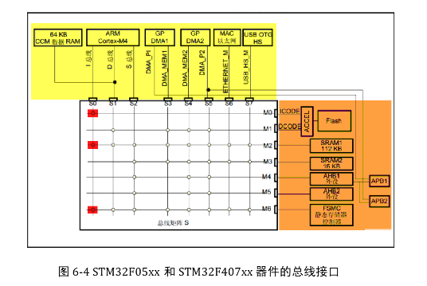

- **DMA**（§1）：给 CPU 请一个专业搬运工。你告诉它从哪搬、搬到哪、搬多少，它就自己干活去了，搬完拍一下 CPU 的肩膀（中断）。CPU 该算算法算算法，该跑状态机跑状态机。
- **FSMC**（§2）：给芯片外接一块 SRAM，FSMC 把它的地址空间直接映射到 0x60000000 开始的区域。代码里写 `*((uint16_t*)0x6C000000) = 0x1234`，FSMC 硬件自动把这个写操作翻译成外部 SRAM 能理解的信号时序——和 Chapter 1 讲的"往地址写数据"是同一件事，只不过这次地址指向了芯片外面。

---

## 0 本章节目录

- [**§1 DMA——给 CPU 请个搬运工**](#1-dma给-cpu-请个搬运工)
  - [1.1 为什么需要 DMA？](#11-为什么需要-dma)（CPU 搬运的代价 · 中断也救不了 · DMA 的核心承诺）
  - [1.2 DMA 的工作模型](#12-dma-的工作模型)（搬运三要素 · 三种传输方向 · 循环/单次 · 直接模式与 FIFO）
  - [1.3 STM32 的 DMA 外设](#13-stm32-的-dma-外设)（框图拆解 · DMA1 vs DMA2 · 数据流/通道/仲裁 · 请求映射表 · 突发传输 · 双缓冲 · 中断）
  - [1.4 代码实战：DMA + UART 发送](#14-代码实战dma--uart-发送)（CubeMX 配置 · HAL 代码 · 对比轮询/中断/DMA 三种方式）
- [**§2 FSMC——把外部存储器变成"内存"**](#2-fsmc把外部存储器变成内存)
  - [2.1 为什么需要扩展存储？](#21-为什么需要扩展存储)（片内 SRAM 不够的场景 · 能不能直接用 SPI Flash？）
  - [2.2 SRAM 芯片原理](#22-sram-芯片原理)（信号线 · 存储矩阵 · 读写时序 · 关键时间参数）
  - [2.3 STM32 的 FSMC 外设](#23-stm32-的-fsmc-外设)（地址映射与 Bank · 模式 A 时序参数 · 寄存器 · FSMC vs FMC）
  - [2.4 代码实战：外部 SRAM 读写测试](#24-代码实战外部-sram-读写测试)（GPIO 复用 · 时序配置 · 指针直接读写 · 校验）

---

## 1 DMA——给 CPU 请个搬运工

### 1.1 为什么需要 DMA？

回想一下 Chapter 3 的代码，有没有觉得哪里不太舒服？

**痛点一：轮询发送，CPU 空转。** UART 发 1000 字节，`HAL_UART_Transmit()` 内部就是一个大循环：等 TXE → 写 DR → 等 TXE → 写 DR… 1000 次。在 115200 baud 下，发完大约要 87ms。这 87ms 里 CPU 什么正经事都干不了——就在 while 循环里空转等寄存器标志位。SPI 读 Flash 更夸张：4KB 数据要调 `HAL_SPI_TransmitReceive()` 循环 4096 次，每次都是"写一个字节 → 等 RXNE → 读一个字节"。

**痛点二：中断方式好一些，但也有开销。** 改成中断发送后，CPU 不用死等了——每来一个 TXE 中断就往 DR 写一个字节。问题是，发 1000 字节就要进出 ISR 1000 次。每次进 ISR 的开销：压栈（至少 8 个寄存器）、取向量、执行 ISR 体、弹栈恢复——Cortex-M4 上这套流程至少 12 个时钟周期。1000 次就是 12000 个周期，加上流水线冲刷和缓存失效，实际更多。对于高波特率或多外设并发的场景，ISR 开销会吃掉相当多的 CPU 时间。

**痛点三：ADC 连续采集，数据来不及搬。** ADC 在连续模式下每次转换完毕就把结果塞进 DR。如果你不及时读走，下一次转换的结果会直接覆盖。CPU 又不可能 7×24 小时盯着 ADC。

三个痛点的共同本质是一件事：**CPU 不应该做"搬运工"**。搬数据这种事，既不需要计算，也不需要判断——就是从地址 A 读一个值，写到地址 B，重复 N 次。让一个 168MHz 的 Cortex-M4 不停干这个，和请博士生搬砖没什么区别。

我们做个量化对比，看看三种方式发送同样 1000 字节的差距：

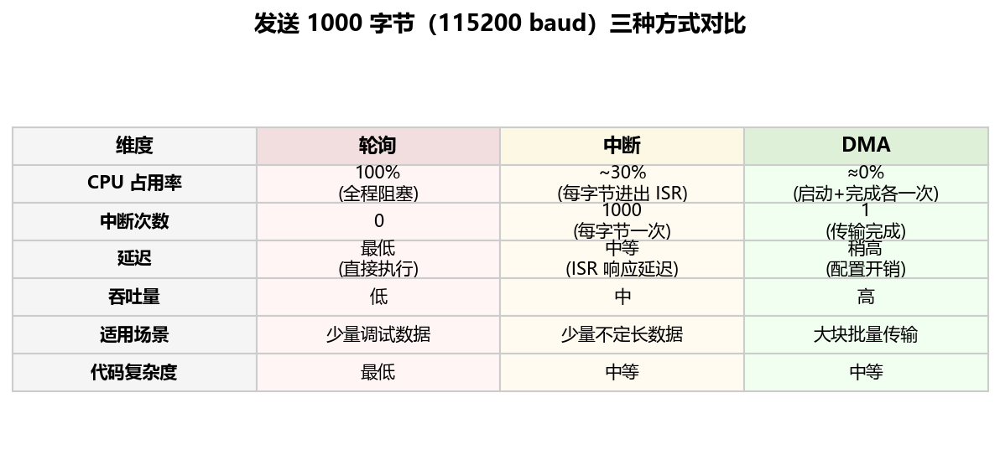

数据很直观：

- ✅ **轮询**适合调试时发几个字节，简单省事
- ✅ **中断**适合少量不定长数据（比如接收不知道什么时候来的命令），CPU 可以做别的事
- ✅ **DMA** 适合大块批量传输：CPU 只在开头配置一次、结束收到一次中断，中间完全自由

💡 DMA 的核心承诺：**你告诉我从哪搬、搬到哪、搬多少，我自己搬，搬完叫你**。CPU 该算算法算算法，该跑状态机跑状态机。

那 DMA 到底是什么？这不是一个软件概念——它是一块**实打实的硬件**，和 CPU 一样挂在总线矩阵的主设备侧（还记得 Chapter 1 那张总线矩阵图吗？DMA1、DMA2 和 CPU 并排站着）。它有自己的地址、计数器和状态机，能独立发起总线读写事务。下一节我们来看它具体怎么工作。

### 1.2 DMA 的工作模型

这一节我们不聊具体芯片的寄存器，先用"搬运工"类比把 DMA 的通用概念讲透。搞清楚这些概念，后面看寄存器就只是"把概念映射到位域"而已。

#### 搬运三要素

任何一次 DMA 传输都要回答三个问题：

1. **从哪搬**（源地址 Source Address）
2. **搬到哪**（目标地址 Destination Address）
3. **搬多少**（传输计数 NDTR）

DMA 控制器内部有一个倒计数器（NDTR），你填多少它就搬多少次。每搬一个数据单元（字节 / 半字 / 字），NDTR 自动减 1。减到 0 就表示搬完了——此时可以产生一个"传输完成"中断（TC Interrupt），通知 CPU 来处理后续逻辑。

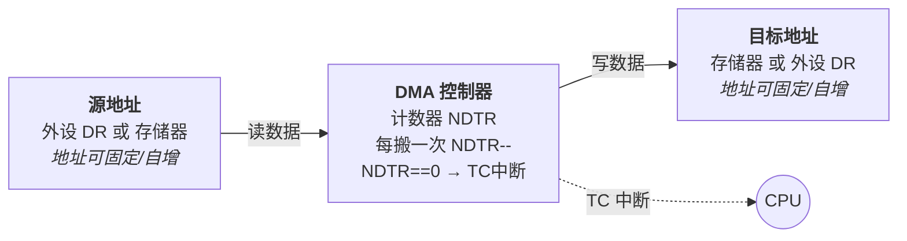

还有两个配套选项：

- **地址自增**：源地址和目标地址各自可以选择"固定"或"自增"。比如从存储器搬到 UART DR：存储器侧地址要自增（逐个字节搬过去），UART DR 侧地址要固定（永远写同一个寄存器）。
- **数据宽度**：每次搬 8 位（字节）、16 位（半字）还是 32 位（字）？要和外设数据寄存器的宽度匹配。

#### 三种传输方向

DMA 支持三种搬运方向，覆盖了所有常见场景：

| 方向 | 典型场景 | 举例 |
|------|---------|------|
| 外设 → 存储器 | 数据采集 | ADC DR → RAM 缓冲区，UART RX → 接收 buffer |
| 存储器 → 外设 | 数据发送 | RAM 字符串 → UART DR，音频 buffer → I2S DR |
| 存储器 → 存储器 | 内存拷贝 | 相当于硬件版 `memcpy()`，速度比 CPU 拷贝快 |

⚠️ 注意：并非所有 DMA 控制器都支持 M2M（存储器→存储器），这取决于具体芯片的总线连接方式，后面 §1.3 会讲。

#### 单次模式 vs 循环模式

- **单次模式（Normal）**：NDTR 减到 0 就停，EN 位自动清零。适合"发送一包数据"这种一锤子买卖。
- **循环模式（Circular）**：NDTR 减到 0 时自动重装初始值，然后接着搬。适合"ADC 连续采集写入双 buffer"这种需要不停搬的场景——DMA 会像一个陀螺一样一直转，CPU 通过"半传输完成"中断知道前半段已经可以处理了。

#### 直接模式 vs FIFO 模式

这是理解 STM32 DMA 的一个重要区分。简单来说：直接模式是"水管直通"，FIFO 模式是"蓄水池攒一波再放"。

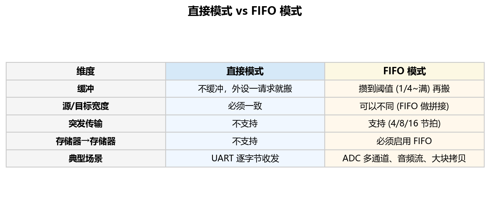

💡 **怎么选？** 大部分简单场景用直接模式就够了（比如 UART 一个字节一个字节收发）。FIFO 主要用在两种场景：需要**源和目标宽度不一致**（比如外设 8 位，存储器 32 位打包），或者需要**突发传输**减少总线仲裁开销。

**突发传输（Burst）** 是 FIFO 模式的进阶玩法：DMA 不是搬一个就释放总线，而是一口气连搬 4/8/16 个节拍（beat），中间不允许其他主设备插队。好处是效率高，坏处是霸占总线时间变长。要让突发传输正常工作，FIFO 里必须攒够对应的数据量。

### 1.3 STM32 的 DMA 外设

概念讲完了，现在打开 STM32F407 的 DMA 框图，逐块拆解。方法和 Chapter 3 讲 USART、SPI 框图一样：先看全貌，再一小块一小块啃。

#### 全局结构：两个控制器，各 8 条数据流

STM32F407 有两个独立的 DMA 控制器：DMA1 和 DMA2。每个控制器内部有 **8 条数据流（Stream 0~7）**，每条数据流可以从 **8 个通道（Channel 0~7）** 中选一个来响应外设请求。

两个控制器最大的区别在总线连接方式：

- **DMA1**：只有一个外设端口，连的是 APB1。这意味着 DMA1 只能处理 APB1 总线上的外设（I2C、SPI2/3、USART2/3/4/5、TIM2~7 等），并且**不能做 M2M 传输**——因为 M2M 需要同时访问两个存储器地址，但 DMA1 只有一个端口。
- **DMA2**：有两个端口（外设端口 + 存储器端口），都接在 AHB 总线矩阵上。所以 DMA2 既能处理 APB1/APB2 外设（USART1/6、SPI1/4/5、ADC、SDIO、DCMI 等），**也能做 M2M 传输**。

回忆一下 Chapter 1 的总线矩阵图——DMA1、DMA2 和 CPU 并列在主设备侧，它们可以独立发起总线读写事务，这就是 DMA 能"替 CPU 搬数据"的硬件基础。

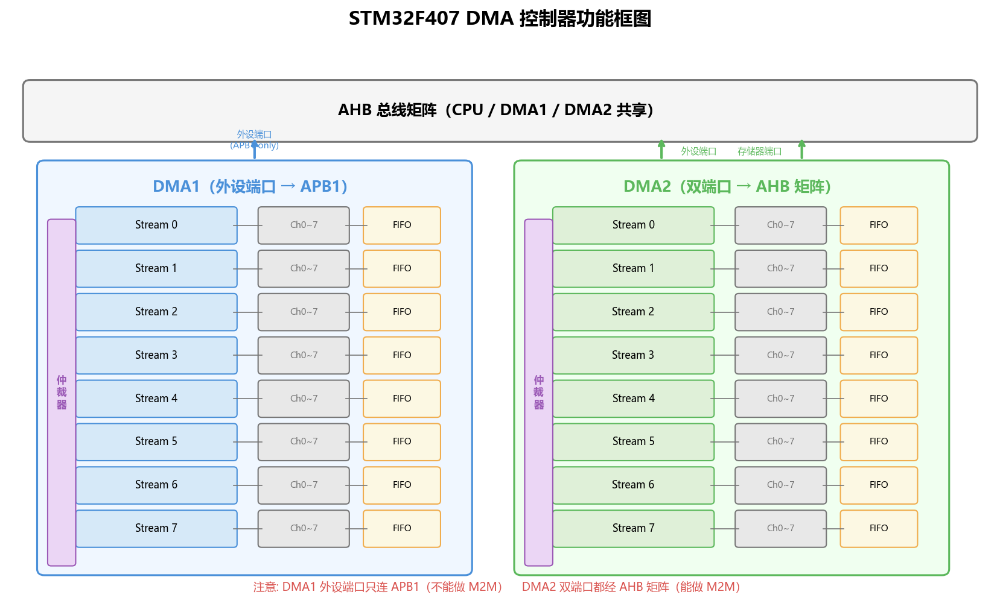

#### 通道选择：一条流同时只服务一个外设

每条数据流通过 `DMA_SxCR` 寄存器的 `CHSEL[2:0]` 位域选择绑定哪个通道（0~7）。通道号决定了这条流响应哪个外设的 DMA 请求。

💡 **关键认知**：通道选择是"静态绑定"——你配置好之后就固定了，不会在运行时动态切换。一条数据流在同一时刻只能服务一个外设。如果两个外设映射到同一条流的不同通道，你只能选其中一个，另一个得找别的流。

#### 仲裁器：谁先搬？

如果多条数据流同时有请求要处理，仲裁器决定谁先上。规则分两级：

1. **软件优先级**（`DMA_SxCR` 的 `PL[1:0]`）：Very High > High > Medium > Low
2. **硬件编号**：软件优先级相同时，流号小的优先（Stream 0 > Stream 1 > … > Stream 7）

#### FIFO

每条数据流都有一个独立的 **4 级 × 32 位 FIFO**（共 16 字节容量）。FIFO 阈值可以设置为 1/4、1/2、3/4 或满。达到阈值后 FIFO 将数据一次性推送到目标端——这就是上一节讲的 FIFO 模式。

#### DMA 请求映射表

这是配置 DMA 时最常查的一张表。每个外设的 DMA 请求绑定在特定控制器的特定数据流的特定通道上，不能随便选。

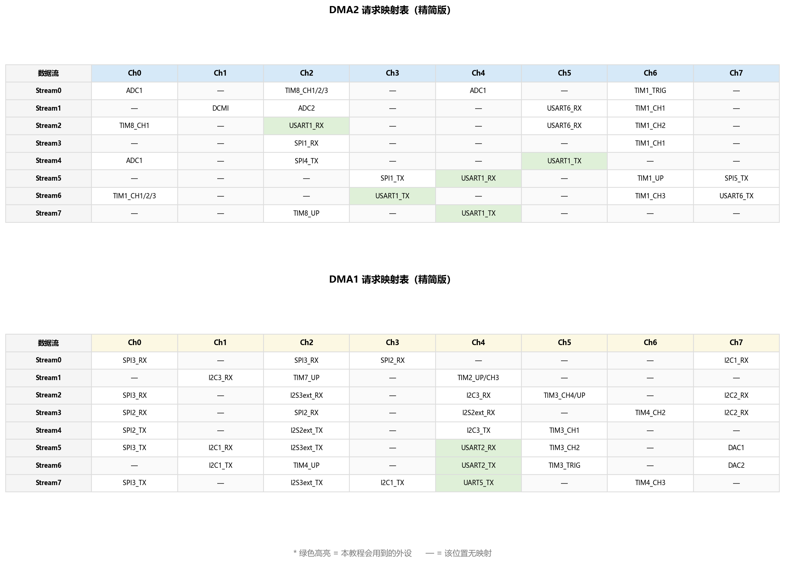

举个例子：我们后面要用 **USART1 TX** 做 DMA 发送。查表可知 USART1_TX 在 DMA2 上有三个可选位置：
- DMA2 Stream4 Channel4
- DMA2 Stream6 Channel3  
- DMA2 Stream7 Channel4

选哪个都行，只要你选的那条流没被其他外设占用就好。我们后面实战选 **DMA2 Stream7 Channel4**。

#### 关键寄存器速查

| 寄存器 | 关键位域 | 功能 |
|--------|---------|------|
| `DMA_SxCR` | EN, CHSEL[2:0], DIR[1:0], CIRC, MINC, PINC, MSIZE, PSIZE, PL[1:0] | 数据流配置（通道选择/方向/循环/自增/宽度/优先级） |
| `DMA_SxNDTR` | NDT[15:0] | 待传输数据计数（16 位，最大 65535） |
| `DMA_SxPAR` | PA[31:0] | 外设地址 |
| `DMA_SxM0AR` | M0A[31:0] | 存储器 0 地址 |
| `DMA_SxM1AR` | M1A[31:0] | 存储器 1 地址（双缓冲模式用） |
| `DMA_SxFCR` | DMDIS, FTH[1:0] | FIFO 控制（禁用直接模式 / 阈值选择） |
| `DMA_LISR/HISR` | TCIFx, HTIFx, TEIFx, FEIFx | 中断状态标志（传输完成/半完成/错误/FIFO错误） |

#### DMA 传输完整流程

把上面所有知识点串起来，一次 DMA 传输的完整流程如下图所示：

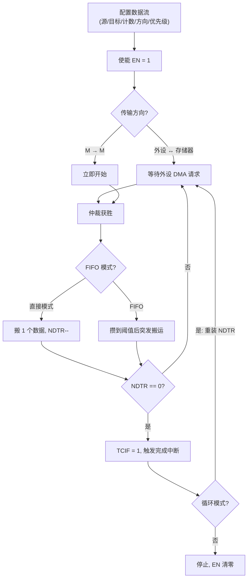

⚠️ **陷阱提醒**：
- DMA1 不能做 M2M（存储器→存储器），因为它外设端口没接总线矩阵
- 修改数据流配置前，必须先关闭 EN（写 0），等 EN 读回 0 再改
- NDTR 最大 65535，超过这个量的传输需要分批或用循环模式 + 中断衔接

### 1.4 代码实战：DMA + UART 发送

概念和外设都讲完了，来写代码。场景很简单：**用 DMA 把 RAM 里的字符串通过 USART1 发出去**，和 Chapter 3 的 UART 实验形成对比。

#### 第一步：查映射表，确定数据流

目标外设是 USART1 TX。翻到上面的映射表，USART1_TX 在 DMA2 上有三个可选：
- DMA2 Stream4 Channel4
- DMA2 Stream6 Channel3
- DMA2 Stream7 Channel4

我们选 **DMA2 Stream7 Channel4**（常规选择，HAL 库默认也用这个）。

#### 第二步：CubeMX 配置

在 CubeMX 里的配置很直接：

1. **USART1**：和 Chapter 3 一样，PA9(TX) / PA10(RX)，115200-8N1
2. **DMA**：在 USART1 配置页找到 DMA Settings → Add → USART1_TX → DMA2 Stream7
   - Direction: Memory to Peripheral
   - Mode: Normal（发一次就停）
   - Data Width: Byte（UART DR 是 8 位的）
   - Memory Increment: Enable（字符串每个字符地址依次递增）
   - Peripheral Increment: Disable（UART DR 地址固定）
3. **NVIC**：使能 DMA2 Stream7 全局中断（HAL 需要用 TC 中断来更新状态）

#### 第三步：HAL 代码

生成代码后，核心就一行：

```c
// main.c 中
uint8_t tx_buf[] = "Hello DMA! STM32F407 says hi.\r\n";

int main(void)
{
    HAL_Init();
    SystemClock_Config();
    MX_GPIO_Init();
    MX_DMA_Init();       // 注意：DMA 初始化必须在 USART 之前！
    MX_USART1_UART_Init();

    while (1)
    {
        // 一行搞定：把 tx_buf 通过 DMA 发出去
        HAL_UART_Transmit_DMA(&huart1, tx_buf, sizeof(tx_buf) - 1);
        HAL_Delay(1000);  // 每秒发一次
    }
}
```

⚠️ **顺序陷阱**：`MX_DMA_Init()` 必须在 `MX_USART1_UART_Init()` 之前调用！因为 USART 初始化时会关联 DMA handle，如果 DMA 还没初始化，关联的就是垃圾值。CubeMX 生成的代码默认就是正确顺序，但如果你手动调整过 `main()` 里的初始化顺序，就可能踩坑。

发送完成后，HAL 会自动调用回调函数：

```c
// 可以在 main.c 中重写这个弱函数
void HAL_UART_TxCpltCallback(UART_HandleTypeDef *huart)
{
    if (huart->Instance == USART1)
    {
        // DMA 发送完成，可以在这里做后续处理
        // 比如翻转一个 LED 表示"发完了"
        HAL_GPIO_TogglePin(GPIOF, GPIO_PIN_10);
    }
}
```

💡 **关键认知**：`HAL_UART_Transmit_DMA()` 是**非阻塞**的。调用后立刻返回，CPU 继续执行后面的代码，DMA 在后台自动搬数据。数据搬完后通过中断调用回调函数。

⚠️ **缓冲区陷阱**：DMA 传输期间**不能修改 `tx_buf` 的内容**！DMA 是从 RAM 地址直接读的，如果你在它还没搬完的时候改了 buffer，搬到一半的数据就是脏的。要修改 buffer，必须等上一次传输完成（回调触发后）。

#### 三种方式的时序对比

下面这张图直观展示了发送同样 1000 字节时，轮询、中断、DMA 三种方式下 CPU 的工作状态差异：

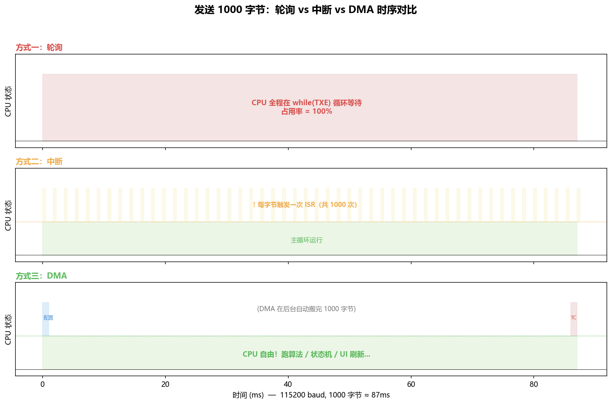

DMA 方式下，CPU 只在最开始（配置+启动）和最后（TC 中断回调）各忙了一小会儿，中间 87ms 全是自由的。这 87ms 你可以跑 PID 控制算法、刷新 LCD、处理按键状态机——而不是在 while 循环里干等一个寄存器标志位。

💡 DMA 不是"让数据传输更快"——波特率 115200 是硬限制，不管用什么方式发，1000 字节都要 87ms 才能从 TX 线上发完。DMA 的价值是**让 CPU 在这 87ms 里去做别的事**。

完整的工程代码在 [code/DMA_UART_TX/](code/DMA_UART_TX/) 目录下。

> 🎓 **小结**：DMA 部分三个层次：
> 1. **概念层**（§1.1~§1.2）：CPU 搬运的代价 → DMA 搬运三要素 → 直接/FIFO/循环/双缓冲等工作模式
> 2. **外设层**（§1.3）：STM32 双 DMA 控制器、数据流/通道/仲裁、请求映射表、寄存器
> 3. **代码层**（§1.4）：HAL_UART_Transmit_DMA() 实战 + 三种发送方式对比

---

## 2 FSMC——把外部存储器变成"内存"

### 2.1 为什么需要扩展存储？

先看一下 STM32F407 片内有多少存储资源：

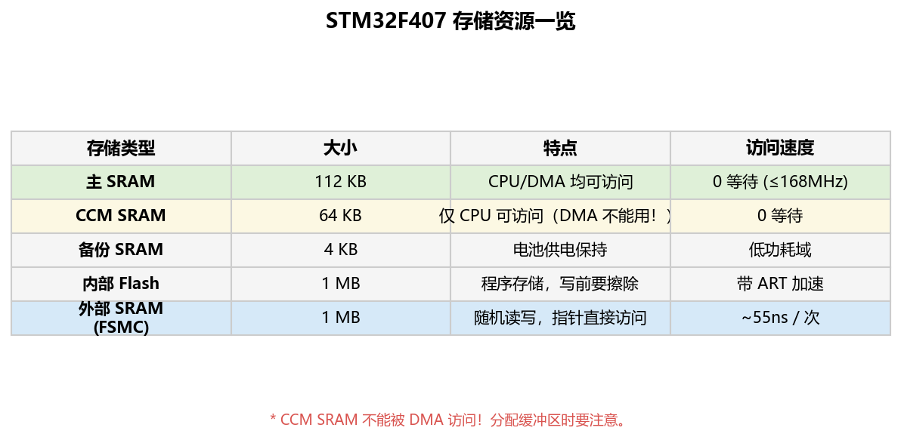

加起来挺多的——192KB SRAM + 1MB Flash。但仔细一看，能用来存运行时数据的 SRAM 只有 112KB + 64KB。而 CCM SRAM 那 64KB 还有个大坑：**DMA 不能访问它**！如果你把 DMA 缓冲区分配到 CCM 里，DMA 搬运时会直接总线错误（Bus Fault）。所以实际上能被 DMA 安全使用的 SRAM 只有 112KB。

这 112KB 够用吗？看几个真实场景：

**场景一：LCD 显示缓冲。** 一块 480×272 的 TFT 屏，每个像素 RGB565 格式（2 字节），一帧需要 480 × 272 × 2 = 261,120 字节 ≈ **255KB**。片内 SRAM 连一帧都放不下，更别提双缓冲（防撕裂需要两个缓冲区）。

**场景二：音频缓冲。** CD 音质音频 44.1kHz × 16bit × 2 通道，每秒产生 176KB 数据。你至少要有几百 ms 的缓冲来应对 SD 卡读取抖动。

**场景三：数据采集日志。** ADC 8 通道同时采集，12bit 分辨率，采样率 1MHz，每秒产生 16MB 数据。即便降频到 10kHz，每秒也有 160KB 需要暂存。

好，那能不能用 Chapter 3 里学的 **SPI Flash**（比如 W25Q128）当临时内存？不行，原因有二：
1. **Flash 写前必须擦除**：NOR Flash 的擦除以块（4KB~64KB）为单位，擦除时间几十毫秒。你不能像 RAM 一样随时改一个字节。
2. **延迟太高**：每次读 SPI Flash 都要发送命令序列（指令 + 地址 + 若干 dummy 字节），走完这套才能拿到数据。用来临时存放需要频繁随机读写的数据，延迟完全不可接受。

SPI Flash 适合存"写入少、顺序读多"的数据（固件、配置文件、字库），不适合当"内存"用。

我们真正需要的是：**随机读写、低延迟、字节级寻址**的存储器——这就是 SRAM。

类比：片内 SRAM 是**书桌上的草稿纸**——随手就能写，速度最快，但面积有限。外部 SRAM 是**抽屉里的笔记本**——容量大得多，但需要"伸手拉开抽屉拿出来"这个额外动作。FSMC 做的事就是**把"伸手拿"这个动作自动化**——你只需要往一个地址写数据，FSMC 硬件替你完成所有外部时序。

接下来先了解外部 SRAM 芯片本身怎么工作，然后再看 FSMC 怎么驱动它。

### 2.2 SRAM 芯片原理

在让 FSMC 驱动外部 SRAM 之前，我们得先搞清楚 SRAM 芯片本身是怎么工作的。以我们开发板上用的 **IS62WV51216**（ISSI 出品）为例。

#### 芯片参数一目了然

- **型号**：IS62WV51216BLL-55ns
- **容量**：512K × 16bit = **1MB**
- **接口**：并行异步，没有时钟线
- **速度**：读周期最小 55ns

#### 引脚功能

把 SRAM 芯片想象成一个超大号的"邮件柜"。要从柜子里拿一封信，你需要：
1. **告诉它柜号**：19 根地址线 A[18:0]，$2^{19} = 524288$（512K）个地址
2. **拿到信的内容**：16 根数据线 I/O[15:0]，每次读写 16 位
3. **控制信号**：
   - **CS#**（片选）：拉低才开始工作，拉高则芯片进入待机
   - **OE#**（输出使能）：拉低时芯片往数据线上输出数据（读操作）
   - **WE#**（写使能）：拉低时芯片接收数据线上的数据（写操作）
   - **UB# / LB#**（高字节 / 低字节掩码）：选择操作 16 位中的高 8 位、低 8 位，还是全部 16 位

#### 存储矩阵模型：一张巨大的 Excel 表

把 SRAM 内部想象成一张 Excel 表格：
- **行数**：512K = 524,288 行（由 A[18:0] 寻址）
- **每行宽度**：16 bit（2 个字节）
- **总容量**：524,288 × 2 = 1,048,576 字节 = **1MB**

每次访问就是：给出行号（地址）→ 读出/写入该行的 16 位数据。

#### 读写时序

时序是 FSMC 配置的基础——FSMC 要替 CPU 产生正确的时序信号，就必须知道 SRAM 芯片对时序的要求。

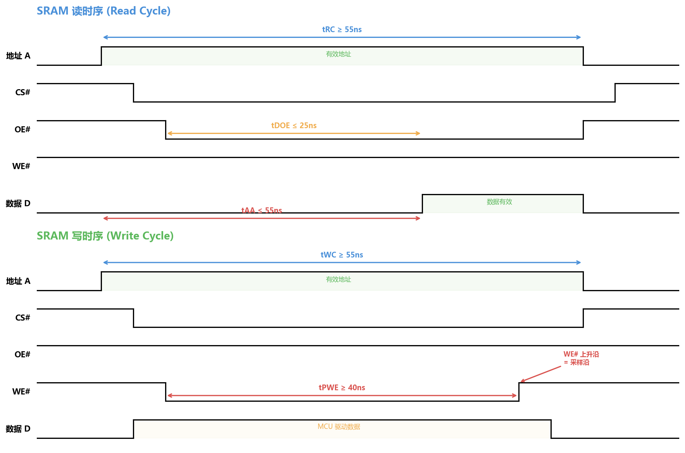

**读时序步骤**：
1. MCU（通过 FSMC）把地址放到 A[18:0] 上
2. 拉低 CS#（选中芯片）
3. 拉低 OE#（告诉芯片"我要读"）
4. 等待 tAA 时间（地址到数据有效延迟，≤55ns）
5. 数据线 I/O[15:0] 上出现有效数据，MCU 采样

**写时序步骤**：
1. MCU 把地址放到 A[18:0]，把数据放到 I/O[15:0]  
2. 拉低 CS# + WE#
3. 保持 WE# 拉低至少 tPWE（≥40ns）
4. WE# 上升沿 = **采样沿**——SRAM 在这个边沿锁存数据线上的值并写入

#### 关键时间参数

这些参数后面配置 FSMC 时序时会直接用到：

| 参数 | 含义 | IS62WV51216-55ns 要求 |
|------|------|----------------------|
| tRC | 读周期总时间 | ≥ 55ns |
| tAA | 地址到数据有效 | ≤ 55ns |
| tDOE | OE# 拉低到数据有效 | ≤ 25ns |
| tWC | 写周期总时间 | ≥ 55ns |
| tPWE | WE# 低电平脉宽 | ≥ 40ns |
| tSA | 地址建立到 WE# 拉低 | > 0ns |

💡 看出规律了吗？读和写的总周期都要求 ≥55ns。在 FSMC 配置时，我们需要保证 ADDSET + DATAST 的总时间不低于这个值。具体怎么算，下一节讲。

### 2.3 STM32 的 FSMC 外设

SRAM 芯片的时序搞清楚了，现在的问题是：**谁来产生这些时序信号？** 难不成让 CPU 手动控 GPIO 拉高拉低？那和 Chapter 3 里用 GPIO 模拟 SPI 一样低效。当然不——STM32 有专门的硬件来干这件事：**FSMC**（Flexible Static Memory Controller，灵活静态存储器控制器）。

FSMC 的本质是两件事：**地址译码** + **时序发生器**。CPU 以为自己在读写一个内部地址，FSMC 在背后悄悄把这个读写操作翻译成外部 SRAM 能理解的信号时序（地址线 + 控制线 + 数据线的正确翻转顺序和保持时间）。

#### 地址映射：外部存储器也有"门牌号"

回忆 Chapter 1 的存储器映射图——Cortex-M4 的 4GB 地址空间被划分成若干 Block：


其中 **Block 3（0x60000000~0x7FFFFFFF）** 和 **Block 4（0x80000000~0x9FFFFFFF）** 就是 FSMC 的地盘。再看总线矩阵图，FSMC 挂在从设备侧最右边——CPU 和 DMA 都能通过 AHB 总线矩阵访问它：


FSMC Bank1 用于 NOR Flash / PSRAM / SRAM 设备，地址范围 0x60000000~0x6FFFFFFF（256MB），被分成 4 个子区域，每个由一根独立的片选信号（NE1~NE4）控制：

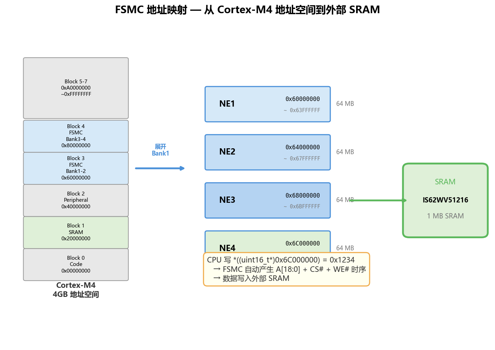

我们的开发板 SRAM 接在 **NE4** 上，基地址就是 **0x6C000000**。

💡 **核心认知**：CPU 执行 `*((uint16_t*)0x6C000000) = 0x1234` 和执行 `*((uint16_t*)0x20000000) = 0x1234` 的代码完全一样——都是 STR 指令往一个地址写值。区别是：前者的地址落在 FSMC 地址空间，AHB 总线矩阵会把这个请求路由到 FSMC，FSMC 再自动产生 A[18:0] + NE4# + NWE# 时序，数据就写进了外部 SRAM。对软件来说完全透明。

#### 模式 A 时序参数计算

FSMC 支持多种时序模式（A/B/C/D），驱动异步 SRAM 用的是**模式 A**。时序由两组寄存器控制，核心参数是：

- **ADDSET**（Address Setup Time）：地址建立时间，对应 SRAM 的 tSA
- **DATAST**（Data Setup Time）：数据建立时间，读操作对应 tAA，写操作对应 tPWE

模式 A 读周期总时间 = (ADDSET + 1 + DATAST + 1) × T_HCLK

> 这里 ADDSET 和 DATAST 的单位是 **HCLK 周期**，不是纳秒！

来算一下。STM32F407 的 HCLK = 168MHz，所以：

$$T_{HCLK} = \frac{1}{168 \times 10^6} \approx 5.95\text{ns}$$

SRAM 要求读周期 tRC ≥ 55ns。那么需要的最少 HCLK 周期数：

$$\frac{55\text{ns}}{5.95\text{ns}} \approx 9.24 \rightarrow \text{至少 10 个 HCLK}$$

取 ADDSET = 0, DATAST = 8 时，总周期 = (0+1 + 8+1) = 10 个 HCLK = 59.5ns > 55ns ✅

⚠️ 这只是满足最低要求。如果电路板走线较长或者有干扰，可能需要适当加大参数留余量。实际配置时先用保守值测试通过，再尝试缩短。

#### 关键寄存器速查

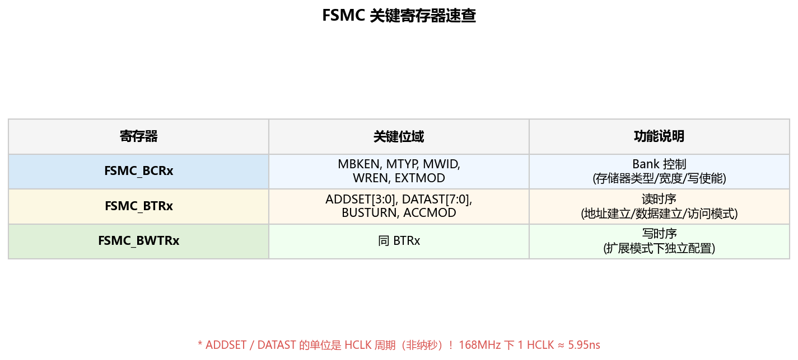

简单解释每个寄存器的角色：

- **BCRx**（Bank Control Register）：告诉 FSMC "你要控制的是什么类型的存储器"——SRAM / NOR / PSRAM，数据宽度 8/16 位，是否使能写操作，是否用扩展模式等。
- **BTRx**（Bank Timing Register）：配置读时序参数（ADDSET、DATAST、访问模式 A/B/C/D 等）。
- **BWTRx**（Bank Write Timing Register）：扩展模式下独立配置写时序。如果读写时序参数相同，不需要用这个。

#### FSMC vs FMC

最后补充一个命名问题。STM32F407 有的是 **FSMC**（Flexible **Static** Memory Controller），只支持静态存储器（SRAM、NOR Flash）。到了 STM32F429 / F7 / H7，升级为 **FMC**（Flexible Memory Controller），多了对 **SDRAM** 的支持。SDRAM 需要定时刷新和 CAS/RAS 等更复杂的时序，FSMC 搞不定。

对于我们用异步 SRAM 的场景，FSMC 和 FMC 的配置方式基本一致——学会 FSMC，以后换 FMC 平台也直接能用。

### 2.4 代码实战：外部 SRAM 读写测试

概念和外设都讲完了，来写代码。目标：**配置 FSMC 驱动 IS62WV51216，然后用指针直接读写外部 SRAM，并做全地址校验**。

#### 第一步：GPIO 复用配置

FSMC 驱动 SRAM 需要大量引脚——19 根地址线 + 16 根数据线 + 5 根控制线 = **40 个 GPIO**。全部配置为 **AF12（FSMC 复用功能）、推挽输出、高速**。

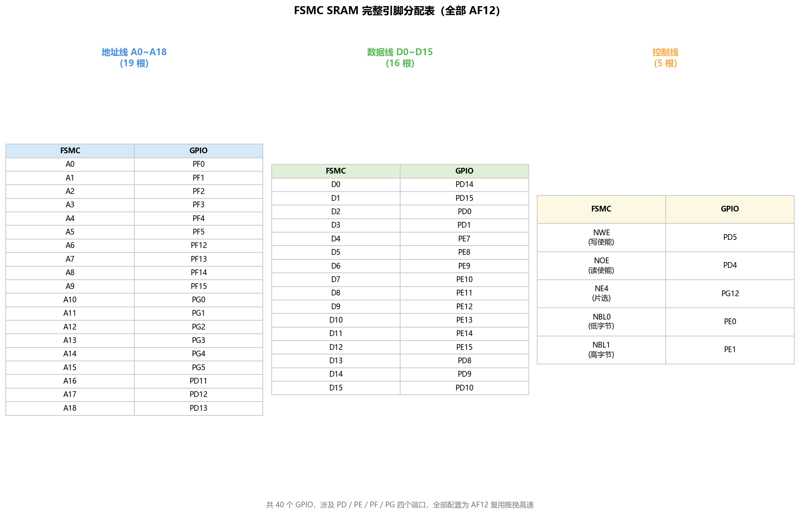

⚠️ 引脚非常多，涉及 PD、PE、PF、PG 四个端口。CubeMX 配置时逐一勾选比较繁琐，建议直接在代码里批量初始化。容易漏掉的是 NBL0（PE0）和 NBL1（PE1）——这两根字节选择线控制 16 位数据的高低字节使能，少了它们半字读写会出错。

#### 第二步：FSMC 时序配置

HAL 库用 `SRAM_HandleTypeDef` + `FSMC_NORSRAM_TimingTypeDef` 来配置 FSMC。核心配置如下：

```c
// bsp_sram.c

#define SRAM_BASE_ADDR    ((uint32_t)0x6C000000)  // NE4 基地址
#define SRAM_SIZE         (1024 * 1024)            // 1MB

SRAM_HandleTypeDef hsram;

void BSP_SRAM_Init(void)
{
    FSMC_NORSRAM_TimingTypeDef timing = {0};

    // ── 时钟使能 ──
    __HAL_RCC_FSMC_CLK_ENABLE();
    // GPIO 初始化（40 个引脚，省略具体代码，见完整工程）
    BSP_SRAM_GPIO_Init();

    // ── SRAM handle 配置 ──
    hsram.Instance  = FSMC_NORSRAM_DEVICE;
    hsram.Extended  = FSMC_NORSRAM_EXTENDED_DEVICE;
    hsram.Init.NSBank             = FSMC_NORSRAM_BANK4;      // NE4
    hsram.Init.DataAddressMux     = FSMC_DATA_ADDRESS_MUX_DISABLE;
    hsram.Init.MemoryType         = FSMC_MEMORY_TYPE_SRAM;
    hsram.Init.MemoryDataWidth    = FSMC_NORSRAM_MEM_BUS_WIDTH_16; // 16 位
    hsram.Init.BurstAccessMode    = FSMC_BURST_ACCESS_MODE_DISABLE;
    hsram.Init.WriteOperation     = FSMC_WRITE_OPERATION_ENABLE;
    hsram.Init.WaitSignal         = FSMC_WAIT_SIGNAL_DISABLE;
    hsram.Init.ExtendedMode       = FSMC_EXTENDED_MODE_DISABLE;
    hsram.Init.AsynchronousWait   = FSMC_ASYNCHRONOUS_WAIT_DISABLE;
    hsram.Init.WriteBurst         = FSMC_WRITE_BURST_DISABLE;

    // ── 时序配置（模式 A）──
    timing.AddressSetupTime      = 0;   // ADDSET = 0 → 1 个 HCLK
    timing.AddressHoldTime       = 0;   // 模式 A 不用
    timing.DataSetupTime         = 8;   // DATAST = 8 → 9 个 HCLK
    timing.BusTurnAroundDuration = 0;
    timing.CLKDivision           = 0;
    timing.DataLatency           = 0;
    timing.AccessMode            = FSMC_ACCESS_MODE_A;

    // 总周期 = (0+1 + 8+1) × 5.95ns = 59.5ns > 55ns ✓
    HAL_SRAM_Init(&hsram, &timing, NULL);
}
```

#### 第三步：指针直接读写

FSMC 初始化完成后，外部 SRAM 就变成了一段普通的内存空间。用指针读写和操作片内 SRAM 完全一样：

```c
// 写入一个 16 位值
*((__IO uint16_t *)(SRAM_BASE_ADDR + 0x0000)) = 0x1234;

// 读回
uint16_t val = *((__IO uint16_t *)(SRAM_BASE_ADDR + 0x0000));
// val == 0x1234
```

也可以封装成更易用的函数：

```c
void SRAM_WriteHalfWord(uint32_t offset, uint16_t data)
{
    *((__IO uint16_t *)(SRAM_BASE_ADDR + offset)) = data;
}

uint16_t SRAM_ReadHalfWord(uint32_t offset)
{
    return *((__IO uint16_t *)(SRAM_BASE_ADDR + offset));
}
```

#### 第四步：全地址校验

配了半天，怎么确认外部 SRAM 真的能用、每个地址都正常？做一次全空间遍历校验：

```c
uint32_t BSP_SRAM_Test(void)
{
    uint32_t i;
    uint16_t *pSRAM = (uint16_t *)SRAM_BASE_ADDR;
    uint32_t half_word_count = SRAM_SIZE / 2;  // 1MB / 2 = 512K 个半字

    // ── 写入：每个地址写入自己的地址低 16 位 ──
    for (i = 0; i < half_word_count; i++)
    {
        pSRAM[i] = (uint16_t)(i & 0xFFFF);
    }

    // ── 读回校验 ──
    for (i = 0; i < half_word_count; i++)
    {
        if (pSRAM[i] != (uint16_t)(i & 0xFFFF))
        {
            // 校验失败，返回出错的偏移地址
            return i * 2;
        }
    }

    return 0;  // 0 表示全部通过
}
```

💡 **为什么用"写入地址本身"做测试数据？** 这样可以同时检测两种故障：
- **数据线故障**：某根数据线断线或短路，写入的值读回会不对
- **地址线故障**：某根地址线断线，会导致两个不同地址实际访问同一个存储单元，写入的值互相覆盖

⚠️ 如果校验失败，最常见的原因是：GPIO 引脚配置遗漏（尤其是 NBL0/NBL1）、时序参数过于激进（DATAST 太小）、或者硬件焊接问题。

完整的工程代码在 [code/FSMC_SRAM_RW/](code/FSMC_SRAM_RW/) 目录下。

> 🎓 **小结**：FSMC 部分三个层次：
> 1. **概念层**（§2.1~§2.2）：扩展存储的动机 → SRAM 芯片的信号线与读写时序 → 关键时间参数
> 2. **外设层**（§2.3）：FSMC 地址映射机制（Bank/NE）→ 模式 A 时序参数计算 → 寄存器配置
> 3. **代码层**（§2.4）：GPIO 复用 + HAL_SRAM_Init + 指针直接读写 + 校验测试
