# Chapter 5 C语言面向对象工程架构基础

## 1 导言

### 1.1 回顾与问题

回顾一下我们到目前为止学了什么：

- **Chapter 1** 讲的是"怎么跟芯片打交道"——总线矩阵、统一内存架构、寄存器映射、启动流程、GPIO。核心收获：**MCU 里一切操作归结于往地址写数据**。
- **Chapter 2** 讲的是"芯片自己怎么管自己"——中断系统、定时器、PWM、看门狗。
- **Chapter 3** 讲的是"芯片之间怎么通信"——UART、SPI、I²C、CAN 四种协议，以及 ADC。
- **Chapter 4** 讲的是"给 CPU 减压"——DMA 解放 CPU 搬数据，FSMC 扩展外部内存。

这四章下来，你掌握了怎么跟硬件打交道。

但是等等——你再想想：到目前为止，我们写的代码都长什么样？一个 `main.c`，几百行，几个全局变量散落在各处，函数之间互相调用。你在 Chapter 1 里写的 `led.s` 汇编只有 50 行，这种风格没问题。可如果你要写的是：

- 一个能同时管理 10 个 LED 的驱动
- 一个能让你同事直接调用、而不用担心他搞坏内部状态的模块
- 一份像 HAL 库那样"几千个函数、同一个套路"的代码库
- **一个像 FreeRTOS 那样的操作系统内核**

**"一个 main.c + 几个全局变量"的裸过程式写法，还能撑得住吗？**

让我们用一个具体的例子来感受这种"撑不住"。

在 Chapter 1 里，你大概是这样点亮一盏 LED 的：

```c
// 裸过程式——逻辑和具体设备焊死在一起
void red_led_on(void) {
    GPIOF->BSRR = GPIO_Pin_6;  // 只能操作红灯，不能操作别的
}
```

如果你想加第二盏灯、第三盏灯呢？很多人是这么干的：

```c
void red_led_on(void)   { GPIOF->BSRR = GPIO_Pin_6; }
void green_led_on(void) { GPIOF->BSRR = GPIO_Pin_7; }
void blue_led_on(void)  { GPIOF->BSRR = GPIO_Pin_8; }
```

**三盏灯 = 三份几乎一模一样的代码。** 这不是"代码复用"——这是"代码复制"。逻辑完全相同（"往某个寄存器写某个位"），变的无非是"哪个 pin"。但当逻辑和具体数据焊死在一起，你只能用 Ctrl+C/Ctrl+V 来"复用"。

更大的问题在后面。当你写到 10 盏灯、20 盏灯，代码量线性膨胀。更要命的是，如果某天硬件改版，红灯从 Pin6 换到 Pin9，你得通篇搜索替换——**换一个 pin，改 N 个地方。** 这在工程上叫"脆弱的系统"——改一处崩一片。

更深处的问题是：Ch6-7 你要手撕 FreeRTOS 底层机制，并把它放回 STM32 工程实践里。FreeRTOS 支持同时运行几十个任务。每个任务有自己的栈、优先级、状态和通信关系。你打算怎么写？

```c
void task1_resume(void) { ... }
void task2_resume(void) { ... }
void task3_resume(void) { ... }
// ... 写到 task64 你人没了 你的座位上只留下了你燃尽剩下的舍利子
```


**问题不是"能不能实现"，是"能不能在工程上持续维护"。**


嵌入式是软硬件结合的学问。要写出好用、能维护的代码，光懂架构原理、通信时序和寄存器操作还不够，**本章是从“会驱动硬件”走向“会组织工程”的转折点**。前四章教你怎么使用芯片，本章开始教你怎么组织代码。你会发现，从 HAL 库到 RTOS，从 U-Boot 到 Linux 内核，很多成熟工程的代码哲学惊人地一致：封装对象、隐藏实现、共享接口、用函数表分发行为。掌握了这些套路以后，再看 FreeRTOS 的几千行 C 代码，就不再是端着望远镜看山，而是能顺着路往里走。

### 1.2 本章要解决的问题

C 语言没有 `class`、没有 `extends`、没有 `virtual`——这些 C++ 关键字我们一个都指望不上。但你猜 --

Linux 内核用的什么语言？C。

HAL 库用的什么语言？C。

FreeRTOS 用的什么语言？C。

三千万行 Linux 内核全是 C。如果没有对象边界、接口边界和分层约定，这种规模的工程不是“难调 bug”，而是 bug 会带着你在源码森林里绕圈。

这就是本章要教你的：**C 语言当然可以写过程式代码，但在工业嵌入式工程里，它也经常以“面向对象”的方式组织复杂系统。**

我们用**一个 LED 驱动**当线索，从零开始一步步改造它。每一次改造，都解决一个具体的工程痛点。你看到的每一个设计，都不是“老师造的玩具”——而是你打开 HAL、RTOS、Linux 驱动时真能对上的工业写法。

每一节回答一个问题，给出一个武器，指出一段工业代码作证：

| 节 | 😫 痛点 | 🔧 给出的武器 | 🏭 对应的工业代码 |
|:---:|----------|--------------|-------------------|
| §2 | 三个 LED 写了三份代码，Ctrl+C 不是复用 | struct + 自指指针 | `GPIO_TypeDef` + `*GPIOx` 形参 |
| §3 | 同事直接改了 `led.pin = 666`，系统炸了 | `static` 私有化 + `.h` 公开接口 + 数据归位 | HAL 源码里遍地 `static` 函数 |
| §4 | 三种 LED（普通/PWM/I2C）行为不同，上层却想统一调用 | struct 嵌套 + 函数指针 + ops 虚表 + 转型 | C++ vtable、多态 dispatch |
| §5 | 拿到 `Led_t *`，怎么找回真实子类对象？ | `container_of` 宏 | Linux 内核常见宿主对象反查 |
| §6 | 学了一堆，到底是真会了还是跟着看懂了？ | 换个非硬件题目，C++ 和 C 各写一遍（复习） | C++ vtable ↔ 手搓 ops 表 |
| §7 | 这些技巧怎么串成工程分层和硬件描述？ | App/Interface/Driver/Platform/Board + 设备树 | STM32 HAL + FreeRTOS 分层 |
| §8·§9 | 真实框架里，这套东西长什么样？ | 读懂 Zephyr / Linux 驱动骨架 | `led_gpio.c`、`leds-gpio.c` |

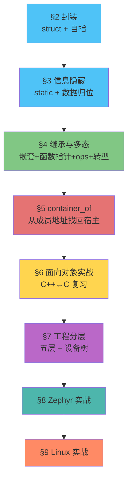

> 💡 这个递进结构不是偶然的——真实工程中，你接手一个"只有一个 main.c"的项目，也会沿着同样的路径重构：先封装数据 → 再隐藏实现 → 再引入继承、多态和宿主对象反查 → 复习巩固 → 最后组织成工程分层。

最关键的一句：**学完这章，后面手搓 FreeRTOS 的时候，你看到的 TCB 将不再只是一个"巨大的 struct"。而这一章不会把 Zephyr、Linux 留到"以后"——§8、§9 就直接带你打开真实的 Zephyr 和 Linux 驱动，一件件认出你亲手搓过的对象、虚表、转型。源码会从一团黑雾，变成一张能顺着走的地图。**

### 1.3 本章学习路径

#### 📂 配套代码

本章的每个核心概念都有对应的代码版本，放在 `code/` 目录下。它们是渐进演化的——v2 在 v1 的基础上改，v3 在 v2 的基础上改，就像你真实重构一个项目一样。

| 版本 | 对应小节 | 核心变化 | 路径 |
|:---:|:---:|------|------|
| v1 | §2 | 封装第一部: struct 封装 + 自指指针 | [`code/v1_封装_struct_me_pointer/`](code/v1_封装_struct_me_pointer/) |
| v2 | §3 | 封装第二部:static 私有化 + .h 公开接口 | [`code/v2_信息隐藏_static_private/`](code/v2_信息隐藏_static_private/) |
| v3 | §3 | 手搓 Class：函数前缀 = 类名 | [`code/v3_手搓class_前缀_init_deinit/`](code/v3_手搓class_前缀_init_deinit/) |
| v4 | §3 | 四种数据归宿，消灭裸全局变量 | [`code/v4_数据归位_static_const/`](code/v4_数据归位_static_const/) |
| v5 | 选读 | 迷你 HAL：把前面的 LED-OOP 映射到真实寄存器 | [`code/v5_HAL验证_mini_hal/`](code/v5_HAL验证_mini_hal/) |
| v6 | §4 | 继承: struct 嵌套 | [`code/v6_继承_struct_嵌套/`](code/v6_继承_struct_嵌套/) |
| v7 | §4 | 函数指针实现多态 | [`code/v7_多态_函数指针/`](code/v7_多态_函数指针/) |
| v8 | §4 | ops 结构体 = 虚表 | [`code/v8_多态_ops虚表/`](code/v8_多态_ops虚表/) |
| v9 | §5 | container_of：从成员地址找回宿主对象 | [`code/v9_container_of/`](code/v9_container_of/) |

每个版本都是完整的、可独立编译运行的工程。v1-v4 带有 `platform.h/platform_pc.c`，适合观察“同一套上层接口如何替换底层实现”；v6-v9 更偏概念演进，主要用 PC 打印结果观察继承、多态、ops、转型和 `container_of` 的调用链。v5（迷你 HAL）是把这套 OOP 映射到真实寄存器的选读示例。

#### 📖 核心参考资料

- **兆鸣·赵程博**《C 语言面向对象编程·嵌入式实战（第一卷）》：本章的设计框架、代码风格与叙事主线以此书为参照，全书已归档到 [`reference/oop_example/C语言面向对象编程_嵌入式实战_兆鸣_第一卷.pdf`](../../reference/oop_example/C语言面向对象编程_嵌入式实战_兆鸣_第一卷.pdf)。原书 18 章分四部分（封装 1–5 / 继承 6 / 多态 7–11 / 工程威力 12–18），外加第五部分“开源工程实战”。本章各节与原书章节的对应关系：
  - 原书 ch1、ch3（三个 LED 三份代码、手搓 class）→ 本章 §2
  - 原书 ch2、ch4（static 与信息隐藏、数据三级分类）→ 本章 §3
  - 原书 ch6–ch11（继承、函数指针、ops、vptr、多态图景）→ 本章 §4
  - 原书 ch12、ch14（向上转型、虚函数不实现的三种策略）→ 本章 §4.5
  - 原书 ch13（container_of 的地址魔法）→ 本章 §5
  - 本章 §6（面向对象实战）是新增的复习节：把 §2–§5 的封装/继承/多态换个非硬件题目用 C++↔C 各写一遍，原书无直接对应
  - 原书 ch15–ch16 与第五部分（OOP 完整框架、Linux 风格、Zephyr/Linux 实战）→ 本章 §7、§8、§9

#### 🗺️ 阅读建议

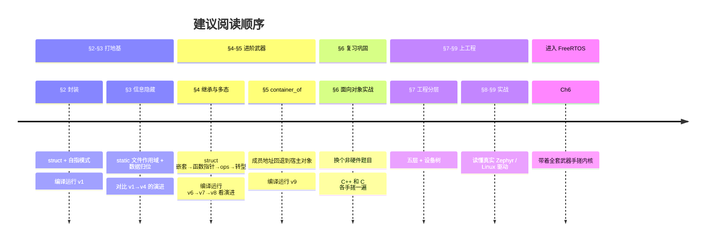

#### ⚡ 如果你有 STM32 开发板

v1-v4 的工程通过 `platform.h` 把底层 GPIO 写操作隔离出来，PC 版本用 `platform_pc.c` 和 `printf` 模拟硬件。如果你有开发板，可以写一个 `platform_stm32.c`，用真实 HAL 或寄存器操作实现同一组接口，再在编译时替换 PC 版本。

v6-v9 专注于继承、多态、ops、转型和 `container_of` 这些 C 语言面向对象技巧，都可以在 PC 上编译运行，用打印结果观察对象和调用链。（v5 迷你 HAL 是选读，想看这套 OOP 怎么落到真实寄存器上时再翻。）

真正把“同一份 driver 怎么跨平台复用”讲完整的，是后面的 §7。那里会把 App、Board、Interface、Driver、Platform、HAL/OS/Hardware 和设备树串起来，解释一个 I2C LED 从定义、初始化、写入到读取的完整路径。


## 2 封装--解耦属性和接口

> 📂 配套代码：[`code/v1_封装_struct_me_pointer/`](code/v1_封装_struct_me_pointer/)  
> 📖 兆鸣原书：第一部分·封装，ch1「三个 LED 三份代码」、ch3「你用 C 手搓了一个 class」

### 2.1 问题：三个 LED，三份代码

在 Chapter 1 里，三盏 LED 你大概写了六份函数：

```c
void red_led_on(void)  { GPIOF->BSRR = GPIO_Pin_6;  }
void red_led_off(void) { GPIOF->BSRR = GPIO_Pin_6 << 16; }
void blue_led_on(void)  { GPIOF->BSRR = GPIO_Pin_7;  }
void blue_led_off(void) { GPIOF->BSRR = GPIO_Pin_7 << 16; }
void green_led_on(void)  { GPIOF->BSRR = GPIO_Pin_8;  }
void green_led_off(void) { GPIOF->BSRR = GPIO_Pin_8 << 16; }
```

逻辑完全相同——"把某个 Pin 拉高或拉低"。变的无非是哪个 Pin。但逻辑和具体数据焊死了，你只能用 Ctrl+C/Ctrl+V。

第一个问题: 如果你发现你电平搞反了,这种微小的错误,因为你的复制粘贴, 你波及到了6个函数, 如果有100个led 那么你就波及到了200个函数.这会显著增加调试的难度.

第二个问题: **两盏LED没法同时亮。** 因为函数名已经把设备信息焊死了——`red_led_on()` 只能操作红灯。你想让红灯和蓝灯一起亮，必须写两行。你想操作任意一盏灯（比如用户在串口终端输入 "R" 就亮红灯），你得写一个又臭又长的 `switch-case` 或者 `if-else if` 链。这是因为**函数无法接受"操作谁"的信息**——它只有一个 `void` 参数，没有地方告诉它"这次你操作哪盏灯"。

这就是为什么我们要引入面向对象来对复用的函数进行化简, 因为**重复就是Bug的温床**。


### 2.2 属性和接口:`struct`和自指指针(me pointer)

#### 2.2.1 属性和接口解耦

对于上面的模型,  变化的是变量, 不变的是函数, 这在面向对象中, 我们分别叫做属性--变量, 接口--函数

我们可以直观地看到两种方案的区别。

优化前——三个函数，三个 pin，数据和逻辑焊死：

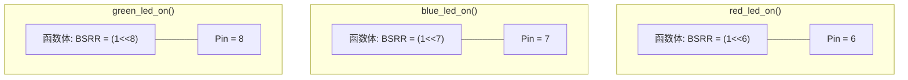

优化后——一个函数，三个 pin，数据通过参数传入：

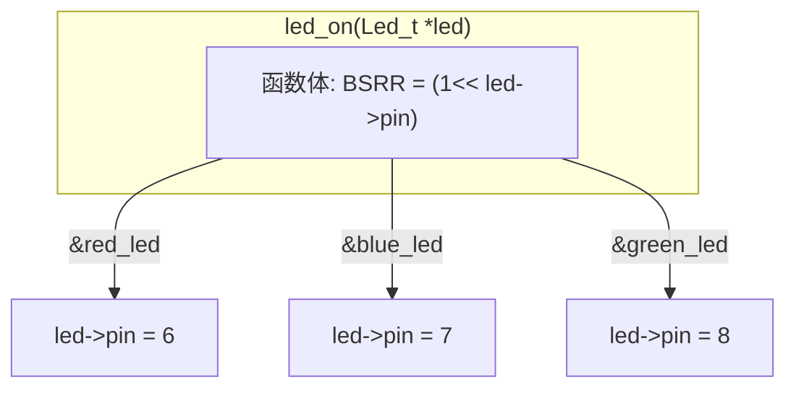

`led_on` 只有一份。你传谁进去，它就操作谁的 pin。改电平逻辑只改一处。


#### 2.2.2 使用`struct`打包成员

我们以基于C++的Arduino为例,只需要写一个 `on()`对应三个led, 其类可以这么写: 


````c++
class Led {
    private ：//成员
        int pin;
        
    public ：//接口
        
        void on() { 
            digitalWrite(pin, HIGH); 
        } 
    	
    	led (int pinNum) {
            pin=pinNum;
        }
    
    	~ led () {
            
        }
};

//初始化
    Led red_led=led(12);

//调用

	red_led.on();

````

C语言中有没有能把不同属性的打包东西呢, **答案是肯定的, 就是`struct`结构体**. 但是`struct`只有打包变量的能力, 不能加函数(函数指针可以, 但是本质还是要在外面绑定联系)

```c
typedef struct { //必须加typedef啊, 不然后面没办法 Led_t led
    uint8_t pin;
    /*
    led_on() 不可以! 不允许加函数
    */
    
} Led_t;
void led_on(){
    //成员函数(接口)只能在外面定义,如何建立联系???
}

```

#### 2.2.3 自指指针--接口和成员的绑定

第一个问题, 上面这么多行代码--**最关键的，直接指定了成员函数和类的调用关系的是哪一行**？

> **答案就是`red_led.on()`** 。他自动帮我们找到了`red_led`的`pin`, 然后使用平台提供的`digitalWrite()`去操作他.

接着思考, **这个调用的底层机制在哪**? 

> 答案是`this` 指针.  
>
> 在 C++ 中，编译器会偷偷给每个成员函数加一个隐藏参数：`class MyClass* this`。它就是指向当前对象自己的 `this` 指针。调用成员函数时，编译器会把对象地址悄悄塞进这个参数里。
>
> 也就是说 `on()`看上去没有任何参数

把这件事拆开看，其实 C++ 和 C 只差一层语法糖：

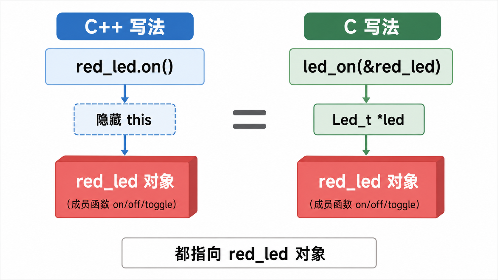

左边的 `red_led.on()` 看起来没有参数，但编译器会悄悄补一个 `this`，让成员函数知道自己正在操作 `red_led`。右边的 C 写法没有这层自动补参，所以我们必须把对象地址明明白白传进去：`led_on(&red_led)`。

C 语言的标准没有这样的语法糖。我们需要手搓这个指针,这就是自己指向自己的指针,我们称为**自指指针(me pointer)**, 它就是你函数里,和你这个类同名的一个普通的 `Led_t *` 形参。简化一下是这个效果

```c
// led.h
typedef struct { 
    uint8_t pin;
} Led_t;

int led_on(Led_t *led);//成员函数需要传入结构体才能用!这个结构体指针被称为自指指针

```

```c
// led.c
int led_on(Led_t *led) {
    if (led == NULL) return -1;
    platform_gpio_write(led->pin, true);
    return 0;
}
```

```c
// main.c
Led_t red_led, green_led, blue_led;
led_on(&red_led);      // led->pin = 13
led_on(&green_led);    // led->pin = 14，同一份函数体！
```


你会发现, 所有你接触到的工业代码的习惯是有类似的实现:

```c
// STM32 HAL：GPIOx = "当前操作的 GPIO 端口自己"
void HAL_GPIO_WritePin(GPIO_TypeDef *GPIOx, uint16_t GPIO_Pin, GPIO_PinState PinState);
void HAL_UART_Transmit(UART_HandleTypeDef *huart, uint8_t *pData, uint16_t Size);

// FreeRTOS：pxTCB = "当前操作的 TCB 自己"
void vTaskSuspend(TaskHandle_t xTask);     // 内部: TCB_t *pxTCB = (TCB_t *)xTask;
void vTaskResume(TaskHandle_t xTask);

// Linux 内核：dev = "当前操作的设备自己"
int device_register(struct device *dev);
int driver_register(struct device_driver *drv);
```

它们的命名风格非常统一——**不用 `this`（C++ 保留字）、不用 `self`（Python/Rust 习惯）、不用 `obj`（太泛）——而是用类型名的缩写直接告诉你"指针指向什么类型"。** 本章教学里，LED 的自指指针叫 `led`，电机叫 `motor`，TCB 叫 `tcb`——等你写自己的代码时，依样画葫芦即可。

| 场景 | 应该用的参数名 |
|------|---------------|
| LED 驱动 | `Led_t *led` |
| GPIO 操作 | `GPIO_TypeDef *GPIOx` |
| 串口发送 | `UART_HandleTypeDef *huart` |
| 任务挂起 | `TCB_t *pxTCB` |
| 设备操作 | `struct device *dev` |

| C 写法 | C++ 写法 | 含义 |
|--------|----------|------|
| `struct Led_t { pin, is_on }` | `class Led { int pin; }` | 把数据打包 |
| `Led_t *led`（第一参数） | `this` 指针（隐式） | 告诉函数操作谁 |
| `led_on(&red_led)` | `red_led.on()` | 同一份逻辑，不同数据 |


### 2.3 构造和析构的实现--Init和DeInit

我们现在复刻了成员函数的封装性, 实现了一个成员函数led_on对接三个led. 但是问题是**我们还没有管理一个类的生命周期的能力**, 类是基于**构造函数**和**析构函数**来管理生命周期的. 同时**我们也需要构造函数来完成一些变量初始化工作**, 落到嵌入式层面, 比如初始化寄存器值, 通时钟等. 这些如何完成呢?

相信你也猜到了, 我们直接写一个和`led_on(Led_t* led)`同等重量级的`led_init(Led_t* led) `和`led_deinit(Led_t* led)`:

```c
// 构造函数 = 分配资源 + 初始化硬件
int led_init(Led_t *led, uint8_t pin) {
    if (led == NULL) return -1;
    led->pin = pin;                              // 给属性赋值
    led->brightness = 0;
    led->is_on = false;
    platform_gpio_init(pin, GPIO_MODE_OUTPUT);   // 初始化硬件（通时钟、配寄存器）
    platform_gpio_write(pin, false);             // 确保上电后LED是灭的
    return 0;
}

// 析构函数 = 释放资源 + 关闭硬件
int led_deinit(Led_t *led) {
    if (led == NULL) return -1;
    platform_gpio_write(led->pin, false);        // 先关灯
    platform_gpio_deinit(led->pin);              // 释放引脚
    led->pin = 0;                                // 清空属性
    led->brightness = 0;
    led->is_on = false;
    return 0;
}
```

对比 C++ 和 C 的生命周期：

| 阶段 | C++（编译器自动） | C（你手动） |
|------|-------------------|------------|
| 对象创建 | `Led red(13);` 自动调 `Led::Led(int)` | 手动调 `led_init(&red_led, 13)` |
| 正常使用 | `red.on();` | `led_on(&red_led);` |
| 对象销毁 | `}` 离开作用域，自动调 `~Led()` | 手动调 `led_deinit(&red_led)` |

C 语言没有自动机制——**但你可以手动遵守同样的生命周期协议。** 你已经在 Ch1-4 里习惯了"用之前先 Init、用完后 DeInit"的 HAL 套路——只不过现在你知道它背后是一套完整的构造/析构思想了。

### 2.4 代码实战

打开 [`code/v1_封装_struct_me_pointer/`](code/v1_封装_struct_me_pointer/)，整个工程从零演示 struct 封装 + 自指指针 + 构造/析构。三个文件的核心逻辑：

```c
// led.h — 数据结构定义 + 公开接口声明
typedef struct {
    uint8_t  pin;
    uint8_t  brightness;
    bool     is_on;
} Led_t;

int led_init(Led_t *led, uint8_t pin);       // 构造
int led_deinit(Led_t *led);                   // 析构
int led_on(Led_t *led);                       // 成员方法
int led_off(Led_t *led);
int led_toggle(Led_t *led);
int led_set_brightness(Led_t *led, uint8_t brightness);
int led_get_state(const Led_t *led, bool *is_on, uint8_t *brightness);
```

```c
// main.c — 使用演示
Led_t red_led, green_led, blue_led;

led_init(&red_led, 13);
led_init(&green_led, 14);
led_init(&blue_led, 15);

led_on(&red_led);                                  // 操作红灯
led_on(&green_led);                                // 同一份代码操作绿灯
led_set_brightness(&blue_led, 30);                 // 蓝灯30%亮度
led_toggle(&red_led);                              // 翻转红灯

bool state; uint8_t brightness;
led_get_state(&green_led, &state, &brightness);    // 安全读取状态

led_deinit(&red_led);                              // 析构清理
led_deinit(&green_led);
led_deinit(&blue_led);
```

你可以在 PC 上直接用 GCC 编译运行（不需要开发板）：
```bash
gcc -Wall -Wextra -std=c11 -o demo main.c led.c platform_pc.c
./demo
```

也可以把 `platform_pc.c`（printf 模拟 GPIO）替换成 `platform_stm32.c`（真实 HAL 寄存器操作）落到 STM32 上——**`led.c` 和 `main.c` 一行不用改。**

### 2.5 总结

基于自指指针和struct封装, 我们初步实现了面向对象的封装特性, 完成了属性和接口的解耦. 但是这不是封装的全部, 我们还没有完成属性的权限隔离, 下一章我们会介绍如何实现.


## 3 封装--区分公有和私有

### 3.1 问题：函数公私不分，变量公私不分

上一节我们用 `struct` + 自指指针把属性和接口打包在了一起。但打包只是第一步——你还没决定哪些东西同事能动，哪些不能动。

看这个例子。你的 LED 驱动里有 `update_hardware` 这个内部辅助函数——它只负责把 `is_on` 同步到寄存器，不应该被外部直接调用。还有一堆内部校验用的辅助函数。但现在它们和 `led_on`、`led_off` 一样暴露在外面。同事不小心调了 `update_hardware` 而你外部又同时调了 `led_on`——寄存器可能被写两遍，状态机乱套。

更糟的是 struct 字段——`led.pin = 999`，这行代码编译器不会拦。两件事本质上是同一个问题：**在 C++ 里 `private` 关键字做的事情，C 语言靠什么？**

答案分两层——函数能锁，字段锁不了。我们一层一层看。

### 3.2 方案：`static` 锁定私有成员函数+头文件暴露接口

#### 3.2.1 `static` 的链接行为 = C 的 `private`

回顾一下 `static` 关键字的两个属性：

| 出现区域 | 属性 | 作用 |
|----------|------|------|
| 作为局部变量的修饰词 | 内存行为 | 变量生命周期延长至程序结束 |
| 作为全局变量/全局函数的修饰词 | 链接行为 | 仅在本文件可见，外部 `extern` 也链不到 |

第二个属性——**限定函数和文件级变量仅在本 `.c` 可见**——就是 C 语言里我们能用的 `private`。

```c
// led.c
static void update_hardware(Led_t *led) {       // private——外部链不到
    platform_gpio_write(led->pin, led->is_on);
}

int led_on(Led_t *led) {                        // public——.h 里声明
    if (led == NULL) return -1;
    led->is_on = true;
    update_hardware(led);  // 内部调用 private，OK
    return 0;
}
```

同事在 `main.c` 里写 `update_hardware(&led)` → 编译报错 `undefined reference`。

#### 3.2.2 头文件 = 菜单，`.c` = 厨房

这套边界最适合用"菜单和厨房"来理解：外部只能按菜单点菜，不能冲进厨房直接动锅。

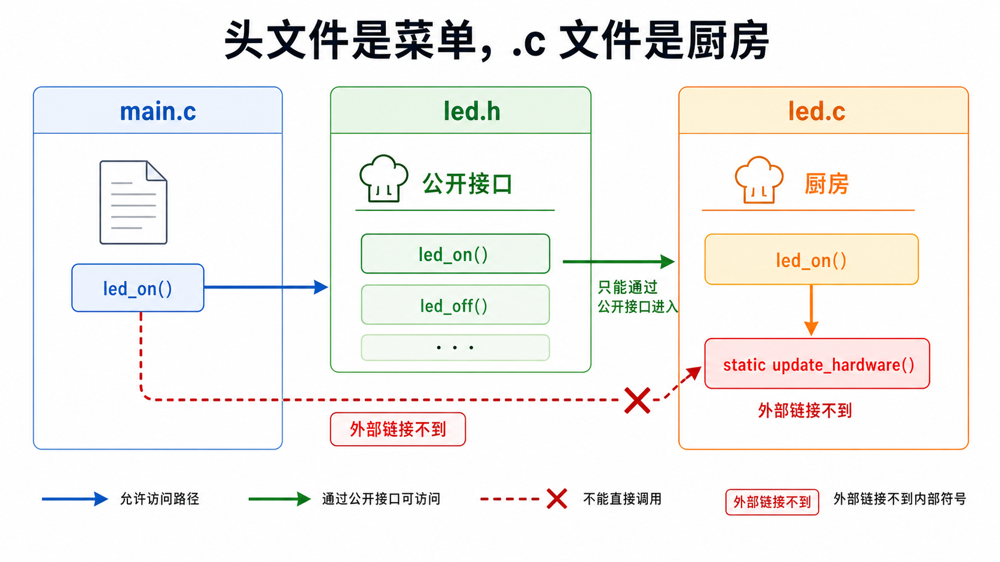

图里蓝色路径是允许的：`main.c` 通过 `led.h` 看见 `led_on()`，再由 `led_on()` 进入 `led.c` 内部。红色虚线是被禁止的：`static update_hardware()` 没有外部链接名，`main.c` 即使知道它存在，也链接不到它。

落实到代码：

```c
// led.h — 菜单：只放公开接口
typedef struct {
    uint8_t  pin;
    bool     is_on;
} Led_t;

int led_init(Led_t *led, uint8_t pin);   // 公开
int led_on(Led_t *led);                  // 公开
int led_off(Led_t *led);                 // 公开
```

```c
// led.c — 厨房：实现细节全加 static
static void update_hardware(Led_t *led) {       // private
    platform_gpio_write(led->pin, led->is_on);
}

int led_on(Led_t *led) {                        // public
    if (led == NULL) return -1;
    led->is_on = true;
    update_hardware(led);
    return 0;
}
```

### 3.3 代码实战

打开 [`code/v2_信息隐藏_static_private/`](code/v2_信息隐藏_static_private/)，核心对比：

```c
// main.c — 正常路径：走公开接口
led_on(&red_led);                // 硬件真正点亮 ✓

// main.c — 错误路径：直接调内部函数
update_hardware(&green_led);     // 编译报错！编译器守门 ✓

// main.c — 另一个错误路径：捅 struct 字段
green_led.is_on = true;          // 编译器不拦 ✗
// → 硬件纹丝不动，之后 led_toggle 内部状态判断全乱
```

`static` 守住了函数——这是 C 能直接给你的。但 struct 字段这道门，`static` 装不上。也就是说，我们手搓的“类”里，字段默认还是 public；真正能被编译器硬锁住的，是 `.c` 文件内部的 `static` 函数和不暴露出去的符号。


### 3.4 成员变量的私有问题——工业界怎么做的

`led.pin = 999` 这个操作，编译器真的管不了吗？我们看一下几个真实工程是怎么处理的。它们有的只有几千行代码，有的有几千万行代码，你会发现，不同选择背后处处都是 Trade-off 的哲学：

先把两条路线放在一张图里看：

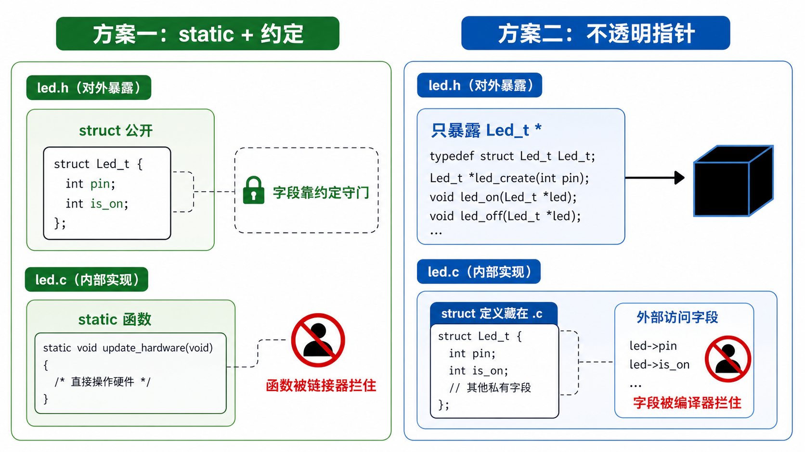

左边是嵌入式里最常见的方案：`struct` 定义公开，字段靠命名、注释、代码审查守门；函数用 `static` 真正锁住。右边是不透明指针：头文件只暴露 `Led_t *` 和接口，完整 `struct Led_t` 藏在 `.c` 里，外部连字段布局都看不到，所以字段访问会被编译器挡住。

#### 3.4.1 HAL 库 / FreeRTOS / RT-Thread：全公开 + 约定守门

```c
// stm32f4xx_hal_gpio.h
typedef struct {
    uint32_t Pin;       // 全公开，谁 include 都能捅
    uint32_t Mode;
    uint32_t Pull;
    uint32_t Speed;
} GPIO_InitTypeDef;
```

```c
// FreeRTOS tasks.c
typedef struct tskTaskControlBlock {
    volatile StackType_t *pxTopOfStack;   // 全公开
    ListItem_t            xStateListItem; // 全公开
    UBaseType_t           uxPriority;     // 全公开
    // ...
} TCB_t;
```

不锁。不是因为不想——是因为在嵌入式里，上不透明指针要付出的代价（堆分配、多一层间接）比"偶尔有人捅错字段"的代价大得多。

它们的选择是：**struct 定义放 `.h` 全公开，靠 `prv` 前缀和命名约定划线。** 你碰了 `prv` 打头的函数，链接器报错；你碰了不该碰的字段，代码审查的同事报错。

#### 3.4.2 不透明指针：把定义藏进 `.c`——真锁

约定守门总有个软肋：想守住字段，只能靠人。有没有办法让**编译器**替你守住字段？有——**让外部根本看不到 struct 的定义。** 这招叫**不透明指针（opaque pointer）**，是 C 语言里少数能对字段"真锁"的手段。

首先想一个问题：前面方案一的 struct，为什么字段锁不住？

```c
// led.h
typedef struct {
    uint8_t pin;        // 外部 include 就能看见
    bool    is_on;      // 看见就能捅
} Led_t;
```

编译器必须知道 struct 里有什么，才能在栈上给你分配空间。你写 `Led_t red_led;` 的时候，编译器算 `sizeof(Led_t)`，腾出 2 字节，把 `pin` 放在偏移 0，`is_on` 放在偏移 1。这套操作的每一个环节都依赖 struct 定义可见。

但如果你只用一个指针——`Led_t *led`——编译器只需要知道指针本身的大小（4 或 8 字节），不需要知道它指向的东西有多大。这跟数组是一个道理：`int arr[10]` 必须知道 10 才能开栈帧，`int *arr` 不需要。

所以锁字段的思路很简单：**让外部只拿到指针，拿不到定义。**

这张图把完整调用链画出来了：外部能拿到的只有 `red` 这个指针值，它保存的是堆上对象的地址；真正的 `struct Led_t` 定义、`malloc(sizeof(struct Led_t))` 和字段访问都发生在 `led.c` 内部。

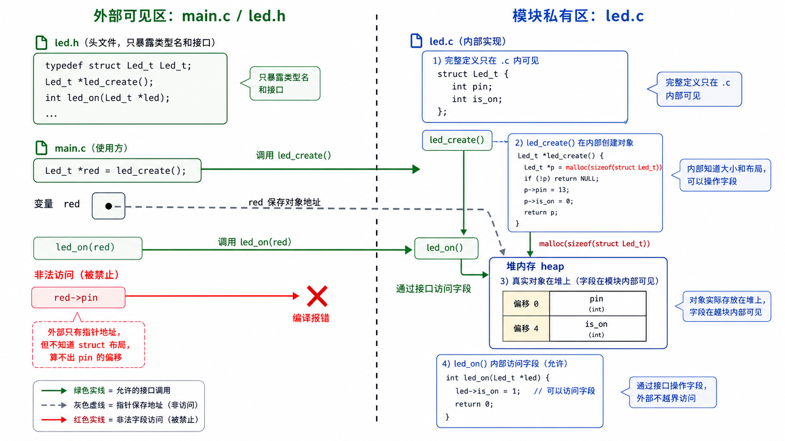

注意红色路径为什么会断掉：`red->pin` 不是因为运行时"不让访问"，而是编译期就过不去。外部只见过 `typedef struct Led_t Led_t;`，不知道 `struct Led_t` 里面有没有 `pin`，也不知道 `pin` 在第几个字节，所以编译器根本算不出 `red->pin` 该怎么取。

```c
// ========== led.h — 外部只看到这些 ==========
typedef struct Led_t Led_t;          // 只声明类型名，不给定义

Led_t *led_create(uint8_t pin);      // 工厂函数
int led_on(Led_t *led);              // 只能走接口
void led_destroy(Led_t *led);

// ========== led.c — 定义和实现全在内部 ==========
struct Led_t {                       // 完整定义藏在这里
    uint8_t pin;
    bool    is_on;
};

static void update_hardware(Led_t *led) {   // static 锁函数
    platform_gpio_write(led->pin, led->is_on);
}

Led_t *led_create(uint8_t pin) {           // 工厂函数：这里能 malloc
    Led_t *led = malloc(sizeof(Led_t));    //   sizeof 在这里算，外部算不了
    led->pin = pin;                         //   内部随便碰字段
    led->is_on = false;
    return led;
}

int led_on(Led_t *led) {
    if (led == NULL) return -1;
    led->is_on = true;                     // 字段随便用
    update_hardware(led);
    return 0;
}

void led_destroy(Led_t *led) {
    if (led == NULL) return;
    free(led);
}

// ========== main.c — 外部只能拿到不透明指针 ==========
Led_t *red = led_create(13);        // ✓ 只能走工厂
led_on(red);                        // ✓ 只能走接口
// red->is_on = true;               // ✗ 编译报错！incomplete type
led_destroy(red);
```

`led.h` 里 `typedef struct Led_t Led_t;` 只告诉编译器"Led_t 存在"，不给大小，不给字段。外部什么也看不见。

`led.c` 里 `struct Led_t { ... };` 给了完整定义。这里 `sizeof(Led_t)` 算得出来，字段随便碰，`malloc`、`free` 都在这里完成。两道锁同时生效——函数加 `static` 拦调用，结构体藏定义拦访问。

---

理清了不透明指针的写法，还得澄清一个几乎人人都踩过的误会：**这套"藏定义 + 工厂函数"的招式，最经典的例子不在 Linux 内核，而在你早就用过的 C 标准库。**

**你其实天天在用不透明指针：`FILE *`**

回想一下你怎么读文件：

```c
FILE *fp = fopen("log.txt", "r");   // 拿到一个 FILE *
fread(buf, 1, 100, fp);             // 只能把它交给库函数
fclose(fp);

// fp->_offset = 0;                 // ✗ 你从来没这么写过，也写不了
```

你用了这么多年 `FILE *`，有没有想过 `struct FILE`（在 glibc 里真名叫 `struct _IO_FILE`）里到底有哪些字段？没有——因为 `stdio.h` 只丢给你一句 `typedef struct _IO_FILE FILE;`，完整定义藏在 libc 内部。这和上面的 `led_create` 是同一张脸：

```text
FILE *       ↔  Led_t *          只暴露一个类型名
fopen()      ↔  led_create()     工厂函数在库内部 malloc
fread()      ↔  led_on()         只能走接口
fclose()     ↔  led_destroy()
```

`sqlite3 *`、`SDL_Window *`、绝大多数成熟 C 库的句柄，走的都是这一招。**不透明指针是"库"对"用户"划边界的标准手法。**

**那 Linux 内核呢？这里要打破一个常见误解**

很多人想当然：内核这种三千万行的巨型工程，一定把 `struct file`、`struct inode` 这些核心结构体也藏成不透明指针，只丢给驱动一个指针。

**恰恰相反。** 打开 `include/linux/fs.h`——这是个**公开**头文件——`struct file` 的完整定义明明白白摊在那里：

```c
// include/linux/fs.h —— 公开头文件，谁 include 谁看得见
struct file {
    // ... 几十个字段，这里只列几个
    const struct file_operations *f_op;   // §7 要讲的函数指针虚表
    void            *private_data;         // 留给驱动挂私有数据
    unsigned int    f_flags;
    fmode_t         f_mode;
    loff_t          f_pos;
};
```

所以当你写字符设备驱动、内核回调你的 `write` 时，字段其实随便读随便写：

```c
static ssize_t led_write(struct file *filp, const char __user *buf,
                         size_t count, loff_t *pos)
{
    struct my_led *led = filp->private_data;    // ✓ 每个字符驱动的标配写法
    if (filp->f_mode & FMODE_WRITE) { /* ... */ }  // ✓ 编译器一点都不拦
    // filp->f_pos、filp->f_flags 也照样读得到、改得动
}
```

`filp->private_data` 是每个字符驱动的入门第一课，`filp->f_pos`、`filp->f_flags` 驱动也照读不误。**这里没有 incomplete type，没有编译报错，编译器根本没拦你。**

换句话说，`struct file` 不是"编译器硬锁"的方案二，它恰恰是**方案一**：定义全公开，靠约定和 code review 守门。内核的规矩是"不该碰的字段别碰、优先用访问器函数"，但真要碰，语法上拦不住你——跟 HAL 的 `GPIO_InitTypeDef` 是同一个级别的公开。

**那三千万行怎么不失控？**

内核守边界，靠的不是把结构体藏起来，而是另一招：**只把一小块成员暴露给外部，真正的私有数据藏在完整对象里，外部拿到的成员指针够不着；需要时再用 `container_of` 从这块成员反算回完整对象。** 这一招才是内核的隔离主力，正是下面 §5 要拆的 `container_of`。

打个比方：`FILE *` 像银行给你一张保险箱手柄，你永远看不到箱子里的图纸——这是真·不透明。而 `struct file` 更像一张贴在墙上的公开图纸，规矩是"别乱翻别人的格子"，可图纸就在那儿，你伸手照样够得着——守的是规矩，不是编译器。

> **不透明指针（藏定义 + 工厂函数）是"库"划边界的标准手法，`FILE *` 就是你早用过的例子；Linux 内核大多不藏定义，它靠约定 + `container_of` 守边界（§5 细讲）。**


#### 3.4.3 你用哪个？

| 场景 | 做法 | 谁在用 |
|------|------|--------|
| 单片机、小团队 | struct 全公开，约定守门 | HAL、FreeRTOS、RT-Thread，以及 Linux 内核**核心结构体**（`struct file` 等） |
| 库对外发句柄、要强制隔离 | `.h` 只声明类型，`.c` 定义 struct 并用工厂函数创建对象 | C 标准库 `FILE *`、SQLite `sqlite3 *` 等库句柄 |

你的 LED 驱动属于第一种。教程后面的 v2-v9 一律用全公开+约定守门——因为这就是你工作中会看到的代码。别被"Linux 内核 = 高大上 = 一定用方案二"的直觉骗了：内核核心结构体其实大多走**方案一**（定义公开、约定守门）。它守边界的真正杀手锏是下一个层次——把对象的一部分暴露给外部，再用 §5 的 `container_of` 从这个成员指针找回完整结构体。

### 3.5 数据归位：四类数据，各有各的家

§3.2–§3.4 一直在问"函数和字段，谁能碰"。但还有一个更细、更容易被忽略的问题：**你写下的每一个变量，到底该放在哪里？**

很多人写驱动，`led.c` 顶上一排裸全局：

```c
uint8_t g_pin;          // 当前 LED 的引脚？还是所有 LED 的？
uint8_t g_brightness;   // 谁的亮度？
int     init_count;     // 初始化了几次
```

这排变量看着人畜无害，其实是 bug 的重灾区。因为它们**没有主人**——谁都能读，谁都能改，你根本说不清 `g_pin` 是"红灯的引脚"还是"最后一次操作的那盏灯的引脚"。

> **数据没有主人，bug 就是主人。**

那怎么给每个变量找到主人？只要问一个问题：

> 这份数据，是 N 个实例**各持一份**，还是 N 个实例**共享一份**？

一问就清楚了：

| 数据 | 各持一份还是共享 | 该去哪 |
|------|------------------|--------|
| `pin` / `brightness` / `is_on` | 每盏 LED 各一份 | `struct` 字段 |
| 累计 init 次数 / 调试开关 | 整个 LED 模块共享一份 | 文件级 `static` |
| 亮度上限 | 整个模块共享，且只读 | `static const` |

把它抽象成一张**数据归位表**——以后遇到任何变量，先查这张表：

| 数据类型 | 去处 | 效果 |
|----------|------|------|
| **实例数据** | `struct` 成员 | 每个实例自己带着，跟着自指指针走 |
| **模块私有** | 文件级 `static` | 关进本 `.c`，外面碰不到（就是 §3.2 的 private） |
| **只读常量** | `static const` | 谁都改不了，编译器保护 |
| **可写全局** | **尽量避免** | 99% 的情况都不需要 |

这张表其实把前面几节收了个口：`struct` 成员是 §2 的封装，文件级 `static` 是 §3.2 的私有；这一节真正新加的，只有"只读常量"和"该避免的裸全局"这两格。

**判错一格，就是一个 bug**

- 把"实例数据"错当"模块共享"——就是把 `pin` 写成裸全局 `g_pin`。两盏灯一跑，共享同一个 `g_pin`，红灯的引脚被绿灯覆盖。这正是 §2.1 那个"函数把设备焊死"的病，换个马甲又回来了。
- 把"模块共享"错当"实例数据"——把"累计 init 次数"塞进 `struct led`。结果每盏灯自带一个计数器，你想要"全模块一共 init 了几次"，得遍历所有 LED 加起来才拿得到。绕了大弯。

**实例数据放哪儿？三种持有方式**

确定了 `pin` 是实例数据、该进 `struct`，还剩最后一问：`struct led` 这个对象本身放哪儿？工业代码里三种写法：

```c
// A 直接静态实例 —— 数量固定的全局对象（板上就这几盏灯），最常见
static struct led red_led, green_led;
led_init(&red_led, 13);

// B 静态对象池 —— 数量上限固定、频繁申请释放（任务句柄池、连接池）
static struct led led_pool[LED_POOL_SIZE];
struct led *me = led_acquire(13);   // 从池里拿一个，用完 led_release(me)

// C 动态分配 —— 生命周期不固定（动态包、按需事件）
struct led *me = malloc(sizeof(*me));
```

板上固定几盏灯，选 A 就够——本章 v1–v9 基本都是 A。B 对应 Linux 内核的 `kmem_cache`/slab、FreeRTOS 的 `heap_4`；C 用 RTOS 的 `pvPortMalloc`/`k_malloc`。三种按场景混用，是现代嵌入式的常态。

> 📂 配套代码：[`code/v4_数据归位_static_const/`](code/v4_数据归位_static_const/) 演示把裸全局逐个归位——实例数据进 `struct`，模块计数进 `static`，亮度上限进 `static const`。

### 3.6 总结

优化前——所有函数和字段全裸在外面，谁都能碰：

```c
// led.h
typedef struct { uint8_t pin; bool is_on; } Led_t;

// led.c — 全是公开函数
void update_hardware(Led_t *led) { ... }   // 谁都能调
int  led_on(Led_t *led)            { ... }
```

```c
// main.c — 同事三条路都能走
led_on(&red_led);                   // ✓ 公开接口
update_hardware(&red_led);          // ✗ 直接调内部函数，不报错
red_led.is_on = true;               // ✗ 直接捅字段，不报错
```

---

**方案一：单片机/RTOS 级别——static 锁函数 + .h 约定守门**（本章 v2 采用）

```c
// led.h — struct 全公开，只放公开接口
typedef struct { uint8_t pin; bool is_on; } Led_t;
int led_init(Led_t *led, uint8_t pin);
int led_on(Led_t *led);
int led_off(Led_t *led);
```

```c
// led.c — 内部函数加 static
static void update_hardware(Led_t *led) { ... }   // 外部链不到

int led_on(Led_t *led) {
    led->is_on = true;
    update_hardware(led);   // 内部调用 OK
}
```

```c
// main.c
led_on(&red_led);                   // ✓
update_hardware(&red_led);          // ✗ 编译报错！函数锁了
red_led.is_on = true;               // ✗ 不报错，但靠约定守门
```

- `static` 锁了函数——编译器帮你守
- struct 字段锁不了——靠命名约定和代码审查守
- HAL、FreeRTOS、RT-Thread 都用这个方案

---

**方案二：库/句柄级别——不透明指针，字段也锁**

```c
// led.h — 只声明，不给定义
typedef struct Led_t Led_t;          // 外部不知道里面有什么

Led_t *led_create(uint8_t pin);      // 工厂函数，堆分配
int led_on(Led_t *led);
int led_off(Led_t *led);
void led_destroy(Led_t *led);
```

```c
// led.c — 真实定义藏在内部
struct Led_t { uint8_t pin; bool is_on; };
static void update_hardware(Led_t *led) { ... }  // static 锁函数

Led_t *led_create(uint8_t pin) {
    Led_t *led = malloc(sizeof(Led_t));          // 只能堆分配
    led->pin = pin; led->is_on = false;
    return led;
}
```

```c
// main.c
Led_t *red = led_create(13);        // ✓ 只能走工厂
led_on(red);                        // ✓ 只能走接口
red->is_on = true;                  // ✗ 编译报错！incomplete type
```

- 字段和函数全锁——编译器帮你守住所有门
- 代价：堆分配 + 多一层指针 + 多一层函数包装
- C 标准库 `FILE *`、SQLite `sqlite3 *` 等库句柄用这个方案；注意 Linux 内核的 `struct file`/`struct inode` **并不是**——它们定义公开，走方案一 + `container_of`


## 4 继承与多态

> 📂 配套代码：[`code/v6_继承_struct_嵌套/`](code/v6_继承_struct_嵌套/) → [`code/v7_多态_函数指针/`](code/v7_多态_函数指针/) → [`code/v8_多态_ops虚表/`](code/v8_多态_ops虚表/)  
> 📖 兆鸣原书：ch6–ch11（继承 → 函数指针 → ops → vptr → 多态图景）、ch12「向上转型」、ch14「虚函数不实现·三种策略」

### 4.1 提升代码的复用性

§2 和 §3 教会了你一件事：把一个 LED 封装成 `Led_t`，用 `led_on(Led_t *led)` 操作它。当你的板子上只有一种 LED 时，这套方案非常完美。

但实际工程里很少这么简单。一块板子上可能同时存在：

- **GPIO 直连的普通 LED** —— 操作 `GPIO->BSRR` 寄存器
- **PWM 驱动的呼吸灯** —— 操作定时器的 `CCR` 寄存器控制占空比
- **I2C GPIO 扩展芯片上的 LED** —— 走 I2C 总线发命令，不碰任何 GPIO 寄存器

它们都是"灯"，都有"开"和"关"的概念。但从底层驱动来看，操作方式完全不同。

你当然可以为每种 LED 各写一套，像这样：

```c
// GPIO LED
typedef struct { uint8_t pin; bool is_on; } GpioLed_t;
void gpio_led_on(GpioLed_t *led) { GPIO->BSRR = (1 << led->pin); }

// PWM LED
typedef struct { uint8_t channel; uint8_t duty; bool is_on; } PwmLed_t;
void pwm_led_on(PwmLed_t *led) { TIM3->CCR[led->channel] = led->duty; }

// I2C LED
typedef struct { uint8_t i2c_addr; uint8_t pin; bool is_on; } I2cLed_t;
void i2c_led_on(I2cLed_t *led) { i2c_write(led->i2c_addr, led->pin, 1); }
```

能跑。但三个问题接踵而至：

1. **上层逻辑跟具体驱动焊死了。** 你想写一个"所有灯闪烁三次"的函数，参数类型该写什么？`GpioLed_t *` 还是 `PwmLed_t *`？三个都写一份的话，又回到 §1 的复制粘贴地狱。
2. **共用属性被反复定义。** `pin`、`is_on`，以后可能还有 `brightness`、`error_code`——每加一种 LED，这些字段就复制一遍。
3. **加一种新 LED，改一堆地方。** 如果上层逻辑写死了类型，加一种 I2C LED 意味着所有跟"灯"相关的函数都要动。

解决方法正是面向对象里最核心的两个机制：

- **继承** —— 把共同属性抽出来，只写一遍。（本章 4.2）
- **多态** —— 用同一份接口驱动不同的底层实现。（本章 4.3、4.4）

下面三节，我们逐个拆解这两个机制在 C 语言里的实现。


### 4.2 继承基础---struct 嵌套

4.1 把问题摊开了：你有一堆不同类型的 LED，它们有共同属性，也有各自特有的属性。本节先解决第一部分——**怎么让共同属性只写一遍**。

回顾刚才的三种 LED：

- 普通 LED：`pin`、`is_on`
- PWM LED：`pin`、`is_on`、`duty`
- RGB LED：`pin`、`is_on`、`r`、`g`、`b`

`pin` 和 `is_on` 出现了三次。这不只是多打几行字的问题——以后你要给所有 LED 统一加一个 `error_code` 字段，三个结构体全部要改。

在 C++ 里，你会很自然地写：

```cpp
class Led {
public:
    int pin;
    bool is_on;
};

class PwmLed : public Led {
public:
    int duty;
};
```

`PwmLed` 自动拥有 `Led` 的全部成员，再额外加一个 `duty`。这就叫**继承**。

C 语言没有 `extends`，但是它有结构体嵌套。只要把"基类"放进"派生类"的第一个字段，就能得到几乎一模一样的效果：

```c
typedef struct { uint8_t pin; bool is_on; } BaseLed_t;          // 基类
typedef struct { BaseLed_t base; uint8_t duty; } PwmLed_t;      // 第一字段 = 基类
```

这段代码里：

- `BaseLed_t` 是基类，定义所有 LED 共有的部分
- `PwmLed_t` 是派生类，不是推倒重写，而是 **`BaseLed_t` + 自己新增的成员**

这就是 C 语言里的继承雏形。

#### 4.2.1 为什么基类必须放在第一个字段

这里最关键的一句不是"struct 里嵌了另一个 struct"，而是：**基类必须放在第一个字段。**

我们把内存展开看一下：

```c
typedef struct {
    uint8_t pin;      // offset 0
    bool    is_on;    // offset 1
} BaseLed_t;

typedef struct {
    BaseLed_t base;   // offset 0 起始
    uint8_t   duty;   // 紧跟在 base 后面
} PwmLed_t;
```

对应的内存布局：

| 偏移 | 字段 | 所属 |
|:---:|------|------|
| 0 | **`pin`** | **`BaseLed_t`（基类）** |
| 1 | **`is_on`** | **`BaseLed_t`（基类）** |
| 2 | `duty` | `PwmLed_t`（派生类扩展） |

图里有三个关键点：派生对象由"基类部分 + 新增成员"组成；基类部分从 offset 0 开始；因此 `&pwm` 和 `&pwm.base` 指向同一个起点。

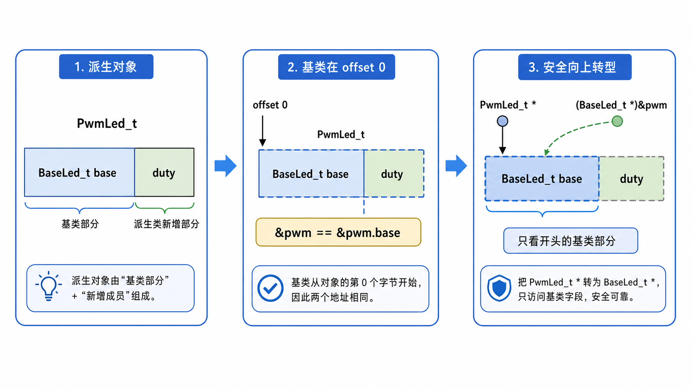

`PwmLed_t` 的前两个字节就是 `BaseLed_t`，第三个字节才是自己的 `duty`。

因为 `base` 就放在 `PwmLed_t` 的起始地址，所以这两个地址**永远相同**：

```c
PwmLed_t pwm_led;
&pwm_led == &pwm_led.base   // true，地址一模一样
```

于是你就可以安全地把 `PwmLed_t *` 当成 `BaseLed_t *` 来用：

```c
PwmLed_t  pwm_led;
BaseLed_t *base = (BaseLed_t *)&pwm_led;   // 向上转型
```

这就叫**向上转型**：把更具体的派生类，当成更抽象的基类来使用。

为什么它是零开销？因为这里没有申请新内存，没有复制对象，没有多走一步函数。**只是换了一个看待同一块内存的视角。**

#### 4.2.2 继承到底帮你省了什么

如果不用继承，你会很容易写成这样：

```c
typedef struct { uint8_t pin; bool is_on; } NormalLed_t;
typedef struct { uint8_t pin; bool is_on; uint8_t duty; } PwmLed_t;
typedef struct { uint8_t pin; bool is_on; uint8_t r, g, b; } RgbLed_t;
```

表面上看没问题，实际上 `pin` 和 `is_on` 被复制了三遍。后面如果你给基类再加一个 `brightness` 或 `error_code`，三个结构体都要同步改——这和第一节讲的 `red_led_on()` / `green_led_on()` / `blue_led_on()` 一样，本质还是复制粘贴。

用了 struct 嵌套之后，共有部分只定义一次：

```c
typedef struct {
    uint8_t pin;
    bool    is_on;
} BaseLed_t;

typedef struct { BaseLed_t base; } NormalLed_t;

typedef struct {
    BaseLed_t base;
    uint8_t   duty;
} PwmLed_t;

typedef struct {
    BaseLed_t base;
    uint8_t   r, g, b;
} RgbLed_t;
```

这样一来：

- 共有字段只写一遍
- 基类接口可以统一复用，写一个 `base_led_on(BaseLed_t *)` 就能操作所有 LED
- 派生类只关心自己新增的那部分

#### 4.2.3 代码实战

打开 [`code/v6_继承_struct_嵌套/`](code/v6_继承_struct_嵌套/)，你会看到这种典型写法：

```c
typedef struct {
    uint8_t pin;
    bool    is_on;
} BaseLed_t;

typedef struct {
    BaseLed_t base;
    uint8_t   duty;
} PwmLed_t;

int base_led_on(BaseLed_t *base) {
    base->is_on = true;
    platform_gpio_write(base->pin, true);
    return 0;
}
```

调用的时候，`PwmLed_t` 可以直接复用基类接口：

```c
PwmLed_t pwm_led;
pwm_led.base.pin = 5;
pwm_led.duty = 50;

base_led_on((BaseLed_t *)&pwm_led);   // 向上转型，复用基类逻辑
```

这就是继承的第一个价值：**先把共同的数据结构抽出来，再让派生类往后接自己的扩展。**

你会发现，C 语言里所谓的继承根本不神秘——就是一句话：

> 把公共部分放前面，把扩展部分放后面。

下一节再往前走一步：既然数据结构已经能继承，那行为能不能也继承，甚至重写？这就引出了函数指针实现多态。

### 4.3 多态基础---函数指针

4.2 解决的是"数据怎么复用"：`PwmLed_t` 的开头就是一个 `BaseLed_t`，所以它能复用基类字段和基类函数。

但这还不够。因为真实驱动里麻烦的从来不只是数据，还有**行为**。

还是刚才的三种 LED：

- 普通 LED 的 `on`：写 GPIO 的 `BSRR` 寄存器
- PWM LED 的 `on`：打开定时器通道，设置 `CCR` 占空比
- I2C 扩展 LED 的 `on`：走 I2C 发一条命令

它们都叫"开灯"，但底层动作完全不一样。

如果你继续沿用普通函数写法，上层逻辑很快就会长成这样：

```c
if (type == LED_NORMAL) {
    normal_led_on(&normal);
} else if (type == LED_PWM) {
    pwm_led_on(&pwm);
} else if (type == LED_I2C) {
    i2c_led_on(&i2c);
}
```

这段代码最大的问题不是丑，而是**上层知道得太多了**。

上层本来只想表达"把这盏灯打开"，结果它被迫知道：

- 这盏灯到底是普通 GPIO、PWM 还是 I2C
- 每种灯分别调用哪个函数
- 以后新增一种灯时，这个 `if-else` 还要再改一遍

这就和前面 `red_led_on()`、`green_led_on()` 的复制问题是同一种病，只是这次病灶从"字段重复"转移到了"行为分发"。

我们想要的接口应该是这样：

```c
led_on(&normal);
led_on((Led_t *)&pwm);
```

同一个 `led_on()`，传普通 LED 就走普通 GPIO 实现，传 PWM LED 就走 PWM 实现。上层只认"灯"，不关心灯背后接的是 GPIO、定时器还是 I2C。

这就是**多态**。

#### 4.3.1 C++ 是怎么写的

在 C++ 里，这件事会写得非常自然：

```cpp
class Led {
public:
    virtual void on() = 0;
    virtual void off() = 0;
};

class NormalLed : public Led {
public:
    void on() override {
        GPIO->BSRR = GPIO_PIN_13;
    }

    void off() override {
        GPIO->BSRR = (uint32_t)GPIO_PIN_13 << 16;
    }
};

class PwmLed : public Led {
public:
    int duty;

    void on() override {
        TIM3->CCR1 = duty;
    }

    void off() override {
        TIM3->CCR1 = 0;
    }
};
```

然后上层可以只拿一个基类指针：

```cpp
void blink(Led *led) {
    led->on();
    delay_ms(100);
    led->off();
}
```

`blink()` 根本不需要知道传进来的是 `NormalLed` 还是 `PwmLed`。只要这个对象是一个 `Led`，它就能调用 `on()` 和 `off()`。

这里最关键的是 `virtual`。

如果没有 `virtual`，`led->on()` 会在编译期就决定调用 `Led::on()`。加上 `virtual` 之后，编译器会把这个调用变成一件运行时才能决定的事：

> 先从对象里找到一张函数表，再从表里取出真正的 `on` 函数，然后调用它。

这就是 C++ 虚函数的底层味道。语法看起来像 `led->on()`，机器真正干的事情更接近：

```c
led->vptr->on(led);
```

也就是说，C++ 的多态并不是魔法。它的核心就是两样东西：

1. 对象里藏着"我这类对象应该用哪套函数"的信息
2. 调用接口时，不直接写死函数名，而是通过这个信息间接调用

C 语言没有 `virtual` 关键字，但 C 有函数指针。函数指针就是我们手搓多态的入口。

#### 4.3.2 把函数指针放进对象

先把普通 `Led_t` 改成这样：

```c
typedef struct Led_t {
    uint8_t pin;
    bool    is_on;

    void (*do_on)(struct Led_t *led);
    void (*do_off)(struct Led_t *led);
    void (*do_toggle)(struct Led_t *led);
} Led_t;
```

前两个字段还是普通属性：

- `pin`：这盏灯接在哪个引脚
- `is_on`：这盏灯当前是否点亮

后面三个字段就不是数据了，而是"行为"：

- `do_on`：这盏灯自己的开灯函数
- `do_off`：这盏灯自己的关灯函数
- `do_toggle`：这盏灯自己的翻转函数

也就是说，每个对象不光带着自己的状态，还带着自己的操作方式。

普通 LED 初始化时，把函数指针填成普通 GPIO 版本：

```c
static void normal_on(Led_t *led) {
    led->is_on = true;
    printf("  [Normal] Pin%d -> ON\n", led->pin);
}

int normal_led_init(Led_t *led, uint8_t pin) {
    return led_init(led, pin, normal_on, normal_off, normal_toggle);
}
```

PWM LED 初始化时，把函数指针填成 PWM 版本：

```c
typedef struct {
    Led_t   base;
    uint8_t duty;
} PwmLed_t;

static void pwm_on(Led_t *led) {
    PwmLed_t *real = (PwmLed_t *)led;
    real->base.is_on = true;
    printf("  [PwmLED] Pin%d -> ON, duty=%d%%\n",
           real->base.pin,
           real->duty);
}

int pwm_led_init(PwmLed_t *pwm, uint8_t pin, uint8_t duty) {
    led_init(&pwm->base, pin, pwm_on, pwm_off, pwm_toggle);
    pwm->duty = duty;
    return 0;
}
```

注意这里有一个细节：`pwm_on()` 的参数类型仍然是 `Led_t *`，因为它要塞进 `do_on` 这个统一接口里。

但是 PWM 的实现确实需要访问 `duty`，而 `duty` 不在 `Led_t` 里面，在 `PwmLed_t` 里面。所以函数一进来就做了一次转换：

```c
PwmLed_t *real = (PwmLed_t *)led;
```

这句话现在先记住：**外面用基类指针统一调用，里面转回真实类型访问扩展字段。**

为什么这个转换能成立，什么时候会翻车，4.5 专门讲。

#### 4.3.3 统一接口只负责分发

对象里有了函数指针以后，对外接口就可以写得非常薄：

```c
int led_on(Led_t *led) {
    led->do_on(led);
    return 0;
}

int led_off(Led_t *led) {
    led->do_off(led);
    return 0;
}

int led_toggle(Led_t *led) {
    led->do_toggle(led);
    return 0;
}
```

`led_on()` 自己不再关心 GPIO、PWM、I2C。它只做一件事：

> 去这个对象自己的 `do_on` 字段里，拿出真正应该调用的函数。

于是 `main.c` 可以写得很干净：

```c
Led_t normal;
PwmLed_t pwm;

normal_led_init(&normal, 13);
pwm_led_init(&pwm, 5, 80);

led_on(&normal);
led_on((Led_t *)&pwm);
```

两次调用看起来都是 `led_on()`，但实际执行路径不一样：

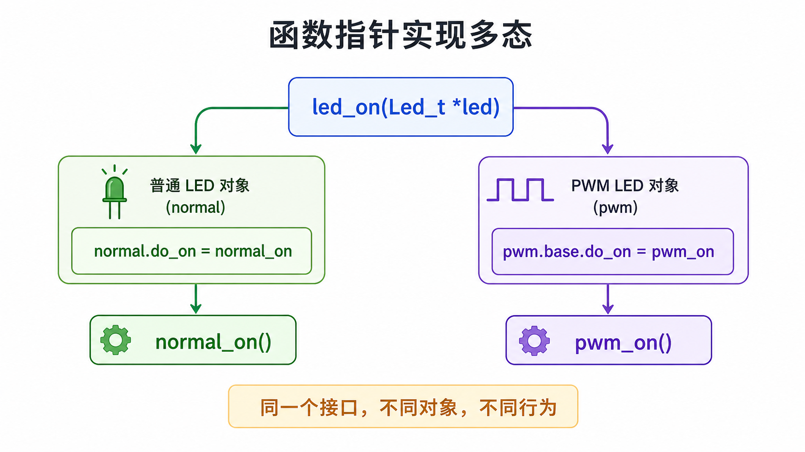

读这张图时顺着箭头走：统一入口永远是 `led_on(Led_t *led)`；普通 LED 对象里的 `do_on` 指向 `normal_on`；PWM LED 对象里的 `do_on` 指向 `pwm_on`。所以多态不是 `led_on()` 自己变聪明了，而是对象在初始化时已经把"该调用谁"写进了自己的函数指针字段。

| 调用 | 对象里的函数指针 | 实际执行 |
|------|------------------|----------|
| `led_on(&normal)` | `normal.do_on = normal_on` | 普通 GPIO 开灯 |
| `led_on((Led_t *)&pwm)` | `pwm.base.do_on = pwm_on` | PWM 开灯 |

这就是 C 语言里的多态。

你可以把它翻译成一句很朴素的话：

> 同一个接口，调用对象自己携带的那份实现。

C++ 的 `virtual` 帮你自动放函数表、自动分发；C 语言则要求你自己把函数指针放进结构体，自己在初始化时填好。

语法糖没了，但机制还在。

#### 4.3.4 代码实战

打开 [`code/v7_多态_函数指针/`](code/v7_多态_函数指针/)，这一版相比 v6 多了三个关键点。

第一，`Led_t` 不再只是数据，也带着函数指针：

```c
typedef struct Led_t {
    uint8_t pin;
    bool is_on;
    void (*do_on)(struct Led_t *led);
    void (*do_off)(struct Led_t *led);
    void (*do_toggle)(struct Led_t *led);
} Led_t;
```

第二，初始化时决定"这个对象以后怎么响应 on/off/toggle"：

```c
int led_init(Led_t *led,
             uint8_t pin,
             void (*on)(Led_t *),
             void (*off)(Led_t *),
             void (*toggle)(Led_t *)) {
    led->pin = pin;
    led->is_on = false;
    led->do_on = on;
    led->do_off = off;
    led->do_toggle = toggle;
    return 0;
}
```

第三，上层永远调用统一接口：

```c
normal_led_init(&normal, 13);
pwm_led_init(&pwm, 5, 80);

led_on(&normal);
led_on((Led_t *)&pwm);
```

这就是从"继承"跨到"多态"的关键一步。

v6 只能让不同 LED 复用共同字段；v7 开始，不同 LED 可以复用同一套上层接口，同时保留各自不同的底层行为。

不过 v7 还有一个明显问题：每个对象里面都放了三根函数指针。

如果系统里只有两三盏 LED，这无所谓。但如果你有 100 个同类型对象，每个对象都存一模一样的 `do_on/do_off/do_toggle`，这就有点浪费了。

下一节要做的事情，就是把这三根函数指针从"每个对象一份"抽出去，变成"同一类对象共享一张表"。这张表就是 C 语言里的虚表，也就是常见的 `ops` 结构体。

### 4.4 虚表---ops 结构体

4.3 的函数指针版本已经能工作了：普通 LED 和 PWM LED 都能走同一个 `led_on()`，再由对象内部的 `do_on` 指针分发到不同实现。

但是它还有一个工程上的小问题：**函数指针被放进了每一个对象里。**

回顾 v7 的结构体：

```c
typedef struct Led_t {
    uint8_t pin;
    bool    is_on;

    void (*do_on)(struct Led_t *led);
    void (*do_off)(struct Led_t *led);
    void (*do_toggle)(struct Led_t *led);
} Led_t;
```

如果系统里只有一盏普通 LED 和一盏 PWM LED，这样写很舒服。

但如果你有 100 盏普通 LED，它们的 `do_on/do_off/do_toggle` 全都指向同一组三个函数。也就是说，这 100 个对象里存了 100 份一模一样的函数指针。

在 64 位机器上，一个函数指针通常是 8 字节，三个就是 24 字节。100 个对象光函数指针就占 2400 字节。

在 PC 上这点内存无所谓，但在单片机上你会本能地皱一下眉头：这 2400 字节明明全是重复信息。

更合理的做法是：

- 每个普通 LED 不再各自保存 `normal_on/normal_off/normal_toggle`
- 所有普通 LED 共享一张"普通 LED 操作表"
- 所有 PWM LED 共享一张"PWM LED 操作表"
- 对象里只保存一个指向这张表的指针

这张表就是我们常说的 `ops`。

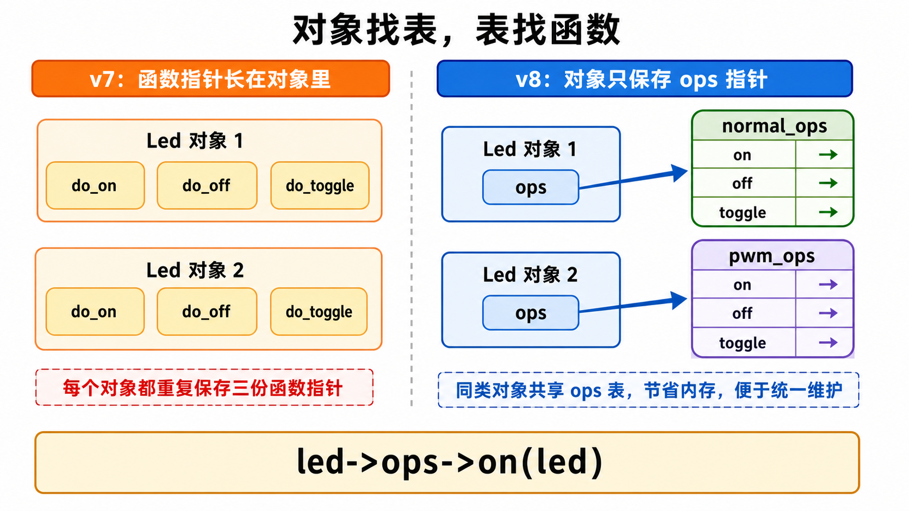

从图里可以看到，v7 的问题不是不能分发，而是每个对象都重复保存 `do_on/do_off/do_toggle`。v8 把重复的三根函数指针收进 `normal_ops`、`pwm_ops` 这种共享表里，对象只留下一个 `ops` 指针。调用路径也从"对象直接找函数"变成"对象找表，表找函数"：`led->ops->on(led)`。

#### 4.4.1 C++ 虚表到底是什么

C++ 的虚函数正是这么干的。

你写：

```cpp
class Led {
public:
    virtual void on() = 0;
    virtual void off() = 0;
    virtual void toggle() = 0;
};

class PwmLed : public Led {
public:
    void on() override;
    void off() override;
    void toggle() override;
};
```

表面上你只是在类里写了几个 `virtual` 函数。

但编译器通常会在背后生成两样东西：

1. 一张虚函数表，也就是 vtable
2. 对象里的一个虚表指针，也就是 vptr

可以粗略理解成这样：

```c
struct LedVTable {
    void (*on)(Led *self);
    void (*off)(Led *self);
    void (*toggle)(Led *self);
};

struct Led {
    const struct LedVTable *vptr;
    int pin;
    bool is_on;
};
```

`NormalLed` 有自己的 vtable：

```c
static const LedVTable normal_vtable = {
    .on = normal_on,
    .off = normal_off,
    .toggle = normal_toggle,
};
```

`PwmLed` 也有自己的 vtable：

```c
static const LedVTable pwm_vtable = {
    .on = pwm_on,
    .off = pwm_off,
    .toggle = pwm_toggle,
};
```

当你写：

```cpp
led->on();
```

底层大致就是：

```c
led->vptr->on(led);
```

所以，虚函数并不是"对象里塞一堆函数代码"。代码只有一份，函数表也通常只有一份。每个对象只是多存一个指针，告诉运行时：

> 我这个对象应该使用哪一张函数表。

C 语言没有编译器自动生成的 vtable，但我们可以手写同样的结构。

#### 4.4.2 C 语言里的 ops 表

v8 把 v7 里的三个函数指针收进一个结构体：

```c
typedef struct {
    void (*on)(struct Led_t *led);
    void (*off)(struct Led_t *led);
    void (*toggle)(struct Led_t *led);
} LedOps_t;
```

这个 `LedOps_t` 不是一个 LED 对象，它是一张"操作表"。

然后 `Led_t` 不再保存三根函数指针，而是保存一个 `ops` 指针：

```c
typedef struct Led_t {
    uint8_t pin;
    bool    is_on;
    const LedOps_t *ops;
} Led_t;
```

普通 LED 的操作表：

```c
static const LedOps_t normal_ops = {
    .on = normal_on,
    .off = normal_off,
    .toggle = normal_toggle,
};
```

PWM LED 的操作表：

```c
static const LedOps_t pwm_ops = {
    .on = pwm_on,
    .off = pwm_off,
    .toggle = pwm_toggle,
};
```

初始化普通 LED 时，`ops` 指向 `normal_ops`：

```c
led_init(&normal, 13, led_get_normal_ops());
```

初始化 PWM LED 时，`ops` 指向 `pwm_ops`：

```c
int pwm_led_init(PwmLed_t *pwm, uint8_t pin, uint8_t duty) {
    led_init(&pwm->base, pin, &pwm_ops);
    pwm->duty = duty;
    return 0;
}
```

分发接口也只变了一点点：

```c
int led_on(Led_t *led) {
    led->ops->on(led);
    return 0;
}
```

这行代码就是 C 语言版的虚函数调用。

你可以把它和 C++ 对照起来看：

| C++ | C |
|-----|---|
| `virtual void on()` | `LedOps_t` 里的 `on` 函数指针 |
| 编译器生成 vtable | 手写 `static const LedOps_t normal_ops` |
| 对象里隐藏 vptr | `Led_t` 里显式写 `const LedOps_t *ops` |
| `led->on()` | `led->ops->on(led)` |

到这里，C++ 的虚函数就彻底脱掉外衣了。

#### 4.4.3 为什么 ops 常常是 const static

你在 HAL、Linux、RT-Thread 里会经常看到这种写法：

```c
static const struct file_operations led_fops = {
    .open = led_open,
    .read = led_read,
    .write = led_write,
    .release = led_release,
};
```

`static` 和 `const` 都不是装饰品。

`static` 的意思是：这张表只在当前 `.c` 文件内部可见，外面不要直接摸它。这和前面讲过的"头文件是菜单，`.c` 是厨房"完全一致。

`const` 的意思是：这张表初始化之后不应该再改。函数表描述的是"这一类对象的行为"，它不是某一个对象的运行时状态。

所以 v8 里这样写：

```c
static const LedOps_t pwm_ops = {
    .on = pwm_on,
    .off = pwm_off,
    .toggle = pwm_toggle,
};
```

它表达的是：

> PWM LED 这一类对象，统一使用这套操作函数。

对象自己只需要带一个指针：

```c
typedef struct {
    Led_t   base;
    uint8_t duty;
} PwmLed_t;
```

`duty` 是每个 PWM LED 自己的状态，必须放在对象里。

`pwm_on/pwm_off/pwm_toggle` 是这一类 PWM LED 共享的行为，应该放在 `pwm_ops` 里。

这就是数据和行为的进一步拆分。

#### 4.4.4 代码实战

打开 [`code/v8_多态_ops虚表/`](code/v8_多态_ops虚表/)，你会看到 v8 和 v7 的关系非常清楚：

```c
typedef struct {
    void (*on)(struct Led_t *led);
    void (*off)(struct Led_t *led);
    void (*toggle)(struct Led_t *led);
} LedOps_t;

typedef struct Led_t {
    uint8_t pin;
    bool is_on;
    const LedOps_t *ops;
} Led_t;
```

统一接口：

```c
int led_on(Led_t *led) {
    led->ops->on(led);
    return 0;
}
```

普通 LED 和 PWM LED 的区别不在 `led_on()`，而在初始化时塞进去的是哪张 `ops` 表。

这就是 ops 的价值：

- 上层接口稳定：永远调用 `led_on/led_off/led_toggle`
- 每类对象共享一张操作表：节省重复函数指针
- 新增类型时只新增一张 ops 表：旧的上层逻辑不用改

你以后看 Linux 驱动时，见到 `xxx_ops`、`xxx_fops`、`xxx_driver` 这种结构体，不要把它当成"一堆函数指针凑在一起"。

它本质上就是 C 语言的虚表。

#### 4.4.5 ops 表里的雷：函数指针没填怎么办·三种策略

ops 表把行为收进了一张函数指针表，很干净。但干净背后埋着一颗雷：**要是某个子类的 ops 表，有个函数指针忘了填呢？**

回顾统一接口：

```c
int led_on(Led_t *led) {
    return led->ops->on(led);   // 如果 ops->on 是 NULL 呢？
}
```

C 标准规定，静态存储的对象里没显式初始化的字段会被**零初始化**。所以只要子类的 ops 表少写一行 `.on`，`ops->on` 就是 `NULL`：

```c
static const LedOps_t broken_ops = {
    .off = my_off,
    // .on 忘了填 —— 自动是 NULL
};
```

上层照常调 `led_on(led)`，进到 `led->ops->on(led)`，把 `NULL` 当函数地址跳过去。在 STM32 上一般是 0 地址（向量表起点），跳进去取出"函数指针"再跳，行为不可预测，多半是 **HardFault 死循环**；在 Linux 用户态直接 `SIGSEGV`，进程当场死。**编译器一句话不说就放你过了——它以为你是故意填 NULL 的。**

怎么办？工业代码里按"这个操作该不该必须实现"，分三种策略。

**策略一：必填 —— 调用前 `assert`**

`on`、`off` 是灯的核心功能。一盏灯不能开、不能关，那还叫灯吗？这种操作**必须**每个子类都实现。做法是在父类统一接口里，分发前先断言：

```c
int led_on(Led_t *led) {
    if (led == NULL) return -1;
    assert(led->ops && led->ops->on && "led_on: 子类必须实现 on()");
    return led->ops->on(led);
}
```

调试构建里，忘填 `on` 的子类一调就 `abort`，直接告诉你哪个文件哪一行触发；Release 构建打开 `NDEBUG`，`assert` 编译产物直接消失，**零开销**。这一类操作叫**必填**——子类不实现，整个对象就是残废的。

> **合同的必填项，不填，合同无效。**

**策略二：选填 —— 父类提供默认行为**

但有些操作不是每个子类都需要。比如再给 LED 加一个 `set_brightness`：PWM 灯支持调光，GPIO 灯只有"开"和"关"，压根没有亮度概念。

如果也强制 GPIO 子类实现，它就得写一个啥都不干的空函数——每个不支持调光的子类都写一遍空壳，烦。更好的做法：**把"安静跳过"的默认行为放进父类统一接口**：

```c
int led_set_brightness(Led_t *led, uint8_t brightness) {
    if (led == NULL || led->ops == NULL) return -1;

    if (led->ops->set_brightness == NULL) {
        return 0;                 // 默认行为：这盏灯不支持调光，安静跳过
    }
    return led->ops->set_brightness(led, brightness);
}
```

GPIO 子类的 ops 表就大大方方只填 `on`/`off`，`set_brightness` 留空为 NULL。上层调 `led_set_brightness(gpio_led, 50)` 走的是父类默认那条分支，不崩。

关键是：**ops 表本身从来不改**，NULL 就是 NULL，**处理这个 NULL 的责任落在父类统一接口上**，而不是逼每个子类填空壳。这一类操作叫**选填**——不填就用默认条款，但合同主体没变。

**策略三：全必填 —— 这张表就成了"接口"**

把策略一推到极致：**如果一张 ops 表里每一个函数都是必填的呢？**

换个对象最好懂——传感器 `Sensor`。它的 `read`（读值）、`calibrate`（校准）、`self_test`（自检）三件套全是必填：一个 sensor 不能读、或不能校准、或不能自检，就不算 sensor。于是父类接口里三个函数**全部 `assert`**：

```c
int sensor_read(Sensor_t *me, int32_t *out) {
    if (me == NULL || out == NULL) return -1;
    assert(me->ops && me->ops->read && "sensor.read 是接口契约的一部分");
    return me->ops->read(me, out);
}
// calibrate / self_test 同样每个都 assert
```

任何 sensor 子类想加进这套体系，三件套必须全填，少一个调试期立刻爆。**这种"全是必填的 ops 表"，软件工程里有个正式名字——接口（interface）：一份只有规格、没有实现的合同。**

记住这个词。因为 §7 讲工程分层时，最上面那层就叫 **Interface 父类层**——它定义"LED 应该能做什么"（`init`/`write`/`read`），却一个都不实现，把实现全甩给子类。那一层的本质，就是这里的"全必填 ops 表"。

> 📖 兆鸣原书：ch14「虚函数不实现·三种策略」——必填 `assert` / 选填默认 / 全必填 = 接口。

### 4.5 向上转型和向下转型：同样是强转，为什么风险不同

到现在为止，我们已经写过两类看起来很像的强制类型转换。

第一类出现在上层调用里：

```c
led_on((Led_t *)&pwm);
```

第二类出现在子类函数里：

```c
PwmLed_t *real = (PwmLed_t *)led;
```

它们都长着一张 C 强转的脸，但含义完全不一样。

第一句是：**我有一个具体的 PWM LED，现在只想把它当成普通 LED 接口来用。**

第二句是：**我手里只有一个普通 LED 指针，但我需要找回它背后的 PWM LED，访问 `duty` 这种子类字段。**

所以这一节先解决一个非常实际的问题：

> 同样是 `(Type *)ptr`，为什么有的强转通常安全，有的强转像拆盲盒？

这就是向上转型和向下转型要解决的事。

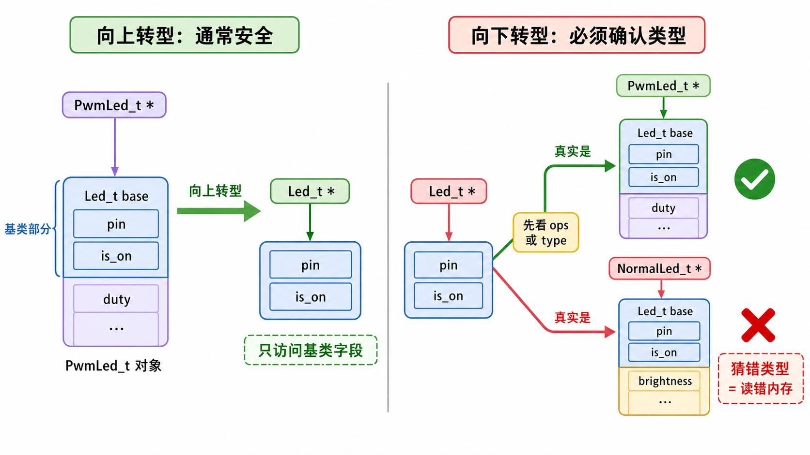

读这张图时先记住一句话：**向上转型是把具体对象交给抽象接口，向下转型是从抽象接口找回真实对象。**

前者像把一把电钻交给“工具”这个抽象柜子管理。你只用它的“工具”能力，通常没问题。后者像从柜子里拿出一件东西，硬说它一定是电钻，然后去找扳机。如果它其实是扳手，那就尴尬了。

#### 4.5.1 先把方向讲清楚

在 C++ 里，继承关系通常画成这样：

```text
Led
├── NormalLed
└── PwmLed
```

`Led` 更抽象，`PwmLed` 更具体。

从子类往父类走，叫**向上转型**：

```cpp
PwmLed pwm;
Led *led = &pwm;       // PwmLed* -> Led*
```

从父类往子类走，叫**向下转型**：

```cpp
Led *led = get_led();
PwmLed *pwm = static_cast<PwmLed *>(led);  // Led* -> PwmLed*
```

为什么一个叫上，一个叫下？不是因为内存地址高低，而是因为继承树的方向：父类在上，子类在下。

C 语言没有 `class`，但我们前面用结构体首字段模拟了同样的关系：

```c
typedef struct Led_t {
    uint8_t pin;
    bool    is_on;
    const LedOps_t *ops;
} Led_t;

typedef struct {
    Led_t   base;
    uint8_t duty;
} PwmLed_t;
```

这里的继承关系可以读成：

```text
PwmLed_t 是一个更具体的 LED
它的开头是一份 Led_t base
它后面又多了一个 duty
```

所以转型本质上不是“对象变身”。对象没有复制，没有重建，也没有从 PWM LED 变成普通 LED。

转型只是告诉编译器：

> 接下来，请你按哪个结构体视角去解释这块内存。

#### 4.5.2 向上转型：把具体对象交给统一接口

先看向上转型。

```c
PwmLed_t pwm;
pwm_led_init(&pwm, 5, 80);

led_on((Led_t *)&pwm);
```

这句代码的意思是：

> `pwm` 是一个更具体的 LED，但 `led_on()` 只需要一个普通的 `Led_t *`，所以我把它当成父类接口传进去。

为什么这通常安全？

因为 `Led_t base` 是 `PwmLed_t` 的第一个字段：

```text
PwmLed_t 对象
+----------------------+---------+
| Led_t base           | duty    |
+----------------------+---------+
^
|
&pwm 和 &pwm.base 地址相同
```

所以这两个指针指向同一个起点：

```c
&pwm == &pwm.base
```

当我们写：

```c
Led_t *led = (Led_t *)&pwm;
```

编译器看到的是：

```text
从这块内存的起点开始，按 Led_t 的字段去读：
pin / is_on / ops
```

而这些字段确实就在 `PwmLed_t` 的开头。

更关键的是，`led_on()` 只访问父类字段：

```c
int led_on(Led_t *led) {
    led->ops->on(led);
    return 0;
}
```

它不会直接访问 `duty`，也不会假装自己知道 PWM 的细节。

这就是向上转型安全的边界：

1. 子类对象的第一个字段必须是父类对象
2. 转成父类指针以后，只按父类接口使用

说白了，向上转型是在做抽象：

> 我知道你是 PWM LED，但我现在只需要你作为一个 LED。

这正是多态能工作的入口。上层 `blink()`、`led_on()`、`led_toggle()` 不必关心你到底是 GPIO LED、PWM LED 还是 I2C LED，它只拿 `Led_t *`。

#### 4.5.3 向下转型：子类实现要找回真实对象

再看向下转型。

PWM LED 的 `on` 函数必须访问 `duty`：

```c
static void pwm_on(Led_t *led) {
    PwmLed_t *real = (PwmLed_t *)led;

    real->base.is_on = true;
    printf("duty=%d\n", real->duty);
}
```

问题来了：函数参数为什么还是 `Led_t *`？

因为 `pwm_on` 要塞进统一的 `LedOps_t` 表里：

```c
typedef struct {
    void (*on)(Led_t *led);
    void (*off)(Led_t *led);
    void (*toggle)(Led_t *led);
} LedOps_t;
```

统一接口要求所有 `on` 函数都长一个样：

```text
normal_on(Led_t *led)
pwm_on(Led_t *led)
i2c_led_on(Led_t *led)
```

这样 `led_on()` 才能不管真实类型，统一写成：

```c
led->ops->on(led);
```

但是进入 `pwm_on()` 之后，情况变了。它不再是上层接口，它是 PWM LED 自己的实现。它要设置占空比，要读 `duty`，这些字段不在 `Led_t` 里。

所以它必须把父类指针找回真实子类：

```c
PwmLed_t *real = (PwmLed_t *)led;
```

这就叫向下转型。

向下转型的问题在于：`Led_t *` 背后不一定真的是 `PwmLed_t`。

如果它真的是 PWM LED：

```c
PwmLed_t pwm;
pwm_led_init(&pwm, 5, 80);

Led_t *led = (Led_t *)&pwm;
pwm_on(led);       // 可以，led 背后确实是 PwmLed_t
```

这没问题。

但如果它其实是普通 LED：

```c
Led_t normal;
led_init(&normal, 13, led_get_normal_ops());

PwmLed_t *wrong = (PwmLed_t *)&normal;
printf("%d\n", wrong->duty);
```

这就错了。

`normal` 后面根本没有 `duty`。你硬要读，C 编译器不会跳出来说“同学你冷静一下”。它会非常信任你，然后按 `PwmLed_t` 的布局去读后面的内存。

读到什么？看运气。

这就是向下转型危险的根源：

> 父类指针只能证明“它至少像一个 LED”，不能自动证明“它一定是 PWM LED”。

#### 4.5.4 ops 是向下转型的护栏

那 `pwm_on()` 里直接 `(PwmLed_t *)led` 是不是太野了？

如果你在任何地方都能随手调用 `pwm_on((Led_t *)&normal)`，那确实很野。

但在我们这个设计里，`pwm_on()` 不是给上层随便调用的。它是藏在 `pwm_ops` 表里的子类实现：

```c
static const LedOps_t pwm_ops = {
    .on = pwm_on,
    .off = pwm_off,
    .toggle = pwm_toggle,
};
```

而 `pwm_ops` 只在 `pwm_led_init()` 里绑定到 PWM LED 对象上：

```c
int pwm_led_init(PwmLed_t *pwm, uint8_t pin, uint8_t duty) {
    led_init(&pwm->base, pin, &pwm_ops);
    pwm->duty = duty;
    return 0;
}
```

于是正确调用链是这样的：

```text
pwm_led_init(&pwm, ...)
    -> pwm.base.ops = &pwm_ops

led_on((Led_t *)&pwm)
    -> led->ops->on(led)
    -> pwm_on(led)
    -> (PwmLed_t *)led
```

这条路里，能进入 `pwm_on()` 的 `led`，本来就是 `pwm.base`。

所以 `ops` 不只是函数分发表，它还承担了一层工程约定：

> 哪一类对象绑定哪一张 ops 表，哪一张 ops 表调用哪一组子类函数。

这不是 C++ 那种编译器级类型安全，而是 C 工程里很常见的**约定式类型安全**。

约定式类型安全不是“随便写，出事再说”。它要求你把规矩写进几个地方：

- 构造函数负责绑定正确的 `ops`
- 子类函数尽量 `static`，不要暴露给外部乱调
- 上层只调用 `led_on/led_off/led_toggle` 这种父类接口
- 不要手动篡改对象里的 `ops` 指针

如果项目更大、风险更高，还可以在父类里加类型标签：

```c
typedef enum {
    LED_TYPE_NORMAL,
    LED_TYPE_PWM,
} LedType_t;

typedef struct Led_t {
    uint8_t pin;
    bool    is_on;
    LedType_t type;
    const LedOps_t *ops;
} Led_t;
```

向下转型前先检查：

```c
if (led->type == LED_TYPE_PWM) {
    PwmLed_t *pwm = (PwmLed_t *)led;
}
```

这会多占一点内存，也会让代码啰嗦一点，但能换来更明确的防呆。小项目靠约定就够，大项目要看风险决定要不要加这道保险。

#### 4.5.5 转型规则小结

这一节只解决一件事：**什么时候可以把一个指针按另一个类型来理解。**

先记住这几句话：

1. **转型不是对象变身，只是换一种结构体视角解释同一块内存。**
2. **向上转型是子类到父类：具体对象交给统一接口，通常安全。**
3. **向下转型是父类到子类：子类实现找回真实对象，必须确认真实类型。**
4. **在本章 LED 示例里，`ops` 初始化约定就是向下转型的护栏。**

到这里，我们已经讲清楚了“为什么可以转”和“什么时候不能乱转”。

但还有一个更底层的问题没有完全展开：

```c
PwmLed_t *real = (PwmLed_t *)led;
```

这句代码看起来像是把 `Led_t *` 硬改成 `PwmLed_t *`。

实际上它做的是另一件事：

> 我手里有 `PwmLed_t` 里面 `base` 这个成员的地址，现在要从成员地址反推整个 `PwmLed_t` 的起始地址。

因为 `base` 正好在 offset 0，所以裸强转可以工作。

但如果我们想把这个动作写得更清楚、更通用，就要用下一节的 `container_of`。

## 5 container_of：把向下转型背后的地址计算讲明白

上一节讲的是转型的类型关系：`Led_t *` 背后必须真的来自 `PwmLed_t`，你才能把它转回 `PwmLed_t *`。

这一节讲的是更底层的地址关系：

> 既然 `led` 指向的是 `PwmLed_t` 里的 `base` 成员，那怎么从 `base` 的地址算回整个 `PwmLed_t` 的地址？

这就是 `container_of` 要解决的问题。

它不是新开一条故事线，也不是突然切去讲 RTOS。它只是把上一节那句强转背后的动作摊开：

```c
PwmLed_t *real = (PwmLed_t *)led;
```

这句能跑，但信息量太少。读者看到它，只能在心里补一句：

> 这里应该是因为 `led` 指向 `pwm.base`，所以可以转回 `PwmLed_t` 吧？

`container_of` 做的事情，就是把这句心里话写进代码。

### 5.1 从 Led_t base 找回 PwmLed_t

还是先看 PWM LED：

```c
typedef struct Led_t {
    uint8_t pin;
    bool    is_on;
    const LedOps_t *ops;
} Led_t;

typedef struct {
    Led_t   base;
    uint8_t duty;
} PwmLed_t;
```

内存布局是：

```text
PwmLed_t 对象
+----------------------+---------+
| Led_t base           | duty    |
+----------------------+---------+
^
|
base 在 offset 0
```

当上层这样调用：

```c
PwmLed_t pwm;
Led_t *led = (Led_t *)&pwm;
```

`led` 指向的不是一个孤零零的 `Led_t`，而是 `pwm` 对象里的 `base` 成员。

所以子类函数里要找回真实对象，本质上是在做：

```text
已知：成员地址 = &pwm.base
想要：宿主地址 = &pwm
```

因为 `base` 是第一个字段，偏移是 0，所以这两种写法结果一样：

```c
PwmLed_t *real = (PwmLed_t *)led;
```

和：

```c
PwmLed_t *real = container_of(led, PwmLed_t, base);
```

区别在表达力。

裸强转像一句暗号：

```c
PwmLed_t *real = (PwmLed_t *)led;
```

`container_of` 像一句说明书：

```c
PwmLed_t *real = container_of(led, PwmLed_t, base);
```

三个参数直接把意图说清楚：

```text
led        -> 我手里的成员指针
PwmLed_t   -> 我要找回的宿主类型
base       -> led 指向的是宿主里的哪个成员
```

读出来就是：

> `led` 指向的是 `PwmLed_t` 里的 `base` 成员，请把整个 `PwmLed_t` 找回来。

这比“相信我，它就是 PWM LED”要清楚得多。

### 5.2 换成 I2C LED 也是同一招

第 7 节会继续用一个更贴近工程的 I2C LED：

```c
typedef struct {
    Led_t base;

    const I2cLedPlatform_t *platform;
    uint16_t addr;
    uint8_t output_reg;
    uint8_t input_reg;
    uint8_t active_level;
} I2cLed_t;
```

上层仍然只拿父类指针：

```c
Led_t *led;
```

但是 I2C LED 的子类实现需要访问 `platform`、`addr`、`output_reg`。这些字段都不在 `Led_t` 里，而在外层的 `I2cLed_t` 里。

所以 `i2c_led_write()` 可以这样写：

```c
static int i2c_led_write(Led_t *led, LedState_t state)
{
    I2cLed_t *self = container_of(led, I2cLed_t, base);
    uint8_t value;

    value = (state == LED_ON) ? self->active_level : !self->active_level;

    return self->platform->ops->i2c_mem_write(self->platform,
                                              self->addr,
                                              self->output_reg,
                                              &value,
                                              1);
}
```

这段代码的阅读顺序很自然：

```text
led      -> 我手里的父类成员指针
I2cLed_t -> 我要找回的真实子类对象
base     -> led 指向的是 I2cLed_t 里的 base 成员
```

也就是说，`container_of` 不是专门为 PWM LED 服务的。

只要你采用这种结构：

```text
子类对象里嵌入一个父类成员
上层只拿父类成员指针
子类实现需要找回完整子类对象
```

就会遇到同一个问题，也可以用同一个公式解决。

下面这张图只画 LED 版本，先把这条主线走顺：

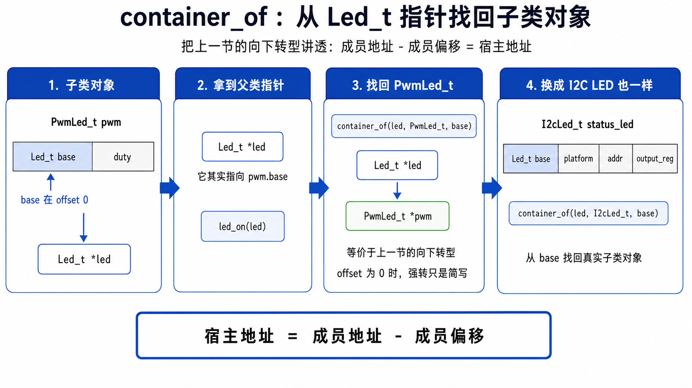

### 5.3 offsetof：真正起作用的是成员偏移

`container_of` 的核心定义很短：

```c
#define container_of(ptr, type, member) \
    ((type *)((char *)(ptr) - offsetof(type, member)))
```

三个参数分别是：

- `ptr`：你手里的成员指针
- `type`：宿主结构体类型
- `member`：这个成员在宿主结构体里的字段名

先看 LED 这个最简单的情况：

```c
container_of(led, PwmLed_t, base)
```

展开就是：

```c
(PwmLed_t *)((char *)led - offsetof(PwmLed_t, base))
```

公式就是：

```text
宿主地址 = 成员地址 - 成员偏移
```

把它放回 PWM LED：

```text
PwmLed_t 地址 = base 地址 - offsetof(PwmLed_t, base)
```

因为 `base` 是第一个字段：

```c
offsetof(PwmLed_t, base) == 0
```

所以它等价于：

```c
(PwmLed_t *)led
```

这就解释了上一节的裸强转为什么能工作。

但 `container_of` 比裸强转更通用，因为公式本身不要求成员必须在 offset 0。

假设以后有一个对象长这样：

```c
typedef struct {
    uint32_t magic;
    Led_t base;
    uint8_t duty;
} WrappedLed_t;
```

这时 `base` 不在开头，`(WrappedLed_t *)led` 就不能表达真实的地址回退动作了。你必须减掉 `base` 前面的偏移：

```c
WrappedLed_t *self = container_of(led, WrappedLed_t, base);
```

这才是 `container_of` 的完整意义。

为什么中间要转成 `char *`？

因为 C 语言里的指针加减不是按字节算的，而是按指向类型的大小算的。`char` 的大小就是 1 字节，所以把指针转成 `char *` 以后，减去偏移量才是精确的字节运算。

注意，`container_of` 没有运行时查表，也没有遍历，也没有额外内存。它只是一次指针减法。

这就是它在 Linux 内核里被大量使用的原因：通用、零分配、低开销。

### 5.4 代码实战

打开 [`code/v9_container_of/`](code/v9_container_of/)，这个版本不再切到任务调度，仍然围着 LED 讲。

核心结构是：

```c
typedef struct {
    Led_t base;
    uint8_t duty;
} PwmLed_t;

#define PWM_LED_FROM_BASE(ptr) container_of(ptr, PwmLed_t, base)
```

PWM LED 的 `on` 函数这样写：

```c
static void pwm_led_on(Led_t *led)
{
    PwmLed_t *pwm = PWM_LED_FROM_BASE(led);

    pwm->base.is_on = true;
    printf("PWM LED on, duty=%u\n", pwm->duty);
}
```

I2C LED 也是同一个套路：

```c
typedef struct {
    Led_t base;
    uint8_t addr;
    uint8_t output_reg;
} I2cLed_t;

#define I2C_LED_FROM_BASE(ptr) container_of(ptr, I2cLed_t, base)

static void i2c_led_on(Led_t *led)
{
    I2cLed_t *i2c = I2C_LED_FROM_BASE(led);

    printf("I2C LED on, addr=0x%02X, reg=0x%02X\n",
           i2c->addr,
           i2c->output_reg);
}
```

`main.c` 里故意只拿父类指针：

```c
Led_t *led = (Led_t *)&pwm;
led_on(led);
```

进入子类函数以后，再通过 `container_of` 找回真实子类对象：

```text
Led_t *base -> PwmLed_t *pwm
Led_t *base -> I2cLed_t *i2c
```

这比裸写 `(PwmLed_t *)led` 多几个字，但信息量完全不同：

```c
PwmLed_t *pwm = (PwmLed_t *)led;                   // 你得自己猜它为什么安全
PwmLed_t *pwm = container_of(led, PwmLed_t, base); // 代码直接说明：从 base 找宿主
```

到这里，§4 和 §5 的关系就清楚了：

- §4.5 讲类型关系：什么时候能从父类指针转回子类指针
- §5 讲地址关系：怎么从成员地址算回宿主对象地址

理解了这两句话，后面再看 FreeRTOS 的 TCB、Linux 的 `list_head`、`file_operations`、`container_of`，你就会发现它们不是突然冒出来的黑魔法，而是这一节 LED 例子的工业加强版。

## 6 面向对象实战：不用 HAL，手搓一个"形状面积计算器"

§2 到 §5 一路下来，武器攒了一堆：封装、自指指针、`static` 私有、首字段继承、ops 虚表、上/下转型、`container_of`。但你一直是**拿着 LED 边学边搓**——难免有种"我是真会了，还是只是跟着看懂了"的心虚。

这一节把武器全部抽出来，做一次纯粹的复习：**换一个跟硬件、跟 HAL 都无关的题目，把封装、继承、多态用 C++ 和 C 各写一遍。** 写完你就有底了。

### 6.1 题目：一个能算任意形状面积的计算器

需求很简单：

- 系统里有多种形状——圆、矩形、三角形……每种算面积的公式都不同（`πr²` / `w×h` / `½bh`）。
- 上层要能写一个 `total_area(shapes, n)`，把一堆**混在一起**的形状面积加起来——**却不用管每个到底是什么形状**。
- 以后新增一种形状（比如梯形），`total_area` 一行都不用改。

这道题把三个面向对象特性一次凑齐了：

- **封装**——每种形状打包自己的数据（圆有半径，矩形有长和宽）。
- **继承**——圆、矩形、三角形都"是一个形状"，共享"能算面积"这件事。
- **多态**——同一句 `area()`，不同形状跑不同公式。

### 6.2 先用 C++ 写一遍（对照组）

```cpp
class Shape {                          // 父类：定义"形状能干什么"
public:
    virtual double area() const = 0;   // 纯虚：每种形状必须自己实现
    virtual ~Shape() {}
};

class Circle : public Shape {          // 子类：圆，给不熟C++的同学补一下，这个是公有继承，表示shape的接口被放在public（.h头文件，非staic+.c）
    double r;
public:
    Circle(double r) : r(r) {}			//	构造函数（init)
    double area() const override { return 3.14159 * r * r; }//圆的面积
};

class Rectangle : public Shape {       // 子类：矩形
    double w, h;
public:
    Rectangle(double w, double h) : w(w), h(h) {}
    double area() const override { return w * h; }
};

// 上层：只认 Shape，不认具体形状
double total_area(Shape** shapes, int n) {
    double sum = 0;
    for (int i = 0; i < n; i++) sum += shapes[i]->area();   // ← 多态分发
    return sum;
}

int main() {
    Circle c(2.0);
    Rectangle r(3.0, 4.0);
    Shape* arr[] = { &c, &r };
    printf("%.2f\n", total_area(arr, 2));   // 12.57 + 12.00 = 24.57
}
```

全场核心就是 `total_area` 里那句 `shapes[i]->area()`：它压根不知道 `shapes[i]` 是圆还是矩形，编译器靠 vtable 在**运行时**找到对的 `area()`。这就是多态。C++ 把 vtable、继承、构造，全藏在了 `class` / `virtual` / `: public` 这几个关键字后面。

### 6.3 现在用 C 手搓同一份

C 没有 `class`、没有 `virtual`。但你 §2–§5 学的武器一件不缺。**对着 C++ 那份，一件件搓过来。**

**第一步：ops 虚表（§4.4）——"形状能干什么"**

```c
typedef struct Shape Shape;            // 前向声明，父类

typedef struct {                       // 虚表：这一类对象共有的行为
    double (*area)(const Shape *self);
} ShapeOps;
```

**第二步：父类对象（§2 封装）——只存"我用哪张虚表"**

```c
struct Shape {
    const ShapeOps *ops;               // 指向这类形状的虚表（= C++ 隐藏的 vptr）
};
```

**第三步：子类（§4.2 首字段继承）——父类打头，后面挂自己的数据**

```c
typedef struct { Shape base; double r;    } Circle;      // 首字段 = Shape
typedef struct { Shape base; double w, h; } Rectangle;
```

`Circle` 头上就是一个 `Shape`，所以 `Circle *` 能安全地当 `Shape *` 用（§4.5 向上转型）。

**第四步：子类实现（§3 `static` 私有 + §4.5 向下转型）**

```c
static double circle_area(const Shape *self) {     // static：实现藏在本 .c
    const Circle *c = (const Circle *)self;        // 向下转型，找回圆的真身
    return 3.14159 * c->r * c->r;
}
static const ShapeOps circle_ops = { .area = circle_area };   // 圆的虚表

static double rect_area(const Shape *self) {
    const Rectangle *r = (const Rectangle *)self;
    return r->w * r->h;
}
static const ShapeOps rect_ops = { .area = rect_area };       // 矩形的虚表
```

**第五步：构造函数（§2.3 init + 自指指针）——把对象和它的虚表绑上**

```c
void circle_init(Circle *self, double r) {     // self = 自指指针（就是 C++ 的 this）
    self->base.ops = &circle_ops;              // 绑上圆的虚表
    self->r = r;
}
void rect_init(Rectangle *self, double w, double h) {
    self->base.ops = &rect_ops;
    self->w = w; self->h = h;
}
```

**第六步：上层统一接口——多态分发，和 C++ 一模一样**

```c
double total_area(Shape **shapes, int n) {
    double sum = 0;
    for (int i = 0; i < n; i++)
        sum += shapes[i]->ops->area(shapes[i]);   // ← C 版的 shapes[i]->area()
    return sum;
}

int main(void) {
    Circle c;    circle_init(&c, 2.0);
    Rectangle r; rect_init(&r, 3.0, 4.0);
    Shape *arr[] = { (Shape *)&c, (Shape *)&r };   // 向上转型
    printf("%.2f\n", total_area(arr, 2));          // 24.57，和 C++ 版一字不差
}
```

跑起来输出和 C++ 版完全一致。那句 `shapes[i]->ops->area(shapes[i])`，就是 C++ `shapes[i]->area()` 脱掉语法糖之后的样子——**vtable 是你亲手摆出来的。**

要加一种梯形？新写一个 `struct Trapezoid { Shape base; ... }` + 一张 `trapezoid_ops` + 一个 `trapezoid_init`，`total_area` 一个字不改。这就是多态给你的"开闭"能力。

### 6.4 一张对照表：C++ 的每一样，C 都有对应

| 面向对象特性 | C++ | C（你手搓的） | 学在 |
|-------------|-----|--------------|------|
| 封装 | `class { private: double r; }` | `struct Circle { double r; }` | §2 |
| 私有实现 | `private` 方法 | `static` 函数藏在 `.c` | §3 |
| 父类接口 | `class Shape { virtual...; }` | `struct Shape { const ShapeOps *ops; }` | §4.4 |
| 继承 | `class Circle : public Shape` | 首字段 `Shape base` | §4.2 |
| 虚表 | 编译器生成 vtable | 手写 `static const ShapeOps circle_ops` | §4.4 |
| 虚表指针 | 对象里隐藏的 vptr | 显式的 `ops` 字段 | §4.4 |
| 构造 | `Circle(double r)` | `circle_init(self, r)` + 自指指针 | §2.3 |
| 向上转型 | `Shape* s = &c;`（隐式） | `(Shape *)&c`（显式） | §4.5 |
| 多态调用 | `s->area()` | `s->ops->area(s)` | §4.4 |
| 向下转型 | `static_cast<Circle*>(s)` | `(Circle *)self`（或 `container_of`） | §4.5 / §5 |

C++ 把这一切藏进关键字，写起来短；C 把它们全摊在明面，写起来长——但**每一步你都看得见，没有黑魔法**。这也正是读 Linux / FreeRTOS 这类纯 C 大工程时，你反而比"只会 C++"的人更有优势的原因：那些框架底下的对象、虚表、转型，全是你刚在这一节亲手摆过的零件。

### 6.5 回到 LED：这套骨架你其实一直在搓

把 `Shape` 换成 `Led_t`、`Circle` 换成 `I2cLed_t`、`area()` 换成 `write()`——你就回到了 §4 那盏灯。形状只是把同一套骨架搬到一个不带硬件的场景，让你确认：**这套面向对象你是真的会了，不是跟着 LED 混过去的。**

下一节 §7，我们就带着这套确认过的武器，把它摆进一个真实的工程分层里：一颗状态灯，从 App 一路走到硬件。

## 7 从对象到工程分层：一个 LED 驱动如何跨平台复用

前面我们已经把 C 语言里实现“对象”的几个基本手段讲完了：`struct` 负责封装数据，`.h` 和 `.c` 划出公有/私有边界，基类放在第一个字段可以模拟继承，函数指针和 `ops` 可以模拟多态，`container_of` 可以从成员指针找回宿主对象。

但真实嵌入式工程里还有一个更大的问题：

> 对象我会写了，可这些对象应该放在哪一层？
> 一个 LED 驱动，到底哪些代码属于 App，哪些属于 Board，哪些属于 Driver，哪些属于 Platform？

如果这个问题没有讲清楚，前面学到的面向对象技巧很容易只停留在“我会写一个漂亮的 `struct`”。项目稍微变大以后，`main.c` 还是会继续膨胀，HAL 调用、寄存器地址、业务状态、RTOS 同步全混在一起。

所以这一节不再把重点放在“做一个通用设备模型”上，而是把 C 面向对象放回工业嵌入式工程里，看一个 LED 驱动如何从单板代码演进成可复用、可移植的分层结构。

本节贯穿使用一个例子：**状态 LED**。它可能是 GPIO LED，可能是 PWM LED，也可能是挂在 I2C 扩展芯片上的 I2C LED。上层只想表达“点亮、熄灭、读取状态”，底层硬件实现可以完全不同。

### 7.1 崩坏：一个能点灯的 main.c，是怎么烂掉的

先给全章后半段立一个贯穿到底的例子：**状态 LED**——一颗告诉你系统在干嘛的灯。它可能直连 GPIO，可能是 PWM 呼吸灯，也可能挂在 I2C 扩展芯片上；上层只想说"亮 / 灭 / 现在什么状态"，底层怎么接，天差地别。

几乎每个项目的第一步，都是让这颗灯先亮起来。板上是颗 I2C LED，你会很自然地在 `main.c` 里直写：

```c
int main(void)
{
    HAL_Init();  SystemClock_Config();
    MX_GPIO_Init();  MX_I2C1_Init();

    uint8_t value = 0x00;
    HAL_I2C_Mem_Write(&hi2c1, 0x20 << 1, 0x02,
                      I2C_MEMADD_SIZE_8BIT, &value, 1, 100);   // 点亮
    while (1) { }
}
```

**这段代码没有错，甚至是工程早期最该写的代码。** Bring-up 阶段第一目标不是架构漂亮，而是确认几件硬事实：I2C1 通不通？`0x20` 有没有设备应答？`0x02` 是不是输出寄存器？写 `0x00` 灯会不会亮？没有这一步，后面所有抽象都可能建在错误的硬件假设上。

真正的问题不是"能不能这样写"，而是"**能不能一直这样写**"。

项目往前走，需求开始加码：启动完成灯常亮、升级中慢闪、故障快闪、低功耗前关灯、多个任务抢同一条 I2C 总线、下一版硬件换一颗 LED 控制芯片……只要还都堆在 `main.c` 里，它就会同时塞进**四类本该分开的信息**：

- **业务意图**——启动亮、故障闪（该属于 App）；
- **板级事实**——灯挂 I2C1、地址 `0x20`、低电平亮（该属于 Board）；
- **器件协议**——写 `0x02` 寄存器才控灯（该属于 Driver）；
- **芯片外设**——怎么调 `HAL_I2C_Mem_Write`、超时多少（该属于 Platform / HAL）。

四类信息一旦揉进一个文件，`main.c` 表面只是长了点，实际上**边界没了**。而边界一没，最痛的不是代码难看，是**变化再也关不住**：地址从 `0x20` 改成 `0x21`，你得在业务流程里满地找 magic number；LED 从低电平亮改成高电平亮，业务层被迫去理解电气极性；driver 里直接调 `HAL_I2C_Mem_Write`，它就被焊死在 STM32 上，PC 测不了、Linux 搬不走。**改一处，崩一片。**

所以分层不是为了好看，一句话就能说清它图什么：

> **谁的信息，留在谁那一层；谁的变化，也尽量停在谁那一层。**

业务改闪烁只动 App，换芯片只动 Platform，改地址只动 Board——**每次改动，尽量只落在该落的一层里**。问题立住了。可"分层"具体分成哪几层、每层又靠什么撑起来？答案，其实你手里已经攒齐了。

### 7.2 从散装武器到工程体系

**先别急着往下——清点一下弹药。** 前六节，每一节都塞给你一件武器：

| 节 | 你已经学会的武器 | 一句话 |
|----|----------------|--------|
| §2 | `struct` 封装 + 自指指针 | 把"数据"和"操作谁"打包成对象 |
| §3 | `static` 私有 + 数据归位 | 划出公私边界，每个变量各归其位 |
| §4 | 首字段继承 + `ops` 虚表 + 上/下转型 | 同一个接口，驱动多种实现 |
| §5 | `container_of` | 从成员指针找回完整宿主对象 |

单看每一件，你都会用了。**但真实工程从来不是"秀一件武器"——它要的是把这些武器编成阵法**，各就各位、协同起来，扛住 §7.1 那种"需求一变就崩"的冲击。

**这一节起，我们就把散兵编成阵法。** 阵法一共五层。注意——这五层**没有一个是新知识**，全是你已有武器的排兵布阵：

```text
   ┌───────────────────────────────────────────────┐
   │  App / Service    只说业务：亮 / 灭 / 闪         │  只调接口，不碰硬件
   ├───────────────────────────────────────────────┤
   │  Interface 父类    Led_t + ops：一盏灯能干什么    │  ← §4.4 ops 虚表
   ├───────────────────────────────────────────────┤
   │  Driver 子类       GpioLed / PwmLed / I2cLed     │  ← §4.2 继承 + §4.5 转型 + §5 container_of
   ├───────────────────────────────────────────────┤
   │  Platform          怎么写 GPIO/I2C、怎么加锁      │  ← §4.4 ops 虚表（再用一次，抽象"平台"）
   ├───────────────────────────────────────────────┤
   │  Board             装配这块板，绑地址/寄存器       │  ← §2 封装 + 构造 → 引出设备树
   └───────────────────────────────────────────────┘
                    ↓ 下面是 HAL / OS / 硬件（地基，不算设计层）
```

把它列成表，看得更清楚——每一层只回答一个问题、只挡一类变化、上岗一件你学过的武器：

| 层 | 替你挡住哪类变化 | 上岗的武器 |
|----|----------------|-----------|
| App / Service | 业务意图变（常亮 → 闪烁） | 只调接口，不碰硬件 |
| Interface 父类 | 上层想统一操作所有灯 | §4.4 `ops` 虚表 |
| Driver 子类 | 器件协议变（换芯片 / 改寄存器） | §4.2 首字段继承 + §4.5 向下转型 + §5 `container_of` |
| Platform | 芯片 / 平台变（STM32 → NXP） | §4.4 `ops` 虚表（这次抽象的是"平台"） |
| Board | 这块板怎么装配 | §2 封装 + 构造，最后引出设备树 |

> 说"五层"而不是"六层"：最底下的 HAL / OS / 硬件是芯片厂和 RTOS 给的既成事实，Platform 层的活儿恰恰是把它们踩在脚下、不让它们漏上来。所以设计上是五层，Platform 是最后一道闸。

配一张图把分层和对象关系叠在一起看：`Led_t` 是父类入口，`LedOps_t` 是虚表，`I2cLed_t` 靠首字段继承接进父类，`I2cLedPlatform_t` 那张 ops 表把 driver 和 HAL 隔开。

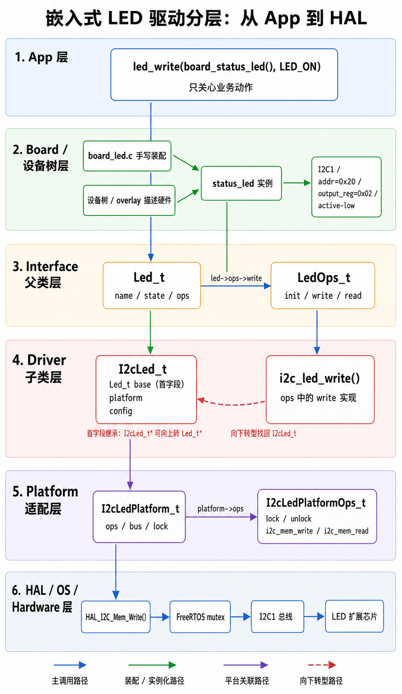

看懂这张表，你就抓住了 §7 的全部：**它不教新招，它教布阵。** 从下一节起，我们顺着 Interface → Driver → Platform → Board 一层层把阵摆开——每一层，都是被一个具体的痛点逼出来的。别担心记不住，每层落地时我都会点回它上岗的是哪件武器。

### 7.3 Interface 层：给 App 一个遥控器，让它彻底忘掉硬件

**痛点：App 只想说"把灯打开"，却被逼着认识每一种灯。**

回到 §4.3 那个场景。App 想写一个"任何灯都闪三下"的函数：

```c
void blink3(??? led) {
    for (int i = 0; i < 3; i++) { 开灯; delay; 关灯; delay; }
}
```

参数该填什么类型？`GpioLed_t *`？那 PWM 灯、I2C 灯就传不进来。三种各写一份？又回到 §1 的复制粘贴地狱。更糟的是，只要 App 里冒出一句 `if (type == I2C_LED) i2c_led_on(...)`，它就被迫知道"这块板上的灯是 I2C 的"——**硬件事实泄漏进了业务代码**。哪天灯从 I2C 换成 PWM，App 得跟着改。

App 真正想要的，是一个**遥控器**：面板上就三个按钮——初始化、写状态、读状态。它按按钮，灯就亮；至于遥控器背后接的是 GPIO、PWM 还是 I2C，它一概不想知道。

**策略：在 App 和 driver 之间插一层"只定义能力、不碰实现"的父类接口。**

这层就叫 **Interface 父类层**。它只回答"一盏灯应该能干什么"，绝不回答"这盏灯具体怎么干"。前者是遥控器面板（稳定），后者是灯的接线（千变万化）。这正是 §4.4 那张 ops 虚表正式上岗：`Led_t` 是遥控器，`LedOps_t` 是它的按钮表。

**代码：一个父类对象 + 一张 ops 表。**

```c
typedef struct Led Led_t;

typedef enum { LED_OFF = 0, LED_ON = 1 } LedState_t;

typedef struct {                     // 遥控器的按钮：一盏灯"能干什么"
    int (*init) (Led_t *led);
    int (*write)(Led_t *led, LedState_t state);
    int (*read) (Led_t *led, LedState_t *state);
} LedOps_t;

struct Led {
    const char     *name;            // 这盏灯叫什么
    const LedOps_t *ops;             // 它的按钮接到哪套实现
};
```

`Led_t` 只存两样：名字 + 一个 ops 指针。**它不存 I2C 地址，不存 GPIO 引脚**——那些是"灯怎么接线"的细节，属于子类，父类一个字都不该知道。

对外暴露的接口函数，薄得几乎透明——**只做两件事：检查参数、按 ops 分发**：

```c
int led_write(Led_t *led, LedState_t state)
{
    if (led == NULL || led->ops == NULL || led->ops->write == NULL)
        return -1;
    return led->ops->write(led, state);   // 按下按钮，遥控器把信号转给真正的灯
}
```

`led_init`、`led_read` 是一模一样的骨架。这里有一条红线：

> **父类接口层里，永远不许出现 `if (type == I2C_LED)`，更不许出现 `HAL_GPIO_WritePin()`。**

前者一出现，这层就退化成 §7.1 那个什么都管的 `main.c`；后者一出现，这层就被焊死在 STM32 上，PC 单元测试、Linux 用户态、别的 RTOS 全用不了它了。父类接口越干净、越"什么都不知道"，后面的子类和 platform 才越能自由复用。

于是 App 的 `blink3` 终于能写成它一直想要的样子：

```c
void blink3(Led_t *led) {                 // 只认遥控器，不认灯
    for (int i = 0; i < 3; i++) {
        led_write(led, LED_ON);  delay_ms(100);
        led_write(led, LED_OFF); delay_ms(100);
    }
}
```

传 GPIO 灯进去它就闪 GPIO 灯，传 I2C 灯进去它就闪 I2C 灯，`blink3` 一个字不改。**App 彻底忘掉了硬件**——这就是 Interface 层存在的意义。

按钮是按下去了，可"GPIO 灯拉引脚、I2C 灯发总线命令"这些天差地别的活儿，到底谁来干？下一层。

### 7.4 Driver 层：三种灯天差地别的活儿，全锁进子类

**痛点：同样一句"开灯"，三种灯干的是完全不同的活。**

App 按下 `led_write(led, LED_ON)`，遥控器把信号分发下去。可"开灯"落到硬件上：

```text
GPIO 灯：把某个引脚拉到有效电平
PWM  灯：把定时器某通道的占空比设成目标值
I2C  灯：往扩展芯片的某个寄存器写一个字节
```

三种活儿，用的寄存器、总线、时序全不一样。这些差异总得有地方放。放父类接口层？那就是 `if (type==...)` 地狱，父类退化成 main.c。放 App？硬件细节又泄漏进业务。**它们只有一个正确的家：各自的子类 driver。**

**策略：每种灯做成一个子类——首字段接父类，私有字段装自己的硬件参数，ops 表填自己的实现。**

三样 §4、§5 学过的招式，现在全部正式上岗：

- **首字段继承（§4.2）**：子类第一个字段放 `Led_t base`，于是 `I2cLed_t *` 能安全当 `Led_t *` 用（向上转型）。
- **ops 虚表（§4.4）**：每种子类填一张自己的 `LedOps_t`，构造时绑到 `base.ops`。
- **向下转型 / container_of（§4.5、§5）**：进了子类自己的实现函数，再把 `Led_t *` 转回真身，取私有字段。

**代码：以 I2C 灯为例，把这三招连起来走一遍。**

先是子类对象——头上顶着父类，后面挂自己的私货：

```c
typedef struct {
    Led_t base;                          // ① 首字段 = 父类，才能向上转型

    const I2cLedPlatform_t *platform;    // 以下都是 I2C 灯私有的硬件事实
    uint16_t addr;                       // 挂在哪个 I2C 地址
    uint8_t  output_reg;                 // 控制输出的寄存器
    uint8_t  input_reg;
    uint8_t  active_level;               // 低电平亮还是高电平亮
    uint8_t  cached_state;
} I2cLed_t;
```

构造函数干两件事——**填父类那半（让它能被统一调用），填子类那半（存好硬件参数）**：

```c
static const LedOps_t i2c_led_ops = {    // ② I2C 灯自己的一张 ops 表
    .init = i2c_led_init, .write = i2c_led_write, .read = i2c_led_read,
};

void i2c_led_construct(I2cLed_t *self, const char *name,
                       const I2cLedPlatform_t *platform,
                       uint16_t addr, uint8_t output_reg,
                       uint8_t input_reg, uint8_t active_level)
{
    self->base.name = name;
    self->base.ops  = &i2c_led_ops;      // 把父类 ops 指针接到 I2C 灯这张表
    self->platform  = platform;          // 以下存好私有硬件参数
    self->addr = addr; self->output_reg = output_reg;
    self->input_reg = input_reg; self->active_level = active_level;
    self->cached_state = LED_OFF;
}
```

最关键的是子类的实现函数。上层调 `led_write((Led_t *)&status_led, LED_ON)`，经父类分发进到这里，参数是 `Led_t *`，可它要读 `addr`、`output_reg` 这些**只有 I2C 灯才有的字段**——于是第一行就向下转型，把父类指针转回真身：

```c
static int i2c_led_write(Led_t *led, LedState_t state)
{
    I2cLed_t *self = (I2cLed_t *)led;    // ③ 向下转型，找回 I2C 灯真身

    uint8_t value = (state == LED_ON) ? self->active_level : !self->active_level;
    return self->platform->ops->i2c_mem_write(self->platform, self->addr,
                                              self->output_reg, &value, 1);
}
```

这个转型为什么敢这么写？因为 `i2c_led_write` 只可能通过 `i2c_led_ops.write` 被调到，而 `i2c_led_ops` 只绑在 `I2cLed_t` 对象上（构造函数里绑的）。所以能走到这个函数的 `led`，背后**必然**是个 `I2cLed_t`。**ops 表不只负责分发，还替向下转型上了保险**——这正是 §4.5.4 讲的"ops 是向下转型的护栏"。

**换一种灯，就是换一个子类文件、换一张 ops 表，别的地方一字不动：**

```c
typedef struct { Led_t base; const GpioLedPlatform_t *platform;
                 uint32_t pin; uint8_t active_level; } GpioLed_t;   // GPIO 灯
typedef struct { Led_t base; const PwmLedPlatform_t *platform;
                 uint32_t channel; uint16_t max_duty; } PwmLed_t;   // PWM 灯
```

它们同样首字段顶 `Led_t base`、同样绑一张自己的 ops 表。App 那句 `led_write(led, LED_ON)` 从不改变，改变的只是这句话最终落到哪张 ops 表：

| 上层调用 | 落到的子类实现 | 干的活 |
|---------|--------------|-------|
| `led_write(gpio_led, LED_ON)` | `gpio_led_write` | 拉 GPIO 电平 |
| `led_write(pwm_led, LED_ON)` | `pwm_led_write` | 设 PWM 占空比 |
| `led_write(i2c_led, LED_ON)` | `i2c_led_write` | 写 I2C 寄存器 |

**三种天差地别的活儿，被干净地锁进了三个子类**，谁也不泄漏到父类和 App。这就是 Driver 子类层的全部职责。

但你可能已经盯上 `i2c_led_write` 最后那句了——它没直接调 `HAL_I2C_Mem_Write`，而是又拐了一道 `self->platform->ops->i2c_mem_write(...)`。子类明明自己就能调 HAL，为什么偏要绕这一层？这就逼出了整条链路上最容易写乱、也最见功力的一层：Platform。

### 7.5 Platform 层：为什么它必须单独成层，还必须是一张 ops 表

到这里，`I2cLed_t` 已经能通过 `LedOps_t` 接入父类接口了。子类 `i2c_led_write()` 该把寄存器写下去了——可寄存器到底怎么写？最直接的写法，是里面直接调 `HAL_I2C_Mem_Write()`。

小 demo 这么写没问题。但工程化 driver 这么写，等于把 driver 焊死在了 STM32 HAL 上。这一节要把 Platform 层的"前因后果"讲透：**它为什么必须单独成一层，以及为什么这层是一张 ops 表，而不是几个普通函数。**

#### 7.5.1 前因：Driver 一旦直接调 HAL，就跟这颗芯片焊死了

先看"不分层"会怎样。假设 `i2c_led_write()` 直接调 HAL：

```c
static int i2c_led_write(Led_t *led, LedState_t state) {
    I2cLed_t *self = (I2cLed_t *)led;
    uint8_t v = (state == LED_ON) ? self->active_level : !self->active_level;
    return HAL_I2C_Mem_Write(&hi2c1, self->addr, self->output_reg,
                             I2C_MEMADD_SIZE_8BIT, &v, 1, 100) == HAL_OK ? 0 : -1;
}
```

这一行 `HAL_I2C_Mem_Write` 把三件本该分开的事焊在了一起：

- 想在 **PC 上跑单元测试**？没有 `HAL_I2C_Mem_Write` 这个符号，编译都过不了。
- 想把 **STM32 换成 NXP / 国产芯片**？HAL 函数名、句柄类型全变，driver 得跟着改。
- 想让 **多个任务共享同一条 I2C 总线**？加锁逻辑只能塞进 driver，每个 driver 抄一遍。

可是 driver 的职责本该只有一件：**把 `LED_ON` 翻译成寄存器值**——这部分跨平台完全不变。变的只是"这个寄存器最终由谁写下去"。所以思路很清楚：把"谁来写"从 driver 里抽出去，塞进一个专门的隔离层，这层就是 **Platform 层**。

抽出去以后，driver 只调一组抽象能力，不认识任何具体平台：

```text
i2c_mem_write() / i2c_mem_read()   把寄存器读写下去
lock() / unlock()                  多任务共享总线时上锁
delay_ms()                         等器件就绪
```

同一份 driver，配 STM32 platform 就跑在板子上，配 PC mock platform 就能在 PC 上测，配 Linux platform 就能对接 i2c-dev——**driver 一行不改。**

#### 7.5.2 后因：为什么这层是一张 ops 表，而不是几个普通函数

把 platform 抽出去，有两种做法。这正是原书点破的一处关键分岔。

**做法 A（教学简化版）：普通函数 + 编译期换文件。** 直接声明 `int platform_i2c_write(...)`，STM32 上编译 `platform_stm32.c`，PC 上编译 `platform_pc.c`，换平台就换 `.c` 重新编。本章配套代码 v1–v4 里的 `platform.h / platform_pc.c` 就是这种。够简单，但有个硬限制：**一次构建里只能存在一种 platform**——函数名是唯一符号，链接期就把实现定死了。

**做法 B（工业版）：ops 表 + 运行时选择。** 把这组能力做成一张函数指针表，对象里只存一个指向表的指针：

```c
typedef struct I2cLedPlatform I2cLedPlatform_t;

typedef struct {
    int  (*i2c_mem_write)(const I2cLedPlatform_t *p, uint16_t addr, uint8_t reg,
                          const uint8_t *buf, uint16_t len);
    int  (*i2c_mem_read )(const I2cLedPlatform_t *p, uint16_t addr, uint8_t reg,
                          uint8_t *buf, uint16_t len);
    void (*lock)  (const I2cLedPlatform_t *p);
    void (*unlock)(const I2cLedPlatform_t *p);
    void (*delay_ms)(uint32_t ms);
} I2cLedPlatformOps_t;

struct I2cLedPlatform {
    const I2cLedPlatformOps_t *ops;   // 指向某一套平台实现
    void *bus;                        // STM32: I2C_HandleTypeDef*；PC: 模拟寄存器数组
    void *lock_obj;                   // 这条总线自己的锁对象
};
```

看出来了吗——**这张 `I2cLedPlatformOps_t` 就是 §4.4 的 ops 虚表，只不过这次被抽象成对象的不是"灯"，而是"平台"。** 一模一样的招式：接口是一张函数指针表，不同平台填不同的表，对象存一个表指针，运行时靠 `self->platform->ops->i2c_mem_write(...)` 分发。

为什么工业代码宁可多这一层间接，也要用做法 B？因为做法 A 的"一次构建只能一种 platform"在真实系统里根本不够用：

- 一块板子上 **I2C1、I2C2 两条总线**，各自的锁对象不同——ops 表里 `lock_obj` 每个 platform 实例存一份，做法 A 的全局函数做不到。
- 想在**同一个固件里同时挂真实硬件和 mock**（产线自检常见）——只有运行时才能决定用哪套。
- 这正是 **Linux 内核 `gpio_chip` / `regmap` 子系统**的做法：每个 GPIO 控制器注册一张 `struct gpio_chip`（`.get` / `.set` / `.direction_output` 一堆函数指针），上层 `gpiod_set_value()` 在运行时分发到对应控制器。`I2cLedPlatformOps_t` ↔ `struct gpio_chip`，同一个模式的工业放大版。

> **Platform 层 = 把"平台"也做成一个对象。** §4.4 你用 ops 表让"灯"多态，这里用同一张 ops 表让"平台"多态——招式没变，换了个被抽象的对象。

`bus` 和 `lock_obj` 都是 `void *`，因为 Platform 层要承接完全不同的平台：STM32 上 `bus` 指向 `I2C_HandleTypeDef`，PC mock 上指向一个模拟寄存器数组，Linux 上指向封装后的 i2c client。下面看两个具体实现。

#### 7.5.3 STM32 Platform 实现

STM32 平台下，Platform 函数内部才真正调用 HAL：

```c
static int stm32_i2c_mem_write(const I2cLedPlatform_t *platform,
                               uint16_t addr,
                               uint8_t reg,
                               const uint8_t *buf,
                               uint16_t len)
{
    I2C_HandleTypeDef *hi2c = platform->bus;

    return HAL_I2C_Mem_Write(hi2c,
                             addr,
                             reg,
                             I2C_MEMADD_SIZE_8BIT,
                             (uint8_t *)buf,
                             len,
                             100) == HAL_OK ? 0 : -1;
}
```

锁也放在 Platform 层：

```c
static void stm32_i2c_lock(const I2cLedPlatform_t *platform)
{
    SemaphoreHandle_t mutex = platform->lock_obj;
    xSemaphoreTake(mutex, portMAX_DELAY);
}

static void stm32_i2c_unlock(const I2cLedPlatform_t *platform)
{
    SemaphoreHandle_t mutex = platform->lock_obj;
    xSemaphoreGive(mutex);
}
```

然后装配成函数表：

```c
static const I2cLedPlatformOps_t stm32_i2c_led_platform_ops = {
    .i2c_mem_write = stm32_i2c_mem_write,
    .i2c_mem_read = stm32_i2c_mem_read,
    .lock = stm32_i2c_lock,
    .unlock = stm32_i2c_unlock,
    .delay_ms = stm32_delay_ms,
};
```

这样一来，I2C LED driver 只依赖 `I2cLedPlatformOps_t`，不直接依赖 STM32 HAL。

#### 7.5.4 PC Mock Platform

PC mock 平台可以完全不碰 HAL：

```c
static uint8_t mock_regs[256];

static int mock_i2c_mem_write(const I2cLedPlatform_t *platform,
                              uint16_t addr,
                              uint8_t reg,
                              const uint8_t *buf,
                              uint16_t len)
{
    (void)platform;
    (void)addr;

    for (uint16_t i = 0; i < len; i++) {
        mock_regs[reg + i] = buf[i];
    }

    return 0;
}
```

这样你就可以在 PC 上测试 `i2c_led_write()` 的寄存器翻译逻辑。

这就是 Platform 抽象的价值：

```text
Driver 子类代码不变；
Platform 实现可替换；
同一套对象和 ops 可以跑在不同环境。
```

#### 7.5.5 Platform 层不是 HAL，也不是 BSP

这里很容易混淆。

HAL 负责 MCU 外设能力：

```text
STM32 I2C 控制器怎么发送数据
GPIO 怎么写电平
TIM 怎么设置比较值
```

BSP / Board 负责板级事实：

```text
状态灯挂在哪条 I2C
地址是多少
寄存器是多少
这个对象叫什么名字
```

Platform 层负责适配：

```text
Driver 想写 I2C 寄存器时，当前平台具体怎么做
Driver 想加锁时，当前 OS 具体怎么做
Driver 想延时时，当前运行环境具体怎么做
```

所以 Platform 层可以调用 HAL，也可以调用 mock，也可以调用 Linux API。

它的意义不是替代 HAL，而是让 driver 不直接绑定 HAL。

#### 7.5.6 后果兑现：STM32 换 NXP，只改 Platform 一层

前面讲了半天"Platform 值得单独成层"，到底值多少？原书给了一个最硬的例子：把整块工程从 **STM32F407 换成 NXP i.MX RT1170**，要改多少行？

答案是：**App、Board、Interface、Driver 全部 0 行改动，只重写 Platform 的芯片实现。**

因为跨 MCU 变的只有一件事——"寄存器最终由哪家 HAL 写下去"。而这件事已经被你关进 Platform 层了。于是换芯片时你只做一件事：给 NXP 再写一套 platform ops 表：

```c
// platform_nxp.c —— 换 MCU 时，只有这个文件是新写的
static int nxp_i2c_mem_write(const I2cLedPlatform_t *p, uint16_t addr, uint8_t reg,
                             const uint8_t *buf, uint16_t len) {
    return LPI2C_MasterTransfer(...)  /* NXP SDK 的 I2C 写 */ == kStatus_Success ? 0 : -1;
}

static const I2cLedPlatformOps_t nxp_i2c_led_platform_ops = {
    .i2c_mem_write = nxp_i2c_mem_write,
    // ... 其余同理
};
```

Board 层原本绑 `&stm32_i2c_led_platform_ops`，现在改成 `&nxp_i2c_led_platform_ops`——**一个符号名的差别。** 其它文件一字不动：

| 文件 | 换 MCU 是否要改 |
|------|----------------|
| App（业务逻辑） | 不变 |
| Interface（`Led_t` / `LedOps_t`） | 不变 |
| Driver（`i2c_led_write` 翻译寄存器） | 不变 |
| **Platform 芯片实现** | **只改这里：新写一套 ops 表** |
| Board（绑定哪套 platform） | 改一个符号名 |

这就是 Platform 层存在的全部理由，也是 §7.2 表格里"STM32 换 NXP 只改 Platform"那一行的兑现：**把"会变的东西"关进一层，换硬件时变化就停在那一层，不往上漏。** Linux 内核几千种板子共用同一份 `drivers/leds/leds-gpio.c`，靠的正是同一个道理——具体控制器差异被 `gpio_chip` 收拢，驱动本身跨板子不变。

#### 7.5.7 本节小结

Platform 层是从“会写驱动”走向“驱动可复用”的关键。

```text
App 不碰硬件细节；
Interface 不碰子类细节；
Driver 不碰具体平台 API；
Platform 才负责调用 HAL/OS/Mock/Linux。
```

下一节看 Board 层如何把父类、子类和 Platform 装配起来，并顺着这个装配过程引出设备树为什么会出现。

### 7.6 Board 层与设备树：创建对象、描述硬件、绑定平台

现在我们已经有了三块积木：

```text
Interface 父类层：Led_t / LedOps_t
Driver 子类层：I2cLed_t / i2c_led_ops
Platform 层：I2cLedPlatform_t / platform_ops
```

Board 层负责把它们装配成这块板子上的真实对象。

这节的路线是连续的：

```text
先看小工程里如何手写 Board 装配；
再看板子和设备实例变多以后，为什么需要把硬件事实抽出来；
最后看设备树如何在 Board 层描述实例，在 Driver 层参与匹配和取资源。
```

#### 7.6.1 Board 层知道这块板子的事实

Board 层可以知道：

```text
状态 LED 使用 I2C LED 子类；
它挂在 STM32 I2C1 platform 上；
I2C 地址是 0x20；
输出寄存器是 0x02；
输入寄存器是 0x00；
低电平亮。
```

这些都是板级事实。

Board 层不实现 I2C LED 协议，也不直接写业务策略。

#### 7.6.2 Board 层创建 Platform 对象

STM32 工程里可以这样装配 I2C1 platform：

```c
static SemaphoreHandle_t i2c1_mutex;

static I2cLedPlatform_t i2c1_led_platform = {
    .ops = &stm32_i2c_led_platform_ops,
    .bus = &hi2c1,
    .lock_obj = NULL,
};
```

如果使用 FreeRTOS，`lock_obj` 可以在 board init 时创建：

```c
void board_platform_init(void)
{
    i2c1_mutex = xSemaphoreCreateMutex();
    i2c1_led_platform.lock_obj = i2c1_mutex;
}
```

注意：锁放在 platform 里，是因为真正被多个 I2C 设备共享的是 I2C1 总线，而不是某一个 LED 对象。

#### 7.6.3 Board 层创建 I2C LED 对象

然后创建状态 LED：

```c
static I2cLed_t status_led;

void board_led_init(void)
{
    i2c_led_construct(&status_led,
                      "status_led",
                      &i2c1_led_platform,
                      0x20 << 1,
                      0x02,
                      0x00,
                      0);

    led_init((Led_t *)&status_led);
}
```

这段代码把几件事绑定起来了：

```text
对象名字：status_led
子类类型：I2cLed_t
平台适配：i2c1_led_platform
硬件参数：addr / output_reg / input_reg / active_level
```

它就是手写版的硬件装配。

#### 7.6.4 Board 层给 App 暴露父类指针

App 不应该直接拿 `I2cLed_t *`。

它最好只拿 `Led_t *`：

```c
Led_t *board_status_led(void)
{
    return (Led_t *)&status_led;
}
```

这样 App 只依赖父类接口。

以后状态灯从 I2C LED 换成 PWM LED，Board 层可以改成：

```c
static PwmLed_t status_led;

Led_t *board_status_led(void)
{
    return (Led_t *)&status_led;
}
```

App 仍然调用：

```c
led_write(board_status_led(), LED_ON);
```

这才是 Board 层的价值：

> 它把具体硬件实例藏在板级装配里，对 App 暴露稳定的父类接口。

有些工程设备很多，会在 Board 层再加一层查找接口：

```c
board_register_led("status_led", (Led_t *)&status_led);
```

然后 App 通过名字拿到 `Led_t *`。这只是“怎么找到对象”的工程化补充，不改变本章主线：

```text
Board 创建具体子类对象
Board 绑定 platform 和硬件参数
Board 对 App 暴露父类指针
```

只要这条线清楚，不管你后面用 `board_status_led()`，还是用 `device_get("status_led")`，本质都不会乱。

#### 7.6.5 先回答一个问题：Linux/Zephyr 还有没有"描述硬件的层"？

在写设备树之前，先想清楚它到底替换了什么。手写 Board（§7.6.1–7.6.4）其实一手干了**两件**事：

1. **描述**：这块板子有个状态灯，挂 i2c1、地址 0x20、低电平亮；
2. **装配**：`i2c_led_construct(&status_led, ...)` 手动 new 出对象、绑好 platform、暴露父类句柄。

到了 Linux / Zephyr，这两件事被拆开，去向完全不同：

- **描述** → 还在，只是从 C 代码搬进一份独立的数据文件——**设备树（`.dts`）**。它就坐在原来 Board 层的位置。
- **手写装配** → **被杀掉了**。你不再手写 `i2c_led_construct(...)`，框架会根据设备树**自动**把对象 new 出来、把 driver 绑上去。

所以直接回答标题这个问题：**"描述硬件的层"——有，就是设备树；"手写装配那层"——没有，被干掉了。**

那框架凭什么知道"这个设备节点该交给哪个 driver、该怎么装配"？靠一根字符串：**`compatible`**。这是本节的主角，下面单独把它讲透。

#### 7.6.6 设备树：把 Board 的"描述"那半抽成数据

先看设备树长什么样。同一个状态灯：

```dts
&i2c1 {                                  // 挂在 i2c1 这条总线下
    status_led: led@20 {
        compatible = "mosyu,i2c-led";    // ★ 认领字符串：我是这类硬件
        reg        = <0x20>;             // I2C 地址
        output-reg = <0x02>;
        input-reg  = <0x00>;
        active-low;                      // 低电平亮
        label      = "status_led";
    };
};
```

它和手写 Board 那行 C 是**一一对应**的，只是把"描述"那半从 C 换成了数据：

| Board 手写 C | 设备树 | 含义 |
|--------------|--------|------|
| `"status_led"` | `label` / 节点名 | 设备实例名 |
| `&i2c1_led_platform` | 挂在 `&i2c1` 下 | 接在哪条总线 |
| `0x20` | `reg = <0x20>` | I2C 地址 |
| `0x02` / `0x00` | `output-reg` / `input-reg` | 寄存器 |
| `0`（active_level） | `active-low` | 电气极性 |
| 选 `i2c_led_construct` | **`compatible`** | **交给哪个 driver** |

注意最后一行：手写 Board 里"交给哪个 driver"是你亲手写死的（你调了 `i2c_led_construct`，就等于选定了 I2C LED 这个子类）；设备树里，这件事变成一个 `compatible` 字符串，**由系统去配对**。这一格，正是"手写装配"被杀掉、换成"自动认领"的分界点。

那行 `&i2c1`（以及 `reset-gpios = <&gpiob 3 ...>` 这种）叫 **phandle**——对另一个节点（总线、GPIO 控制器）的引用，等于说"这个设备要用 i2c1 这条总线的资源"，对应本章分层就是把设备接到 Platform/bus 资源上。

设备树的边界记一句话：**它只描述硬件（挂在哪、地址、寄存器、极性、要哪些资源），不写业务**。像"错误时快闪"（`blink-when-error`）属于 App，绝不进设备树。

#### 7.6.7 核心模式：`compatible` 认领——一根字符串把设备和驱动配对

这是整套设备树机制里最该单独拎出来的一招。它就三步，两边各出一半：

```text
设备树节点：  compatible = "mosyu,pca-led";      设备说："我是这类硬件"
                       ↕   系统拿两根字符串一对
驱动代码：    我认领 "mosyu,pca-led"              驱动说："这类硬件归我管"
                       ↓   对上了
系统：自动 new 出设备对象、绑资源，交给这个 driver 初始化   装配，自动完成
```

对比手写 Board，差别一目了然：

| | 手写 Board | `compatible` 认领 |
|---|-----------|------------------|
| 谁决定用哪个 driver | 你亲手调 `i2c_led_construct` | 设备写 `compatible`、driver 声明认领，**系统配对** |
| 谁 new 对象、绑资源 | 你手写 `construct(...)` | **框架自动**（probe / 宏展开） |
| 换一块板子 | 改 Board 的 C 文件 | 只改 `.dts`，driver、App 一行不动 |

一句话抓住它的本质：**手写 Board 是"我 new 谁、我绑谁，全写死在 C 里"；`compatible` 认领是"设备只声明自己是什么，驱动只声明自己认什么，配对和装配都交给系统"。** 这正是 §4.4 那套"注册一张表、由系统分发"的思想，放大到了整个操作系统级别——只不过这次注册的不是函数指针，而是一根 `compatible` 字符串。

剩下的问题只有一个：这个"配对 + 装配"具体在什么时候、由谁做？**Linux 和 Zephyr 给了两个不同的答案**——一个运行时，一个编译期。

#### 7.6.8 Linux 怎么认领：运行时 `of_device_id` + `probe`

Linux 走**运行时**。你的仓库里就有一个真实例子：[`reference/linux_proj/workspace/pca_led/`](../../reference/linux_proj/workspace/pca_led/)，一个挂在 PCA9555 上的 LED 字符驱动。

设备树这边（[`pca_led.dts`](../../reference/linux_proj/workspace/pca_led/pca_led.dts)）声明"板上有这么个东西"：

```dts
pca_led_dev {
    compatible = "mosyu,pca-led";                 // ★ 认领字符串
    led-gpios  = <&pca9555 4 GPIO_ACTIVE_LOW>;    // phandle：接在 PCA9555 的 P04，低电平有效
};
```

驱动这边（[`pca_led_drv.c`](../../reference/linux_proj/workspace/pca_led/pca_led_drv.c)）声明"我认领哪个 compatible"：

```c
static const struct of_device_id pca_led_of_match[] = {
    { .compatible = "mosyu,pca-led" },   // ★ 和 dts 里那根字符串对上
    { }                                  // 哨兵
};
MODULE_DEVICE_TABLE(of, pca_led_of_match);

static struct platform_driver pca_led_driver = {
    .probe  = pca_led_probe,             // 对上了，就调这个
    .driver = {
        .name           = "pca_led",
        .of_match_table = pca_led_of_match,
    },
};
module_platform_driver(pca_led_driver);  // 一行宏 = 注册这个 driver
```

开机时，内核的 driver core 拿 `of_match_table` 里每一行 `compatible`，去和设备树每个节点的 `compatible` 字符串比对。对上了 `"mosyu,pca-led"`，就调这个 driver 的 `.probe`。而 `probe` 干的，正是被杀掉的那半"装配"：

```c
static int pca_led_probe(struct platform_device *pdev)
{
    // 从设备树的 led-gpios 属性把 GPIO 资源取出来 —— 取资源
    led_gpiod = devm_gpiod_get(&pdev->dev, "led", GPIOD_OUT_HIGH);
    // ... 注册字符设备、创建 /dev/pca_led —— 装配对象
}
```

对照手写 Board：你原来在 `board_led_init()` 里手动 `construct + led_init`，现在这些活儿由内核在匹配成功后调 `probe` 自动完成，GPIO 资源也由 `devm_gpiod_get` 从设备树取，不用你手填。**你写的只剩两样：一份 `.dts`，一个认领 compatible 的 driver。**

> Linux 的认领是**运行时**的：`module_platform_driver` 注册 driver → driver core 匹配 compatible → 命中调 `probe` → 装配。

#### 7.6.9 Zephyr 怎么认领：编译期 `DT_DRV_COMPAT` + `DEVICE_DT_INST_DEFINE`

Zephyr 走**编译期**——同一个 compatible 认领，换个时机做。严格照原书拆（原书「dts 节点 → driver 是怎么 match 上的」一节）：

driver 第一行就认领：

```c
#define DT_DRV_COMPAT gpio_leds   // 认领所有 compatible = "gpio-leds" 的 dts 节点
```

注意命名转换：dts 里写 `"gpio-leds"`（带连字符），`DT_DRV_COMPAT` 写成 `gpio_leds`（连字符变下划线）——因为 C 标识符不允许连字符，这是 Zephyr 的约定。

然后一行宏，编译期遍历所有匹配且 `status = "okay"` 的节点：

```c
DT_INST_FOREACH_STATUS_OKAY(LED_GPIO_DEVICE)
```

构建时，Zephyr 的 `gen_defines.py` 扫设备树，给每个匹配 `DT_DRV_COMPAT` 的节点编个序号（0、1、2…）；这行宏就被展开成 `LED_GPIO_DEVICE(0) LED_GPIO_DEVICE(1) ...`。而每个 `LED_GPIO_DEVICE(i)` 又展开成：一份 `config` 结构体 + 一行 `DEVICE_DT_INST_DEFINE`，把 `struct device` 实例、driver api（ops 表）、init 函数、链接段位置**全绑定好**。

所以 Zephyr 的认领**没有运行时遍历**：match 在 build 时静态展开，每个 dts 节点编译完就已经定死绑哪个 driver、生成好了自己的 `struct device`。

> Zephyr 的认领是**编译期**的：`DT_DRV_COMPAT` 认领 + `DT_INST_FOREACH_STATUS_OKAY` 展开 + `DEVICE_DT_INST_DEFINE` 生成实例，链接器把所有 init 段串起来，启动时依次调。

#### 7.6.10 小结：杀掉了装配，没杀掉描述

回到 §7.6.5 那个问题，现在能收口了：

- **描述硬件的层**——**有**，就是设备树。它接手了手写 Board 的"描述"那半，只是从 C 变成了数据。
- **手写装配的层**——**没有**，被 `compatible` 认领干掉了：设备声明自己是什么、driver 声明自己认什么，new 对象 + 取资源 + 绑定，全由框架自动完成（Linux 运行时 `probe`，Zephyr 编译期宏展开）。

| | 手写 Board（STM32 小工程） | 设备树 + compatible（Linux/Zephyr） |
|---|--------------------------|-----------------------------------|
| 硬件描述 | 写在 Board 的 C 里 | 独立的 `.dts` 数据文件 |
| 选哪个 driver | 手调 `construct` 写死 | 一根 `compatible` 字符串，系统配对 |
| 装配（new + 绑资源） | 手写 `construct + init` | 框架自动（probe / 宏展开） |
| 换板子 | 改 Board 的 C 文件 | 只改 `.dts` |

一句话收束这条线：**手写 Board 是"描述 + 装配"揉在 C 里，你写得清楚但换板子就得改代码；设备树把"描述"抽成数据、把"装配"交给 `compatible` 认领自动化——你只声明"板上有个 compatible=X 的东西"，剩下系统全包了。** 这就是从手写 Board 到设备树那份"优雅装配"。

下一节把整套五层落到一个 STM32 HAL + FreeRTOS 工程的文件组织里。

### 7.7 合龙：五层拼齐，跑一次点灯

五层是一层层拆开讲的。现在把它们拼进一个真实的 STM32 + FreeRTOS 工程，跑一次点灯——看这五层怎么协同，也看你这一路攒的武器，怎么在**一句"亮"里一次性全部上岗**。

#### 7.7.1 五层，各住各的文件

分层在工程里最直接的样子，就是**每一层住一个目录**：

```text
App/         status_service.c              业务意图：亮 / 灭 / 闪
Interface/   led.c  led.h                  父类：Led_t / LedOps_t / led_write()
Drivers/led/ i2c_led.c  gpio_led.c ...     子类：I2cLed_t / i2c_led_write()
Platform/stm32/ stm32_i2c_led_platform.c   平台适配：ops 表调 HAL / FreeRTOS
Board/       board_led.c                   装配：创建对象、绑参数、暴露句柄
Core/        main.c  i2c.c                  CubeMX/HAL 生成的外设初始化（地基）
```

比常见的 `BSP / Driver / App` 多出来的，就是那个独立的 `Platform/`——它正是 §7.5 那道"别让 HAL 漏上来"的闸。

#### 7.7.2 合龙第一步：启动时，Board 把对象装配好

`main.c` 薄得只剩启动顺序——它不知道灯的地址，也不碰一句 `HAL_I2C_Mem_Write`：

```c
int main(void)
{
    HAL_Init();  SystemClock_Config();
    MX_GPIO_Init();  MX_I2C1_Init();  MX_FREERTOS_Init();

    board_platform_init();   // 建 platform（连总线、建锁）
    board_led_init();        // 装配 status_led
    osKernelStart();
    while (1) { }
}
```

真正的装配在 Board 层——把原理图上的硬件事实，翻译成一个能用的对象：

```c
static I2cLedPlatform_t i2c1_led_platform = {           // ← Platform 对象：连到 hi2c1
    .ops = &stm32_i2c_led_platform_ops, .bus = &hi2c1, .lock_obj = NULL,
};
static I2cLed_t status_led;                             // ← 子类对象（§2 封装）

void board_led_init(void)
{
    i2c_led_construct(&status_led, "status_led",        // ← 构造：绑 platform + 硬件参数
                      &i2c1_led_platform, 0x20 << 1, 0x02, 0x00, 0);
    led_init((Led_t *)&status_led);
}

Led_t *board_status_led(void) { return (Led_t *)&status_led; }   // ← 只对 App 露父类指针
```

装配完，App 手里只有一个 `Led_t *`，它永远不知道背后是 `I2cLed_t`。**这就是 §4.5 向上转型的工程用途：把具体对象，交给只认父类的上层。**

#### 7.7.3 合龙第二步：一句"亮"，穿过五层落到硬件

现在 App 说一句"状态灯亮"。跟着这一句走完全部五层——**每一步，都是你学过的一件武器在干活**：

```c
// ── App 层：只说业务，不碰硬件 ──
void status_service_on(void) {
    led_write(board_status_led(), LED_ON);          // 我只要"亮"，别的不管
}

// ── Interface 父类层：检查 + 按 ops 分发（§4.4 虚表）──
int led_write(Led_t *led, LedState_t state) {
    if (!led || !led->ops || !led->ops->write) return -1;
    return led->ops->write(led, state);             // 转给这盏灯自己的实现
}

// ── Driver 子类层：向下转型找回真身，翻译成寄存器值（§4.5 + §5）──
static int i2c_led_write(Led_t *led, LedState_t state) {
    I2cLed_t *self = (I2cLed_t *)led;               // 找回 I2C 灯真身
    uint8_t value = (state == LED_ON) ? self->active_level : !self->active_level;

    self->platform->ops->lock(self->platform);      // 借 Platform 加锁（多任务共享总线）
    int ret = self->platform->ops->i2c_mem_write(self->platform, self->addr,
                                                 self->output_reg, &value, 1);
    self->platform->ops->unlock(self->platform);
    if (ret == 0) self->cached_state = state;
    return ret;                                     // driver 从头到尾不知道 HAL 是谁
}

// ── Platform 层：这里，也只有这里，才碰 HAL 和 FreeRTOS ──
static int stm32_i2c_mem_write(const I2cLedPlatform_t *p, uint16_t addr,
                               uint8_t reg, const uint8_t *buf, uint16_t len) {
    return HAL_I2C_Mem_Write(p->bus, addr, reg, I2C_MEMADD_SIZE_8BIT,
                             (uint8_t *)buf, len, 100) == HAL_OK ? 0 : -1;
}
static void stm32_i2c_lock(const I2cLedPlatform_t *p) {
    xSemaphoreTake((SemaphoreHandle_t)p->lock_obj, portMAX_DELAY);
}
```

把这条链竖起来看，一句"亮"是这样一层层落到硬件的：

```text
status_service_on()               App：业务意图
   → led_write(led, LED_ON)       Interface：§4.4 ops 分发
   → i2c_led_write()              Driver：§4.5 向下转型 + 翻译寄存器值
   → platform->ops->lock()        Platform：借总线锁
   → platform->ops->i2c_mem_write()
   → HAL_I2C_Mem_Write()          ← 整条链里，"HAL" 只在这一行出现
   → I2C LED 芯片亮
   → platform->ops->unlock()
```

盯住那行注释：**从 App 到 Driver，四层代码里没有一个 `HAL_` 字样**。"HAL" 被死死摁在最底下一层，只露一次头。这就是分层全部的兑现——上面四层，换芯片、换平台，一字不改。

读一次状态是对称的反向路径：`led_read → i2c_led_read → platform 的 i2c_mem_read → HAL_I2C_Mem_Read`，driver 再把读回的寄存器值翻译成 `LED_ON / LED_OFF` 还给 App。硬件细节进来，抽象状态出去。

#### 7.7.4 回望：六件武器，一次点灯全用上了

把这条调用链和整条"定义→初始化→写入→读取"的分层泳道图摆在一起看：

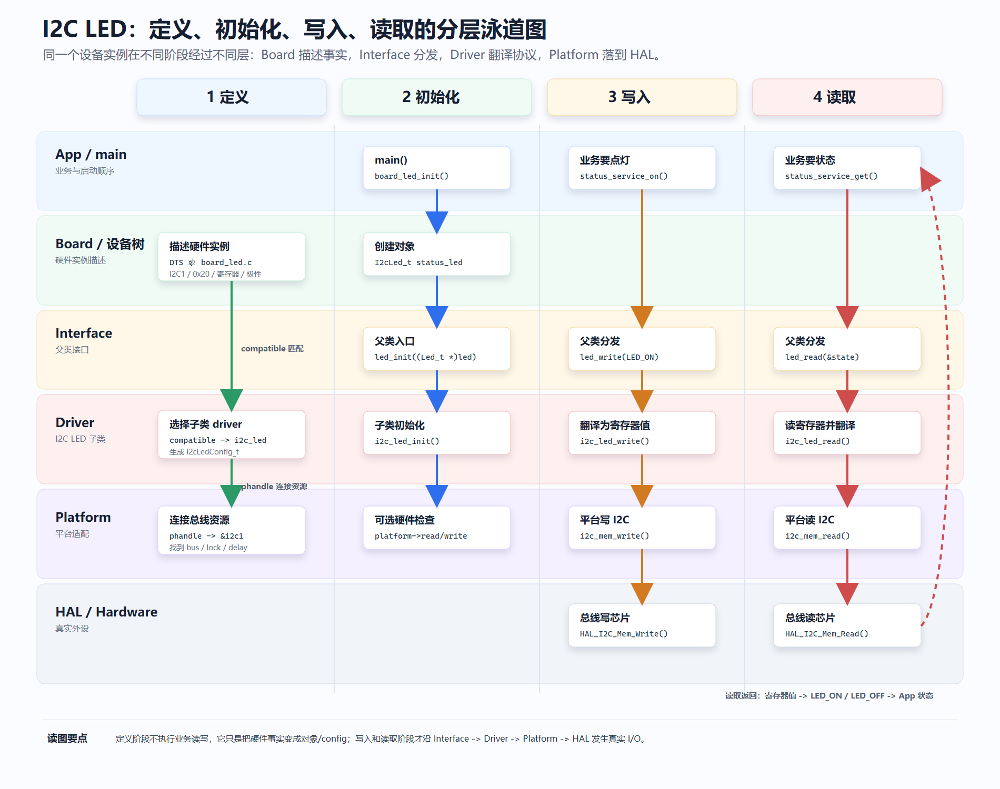

你会发现，§2–§5 攒下的武器，在这一次点灯里**一件不落，全在链上干活**：

| 链上这一步 | 用的武器 | 讲在 |
|-----------|---------|------|
| `struct I2cLed_t` 装下地址/寄存器/极性 | 封装 | §2 |
| `led->ops->write` 把父类分发到子类 | ops 虚表 | §4.4 |
| `(Led_t *)&status_led` 向上转型交给 App | 首字段继承 | §4.2 |
| `(I2cLed_t *)led` 向下转型找回真身 | 转型 / `container_of` | §4.5 / §5 |
| `platform->ops->i2c_mem_write` 让 driver 不绑死 HAL | ops 虚表（再用一次） | §4.4 |
| Board 把这一切装配成一个能跑的真系统 | 封装 + 构造 | §2 |

**这就是 §7 的落点**：前六节你以为在学一个个孤立的 C 技巧，其实是在攒一套零件——到 §7，它们拼成了一个能跑、能换芯片、能上产线的真实驱动。回头再看 §7.2 那张"武器→阵法"表，现在每一格你都亲手兑现过了。

而这套"手写五层"，你从头到尾**亲手搓了一遍**——`main.c` 变薄，driver 不绑 HAL，App 不知硬件，Board 扛下装配。它透明、轻量，特别适合中小工程；代价是初始化顺序、对象注册、依赖关系都得靠团队自己约定。

接下来两节要做的，就是抬起头：**同样这套布阵，Linux 和 Zephyr 早已把 platform 抽象、对象注册、设备树全部内建好了。** 你不用再自己搭地基，只需要在它们的源码里，一件件认出你刚用过的武器——**§8 先去 Zephyr，§9 再去 Linux。**

> ⚠️ 先埋个防踩坑的提醒：Linux 里也有个叫 `platform_driver` / `platform_device` 的东西，但那是内核用来匹配"不能自动枚举的板级设备"、命中就调 `probe` 的一条总线，**跟本章的 Platform 层同名不同物**（§9 会细说）。别一看到 "platform" 就往这层套。

## 8 Zephyr 实战：把这套框架，交给一个真正的操作系统

> 📖 本节严格对照 Zephyr v3.7.0 源码 `drivers/led/led_gpio.c` 与原书第五部分（Zephyr 篇）。

§7 你亲手搭了五层：Interface / Driver / Platform / Board + 设备树。搭得挺漂亮，但落到真实工程有个扎心的事实——**这五层的地基（platform 抽象、ops 注册、设备树解析、初始化排序），每一样都得你自己写、自己维护。** 板子一多、客户一多，光维护这套地基就够你喝一壶。

原书在这里撂了句大实话：

> **"platform 这一层，尽量别自己写。写出来就要自己维护。"**

MCU 项目只要资源不算太紧，第一推荐直接上 **Zephyr**——它把设备树解析、`driver_api` ops 表、initcall 分级**全做完了**，而且是 Linux 基金会在维护、上千款芯片的 driver 已经写好，你 `device_get_binding("gpio0")` 就能用。

而"读懂它"这件事，你其实已经准备好了。**Zephyr 的 driver model 剥开外壳，底下就是本章这套：ops 表 + 多子类多态 + 首字段继承 + 父类统一接口，一字不差。** 没学过本章的人打开 Zephyr 看 `gpio_driver_api`，第一反应是"这函数指针表怎么这么乱"；学完本章的你，第一反应会是——"哦，ops 表 + 子类填表，§4.4 讲过，直接用。"

这一节就带你打开一个**真实**的 Zephyr LED 驱动 `drivers/led/led_gpio.c`（整文件才 102 行），一段段对上本章的每个概念。

### 8.1 痛点：地基自己写，换个项目就得重砌一遍

回头看你 §7 写的那套。它没错，作为教学它甚至很好——你亲眼看清了 platform 抽象长什么样、ops 表怎么挂、注册机制怎么落。但**真拿去做产品，问题立刻来**：

- platform 层的 ops 表、register 机制，你写一遍；
- 设备树（或者手写 Board 装配），你维护一份；
- 对象的初始化顺序（谁先构造、谁依赖谁），你自己排；
- 换一颗芯片，platform 的 arch 实现你再写一套。

一块板子这么干还行。等你手上有 10 路硬件、多个客户、多种产品形态，光这套地基的维护成本就能把人拖垮。而这套地基——**Zephyr / RT-Thread 已经写了十几年，上万种硬件验证过，比你三周手搓出来的 ops 表稳得多。**

所以工业级的选择很干脆：**MCU 用 Zephyr / RT-Thread，MPU/SoC 用 Linux，全平台都别自己抽 platform 层。** 你 §7 学的不是"回去自己造轮子"，而是**看懂这些框架底下在干什么**——而它们底下，正是本章这套。下面逐层验证。

### 8.2 设备树：硬件清单的"文字版"

**痛点：板级硬件事实（哪颗灯、接哪个脚、什么极性）该放哪？** §7.6 已经回答过：抽出去，做成数据。Zephyr 把这份数据叫 **设备树（devicetree，`.dts`）**。

你可以把它当成**硬件清单的文字版**——原理图上"stm32f4_disco 板上 4 颗 LED，接在 PD12/13/14/15"，一字不落地用文本写出来。看 Zephyr 官方板级文件 `boards/st/stm32f4_disco/stm32f4_disco.dts` 里那段真实节点：

```dts
leds {
    compatible = "gpio-leds";
    orange_led_3: led_3 { gpios = <&gpiod 13 GPIO_ACTIVE_HIGH>; label = "User LD3"; };
    green_led_4:  led_4 { gpios = <&gpiod 12 GPIO_ACTIVE_HIGH>; label = "User LD4"; };
    red_led_5:    led_5 { gpios = <&gpiod 14 GPIO_ACTIVE_HIGH>; label = "User LD5"; };
    blue_led_6:   led_6 { gpios = <&gpiod 15 GPIO_ACTIVE_HIGH>; label = "User LD6"; };
};
```

一个 dts 节点，只看**三件事**就够：

| dts 写法 | 是什么 | 对应本章 |
|---------|-------|---------|
| `compatible = "gpio-leds"` | 型号字符串：这节点交给哪个 driver | §7.6.7 的 `compatible` 认领 |
| `gpios = <&gpiod 13 GPIO_ACTIVE_HIGH>` | phandle + 引脚号 + 极性：接在 PD13 | §7.6 的 phandle，接到 Platform/bus 资源 |
| `label = "User LD3"` | 人类可读名字，`led_get_info` 能拿到 | §7.3 `Led_t.name` |

`leds` 父节点带一个 `compatible`，四个子节点就不用各写一遍，一起作为这 4 颗 LED 出场。**一节描述一件硬件，没有一行 C 代码**——这正是 §7.6 说的"把板级事实从 C 搬进数据"。

### 8.3 编译期魔法：dts 是怎么变成 C 代码的（零运行时开销）

这里有个和 Linux **不一样**的关键点，也是很多人对 Zephyr 最大的误解：**dts 不是运行时数据，是编译期数据。** Zephyr 启动后根本没有"解析 dts"这个过程，零运行时开销。

整条流水线四步（`west build` 时自动跑）：

```text
STEP1  硬件描述源文件        stm32f4_disco.dts（板级） + app.overlay（应用补丁，可选）
   ↓
STEP2  Zephyr 内置脚本        gen_defines.py 解析 dts，把每个节点/属性拆成 token
   ↓                         → 生成 devicetree_generated.h（几千行 #define，人从不直接看）
STEP3  driver / app 里写宏     DT_NODELABEL(leds) / DT_PROP(node, gpios) / GPIO_DT_SPEC_GET(...)
   ↓                         → cpp 预处理把这些宏展开成静态结构体字面量
STEP4  编译器看到的已是普通 C   led_gpio_config_0 是静态 const 数组，烧进 ROM
```

关键一句话：**dts 在 build 时就被啃完了，Zephyr 启动后不存在"dts 解析"这个运行时步骤。** `DT_NODELABEL(...)` 这类宏不是字符串查找，它在预处理阶段就被拼成了真正的 C 表达式，跑起来和你手写常量一模一样快。这套机制的源头是 Linux 内核，Zephyr 把它精简了一遍照搬过来——但 Linux 是运行时解析 dtb，Zephyr 是编译期展开，这是两者最大的分野（下一节 Linux 篇会对照）。

### 8.4 `struct device`：config + data + api，就是本章的"对象 + ops 虚表"

现在到了最该会心一笑的地方。Zephyr 里每个设备都是一个 `struct device`，它的三个核心字段：

| 字段 | Zephyr 里是什么 | **就是本章的** |
|------|----------------|--------------|
| `config` | 只读的出厂参数（引脚、极性、寄存器地址…），编译期定死、放 ROM | §7.4 子类的**私有硬件字段**（`addr`/`output_reg`/`active_level`） |
| `data` | 可写的运行时状态 | 对象里会变的那部分状态（如 `cached_state`） |
| `api` | 一个指向 ops 函数指针表的指针 | **§4.4 的 ops 虚表！** |

看到 `api` 那一行，你应该已经笑了——**Zephyr 折腾一大圈，设备对象里那个 `api`，就是你 §4.4 手写的 `const LedOps_t *ops`。** 上层调 `led_on(dev, i)`，Zephyr 内部就是 `dev->api->on(dev, i)`，和本章的 `led->ops->on(led)` 一个模子。

而 `config` / `data` 的分家，正是本章 §3.5「数据归位」+ §7.4「子类私有参数」的工业版：不变的、每类设备共享的出厂参数进 `config`（`const`，放 ROM）；会变的运行时状态进 `data`。**Zephyr 只是给这套"对象 = 私有数据 + ops 表"起了 `config`/`data`/`api` 三个正式名字。**

### 8.5 一个宏搞定继承 + 多态 + 注册：`DEVICE_DT_INST_DEFINE`

**痛点：§7 里你要手写子类对象、手动绑 ops、手动在 Board 里 `construct` + 注册。** 一颗灯还好，几十个设备呢？Zephyr 把这一整套压进**一个宏**。看 `led_gpio.c` 的核心（原书逐字拆过）：

```c
#define LED_GPIO_DEVICE(i)                                                  \
    static const struct gpio_dt_spec gpio_dt_spec_##i[] = {                 \
        DT_INST_FOREACH_CHILD_SEP_VARGS(i, GPIO_DT_SPEC_GET, (,), gpios)    \
    };                                                                      \
    static const struct led_gpio_config led_gpio_config_##i = {            \
        .num_leds = ARRAY_SIZE(gpio_dt_spec_##i),                          \
        .led      = gpio_dt_spec_##i,                                       \
    };                                                                      \
    DEVICE_DT_INST_DEFINE(i, &led_gpio_init, NULL,                          \
                          NULL, &led_gpio_config_##i,                       \
                          POST_KERNEL, CONFIG_LED_INIT_PRIORITY,            \
                          &led_gpio_api);      /* ← 这就是 ops 虚表 */       \

DT_INST_FOREACH_STATUS_OKAY(LED_GPIO_DEVICE)   /* 每个匹配的 dts 节点，展开一次上面整套 */
```

把它一段段翻译回本章的话：

- `led_gpio_config_##i` —— **子类的出厂参数**（§7.4 的私有字段），从 dts 的 `gpios` 属性编译期取出来填好。
- `&led_gpio_api` —— **ops 虚表**（§4.4）。这一颗设备的 `api` 就指向这张表。
- `&led_gpio_init` —— **构造函数**（§2.3 的 `led_init`），启动时被调一次。
- `DEVICE_DT_INST_DEFINE(i, ...)` —— 把"实例化一个 `struct device` + 绑 config + 绑 api + 排好初始化顺序"**一行做完**，等于 §7.4 的 `construct` + §7.6 的 Board 装配，全自动。
- `DT_INST_FOREACH_STATUS_OKAY(LED_GPIO_DEVICE)` —— 设备树里有几个 `compatible = "gpio-leds"` 的节点，这行就展开几次，**每个节点自动生成一个设备对象**。stm32f4_disco 只有一个 `leds` 节点，就展开一次，得到 `led_gpio_config_0` 和一个 `struct device` 实例。

原书把 `led_gpio.c` 整整 102 行拆成五段，全部对得上本章：

| `led_gpio.c` 片段 | 行数 | 对应本章 |
|------------------|-----|---------|
| 子类 config struct | 5 行 | §7.4「子类出厂参数」 |
| `led_gpio_set_brightness` 等实现函数 | 24 行 | §7.4 子类实现 + `void *config` 类型还原（向下转型） |
| `led_gpio_api` ops 表实例化 | 5 行 | §4.4 ops 表 |
| `LED_GPIO_DEVICE(i)` + `DT_INST_FOREACH_STATUS_OKAY` | 几行 | §7.6 compatible 认领 + §7.4 construct + Board 注册 |
| 头文件、`led_gpio_init`、Kconfig 开关 | 60 余行 | 基础设施 |

**这就是工业级 OOP 在 C 里能做到的最简密度。** 你 §7 手写一大坨的东西，Zephyr 用几个宏收干净——但机制一模一样。

### 8.6 compatible 认领：这一招 §7.6.9 已经拆透

`led_gpio.c` 第一行的 `#define DT_DRV_COMPAT gpio_leds`，声明"这份 driver 认领所有 `compatible = "gpio-leds"` 的 dts 节点"；`DT_INST_FOREACH_STATUS_OKAY` 编译期遍历所有匹配节点，每个实例化一个设备。这套"设备树节点 ↔ driver 靠 `compatible` 字符串配对"的机制，正是 §7.6.9 已经细拆过的 **compatible 认领**——Zephyr 走编译期、Linux 走运行时。这里不再重复，回看 §7.6.9 即可。

### 8.7 谁先构造：`SYS_INIT` / 设备初始化分级

**痛点：§7 里 Board 的 `board_led_init()` 得由你在 `main` 里手动、按正确顺序调。** 设备一多，"I2C 总线要在挂它上面的 LED 之前初始化好"这类依赖顺序，全靠你人肉排——排错就是启动崩。

Zephyr 把初始化顺序也做成了机制。`DEVICE_DT_INST_DEFINE` 那行的 `POST_KERNEL, CONFIG_LED_INIT_PRIORITY` 两个参数，就是给这个设备的构造函数**登记一个初始化档位**。Zephyr 的 init level 分 6 级：

```text
EARLY → PRE_KERNEL_1 → PRE_KERNEL_2 → POST_KERNEL → APPLICATION → SMP
```

`PRE_KERNEL_*` 是内核还没起来、不能用信号量互斥锁的阶段；`POST_KERNEL` 是内核已经活着、能用所有 kernel API 的阶段（LED 驱动就挂这一档）；`APPLICATION` 在 `main` 之前。同一档里再用 priority 排细。

它的底层实现，就是本章后面会在 Ch8 深挖的那招——**用 `__attribute__((section(...)))` 把每个设备的 init 函数指针塞进按 `level+priority` 命名的特殊链接段，启动时链接器把它们按字典序排好，一趟遍历依次调**。你不用再手写 `main` 里那串 `xxx_init()` 调用顺序，声明式登记一下，系统替你排。

### 8.8 小结：你没学新东西，只是终于能读懂工业级封装

把这一节收束成一句话：**Zephyr 的 driver model，是本章这套 OOP 框架的"工业放大版 + Linux 基金会维护版"。**

| 本章手写 | Zephyr 里 |
|---------|----------|
| `Led_t` 对象 + 私有字段 | `struct device` 的 `config` / `data` |
| `LedOps_t` ops 虚表 | `struct device` 的 `api`（如 `gpio_driver_api`） |
| 首字段继承 + 向下转型 | `void *config` 取回子类参数 |
| §7.4 `construct` + §7.6 Board 装配 | `DEVICE_DT_INST_DEFINE` 一行搞定 |
| §7.6 设备树 + compatible 认领 | dts + `DT_DRV_COMPAT`（编译期展开） |
| 手动排初始化顺序 | `SYS_INIT` / init level 声明式登记 |

所以你打开 `drivers/led/led_gpio.c` 不再是"端着望远镜看山"。你能顺着 `config`/`api`/`DEVICE_DT_INST_DEFINE` 一路读下去，因为**每一样，本章都让你亲手写过一遍**。这就是本章最大的回报：不是教你用 C 模仿 C++，而是让工业级 C 驱动的骨架，在你眼里从一团黑雾变成一张能读的地图。

下一节换到光谱的另一端——**Linux**，看同一套思想在三千万行内核里长成什么样。

## 9 Linux 实战：同一套思想，在三千万行内核里

> 📖 本节对照 Linux 6.6 内核 `drivers/leds/leds-gpio.c`、原书第五部分（Linux 篇），以及你仓库里的真实驱动 [`reference/linux_proj/workspace/pca_led/`](../../reference/linux_proj/workspace/pca_led/)。

Zephyr 是 MCU 那一档，Linux 是 MPU / SoC 那一档——跑得起 Linux 内核的硬件，`driver model` + bus 框架 + 设备树 + sysfs 全套完整，应用层走 libgpiod / iio / spidev，内核驱动写在 driver model 里，谁都不用自己抽 platform 层。

三千万行看着吓人。但你还记得 §1.2 那句吗——"如果没有对象边界、接口边界和分层约定，这种规模的工程 bug 会带着你在源码森林里绕圈"。**反过来说：只要你手里有这几把尺子，内核源码就能顺着读。** 而这几把尺子，正是本章从头到尾打磨的那几件武器。更妙的是，Linux 内核比谁都**纯粹**——它几乎不用 §3.4.2 的不透明指针藏 struct，而是把 struct 定义大大方方摊开，靠 **父类 + 子类 + `container_of`** 硬撑起整个骨架。这一节就来验证。

### 9.1 痛点：三千万行，第一眼怎么都读不动

第一次打开一份内核驱动，扑面而来的是：一堆 `struct`、几张函数指针表、满屏 `container_of`、看不懂的宏。没有"对象 / 接口 / 宿主"这几个概念垫底，你只能一行行硬啃，啃到第三个文件就迷路了。

可真相是——**内核驱动翻来覆去就五个套路，每一个本章都让你手写过一遍**：

| 内核里长这样 | 其实就是本章的 | 讲在 |
|-------------|--------------|------|
| `file_operations` / `led_classdev` 等一堆函数指针 | ops 虚表 | §4.4 |
| 满屏 `container_of(ptr, type, member)` | 从成员反推宿主对象 | §5 |
| `of_device_id` + `compatible` 字符串 | compatible 认领 | §7.6.8 |
| `probe()` | 构造 + 装配 | §7.4 / §7.6 |
| `led_classdev` / VFS 这种子系统 | 父类统一接口，你填子类 | §7.3 |

下面一个一个对。

### 9.2 `file_operations`：这就是 §4.4 的 ops 虚表

**痛点：用户敲 `echo 1 > /dev/pca_led`，这个"写"最终怎么落到你的驱动函数里？** 内核不可能给每种设备写死一个 `write`——它靠的还是 ops 表分发。

看你仓库里那个真实的 [`pca_led_drv.c`](../../reference/linux_proj/workspace/pca_led/pca_led_drv.c)：

```c
static ssize_t pca_led_write(struct file *file, const char __user *buf,
                             size_t count, loff_t *ppos)
{
    char val;
    if (copy_from_user(&val, buf, 1)) return -EFAULT;
    if (val == '1') gpiod_set_value(led_gpiod, 0);   // 亮
    else if (val == '0') gpiod_set_value(led_gpiod, 1);
    return count;
}

static const struct file_operations pca_led_fops = {   // ← 一张 ops 表
    .owner = THIS_MODULE,
    .write = pca_led_write,
};
```

`struct file_operations` 就是一张函数指针表——`.write`、`.read`、`.open`、`.release`……**它和你 §4.4 手写的 `LedOps_t` 是同一个东西**，只是字段多、名字换成了内核约定。用户态 `write()` 一路走到内核，最终就是 `filp->f_op->write(...)`，和本章的 `led->ops->write(led, ...)` 一个模子刻出来的。你以后在内核里看到 `xxx_fops`、`xxx_ops`、`net_device_ops`——别当成"一堆函数指针凑一起"，它就是 C 语言的虚表。

### 9.3 `compatible` + `probe`：认领 + 装配（承接 §7.6.8）

**痛点：这份驱动怎么知道自己该管哪个硬件？谁来把对象创建出来？** §7.6.8 已经用这个 `pca_led` 拆过 compatible 认领了，这里把它和"装配"接上。

```c
static const struct of_device_id pca_led_of_match[] = {
    { .compatible = "mosyu,pca-led" },        // 认领 dts 里同名节点
    { }
};
MODULE_DEVICE_TABLE(of, pca_led_of_match);

static struct platform_driver pca_led_driver = {
    .probe  = pca_led_probe,                  // 认领成功 → 调它
    .driver = { .name = "pca_led", .of_match_table = pca_led_of_match },
};
module_platform_driver(pca_led_driver);       // 一行 = 注册这个 driver
```

匹配上 `"mosyu,pca-led"` 后，内核调 `probe`——而 `probe` 干的正是**构造 + 装配**：

```c
static int pca_led_probe(struct platform_device *pdev)
{
    led_gpiod = devm_gpiod_get(&pdev->dev, "led", GPIOD_OUT_HIGH);  // 从 dts 取 GPIO 资源
    // ... 注册字符设备、创建 /dev/pca_led            —— 把对象接进系统
}
```

对照本章：`probe` = §7.4 的 `construct` + §7.6 Board 的装配，只不过由内核在匹配成功后自动调，GPIO 资源也由 `devm_gpiod_get` 从设备树取，不用你手填。最后那行 `module_platform_driver(...)` 一行完成"注册 + init"——它其实是三层宏展开，底层就是 Ch8 会讲的 `__initcall` 段机制（把 init 函数塞进特殊链接段，内核启动时遍历调），和 Zephyr 的 `SYS_INIT` 同源。

### 9.4 `container_of`：Linux 内核的字面骨架

**痛点：内核回调你的函数时，只塞给你一个父类成员的指针，可你要访问的私有数据在外层结构里——怎么拿回去？** 这正是 §5 `container_of` 的工业主场，而且是它最闪光的地方。

看原书那个挂进 LED 子系统的驱动。它把内核的 `struct led_classdev`（父类）**嵌**进自己的私有结构：

```c
struct status_led_data {
    struct led_classdev  cdev;      // ① 内核父类，嵌在第一个（或任意）位置
    struct gpio_desc    *gpiod;     // 子类私有数据
};

static void status_led_brightness_set(struct led_classdev *led_cdev,
                                       enum led_brightness value)
{
    struct status_led_data *led =
        container_of(led_cdev, struct status_led_data, cdev);   // ② 反推回私有结构
    gpiod_set_value(led->gpiod, value ? 1 : 0);
}
```

流程正是 §5 那套：你 `led_classdev_register(&led->cdev)` 时，交给内核的只是**嵌入成员** `cdev` 的地址；内核回调 `brightness_set` 时，也只把 `cdev` 的指针还给你。可你要操作的 `gpiod` 在外层——于是第一行 `container_of` 从 `cdev` 地址减去偏移，反推回整个 `status_led_data`。**这就是 §5 讲的"从成员地址找回宿主对象"，一字不差。**

为什么 Linux 对它的依赖到了骨架级别？因为内核几乎不藏 struct（§3.4.2），它就是靠"父类嵌进子类 + `container_of` 反推"来划边界的。原书给了一个硬核数据点：

> `drivers/leds` 全树 92 个驱动用了 `container_of`，共 175 处。放宽到整个 `drivers/`，是**几万次**级别——VFS 用它从 `struct file *` 反推私有数据，网络栈用它从 `struct sk_buff *` 反推协议私有结构，设备模型用它从 `struct device *` 反推总线设备，中断框架用它从 `struct irq_data *` 反推中断控制器。**没有它，内核根本写不下去。**

所以 §5 那条三行公式不是应试编出来的，是内核 30 多年写驱动写出来的真实模式。**学到这里，你拿任何一份内核源码，先扫一眼有没有 `container_of`——有就顺藤摸瓜：找到子类布局、定位父类字段、串起调用链。读源码速度直接快一个量级。**

### 9.5 子系统：框架给你父类，你只填子类

上面那个 `led_classdev`，就是内核 LED **子系统**提供的**父类接口**（对应 §7.3）。你的驱动是**子类**：你只需要填一个 `brightness_set`（子类实现），再 `devm_led_classdev_register()` 把它挂上去：

```c
led->cdev.name           = "status-led";
led->cdev.brightness_set = status_led_brightness_set;   // 填子类实现
devm_led_classdev_register(&pdev->dev, &led->cdev);     // 挂进父类子系统
```

一注册，内核就自动在 `/sys/class/leds/status-led/` 下生出一堆节点，用户态 `echo 1 > brightness` 就能点灯：

```bash
$ sudo insmod leds-status.ko
$ ls /sys/class/leds/
ACT  PWR  status-led                 # ← 你加的这颗
$ echo 1 | sudo tee /sys/class/leds/status-led/brightness   # LED 亮
$ echo 0 | sudo tee /sys/class/leds/status-led/brightness   # LED 灭
```

你没写任何 sysfs 解析、没写任何 `/sys` 文件——**父类子系统全包了，你只填了子类那张 ops**。这正是 §7.3「上层统一接口 + 子类多态」在内核里的完整兑现。（顺带：这里用 `tee` 不用 `>`，是因为写 `/sys` 节点要 root 权限，而 `sudo echo 1 > /sys/...` 的重定向 `>` 是 shell 在普通权限下做的，会被拒；`sudo tee` 才能把提权落到"写文件"这一步。）

### 9.6 接口和实现分离的活证：sysfs vs libgpiod

本章反复讲"接口稳定、实现可换"。Linux 上同一颗 LED **恰好有两套并存的用户态接口**，正好把这句话钉死：

- **sysfs**：上面那个 `/sys/class/leds/status-led/brightness`，`echo 1 >` 就亮——走的是 LED 子系统这层抽象。
- **libgpiod**：完全跳过 LED 框架，用户态直接控 GPIO 线（`gpiod_line_set_value`）——走的是另一层抽象。

同一块硬件，两套接口互斥可换。你想要"业务语义"（这是一颗状态灯）就走 sysfs；你想要"裸控引脚"就走 libgpiod。**接口和实现分离，在这里不是纸上原则，是你 `ls /sys` 和 `apt install libgpiod` 就能同时摸到的两个入口。**

### 9.7 小结：一份内核驱动，五把本章的尺子全用上

回头看你仓库那 100 来行的 `pca_led_drv.c`、内核主线的 `leds-gpio.c`、原书那个 `leds-status.c`——它们没有一行用到本章没讲过的思想：

| 内核驱动里的 | = 本章 |
|-------------|-------|
| `file_operations` / `led_classdev` ops 表 | §4.4 虚表 |
| `container_of(cdev, ..., cdev)` | §5 宿主反推 |
| `of_device_id` + `compatible` + `probe` | §7.6.8 认领 + §7.4/7.6 装配 |
| `led_classdev` 子系统 | §7.3 父类接口，你填子类 |
| `module_platform_driver` 一行注册 | §7 注册 + initcall（Ch8 深挖） |

至此，三种运行时形态连成一条谱系，也把本章带的这套 OOP 框架收了尾：

```text
FreeRTOS（裸机档）  你自己搭 platform + ops + 注册         —— §7 手写五层
      ↓
Zephyr（MCU 档）    框架内建，dts + api + DEVICE_DT_DEFINE   —— §8，编译期展开
      ↓
Linux（MPU/SoC 档） 框架内建，driver model + sysfs + probe   —— §9，运行时匹配
```

同一套"封装对象、隐藏实现、共享接口、按内存布局转型、用函数表分发行为"，在这三档里换了三身皮，内核一字没变。**你现在打开 STM32 HAL、FreeRTOS、Zephyr、Linux 四种源码，看到的都不再是黑魔法，而是一张能顺着走的地图。** 这就是这一章最想给你的东西。

## 10 本章小结

这一章从 C 语言面向对象开始，落到一个更工程化的问题：**如何把一个 LED 驱动拆成父类接口、子类实现、Platform 适配和 Board 装配，让它既能跑在当前 STM32 工程里，又不被当前平台绑死。** 最后两节（§8、§9）再抬起头，在真实的 Zephyr 和 Linux 驱动里，一件件认出这套你亲手搓过的骨架。

前半章从最开始的一堆 `red_led_on()`、`green_led_on()`，一路推到 `ops` 和 `container_of`。这条线解决的是 C 语言如何组织对象：

| 阶段 | 解决的问题 | C 里的做法 |
|------|------------|------------|
| 封装属性 | 变量散在全局，接口和数据分离 | `struct` 打包成员 |
| 封装接口 | 函数命名混乱，不知道操作谁 | `xxx_func(me)` 自指指针 |
| 隐藏实现 | 公私不分，模块边界不清楚 | `.h` 暴露接口，`.c` + `static` 隐藏实现 |
| 模拟继承 | 多个对象重复字段 | 基类结构体放在派生结构体第一个字段 |
| 实现多态 | 同一动作有不同底层实现 | 函数指针分发 |
| 实现虚表 | 每个对象重复保存函数指针 | `static const ops` 共享操作表 |
| 找回宿主 | 只有成员指针，想拿完整对象 | `container_of` |

后半章把这些技巧放回嵌入式工程分层里，用一个 I2C LED 串起了完整结构：

| 层 | 解决的问题 | 本章里的做法 |
|----|------------|--------------|
| App / Service | 业务想让 LED 表达什么状态 | `status_service_on()` 调 `led_write()` |
| Board | 这块板子上有哪些真实对象 | 手写 C 或设备树描述硬件实例，创建 `I2cLed_t`，绑定地址、寄存器、platform |
| Interface 父类层 | 上层如何统一操作 LED | `Led_t`、`LedOps_t`、`led_init/write/read` |
| Driver 子类层 | 不同 LED 硬件怎么实现 | `GpioLed_t`、`PwmLed_t`、`I2cLed_t` |
| Platform | 当前平台如何访问 GPIO/I2C/锁/延时 | `I2cLedPlatformOps_t` 调 HAL、FreeRTOS、mock 或 Linux API |
| HAL / OS / Hardware | 最底层外设和运行环境 | `HAL_I2C_Mem_Write()`、mutex、I2C1 |

你会发现，C 的方案比 C++ 啰嗦，但也更透明。

C++ 把很多机制藏在语法后面：

```cpp
led->on();
```

C 会把机制直接摊在你面前：

```c
led->ops->write(led, LED_ON);
```

C++ 帮你维护继承关系：

```cpp
Led *led = &pwm;
```

C 要求你自己保证结构体布局：

```c
led_write((Led_t *)&status_led, LED_ON);
```

C++ 的 `dynamic_cast` 和模板容器帮你维护对象关系。C 没有这些东西，只能把关系藏在结构体布局里，再用 `container_of` 把宿主对象找回来：

```c
PwmLed_t *pwm = container_of(led, PwmLed_t, base);
I2cLed_t *i2c = container_of(led, I2cLed_t, base);
```

所以本章不是在教你"用 C 模仿 C++"。

更准确地说，本章是在教你看懂工业 C 代码里那些真正常见的结构，并且知道它们在工程分层里应该放在哪里：

- HAL 里的 `HandleTypeDef` 是底层平台能力的句柄
- FreeRTOS 里的 TCB 和链表节点也是对象和宿主关系，只是这一章先用 LED 把路走顺
- RT-Thread 里的对象模型体现父类接口和子类对象
- Linux 驱动里的 `file_operations` 是典型 ops 表
- Linux 内核里无处不在的 `container_of` 用来从成员找回对象
- Zephyr 的 `struct device`、`config`、`data`、`api` 是更完整的系统级装配
- 设备树可以看成大工程里的 Board 硬件描述来源之一，它在 Driver 层参与匹配和资源获取，再通过 phandle 把设备实例接到 Platform/bus 资源上

等你后面开始手搓 FreeRTOS，会反复看到类似的宏、结构体、函数指针和对象注册——而 Linux 的 `file_operations`、Zephyr 的 `struct device`，你在 §8、§9 已经亲手认过一遍了。它们表面上名字吓人，背后其实就是这一章讲过的几件事：

> 封装对象，隐藏实现，共享接口，按内存布局转型，用函数表分发行为。

再往后看 Linux 或 Zephyr，你也可以用这一章的分层眼光去拆：

```text
谁是上层接口？
谁是具体 driver？
谁在描述 board 上的硬件事实？
谁在提供 platform 能力？
谁负责把对象注册给系统？
```

到这里，前四章学到的 GPIO、UART、SPI、I2C 就不再只是"外设怎么用"了。它们会开始变成一个个有父类接口、有子类实现、有 Platform 适配、有 Board 装配的工程单元。

这也是从"会写 C 代码"走向"能组织嵌入式工程"的分界线：你不仅知道某个 IO 怎么点亮，还能说清楚它从 App 到 Board、从 Interface 到 Driver、从 Platform 到 HAL 的完整调用链。
