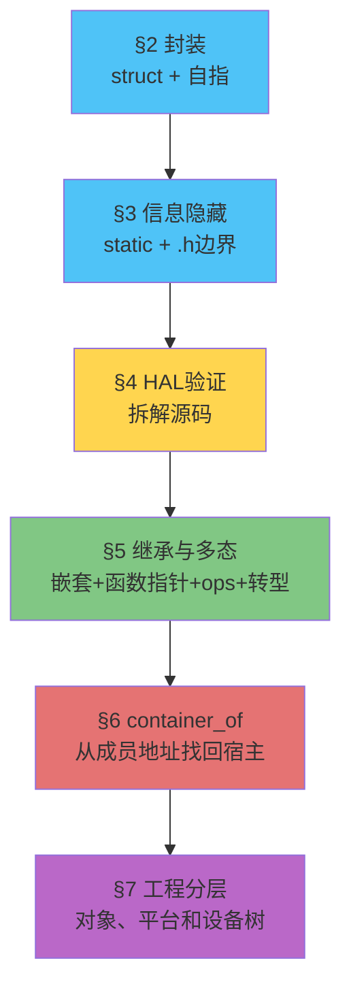
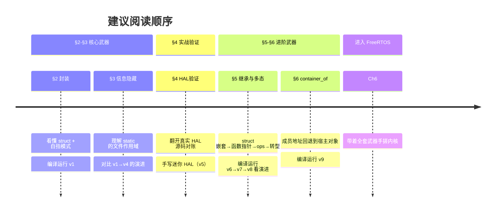
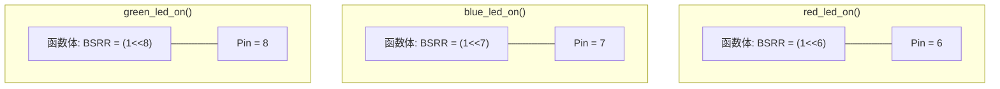
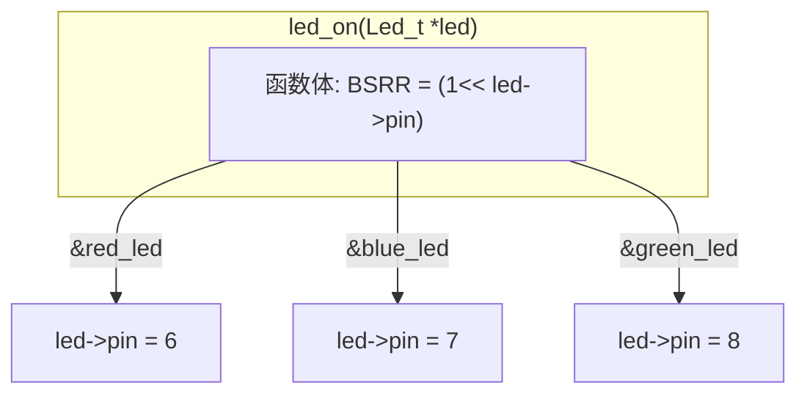

# Chapter 5 C语言面向对象工程架构基础

## 1 导言

### 1.1 回顾与问题

回顾一下我们到目前为止学了什么：

- **Chapter 1** 讲的是"怎么跟芯片打交道"——总线矩阵、统一内存架构、寄存器映射、启动流程、GPIO。核心收获：**MCU 里一切操作归结于往地址写数据**。
- **Chapter 2** 讲的是"芯片自己怎么管自己"——中断系统、定时器、PWM、看门狗。
- **Chapter 3** 讲的是"芯片之间怎么通信"——UART、SPI、I²C、CAN 四种协议，以及 ADC。
- **Chapter 4** 讲的是"给 CPU 减压"——DMA 解放 CPU 搬数据，FSMC 扩展外部内存。

这四章下来，你掌握了怎么跟硬件打交道。

但是等等——你再想想：到目前为止，我们写的代码都长什么样？一个 `main.c`，几百行，几个全局变量散落在各处，函数之间互相调用。你在 Chapter 1 里写的 `led.s` 汇编只有 50 行，这种风格没问题。可如果你要写的是：

- 一个能同时管理 10 个 LED 的驱动
- 一个能让你同事直接调用、而不用担心他搞坏内部状态的模块
- 一份像 HAL 库那样"几千个函数、同一个套路"的代码库
- **一个像 FreeRTOS 那样的操作系统内核**

**"一个 main.c + 几个全局变量"的裸过程式写法，还能撑得住吗？**

让我们用一个具体的例子来感受这种"撑不住"。

在 Chapter 1 里，你大概是这样点亮一盏 LED 的：

```c
// 裸过程式——逻辑和具体设备焊死在一起
void red_led_on(void) {
    GPIOF->BSRR = GPIO_Pin_6;  // 只能操作红灯，不能操作别的
}
```

如果你想加第二盏灯、第三盏灯呢？很多人是这么干的：

```c
void red_led_on(void)   { GPIOF->BSRR = GPIO_Pin_6; }
void green_led_on(void) { GPIOF->BSRR = GPIO_Pin_7; }
void blue_led_on(void)  { GPIOF->BSRR = GPIO_Pin_8; }
```

**三盏灯 = 三份几乎一模一样的代码。** 这不是"代码复用"——这是"代码复制"。逻辑完全相同（"往某个寄存器写某个位"），变的无非是"哪个 pin"。但当逻辑和具体数据焊死在一起，你只能用 Ctrl+C/Ctrl+V 来"复用"。

更大的问题在后面。当你写到 10 盏灯、20 盏灯，代码量线性膨胀。更要命的是，如果某天硬件改版，红灯从 Pin6 换到 Pin9，你得通篇搜索替换——**换一个 pin，改 N 个地方。** 这在工程上叫"脆弱的系统"——改一处崩一片。

更深处的问题是：Ch6-8 你要手搓 FreeRTOS，FreeRTOS 支持同时运行几十个任务。每个任务有自己的栈、优先级、状态。你打算怎么写？

```c
void task1_resume(void) { ... }
void task2_resume(void) { ... }
void task3_resume(void) { ... }
// ... 写到 task64 你人没了 你的座位上只留下了你燃尽剩下的舍利子
```


**问题不是"能不能实现"，是"能不能在工程上持续维护"。**


嵌入式是软硬件结合的学问。要写出好用、能维护的代码，光懂架构原理、通信时序和寄存器操作还不够，**本章是从“会驱动硬件”走向“会组织工程”的转折点**。前四章教你怎么使用芯片，本章开始教你怎么组织代码。你会发现，从 HAL 库到 RTOS，从 U-Boot 到 Linux 内核，很多成熟工程的代码哲学惊人地一致：封装对象、隐藏实现、共享接口、用函数表分发行为。掌握了这些套路以后，再看 FreeRTOS 的几千行 C 代码，就不再是端着望远镜看山，而是能顺着路往里走。

### 1.2 本章要解决的问题

C 语言没有 `class`、没有 `extends`、没有 `virtual`——这些 C++ 关键字我们一个都指望不上。但你猜 --

Linux 内核用的什么语言？C。

HAL 库用的什么语言？C。

FreeRTOS 用的什么语言？C。

三千万行 Linux 内核全是 C。如果没有对象边界、接口边界和分层约定，这种规模的工程不是“难调 bug”，而是 bug 会带着你在源码森林里绕圈。

这就是本章要教你的：**C 语言当然可以写过程式代码，但在工业嵌入式工程里，它也经常以“面向对象”的方式组织复杂系统。**

我们用**一个 LED 驱动**当线索，从零开始一步步改造它。每一次改造，都解决一个具体的工程痛点。你看到的每一个设计，都不是“老师造的玩具”——而是你打开 HAL、RTOS、Linux 驱动时真能对上的工业写法。

每一节回答一个问题，给出一个武器，指出一段工业代码作证：

| 节 | 😫 痛点 | 🔧 给出的武器 | 🏭 对应的工业代码 |
|:---:|----------|--------------|-------------------|
| §2 | 三个 LED 写了三份代码，Ctrl+C 不是复用 | struct + 自指指针 | `GPIO_TypeDef` + `*GPIOx` 形参 |
| §3 | 同事直接改了 `led.pin = 666`，系统炸了 | `static` 私有化 + `.h` 公开接口 | HAL 源码里遍地 `static` 函数 |
| §4 | 我学的是不是玩具？工作中真有人这么写？ | 拆解 HAL 源码逐行对账 | 直接翻 `stm32f4xx_hal_gpio.c` |
| §5 | 三种 LED（普通/PWM/I2C）行为不同，上层却想统一调用 | struct 嵌套 + 函数指针 + ops 虚表 + 转型 | C++ vtable、多态 dispatch |
| §6 | 拿到 `Led_t *`，怎么找回真实子类对象？ | `container_of` 宏 | Linux 内核常见宿主对象反查 |
| §7 | 这些技巧怎么串成工程分层和硬件描述？ | App/Board/Interface/Driver/Platform + 设备树 | STM32 HAL + FreeRTOS、Linux、Zephyr |



> 💡 这个递进结构不是偶然的——真实工程中，你接手一个"只有一个 main.c"的项目，也会沿着同样的路径重构：先封装数据 → 再隐藏实现 → 再对照工业代码 → 最后引入继承、多态和宿主对象反查。

最关键的一句：**学完这章，后面手搓 FreeRTOS 的时候，你看到的 TCB 将不再只是一个“巨大的 struct”；之后再看嵌入式 Linux 或 Zephyr，也不会只觉得几千万行源码高深莫测。你会开始顺着对象、接口、宿主关系、驱动和平台分层去拆，源码会从一团黑雾变成一张能读的地图。**

### 1.3 本章学习路径

#### 📂 配套代码

本章的每个核心概念都有对应的代码版本，放在 `code/` 目录下。它们是渐进演化的——v2 在 v1 的基础上改，v3 在 v2 的基础上改，就像你真实重构一个项目一样。

| 版本 | 对应小节 | 核心变化 | 路径 |
|:---:|:---:|------|------|
| v1 | §2 | 封装第一部: struct 封装 + 自指指针 | [`code/v1_封装_struct_me_pointer/`](code/v1_封装_struct_me_pointer/) |
| v2 | §3 | 封装第二部:static 私有化 + .h 公开接口 | [`code/v2_信息隐藏_static_private/`](code/v2_信息隐藏_static_private/) |
| v3 | §3 | 手搓 Class：函数前缀 = 类名 | [`code/v3_手搓class_前缀_init_deinit/`](code/v3_手搓class_前缀_init_deinit/) |
| v4 | §3 | 四种数据归宿，消灭裸全局变量 | [`code/v4_数据归位_static_const/`](code/v4_数据归位_static_const/) |
| v5 | §4 | 迷你 HAL，映射真实寄存器 | [`code/v5_HAL验证_mini_hal/`](code/v5_HAL验证_mini_hal/) |
| v6 | §5 | 继承: struct 嵌套 | [`code/v6_继承_struct_嵌套/`](code/v6_继承_struct_嵌套/) |
| v7 | §5 | 函数指针实现多态 | [`code/v7_多态_函数指针/`](code/v7_多态_函数指针/) |
| v8 | §5 | ops 结构体 = 虚表 | [`code/v8_多态_ops虚表/`](code/v8_多态_ops虚表/) |
| v9 | §6 | container_of：从成员地址找回宿主对象 | [`code/v9_container_of/`](code/v9_container_of/) |

每个版本都是完整的、可独立编译运行的工程。v1-v4 带有 `platform.h/platform_pc.c`，适合观察“同一套上层接口如何替换底层实现”；v5-v9 更偏概念演进，主要用 PC 打印结果观察 HAL 封装、继承、多态、ops、转型和 `container_of` 的调用链。

#### 📖 核心参考资料

- **兆鸣嵌入式**《C语言·一个LED讲透面向对象》系列（EP06-EP15）：本章的设计框架和代码风格以此为主线，仓库已克隆到 [`reference/oop_example/`](../../reference/oop_example/)
  - EP06-EP10：对应 §2-§4 的核心模式
  - EP11-EP15：对应 §5-§6 的进阶技巧
  - 每个 EP 都有独立的 PDF 文档和可编译代码
- **编码规范**：`reference/oop_example/coding-standards/` 下的 7 章 PDF，覆盖架构设计、设计模式、Clean Code、内存安全、硬件交互、安全检查清单，学完本章后可作为日常编码参考。

#### 🗺️ 阅读建议



#### ⚡ 如果你有 STM32 开发板

v1-v4 的工程通过 `platform.h` 把底层 GPIO 写操作隔离出来，PC 版本用 `platform_pc.c` 和 `printf` 模拟硬件。如果你有开发板，可以写一个 `platform_stm32.c`，用真实 HAL 或寄存器操作实现同一组接口，再在编译时替换 PC 版本。

v5 开始会直接拆 mini HAL；v6-v9 则更专注于继承、多态、ops、转型和 `container_of` 这些 C 语言面向对象技巧。它们仍然可以在 PC 上编译运行，用打印结果观察对象和调用链。

真正把“同一份 driver 怎么跨平台复用”讲完整的，是后面的 §7。那里会把 App、Board、Interface、Driver、Platform、HAL/OS/Hardware 和设备树串起来，解释一个 I2C LED 从定义、初始化、写入到读取的完整路径。


## 2 封装--解耦属性和接口

> 📂 配套代码：[`code/v1_封装_struct_me_pointer/`](code/v1_封装_struct_me_pointer/)  
> 📖 兆鸣参考：`reference/oop_example/oop-in-c/code/EP06_封装/`

### 2.1 问题：三个 LED，三份代码

在 Chapter 1 里，三盏 LED 你大概写了六份函数：

```c
void red_led_on(void)  { GPIOF->BSRR = GPIO_Pin_6;  }
void red_led_off(void) { GPIOF->BSRR = GPIO_Pin_6 << 16; }
void blue_led_on(void)  { GPIOF->BSRR = GPIO_Pin_7;  }
void blue_led_off(void) { GPIOF->BSRR = GPIO_Pin_7 << 16; }
void green_led_on(void)  { GPIOF->BSRR = GPIO_Pin_8;  }
void green_led_off(void) { GPIOF->BSRR = GPIO_Pin_8 << 16; }
```

逻辑完全相同——"把某个 Pin 拉高或拉低"。变的无非是哪个 Pin。但逻辑和具体数据焊死了，你只能用 Ctrl+C/Ctrl+V。

第一个问题: 如果你发现你电平搞反了,这种微小的错误,因为你的复制粘贴, 你波及到了6个函数, 如果有100个led 那么你就波及到了200个函数.这会显著增加调试的难度.

第二个问题: **两盏LED没法同时亮。** 因为函数名已经把设备信息焊死了——`red_led_on()` 只能操作红灯。你想让红灯和蓝灯一起亮，必须写两行。你想操作任意一盏灯（比如用户在串口终端输入 "R" 就亮红灯），你得写一个又臭又长的 `switch-case` 或者 `if-else if` 链。这是因为**函数无法接受"操作谁"的信息**——它只有一个 `void` 参数，没有地方告诉它"这次你操作哪盏灯"。

这就是为什么我们要引入面向对象来对复用的函数进行化简, 因为**重复就是Bug的温床**。


### 2.2 属性和接口:`struct`和自指指针(me pointer)

#### 2.2.1 属性和接口解耦

对于上面的模型,  变化的是变量, 不变的是函数, 这在面向对象中, 我们分别叫做属性--变量, 接口--函数

我们可以直观地看到两种方案的区别。

优化前——三个函数，三个 pin，数据和逻辑焊死：



优化后——一个函数，三个 pin，数据通过参数传入：



`led_on` 只有一份。你传谁进去，它就操作谁的 pin。改电平逻辑只改一处。


#### 2.2.2 使用`struct`打包成员

我们以基于C++的Arduino为例,只需要写一个 `on()`对应三个led, 其类可以这么写: 


````c++
class Led {
    private ：//成员
        int pin;
        
    public ：//接口
        
        void on() { 
            digitalWrite(pin, HIGH); 
        } 
    	
    	led (int pinNum) {
            pin=pinNum;
        }
    
    	~ led () {
            
        }
};

//初始化
    Led red_led=led(12);

//调用

	red_led.on();

````

C语言中有没有能把不同属性的打包东西呢, **答案是肯定的, 就是`struct`结构体**. 但是`struct`只有打包变量的能力, 不能加函数(函数指针可以, 但是本质还是要在外面绑定联系)

```c
typedef struct { //必须加typedef啊, 不然后面没办法 Led_t led
    uint8_t pin;
    /*
    led_on() 不可以! 不允许加函数
    */
    
} Led_t;
void led_on(){
    //成员函数(接口)只能在外面定义,如何建立联系???
}

```

#### 2.2.3 自指指针--接口和成员的绑定

第一个问题, 上面这么多行代码--**最关键的，直接指定了成员函数和类的调用关系的是哪一行**？

> **答案就是`red_led.on()`** 。他自动帮我们找到了`red_led`的`pin`, 然后使用平台提供的`digitalWrite()`去操作他.

接着思考, **这个调用的底层机制在哪**? 

> 答案是`this` 指针.  
>
> 在 C++ 中，编译器会偷偷给每个成员函数加一个隐藏参数：`class MyClass* this`。它就是指向当前对象自己的 `this` 指针。调用成员函数时，编译器会把对象地址悄悄塞进这个参数里。
>
> 也就是说 `on()`看上去没有任何参数

把这件事拆开看，其实 C++ 和 C 只差一层语法糖：


左边的 `red_led.on()` 看起来没有参数，但编译器会悄悄补一个 `this`，让成员函数知道自己正在操作 `red_led`。右边的 C 写法没有这层自动补参，所以我们必须把对象地址明明白白传进去：`led_on(&red_led)`。

C 语言的标准没有这样的语法糖。我们需要手搓这个指针,这就是自己指向自己的指针,我们称为**自指指针(me pointer)**, 它就是你函数里,和你这个类同名的一个普通的 `Led_t *` 形参。简化一下是这个效果

```c
// led.h
typedef struct { 
    uint8_t pin;
} Led_t;

int led_on(Led_t *led);//成员函数需要传入结构体才能用!这个结构体指针被称为自指指针

```

```c
// led.c
int led_on(Led_t *led) {
    if (led == NULL) return -1;
    platform_gpio_write(led->pin, true);
    return 0;
}
```

```c
// main.c
Led_t red_led, green_led, blue_led;
led_on(&red_led);      // led->pin = 13
led_on(&green_led);    // led->pin = 14，同一份函数体！
```


你会发现, 所有你接触到的工业代码的习惯是有类似的实现:

```c
// STM32 HAL：GPIOx = "当前操作的 GPIO 端口自己"
void HAL_GPIO_WritePin(GPIO_TypeDef *GPIOx, uint16_t GPIO_Pin, GPIO_PinState PinState);
void HAL_UART_Transmit(UART_HandleTypeDef *huart, uint8_t *pData, uint16_t Size);

// FreeRTOS：pxTCB = "当前操作的 TCB 自己"
void vTaskSuspend(TaskHandle_t xTask);     // 内部: TCB_t *pxTCB = (TCB_t *)xTask;
void vTaskResume(TaskHandle_t xTask);

// Linux 内核：dev = "当前操作的设备自己"
int device_register(struct device *dev);
int driver_register(struct device_driver *drv);
```

它们的命名风格非常统一——**不用 `this`（C++ 保留字）、不用 `self`（Python/Rust 习惯）、不用 `obj`（太泛）——而是用类型名的缩写直接告诉你"指针指向什么类型"。** 本章教学里，LED 的自指指针叫 `led`，电机叫 `motor`，TCB 叫 `tcb`——等你写自己的代码时，依样画葫芦即可。

| 场景 | 应该用的参数名 |
|------|---------------|
| LED 驱动 | `Led_t *led` |
| GPIO 操作 | `GPIO_TypeDef *GPIOx` |
| 串口发送 | `UART_HandleTypeDef *huart` |
| 任务挂起 | `TCB_t *pxTCB` |
| 设备操作 | `struct device *dev` |

| C 写法 | C++ 写法 | 含义 |
|--------|----------|------|
| `struct Led_t { pin, is_on }` | `class Led { int pin; }` | 把数据打包 |
| `Led_t *led`（第一参数） | `this` 指针（隐式） | 告诉函数操作谁 |
| `led_on(&red_led)` | `red_led.on()` | 同一份逻辑，不同数据 |


### 2.3 构造和析构的实现--Init和DeInit

我们现在复刻了成员函数的封装性, 实现了一个成员函数led_on对接三个led. 但是问题是**我们还没有管理一个类的生命周期的能力**, 类是基于**构造函数**和**析构函数**来管理生命周期的. 同时**我们也需要构造函数来完成一些变量初始化工作**, 落到嵌入式层面, 比如初始化寄存器值, 通时钟等. 这些如何完成呢?

相信你也猜到了, 我们直接写一个和`led_on(Led_t* led)`同等重量级的`led_init(Led_t* led) `和`led_deinit(Led_t* led)`:

```c
// 构造函数 = 分配资源 + 初始化硬件
int led_init(Led_t *led, uint8_t pin) {
    if (led == NULL) return -1;
    led->pin = pin;                              // 给属性赋值
    led->brightness = 0;
    led->is_on = false;
    platform_gpio_init(pin, GPIO_MODE_OUTPUT);   // 初始化硬件（通时钟、配寄存器）
    platform_gpio_write(pin, false);             // 确保上电后LED是灭的
    return 0;
}

// 析构函数 = 释放资源 + 关闭硬件
int led_deinit(Led_t *led) {
    if (led == NULL) return -1;
    platform_gpio_write(led->pin, false);        // 先关灯
    platform_gpio_deinit(led->pin);              // 释放引脚
    led->pin = 0;                                // 清空属性
    led->brightness = 0;
    led->is_on = false;
    return 0;
}
```

对比 C++ 和 C 的生命周期：

| 阶段 | C++（编译器自动） | C（你手动） |
|------|-------------------|------------|
| 对象创建 | `Led red(13);` 自动调 `Led::Led(int)` | 手动调 `led_init(&red_led, 13)` |
| 正常使用 | `red.on();` | `led_on(&red_led);` |
| 对象销毁 | `}` 离开作用域，自动调 `~Led()` | 手动调 `led_deinit(&red_led)` |

C 语言没有自动机制——**但你可以手动遵守同样的生命周期协议。** 你已经在 Ch1-4 里习惯了"用之前先 Init、用完后 DeInit"的 HAL 套路——只不过现在你知道它背后是一套完整的构造/析构思想了。

### 2.4 代码实战

打开 [`code/v1_封装_struct_me_pointer/`](code/v1_封装_struct_me_pointer/)，整个工程从零演示 struct 封装 + 自指指针 + 构造/析构。三个文件的核心逻辑：

```c
// led.h — 数据结构定义 + 公开接口声明
typedef struct {
    uint8_t  pin;
    uint8_t  brightness;
    bool     is_on;
} Led_t;

int led_init(Led_t *led, uint8_t pin);       // 构造
int led_deinit(Led_t *led);                   // 析构
int led_on(Led_t *led);                       // 成员方法
int led_off(Led_t *led);
int led_toggle(Led_t *led);
int led_set_brightness(Led_t *led, uint8_t brightness);
int led_get_state(const Led_t *led, bool *is_on, uint8_t *brightness);
```

```c
// main.c — 使用演示
Led_t red_led, green_led, blue_led;

led_init(&red_led, 13);
led_init(&green_led, 14);
led_init(&blue_led, 15);

led_on(&red_led);                                  // 操作红灯
led_on(&green_led);                                // 同一份代码操作绿灯
led_set_brightness(&blue_led, 30);                 // 蓝灯30%亮度
led_toggle(&red_led);                              // 翻转红灯

bool state; uint8_t brightness;
led_get_state(&green_led, &state, &brightness);    // 安全读取状态

led_deinit(&red_led);                              // 析构清理
led_deinit(&green_led);
led_deinit(&blue_led);
```

你可以在 PC 上直接用 GCC 编译运行（不需要开发板）：
```bash
gcc -Wall -Wextra -std=c11 -o demo main.c led.c platform_pc.c
./demo
```

也可以把 `platform_pc.c`（printf 模拟 GPIO）替换成 `platform_stm32.c`（真实 HAL 寄存器操作）落到 STM32 上——**`led.c` 和 `main.c` 一行不用改。**

### 2.5 总结

基于自指指针和struct封装, 我们初步实现了面向对象的封装特性, 完成了属性和接口的解耦. 但是这不是封装的全部, 我们还没有完成属性的权限隔离, 下一章我们会介绍如何实现.


## 3 封装--区分公有和私有

### 3.1 问题：函数公私不分，变量公私不分

上一节我们用 `struct` + 自指指针把属性和接口打包在了一起。但打包只是第一步——你还没决定哪些东西同事能动，哪些不能动。

看这个例子。你的 LED 驱动里有 `update_hardware` 这个内部辅助函数——它只负责把 `is_on` 同步到寄存器，不应该被外部直接调用。还有一堆内部校验用的辅助函数。但现在它们和 `led_on`、`led_off` 一样暴露在外面。同事不小心调了 `update_hardware` 而你外部又同时调了 `led_on`——寄存器可能被写两遍，状态机乱套。

更糟的是 struct 字段——`led.pin = 999`，这行代码编译器不会拦。两件事本质上是同一个问题：**在 C++ 里 `private` 关键字做的事情，C 语言靠什么？**

答案分两层——函数能锁，字段锁不了。我们一层一层看。

### 3.2 方案：`static` 锁定私有成员函数+头文件暴露接口

#### 3.2.1 `static` 的链接行为 = C 的 `private`

回顾一下 `static` 关键字的两个属性：

| 出现区域 | 属性 | 作用 |
|----------|------|------|
| 作为局部变量的修饰词 | 内存行为 | 变量生命周期延长至程序结束 |
| 作为全局变量/全局函数的修饰词 | 链接行为 | 仅在本文件可见，外部 `extern` 也链不到 |

第二个属性——**限定函数和文件级变量仅在本 `.c` 可见**——就是 C 语言里我们能用的 `private`。

```c
// led.c
static void update_hardware(Led_t *led) {       // private——外部链不到
    platform_gpio_write(led->pin, led->is_on);
}

int led_on(Led_t *led) {                        // public——.h 里声明
    if (led == NULL) return -1;
    led->is_on = true;
    update_hardware(led);  // 内部调用 private，OK
    return 0;
}
```

同事在 `main.c` 里写 `update_hardware(&led)` → 编译报错 `undefined reference`。

#### 3.2.2 头文件 = 菜单，`.c` = 厨房

这套边界最适合用"菜单和厨房"来理解：外部只能按菜单点菜，不能冲进厨房直接动锅。


图里蓝色路径是允许的：`main.c` 通过 `led.h` 看见 `led_on()`，再由 `led_on()` 进入 `led.c` 内部。红色虚线是被禁止的：`static update_hardware()` 没有外部链接名，`main.c` 即使知道它存在，也链接不到它。

落实到代码：

```c
// led.h — 菜单：只放公开接口
typedef struct {
    uint8_t  pin;
    bool     is_on;
} Led_t;

int led_init(Led_t *led, uint8_t pin);   // 公开
int led_on(Led_t *led);                  // 公开
int led_off(Led_t *led);                 // 公开
```

```c
// led.c — 厨房：实现细节全加 static
static void update_hardware(Led_t *led) {       // private
    platform_gpio_write(led->pin, led->is_on);
}

int led_on(Led_t *led) {                        // public
    if (led == NULL) return -1;
    led->is_on = true;
    update_hardware(led);
    return 0;
}
```

### 3.3 代码实战

打开 [`code/v2_信息隐藏_static_private/`](code/v2_信息隐藏_static_private/)，核心对比：

```c
// main.c — 正常路径：走公开接口
led_on(&red_led);                // 硬件真正点亮 ✓

// main.c — 错误路径：直接调内部函数
update_hardware(&green_led);     // 编译报错！编译器守门 ✓

// main.c — 另一个错误路径：捅 struct 字段
green_led.is_on = true;          // 编译器不拦 ✗
// → 硬件纹丝不动，之后 led_toggle 内部状态判断全乱
```

`static` 守住了函数——这是 C 能直接给你的。但 struct 字段这道门，`static` 装不上。也就是说，我们手搓的“类”里，字段默认还是 public；真正能被编译器硬锁住的，是 `.c` 文件内部的 `static` 函数和不暴露出去的符号。


### 3.4 成员变量的私有问题——工业界怎么做的

`led.pin = 999` 这个操作，编译器真的管不了吗？我们看一下几个真实工程是怎么处理的。它们有的只有几千行代码，有的有几千万行代码，你会发现，不同选择背后处处都是 Trade-off 的哲学：

先把两条路线放在一张图里看：


左边是嵌入式里最常见的方案：`struct` 定义公开，字段靠命名、注释、代码审查守门；函数用 `static` 真正锁住。右边是不透明指针：头文件只暴露 `Led_t *` 和接口，完整 `struct Led_t` 藏在 `.c` 里，外部连字段布局都看不到，所以字段访问会被编译器挡住。

#### 3.4.1 HAL 库 / FreeRTOS / RT-Thread：全公开 + 约定守门

```c
// stm32f4xx_hal_gpio.h
typedef struct {
    uint32_t Pin;       // 全公开，谁 include 都能捅
    uint32_t Mode;
    uint32_t Pull;
    uint32_t Speed;
} GPIO_InitTypeDef;
```

```c
// FreeRTOS tasks.c
typedef struct tskTaskControlBlock {
    volatile StackType_t *pxTopOfStack;   // 全公开
    ListItem_t            xStateListItem; // 全公开
    UBaseType_t           uxPriority;     // 全公开
    // ...
} TCB_t;
```

不锁。不是因为不想——是因为在嵌入式里，上不透明指针要付出的代价（堆分配、多一层间接）比"偶尔有人捅错字段"的代价大得多。

它们的选择是：**struct 定义放 `.h` 全公开，靠 `prv` 前缀和命名约定划线。** 你碰了 `prv` 打头的函数，链接器报错；你碰了不该碰的字段，代码审查的同事报错。

#### 3.4.2 Linux 内核：把成员放堆上——真锁

Linux 内核面对的是数千万行代码和大量协作者，单靠约定很难长期守住边界。它用了另一种手段：**让外部根本看不到 struct 的定义。** 这一招很精彩，可以说内核开发者把 C 语言的边界感玩出了花。

首先想一个问题：前面方案一的 struct，为什么字段锁不住？

```c
// led.h
typedef struct {
    uint8_t pin;        // 外部 include 就能看见
    bool    is_on;      // 看见就能捅
} Led_t;
```

编译器必须知道 struct 里有什么，才能在栈上给你分配空间。你写 `Led_t red_led;` 的时候，编译器算 `sizeof(Led_t)`，腾出 2 字节，把 `pin` 放在偏移 0，`is_on` 放在偏移 1。这套操作的每一个环节都依赖 struct 定义可见。

但如果你只用一个指针——`Led_t *led`——编译器只需要知道指针本身的大小（4 或 8 字节），不需要知道它指向的东西有多大。这跟数组是一个道理：`int arr[10]` 必须知道 10 才能开栈帧，`int *arr` 不需要。

所以锁字段的思路很简单：**让外部只拿到指针，拿不到定义。**

这张图把完整调用链画出来了：外部能拿到的只有 `red` 这个指针值，它保存的是堆上对象的地址；真正的 `struct Led_t` 定义、`malloc(sizeof(struct Led_t))` 和字段访问都发生在 `led.c` 内部。


注意红色路径为什么会断掉：`red->pin` 不是因为运行时"不让访问"，而是编译期就过不去。外部只见过 `typedef struct Led_t Led_t;`，不知道 `struct Led_t` 里面有没有 `pin`，也不知道 `pin` 在第几个字节，所以编译器根本算不出 `red->pin` 该怎么取。

```c
// ========== led.h — 外部只看到这些 ==========
typedef struct Led_t Led_t;          // 只声明类型名，不给定义

Led_t *led_create(uint8_t pin);      // 工厂函数
int led_on(Led_t *led);              // 只能走接口
void led_destroy(Led_t *led);

// ========== led.c — 定义和实现全在内部 ==========
struct Led_t {                       // 完整定义藏在这里
    uint8_t pin;
    bool    is_on;
};

static void update_hardware(Led_t *led) {   // static 锁函数
    platform_gpio_write(led->pin, led->is_on);
}

Led_t *led_create(uint8_t pin) {           // 工厂函数：这里能 malloc
    Led_t *led = malloc(sizeof(Led_t));    //   sizeof 在这里算，外部算不了
    led->pin = pin;                         //   内部随便碰字段
    led->is_on = false;
    return led;
}

int led_on(Led_t *led) {
    if (led == NULL) return -1;
    led->is_on = true;                     // 字段随便用
    update_hardware(led);
    return 0;
}

void led_destroy(Led_t *led) {
    if (led == NULL) return;
    free(led);
}

// ========== main.c — 外部只能拿到不透明指针 ==========
Led_t *red = led_create(13);        // ✓ 只能走工厂
led_on(red);                        // ✓ 只能走接口
// red->is_on = true;               // ✗ 编译报错！incomplete type
led_destroy(red);
```

`led.h` 里 `typedef struct Led_t Led_t;` 只告诉编译器"Led_t 存在"，不给大小，不给字段。外部什么也看不见。

`led.c` 里 `struct Led_t { ... };` 给了完整定义。这里 `sizeof(Led_t)` 算得出来，字段随便碰，`malloc`、`free` 都在这里完成。两道锁同时生效——函数加 `static` 拦调用，结构体藏定义拦访问。

---

理清了这个，我们分两个视角走一遍。

**视角一：你是一个驱动开发者**

你正在写一个字符设备驱动。当用户对你的设备节点 `write` 的时候，内核回调你的函数：

```c
// drivers/char/my_led_driver.c
#include <linux/fs.h>  // 只能拿到 struct file; 声明

static ssize_t led_write(struct file *filp, const char *buf,
                         size_t count, loff_t *pos) {
    // 你拿到了一个 struct file *filp
    // 你想看 f_flags？搜遍 include/linux/fs.h 只有一行：
    //   struct file;
    // 你想 sizeof(*filp)？编译报错——编译器也不知道
}
```

你能对 `filp` 做什么？

```c
// ✓ 传指针——编译器知道指针大小（8 字节），不需要知道指向什么
vfs_write(filp, buf, count);     

// ✓ 读 private_data——内核留给驱动挂私有数据的后门
struct my_led *led = filp->private_data;

// ✗ 一切解引用操作——编译报错
// filp->f_flags     → dereferencing pointer to incomplete type
// sizeof(*filp)      → invalid application of 'sizeof'
// struct file f;     → storage size unknown
```

你就这样被关在了外面。驱动框架里的 `open`、`read`、`write`、`release`——你拿到的 `struct file *filp` 和 `struct inode *inode` 永远是不透明指针。除了内核在 `struct file` 里给你留的一个 `void *private_data` 钩子，你什么都碰不了。

**视角二：你是 VFS 子系统的维护者**

你负责文件系统核心。你定义了 `struct file`：

```c
// fs/file_table.c —— 只有 VFS 团队能改的文件
struct file {
    struct path     f_path;
    struct inode    *f_inode;
    const struct file_operations *f_op;   // §7 要讲的函数指针虚表
    void            *private_data;        // 留给驱动的唯一后门
    unsigned int    f_flags;              // 驱动碰不了
    atomic_long_t   f_count;             // 驱动碰不了
    struct mutex    f_pos_lock;
    // ... 几十个字段
};
```

因为你知道完整定义，你可以随便用：

```c
// fs/read_write.c —— 你是维护者，字段随便碰
ssize_t vfs_write(struct file *filp, const char *buf, size_t count, loff_t *pos) {
    if (!(filp->f_flags & O_WRONLY)) return -EBADF;   // ✓ 随便读
    filp->f_pos = *pos;                                 // ✓ 随便写
    return filp->f_op->write(filp, buf, count, pos);   // ✓ 多态调用
}
```

同一个 `struct file *`，在你手里和驱动开发者手里权限完全不同——不是靠注释，不是靠命名约定，**靠编译器硬拦。**

这个机制有个通俗的类比：你去银行金库，拿到一个手柄（指针）。你能把手柄递给下一个人，能挂在墙上，但你永远不知道手柄那头连接的柜门长什么样。只有银行经理（VFS 维护者）有金库的图纸（struct 定义），能打开柜门存取任何东西。银行经理还特意在柜门外给你焊了个小挂钩（`private_data`），说"你可以往上面挂你自己的东西"。

**两种视角总结：**

| | 驱动开发者 | VFS 维护者 |
|------|---------------|--------------|
| 拿到的东西 | `struct file *filp` | `struct file *filp` |
| 能看到定义吗 | ❌ 只看到 `struct file;` | ✓ 看到完整 struct |
| 能读 `f_flags` 吗 | ❌ 编译报错 | ✓ |
| 能写 `f_pos` 吗 | ❌ 编译报错 | ✓ |
| 能用 `private_data` 吗 | ✓ | ✓ |
| 栈上能声明吗 | ❌ `struct file f;` 报错 | ✓ |
| 安全机制 | 编译器硬拦 | 信任 + 你写的测试 |


#### 3.4.3 你用哪个？

| 场景 | 做法 | 谁在用 |
|------|------|--------|
| 单片机、小团队 | struct 全公开，约定守门 | HAL、FreeRTOS、RT-Thread |
| 大规模协作、需强制隔离 | `.h` 只声明类型，`.c` 定义 struct 并用 `malloc` 创建对象 | Linux 内核核心结构体 |

你的 LED 驱动属于第一种。教程后面的 v2-v9 一律用全公开+约定守门——因为这就是你工作中会看到的代码。但在 §6 讲 `container_of` 的时候你会再次见到不透明指针的影子——Linux 内核也经常把对象的一部分暴露给外部，再通过 `container_of` 从这个成员指针找回完整结构体。

### 3.5 总结

优化前——所有函数和字段全裸在外面，谁都能碰：

```c
// led.h
typedef struct { uint8_t pin; bool is_on; } Led_t;

// led.c — 全是公开函数
void update_hardware(Led_t *led) { ... }   // 谁都能调
int  led_on(Led_t *led)            { ... }
```

```c
// main.c — 同事三条路都能走
led_on(&red_led);                   // ✓ 公开接口
update_hardware(&red_led);          // ✗ 直接调内部函数，不报错
red_led.is_on = true;               // ✗ 直接捅字段，不报错
```

---

**方案一：单片机/RTOS 级别——static 锁函数 + .h 约定守门**（本章 v2 采用）

```c
// led.h — struct 全公开，只放公开接口
typedef struct { uint8_t pin; bool is_on; } Led_t;
int led_init(Led_t *led, uint8_t pin);
int led_on(Led_t *led);
int led_off(Led_t *led);
```

```c
// led.c — 内部函数加 static
static void update_hardware(Led_t *led) { ... }   // 外部链不到

int led_on(Led_t *led) {
    led->is_on = true;
    update_hardware(led);   // 内部调用 OK
}
```

```c
// main.c
led_on(&red_led);                   // ✓
update_hardware(&red_led);          // ✗ 编译报错！函数锁了
red_led.is_on = true;               // ✗ 不报错，但靠约定守门
```

- `static` 锁了函数——编译器帮你守
- struct 字段锁不了——靠命名约定和代码审查守
- HAL、FreeRTOS、RT-Thread 都用这个方案

---

**方案二：Linux 内核级别——使用 `malloc`，字段也锁**

```c
// led.h — 只声明，不给定义
typedef struct Led_t Led_t;          // 外部不知道里面有什么

Led_t *led_create(uint8_t pin);      // 工厂函数，堆分配
int led_on(Led_t *led);
int led_off(Led_t *led);
void led_destroy(Led_t *led);
```

```c
// led.c — 真实定义藏在内部
struct Led_t { uint8_t pin; bool is_on; };
static void update_hardware(Led_t *led) { ... }  // static 锁函数

Led_t *led_create(uint8_t pin) {
    Led_t *led = malloc(sizeof(Led_t));          // 只能堆分配
    led->pin = pin; led->is_on = false;
    return led;
}
```

```c
// main.c
Led_t *red = led_create(13);        // ✓ 只能走工厂
led_on(red);                        // ✓ 只能走接口
red->is_on = true;                  // ✗ 编译报错！incomplete type
```

- 字段和函数全锁——编译器帮你守住所有门
- 代价：堆分配 + 多一层指针 + 多一层函数包装
- Linux 内核对 `struct file`、`struct inode`、`struct device` 全用这个方案


## 4 HAL 验证：你学的就是工业标准

> 📂 配套代码：[`code/v5_HAL验证_mini_hal/`](code/v5_HAL验证_mini_hal/)  
> 📖 兆鸣参考：`reference/oop_example/oop-in-c/code/EP10_HAL映射/`

### 4.1 逐行对账

翻开 HAL 库 `stm32f4xx_hal_gpio.c`：

| 你学的 | HAL 库写的 | 来源 |
|--------|-----------|------|
| `Led_t { pin, is_on }` | `GPIO_TypeDef { MODER, ODR... }` | §2 struct |
| `led_on(Led_t *led)` | `HAL_GPIO_WritePin(GPIO_TypeDef *GPIOx, ...)` | §2 自指指针 |
| `static update_hardware()` | `static GPIO_GET_INDEX()` | §3 |

**几千个 HAL 函数——就这一个套路。**

Ch1 和 Ch5 在此交汇：

```c
// Ch1: 往地址写数据
*(volatile uint32_t*)0x40020014 = val;

// Ch5: OOP 封装
#define GPIOA ((GPIO_TypeDef *)0x40020000)
GPIOA->ODR = val;   // 同一件事，不同表达
```

### 4.2 迷你 HAL

打开 [`code/v5_HAL验证_mini_hal/`](code/v5_HAL验证_mini_hal/)：

```c
void HAL_GPIO_WritePin(GPIO_TypeDef *GPIOx, uint16_t pin, bool value) {
    if (value) GPIOx->BSRR = (uint32_t)pin;
    else       GPIOx->BSRR = (uint32_t)pin << 16;
}
```


## 5 继承与多态

> 📂 配套代码：[`code/v6_继承_struct_嵌套/`](code/v6_继承_struct_嵌套/) → [`code/v7_多态_函数指针/`](code/v7_多态_函数指针/) → [`code/v8_多态_ops虚表/`](code/v8_多态_ops虚表/)  
> 📖 兆鸣参考：`reference/oop_example/oop-in-c/code/` EP11-EP14

### 5.1 提升代码的复用性

§2 和 §3 教会了你一件事：把一个 LED 封装成 `Led_t`，用 `led_on(Led_t *led)` 操作它。当你的板子上只有一种 LED 时，这套方案非常完美。

但实际工程里很少这么简单。一块板子上可能同时存在：

- **GPIO 直连的普通 LED** —— 操作 `GPIO->BSRR` 寄存器
- **PWM 驱动的呼吸灯** —— 操作定时器的 `CCR` 寄存器控制占空比
- **I2C GPIO 扩展芯片上的 LED** —— 走 I2C 总线发命令，不碰任何 GPIO 寄存器

它们都是"灯"，都有"开"和"关"的概念。但从底层驱动来看，操作方式完全不同。

你当然可以为每种 LED 各写一套，像这样：

```c
// GPIO LED
typedef struct { uint8_t pin; bool is_on; } GpioLed_t;
void gpio_led_on(GpioLed_t *led) { GPIO->BSRR = (1 << led->pin); }

// PWM LED
typedef struct { uint8_t channel; uint8_t duty; bool is_on; } PwmLed_t;
void pwm_led_on(PwmLed_t *led) { TIM3->CCR[led->channel] = led->duty; }

// I2C LED
typedef struct { uint8_t i2c_addr; uint8_t pin; bool is_on; } I2cLed_t;
void i2c_led_on(I2cLed_t *led) { i2c_write(led->i2c_addr, led->pin, 1); }
```

能跑。但三个问题接踵而至：

1. **上层逻辑跟具体驱动焊死了。** 你想写一个"所有灯闪烁三次"的函数，参数类型该写什么？`GpioLed_t *` 还是 `PwmLed_t *`？三个都写一份的话，又回到 §1 的复制粘贴地狱。
2. **共用属性被反复定义。** `pin`、`is_on`，以后可能还有 `brightness`、`error_code`——每加一种 LED，这些字段就复制一遍。
3. **加一种新 LED，改一堆地方。** 如果上层逻辑写死了类型，加一种 I2C LED 意味着所有跟"灯"相关的函数都要动。

解决方法正是面向对象里最核心的两个机制：

- **继承** —— 把共同属性抽出来，只写一遍。（本章 5.2）
- **多态** —— 用同一份接口驱动不同的底层实现。（本章 5.3、5.4）

下面三节，我们逐个拆解这两个机制在 C 语言里的实现。


### 5.2 继承基础---struct 嵌套

5.1 把问题摊开了：你有一堆不同类型的 LED，它们有共同属性，也有各自特有的属性。本节先解决第一部分——**怎么让共同属性只写一遍**。

回顾刚才的三种 LED：

- 普通 LED：`pin`、`is_on`
- PWM LED：`pin`、`is_on`、`duty`
- RGB LED：`pin`、`is_on`、`r`、`g`、`b`

`pin` 和 `is_on` 出现了三次。这不只是多打几行字的问题——以后你要给所有 LED 统一加一个 `error_code` 字段，三个结构体全部要改。

在 C++ 里，你会很自然地写：

```cpp
class Led {
public:
    int pin;
    bool is_on;
};

class PwmLed : public Led {
public:
    int duty;
};
```

`PwmLed` 自动拥有 `Led` 的全部成员，再额外加一个 `duty`。这就叫**继承**。

C 语言没有 `extends`，但是它有结构体嵌套。只要把"基类"放进"派生类"的第一个字段，就能得到几乎一模一样的效果：

```c
typedef struct { uint8_t pin; bool is_on; } BaseLed_t;          // 基类
typedef struct { BaseLed_t base; uint8_t duty; } PwmLed_t;      // 第一字段 = 基类
```

这段代码里：

- `BaseLed_t` 是基类，定义所有 LED 共有的部分
- `PwmLed_t` 是派生类，不是推倒重写，而是 **`BaseLed_t` + 自己新增的成员**

这就是 C 语言里的继承雏形。

#### 5.2.1 为什么基类必须放在第一个字段

这里最关键的一句不是"struct 里嵌了另一个 struct"，而是：**基类必须放在第一个字段。**

我们把内存展开看一下：

```c
typedef struct {
    uint8_t pin;      // offset 0
    bool    is_on;    // offset 1
} BaseLed_t;

typedef struct {
    BaseLed_t base;   // offset 0 起始
    uint8_t   duty;   // 紧跟在 base 后面
} PwmLed_t;
```

对应的内存布局：

| 偏移 | 字段 | 所属 |
|:---:|------|------|
| 0 | **`pin`** | **`BaseLed_t`（基类）** |
| 1 | **`is_on`** | **`BaseLed_t`（基类）** |
| 2 | `duty` | `PwmLed_t`（派生类扩展） |

图里有三个关键点：派生对象由"基类部分 + 新增成员"组成；基类部分从 offset 0 开始；因此 `&pwm` 和 `&pwm.base` 指向同一个起点。


`PwmLed_t` 的前两个字节就是 `BaseLed_t`，第三个字节才是自己的 `duty`。

因为 `base` 就放在 `PwmLed_t` 的起始地址，所以这两个地址**永远相同**：

```c
PwmLed_t pwm_led;
&pwm_led == &pwm_led.base   // true，地址一模一样
```

于是你就可以安全地把 `PwmLed_t *` 当成 `BaseLed_t *` 来用：

```c
PwmLed_t  pwm_led;
BaseLed_t *base = (BaseLed_t *)&pwm_led;   // 向上转型
```

这就叫**向上转型**：把更具体的派生类，当成更抽象的基类来使用。

为什么它是零开销？因为这里没有申请新内存，没有复制对象，没有多走一步函数。**只是换了一个看待同一块内存的视角。**

#### 5.2.2 继承到底帮你省了什么

如果不用继承，你会很容易写成这样：

```c
typedef struct { uint8_t pin; bool is_on; } NormalLed_t;
typedef struct { uint8_t pin; bool is_on; uint8_t duty; } PwmLed_t;
typedef struct { uint8_t pin; bool is_on; uint8_t r, g, b; } RgbLed_t;
```

表面上看没问题，实际上 `pin` 和 `is_on` 被复制了三遍。后面如果你给基类再加一个 `brightness` 或 `error_code`，三个结构体都要同步改——这和第一节讲的 `red_led_on()` / `green_led_on()` / `blue_led_on()` 一样，本质还是复制粘贴。

用了 struct 嵌套之后，共有部分只定义一次：

```c
typedef struct {
    uint8_t pin;
    bool    is_on;
} BaseLed_t;

typedef struct { BaseLed_t base; } NormalLed_t;

typedef struct {
    BaseLed_t base;
    uint8_t   duty;
} PwmLed_t;

typedef struct {
    BaseLed_t base;
    uint8_t   r, g, b;
} RgbLed_t;
```

这样一来：

- 共有字段只写一遍
- 基类接口可以统一复用，写一个 `base_led_on(BaseLed_t *)` 就能操作所有 LED
- 派生类只关心自己新增的那部分

#### 5.2.3 代码实战

打开 [`code/v6_继承_struct_嵌套/`](code/v6_继承_struct_嵌套/)，你会看到这种典型写法：

```c
typedef struct {
    uint8_t pin;
    bool    is_on;
} BaseLed_t;

typedef struct {
    BaseLed_t base;
    uint8_t   duty;
} PwmLed_t;

int base_led_on(BaseLed_t *base) {
    base->is_on = true;
    platform_gpio_write(base->pin, true);
    return 0;
}
```

调用的时候，`PwmLed_t` 可以直接复用基类接口：

```c
PwmLed_t pwm_led;
pwm_led.base.pin = 5;
pwm_led.duty = 50;

base_led_on((BaseLed_t *)&pwm_led);   // 向上转型，复用基类逻辑
```

这就是继承的第一个价值：**先把共同的数据结构抽出来，再让派生类往后接自己的扩展。**

你会发现，C 语言里所谓的继承根本不神秘——就是一句话：

> 把公共部分放前面，把扩展部分放后面。

下一节再往前走一步：既然数据结构已经能继承，那行为能不能也继承，甚至重写？这就引出了函数指针实现多态。

### 5.3 多态基础---函数指针

5.2 解决的是"数据怎么复用"：`PwmLed_t` 的开头就是一个 `BaseLed_t`，所以它能复用基类字段和基类函数。

但这还不够。因为真实驱动里麻烦的从来不只是数据，还有**行为**。

还是刚才的三种 LED：

- 普通 LED 的 `on`：写 GPIO 的 `BSRR` 寄存器
- PWM LED 的 `on`：打开定时器通道，设置 `CCR` 占空比
- I2C 扩展 LED 的 `on`：走 I2C 发一条命令

它们都叫"开灯"，但底层动作完全不一样。

如果你继续沿用普通函数写法，上层逻辑很快就会长成这样：

```c
if (type == LED_NORMAL) {
    normal_led_on(&normal);
} else if (type == LED_PWM) {
    pwm_led_on(&pwm);
} else if (type == LED_I2C) {
    i2c_led_on(&i2c);
}
```

这段代码最大的问题不是丑，而是**上层知道得太多了**。

上层本来只想表达"把这盏灯打开"，结果它被迫知道：

- 这盏灯到底是普通 GPIO、PWM 还是 I2C
- 每种灯分别调用哪个函数
- 以后新增一种灯时，这个 `if-else` 还要再改一遍

这就和前面 `red_led_on()`、`green_led_on()` 的复制问题是同一种病，只是这次病灶从"字段重复"转移到了"行为分发"。

我们想要的接口应该是这样：

```c
led_on(&normal);
led_on((Led_t *)&pwm);
```

同一个 `led_on()`，传普通 LED 就走普通 GPIO 实现，传 PWM LED 就走 PWM 实现。上层只认"灯"，不关心灯背后接的是 GPIO、定时器还是 I2C。

这就是**多态**。

#### 5.3.1 C++ 是怎么写的

在 C++ 里，这件事会写得非常自然：

```cpp
class Led {
public:
    virtual void on() = 0;
    virtual void off() = 0;
};

class NormalLed : public Led {
public:
    void on() override {
        GPIO->BSRR = GPIO_PIN_13;
    }

    void off() override {
        GPIO->BSRR = (uint32_t)GPIO_PIN_13 << 16;
    }
};

class PwmLed : public Led {
public:
    int duty;

    void on() override {
        TIM3->CCR1 = duty;
    }

    void off() override {
        TIM3->CCR1 = 0;
    }
};
```

然后上层可以只拿一个基类指针：

```cpp
void blink(Led *led) {
    led->on();
    delay_ms(100);
    led->off();
}
```

`blink()` 根本不需要知道传进来的是 `NormalLed` 还是 `PwmLed`。只要这个对象是一个 `Led`，它就能调用 `on()` 和 `off()`。

这里最关键的是 `virtual`。

如果没有 `virtual`，`led->on()` 会在编译期就决定调用 `Led::on()`。加上 `virtual` 之后，编译器会把这个调用变成一件运行时才能决定的事：

> 先从对象里找到一张函数表，再从表里取出真正的 `on` 函数，然后调用它。

这就是 C++ 虚函数的底层味道。语法看起来像 `led->on()`，机器真正干的事情更接近：

```c
led->vptr->on(led);
```

也就是说，C++ 的多态并不是魔法。它的核心就是两样东西：

1. 对象里藏着"我这类对象应该用哪套函数"的信息
2. 调用接口时，不直接写死函数名，而是通过这个信息间接调用

C 语言没有 `virtual` 关键字，但 C 有函数指针。函数指针就是我们手搓多态的入口。

#### 5.3.2 把函数指针放进对象

先把普通 `Led_t` 改成这样：

```c
typedef struct Led_t {
    uint8_t pin;
    bool    is_on;

    void (*do_on)(struct Led_t *led);
    void (*do_off)(struct Led_t *led);
    void (*do_toggle)(struct Led_t *led);
} Led_t;
```

前两个字段还是普通属性：

- `pin`：这盏灯接在哪个引脚
- `is_on`：这盏灯当前是否点亮

后面三个字段就不是数据了，而是"行为"：

- `do_on`：这盏灯自己的开灯函数
- `do_off`：这盏灯自己的关灯函数
- `do_toggle`：这盏灯自己的翻转函数

也就是说，每个对象不光带着自己的状态，还带着自己的操作方式。

普通 LED 初始化时，把函数指针填成普通 GPIO 版本：

```c
static void normal_on(Led_t *led) {
    led->is_on = true;
    printf("  [Normal] Pin%d -> ON\n", led->pin);
}

int normal_led_init(Led_t *led, uint8_t pin) {
    return led_init(led, pin, normal_on, normal_off, normal_toggle);
}
```

PWM LED 初始化时，把函数指针填成 PWM 版本：

```c
typedef struct {
    Led_t   base;
    uint8_t duty;
} PwmLed_t;

static void pwm_on(Led_t *led) {
    PwmLed_t *real = (PwmLed_t *)led;
    real->base.is_on = true;
    printf("  [PwmLED] Pin%d -> ON, duty=%d%%\n",
           real->base.pin,
           real->duty);
}

int pwm_led_init(PwmLed_t *pwm, uint8_t pin, uint8_t duty) {
    led_init(&pwm->base, pin, pwm_on, pwm_off, pwm_toggle);
    pwm->duty = duty;
    return 0;
}
```

注意这里有一个细节：`pwm_on()` 的参数类型仍然是 `Led_t *`，因为它要塞进 `do_on` 这个统一接口里。

但是 PWM 的实现确实需要访问 `duty`，而 `duty` 不在 `Led_t` 里面，在 `PwmLed_t` 里面。所以函数一进来就做了一次转换：

```c
PwmLed_t *real = (PwmLed_t *)led;
```

这句话现在先记住：**外面用基类指针统一调用，里面转回真实类型访问扩展字段。**

为什么这个转换能成立，什么时候会翻车，5.5 专门讲。

#### 5.3.3 统一接口只负责分发

对象里有了函数指针以后，对外接口就可以写得非常薄：

```c
int led_on(Led_t *led) {
    led->do_on(led);
    return 0;
}

int led_off(Led_t *led) {
    led->do_off(led);
    return 0;
}

int led_toggle(Led_t *led) {
    led->do_toggle(led);
    return 0;
}
```

`led_on()` 自己不再关心 GPIO、PWM、I2C。它只做一件事：

> 去这个对象自己的 `do_on` 字段里，拿出真正应该调用的函数。

于是 `main.c` 可以写得很干净：

```c
Led_t normal;
PwmLed_t pwm;

normal_led_init(&normal, 13);
pwm_led_init(&pwm, 5, 80);

led_on(&normal);
led_on((Led_t *)&pwm);
```

两次调用看起来都是 `led_on()`，但实际执行路径不一样：


读这张图时顺着箭头走：统一入口永远是 `led_on(Led_t *led)`；普通 LED 对象里的 `do_on` 指向 `normal_on`；PWM LED 对象里的 `do_on` 指向 `pwm_on`。所以多态不是 `led_on()` 自己变聪明了，而是对象在初始化时已经把"该调用谁"写进了自己的函数指针字段。

| 调用 | 对象里的函数指针 | 实际执行 |
|------|------------------|----------|
| `led_on(&normal)` | `normal.do_on = normal_on` | 普通 GPIO 开灯 |
| `led_on((Led_t *)&pwm)` | `pwm.base.do_on = pwm_on` | PWM 开灯 |

这就是 C 语言里的多态。

你可以把它翻译成一句很朴素的话：

> 同一个接口，调用对象自己携带的那份实现。

C++ 的 `virtual` 帮你自动放函数表、自动分发；C 语言则要求你自己把函数指针放进结构体，自己在初始化时填好。

语法糖没了，但机制还在。

#### 5.3.4 代码实战

打开 [`code/v7_多态_函数指针/`](code/v7_多态_函数指针/)，这一版相比 v6 多了三个关键点。

第一，`Led_t` 不再只是数据，也带着函数指针：

```c
typedef struct Led_t {
    uint8_t pin;
    bool is_on;
    void (*do_on)(struct Led_t *led);
    void (*do_off)(struct Led_t *led);
    void (*do_toggle)(struct Led_t *led);
} Led_t;
```

第二，初始化时决定"这个对象以后怎么响应 on/off/toggle"：

```c
int led_init(Led_t *led,
             uint8_t pin,
             void (*on)(Led_t *),
             void (*off)(Led_t *),
             void (*toggle)(Led_t *)) {
    led->pin = pin;
    led->is_on = false;
    led->do_on = on;
    led->do_off = off;
    led->do_toggle = toggle;
    return 0;
}
```

第三，上层永远调用统一接口：

```c
normal_led_init(&normal, 13);
pwm_led_init(&pwm, 5, 80);

led_on(&normal);
led_on((Led_t *)&pwm);
```

这就是从"继承"跨到"多态"的关键一步。

v6 只能让不同 LED 复用共同字段；v7 开始，不同 LED 可以复用同一套上层接口，同时保留各自不同的底层行为。

不过 v7 还有一个明显问题：每个对象里面都放了三根函数指针。

如果系统里只有两三盏 LED，这无所谓。但如果你有 100 个同类型对象，每个对象都存一模一样的 `do_on/do_off/do_toggle`，这就有点浪费了。

下一节要做的事情，就是把这三根函数指针从"每个对象一份"抽出去，变成"同一类对象共享一张表"。这张表就是 C 语言里的虚表，也就是常见的 `ops` 结构体。

### 5.4 虚表---ops 结构体

5.3 的函数指针版本已经能工作了：普通 LED 和 PWM LED 都能走同一个 `led_on()`，再由对象内部的 `do_on` 指针分发到不同实现。

但是它还有一个工程上的小问题：**函数指针被放进了每一个对象里。**

回顾 v7 的结构体：

```c
typedef struct Led_t {
    uint8_t pin;
    bool    is_on;

    void (*do_on)(struct Led_t *led);
    void (*do_off)(struct Led_t *led);
    void (*do_toggle)(struct Led_t *led);
} Led_t;
```

如果系统里只有一盏普通 LED 和一盏 PWM LED，这样写很舒服。

但如果你有 100 盏普通 LED，它们的 `do_on/do_off/do_toggle` 全都指向同一组三个函数。也就是说，这 100 个对象里存了 100 份一模一样的函数指针。

在 64 位机器上，一个函数指针通常是 8 字节，三个就是 24 字节。100 个对象光函数指针就占 2400 字节。

在 PC 上这点内存无所谓，但在单片机上你会本能地皱一下眉头：这 2400 字节明明全是重复信息。

更合理的做法是：

- 每个普通 LED 不再各自保存 `normal_on/normal_off/normal_toggle`
- 所有普通 LED 共享一张"普通 LED 操作表"
- 所有 PWM LED 共享一张"PWM LED 操作表"
- 对象里只保存一个指向这张表的指针

这张表就是我们常说的 `ops`。


从图里可以看到，v7 的问题不是不能分发，而是每个对象都重复保存 `do_on/do_off/do_toggle`。v8 把重复的三根函数指针收进 `normal_ops`、`pwm_ops` 这种共享表里，对象只留下一个 `ops` 指针。调用路径也从"对象直接找函数"变成"对象找表，表找函数"：`led->ops->on(led)`。

#### 5.4.1 C++ 虚表到底是什么

C++ 的虚函数正是这么干的。

你写：

```cpp
class Led {
public:
    virtual void on() = 0;
    virtual void off() = 0;
    virtual void toggle() = 0;
};

class PwmLed : public Led {
public:
    void on() override;
    void off() override;
    void toggle() override;
};
```

表面上你只是在类里写了几个 `virtual` 函数。

但编译器通常会在背后生成两样东西：

1. 一张虚函数表，也就是 vtable
2. 对象里的一个虚表指针，也就是 vptr

可以粗略理解成这样：

```c
struct LedVTable {
    void (*on)(Led *self);
    void (*off)(Led *self);
    void (*toggle)(Led *self);
};

struct Led {
    const struct LedVTable *vptr;
    int pin;
    bool is_on;
};
```

`NormalLed` 有自己的 vtable：

```c
static const LedVTable normal_vtable = {
    .on = normal_on,
    .off = normal_off,
    .toggle = normal_toggle,
};
```

`PwmLed` 也有自己的 vtable：

```c
static const LedVTable pwm_vtable = {
    .on = pwm_on,
    .off = pwm_off,
    .toggle = pwm_toggle,
};
```

当你写：

```cpp
led->on();
```

底层大致就是：

```c
led->vptr->on(led);
```

所以，虚函数并不是"对象里塞一堆函数代码"。代码只有一份，函数表也通常只有一份。每个对象只是多存一个指针，告诉运行时：

> 我这个对象应该使用哪一张函数表。

C 语言没有编译器自动生成的 vtable，但我们可以手写同样的结构。

#### 5.4.2 C 语言里的 ops 表

v8 把 v7 里的三个函数指针收进一个结构体：

```c
typedef struct {
    void (*on)(struct Led_t *led);
    void (*off)(struct Led_t *led);
    void (*toggle)(struct Led_t *led);
} LedOps_t;
```

这个 `LedOps_t` 不是一个 LED 对象，它是一张"操作表"。

然后 `Led_t` 不再保存三根函数指针，而是保存一个 `ops` 指针：

```c
typedef struct Led_t {
    uint8_t pin;
    bool    is_on;
    const LedOps_t *ops;
} Led_t;
```

普通 LED 的操作表：

```c
static const LedOps_t normal_ops = {
    .on = normal_on,
    .off = normal_off,
    .toggle = normal_toggle,
};
```

PWM LED 的操作表：

```c
static const LedOps_t pwm_ops = {
    .on = pwm_on,
    .off = pwm_off,
    .toggle = pwm_toggle,
};
```

初始化普通 LED 时，`ops` 指向 `normal_ops`：

```c
led_init(&normal, 13, led_get_normal_ops());
```

初始化 PWM LED 时，`ops` 指向 `pwm_ops`：

```c
int pwm_led_init(PwmLed_t *pwm, uint8_t pin, uint8_t duty) {
    led_init(&pwm->base, pin, &pwm_ops);
    pwm->duty = duty;
    return 0;
}
```

分发接口也只变了一点点：

```c
int led_on(Led_t *led) {
    led->ops->on(led);
    return 0;
}
```

这行代码就是 C 语言版的虚函数调用。

你可以把它和 C++ 对照起来看：

| C++ | C |
|-----|---|
| `virtual void on()` | `LedOps_t` 里的 `on` 函数指针 |
| 编译器生成 vtable | 手写 `static const LedOps_t normal_ops` |
| 对象里隐藏 vptr | `Led_t` 里显式写 `const LedOps_t *ops` |
| `led->on()` | `led->ops->on(led)` |

到这里，C++ 的虚函数就彻底脱掉外衣了。

#### 5.4.3 为什么 ops 常常是 const static

你在 HAL、Linux、RT-Thread 里会经常看到这种写法：

```c
static const struct file_operations led_fops = {
    .open = led_open,
    .read = led_read,
    .write = led_write,
    .release = led_release,
};
```

`static` 和 `const` 都不是装饰品。

`static` 的意思是：这张表只在当前 `.c` 文件内部可见，外面不要直接摸它。这和前面讲过的"头文件是菜单，`.c` 是厨房"完全一致。

`const` 的意思是：这张表初始化之后不应该再改。函数表描述的是"这一类对象的行为"，它不是某一个对象的运行时状态。

所以 v8 里这样写：

```c
static const LedOps_t pwm_ops = {
    .on = pwm_on,
    .off = pwm_off,
    .toggle = pwm_toggle,
};
```

它表达的是：

> PWM LED 这一类对象，统一使用这套操作函数。

对象自己只需要带一个指针：

```c
typedef struct {
    Led_t   base;
    uint8_t duty;
} PwmLed_t;
```

`duty` 是每个 PWM LED 自己的状态，必须放在对象里。

`pwm_on/pwm_off/pwm_toggle` 是这一类 PWM LED 共享的行为，应该放在 `pwm_ops` 里。

这就是数据和行为的进一步拆分。

#### 5.4.4 代码实战

打开 [`code/v8_多态_ops虚表/`](code/v8_多态_ops虚表/)，你会看到 v8 和 v7 的关系非常清楚：

```c
typedef struct {
    void (*on)(struct Led_t *led);
    void (*off)(struct Led_t *led);
    void (*toggle)(struct Led_t *led);
} LedOps_t;

typedef struct Led_t {
    uint8_t pin;
    bool is_on;
    const LedOps_t *ops;
} Led_t;
```

统一接口：

```c
int led_on(Led_t *led) {
    led->ops->on(led);
    return 0;
}
```

普通 LED 和 PWM LED 的区别不在 `led_on()`，而在初始化时塞进去的是哪张 `ops` 表。

这就是 ops 的价值：

- 上层接口稳定：永远调用 `led_on/led_off/led_toggle`
- 每类对象共享一张操作表：节省重复函数指针
- 新增类型时只新增一张 ops 表：旧的上层逻辑不用改

你以后看 Linux 驱动时，见到 `xxx_ops`、`xxx_fops`、`xxx_driver` 这种结构体，不要把它当成"一堆函数指针凑在一起"。

它本质上就是 C 语言的虚表。

### 5.5 向上转型和向下转型：同样是强转，为什么风险不同

到现在为止，我们已经写过两类看起来很像的强制类型转换。

第一类出现在上层调用里：

```c
led_on((Led_t *)&pwm);
```

第二类出现在子类函数里：

```c
PwmLed_t *real = (PwmLed_t *)led;
```

它们都长着一张 C 强转的脸，但含义完全不一样。

第一句是：**我有一个具体的 PWM LED，现在只想把它当成普通 LED 接口来用。**

第二句是：**我手里只有一个普通 LED 指针，但我需要找回它背后的 PWM LED，访问 `duty` 这种子类字段。**

所以这一节先解决一个非常实际的问题：

> 同样是 `(Type *)ptr`，为什么有的强转通常安全，有的强转像拆盲盒？

这就是向上转型和向下转型要解决的事。


读这张图时先记住一句话：**向上转型是把具体对象交给抽象接口，向下转型是从抽象接口找回真实对象。**

前者像把一把电钻交给“工具”这个抽象柜子管理。你只用它的“工具”能力，通常没问题。后者像从柜子里拿出一件东西，硬说它一定是电钻，然后去找扳机。如果它其实是扳手，那就尴尬了。

#### 5.5.1 先把方向讲清楚

在 C++ 里，继承关系通常画成这样：

```text
Led
├── NormalLed
└── PwmLed
```

`Led` 更抽象，`PwmLed` 更具体。

从子类往父类走，叫**向上转型**：

```cpp
PwmLed pwm;
Led *led = &pwm;       // PwmLed* -> Led*
```

从父类往子类走，叫**向下转型**：

```cpp
Led *led = get_led();
PwmLed *pwm = static_cast<PwmLed *>(led);  // Led* -> PwmLed*
```

为什么一个叫上，一个叫下？不是因为内存地址高低，而是因为继承树的方向：父类在上，子类在下。

C 语言没有 `class`，但我们前面用结构体首字段模拟了同样的关系：

```c
typedef struct Led_t {
    uint8_t pin;
    bool    is_on;
    const LedOps_t *ops;
} Led_t;

typedef struct {
    Led_t   base;
    uint8_t duty;
} PwmLed_t;
```

这里的继承关系可以读成：

```text
PwmLed_t 是一个更具体的 LED
它的开头是一份 Led_t base
它后面又多了一个 duty
```

所以转型本质上不是“对象变身”。对象没有复制，没有重建，也没有从 PWM LED 变成普通 LED。

转型只是告诉编译器：

> 接下来，请你按哪个结构体视角去解释这块内存。

#### 5.5.2 向上转型：把具体对象交给统一接口

先看向上转型。

```c
PwmLed_t pwm;
pwm_led_init(&pwm, 5, 80);

led_on((Led_t *)&pwm);
```

这句代码的意思是：

> `pwm` 是一个更具体的 LED，但 `led_on()` 只需要一个普通的 `Led_t *`，所以我把它当成父类接口传进去。

为什么这通常安全？

因为 `Led_t base` 是 `PwmLed_t` 的第一个字段：

```text
PwmLed_t 对象
+----------------------+---------+
| Led_t base           | duty    |
+----------------------+---------+
^
|
&pwm 和 &pwm.base 地址相同
```

所以这两个指针指向同一个起点：

```c
&pwm == &pwm.base
```

当我们写：

```c
Led_t *led = (Led_t *)&pwm;
```

编译器看到的是：

```text
从这块内存的起点开始，按 Led_t 的字段去读：
pin / is_on / ops
```

而这些字段确实就在 `PwmLed_t` 的开头。

更关键的是，`led_on()` 只访问父类字段：

```c
int led_on(Led_t *led) {
    led->ops->on(led);
    return 0;
}
```

它不会直接访问 `duty`，也不会假装自己知道 PWM 的细节。

这就是向上转型安全的边界：

1. 子类对象的第一个字段必须是父类对象
2. 转成父类指针以后，只按父类接口使用

说白了，向上转型是在做抽象：

> 我知道你是 PWM LED，但我现在只需要你作为一个 LED。

这正是多态能工作的入口。上层 `blink()`、`led_on()`、`led_toggle()` 不必关心你到底是 GPIO LED、PWM LED 还是 I2C LED，它只拿 `Led_t *`。

#### 5.5.3 向下转型：子类实现要找回真实对象

再看向下转型。

PWM LED 的 `on` 函数必须访问 `duty`：

```c
static void pwm_on(Led_t *led) {
    PwmLed_t *real = (PwmLed_t *)led;

    real->base.is_on = true;
    printf("duty=%d\n", real->duty);
}
```

问题来了：函数参数为什么还是 `Led_t *`？

因为 `pwm_on` 要塞进统一的 `LedOps_t` 表里：

```c
typedef struct {
    void (*on)(Led_t *led);
    void (*off)(Led_t *led);
    void (*toggle)(Led_t *led);
} LedOps_t;
```

统一接口要求所有 `on` 函数都长一个样：

```text
normal_on(Led_t *led)
pwm_on(Led_t *led)
i2c_led_on(Led_t *led)
```

这样 `led_on()` 才能不管真实类型，统一写成：

```c
led->ops->on(led);
```

但是进入 `pwm_on()` 之后，情况变了。它不再是上层接口，它是 PWM LED 自己的实现。它要设置占空比，要读 `duty`，这些字段不在 `Led_t` 里。

所以它必须把父类指针找回真实子类：

```c
PwmLed_t *real = (PwmLed_t *)led;
```

这就叫向下转型。

向下转型的问题在于：`Led_t *` 背后不一定真的是 `PwmLed_t`。

如果它真的是 PWM LED：

```c
PwmLed_t pwm;
pwm_led_init(&pwm, 5, 80);

Led_t *led = (Led_t *)&pwm;
pwm_on(led);       // 可以，led 背后确实是 PwmLed_t
```

这没问题。

但如果它其实是普通 LED：

```c
Led_t normal;
led_init(&normal, 13, led_get_normal_ops());

PwmLed_t *wrong = (PwmLed_t *)&normal;
printf("%d\n", wrong->duty);
```

这就错了。

`normal` 后面根本没有 `duty`。你硬要读，C 编译器不会跳出来说“同学你冷静一下”。它会非常信任你，然后按 `PwmLed_t` 的布局去读后面的内存。

读到什么？看运气。

这就是向下转型危险的根源：

> 父类指针只能证明“它至少像一个 LED”，不能自动证明“它一定是 PWM LED”。

#### 5.5.4 ops 是向下转型的护栏

那 `pwm_on()` 里直接 `(PwmLed_t *)led` 是不是太野了？

如果你在任何地方都能随手调用 `pwm_on((Led_t *)&normal)`，那确实很野。

但在我们这个设计里，`pwm_on()` 不是给上层随便调用的。它是藏在 `pwm_ops` 表里的子类实现：

```c
static const LedOps_t pwm_ops = {
    .on = pwm_on,
    .off = pwm_off,
    .toggle = pwm_toggle,
};
```

而 `pwm_ops` 只在 `pwm_led_init()` 里绑定到 PWM LED 对象上：

```c
int pwm_led_init(PwmLed_t *pwm, uint8_t pin, uint8_t duty) {
    led_init(&pwm->base, pin, &pwm_ops);
    pwm->duty = duty;
    return 0;
}
```

于是正确调用链是这样的：

```text
pwm_led_init(&pwm, ...)
    -> pwm.base.ops = &pwm_ops

led_on((Led_t *)&pwm)
    -> led->ops->on(led)
    -> pwm_on(led)
    -> (PwmLed_t *)led
```

这条路里，能进入 `pwm_on()` 的 `led`，本来就是 `pwm.base`。

所以 `ops` 不只是函数分发表，它还承担了一层工程约定：

> 哪一类对象绑定哪一张 ops 表，哪一张 ops 表调用哪一组子类函数。

这不是 C++ 那种编译器级类型安全，而是 C 工程里很常见的**约定式类型安全**。

约定式类型安全不是“随便写，出事再说”。它要求你把规矩写进几个地方：

- 构造函数负责绑定正确的 `ops`
- 子类函数尽量 `static`，不要暴露给外部乱调
- 上层只调用 `led_on/led_off/led_toggle` 这种父类接口
- 不要手动篡改对象里的 `ops` 指针

如果项目更大、风险更高，还可以在父类里加类型标签：

```c
typedef enum {
    LED_TYPE_NORMAL,
    LED_TYPE_PWM,
} LedType_t;

typedef struct Led_t {
    uint8_t pin;
    bool    is_on;
    LedType_t type;
    const LedOps_t *ops;
} Led_t;
```

向下转型前先检查：

```c
if (led->type == LED_TYPE_PWM) {
    PwmLed_t *pwm = (PwmLed_t *)led;
}
```

这会多占一点内存，也会让代码啰嗦一点，但能换来更明确的防呆。小项目靠约定就够，大项目要看风险决定要不要加这道保险。

#### 5.5.5 转型规则小结

这一节只解决一件事：**什么时候可以把一个指针按另一个类型来理解。**

先记住这几句话：

1. **转型不是对象变身，只是换一种结构体视角解释同一块内存。**
2. **向上转型是子类到父类：具体对象交给统一接口，通常安全。**
3. **向下转型是父类到子类：子类实现找回真实对象，必须确认真实类型。**
4. **在本章 LED 示例里，`ops` 初始化约定就是向下转型的护栏。**

到这里，我们已经讲清楚了“为什么可以转”和“什么时候不能乱转”。

但还有一个更底层的问题没有完全展开：

```c
PwmLed_t *real = (PwmLed_t *)led;
```

这句代码看起来像是把 `Led_t *` 硬改成 `PwmLed_t *`。

实际上它做的是另一件事：

> 我手里有 `PwmLed_t` 里面 `base` 这个成员的地址，现在要从成员地址反推整个 `PwmLed_t` 的起始地址。

因为 `base` 正好在 offset 0，所以裸强转可以工作。

但如果我们想把这个动作写得更清楚、更通用，就要用下一节的 `container_of`。

## 6 container_of：把向下转型背后的地址计算讲明白

上一节讲的是转型的类型关系：`Led_t *` 背后必须真的来自 `PwmLed_t`，你才能把它转回 `PwmLed_t *`。

这一节讲的是更底层的地址关系：

> 既然 `led` 指向的是 `PwmLed_t` 里的 `base` 成员，那怎么从 `base` 的地址算回整个 `PwmLed_t` 的地址？

这就是 `container_of` 要解决的问题。

它不是新开一条故事线，也不是突然切去讲 RTOS。它只是把上一节那句强转背后的动作摊开：

```c
PwmLed_t *real = (PwmLed_t *)led;
```

这句能跑，但信息量太少。读者看到它，只能在心里补一句：

> 这里应该是因为 `led` 指向 `pwm.base`，所以可以转回 `PwmLed_t` 吧？

`container_of` 做的事情，就是把这句心里话写进代码。

### 6.1 从 Led_t base 找回 PwmLed_t

还是先看 PWM LED：

```c
typedef struct Led_t {
    uint8_t pin;
    bool    is_on;
    const LedOps_t *ops;
} Led_t;

typedef struct {
    Led_t   base;
    uint8_t duty;
} PwmLed_t;
```

内存布局是：

```text
PwmLed_t 对象
+----------------------+---------+
| Led_t base           | duty    |
+----------------------+---------+
^
|
base 在 offset 0
```

当上层这样调用：

```c
PwmLed_t pwm;
Led_t *led = (Led_t *)&pwm;
```

`led` 指向的不是一个孤零零的 `Led_t`，而是 `pwm` 对象里的 `base` 成员。

所以子类函数里要找回真实对象，本质上是在做：

```text
已知：成员地址 = &pwm.base
想要：宿主地址 = &pwm
```

因为 `base` 是第一个字段，偏移是 0，所以这两种写法结果一样：

```c
PwmLed_t *real = (PwmLed_t *)led;
```

和：

```c
PwmLed_t *real = container_of(led, PwmLed_t, base);
```

区别在表达力。

裸强转像一句暗号：

```c
PwmLed_t *real = (PwmLed_t *)led;
```

`container_of` 像一句说明书：

```c
PwmLed_t *real = container_of(led, PwmLed_t, base);
```

三个参数直接把意图说清楚：

```text
led        -> 我手里的成员指针
PwmLed_t   -> 我要找回的宿主类型
base       -> led 指向的是宿主里的哪个成员
```

读出来就是：

> `led` 指向的是 `PwmLed_t` 里的 `base` 成员，请把整个 `PwmLed_t` 找回来。

这比“相信我，它就是 PWM LED”要清楚得多。

### 6.2 换成 I2C LED 也是同一招

第 7 节会继续用一个更贴近工程的 I2C LED：

```c
typedef struct {
    Led_t base;

    const I2cLedPlatform_t *platform;
    uint16_t addr;
    uint8_t output_reg;
    uint8_t input_reg;
    uint8_t active_level;
} I2cLed_t;
```

上层仍然只拿父类指针：

```c
Led_t *led;
```

但是 I2C LED 的子类实现需要访问 `platform`、`addr`、`output_reg`。这些字段都不在 `Led_t` 里，而在外层的 `I2cLed_t` 里。

所以 `i2c_led_write()` 可以这样写：

```c
static int i2c_led_write(Led_t *led, LedState_t state)
{
    I2cLed_t *self = container_of(led, I2cLed_t, base);
    uint8_t value;

    value = (state == LED_ON) ? self->active_level : !self->active_level;

    return self->platform->ops->i2c_mem_write(self->platform,
                                              self->addr,
                                              self->output_reg,
                                              &value,
                                              1);
}
```

这段代码的阅读顺序很自然：

```text
led      -> 我手里的父类成员指针
I2cLed_t -> 我要找回的真实子类对象
base     -> led 指向的是 I2cLed_t 里的 base 成员
```

也就是说，`container_of` 不是专门为 PWM LED 服务的。

只要你采用这种结构：

```text
子类对象里嵌入一个父类成员
上层只拿父类成员指针
子类实现需要找回完整子类对象
```

就会遇到同一个问题，也可以用同一个公式解决。

下面这张图只画 LED 版本，先把这条主线走顺：


### 6.3 offsetof：真正起作用的是成员偏移

`container_of` 的核心定义很短：

```c
#define container_of(ptr, type, member) \
    ((type *)((char *)(ptr) - offsetof(type, member)))
```

三个参数分别是：

- `ptr`：你手里的成员指针
- `type`：宿主结构体类型
- `member`：这个成员在宿主结构体里的字段名

先看 LED 这个最简单的情况：

```c
container_of(led, PwmLed_t, base)
```

展开就是：

```c
(PwmLed_t *)((char *)led - offsetof(PwmLed_t, base))
```

公式就是：

```text
宿主地址 = 成员地址 - 成员偏移
```

把它放回 PWM LED：

```text
PwmLed_t 地址 = base 地址 - offsetof(PwmLed_t, base)
```

因为 `base` 是第一个字段：

```c
offsetof(PwmLed_t, base) == 0
```

所以它等价于：

```c
(PwmLed_t *)led
```

这就解释了上一节的裸强转为什么能工作。

但 `container_of` 比裸强转更通用，因为公式本身不要求成员必须在 offset 0。

假设以后有一个对象长这样：

```c
typedef struct {
    uint32_t magic;
    Led_t base;
    uint8_t duty;
} WrappedLed_t;
```

这时 `base` 不在开头，`(WrappedLed_t *)led` 就不能表达真实的地址回退动作了。你必须减掉 `base` 前面的偏移：

```c
WrappedLed_t *self = container_of(led, WrappedLed_t, base);
```

这才是 `container_of` 的完整意义。

为什么中间要转成 `char *`？

因为 C 语言里的指针加减不是按字节算的，而是按指向类型的大小算的。`char` 的大小就是 1 字节，所以把指针转成 `char *` 以后，减去偏移量才是精确的字节运算。

注意，`container_of` 没有运行时查表，也没有遍历，也没有额外内存。它只是一次指针减法。

这就是它在 Linux 内核里被大量使用的原因：通用、零分配、低开销。

### 6.4 代码实战

打开 [`code/v9_container_of/`](code/v9_container_of/)，这个版本不再切到任务调度，仍然围着 LED 讲。

核心结构是：

```c
typedef struct {
    Led_t base;
    uint8_t duty;
} PwmLed_t;

#define PWM_LED_FROM_BASE(ptr) container_of(ptr, PwmLed_t, base)
```

PWM LED 的 `on` 函数这样写：

```c
static void pwm_led_on(Led_t *led)
{
    PwmLed_t *pwm = PWM_LED_FROM_BASE(led);

    pwm->base.is_on = true;
    printf("PWM LED on, duty=%u\n", pwm->duty);
}
```

I2C LED 也是同一个套路：

```c
typedef struct {
    Led_t base;
    uint8_t addr;
    uint8_t output_reg;
} I2cLed_t;

#define I2C_LED_FROM_BASE(ptr) container_of(ptr, I2cLed_t, base)

static void i2c_led_on(Led_t *led)
{
    I2cLed_t *i2c = I2C_LED_FROM_BASE(led);

    printf("I2C LED on, addr=0x%02X, reg=0x%02X\n",
           i2c->addr,
           i2c->output_reg);
}
```

`main.c` 里故意只拿父类指针：

```c
Led_t *led = (Led_t *)&pwm;
led_on(led);
```

进入子类函数以后，再通过 `container_of` 找回真实子类对象：

```text
Led_t *base -> PwmLed_t *pwm
Led_t *base -> I2cLed_t *i2c
```

这比裸写 `(PwmLed_t *)led` 多几个字，但信息量完全不同：

```c
PwmLed_t *pwm = (PwmLed_t *)led;                   // 你得自己猜它为什么安全
PwmLed_t *pwm = container_of(led, PwmLed_t, base); // 代码直接说明：从 base 找宿主
```

到这里，§5 和 §6 的关系就清楚了：

- §5.5 讲类型关系：什么时候能从父类指针转回子类指针
- §6 讲地址关系：怎么从成员地址算回宿主对象地址

理解了这两句话，后面再看 FreeRTOS 的 TCB、Linux 的 `list_head`、`file_operations`、`container_of`，你就会发现它们不是突然冒出来的黑魔法，而是这一节 LED 例子的工业加强版。

## 7 从对象到工程分层：一个 LED 驱动如何跨平台复用

前面我们已经把 C 语言里实现“对象”的几个基本手段讲完了：`struct` 负责封装数据，`.h` 和 `.c` 划出公有/私有边界，基类放在第一个字段可以模拟继承，函数指针和 `ops` 可以模拟多态，`container_of` 可以从成员指针找回宿主对象。

但真实嵌入式工程里还有一个更大的问题：

> 对象我会写了，可这些对象应该放在哪一层？
> 一个 LED 驱动，到底哪些代码属于 App，哪些属于 Board，哪些属于 Driver，哪些属于 Platform？

如果这个问题没有讲清楚，前面学到的面向对象技巧很容易只停留在“我会写一个漂亮的 `struct`”。项目稍微变大以后，`main.c` 还是会继续膨胀，HAL 调用、寄存器地址、业务状态、RTOS 同步全混在一起。

所以这一节不再把重点放在“做一个通用设备模型”上，而是把 C 面向对象放回工业嵌入式工程里，看一个 LED 驱动如何从单板代码演进成可复用、可移植的分层结构。

本节贯穿使用一个例子：**状态 LED**。它可能是 GPIO LED，可能是 PWM LED，也可能是挂在 I2C 扩展芯片上的 I2C LED。上层只想表达“点亮、熄灭、读取状态”，底层硬件实现可以完全不同。

### 7.1 问题：为什么 main.c 不能继续膨胀

#### 7.1.1 从一个能跑的点灯程序开始

很多嵌入式项目的第一步，都是让硬件先跑起来。比如板子上有一个挂在 I2C 扩展芯片上的 LED，我们很自然会先在 `main.c` 里写出这样的代码：

```c
int main(void)
{
    HAL_Init();
    SystemClock_Config();

    MX_GPIO_Init();
    MX_I2C1_Init();

    uint8_t value = 0x00;

    HAL_I2C_Mem_Write(&hi2c1,
                      0x20 << 1,
                      0x02,
                      I2C_MEMADD_SIZE_8BIT,
                      &value,
                      1,
                      100);

    while (1) {
    }
}
```

这段代码没有问题。它甚至是工程早期最应该写出来的代码。

因为在 Bring-up 阶段，第一目标不是架构漂亮，而是确认几件硬事实：

```text
I2C1 能不能通信？
0x20 这个地址有没有设备响应？
0x02 这个寄存器是不是控制输出？
写 0x00 以后 LED 会不会亮？
```

所以，**能跑的直写代码是必要的**。没有这一步，后面所有抽象都可能建立在错误硬件假设上。

真正的问题不是“能不能这样写”，而是“能不能一直这样写”。

#### 7.1.2 当需求变多，main.c 会开始混入四类信息

现在假设项目继续往前走，需求变成这样：

```text
系统启动完成，状态 LED 常亮
进入升级模式，状态 LED 慢闪
出现故障，状态 LED 快闪
低功耗前，关闭所有外部 IO
多个任务都可能访问同一条 I2C 总线
下一版硬件把 LED 控制芯片换成另一个型号
```

如果仍然把代码都堆在 `main.c`，它很快就会同时包含四类完全不同的信息。

第一类是**芯片外设信息**：

```text
用的是 I2C1 还是 I2C2
HAL_I2C_Mem_Write() 怎么调用
超时时间是多少
I2C 错误状态怎么恢复
```

这些属于 MCU 外设能力，应该靠 HAL、LL 或 Platform 适配处理。

第二类是**板级硬件事实**：

```text
LED 挂在哪条 I2C 总线上
I2C 从设备地址是多少
有没有 reset 引脚
低电平亮还是高电平亮
```

这些来自原理图和 PCB，是 Board 层应该表达的东西。

第三类是**具体器件协议**：

```text
输出寄存器是 0x02
方向寄存器要不要先配置
读状态应该读哪个寄存器
写 0 表示亮还是灭
```

这些属于 I2C LED 这个子类驱动，不属于业务逻辑。

第四类是**业务意图**：

```text
启动完成要亮灯
升级中要慢闪
故障时要快闪
低功耗前要关闭
```

这些属于 App 或 Service 层。

如果这四类信息混在一个文件里，`main.c` 表面上只是长了一点，实际上已经失去边界了。

#### 7.1.3 混在一起以后，改任何东西都会牵连一片

边界消失以后，项目最痛的地方不是代码难看，而是变化无法被限制住。

比如第一版硬件上 LED 控制器地址是 `0x20`，第二版变成 `0x21`。

如果地址散落在业务代码里，你改的就不只是硬件描述，而是在业务流程里到处找 magic number。

再比如第一版 LED 是低电平亮，第二版变成高电平亮。

如果业务层直接写寄存器值：

```c
uint8_t on = 0x00;
uint8_t off = 0x01;
```

那业务层就被迫理解电气极性。以后换硬件，业务层也要跟着改。

再比如这个驱动原来只跑在 STM32 HAL 上，后来你想在 PC 上写单元测试，或者想把类似思想移到 Linux。只要 driver 里到处直接调用 `HAL_I2C_Mem_Write()`，它就已经被 STM32 HAL 绑死了。

这时你会发现，真正的问题不是少写了一个函数，而是少了几个清楚的层次。

#### 7.1.4 分层不是为了好看，而是为了让变化停在自己的层里

分层的目的可以用一句话概括：

> 谁的信息，留在谁那一层；谁的变化，也尽量停在谁那一层。

比如同样是 I2C LED：

| 变化 | 理想情况下应该改哪里 |
|------|----------------------|
| 业务从常亮改成闪烁 | App / Service |
| 状态 LED 从 I2C LED 换成 PWM LED | Board 装配，必要时换子类对象 |
| I2C 地址从 `0x20` 变成 `0x21` | Board 层参数 |
| LED 控制芯片寄存器变了 | Driver 子类层 |
| STM32 HAL 换成 PC mock | Platform 层 |
| STM32F4 换成 STM32H7 | Platform 层和 HAL 初始化 |
| 多任务访问 I2C 需要加锁 | Platform 层或 Bus Platform 层 |

这张表就是工程分层的价值。

它不是为了把目录切得很复杂，也不是为了显得“架构化”。它的目标很朴素：**让每次改动尽量只落在该落的地方**。

#### 7.1.5 一个更合理的调用方向

如果我们把前面的点灯程序稍微整理一下，理想的调用方向应该是这样：

```text
App / Service
    |
    | status_led_on()
    v
Interface 父类层
    |
    | led_write(Led_t *led, LED_ON)
    v
Driver 子类层
    |
    | i2c_led_write()：把 LED_ON 翻译成寄存器值
    v
Platform 层
    |
    | platform->i2c_mem_write(...)
    v
STM32 HAL / PC Mock / Linux API
    |
    v
Hardware 或模拟环境
```

现在每一层只做一件事：

| 层 | 它应该知道什么 | 它不应该知道什么 |
|----|----------------|------------------|
| App / Service | 业务想让 LED 表达什么状态 | I2C 地址、寄存器、电平极性 |
| Interface 父类层 | LED 有 `init/write/read` 这类统一能力 | 具体 LED 是 GPIO、PWM 还是 I2C |
| Driver 子类层 | 这个 LED 芯片怎么操作 | STM32 HAL 具体函数、业务为什么点灯 |
| Platform 层 | 当前平台如何写 GPIO/I2C、如何加锁延时 | LED 芯片协议和业务状态 |
| Board 层 | 本板创建哪个对象、绑定哪些参数和平台 | 业务状态机怎么跑 |

这正好接上前面几节讲过的内容：父类接口靠 `ops` 分发，子类对象靠结构体首成员完成向上转型，平台差异靠函数表隔离。

#### 7.1.6 本节先停在这里

这一节先不急着讲 Linux，也不急着讲 Zephyr，更不急着把设备树铺开。

我们先把问题立住：

```text
main.c 直接调用 HAL 能让硬件跑起来，适合 Bring-up；
但项目继续变大以后，硬件事实、器件协议、业务意图、平台差异会混在一起；
分层的目的，就是让这些信息回到自己的位置，让变化停在自己的层里。
```

下一节先画出工业嵌入式工程里更贴近本章主线的分层结构。

### 7.2 Big Picture：工业嵌入式工程的分层结构

这一章前半部分一直在讲 C 语言怎么模拟面向对象。现在我们把它放进工程里。

一个可复用的 LED 驱动，推荐先按这条链路来理解：

```text
App / Service
    -> Board
    -> Interface 父类层
    -> Driver 子类层
    -> Platform
    -> HAL / OS / Hardware
```

不要先纠结到底叫“五层”还是“六层”。有些工程会把 HAL/OS/Hardware 算作 Platform 下面的基础设施，有些工程会单独列出来。本章更关心的是：**每一类信息应该停在哪个边界里。**

#### 7.2.1 App 层：只表达业务意图

App 层关心的是产品状态，不关心硬件细节。

比如：

```c
void status_service_on(void)
{
    led_write(board_status_led(), LED_ON);
}
```

这段代码只表达一件事：状态灯亮。

它不应该知道：

```text
状态灯是不是 I2C LED；
I2C 地址是多少；
寄存器地址是多少；
低电平是不是表示亮；
底层是不是 STM32 HAL。
```

App 层越薄，硬件变化越不容易污染业务逻辑。

#### 7.2.2 Board 层：创建对象，绑定这块板子的事实

Board 层负责把“这块板子上有什么设备”装配出来。

它知道：

```text
本板状态灯使用 I2C LED；
它挂在 I2C1 platform 上；
地址是 0x20；
输出寄存器是 0x02；
低电平亮；
上层把它叫 status_led。
```

Board 层不负责实现 I2C LED 协议，也不负责写 STM32 HAL。它只是把对象和参数绑定起来。

你可以把 Board 层理解成手写版的“硬件装配表”。在 Linux/Zephyr 里，设备树也承担一部分类似职责：它把板级硬件事实从 C 代码里抽出来，交给系统去匹配 driver、生成配置、连接总线资源。

这一节先把这些职责建立起来。等讲到 Board 层时，我们会顺着“手写 Board 装配”自然引出设备树，而不是把它当成另一套孤立概念。

#### 7.2.3 Interface 父类层：定义 LED 应该有什么能力

Interface 父类层负责定义抽象能力。

比如 LED 至少可以：

```text
初始化
写入状态
读取状态
```

于是我们定义 `Led_t` 和 `LedOps_t`。

这层只说“LED 应该能做什么”，不说“这个 LED 怎么做”。

这就是 C 语言里的父类接口。

#### 7.2.4 Driver 子类层：实现具体硬件行为

Driver 子类层负责实现不同硬件的差异。

```text
GPIO LED：写 GPIO 电平
PWM LED：设置 PWM 占空比
I2C LED：通过 I2C 写扩展芯片寄存器
```

这些 driver 都可以被看成 `Led_t` 的子类。

它们的共同点是都能响应 `led_write()`，差异是各自的 `ops->write()` 实现不同。

#### 7.2.5 Platform 层：隔离具体平台 API

Platform 层是这一节的核心。

Driver 子类不应该直接调用 `HAL_I2C_Mem_Write()`，否则它就被 STM32 HAL 绑死了。

更好的做法是让 Driver 调用一组平台适配接口：

```text
i2c_mem_write()
i2c_mem_read()
lock()
unlock()
delay_ms()
```

STM32 平台下，这些接口内部调用 HAL 和 FreeRTOS。

PC mock 平台下，这些接口可以打印日志或操作数组。

Linux 平台下，这些接口可以对应 gpiod、i2c、regmap 等机制。

所以 Platform 层回答的是：

> 同一份 driver 代码，放到不同平台上时，底层 GPIO/I2C/锁/延时到底怎么实现？

它不是 HAL 本身，也不是 BSP 本身，而是把 driver 和具体平台粘起来的适配层。

#### 7.2.6 一张总图：先看分层，再看对象关系

把它们串起来：

```text
App / Service
    只表达业务：状态灯亮、灭、闪烁

Board
    创建 status_led，绑定 I2C 地址、寄存器、platform

Interface 父类层
    Led_t / LedOps_t / led_write()

Driver 子类层
    I2cLed_t / i2c_led_write()

Platform
    stm32_i2c_mem_write() / mock_i2c_mem_write()

HAL / OS / Hardware
    HAL_I2C_Mem_Write() / FreeRTOS mutex / I2C1
```

再配一张图。读这张图时先看横向分层，再看每一层里面的对象关系：`Led_t` 是父类入口，`LedOps_t` 是虚表，`I2cLed_t` 通过首字段继承接入父类，`I2cLedPlatform_t` 和 `I2cLedPlatformOps_t` 把 driver 和 HAL 隔开。


后面几节就按这条线往下拆。

### 7.3 Interface 父类层：定义 LED 应该暴露什么能力

前面我们讲过继承和多态，现在把它放到 LED 抽象里。

父类接口层的目标是：

> 上层只认识“LED”，不关心它到底是 GPIO LED、PWM LED，还是 I2C LED。

#### 7.3.1 父类对象 Led_t

先定义一个最小的父类对象：

```c
typedef struct Led Led_t;

typedef enum {
    LED_OFF = 0,
    LED_ON  = 1,
} LedState_t;

typedef struct {
    int (*init)(Led_t *led);
    int (*write)(Led_t *led, LedState_t state);
    int (*read)(Led_t *led, LedState_t *state);
} LedOps_t;

struct Led {
    const char *name;
    const LedOps_t *ops;
};
```

这就是本章前面讲过的 `ops` 表。

只不过现在它不再是单纯演示多态，而是工程里的父类接口。

`Led_t` 只保存两件事：

```text
name：这个 LED 的名字
ops：这个 LED 的行为表
```

它不保存 I2C 地址，也不保存 GPIO 引脚。因为父类层不应该知道子类细节。

#### 7.3.2 父类接口函数只做检查和分发

对外暴露的接口可以这样写：

```c
int led_init(Led_t *led)
{
    if (led == NULL || led->ops == NULL || led->ops->init == NULL) {
        return -1;
    }

    return led->ops->init(led);
}

int led_write(Led_t *led, LedState_t state)
{
    if (led == NULL || led->ops == NULL || led->ops->write == NULL) {
        return -1;
    }

    return led->ops->write(led, state);
}

int led_read(Led_t *led, LedState_t *state)
{
    if (led == NULL || state == NULL || led->ops == NULL || led->ops->read == NULL) {
        return -1;
    }

    return led->ops->read(led, state);
}
```

这层不要写 `if (type == I2C_LED)`。

父类接口层的职责只有两个：

```text
检查参数；
通过 ops 分发到子类实现。
```

如果父类接口层开始判断所有硬件类型，它就会变成新的 `main.c`。

#### 7.3.3 为什么这里不出现 HAL

注意，到目前为止，我们没有写任何 STM32 HAL。

这是有意的。

Interface 父类层只定义 LED 能力，它应该可以在这些环境里同时存在：

```text
STM32 HAL + FreeRTOS
PC 单元测试
Linux 用户态模拟
RTOS 组件库
```

如果 `led_write()` 里直接出现 `HAL_GPIO_WritePin()`，它就不是父类接口了，而是某个具体平台上的具体实现。

父类接口越干净，后面子类 driver 和 platform 层越容易复用。

#### 7.3.4 本节小结

这一节只做了一件事：定义 LED 的抽象能力。

```text
Led_t      -> 父类对象
LedOps_t   -> 虚表 / 行为表
led_init   -> 初始化抽象 LED
led_write  -> 写入抽象状态
led_read   -> 读取抽象状态
```

这层解决的是“上层如何统一操作 LED”。

下一节解决“不同硬件 LED 的差异放在哪里”。

### 7.4 Driver 子类层：GPIO LED、PWM LED、I2C LED 的差异放在哪里

父类接口层定义了 LED 应该有什么能力，但没有说明这些能力怎么实现。

具体实现放在子类 driver 层。

#### 7.4.1 子类对象把 Led_t 放在第一个字段

以 I2C LED 为例，子类对象可以这样定义：

```c
typedef struct {
    Led_t base;

    const I2cLedPlatform_t *platform;
    uint16_t addr;
    uint8_t output_reg;
    uint8_t input_reg;
    uint8_t active_level;
    uint8_t cached_state;
} I2cLed_t;
```

第一行就是前面讲过的继承技巧：

```c
Led_t base;
```

它必须放在第一个字段。

这样 `I2cLed_t *` 可以安全向上转型成 `Led_t *`：

```c
I2cLed_t status_led;
Led_t *led = (Led_t *)&status_led;
```

上层拿到的是 `Led_t *`，但真实对象仍然是 `I2cLed_t`。

#### 7.4.2 子类构造函数绑定 ops

子类初始化时，要把父类 `base.ops` 绑定到自己的函数表：

```c
static const LedOps_t i2c_led_ops = {
    .init = i2c_led_init,
    .write = i2c_led_write,
    .read = i2c_led_read,
};

void i2c_led_construct(I2cLed_t *self,
                       const char *name,
                       const I2cLedPlatform_t *platform,
                       uint16_t addr,
                       uint8_t output_reg,
                       uint8_t input_reg,
                       uint8_t active_level)
{
    self->base.name = name;
    self->base.ops = &i2c_led_ops;
    self->platform = platform;
    self->addr = addr;
    self->output_reg = output_reg;
    self->input_reg = input_reg;
    self->active_level = active_level;
    self->cached_state = LED_OFF;
}
```

这段代码很关键。

它做了两类绑定：

```text
父类部分：name、ops
子类部分：platform、addr、register、active_level
```

父类负责让上层能统一调用。

子类负责保存具体硬件需要的参数。

#### 7.4.3 子类函数里再向下转型

当上层调用：

```c
led_write((Led_t *)&status_led, LED_ON);
```

父类接口会分发到：

```c
i2c_led_write(Led_t *led, LedState_t state)
```

函数参数是 `Led_t *`，但真实对象是 `I2cLed_t *`。所以子类函数里要向下转型：

```c
static int i2c_led_write(Led_t *led, LedState_t state)
{
    I2cLed_t *self = (I2cLed_t *)led;
    uint8_t value;

    value = (state == LED_ON) ? self->active_level : !self->active_level;

    return self->platform->ops->i2c_mem_write(self->platform,
                                              self->addr,
                                              self->output_reg,
                                              &value,
                                              1);
}
```

这个向下转型为什么成立？

因为这个函数只会通过 `i2c_led_ops.write` 被调用，而 `i2c_led_ops` 只绑定在 `I2cLed_t` 对象的 `base.ops` 上。

也就是说，`ops` 不只是分发行为，也在工程约定上保护了真实类型。

#### 7.4.4 GPIO LED 和 PWM LED 只是不同子类

GPIO LED 可以这样定义：

```c
typedef struct {
    Led_t base;
    const GpioLedPlatform_t *platform;
    uint32_t pin;
    uint8_t active_level;
} GpioLed_t;
```

PWM LED 可以这样定义：

```c
typedef struct {
    Led_t base;
    const PwmLedPlatform_t *platform;
    uint32_t channel;
    uint16_t max_duty;
} PwmLed_t;
```

它们都把 `Led_t base` 放在第一个字段，也都绑定自己的 `LedOps_t`。

上层看到的仍然是：

```c
Led_t *led;
led_write(led, LED_ON);
```

真正差异藏在子类 `ops` 里：

```text
GPIO LED：LED_ON -> GPIO 电平
PWM LED：LED_ON -> PWM duty
I2C LED：LED_ON -> I2C 寄存器写入
```

#### 7.4.5 本节小结

Driver 子类层解决的是“同一个父类接口，如何落到不同硬件”。

关键点有三个：

```text
子类对象第一个字段放 Led_t base；
构造函数把 base.ops 绑定到自己的 LedOps_t；
子类函数里把 Led_t * 向下转回真实对象。
```

下一节进入这条链路里最容易被写乱、但又最关键的一层：Platform 层。

### 7.5 Platform 层：为什么 driver 不应该直接调用 HAL

现在 `I2cLed_t` 已经能通过 `LedOps_t` 接入父类接口了。

但还有一个问题：`i2c_led_write()` 里面到底该不该直接调用 `HAL_I2C_Mem_Write()`？

答案是：小 demo 可以，工程化 driver 不建议。

因为一旦子类 driver 直接调用 STM32 HAL，它就失去了跨平台复用能力。

#### 7.5.1 Platform 层解决什么问题

Platform 层解决的是这个问题：

> 同一份 driver 代码，放到不同平台上时，底层 GPIO/I2C/锁/延时到底怎么实现？

例如 I2C LED driver 需要这些底层能力：

```text
写 I2C 寄存器
读 I2C 寄存器
加锁
解锁
延时
```

但这些能力在不同平台上实现方式不同：

| 能力 | STM32 HAL + FreeRTOS | PC Mock | Linux |
|------|----------------------|---------|-------|
| I2C 写 | `HAL_I2C_Mem_Write()` | 写入数组或打印日志 | i2c/regmap API |
| I2C 读 | `HAL_I2C_Mem_Read()` | 从数组返回 | i2c/regmap API |
| 加锁 | `xSemaphoreTake()` | 空函数或 pthread mutex | mutex |
| 延时 | `vTaskDelay()` / `HAL_Delay()` | sleep | msleep/usleep |

Driver 子类不应该知道这些差异。

它只应该调用 platform 提供的统一接口。

#### 7.5.2 I2C Platform 接口

可以先定义一个 I2C LED 需要的 platform 接口：

```c
typedef struct I2cLedPlatform I2cLedPlatform_t;

typedef struct {
    int (*i2c_mem_write)(const I2cLedPlatform_t *platform,
                         uint16_t addr,
                         uint8_t reg,
                         const uint8_t *buf,
                         uint16_t len);

    int (*i2c_mem_read)(const I2cLedPlatform_t *platform,
                        uint16_t addr,
                        uint8_t reg,
                        uint8_t *buf,
                        uint16_t len);

    void (*lock)(const I2cLedPlatform_t *platform);
    void (*unlock)(const I2cLedPlatform_t *platform);
    void (*delay_ms)(uint32_t ms);
} I2cLedPlatformOps_t;

struct I2cLedPlatform {
    const I2cLedPlatformOps_t *ops;
    void *bus;
    void *lock_obj;
};
```

这里的 `bus` 和 `lock_obj` 都是 `void *`，因为 Platform 层要承接不同平台。

在 STM32 上，`bus` 可以指向 `I2C_HandleTypeDef`。

在 PC mock 上，`bus` 可以指向一个模拟寄存器数组。

在 Linux 上，它可以指向某个封装后的 i2c client 或 regmap。

#### 7.5.3 STM32 Platform 实现

STM32 平台下，Platform 函数内部才真正调用 HAL：

```c
static int stm32_i2c_mem_write(const I2cLedPlatform_t *platform,
                               uint16_t addr,
                               uint8_t reg,
                               const uint8_t *buf,
                               uint16_t len)
{
    I2C_HandleTypeDef *hi2c = platform->bus;

    return HAL_I2C_Mem_Write(hi2c,
                             addr,
                             reg,
                             I2C_MEMADD_SIZE_8BIT,
                             (uint8_t *)buf,
                             len,
                             100) == HAL_OK ? 0 : -1;
}
```

锁也放在 Platform 层：

```c
static void stm32_i2c_lock(const I2cLedPlatform_t *platform)
{
    SemaphoreHandle_t mutex = platform->lock_obj;
    xSemaphoreTake(mutex, portMAX_DELAY);
}

static void stm32_i2c_unlock(const I2cLedPlatform_t *platform)
{
    SemaphoreHandle_t mutex = platform->lock_obj;
    xSemaphoreGive(mutex);
}
```

然后装配成函数表：

```c
static const I2cLedPlatformOps_t stm32_i2c_led_platform_ops = {
    .i2c_mem_write = stm32_i2c_mem_write,
    .i2c_mem_read = stm32_i2c_mem_read,
    .lock = stm32_i2c_lock,
    .unlock = stm32_i2c_unlock,
    .delay_ms = stm32_delay_ms,
};
```

这样一来，I2C LED driver 只依赖 `I2cLedPlatformOps_t`，不直接依赖 STM32 HAL。

#### 7.5.4 PC Mock Platform

PC mock 平台可以完全不碰 HAL：

```c
static uint8_t mock_regs[256];

static int mock_i2c_mem_write(const I2cLedPlatform_t *platform,
                              uint16_t addr,
                              uint8_t reg,
                              const uint8_t *buf,
                              uint16_t len)
{
    (void)platform;
    (void)addr;

    for (uint16_t i = 0; i < len; i++) {
        mock_regs[reg + i] = buf[i];
    }

    return 0;
}
```

这样你就可以在 PC 上测试 `i2c_led_write()` 的寄存器翻译逻辑。

这就是 Platform 抽象的价值：

```text
Driver 子类代码不变；
Platform 实现可替换；
同一套对象和 ops 可以跑在不同环境。
```

#### 7.5.5 Platform 层不是 HAL，也不是 BSP

这里很容易混淆。

HAL 负责 MCU 外设能力：

```text
STM32 I2C 控制器怎么发送数据
GPIO 怎么写电平
TIM 怎么设置比较值
```

BSP / Board 负责板级事实：

```text
状态灯挂在哪条 I2C
地址是多少
寄存器是多少
这个对象叫什么名字
```

Platform 层负责适配：

```text
Driver 想写 I2C 寄存器时，当前平台具体怎么做
Driver 想加锁时，当前 OS 具体怎么做
Driver 想延时时，当前运行环境具体怎么做
```

所以 Platform 层可以调用 HAL，也可以调用 mock，也可以调用 Linux API。

它的意义不是替代 HAL，而是让 driver 不直接绑定 HAL。

#### 7.5.6 本节小结

Platform 层是从“会写驱动”走向“驱动可复用”的关键。

```text
App 不碰硬件细节；
Interface 不碰子类细节；
Driver 不碰具体平台 API；
Platform 才负责调用 HAL/OS/Mock/Linux。
```

下一节看 Board 层如何把父类、子类和 Platform 装配起来，并顺着这个装配过程引出设备树为什么会出现。

### 7.6 Board 层与设备树：创建对象、描述硬件、绑定平台

现在我们已经有了三块积木：

```text
Interface 父类层：Led_t / LedOps_t
Driver 子类层：I2cLed_t / i2c_led_ops
Platform 层：I2cLedPlatform_t / platform_ops
```

Board 层负责把它们装配成这块板子上的真实对象。

这节的路线是连续的：

```text
先看小工程里如何手写 Board 装配；
再看板子和设备实例变多以后，为什么需要把硬件事实抽出来；
最后看设备树如何在 Board 层描述实例，在 Driver 层参与匹配和取资源。
```

#### 7.6.1 Board 层知道这块板子的事实

Board 层可以知道：

```text
状态 LED 使用 I2C LED 子类；
它挂在 STM32 I2C1 platform 上；
I2C 地址是 0x20；
输出寄存器是 0x02；
输入寄存器是 0x00；
低电平亮。
```

这些都是板级事实。

Board 层不实现 I2C LED 协议，也不直接写业务策略。

#### 7.6.2 Board 层创建 Platform 对象

STM32 工程里可以这样装配 I2C1 platform：

```c
static SemaphoreHandle_t i2c1_mutex;

static I2cLedPlatform_t i2c1_led_platform = {
    .ops = &stm32_i2c_led_platform_ops,
    .bus = &hi2c1,
    .lock_obj = NULL,
};
```

如果使用 FreeRTOS，`lock_obj` 可以在 board init 时创建：

```c
void board_platform_init(void)
{
    i2c1_mutex = xSemaphoreCreateMutex();
    i2c1_led_platform.lock_obj = i2c1_mutex;
}
```

注意：锁放在 platform 里，是因为真正被多个 I2C 设备共享的是 I2C1 总线，而不是某一个 LED 对象。

#### 7.6.3 Board 层创建 I2C LED 对象

然后创建状态 LED：

```c
static I2cLed_t status_led;

void board_led_init(void)
{
    i2c_led_construct(&status_led,
                      "status_led",
                      &i2c1_led_platform,
                      0x20 << 1,
                      0x02,
                      0x00,
                      0);

    led_init((Led_t *)&status_led);
}
```

这段代码把几件事绑定起来了：

```text
对象名字：status_led
子类类型：I2cLed_t
平台适配：i2c1_led_platform
硬件参数：addr / output_reg / input_reg / active_level
```

它就是手写版的硬件装配。

#### 7.6.4 Board 层给 App 暴露父类指针

App 不应该直接拿 `I2cLed_t *`。

它最好只拿 `Led_t *`：

```c
Led_t *board_status_led(void)
{
    return (Led_t *)&status_led;
}
```

这样 App 只依赖父类接口。

以后状态灯从 I2C LED 换成 PWM LED，Board 层可以改成：

```c
static PwmLed_t status_led;

Led_t *board_status_led(void)
{
    return (Led_t *)&status_led;
}
```

App 仍然调用：

```c
led_write(board_status_led(), LED_ON);
```

这才是 Board 层的价值：

> 它把具体硬件实例藏在板级装配里，对 App 暴露稳定的父类接口。

有些工程设备很多，会在 Board 层再加一层查找接口：

```c
board_register_led("status_led", (Led_t *)&status_led);
```

然后 App 通过名字拿到 `Led_t *`。这只是“怎么找到对象”的工程化补充，不改变本章主线：

```text
Board 创建具体子类对象
Board 绑定 platform 和硬件参数
Board 对 App 暴露父类指针
```

只要这条线清楚，不管你后面用 `board_status_led()`，还是用 `device_get("status_led")`，本质都不会乱。

#### 7.6.5 从手写 Board 到设备树

Board 层是对象装配层。它既不是业务层，也不是 driver 算法层，更不是 HAL 层。

在小型 STM32 工程里，Board 层通常直接用 C 代码把这块板子的事实装配成对象：

```text
Platform 对象
    + 子类对象
    + 硬件参数
    + 父类指针
    -> App 可使用的 LED
```

但这会带来一个自然问题：如果同一套 driver 要适配很多块板子，难道每块板子的硬件事实都要手写在不同 C 文件里吗？

设备树就是从这里自然引出来的。它不是突然多出来的一套概念，而是 Board 层硬件描述在大工程里的另一种表达方式。

前面我们用手写 C 装配对象：

```c
i2c_led_construct(&status_led,
                  "status_led",
                  &i2c1_led_platform,
                  0x20 << 1,
                  0x02,
                  0x00,
                  0);
```

这段代码很直观，但它也把硬件事实写进了 C 文件：

```text
状态灯是什么设备；
它挂在哪条 I2C 总线上；
I2C 地址是多少；
输出寄存器是多少；
低电平还是高电平有效；
它应该匹配哪个 driver。
```

如果只有一块 STM32 板子，这样写完全可以。

但如果同一套 driver 要跑在很多板子上，问题就来了：

```text
板子 A：I2C1，地址 0x20，低电平亮；
板子 B：I2C2，地址 0x21，高电平亮；
板子 C：同一个芯片，但多了 reset GPIO；
板子 D：同一个 driver，要跑在 Linux 或 Zephyr 上。
```

如果每块板子的硬件差异都写进 driver C 文件，driver 就不再是“驱动某类器件”的通用代码，而变成“驱动某块板子”的专用代码。

这就是设备树要解决的问题：

> 把板级硬件事实从 driver C 代码里拿出来，变成一份独立的硬件描述。Driver 只负责器件逻辑，Board/设备树负责告诉系统这块板子上有什么硬件。

#### 7.6.6 为什么需要硬件抽象

硬件抽象不是为了把工程搞复杂，而是为了隔离变化。

如果没有硬件抽象，driver 里很容易直接写死这些东西：

```c
#define STATUS_LED_ADDR        (0x20 << 1)
#define STATUS_LED_OUTPUT_REG  0x02

static int i2c_led_write(Led_t *led, LedState_t state)
{
    uint8_t value = (state == LED_ON) ? 0x00 : 0x01;

    return HAL_I2C_Mem_Write(&hi2c1,
                             STATUS_LED_ADDR,
                             STATUS_LED_OUTPUT_REG,
                             I2C_MEMADD_SIZE_8BIT,
                             &value,
                             1,
                             100) == HAL_OK ? 0 : -1;
}
```

这段代码同时绑定了三类东西：

```text
器件协议：写 output_reg 控制 LED；
板级事实：地址是 0x20，挂在 hi2c1；
平台 API：调用 HAL_I2C_Mem_Write()。
```

工程化拆分以后，应该变成：

```text
器件协议 -> Driver 子类层
板级事实 -> Board 描述层，手写 C 或设备树
平台 API -> Platform 层
```

设备树处理的是中间这部分：板级事实。

它不是为了替代 `i2c_led_write()`，也不是为了替代 `HAL_I2C_Mem_Write()`。

它的核心价值是：**让同一份 driver 可以被不同板子的硬件描述实例化。**

#### 7.6.7 设备树在 Board 层的行为：描述硬件实例

一个 I2C LED 的设备树可以写成这样：

```dts
&i2c1 {
    status = "okay";

    status_led: led@20 {
        compatible = "mosyu,i2c-led";
        reg = <0x20>;
        output-reg = <0x02>;
        input-reg = <0x00>;
        active-low;
        label = "status_led";
    };
};
```

站在 Board 层看，这段设备树是在描述一个硬件实例：

```text
实例名字：status_led
父总线：i2c1
I2C 地址：0x20
输出寄存器：0x02
输入寄存器：0x00
电气极性：低电平有效
匹配 driver：mosyu,i2c-led
```

它等价于手写 Board 代码里的这些参数：

```c
i2c_led_construct(&status_led,
                  "status_led",
                  &i2c1_led_platform,
                  0x20 << 1,
                  0x02,
                  0x00,
                  0);
```

两种写法表达的是同一类信息：

| Board 手写 C | 设备树 | 含义 |
|--------------|--------|------|
| `"status_led"` | `status_led:` / `label` | 设备实例名 |
| `&i2c1_led_platform` | `&i2c1` 父节点 | 设备挂在哪条 bus 上 |
| `0x20` | `reg = <0x20>` | I2C 地址 |
| `0x02` | `output-reg = <0x02>` | 输出寄存器 |
| `0x00` | `input-reg = <0x00>` | 输入寄存器 |
| `0` | `active-low` | 电气极性 |
| `i2c_led_construct()` | `compatible` | 选择哪个 driver 处理 |

所以设备树在 Board 层的行为是：

```text
描述设备实例；
描述设备连接在哪条 bus；
描述寄存器、GPIO、中断、极性等硬件资源；
给系统提供 driver 匹配线索。
```

它不写业务逻辑。

下面这种就不应该放进设备树：

```dts
blink-when-error = <100>;
blink-when-upgrade = <500>;
```

除非你的硬件本身就是一个 pattern controller，否则“错误时快闪、升级时慢闪”属于 App / Service 层，不属于 Board 硬件描述。

#### 7.6.8 设备树在 Driver 层的行为：匹配、取资源、生成 config

设备树不是 driver 逻辑，但 driver 会消费设备树。

Driver 层通常做三件事。

第一，**匹配 driver**。

设备树里写：

```dts
compatible = "mosyu,i2c-led";
```

driver 里声明：

```c
static const struct of_device_id i2c_led_of_match[] = {
    { .compatible = "mosyu,i2c-led" },
    { }
};
```

系统看到两边匹配，就知道这个设备节点应该交给这个 driver。

第二，**读取硬件资源**。

Linux driver 可能在 `probe()` 里读：

```text
reg             -> I2C 地址
output-reg      -> 输出寄存器
gpios           -> GPIO 资源
interrupts      -> 中断资源
```

Zephyr driver 则更常在编译期通过 DT 宏生成 config。

第三，**把设备树信息变成 driver 可用的 config**。

最终 driver 需要的仍然是 C 数据：

```c
typedef struct {
    uint16_t addr;
    uint8_t output_reg;
    uint8_t input_reg;
    uint8_t active_level;
} I2cLedConfig_t;
```

也就是说，设备树不是直接参与每一次 `write()` 计算。

它通常在初始化、probe 或编译期生成阶段被读取，然后变成 driver 后续可用的配置。

运行时写入仍然是 driver 的职责：

```text
led_write()
    -> i2c_led_write()
    -> 根据 config 计算寄存器值
    -> platform->i2c_mem_write()
```

#### 7.6.9 phandle：设备树如何连接 Platform 资源

设备树不只描述“设备自己”，还描述设备依赖哪些底层资源。

I2C 设备挂在 `&i2c1` 下面：

```dts
&i2c1 {
    status_led: led@20 {
        compatible = "mosyu,i2c-led";
        reg = <0x20>;
    };
};
```

这说明 `status_led` 使用 `i2c1` 这条总线。

GPIO 资源可能这样写：

```dts
reset-gpios = <&gpiob 3 GPIO_ACTIVE_LOW>;
```

这里的 `&gpiob` 是对 GPIO controller 的引用。

从本章分层看：

```text
设备树节点描述 Board 事实；
&i2c1 / &gpiob 指向 Platform/bus 资源；
Driver 从系统拿到这些资源；
真正读写仍然通过 Platform 或系统子系统完成。
```

所以设备树和 Platform 层的关系是：

> 设备树描述“这个设备需要哪些底层资源”，Platform 或系统子系统提供“这些资源怎么操作”。

设备树不实现 Platform，但它把设备实例连接到了 Platform 资源上。

#### 7.6.10 Linux 和 Zephyr 中的设备树行为

Linux 更偏运行时解析。

大致流程是：

```text
device tree
    -> compatible 匹配 driver
    -> probe()
    -> driver 从节点取 reg/gpios/interrupts
    -> driver 拿到 i2c/gpio/regmap 等 platform 资源
    -> 注册给上层使用
```

Zephyr 更偏编译期生成。

大致流程是：

```text
device tree / overlay
    -> 构建系统生成 DT 宏
    -> driver 用 DT 宏生成 config
    -> DEVICE_DT_DEFINE() 生成 struct device
    -> 应用通过 DEVICE_DT_GET() 获取设备
```

两者机制不同，但本章要抓住的是同一个分层逻辑：

```text
Board 层：设备树描述硬件实例；
Driver 层：compatible 匹配、读取资源、生成 config；
Platform 层：提供 GPIO/I2C/锁/延时等底层操作能力；
App 层：不关心设备树细节，只使用抽象接口。
```

#### 7.6.11 本节小结

设备树不是简单地“属于哪一层”就讲完了。

更准确地说：

> 设备树是硬件抽象的一种表达方式。它在 Board 层描述硬件实例，在 Driver 层参与匹配和资源获取，并通过 phandle 把设备连接到 Platform/bus 资源。

它不替代 Driver。

它不替代 Platform。

它也不应该写 App 业务逻辑。

把这个位置摆正以后，再看 Linux/Zephyr 的设备树就不会乱：

```text
Board 事实写进 device tree；
Driver 用 compatible 匹配并取资源；
Platform 资源通过 phandle 找到；
读写行为仍然走 driver 和 platform API。
```

到这里，Board 层这条线就完整了：小工程可以手写 C 装配对象，大工程可以用设备树描述硬件实例；无论哪种方式，目的都是把板级事实交给 Driver 和 Platform 使用，而不是散落到 App 或 driver 算法里。

下一节把这套结构落到 STM32 HAL + FreeRTOS 的文件组织里。

### 7.7 STM32 HAL + FreeRTOS 下如何落地

现在把前面的层次放进一个普通 STM32 HAL + FreeRTOS 工程。

#### 7.7.1 文件组织

目录可以这样安排：

```text
Core/
  Src/
    main.c
    i2c.c
    gpio.c
    freertos.c

Interface/
  led.h
  led.c

Drivers/
  led/
    gpio_led.c
    gpio_led.h
    pwm_led.c
    pwm_led.h
    i2c_led.c
    i2c_led.h

Platform/
  stm32/
    stm32_i2c_led_platform.c
    stm32_i2c_led_platform.h
    stm32_gpio_led_platform.c
    stm32_gpio_led_platform.h

Board/
  board_led.c
  board_led.h

App/
  status_service.c
  status_service.h
```

各目录职责：

| 目录 | 负责什么 |
|------|----------|
| `Core/` | CubeMX/HAL 生成的 MCU 外设初始化 |
| `Interface/` | 父类接口，比如 `Led_t`、`LedOps_t` |
| `Drivers/` | 子类 driver，比如 `I2cLed_t` |
| `Platform/` | 当前平台如何调用 HAL/OS/mock |
| `Board/` | 本板创建哪些对象，绑定哪些参数 |
| `App/` | 业务逻辑 |

这个目录结构比单纯 `BSP/Driver/App` 多了一个明确的 `Platform/`，因为本节的目标就是让 driver 不直接绑死 HAL。

#### 7.7.2 main.c 只负责系统启动顺序

`main.c` 应该尽量薄：

```c
int main(void)
{
    HAL_Init();
    SystemClock_Config();

    MX_GPIO_Init();
    MX_I2C1_Init();
    MX_FREERTOS_Init();

    board_platform_init();
    board_led_init();

    osKernelStart();

    while (1) {
    }
}
```

`main.c` 不知道状态灯地址，不知道输出寄存器，也不直接调用 `HAL_I2C_Mem_Write()` 点灯。

#### 7.7.3 App 层只调用父类接口

`App/status_service.c`：

```c
void status_service_on(void)
{
    led_write(board_status_led(), LED_ON);
}

void status_service_off(void)
{
    led_write(board_status_led(), LED_OFF);
}
```

App 不知道 `board_status_led()` 返回的真实对象是 `I2cLed_t` 还是 `PwmLed_t`。

#### 7.7.4 Driver 层只依赖 Platform 接口

`Drivers/led/i2c_led.c` 的写流程：

```c
static int i2c_led_write(Led_t *led, LedState_t state)
{
    I2cLed_t *self = (I2cLed_t *)led;
    uint8_t value;
    int ret;

    value = (state == LED_ON) ? self->active_level : !self->active_level;

    self->platform->ops->lock(self->platform);

    ret = self->platform->ops->i2c_mem_write(self->platform,
                                             self->addr,
                                             self->output_reg,
                                             &value,
                                             1);

    self->platform->ops->unlock(self->platform);

    if (ret == 0) {
        self->cached_state = state;
    }

    return ret;
}
```

这段代码里没有 `HAL_I2C_Mem_Write()`。

它只知道 platform 能写 I2C 寄存器。

#### 7.7.5 Platform 层才调用 HAL 和 FreeRTOS

`Platform/stm32/stm32_i2c_led_platform.c`：

```c
static int stm32_i2c_mem_write(const I2cLedPlatform_t *platform,
                               uint16_t addr,
                               uint8_t reg,
                               const uint8_t *buf,
                               uint16_t len)
{
    I2C_HandleTypeDef *hi2c = platform->bus;

    return HAL_I2C_Mem_Write(hi2c,
                             addr,
                             reg,
                             I2C_MEMADD_SIZE_8BIT,
                             (uint8_t *)buf,
                             len,
                             100) == HAL_OK ? 0 : -1;
}
```

FreeRTOS 锁也放在这里：

```c
static void stm32_i2c_lock(const I2cLedPlatform_t *platform)
{
    SemaphoreHandle_t mutex = platform->lock_obj;

    if (mutex != NULL) {
        xSemaphoreTake(mutex, portMAX_DELAY);
    }
}
```

这样，如果以后没有 FreeRTOS，或者要用 PC mock，改 Platform 层即可。

#### 7.7.6 Board 层装配对象

`Board/board_led.c`：

```c
static SemaphoreHandle_t i2c1_mutex;

static I2cLedPlatform_t i2c1_led_platform = {
    .ops = &stm32_i2c_led_platform_ops,
    .bus = &hi2c1,
    .lock_obj = NULL,
};

static I2cLed_t status_led;

void board_platform_init(void)
{
    i2c1_mutex = xSemaphoreCreateMutex();
    i2c1_led_platform.lock_obj = i2c1_mutex;
}

void board_led_init(void)
{
    i2c_led_construct(&status_led,
                      "status_led",
                      &i2c1_led_platform,
                      0x20 << 1,
                      0x02,
                      0x00,
                      0);

    led_init((Led_t *)&status_led);
}

Led_t *board_status_led(void)
{
    return (Led_t *)&status_led;
}
```

这段代码就是 STM32 工程里的板级装配。

它承接 HAL 生成的 `hi2c1`，创建 platform，创建子类对象，再对 App 暴露父类指针。

#### 7.7.7 本节小结

STM32 HAL + FreeRTOS 下的重点不是把框架做重，而是把边界放准：

```text
App       -> 业务意图
Board     -> 对象装配和硬件参数
Interface -> 父类接口
Driver    -> 子类协议逻辑
Platform  -> HAL/FreeRTOS 适配
Core      -> CubeMX/HAL 初始化
```

这样组织以后，`main.c` 变薄，driver 不直接绑定 HAL，App 不知道硬件细节，Board 层承担具体板子的装配责任。

### 7.8 工程对比：手写 STM32、Linux、Zephyr 的 Platform 思想

现在再看 Linux 和 Zephyr，就不要急着把它们理解成“另一套神秘设备模型”。

先问同一个问题：

> 它们如何表达 Board、Driver、Platform 之间的关系？

#### 7.8.1 STM32 手写模型

STM32 手写模型里，一切最直观：

```text
Board 层手写对象和参数；
Driver 子类实现协议；
Platform 层调用 HAL/FreeRTOS；
App 调父类接口。
```

优点是透明、轻量、适合教学和中小工程。

缺点是初始化顺序、对象注册、依赖关系都要靠团队约定。

#### 7.8.2 Linux 里的 platform 不完全等于本章的 Platform 层

Linux 有 `platform_driver`、`platform_device`、`probe()` 这些概念。

它们和本章说的 Platform 层有关系，但不能简单画等号。

Linux 的 platform bus 主要解决的是：

```text
这类不能自动枚举的板级设备，如何由内核匹配 driver 并调用 probe？
```

你的仓库里的 `pca_led_drv.c` 里可以看到类似链路：

```text
设备树 compatible
    -> of_device_id
    -> platform_driver
    -> probe()
    -> devm_gpiod_get()
    -> file_operations.write
```

这里的设备树更像 Board 层的硬件描述。

`probe()` 更像 Board/Driver 交汇处的对象创建和资源获取。

`gpiod_set_value()`、i2c/regmap 等接口则是 Linux 平台提供给 driver 的底层能力。

所以它和我们手写模型能对应，但术语不要混用。

#### 7.8.3 Zephyr 更强调编译期装配

Zephyr 也用设备树，但它大量在编译期把设备树变成 C 宏和 `struct device`。

可以粗略理解成：

```text
device tree / overlay
    -> 生成 config
    -> DEVICE_DT_DEFINE()
    -> struct device
    -> driver api
```

Zephyr 的 `config/data/api` 思想和我们这里的对象、参数、ops 很接近。

但对本章来说，重点不是展开 Zephyr 设备模型，而是看它如何自动完成 Board 装配和 Driver 绑定。

#### 7.8.4 对照表

| 问题 | STM32 手写 | Linux | Zephyr |
|------|------------|-------|--------|
| 板级事实放哪 | Board `.c` | device tree | device tree / overlay |
| Driver 怎么拿资源 | Board 构造时传入 | `probe()` 里获取 | 编译期宏生成 config |
| Platform 能力来自哪 | 自己写 platform_ops 调 HAL/RTOS | 内核 GPIO/I2C/regmap/subsystem | Zephyr driver API / device API |
| 上层怎么调 | 父类接口 `led_write()` | `/dev`、sysfs、subsystem API | device API |
| 复用核心 | Driver 不直接绑 HAL | Driver 不直接绑具体板子 | Driver 不直接绑具体板子 |

这张表的目的不是说三者完全一样，而是帮你建立同一个工程视角：

```text
Board 描述和装配实例；
Driver 实现器件逻辑；
Platform 提供底层访问能力；
App 走稳定接口。
```

### 7.9 收尾：I2C LED 的定义、初始化、写入、读取完整流程

最后用一个 I2C LED 把整节串起来。

#### 7.9.1 定义阶段

定义阶段发生在 Board 层。

```text
原理图事实：I2C1，addr 0x20，output_reg 0x02，低电平亮
    -> Board 创建 I2cLedPlatform_t
    -> Board 创建 I2cLed_t
    -> Board 对 App 暴露 Led_t *
```

这一阶段回答：

> 这块板子上到底有哪个 LED，它是什么子类，绑定哪个平台，硬件参数是多少？

#### 7.9.2 初始化阶段

初始化从 `main.c` 的启动顺序进入 Board：

```text
main()
    -> MX_I2C1_Init()
    -> board_platform_init()
    -> board_led_init()
    -> led_init((Led_t *)&status_led)
    -> i2c_led_init()
    -> platform->ops->i2c_mem_write/read 可选检查硬件
```

这一阶段回答：

> MCU 外设、平台锁、LED 对象和芯片默认状态，什么时候变得可用？

#### 7.9.3 写入阶段

App 想点亮 LED：

```text
status_service_on()
    -> led_write(board_status_led(), LED_ON)
    -> i2c_led_write()
    -> platform->ops->lock()
    -> platform->ops->i2c_mem_write(addr, output_reg, value)
    -> HAL_I2C_Mem_Write()
    -> I2C LED 芯片
    -> platform->ops->unlock()
```

这一阶段回答：

> 业务意图如何经过父类接口、子类 driver、platform 适配，最终变成硬件总线操作？

#### 7.9.4 读取阶段

App 想读取 LED 状态：

```text
status_service_get()
    -> led_read(board_status_led(), &state)
    -> i2c_led_read()
    -> platform->ops->i2c_mem_read(addr, input_reg, &value)
    -> HAL_I2C_Mem_Read()
    -> driver 把寄存器值翻译成 LED_ON / LED_OFF
    -> App 拿到抽象状态
```

这一阶段回答：

> 硬件状态如何被 driver 翻译回业务能理解的抽象状态？

#### 7.9.5 最后一张文字图

把四个动作放在一起：

```text
定义：Board -> Platform object + I2cLed_t -> Led_t *
初始化：main -> Board -> Interface -> Driver -> Platform -> HAL
写入：App -> Interface -> Driver -> Platform -> HAL -> Hardware
读取：App -> Interface -> Driver -> Platform -> HAL -> Hardware -> Driver -> App
```

如果把这四个动作放回不同层级里，完整流程是这样的：


这才是本章前面那些 C 面向对象技巧在嵌入式工程里的落点。

`struct` 让对象有形状。

`ops` 让父类接口能分发到子类。

首字段继承让 `I2cLed_t *` 能向上转成 `Led_t *`。

向下转型让子类函数找回真实对象。

Platform 函数表让 driver 不被某个 HAL 绑死。

Board 层把所有对象装配成这块板子的真实系统。

理解了这条线，再回头看 STM32 HAL 工程、FreeRTOS 组件、Linux driver、Zephyr device model，就不会只看到一堆宏和结构体，而能看出它们背后的工程分层。

## 8 本章小结

这一章从 C 语言面向对象开始，最后落到一个更工程化的问题：**如何把一个 LED 驱动拆成父类接口、子类实现、Platform 适配和 Board 装配，让它既能跑在当前 STM32 工程里，又不被当前平台绑死。**

前半章从最开始的一堆 `red_led_on()`、`green_led_on()`，一路推到 `ops` 和 `container_of`。这条线解决的是 C 语言如何组织对象：

| 阶段 | 解决的问题 | C 里的做法 |
|------|------------|------------|
| 封装属性 | 变量散在全局，接口和数据分离 | `struct` 打包成员 |
| 封装接口 | 函数命名混乱，不知道操作谁 | `xxx_func(me)` 自指指针 |
| 隐藏实现 | 公私不分，模块边界不清楚 | `.h` 暴露接口，`.c` + `static` 隐藏实现 |
| 模拟继承 | 多个对象重复字段 | 基类结构体放在派生结构体第一个字段 |
| 实现多态 | 同一动作有不同底层实现 | 函数指针分发 |
| 实现虚表 | 每个对象重复保存函数指针 | `static const ops` 共享操作表 |
| 找回宿主 | 只有成员指针，想拿完整对象 | `container_of` |

后半章把这些技巧放回嵌入式工程分层里，用一个 I2C LED 串起了完整结构：

| 层 | 解决的问题 | 本章里的做法 |
|----|------------|--------------|
| App / Service | 业务想让 LED 表达什么状态 | `status_service_on()` 调 `led_write()` |
| Board | 这块板子上有哪些真实对象 | 手写 C 或设备树描述硬件实例，创建 `I2cLed_t`，绑定地址、寄存器、platform |
| Interface 父类层 | 上层如何统一操作 LED | `Led_t`、`LedOps_t`、`led_init/write/read` |
| Driver 子类层 | 不同 LED 硬件怎么实现 | `GpioLed_t`、`PwmLed_t`、`I2cLed_t` |
| Platform | 当前平台如何访问 GPIO/I2C/锁/延时 | `I2cLedPlatformOps_t` 调 HAL、FreeRTOS、mock 或 Linux API |
| HAL / OS / Hardware | 最底层外设和运行环境 | `HAL_I2C_Mem_Write()`、mutex、I2C1 |

你会发现，C 的方案比 C++ 啰嗦，但也更透明。

C++ 把很多机制藏在语法后面：

```cpp
led->on();
```

C 会把机制直接摊在你面前：

```c
led->ops->write(led, LED_ON);
```

C++ 帮你维护继承关系：

```cpp
Led *led = &pwm;
```

C 要求你自己保证结构体布局：

```c
led_write((Led_t *)&status_led, LED_ON);
```

C++ 的 `dynamic_cast` 和模板容器帮你维护对象关系。C 没有这些东西，只能把关系藏在结构体布局里，再用 `container_of` 把宿主对象找回来：

```c
PwmLed_t *pwm = container_of(led, PwmLed_t, base);
I2cLed_t *i2c = container_of(led, I2cLed_t, base);
```

所以本章不是在教你"用 C 模仿 C++"。

更准确地说，本章是在教你看懂工业 C 代码里那些真正常见的结构，并且知道它们在工程分层里应该放在哪里：

- HAL 里的 `HandleTypeDef` 是底层平台能力的句柄
- FreeRTOS 里的 TCB 和链表节点也是对象和宿主关系，只是这一章先用 LED 把路走顺
- RT-Thread 里的对象模型体现父类接口和子类对象
- Linux 驱动里的 `file_operations` 是典型 ops 表
- Linux 内核里无处不在的 `container_of` 用来从成员找回对象
- Zephyr 的 `struct device`、`config`、`data`、`api` 是更完整的系统级装配
- 设备树可以看成大工程里的 Board 硬件描述来源之一，它在 Driver 层参与匹配和资源获取，再通过 phandle 把设备实例接到 Platform/bus 资源上

等你后面开始手搓 FreeRTOS，或者继续读 Linux / Zephyr，会反复看到类似的宏、结构体、函数指针和对象注册。它们表面上名字吓人，背后其实就是这一章讲过的几件事：

> 封装对象，隐藏实现，共享接口，按内存布局转型，用函数表分发行为。

再往后看 Linux 或 Zephyr，你也可以用这一章的分层眼光去拆：

```text
谁是上层接口？
谁是具体 driver？
谁在描述 board 上的硬件事实？
谁在提供 platform 能力？
谁负责把对象注册给系统？
```

到这里，前四章学到的 GPIO、UART、SPI、I2C 就不再只是"外设怎么用"了。它们会开始变成一个个有父类接口、有子类实现、有 Platform 适配、有 Board 装配的工程单元。

这也是从"会写 C 代码"走向"能组织嵌入式工程"的分界线：你不仅知道某个 IO 怎么点亮，还能说清楚它从 App 到 Board、从 Interface 到 Driver、从 Platform 到 HAL 的完整调用链。
