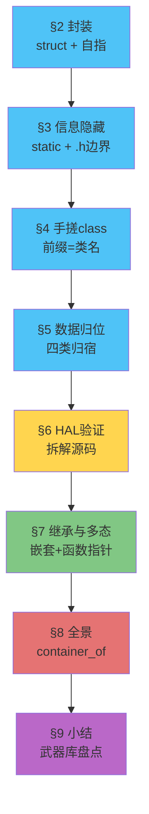
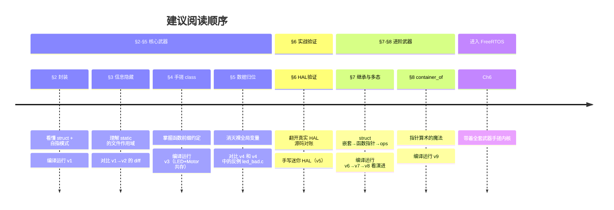
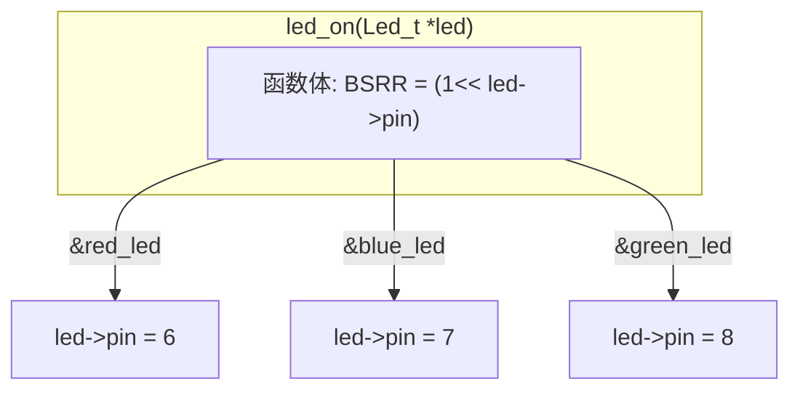
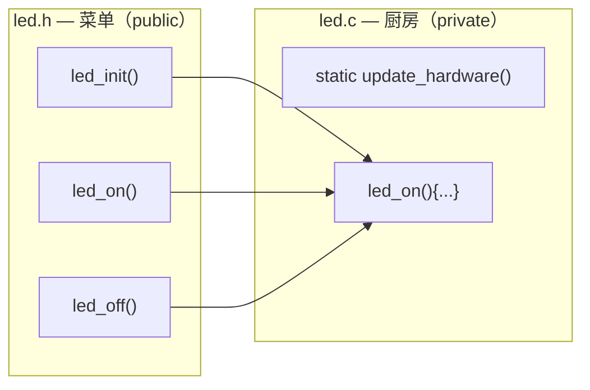
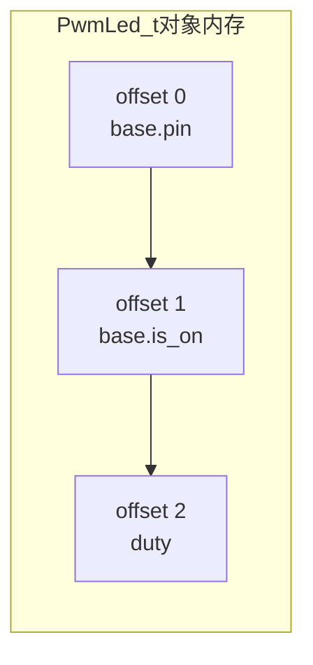

# Chapter 5 C语言面向对象工程架构基础

## 1 导言

### 1.1 回顾与问题

回顾一下我们到目前为止学了什么：

- **Chapter 1** 讲的是"怎么跟芯片打交道"——总线矩阵、统一内存架构、寄存器映射、启动流程、GPIO。核心收获：**MCU 里一切操作归结于往地址写数据**。
- **Chapter 2** 讲的是"芯片自己怎么管自己"——中断系统、定时器、PWM、看门狗。
- **Chapter 3** 讲的是"芯片之间怎么通信"——UART、SPI、I²C、CAN 四种协议，以及 ADC。
- **Chapter 4** 讲的是"给 CPU 减压"——DMA 解放 CPU 搬数据，FSMC 扩展外部内存。

这四章下来，你掌握了怎么跟硬件打交道。

但是等等——你再想想：到目前为止，我们写的代码都长什么样？一个 `main.c`，几百行，几个全局变量散落在各处，函数之间互相调用。你在 Chapter 1 里写的 `led.s` 汇编只有 50 行，这种风格没问题。可如果你要写的是：

- 一个能同时管理 10 个 LED 的驱动
- 一个能让你同事直接调用、而不用担心他搞坏内部状态的模块
- 一份像 HAL 库那样"几千个函数、同一个套路"的代码库
- **一个像 FreeRTOS 那样的操作系统内核**

**"一个 main.c + 几个全局变量"的裸过程式写法，还能撑得住吗？**

让我们用一个具体的例子来感受这种"撑不住"。

在 Chapter 1 里，你大概是这样点亮一盏 LED 的：

```c
// 裸过程式——逻辑和具体设备焊死在一起
void red_led_on(void) {
    GPIOF->BSRR = GPIO_Pin_6;  // 只能操作红灯，不能操作别的
}
```

如果你想加第二盏灯、第三盏灯呢？很多人是这么干的：

```c
void red_led_on(void)   { GPIOF->BSRR = GPIO_Pin_6; }
void green_led_on(void) { GPIOF->BSRR = GPIO_Pin_7; }
void blue_led_on(void)  { GPIOF->BSRR = GPIO_Pin_8; }
```

**三盏灯 = 三份几乎一模一样的代码。** 这不是"代码复用"——这是"代码复制"。逻辑完全相同（"往某个寄存器写某个位"），变的无非是"哪个 pin"。但当逻辑和具体数据焊死在一起，你只能用 Ctrl+C/Ctrl+V 来"复用"。

更大的问题在后面。当你写到 10 盏灯、20 盏灯，代码量线性膨胀。更要命的是，如果某天硬件改版，红灯从 Pin6 换到 Pin9，你得通篇搜索替换——**换一个 pin，改 N 个地方。** 这在工程上叫"脆弱的系统"——改一处崩一片。

更深处的问题是：Ch6-8 你要手搓 FreeRTOS，FreeRTOS 支持同时运行几十个任务。每个任务有自己的栈、优先级、状态。你打算怎么写？

```c
void task1_resume(void) { ... }
void task2_resume(void) { ... }
void task3_resume(void) { ... }
// ... 写到 task64 你人没了 你的座位上只留下了你燃尽剩下的舍利子
```


**问题不是"能不能实现"，是"能不能在工程上持续维护"。**


嵌入式是软硬件结合的学问, 要写出好用的代码, 光懂架构原理 通信时序和寄存器操作是远远不够的, **本章是"硬件驱动"到"软件工程"的转折点**。前四章教会你怎么用芯片，本章教会你怎么组织代码。你会发现, 从HAL库到RTOS,从Uboot到Linux内核源码, 他们的代码哲学都是惊人的一致. 你掌握了oop in c, 可以说FreeRTOS的几千行代码对你来说不够开胃的.

### 1.2 本章要解决的问题

C 语言没有 `class`、没有 `extends`、没有 `virtual`——这些 C++ 关键字我们一个都指望不上。但你猜 --

Linux 内核用的什么语言？C。

HAL 库用的什么语言？C。

FreeRTOS 用的什么语言？C。

**三千万行 Linux 内核全是 C，如果不用面向对象来写, 没人能调明白这个工程的bug**

这就是本章要教你的：**C 语言可以不是"过程式语言"——是你还没学会用面向对象的方式写它。**

我们用**一个 LED 驱动**当线索，从零开始一步步改造它。每一次改造，都解决一个具体的工程痛感。你看到的每一个设计，都不是"老师造的玩具"——而是你打开 `stm32f4xx_hal_gpio.c` 就能对上的工业标准。

每一节回答一个问题，给出一个武器，指出一段工业代码作证：

| 节 | 😫 痛点 | 🔧 给出的武器 | 🏭 对应的工业代码 |
|:---:|----------|--------------|-------------------|
| §2 | 三个 LED 写了三份代码，Ctrl+C 不是复用 | struct + 自指指针 | `GPIO_TypeDef` + `*GPIOx` 形参 |
| §3 | 同事直接改了 `led.pin = 666`，系统炸了 | static 私有化 + .h 公开接口 | HAL 源码里遍地 `static` 函数 |
| §4 | `init()` 只能有一个？两个模块怎么取名？ | 函数前缀 = 类名 | `HAL_GPIO_*`, `HAL_UART_*` |
| §5 | 全局变量满天飞，bug 找不到谁改的 | 数据归位：常量/模块/实例/局部 | HAL 里找不出一个裸全局变量 |
| §6 | 我学的是不是玩具？工作中真有人这么写？ | 拆解 HAL 源码逐行对账 | 直接翻 `stm32f4xx_hal_gpio.c` |
| §7 | 三种 LED（普通/PWM/RGB）一半代码重复 | struct 嵌套 + 函数指针 + ops 虚表 | vtable、多态 dispatch |
| §8 | 拿到链表节点，怎么找回整个 TCB？ | container_of 宏 | Linux 内核 30000+ 次调用 |



> 💡 这个递进结构不是偶然的——真实工程中，你接手一个"只有一个 main.c"的项目，也会沿着同样的路径重构：先封装数据 → 再隐藏实现 → 再统一命名 → 再清理全局变量 → 最后引入继承和多态。

最关键的一句：**学完这章，后面 手搓 FreeRTOS 的时候，你看到的 TCB 将不再是一个"巨大的 struct"——你会看到封装、看到虚表、看到继承。之后我们学习嵌入式Linux你也不会觉得几千万行的内核源码有多么高深, 反而会让你觉得源码比看小说还有趣. C 语言本身就是一门面向对象的语言，只是你以前没这么想过。**

### 1.3 本章学习路径

#### 📂 配套代码

本章的每个核心概念都有对应的代码版本，放在 `code/` 目录下。它们是渐进演化的——v2 在 v1 的基础上改，v3 在 v2 的基础上改，就像你真实重构一个项目一样。

| 版本 | 对应小节 | 核心变化 | 路径 |
|:---:|:---:|------|------|
| v1 | §2 | 封装第一部: struct 封装 + 自指指针 | [`code/v1_封装_struct_me_pointer/`](code/v1_封装_struct_me_pointer/) |
| v2 | §3 | 封装第二部:static 私有化 + .h 公开接口 | [`code/v2_信息隐藏_static_private/`](code/v2_信息隐藏_static_private/) |
| v3 | §4 | 手搓Class | [`code/v3_手搓class_前缀_init_deinit/`](code/v3_手搓class_前缀_init_deinit/) |
| v4 | §5 | 四种数据归宿，消灭裸全局变量 | [`code/v4_数据归位_static_const/`](code/v4_数据归位_static_const/) |
| v5 | §6 | 迷你 HAL，映射真实寄存器 | [`code/v5_HAL验证_mini_hal/`](code/v5_HAL验证_mini_hal/) |
| v6 | §7 | 继承: struct 嵌套 | [`code/v6_继承_struct_嵌套/`](code/v6_继承_struct_嵌套/) |
| v7 | §7 | 函数指针实现多态 | [`code/v7_多态_函数指针/`](code/v7_多态_函数指针/) |
| v8 | §7 | 向上转型: ops 结构体 = 虚表 | [`code/v8_多态_ops虚表/`](code/v8_多态_ops虚表/) |
| v9 | §8 | 向下撰写: container_of 宏实战 | [`code/v9_container_of/`](code/v9_container_of/) |

每个版本都是完整的、可独立编译运行的工程。你可以在 PC 上直接用 GCC 编译运行（不需要开发板），也可以把 `platform_pc.c` 替换成 `platform_stm32.c` 落到真实硬件上——上层代码**一行不用改**。

#### 📖 核心参考资料

- **兆鸣嵌入式**《C语言·一个LED讲透面向对象》系列（EP06-EP15）：本章的设计框架和代码风格以此为主线，仓库已克隆到 [`reference/oop_example/`](../../reference/oop_example/)
  - EP06-EP10：对应 §2-§6 的核心模式
  - EP11-EP15：对应 §7-§8 的进阶技巧
  - 每个 EP 都有独立的 PDF 文档和可编译代码
- **编码规范**：`reference/oop_example/coding-standards/` 下的 7 章 PDF，覆盖架构设计、设计模式、Clean Code、内存安全、硬件交互、安全检查清单，学完本章后可作为日常编码参考。

#### 🗺️ 阅读建议



#### ⚡ 如果你有 STM32 开发板

每个 v1-v9 的工程都通过 `platform.h` 接口抽象了底层硬件。PC 版本用 `printf` 模拟 GPIO、PWM 等操作。如果你有开发板：

1. 写一个 `platform_stm32.c`，用真实的 HAL 寄存器操作实现 `platform.h` 的接口
2. 编译时把 `platform_pc.c` 替换成你的 `platform_stm32.c`
3. 上层代码（`led.c`, `main.c` 等）**一行不用改**

这本身就是 §2"封装"威力的最好证明——换一套底层实现，上层完全无感。


## 2 封装--解耦属性和接口

> 📂 配套代码：[`code/v1_封装_struct_me_pointer/`](code/v1_封装_struct_me_pointer/)  
> 📖 兆鸣参考：`reference/oop_example/oop-in-c/code/EP06_封装/`

### 2.1 问题：三个 LED，三份代码

在 Chapter 1 里，三盏 LED 你大概写了六份函数：

```c
void red_led_on(void)  { GPIOF->BSRR = GPIO_Pin_6;  }
void red_led_off(void) { GPIOF->BSRR = GPIO_Pin_6 << 16; }
void blue_led_on(void)  { GPIOF->BSRR = GPIO_Pin_7;  }
void blue_led_off(void) { GPIOF->BSRR = GPIO_Pin_7 << 16; }
void green_led_on(void)  { GPIOF->BSRR = GPIO_Pin_8;  }
void green_led_off(void) { GPIOF->BSRR = GPIO_Pin_8 << 16; }
```

逻辑完全相同——"把某个 Pin 拉高或拉低"。变的无非是哪个 Pin。但逻辑和具体数据焊死了，你只能用 Ctrl+C/Ctrl+V。

第一个问题: 如果你发现你电平搞反了,这种微小的错误,因为你的复制粘贴, 你波及到了6个函数, 如果有100个led 那么你就波及到了200个函数.这会显著增加调试的难度.

第二个问题: **两盏LED没法同时亮。** 因为函数名已经把设备信息焊死了——`red_led_on()` 只能操作红灯。你想让红灯和蓝灯一起亮，必须写两行。你想操作任意一盏灯（比如用户在串口终端输入 "R" 就亮红灯），你得写一个又臭又长的 `switch-case` 或者 `if-else if` 链。这是因为**函数无法接受"操作谁"的信息**——它只有一个 `void` 参数，没有地方告诉它"这次你操作哪盏灯"。

这就是为什么我们要引入面向对象来对复用的函数进行化简, 因为**重复就是Bug的温床**。


### 2.2 属性和接口:`struct`和自指指针(me pointer)

#### 2.2.1 属性和接口解耦

对于上面的模型,  变化的是变量, 不变的是函数, 这在面向对象中, 我们分别叫做属性--变量, 接口--函数

我们可以直观地看到两种方案的区别。

优化前——三个函数，三个 pin，数据和逻辑焊死：


优化后——一个函数，三个 pin，数据通过参数传入：



`led_on` 只有一份。你传谁进去，它就操作谁的 pin。改电平逻辑只改一处。


#### 2.2.2 使用`struct`打包成员

我们以基于C++的Arduino为例,只需要写一个 `on()`对应三个led, 其类可以这么写: 


````c++
class Led {
    private ：//成员
        int pin;
        
    public ：//接口
        
        void on() { 
            digitalWrite(pin, HIGH); 
        } 
    	
    	led (int pinNum) {
            pin=pinNum;
        }
    
    	~ led () {
            
        }
};

//初始化
    Led red_led=led(12);

//调用

	red_led.on();

````

C语言中有没有能把不同属性的打包东西呢, **答案是肯定的, 就是`struct`结构体**. 但是`struct`只有打包变量的能力, 不能加函数(函数指针可以, 但是本质还是要在外面绑定联系)

```c
typedef struct { //必须加typedef啊, 不然后面没办法 Led_t led
    uint8_t pin;
    /*
    led_on() 不可以! 不允许加函数
    */
    
} Led_t;
void led_on(){
    //成员函数(接口)只能在外面定义,如何建立联系???
}

```

#### 2.2.3 自指指针--接口和成员的绑定

第一个问题, 上面这么多行代码--**最关键的，直接指定了成员函数和类的调用关系的是哪一行**？

> **答案就是`red_led.on()`** 。他自动帮我们找到了`red_led`的`pin`, 然后使用平台提供的`digitalWrite()`去操作他.

接着思考, **这个调用的底层机制在哪**? 

> 答案是`this` 指针.  
>
> 在C++中, 编译器偷偷每个类成员函数都开了一个隐藏的传入参数. 他就是`class Myclass* this`, 也就是指向这个类自己的`this`指针, 调用的时候编译器偷偷把类作为变量传到这个参数里
>
> 也就是说 `on()`看上去没有任何参数

C 语言的标准没有这样的语法糖。我们需要手搓这个指针,这就是自己指向自己的指针,我们称为**自指指针(me pointer)**, 它就是你函数里,和你这个类同名的一个普通的 `Led_t *` 形参。简化一下是这个效果

```c
// led.h
typedef struct { 
    uint8_t pin;
} Led_t;

int led_on(Led_t *led);//成员函数需要传入结构体才能用!这个结构体指针被称为自指指针

```

```c
// led.c
int led_on(Led_t *led) {
    if (led == NULL) return -1;
    platform_gpio_write(led->pin, true);
    return 0;
}
```

```c
// main.c
Led_t red_led, green_led, blue_led;
led_on(&red_led);      // led->pin = 13
led_on(&green_led);    // led->pin = 14，同一份函数体！
```


你会发现, 所有你接触到的工业代码的习惯是有类似的实现:

```c
// STM32 HAL：GPIOx = "当前操作的 GPIO 端口自己"
void HAL_GPIO_WritePin(GPIO_TypeDef *GPIOx, uint16_t GPIO_Pin, GPIO_PinState PinState);
void HAL_UART_Transmit(UART_HandleTypeDef *huart, uint8_t *pData, uint16_t Size);

// FreeRTOS：pxTCB = "当前操作的 TCB 自己"
void vTaskSuspend(TaskHandle_t xTask);     // 内部: TCB_t *pxTCB = (TCB_t *)xTask;
void vTaskResume(TaskHandle_t xTask);

// Linux 内核：dev = "当前操作的设备自己"
int device_register(struct device *dev);
int driver_register(struct device_driver *drv);
```

它们的命名风格非常统一——**不用 `this`（C++ 保留字）、不用 `self`（Python/Rust 习惯）、不用 `obj`（太泛）——而是用类型名的缩写直接告诉你"指针指向什么类型"。** 本章教学里，LED 的自指指针叫 `led`，电机叫 `motor`，TCB 叫 `tcb`——等你写自己的代码时，依样画葫芦即可。

| 场景 | 应该用的参数名 |
|------|---------------|
| LED 驱动 | `Led_t *led` |
| GPIO 操作 | `GPIO_TypeDef *GPIOx` |
| 串口发送 | `UART_HandleTypeDef *huart` |
| 任务挂起 | `TCB_t *pxTCB` |
| 设备操作 | `struct device *dev` |

| C 写法 | C++ 写法 | 含义 |
|--------|----------|------|
| `struct Led_t { pin, is_on }` | `class Led { int pin; }` | 把数据打包 |
| `Led_t *led`（第一参数） | `this` 指针（隐式） | 告诉函数操作谁 |
| `led_on(&red_led)` | `red_led.on()` | 同一份逻辑，不同数据 |


### 2.3 构造和析构的实现--Init和DeInit

我们现在复刻了成员函数的封装性, 实现了一个成员函数led_on对接三个led. 但是问题是**我们还没有管理一个类的生命周期的能力**, 类是基于**构造函数**和**析构函数**来管理生命周期的. 同时**我们也需要构造函数来完成一些变量初始化工作**, 落到嵌入式层面, 比如初始化寄存器值, 通时钟等. 这些如何完成呢?

相信你也猜到了, 我们直接写一个和`led_on(Led_t* led)`同等重量级的`led_init(Led_t* led) `和`led_deinit(Led_t* led)`:

```c
// 构造函数 = 分配资源 + 初始化硬件
int led_init(Led_t *led, uint8_t pin) {
    if (led == NULL) return -1;
    led->pin = pin;                              // 给属性赋值
    led->brightness = 0;
    led->is_on = false;
    platform_gpio_init(pin, GPIO_MODE_OUTPUT);   // 初始化硬件（通时钟、配寄存器）
    platform_gpio_write(pin, false);             // 确保上电后LED是灭的
    return 0;
}

// 析构函数 = 释放资源 + 关闭硬件
int led_deinit(Led_t *led) {
    if (led == NULL) return -1;
    platform_gpio_write(led->pin, false);        // 先关灯
    platform_gpio_deinit(led->pin);              // 释放引脚
    led->pin = 0;                                // 清空属性
    led->brightness = 0;
    led->is_on = false;
    return 0;
}
```

对比 C++ 和 C 的生命周期：

| 阶段 | C++（编译器自动） | C（你手动） |
|------|-------------------|------------|
| 对象创建 | `Led red(13);` 自动调 `Led::Led(int)` | 手动调 `led_init(&red_led, 13)` |
| 正常使用 | `red.on();` | `led_on(&red_led);` |
| 对象销毁 | `}` 离开作用域，自动调 `~Led()` | 手动调 `led_deinit(&red_led)` |

C 语言没有自动机制——**但你可以手动遵守同样的生命周期协议。** 你已经在 Ch1-4 里习惯了"用之前先 Init、用完后 DeInit"的 HAL 套路——只不过现在你知道它背后是一套完整的构造/析构思想了。

### 2.4 代码实战

打开 [`code/v1_封装_struct_me_pointer/`](code/v1_封装_struct_me_pointer/)，整个工程从零演示 struct 封装 + 自指指针 + 构造/析构。三个文件的核心逻辑：

```c
// led.h — 数据结构定义 + 公开接口声明
typedef struct {
    uint8_t  pin;
    uint8_t  brightness;
    bool     is_on;
} Led_t;

int led_init(Led_t *led, uint8_t pin);       // 构造
int led_deinit(Led_t *led);                   // 析构
int led_on(Led_t *led);                       // 成员方法
int led_off(Led_t *led);
int led_toggle(Led_t *led);
int led_set_brightness(Led_t *led, uint8_t brightness);
int led_get_state(const Led_t *led, bool *is_on, uint8_t *brightness);
```

```c
// main.c — 使用演示
Led_t red_led, green_led, blue_led;

led_init(&red_led, 13);
led_init(&green_led, 14);
led_init(&blue_led, 15);

led_on(&red_led);                                  // 操作红灯
led_on(&green_led);                                // 同一份代码操作绿灯
led_set_brightness(&blue_led, 30);                 // 蓝灯30%亮度
led_toggle(&red_led);                              // 翻转红灯

bool state; uint8_t brightness;
led_get_state(&green_led, &state, &brightness);    // 安全读取状态

led_deinit(&red_led);                              // 析构清理
led_deinit(&green_led);
led_deinit(&blue_led);
```

你可以在 PC 上直接用 GCC 编译运行（不需要开发板）：
```bash
gcc -Wall -Wextra -std=c11 -o demo main.c led.c platform_pc.c
./demo
```

也可以把 `platform_pc.c`（printf 模拟 GPIO）替换成 `platform_stm32.c`（真实 HAL 寄存器操作）落到 STM32 上——**`led.c` 和 `main.c` 一行不用改。**

### 2.5 总结

基于自指指针和struct封装, 我们初步实现了面向对象的封装特性, 完成了属性和接口的解耦. 但是这不是封装的全部, 我们还没有完成属性的权限隔离, 下一章我们会介绍如何实现.


## 3 封装--区分公有和私有

### 3.1 问题：函数公私不分，变量公私不分

上一节我们用 `struct` + 自指指针把属性和接口打包在了一起。但打包只是第一步——你还没决定哪些东西同事能动，哪些不能动。

看这个例子。你的 LED 驱动里有 `update_hardware` 这个内部辅助函数——它只负责把 `is_on` 同步到寄存器，不应该被外部直接调用。还有一堆内部校验用的辅助函数。但现在它们和 `led_on`、`led_off` 一样暴露在外面。同事不小心调了 `update_hardware` 而你外部又同时调了 `led_on`——寄存器可能被写两遍，状态机乱套。

更糟的是 struct 字段——`led.pin = 999`，这行代码编译器不会拦。两件事本质上是同一个问题：**在 C++ 里 `private` 关键字做的事情，C 语言靠什么？**

答案分两层——函数能锁，字段锁不了。我们一层一层看。

### 3.2 方案：`static` 锁定私有成员函数+头文件暴露接口

#### 3.2.1 `static` 的链接行为 = C 的 `private`

回顾一下 `static` 关键字的两个属性：

| 出现区域 | 属性 | 作用 |
|----------|------|------|
| 作为局部变量的修饰词 | 内存行为 | 变量生命周期延长至程序结束 |
| 作为全局变量/全局函数的修饰词 | 链接行为 | 仅在本文件可见，外部 `extern` 也链不到 |

第二个属性——**限定函数和文件级变量仅在本 `.c` 可见**——就是 C 语言里我们能用的 `private`。

```c
// led.c
static void update_hardware(Led_t *led) {       // private——外部链不到
    platform_gpio_write(led->pin, led->is_on);
}

int led_on(Led_t *led) {                        // public——.h 里声明
    if (led == NULL) return -1;
    led->is_on = true;
    update_hardware(led);  // 内部调用 private，OK
    return 0;
}
```

同事在 `main.c` 里写 `update_hardware(&led)` → 编译报错 `undefined reference`。

#### 3.2.2 头文件 = 菜单，`.c` = 厨房



落实到代码：

```c
// led.h — 菜单：只放公开接口
typedef struct {
    uint8_t  pin;
    bool     is_on;
} Led_t;

int led_init(Led_t *led, uint8_t pin);   // 公开
int led_on(Led_t *led);                  // 公开
int led_off(Led_t *led);                 // 公开
```

```c
// led.c — 厨房：实现细节全加 static
static void update_hardware(Led_t *led) {       // private
    platform_gpio_write(led->pin, led->is_on);
}

int led_on(Led_t *led) {                        // public
    if (led == NULL) return -1;
    led->is_on = true;
    update_hardware(led);
    return 0;
}
```

### 3.3 代码实战

打开 [`code/v2_信息隐藏_static_private/`](code/v2_信息隐藏_static_private/)，核心对比：

```c
// main.c — 正常路径：走公开接口
led_on(&red_led);                // 硬件真正点亮 ✓

// main.c — 错误路径：直接调内部函数
update_hardware(&green_led);     // 编译报错！编译器守门 ✓

// main.c — 另一个错误路径：捅 struct 字段
green_led.is_on = true;          // 编译器不拦 ✗
// → 硬件纹丝不动，之后 led_toggle 内部状态判断全乱
```

`static` 守住了函数——这是 C 能给你的。但 struct 字段这道门，`static` 装不上。也就是说, 我们搓的类, 其实所有的变量都是public, 是有`static func`才是真正的private...


### 3.4 成员变量的私有问题——工业界怎么做的

`led.pin = 999` 这个操作，编译器真的管不了吗？我们看一下四个真实的工程是怎么处理的。他们有的只有几千行代码, 有的有几千万行, 你会发现, 不同的实现处处体现着Trade-off的哲学:

#### 3.4.1 HAL 库 / FreeRTOS / RT-Thread：全公开 + 约定守门

```c
// stm32f4xx_hal_gpio.h
typedef struct {
    uint32_t Pin;       // 全公开，谁 include 都能捅
    uint32_t Mode;
    uint32_t Pull;
    uint32_t Speed;
} GPIO_InitTypeDef;
```

```c
// FreeRTOS tasks.c
typedef struct tskTaskControlBlock {
    volatile StackType_t *pxTopOfStack;   // 全公开
    ListItem_t            xStateListItem; // 全公开
    UBaseType_t           uxPriority;     // 全公开
    // ...
} TCB_t;
```

不锁。不是因为不想——是因为在嵌入式里，上不透明指针要付出的代价（堆分配、多一层间接）比"偶尔有人捅错字段"的代价大得多。

它们的选择是：**struct 定义放 `.h` 全公开，靠 `prv` 前缀和命名约定划线。** 你碰了 `prv` 打头的函数，链接器报错；你碰了不该碰的字段，代码审查的同事报错。

#### 3.4.2 Linux 内核：把成员放堆上——真锁

Linux 内核面对的是 3000 万行代码、上万个开发者。约定守不住。它用了另一种手段：**让外部根本看不到 struct 的定义。** 这一部分十分精彩，可以说内核开发者是把 C 语言的特性玩出花了。

首先想一个问题：前面方案一的 struct，为什么字段锁不住？

```c
// led.h
typedef struct {
    uint8_t pin;        // 外部 include 就能看见
    bool    is_on;      // 看见就能捅
} Led_t;
```

编译器必须知道 struct 里有什么，才能在栈上给你分配空间。你写 `Led_t red_led;` 的时候，编译器算 `sizeof(Led_t)`，腾出 2 字节，把 `pin` 放在偏移 0，`is_on` 放在偏移 1。这套操作的每一个环节都依赖 struct 定义可见。

但如果你只用一个指针——`Led_t *led`——编译器只需要知道指针本身的大小（4 或 8 字节），不需要知道它指向的东西有多大。这跟数组是一个道理：`int arr[10]` 必须知道 10 才能开栈帧，`int *arr` 不需要。

所以锁字段的思路很简单：**让外部只拿到指针，拿不到定义。**

```c
// ========== led.h — 外部只看到这些 ==========
typedef struct Led_t Led_t;          // 只声明类型名，不给定义

Led_t *led_create(uint8_t pin);      // 工厂函数
int led_on(Led_t *led);              // 只能走接口
void led_destroy(Led_t *led);

// ========== led.c — 定义和实现全在内部 ==========
struct Led_t {                       // 完整定义藏在这里
    uint8_t pin;
    bool    is_on;
};

static void update_hardware(Led_t *led) {   // static 锁函数
    platform_gpio_write(led->pin, led->is_on);
}

Led_t *led_create(uint8_t pin) {           // 工厂函数：这里能 malloc
    Led_t *led = malloc(sizeof(Led_t));    //   sizeof 在这里算，外部算不了
    led->pin = pin;                         //   内部随便碰字段
    led->is_on = false;
    return led;
}

int led_on(Led_t *led) {
    if (led == NULL) return -1;
    led->is_on = true;                     // 字段随便用
    update_hardware(led);
    return 0;
}

void led_destroy(Led_t *led) {
    if (led == NULL) return;
    free(led);
}

// ========== main.c — 外部只能拿到不透明指针 ==========
Led_t *red = led_create(13);        // ✓ 只能走工厂
led_on(red);                        // ✓ 只能走接口
// red->is_on = true;               // ✗ 编译报错！incomplete type
led_destroy(red);
```

`led.h` 里 `typedef struct Led_t Led_t;` 只告诉编译器"Led_t 存在"，不给大小，不给字段。外部什么也看不见。

`led.c` 里 `struct Led_t { ... };` 给了完整定义。这里 `sizeof(Led_t)` 算得出来，字段随便碰，`malloc`、`free` 都在这里完成。两道锁同时生效——函数加 `static` 拦调用，结构体藏定义拦访问。

---

理清了这个，我们分两个视角走一遍。

**视角一：你是一个驱动开发者**

你正在写一个字符设备驱动。当用户对你的设备节点 `write` 的时候，内核回调你的函数：

```c
// drivers/char/my_led_driver.c
#include <linux/fs.h>  // 只能拿到 struct file; 声明

static ssize_t led_write(struct file *filp, const char *buf,
                         size_t count, loff_t *pos) {
    // 你拿到了一个 struct file *filp
    // 你想看 f_flags？搜遍 include/linux/fs.h 只有一行：
    //   struct file;
    // 你想 sizeof(*filp)？编译报错——编译器也不知道
}
```

你能对 `filp` 做什么？

```c
// ✓ 传指针——编译器知道指针大小（8 字节），不需要知道指向什么
vfs_write(filp, buf, count);     

// ✓ 读 private_data——内核留给驱动挂私有数据的后门
struct my_led *led = filp->private_data;

// ✗ 一切解引用操作——编译报错
// filp->f_flags     → dereferencing pointer to incomplete type
// sizeof(*filp)      → invalid application of 'sizeof'
// struct file f;     → storage size unknown
```

你就这样被关在了外面。驱动框架里的 `open`、`read`、`write`、`release`——你拿到的 `struct file *filp` 和 `struct inode *inode` 永远是不透明指针。除了内核在 `struct file` 里给你留的一个 `void *private_data` 钩子，你什么都碰不了。

**视角二：你是 VFS 子系统的维护者**

你负责文件系统核心。你定义了 `struct file`：

```c
// fs/file_table.c —— 只有 VFS 团队能改的文件
struct file {
    struct path     f_path;
    struct inode    *f_inode;
    const struct file_operations *f_op;   // §7 要讲的函数指针虚表
    void            *private_data;        // 留给驱动的唯一后门
    unsigned int    f_flags;              // 驱动碰不了
    atomic_long_t   f_count;             // 驱动碰不了
    struct mutex    f_pos_lock;
    // ... 几十个字段
};
```

因为你知道完整定义，你可以随便用：

```c
// fs/read_write.c —— 你是维护者，字段随便碰
ssize_t vfs_write(struct file *filp, const char *buf, size_t count, loff_t *pos) {
    if (!(filp->f_flags & O_WRONLY)) return -EBADF;   // ✓ 随便读
    filp->f_pos = *pos;                                 // ✓ 随便写
    return filp->f_op->write(filp, buf, count, pos);   // ✓ 多态调用
}
```

同一个 `struct file *`，在你手里和驱动开发者手里权限完全不同——不是靠注释，不是靠命名约定，**靠编译器硬拦。**

这个机制有个通俗的类比：你去银行金库，拿到一个手柄（指针）。你能把手柄递给下一个人，能挂在墙上，但你永远不知道手柄那头连接的柜门长什么样。只有银行经理（VFS 维护者）有金库的图纸（struct 定义），能打开柜门存取任何东西。银行经理还特意在柜门外给你焊了个小挂钩（`private_data`），说"你可以往上面挂你自己的东西"。

**两种视角总结：**

| | 驱动开发者 | VFS 维护者 |
|------|---------------|--------------|
| 拿到的东西 | `struct file *filp` | `struct file *filp` |
| 能看到定义吗 | ❌ 只看到 `struct file;` | ✓ 看到完整 struct |
| 能读 `f_flags` 吗 | ❌ 编译报错 | ✓ |
| 能写 `f_pos` 吗 | ❌ 编译报错 | ✓ |
| 能用 `private_data` 吗 | ✓ | ✓ |
| 栈上能声明吗 | ❌ `struct file f;` 报错 | ✓ |
| 安全机制 | 编译器硬拦 | 信任 + 你写的测试 |


#### 你用哪个？

| 场景 | 做法 | 谁在用 |
|------|------|--------|
| 单片机、小团队 | struct 全公开，约定守门 | HAL、FreeRTOS、RT-Thread |
| 大规模协作、需强制隔离 |struct 在 .h声明 .c定义模板然后melloc| Linux 内核核心结构体 |

你的 LED 驱动属于第一种。教程后面的 v2-v9 一律用全公开+约定守门——因为这就是你工作中会看到的代码。但在 §8 讲 `container_of` 的时候你会再次见到不透明指针的影子——Linux 内核把这两种策略组合起来，对外声明 `struct file;`，对内通过 `container_of` 从嵌入的链表中找回完整结构体。

### 3.5 总结

优化前——所有函数和字段全裸在外面，谁都能碰：

```c
// led.h
typedef struct { uint8_t pin; bool is_on; } Led_t;

// led.c — 全是公开函数
void update_hardware(Led_t *led) { ... }   // 谁都能调
int  led_on(Led_t *led)            { ... }
```

```c
// main.c — 同事三条路都能走
led_on(&red_led);                   // ✓ 公开接口
update_hardware(&red_led);          // ✗ 直接调内部函数，不报错
red_led.is_on = true;               // ✗ 直接捅字段，不报错
```

---

**方案一：单片机/RTOS 级别——static 锁函数 + .h 约定守门**（本章 v2 采用）

```c
// led.h — struct 全公开，只放公开接口
typedef struct { uint8_t pin; bool is_on; } Led_t;
int led_init(Led_t *led, uint8_t pin);
int led_on(Led_t *led);
int led_off(Led_t *led);
```

```c
// led.c — 内部函数加 static
static void update_hardware(Led_t *led) { ... }   // 外部链不到

int led_on(Led_t *led) {
    led->is_on = true;
    update_hardware(led);   // 内部调用 OK
}
```

```c
// main.c
led_on(&red_led);                   // ✓
update_hardware(&red_led);          // ✗ 编译报错！函数锁了
red_led.is_on = true;               // ✗ 不报错，但靠约定守门
```

- `static` 锁了函数——编译器帮你守
- struct 字段锁不了——靠命名约定和代码审查守
- HAL、FreeRTOS、RT-Thread 都用这个方案

---

**方案二：Linux 内核级别——使用melloc，字段也锁**

```c
// led.h — 只声明，不给定义
typedef struct Led_t Led_t;          // 外部不知道里面有什么

Led_t *led_create(uint8_t pin);      // 工厂函数，堆分配
int led_on(Led_t *led);
int led_off(Led_t *led);
void led_destroy(Led_t *led);
```

```c
// led.c — 真实定义藏在内部
struct Led_t { uint8_t pin; bool is_on; };
static void update_hardware(Led_t *led) { ... }  // static 锁函数

Led_t *led_create(uint8_t pin) {
    Led_t *led = malloc(sizeof(Led_t));          // 只能堆分配
    led->pin = pin; led->is_on = false;
    return led;
}
```

```c
// main.c
Led_t *red = led_create(13);        // ✓ 只能走工厂
led_on(red);                        // ✓ 只能走接口
red->is_on = true;                  // ✗ 编译报错！incomplete type
```

- 字段和函数全锁——编译器帮你守住所有门
- 代价：堆分配 + 多一层指针 + 多一层函数包装
- Linux 内核对 `struct file`、`struct inode`、`struct device` 全用这个方案


## 4 HAL 验证：你学的就是工业标准

> 📂 配套代码：[`code/v5_HAL验证_mini_hal/`](code/v5_HAL验证_mini_hal/)  
> 📖 兆鸣参考：`reference/oop_example/oop-in-c/code/EP10_HAL映射/`

### 4.1 逐行对账

翻开 HAL 库 `stm32f4xx_hal_gpio.c`：

| 你学的 | HAL 库写的 | 来源 |
|--------|-----------|------|
| `Led_t { pin, is_on }` | `GPIO_TypeDef { MODER, ODR... }` | §2 struct |
| `led_on(Led_t *led)` | `HAL_GPIO_WritePin(GPIO_TypeDef *GPIOx, ...)` | §2 自指指针 |
| `static update_hardware()` | `static GPIO_GET_INDEX()` | §3 |

**几千个 HAL 函数——就这一个套路。**

Ch1 和 Ch5 在此交汇：

```c
// Ch1: 往地址写数据
*(volatile uint32_t*)0x40020014 = val;

// Ch5: OOP 封装
#define GPIOA ((GPIO_TypeDef *)0x40020000)
GPIOA->ODR = val;   // 同一件事，不同表达
```

### 4.2 迷你 HAL

打开 [`code/v5_HAL验证_mini_hal/`](code/v5_HAL验证_mini_hal/)：

```c
void HAL_GPIO_WritePin(GPIO_TypeDef *GPIOx, uint16_t pin, bool value) {
    if (value) GPIOx->BSRR = (uint32_t)pin;
    else       GPIOx->BSRR = (uint32_t)pin << 16;
}
```


## 5 继承与多态

> 📂 配套代码：[`code/v6_继承_struct_嵌套/`](code/v6_继承_struct_嵌套/) → [`code/v7_多态_函数指针/`](code/v7_多态_函数指针/) → [`code/v8_多态_ops虚表/`](code/v8_多态_ops虚表/)  
> 📖 兆鸣参考：`reference/oop_example/oop-in-c/code/` EP11-EP14

### 5.1 提升代码的复用性

§2 和 §3 教会了你一件事：把一个 LED 封装成 `Led_t`，用 `led_on(Led_t *led)` 操作它。当你的板子上只有一种 LED 时，这套方案非常完美。

但实际工程里很少这么简单。一块板子上可能同时存在：

- **GPIO 直连的普通 LED** —— 操作 `GPIO->BSRR` 寄存器
- **PWM 驱动的呼吸灯** —— 操作定时器的 `CCR` 寄存器控制占空比
- **I2C GPIO 扩展芯片上的 LED** —— 走 I2C 总线发命令，不碰任何 GPIO 寄存器

它们都是"灯"，都有"开"和"关"的概念。但从底层驱动来看，操作方式完全不同。

你当然可以为每种 LED 各写一套，像这样：

```c
// GPIO LED
typedef struct { uint8_t pin; bool is_on; } GpioLed_t;
void gpio_led_on(GpioLed_t *led) { GPIO->BSRR = (1 << led->pin); }

// PWM LED
typedef struct { uint8_t channel; uint8_t duty; bool is_on; } PwmLed_t;
void pwm_led_on(PwmLed_t *led) { TIM3->CCR[led->channel] = led->duty; }

// I2C LED
typedef struct { uint8_t i2c_addr; uint8_t pin; bool is_on; } I2cLed_t;
void i2c_led_on(I2cLed_t *led) { i2c_write(led->i2c_addr, led->pin, 1); }
```

能跑。但三个问题接踵而至：

1. **上层逻辑跟具体驱动焊死了。** 你想写一个"所有灯闪烁三次"的函数，参数类型该写什么？`GpioLed_t *` 还是 `PwmLed_t *`？三个都写一份的话，又回到 §1 的复制粘贴地狱。
2. **共用属性被反复定义。** `pin`、`is_on`，以后可能还有 `brightness`、`error_code`——每加一种 LED，这些字段就复制一遍。
3. **加一种新 LED，改一堆地方。** 如果上层逻辑写死了类型，加一种 I2C LED 意味着所有跟"灯"相关的函数都要动。

解决方法正是面向对象里最核心的两个机制：

- **继承** —— 把共同属性抽出来，只写一遍。（本章 5.2）
- **多态** —— 用同一份接口驱动不同的底层实现。（本章 5.3、5.4）

下面三节，我们逐个拆解这两个机制在 C 语言里的实现。


### 5.2 继承基础---struct 嵌套

5.1 把问题摊开了：你有一堆不同类型的 LED，它们有共同属性，也有各自特有的属性。本节先解决第一部分——**怎么让共同属性只写一遍**。

回顾刚才的三种 LED：

- 普通 LED：`pin`、`is_on`
- PWM LED：`pin`、`is_on`、`duty`
- RGB LED：`pin`、`is_on`、`r`、`g`、`b`

`pin` 和 `is_on` 出现了三次。这不只是多打几行字的问题——以后你要给所有 LED 统一加一个 `error_code` 字段，三个结构体全部要改。

在 C++ 里，你会很自然地写：

```cpp
class Led {
public:
    int pin;
    bool is_on;
};

class PwmLed : public Led {
public:
    int duty;
};
```

`PwmLed` 自动拥有 `Led` 的全部成员，再额外加一个 `duty`。这就叫**继承**。

C 语言没有 `extends`，但是它有结构体嵌套。只要把"基类"放进"派生类"的第一个字段，就能得到几乎一模一样的效果：

```c
typedef struct { uint8_t pin; bool is_on; } BaseLed_t;          // 基类
typedef struct { BaseLed_t base; uint8_t duty; } PwmLed_t;      // 第一字段 = 基类
```

这段代码里：

- `BaseLed_t` 是基类，定义所有 LED 共有的部分
- `PwmLed_t` 是派生类，不是推倒重写，而是 **`BaseLed_t` + 自己新增的成员**

这就是 C 语言里的继承雏形。

#### 5.2.1 为什么基类必须放在第一个字段

这里最关键的一句不是"struct 里嵌了另一个 struct"，而是：**基类必须放在第一个字段。**

我们把内存展开看一下：

```c
typedef struct {
    uint8_t pin;      // offset 0
    bool    is_on;    // offset 1
} BaseLed_t;

typedef struct {
    BaseLed_t base;   // offset 0 起始
    uint8_t   duty;   // 紧跟在 base 后面
} PwmLed_t;
```

对应的内存布局：

| 偏移 | 字段 | 所属 |
|:---:|------|------|
| 0 | **`pin`** | **`BaseLed_t`（基类）** |
| 1 | **`is_on`** | **`BaseLed_t`（基类）** |
| 2 | `duty` | `PwmLed_t`（派生类扩展） |

`PwmLed_t` 的前两个字节就是 `BaseLed_t`，第三个字节才是自己的 `duty`。

因为 `base` 就放在 `PwmLed_t` 的起始地址，所以这两个地址**永远相同**：

```c
PwmLed_t pwm_led;
&pwm_led == &pwm_led.base   // true，地址一模一样
```

于是你就可以安全地把 `PwmLed_t *` 当成 `BaseLed_t *` 来用：

```c
PwmLed_t  pwm_led;
BaseLed_t *base = (BaseLed_t *)&pwm_led;   // 向上转型
```

这就叫**向上转型**：把更具体的派生类，当成更抽象的基类来使用。

为什么它是零开销？因为这里没有申请新内存，没有复制对象，没有多走一步函数。**只是换了一个看待同一块内存的视角。**

#### 5.2.2 继承到底帮你省了什么

如果不用继承，你会很容易写成这样：

```c
typedef struct { uint8_t pin; bool is_on; } NormalLed_t;
typedef struct { uint8_t pin; bool is_on; uint8_t duty; } PwmLed_t;
typedef struct { uint8_t pin; bool is_on; uint8_t r, g, b; } RgbLed_t;
```

表面上看没问题，实际上 `pin` 和 `is_on` 被复制了三遍。后面如果你给基类再加一个 `brightness` 或 `error_code`，三个结构体都要同步改——这和第一节讲的 `red_led_on()` / `green_led_on()` / `blue_led_on()` 一样，本质还是复制粘贴。

用了 struct 嵌套之后，共有部分只定义一次：

```c
typedef struct {
    uint8_t pin;
    bool    is_on;
} BaseLed_t;

typedef struct { BaseLed_t base; } NormalLed_t;

typedef struct {
    BaseLed_t base;
    uint8_t   duty;
} PwmLed_t;

typedef struct {
    BaseLed_t base;
    uint8_t   r, g, b;
} RgbLed_t;
```

这样一来：

- 共有字段只写一遍
- 基类接口可以统一复用，写一个 `base_led_on(BaseLed_t *)` 就能操作所有 LED
- 派生类只关心自己新增的那部分

#### 5.2.3 代码实战

打开 [`code/v6_继承_struct_嵌套/`](code/v6_继承_struct_嵌套/)，你会看到这种典型写法：

```c
typedef struct {
    uint8_t pin;
    bool    is_on;
} BaseLed_t;

typedef struct {
    BaseLed_t base;
    uint8_t   duty;
} PwmLed_t;

int base_led_on(BaseLed_t *base) {
    base->is_on = true;
    platform_gpio_write(base->pin, true);
    return 0;
}
```

调用的时候，`PwmLed_t` 可以直接复用基类接口：

```c
PwmLed_t pwm_led;
pwm_led.base.pin = 5;
pwm_led.duty = 50;

base_led_on((BaseLed_t *)&pwm_led);   // 向上转型，复用基类逻辑
```

这就是继承的第一个价值：**先把共同的数据结构抽出来，再让派生类往后接自己的扩展。**

你会发现，C 语言里所谓的继承根本不神秘——就是一句话：

> 把公共部分放前面，把扩展部分放后面。

下一节再往前走一步：既然数据结构已经能继承，那行为能不能也继承，甚至重写？这就引出了函数指针实现多态。

### 5.3 多态基础---函数指针 

```c
typedef struct Led_t {
    void (*do_on)(struct Led_t *led);     // 函数指针 = 虚函数
    void (*do_off)(struct Led_t *led);
} Led_t;
```

构造时填不同实现，调用 `led->do_on(led)` 自动走正确版本。

### 5.4 虚表---ops 结构体


v7 每个对象存 3 个函数指针（24B），100 个浪费 2400B。v8 共享 ops 表，每个对象 8B。

```c
static const LedOps_t normal_ops = { .on = normal_on, .off = normal_off };
static const LedOps_t pwm_ops    = { .on = pwm_on, .off = pwm_off };

typedef struct Led_t { const LedOps_t *ops; } Led_t;
int led_on(Led_t *led) { led->ops->on(led); }  // = C++ 的 led->on()
```

这就是 C++ 虚函数编译后的全部秘密。

### 5.5 向上转型和向下转型

> 

- 


这段代码里：

- `BaseLed_t` 是基类，定义所有 LED 共有的部分
- `PwmLed_t` 是派生类，在基类基础上增加 `duty`

也就是说，`PwmLed_t` 不是推倒重写，而是：

```c
PwmLed_t = BaseLed_t + 自己新增的成员
```

这就是 C 语言里的继承雏形。

#### 5.2.1 为什么基类必须放在第一个字段

这里最关键的一句不是"struct 里嵌了另一个 struct"，而是：**基类必须放在第一个字段。**

我们把内存展开看一下：

```c
typedef struct {
    uint8_t pin;      // offset 0
    bool    is_on;    // offset 1
} BaseLed_t;

typedef struct {
    BaseLed_t base;   // offset 0 起始
    uint8_t   duty;   // 紧跟在 base 后面
} PwmLed_t;
```

对应的内存布局就是：



因为 `base` 就放在 `PwmLed_t` 的起始地址，所以这两个地址永远相同：

```c
PwmLed_t pwm_led;

&pwm_led == &pwm_led.base
```

于是你就可以安全地把 `PwmLed_t *` 当成 `BaseLed_t *` 来用：

```c
PwmLed_t pwm_led;
BaseLed_t *base = (BaseLed_t *)&pwm_led;
```

这就叫**向上转型**：把更具体的派生类，当成更抽象的基类来使用。

为什么它是零开销？因为这里没有申请新内存，没有复制对象，没有多走一步函数。**只是换了一个看待同一块内存的视角。**

#### 5.2.2 继承到底帮你省了什么

如果不用继承，你会很容易写成这样：

```c
typedef struct { uint8_t pin; bool is_on; } NormalLed_t;
typedef struct { uint8_t pin; bool is_on; uint8_t duty; } PwmLed_t;
typedef struct { uint8_t pin; bool is_on; uint8_t r, g, b; } RgbLed_t;
```

表面上看没问题，实际上 `pin` 和 `is_on` 被复制了三遍。后面如果你给基类再加一个 `brightness` 或 `error_code`，三个结构体都要同步改。

这和第一节讲的 `red_led_on()` / `green_led_on()` / `blue_led_on()` 一样，本质上还是复制粘贴。

用了 struct 嵌套之后，共有部分只定义一次：

```c
typedef struct {
    uint8_t pin;
    bool    is_on;
} BaseLed_t;

typedef struct {
    BaseLed_t base;
} NormalLed_t;

typedef struct {
    BaseLed_t base;
    uint8_t   duty;
} PwmLed_t;

typedef struct {
    BaseLed_t base;
    uint8_t   r;
    uint8_t   g;
    uint8_t   b;
} RgbLed_t;
```

这样一来：

- 共有字段只写一遍
- 基类接口可以统一复用
- 派生类只关心自己新增的那部分

#### 5.2.3 代码实战

打开 [`code/v6_继承_struct_嵌套/`](code/v6_继承_struct_嵌套/)，你会看到这种典型写法：

```c
typedef struct {
    uint8_t pin;
    bool    is_on;
} BaseLed_t;

typedef struct {
    BaseLed_t base;
    uint8_t   duty;
} PwmLed_t;

int base_led_on(BaseLed_t *base) {
    base->is_on = true;
    platform_gpio_write(base->pin, true);
    return 0;
}
```

调用的时候，`PwmLed_t` 可以直接复用基类接口：

```c
PwmLed_t pwm_led;
pwm_led.base.pin = 5;
pwm_led.duty = 50;

base_led_on((BaseLed_t *)&pwm_led);   // 向上转型，复用基类逻辑
```

这就是继承的第一个价值：**先把共同的数据结构抽出来，再让派生类在后面接自己的扩展。**

你会发现，C 语言里所谓的继承，本质上根本不神秘——就是一句话：

> 把公共部分放前面，把扩展部分放后面。

下一节再往前走一步：既然数据结构已经能继承，那行为能不能也继承，甚至重写？这就引出了函数指针实现多态。


