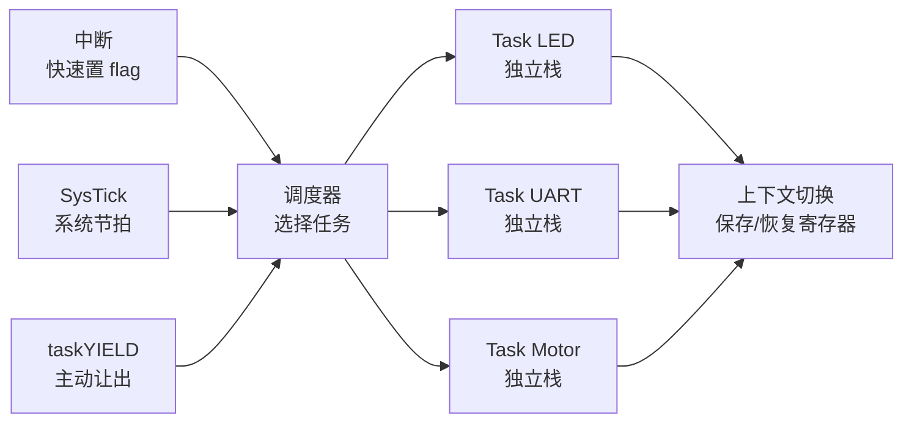
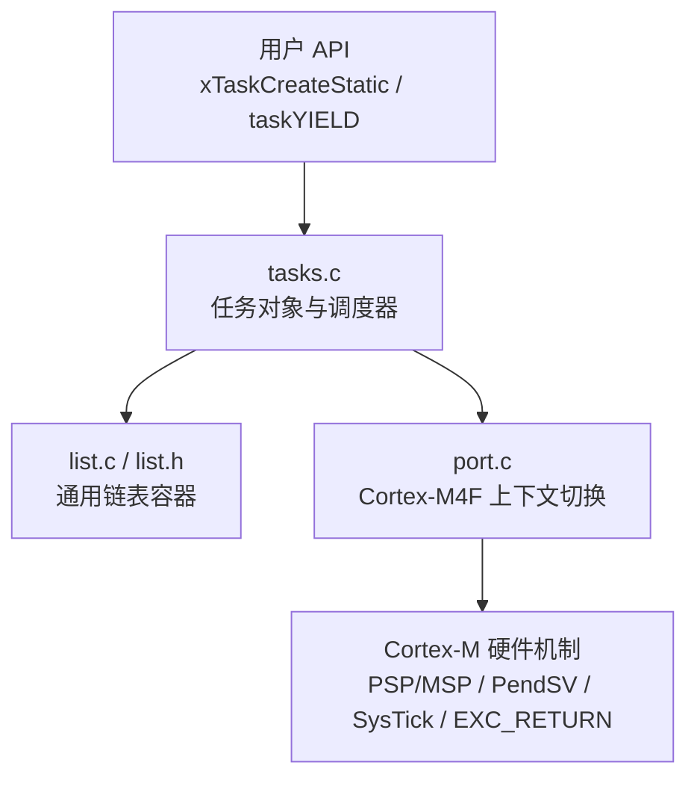
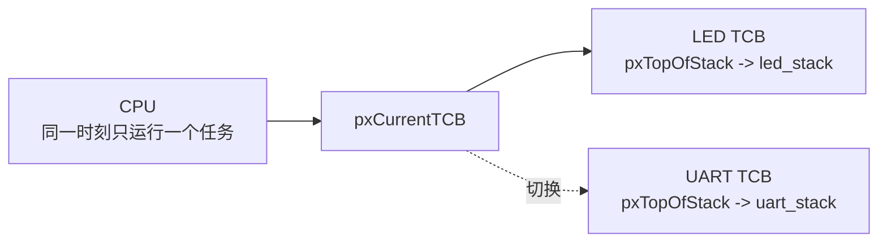
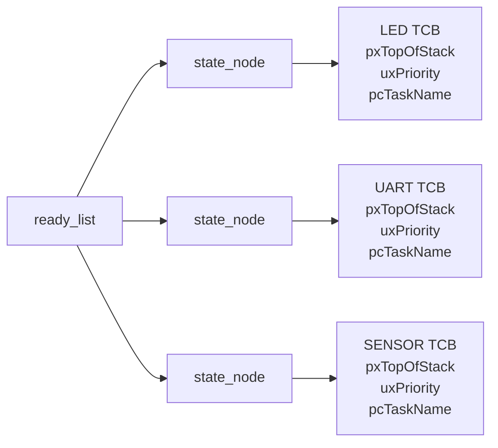
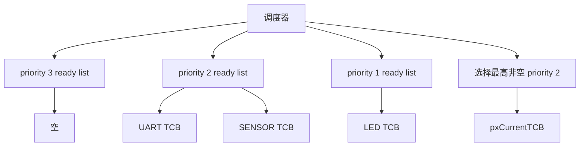

# Chapter 6 手搓FreeRTOS：从 while(1) 到任务切换

---

前五章我们其实已经把进入 RTOS 的门票攒齐了。

- **Chapter 1** 讲启动流程、向量表、栈、寄存器和 GPIO。你知道程序不是从 `main()` 凭空开始的，而是 CPU 先取向量表、设置栈顶、跳到 `Reset_Handler`，最后才进入 C 世界。
- **Chapter 2** 讲中断、NVIC、SysTick、上下文保存、MSP/PSP 和 `EXC_RETURN`。你知道 CPU 可以被硬件异步打断，也知道 Cortex-M 会自动把一部分寄存器压到栈里。
- **Chapter 3** 讲 UART、SPI、I2C、CAN。你知道外设不是函数库，而是硬件状态机加寄存器接口。
- **Chapter 4** 讲 DMA 和 FSMC。你知道 CPU 不应该亲自干所有事情，硬件可以作为总线主设备替 CPU 分担工作。
- **Chapter 5** 讲 C 语言面向对象。你知道 `struct` 可以表达对象，链表节点可以嵌入对象，`container_of` 可以从成员指针找回宿主结构体。

所以本章不是突然冒出来一门新课。本章要回答的是一个顺理成章的问题：

> 如果硬件已经会中断，CPU 已经会保存现场，C 代码已经能组织对象，那我们能不能自己写一个最小的任务调度器？

也就是说，本章不是“FreeRTOS API 入门”。我们不从 `xTaskCreate()`、`vTaskDelay()`、`xSemaphoreGive()` 这些函数开始背。我们从 RTOS 的骨头开始：

- 为什么裸机 `while (1)` 会撑不住？
- 一个“任务”到底比一个“函数”多了什么？
- TCB 为什么是 RTOS 的核心对象？
- 任务第一次运行之前，为什么要先伪造一份栈帧？
- 为什么 Cortex-M 上的上下文切换通常放在 PendSV？
- SysTick 和 PendSV 到底怎么配合？

本章的学习方式也和前面保持一致：**先制造痛点，再打开源码对账，最后手搓一个最小模型。** 不会把理论课、源码课、代码课切成三大块，而是每个概念都按同一个节奏推进：

```text
为什么需要它
    -> FreeRTOS 源码里它在哪里
    -> 我们手搓一个最小版本
    -> 再回头看真实源码多处理了什么
```

## 0 本章节目录

- [1 为什么需要 RTOS](#1-为什么需要-rtos)
  - [1.1 裸机 while(1) 的前后台架构](#11-裸机-while1-的前后台架构)
  - [1.2 非阻塞写法能救一阵，但救不了所有场景](#12-非阻塞写法能救一阵但救不了所有场景)
  - [1.3 RTOS 到底提供了什么](#13-rtos-到底提供了什么)
  - [1.4 本节小结：RTOS 是把隐形调度器正规化](#14-本节小结rtos-是把隐形调度器正规化)
- [2 三个常见 RTOS：FreeRTOS、RT-Thread、Zephyr](#2-三个常见-rtosfreertosrt-threadzephyr)
  - [2.1 先说清楚：我们不是在选“最强 RTOS”](#21-先说清楚我们不是在选最强-rtos)
  - [2.2 FreeRTOS：把内核骨架摊在你面前](#22-freertos把内核骨架摊在你面前)
  - [2.3 RT-Thread：C 语言对象模型更显眼](#23-rt-threadc-语言对象模型更显眼)
  - [2.4 Zephyr：现代嵌入式平台，而不只是一个内核](#24-zephyr现代嵌入式平台而不只是一个内核)
  - [2.5 三套源码和 Chapter5 的关联程度](#25-三套源码和-chapter5-的关联程度)
  - [2.6 为什么本教程用 FreeRTOS 做主线](#26-为什么本教程用-freertos-做主线)
  - [2.7 本节小结：先抓骨架，再看生态](#27-本节小结先抓骨架再看生态)
- [3 阅读源码之前：先准备几张地图](#3-阅读源码之前先准备几张地图)
  - [3.1 为什么要先画地图](#31-为什么要先画地图)
  - [3.2 第一张地图：FreeRTOS 源码怎么分层](#32-第一张地图freertos-源码怎么分层)
  - [3.3 第二张地图：手搓代码怎么递进](#33-第二张地图手搓代码怎么递进)
  - [3.4 第三张地图：每个概念怎么读源码](#34-第三张地图每个概念怎么读源码)
  - [3.5 第四张地图：打开源码以后先搜什么](#35-第四张地图打开源码以后先搜什么)
  - [3.6 本节小结：源码阅读要带着问题进去](#36-本节小结源码阅读要带着问题进去)
- [4 任务不是函数：函数 + 参数 + 独立栈](#4-任务不是函数函数--参数--独立栈)
  - [4.1 普通函数为什么不能直接当任务](#41-普通函数为什么不能直接当任务)
  - [4.2 任务入口函数长什么样](#42-任务入口函数长什么样)
  - [4.3 独立栈：任务能停住再继续的根本原因](#43-独立栈任务能停住再继续的根本原因)
  - [4.4 FreeRTOS 怎么伪造第一次运行现场](#44-freertos-怎么伪造第一次运行现场)
  - [4.5 手搓 v1：把任务初始栈打印出来](#45-手搓-v1把任务初始栈打印出来)
  - [4.6 本节小结：任务 = 入口函数 + 参数 + 独立栈 + 初始现场](#46-本节小结任务--入口函数--参数--独立栈--初始现场)
- [5 TCB：任务在内核里的档案袋](#5-tcb任务在内核里的档案袋)
  - [5.1 只有栈还不够](#51-只有栈还不够)
  - [5.2 FreeRTOS 的 TCB 里装了什么](#52-freertos-的-tcb-里装了什么)
  - [5.3 为什么 TCB 里要嵌入链表节点](#53-为什么-tcb-里要嵌入链表节点)
  - [5.4 FreeRTOS 的 owner 指针和 Chapter5 的 container_of](#54-freertos-的-owner-指针和-chapter5-的-container_of)
  - [5.5 手搓 v2：ready list 只存节点，调度器找回 TCB](#55-手搓-v2ready-list-只存节点调度器找回-tcb)
  - [5.6 本节小结：TCB 是调度器眼里的任务](#56-本节小结tcb-是调度器眼里的任务)
- [6 静态任务创建：用户给内存，内核做初始化](#6-静态任务创建用户给内存内核做初始化)
  - [6.1 为什么先讲静态创建](#61-为什么先讲静态创建)
  - [6.2 FreeRTOS 的 xTaskCreateStatic() 接口](#62-freertos-的-xtaskcreatestatic-接口)
  - [6.3 源码路径：从 API 到 ready list](#63-源码路径从-api-到-ready-list)
  - [6.4 手搓 v3：把 TCB 和任务栈接起来](#64-手搓-v3把-tcb-和任务栈接起来)
  - [6.5 静态创建到底创建了什么](#65-静态创建到底创建了什么)
  - [6.6 本节小结：创建任务不是启动任务](#66-本节小结创建任务不是启动任务)
- [7 Ready List：调度器眼里的候选队列](#7-ready-list调度器眼里的候选队列)
  - [7.1 ready 到底是什么意思](#71-ready-到底是什么意思)
  - [7.2 为什么 FreeRTOS 是每个优先级一个 ready list](#72-为什么-freertos-是每个优先级一个-ready-list)
  - [7.3 FreeRTOS 怎么把任务挂进 ready list](#73-freertos-怎么把任务挂进-ready-list)
  - [7.4 调度器怎么从 ready list 里选任务](#74-调度器怎么从-ready-list-里选任务)
  - [7.5 同优先级轮转：链表不是只当队列用](#75-同优先级轮转链表不是只当队列用)
  - [7.6 手搓 v5：FreeRTOS 风格的最小 ready list](#76-手搓-v5freertos-风格的最小-ready-list)
  - [7.7 本节小结：ready list 是调度器的候选池](#77-本节小结ready-list-是调度器的候选池)
- [8 第一次启动：让第一个任务真的跑起来](#8-第一次启动让第一个任务真的跑起来)
  - [8.1 已经准备好的三样东西](#81-已经准备好的三样东西)
  - [8.2 为什么第一次启动不能直接调用任务函数](#82-为什么第一次启动不能直接调用任务函数)
  - [8.3 FreeRTOS 的启动总路径](#83-freertos-的启动总路径)
  - [8.4 vTaskStartScheduler：通用层只负责启动调度器](#84-vtaskstartscheduler通用层只负责启动调度器)
  - [8.5 xPortStartScheduler：移植层配置异常优先级](#85-xportstartscheduler移植层配置异常优先级)
  - [8.6 prvPortStartFirstTask：用 SVC 进入 Handler mode](#86-prvportstartfirsttask用-svc-进入-handler-mode)
  - [8.7 vPortSVCHandler：从任务栈恢复第一个任务](#87-vportsvchandler从任务栈恢复第一个任务)
  - [8.8 第一次启动和 PendSV 切换有什么区别](#88-第一次启动和-pendsv-切换有什么区别)
  - [8.9 本节小结：第一次启动是一场特殊的异常返回](#89-本节小结第一次启动是一场特殊的异常返回)
- [9 PendSV 上下文切换：保存旧任务，恢复新任务](#9-pendsv-上下文切换保存旧任务恢复新任务)
  - [9.1 taskYIELD() 只是挂起 PendSV](#91-taskyield-只是挂起-pendsv)
  - [9.2 为什么上下文切换放在 PendSV](#92-为什么上下文切换放在-pendsv)
  - [9.3 进入 PendSV 前，硬件已经保存了什么](#93-进入-pendsv-前硬件已经保存了什么)
  - [9.4 保存旧任务：PSP、R4-R11 和 pxTopOfStack](#94-保存旧任务pspr4-r11-和-pxtopofstack)
  - [9.5 调度中段：vTaskSwitchContext() 只负责换人](#95-调度中段vtaskswitchcontext-只负责换人)
  - [9.6 恢复新任务：从新的 pxCurrentTCB 回到线程模式](#96-恢复新任务从新的-pxcurrenttcb-回到线程模式)
  - [9.7 手搓 v4：用打印模拟 PendSV 的控制流](#97-手搓-v4用打印模拟-pendsv-的控制流)
  - [9.8 本节小结：PendSV 是调度器和 CPU 现场之间的桥](#98-本节小结pendsv-是调度器和-cpu-现场之间的桥)
- [10 SysTick 与时间片：让任务不主动 yield 也能轮转](#10-systick-与时间片让任务不主动-yield-也能轮转)
  - [10.1 SysTick 在本章只承担一个角色](#101-systick-在本章只承担一个角色)
  - [10.2 FreeRTOS 的 SysTick Handler 做了什么](#102-freertos-的-systick-handler-做了什么)
  - [10.3 xTaskIncrementTick()：先推进时间，再判断是否需要切换](#103-xtaskincrementtick先推进时间再判断是否需要切换)
  - [10.4 时间片轮转：同优先级 ready list 长度大于 1](#104-时间片轮转同优先级-ready-list-长度大于-1)
  - [10.5 从 SysTick 到 PendSV：tick 不亲自切栈](#105-从-systick-到-pendsvtick-不亲自切栈)
  - [10.6 手搓 v5：补上 xTaskIncrementTick() 的教学版](#106-手搓-v5补上-xtaskincrementtick-的教学版)
  - [10.7 本节小结：SysTick 负责问“该不该切”，PendSV 负责真的切](#107-本节小结systick-负责问该不该切pendsv-负责真的切)
- [11 本章收束与后续章节](#11-本章收束与后续章节)
  - [11.1 本章到底手搓出了什么](#111-本章到底手搓出了什么)
  - [11.2 五个代码版本分别对应哪块真实源码](#112-五个代码版本分别对应哪块真实源码)
  - [11.3 哪些是教学简化，哪些是真实内核必须面对的复杂性](#113-哪些是教学简化哪些是真实内核必须面对的复杂性)
  - [11.4 读完本章应该能回答的问题](#114-读完本章应该能回答的问题)
  - [11.5 为什么下一章自然进入 delay 和阻塞态](#115-为什么下一章自然进入-delay-和阻塞态)

## 1 为什么需要 RTOS

这一节先不急着打开 FreeRTOS 源码，也不急着写任务切换。

我们先把问题讲清楚：**裸机程序到底哪里不够用了？**

如果这个问题没有想明白，后面看到 TCB、ready list、PendSV、时间片这些词，就很容易把它们当成一堆“RTOS 专有名词”。但它们其实都在回答同一个老问题：

> 当一个系统里有很多件事都想使用 CPU 时，谁先来，谁后到，谁可以等，谁不能等？

本节只完成三件事：

| 目标 | 读完以后应该能回答 |
|------|--------------------|
| 看懂前后台架构 | 中断和 `while (1)` 分别承担什么角色？ |
| 看懂非阻塞写法的边界 | 为什么 `HAL_GetTick()` 能缓解问题，却不能从根上解决问题？ |
| 看懂 RTOS 的第一层价值 | RTOS 到底把裸机程序里哪些“人工约定”变成了“内核机制”？ |

本节对应的代码和后文落点如下。现在先不用打开它们逐行读，先知道坐标：

| 位置 | 用途 |
|------|------|
| [`../Chapter2_基础设施_中断系统,定时器和看门狗/code/Interrupt_PWM_LED_noWDG/Core/Src/main.c`](../Chapter2_基础设施_中断系统,定时器和看门狗/code/Interrupt_PWM_LED_noWDG/Core/Src/main.c) | 回忆裸机 `while (1)` + SysTick/HAL tick 的写法 |
| [`code/v1_stack_frame/main.c`](code/v1_stack_frame/main.c) | 后面 §4 会把“任务为什么需要自己的栈”落成代码 |
| [`code/v5_compare_freertos/main.c`](code/v5_compare_freertos/main.c) | 后面 §7、§10 会把 ready list、时间片和调度器串起来 |
| [`../../reference/rtos_src/FreeRTOS-Kernel/tasks.c`](../../reference/rtos_src/FreeRTOS-Kernel/tasks.c) | 后面真正对照 FreeRTOS 的任务创建、TCB、ready list、tick |
| [`../../reference/rtos_src/FreeRTOS-Kernel/portable/GCC/ARM_CM4F/port.c`](../../reference/rtos_src/FreeRTOS-Kernel/portable/GCC/ARM_CM4F/port.c) | 后面真正对照 Cortex-M4F 的任务栈初始化和 PendSV 切换 |

### 1.1 裸机 while(1) 的前后台架构

我们先不谈 RTOS，先看你前几章已经写过的裸机程序。

最朴素的嵌入式程序长这样：

```c
int main(void)
{
    board_init();

    while (1) {
        key_scan();
        led_update();
        uart_poll();
        sensor_update();
        motor_control();
    }
}
```

这个结构有一个很正式的名字：**前后台架构**。

- 前台：中断。比如按键 EXTI、串口 RXNE、定时器更新中断。它们负责快速响应硬件事件。
- 后台：`while (1)` 主循环。它负责慢慢处理业务逻辑。

Chapter2 已经讲过，写中断服务函数的黄金法则是“快进快出”。所以我们通常不会在中断里做复杂业务，而是在中断里置一个 flag：

```c
volatile uint8_t uart_rx_flag = 0;

void USART1_IRQHandler(void)
{
    uart_rx_flag = 1;
}

while (1) {
    if (uart_rx_flag) {
        uart_rx_flag = 0;
        uart_parse_packet();
    }
}
```

这个模型非常重要。很多中小型项目完全可以靠它写完。你不要一学 RTOS 就觉得裸机落后。裸机不是落后，裸机是最直接的控制模型。

它的优点也很明显：

| 优点 | 说明 |
|------|------|
| 控制路径短 | 从中断置 flag 到主循环处理，代码关系很直接 |
| 资源占用低 | 没有调度器、任务栈、内核对象，RAM/Flash 开销小 |
| 调试直观 | 大部分逻辑都在一个主循环里，单步调试比较容易 |

所以 RTOS 不是裸机的“高级替代品”，更不是嵌入式开发的起步门槛。RTOS 是当裸机结构开始变得吃力时，引入的一套更强的组织方式。

但是，当项目继续变大，`while (1)` 会逐渐变成一个隐形调度器。问题在于：它看起来像调度器，却没有调度器应该有的机制。

我们举一个具体场景。现在你的板子要同时做五件事：

| 功能 | 频率/要求 | 裸机写法的问题 |
|------|-----------|----------------|
| LED 状态刷新 | 500ms 一次 | 可以用 `HAL_GetTick()` 非阻塞处理 |
| 串口命令解析 | 不定时到达 | 要靠中断置 flag，再在主循环处理 |
| 传感器滤波 | 10ms 一次 | 要保证主循环不能被别的任务拖慢 |
| 电机控制 | 1ms 一次 | 对实时性很敏感 |
| Flash 写日志 | 偶尔执行，但耗时长 | 一旦阻塞，其他逻辑都会被拖住 |

如果所有逻辑都塞进一个 `while (1)`，你很快会面对一个痛点：

> 每个模块都必须非常自觉，绝对不能阻塞，绝对不能写长循环，绝对不能偷偷占用 CPU 太久。

这对程序员要求太高了。系统越复杂，越不能靠“大家自觉”维持秩序。

更准确地说，主循环已经在做调度，只是这个调度非常原始：

| 主循环里的写法 | 实际承担的调度含义 |
|----------------|--------------------|
| `if (uart_rx_flag)` | 某个事件来了，这段逻辑应该获得 CPU |
| `if (now - led_tick >= 500)` | 这个周期任务到点了，应该执行一次 |
| 函数在 `while (1)` 里的先后顺序 | 默认优先级，排前面的更早获得检查机会 |
| 每个函数都不能阻塞 | 依赖模块自律来保证系统响应 |

也就是说，裸机主循环不是没有调度，而是**把调度规则写散了**。规则散在 `if` 判断里，散在函数顺序里，散在每个模块的“不要阻塞”的约定里。

这就是 RTOS 要接手的第一件事：把这些隐形规则集中起来，变成内核可以管理的数据结构和切换机制。

### 1.2 非阻塞写法能救一阵，但救不了所有场景

Chapter2 讲 SysTick 时，我们已经见过非阻塞延时：

```c
uint32_t last_tick = HAL_GetTick();

while (1) {
    if (HAL_GetTick() - last_tick >= 500) {
        last_tick = HAL_GetTick();
        LED_Toggle();
    }

    uart_poll();
    key_scan();
}
```

这个写法比 `HAL_Delay(500)` 好得多。因为 CPU 不会傻等 500ms，而是每次检查一下时间，没到点就继续处理别的事情。

这里的关键变化是：我们不再把 CPU 卡在“等待”里。

对比一下：

```c
LED_On();
HAL_Delay(500);
LED_Off();
HAL_Delay(500);
```

这种写法的问题不是“延时不准”，而是**等待期间 CPU 被这段逻辑霸占了**。在 `HAL_Delay(500)` 返回之前，主循环里的其他逻辑没有机会执行。

非阻塞写法把“等待”拆成了两部分：

| 原来 | 非阻塞以后 |
|------|------------|
| 我在这里等 500ms | 我记录一个时间点 |
| 等完以后再做下一步 | 每次路过时检查到点没有 |
| 等待期间别人不能运行 | 等待期间 CPU 可以处理别的逻辑 |

但问题也很明显：随着功能增加，你会写出一堆这样的“软件定时器”：

```c
if (now - led_tick >= 500)  { led_tick = now;  led_update(); }
if (now - key_tick >= 10)   { key_tick = now;  key_scan(); }
if (now - imu_tick >= 5)    { imu_tick = now;  imu_update(); }
if (now - motor_tick >= 1)  { motor_tick = now; motor_control(); }
if (uart_rx_flag)           { uart_rx_flag = 0; uart_parse(); }
```

这已经很像一个调度器了，只不过它非常原始：

- 没有任务优先级。
- 没有任务自己的栈。
- 没有阻塞态和就绪态。
- 没有统一的等待机制。
- 每个任务的状态都散落在自己的静态变量和全局变量里。

这里尤其要注意“任务自己的栈”这件事。

在裸机主循环里，`led_update()`、`key_scan()`、`motor_control()` 看起来像三个独立任务，但它们其实不是任务。它们只是三个普通函数，轮流借用同一个 `main()` 调用栈。

普通函数有一个天然限制：它必须一路返回，CPU 才能继续往下走。

```c
void motor_control(void)
{
    read_encoder();
    run_pid();
    update_pwm();
    /* 必须返回 main()，否则后面的逻辑都没机会执行 */
}
```

如果一个逻辑想“运行到一半先停住，过一会儿从停住的位置继续”，普通函数做不到。你只能把中间状态拆出来，写进 `static` 变量或者全局对象里：

```c
void sensor_task_like_function(void)
{
    static uint8_t step = 0;

    switch (step) {
    case 0:
        sensor_start_convert();
        step = 1;
        break;
    case 1:
        if (sensor_is_ready()) {
            sensor_read();
            step = 0;
        }
        break;
    }
}
```

这当然可以写，而且很多裸机项目就是这么写的。但它意味着一件事：**函数的执行现场不在栈上自然保存，而是被你手动拆散到状态机里。**

RTOS 的任务模型要解决的，正是这个问题。每个任务都有自己的栈，所以任务可以在某个位置被切走；下一次调度回来时，只要栈和寄存器恢复正确，它就能像什么都没发生一样继续运行。

更麻烦的是，一旦某个函数内部写了阻塞逻辑，整个主循环都会被卡住：

```c
void flash_write_log(void)
{
    while (flash_is_busy()) {
        // 等待 Flash 空闲
    }
}
```

这个函数表面上只是“写日志”，实际上它把 LED、串口、传感器、电机控制全部按在原地等。你当然可以继续重构，把它改成状态机。但项目越大，状态机越多，最后你会发现：你正在手写一个很难维护的 RTOS。

所以非阻塞写法不是错，它是非常重要的裸机基本功。只是它的适用边界也很清楚：

| 项目规模 | 常见选择 |
|----------|----------|
| 功能少、时序简单、阻塞点少 | 前后台架构足够好 |
| 模块变多，但周期关系还简单 | 非阻塞轮询 + 状态机还能撑住 |
| 任务多、优先级明显、等待关系复杂 | 需要 RTOS 把调度和等待正规化 |

### 1.3 RTOS 到底提供了什么

RTOS 不是让单核 CPU 真的同时运行多个任务。STM32F407 只有一个 Cortex-M4 内核，同一时刻只能执行一条指令。

RTOS 真正提供的是三件事：

1. **任务抽象**：把一段长期运行的逻辑封装成任务，每个任务有自己的栈和状态。
2. **调度器**：根据优先级、状态和时间片决定现在该运行哪个任务。
3. **上下文切换**：保存当前任务的执行现场，恢复另一个任务的执行现场。

把这三件事翻译成后面会反复看到的源码对象，就是：

```text
任务抽象     -> TCB_t + 任务栈
调度器       -> pxReadyTasksLists[] + pxCurrentTCB
上下文切换   -> xPortPendSVHandler + pxTopOfStack
```

也就是说，RTOS 不是靠魔法“同时运行很多函数”。它只是把每个任务的执行现场放进自己的任务栈，把每个任务的管理信息放进 TCB，再用调度器决定 `pxCurrentTCB` 指向谁。CPU 同一时刻仍然只跑一个任务，但切换速度足够快，于是你看到的效果像是多个任务在并发推进。

如果对应到代码层面，大概是这样：

| RTOS 概念 | 解决的裸机痛点 | 后面会看到的东西 |
|-----------|----------------|------------------|
| 任务 | 普通函数不能自然“停住再继续” | 任务入口函数、参数、任务栈 |
| TCB | 任务状态散落在全局变量里 | `TCB_t`、栈顶指针、链表节点 |
| ready list | 一堆 `if` 判断决定谁该运行 | 就绪链表、优先级数组 |
| 调度器 | 主循环顺序就是隐含优先级 | `vTaskSwitchContext()` |
| context switch | 单个调用栈无法保存多个执行现场 | PendSV、PSP、R4-R11 保存恢复 |

用图表示大概是这样：



本章先不讲信号量、队列、互斥锁。这些属于任务之间怎么交流，留到 Chapter8。我们也不急着讲 `vTaskDelay()` 和阻塞链表，那是 Chapter7 的重点。本章只抓住 RTOS 的第一块骨头：

> 任务如何被创建，如何进入 ready list，如何被调度器选中，如何通过 PendSV 切换。

注意这里的顺序很关键。我们不会先把 FreeRTOS 源码从头读一遍，再回头手搓。那样很容易读成宏定义考古。本章后面会按概念推进：

```text
普通函数撑不住
    -> 引出任务栈
    -> 对照 FreeRTOS 初始化栈
    -> 手搓 v1_stack_frame

任务需要被内核管理
    -> 引出 TCB
    -> 对照 FreeRTOS 的 TCB_t
    -> 手搓 v2_tcb_ready_list

任务需要被选中运行
    -> 引出 ready list 和调度
    -> 对照 tasks.c / list.c
    -> 手搓静态任务创建与 yield
```

也就是说，后面每遇到一个概念，都会立刻去看源码里它长什么样，再手搓一个最小版本，然后回头说明真实 FreeRTOS 多处理了哪些工程细节。

### 1.4 本节小结：RTOS 是把隐形调度器正规化

这一节我们还没有写任何 RTOS 代码，但已经把需求推出来了。

裸机前后台架构的核心是：

```text
中断负责快速响应
while (1) 负责慢慢处理
```

这个模型简单、直接、资源占用低，非常值得掌握。但当系统变复杂以后，`while (1)` 会逐渐承担调度职责：

- 谁到点了？
- 谁有事件？
- 谁应该先执行？
- 谁绝对不能阻塞？
- 谁运行到一半需要保存状态？

这些问题如果全靠程序员在每个模块里手动维护，项目会越来越依赖约定和自律。

RTOS 做的事情可以概括成一句话：

> RTOS 把裸机主循环里散落的调度规则，整理成任务、TCB、ready list、调度器和上下文切换。

所以从下一节开始，我们不会急着背 API，而是先横向看一下 FreeRTOS、RT-Thread、Zephyr 三类 RTOS 的定位。看完以后，再正式进入本章主线：围绕 FreeRTOS，一边看源码，一边手搓最小内核。

## 2 三个常见 RTOS：FreeRTOS、RT-Thread、Zephyr

上一节我们已经把 RTOS 的需求推出来了：当 `while (1)` 里的调度规则越来越多、越来越散，就需要一个真正的内核来管理任务、状态和切换。

但 RTOS 不是只有 FreeRTOS。你在嵌入式世界里经常会遇到这三个名字：

- **FreeRTOS**
- **RT-Thread**
- **Zephyr**

这三个都能叫 RTOS，但它们的气质不一样。就像同样都是“车”，自行车、家用车、工程车解决的问题完全不同。我们这一节不急着评判谁更强，而是先搞清楚：

> 本教程为什么选择 FreeRTOS 做主线？RT-Thread 和 Zephyr 又应该放在什么位置看？

三套源码已经固定在仓库里，作为后续阅读材料：

| RTOS | 固定版本 | 源码路径 | 本章关注点 |
|------|----------|----------|------------|
| FreeRTOS Kernel | `V11.3.0` | [`../../reference/rtos_src/FreeRTOS-Kernel/`](../../reference/rtos_src/FreeRTOS-Kernel/) | 任务栈、TCB、ready list、PendSV、SysTick |
| RT-Thread | `v5.2.2` | [`../../reference/rtos_src/rt-thread/`](../../reference/rtos_src/rt-thread/) | C 语言对象模型、线程对象、调度器组织 |
| Zephyr | `v4.4.1` | [`../../reference/rtos_src/zephyr/`](../../reference/rtos_src/zephyr/) | Kconfig、设备模型、跨架构内核工程 |

注意，本章把这三份源码当作**阅读材料**，不是当作环境搭建材料。我们不会在这里初始化 Zephyr 的模块依赖，也不会把 FreeRTOS 的 demo 工程和板级移植全部跑起来。现在的目标很窄：

| 源码 | 本章只读 | 本章暂时不读 |
|------|----------|--------------|
| FreeRTOS | `tasks.c`、`list.c`、`include/list.h`、`portable/GCC/ARM_CM4F/port.c` | queue、stream buffer、timer service、MPU/SMP 细节 |
| RT-Thread | `src/object.c`、`src/thread.c`、`src/scheduler_up.c`、`include/rtdef.h` | shell、组件系统、文件系统、网络协议栈 |
| Zephyr | `kernel/thread.c`、`kernel/sched.c`、`kernel/timeslicing.c`、`kernel/obj_core.c` | west 工程、驱动模型全貌、devicetree 绑定细节、多架构移植全集 |

先把阅读范围收窄，后面讲 TCB、ready list、PendSV 时才不会被旁枝带走。

### 2.1 先说清楚：我们不是在选“最强 RTOS”

初学 RTOS 很容易掉进一个坑：上来就问“哪个 RTOS 最好”。

这个问题其实不太能回答。因为 RTOS 的“好”，要看你准备用它解决什么问题。

如果你的目标是做一个资源很小的 MCU 项目，希望内核轻、移植简单、任务调度清楚，FreeRTOS 很合适。

如果你的目标是做一个更完整的 IoT 设备，希望系统里有对象管理、组件框架、shell、文件系统、网络协议栈，RT-Thread 会更像一个“嵌入式小系统”。

如果你的目标是做一个产品级平台，希望一套工程能覆盖多架构、多板卡、驱动模型、设备树、Kconfig、用户态隔离，Zephyr 的方向就更接近现代嵌入式操作系统平台。

所以本章的比较标准不是“谁功能最多”，而是：

> 谁最适合用来讲清楚 RTOS 的内核骨架？

我们现在要学的是任务为什么要有自己的栈，TCB 怎么进入调度器，PendSV 为什么适合做上下文切换。站在这个目标上，源码越轻、核心路径越短，反而越适合教学。

### 2.2 FreeRTOS：把内核骨架摊在你面前

FreeRTOS 的特点是：**内核小，边界清楚，核心机制集中。**

你打开 FreeRTOS Kernel 仓库，会发现它不像一个庞大的系统工程，更像一颗相对独立的实时内核：

| 文件 | 后面怎么读 |
|------|------------|
| [`tasks.c`](../../reference/rtos_src/FreeRTOS-Kernel/tasks.c) | 任务创建、TCB、ready list、调度器 |
| [`list.c`](../../reference/rtos_src/FreeRTOS-Kernel/list.c) | 内核链表，任务如何挂入各种状态链表 |
| [`portable/GCC/ARM_CM4F/port.c`](../../reference/rtos_src/FreeRTOS-Kernel/portable/GCC/ARM_CM4F/port.c) | Cortex-M4F 移植层，PendSV、SysTick、任务初始栈 |

这一点对本教程非常重要。因为我们不是在学“怎么调用 API”，而是在学“API 背后的内核对象怎么运转”。

比如 FreeRTOS 的 `TCB_t` 就直接藏在 [`tasks.c`](../../reference/rtos_src/FreeRTOS-Kernel/tasks.c) 里。你会看到它最前面就是任务栈顶指针：

```c
volatile StackType_t * pxTopOfStack;
```

后面紧跟着状态链表节点、事件链表节点、优先级、栈起始地址、任务名等字段。也就是说，FreeRTOS 没有把“任务”包装成一个看不见的黑盒。任务在内核里就是一个 C 结构体，一个带着栈、优先级和链表节点的对象。

这就刚好接上 Chapter5：

```text
Chapter5: struct 可以表达对象，链表节点可以嵌入对象
Chapter6: TCB 就是任务对象，ready list 通过链表节点管理任务
```

再看上下文切换。FreeRTOS 把 Cortex-M4F 相关的汇编放在 [`portable/GCC/ARM_CM4F/port.c`](../../reference/rtos_src/FreeRTOS-Kernel/portable/GCC/ARM_CM4F/port.c) 里。后面我们会重点读两个位置：

- `pxPortInitialiseStack()`：任务还没运行之前，如何先伪造一份“异常返回现场”。
- `xPortPendSVHandler()`：PendSV 里如何保存旧任务、选择新任务、恢复新任务。

这些名字听起来硬，但它们回答的仍然是上一节的问题：

> 普通函数不能自然停住再继续，所以任务需要自己的栈；任务有了自己的栈，调度器就可以通过切换栈顶来切换任务。

FreeRTOS 的优势就在这里：它足够真实，真实到能看到工业代码必须处理的细节；又足够克制，克制到我们可以沿着几条主线把它读下来。

### 2.3 RT-Thread：C 语言对象模型更显眼

RT-Thread 也很适合拿来对照，尤其适合接 Chapter5。

你看它的名字就能感觉到：RT-Thread 很强调“线程”和“对象”。它不是只给你一个调度器，而是把很多内核资源都组织成对象。

我们后面做横向对照时，主要看这些文件：

| 文件 | 观察重点 |
|------|----------|
| [`src/object.c`](../../reference/rtos_src/rt-thread/src/object.c) | `rt_object_init()` 如何初始化内核对象 |
| [`src/thread.c`](../../reference/rtos_src/rt-thread/src/thread.c) | 线程创建、线程控制块、线程栈 |
| [`src/scheduler_up.c`](../../reference/rtos_src/rt-thread/src/scheduler_up.c) | 单核调度器路径 |
| [`src/clock.c`](../../reference/rtos_src/rt-thread/src/clock.c) | tick 和时间推进 |

RT-Thread 的一个鲜明特点是：对象管理更像一个系统级框架。

比如 `rt_object_init()` 不是只服务线程。它服务的是“内核对象”这个统一抽象。线程、定时器、信号量、互斥量、消息队列，都可以进入 RT-Thread 的对象管理体系。

这和 Chapter5 的关系非常直接：

```text
Chapter5: 先有一个通用 base object，再嵌入到更具体的对象里
RT-Thread: rt_object 是很多内核对象的公共头部
```

所以 RT-Thread 很适合用来验证一句话：

> C 语言没有 `class` 关键字，但大型 C 工程照样会用“结构体嵌套 + 公共头部 + 链表节点”组织对象体系。

那为什么本章不直接拿 RT-Thread 做手搓主线？

因为 RT-Thread 的对象体系更完整，组件更多，系统味更重。它很适合拿来说明“工程化 RTOS 可以长成什么样”，但如果我们第一轮目标只是讲清楚任务栈、TCB、ready list、PendSV，它会多带进来一些暂时不需要的概念。

所以本章对 RT-Thread 的定位是：**用来横向比较 C 语言对象模型，而不是作为第一条深读主线。**

### 2.4 Zephyr：现代嵌入式平台，而不只是一个内核

Zephyr 和前两个的气质又不一样。

如果说 FreeRTOS 像一个轻量内核，RT-Thread 像一个带组件生态的嵌入式系统，那么 Zephyr 更像一个现代嵌入式平台。

它当然也有线程和调度器。后面可以看：

| 文件 | 观察重点 |
|------|----------|
| [`kernel/thread.c`](../../reference/rtos_src/zephyr/kernel/thread.c) | `k_thread_create()`、`z_setup_new_thread()` |
| [`kernel/sched.c`](../../reference/rtos_src/zephyr/kernel/sched.c) | 调度器和 ready queue |
| [`kernel/timeslicing.c`](../../reference/rtos_src/zephyr/kernel/timeslicing.c) | 时间片处理 |
| [`kernel/timeout.c`](../../reference/rtos_src/zephyr/kernel/timeout.c) | 超时和延时机制 |

但你真正打开 Zephyr，会发现它的复杂度不只来自内核。

它还有：

- Kconfig：控制功能裁剪。
- CMake/west：管理构建和模块。
- devicetree：描述板级硬件资源。
- device model：统一管理驱动和设备实例。
- 多架构支持：同一套内核要跑在不同 CPU 架构上。

这些都非常重要，也都非常工业。但对本章来说，它们会把读者的注意力带走。

我们现在要盯住的是这条线：

```text
任务入口函数
    -> 任务栈
    -> TCB
    -> ready list
    -> 调度器
    -> PendSV 上下文切换
```

Zephyr 当然也有这些东西，但它外面包着更大的工程体系。等你理解了 FreeRTOS 的内核骨架，再回头看 Zephyr，就不会被 Kconfig、devicetree、宏和架构层绕晕。你会知道：外层工程再复杂，内核深处仍然要回答同样的问题。

> 哪些线程 ready？谁的优先级最高？当前线程的上下文保存在哪里？下一个线程的上下文从哪里恢复？

所以本章对 Zephyr 的定位是：**用来观察现代 RTOS 平台的工程复杂度，而不是作为第一轮手搓对象。**

### 2.5 三套源码和 Chapter5 的关联程度

Chapter5 讲 C 语言面向对象，不是为了让你在 C 里硬写 `class`，而是为了让你看得懂大型 C 工程怎么组织对象。

放到 RTOS 里，这件事会变得非常具体：

| Chapter5 技巧 | FreeRTOS 里怎么看 | RT-Thread 里怎么看 | Zephyr 里怎么看 |
|---------------|-------------------|--------------------|-----------------|
| `struct` 表达对象 | [`tasks.c`](../../reference/rtos_src/FreeRTOS-Kernel/tasks.c) 里的 `TCB_t` 就是任务对象 | [`include/rtdef.h`](../../reference/rtos_src/rt-thread/include/rtdef.h) 里的 `struct rt_thread` 是线程对象 | [`include/zephyr/kernel/thread.h`](../../reference/rtos_src/zephyr/include/zephyr/kernel/thread.h) 里的 `struct k_thread` 是线程对象 |
| 结构体嵌入链表节点 | `TCB_t` 嵌入 `xStateListItem` 和 `xEventListItem` | `rt_object` 里有对象链表节点，线程再嵌入公共对象头 | 内核对象、线程队列、ready queue 都大量使用嵌入式节点 |
| 从节点找回宿主对象 | [`include/list.h`](../../reference/rtos_src/FreeRTOS-Kernel/include/list.h) 用 owner 指针保存宿主对象 | [`src/object.c`](../../reference/rtos_src/rt-thread/src/object.c) 通过对象容器管理不同类型对象 | [`kernel/obj_core.c`](../../reference/rtos_src/zephyr/kernel/obj_core.c) 把内核对象纳入更大的对象元数据体系 |
| 分层抽象 | 内核通用层 `tasks.c` 和平台移植层 `port.c` 分开 | 对象管理、线程管理、调度器拆成不同源文件 | 内核、架构、设备模型、构建系统分层更深 |

这里可以看出一个很有意思的差别：

- FreeRTOS 和 Chapter5 的关联是**贴着调度器的**。它不先建立一个庞大的对象体系，而是在 TCB、链表、调度器这些核心路径上直接使用 C-OOP 技巧。
- RT-Thread 和 Chapter5 的关联是**显式对象化的**。`rt_object` 是很多内核对象的公共头部，读起来很像 Chapter5 里“base object + 派生对象”的工业版。
- Zephyr 和 Chapter5 的关联是**系统工程化的**。你当然能看到对象、链表、线程结构，但它们常常被 Kconfig、devicetree、宏和架构层包住，第一轮学习时不适合直接拿来手搓。

所以 RT-Thread 不是“不适合学”，恰恰相反，它很适合在 Chapter5 之后拿来验证 C-OOP。只是本章第一目标不是“讲完整 RTOS 对象体系”，而是“把任务切换这条骨架讲透”。站在这个目标上，FreeRTOS 更适合做主线。

### 2.6 为什么本教程用 FreeRTOS 做主线

现在我们可以把三者放到一张表里：

| 对比项 | FreeRTOS | RT-Thread | Zephyr |
|--------|----------|-----------|--------|
| 第一印象 | 轻量实时内核 | IoT RTOS + 组件生态 | 现代嵌入式平台 |
| 源码入口 | `tasks.c`、`list.c`、`port.c` | `thread.c`、`object.c`、`scheduler_up.c` | `kernel/thread.c`、`kernel/sched.c` |
| 对 Chapter5 的关联 | TCB + 嵌入式链表节点 | 公共对象头 + 对象容器 | 对象/设备/内核结构更系统，但层次更深 |
| 对 Chapter2 的关联 | SysTick、PendSV、PSP/MSP、EXC_RETURN 非常直接 | 同样有 tick 和上下文切换，但体系更宽 | 同样有调度和时间片，但跨架构抽象更多 |
| 适合本章手搓吗 | 最适合 | 适合对照 | 适合拓展视野 |

本教程选择 FreeRTOS 做主线，不是因为它“最好”，而是因为它最适合完成本章的教学目标：

1. **源码轻**：核心路径集中在少数几个文件里。
2. **C 结构清楚**：TCB、链表、优先级、调度器都能在 C 代码里直接看到。
3. **和 Cortex-M 结合紧**：`port.c` 里能直接看到 PendSV 和 SysTick 的移植层实现。
4. **适合手搓最小模型**：我们可以把真实代码拆成 `v1_stack_frame`、`v2_tcb_ready_list`、`v3_static_task_create`、`v4_pendsv_yield`、`v5_compare_freertos` 逐步实现。

后面的章节会保持这个节奏：

```text
先用 FreeRTOS 找到真实工业写法
    -> 再手搓一个最小教学版
    -> 最后拿 RT-Thread / Zephyr 看同一个问题在更大系统里怎么组织
```

这样学的好处是：你不会只会调 FreeRTOS API，也不会一上来被 Zephyr 的工程体系压住。你会先抓住 RTOS 的骨架，再去看不同系统怎么给这副骨架加肌肉。

### 2.7 本节小结：先抓骨架，再看生态

这一节我们做的不是选型报告，而是给后面的源码阅读定方向。

FreeRTOS、RT-Thread、Zephyr 都值得学，但它们适合出现在教程里的位置不同：

- **FreeRTOS**：主线。用它讲清楚任务、TCB、ready list、PendSV 和 SysTick。
- **RT-Thread**：对照。用它观察 C 语言对象模型如何变成内核对象体系。
- **Zephyr**：拓展。用它理解现代嵌入式平台为什么会引入 Kconfig、devicetree、设备模型和更复杂的内核层次。

从下一节开始，我们正式准备几张“源码地图”。先告诉你哪些文件要读、每个文件解决什么问题、手搓代码和真实源码怎么一一对应。地图画清楚以后，再进入第一个真正的内核概念：**任务不是函数，任务是函数 + 参数 + 独立栈。**

## 3 阅读源码之前：先准备几张地图

前两节解决了两个问题：

1. 为什么裸机 `while (1)` 会逐渐变成一个隐形调度器。
2. 为什么本教程选择 FreeRTOS 做主线，而把 RT-Thread 和 Zephyr 放在横向对照的位置。

从下一节开始，我们就要真正进入 RTOS 内核了。第一个概念是“任务不是函数”，随后会一路走到 TCB、ready list、静态任务创建、PendSV 和 SysTick。

但在正式开读之前，我们先停一下，画几张地图。

这一步很重要。很多人第一次看 FreeRTOS 源码，打开 [`tasks.c`](../../reference/rtos_src/FreeRTOS-Kernel/tasks.c) 就开始从第一行往下啃，结果很快被宏、配置项、条件编译、trace hook、MPU、多核支持绕晕。

这不是你基础差，而是读源码的方法错了。

源码不是小说，不适合从第一页顺着读到最后一页。源码更像城市地图：你先要知道主干道在哪里、自己今天要去哪里、哪些小路暂时不用管。

### 3.1 为什么要先画地图

我们本章要看的 FreeRTOS 不是“完整操作系统所有功能”，而是非常明确的一条主线：

```text
任务入口函数
    -> 任务栈
    -> TCB
    -> ready list
    -> 调度器选择任务
    -> PendSV 切换上下文
    -> SysTick 提供节拍
```

这条线已经足够硬了。它横跨 C 结构体、链表、Cortex-M 异常机制、汇编、栈帧和调度策略。

所以本章读源码有三个原则：

| 原则 | 意思 |
|------|------|
| 只读主线 | 本章先不展开队列、信号量、事件组、软件定时器 |
| 一边读一边搓 | 每个概念都先找真实源码，再写一个最小模型 |
| 先看骨架，再看细节 | 先理解“为什么这样组织”，再回头看各种配置宏 |

你可以把本章当成一次有导游的源码徒步。我们不会把整个 FreeRTOS 森林砍开，但会沿着任务调度这条路走到足够深。

### 3.2 第一张地图：FreeRTOS 源码怎么分层

FreeRTOS Kernel 的目录不算大，但对初学者来说，最容易混在一起的是三类代码：

| 层次 | 文件 | 负责什么 |
|------|------|----------|
| 内核任务层 | [`tasks.c`](../../reference/rtos_src/FreeRTOS-Kernel/tasks.c) | TCB、任务创建、ready list、调度器、tick 推进 |
| 通用链表层 | [`list.c`](../../reference/rtos_src/FreeRTOS-Kernel/list.c)、[`include/list.h`](../../reference/rtos_src/FreeRTOS-Kernel/include/list.h) | 内核通用双向链表，任务通过链表节点挂入不同状态 |
| Cortex-M4F 移植层 | [`portable/GCC/ARM_CM4F/port.c`](../../reference/rtos_src/FreeRTOS-Kernel/portable/GCC/ARM_CM4F/port.c) | 任务初始栈、PendSV、SysTick、临界区、启动调度器 |

这三层的关系可以先这样理解：



这张图里最关键的是边界：

- `tasks.c` 不应该关心 Cortex-M 具体怎么保存 R4-R11，它只需要知道“现在要切到哪个 TCB”。
- `port.c` 不应该重新发明调度策略，它只负责把当前任务现场保存起来，再恢复调度器选中的任务。
- `list.c` 不知道自己挂的是任务、定时器还是别的对象，它只管理节点。

这就是 Chapter5 里一直强调的工程边界：**对象层负责对象，容器层负责容器，硬件移植层负责硬件。**

后面每讲一个机制，我们都会问一句：

> 这件事属于 `tasks.c`，属于 `list.c`，还是属于 `port.c`？

这个问题问清楚，FreeRTOS 的结构就不会散。

### 3.3 第二张地图：手搓代码怎么递进

本章的配套代码放在 [`code/`](code/) 目录下，不是一个版本写到底，而是拆成五个小版本。

这样安排是为了让每个版本只解决一个问题。你每次只需要理解一个新增机制，不需要同时面对完整 RTOS 的所有复杂度。

| 版本 | 路径 | 解决的问题 | 对应 FreeRTOS 线索 |
|------|------|------------|--------------------|
| v1 | [`code/v1_stack_frame/`](code/v1_stack_frame/) | 任务第一次运行前，栈里应该先放什么 | `port.c` 的 `pxPortInitialiseStack()` |
| v2 | [`code/v2_tcb_ready_list/`](code/v2_tcb_ready_list/) | 链表只存节点，调度器怎么找回 TCB | `tasks.c` 的 `TCB_t` + `list.c` |
| v3 | [`code/v3_static_task_create/`](code/v3_static_task_create/) | 用户给 TCB 和栈，内核如何初始化任务 | `tasks.c` 的 `xTaskCreateStatic()` |
| v4 | [`code/v4_pendsv_yield/`](code/v4_pendsv_yield/) | `taskYIELD()` 如何引出 PendSV 切换语义 | `port.c` 的 `xPortPendSVHandler()` |
| v5 | [`code/v5_compare_freertos/`](code/v5_compare_freertos/) | 用 FreeRTOS 风格命名整理最小调度器 | `pxCurrentTCB`、`pxReadyTasksLists[]`、`portYIELD()`、`xTaskIncrementTick()` |

注意，这些手搓代码不是为了替代 FreeRTOS，也不是为了完整模拟硬件。

比如 [`code/v4_pendsv_yield/main.c`](code/v4_pendsv_yield/main.c) 里的 `xPortPendSVHandler()` 只是打印：

```c
printf("  [PendSV] save %s R4-R11 to its stack\n", pxCurrentTCB->pcTaskName);
```

PC 程序当然不可能真的替 Cortex-M 保存 R4-R11。但它能让你看清楚控制流：

```text
当前任务运行
    -> taskYIELD()
    -> 挂起 PendSV
    -> 保存当前任务现场
    -> 选择下一个任务
    -> 恢复下一个任务现场
```

这就够了。因为本章的目标不是“在 PC 上跑一个真 RTOS”，而是先把 RTOS 的骨架拆到你能看懂、能复述、能对照真实源码的位置。

### 3.4 第三张地图：每个概念怎么读源码

从下一节开始，我们每一节都会按同一个节奏走：

```text
先从裸机痛点出发
    -> 再看 FreeRTOS 源码里对应位置
    -> 然后手搓最小版本
    -> 最后回头说明真实源码多处理了什么
```

这里先把后面的阅读问题摆出来。你不用现在就全懂，但可以先知道接下来要解决什么。

| 章节主题 | 先问什么问题 | FreeRTOS 入口 | 手搓入口 |
|----------|--------------|---------------|----------|
| 任务栈 | 任务还没运行，为什么栈里已经有 PC/xPSR/LR？ | [`port.c`](../../reference/rtos_src/FreeRTOS-Kernel/portable/GCC/ARM_CM4F/port.c) 的 `pxPortInitialiseStack()` | [`code/v1_stack_frame/main.c`](code/v1_stack_frame/main.c) |
| TCB | 内核凭什么知道一个任务的栈顶、优先级、名字和状态？ | [`tasks.c`](../../reference/rtos_src/FreeRTOS-Kernel/tasks.c) 的 `TCB_t` | [`code/v2_tcb_ready_list/main.c`](code/v2_tcb_ready_list/main.c) |
| ready list | 为什么任务不是放进数组，而是挂进链表？ | [`list.c`](../../reference/rtos_src/FreeRTOS-Kernel/list.c) 和 `pxReadyTasksLists[]` | [`code/v2_tcb_ready_list/main.c`](code/v2_tcb_ready_list/main.c) |
| 静态任务创建 | `xTaskCreateStatic()` 到底初始化了哪些东西？ | [`tasks.c`](../../reference/rtos_src/FreeRTOS-Kernel/tasks.c) 的 `xTaskCreateStatic()` | [`code/v3_static_task_create/main.c`](code/v3_static_task_create/main.c) |
| 主动让出 CPU | `taskYIELD()` 为什么不是直接调用另一个任务函数？ | [`port.c`](../../reference/rtos_src/FreeRTOS-Kernel/portable/GCC/ARM_CM4F/port.c) 的 yield/PendSV 路径 | [`code/v4_pendsv_yield/main.c`](code/v4_pendsv_yield/main.c) |
| PendSV 切换 | 为什么上下文切换放在 PendSV，而不是普通函数里？ | [`port.c`](../../reference/rtos_src/FreeRTOS-Kernel/portable/GCC/ARM_CM4F/port.c) 的 `xPortPendSVHandler()` | [`code/v4_pendsv_yield/main.c`](code/v4_pendsv_yield/main.c) |
| 时间片 | SysTick 只是定时中断，怎么推动任务轮转？ | [`tasks.c`](../../reference/rtos_src/FreeRTOS-Kernel/tasks.c) 的 `xTaskIncrementTick()`、[`port.c`](../../reference/rtos_src/FreeRTOS-Kernel/portable/GCC/ARM_CM4F/port.c) 的 `xPortSysTickHandler()` | [`code/v5_compare_freertos/main.c`](code/v5_compare_freertos/main.c) |

这张表就是后面几节的路线图。读者每进入一节，都应该先带着一个具体问题，而不是抱着“我要读懂 FreeRTOS”的巨大压力往里冲。

举个例子。下一节讲任务栈时，我们不会一上来解释完整的任务创建 API，而是只盯住一个问题：

> 为什么一个任务还没被 CPU 执行过，FreeRTOS 就要先在它的栈里放好 xPSR、PC、LR、R0-R3、R12、R4-R11？

这个问题回答完，`pxPortInitialiseStack()` 就不再是一串奇怪的压栈代码，而是 Cortex-M 异常返回机制的一个精巧应用。

### 3.5 第四张地图：打开源码以后先搜什么

真正读源码时，不建议你从文件第一行开始硬啃。

更好的方式是：**先搜符号，再顺着调用关系往外看一圈。** 这和前面几章看 HAL 源码的方式一样，先抓一个具体 API 或结构体，再看它周围的上下文。

本章后面你可以按这张表操作：

| 要理解的问题 | 先打开 | 先搜这个符号 | 读到哪里先停 |
|--------------|--------|--------------|--------------|
| 任务初始栈怎么伪造 | [`port.c`](../../reference/rtos_src/FreeRTOS-Kernel/portable/GCC/ARM_CM4F/port.c) | `pxPortInitialiseStack` | 看完它压入 xPSR、PC、LR、R0 和 R4-R11，先不要展开所有 FPU/MPU 分支 |
| 任务对象长什么样 | [`tasks.c`](../../reference/rtos_src/FreeRTOS-Kernel/tasks.c) | `tskTaskControlBlock` | 看 `pxTopOfStack`、`xStateListItem`、`uxPriority`、`pcTaskName`，先跳过条件编译字段 |
| ready list 怎么挂任务 | [`tasks.c`](../../reference/rtos_src/FreeRTOS-Kernel/tasks.c) | `prvAddTaskToReadyList` | 看它如何选 `pxReadyTasksLists[uxPriority]`，再跳到 `listINSERT_END` |
| 链表怎么轮转取下一个任务 | [`include/list.h`](../../reference/rtos_src/FreeRTOS-Kernel/include/list.h) | `listGET_OWNER_OF_NEXT_ENTRY` | 看 `pxIndex` 如何前进、owner 如何回到 TCB，先不读全部链表 API |
| 静态任务创建做了什么 | [`tasks.c`](../../reference/rtos_src/FreeRTOS-Kernel/tasks.c) | `xTaskCreateStatic` | 顺着看到 `prvInitialiseNewTask` 和 `prvAddNewTaskToReadyList`，先不要追动态创建 |
| PendSV 真正切了什么 | [`port.c`](../../reference/rtos_src/FreeRTOS-Kernel/portable/GCC/ARM_CM4F/port.c) | `xPortPendSVHandler` | 看 `mrs psp`、保存 R4-R11、调用 `vTaskSwitchContext()`、恢复新 PSP |
| tick 怎么触发时间片 | [`tasks.c`](../../reference/rtos_src/FreeRTOS-Kernel/tasks.c) | `xTaskIncrementTick` | 只看同优先级 ready list 长度大于 1 时返回需要切换，delay list 留到后面 |

这里的“先停”很重要。

FreeRTOS 是工业代码，不是教学伪代码。你会看到很多配置宏、trace hook、MPU、SMP、断言和兼容代码。它们都不是垃圾，也不是绕弯子；它们是工业代码必须处理的现实。但第一轮读源码时，如果每个分支都追到底，主线会断。

本章的读法是：

```text
第一遍：只抓主线，知道这个机制为什么存在
第二遍：对照手搓代码，知道最小模型怎么工作
第三遍：回到真实源码，理解工业代码多处理了哪些边界
```

比如看 `xPortPendSVHandler()`，第一遍只需要抓住四步：

```text
保存旧任务的 PSP/R4-R11
调用 vTaskSwitchContext() 选出新任务
读取新任务的 pxTopOfStack
恢复新任务的 R4-R11/PSP 并异常返回
```

至于 FPU 寄存器、临界区屏蔽、中断优先级断言，后面用到时再回来读。这样源码才会变成路线图，而不是一堵墙。

### 3.6 本节小结：源码阅读要带着问题进去

这一节没有引入新的 RTOS 机制，只做了一件事：给后面的源码阅读画地图。

本章接下来会围绕三条线同时推进：

```text
理论线：为什么需要这个机制
源码线：FreeRTOS 在哪里实现它
手搓线：我们写一个最小版本观察它
```

你可以先记住三个核心文件：

- [`tasks.c`](../../reference/rtos_src/FreeRTOS-Kernel/tasks.c)：任务对象和调度器。
- [`list.c`](../../reference/rtos_src/FreeRTOS-Kernel/list.c)：内核链表容器。
- [`portable/GCC/ARM_CM4F/port.c`](../../reference/rtos_src/FreeRTOS-Kernel/portable/GCC/ARM_CM4F/port.c)：Cortex-M4F 上下文切换。

以及五个手搓版本：

- [`v1_stack_frame`](code/v1_stack_frame/)：任务初始栈。
- [`v2_tcb_ready_list`](code/v2_tcb_ready_list/)：TCB 和 ready list。
- [`v3_static_task_create`](code/v3_static_task_create/)：静态任务创建。
- [`v4_pendsv_yield`](code/v4_pendsv_yield/)：yield 和 PendSV 语义。
- [`v5_compare_freertos`](code/v5_compare_freertos/)：FreeRTOS 风格最小调度器。

下一节开始进入第一个真正的内核问题：**任务不是函数，任务是函数 + 参数 + 独立栈。**

## 4 任务不是函数：函数 + 参数 + 独立栈

从这一节开始，我们进入第一个真正的 RTOS 内核概念：**任务**。

很多教程会直接告诉你：FreeRTOS 里任务函数长这样：

```c
void led_task(void *argument)
{
    while (1) {
        /* do something */
    }
}
```

然后就开始讲 `xTaskCreate()` 或 `xTaskCreateStatic()`。

但如果只看到这一层，任务很容易被误解成“一个不会返回的函数”。这句话只说对了一半。任务确实从一个函数入口开始执行，但任务和普通函数的本质区别不在入口，而在**执行现场**。

普通函数借用调用者的栈。任务拥有自己的栈。

这就是本节要讲透的事情：

> 任务 = 入口函数 + 参数 + 独立栈 + 一份能让 CPU 第一次跳进去的初始现场。

本节对应的源码坐标很集中：

| 类型 | 路径 | 本节只看什么 |
|------|------|--------------|
| FreeRTOS | [`portable/GCC/ARM_CM4F/port.c`](../../reference/rtos_src/FreeRTOS-Kernel/portable/GCC/ARM_CM4F/port.c) | `pxPortInitialiseStack()` 如何伪造任务第一次运行现场 |
| 手搓代码 | [`code/v1_stack_frame/main.c`](code/v1_stack_frame/main.c) | 用数组模拟任务栈，把 PC、R0、LR、EXC_RETURN 打印出来 |

本节暂时不看 `tasks.c` 里的完整创建流程。任务创建会在 §6 单独展开。现在先盯住最底层的问题：**一个任务第一次被 CPU 执行之前，它的栈里到底应该有什么？**

### 4.1 普通函数为什么不能直接当任务

先看一个最普通的函数调用：

```c
void led_update(void)
{
    LED_Toggle();
}

int main(void)
{
    while (1) {
        led_update();
        uart_poll();
        motor_control();
    }
}
```

`led_update()` 能运行，是因为 `main()` 调用了它。它执行完以后，必须返回到 `main()`，`uart_poll()` 和 `motor_control()` 才有机会继续执行。

这背后有一条很朴素的调用链：

```text
main()
  -> led_update()
      -> LED_Toggle()
  <- 返回 main()
```

普通函数的执行现场是被这条调用链托管的。谁调用它，它就返回给谁；局部变量、返回地址、临时寄存器，都围绕这个调用关系组织。

但是任务不是这样。

我们想象一个 LED 任务：

```c
void led_task(void *argument)
{
    while (1) {
        LED_Toggle();
        delay_somehow();
    }
}
```

如果你在 `main()` 里直接调用它：

```c
int main(void)
{
    led_task(NULL);
    uart_task(NULL);
}
```

那 `uart_task()` 永远没有机会执行。因为 `led_task()` 里是一个无限循环，它不会返回。

你当然可以说：那就让每个函数只执行一步，执行完就返回。

```c
while (1) {
    led_step();
    uart_step();
    motor_step();
}
```

这就是上一节说过的裸机状态机写法。它能用，但它不是任务模型。因为每个 `step()` 都必须主动把自己的执行状态拆出来，存在 `static` 变量、全局变量或者对象字段里。

RTOS 的任务模型想要的是另一种效果：

```text
LED 任务运行到一半
    -> 被切走
UART 任务运行
    -> 被切走
LED 任务下次回来
    -> 从刚才停住的位置继续
```

这就要求每个任务都有自己的执行现场。否则“从刚才停住的位置继续”这句话没有地方落脚。

### 4.2 任务入口函数长什么样

FreeRTOS 的任务入口函数类型叫 `TaskFunction_t`。后面你会在 [`tasks.c`](../../reference/rtos_src/FreeRTOS-Kernel/tasks.c) 和头文件里反复看到它。

本章手搓版也沿用这个形状：

```c
typedef void (*TaskFunction_t)(void *);
```

这句话的意思是：任务入口是一个函数指针，它接收一个 `void *` 参数，没有返回值。

为什么是 `void *`？

因为 RTOS 不知道你的任务需要什么参数。LED 任务可能需要一个 LED 对象，UART 任务可能需要一个串口对象，电机任务可能需要一个控制器句柄。内核不应该理解这些业务对象，它只负责把你传进来的指针原样交给任务入口。

所以用户代码通常长这样：

```c
typedef struct {
    GPIO_TypeDef *port;
    uint16_t pin;
} LedTaskArg_t;

static void led_task(void *argument)
{
    LedTaskArg_t *led = argument;

    while (1) {
        /* use led->port and led->pin */
    }
}
```

这里可以看到 Chapter5 的影子：任务参数不是一堆散落的全局变量，而是一个对象指针。RTOS 不关心对象内部是什么，它只负责把 `void *argument` 放到任务第一次运行时的 R0 位置。

注意最后这句话：**放到 R0 位置**。

在普通 C 函数调用里，参数怎么传由调用约定和编译器处理。可任务第一次运行不是普通函数调用。没有哪个 C 函数真的执行了：

```c
led_task(argument);
```

FreeRTOS 要做的是：任务还没运行之前，先把栈摆好，让 CPU 未来“异常返回”时，像刚刚要进入 `led_task(argument)` 一样开始执行。

这就是任务初始栈的由来。

### 4.3 独立栈：任务能停住再继续的根本原因

Chapter2 讲中断时，我们已经见过 Cortex-M 的异常现场：

```text
R0 R1 R2 R3 R12 LR PC xPSR
```

进入异常时，硬件自动把这些寄存器压栈。异常返回时，硬件再把它们弹回 CPU。也就是说，只要栈里的内容摆得像一个合法的异常现场，Cortex-M 就能通过异常返回恢复执行。

RTOS 利用的正是这个机制。

每个任务都有一块自己的栈内存：

```c
StackType_t led_stack[128];
StackType_t uart_stack[128];
```

它们不是装饰品。任务的局部变量、函数调用层级、被切走时的寄存器现场，都会围绕这块栈保存。

可以先这样想：



当 LED 任务正在运行时，CPU 使用 LED 任务的栈。切换到 UART 任务时，内核保存 LED 的栈顶，再把 PSP 换成 UART 的栈顶。下一次再切回 LED，只要恢复 LED 的栈顶，LED 任务就能从之前停下的位置继续。

这里先埋一个名字：`pxTopOfStack`。

它的意思就是“这个任务当前保存到哪里了”。后面讲 TCB 时，我们会看到 FreeRTOS 的任务控制块里第一个成员就是它。

现在先抓住一件事：

> 任务不是靠“重新调用函数”继续执行，而是靠“恢复自己的栈和寄存器现场”继续执行。

这也是为什么任务必须有独立栈。

### 4.4 FreeRTOS 怎么伪造第一次运行现场

现在问题来了：一个任务已经运行过以后，可以保存现场、恢复现场，这个好理解。

那任务第一次运行怎么办？

第一次运行之前，它没有被切走过，也就没有真正的寄存器现场。FreeRTOS 的办法很漂亮：

> 既然未来要通过异常返回进入任务，那就在任务栈里提前伪造一份异常返回现场。

真实代码在 [`portable/GCC/ARM_CM4F/port.c`](../../reference/rtos_src/FreeRTOS-Kernel/portable/GCC/ARM_CM4F/port.c) 的 `pxPortInitialiseStack()`。

它做的事情可以简化成这样：

```text
任务栈顶向下移动
    放入 xPSR
    放入 PC = 任务入口函数
    放入 LR = 任务异常退出时的兜底函数
    给 R12/R3/R2/R1 留位置
    放入 R0 = 任务参数
    放入 EXC_RETURN = 未来异常返回的方式
    给 R11-R4 留位置
    返回新的栈顶
```

这张栈图更直观：

```text
低地址
  R4
  R5
  R6
  R7
  R8
  R9
  R10
  R11
  EXC_RETURN = return to Thread mode, use PSP
  R0  = pvParameters
  R1
  R2
  R3
  R12
  LR  = task return guard
  PC  = task entry
  xPSR
高地址
```

这里要分清两类寄存器：

| 寄存器 | 谁负责保存/恢复 | 为什么 |
|--------|------------------|--------|
| R0-R3、R12、LR、PC、xPSR | Cortex-M 硬件 | 异常入口/异常返回自动处理 |
| R4-R11 | RTOS 软件 | 硬件不自动保存，PendSV 里手动保存恢复 |

这里容易混淆的是 `LR` 和 `EXC_RETURN`。

`LR` 是硬件异常现场的一部分。FreeRTOS 把它设置成 `portTASK_RETURN_ADDRESS`，也就是 `prvTaskExitError()`。如果任务函数错误地 `return` 了，CPU 会跳到这个兜底函数里触发断言，因为任务没有真正的 C 调用者。

`EXC_RETURN` 不是任务函数的返回地址。它是 Cortex-M 异常返回时放在 LR 里的特殊编码，告诉硬件：接下来要回到线程模式，并且用 PSP 作为线程栈。FreeRTOS 在 `pxPortInitialiseStack()` 里也给每个任务保存了这个值，方便 PendSV 恢复任务时使用。

真实 FreeRTOS 里还有一句注释：`Save code space by skipping register initialisation.` 也就是说，`R12/R3/R2/R1` 这些槽位不一定真的填一个漂亮的初始值。我们手搓 v1 会故意填 `0x12121212`、`0x03030303` 这类花纹值，只是为了让打印结果更容易对上寄存器名字。

这就把 Chapter2 和 Chapter6 接起来了。

Chapter2 讲的是：中断发生时，硬件会自动压栈，异常返回时再自动弹栈。

Chapter6 用的是：我提前在任务栈里摆一份“像是被异常打断过”的现场，然后让异常返回机制把 CPU 带进任务入口。

这也是为什么任务第一次启动看起来很奇怪：它不是普通函数调用，而是一次精心安排的异常返回。

还有一个细节值得提前看：FreeRTOS 在 `port.c` 里有一个 `prvTaskExitError()`。它的存在是在提醒你：任务函数不应该像普通函数一样返回。

因为任务不是被普通调用链调用起来的。它没有一个真正的“调用者”在等它返回。如果任务想结束，应该走 RTOS 提供的删除路径，而不是 `return`。

### 4.5 手搓 v1：把任务初始栈打印出来

对应这一节的手搓代码在 [`code/v1_stack_frame/main.c`](code/v1_stack_frame/main.c)。

它只做一件事：构造一块任务栈，然后把伪造出来的初始现场打印出来。

核心函数故意也叫 `pxPortInitialiseStack()`，方便和 FreeRTOS 对账：

```c
static StackType_t *pxPortInitialiseStack(StackType_t *top,
                                          TaskFunction_t entry,
                                          void *parameter)
```

它接收三个东西：

| 参数 | 含义 |
|------|------|
| `top` | 用户给出的任务栈顶 |
| `entry` | 任务入口函数，也就是未来要放进 PC 的地址 |
| `parameter` | 任务参数，也就是未来要放进 R0 的值 |

然后它从高地址往低地址压入一组值：

```text
xPSR
PC = entry
LR = task return guard
R12 R3 R2 R1
R0 = parameter
EXC_RETURN
R11 ... R4
```

最后返回新的栈顶 `sp`。这个 `sp` 就是任务未来被调度器恢复时要使用的位置。

`dump_stack_frame(sp)` 会把这块内存按寄存器名字打印出来。读这个输出时，不要把它当普通数组看，要把它当成一份“未来 CPU 要恢复的现场”看。

本版本的重点不是运行效果，而是建立四个直觉：

1. 任务第一次运行前，栈不是空的。
2. PC 被预先设置成任务入口函数。
3. R0 被预先设置成任务参数。
4. LR 和 EXC_RETURN 都提前准备好，但它们解决的是两个不同问题。

一旦这些直觉建立起来，后面再看 `xTaskCreateStatic()` 就会清楚很多。创建任务不是简单登记一个函数指针，它还必须准备好这个任务未来第一次被恢复执行时所需的栈现场。

### 4.6 本节小结：任务 = 入口函数 + 参数 + 独立栈 + 初始现场

这一节我们只解决一个问题：任务到底比函数多了什么？

普通函数依赖调用链：

```text
调用者 call
    -> 被调函数执行
    -> return 回调用者
```

任务依赖调度器和栈现场：

```text
调度器选择 TCB
    -> 恢复这个任务的栈顶
    -> 异常返回进入任务入口或继续上次位置
```

所以任务不是“一个函数名”这么简单。一个能被 RTOS 调度的任务，至少需要四样东西：

| 组成 | 作用 |
|------|------|
| 入口函数 | CPU 第一次进入任务时执行哪里 |
| 参数 | 第一次进入任务时 R0 里放什么 |
| 独立栈 | 保存任务自己的调用链、局部变量和上下文 |
| 初始现场 | 让第一次调度看起来像一次合法的异常返回 |

到这里，我们已经知道任务必须有自己的栈，也知道 FreeRTOS 为什么要在任务运行前伪造一份栈帧。

但还有一个问题没解决：

> 内核怎么记住“这个栈属于哪个任务”？怎么记住任务名、优先级、状态链表节点？

这就需要下一节的主角：**TCB，任务控制块。**

## 5 TCB：任务在内核里的档案袋

上一节我们解决了“任务为什么要有自己的栈”。

但只有栈还不够。栈是一块内存，它本身不会告诉内核：

- 这块栈属于哪个任务？
- 这个任务叫什么名字？
- 它的优先级是多少？
- 它现在是 ready、blocked，还是 suspended？
- 它挂在哪个链表里？
- 下一次切换回来时，栈顶应该从哪里恢复？

这些信息需要被集中放进一个结构体里。这个结构体就是 TCB。

TCB 全称是 **Task Control Block**，任务控制块。

本节对应的源码坐标如下：

| 类型 | 路径 | 本节只看什么 |
|------|------|--------------|
| FreeRTOS | [`tasks.c`](../../reference/rtos_src/FreeRTOS-Kernel/tasks.c) | `tskTaskControlBlock` 里和调度主线相关的字段 |
| FreeRTOS | [`include/list.h`](../../reference/rtos_src/FreeRTOS-Kernel/include/list.h) | `ListItem_t` 的 `pvOwner`，以及 `listSET_LIST_ITEM_OWNER()` |
| 手搓代码 | [`code/v2_tcb_ready_list/main.c`](code/v2_tcb_ready_list/main.c) | 用 `TCB_t + state_node` 模拟任务对象进入 ready list |

本节暂时不讲“任务怎么创建”，也不讲 blocked/delay/event list 的完整切换。那些会在 §6、§7 和后续章节展开。现在只抓一个问题：

> 内核拿到一个链表节点时，怎么知道它背后是哪一个任务？

你可以把它理解成任务在内核里的“档案袋”。用户眼里的任务可能是一个函数：

```c
void led_task(void *argument);
```

但调度器眼里的任务不是函数名，而是一份档案：

```text
这个任务的栈顶在哪里
这个任务优先级是多少
这个任务挂在哪个链表
这个任务叫什么名字
这个任务有没有在等待事件
```

这就是 TCB 的意义。

### 5.1 只有栈还不够

先回到上一节的手搓 v1。我们构造了一个任务栈：

```c
StackType_t task_stack[STACK_WORDS] = {0};
StackType_t *sp = pxPortInitialiseStack(top, led_task, &led_parameter);
```

这里有两个关键信息：

| 信息 | 含义 |
|------|------|
| `task_stack` | 任务实际使用的栈内存 |
| `sp` | 伪造完初始现场以后，任务当前栈顶在哪里 |

如果系统里只有一个任务，这两个变量放在 `main()` 里也能凑合。但 RTOS 的目标是管理多个任务。

一旦有多个任务，你就会写出这样的东西：

```c
StackType_t led_stack[128];
StackType_t uart_stack[128];
StackType_t motor_stack[128];

StackType_t *led_sp;
StackType_t *uart_sp;
StackType_t *motor_sp;
```

然后又要继续补：

```c
uint32_t led_priority;
uint32_t uart_priority;
uint32_t motor_priority;

const char *led_name;
const char *uart_name;
const char *motor_name;
```

这就回到了 Chapter5 反复批判的写法：**数据散落在一堆平行数组和全局变量里**。

RTOS 不能这么写。任务是一个对象，任务相关的信息应该归到同一个结构体里。

```c
typedef struct {
    StackType_t *pxTopOfStack;
    UBaseType_t uxPriority;
    const char *pcTaskName;
} TCB_t;
```

这只是最小形态。真实 RTOS 会继续往里面放链表节点、栈边界、事件等待信息、调试信息、通知值等字段。

所以 TCB 的第一层意义很简单：

> TCB 把一个任务在内核里需要保存的信息收拢到一起。

### 5.2 FreeRTOS 的 TCB 里装了什么

FreeRTOS 的 TCB 定义在 [`tasks.c`](../../reference/rtos_src/FreeRTOS-Kernel/tasks.c) 里，结构名是 `tskTaskControlBlock`，后面 typedef 成 `TCB_t`。

真实结构很长，因为 FreeRTOS 要支持 MPU、多核、trace、互斥锁优先级继承、任务通知、TLS 等功能。本章暂时只抓主线字段：

```c
typedef struct tskTaskControlBlock {
    volatile StackType_t *pxTopOfStack;
    ListItem_t xStateListItem;
    ListItem_t xEventListItem;
    UBaseType_t uxPriority;
    StackType_t *pxStack;
    char pcTaskName[configMAX_TASK_NAME_LEN];
} TCB_t;
```

这不是原文件的完整代码，而是把和本章主线相关的字段抽出来看。

逐个翻译一下：

| 字段 | 先怎么理解 |
|------|------------|
| `pxTopOfStack` | 当前任务保存现场后的栈顶。PendSV 切换时最关心它 |
| `xStateListItem` | 状态链表节点。任务 ready、blocked、suspended，靠它挂进不同状态链表 |
| `xEventListItem` | 事件链表节点。任务等待队列、信号量、事件时会用到，本章先不展开 |
| `uxPriority` | 任务优先级。调度器靠它决定谁更应该运行 |
| `pxStack` | 任务栈的起始地址，用于栈管理、检查和释放 |
| `pcTaskName` | 任务名，主要用于调试和可读性 |

这里最重要的是第一个字段：`pxTopOfStack`。

FreeRTOS 在注释里特别强调它必须是 TCB 的第一个成员。这不是随便写的。因为 Cortex-M4F 的 [`port.c`](../../reference/rtos_src/FreeRTOS-Kernel/portable/GCC/ARM_CM4F/port.c) 在汇编里会通过当前 TCB 直接取出栈顶。

也就是说，`pxTopOfStack` 是 `tasks.c` 和 `port.c` 之间最硬的接口。

```text
tasks.c 负责选中哪个 TCB
port.c 负责从这个 TCB 里拿 pxTopOfStack 并恢复现场
```

这就把上一节的“任务栈”接到了这一节的“任务对象”上。

### 5.3 为什么 TCB 里要嵌入链表节点

如果 TCB 只是保存任务名、优先级和栈顶，那还不够。

调度器还需要快速回答一个问题：

> 当前有哪些任务处于 ready 状态？

最直接的想法是用数组：

```c
TCB_t *ready_tasks[16];
```

但真实内核通常不会这么简单。原因是任务状态会不断变化：

```text
ready
  -> blocked
  -> ready
  -> suspended
  -> ready
```

任务不是固定待在一个数组里。它会在不同链表之间移动。

FreeRTOS 里有一组 ready list：

```c
static List_t pxReadyTasksLists[configMAX_PRIORITIES];
```

每个优先级一个 ready list。任务处于 ready 状态时，就通过自己的 `xStateListItem` 挂到对应优先级的链表里。

这就是 TCB 里嵌入链表节点的原因：

```c
typedef struct tskTaskControlBlock {
    ListItem_t xStateListItem;
    ListItem_t xEventListItem;
    /* ... */
} TCB_t;
```

注意这里的设计思想：

> 不是链表节点拥有任务，而是任务对象里嵌入链表节点。

这个思想在 Chapter5 的 [`container_of` 一节](../Chapter5_C语言面向对象工程架构基础/Chapter5_C语言面向对象工程架构基础.md#6-container_of从成员指针找回宿主对象) 已经讲过。

它的好处非常工程化：

| 好处 | 说明 |
|------|------|
| 不需要额外分配链表节点 | TCB 创建时节点就已经在对象内部 |
| 一个对象可以挂进不同类型链表 | `xStateListItem` 管状态，`xEventListItem` 管事件 |
| 链表代码保持通用 | `list.c` 不需要知道自己管理的是任务还是别的对象 |

这就是 C 语言内核代码常见的味道：对象自己携带进入容器所需的节点。

### 5.4 FreeRTOS 的 owner 指针和 Chapter5 的 container_of

这里有一个细节要讲清楚，否则容易误会。

Chapter5 讲过，如果你手里只有一个链表节点指针：

```c
ListNode_t *node;
```

但你知道这个节点嵌在 `TCB_t` 的 `state_node` 字段里，就可以用 `container_of` 找回完整对象：

```c
TCB_t *task = container_of(node, TCB_t, state_node);
```

我们本章手搓 v2 就是这么写的：

```c
#define TCB_FROM_STATE_NODE(ptr) container_of(ptr, TCB_t, state_node)
```

FreeRTOS 的真实 `ListItem_t` 选择了另一种做法。它在链表节点里直接放了一个 owner 指针。你可以在 [`include/list.h`](../../reference/rtos_src/FreeRTOS-Kernel/include/list.h) 里看到：

```c
void *pvOwner;
```

初始化任务时，FreeRTOS 会做这样的绑定：

```c
listSET_LIST_ITEM_OWNER(&(pxNewTCB->xStateListItem), pxNewTCB);
```

之后调度器从链表里取出一个节点时，可以通过 `pvOwner` 直接拿回 TCB。

这和 `container_of` 的目标相同：

```text
从通用链表节点
    -> 找回具体的任务对象 TCB
```

只是实现方式不同：

| 做法 | 怎么找回宿主对象 | 特点 |
|------|------------------|------|
| `container_of` | 用成员偏移做指针减法 | 零额外字段，要求知道成员名 |
| FreeRTOS `pvOwner` | 节点里保存宿主对象指针 | 查找直观，节点多一个指针字段 |

所以我们手搓版用 `container_of`，不是说 FreeRTOS 原封不动这么写，而是为了让你看清楚“嵌入式链表节点”的本质。

等你理解了 `container_of`，再看 FreeRTOS 的 `pvOwner`，就会觉得它只是同一个问题的另一种工程解法。

为了把这两条路放在一起观察，v2 的教学代码让 `ListNode_t` 也带了一个 `pvOwner`：

```c
typedef struct ListNode {
    struct ListNode *next;
    struct ListNode *prev;
    void *pvOwner;
} ListNode_t;
```

初始化 TCB 时有两层含义：`state_node` 已经嵌在 `TCB_t` 里，这是 `container_of` 能工作的前提；同时我们再显式设置 owner，模拟 FreeRTOS 的做法：

```c
tcb->state_node.pvOwner = tcb;
```

于是遍历 ready list 时，你可以同时看到两种找回 TCB 的方式：

```c
TCB_t *by_container = TCB_FROM_STATE_NODE(iter);
TCB_t *by_owner = (TCB_t *)iter->pvOwner;
```

如果这两个地址相同，就说明你真的理解了这件事：ready list 里走的是通用节点，但调度器最终要拿回完整的任务对象。

### 5.5 手搓 v2：ready list 只存节点，调度器找回 TCB

对应这一节的手搓代码在 [`code/v2_tcb_ready_list/main.c`](code/v2_tcb_ready_list/main.c)。

v2 的 TCB 被压到很小：

```c
typedef struct {
    StackType_t *pxTopOfStack;
    ListNode_t state_node;
    UBaseType_t uxPriority;
    const char *pcTaskName;
} TCB_t;
```

这四个字段正好对应本节主线：

| 字段 | 意义 |
|------|------|
| `pxTopOfStack` | 任务当前栈顶，后面 PendSV 会用 |
| `state_node` | 任务挂入 ready list 的节点。v2 里还额外带 `pvOwner`，用来对照 FreeRTOS |
| `uxPriority` | 任务优先级，后面调度器会用 |
| `pcTaskName` | 任务名，方便打印观察 |

v2 里创建了三个任务对象：

```c
TCB_t led_task;
TCB_t uart_task;
TCB_t sensor_task;
```

然后不是把 `TCB_t *` 直接塞进链表，而是把每个任务内部的 `state_node` 塞进 ready list：

```c
list_insert_tail(&ready_list, &led_task.state_node);
list_insert_tail(&ready_list, &uart_task.state_node);
list_insert_tail(&ready_list, &sensor_task.state_node);
```

链表层看到的只是节点：

```text
ready_list -> node -> node -> node
```

任务层知道这些节点嵌在 TCB 里，所以遍历时可以找回任务：

```c
TCB_t *task = TCB_FROM_STATE_NODE(iter);
```

这个动作非常关键。它说明调度器不是在管理一堆散落的函数指针，而是在管理一批任务对象。

现在 v2 的打印会更明确：

```text
node=... -> container_of=... owner=... name=LED priority=1
```

其中 `container_of` 和 `owner` 应该指向同一个 `TCB_t`。前者对应 Chapter5 的通用技巧，后者对应 FreeRTOS 的 `pvOwner` 设计。



这张图有意把箭头画成“从节点回到 TCB”。因为这是读内核链表时最常见的视角：你遍历容器时拿到的是节点，但真正要操作的是宿主对象。

### 5.6 本节小结：TCB 是调度器眼里的任务

这一节我们把“任务”从函数入口推进到了内核对象。

用户写任务时，看到的是：

```c
void led_task(void *argument);
```

内核调度任务时，看到的是：

```c
TCB_t *pxCurrentTCB;
```

这两个视角完全不同。

| 用户视角 | 内核视角 |
|----------|----------|
| 任务是一个入口函数 | 任务是一个 TCB |
| 参数是传给函数的 `void *` | 参数最终要进入初始栈帧的 R0 |
| 栈是一块用户提供的内存 | 栈顶保存在 `pxTopOfStack` |
| 任务能不能运行由业务决定 | 任务是否 ready 由状态链表决定 |

所以 TCB 是调度器眼里的任务。

它把任务的栈、优先级、名字、链表节点这些信息集中到一个对象里。后面的调度器不会直接说“运行 `led_task()`”，而是会说：

```text
选中某个 TCB
    -> 取出它的 pxTopOfStack
    -> 恢复它的上下文
    -> CPU 回到这个任务
```

到这里，我们已经有了两块积木：

1. 任务栈：让任务能保存和恢复执行现场。
2. TCB：让内核能管理这个任务。

下一节要把这两块积木接起来：**静态任务创建**。

也就是用户给出 TCB 内存和栈内存以后，内核到底如何把它们初始化成一个可以进入 ready list 的任务。

## 6 静态任务创建：用户给内存，内核做初始化

前两节我们已经拆出了两个核心材料：

1. **任务栈**：保存任务第一次运行前的初始现场，以及后续切换时的执行现场。
2. **TCB**：保存任务在内核里的档案，比如栈顶、优先级、任务名、链表节点。

现在的问题是：这两块材料怎么组装成一个真正可以被调度器管理的任务？

这就是任务创建 API 要做的事。

注意，**创建任务不是启动任务**。

创建任务只是把一份用户提供的函数、参数、栈内存、TCB 内存，整理成内核认识的任务对象，并挂到 ready list 里。任务真正开始运行，要等调度器启动或者发生任务切换。

这一节我们只讲静态创建，也就是 FreeRTOS 的 `xTaskCreateStatic()`。

本节对应的源码坐标如下：

| 类型 | 路径 | 本节只看什么 |
|------|------|--------------|
| FreeRTOS | [`tasks.c`](../../reference/rtos_src/FreeRTOS-Kernel/tasks.c) | `xTaskCreateStatic()`、`prvCreateStaticTask()`、`prvInitialiseNewTask()`、`prvAddNewTaskToReadyList()` |
| FreeRTOS | [`portable/GCC/ARM_CM4F/port.c`](../../reference/rtos_src/FreeRTOS-Kernel/portable/GCC/ARM_CM4F/port.c) | `pxPortInitialiseStack()` 如何给新任务准备初始现场 |
| 手搓代码 | [`code/v3_static_task_create/main.c`](code/v3_static_task_create/main.c) | 把用户给的栈、TCB、入口函数、参数、优先级组装成 ready 任务 |

本节暂时不讲动态内存分配，也不讲任务真正怎么被切进去运行。现在只看一件事：**任务创建 API 如何把用户材料加工成内核对象。**

### 6.1 为什么先讲静态创建

FreeRTOS 有两类常见创建方式：

| 创建方式 | 内存从哪里来 | API |
|----------|--------------|-----|
| 动态创建 | FreeRTOS 从 heap 里分配 TCB 和任务栈 | `xTaskCreate()` |
| 静态创建 | 用户自己提供 TCB 和任务栈 | `xTaskCreateStatic()` |

本教程先讲静态创建，不是因为动态创建不重要，而是因为静态创建更适合看清内核边界。

动态创建会把问题混在一起：

```text
分配内存
    -> 初始化 TCB
    -> 初始化任务栈
    -> 挂入 ready list
```

初学时容易把“内存从哪里来”和“任务如何被初始化”搅在一起。

静态创建把边界切得很清楚：

```text
用户负责提供内存
内核负责初始化内存
```

也就是说，用户先准备好两块材料：

```c
StaticTask_t led_tcb;
StackType_t led_stack[128];
```

然后交给内核：

```c
xTaskCreateStatic(led_task,
                  "LED",
                  128,
                  &led_arg,
                  1,
                  led_stack,
                  &led_tcb);
```

这句话可以翻译成：

> 这是任务入口、任务名、栈深度、任务参数、优先级、栈内存、TCB 内存。请内核把它们登记成一个任务。

这种边界非常适合教学。因为我们能清楚看到：内核没有凭空变出任务，它只是把用户给的材料按 RTOS 的规则组织起来。

### 6.2 FreeRTOS 的 xTaskCreateStatic() 接口

FreeRTOS 的真实接口在 [`tasks.c`](../../reference/rtos_src/FreeRTOS-Kernel/tasks.c) 里，形状是：

```c
TaskHandle_t xTaskCreateStatic(TaskFunction_t pxTaskCode,
                               const char * const pcName,
                               const configSTACK_DEPTH_TYPE uxStackDepth,
                               void * const pvParameters,
                               UBaseType_t uxPriority,
                               StackType_t * const puxStackBuffer,
                               StaticTask_t * const pxTaskBuffer);
```

参数看起来很多，但按功能分组以后并不复杂：

| 参数 | 属于哪类材料 | 含义 |
|------|--------------|------|
| `pxTaskCode` | 入口 | 任务第一次运行时 PC 要指向哪里 |
| `pcName` | 调试信息 | 任务名，方便调试器和日志识别 |
| `uxStackDepth` | 栈信息 | 任务栈有多少个 `StackType_t` 单元 |
| `pvParameters` | 入口参数 | 任务第一次运行时 R0 要放什么 |
| `uxPriority` | 调度信息 | 任务优先级 |
| `puxStackBuffer` | 用户内存 | 用户提供的任务栈 |
| `pxTaskBuffer` | 用户内存 | 用户提供的 TCB 内存 |

返回值 `TaskHandle_t` 本质上就是任务句柄。对 FreeRTOS 来说，它可以让后续 API 找到这个任务。对本章来说，你可以先把它理解成：

```text
TaskHandle_t ≈ TCB_t *
```

也就是说，创建任务成功以后，内核返回一个能代表这个任务的句柄。

这里还有一个很重要的类型：`StaticTask_t`。

用户代码里不能直接写 `TCB_t`，因为 `TCB_t` 是 FreeRTOS 内核内部结构，不应该暴露给应用层。所以 FreeRTOS 提供了一个外部可见的 `StaticTask_t`，让用户能预留足够大的内存。内核内部再把它当作真正的 `TCB_t` 使用。

真实源码里这一步非常直接。`prvCreateStaticTask()` 会断言用户提供了栈和 TCB 缓冲区，然后把 `StaticTask_t *` 转成内部的 `TCB_t *`：

```c
pxNewTCB = (TCB_t *)pxTaskBuffer;
pxNewTCB->pxStack = (StackType_t *)puxStackBuffer;
```

也就是说，静态创建没有向 heap 申请一块新内存。用户把材料递进来，内核把这块材料解释成自己要的对象。

这也是一种边界设计：

```text
用户知道：我要提供一块能放 TCB 的静态内存
用户不知道：TCB 内部到底有哪些字段
```

本章手搓版为了教学简单，直接让用户传 `TCB_t *`。真实 FreeRTOS 多包了一层 `StaticTask_t`，是为了保护内核内部结构。

### 6.3 源码路径：从 API 到 ready list

现在我们按主线读 FreeRTOS 源码，不从第一行开始，而是只看静态创建路径。

完整路径可以压成这样：

```text
xTaskCreateStatic()
    -> prvCreateStaticTask()
        -> 使用用户给的 StaticTask_t 作为 TCB
        -> 记录用户给的任务栈 pxStack
        -> prvInitialiseNewTask()
            -> 计算任务栈顶
            -> 保存任务名和优先级
            -> 初始化 xStateListItem / xEventListItem
            -> 设置 list item owner = TCB
            -> pxPortInitialiseStack()
                -> 伪造初始栈帧
                -> 返回 pxTopOfStack
    -> prvAddNewTaskToReadyList()
        -> 初始化任务链表
        -> 挂入 ready list
        -> 必要时更新 pxCurrentTCB
```

这条路径里有三个函数最重要：

| 函数 | 主要职责 |
|------|----------|
| `prvCreateStaticTask()` | 检查用户是否提供了 TCB/栈内存，把用户内存接进内核 |
| `prvInitialiseNewTask()` | 真正初始化 TCB 字段和任务初始栈 |
| `prvAddNewTaskToReadyList()` | 把新任务交给调度器管理 |

我们只看主线，不被旁枝带走。

这三个函数正好接上前面三节：

| 前面已经学过的积木 | 在静态创建里对应哪里 |
|--------------------|----------------------|
| §4 任务初始栈 | `prvInitialiseNewTask()` 里调用 `pxPortInitialiseStack()` |
| §5 TCB 字段 | `prvInitialiseNewTask()` 填 `pcTaskName`、`uxPriority`、`pxTopOfStack` |
| §5 链表节点 owner | `listSET_LIST_ITEM_OWNER(&(pxNewTCB->xStateListItem), pxNewTCB)` |
| ready list 候选池 | `prvAddNewTaskToReadyList()` 里调用 `prvAddTaskToReadyList()` |

比如真实源码里会处理 MPU、SMP、多核亲和性、trace hook、栈填充、对齐检查、TLS、互斥锁优先级继承等细节。这些都很重要，但不是这一节的主角。

这一节只抓一句话：

> 静态任务创建 = 接收用户内存 + 初始化 TCB + 初始化任务栈 + 挂入 ready list。

把这句话理解透，再看宏和条件编译就不会慌。

### 6.4 手搓 v3：把 TCB 和任务栈接起来

对应这一节的手搓代码在 [`code/v3_static_task_create/main.c`](code/v3_static_task_create/main.c)。

v3 的 `TCB_t` 比 v2 多了一些字段：

```c
typedef struct TCB {
    StackType_t *pxTopOfStack;
    ListNode_t state_node;
    StackType_t *pxStack;
    size_t uxStackDepth;
    TaskFunction_t pxTaskCode;
    void *pvParameters;
    UBaseType_t uxPriority;
    const char *pcTaskName;
} TCB_t;
```

这些字段正好对应 `xTaskCreateStatic()` 的材料：

| 字段 | 从哪里来 |
|------|----------|
| `pxTaskCode` | 用户传入的任务入口函数 |
| `pvParameters` | 用户传入的任务参数 |
| `pxStack` | 用户传入的栈数组 |
| `uxStackDepth` | 用户传入的栈深度 |
| `uxPriority` | 用户传入的优先级 |
| `pcTaskName` | 用户传入的任务名 |
| `pxTopOfStack` | 内核调用 `initialise_stack()` 算出来 |
| `state_node` | 内核用它把任务挂入 ready list。v3 里也设置 `pvOwner = tcb`，继续对照 FreeRTOS |

v3 的创建函数是教学简化版：

```c
static TaskHandle_t xTaskCreateStatic(TaskFunction_t entry,
                                      const char *name,
                                      size_t stack_depth,
                                      void *parameter,
                                      UBaseType_t priority,
                                      StackType_t *stack,
                                      TCB_t *tcb)
```

它基本保持 FreeRTOS 的参数顺序，只是把真实接口里的 `StaticTask_t *` 简化成教学版的 `TCB_t *`。

函数内部做五件事：

```text
1. 填 TCB 字段
2. 调 initialise_stack() 伪造初始栈帧
3. 设置 `state_node.pvOwner = tcb`
4. 把 TCB 的 state_node 挂入 ready_list
5. 返回 tcb 作为任务句柄
```

对应代码就是：

```c
tcb->pxStack = stack;
tcb->uxStackDepth = stack_depth;
tcb->pxTaskCode = entry;
tcb->pvParameters = parameter;
tcb->uxPriority = priority;
tcb->pcTaskName = name;
tcb->pxTopOfStack = initialise_stack(stack, stack_depth, entry, parameter);
tcb->state_node.pvOwner = tcb;
list_insert_tail(&ready_list, &tcb->state_node);
return tcb;
```

这段代码很短，但它已经有了 FreeRTOS 静态创建的骨架。

最关键的是这一行：

```c
tcb->pxTopOfStack = initialise_stack(stack, stack_depth, entry, parameter);
```

它把第 4 节和第 5 节接在了一起：

```text
第 4 节：initialise_stack() 构造任务初始栈
第 5 节：TCB 保存 pxTopOfStack
第 6 节：xTaskCreateStatic() 把两者接起来，并把 state_node 挂进 ready list
```

这就是渐进版本的意义。每一节只增加一个机制，但它们会逐渐拼成完整内核。

### 6.5 静态创建到底创建了什么

现在我们可以更精确地回答“创建任务”这句话了。

它不是创建一个函数。函数早就编译在 Flash 里了。

它也不是启动一个线程。调度器还没有真正切过去。

静态任务创建真正做的是：

| 动作 | 结果 |
|------|------|
| 用户给出任务入口 | 内核知道未来 PC 应该指向哪里 |
| 用户给出任务参数 | 内核知道未来 R0 应该放什么 |
| 用户给出栈内存 | 内核能为任务构造独立执行现场 |
| 用户给出 TCB 内存 | 内核能保存任务档案 |
| 内核初始化链表节点 | 任务能进入 ready list |
| 内核返回句柄 | 用户后续能引用这个任务 |

所以“创建”这件事更像是登记户口：

```text
你叫什么
你住哪里
你的优先级是多少
你的档案放在哪里
你现在是否可以被调度
```

登记完成以后，任务处于 ready 状态。它已经可以被调度器选中，但还没有真正占用 CPU。

这里要避免一个常见误解：

> `xTaskCreateStatic()` 返回了，不代表任务函数已经运行过。

它只是把任务准备好了。真正让任务跑起来的是后面的调度器启动和上下文切换。

### 6.6 本节小结：创建任务不是启动任务

这一节我们把前面两块积木组装起来了：

```text
任务栈
    + TCB
    + 入口函数
    + 参数
    + 优先级
    -> 一个可以被调度器管理的任务
```

静态创建的边界非常清楚：

```text
用户负责内存生命周期
内核负责初始化内部结构
```

FreeRTOS 的真实路径是：

```text
xTaskCreateStatic()
    -> prvCreateStaticTask()
    -> prvInitialiseNewTask()
    -> prvAddNewTaskToReadyList()
```

手搓 v3 把这条路径压成了一个最小模型：

```text
xTaskCreateStatic()
    -> 填 TCB
    -> 初始化任务栈
    -> 挂入 ready list
    -> 返回 TaskHandle_t
```

到这里，一个任务已经从“用户写的函数”变成了“内核可以管理的对象”。

下一节我们就把 ready list 单独拎出来讲清楚：任务进入 ready list 以后，调度器到底怎么从一堆 ready 任务里选出下一个要运行的 TCB。

## 7 Ready List：调度器眼里的候选队列

上一节讲完 `xTaskCreateStatic()` 以后，一个任务已经被初始化好了：

- 有入口函数。
- 有任务参数。
- 有任务栈。
- 有 TCB。
- 有优先级。
- 有链表节点。

但这还差最后一步：调度器怎么知道它“可以运行”？

答案就是 ready list。

如果说 TCB 是任务在内核里的档案袋，那么 ready list 就是调度器桌面上的候选名单。一个任务只有进入 ready list，才代表它已经准备好被 CPU 执行。

这一节只讲 ready 状态和 ready list，不展开 delay、blocked、事件等待。那些会放到 Chapter7/8。现在我们只抓住最核心的问题：

> 多个任务都 ready 时，调度器怎么选出下一个任务？

本节对应的源码坐标如下：

| 类型 | 路径 | 本节只看什么 |
|------|------|--------------|
| FreeRTOS | [`tasks.c`](../../reference/rtos_src/FreeRTOS-Kernel/tasks.c) | `pxReadyTasksLists[]`、`prvAddTaskToReadyList()`、`taskSELECT_HIGHEST_PRIORITY_TASK()` |
| FreeRTOS | [`include/list.h`](../../reference/rtos_src/FreeRTOS-Kernel/include/list.h) | `List_t.pxIndex`、`listGET_OWNER_OF_NEXT_ENTRY()`、`listCURRENT_LIST_LENGTH()` |
| 手搓代码 | [`code/v5_compare_freertos/main.c`](code/v5_compare_freertos/main.c) | 用 `pxReadyTasksLists[] + pxCurrentTCB` 做一个最小调度器 |

### 7.1 ready 到底是什么意思

先把 ready 这个词说清楚。

ready 不是“正在运行”。ready 的意思是：

> 这个任务现在不缺资源、不在等待事件、不在延时，只要调度器选中它，它马上就能运行。

一个任务可能处在几种不同状态：

| 状态 | 直观理解 | 本章是否展开 |
|------|----------|--------------|
| Running | 当前正在 CPU 上执行 | 会讲 |
| Ready | 准备好了，等调度器选中 | 本节重点 |
| Blocked | 在等时间、队列、信号量等条件 | Chapter7/8 |
| Suspended | 被显式挂起，不参与调度 | 暂不展开 |

在单核 MCU 上，同一时刻只有一个任务能 running，但可以有很多任务 ready。

比如：

```text
LED 任务 ready
UART 任务 ready
MOTOR 任务 ready
```

这三个任务都可以运行，但 CPU 只有一个。调度器必须做选择。

选择时至少要考虑两个规则：

1. **优先级高的任务先运行。**
2. **同优先级任务之间轮流运行。**

FreeRTOS 的 ready list 就是为了服务这两个规则。

### 7.2 为什么 FreeRTOS 是每个优先级一个 ready list

最朴素的做法，是把所有 ready 任务都塞到一个链表里：

```text
ready_list:
    LED(priority=1)
    UART(priority=2)
    MOTOR(priority=3)
```

这样当然也能做调度，但每次选任务都要遍历整条链表，找出优先级最高的那个。

FreeRTOS 采用的是另一种组织方式：

```c
static List_t pxReadyTasksLists[configMAX_PRIORITIES];
```

也就是：**每个优先级一条 ready list**。

如果 `configMAX_PRIORITIES = 5`，可以先想成这样：

```text
pxReadyTasksLists[4]  高优先级
pxReadyTasksLists[3]
pxReadyTasksLists[2]
pxReadyTasksLists[1]
pxReadyTasksLists[0]  低优先级 / idle
```

任务进入 ready 状态时，不是随便挂到一个总链表，而是按自己的 `uxPriority` 挂到对应链表：

```text
priority 3:  MOTOR
priority 2:  UART -> SENSOR
priority 1:  LED
priority 0:  IDLE
```

这样调度器选任务时，思路就很清楚：

```text
先找最高的非空优先级链表
再从这条链表里取下一个任务
```

这个设计把“按优先级选任务”和“同优先级轮转”拆开了：

| 规则 | 数据结构怎么支持 |
|------|------------------|
| 高优先级先运行 | 用 `pxReadyTasksLists[priority]` 分桶 |
| 同优先级轮转 | 每个优先级内部用链表循环取下一个 |

这就是 ready list 的核心结构。

### 7.3 FreeRTOS 怎么把任务挂进 ready list

FreeRTOS 把任务加入 ready list 的主线宏在 [`tasks.c`](../../reference/rtos_src/FreeRTOS-Kernel/tasks.c) 里，名字叫 `prvAddTaskToReadyList()`。

主线可以简化成两步：

```text
记录当前最高 ready 优先级
把任务的 xStateListItem 插入对应优先级链表
```

真实逻辑里核心是：

```c
taskRECORD_READY_PRIORITY(pxTCB->uxPriority);
listINSERT_END(&(pxReadyTasksLists[pxTCB->uxPriority]),
               &(pxTCB->xStateListItem));
```

这里有三个关键点。

第一，ready list 按优先级分桶：

```c
pxReadyTasksLists[pxTCB->uxPriority]
```

任务优先级是多少，就进入哪条 ready list。

第二，链表里插入的是 `xStateListItem`，不是整个 TCB：

```c
&(pxTCB->xStateListItem)
```

这接上第 5 节：任务对象自己携带链表节点，链表层只管理节点。

第三，FreeRTOS 会维护一个 `uxTopReadyPriority`：

```c
static volatile UBaseType_t uxTopReadyPriority = tskIDLE_PRIORITY;
```

它表示“当前已知最高的 ready 优先级”。有了它，调度器不用每次都从最高配置优先级盲扫到 0，而是可以从当前最高 ready 优先级附近开始找。

所以任务被创建以后，`prvAddNewTaskToReadyList()` 最终会调用 `prvAddTaskToReadyList(pxNewTCB)`，让这个任务进入调度器候选池。

注意：进入 ready list 仍然不等于马上运行。它只是获得了被调度器选中的资格。

### 7.4 调度器怎么从 ready list 里选任务

FreeRTOS 选择任务的核心宏叫 `taskSELECT_HIGHEST_PRIORITY_TASK()`，也在 [`tasks.c`](../../reference/rtos_src/FreeRTOS-Kernel/tasks.c)。

简化后的逻辑是：

```text
uxTopPriority = uxTopReadyPriority

while pxReadyTasksLists[uxTopPriority] 是空的:
    uxTopPriority--

从 pxReadyTasksLists[uxTopPriority] 里取下一个 TCB
pxCurrentTCB = 这个 TCB
uxTopReadyPriority = uxTopPriority
```

也就是说，调度器不是直接面对“所有任务”，而是面对一组 ready list。



如果 priority 3 没任务，priority 2 有任务，那么调度器就从 priority 2 的链表里选。priority 1 的 LED 任务即使 ready，也暂时不会运行。

这就是抢占式优先级调度的基础：

> 低优先级任务 ready，不代表它一定能运行；只要有更高优先级任务 ready，CPU 会优先给高优先级任务。

当然，本章暂时先讲“怎么选”，真正“怎么切过去”要到 PendSV 那一节。

### 7.5 同优先级轮转：链表不是只当队列用

如果同一个优先级里有多个任务怎么办？

比如：

```text
priority 2: UART -> SENSOR -> LOG
```

它们优先级一样。FreeRTOS 在时间片开启时，会让同优先级任务轮流获得 CPU。

这里关键是 [`include/list.h`](../../reference/rtos_src/FreeRTOS-Kernel/include/list.h) 里的 `listGET_OWNER_OF_NEXT_ENTRY()`。

这个宏会做两件事：

1. 把链表的 `pxIndex` 往后移动到下一个节点。
2. 返回这个节点的 `pvOwner`，也就是对应的 TCB。

所以同一条 ready list 被反复选择时，返回的 TCB 会沿着链表往后走：

```text
第一次选择 UART
第二次选择 SENSOR
第三次选择 LOG
第四次回到 UART
```

这就是为什么 FreeRTOS 的 `List_t` 里有一个 `pxIndex`：

```c
ListItem_t *pxIndex;
```

它不是普通链表里随便多出来的字段，而是用来记住“这条链表上次走到哪里了”。

再回头看 `listINSERT_END()` 的注释，就能理解它为什么不是简单“插到尾巴”。它会配合 `pxIndex`，让新插入的任务在同优先级轮转里排到合理位置，避免刚插入就破坏轮转顺序。

所以 ready list 不只是一个“能放任务的容器”。它还承担了同优先级任务轮转的顺序管理。

### 7.6 手搓 v5：FreeRTOS 风格的最小 ready list

对应这一节的手搓代码主要看 [`code/v5_compare_freertos/main.c`](code/v5_compare_freertos/main.c)。

v5 开始使用更像 FreeRTOS 的命名：

```c
#define configMAX_PRIORITIES 3u

static List_t pxReadyTasksLists[configMAX_PRIORITIES];
static TCB_t * volatile pxCurrentTCB;
```

v5 里的 `List_t` 也只保留 FreeRTOS ready list 本节要用的三个核心字段：

```c
typedef struct {
    UBaseType_t uxNumberOfItems;
    ListNode_t *pxIndex;
    ListNode_t xListEnd;
} List_t;
```

| 字段 | 对应的调度语义 |
|------|----------------|
| `uxNumberOfItems` | 这条 ready list 里现在有几个任务 |
| `pxIndex` | 同优先级轮转时，上次取到哪里 |
| `xListEnd` | 哨兵节点，让链表头尾处理统一 |

这已经很接近 FreeRTOS 的主线结构：

| 手搓 v5 | FreeRTOS |
|---------|----------|
| `pxReadyTasksLists[]` | `pxReadyTasksLists[configMAX_PRIORITIES]` |
| `pxCurrentTCB` | `pxCurrentTCB` |
| `vListInsertEnd()` | `listINSERT_END()` / `vListInsertEnd()` |
| `listGET_OWNER_OF_NEXT_ENTRY()` | `listGET_OWNER_OF_NEXT_ENTRY()` |
| `prvSelectNextTask()` | `taskSELECT_HIGHEST_PRIORITY_TASK()` |

v5 的选择逻辑分成两步。

第一步，找到最高非空优先级：

```c
static UBaseType_t prvHighestReadyPriority(void)
{
    for (int p = (int)configMAX_PRIORITIES - 1; p >= 0; --p) {
        if (!listLIST_IS_EMPTY(&pxReadyTasksLists[p])) {
            return (UBaseType_t)p;
        }
    }
    return 0;
}
```

第二步，从这个优先级的链表里选下一个任务：

```c
static void prvSelectNextTask(void)
{
    UBaseType_t priority = prvHighestReadyPriority();
    pxCurrentTCB = listGET_OWNER_OF_NEXT_ENTRY(&pxReadyTasksLists[priority]);
}
```

这段代码比 FreeRTOS 简化很多：

- 没有 `uxTopReadyPriority` 缓存。
- 没有位图优化。
- 没有 SMP。
- 没有 suspended scheduler。

但它保留了 FreeRTOS ready list 最关键的两个动作：

```text
List_t.pxIndex 往后走一步
从当前节点的 pvOwner 找回 TCB
```

也就是说，它已经把 ready list 的核心语义保留下来了：

```text
按优先级找最高非空链表
同优先级沿链表轮转
选中的任务写入 pxCurrentTCB
```

读完 v5，再回头看 FreeRTOS 的 `taskSELECT_HIGHEST_PRIORITY_TASK()`，你就不会被宏吓住。真实源码只是把这条主线写得更高效、更可配置、更严谨。

### 7.7 本节小结：ready list 是调度器的候选池

这一节我们回答了一个关键问题：

> 任务创建以后，调度器怎么知道谁可以运行？

答案是 ready list。

本节的核心结构是：

```text
pxReadyTasksLists[priority]
    -> xStateListItem
    -> TCB
```

本节的核心流程是：

```text
任务进入 ready 状态
    -> 根据 uxPriority 挂入对应 ready list
    -> 调度器找最高非空 ready list
    -> 从这条链表里取下一个 TCB
    -> 更新 pxCurrentTCB
```

到这里，任务已经能被创建、能进入 ready list，也能被调度器选中。

但还有一个巨大问题没有解决：

> 选中了新的 TCB 以后，CPU 怎么真的从当前任务切到那个任务？

这就进入下一节：第一次启动和异常返回。我们要回到第 4 节的任务初始栈，看看调度器第一次启动时，如何让一个“从没运行过的任务”真的跑起来。

## 8 第一次启动：让第一个任务真的跑起来

上一节结束时，我们已经把任务放进了 ready list，也能选出 `pxCurrentTCB`。

但这还只是“内核数据结构上选中了它”。CPU 并不会因为某个全局变量指向了一个 TCB，就自动跳到这个任务入口函数。

本节专门解决第一次启动：

```text
pxCurrentTCB 已经指向第一个任务
    -> 取出这个任务保存的栈顶
    -> 把 PSP 指向任务栈
    -> 通过异常返回恢复硬件现场
    -> PC 变成任务入口函数
    -> R0 变成任务参数
```

这一节还是采用“一边搓一边对照”的方式。我们先拿前面手搓代码里的初始栈和 ready list 做铺垫，再对照 FreeRTOS 的真实启动路径。

本节对应的源码路径是：

| 位置 | 本节只看什么 |
|------|--------------|
| [`code/v1_stack_frame/main.c`](code/v1_stack_frame/main.c) | 任务初始栈里提前摆好的 `R0`、`PC`、`xPSR`、`EXC_RETURN` |
| [`code/v5_compare_freertos/main.c`](code/v5_compare_freertos/main.c) | ready list 如何选出 `pxCurrentTCB` |
| [`../../reference/rtos_src/FreeRTOS-Kernel/tasks.c`](../../reference/rtos_src/FreeRTOS-Kernel/tasks.c) | `vTaskStartScheduler()` 如何进入移植层 |
| [`../../reference/rtos_src/FreeRTOS-Kernel/portable/GCC/ARM_CM4F/port.c`](../../reference/rtos_src/FreeRTOS-Kernel/portable/GCC/ARM_CM4F/port.c) | `xPortStartScheduler()`、`prvPortStartFirstTask()`、`vPortSVCHandler()` |

这一节不要求你在手搓代码里真的写 Cortex-M 汇编。重点是把“前面搓出来的初始栈”和“FreeRTOS 真实启动路径”一一对上。

### 8.1 已经准备好的三样东西

第一次启动之前，内核至少要准备好三样东西。

第一，任务自己的栈。

第 4 节的 `v1_stack_frame` 已经演示过：任务创建时，内核不会真的调用任务入口函数，而是在任务栈上提前摆好一个“像是刚从中断里被打断过”的现场：

```text
高地址
  xPSR
  PC   = task_entry
  LR   = task return guard
  R12
  R3
  R2
  R1
  R0   = task_parameter
  EXC_RETURN = return to Thread mode with PSP
  R11
  R10
  R9
  R8
  R7
  R6
  R5
  R4
低地址  <- pxTopOfStack
```

第二，任务自己的 TCB。

第 5 节已经说过，调度器并不直接管理函数，而是管理 TCB。TCB 里最关键的字段就是任务当前栈顶：

```c
typedef struct TaskControlBlock {
    StackType_t *pxTopOfStack;
    ListNode_t xStateListItem;
    UBaseType_t uxPriority;
    const char *pcTaskName;
} TCB_t;
```

第三，`pxCurrentTCB` 指向被选中的任务。

第 7 节的 `v5_compare_freertos` 已经演示过，调度器最终要做的事情之一，就是把当前要运行的任务写到 `pxCurrentTCB`：

```c
static TCB_t *pxCurrentTCB;

static void prvSelectNextTask(void)
{
    UBaseType_t priority = prvHighestReadyPriority();
    pxCurrentTCB = listGET_OWNER_OF_NEXT_ENTRY(&pxReadyTasksLists[priority]);
}
```

现在这三件事串起来，就是第一次启动前的完整状态：

```text
pxCurrentTCB
    -> TCB
        -> pxTopOfStack
            -> 伪造好的 R4-R11、EXC_RETURN、R0、PC、xPSR ...
```

注意，这里还没有真正切换 CPU。我们只是把“CPU 将来应该恢复成什么样”提前写进了内存。

### 8.2 为什么第一次启动不能直接调用任务函数

看到这里，一个很自然的问题是：

> 既然已经知道任务入口函数了，为什么不直接 `task_entry(parameter)`？

因为这会绕开 RTOS 最核心的运行模型。

普通函数调用大概是这样：

```c
task_entry(parameter);
```

这行代码的问题不在语法，而在上下文。

如果直接调用任务函数，它会运行在当前调用者的栈上。也就是说，它用的可能还是启动代码留下来的 MSP，或者是某个内核初始化函数的栈上下文。

但 RTOS 任务必须运行在自己的任务栈上。

更重要的是，任务不是普通的“一次性函数调用”。任务的运行方式应该是：

```text
任务 A 运行一段时间
    -> 被切走，现场保存到任务 A 的栈
任务 B 运行一段时间
    -> 被切走，现场保存到任务 B 的栈
任务 A 再次被选中
    -> 从任务 A 自己的栈恢复现场
```

如果第一次启动只是普通函数调用，那么后面就很难自然地进入这套模型。第一次启动必须从一开始就让 CPU 站到“任务上下文”里：

```text
线程模式 Thread mode
使用 PSP
PC 来自任务栈里的伪造现场
R0 来自任务栈里的任务参数
```

Cortex-M 正好提供了这个能力：异常返回。

前面第 4 节讲过，异常入口时，硬件会自动压入 `R0-R3`、`R12`、`LR`、`PC`、`xPSR`。反过来，异常返回时，硬件也会自动从栈里弹出这些寄存器。

于是 RTOS 可以做一件很巧妙的事：

```text
提前把任务入口函数放到“栈里的 PC 位置”
提前把任务参数放到“栈里的 R0 位置”
然后触发一次异常返回
```

这样，CPU 不是被普通函数调用带进任务的，而是被异常返回“恢复”进任务的。

这就是为什么前面要伪造任务初始栈。

### 8.3 FreeRTOS 的启动总路径

在 FreeRTOS 里，用户不会直接调用 `port.c` 里的启动函数。用户代码通常做的是：

```c
int main(void)
{
    xTaskCreateStatic(...);
    xTaskCreateStatic(...);

    vTaskStartScheduler();

    for (;;) {
    }
}
```

`vTaskStartScheduler()` 在 [`tasks.c`](../../reference/rtos_src/FreeRTOS-Kernel/tasks.c) 里。它属于内核通用层，主要负责启动调度器前的通用工作，比如创建空闲任务、可选的软件定时器任务、初始化调度状态。

真正和 Cortex-M4 相关的动作，会进入移植层：

```text
vTaskStartScheduler()
    -> xPortStartScheduler()
        -> prvPortStartFirstTask()
            -> svc 0
                -> vPortSVCHandler()
```

这条路径可以拆成四个动作：

| 动作 | 源码位置 | 这一节要抓的重点 |
|------|----------|------------------|
| 启动调度器通用层 | [`tasks.c`](../../reference/rtos_src/FreeRTOS-Kernel/tasks.c) 的 `vTaskStartScheduler()` | 创建空闲任务，关闭中断，标记调度器运行，然后进入移植层 |
| 配置 Cortex-M 异常 | [`port.c`](../../reference/rtos_src/FreeRTOS-Kernel/portable/GCC/ARM_CM4F/port.c) 的 `xPortStartScheduler()` | 配置 PendSV、SysTick、SVC 相关优先级，启动 tick |
| 触发第一次 SVC | [`port.c`](../../reference/rtos_src/FreeRTOS-Kernel/portable/GCC/ARM_CM4F/port.c) 的 `prvPortStartFirstTask()` | 恢复 MSP，打开中断，执行 `svc 0` |
| 恢复第一个任务 | [`port.c`](../../reference/rtos_src/FreeRTOS-Kernel/portable/GCC/ARM_CM4F/port.c) 的 `vPortSVCHandler()` | 从 `pxCurrentTCB->pxTopOfStack` 恢复任务现场 |

后面就按这四步一小节一小节看。

### 8.4 vTaskStartScheduler：通用层只负责启动调度器

`vTaskStartScheduler()` 在 [`tasks.c`](../../reference/rtos_src/FreeRTOS-Kernel/tasks.c) 里。它属于内核通用层，主要负责启动调度器前的通用工作，比如创建空闲任务、可选的软件定时器任务、初始化调度状态。

这一层的关键不是“怎么切栈”，而是把系统切换到“调度器即将接管”的状态。简化成伪代码就是：

```text
vTaskStartScheduler()
    -> prvCreateIdleTasks()
    -> 可选：xTimerCreateTimerTask()
    -> portDISABLE_INTERRUPTS()
    -> xSchedulerRunning = pdTRUE
    -> xTickCount = configINITIAL_TICK_COUNT
    -> xPortStartScheduler()
```

注意这里有一句很重要：进入 `xPortStartScheduler()` 之前，FreeRTOS 会先关中断。

原因也不复杂：第一个任务还没真正恢复起来，如果 SysTick 或其他中断在这个窗口里进来，就可能看到一个“调度器快好了但还没完全好”的中间状态。FreeRTOS 选择先关中断，等 SVC Handler 清掉 `BASEPRI`，再通过异常返回进入第一个任务。

所以 `vTaskStartScheduler()` 可以理解成：

```text
把通用内核状态准备好
然后把第一次启动交给移植层
```

### 8.5 xPortStartScheduler：移植层配置异常优先级

真正和 Cortex-M4 相关的动作，会进入移植层。

```text
reference/rtos_src/FreeRTOS-Kernel/portable/GCC/ARM_CM4F/port.c
```

先看 `xPortStartScheduler()` 的角色。

它不是调度算法本身，而是 Cortex-M 移植层的启动入口。FreeRTOS 在这里做了几件硬件相关的事：

```text
xPortStartScheduler()
    -> 设置 PendSV 为最低优先级
    -> 设置 SysTick 为最低优先级
    -> 设置 SVC 优先级
    -> vPortSetupTimerInterrupt()
    -> uxCriticalNesting = 0
    -> 可选：准备 FPU lazy save
    -> prvPortStartFirstTask()
```

其中和后面章节关系最紧的是异常优先级。

PendSV 被设成最低优先级，是为了让上下文切换总是在更紧急的中断处理完之后再发生。SysTick 也被设成最低优先级，因为它只是系统节拍，不应该抢占更高优先级的外设中断。

SVC 在第一次启动里承担的是“进入一次受控异常，再借异常返回跳进任务”的角色。它不是周期性 tick，也不是后续任务切换的主力。

### 8.6 prvPortStartFirstTask：用 SVC 进入 Handler mode

`prvPortStartFirstTask()` 做了一件很有 Cortex-M 味道的事：

```text
从向量表取出初始 MSP
恢复 MSP
清 CONTROL
打开中断
执行 svc 0
```

这里有两个细节很重要。

第一，MSP 和 PSP 的分工。

在 Cortex-M 上，常见 RTOS 会让普通任务使用 PSP，让异常处理使用 MSP：

```text
MSP: Main Stack Pointer，异常处理和内核启动阶段常用
PSP: Process Stack Pointer，任务在线程模式下使用
```

这样做的好处是任务栈和异常栈分开。任务 A 的栈出问题时，不至于直接把异常处理栈也搅乱。

第二，为什么用 `svc 0`。

SVC 是 Supervisor Call，同步触发。它不像 SysTick 那样靠定时器周期触发，也不像 PendSV 那样专门被设计成“延后执行”。第一次启动需要的是一次受控地进入异常处理，然后借异常返回机制跳进第一个任务。

所以 FreeRTOS 用 SVC 来完成第一次任务恢复：

```text
prvPortStartFirstTask()
    -> svc 0
    -> 进入 vPortSVCHandler()
```

到这里，CPU 已经进入 Handler mode。接下来就可以安全地准备 PSP，并执行异常返回。

### 8.7 vPortSVCHandler：从任务栈恢复第一个任务

`vPortSVCHandler()` 是第一次启动最关键的函数。

它的逻辑可以先看成伪代码：

```text
tcb = pxCurrentTCB
top = tcb->pxTopOfStack

从 top 恢复 R4-R11 和 EXC_RETURN
PSP = 更新后的 top
清 BASEPRI，允许中断
跳到 EXC_RETURN

硬件执行异常返回：
    从 PSP 自动恢复 R0-R3、R12、LR、PC、xPSR
    进入线程模式
    PC = 任务入口函数
    R0 = 任务参数
```

对照 FreeRTOS 的 `vPortSVCHandler()`，主线就是这几步：

```asm
ldr r3, =pxCurrentTCB
ldr r1, [r3]
ldr r0, [r1]
ldmia r0!, {r4-r11, r14}
msr psp, r0
mov r0, #0
msr basepri, r0
bx r14
```

逐句拆开看。

```asm
ldr r3, =pxCurrentTCB
ldr r1, [r3]
```

这两句取出 `pxCurrentTCB`。

`pxCurrentTCB` 本身是一个全局变量，它里面存的是当前任务 TCB 的地址。第一句拿到全局变量地址，第二句读出 TCB 地址。

```asm
ldr r0, [r1]
```

这句从 TCB 的第一个字段里取出栈顶。

这也是 FreeRTOS 的一个关键布局要求：TCB 结构体的第一个成员是 `pxTopOfStack`。这样移植层汇编不用理解整个 TCB，只要知道“TCB 开头就是栈顶指针”。

对应到我们手搓的结构，就是：

```c
typedef struct TaskControlBlock {
    StackType_t *pxTopOfStack;
    /* 后面还有链表节点、优先级、名字等字段 */
} TCB_t;
```

```asm
ldmia r0!, {r4-r11, r14}
```

这句从任务栈里恢复软件保存的寄存器。

为什么是 `R4-R11`？因为 Cortex-M 异常入口不会自动保存它们。RTOS 切换任务时，必须由软件负责保存和恢复这些寄存器。

这里还恢复了 `R14`，也就是 LR。对第一次启动来说，这个 LR 里放的是前面伪造栈帧时写进去的 `EXC_RETURN`。

这里要和硬件栈帧里的 `LR` 区分开：

| 位置 | 值的含义 |
|------|----------|
| 软件保存区里的 `R14` | `EXC_RETURN`，告诉 CPU 异常返回到 Thread mode，并使用 PSP |
| 硬件栈帧里的 `LR` | 任务函数如果意外返回时要去的保护地址，FreeRTOS 默认会导向错误处理 |

```asm
msr psp, r0
```

`ldmia r0!` 里的 `!` 表示读完以后自动更新 `r0`。恢复 `R4-R11` 和 `EXC_RETURN` 以后，`r0` 已经指向硬件栈帧的位置。

于是这句把 PSP 设置到那里。

接下来硬件异常返回时，就会从 PSP 指向的位置继续弹出：

```text
R0
R1
R2
R3
R12
LR
PC
xPSR
```

```asm
bx r14
```

最后跳到 `r14`。

这里的 `r14` 不是普通函数返回地址，而是一个特殊的 `EXC_RETURN` 值。CPU 看到这个值，会知道：

```text
这是一次异常返回
返回线程模式
使用 PSP
从 PSP 恢复硬件自动保存的寄存器
```

于是，任务第一次真正开始运行。

这一刻发生的事情，和普通 C 函数调用完全不同：

```text
普通函数调用：
    调用者把参数放进 R0
    bl task_entry

RTOS 第一次启动：
    内核提前把参数写进任务栈的 R0 位置
    内核提前把入口函数写进任务栈的 PC 位置
    SVC Handler 设置 PSP
    异常返回时硬件恢复 R0 和 PC
```

这就是第 4 节“伪造任务初始栈”的真正用途。

### 8.8 第一次启动和 PendSV 切换有什么区别

第一次启动很像一次任务切换，但它还不是真正完整的上下文切换。

原因很简单：第一次启动时，没有“当前任务”需要保存。

可以把第一次启动理解成：

```text
没有旧任务
    -> 只恢复新任务
```

而后面的 PendSV 切换是：

```text
有旧任务正在运行
    -> 保存旧任务的 R4-R11 到旧任务栈
    -> 更新旧任务 TCB 的 pxTopOfStack
    -> 调度器选择下一个任务
    -> 从新任务栈恢复 R4-R11
    -> 更新 PSP
    -> 异常返回到新任务
```

所以两者共用同一个核心思想：

```text
任务现场保存在任务自己的栈里
TCB 只记录当前栈顶
恢复任务就是恢复这个栈顶指向的现场
```

但两者的动作不一样：

| 场景 | 是否保存旧任务 | 是否选择新任务 | 是否恢复任务现场 |
|------|----------------|----------------|------------------|
| 第一次启动 | 否，因为还没有旧任务 | 是，启动前已经选好 `pxCurrentTCB` | 是 |
| PendSV 切换 | 是 | 是 | 是 |

这也是为什么本章要把“第一次启动”和“PendSV 上下文切换”拆成两节。先理解第一次启动，你会看到任务栈是怎么第一次变成 CPU 寄存器的；再看 PendSV，才容易理解旧任务现场为什么要保存回自己的栈。

### 8.9 本节小结：第一次启动是一场特殊的异常返回

这一节我们回答的问题是：

> 调度器已经选中了第一个 TCB，CPU 怎么真的跳进这个任务？

答案不是普通函数调用，而是异常返回。

第一次启动的关键链路是：

```text
任务创建时：
    pxPortInitialiseStack() 伪造初始栈帧

调度器启动时：
    pxCurrentTCB 指向第一个任务

移植层启动时：
    prvPortStartFirstTask() 触发 svc 0

SVC Handler 中：
    从 pxCurrentTCB 取出 pxTopOfStack
    恢复 R4-R11 和 EXC_RETURN
    设置 PSP
    bx EXC_RETURN

异常返回时：
    硬件从 PSP 恢复 R0-R3、R12、LR、PC、xPSR
    PC 变成任务入口函数
    R0 变成任务参数
```

这里最值得记住的一句话是：

> RTOS 不是“调用”第一个任务，而是“恢复”第一个任务。

手搓代码里，`v1_stack_frame` 负责把这个“可恢复现场”摆出来，`v5_compare_freertos` 负责选出 `pxCurrentTCB`。真正的硬件异常返回，本章用 FreeRTOS 的 `port.c` 来对照理解即可，不强求在每个教学版本里都跑出完整异常切换。

下一节，我们继续往前走：第一次启动只有恢复，没有保存；而真正的任务切换必须先保存旧任务，再恢复新任务。这就是 PendSV 要做的事。

## 9 PendSV 上下文切换：保存旧任务，恢复新任务

> 配套代码：[`code/v4_pendsv_yield/main.c`](code/v4_pendsv_yield/main.c)
> 对照源码：[`portable/GCC/ARM_CM4F/portmacro.h`](../../reference/rtos_src/FreeRTOS-Kernel/portable/GCC/ARM_CM4F/portmacro.h)、[`portable/GCC/ARM_CM4F/port.c`](../../reference/rtos_src/FreeRTOS-Kernel/portable/GCC/ARM_CM4F/port.c)、[`tasks.c`](../../reference/rtos_src/FreeRTOS-Kernel/tasks.c)

上一节讲第一次启动时，我们说过一句话：

> 第一次启动只有恢复，没有保存。

现在情况变了。第一个任务已经跑起来了，CPU 寄存器里装的是这个任务的执行现场，PSP 指向的是这个任务自己的栈。

如果这时要切到另一个任务，调度器必须先把旧任务的现场保存下来。否则旧任务下一次再被调度回来时，就不知道自己之前运行到哪里、寄存器里是什么值。

这里最容易想错的一步是：

```c
taskYIELD();
```

你可能会下意识以为它等价于：

```text
直接调用调度器
直接跳到另一个任务函数
```

但 RTOS 不能这么干。因为任务切换不是普通函数跳转，而是 CPU 现场的保存和恢复。旧任务的 `R4-R11` 要压回旧任务栈，旧任务的 `pxTopOfStack` 要写回 TCB，新任务的栈顶要变成 PSP，最后还要借异常返回恢复 `PC` 和 `xPSR`。

所以本节只解决一个问题：

> 一个任务主动让出 CPU 时，FreeRTOS 如何从 `taskYIELD()` 走到 PendSV，再从旧任务现场切到新任务现场？

本节的路线是：

```text
当前任务正在运行
    -> taskYIELD() 或 SysTick 请求切换
    -> 挂起 PendSV
    -> 进入 PendSV Handler
    -> 保存旧任务软件现场
    -> vTaskSwitchContext() 选择新任务
    -> 恢复新任务软件现场
    -> 异常返回，硬件恢复新任务硬件现场
```

本节代码和源码的对应关系先摆在这里：

| 要看什么 | 手搓代码 | FreeRTOS 源码 |
|----------|----------|---------------|
| `taskYIELD()` 不直接切任务 | [`code/v4_pendsv_yield/main.c`](code/v4_pendsv_yield/main.c) 的 `taskYIELD()` / `portYIELD()` | [`include/task.h`](../../reference/rtos_src/FreeRTOS-Kernel/include/task.h) 的 `taskYIELD()`，[`portmacro.h`](../../reference/rtos_src/FreeRTOS-Kernel/portable/GCC/ARM_CM4F/portmacro.h) 的 `portYIELD()` |
| PendSV 保存旧任务 | [`code/v4_pendsv_yield/main.c`](code/v4_pendsv_yield/main.c) 的 `xPortPendSVHandler()` 第一行打印 | [`port.c`](../../reference/rtos_src/FreeRTOS-Kernel/portable/GCC/ARM_CM4F/port.c) 的 `mrs psp`、`stmdb r0!, {r4-r11, r14}`、`str r0, [r2]` |
| 调度器换人 | [`code/v4_pendsv_yield/main.c`](code/v4_pendsv_yield/main.c) 的 `prvSelectNextTask()` | [`tasks.c`](../../reference/rtos_src/FreeRTOS-Kernel/tasks.c) 的 `vTaskSwitchContext()` |
| PendSV 恢复新任务 | [`code/v4_pendsv_yield/main.c`](code/v4_pendsv_yield/main.c) 的 `xPortPendSVHandler()` 第二行打印 | [`port.c`](../../reference/rtos_src/FreeRTOS-Kernel/portable/GCC/ARM_CM4F/port.c) 的 `ldmia r0!, {r4-r11, r14}`、`msr psp, r0`、`bx r14` |

### 9.1 taskYIELD() 只是挂起 PendSV

先从手搓代码打开。[`code/v4_pendsv_yield/main.c`](code/v4_pendsv_yield/main.c) 里有一行宏：

```c
#define taskYIELD() portYIELD()
```

这行故意写得和 FreeRTOS 一样。意思很朴素：`taskYIELD()` 是任务层 API，真正和芯片相关的动作交给移植层的 `portYIELD()`。

v4 里的 `portYIELD()` 是教学版：

```c
static void portYIELD(void)
{
    simulated_icsr = portNVIC_PENDSVSET_BIT;
    printf("  [%s] taskYIELD -> set PENDSVSET (ICSR=0x%08X)\n",
           pxCurrentTCB->pcTaskName,
           simulated_icsr);
    xPortPendSVHandler();
}
```

这段代码有两层意思。

第一层：设置 `PENDSVSET`。

```c
simulated_icsr = portNVIC_PENDSVSET_BIT;
```

PC 上没有 Cortex-M 的 ICSR 寄存器，所以 v4 用 `simulated_icsr` 代替。但语义和真实 FreeRTOS 一样：不是现在就手动跳到另一个任务，而是告诉硬件“PendSV 需要被处理”。

第二层：直接调用 `xPortPendSVHandler()`。

```c
xPortPendSVHandler();
```

这一行只是 PC 教学 demo 的折叠写法。真实芯片上，`portYIELD()` 只会设置 pending 位，后面由异常机制在合适时机进入 PendSV Handler。

对照 FreeRTOS，[`include/task.h`](../../reference/rtos_src/FreeRTOS-Kernel/include/task.h) 里也是：

```c
#define taskYIELD()    portYIELD()
```

真正和 Cortex-M 相关的是 [`portable/GCC/ARM_CM4F/portmacro.h`](../../reference/rtos_src/FreeRTOS-Kernel/portable/GCC/ARM_CM4F/portmacro.h) 里的 `portYIELD()`。主线简化后是：

```c
#define portYIELD()                                      \
{                                                        \
    portNVIC_INT_CTRL_REG = portNVIC_PENDSVSET_BIT;      \
    __asm volatile ( "dsb" ::: "memory" );               \
    __asm volatile ( "isb" );                            \
}
```

关键也是这一行：

```c
portNVIC_INT_CTRL_REG = portNVIC_PENDSVSET_BIT;
```

它写的是 Cortex-M 的 ICSR 寄存器。`PENDSVSET` 这一位被置 1 后，硬件就知道：

```text
有一个 PendSV 异常等待处理
```

注意，是“等待处理”，不是“现在立刻在 C 语句里换栈跳走”。

所以 `taskYIELD()` 的语义不是“调用下一个任务”，而是：

```text
我愿意让出 CPU
请硬件在合适的异常时机进入 PendSV
真正的上下文切换放到 PendSV Handler 里做
```

### 9.2 为什么上下文切换放在 PendSV

那为什么不在 `taskYIELD()` 里直接保存现场、调用调度器、恢复新任务？

因为上下文切换要和异常机制配合。

任务运行在线程模式，使用 PSP。中断和异常运行在 Handler mode，通常使用 MSP。PendSV 作为异常处理函数，有几个非常适合做上下文切换的特点。

第一，它可以被“挂起”。

`taskYIELD()`、SysTick、某些 ISR 都可以只是设置 PendSV pending 位：

```text
taskYIELD()
    -> pend PendSV

SysTick 发现需要切换
    -> pend PendSV

ISR 唤醒了更高优先级任务
    -> pend PendSV
```

这些地方不需要各自实现一套上下文切换。它们只要统一发出“需要切换”的请求。

第二，它可以放到最低异常优先级。

FreeRTOS 在 [`port.c`](../../reference/rtos_src/FreeRTOS-Kernel/portable/GCC/ARM_CM4F/port.c) 的 `xPortStartScheduler()` 里把 PendSV 和 SysTick 配成最低优先级：

```text
PendSV: lowest priority
SysTick: lowest priority
SVC: high priority for first start
```

这样做的效果是：如果当前还有更高优先级中断正在处理，PendSV 不会抢着切任务。它会等更紧急的中断处理完，再执行上下文切换。

第三，进入 PendSV 时，硬件已经帮忙保存了一部分寄存器。

这点非常关键。Cortex-M 进入异常时，会自动把一组寄存器压到当前线程栈里：

```text
R0, R1, R2, R3, R12, LR, PC, xPSR
```

这意味着 PendSV Handler 不需要手动保存所有寄存器。它只要补上硬件没有自动保存的那一部分，也就是 `R4-R11`。

所以 PendSV 的价值不是“名字特殊”，而是它刚好把三个需求放在一起：

```text
能被延后执行
优先级可以放得很低
天然处在异常上下文，能利用异常入口和异常返回
```

### 9.3 进入 PendSV 前，硬件已经保存了什么

上下文切换最容易看乱，是因为保存现场分成两半：

```text
硬件自动保存：R0-R3、R12、LR、PC、xPSR
软件手动保存：R4-R11
```

为什么要分两半？

因为这是 ARM 调用约定和 Cortex-M 异常机制共同决定的。

`R0-R3` 常用来传参数、返回值和临时计算，硬件异常入口直接保存它们。`PC` 和 `xPSR` 更不用说，如果不保存，异常返回时就不知道回到哪条指令、以什么状态继续执行。

`R4-R11` 通常属于被调用者保存寄存器。硬件异常入口不会管它们，RTOS 如果要在不同任务之间切换，就必须自己保存。

所以当任务 A 运行时触发 PendSV，大致会发生：

```text
任务 A 正在用 PSP 运行
    -> 进入 PendSV 异常
    -> 硬件自动把 R0-R3、R12、LR、PC、xPSR 压入任务 A 的 PSP 栈
    -> CPU 进入 Handler mode
    -> PendSV Handler 开始运行
```

到 PendSV Handler 第一条指令执行时，任务 A 的 PSP 栈里已经有一半现场了：

```text
任务 A 栈
  xPSR
  PC
  LR
  R12
  R3
  R2
  R1
  R0
  <- PSP
```

接下来软件要把另一半补上：

```text
R4-R11
EXC_RETURN
```

补完以后，任务 A 的 TCB 只需要记录一个东西：

```text
pxTopOfStack = 当前 PSP
```

这就是 TCB 里 `pxTopOfStack` 的真正意义。它不是“任务栈的固定起点”，而是“这个任务下一次恢复时应该从哪里开始弹寄存器”。

### 9.4 保存旧任务：PSP、R4-R11 和 pxTopOfStack

现在看 FreeRTOS 的 [`xPortPendSVHandler()`](../../reference/rtos_src/FreeRTOS-Kernel/portable/GCC/ARM_CM4F/port.c)。

先只看保存旧任务这一段，忽略 FPU 分支和屏蔽中断细节，主线可以写成：

```asm
mrs r0, psp
ldr r3, =pxCurrentTCB
ldr r2, [r3]
stmdb r0!, {r4-r11, r14}
str r0, [r2]
```

第一句：

```asm
mrs r0, psp
```

把当前 PSP 读到 `r0`。

此时 PSP 指向哪里？指向任务 A 的硬件栈帧，也就是上一小节那组 `R0-R3、R12、LR、PC、xPSR` 的底部。

接着：

```asm
ldr r3, =pxCurrentTCB
ldr r2, [r3]
```

取出当前任务 TCB。

在切换开始时，`pxCurrentTCB` 指向的还是旧任务，也就是任务 A。

然后：

```asm
stmdb r0!, {r4-r11, r14}
```

`stmdb` 可以读作：

```text
Store Multiple, Decrement Before
```

也就是先把地址往低处移动，再把多个寄存器写进去。Cortex-M 栈向低地址增长，所以这正好是在任务 A 的栈上继续压入 `R4-R11` 和 `R14`。

这里的 `R14` 也就是 LR，里面放着异常返回需要用的 `EXC_RETURN`。

保存后，任务 A 的栈就变成：

```text
低地址
  R4
  R5
  R6
  R7
  R8
  R9
  R10
  R11
  EXC_RETURN
  R0
  R1
  R2
  R3
  R12
  LR
  PC
  xPSR
高地址
```

最后：

```asm
str r0, [r2]
```

把更新后的栈顶写回旧任务 TCB 的第一个字段，也就是 `pxTopOfStack`。

这一句非常重要。它把 CPU 现场重新变成了内核数据结构：

```text
CPU 寄存器现场
    -> 压进任务 A 自己的栈
    -> 任务 A 的 TCB 记录新的 pxTopOfStack
```

从这一刻开始，即使 `pxCurrentTCB` 稍后改成任务 B，任务 A 的现场也不会丢。它已经被封存在任务 A 自己的栈里了。

### 9.5 调度中段：vTaskSwitchContext() 只负责换人

保存完旧任务以后，PendSV Handler 会调用：

```asm
bl vTaskSwitchContext
```

这个函数在 [`tasks.c`](../../reference/rtos_src/FreeRTOS-Kernel/tasks.c) 里。

它的名字里有 `SwitchContext`，但要注意：它并不亲自保存和恢复 CPU 寄存器。寄存器保存恢复是 `port.c` 的事。

`vTaskSwitchContext()` 的核心职责是：

```text
根据 ready list 选择下一个要运行的任务
更新 pxCurrentTCB
```

把各种 trace、运行时间统计、栈溢出检查、errno、TLS、hook 先拿掉，单核主线可以理解成：

```c
void vTaskSwitchContext(void)
{
    if (scheduler_is_suspended) {
        xYieldPending = true;
        return;
    }

    taskSELECT_HIGHEST_PRIORITY_TASK();
}
```

而 `taskSELECT_HIGHEST_PRIORITY_TASK()` 前面第 7 节已经见过：

```text
找到最高优先级的非空 ready list
从这条 list 里取下一个任务
把 pxCurrentTCB 指向它
```

所以 PendSV Handler 里这段流程可以拆成两层：

```text
port.c:
    保存旧任务 CPU 现场
    调用 vTaskSwitchContext()
    恢复新任务 CPU 现场

tasks.c:
    根据 ready list 更新 pxCurrentTCB
```

这也是 FreeRTOS 源码分层很漂亮的地方。

`tasks.c` 不需要知道 `mrs psp`、`stmdb`、`ldmia` 这些汇编细节；`port.c` 也不需要知道任务为什么阻塞、为什么超时、为什么进入 ready list。两层之间只靠一个关键变量交接：

```text
pxCurrentTCB
```

### 9.6 恢复新任务：从新的 pxCurrentTCB 回到线程模式

`vTaskSwitchContext()` 返回以后，`pxCurrentTCB` 已经指向新任务。

接下来 PendSV Handler 要做的事情，和第 8 节第一次启动很像：从新任务的 TCB 里取出栈顶，然后恢复寄存器。

FreeRTOS 的主线是：

```asm
ldr r1, [r3]
ldr r0, [r1]
ldmia r0!, {r4-r11, r14}
msr psp, r0
bx r14
```

逐步看：

```asm
ldr r1, [r3]
```

`r3` 前面保存的是 `pxCurrentTCB` 这个全局变量的地址。现在读出来的 `r1`，已经是新任务的 TCB。

```asm
ldr r0, [r1]
```

取出新任务 TCB 的第一个字段，也就是新任务的 `pxTopOfStack`。

```asm
ldmia r0!, {r4-r11, r14}
```

从新任务栈里弹出软件保存的寄存器：`R4-R11` 和 `EXC_RETURN`。

```asm
msr psp, r0
```

把 PSP 更新到新任务硬件栈帧的位置。

最后：

```asm
bx r14
```

`r14` 里是 `EXC_RETURN`。CPU 看到它以后，就执行异常返回，从 PSP 继续弹出硬件自动保存的那一半现场：

```text
R0, R1, R2, R3, R12, LR, PC, xPSR
```

异常返回结束后，CPU 重新进入线程模式。此时运行的已经不是旧任务 A，而是新任务 B。

把保存和恢复连起来看，就是完整的上下文切换：

```text
任务 A 运行
    -> 硬件保存 A 的 R0-R3、R12、LR、PC、xPSR
    -> PendSV 保存 A 的 R4-R11、EXC_RETURN
    -> A.pxTopOfStack = A 当前栈顶
    -> vTaskSwitchContext() 让 pxCurrentTCB 指向任务 B
    -> PendSV 从 B.pxTopOfStack 恢复 B 的 R4-R11、EXC_RETURN
    -> PSP 指向 B 的硬件栈帧
    -> 异常返回恢复 B 的 R0-R3、R12、LR、PC、xPSR
    -> 任务 B 继续运行
```

这就是上下文切换的核心。

不是“调用 B”，也不是“跳转到 B 的函数入口”。如果任务 B 以前运行过，它会从上次被切走的地方继续执行；如果任务 B 从没运行过，它的栈里放的就是第 4 节伪造好的初始现场。

### 9.7 手搓 v4：用打印模拟 PendSV 的控制流

现在回到 [`code/v4_pendsv_yield/main.c`](code/v4_pendsv_yield/main.c)。

这个版本不追求在 PC 上真的改 PSP，也不会写 Cortex-M 汇编。它只保留一件事：PendSV 的角色分工。

先看 TCB。v4 故意把 `pxTopOfStack` 放在第一个字段：

```c
typedef struct TCB {
    StackType_t *pxTopOfStack;
    ListNode_t xStateListItem;
    TaskStep_t step;
    void *parameter;
    const char *pcTaskName;
    unsigned runs;
} TCB_t;
```

这和 FreeRTOS 的移植层假设对应：汇编里读 TCB 第一个成员，就能拿到任务栈顶。v4 不真的改这个栈顶，但字段位置先摆对，读 `port.c` 时脑子里的结构就不会歪。

再看链表节点。v4 用 `pvOwner` 从节点找回 TCB：

```c
static TCB_t *task_from_node(ListNode_t *node)
{
    return (TCB_t *)node->pvOwner;
}
```

这也是前面第 7 节讲过的 FreeRTOS 风格：ready list 管的是节点，调度器最后要回到任务对象。

核心代码是：

```c
static void xPortPendSVHandler(void)
{
    printf("  [PendSV] save %s R4-R11 to its stack\n", pxCurrentTCB->pcTaskName);
    prvSelectNextTask();
    printf("  [PendSV] restore %s R4-R11 from its stack\n", pxCurrentTCB->pcTaskName);
}
```

这三行就是本节的骨架。它对应真实 FreeRTOS 的三段：

| 手搓 v4 | FreeRTOS 真实动作 |
|---------|-------------------|
| `save %s R4-R11` | `mrs psp`、`stmdb r0!, {r4-r11, r14}`、`str r0, [r2]` |
| `prvSelectNextTask()` | `bl vTaskSwitchContext()`，内部更新 `pxCurrentTCB` |
| `restore %s R4-R11` | `ldr r0, [r1]`、`ldmia r0!, {r4-r11, r14}`、`msr psp, r0`、`bx r14` |

`taskYIELD()` 在 v4 里也只是表达语义：

```c
static void portYIELD(void)
{
    simulated_icsr = portNVIC_PENDSVSET_BIT;
    printf("  [%s] taskYIELD -> set PENDSVSET (ICSR=0x%08X)\n",
           pxCurrentTCB->pcTaskName,
           simulated_icsr);
    xPortPendSVHandler();
}

#define taskYIELD() portYIELD()
```

真实 FreeRTOS 中，`taskYIELD()` 不会直接调用 `xPortPendSVHandler()`，而是通过 `portYIELD()` 挂起 PendSV。v4 直接调用 handler，只是因为 PC demo 没有 Cortex-M 异常控制器。

所以读 v4 时不要纠结它“没有真的切栈”。这一版的目标不是模拟硬件，而是把 RTOS 的角色分工看清楚：

```text
taskYIELD:
    发出切换请求

PendSV:
    保存旧任务现场
    让调度器更新 pxCurrentTCB
    恢复新任务现场

ready list:
    决定下一个任务是谁

TCB:
    保存每个任务自己的栈顶
```

到了 [`code/v5_compare_freertos/main.c`](code/v5_compare_freertos/main.c)，命名会更贴近 FreeRTOS：

```c
static void xPortPendSVHandler(void)
{
    const char *old_name = pxCurrentTCB ? pxCurrentTCB->pcTaskName : "none";
    prvSelectNextTask();
    printf("  [PendSV] %s -> %s\n", old_name, pxCurrentTCB->pcTaskName);
}
```

这个版本把 `pxReadyTasksLists[]`、`pxCurrentTCB`、`xTaskCreateStatic()`、`portYIELD()` 都摆到一起，是为了让你回头读 `tasks.c + list.c + port.c` 时，能看到熟悉的骨架。

### 9.8 本节小结：PendSV 是调度器和 CPU 现场之间的桥

这一节我们回答了两个问题。

第一个问题：

> `taskYIELD()` 会不会直接切到另一个任务？

不会。它只是通过 `portYIELD()` 挂起 PendSV。

第二个问题：

> PendSV 里到底做了什么？

答案是三步：

```text
保存旧任务现场
    -> 更新旧任务 TCB 的 pxTopOfStack

调用调度器
    -> vTaskSwitchContext()
    -> taskSELECT_HIGHEST_PRIORITY_TASK()
    -> 更新 pxCurrentTCB

恢复新任务现场
    -> 从新任务 TCB 的 pxTopOfStack 取栈
    -> 恢复 R4-R11 和 EXC_RETURN
    -> 设置 PSP
    -> 异常返回恢复硬件现场
```

到这里，本章的“任务能切换”这条主线已经完整了：

```text
任务有自己的栈
TCB 记录任务栈顶
ready list 组织可运行任务
第一次启动用 SVC 恢复第一个任务
后续切换用 PendSV 保存旧任务、恢复新任务
```

下一节再讲 SysTick 和时间片。那时我们要回答的是另一个问题：

> 如果任务自己不调用 `taskYIELD()`，RTOS 怎么靠 tick 让同优先级任务轮流运行？

这会自然引到 Chapter7 的 delay、阻塞态和超时链表。

## 10 SysTick 与时间片：让任务不主动 yield 也能轮转

> 配套代码：[`code/v5_compare_freertos/main.c`](code/v5_compare_freertos/main.c)
> 对照源码：[`portable/GCC/ARM_CM4F/port.c`](../../reference/rtos_src/FreeRTOS-Kernel/portable/GCC/ARM_CM4F/port.c)、[`tasks.c`](../../reference/rtos_src/FreeRTOS-Kernel/tasks.c)、[`include/list.h`](../../reference/rtos_src/FreeRTOS-Kernel/include/list.h)

上一节的切换入口是 `taskYIELD()`。任务自己说：

```text
我让出 CPU
```

然后 `taskYIELD()` 挂起 PendSV，PendSV 保存旧任务、选择新任务、恢复新任务。

但真实系统不能只靠任务自觉。

如果某个任务一直不调用 `taskYIELD()`，另一个同优先级任务是不是就永远没机会运行？

比如现在有两个同优先级任务：

```text
LED 任务：一直刷新灯效
UART 任务：一直轮询串口
```

如果 `LED` 任务写成一个大循环，并且暂时没有主动 yield：

```c
for (;;) {
    led_refresh();
}
```

那 `UART` 任务还要不要运行？当然要。不然串口输入就会卡住，整个系统就变成“谁先跑起来谁霸占 CPU”。

这就是时间片要解决的问题：

> 同优先级任务都 ready 时，即使当前任务不主动让出 CPU，RTOS 也要靠周期 tick 让它们轮流运行。

本节只讲一个问题：

> SysTick 如何让同优先级 ready 任务轮流运行？

先说边界：SysTick 在完整 RTOS 里还会处理 delay、超时、阻塞任务唤醒、软件定时器等。本节先不展开这些。我们只抓和本章主线最相关的“时间片触发 PendSV”。

本节代码和源码的对应关系：

| 要看什么 | 手搓代码 | FreeRTOS 源码 |
|----------|----------|---------------|
| tick 入口不亲自切栈 | [`code/v5_compare_freertos/main.c`](code/v5_compare_freertos/main.c) 的 `xPortSysTickHandler()` | [`port.c`](../../reference/rtos_src/FreeRTOS-Kernel/portable/GCC/ARM_CM4F/port.c) 的 `xPortSysTickHandler()` |
| tick 推进时间并判断是否切换 | [`code/v5_compare_freertos/main.c`](code/v5_compare_freertos/main.c) 的 `xTaskIncrementTick()` | [`tasks.c`](../../reference/rtos_src/FreeRTOS-Kernel/tasks.c) 的 `xTaskIncrementTick()` |
| 时间片判断条件 | `listCURRENT_LIST_LENGTH(...) > 1u` | [`tasks.c`](../../reference/rtos_src/FreeRTOS-Kernel/tasks.c) 里同优先级 ready list 长度判断 |
| 轮到下一个同优先级任务 | `listGET_OWNER_OF_NEXT_ENTRY()` | [`include/list.h`](../../reference/rtos_src/FreeRTOS-Kernel/include/list.h) 的 `listGET_OWNER_OF_NEXT_ENTRY()` |

### 10.1 SysTick 在本章只承担一个角色

Chapter2 已经讲过 SysTick。它本质上是 Cortex-M 内核里的一个定时器，可以按固定周期产生异常。

裸机里，我们经常用 SysTick 做这样的事：

```text
每 1ms 进一次 SysTick_Handler
    -> tick++
    -> 主循环里看 tick 是否到期
```

这时 SysTick 只是业务代码的闹钟。谁要做周期任务，谁自己去看 tick。

到了 RTOS，SysTick 的地位变了。它仍然是“固定周期的心跳”，但这个心跳不再只服务某个业务模块，而是先交给内核：

```text
裸机：
    SysTick -> 业务模块自己检查时间

RTOS：
    SysTick -> 内核推进 tick -> 内核判断是否需要调度
```

FreeRTOS 里有一个全局 tick 计数：

```text
xTickCount
```

每来一次系统节拍，内核就会推进它：

```text
xTickCount = xTickCount + 1
```

这件事看起来很小，但它给 RTOS 带来两个能力：

```text
知道时间正在往前走
知道什么时候应该重新考虑调度
```

本章只抓第二个能力：

```text
tick 到来
    -> 看当前优先级下是否还有别的 ready 任务
    -> 如果有，就请求一次上下文切换
```

也就是说，SysTick 不是“另一个调度器”。它只是周期性地提醒调度器：

```text
该检查一下了
```

这个边界很重要。后面 Chapter7 会讲 delay、阻塞态和超时链表，那时 SysTick 会承担更多工作。本节先只把它当成“时间片触发器”。

### 10.2 FreeRTOS 的 SysTick Handler 做了什么

Cortex-M4F 移植层的 SysTick 入口在 [`port.c`](../../reference/rtos_src/FreeRTOS-Kernel/portable/GCC/ARM_CM4F/port.c)：

```c
void xPortSysTickHandler( void )
{
    portDISABLE_INTERRUPTS();
    {
        if( xTaskIncrementTick() != pdFALSE )
        {
            portNVIC_INT_CTRL_REG = portNVIC_PENDSVSET_BIT;
        }
    }
    portENABLE_INTERRUPTS();
}
```

这段代码的主线很短：

```text
进入 SysTick
    -> 调用 xTaskIncrementTick()
    -> 如果返回需要切换
    -> 挂起 PendSV
```

这里有一个非常重要的边界：

> SysTick Handler 不亲自保存和恢复任务上下文。

它没有去 `mrs psp`，没有去保存 `R4-R11`，也没有直接调用 `xPortPendSVHandler()`。

它只是置位：

```c
portNVIC_INT_CTRL_REG = portNVIC_PENDSVSET_BIT;
```

这和上一节 `taskYIELD()` 的主线一样。不同入口提出同一个请求：

```text
请 PendSV 做一次上下文切换
```

这样一来，上下文切换仍然集中在 PendSV 里，不会在 SysTick、业务 ISR、主动 yield 里到处复制。

### 10.3 xTaskIncrementTick()：先推进时间，再判断是否需要切换

`xTaskIncrementTick()` 在 [`tasks.c`](../../reference/rtos_src/FreeRTOS-Kernel/tasks.c) 里。

它的完整实现很长，因为真实 RTOS 要处理很多事：

```text
tick 计数增加
tick 溢出
delay 到期的任务解除阻塞
事件等待超时
时间片轮转
tick hook
scheduler suspend 期间的 pended tick
SMP 分支
```

本节先不要被这些内容带跑。站在本章目标上，先抓主线：

```text
xTaskIncrementTick()
    -> xTickCount++
    -> 处理到期任务
    -> 判断是否需要上下文切换
    -> 返回 pdTRUE 或 pdFALSE
```

可以先把它理解成下面这个教学版：

```c
BaseType_t xTaskIncrementTick(void)
{
    xTickCount++;

    if (time_slice_should_switch()) {
        return pdTRUE;
    }

    return pdFALSE;
}
```

真实源码里，`xTaskIncrementTick()` 的返回值会回到 `xPortSysTickHandler()`：

```text
pdFALSE:
    这次 tick 不需要切换

pdTRUE:
    这次 tick 后应该切换
    -> SysTick Handler 挂起 PendSV
```

所以要注意两个层次：

```text
tasks.c:
    判断要不要切

port.c:
    如果要切，就挂 PendSV
```

这个分层和上一节一样清楚。`tasks.c` 关心任务状态和 ready list，`port.c` 关心 Cortex-M 异常机制。

### 10.4 时间片轮转：同优先级 ready list 长度大于 1

现在看时间片最核心的一段。

FreeRTOS 在 `xTaskIncrementTick()` 里有一个条件：

```c
#if ( ( configUSE_PREEMPTION == 1 ) && ( configUSE_TIME_SLICING == 1 ) )
{
    if( listCURRENT_LIST_LENGTH( &( pxReadyTasksLists[ pxCurrentTCB->uxPriority ] ) ) > 1U )
    {
        xSwitchRequired = pdTRUE;
    }
}
#endif
```

这段代码可以翻译成一句话：

> 如果开启了抢占和时间片，并且当前任务所在优先级的 ready list 里不止一个任务，那这次 tick 后应该切换。

逐个拆开。

`configUSE_PREEMPTION == 1` 表示抢占式调度开启。也就是说，任务不主动 yield，内核也可以在合适时机切走它。

`configUSE_TIME_SLICING == 1` 表示同优先级时间片开启。也就是说，如果多个相同优先级任务都 ready，它们应该轮流获得 CPU。

`pxReadyTasksLists[ pxCurrentTCB->uxPriority ]` 表示当前任务所在优先级的 ready list。

`listCURRENT_LIST_LENGTH(...) > 1U` 表示这条 ready list 里除了当前任务，还有别的同优先级 ready 任务。

所以如果现在有两个同优先级任务：

```text
priority 1 ready list:
    LED -> UART
```

当前是 `LED`。一个 tick 到来后，内核看到 priority 1 的 ready list 长度是 2，就返回需要切换。

接下来 PendSV 执行，`vTaskSwitchContext()` 重新调用第 7 节讲过的选择逻辑：

```text
listGET_OWNER_OF_NEXT_ENTRY()
```

于是当前任务从 `LED` 轮到 `UART`。

下一个 tick 到来，再从 `UART` 轮回 `LED`。

这就是时间片轮转。它不是另起一套队列，而是继续复用 ready list 的链表顺序。

### 10.5 从 SysTick 到 PendSV：tick 不亲自切栈

把第 9 节和本节连起来，完整路径是：

```text
SysTick 到来
    -> xPortSysTickHandler()
    -> xTaskIncrementTick()
    -> 发现需要时间片轮转
    -> 返回 pdTRUE
    -> SysTick Handler 挂起 PendSV
    -> 退出 SysTick
    -> 进入 PendSV
    -> 保存旧任务现场
    -> vTaskSwitchContext()
    -> 恢复新任务现场
```

为什么要绕这一圈？

因为 SysTick 的职责是“时间推进和调度请求”，PendSV 的职责是“上下文切换”。两者分开以后，系统里无论是谁请求切换，最后都汇聚到同一个 PendSV Handler。

可以把它们理解成两个角色：

```text
SysTick:
    时钟，每隔固定周期敲一下门
    问：现在该不该换人？

PendSV:
    真正搬 CPU 现场的人
    做：保存旧任务，恢复新任务
```

这也是为什么 FreeRTOS 在 SysTick Handler 里没有直接调用 `vTaskSwitchContext()`。即使 `xTaskIncrementTick()` 已经判断需要切换，真正的寄存器保存恢复也仍然留给 PendSV。

### 10.6 手搓 v5：补上 xTaskIncrementTick() 的教学版

现在看 [`code/v5_compare_freertos/main.c`](code/v5_compare_freertos/main.c)。

这一版不是为了“完整模拟 FreeRTOS”，而是为了把第 7、9、10 节的骨架拼在同一个文件里。它保留了 FreeRTOS 的几个名字：

```text
pxReadyTasksLists
pxCurrentTCB
xTaskCreateStatic
xPortSysTickHandler
xTaskIncrementTick
portYIELD
```

先看两个任务怎么进入同一个优先级：

```c
xTaskCreateStatic(led_step, "LED", 1, &led_tcb);
xTaskCreateStatic(uart_step, "UART", 1, &uart_tcb);
prvSelectNextTask();
```

这里 `LED` 和 `UART` 都是 priority 1。也就是说，后面的时间片判断不是“高优先级抢低优先级”，而是“同优先级之间轮流跑”。

手搓版的 `xTaskIncrementTick()` 是这样写的：

```c
static BaseType_t xTaskIncrementTick(void)
{
    ++xTickCount;
    printf("  [Tick] xTickCount=%u\n", xTickCount);

#if configUSE_PREEMPTION && configUSE_TIME_SLICING
    if (pxCurrentTCB != NULL &&
        listCURRENT_LIST_LENGTH(&pxReadyTasksLists[pxCurrentTCB->uxPriority]) > 1u) {
        return pdTRUE;
    }
#endif

    return pdFALSE;
}
```

它比 FreeRTOS 简化很多：

- 没有 delayed list。
- 没有 tick overflow。
- 没有 `xNextTaskUnblockTime`。
- 没有 tick hook。
- 没有 scheduler suspend。
- 没有 SMP。

但时间片主线是一样的：

```text
tick++
如果当前优先级 ready list 长度大于 1
    -> 返回需要切换
```

手搓版的 `xPortSysTickHandler()` 则对应 FreeRTOS 的移植层：

```c
static void xPortSysTickHandler(void)
{
    printf("  [SysTick] enter\n");
    if (xTaskIncrementTick() != pdFALSE) {
        printf("  [SysTick] time slicing asks for PendSV\n");
        portYIELD();
    }
}
```

这里的 `portYIELD()` 也保持教学写法：

```c
static void portYIELD(void)
{
    simulated_icsr = portNVIC_PENDSVSET_BIT;
    printf("  [portYIELD] set PENDSVSET (ICSR=0x%08X)\n", simulated_icsr);
    xPortPendSVHandler();
}
```

前两行对应真实 FreeRTOS 的：

```c
portNVIC_INT_CTRL_REG = portNVIC_PENDSVSET_BIT;
```

最后一行 `xPortPendSVHandler()` 是 PC demo 的折叠：真实芯片上不是 C 函数直接调用 handler，而是硬件看到 PendSV pending 后进入异常。

运行逻辑可以读成：

```text
当前任务 step()
    -> SysTick enter
    -> xTickCount++
    -> 当前优先级还有别的 ready 任务
    -> 设置 PENDSVSET，请求 PendSV
    -> PendSV 选择下一个任务
```

这就把时间片和前面几节串起来了。

第 7 节讲 ready list，第 9 节讲 PendSV，第 10 节讲 SysTick。它们合起来就是：

```text
ready list 决定候选人
SysTick 周期性发出换人的请求
PendSV 真正完成换人动作
```

### 10.7 本节小结：SysTick 负责问“该不该切”，PendSV 负责真的切

这一节我们回答的问题是：

> 如果任务不主动调用 `taskYIELD()`，同优先级任务怎么轮流运行？

答案是 SysTick + 时间片。

核心路径是：

```text
SysTick
    -> xPortSysTickHandler()
    -> xTaskIncrementTick()
    -> configUSE_PREEMPTION && configUSE_TIME_SLICING
    -> 当前优先级 ready list 长度大于 1
    -> 返回 pdTRUE
    -> 挂起 PendSV
    -> PendSV 完成上下文切换
```

本节最值得记住的是：

> SysTick 不负责切栈，它只负责推进时间并提出切换请求；真正切栈仍然交给 PendSV。

到这里，Chapter6 的最小任务切换主线已经闭合：

```text
任务入口函数
    -> 初始栈帧
    -> TCB
    -> 静态任务创建
    -> ready list
    -> SVC 启动第一个任务
    -> PendSV 上下文切换
    -> SysTick 时间片触发切换
```

下一章开始，就可以在这个骨架上继续加“任务为什么会暂时不 ready”：delay、阻塞态、超时、事件等待，这些才是完整 RTOS 应用真正每天会用到的东西。

## 11 本章收束与后续章节

本章先停在“最小任务切换内核”这个边界，不继续往同步原语里钻。

这不是因为后面的内容不重要，而是因为 RTOS 的地基必须先站稳。你得先知道一个任务如何被描述、如何被选中、如何第一次跑起来、如何被切走又切回来。否则一上来讲 delay、信号量、队列，很容易把“任务状态管理”和“任务间通信”混成一锅粥。

### 11.1 本章到底手搓出了什么

这一章真正手搓出来的，不是完整 FreeRTOS，而是一条最小但闭合的任务切换链路：

```text
任务入口函数
    -> 初始栈帧
    -> TCB
    -> 静态任务创建
    -> ready list
    -> pxCurrentTCB
    -> SVC 启动第一个任务
    -> PendSV 保存旧任务、恢复新任务
    -> SysTick 触发同优先级时间片
```

把它换成一句人话就是：

> 内核不直接“调用任务”，而是把每个任务的执行现场放进自己的栈里，再用 TCB 记录栈顶，用 ready list 决定下一个 TCB，最后靠 Cortex-M 的异常返回把 CPU 恢复进那个任务。

这句话如果能讲清楚，Chapter6 的核心就过关了。

你现在再回头看第 1 节的裸机 `while (1)`，区别就很明显了。裸机前后台架构里，调度规则散在主循环顺序、`if` 判断和每个模块的自律里；RTOS 把这些规则集中成了几个明确的内核对象：

| 裸机里隐含的东西 | RTOS 里变成了什么 |
|------------------|-------------------|
| 函数执行到哪里了 | 任务栈里的 PC、LR、寄存器现场 |
| 当前在运行谁 | `pxCurrentTCB` |
| 谁可以运行 | `pxReadyTasksLists[]` |
| 谁先运行 | 优先级和 ready list 顺序 |
| 什么时候重新考虑调度 | `taskYIELD()`、SysTick、ISR 请求 PendSV |

这就是本章标题里“内核基石”的意思。我们还没做完整房子，但承重墙已经立起来了。

### 11.2 五个代码版本分别对应哪块真实源码

本章的代码不是五个互不相干的小 demo，而是一条递进路线。

| 版本 | 它解决的问题 | 对应的 FreeRTOS 线索 |
|------|--------------|----------------------|
| [`code/v1_stack_frame/main.c`](code/v1_stack_frame/main.c) | 任务还没运行，为什么栈里已经有入口函数和参数 | [`port.c`](../../reference/rtos_src/FreeRTOS-Kernel/portable/GCC/ARM_CM4F/port.c) 的 `pxPortInitialiseStack()` |
| [`code/v2_tcb_ready_list/main.c`](code/v2_tcb_ready_list/main.c) | 链表只存节点，调度器怎么找回任务对象 | [`tasks.c`](../../reference/rtos_src/FreeRTOS-Kernel/tasks.c) 的 `TCB_t`、[`include/list.h`](../../reference/rtos_src/FreeRTOS-Kernel/include/list.h) 的 `pvOwner` |
| [`code/v3_static_task_create/main.c`](code/v3_static_task_create/main.c) | 用户给 TCB 和栈，内核如何把它初始化成任务 | [`tasks.c`](../../reference/rtos_src/FreeRTOS-Kernel/tasks.c) 的 `xTaskCreateStatic()`、`prvInitialiseNewTask()` |
| [`code/v4_pendsv_yield/main.c`](code/v4_pendsv_yield/main.c) | `taskYIELD()` 为什么只是请求 PendSV，不是直接切任务 | [`portable/GCC/ARM_CM4F/portmacro.h`](../../reference/rtos_src/FreeRTOS-Kernel/portable/GCC/ARM_CM4F/portmacro.h) 的 `portYIELD()`、[`port.c`](../../reference/rtos_src/FreeRTOS-Kernel/portable/GCC/ARM_CM4F/port.c) 的 `xPortPendSVHandler()` |
| [`code/v5_compare_freertos/main.c`](code/v5_compare_freertos/main.c) | ready list、PendSV、SysTick 如何串成一个最小调度器 | [`tasks.c`](../../reference/rtos_src/FreeRTOS-Kernel/tasks.c) 的 `xTaskIncrementTick()`、[`include/list.h`](../../reference/rtos_src/FreeRTOS-Kernel/include/list.h) 的 `listGET_OWNER_OF_NEXT_ENTRY()` |

这里有个阅读建议：不要把 `v5` 当成“比 v1-v4 更正确的最终答案”。`v5` 的价值是把多个概念放到一个文件里复盘；真正理解每个概念，还是要回到前面的单点版本。

### 11.3 哪些是教学简化，哪些是真实内核必须面对的复杂性

本章一直强调“最小内核”，所以有些东西是故意不做的。

| 本章手搓版 | 真实 FreeRTOS 必须处理 |
|------------|------------------------|
| 只讲静态任务创建 | 还要支持动态创建、堆管理、任务删除 |
| 只保留 ready list | 还要有 delayed list、suspended list、event list |
| 只讲同优先级时间片 | 还要处理高优先级任务抢占、任务唤醒、调度器挂起 |
| PC demo 用打印模拟 PendSV | 真机上要用裸函数汇编保存 PSP、R4-R11、FPU 上下文 |
| 不实现临界区细节 | 真实内核要处理 `BASEPRI`、中断优先级、嵌套临界区 |
| 不讲同步原语 | 真实应用会大量使用队列、信号量、互斥锁、事件组 |

这些不是漏洞，而是边界。

教程代码的任务是把主线照亮：任务为什么需要自己的栈，TCB 为什么要记录栈顶，ready list 怎么组织候选任务，PendSV 为什么适合切换，SysTick 为什么只提出切换请求。

真实 FreeRTOS 的任务是把这条主线放进工业环境：各种配置项、架构差异、FPU、MPU、trace hook、多核、低功耗、错误检查都要能扛住。

你读源码时要带着这个分层感。第一遍不要追每个宏；先问这一行属于哪条主线：

```text
是在描述任务？
是在组织 ready list？
是在保存和恢复 CPU 现场？
是在判断要不要调度？
还是在处理工业代码的边界条件？
```

这样读，源码就不会是一整面墙。

### 11.4 读完本章应该能回答的问题

读完这一章，你至少应该能把下面几件事讲清楚：

| 问题 | 应该能说出的主线 |
|------|------------------|
| 为什么任务需要自己的栈？ | 因为每个任务都要保存一份可恢复的执行现场，不能共享同一个普通函数调用栈 |
| 任务第一次运行为什么不是普通函数调用？ | 因为内核要让 CPU 从任务栈里恢复出 `R0`、`PC`、`xPSR`，从一开始就进入任务上下文 |
| TCB 为什么必须把 `pxTopOfStack` 放在关键位置？ | 因为 PendSV 和 SVC 都要从 TCB 快速拿到任务栈顶，恢复任务现场 |
| ready list 解决什么问题？ | 它把 ready 任务按优先级组织起来，让调度器能选出下一个 TCB |
| `taskYIELD()` 为什么不直接切任务？ | 因为上下文切换要在异常上下文里完成，它只需要挂起 PendSV |
| 为什么第一次启动用 SVC？ | 因为第一个任务没有旧现场要保存，只需要借异常返回恢复伪造好的初始现场 |
| 为什么后续切换用 PendSV？ | 因为 PendSV 可以低优先级延后执行，并统一完成保存旧任务、恢复新任务 |
| SysTick 和 PendSV 怎么配合？ | SysTick 推进时间并判断是否需要切换，真正切栈仍然交给 PendSV |

如果你能不用背代码，把这些问题讲成一条连续故事，就说明你已经不是在“记 RTOS 名词”，而是在理解 RTOS 的运行模型。

### 11.5 为什么下一章自然进入 delay 和阻塞态

到这里，我们的任务只有一种主要状态：

```text
ready
```

也就是说，只要任务创建出来，它就一直在 ready list 里。调度器要做的只是：

```text
从 ready list 里挑一个任务运行
```

但真实 RTOS 应用不是这样。任务经常会说：

```text
我现在不需要 CPU，100ms 后再叫我
我在等串口数据
我在等队列消息
我在等某个信号量
```

这时任务就不能继续留在 ready list 里。否则调度器每次都会把它当成“可以运行”，结果它一运行又发现条件没满足，只能空转。

所以 Chapter7 要解决的问题就是：

> 一个任务什么时候应该暂时离开 ready list？它离开以后放在哪里？时间到了以后，SysTick 又怎么把它放回 ready list？

这会引出新的内核对象：

| Chapter7 要讲的东西 | 它回答的问题 |
|---------------------|--------------|
| blocked 状态 | 任务为什么暂时不能运行 |
| delayed list | 任务延时到期前放在哪里 |
| tick 唤醒 | SysTick 如何把到期任务重新放回 ready list |
| `vTaskDelay()` | 任务如何主动让出 CPU，并约定未来某个 tick 再回来 |

Chapter8 再往后走，讲任务之间怎么互相等待和传递信息：信号量、队列、事件同步。

所以本章的结束不是“RTOS 讲完了”，而是完成了第一层地基：

```text
任务能被创建
任务能被选中
任务能第一次启动
任务能被切走和切回来
任务能被 tick 推动着轮转
```

下一章开始，我们给这套骨架加上真实应用最常用的能力：任务可以暂时不 ready，也可以在合适的时间重新 ready。
