# Chapter 6 手撕 FreeRTOS：从任务对象到调度协作

先想象一个很小的板子：LED 每 50 ms 闪一下，SENSOR 每 20 ms 采一次样，COMM 偶尔收到外部命令，LOG 把运行信息从串口慢慢打出去。最开始它们都塞在 `while(1)` 里，系统看起来也能跑。直到某天日志一多，LED 晚了，采样点漂了，通信响应也开始抖，问题才从“代码能跑”变成“系统能不能有秩序地跑”。

这条学习线只抓一个问题：一个工作怎样从普通函数变成 FreeRTOS 任务，又怎样被等待、唤醒、调度、切换、阻塞、协作和内存限制影响。`TCB`、`ready list`、`PendSV`、`queue`、`heap_4` 这些词会陆续出现，但它们不是要背下来的名词，而是用来解释“为什么这个任务现在没跑”“为什么 Delay 到期了还没立刻执行”“为什么总内存看起来够但对象创建失败”的工具。

这些 demo 都是教学模型：每次只放大一个动作，让你看见对象、位置或现场怎样变化。模型看懂以后，再回到 FreeRTOS 源码入口做对账。这样读下来，代码输出负责给现象，源码负责给依据，LED、SENSOR、COMM、LOG 负责把所有机制固定在同一个小项目里。

| 阅读层次 | 建议读法 | 读完应该得到什么 |
| --- | --- | --- |
| 第 1-13 节：主线 | 顺着读，不要纠结所有边界 | 建立“对象、位置、调度、协作、内存”的基本模型 |
| 第 14-18 节：收束 | 把前面机制放回 LED/SENSOR/COMM/LOG | 能把一条日志翻译成排查路径 |
| 第 19-28 节：按需细读 | 遇到具体问题再回头查 | 能把 demo 输出、源码入口、项目证据对上 |
| 第 29-32 节：桥接 | 为项目任务建模准备 | 能把机制变成任务表、队列表、锁表、内存表 |

先看这张路线图，是为了避免一开始就被 FreeRTOS 的文件名和 API 名冲散。读图时先看左侧的项目现象，再沿着任务对象、列表位置、调度切换、队列互斥、内存成本一路往右走。

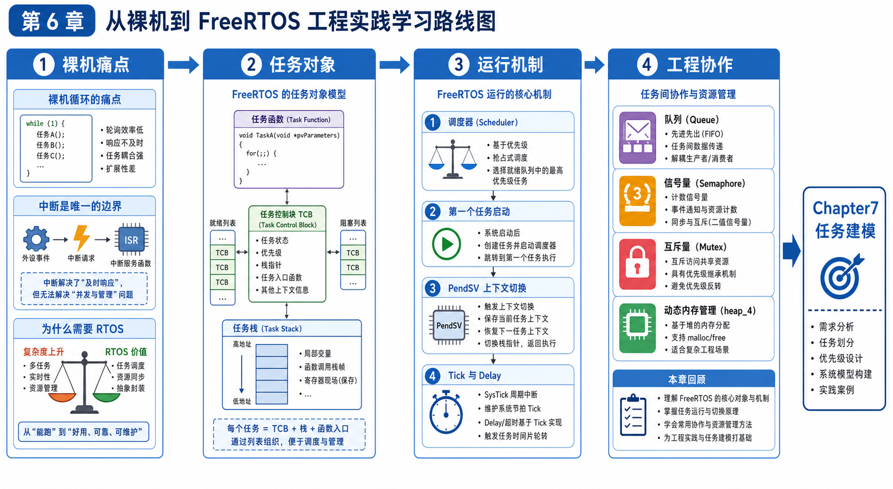

图后要留下一个判断：阅读路线不是按源码文件顺序硬读，而是按“现象 -> 机制 -> demo 证据 -> 源码入口 -> 项目判断”的顺序展开。后面每个小节都会回到这条线，解释 LED、SENSOR、COMM、LOG 为什么在某个时刻能跑、不能跑，或者跑得不够及时。

## 0 先把四个角色摆在桌面上

先把四个角色摆在桌面上，源码才不会飘。LED 负责告诉人系统还活着，SENSOR 负责周期采样，COMM 负责和外部设备交换数据，LOG 负责把关键事件慢慢打印出来。它们都不复杂，但节奏完全不同：LED 要稳定，SENSOR 要准时，COMM 要及时，LOG 天然慢。

RTOS 正是在这个场景里进入故事。裸机主循环喜欢把事情排成一队，排在前面的工作一慢，排在后面的工作就一起等；RTOS 则试图把不同节奏拆成不同任务，再用等待、唤醒和调度把它们重新组织起来。所有机制都放回这四个角色里讲，不让抽象名词离开项目现场。

| 角色 | 节奏 | 关心的证据 | 对应 FreeRTOS 机制 |
| --- | --- | --- | --- |
| LED | 固定周期、轻量动作 | 翻转时间是否稳定 | Delay、ready list、调度 |
| SENSOR | 固定周期、需要数据新鲜度 | 采样点是否漂移 | vTaskDelayUntil、任务栈、队列 |
| COMM | 外部事件驱动、响应压力高 | 收到事件到响应的时间 | 优先级、队列、PendSV |
| LOG | 慢 I/O、后台处理 | 队列积压和输出耗时 | 队列、互斥锁、低优先级任务 |

遇到术语时，都先放回这个项目现场。`ready` 不是一个状态单词，而是在问“谁现在有资格运行”；`delayed` 不是一个列表名字，而是在问“谁在等时间”；`queue` 不是孤立的 FIFO，而是在问“数据交给谁、谁需要被唤醒”；`mutex owner` 不是锁的装饰字段，而是在问“资源到底被谁拿着”。只要这个问题不丢，源码就不会变成一片热闹但无从下手的文字。

接下来会用到少量 C 代码，但代码只服务一个目标：把任务栈、TCB、ready list、PendSV、queue、mutex、heap_4 这些看不见的动作跑出证据。函数、数组、结构体和指针遇到时都会放回具体现场里讲；不需要先背完整 FreeRTOS API，也不需要一上来就读懂真实内核的所有宏和分支。

四个角色先带着一组最小运行假设上路：

| 角色 | 初始写法 | 会遇到的 RTOS 问题 | 第一类运行证据 |
| --- | --- | --- | --- |
| LED | 在主循环里按时间翻转 | Delay 到期后为什么不一定立刻运行 | `delay_enter_tick`、`wake_tick`、`toggle_tick` |
| SENSOR | 在主循环里周期采样 | 周期基准是否被慢任务拖走 | `planned_tick`、`run_tick`、`finish_tick` |
| COMM | 有事件就处理并响应 | 事件入队、任务唤醒、资源等待怎样分开 | `event_tick`、`wake_tick`、`owner`、`response_tick` |
| LOG | 串口慢慢输出日志 | 后台慢 I/O 为什么会反压关键任务 | `queue_count`、`sender_wait`、`hold_time` |

任务栈会解释 LED 或 COMM 为什么能暂停后继续；调度会解释 COMM 为什么 ready 后能压过 LED；队列会解释 SENSOR 和 COMM 怎样交接数据；mutex 会解释 LOG 为什么可能挡住 COMM 使用 UART；heap 会解释这些任务、队列和锁最终从哪块 RAM 里长出来。先把这个小项目放稳，每个机制才有落脚点。

阅读可以分两遍。第一遍从第 1 节读到第 14 节，只抓“现象 -> 机制 -> demo 证据”的主线，源码链接看到名字即可，不必展开每个函数。第二遍从第 19 节开始细读，再带着已经见过的现象去对账 `tasks.c`、`list.c`、`queue.c`、`port.c` 和 `heap_4.c`。这样读，源码不会在第一轮就把人压住，也不会在第二轮变成空洞的文件跳转。

## 1 从裸机主循环走到任务世界

先别急着把 RTOS 当成一堆 API。一个裸机主循环最开始确实简单：LED 翻转一下，SENSOR 采样一次，COMM 查一下消息，LOG 顺手打印几行。

问题会在工作量变多时露出来：主循环还是那一条路，但每个角色都开始想占用这条路。一个程序从“简单好懂”变成“谁都可能拖住谁”，后面的任务、Delay、队列和优先级才有存在的理由。

### 1.1 裸机主循环怎样被慢日志拖住

先别急着看 FreeRTOS。先看一个裸机项目最常见的失控方式：LED 心跳、SENSOR 采样、COMM 通信、LOG 日志都挤在同一个 main loop 里。每个函数单独看都不难，可它们排在一条路上以后，LOG 一慢，后续节奏就一起被拖走。

这种问题早期很隐蔽。你可能只看到 LED 偶尔晚一下，或者传感器采样不是严格 20 ms 一次。真正把时间戳打出来以后才会发现：不是 LED 自己慢，也不是 SENSOR 自己慢，而是主循环里有一个慢动作把整条执行线拉长了。

### 1.2 任务先理解成一条可以等待的执行流

任务可以先理解成一条“能等待、能回来继续跑”的执行流。LED 不必陪 LOG 打完整串日志，SENSOR 也不必因为串口慢就错过采样点。它们可以各自拥有等待点：该等时间的等时间，该等数据的等数据，该后台慢慢做的后台慢慢做。

严谨一点说，任务是内核管理的执行单位。它有入口函数，有自己的栈，有记录身份和现场的 TCB，也会出现在 ready、delayed 或 event wait 这类位置上。字段可以慢慢展开，眼前先抓住一件事：任务把“几个工作排队执行”改成了“几个执行流按规则前进”。

### 1.3 RTOS 要解决的是不同节奏互相拖拽

主循环最大的问题不是写法简单，而是它默认所有工作共享同一条时间线。慢 I/O、突发通信、周期采样、后台日志被串在一起以后，任何一个工作变慢，都会影响其他工作。项目越小，这种影响越容易被忽略；项目一复杂，它就会变成一堆“偶发抖动”。

RTOS 不是让 CPU 真的同时运行多个任务。单核 MCU 同一时刻仍然只执行一段代码。RTOS 的价值在于让任务能主动等待，让内核能记录谁 ready、谁 blocked、谁 delayed，再在合适的时候选择当前任务。换句话说，它把“谁在拖住谁”变成了可以观察、可以解释、可以调试的系统状态。

### 1.4 图 009：慢日志怎样拉长整条时间线

慢日志拖慢系统这件事，只看代码不一定直观，因为问题藏在时间线上。下面把 LOG 阻塞、LED 心跳和 SENSOR 采样放到同一条线上，你会看到真正变长的不是某个函数名，而是整轮主循环。


读这张图时先看 LOG 那一格，再看它后面被拉长的空白，最后看 LED 和 SENSOR 原本的节奏怎样跟着偏移。它们不是自己变慢，而是被同一条执行线拖住了。RTOS 要解决的第一件事，也就变得很具体：慢工作不能把所有工作都拴在同一条线上。

### 1.5 代码：让 LED 和 SENSOR 被 LOG 拖慢

这个现场用 [`v0_bare_loop`](F:/DevelopSrc/embedded_system_learning/tutorials/Chapter6_手撕FreeRTOS_底层核心机制/code/v0_bare_loop/demo.c) 观察。代码只保留一个现象：LOG 一旦阻塞，LED 和 SENSOR 的时间戳会一起被拖走。

```c
#include <stdio.h>

static int now_ms = 0;
static int next_led_ms = 0;
static int next_sensor_ms = 0;
static int log_burst_left = 0;

static void led_heartbeat(void) {
    if (now_ms >= next_led_ms) {
        printf("t=%03d LED toggle\n", now_ms);
        next_led_ms += 50;
    }
}

static void sensor_sample(void) {
    if (now_ms >= next_sensor_ms) {
        printf("t=%03d SENSOR sample\n", now_ms);
        next_sensor_ms += 20;
    }
}

static int log_flush(void) {
    if (now_ms == 40) {
        log_burst_left = 3;
    }
    if (log_burst_left > 0) {
        printf("t=%03d LOG flush chunk, main loop blocked 35ms\n", now_ms);
        log_burst_left--;
        return 35;
    }
    return 5;
}

int main(void) {
    while (now_ms <= 140) {
        led_heartbeat();
        sensor_sample();
        now_ms += log_flush();
    }
    puts("result: LED and SENSOR are delayed by slow LOG work");
    return 0;
}
```

这段代码不要先看函数写法，先看时间怎样被 `log_flush()` 改写。输出里只需要抓三类证据：LOG 从什么时候开始变慢，LED 下一次翻转被推到哪里，SENSOR 的采样节奏有没有跟着漂。

```output
t=000 LED toggle
t=000 SENSOR sample
t=020 SENSOR sample
t=040 SENSOR sample
t=040 LOG flush chunk, main loop blocked 35ms
t=075 LED toggle
t=075 SENSOR sample
t=075 LOG flush chunk, main loop blocked 35ms
t=110 LED toggle
t=110 SENSOR sample
t=110 LOG flush chunk, main loop blocked 35ms
result: LED and SENSOR are delayed by slow LOG work
```

读这份裸机输出时，先盯住 `t=040`。LOG 从这一刻进入 burst，每次 flush 都让主循环向后跳 35 ms。于是 LED 原本应该更接近 `t=050` 的下一次翻转，被推到了 `t=075`；SENSOR 也不再按 20 ms 的节奏稳定出现。

这个阶段还没有 FreeRTOS，也没有调度器。正因为没有任务、等待和调度，所有工作只能被同一个 `while` 串起来。先把这个痛点看清，看到 ready list、Delay、Tick 和优先级时，就知道它们不是凭空发明的概念，而是在修复这条被慢日志拖住的执行线。

### 1.6 先把裸机证据握稳

这里的源码入口很少，故意只留主循环。读者现在不需要找 FreeRTOS 文件，只需要先看清楚所有工作挤在同一条执行线上的后果。

| 源码入口 | 先抓住什么 | 解决的问题 |
| --- | --- | --- |
| `main loop` | `v0_bare_loop/demo.c` | 裸机里四类工作排在同一条执行线 |

先不急着进入 FreeRTOS 源码。现在只需要拿到一个扎实结论：主循环的问题不是“代码不努力”，而是所有工作共享一条执行线。先搭源码地图，知道每类机制大概住在哪个文件里以后，再回头看任务怎样把这条线拆开。

裸机证据要翻译成 RTOS 问题。`t=040 LOG flush chunk` 说明慢 I/O 占住了主循环；在 RTOS 里，这会变成“LOG 任务是否应该低优先级运行，或者通过队列异步输出”。

`t=075 LED toggle` 说明心跳被拖晚；在 RTOS 里，这会变成“LED 是否在 delayed list 到期后回 ready，以及回 ready 后何时 running”。`SENSOR sample` 被挤到同一个时间点，也会变成“周期任务是否应该用固定基准，而不是被上一轮处理耗时拖走”。

换句话说，裸机 demo 不是为了证明裸机不好，而是为了给 RTOS 机制准备问题。没有慢日志拖住全局节奏这个痛点，任务、队列、mutex 都会像凭空出现的复杂度；有了这个痛点，每个机制都能回到同一个项目里的某个卡点。

| 裸机输出 | 对应的 RTOS 问题 | 回看章节 |
| --- | --- | --- |
| `LOG flush chunk, main loop blocked 35ms` | 慢日志要不要拆到 LOG task，是否通过 queue 缓冲 | 第 11、12、26、27 节 |
| `LED toggle` 被推迟 | Delay 到期、ready、running 要分开观察 | 第 7、10、23、25 节 |
| `SENSOR sample` 与慢日志挤在一起 | 周期基准和工作耗时要分开记录 | 第 10、18、25 节 |
| COMM 响应被主循环拖住 | event、wake、scheduler、PendSV、mutex 要逐段证明 | 第 16、23、24、26、27、31 节 |

如果能把这几行说清楚，第一节就算读扎实了。后面机制再复杂，也可以倒回来问：它究竟在修复哪一种“大家挤在同一条执行线”的问题。

## 2 源码地图先搭起来，读代码才不迷路

FreeRTOS 源码不是按教材顺序摆放的。第一次打开它时，如果没有地图，很容易在 `tasks.c`、`queue.c`、`list.c` 和端口层之间来回迷路。源码地图要解决的不是“所有文件都讲一遍”，而是先把每个核心文件和一个具体问题对上号。

### 2.1 打开源码前先拿到地图

第一次打开 FreeRTOS 源码，很容易被文件名、宏和平台分支冲散。你想看“任务为什么能跑”，却被 `configUSE_...`、移植层条件编译和一堆列表操作带走。结果读了很多行，回头却说不清自己到底在证明哪件事。

所以先不追源码细节，先拿地图。地图的作用不是替代源码，而是把几个入口标出来：任务生命周期主要去哪看，任务位置主要去哪看，队列和锁主要去哪看，CPU 现场切换主要去哪看，动态内存主要去哪看。每次打开源码，都带着一个明确问题进去：我现在要证明哪一步。

### 2.2 五个核心文件各管一类问题

拿着“LED 心跳晚了”这个现象进源码时，最怕的是一打开文件就忘了自己在找什么。源码地图先帮你选门，而不是要求你把五个文件一次读完。

| 你正在追的问题 | 先敲哪扇门 | 这个文件主要管什么 |
| --- | --- | --- |
| 任务为什么创建、延时、切换状态 | `tasks.c` | 任务创建、Delay、调度选择、任务状态变化 |
| 任务此刻到底排在哪里 | `list.c` | ready、delayed、event wait 之间的位置移动 |
| 两个任务怎样交接数据或互相等待 | `queue.c` | 队列、信号量、mutex 这类协作对象 |
| 任务第一次怎样跑起来，切换时现场怎样换过去 | `port.c` | 任务栈初始化、启动第一个任务、PendSV 切换 |
| 动态创建对象时 RAM 从哪里来 | `heap_4.c` | 空闲块查找、切分、释放和合并 |

这五个文件不是孤立材料。它们会在一个任务的一生里不断接力：任务创建时走 `tasks.c` 和 `port.c`，进入 ready 时借助列表，发送数据时进入 `queue.c`，动态创建对象时又会走到 `heap_4.c`。把这条接力线看清，源码就不再像一片散开的森林。

### 2.3 源码地图是为了防止被宏和平台分支带散

没有地图时，很容易把源码当成“从上到下读完”的材料。FreeRTOS 第一轮不适合这么读。更好的方式是拿一个现象进源码：任务为什么没运行，为什么 Delay 后能回来，为什么队列满会阻塞，为什么 PendSV 后才真正切换。

地图就是为了把现象和文件连起来。它让源码变成证据，而不是让源码变成新的压力源。

### 2.4 图 010：从任务生命线反推源码文件

如果从文件名进图，五个文件会像五堆材料；如果从任务生命线进图，它们会变成一条路。任务创建和调度主要落在 tasks.c，位置移动落在 list.c，数据和锁落在 queue.c，现场切换落在 port.c，动态对象落在 heap_4.c。问题足够具体时，文件数量就不会那么吓人。

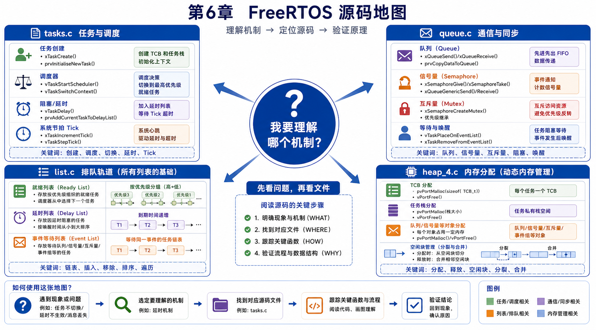

读这张源码地图时，先不要按文件名从左到右背。先拿一个现象站到图外面：LED 心跳晚了，入口通常在 `tasks.c` 的 Delay 和调度路径；LOG 队列满了，入口通常在 `queue.c` 的 send/receive 路径；切换后 HardFault，入口通常在 `port.c` 的 PendSV 保存和恢复。地图不是答案，但它能让问题有第一跳。

### 2.5 代码如何组织：把多个 demo 连成一条线

这些 demo 更像一串可运行的路标。总脚本会把裸机、任务栈、TCB、链表、创建、调度、启动、PendSV、Delay、队列、mutex 和 heap 依次跑出来，每个版本只回答一个小问题。输出不用一次吃完；每一段输出都会在后文变成解释现场的证据。

```powershell
powershell -ExecutionPolicy Bypass -File F:\DevelopSrc\embedded_system_learning\tutorials\Chapter6_手撕FreeRTOS_底层核心机制\code\run_demo.ps1
```

把输出贴到结构图上时，先不要急着分类。看到 `LED -> delayed`，就问 LED 为什么离开 ready、什么时候回来；看到 `COMM wake`，就问它只是获得运行资格，还是已经真正 running；看到 `heap fail`，就问总剩余和最大连续块分别是多少。这样整章就不会变成一串零散 demo，而会变成一条可追踪的任务生命线。

### 2.6 第一轮源码只找入口，不追分支

这一步先给一张入口地图，目的不是让你立刻打开所有源码。它只是告诉你：后面每次遇到一个现象，应该从哪个文件、哪个函数开始找第一条证据。

| 源码入口 | 先抓住什么 | 解决的问题 |
| --- | --- | --- |
| [`tasks.c:TCB_t`](F:/DevelopSrc/embedded_system_learning/reference/rtos_src/FreeRTOS-Kernel/tasks.c:375) | 任务身份、现场、优先级、列表节点 | 任务为什么是内核对象 |
| [`tasks.c:xTaskCreateStatic()`](F:/DevelopSrc/embedded_system_learning/reference/rtos_src/FreeRTOS-Kernel/tasks.c:1332) | 应用材料怎样变成任务对象 | 创建成功为什么不等于运行 |
| [`tasks.c:vTaskSwitchContext()`](F:/DevelopSrc/embedded_system_learning/reference/rtos_src/FreeRTOS-Kernel/tasks.c:5120) | ready 集合怎样变成当前任务选择 | 调度只负责选择，不负责保存现场 |
| [`tasks.c:vTaskDelay()`](F:/DevelopSrc/embedded_system_learning/reference/rtos_src/FreeRTOS-Kernel/tasks.c:2469) / [`tasks.c:xTaskIncrementTick()`](F:/DevelopSrc/embedded_system_learning/reference/rtos_src/FreeRTOS-Kernel/tasks.c:4736) | 任务怎样离开 ready，又怎样到期回来 | Delay 不是忙等 |
| [`list.c:vListInsert()`](F:/DevelopSrc/embedded_system_learning/reference/rtos_src/FreeRTOS-Kernel/list.c:139) / [`list.c:uxListRemove()`](F:/DevelopSrc/embedded_system_learning/reference/rtos_src/FreeRTOS-Kernel/list.c:217) | 任务节点怎样进入和离开位置 | ready、delayed、event wait 都能追踪 |
| [`queue.c:xQueueGenericSend()`](F:/DevelopSrc/embedded_system_learning/reference/rtos_src/FreeRTOS-Kernel/queue.c:949) / [`queue.c:xQueueReceive()`](F:/DevelopSrc/embedded_system_learning/reference/rtos_src/FreeRTOS-Kernel/queue.c:1509) | 数据进入、离开、等待者唤醒 | 队列同时管数据线和任务线 |
| [`queue.c:xQueueSemaphoreTake()`](F:/DevelopSrc/embedded_system_learning/reference/rtos_src/FreeRTOS-Kernel/queue.c:1795) | mutex owner 和等待者怎样处理 | 高优先级任务为什么会被资源挡住 |
| [`port.c:pxPortInitialiseStack()`](F:/DevelopSrc/embedded_system_learning/reference/rtos_src/FreeRTOS-Kernel/portable/GCC/ARM_CM4F/port.c:202) | 第一次运行前栈帧怎样准备 | 任务不是普通函数调用 |
| [`port.c:xPortPendSVHandler()`](F:/DevelopSrc/embedded_system_learning/reference/rtos_src/FreeRTOS-Kernel/portable/GCC/ARM_CM4F/port.c:504) | 当前 PSP 怎样保存，下一个 PSP 怎样恢复 | 选择结果怎样变成真正运行 |
| [`heap_4.c:pvPortMalloc()`](F:/DevelopSrc/embedded_system_learning/reference/rtos_src/FreeRTOS-Kernel/portable/MemMang/heap_4.c:173) / [`heap_4.c:vPortFree()`](F:/DevelopSrc/embedded_system_learning/reference/rtos_src/FreeRTOS-Kernel/portable/MemMang/heap_4.c:354) | 空闲块怎样查找、切分、释放、合并 | 动态对象为什么受 RAM 形状限制 |

它不是源码目录，而是一组查问题的入口。比如 LED 延迟异常时，先看 Delay 和 Tick 路径；队列满导致发送方卡住时，先看 send/receive 路径；切换后 HardFault 时，先看 PendSV 保存和恢复现场的路径。这样读源码不会从“我要读懂整个内核”开始，而是从“我要证明这个动作在哪里发生”开始。

正文会交替出现两种材料：小 demo 负责把一个动作放大，源码入口负责把这个动作对回真实 FreeRTOS。每次打开源码前，把三个小问题放在手边：

| 三问 | 例子 | 读到哪里可以先停 |
| --- | --- | --- |
| 我现在要证明哪个动作 | 证明 Delay 把 LED 从 ready 移到 delayed | 找到当前任务离开 ready、进入等待位置 |
| 这个动作改变了哪个对象 | 改变 LED 的列表位置和唤醒 tick | 找到列表插入或 TCB 字段变化 |
| 这个动作会在日志里留下什么证据 | `LED delayed -> ready`、`wake_tick=...` | 能把源码动作翻译成运行证据 |

这三个问题把源码阅读压到合适的尺寸。`tasks.c` 很大，第一次打开时不需要一口气读懂调度器；先证明 LED 为什么从 delayed 回 ready，就已经足够推进主线。等“对象在哪里、谁把它移走、谁又把它送回来”这条动作链站稳以后，再看 `configUSE_TIME_SLICING`、`configUSE_MUTEXES`、`portYIELD_FROM_ISR` 这类配置宏，才更容易判断它们改变的是哪条边界。

## 3 任务是什么：一段能暂停再继续的执行流

任务不是“多写几个函数”这么简单。它真正解决的是：函数执行到一半等待时，CPU 能不能去做别的事，等条件满足后又能不能从原处继续。LED、SENSOR、COMM、LOG 四个角色会一起把“可暂停、可恢复”的直觉立起来。

### 3.1 为什么任务不是被反复调用的函数

先把普通函数和任务分开。普通函数是一次调用：调用者进来，函数跑完，控制权返回调用者。LED 如果只是普通函数，它每次都从入口开始执行，本轮局部现场也会随着调用链结束而消失。

任务不是这样。LED 任务进入自己的循环后，会长期存在。它可以翻转 LED，然后调用 Delay 让出 CPU；等时间到了、调度器再次选择它，它不是从整个程序开头重来，而是从等待点后面继续走。这个“能从原处继续”，就是任务栈和上下文切换要解决的问题。

### 3.2 任务由入口、参数、栈和现场组成

回到 LED 任务这个例子：它不是每 50 ms 被 main 重新调用一次，而是停在 Delay 后面，等时间到了再从那里继续。为了做到这一点，任务要有入口、参数、栈和现场。入口函数决定任务第一次从哪里开始，参数决定任务拿到什么上下文，栈保存局部变量和调用链，TCB 记录栈顶、优先级和列表位置。函数名只是起点，任务对象才是内核真正管理的单位。

这个定义如果听起来有点多，可以先压成一句话：任务是一段能被暂停、保存、恢复的执行流。接下来所有字段和源码，都围绕这句话展开。

先用一张小图把“普通函数”和“任务”分开。普通函数的现场跟着调用者走，任务的现场跟着任务对象走；这个差别决定了为什么要有任务栈、TCB 和 PendSV。

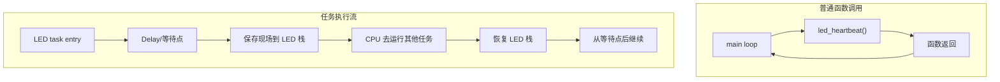
```mermaid
flowchart TB
    subgraph Bare["普通函数调用"]
        A["main loop"] --> B["led_heartbeat()"]
        B --> C["函数返回"]
        C --> A
    end
    subgraph RTOS["任务执行流"]
        D["LED task entry"] --> E["Delay/等待点"]
        E --> F["保存现场到 LED 栈"]
        F --> G["CPU 去运行其他任务"]
        G --> H["恢复 LED 栈"]
        H --> I["从等待点后继续"]
    end
```

左边的普通函数跑完就回到调用者，现场跟着调用链一起消失；右边的任务则在等待点附近保存现场，之后再恢复回来。等读到 TCB 时，栈顶字段要记录的正是这条恢复路径。

### 3.3 暂停再继续需要自己的现场空间

系统需要同时推进多个工作，但单核 CPU 同一时刻只能执行一个。任务机制并不是制造多个 CPU，而是让每个工作有自己的现场，暂时不需要 CPU 时就让出来，需要继续时再被恢复。这样，LED 等时间时，SENSOR 可以采样；LOG 慢慢输出时，COMM 不必一直被它拖住。

从裸机主循环走到任务世界，关键变化就是这一点：等待不再是卡住整条主循环，而是某个任务的位置变化。

### 3.4 图 002：任务栈保存的是可恢复现场

图里其实有两层栈在对比：普通函数栈跟着调用链生灭，任务栈却长期跟着任务对象存在。箭头指向栈顶时，真正要记住的是“恢复哪个栈，就回到哪个任务的现场”。


把它和刚才的裸机时间线连起来，差别会更清楚。裸机里，所有工作挤在 main 的调用链上；任务世界里，每个任务有自己的栈，调度器只是把 CPU 暂时交给某个栈对应的执行流。看起来只是多了几块内存，工程含义却很大：现场不再只有一份。

### 3.5 代码：两个任务怎样拥有各自的栈

现在别急着把任务栈想成一整套硬件细节，先看两个地址就够了：每个任务自己的 stack base，以及调度器将来要恢复的 top_of_stack。这两个地址在 [`v1_task_stack`](F:/DevelopSrc/embedded_system_learning/tutorials/Chapter6_手撕FreeRTOS_底层核心机制/code/v1_task_stack/demo.c) 里会直接打印出来。

```c
#include <stdint.h>
#include <stdio.h>

typedef void (*TaskEntry)(void *);

typedef struct {
    const char *name;
    TaskEntry entry;
    void *parameter;
    uint32_t stack[8];
    uint32_t *top_of_stack;
} MiniTaskStack;

static void led_task(void *parameter) {
    printf("run task=LED parameter=%s\n", (const char *)parameter);
}

static void sensor_task(void *parameter) {
    printf("run task=SENSOR period_ms=%d\n", *(int *)parameter);
}

static void initialise_stack(MiniTaskStack *task, const char *name, TaskEntry entry, void *parameter) {
    task->name = name;
    task->entry = entry;
    task->parameter = parameter;
    task->top_of_stack = &task->stack[7];
    task->stack[7] = (uint32_t)(uintptr_t)entry;
    task->stack[6] = (uint32_t)(uintptr_t)parameter;
    printf("init %-6s stack_base=%p top=%p entry_slot=0x%08lx parameter_slot=0x%08lx\n",
           task->name,
           (void *)&task->stack[0],
           (void *)task->top_of_stack,
           (unsigned long)task->stack[7],
           (unsigned long)task->stack[6]);
}

int main(void) {
    MiniTaskStack led;
    MiniTaskStack sensor;
    int sensor_period = 20;

    initialise_stack(&led, "LED", led_task, "heartbeat");
    initialise_stack(&sensor, "SENSOR", sensor_task, &sensor_period);

    puts("scheduler restores LED stack");
    led.entry(led.parameter);
    puts("scheduler restores SENSOR stack");
    sensor.entry(sensor.parameter);
    return 0;
}
```

这段模型跑起来以后，先不要看地址具体数值，因为不同机器会不一样。真正要看的，是 LED 和 SENSOR 各自有一组 `stack_base/top`，以及调度器恢复哪一组现场，就进入哪一个任务。

```output
init LED    stack_base=<addr> top=<addr> entry_slot=<entry> parameter_slot=<parameter>
init SENSOR stack_base=<addr> top=<addr> entry_slot=<entry> parameter_slot=<parameter>
scheduler restores LED stack
run task=LED parameter=heartbeat
scheduler restores SENSOR stack
run task=SENSOR period_ms=20
```

读任务栈输出时先抓两个点。第一，LED 和 SENSOR 有不同的 `stack_base` 和 `top`，说明它们不是共享同一份现场。第二，调度器“恢复 LED 栈”之后跑 LED，“恢复 SENSOR 栈”之后跑 SENSOR，说明任务入口和参数已经被放进各自的初始现场里。

真实 Cortex-M 不会像 demo 这样直接调用 `led.entry()`，它会通过寄存器、异常返回和栈帧完成恢复。demo 先把硬件细节拿掉，只保留方向：任务栈里准备好入口和参数，调度器恢复对应现场，任务就像从那里开始运行。

### 3.6 回到 FreeRTOS：初始现场在哪里摆好

刚才的 demo 已经说明任务要有自己的现场。回到 FreeRTOS 源码时，只追三个问题：初始现场在哪里摆好，谁调用端口层摆现场，摆好的栈顶最后交给谁保存。

| 源码入口 | 先抓住什么 | 解决的问题 |
| --- | --- | --- |
| [`port.c:pxPortInitialiseStack()`](F:/DevelopSrc/embedded_system_learning/reference/rtos_src/FreeRTOS-Kernel/portable/GCC/ARM_CM4F/port.c:202) | 入口地址、参数、初始栈顶 | 任务第一次运行前，现场怎样被摆好 |
| [`tasks.c:prvInitialiseNewTask()`](F:/DevelopSrc/embedded_system_learning/reference/rtos_src/FreeRTOS-Kernel/tasks.c:1816) | 创建任务时怎样调用端口层初始化栈 | 任务函数、参数和栈怎样连起来 |
| [`tasks.c:TCB_t`](F:/DevelopSrc/embedded_system_learning/reference/rtos_src/FreeRTOS-Kernel/tasks.c:375) | TCB 里保存的栈顶字段 | 为什么任务栈最终要被 TCB 记住 |

对账 `pxPortInitialiseStack()` 时，先沿着“第一次现场怎样摆好”这条线走。入口函数放到哪里，参数放到哪里，最后返回的栈顶指针交给谁，这三件事能对上，demo 和真实源码就已经接上了。

最容易发生的误判，是看到任务入口函数，就以为任务是被普通函数调用起来的。源码正好能纠正这个直觉：任务入口地址被放进栈帧，栈顶被记录进 TCB，调度器未来恢复这个栈时，CPU 才像“进入了任务函数”。这和 `main()` 里直接调用 `LedTask()` 完全不是一回事。

把这一步放回项目里，调试任务启动问题时就有了三个观察点：任务入口是否正确，参数是否正确，任务栈顶是否落在自己的栈数组范围内。如果任务第一次运行就 HardFault，任务函数第一行只是暴露点，初始栈帧和 TCB 里的栈顶同样要回头核对。

先不急着背 `TCB_t` 字段。更重要的是把“任务”和“普通函数”真正分开：普通函数依附在调用链上，任务依附在自己的栈和可恢复现场上。

这个心智模型有没有站稳，可以用几个项目问题来检验：

| 问题 | 可以形成的判断 |
| --- | --- |
| 为什么 LED 任务 Delay 后不是从头重新开始 | 因为它的现场保存在自己的任务栈里，恢复时会回到等待点之后 |
| 为什么两个任务使用同一个入口函数也能区分 | 因为每个任务有自己的参数、栈和后续 TCB 资料 |
| 为什么栈顶指针是源码里的关键证据 | 因为调度和 PendSV 最终要靠它恢复对应任务现场 |
| 如果任务恢复后 HardFault，第一轮看哪里 | 先看该任务栈范围、初始栈帧和栈顶是否被破坏 |

能把这些问题说顺，任务就不再只是一个函数名。下一节看 TCB 时，要带着这个前提：内核需要一份资料，把这段可恢复的执行流长期记住。

## 4 TCB 是什么：内核给每个任务准备的档案袋

任务能被调度，前提是内核能认出它、记住它、移动它。TCB 就是这份资料的集中位置，但读它时不需要一上来背字段。先把它当成任务档案袋：身份、现场、优先级和排队位置都从这里开始。

### 4.1 内核怎样分清 LED、SENSOR、COMM 和 LOG

上一节我们已经知道，任务不只是一段函数代码。LED 和 LOG 可能使用同一个任务入口模板，SENSOR 和 COMM 也可能都带参数启动；如果内核只记得函数地址，它根本分不清“现在该恢复谁的栈”“谁的优先级更高”“谁正在队列里等待”。

所以任务进入内核以后，需要一份稳定资料。你可以把它先理解成任务档案袋：袋子外面写着任务名，里面放着栈顶、优先级、列表节点、运行统计以及调试会用到的其他信息。调度器、Delay、队列、PendSV 都会反复翻这个档案袋。

### 4.2 TCB 是任务的身份、现场和排队资料

如果调试器里只看到一串函数地址，你很难判断 LED、COMM、LOG 谁是谁。TCB 是 Task Control Block，任务控制块，它把任务变成内核能识别、能移动、能恢复的对象。任务名帮助人调试，栈顶帮助 PendSV 保存和恢复现场，优先级帮助调度器做选择，列表节点说明任务现在排在哪个队伍里。

刚接触 TCB 时，最省力的读法不是背字段，而是按用途分组：身份信息回答“它是谁”，现场信息回答“它从哪里恢复”，调度信息回答“它有多急”，位置信息回答“它现在在哪里”。

把 TCB 放在中心，会更容易理解为什么这么多机制都要碰它。

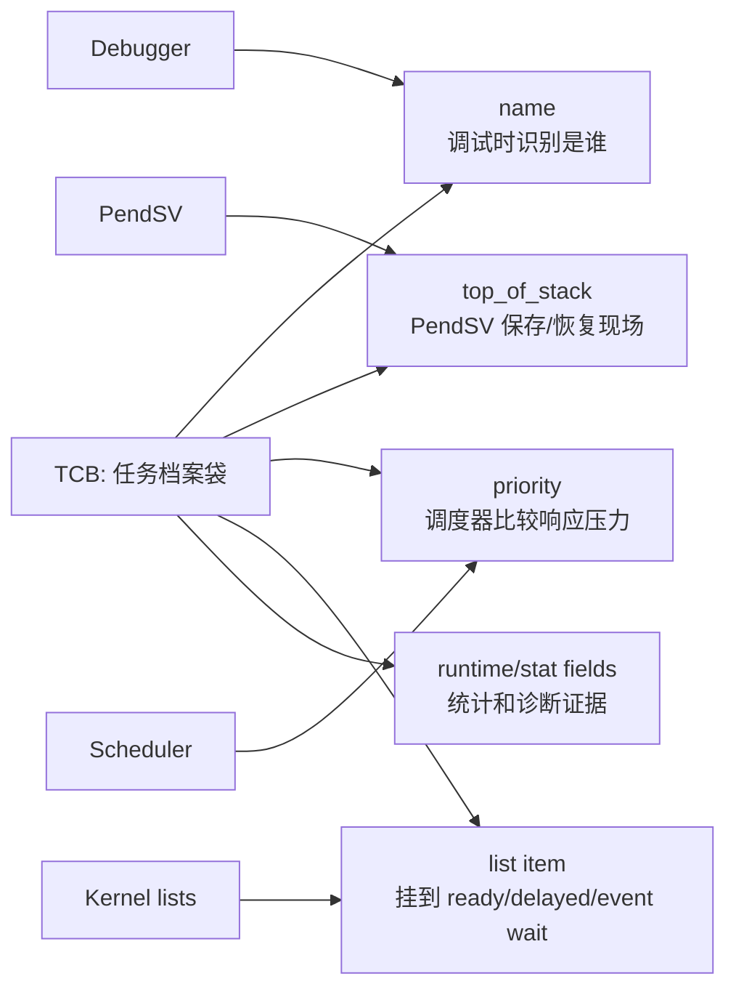
```mermaid
flowchart LR
    T["TCB: 任务档案袋"]
    T --> N["name\n调试时识别是谁"]
    T --> S["top_of_stack\nPendSV 保存/恢复现场"]
    T --> P["priority\n调度器比较响应压力"]
    T --> L["list item\n挂到 ready/delayed/event wait"]
    T --> R["runtime/stat fields\n统计和诊断证据"]
    Scheduler["Scheduler"] --> P
    PendSV["PendSV"] --> S
    Lists["Kernel lists"] --> L
    Debugger["Debugger"] --> N
```

TCB 的字段不适合按声明顺序硬背，更要看“谁使用它”。调度器主要看优先级和 ready 位置，PendSV 主要看栈顶，列表代码主要看列表项，调试器先看名字和统计信息。字段一旦和使用者连起来，TCB 就从大结构体变成了任务对象的证据中心。

### 4.3 调度和切换都需要一个稳定任务对象

调度、切换、等待、唤醒都需要快速找到任务资料。比如 Tick 到期时，内核要把某个任务从 delayed list 移回 ready list；PendSV 切换时，要把当前 PSP 保存进当前任务的 TCB，再从下一个任务的 TCB 里取出栈顶。没有 TCB，这些动作就只能散落在各处，系统很快会失去可管理性。

从工程角度看，TCB 还提供了一条调试入口。任务名乱码、优先级不对、栈顶越界、列表节点异常，这些现象常常说明任务对象附近的内存已经被破坏。TCB 不只是内核内部资料，也是排查任务问题时最早要看的证据之一。

### 4.4 图 005：TCB 字段按用途分组看

把 TCB 拆成几组以后，它就不再像一张字段清单。任务名和优先级帮助调试，栈顶字段连接现场，列表节点说明这个任务现在排在哪里。


把 LED 任务代进去复述一遍，图就落地了：任务名让调试器显示它是 LED，栈顶指向 LED 自己的现场，优先级决定它和 LOG、SENSOR 的竞争关系，列表节点说明它此刻是在 ready、delayed 还是 event wait 里。能这么复述，TCB 就不再是一个抽象结构体。

### 4.5 代码：MiniTCB 先保留四个关键字段

TCB 的最小形状可以先看 [`v2_tcb`](F:/DevelopSrc/embedded_system_learning/tutorials/Chapter6_手撕FreeRTOS_底层核心机制/code/v2_tcb/demo.c)。`MiniTCB` 故意很小，只让任务名、优先级、栈顶和列表节点先站出来。

```c
#include <stdint.h>
#include <stdio.h>

typedef struct MiniListItem {
    const char *owner_name;
    struct MiniListItem *next;
} MiniListItem;

typedef struct {
    const char *name;
    uint32_t *top_of_stack;
    unsigned priority;
    MiniListItem state_item;
} MiniTCB;

static void print_tcb(const MiniTCB *tcb) {
    printf("TCB name=%-7s priority=%u top_of_stack=%p list_owner=%s\n",
           tcb->name,
           tcb->priority,
           (void *)tcb->top_of_stack,
           tcb->state_item.owner_name);
}

int main(void) {
    uint32_t led_stack[8];
    uint32_t log_stack[8];

    MiniTCB led = { "LED", &led_stack[7], 2, { "LED", 0 } };
    MiniTCB log = { "LOG", &log_stack[7], 1, { "LOG", 0 } };

    print_tcb(&led);
    print_tcb(&log);
    puts("TCB is the scheduler handle: identity + stack + priority + list hook");
    return 0;
}
```

运行输出只看三类信息：任务名让内核知道是谁，优先级让调度器知道谁更急，栈顶和列表节点让后面的切换、排队有地方落脚。

```output
TCB name=LED     priority=2 top_of_stack=<addr> list_owner=LED
TCB name=LOG     priority=1 top_of_stack=<addr> list_owner=LOG
TCB is the scheduler handle: identity + stack + priority + list hook
```

TCB 输出把四组信息压到一行里。`name` 是身份，`priority` 是调度依据，`top_of_stack` 连接任务栈，`list_owner` 提醒我们这个任务以后会通过列表节点被放进 ready、delayed 或 event wait。这样一来，上一节的任务栈和下一节的内核列表就接上了。

真实的 `TCB_t` 会比 `MiniTCB` 大得多，因为 FreeRTOS 还要处理配置项、运行统计、任务通知、互斥锁优先级继承等边界。第一轮不用贪多，先确认这四类字段如何支撑“任务是内核对象”。

### 4.6 回到 tasks.c：TCB_t 怎样保存任务资料

看 `TCB_t` 之前，先把它当成调试器里那张任务资料卡。第一轮只找和当前故事有关的字段：名字、优先级、栈顶、列表节点。

| 源码入口 | 先抓住什么 | 解决的问题 |
| --- | --- | --- |
| [`tasks.c:TCB_t`](F:/DevelopSrc/embedded_system_learning/reference/rtos_src/FreeRTOS-Kernel/tasks.c:375) | 任务身份、栈顶、优先级、列表节点 | 把“任务”变成内核能管理的对象 |
| [`tasks.c:prvInitialiseNewTask()`](F:/DevelopSrc/embedded_system_learning/reference/rtos_src/FreeRTOS-Kernel/tasks.c:1816) | TCB 字段在创建时怎样被填好 | 证明字段不是摆设，而是创建路径的一部分 |
| [`include/list.h:ListItem_t`](F:/DevelopSrc/embedded_system_learning/reference/rtos_src/FreeRTOS-Kernel/include/list.h:144) | TCB 里的列表节点是什么形状 | 解释任务为什么能挂到 ready、delayed、event wait |

对账 `TCB_t` 时，建议把源码旁边分成四列做笔记：身份、现场、调度、位置。看不懂的配置字段先放到旁边，不要让它打断主线。等读到队列、mutex 或任务通知，再回头补这些字段的作用。

读源码时可以拿 LED 任务做一遍“档案袋检查”。如果调试器里任务名不对，先看身份字段；如果切换后崩溃，先看栈顶字段和栈范围；如果 COMM 总是压住 LOG，先看优先级；如果 LED 没输出，先看它的列表节点到底挂在 delayed 还是 ready。这样 `TCB_t` 就不再是一大块结构体，而是一组排查入口。

TCB 不是越多字段越难懂。它难，是因为它横跨了多个机制：栈、调度、列表、通知、运行统计等都要在这个对象里找到落点。和当前主线有关的字段先站出来，剩下的字段留给后续专题，阅读节奏会稳很多。

走到这里，TCB 不应该还是一个“大结构体”。它应该变成脑子里的任务档案袋：出问题时，这份档案里的身份、位置、调度和现场信息，会分别证明任务是谁、在哪里、凭什么被调度、从哪里恢复。

| 问题 | 可以形成的判断 |
| --- | --- |
| 内核为什么不能只记任务函数地址 | 因为函数地址不能表达任务身份、优先级、栈顶和列表位置 |
| `top_of_stack` 和 PendSV 有什么关系 | PendSV 保存和恢复现场时，需要从 TCB 里取用栈顶 |
| 任务名有什么工程价值 | 任务名让调试器、日志和运行统计能把现象绑定到具体任务 |
| 列表节点为什么放在 TCB 附近 | 任务位置变化要能从列表项回到任务对象本身 |

这些问题把 TCB 从“结构体字段”拉回“任务资料”。有了这份资料，下一步才能讨论任务在系统里到底挂在哪里。

## 5 内核列表是什么：任务在系统里的位置地图

任务没输出，不代表它消失了。它可能在 ready list 等 CPU，可能在 delayed list 等时间，也可能在 event wait list 等队列或锁。列表把“任务为什么不运行”拆成一个更可查的问题：任务现在到底在哪里。

### 5.1 任务没输出时先问它在哪里

任务没有打印日志时，最容易冒出来的一句话是“任务卡住了”。这句话不够精确，也很难修改。更好的问法是：它在哪里。它可能已经 ready，只是优先级不够；可能正在 delayed list 里等时间；也可能在队列、信号量或 mutex 的等待列表里。

这个问法会立刻改变排查方式。ready 的任务要看调度，delayed 的任务要看 Tick，event wait 的任务要看谁负责唤醒它。只说“卡住”，所有方向都会混在一起。

### 5.2 ready、delayed、event wait 是三类位置

内核列表记录任务位置。ready list 表示任务已经具备竞争 CPU 的资格，delayed list 表示任务正在等时间，event wait list 表示任务正在等某个事件或资源。任务状态变化，本质上常常就是从一个列表移到另一个列表。

内核里的“列表”先不要理解成数据结构课里的链表题。更重要的是位置语义：一个任务在哪个列表，就说明它现在因为什么理由不能或可以运行。

### 5.3 状态变化本质上是列表移动

调度器、Tick、队列和锁都要快速找到相关任务。调度器从 ready list 里选，Tick 从 delayed list 里找到期任务，队列和 mutex 从等待列表里唤醒任务。统一列表让这些移动有共同语言。

这也是为什么前面的 TCB 里要有列表节点。任务本体是 TCB，位置则由 TCB 里的列表项挂到不同列表上。对象和位置分开，系统才能既知道“它是谁”，也知道“它在哪里”。

任务位置可以画成一张状态图。它不是 FreeRTOS 的全部状态机，但足够解释入门阶段最常见的“任务为什么没运行”。

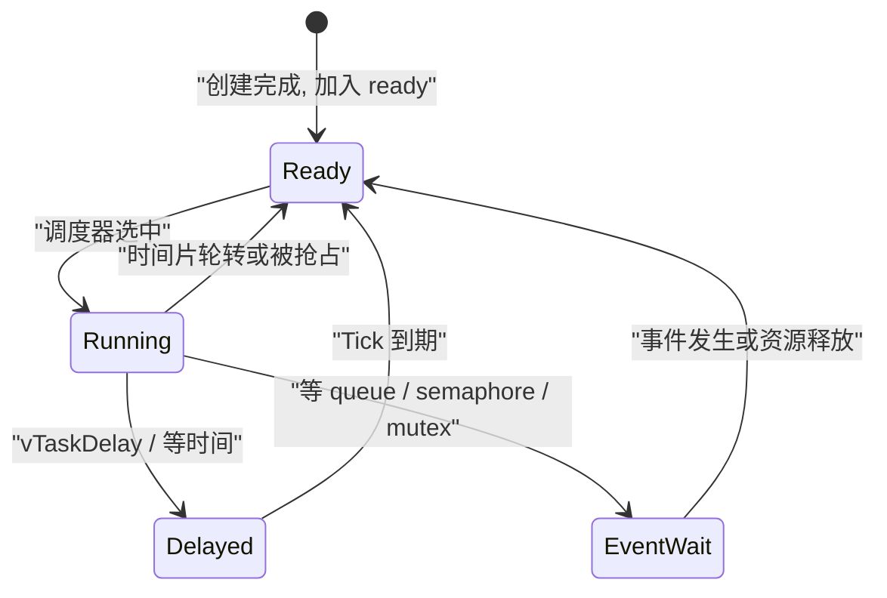
```mermaid
stateDiagram-v2
    [*] --> Ready: "创建完成, 加入 ready"
    Ready --> Running: "调度器选中"
    Running --> Delayed: "vTaskDelay / 等时间"
    Running --> EventWait: "等 queue / semaphore / mutex"
    Delayed --> Ready: "Tick 到期"
    EventWait --> Ready: "事件发生或资源释放"
    Running --> Ready: "时间片轮转或被抢占"
```

先不用纠结状态名是否覆盖所有边界，抓住三类位置就够用：ready 表示有资格竞争 CPU，delayed 表示等时间，event wait 表示等事件或资源。任务没输出时，先找它在哪个位置，再决定看 Tick、队列、mutex 还是调度。

### 5.4 图 011：同一个任务怎样换位置

这张图的主角不是链表指针，而是任务位置。一个任务从 ready 离开，进入 delayed 或 event wait，问题就从“代码是不是没跑”变成了“它到底在哪个列表里”。


有了这张位置图，排查任务不运行时就不必到处猜。先找任务对象，再看它挂在哪个列表；列表位置确定以后，下一步才知道该看调度、Tick、队列还是锁。这个顺序能避免一上来就翻一大堆无关源码。

### 5.5 代码：插入和移除就是位置变化

任务位置的移动可以用 [`v3_kernel_list`](F:/DevelopSrc/embedded_system_learning/tutorials/Chapter6_手撕FreeRTOS_底层核心机制/code/v3_kernel_list/demo.c) 看清。把任务当成会移动的卡片：插入就是到达某个位置，移除就是离开某个位置。

```c
#include <stdio.h>

typedef struct MiniTask {
    const char *name;
    struct MiniTask *next;
} MiniTask;

typedef struct {
    const char *name;
    MiniTask *head;
} MiniList;

static void list_init(MiniList *list, const char *name) {
    list->name = name;
    list->head = 0;
    printf("%s: empty\n", list->name);
}

static void list_insert_front(MiniList *list, MiniTask *task) {
    task->next = list->head;
    list->head = task;
    printf("move %-6s -> %s\n", task->name, list->name);
}

static void list_remove(MiniList *list, MiniTask *task) {
    MiniTask **cursor = &list->head;
    while (*cursor) {
        if (*cursor == task) {
            *cursor = task->next;
            task->next = 0;
            printf("remove %-6s <- %s\n", task->name, list->name);
            return;
        }
        cursor = &(*cursor)->next;
    }
}

static void list_print(const MiniList *list) {
    const MiniTask *task = list->head;
    printf("%s:", list->name);
    if (!task) {
        printf(" <empty>");
    }
    while (task) {
        printf(" %s", task->name);
        task = task->next;
    }
    printf("\n");
}

int main(void) {
    MiniList ready;
    MiniList delayed;
    MiniList event_wait;
    MiniTask led = { "LED", 0 };
    MiniTask sensor = { "SENSOR", 0 };
    MiniTask log = { "LOG", 0 };

    list_init(&ready, "ready");
    list_init(&delayed, "delayed");
    list_init(&event_wait, "event_wait");
    list_insert_front(&ready, &led);
    list_insert_front(&ready, &sensor);
    list_insert_front(&ready, &log);
    list_print(&ready);

    list_remove(&ready, &sensor);
    list_insert_front(&delayed, &sensor);
    list_remove(&ready, &log);
    list_insert_front(&event_wait, &log);

    list_print(&ready);
    list_print(&delayed);
    list_print(&event_wait);
    return 0;
}
```

输出要按“位置变化”读，不要按普通链表操作读。每出现一行 `move`，就问这个任务离开了哪个候选集合，又进入了哪个等待或就绪集合。

```output
ready: empty
delayed: empty
event_wait: empty
move LED    -> ready
move SENSOR -> ready
move LOG    -> ready
ready: LOG SENSOR LED
remove SENSOR <- ready
move SENSOR -> delayed
remove LOG    <- ready
move LOG    -> event_wait
ready: LED
delayed: SENSOR
event_wait: LOG
```

读列表输出时按“位置变化”走。最开始 LED、SENSOR、LOG 都进入 ready，说明它们都有运行资格；随后 SENSOR 被移到 delayed，说明它暂时在等时间；LOG 被移到 event_wait，说明它在等事件或资源。最后 ready 里只剩 LED，所以如果此刻 CPU 要选任务，LED 至少具备资格。

这个 demo 故意没有讲复杂链表边界。它先固定一个调试习惯：任务不输出时，先把它挂在哪个列表说清楚，再猜代码跑到哪里。位置对了，原因就会缩小很多。

### 5.6 回到 list.c：插入和移除怎样表达位置

链表源码不要当成数据结构复习题来读。这里真正要抓的是“任务位置怎样变化”：进入列表、离开列表、再通过 owner 找回对应任务。

| 源码入口 | 先抓住什么 | 解决的问题 |
| --- | --- | --- |
| [`include/list.h:List_t`](F:/DevelopSrc/embedded_system_learning/reference/rtos_src/FreeRTOS-Kernel/include/list.h:172) | 列表头和当前索引 | 理解 ready/delayed/event wait 都是位置容器 |
| [`include/list.h:ListItem_t`](F:/DevelopSrc/embedded_system_learning/reference/rtos_src/FreeRTOS-Kernel/include/list.h:144) | 任务挂入列表的节点 | 理解任务不是复制进列表，而是用节点挂进去 |
| [`list.c:vListInitialise()`](F:/DevelopSrc/embedded_system_learning/reference/rtos_src/FreeRTOS-Kernel/list.c:49) | 空列表怎样初始化 | 读懂“没有任务等待”在数据结构里长什么样 |
| [`list.c:vListInsert()`](F:/DevelopSrc/embedded_system_learning/reference/rtos_src/FreeRTOS-Kernel/list.c:139) | 节点怎样进入有序列表 | 任务进入 delayed 或等待列表时的位置变化 |
| [`list.c:uxListRemove()`](F:/DevelopSrc/embedded_system_learning/reference/rtos_src/FreeRTOS-Kernel/list.c:217) | 节点怎样离开列表 | 任务从等待回 ready 或从 ready 被移走 |

对账 `list.c` 时，先抓住“移动任务位置”这件事。插入和移除怎样保持列表可用，列表项怎样通过 owner 回到任务对象，这两点看清以后，排序、哨兵节点、临界区这些细节才有地方安放。

项目里说“任务 blocked”其实还不够具体。它可能在等时间，可能在等队列数据，可能在等 mutex，也可能在 ready 但被更高优先级压住。列表机制让这些差别有了可观察的位置。只要把 `ready list`、`delayed list`、`event list` 分开，很多“任务怎么没跑”的问题会立刻变窄。

`vListInsert()` 的意义来自调用者，而不是函数名本身。Delay 调用它，是为了按唤醒时间放入 delayed list；队列调用它，是为了把等待者挂到 event list；调度路径使用 ready list，是为了找到有运行资格的任务。链表函数本身普通，普通函数被内核用来表达任务位置，这才是这里真正要抓住的点。

遇到“任务没反应”时，问题要从“代码是不是没跑”改成“任务现在在哪个位置”。这个问题一换，排查路径会立刻变窄。

| 问题 | 可以形成的判断 |
| --- | --- |
| ready 任务为什么也可能没输出 | ready 只是具备竞争 CPU 的资格，不代表已经 running |
| delayed list 里的任务在等什么 | 它在等 Tick 推进到唤醒时间 |
| event wait 里的任务第一轮查什么 | 先查队列、信号量、mutex 或事件源是否负责唤醒它 |
| 为什么列表移动比链表指针本身更重要 | 因为工程排查关心任务位置语义，指针只是实现手段 |

这张位置地图站稳以后，创建任务就不只是“调用一个 API”。创建路径必须把任务对象放到某个可见位置里，调度器后面才有机会看见它。

## 6 任务创建是什么：把函数、栈和 TCB 组装成对象

创建任务不是按下一个“立刻运行”按钮。它更像把任务需要的材料准备齐：入口函数、参数、栈、TCB、优先级和 ready list 节点。材料齐了，任务才具备被调度器看见的资格。

### 6.1 创建任务不是让任务立刻运行

现在把前面三件东西接起来：任务需要栈，任务需要 TCB，任务还需要一个列表位置。调用 `xTaskCreateStatic()` 时，表面看只是传入口函数、任务名、栈、参数和优先级，内核实际在做一条组装线：准备初始现场，填写任务档案，把任务放到 ready list。

所以“创建成功”和“任务已经运行”不是一回事。创建成功只说明对象准备好了，并且通常已经具备运行资格；它什么时候真正打印第一条日志，还要看调度器是否启动、优先级是否合适、它有没有立刻进入等待。

### 6.2 创建是在组装入口、栈、TCB 和 ready 位置

看到 `xTaskCreateStatic()` 返回成功时，先不要在脑子里想象任务已经开始飞奔。更准确的说法是：入口函数、参数、栈、TCB 和优先级刚被组合成一个可调度对象。入口和参数解决“第一次从哪里跑、拿到什么上下文”，栈解决“现场放在哪里”，TCB 解决“内核怎样管理它”，ready list 解决“它是否具备竞争 CPU 的资格”。

把这四件事分开，很多创建问题就好排查。栈或 TCB 材料不对，是对象材料问题；进入 ready 但没运行，是调度或启动问题；运行后立刻卡住，可能是任务入口里马上 Delay 或等待队列。

任务创建可以看成一条装配线。应用给材料，端口层准备初始现场，内核填写 TCB，最后把任务挂到 ready list。

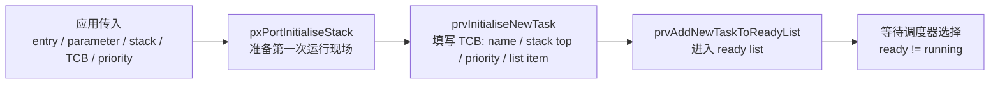
```mermaid
flowchart LR
    A["应用传入\nentry / parameter / stack / TCB / priority"] --> B["pxPortInitialiseStack\n准备第一次运行现场"]
    B --> C["prvInitialiseNewTask\n填写 TCB: name / stack top / priority / list item"]
    C --> D["prvAddNewTaskToReadyList\n进入 ready list"]
    D --> E["等待调度器选择\nready != running"]
```

这条组装线可以顺着读，也可以反过来排查。任务没跑时，先看材料是否长期有效，再看初始栈顶是否合理，再看 TCB 是否填好，再看是否进入 ready。只有这些都成立以后，才继续看调度器为什么没有让它 running。

### 6.3 CPU 第一次恢复任务前要拿到哪些材料

调度前，CPU 需要拿到一份能恢复任务的材料。尤其是第一次运行任务时，CPU 并不是“普通调用”任务入口，而是恢复一个被预先布置好的初始现场。这个现场要让任务看起来像从入口函数开始执行，并且能拿到参数。

创建阶段就是这条组装线。它把应用传入的材料变成内核可以调度的对象，也把“函数”推进到“任务对象”的层次。

### 6.4 图 012：任务创建的四步组装线

创建顺序本身就给出了结论：先有入口函数和参数，再准备栈和 TCB，最后进入 ready list。到这里应该能说出一句话：创建成功只是对象准备好，还不是已经运行。


这个顺序也能反过来排查故障：如果任务没跑，先确认它有没有被创建成对象，再确认它有没有进入 ready，而不是直接怀疑任务函数内部逻辑。创建路径越清楚，启动阶段的问题越不会被一股脑推给任务入口。

### 6.5 代码：创建后进入 ready 但还没运行

看到 `xTaskCreateStatic()` 成功返回时，新手很容易期待任务入口马上打印日志。真正发生的事要慢半拍：创建 API 先把栈、TCB 和 ready 位置准备好，调度器稍后才会决定谁运行。

[`v4_static_task_create`](F:/DevelopSrc/embedded_system_learning/tutorials/Chapter6_手撕FreeRTOS_底层核心机制/code/v4_static_task_create/demo.c) 故意把这个误会拆开。这个 demo 只证明一件事：创建成功得到的是一个 ready 对象，不是一次普通函数调用。

```c
#include <stdint.h>
#include <stdio.h>

typedef void (*TaskEntry)(void *);

typedef struct MiniTCB {
    const char *name;
    TaskEntry entry;
    void *parameter;
    uint32_t *top_of_stack;
    unsigned priority;
    struct MiniTCB *next_ready;
} MiniTCB;

typedef struct {
    MiniTCB *head;
} ReadyList;

static void ready_insert(ReadyList *ready, MiniTCB *task) {
    task->next_ready = ready->head;
    ready->head = task;
}

static MiniTCB *mini_xTaskCreateStatic(TaskEntry entry,
                                       const char *name,
                                       void *parameter,
                                       unsigned priority,
                                       uint32_t *stack_base,
                                       unsigned stack_words,
                                       MiniTCB *tcb,
                                       ReadyList *ready) {
    tcb->name = name;
    tcb->entry = entry;
    tcb->parameter = parameter;
    tcb->priority = priority;
    tcb->top_of_stack = &stack_base[stack_words - 1];
    ready_insert(ready, tcb);
    printf("created %-6s priority=%u top=%p -> ready list\n",
           tcb->name,
           tcb->priority,
           (void *)tcb->top_of_stack);
    return tcb;
}

static void task_entry(void *parameter) {
    printf("task would run with parameter=%s\n", (const char *)parameter);
}

int main(void) {
    ReadyList ready = { 0 };
    uint32_t led_stack[8];
    uint32_t log_stack[8];
    MiniTCB led_tcb;
    MiniTCB log_tcb;

    mini_xTaskCreateStatic(task_entry, "LED", "heartbeat", 2, led_stack, 8, &led_tcb, &ready);
    mini_xTaskCreateStatic(task_entry, "LOG", "uart", 1, log_stack, 8, &log_tcb, &ready);

    puts("ready list after creation:");
    for (MiniTCB *task = ready.head; task; task = task->next_ready) {
        printf("  %s is ready but not necessarily running\n", task->name);
    }
    return 0;
}
```

输出里最容易看错的是 `created` 这个词。它只表示材料已经组装好并放进 ready list，不表示任务入口已经被 CPU 执行。

```output
created LED    priority=2 top=<addr> -> ready list
created LOG    priority=1 top=<addr> -> ready list
ready list after creation:
  LOG is ready but not necessarily running
  LED is ready but not necessarily running
```

创建输出的重点是最后两行。LED 和 LOG 都已经 ready，但 demo 故意没有调用它们的入口函数。ready 是资格，不是运行本身。调度器还要选任务，启动或 PendSV 还要让 CPU 真正进入对应现场。

项目里如果 `xTaskCreateStatic()` 返回成功，但任务入口第一条日志没有出现，排查也要按这个顺序走。先看创建返回值和 TCB 材料，再看 ready list，再看调度器是否启动、优先级是否被更高任务压住。

### 6.6 回到 tasks.c：创建路径怎样进入 ready list

创建路径最容易被误读成“API 调了，任务就跑了”。所以源码表只沿对象装配走：材料进来，任务对象被初始化，初始现场被准备好，最后进入 ready。

| 源码入口 | 先抓住什么 | 解决的问题 |
| --- | --- | --- |
| [`tasks.c:xTaskCreateStatic()`](F:/DevelopSrc/embedded_system_learning/reference/rtos_src/FreeRTOS-Kernel/tasks.c:1332) | 应用给出的静态栈、TCB、入口、参数 | 创建入口怎样接收材料 |
| [`tasks.c:prvInitialiseNewTask()`](F:/DevelopSrc/embedded_system_learning/reference/rtos_src/FreeRTOS-Kernel/tasks.c:1816) | 任务名、优先级、栈顶、列表项怎样初始化 | 材料怎样被组装成任务对象 |
| [`port.c:pxPortInitialiseStack()`](F:/DevelopSrc/embedded_system_learning/reference/rtos_src/FreeRTOS-Kernel/portable/GCC/ARM_CM4F/port.c:202) | 第一次运行所需的栈帧 | 创建时为什么要触碰端口层 |
| [`tasks.c:prvAddNewTaskToReadyList()`](F:/DevelopSrc/embedded_system_learning/reference/rtos_src/FreeRTOS-Kernel/tasks.c:2052) | 新任务怎样进入 ready | 创建成功为什么只是获得运行资格 |

源码可以沿着三个函数动作走：`xTaskCreateStatic()` 检查应用提供的材料，`prvInitialiseNewTask()` 初始化 TCB 和初始栈，`prvAddNewTaskToReadyList()` 把任务放进 ready。能把这三步和 demo 输出对上，任务创建这条线就立住了。

这条材料流特别适合排查启动阶段问题。创建失败，先看材料是否有效：静态 TCB 和栈数组是否真实存在，栈深度是否合理，任务入口和参数是否传对。创建成功但任务没日志，下一问不是“创建 API 有没有调用”，而是它是否进入 ready、调度器是否启动、它是否被选中、第一次现场是否恢复。

可以把创建路径拆成四张小票据：第一张是应用传入的材料票据，第二张是 TCB 初始化票据，第三张是端口层栈帧票据，第四张是 ready list 票据。四张票据都齐，任务才算具备运行条件；但具备运行条件仍不等于它已经运行。这个边界看清以后，启动阶段的很多“任务没起来”就会分出层次。

创建 API 更像一次对象装配，而不是“调用一个函数让任务跑起来”。应用给材料，内核填资料，端口层准备第一次现场，最后任务获得 ready 资格。

| 问题 | 可以形成的判断 |
| --- | --- |
| 创建成功为什么不等于任务已经运行 | 创建只把对象放到 ready，真正运行还需要启动和调度 |
| 静态创建时哪些材料必须长期有效 | TCB、任务栈、入口函数和参数都不能在创建后失效 |
| 任务入口第一条日志没出现先查什么 | 先查创建返回值、ready 位置、调度器是否启动和优先级关系 |
| 创建后立刻异常更像哪类问题 | 初始栈帧、参数生命周期、栈大小或任务入口前几行逻辑 |

### 6.7 先停一下：任务已经从函数变成了可调度对象

先别急着冲进调度器，停一拍看对象装配线。LED、SENSOR、COMM、LOG 不再只是几个函数名，而是有栈、有 TCB、有列表位置、能被内核调度的对象。这个变化如果没吃透，后面看到优先级、PendSV、Delay 和队列时，很容易又退回“函数被谁调用了”的旧想法。

可以把第 3 到第 6 节压成一条很短的对象装配线：

| 环节 | 现在应该能看到什么 | 如果这里出错，常见现象 |
| --- | --- | --- |
| 任务栈 | 任务有自己的可恢复现场 | Delay 后回来异常、切换后 HardFault |
| TCB | 内核能认出任务是谁、从哪里恢复、优先级多少 | 任务名乱码、优先级异常、栈顶不合理 |
| 内核列表 | 任务有 ready、delayed、event wait 这些位置 | 任务没输出但原因不清，唤醒路径断 |
| 创建路径 | 应用材料被组装成 ready 对象 | 创建成功但入口没日志、材料生命周期错误 |

进入调度前先换一口气。现在我们已经知道“任务对象怎样被准备好”，下一步才问“多个 ready 对象同时存在时，CPU 到底给谁”。带着这个问题进入第 7 节，调度就不再是一个抽象算法，而是从一组已经准备好的任务对象里做选择。

## 7 调度是什么：从就绪任务里选出当前运行者

单核 MCU 同一时刻只能跑一个任务，所以“多个任务都 ready”并不等于它们同时前进。调度器要回答的是：此刻谁最应该拿到 CPU。这里先把“选择”和“切换”分开：调度只负责选出当前任务，真正切过去还要靠后面的现场切换。

### 7.1 多个 ready 任务为什么只能跑一个

任务已经有了 TCB，也能进入 ready list。新的问题马上出现：如果 LED、SENSOR、LOG 都 ready，CPU 到底跑谁？单核 MCU 同一时刻只能执行一段代码，ready 只是说明“我有资格竞争”，不是说明“我马上就能运行”。

调度要解决的就是这个选择问题。它不是一个在后台不断跑的神秘线程，而是一段内核逻辑：在合适的时机，从 ready 集合里选出当前任务。选出来以后，还需要上下文切换机制让 CPU 真正过去。

### 7.2 调度是在 ready 集合里选当前任务

调度是从 ready 任务集合中选择当前任务。常见规则是高优先级优先，同级任务按时间片或列表顺序轮转；阻塞、延时、等待事件的任务不参与这次竞争。这样，COMM 一旦因为外部事件变成 ready，就可能压过后台 LOG；LED 和 SENSOR 如果同级，就可能轮流获得机会。

有一句话要反复记住：ready 是资格，running 才是结果。很多排查卡在这两个词之间。

把这句话画成流程，会更容易区分“候选”和“结果”。下面的流程只解释调度选择，不解释真正的上下文切换；切换要留到 PendSV 那一节。

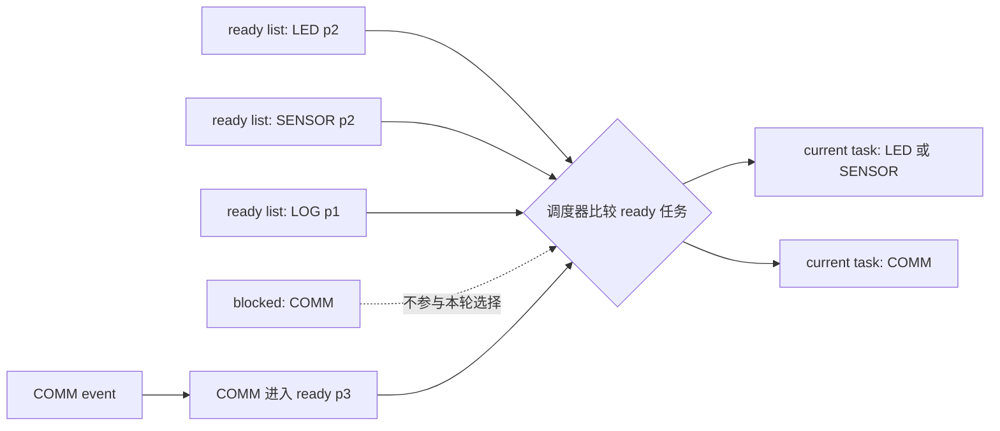
```mermaid
flowchart LR
    A["ready list: LED p2"] --> C{"调度器比较 ready 任务"}
    B["ready list: SENSOR p2"] --> C
    D["ready list: LOG p1"] --> C
    E["blocked: COMM"] -. "不参与本轮选择" .-> C
    C --> F["current task: LED 或 SENSOR"]
    G["COMM event"] --> H["COMM 进入 ready p3"]
    H --> C
    C --> I["current task: COMM"]
```

调度选择先从候选集合开始：哪些任务能进入比较，COMM 事件怎样改变 ready 集合，current task 又怎样变化。blocked 的 COMM 被画成虚线，是在提醒我们：不在 ready 集合里，再高的优先级也不会参与本轮选择。

### 7.3 优先级把响应需求变成运行机会

没有调度，任务只是准备好的内存对象。调度把优先级、ready 位置和等待状态变成一个执行选择。它把项目里的响应需求表达成运行机会：外部通信通常比后台日志更急，周期采样通常比普通打印更敏感。

这也意味着，优先级不是“谁更重要”的情绪排序，而是“谁更不能晚”的工程约束。优先级设计如果只凭感觉，系统很容易出现 LOG 看起来很忙、COMM 响应却变慢的情况。

### 7.4 图 003：高优先级和同级轮转怎样影响选择

从 ready 集合读起，调度规则就很直观：高优先级任务一旦 ready，会优先获得 CPU；同级任务则按轮转规则前进。把 COMM、LED、SENSOR 放进去，就能解释为什么事件到来后运行机会会改变。


这会直接变成一句调试判断：如果 COMM 已经 ready 且优先级最高，它应该很快获得运行机会；如果它没有运行，就要看是否真的 ready、是否被关中断或临界区拖住、是否 PendSV 没有完成切换。调度只解释选择，不能替代切换。

### 7.5 代码：COMM 变 ready 后为什么压过 LED

调度选择用 [`v5_priority_scheduler`](F:/DevelopSrc/embedded_system_learning/tutorials/Chapter6_手撕FreeRTOS_底层核心机制/code/v5_priority_scheduler/demo.c) 来看。COMM 从 blocked 变成 ready 的那一刻，会直接改写接下来的 switch_to。

```c
#include <stdio.h>

typedef enum { TASK_READY, TASK_BLOCKED } TaskState;

typedef struct {
    const char *name;
    unsigned priority;
    TaskState state;
} MiniTask;

static MiniTask *pick_next(MiniTask tasks[], unsigned count, unsigned *cursor) {
    MiniTask *best = 0;
    unsigned best_priority = 0;
    for (unsigned i = 0; i < count; ++i) {
        unsigned index = (*cursor + i) % count;
        MiniTask *task = &tasks[index];
        if (task->state != TASK_READY) {
            continue;
        }
        if (!best || task->priority > best_priority) {
            best = task;
            best_priority = task->priority;
        }
    }
    if (best) {
        *cursor = (unsigned)((best - tasks) + 1) % count;
    }
    return best;
}

int main(void) {
    MiniTask tasks[] = {
        { "LOG", 1, TASK_READY },
        { "LED", 2, TASK_READY },
        { "SENSOR", 2, TASK_READY },
        { "COMM", 3, TASK_BLOCKED }
    };
    unsigned cursor = 0;

    for (unsigned tick = 0; tick < 5; ++tick) {
        if (tick == 3) {
            tasks[3].state = TASK_READY;
            puts("event: COMM becomes ready");
        }
        MiniTask *next = pick_next(tasks, 4, &cursor);
        printf("tick=%u switch_to=%s priority=%u\n", tick, next->name, next->priority);
    }
    return 0;
}
```

这组输出按 tick 读更清楚：前几行先证明同优先级会轮转，COMM 变 ready 后再观察高优先级怎样改变选择结果。

```output
tick=0 switch_to=LED priority=2
tick=1 switch_to=SENSOR priority=2
tick=2 switch_to=LED priority=2
event: COMM becomes ready
tick=3 switch_to=COMM priority=3
tick=4 switch_to=COMM priority=3
```

调度输出前半段展示同级轮转：LED 和 SENSOR 都是优先级 2，所以 tick 0、1、2 之间轮流出现。tick 3 时 COMM 从 blocked 变成 ready，而且优先级是 3，于是接下来的选择被它改写。LOG 虽然也 ready，但优先级低，所以没有机会被选中。

项目里看到“低优先级任务长期不运行”时，不一定是 bug；可能只是更高优先级任务一直 ready。反过来，如果高优先级 COMM ready 后仍然响应慢，就要继续往后看：选择是否发生，PendSV 是否执行，任务是否又被 mutex 或队列挡住。

### 7.6 回到调度源码：vTaskSwitchContext 更新当前任务

调度源码只回答“ready 集合里选谁”。队列把任务唤醒、PendSV 把任务切过去，这些都在旁边；先把选择本身看清楚。

| 源码入口 | 先抓住什么 | 解决的问题 |
| --- | --- | --- |
| [`tasks.c:vTaskSwitchContext()`](F:/DevelopSrc/embedded_system_learning/reference/rtos_src/FreeRTOS-Kernel/tasks.c:5120) | 调度器怎样更新当前任务选择 | 从 ready 集合里选出下一位 current task |
| [`tasks.c:taskSELECT_HIGHEST_PRIORITY_TASK`](F:/DevelopSrc/embedded_system_learning/reference/rtos_src/FreeRTOS-Kernel/tasks.c:289) | 最高优先级 ready 任务怎样被找出 | 优先级选择的核心入口 |
| [`tasks.c:prvAddTaskToReadyList`](F:/DevelopSrc/embedded_system_learning/reference/rtos_src/FreeRTOS-Kernel/tasks.c:278) | ready list 按优先级组织任务 | 为什么 ready 资格还要分优先级 |

对账 `vTaskSwitchContext()` 时，核心问题是它怎样确定下一次的当前任务。把 demo 输出里的 `switch_to=COMM` 对到真实源码里的“当前任务指针更新”，调度这件事就有了落点；trace、时间片配置和宏展开，可以等主线站稳以后再补。

“高优先级先运行”这句话太粗糙。源码里的 ready list 会把它变成可观察结构：任务先要进入某个优先级的 ready list，然后调度器从最高可运行优先级里选择任务；同优先级任务还可能轮转。项目里看到 COMM 响应慢时，优先级只是第一层证据，还要确认 COMM 当时是否真的在 ready 集合里。

调试时可以把调度证据拆成三层。第一层，任务是否 ready；第二层，ready 集合里是否有更高优先级任务长期存在；第三层，调度器是否已经把当前任务选择更新到目标任务。只有第三层成立以后，才继续看 PendSV 是否完成现场切换。

这里最关键的分界，是把“有资格运行”和“已经运行”拆开。很多 RTOS 现象都藏在这两个词之间：任务 ready 了，但被更高优先级压住；任务被选中了，但还没完成上下文切换。

| 问题 | 可以形成的判断 |
| --- | --- |
| 高优先级任务为什么一 ready 就改变局面 | 因为调度器会优先选择响应压力更高的 ready 任务 |
| 低优先级 LOG 长期不运行一定是 bug 吗 | 不一定，可能更高优先级任务持续 ready |
| 同优先级 LED 和 SENSOR 为什么轮流出现 | 因为同级任务通常按时间片或 ready 列表顺序轮转 |
| 调度和 PendSV 的边界在哪里 | 调度决定 current task，PendSV 才真正保存和恢复现场 |

能把这四问说清楚，调度就不再是一句“高优先级先跑”。它变成了 ready 资格、优先级选择、同级轮转和真正切换之前的一段证据链。下一节进入启动阶段时，还要继续保持这个分界：任务对象已经 ready，只说明它有资格被选；CPU 是否真的进入任务入口，要看第一次现场恢复。

## 8 启动第一个任务是什么：main 把 CPU 控制权交给调度器

在裸机程序里，`main()` 像舞台中央的人，一直掌握执行节奏。启动调度器以后，节奏交给内核，`main()` 不再像普通循环那样继续往下组织所有工作。最容易误解的瞬间，就发生在这次交权上：代码看起来只是调用了一个函数，系统的控制关系却已经变了。

### 8.1 main 什么时候不再拥有 CPU

裸机项目里，`main()` 往往一直拥有 CPU：初始化外设，然后进入 `while(1)`，后面所有工作都在这条线上排队。RTOS 项目不一样。`main()` 的主要任务是把任务、队列、锁和资源准备好，然后启动调度器，把 CPU 控制权交给任务世界。

这个交权动作很关键。调用创建 API 后，任务只是 ready；只有调度器启动并恢复第一个任务现场，任务入口才真正开始执行。也就是说，`main()` 和第一个任务之间不是普通函数调用关系。

### 8.2 启动第一个任务就是恢复准备好的现场

启动第一个任务，就是恢复已经准备好的第一个任务现场，让 CPU 从任务入口开始执行。前面任务创建时准备的初始栈帧，在这里第一次派上用场。调度器选出优先级合适的任务，移植层用硬件约定把 CPU 带进任务上下文。

可以把它想成一次控制权交接：`main()` 负责布置舞台，调度器决定第一个上场的任务，移植层把 CPU 真的交过去。

### 8.3 ready 对象必须经过第一次现场恢复才会跑

任务创建后只是 ready。只有第一次现场恢复完成，任务世界才真正开始运行。这个边界能解释很多启动阶段问题：创建返回成功但任务入口没打印，可能是调度器没启动；调度器启动后卡住，可能是第一个任务现场或中断配置有问题。

因此，启动问题的日志要分段：创建成功日志、调用启动调度器前日志、第一个任务入口日志。三段日志能把“没创建”“没交权”“交权后出错”区分开。

### 8.4 图 006：main 到任务世界的控制权交接

这里看的是控制权交接。main 负责创建世界，启动调度器后不再按裸机主循环的方式掌控 CPU；第一个任务现场被恢复后，系统才真正进入任务世界。


读这张交权图时，先看 `main()` 左侧做了什么：创建任务、准备对象、启动调度器；再看右侧第一个任务怎样接住 CPU。把它和任务创建图连起来，入口就完整了：创建图说明对象怎样进入 ready，启动图说明 ready 对象怎样第一次接管 CPU。两个动作连起来，才是从裸机 `main()` 走进任务世界的完整入口。

如果第一次看 `SVC`、`PSP` 和 `PendSV` 有点乱，先看下面这张关系总览。上半条线只讲启动第一个任务：`main()` 准备 TCB 和 stack，`SVC` 恢复 first task 的 `PSP`，然后进入 TaskA 入口；下半条线再讲后续切换：调度器选择 TaskB，`PendSV` 保存旧 `PSP`、更新 `pxCurrentTCB`、恢复新 `PSP`。先把这两条线分开，后面的端口层源码会轻很多。


### 8.5 代码：用模型看 main 如何交权

第一次交权用 [`v6_start_first_task`](F:/DevelopSrc/embedded_system_learning/tutorials/Chapter6_手撕FreeRTOS_底层核心机制/code/v6_start_first_task/demo.c) 做模型。它不是硬件真实启动代码；重点是看 main 怎样把控制权交给第一个任务。

```c
#include <stdio.h>

typedef struct {
    const char *name;
    unsigned priority;
} MiniTask;

static MiniTask *select_first_task(MiniTask tasks[], unsigned count) {
    MiniTask *best = &tasks[0];
    for (unsigned i = 1; i < count; ++i) {
        if (tasks[i].priority > best->priority) {
            best = &tasks[i];
        }
    }
    return best;
}

static void start_first_task(MiniTask *task) {
    puts("SVC model: restore the prepared first task context");
    printf("first task=%s priority=%u\n", task->name, task->priority);
    puts("main stops owning CPU; task context owns execution");
}

int main(void) {
    MiniTask tasks[] = {
        { "LED", 2 },
        { "LOG", 1 },
        { "COMM", 3 }
    };
    puts("main: create tasks and start scheduler");
    start_first_task(select_first_task(tasks, 3));
    return 0;
}
```

输出里的主角不是某个任务函数，而是控制权。读的时候沿着 `main -> SVC model -> first task` 走，就能看见 main 不再继续掌控 CPU 的边界。

```output
main: create tasks and start scheduler
SVC model: restore the prepared first task context
first task=COMM priority=3
main stops owning CPU; task context owns execution
```

启动输出里的 `main stops owning CPU` 是最重要的一句。它不是说 `main()` 真的消失了，而是说系统的主要执行权已经转到任务上下文。后续代码不再靠 `main` 主循环轮询推进，而靠任务等待、唤醒和调度推进。

真实端口层会通过 SVC、异常返回、栈指针和寄存器恢复完成这个动作，demo 只保留教学方向。先把“main 交权”看懂，再去看具体芯片的启动汇编，压力会小很多。

### 8.6 回到启动源码：vTaskStartScheduler 和 SVC

启动源码要带着“main 怎样交权”这个问题读。第一轮只看从内核启动准备到端口层恢复第一个任务现场，不追所有平台细节。

| 源码入口 | 先抓住什么 | 解决的问题 |
| --- | --- | --- |
| [`tasks.c:vTaskStartScheduler()`](F:/DevelopSrc/embedded_system_learning/reference/rtos_src/FreeRTOS-Kernel/tasks.c:3700) | 调度器启动前后的准备 | `main()` 怎样把控制权交给任务世界 |
| [`port.c:xPortStartScheduler()`](F:/DevelopSrc/embedded_system_learning/reference/rtos_src/FreeRTOS-Kernel/portable/GCC/ARM_CM4F/port.c:305) | 移植层怎样配置异常和硬件环境 | 启动第一个任务前平台要做什么 |
| [`port.c:prvPortStartFirstTask()`](F:/DevelopSrc/embedded_system_learning/reference/rtos_src/FreeRTOS-Kernel/portable/GCC/ARM_CM4F/port.c:278) | 第一个任务启动入口 | 从调度器准备走向任务上下文 |
| [`port.c:vPortSVCHandler()`](F:/DevelopSrc/embedded_system_learning/reference/rtos_src/FreeRTOS-Kernel/portable/GCC/ARM_CM4F/port.c:260) | SVC 怎样恢复第一个任务现场 | 第一次进入任务为什么不是普通函数调用 |

源码可以按三段找：`vTaskStartScheduler()` 做内核启动准备，移植层启动函数配置硬件环境，SVC 或等价机制恢复第一个任务现场。第一次进入任务和任务之间切换，时机不同，但都围绕任务栈和 TCB；把这两件事分开，读 `port.c` 会轻很多。

启动阶段最怕一句“调度器没起来”。这句话太大，不能指导排查。更稳的拆法是：任务对象有没有创建，`vTaskStartScheduler()` 有没有走到端口层，端口层有没有配置好异常，SVC 有没有恢复第一个任务的栈顶，第一条任务日志有没有出现。每一问都能对应一段源码或一条日志。

启动和后续切换也要分清。启动第一个任务时，系统还没有旧任务需要保存；PendSV 切换时，必须保存旧任务再恢复新任务。如果把这两件事混在一起，读 `port.c` 会非常累。先把“main 交权”读成一条单向路径，再去读“任务互切”的往返路径，顺序会轻很多。

启动阶段可以先分成三段日志：创建对象、启动调度器、第一个任务入口。只要这三段分开，启动卡死就不会变成一句模糊的“FreeRTOS 没跑起来”。

| 问题 | 可以形成的判断 |
| --- | --- |
| `main()` 为什么不再像裸机那样长期轮询 | 因为启动调度器后，主要执行权转到任务上下文 |
| 创建任务后为什么还需要启动调度器 | ready 对象要经过第一次现场恢复，任务入口才会执行 |
| 第一个任务没打印日志先区分什么 | 区分没创建、没启动调度器、启动后恢复现场失败 |
| 第一次进入任务和后续任务切换有什么共同点 | 都围绕任务栈、TCB 和 CPU 现场恢复展开 |

这四问把启动阶段从一句“调度器没起来”拆成创建对象、启动调度器、选择第一个任务、恢复入口现场四段。读到这里，`main()` 的角色应该已经从“长期主循环”变成“系统搭建者”。下一步看 PendSV 时，就不会把第一次进入任务和后续任务互切混在一起。

## 9 PendSV 是什么：把选择结果变成真正的任务切换

调度器选中了下一个任务，还不等于 CPU 已经跑过去。真正的切换要保存当前任务现场，再恢复下一个任务现场。PendSV 把这个选择结果落到栈指针和寄存器现场上，抽象的“切任务”才会变成 CPU 真的换了执行流。

### 9.1 选中 LOG 以后为什么还没有切过去

调度器选出 LOG，只是逻辑上决定“下一个应该是谁”。但此刻 CPU 可能还在 LED 的现场里，寄存器、栈指针和当前执行位置都属于 LED。要真的切到 LOG，系统必须保存 LED 的现场，更新当前任务指针，再恢复 LOG 的现场。

这就是 PendSV 登场的地方。它把“已经选出来了”变成“CPU 真的过去了”。如果把调度和切换混在一起，后面排查 HardFault、响应慢、切换异常时会非常乱。

### 9.2 PendSV 把逻辑选择变成现场切换

调度器说“下一个该跑 LOG”以后，CPU 还不会自动瞬移到 LOG 的栈上。真正把旧现场存起来、把新现场恢复出来的，通常是 Cortex-M 上用于上下文切换的 PendSV 异常。它在合适的优先级上延后执行，让中断处理、Tick 推进和调度选择之间有清楚分工。

PendSV 最容易因为汇编而显得吓人，但主线其实只有三步：保存当前任务的 PSP 到当前 TCB，切换 `pxCurrentTCB`，从下一个 TCB 里取 PSP 并恢复。真实代码会处理寄存器、FPU、临界区等细节，但这些细节都围绕这三步展开。

### 9.3 切换集中到 PendSV 才容易控制时机

很多事件都可能要求切换：Tick 到期，高优先级任务被唤醒，当前任务主动阻塞。把真正的上下文切换集中到 PendSV，时机更集中，代码也更可控。这样，调度器只负责选择，PendSV 负责执行保存和恢复。

这个分工也能帮助排查。任务被唤醒但没运行，可能是调度选择问题，也可能是切换没有发生；PendSV 后 HardFault，可能是 PendSV 恢复了坏现场，而不是 PendSV 自己最先破坏了现场。

“唤醒、选择、切换”必须拆成三段看。以后看到 COMM 响应慢时，就沿着这三段问：事件有没有让 COMM ready，调度器有没有选中 COMM，PendSV 有没有把 CPU 真的切到 COMM。

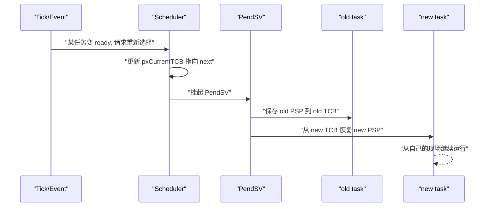
```mermaid
sequenceDiagram
    participant TickOrEvent as "Tick/Event"
    participant Scheduler as "Scheduler"
    participant PendSV as "PendSV"
    participant OldTask as "old task"
    participant NewTask as "new task"
    TickOrEvent->>Scheduler: "某任务变 ready, 请求重新选择"
    Scheduler->>Scheduler: "更新 pxCurrentTCB 指向 next"
    Scheduler->>PendSV: "挂起 PendSV"
    PendSV->>OldTask: "保存 old PSP 到 old TCB"
    PendSV->>NewTask: "从 new TCB 恢复 new PSP"
    NewTask-->>NewTask: "从自己的现场继续运行"
```

重点不是 API 名，而是时间线上每一步是否真的发生。日志里只有“wake COMM”，只能说明 COMM 回到候选集合；看到 `pxCurrentTCB` 更新，也还要看 PendSV 有没有恢复正确的 PSP。把这些动作按先后排开，响应慢和切换故障才不会混在一起。

### 9.4 图 013：SysTick、调度器和 PendSV 各做哪一步

三个动作要分开：SysTick 推动时间，调度器决定下一个任务，PendSV 执行保存和恢复。分清这三步，后面看到 HardFault 才不会把所有责任都推给 PendSV。


按时间走一遍就能看清：SysTick 或事件让系统发现“可能需要换人”，调度器决定下一个任务，PendSV 执行真正的保存和恢复。三者分开以后，“唤醒了”“选中了”“切过去了”这三个证据就能分开记录。

如果这张全景图第一眼信息太多，先用下面这张关系总览打底。读图时把上半条启动线和下半条切换线分开：`SVC` 只负责第一次恢复任务现场，`PendSV` 才负责后续保存旧 `PSP`、切换 `pxCurrentTCB`、恢复新 `PSP`。把这两条线分开，汇编和寄存器名就不容易把人带散。


### 9.5 先认识切换现场里的 Cortex-M 寄存器

PendSV 难，不是因为主线真的很长，而是因为它一次性把两套知识叠在一起：Cortex-M 异常进入时硬件已经帮你保存了一部分寄存器，FreeRTOS 的 PendSV 汇编又手动保存另一部分寄存器。新手如果不知道这条边界，就会问一个很自然的问题：为什么代码里只看到 `r4-r11`，那 `r0-r3`、`pc`、`xPSR` 去哪里了？

先把寄存器放进一张表里。读表时不要把它当成处理器手册摘要，而要沿着“谁保存、保存到哪里、恢复后干什么”这三问走。

| 寄存器或现场 | 从哪来 | PendSV 里做什么 | 为什么要这样写 |
| --- | --- | --- | --- |
| `r0-r3`、`r12` | 任务被异常打断时，Cortex-M 硬件自动压入当前任务栈 | PendSV 汇编通常不再手动保存它们 | 它们已经在异常栈帧里，异常返回时硬件会自动恢复 |
| 栈帧里的 `lr`、`pc`、`xPSR` | 同样由硬件自动压入当前任务栈 | FreeRTOS 创建任务时也会伪造这几项，让第一次恢复像异常返回 | `pc` 决定回到哪里执行，`xPSR` 保证 Thumb 状态，`lr` 给任务异常返回或任务退出路径留约定 |
| `r4-r11` | 普通函数调用约定里属于被调用者要保持的寄存器，硬件异常进入不会自动保存 | `stmdb r0!, {r4-r11, r14}` 手动压到任务 PSP 指向的栈里，恢复时再 `ldmia r0!, {r4-r11, r14}` | 任务切走前如果不保存它们，任务回来后局部计算现场可能被别的任务污染 |
| `r14` 在 PendSV handler 中的值 | 异常进入后，处理器把 `EXC_RETURN` 放在 `lr/r14` | FreeRTOS 把它和 `r4-r11` 一起保存，并用它判断是否有 FPU 扩展现场 | 它不是普通 C 函数返回地址，而是告诉 CPU 异常返回时回到线程模式、使用哪一个栈、是否带浮点现场 |
| `PSP` | 任务在线程模式下使用的 Process Stack Pointer | `mrs r0, psp` 读出旧任务栈顶，保存后写进旧 TCB；恢复新任务时 `msr psp, r0` | 每个任务都有自己的 PSP，TCB 里的栈顶字段就是任务现场的存取入口 |
| `MSP` / handler `sp` | 异常处理时使用的 Main Stack Pointer | PendSV handler 自己临时压 `r0`、`r3` 到 `sp`，避免 C 调用弄丢线索 | handler 的临时工作用 MSP，不应该污染某个任务的 PSP |
| `CONTROL` | 线程模式的栈选择和权限控制寄存器 | 启动路径会清理初始状态，后续任务返回主要靠 `EXC_RETURN` 指明使用 PSP | 它帮助理解“任务用 PSP、异常 handler 用 MSP”这条边界，但 PendSV 不需要每次靠它完成切换 |
| `pxCurrentTCB` | FreeRTOS 的当前任务指针 | 旧现场保存到旧 TCB 后，调用 `vTaskSwitchContext()` 更新它，再从新 TCB 取栈顶 | 调度选择和现场切换在这里接上：调度改“当前任务是谁”，PendSV 按这个结果恢复现场 |
| `BASEPRI` | Cortex-M 的中断屏蔽寄存器之一 | 调用 `vTaskSwitchContext()` 前临时屏蔽会调用内核 API 的中断，返回后清零 | 调度器要改 ready list、当前 TCB 等共享结构，不能被同级内核路径打断 |
| `s16-s31` | 使用 FPU 时的高浮点寄存器 | 根据 `EXC_RETURN` 的位判断是否需要额外保存或恢复 | 没用 FPU 的任务不必付出浮点现场保存成本，用了 FPU 的任务必须保住浮点计算现场 |

这组寄存器对照里最关键的分界线是“硬件自动保存”和“软件手动保存”。Cortex-M 进入异常时，已经把 `r0-r3`、`r12`、返回用的 `lr`、`pc`、`xPSR` 这类异常返回必须用到的现场压到当前栈上。PendSV 需要补上的，是硬件没有自动保存、但任务回来后仍然必须保持的 `r4-r11`，再加上对 `EXC_RETURN`、PSP、TCB 和调度临界区的处理。

换句话说，FreeRTOS 的 PendSV 汇编不是在“保存所有寄存器”，而是在补齐硬件自动栈帧之外的那一半现场。理解了这一点，再看 `stmdb r0!, {r4-r11, r14}` 就不会奇怪：`r0` 里暂存的是旧 PSP，`stmdb` 往旧任务栈上继续压手动保存部分，最后 `str r0, [r2]` 把新的栈顶记回旧任务 TCB。恢复新任务时方向正好反过来：从新 TCB 取栈顶，弹出 `r4-r11/r14`，写回 PSP，再用异常返回让硬件自动弹出剩下的异常栈帧。

### 9.6 代码：保存旧 PSP，恢复新 PSP

读 PendSV 最容易被汇编和寄存器名打散，所以先让代码模型只保留骨架。[`v7_pendsv_switch`](F:/DevelopSrc/embedded_system_learning/tutorials/Chapter6_手撕FreeRTOS_底层核心机制/code/v7_pendsv_switch/demo.c) 只抓三步：保存旧 PSP，切换 `pxCurrentTCB`，恢复新 PSP。

```c
#include <stdint.h>
#include <stdio.h>

typedef struct {
    const char *name;
    uint32_t process_stack_pointer;
} MiniTCB;

static MiniTCB *pxCurrentTCB;

static void pendsv_switch(MiniTCB *next) {
    printf("PendSV: save PSP=0x%08lx into %s TCB\n",
           (unsigned long)pxCurrentTCB->process_stack_pointer,
           pxCurrentTCB->name);
    printf("PendSV: pxCurrentTCB %s -> %s\n", pxCurrentTCB->name, next->name);
    pxCurrentTCB = next;
    printf("PendSV: restore PSP=0x%08lx from %s TCB\n",
           (unsigned long)pxCurrentTCB->process_stack_pointer,
           pxCurrentTCB->name);
}

int main(void) {
    MiniTCB led = { "LED", 0x20001000u };
    MiniTCB log = { "LOG", 0x20002000u };
    pxCurrentTCB = &led;

    puts("model: scheduler already selected LOG");
    pendsv_switch(&log);
    return 0;
}
```

这段输出要按现场方向读：旧任务把 PSP 存回自己的 TCB，新任务从自己的 TCB 取出 PSP。中间那行 `pxCurrentTCB LED -> LOG` 才把调度选择接到真正切换上。

```output
model: scheduler already selected LOG
PendSV: save PSP=0x20001000 into LED TCB
PendSV: pxCurrentTCB LED -> LOG
PendSV: restore PSP=0x20002000 from LOG TCB
```

这段输出就是 PendSV 的最小故事。第一行说明调度器已经选好了 LOG；第二行保存 LED 的 PSP，避免 LED 以后回不来；第三行把当前任务指针从 LED 改成 LOG；第四行从 LOG 的 TCB 里恢复 PSP，让 CPU 进入 LOG 的现场。

真实 HardFault 排查时，这四步也能变成检查清单。当前任务是谁，旧 PSP 是否在旧任务栈范围内，`pxCurrentTCB` 是否指向合理 TCB，新 PSP 是否在新任务栈范围内。只要其中一项异常，就要往栈溢出、TCB 被覆盖或错误上下文调用方向查。

### 9.7 回到 PendSV：保存与恢复发生在哪里

读 `xPortPendSVHandler()` 时，先把自己从“我要看懂每条汇编”的压力里放出来。第一轮只做一件事：把刚才 demo 的四行输出，贴到真实源码的保存和恢复方向上。能知道哪里保存当前 PSP，哪里更新当前任务，哪里恢复下一个 PSP，就已经抓住了 PendSV 的主骨架。

| 源码入口 | 先抓住什么 | 解决的问题 |
| --- | --- | --- |
| [`port.c:xPortPendSVHandler()`](F:/DevelopSrc/embedded_system_learning/reference/rtos_src/FreeRTOS-Kernel/portable/GCC/ARM_CM4F/port.c:504) | 保存当前 PSP、恢复下一个 PSP | 把调度选择变成真实任务切换 |
| [`tasks.c:vTaskSwitchContext()`](F:/DevelopSrc/embedded_system_learning/reference/rtos_src/FreeRTOS-Kernel/tasks.c:5120) | PendSV 中调用的调度选择 | 解释为什么 PendSV 不自己决定业务优先级 |
| [`tasks.c:TCB_t`](F:/DevelopSrc/embedded_system_learning/reference/rtos_src/FreeRTOS-Kernel/tasks.c:375) | 栈顶字段怎样支撑保存恢复 | 旧现场和新现场都要回到 TCB |

对账 `xPortPendSVHandler()` 时，主线仍然是保存、选择、恢复三段。汇编细节可以暂时放到旁边，先把 demo 的四行输出和真实源码的保存恢复方向对上，PendSV 的心智模型就够用了。

等这条线读顺以后，再看异常优先级、FPU 上下文、临界区和平台差异。它们很重要，但不适合抢在主线前面。先吃下“硬件自动保存一半、PendSV 手动补齐一半、TCB 记录 PSP”这条主线，硬件细节才不会变成一片噪声。

PendSV 要留下三条分开的证据：唤醒了、选中了、切过去了。PendSV 不是负责决定谁更该跑，它负责把已经决定的切换落到 CPU 现场上。

| 问题 | 可以形成的判断 |
| --- | --- |
| 为什么选中 LOG 后 CPU 还可能在 LED 现场 | 因为调度选择只是逻辑结果，现场切换还没完成 |
| PendSV 最小主线是哪三步 | 保存旧 PSP，更新当前任务，恢复新 PSP |
| 为什么 PendSV 只手动保存 `r4-r11` | 因为异常进入时硬件已经保存了 `r0-r3`、`r12`、`lr`、`pc`、`xPSR` |
| `bx r14` 为什么不是普通函数返回 | 因为这里的 `r14` 保存的是 `EXC_RETURN`，它会触发异常返回并恢复任务现场 |
| PendSV 后 HardFault 第一轮看什么 | 旧栈、新栈、`pxCurrentTCB` 和 TCB 是否被覆盖 |
| 为什么不要一开始就背每条汇编 | 先抓保存和恢复方向，后面再补寄存器、FPU 和平台边界 |

这组问题的价值，是把“选中了”和“切过去了”彻底分开。接下来读 Delay 和 Tick 时，也要保留这种分层意识：到期回 ready，不代表任务已经 running。

## 10 Delay 和 Tick 是什么：把时间等待交给内核

周期任务最容易被误读成“睡一会儿”。在 RTOS 里，Delay 更准确的意思是：任务暂时离开 ready，把等待时间交给 Tick 记录。真正该盯住的不是 API 名，而是 ready、delayed、ready 这条位置变化。

### 10.1 LED 等 50 ms 时 CPU 不该陪它空转

前面已经讲到，ready 任务要竞争 CPU。现在换一个场景：LED 已经翻转完一次，只想 50 ms 后再回来。这个时候，如果它还在循环里忙等，就等于拿着 CPU 什么正事也不干，SENSOR、COMM、LOG 都要被它拖住。

Delay 的意义不是“让任务睡觉”这么简单，而是让时间等待变成一个可管理的位置变化。LED 主动离开 ready，内核记下它应该什么时候回来。等待这段时间里，CPU 可以去运行别的 ready 任务。

### 10.2 Delay 把时间等待变成 delayed list 位置

LED 等 50 ms 时，最好的结果不是 CPU 陪它干等，而是让别的任务先跑。Delay 让任务离开 ready list，进入 delayed list。Tick 像系统里的节拍器，不断推进当前时间；当某个任务的等待时间到期，内核再把它从 delayed list 移回 ready list。

这句话里有两个动作要分开：等待到期是时间机制，真正运行是调度机制。很多心跳抖动问题就卡在这里：任务按时回 ready 了，但没有马上获得 CPU。

把 Delay 拆成时间线，会比一句“任务睡眠”准确得多。

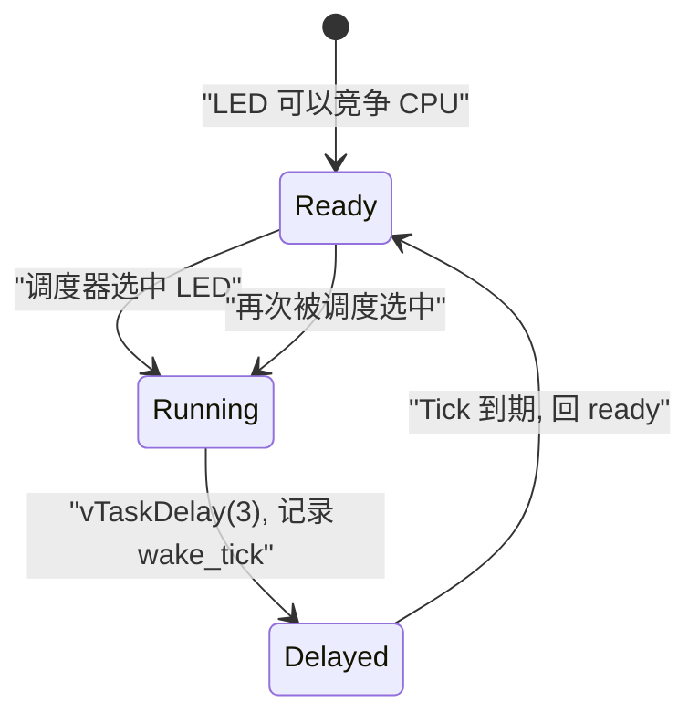
```mermaid
stateDiagram-v2
    [*] --> Ready: "LED 可以竞争 CPU"
    Ready --> Running: "调度器选中 LED"
    Running --> Delayed: "vTaskDelay(3), 记录 wake_tick"
    Delayed --> Ready: "Tick 到期, 回 ready"
    Ready --> Running: "再次被调度选中"
```

这张状态图要特别看最后两条边。Tick 到期只负责 `Delayed -> Ready`，并不负责 `Ready -> Running`。如果 LED 在 tick 3 回到 ready，却到 tick 4 才运行，这不是 Delay 自己的矛盾，而是调度选择还要继续发生。

### 10.3 Tick 负责把到期等待送回竞争队列

等待时间时占着 CPU 没有价值。Delay 让等待变成内核状态，Tick 负责检查这个状态什么时候结束。这样，LED 等时间时，SENSOR 可以采样，COMM 可以处理外部事件，LOG 可以消化后台输出。

如果没有这个机制，项目会退回裸机主循环的老问题：一个工作在等待，整条执行线都被它拖住。

### 10.4 图 014：ready、delayed、ready 的时间往返

LED 从 ready 进入 delayed，Tick 到期再把它送回 ready。读图时要特意留意这个边界：回 ready 只是重新获得竞争资格，不等于马上运行。


这张图要留下的判断是：Delay 只负责让任务离开 ready 并登记一个回来的时间点，Tick 负责到点把任务送回 ready。至于它回 ready 后能不能马上运行，还要继续交给调度器判断。

### 10.5 代码：到期不等于立刻运行

Delay 的位置变化可以直接跑 [`v8_delay_blocked_list`](F:/DevelopSrc/embedded_system_learning/tutorials/Chapter6_手撕FreeRTOS_底层核心机制/code/v8_delay_blocked_list/demo.c)。看输出时把“进入 delayed”“到期回 ready”“真正运行”分成三个动作。

```c
#include <stdio.h>

typedef enum { READY, DELAYED } State;

typedef struct {
    const char *name;
    State state;
    unsigned wake_tick;
} MiniTask;

static void mini_delay(MiniTask *task, unsigned now, unsigned ticks_to_delay) {
    task->state = DELAYED;
    task->wake_tick = now + ticks_to_delay;
    printf("tick=%u %s: ready -> delayed until tick %u\n", now, task->name, task->wake_tick);
}

static void tick(MiniTask tasks[], unsigned count, unsigned now) {
    printf("tick=%u sys tick\n", now);
    for (unsigned i = 0; i < count; ++i) {
        if (tasks[i].state == DELAYED && now >= tasks[i].wake_tick) {
            tasks[i].state = READY;
            printf("tick=%u %s: delayed -> ready, not necessarily running yet\n", now, tasks[i].name);
        }
    }
}

int main(void) {
    MiniTask tasks[] = {
        { "LED", READY, 0 },
        { "SENSOR", READY, 0 }
    };

    mini_delay(&tasks[0], 0, 3);
    for (unsigned now = 1; now <= 4; ++now) {
        tick(tasks, 2, now);
    }
    return 0;
}
```

输出故意把到期和运行分开写。看到 LED 回到 ready 时，先停一下：它只是重新获得候选资格，还要等调度和切换之后才会真正翻转。

```output
tick=0 LED: ready -> delayed until tick 3
tick=1 sys tick
tick=2 sys tick
tick=3 sys tick
tick=3 LED: delayed -> ready, not necessarily running yet
tick=4 sys tick
```

Delay 输出里有一个很容易忽略的句子：`not necessarily running yet`。它提醒我们，时间到期只说明 LED 重新具备竞争 CPU 的资格，不说明它已经拿到 CPU。调试心跳晚的时候，如果只记录“到期了”，还不够；还要记录“什么时候真正运行”。

所以 Delay 问题至少要拆成两段看。第一段是 ready 到 delayed，再从 delayed 回 ready；第二段是 ready 到 running。第一段主要看 `vTaskDelay()` 和 Tick，第二段要回到调度和优先级。

### 10.6 回到 Delay 源码：等待和唤醒怎样接上

读 Delay 的源码时，最好带着一条具体日志进去：LED 在 `tick=0` 调用 Delay，目标是 `tick=3` 回来。这样 `vTaskDelay()` 和 `xTaskIncrementTick()` 就不再是两个陌生函数，而是一前一后完成同一件事：一个把任务送去等时间，一个在时间到时把任务送回竞争队列。

| 源码入口 | 先抓住什么 | 解决的问题 |
| --- | --- | --- |
| [`tasks.c:vTaskDelay()`](F:/DevelopSrc/embedded_system_learning/reference/rtos_src/FreeRTOS-Kernel/tasks.c:2469) | 当前任务怎样离开 ready | Delay 不是空转，而是位置变化 |
| [`tasks.c:xTaskIncrementTick()`](F:/DevelopSrc/embedded_system_learning/reference/rtos_src/FreeRTOS-Kernel/tasks.c:4736) | Tick 怎样检查到期任务 | 到期任务怎样回 ready |
| [`port.c:xPortSysTickHandler()`](F:/DevelopSrc/embedded_system_learning/reference/rtos_src/FreeRTOS-Kernel/portable/GCC/ARM_CM4F/port.c:560) | SysTick 怎样触发时间推进 | 时间中断和任务调度怎样接上 |
| [`tasks.c:vTaskSwitchContext()`](F:/DevelopSrc/embedded_system_learning/reference/rtos_src/FreeRTOS-Kernel/tasks.c:5120) | 回 ready 后还要参与调度 | 到期不等于立刻运行 |

回到源码时，`vTaskDelay()` 说明“任务怎样离开 ready”，`xTaskIncrementTick()` 说明“时间怎样把到期任务送回 ready”。先把 ready -> delayed -> ready 这条线对上，Delay 的主模型就稳了；tick 溢出和调度挂起这些边界，后面再补也不迟。

项目里排查心跳抖动时，这四个锚点对应四个时间点。`vTaskDelay()` 对应进入等待的 tick，`xTaskIncrementTick()` 对应目标时间到达，`xPortSysTickHandler()` 对应系统时间是否真的在推进，`vTaskSwitchContext()` 对应回 ready 后谁真正运行。四个时间点少一个，就先别写“Delay 不准”。

Delay 的边界必须留清楚：它解决的是“等到什么时候回来竞争”，不是“回来以后一定马上运行”。所以看到 `xTaskIncrementTick()` 请求调度时，下一步要回到调度和 PendSV，而不是把所有时间抖动都归到 Delay 身上。

看到心跳晚了，不应该立刻说 Delay 不准。先把时间等待和调度运行拆开：Tick 负责把到期任务送回 ready，调度和切换才决定它什么时候真正 running。

| 问题 | 可以形成的判断 |
| --- | --- |
| Delay 为什么不是忙等 | 因为任务离开 ready，进入 delayed list，CPU 可以运行别的 ready 任务 |
| Tick 到期说明任务已经运行了吗 | 没有，只说明它回到 ready，运行还要等调度选择 |
| 心跳晚了第一轮分几段看 | 调用 Delay 的 tick、目标 wake tick、回 ready tick、实际 running tick |
| `vTaskDelay()` 和 `xTaskIncrementTick()` 怎么接起来 | 前者把任务送去等时间，后者把到期任务送回竞争队列 |

能分清这四个问题，时间等待就不再像“睡眠 API”。下一节看队列时，同样要把动作拆开：数据到了，不等于任务已经处理。

## 11 队列是什么：任务之间交接数据的一段缓冲路

任务之间不能只靠共享变量硬碰硬地传数据。队列把“数据放进去”和“等待者被唤醒”连在一起，让数据交接也变成一种同步。它更像一条有容量、有等待名单、有唤醒动作的缓冲路，而不是一个普通数组。

### 11.1 SENSOR 和 COMM 不能只靠共享变量交接

任务拆开以后，一个新问题立刻出现：数据怎么交接。SENSOR 采到数据，COMM 要拿去发送；多个任务产生日志，LOG 要慢慢输出。如果只是共享一个全局变量，谁覆盖了谁、谁等谁、数据有没有被消费，都很快变得模糊。

队列提供的是一条有方向、有容量、有等待规则的路。它让生产者和消费者不用挤在同一个函数里，也不用靠“约定好别同时写”这种脆弱方式配合。

### 11.2 队列同时保存数据和等待关系

队列是数据缓冲和同步等待的组合。发送方写入元素，接收方取走元素；队列满时，发送方可以等待；队列空时，接收方可以等待。一次 send 或 receive 成功后，还可能唤醒另一侧正在等待的任务。

所以队列不是一个普通数组。普通数组只回答“数据放在哪里”，队列还回答“没有位置时谁停下来”“有数据以后谁被叫醒”。

### 11.3 数据有方向、容量和唤醒规则

任务拆开以后，数据流需要方向、容量和唤醒规则。方向说明数据从谁到谁，容量说明峰值能缓冲多少，唤醒规则说明另一侧什么时候重新有机会运行。队列把这些规则集中表达。

这也意味着，队列设计不是简单把容量调大。容量只能缓冲波峰，不能解决长期生产速度高于消费速度的问题。

队列要同时读两条线：数据线和等待线。把两条线放在一起以后，队列就不再只是一个数组，而是任务之间的交接点。

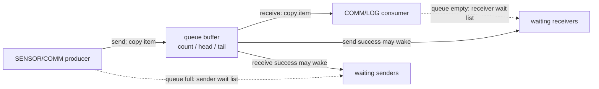
```mermaid
flowchart LR
    P["SENSOR/COMM producer"] -->|"send: copy item"| Q["queue buffer\ncount / head / tail"]
    Q -->|"receive: copy item"| C["COMM/LOG consumer"]
    P -. "queue full: sender wait list" .-> WS["waiting senders"]
    C -. "queue empty: receiver wait list" .-> WR["waiting receivers"]
    Q -->|"send success may wake"| WR
    Q -->|"receive success may wake"| WS
```

实线表示元素怎样进入和离开 buffer，虚线表示队列满或空时任务怎样进入对应等待列表。两条唤醒箭头要一起读：一次 send 或 receive 可能不仅改变 count，还会改变另一个任务的位置。

### 11.4 图 004：队列两侧的发送者和接收者

数据从发送者进入队列，再被接收者取走；等待线则说明队列满或空时，任务会被挂到对应等待关系上。两条线合起来，队列才像一个 RTOS 同步对象，而不只是缓冲区。


图里的队列不是单纯一段 buffer。中间的数据区说明消息放在哪里，两侧的等待关系说明满和空时谁会停下来。读懂这两条线，后面看 `xQueueGenericSend()` 和 `xQueueReceive()` 就不会只盯着拷贝数据。

### 11.5 代码：满和空都会让任务等待

队列的两条线用 [`v9_queue`](F:/DevelopSrc/embedded_system_learning/tutorials/Chapter6_手撕FreeRTOS_底层核心机制/code/v9_queue/demo.c) 来拆。读输出时要同时看数据 count 怎样变化，等待任务怎样被挂起或唤醒。

```c
#include <stdio.h>

#define QUEUE_CAPACITY 2

typedef struct {
    int buffer[QUEUE_CAPACITY];
    unsigned head;
    unsigned tail;
    unsigned count;
    const char *waiting_sender;
    const char *waiting_receiver;
} MiniQueue;

static int send(MiniQueue *queue, const char *task, int value) {
    if (queue->count == QUEUE_CAPACITY) {
        queue->waiting_sender = task;
        printf("%s send %d -> queue full, sender waits\n", task, value);
        return 0;
    }
    queue->buffer[queue->tail] = value;
    queue->tail = (queue->tail + 1) % QUEUE_CAPACITY;
    queue->count++;
    printf("%s send %d -> count=%u\n", task, value, queue->count);
    if (queue->waiting_receiver) {
        printf("wake receiver %s\n", queue->waiting_receiver);
        queue->waiting_receiver = 0;
    }
    return 1;
}

static int receive(MiniQueue *queue, const char *task, int *out) {
    if (queue->count == 0) {
        queue->waiting_receiver = task;
        printf("%s receive -> queue empty, receiver waits\n", task);
        return 0;
    }
    *out = queue->buffer[queue->head];
    queue->head = (queue->head + 1) % QUEUE_CAPACITY;
    queue->count--;
    printf("%s receive %d -> count=%u\n", task, *out, queue->count);
    if (queue->waiting_sender) {
        printf("wake sender %s\n", queue->waiting_sender);
        queue->waiting_sender = 0;
    }
    return 1;
}

int main(void) {
    MiniQueue queue = { { 0 }, 0, 0, 0, 0, 0 };
    int value = 0;

    receive(&queue, "LOG", &value);
    send(&queue, "COMM", 10);
    send(&queue, "COMM", 11);
    send(&queue, "COMM", 12);
    receive(&queue, "LOG", &value);
    send(&queue, "COMM", 12);
    return 0;
}
```

这组输出要同时看两条线：`count` 是数据线，`receiver waits`、`wake receiver`、`sender waits` 是任务线。只盯缓冲区数字，会漏掉队列作为同步对象的作用。

```output
LOG receive -> queue empty, receiver waits
COMM send 10 -> count=1
wake receiver LOG
COMM send 11 -> count=2
COMM send 12 -> queue full, sender waits
LOG receive 10 -> count=1
wake sender COMM
COMM send 12 -> count=2
```

队列输出把两种身份都打出来了。`count=1`、`count=2` 是数据身份，说明缓冲区里有多少元素；`receiver waits`、`sender waits`、`wake receiver`、`wake sender` 是同步身份，说明哪个任务因为队列状态停住，又因为另一侧动作被唤醒。

项目里排查队列时，也要同时看这两类证据。`count` 只能说明容量压力，`blocked` 只能说明任务位置；两类证据合起来，才能判断问题是生产过快、消费过慢，还是唤醒以后没有及时运行。

### 11.6 回到 queue.c：send 和 receive 的主路径

队列源码最容易让人迷路，因为它同时处理数据、等待、超时、ISR、锁计数和很多配置分支。带着 demo 里的两种场景进去会稳很多：空队列上 LOG 等待，COMM 发送后唤醒 LOG；满队列上 COMM 等待，LOG 接收后唤醒 COMM。

| 源码入口 | 先抓住什么 | 解决的问题 |
| --- | --- | --- |
| [`queue.c:xQueueGenericSend()`](F:/DevelopSrc/embedded_system_learning/reference/rtos_src/FreeRTOS-Kernel/queue.c:949) | 队列有空间时怎样发送，满时怎样等待 | 发送方的数据动作和等待动作 |
| [`queue.c:xQueueReceive()`](F:/DevelopSrc/embedded_system_learning/reference/rtos_src/FreeRTOS-Kernel/queue.c:1509) | 队列有数据时怎样接收，空时怎样等待 | 接收方的数据动作和等待动作 |
| [`queue.c:prvCopyDataToQueue()`](F:/DevelopSrc/embedded_system_learning/reference/rtos_src/FreeRTOS-Kernel/queue.c:2393) | 元素怎样进入缓冲区 | 队列不是只改 count |
| [`queue.c:prvCopyDataFromQueue()`](F:/DevelopSrc/embedded_system_learning/reference/rtos_src/FreeRTOS-Kernel/queue.c:2476) | 元素怎样离开缓冲区 | 接收成功可能释放空间 |
| [`list.c:uxListRemove()`](F:/DevelopSrc/embedded_system_learning/reference/rtos_src/FreeRTOS-Kernel/list.c:217) | 等待者怎样从等待列表离开 | send/receive 为什么可能唤醒另一个任务 |

看队列源码时，先抓四件事：数据怎样进入或离开缓冲区，count 怎样变化，等待列表怎样记录阻塞任务，成功操作后是否唤醒另一侧。对应入口是 `xQueueGenericSend()` 和 `xQueueReceive()`；ISR 版本、队列锁计数和覆盖队列可以等主路径清楚后再看。

这样读，`xQueueGenericSend()` 不再只是“把字节拷进去”，它还可能改变接收任务的位置；`xQueueReceive()` 也不只是“把字节取出来”，它还可能唤醒等待空间的发送任务。队列之所以是任务协作对象，正是因为数据动作和调度动作在这里连到了一起。

队列不应该再被理解成“线程安全数组”。它是一条有方向、有容量、有等待规则的任务交接路；数据和任务位置要一起看，少掉一边，解释就会失去半条因果链。

| 问题 | 可以形成的判断 |
| --- | --- |
| 队列为什么同时是数据对象和同步对象 | 因为它既保存元素，也记录满或空时谁需要等待 |
| 队列满了为什么不一定只靠加大容量解决 | 容量只能吸收短峰值，长期生产快于消费仍然会堵 |
| 接收任务被唤醒为什么可能还没立刻处理数据 | 唤醒只是回 ready，之后还要经过调度和切换 |
| 排查队列要同时采哪些证据 | count、水位、sender/receiver wait、wake tick 和实际运行 tick |

这组问题把队列从“存数据”推进到“协调任务”。再往后看 mutex 时，关注点会从数据交接转到资源 owner：数据能不能走是一件事，资源归谁又是另一件事。

## 12 互斥锁是什么：共享资源的所有权边界

队列解决数据交接，互斥锁解决资源所有权。UART、SPI 总线、Flash 写入区都不能被多个任务随意同时使用。读 mutex 时，先盯住 owner 和 waiter：谁拿着资源，谁被挡在门外。

### 12.1 谁拿着 UART，谁就影响响应时间

队列解决了数据怎么交接，但共享资源还有另一类问题：谁能使用它。比如 LOG 正在占用 UART 打日志，COMM 突然要发送响应。没有边界，两边输出会交叉；有了边界，高优先级 COMM 又可能被低优先级 LOG 挡住。

互斥锁要表达的就是这个所有权边界。它让系统知道现在谁是 owner，谁在等 owner 释放资源，等待链有没有影响到更高优先级任务。

### 12.2 mutex 表达资源 owner 和 waiter

互斥锁表达共享资源所有权。一个任务拿到 mutex，表示它暂时拥有这段共享资源；其他任务想用，就必须等待。FreeRTOS mutex 还支持优先级继承：高优先级任务等待低优先级 owner 时，owner 可以临时提高优先级，尽快运行完持锁区。

优先级继承不是让高优先级任务绕过锁，而是让低优先级 owner 少被中优先级任务插队。资源边界仍然存在。

### 12.3 优先级继承缩短高优先级等待链

外设、Flash、I2C、共享缓冲区都需要清楚的 owner。锁让访问边界可解释，也让等待链可观察。没有 owner 和 waiter 的证据，高优先级任务“莫名卡住”就只能靠猜。

工程上真正要优化的，往往不是 mutex API 本身，而是持锁区大小。锁区里做慢串口、Flash 擦写、大量格式化，都会把等待时间放大。

mutex 的图要从 owner 开始，而不是从高优先级任务开始。高优先级任务再急，也不能绕过还没释放的资源 owner。

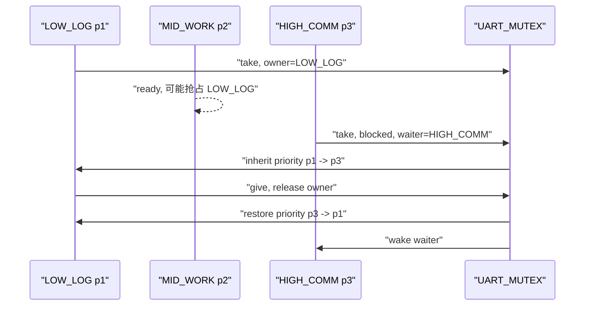
```mermaid
sequenceDiagram
    participant Low as "LOW_LOG p1"
    participant Mid as "MID_WORK p2"
    participant High as "HIGH_COMM p3"
    participant M as "UART_MUTEX"
    Low->>M: "take, owner=LOW_LOG"
    Mid-->>Mid: "ready, 可能抢占 LOW_LOG"
    High->>M: "take, blocked, waiter=HIGH_COMM"
    M->>Low: "inherit priority p1 -> p3"
    Low->>M: "give, release owner"
    M->>Low: "restore priority p3 -> p1"
    M->>High: "wake waiter"
```

优先级继承并不会让 HIGH_COMM 直接拿到资源。它只是让 LOW_LOG 更快得到 CPU，把持锁区跑完并释放 UART_MUTEX。真正决定响应时间的，仍然是 owner 持锁多久、锁内做了什么。

### 12.4 图 015：低优先级 owner 怎样挡住高优先级任务

锁问题先找 owner，再找 waiter。高优先级任务等待低优先级 owner 时，优先级继承会改变 owner 的临时运行机会，但真正要优化的是持锁边界。


读这张图时，先看资源在谁手里，再看高优先级任务被谁挡住，最后看继承只改变 owner 的运行机会。工程判断要落在持锁边界上：mutex 能把资源 owner 和等待者显式化，优先级继承能缩短等待链，但持锁区太长，响应时间仍然会被拖住。

### 12.5 代码：owner 临时继承优先级

mutex 的等待链用 [`v10_mutex_inheritance`](F:/DevelopSrc/embedded_system_learning/tutorials/Chapter6_手撕FreeRTOS_底层核心机制/code/v10_mutex_inheritance/demo.c) 展开。读输出时沿着等待链走：LOW_LOG 拿锁，HIGH_COMM 等锁，owner 临时继承优先级，释放后恢复。

```c
#include <stdio.h>

typedef struct {
    const char *name;
    unsigned base_priority;
    unsigned current_priority;
    int blocked;
} MiniTask;

typedef struct {
    MiniTask *owner;
} MiniMutex;

static void take_mutex(MiniMutex *mutex, MiniTask *task) {
    if (!mutex->owner) {
        mutex->owner = task;
        printf("%s takes mutex\n", task->name);
        return;
    }
    task->blocked = 1;
    printf("%s waits for mutex owned by %s\n", task->name, mutex->owner->name);
    if (task->current_priority > mutex->owner->current_priority) {
        printf("inherit: %s priority %u -> %u\n",
               mutex->owner->name,
               mutex->owner->current_priority,
               task->current_priority);
        mutex->owner->current_priority = task->current_priority;
    }
}

static void give_mutex(MiniMutex *mutex) {
    MiniTask *owner = mutex->owner;
    printf("%s releases mutex, priority restores %u -> %u\n",
           owner->name,
           owner->current_priority,
           owner->base_priority);
    owner->current_priority = owner->base_priority;
    mutex->owner = 0;
}

int main(void) {
    MiniTask low = { "LOW_LOG", 1, 1, 0 };
    MiniTask mid = { "MID_WORK", 2, 2, 0 };
    MiniTask high = { "HIGH_COMM", 3, 3, 0 };
    MiniMutex bus = { 0 };

    take_mutex(&bus, &low);
    printf("%s is ready and could preempt LOW_LOG if no inheritance exists\n", mid.name);
    take_mutex(&bus, &high);
    give_mutex(&bus);
    return 0;
}
```

输出按等待链读最顺：LOW_LOG 先成为 owner，HIGH_COMM 再变成 waiter，继承发生在 owner 身上，释放以后 owner 才恢复原优先级。

```output
LOW_LOG takes mutex
MID_WORK is ready and could preempt LOW_LOG if no inheritance exists
HIGH_COMM waits for mutex owned by LOW_LOG
inherit: LOW_LOG priority 1 -> 3
LOW_LOG releases mutex, priority restores 3 -> 1
```

等待链的关键证据是 `HIGH_COMM waits for mutex owned by LOW_LOG`。`HIGH_COMM` 明明优先级最高，却不能直接越过 `LOW_LOG` 使用 mutex，因为资源 owner 还没有释放。优先级继承让 `LOW_LOG` 临时提高优先级，是为了让 owner 尽快运行完持锁区，而不是让高优先级任务绕过资源边界。

这也是 mutex 调试最容易踩坑的地方。看到高优先级任务卡住，证据要先落到 owner 身上：谁持锁，持了多久，持锁期间做了什么。持锁区过长时，继承只能缓解被中优先级任务插队的问题，不能把慢串口或慢 Flash 变快。

### 12.6 回到 queue.c：mutex 的 owner 和等待链

mutex 的源码入口放在 `queue.c` 里，这一点一开始会让人别扭。别扭是正常的：FreeRTOS 复用了队列机制来表达互斥锁和信号量，所以查“锁”时会走进“队列”文件。只要主线抓住 owner 和等待链，文件名就不会把阅读方向带偏。

| 源码入口 | 先抓住什么 | 解决的问题 |
| --- | --- | --- |
| [`queue.c:xQueueCreateMutex()`](F:/DevelopSrc/embedded_system_learning/reference/rtos_src/FreeRTOS-Kernel/queue.c:647) | mutex 怎样沿 queue 路径创建 | 为什么锁源码会在 `queue.c` 里 |
| [`queue.c:prvInitialiseMutex()`](F:/DevelopSrc/embedded_system_learning/reference/rtos_src/FreeRTOS-Kernel/queue.c:617) | owner 等 mutex 字段怎样初始化 | mutex 和普通队列的差异入口 |
| [`queue.c:xQueueSemaphoreTake()`](F:/DevelopSrc/embedded_system_learning/reference/rtos_src/FreeRTOS-Kernel/queue.c:1795) | owner 已存在时等待者怎样处理 | 高优先级任务为什么会被资源挡住 |
| [`tasks.c:xTaskPriorityInherit()`](F:/DevelopSrc/embedded_system_learning/reference/rtos_src/FreeRTOS-Kernel/tasks.c:6650) | owner 怎样临时继承优先级 | 继承缩短等待，但不改变资源所有权 |
| [`tasks.c:xTaskPriorityDisinherit()`](F:/DevelopSrc/embedded_system_learning/reference/rtos_src/FreeRTOS-Kernel/tasks.c:6753) | 释放后优先级怎样恢复 | owner 释放资源后的收尾 |

FreeRTOS 的 mutex 路径在 `queue.c` 里。这里先把它从普通队列路径里拎出来，看 owner 怎样记录，等待者怎样进入列表，优先级继承怎样触发，释放时怎样恢复和唤醒。把这四个动作对上，mutex 的工程意义就足够清楚。

把这些锚点放进项目排查，顺序会很清楚。mutex 对象是否正确创建、owner 是谁、继承是否发生、释放以后 owner 优先级是否恢复，这些证据要连在一起。它比一句“锁导致卡顿”有用得多，因为它能告诉你到底是 owner 太慢、继承没发生，还是持锁边界设计错了。

优先级继承也有边界。源码能帮助 owner 更快获得 CPU，但不能缩短串口本身的发送时间，也不能替你把持锁区设计得更短。工程优化最终还是要回到锁边界。

看到高优先级任务卡住时，先找资源 owner。调度器愿意让高优先级任务跑，不代表它能绕过还没释放的 UART、I2C、Flash 或共享缓冲区。

| 问题 | 可以形成的判断 |
| --- | --- |
| mutex 和普通队列最大的阅读差异是什么 | mutex 重点看 owner、waiter 和优先级继承，普通队列重点看数据缓冲和两侧等待 |
| 优先级继承解决的是什么 | 缩短低优先级 owner 被中优先级任务插队的时间 |
| 优先级继承解决不了什么 | 解决不了持锁区本身太长，也不能让慢外设变快 |
| 高优先级任务等待锁时第一轮采什么证据 | owner、waiter、持锁开始 tick、释放 tick、owner 临时优先级 |

能回答这四问，mutex 就不再只是“防止同时访问”的工具，而是一条能影响调度结果的资源所有权链。接下来读内存管理时，关注点会再次换一个角度：任务、队列、锁都不是凭空存在的对象，它们都要占用 RAM，也都会在资源不足时暴露出工程边界。

## 13 heap_4 是什么：动态对象背后的 RAM 管家

任务、队列、锁看起来是软件对象，落到 MCU 上却都要占 RAM。`heap_4` 最适合回答一个朴素但常见的问题：明明还剩一点内存，为什么动态申请还是失败。关键不是只看剩余总量，还要看有没有足够大的连续块。

### 13.1 任务和队列最终都会消耗 RAM

任务、队列、锁和栈都不是凭空出现的。每个 TCB、每段任务栈、每个队列存储区、每个 mutex 控制块，最后都会落到 RAM 上。静态创建时，应用自己提供这块 RAM；动态创建时，材料来自 FreeRTOS heap。

所以 RTOS 学到这里，“对象能不能创建”只是入口，更重要的是“对象材料从哪里来、生命周期多长、失败时有没有证据”。内存规划薄弱，很多问题会在系统跑一段时间以后才爆出来。

### 13.2 heap_4 管理可切分、可合并的空闲块

当任务创建失败但 `total_free` 看起来还够时，问题往往不在“还剩多少”，而在“剩下的内存有没有连成一块”。heap_4 维护空闲块链表。分配时，它寻找足够大的空闲块，必要时把大块切成已用块和剩余空闲块；释放时，它把块放回空闲链表，并尝试和相邻空闲块合并。

这个机制比简单 bump allocator 灵活，但它不是魔法。它能合并相邻空闲块，不能把被对象隔开的碎片自动拼到一起，也不能让 RAM 总量变多。

### 13.3 总剩余和最大连续块不是一回事

嵌入式 RAM 有边界。创建失败不一定说明总剩余内存为 0，也可能是最大连续块不够大。任务栈溢出、越界写坏 TCB、运行期频繁创建删除对象，都会让内存问题表现得很晚、很随机。

因此，内存排查要从一个返回值扩展到一组证据：当前剩余 heap、历史最小剩余 heap、最大连续块、任务栈水位和对象生命周期。

heap_4 的难点在于“总剩余”和“最大连续块”会分离。下面这个小图展示同样是空闲内存，形状不同，能满足的申请就不同。

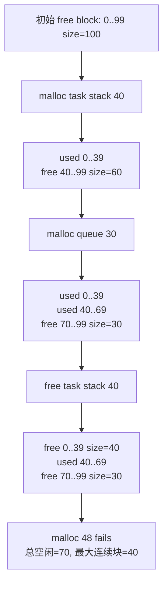
```mermaid
flowchart TB
    A["初始 free block: 0..99 size=100"] --> B["malloc task stack 40"]
    B --> C["used 0..39\nfree 40..99 size=60"]
    C --> D["malloc queue 30"]
    D --> E["used 0..39\nused 40..69\nfree 70..99 size=30"]
    E --> F["free task stack 40"]
    F --> G["free 0..39 size=40\nused 40..69\nfree 70..99 size=30"]
    G --> H["malloc 48 fails\n总空闲=70, 最大连续块=40"]
```

反直觉点在最后一格：总空闲 70，却申请 48 失败。原因是两块 free 中间隔着 used block，heap_4 只能合并相邻空闲块，不能把不相邻的碎片拼起来。读懂这个点，任务创建失败就不会只盯着 `xPortGetFreeHeapSize()`。

### 13.4 图 007：对象生命周期怎样改变 free list

内存问题要同时看剩余总量和空闲块形状。分配会切分块，释放会尝试合并相邻块；创建失败时，最大连续块往往比总剩余更有解释力。

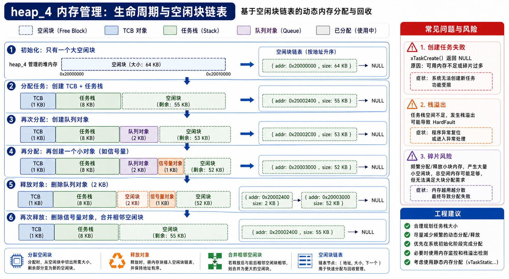

带着“最大连续块”去看，heap_4 的行为会清楚很多。分配会改变空闲块形状，释放只有在相邻时才容易合并；所以创建失败时，除了还剩多少 heap，还要问有没有一块足够大的连续空间。

### 13.5 代码：分配、释放和相邻合并

heap_4 的形状变化用 [`v11_heap4_allocator`](F:/DevelopSrc/embedded_system_learning/tutorials/Chapter6_手撕FreeRTOS_底层核心机制/code/v11_heap4_allocator/demo.c) 看。重点是空闲块怎样被切开、放回、再合并，而不只是剩余总量的数字。

```c
#include <stdio.h>

typedef struct {
    unsigned start;
    unsigned size;
    int free;
} Block;

static void print_blocks(const Block blocks[], unsigned count, const char *label) {
    printf("%s\n", label);
    for (unsigned i = 0; i < count; ++i) {
        printf("  block%u start=%u size=%u %s\n",
               i,
               blocks[i].start,
               blocks[i].size,
               blocks[i].free ? "free" : "used");
    }
}

int main(void) {
    Block blocks[4] = {
        { 0, 100, 1 },
        { 0, 0, 0 },
        { 0, 0, 0 },
        { 0, 0, 0 }
    };
    unsigned count = 1;

    print_blocks(blocks, count, "initial free list");

    blocks[0] = (Block){ 0, 40, 0 };
    blocks[1] = (Block){ 40, 60, 1 };
    count = 2;
    print_blocks(blocks, count, "after malloc task stack 40");

    blocks[1] = (Block){ 40, 30, 0 };
    blocks[2] = (Block){ 70, 30, 1 };
    count = 3;
    print_blocks(blocks, count, "after malloc queue storage 30");

    blocks[0].free = 1;
    print_blocks(blocks, count, "after free task stack 40");
    puts("malloc 48 fails: total_free=70 largest_free=40");

    blocks[1].free = 1;
    blocks[0] = (Block){ 0, 100, 1 };
    count = 1;
    print_blocks(blocks, count, "after free queue and coalesce adjacent blocks");

    puts("malloc 120 fails: largest free block is 100");
    return 0;
}
```

输出不要只看最后的失败行，要从 free list 形状一路读下来。前面的切分和释放决定了最后为什么总空闲不少，却仍然没有足够大的连续块。

```output
initial free list
  block0 start=0 size=100 free
after malloc task stack 40
  block0 start=0 size=40 used
  block1 start=40 size=60 free
after malloc queue storage 30
  block0 start=0 size=40 used
  block1 start=40 size=30 used
  block2 start=70 size=30 free
after free task stack 40
  block0 start=0 size=40 free
  block1 start=40 size=30 used
  block2 start=70 size=30 free
malloc 48 fails: total_free=70 largest_free=40
after free queue and coalesce adjacent blocks
  block0 start=0 size=100 free
malloc 120 fails: largest free block is 100
```

heap 输出先展示“块的形状”。第一次分配后，100 被切成 40 used 和 60 free；第二次分配后，又变成 40 used、30 used、30 free。释放第一个 40 时，总空闲量变成 70，但中间还有一个 30 used 隔着，所以最大连续块仍然只有 40，申请 48 会失败。

后面的合并再说明另一半：当 queue 那块也释放后，三个相邻区域才重新合成 100。最后 `malloc 120 fails` 是总量也不够的情况，用来提醒你区分两类失败：一种是碎片导致最大连续块不够，另一种是总量本身就不够。真实项目里创建任务、队列和缓冲区时，系统需要的是一块够大的连续 RAM，不能只看一个“还剩多少”的数字。

### 13.6 回到 heap_4.c：分配和释放怎样改变空闲块

读 `heap_4.c` 前，先把脑子里的问题换掉。从“还剩多少内存”推进到“有没有一块足够大的连续空闲块”。这个问题一换，`pvPortMalloc()` 和 `vPortFree()` 的代码就会变得有方向：一个在找块和切块，一个在插回和合并。

| 源码入口 | 先抓住什么 | 解决的问题 |
| --- | --- | --- |
| [`heap_4.c:pvPortMalloc()`](F:/DevelopSrc/embedded_system_learning/reference/rtos_src/FreeRTOS-Kernel/portable/MemMang/heap_4.c:173) | free list 怎样查找和切分空闲块 | 申请失败为什么要看最大连续块 |
| [`heap_4.c:vPortFree()`](F:/DevelopSrc/embedded_system_learning/reference/rtos_src/FreeRTOS-Kernel/portable/MemMang/heap_4.c:354) | 已用块怎样回到空闲链表 | 释放不是简单把总量加回来 |
| [`heap_4.c:prvInsertBlockIntoFreeList()`](F:/DevelopSrc/embedded_system_learning/reference/rtos_src/FreeRTOS-Kernel/portable/MemMang/heap_4.c:504) | 相邻空闲块怎样合并 | heap_4 能合并相邻块，但不能跨过仍在使用的块 |
| [`heap_4.c:xPortGetFreeHeapSize()`](F:/DevelopSrc/embedded_system_learning/reference/rtos_src/FreeRTOS-Kernel/portable/MemMang/heap_4.c:413) / [`heap_4.c:xPortGetMinimumEverFreeHeapSize()`](F:/DevelopSrc/embedded_system_learning/reference/rtos_src/FreeRTOS-Kernel/portable/MemMang/heap_4.c:419) | 当前剩余和历史最小剩余 | 长时间运行为什么要留历史证据 |

对账 heap_4 时，先抓 free list 的查找、切分、插回和相邻合并，对应入口是 `pvPortMalloc()` 和 `vPortFree()`。对齐、块头结构、临界区和 hook 是重要细节，但可以等这条主路径清楚后再补。先把“总剩余”和“最大连续块”分开，项目里的创建失败才有解释力。

项目里最常见的误判，是看到当前剩余 heap 还不少，就认为分配失败不可能来自内存。`heap_4` 会提醒我们：动态申请需要连续空间，碎片会让总剩余和最大连续块分离。调试记录里至少要同时放申请大小、当前剩余、历史最小剩余，以及能够近似反映最大连续块的证据。

这样读完以后，创建失败就不再是一句“内存不够”。你会继续追问申请大小、总剩余、最大连续块、历史最小 heap、对象生命周期和任务栈水位。这个追问习惯，比背分配器实现更重要。

内存问题要从“还有多少”升级到“形状如何”。RTOS 对象需要的是具体材料：TCB、栈、队列存储区、控制块都要落在 RAM 上，而且很多申请需要连续空间。

| 问题 | 可以形成的判断 |
| --- | --- |
| 为什么总剩余不少也可能申请失败 | 空闲内存可能被分成不相邻的小块，最大连续块不够 |
| heap_4 释放时为什么要合并相邻块 | 合并能恢复更大的连续空闲块，降低碎片风险 |
| 动态创建任务失败第一轮看什么 | 申请大小、返回值、当前剩余、历史最小剩余、最大连续块和栈规划 |
| 为什么静态创建常用于关键任务 | 材料在启动前就明确，生命周期稳定，运行中失败面更小 |

### 13.7 第一遍读完：把 CPU、等待、协作和 RAM 连起来

任务对象准备好以后，系统还要回答另一半问题：它怎样向前走，又怎样在等待、数据交接、资源占用和内存边界里停下来。如果只背 API，会觉得每个机制都像新知识；如果按项目现场读，它们其实都在回答同一个问题：某个任务为什么此刻没有按预期继续运行。

这些核心机制可以串成一条排查线：

| 现象 | 第一层问题 | 对应机制 | 要留下的证据 |
| --- | --- | --- | --- |
| LED 到期后没立刻翻转 | 它回 ready 了吗，running 了吗 | Delay、Tick、调度、PendSV | wake tick、ready tick、run tick |
| COMM 被事件唤醒后仍然慢 | 它被选中了吗，又在等谁 | 队列、调度、mutex | wake、current task、owner、waiter |
| LOG 队列快满 | 是峰值，还是消费长期跟不上 | 队列、调度、慢 I/O | count、水位、sender wait、LOG run tick |
| 切换后 HardFault | 恢复的现场是不是坏的 | PendSV、TCB、任务栈 | PSP、栈范围、TCB 栈顶 |
| 动态对象创建失败 | 总量不够，还是连续块不够 | heap_4、对象生命周期 | total free、largest free、申请大小 |

现在可以做一次检查：刚才不是讲了七个互不相干的模块，而是给同一套项目现象准备了七类证据。把任务生命周期重新串起来时，就不需要从零开始解释：对象已经有了，位置已经知道了，CPU 怎样流动、等待怎样发生、协作怎样挡住、RAM 怎样限制，也都有了入口。

## 14 把机制串起来：任务的一生如何经过对象、位置、调度和协作

前面每个机制都像一块零件，单独看能懂，连起来才像系统。一个任务从创建到运行，中间会经过对象准备、列表位置、调度选择、PendSV 切换、队列等待、锁等待和内存约束。把这些动作重新接成一条生命线以后，单个 API 才会回到完整系统里。

### 14.1 一个任务的一生要经过哪些位置

机制拆开讲，是为了让每个动作能看清；真正排查项目时，还要把它们重新合起来。一个任务从创建到运行，会经过内存材料、TCB、栈、ready list、调度、PendSV、等待和唤醒；项目里的一个现象，往往会跨过其中好几步。

比如 COMM 响应慢，可能不是协议函数慢，而是事件入队晚、COMM 唤醒晚、ready 后没被选中、PendSV 没切过去，或者它又在等 UART mutex。把这些机制重新接成一条线，COMM 慢才会从一句抱怨变成几段可以验证的证据。

### 14.2 生命周期是对象、位置、调度和协作的连续变化

任务生命周期是一条主线：创建对象，进入位置，参与调度，获得 CPU，等待时间或事件，再次回到竞争。对象回答“它是谁”，位置回答“它在哪里”，调度回答“它能不能运行”，协作回答“它在等谁”，内存回答“它的材料是否可靠”。

这五个问题会反复出现。只要沿着这条线问，具体 API 名称就不容易把思路带散。

这五个问题可以压成一条证据流。它不是新的知识点，而是把任务栈、TCB、列表、调度、PendSV、队列、mutex 和 heap 重新排成一条能跟着故障走的路线。

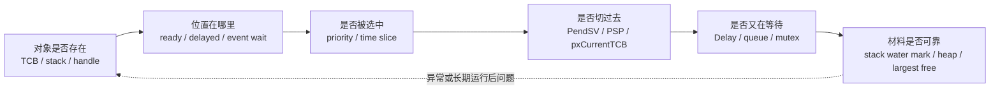
```mermaid
flowchart LR
    A["对象是否存在\nTCB / stack / handle"] --> B["位置在哪里\nready / delayed / event wait"]
    B --> C["是否被选中\npriority / time slice"]
    C --> D["是否切过去\nPendSV / PSP / pxCurrentTCB"]
    D --> E["是否又在等待\nDelay / queue / mutex"]
    E --> F["材料是否可靠\nstack water mark / heap / largest free"]
    F -. "异常或长期运行后问题" .-> A
```

拿 COMM 响应慢做一遍练习会更直观：COMM 任务对象要存在，它可能正在队列等待；事件来以后，它应该从 event wait 回到 ready；如果已经 ready，优先级和当前任务会决定它能不能被选中；如果调度选中了，还要看 PendSV 是否真的切过去；如果切过去后又卡住，再看它是不是在等 UART mutex。这样一个复杂现象就被拆成了几段可以验证的证据。

### 14.3 把散开的机制重新接回项目

真实故障往往跨多个机制。生命周期线能把综合现象拆回具体入口：心跳晚了先看 Delay 和调度，通信慢了先看队列和 PendSV，日志积压先看队列水位和 LOG 消费，创建失败先看 heap 和对象材料，切换后崩溃先看任务栈和 TCB。

这样做不是把名词再念一遍，而是建立一条“从现象回到证据”的路线。

### 14.4 图 008：从创建到切换再到等待的总图

读这张总图时，从左到右复述任务的一生：创建对象，进入 ready，等待调度，运行后可能 Delay、等队列、等锁，然后又被唤醒。能复述这条线，小机制就重新合成系统了。

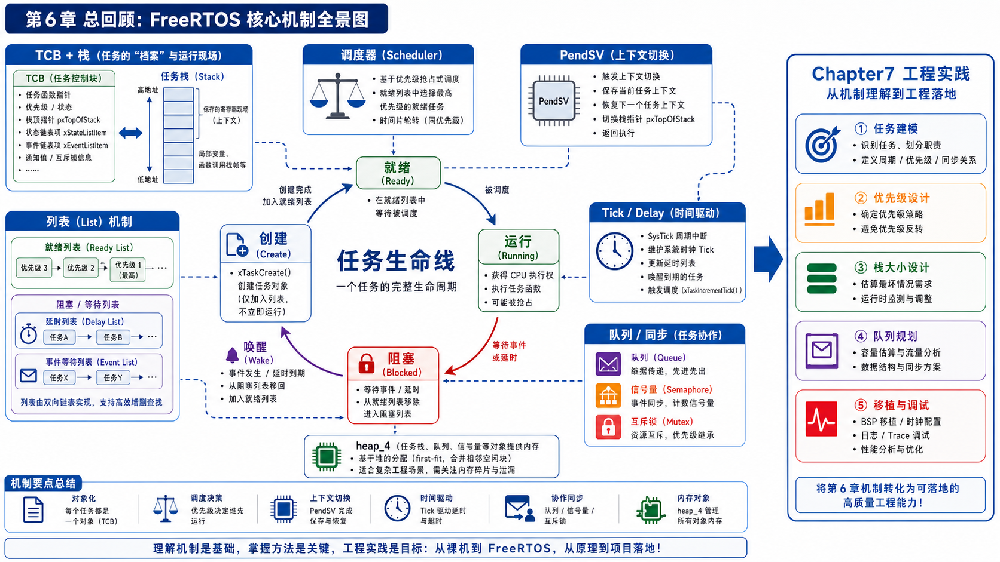

复述这张总图时，把任务当成一个会移动的对象：它先被创建出来，进入 ready，等待调度器选择；PendSV 让它真正运行以后，它又可能因为时间、队列或锁离开 ready。能把这条线复述出来，那些机制就不再是散点。

总图旁边可以再放一张更小的生命线图，专门给第一遍阅读使用。先看 Create、Ready、Selected、Running、Blocked 这五个位置，再看虚线回到 Ready；这条线说明任务不是“状态名在变”，而是在不同位置之间移动。

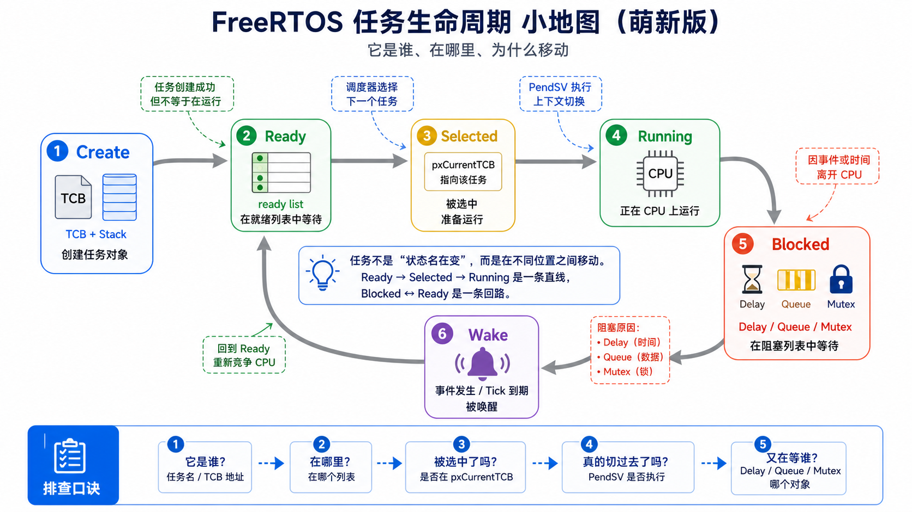

### 14.5 把 demo 输出整理成任务生命线

单个 demo 解决一个动作，真正回到项目时要把它们串成一条生命线。总脚本的价值不在于展示版本数量，而是让裸机痛点、任务对象、任务位置、调度选择、现场切换、等待协作和 RAM 形状按顺序出现。

```powershell
powershell -ExecutionPolicy Bypass -File F:\DevelopSrc\embedded_system_learning\tutorials\Chapter6_手撕FreeRTOS_底层核心机制\code\run_demo.ps1
```

总脚本本身也值得看一眼。它不是神秘工具，只是把每个版本的证据按顺序摊开：能编译就编译运行，不能编译就展示该版本的 `expected-output.txt`。

完整入口在 [`code/run_demo.ps1`](F:/DevelopSrc/embedded_system_learning/tutorials/Chapter6_手撕FreeRTOS_底层核心机制/code/run_demo.ps1)。下面这几行能说明它为什么适合做证据收束：它会递归找到每个版本里的 `run.ps1` 或 `demo.c`，让全章 demo 不是散落的例子，而是一条可复查的证据链。

```powershell
if (!(Test-Path -LiteralPath $demo)) {
    $childRuns = Get-ChildItem -LiteralPath $Dir -Directory | ForEach-Object {
        Join-Path $_.FullName "run.ps1"
    }
    foreach ($childRun in $childRuns) {
        & powershell -ExecutionPolicy Bypass -File $childRun
    }
    return
}
```

读总脚本时看两点。第一，它不会替你解释机制，只负责把每个版本的输出按顺序摊开；第二，它把“我看懂了某个概念”变成“我能指出哪个 demo 输出证明了这个动作”。如果某个版本只剩概念没有输出，任务生命线就断了。

| 生命线位置 | 先看哪个 demo | 输出要证明什么 |
| --- | --- | --- |
| 从裸机痛点出发 | [`v0_bare_loop/demo.c`](F:/DevelopSrc/embedded_system_learning/tutorials/Chapter6_手撕FreeRTOS_底层核心机制/code/v0_bare_loop/demo.c) | 慢日志会拖住心跳、采样和通信 |
| 任务有自己的现场 | [`v1_task_stack/demo.c`](F:/DevelopSrc/embedded_system_learning/tutorials/Chapter6_手撕FreeRTOS_底层核心机制/code/v1_task_stack/demo.c) | 每个任务有独立栈顶和入口参数 |
| 任务被内核识别 | [`v2_tcb/demo.c`](F:/DevelopSrc/embedded_system_learning/tutorials/Chapter6_手撕FreeRTOS_底层核心机制/code/v2_tcb/demo.c) | 名字、优先级、栈顶和列表节点被放进同一个对象 |
| 任务有明确位置 | [`v3_kernel_list/demo.c`](F:/DevelopSrc/embedded_system_learning/tutorials/Chapter6_手撕FreeRTOS_底层核心机制/code/v3_kernel_list/demo.c) | 任务能进入 ready、delayed 或 event wait |
| 创建只是准备对象 | [`v4_static_task_create/demo.c`](F:/DevelopSrc/embedded_system_learning/tutorials/Chapter6_手撕FreeRTOS_底层核心机制/code/v4_static_task_create/demo.c) | 栈、TCB、ready list 三件事同时成立 |
| CPU 只选一个 ready 任务 | [`v5_priority_scheduler/demo.c`](F:/DevelopSrc/embedded_system_learning/tutorials/Chapter6_手撕FreeRTOS_底层核心机制/code/v5_priority_scheduler/demo.c) | 最高优先级和同级轮转如何决定下一个任务 |
| 选中以后还要切现场 | [`v7_pendsv_switch/demo.c`](F:/DevelopSrc/embedded_system_learning/tutorials/Chapter6_手撕FreeRTOS_底层核心机制/code/v7_pendsv_switch/demo.c) | 保存旧 SP、切换当前 TCB、恢复新 SP |
| 等待和协作改变位置 | [`v8_delay_blocked_list/demo.c`](F:/DevelopSrc/embedded_system_learning/tutorials/Chapter6_手撕FreeRTOS_底层核心机制/code/v8_delay_blocked_list/demo.c)、[`v9_queue/demo.c`](F:/DevelopSrc/embedded_system_learning/tutorials/Chapter6_手撕FreeRTOS_底层核心机制/code/v9_queue/demo.c)、[`v10_mutex_inheritance/demo.c`](F:/DevelopSrc/embedded_system_learning/tutorials/Chapter6_手撕FreeRTOS_底层核心机制/code/v10_mutex_inheritance/demo.c) | Delay、队列、mutex 分别怎样让任务离开或回到 ready |
| RAM 决定对象能否长期存在 | [`v11_heap4_allocator/demo.c`](F:/DevelopSrc/embedded_system_learning/tutorials/Chapter6_手撕FreeRTOS_底层核心机制/code/v11_heap4_allocator/demo.c) | 空闲块切分、释放、合并和申请失败原因 |

把输出贴到结构图上时，不要先背抽象分类，先问三件很具体的事：这行日志属于哪个任务，任务从哪里移动到哪里，哪一个字段证明这次移动真的发生了。

比如 `LED ready -> delayed` 说明 LED 离开 ready 并登记等待时间，tick 说明它什么时候该回来；`LOW_LOG owns mutex` 说明 UART 资源还在 LOG 手里，priority change 说明继承已经发生。这样整章会从一串 demo 变成一条可追踪的任务生命线。

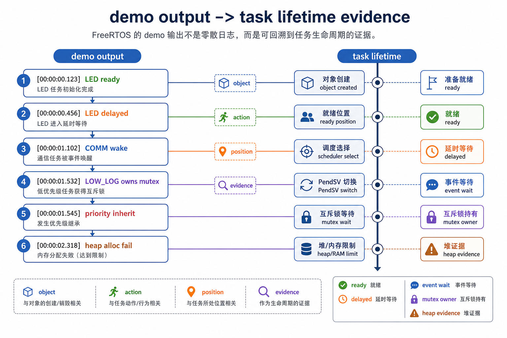

读这张证据映射图时，顺序要从左侧日志开始，而不是从右侧概念开始。先找 `wake`、`delayed`、`owner`、`largest_free` 这些能落到现场的词，再顺着连线看它们把任务送到了哪个位置。

### 14.6 把各文件入口连成任务生命线

前面的源码入口是分散看的，现在要把它们连成一条生命线。读表时不要按文件名背，而是从任务“出生、排队、被选择、被切换、等待、协作、占用 RAM”这条顺序看。

| 源码入口 | 先抓住什么 | 解决的问题 |
| --- | --- | --- |
| [`tasks.c:TCB_t`](F:/DevelopSrc/embedded_system_learning/reference/rtos_src/FreeRTOS-Kernel/tasks.c:375) | 任务身份、栈顶、优先级、列表节点 | 证明任务是内核对象，不是普通函数名 |
| [`tasks.c:xTaskCreateStatic()`](F:/DevelopSrc/embedded_system_learning/reference/rtos_src/FreeRTOS-Kernel/tasks.c:1332) | 静态材料检查、初始化、加入 ready | 证明创建是对象准备，不是立即运行 |
| [`list.c:vListInsert()`](F:/DevelopSrc/embedded_system_learning/reference/rtos_src/FreeRTOS-Kernel/list.c:139) / [`list.c:uxListRemove()`](F:/DevelopSrc/embedded_system_learning/reference/rtos_src/FreeRTOS-Kernel/list.c:217) | 节点进入和离开列表 | 证明任务位置可以被源码追踪 |
| [`tasks.c:vTaskSwitchContext()`](F:/DevelopSrc/embedded_system_learning/reference/rtos_src/FreeRTOS-Kernel/tasks.c:5120) | 从 ready 集合里选任务 | 证明调度是选择当前任务，不是后台线程 |
| [`port.c:xPortPendSVHandler()`](F:/DevelopSrc/embedded_system_learning/reference/rtos_src/FreeRTOS-Kernel/portable/GCC/ARM_CM4F/port.c:504) | 保存当前现场、恢复下一个现场 | 证明选中以后还要发生真正切换 |
| [`tasks.c:vTaskDelay()`](F:/DevelopSrc/embedded_system_learning/reference/rtos_src/FreeRTOS-Kernel/tasks.c:2469) / [`tasks.c:xTaskIncrementTick()`](F:/DevelopSrc/embedded_system_learning/reference/rtos_src/FreeRTOS-Kernel/tasks.c:4736) | 任务离开 ready、到期再唤醒 | 证明 Delay 不是忙等 |
| [`queue.c:xQueueGenericSend()`](F:/DevelopSrc/embedded_system_learning/reference/rtos_src/FreeRTOS-Kernel/queue.c:949) / [`queue.c:xQueueReceive()`](F:/DevelopSrc/embedded_system_learning/reference/rtos_src/FreeRTOS-Kernel/queue.c:1509) | 数据复制和等待者唤醒 | 证明队列同时管数据线和任务线 |
| [`queue.c:mutex path`](F:/DevelopSrc/embedded_system_learning/reference/rtos_src/FreeRTOS-Kernel/queue.c:647) | owner、waiter、继承和恢复 | 证明锁问题要看所有权，不只看优先级 |
| [`heap_4.c:pvPortMalloc()`](F:/DevelopSrc/embedded_system_learning/reference/rtos_src/FreeRTOS-Kernel/portable/MemMang/heap_4.c:173) / [`heap_4.c:vPortFree()`](F:/DevelopSrc/embedded_system_learning/reference/rtos_src/FreeRTOS-Kernel/portable/MemMang/heap_4.c:354) | 空闲块切分、插回、合并 | 证明创建失败可能是连续块不够 |

综合阅读时，源码可以按现象分批打开。任务创建失败就从 heap 和 create 走，通信响应慢就从 queue、ready、scheduler、PendSV 走。每次只证明一条链，源码就会越来越熟，而不是越来越乱。

## 15 项目演练：用一套日志把全章讲活

机制如果只停在图和源码里，读完还是很难迁移到项目。四个任务会回到同一套日志里：LED 晚了、COMM 慢了、LOG 堵了、heap 紧了。真正要建立的能力，是看到一行日志就能说清：它属于哪个任务，任务现在在哪里，谁触发了变化，下一步还缺哪条信息。

### 15.1 用一套日志把四个任务串起来

真实项目不会按章节顺序出题。它常常只给出一串时间戳：LED 抖动，SENSOR 延迟，COMM 超时，LOG 积压，偶尔还夹着一次 heap 申请失败。问题不会写着“请检查 TCB”或“请检查 queue”，它只会表现成一个“不符合预期”的现场。

项目演练要训练的是翻译能力。看到日志，不是先猜哪个 API 用错，而是先把日志翻译成对象、位置、调度、协作和内存证据。

### 15.2 项目演练把机制变成可观察证据

拿到混合日志以后，先别急着给现象起名字。把它放到时间线上，再标出每个任务当时的位置：谁 delayed，谁 ready，谁在 event wait，谁拿着 mutex。位置站稳以后，再把调度选择、队列或 mutex 等待、栈和 heap 证据接上。每一步都能回到对应 demo 和源码入口。

路线固定以后，压力会从“可能性太多”降成几段可排除的证据。对象不对就回创建和 TCB，位置不对就回 list，ready 后仍不运行就回调度，卡在交接点就回 queue 或 mutex，随机崩溃再把栈和 heap 拉进来。

### 15.3 排查需要统一时间线，而不是零散猜测

理解要能离开教材回到项目。演练把 demo 输出变成工程语言：`ready` 不是一个词，而是运行资格；`delayed` 不是睡觉，而是时间等待位置；`owner` 不是变量名，而是资源所有权；`free list` 不是内存课知识，而是对象能否创建的证据。

这也是底层机制通往任务建模的桥。先解释机制为什么这样工作，再讨论项目里任务怎么拆、优先级怎么定、队列容量怎么估、锁边界怎么画，才不会变成凭感觉设计。

混合日志一旦堆在屏幕上，最容易把人带进猜测。先把它拆成几行可追问的记录：这行属于哪个任务，任务位置发生了什么变化，下一步还缺哪条日志。排查会从“感觉哪里都可能错”变成“下一眼该看哪里”。

```output
t=000 create LED, SENSOR, COMM, LOG
t=010 LED delay until t=060
t=018 COMM event queued
t=019 COMM wake ready
t=020 LOG owns UART mutex
t=021 COMM waits UART mutex
t=060 LED wake ready
t=063 PendSV LOG -> COMM
t=064 COMM response sent
t=080 heap malloc 160 fail, largest_free=96
```

| 日志 | 先翻译成什么 | 下一步追问 |
| --- | --- | --- |
| `LED delay until t=060` | LED 从 running 进入 delayed | t=060 是否回 ready，回 ready 后何时运行 |
| `COMM event queued` | 事件进入队列，数据线成立 | COMM 是否被唤醒，队列 count 是否下降 |
| `COMM wake ready` | COMM 获得运行资格 | 优先级是否足够，是否触发切换 |
| `LOG owns UART mutex` | UART 资源 owner 是 LOG | LOG 持锁多久，锁内做了什么 |
| `COMM waits UART mutex` | 高优先级任务被资源挡住 | 是否发生继承，owner 是否尽快释放 |
| `heap malloc 160 fail` | 动态对象材料不够 | 是总量不足，还是最大连续块不足 |

这份拆解的价值不是把日志整理得好看，而是把“下一步看哪里”写出来。很多调试会卡住，是因为看到 `wake ready` 就以为任务已经运行，看到 `mutex` 就以为调度器失效，看到 `heap fail` 就以为总内存为零。表格把这些误判提前拦住。

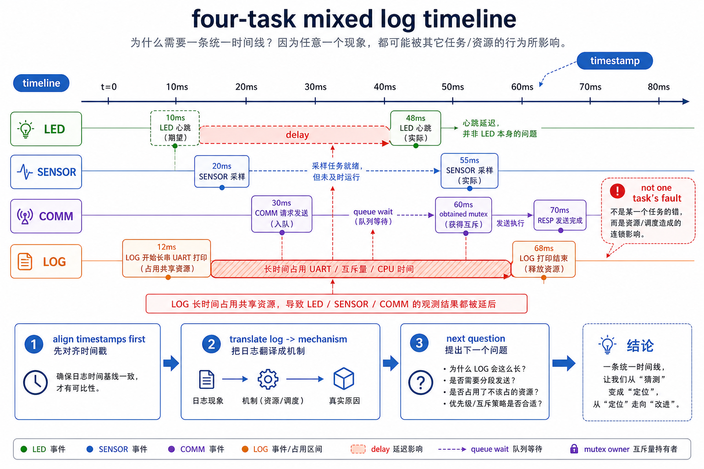

这张时间线要帮读者看清一个事实：同一段慢响应里，任务状态、资源 owner 和内存申请可能同时变化。图后不要急着下结论，先按时间点复述“谁醒了、谁挡住了、谁真的运行了”，再进入下一张总路线图。

### 15.4 图 001：从路线图回到小项目现场

这张路线图现在倒着读：先从项目日志出发，再把每个现象挂回任务、列表、调度、队列、锁和 heap。它的作用不是总结名词，而是把排查顺序固定下来。


从项目日志倒回路线图时，要把每个学习阶段翻译成项目问题：任务为什么能回来，为什么 ready 还没运行，为什么队列既有数据又有等待者，为什么 heap 失败不只看总剩余。这样路线图就不是目录，而是排查时能拿来走的路径。

### 15.5 用总脚本检查证据链是否完整

项目日志拆完以后，再跑一次总脚本，不是为了展示版本多，而是检查证据链有没有断点。输出里如果找不到某个机制的证据，回到真实项目时也很难解释对应现象。

```powershell
powershell -ExecutionPolicy Bypass -File F:\DevelopSrc\embedded_system_learning\tutorials\Chapter6_手撕FreeRTOS_底层核心机制\code\run_demo.ps1
```

跑完以后先把输出贴回项目日志，确认每个机制都有一条能说清楚的证据。完整版本说明在 [`code/README.md`](F:/DevelopSrc/embedded_system_learning/tutorials/Chapter6_手撕FreeRTOS_底层核心机制/code/README.md)，每个 demo 的预期输出也放在对应目录的 `expected-output.txt` 里。

| 项目日志里的困惑 | 对应 demo | 预期输出要抓住的词 |
| --- | --- | --- |
| 慢日志为什么能拖慢整个系统 | [`v0_bare_loop/expected-output.txt`](F:/DevelopSrc/embedded_system_learning/tutorials/Chapter6_手撕FreeRTOS_底层核心机制/code/v0_bare_loop/expected-output.txt) | `slow log blocks loop`、心跳和采样延后 |
| 任务为什么能暂停后继续 | [`v1_task_stack/expected-output.txt`](F:/DevelopSrc/embedded_system_learning/tutorials/Chapter6_手撕FreeRTOS_底层核心机制/code/v1_task_stack/expected-output.txt) | `stack base`、`top`、`parameter` |
| ready 为什么不是 running | [`v5_priority_scheduler/expected-output.txt`](F:/DevelopSrc/embedded_system_learning/tutorials/Chapter6_手撕FreeRTOS_底层核心机制/code/v5_priority_scheduler/expected-output.txt) | `selected`、`round robin`、`blocked skipped` |
| Delay 到期为什么还可能晚 | [`v8_delay_blocked_list/expected-output.txt`](F:/DevelopSrc/embedded_system_learning/tutorials/Chapter6_手撕FreeRTOS_底层核心机制/code/v8_delay_blocked_list/expected-output.txt) | `delayed -> ready`、`not running yet` |
| COMM 为什么收到事件还会卡 | [`v9_queue/expected-output.txt`](F:/DevelopSrc/embedded_system_learning/tutorials/Chapter6_手撕FreeRTOS_底层核心机制/code/v9_queue/expected-output.txt)、[`v10_mutex_inheritance/expected-output.txt`](F:/DevelopSrc/embedded_system_learning/tutorials/Chapter6_手撕FreeRTOS_底层核心机制/code/v10_mutex_inheritance/expected-output.txt) | `waiting receiver`、`owner`、`priority inherited` |
| malloc 失败为什么不能只看剩余总量 | [`v11_heap4_allocator/expected-output.txt`](F:/DevelopSrc/embedded_system_learning/tutorials/Chapter6_手撕FreeRTOS_底层核心机制/code/v11_heap4_allocator/expected-output.txt) | `largest_free`、`split`、`coalesce` |

把输出贴到结构图上时，重点不是记住每个 demo 的全部实现，而是能说出这段输出改变了什么现场：任务离开 ready、任务回到 ready、调度选中某个任务、PendSV 切换现场、queue 唤醒等待者、mutex 暂时抬高 owner、heap 切分或合并空闲块。能做到这一点，代码就不是附录，而是正文的一部分。

### 15.6 演练只引用已经读过的源码入口

演练阶段最怕又打开一堆新文件，把刚建立起来的路线打散。这里不再扩展新源码，只引用已经出现过的入口，用同一条混合日志回到前面那些机制。

| 源码入口 | 先抓住什么 | 解决的问题 |
| --- | --- | --- |
| [`code/run_demo.ps1`](F:/DevelopSrc/embedded_system_learning/tutorials/Chapter6_手撕FreeRTOS_底层核心机制/code/run_demo.ps1) | `all demos` | 输出证据总览 |
| [`tasks.c:prvAddNewTaskToReadyList()`](F:/DevelopSrc/embedded_system_learning/reference/rtos_src/FreeRTOS-Kernel/tasks.c:2052) | 创建完成后进入 ready | 解释 `create` 日志后为什么还要等调度 |
| [`tasks.c:taskSELECT_HIGHEST_PRIORITY_TASK()`](F:/DevelopSrc/embedded_system_learning/reference/rtos_src/FreeRTOS-Kernel/tasks.c:289) | 从最高优先级 ready list 选任务 | 解释 `wake ready` 后谁先运行 |
| [`queue.c:xTaskRemoveFromEventList()` 调用点](F:/DevelopSrc/embedded_system_learning/reference/rtos_src/FreeRTOS-Kernel/queue.c:1049) | send 成功后唤醒等待接收者 | 解释事件到达后为什么可能触发唤醒 |
| [`heap_4.c:prvInsertBlockIntoFreeList()`](F:/DevelopSrc/embedded_system_learning/reference/rtos_src/FreeRTOS-Kernel/portable/MemMang/heap_4.c:504) | 释放块按地址插回并尝试合并 | 解释 `largest_free` 怎样变化 |

总脚本的意义不是展示“demo 很多”，而是检查证据链是否完整。裸机痛点、任务对象、任务位置、调度选择、现场切换、等待唤醒、数据交接、资源所有权、内存块形状都能跑出来，机制才有机会真正进入项目判断。

## 16 贯穿排查剧本：任务为什么没有按预期运行

当一个任务没有按预期向前走，先别急着猜 API。把现场拆成五层会更稳：对象层、位置层、调度层、协作层、内存层。每层都有能观察的证据，也都有对应的源码入口。

这五层不是考试提纲，更像坐在调试器前的一条路线：对象有没有被创建出来，任务现在在哪个位置；如果它已经 ready，调度为什么还没让它运行；如果它在等队列或锁，协作对象是谁；如果现象随机、延后、切换后才爆，栈和 heap 也要被拉进同一张证据图。

这条路线可以画成一个很朴素的排查树。朴素反而有用，因为它能让人在压力下不乱跳。

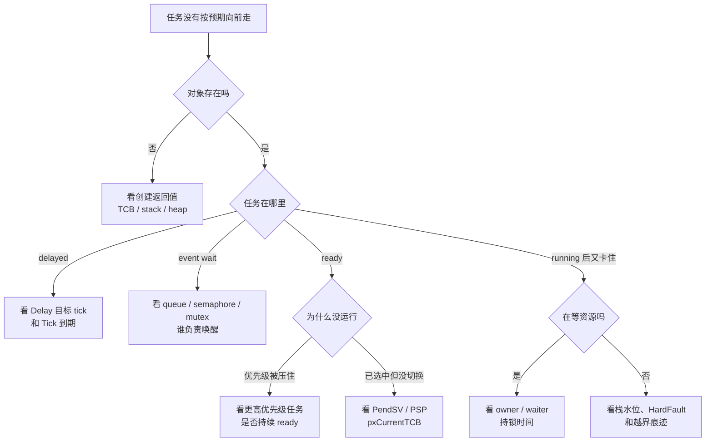
```mermaid
flowchart TD
    A["任务没有按预期向前走"] --> B{"对象存在吗"}
    B -- "否" --> B1["看创建返回值\nTCB / stack / heap"]
    B -- "是" --> C{"任务在哪里"}
    C -- "delayed" --> C1["看 Delay 目标 tick\n和 Tick 到期"]
    C -- "event wait" --> C2["看 queue / semaphore / mutex\n谁负责唤醒"]
    C -- "ready" --> D{"为什么没运行"}
    D -- "优先级被压住" --> D1["看更高优先级任务\n是否持续 ready"]
    D -- "已选中但没切换" --> D2["看 PendSV / PSP\npxCurrentTCB"]
    C -- "running 后又卡住" --> E{"在等资源吗"}
    E -- "是" --> E1["看 owner / waiter\n持锁时间"]
    E -- "否" --> F["看栈水位、HardFault\n和越界痕迹"]
```

这棵树不能替你自动定位根因，但它能保护第一轮排查不乱跳。任务没动时，先找对象，再找位置，再找调度；发现任务在等别人时，再看队列、mutex 和 owner；现象随机、延后或切换后爆掉时，再把栈、heap 和现场记录拉进来。越是复杂的现场，越需要这种简单顺序兜住。

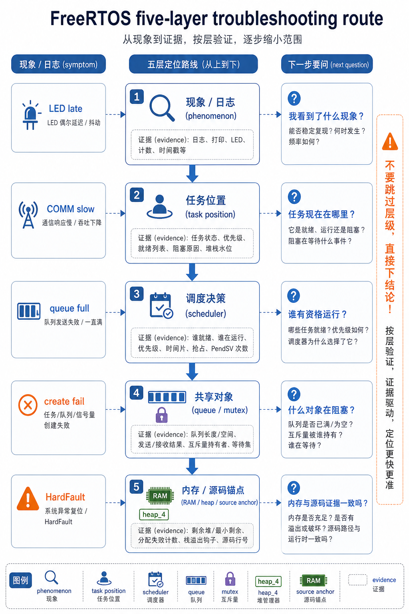

| 层次 | 问题 | 证据 | 回看章节 |
| --- | --- | --- | --- |
| 对象层 | 任务、队列、锁是否真的创建成功 | 返回值、句柄、任务名、创建日志 | 第 3 到第 6 节 |
| 位置层 | 任务现在排在哪里 | ready、delayed、event wait、blocked | 第 5、10、11 节 |
| 调度层 | ready 任务为什么没有运行 | 优先级、时间片、当前任务、PendSV | 第 7 到第 9 节 |
| 协作层 | 数据或资源是否挡住了任务 | 队列水位、等待列表、mutex owner | 第 11、12 节 |
| 内存层 | RAM 是否支持对象长期稳定运行 | heap、最大连续块、栈水位、越界痕迹 | 第 13 节 |

表里的顺序不是绝对的，但它适合新手稳住第一遍排查：先看最容易观察、最不容易误判的现象，再逐步走向更隐蔽的内存和现场问题。真实项目里可以把它贴到调试记录前面，每次只沿着一条现象往下走。

这棵树不能停在“看起来清楚”。每个判断节点都要接到一个可运行 demo 和一个 FreeRTOS 源码入口：先用 demo 复现机制形状，再用源码确认真实内核是不是走同一种动作。

| 判断节点 | 先跑哪个 demo | 再看哪个源码入口 | 这一问真正要证明什么 |
| --- | --- | --- | --- |
| 对象是否存在 | [`v4_static_task_create/demo.c`](F:/DevelopSrc/embedded_system_learning/tutorials/Chapter6_手撕FreeRTOS_底层核心机制/code/v4_static_task_create/demo.c) | [`tasks.c:xTaskCreateStatic()`](F:/DevelopSrc/embedded_system_learning/reference/rtos_src/FreeRTOS-Kernel/tasks.c:1332) | 栈、TCB、入口参数、ready 节点是否都准备好 |
| 任务在哪里 | [`v3_kernel_list/demo.c`](F:/DevelopSrc/embedded_system_learning/tutorials/Chapter6_手撕FreeRTOS_底层核心机制/code/v3_kernel_list/demo.c) | [`list.c:vListInsert()`](F:/DevelopSrc/embedded_system_learning/reference/rtos_src/FreeRTOS-Kernel/list.c:139) | 任务是在 ready、delayed，还是 event wait |
| ready 后为什么没运行 | [`v5_priority_scheduler/demo.c`](F:/DevelopSrc/embedded_system_learning/tutorials/Chapter6_手撕FreeRTOS_底层核心机制/code/v5_priority_scheduler/demo.c) | [`tasks.c:vTaskSwitchContext()`](F:/DevelopSrc/embedded_system_learning/reference/rtos_src/FreeRTOS-Kernel/tasks.c:5120) | 调度器选中的到底是谁 |
| 选中后有没有切过去 | [`v7_pendsv_switch/demo.c`](F:/DevelopSrc/embedded_system_learning/tutorials/Chapter6_手撕FreeRTOS_底层核心机制/code/v7_pendsv_switch/demo.c) | [`port.c:xPortPendSVHandler()`](F:/DevelopSrc/embedded_system_learning/reference/rtos_src/FreeRTOS-Kernel/portable/GCC/ARM_CM4F/port.c:504) | 旧现场是否保存，新现场是否恢复 |
| 是不是被数据或资源挡住 | [`v9_queue/demo.c`](F:/DevelopSrc/embedded_system_learning/tutorials/Chapter6_手撕FreeRTOS_底层核心机制/code/v9_queue/demo.c)、[`v10_mutex_inheritance/demo.c`](F:/DevelopSrc/embedded_system_learning/tutorials/Chapter6_手撕FreeRTOS_底层核心机制/code/v10_mutex_inheritance/demo.c) | [`queue.c:xQueueGenericSend()`](F:/DevelopSrc/embedded_system_learning/reference/rtos_src/FreeRTOS-Kernel/queue.c:949)、[`queue.c:xQueueSemaphoreTake()`](F:/DevelopSrc/embedded_system_learning/reference/rtos_src/FreeRTOS-Kernel/queue.c:1795) | 是数据没到、等待者没醒，还是 owner 没释放 |
| 是不是内存材料出问题 | [`v11_heap4_allocator/demo.c`](F:/DevelopSrc/embedded_system_learning/tutorials/Chapter6_手撕FreeRTOS_底层核心机制/code/v11_heap4_allocator/demo.c) | [`heap_4.c:pvPortMalloc()`](F:/DevelopSrc/embedded_system_learning/reference/rtos_src/FreeRTOS-Kernel/portable/MemMang/heap_4.c:173) | 失败是总量不足、连续块不足，还是更早的越界破坏 |

### 16.1 LED 心跳偶尔晚很多

我们先把现象翻译成时间线。LED 晚了，可能是 LED 任务没有 ready，可能是 ready 以后被更高优先级任务压住，也可能是日志或临界区让系统长时间无法切换。先记录三类材料就够用：LED 打印时间、当前高优先级任务输出、系统里慢 I/O 的持续时间。

如果 LED 使用 Delay，证据要从两个位置变化开始：它是否按预期离开 ready list，Tick 到期以后是否回到 ready list。到期回 ready 和立刻运行是两个动作，这个区分在排查心跳抖动时很重要。调度器还要比较 ready 集合里的优先级，PendSV 还要真正恢复 LED 现场。

把 LED 晚点这件事落到证据上，可以按三步看。

| 先问什么 | 看哪个 demo | 再对哪段源码 | 能排除什么误判 |
| --- | --- | --- | --- |
| LED 是否真的进入等待 | [`v8_delay_blocked_list/demo.c`](F:/DevelopSrc/embedded_system_learning/tutorials/Chapter6_手撕FreeRTOS_底层核心机制/code/v8_delay_blocked_list/demo.c) 里的 `mini_delay()` | [`tasks.c:vTaskDelay()`](F:/DevelopSrc/embedded_system_learning/reference/rtos_src/FreeRTOS-Kernel/tasks.c:2469) | 不是每一次晚点都说明业务代码跑慢了 |
| Tick 到期后是否回到 ready | `tick -> wake` 输出 | [`tasks.c:xTaskIncrementTick()`](F:/DevelopSrc/embedded_system_learning/reference/rtos_src/FreeRTOS-Kernel/tasks.c:4736) | 到期回 ready 不等于已经运行 |
| ready 后为什么还没翻转 | [`v5_priority_scheduler/demo.c`](F:/DevelopSrc/embedded_system_learning/tutorials/Chapter6_手撕FreeRTOS_底层核心机制/code/v5_priority_scheduler/demo.c) | [`tasks.c:vTaskSwitchContext()`](F:/DevelopSrc/embedded_system_learning/reference/rtos_src/FreeRTOS-Kernel/tasks.c:5120) | 不要一上来就把抖动归咎于中断 |

这样读，LED 心跳就不再是一句“系统卡了”。它会被拆成等待是否正确、唤醒是否发生、调度是否给机会这三件事。

### 16.2 COMM 收到事件以后响应晚

COMM 是外部响应任务，排查时要先确认事件有没有进入系统。事件进入后，COMM 是否被唤醒，唤醒后是否 ready，ready 后是否被选中，这三问要分开。很多通信问题看起来像协议问题，实际是任务位置和优先级没有设计清楚。

队列在这里很关键。如果 ISR 或接收任务把数据放进队列，COMM 等待接收，那么发送动作应该唤醒等待者。唤醒以后还要看 COMM 优先级是否足够高，以及它自己是否马上去等另一个资源。把队列、调度和 mutex 连起来，响应路径就会清楚很多。

这时 COMM 自己的协议日志只是其中一层。更稳的读法，是把响应晚拆成三条证据线。

| 证据线 | 最小模型 | 源码入口 | 读的时候只追什么 |
| --- | --- | --- | --- |
| 数据是否进入队列 | [`v9_queue/demo.c`](F:/DevelopSrc/embedded_system_learning/tutorials/Chapter6_手撕FreeRTOS_底层核心机制/code/v9_queue/demo.c) | [`queue.c:xQueueGenericSend()`](F:/DevelopSrc/embedded_system_learning/reference/rtos_src/FreeRTOS-Kernel/queue.c:949) | 数据有没有从生产者交出去 |
| COMM 是否被唤醒 | [`v9_queue/demo.c`](F:/DevelopSrc/embedded_system_learning/tutorials/Chapter6_手撕FreeRTOS_底层核心机制/code/v9_queue/demo.c) | [`queue.c:xQueueReceive()`](F:/DevelopSrc/embedded_system_learning/reference/rtos_src/FreeRTOS-Kernel/queue.c:1509) | 等待者是否离开等待队列 |
| COMM 是否被 UART 挡住 | [`v10_mutex_inheritance/demo.c`](F:/DevelopSrc/embedded_system_learning/tutorials/Chapter6_手撕FreeRTOS_底层核心机制/code/v10_mutex_inheritance/demo.c) | [`queue.c:xQueueSemaphoreTake()`](F:/DevelopSrc/embedded_system_learning/reference/rtos_src/FreeRTOS-Kernel/queue.c:1795) | owner 是谁，高优先级任务是不是在等锁 |

这样拆完，协议问题和调度问题就不会混成一团。读源码时也只追 COMM 这一条路径，不需要把 `queue.c` 从头看到尾。

### 16.3 LOG 队列经常满

LOG 队列满，说明生产和消费之间出现了积压。证据要覆盖日志产生速率、LOG 任务消费速率，以及串口或存储输出的耗时。队列容量可以缓冲波峰，但容量不能解决长期消费不足。

工程上要决定日志价值。低价值调试日志可以丢弃或降级，高价值故障日志要保证路径。LOG 任务优先级通常不宜压过通信和采样，但也不能低到长期没有机会消费队列。这个取舍就是 RTOS 项目里很真实的时间管理。

“满”要拆成两个问题：是不是生产太快，还是消费者长期没有运行。[`v9_queue/expected-output.txt`](F:/DevelopSrc/embedded_system_learning/tutorials/Chapter6_手撕FreeRTOS_底层核心机制/code/v9_queue/expected-output.txt) 里同时出现队列计数和等待者变化，适合训练这个分辨。

源码只需要先打开两个入口。先看 [`queue.c:xQueueGenericSend()`](F:/DevelopSrc/embedded_system_learning/reference/rtos_src/FreeRTOS-Kernel/queue.c:949)，确认队列满时发送方会怎样处理。

再看 [`tasks.c:vTaskSwitchContext()`](F:/DevelopSrc/embedded_system_learning/reference/rtos_src/FreeRTOS-Kernel/tasks.c:5120)，确认 LOG 是否长期被更高优先级任务压住。前者回答容量，后者回答运行机会，不要把两类问题揉成一句“队列不够”。

### 16.4 任务创建偶发失败

创建失败要把返回值和内存来源放在一起看。静态创建时，检查栈数组和 TCB 缓冲区生命周期；动态创建时，检查 heap 剩余、最大连续块和配置大小。任务栈配置过大，会让系统启动阶段就吃掉大量 RAM；配置过小，又会在运行后把错误拖到更难排查的地方。

heap_4 的合并能力可以缓解碎片，但它不能让 RAM 变多。长期项目要记录最小剩余堆和任务栈水位，最好在压力测试里覆盖高峰通信、密集日志和异常路径。内存证据越早收集，后面的定位越稳。

创建失败不要只看一个返回值。先分清它是静态材料不完整，还是动态内存拿不到。

| 创建方式 | 先看哪个 demo | 对账源码 | 关键证据 |
| --- | --- | --- | --- |
| 静态创建 | [`v4_static_task_create/demo.c`](F:/DevelopSrc/embedded_system_learning/tutorials/Chapter6_手撕FreeRTOS_底层核心机制/code/v4_static_task_create/demo.c) | [`tasks.c:xTaskCreateStatic()`](F:/DevelopSrc/embedded_system_learning/reference/rtos_src/FreeRTOS-Kernel/tasks.c:1332) | 静态栈、静态 TCB、入口参数、ready list 是否都齐 |
| 动态申请 | [`v11_heap4_allocator/demo.c`](F:/DevelopSrc/embedded_system_learning/tutorials/Chapter6_手撕FreeRTOS_底层核心机制/code/v11_heap4_allocator/demo.c) | [`heap_4.c:pvPortMalloc()`](F:/DevelopSrc/embedded_system_learning/reference/rtos_src/FreeRTOS-Kernel/portable/MemMang/heap_4.c:173)、[`heap_4.c:vPortFree()`](F:/DevelopSrc/embedded_system_learning/reference/rtos_src/FreeRTOS-Kernel/portable/MemMang/heap_4.c:354) | `largest_free` 是否足够，而不只是剩余总量是否好看 |

这里真正要拿到的，是把“创建失败”从一句笼统现象拆成材料问题和分配问题。材料不齐要回到任务对象，连续块不足要回到堆管理。

### 16.5 上下文切换后 HardFault

这种问题要把目光放到现场。当前任务和下一个任务是谁，PSP 是否落在对应任务栈范围内，TCB 里的栈顶字段是否合理，这几项要同时出现。PendSV 本身只是按规则保存和恢复；如果它恢复了被破坏的现场，故障会在切换点爆发。

根因可能包括任务栈过小、数组越界写坏 TCB、错误的中断优先级配置、在不合适的上下文调用了需要任务上下文的 API。排查时需要避免只盯着 HardFault 现场，还要倒回去找谁在更早的时候破坏了现场。

这一类问题最需要分清“切换机制错了”和“切换时暴露了旧破坏”。[`v7_pendsv_switch/demo.c`](F:/DevelopSrc/embedded_system_learning/tutorials/Chapter6_手撕FreeRTOS_底层核心机制/code/v7_pendsv_switch/demo.c) 只演示一条最小链：保存旧 SP、更新当前任务、恢复新 SP。

真实源码先看 [`port.c:xPortPendSVHandler()`](F:/DevelopSrc/embedded_system_learning/reference/rtos_src/FreeRTOS-Kernel/portable/GCC/ARM_CM4F/port.c:504)，确认切换动作本身：旧 PSP 是否保存，新 PSP 是否恢复，`pxCurrentTCB` 是否指向下一个任务。

再看 [`port.c:pxPortInitialiseStack()`](F:/DevelopSrc/embedded_system_learning/reference/rtos_src/FreeRTOS-Kernel/portable/GCC/ARM_CM4F/port.c:202)，确认任务第一次运行前现场应该长什么样。

这两个入口不要混成一团：一个负责“切换时怎么交接”，一个负责“第一次现场怎么摆好”。边界分清以后，HardFault 的倒查方向会稳很多。

如果 PSP 已经不在任务栈范围内，就倒回 [`v1_task_stack/demo.c`](F:/DevelopSrc/embedded_system_learning/tutorials/Chapter6_手撕FreeRTOS_底层核心机制/code/v1_task_stack/demo.c) 的模型：任务栈本来是任务自己的现场空间，不该被别的写越界破坏。

这条排查线的价值很明确：它不是为了覆盖所有细节，而是为了防止第一步走偏。FreeRTOS 问题最怕一上来就凭经验跳到某个函数里；沿着对象、位置、调度、协作、内存走一遍，至少能保证每个判断都有证据。

## 17 工程速查：把核心机制画成七张表

想象一次真实排查会：屏幕上只有一句 `COMM response late`，旁边还有几行 queue count、owner、tick 和 heap 余量。大家如果各看各的，很快会有人说像调度问题，有人说像串口问题，还有人说先加大队列。

七张表的作用不是把文档写厚，而是把同一个现场拆成七个观察窗口，让团队用同一种语言讨论任务、队列、锁、内存和源码入口。一个表填不出来，通常说明项目里还缺证据，而不是说明表格本身麻烦。

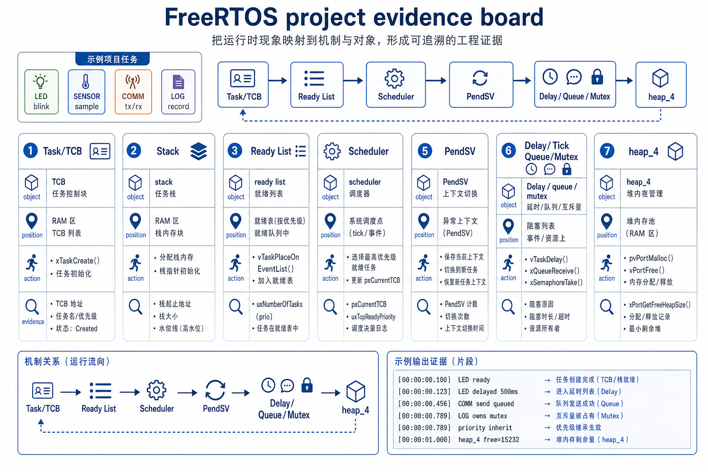

这张看板适合放在表格前面，作用是告诉读者七张表不是额外负担，而是把同一个项目现场拆成七个观察窗口。先看运行输出表，因为故障最先以日志出现；再分别回填任务、队列、锁和内存，因为这些表解释“谁在跑、数据在哪、资源归谁、RAM 是否够”；最后才用源码入口确认动作边界。

### 17.1 任务表

先从任务表开始，是因为所有 RTOS 问题最后都会落回某个执行流。新手常见的困惑是“我创建了好几个任务，但不知道谁负责什么，也不知道谁应该先响应”。任务表先把 LED、SENSOR、COMM、LOG 四个角色摆到桌面上。

| 任务 | 入口函数 | 优先级理由 | 等待点 | 栈证据 |
| --- | --- | --- | --- | --- |
| LED | `LedTask` | 可观察心跳，低实时压力 | Delay | 水位稳定即可 |
| SENSOR | `SensorTask` | 周期采样，节奏明确 | DelayUntil 或定时等待 | 看局部数组和滤波计算 |
| COMM | `CommTask` | 外部响应，通常较高 | 队列或事件 | 看协议解析深度 |
| LOG | `LogTask` | 后台慢 I/O | 队列接收 | 看格式化和缓冲区 |

读任务表时，不要只看任务名，要顺着一行读完：入口函数说明它从哪里开始，等待点说明它什么时候让出 CPU，优先级理由说明它为什么比别人急或不急，栈证据说明它会不会在运行一段时间后把现场踩坏。表填不清楚，代码通常也会乱。

### 17.2 队列表

任务分开以后，下一问就是数据怎样过河。SENSOR 采到的数据要给 COMM，多个任务打出的日志要给 LOG，驱动层的事件要叫醒 COMM；这些都不适合只靠全局变量含糊传递。

| 数据流 | 生产者 | 消费者 | 元素 | 容量判断 | 满队策略 |
| --- | --- | --- | --- | --- | --- |
| 采样数据 | SENSOR | COMM | sample frame | 按采样峰值和发送周期估算 | 超时、丢旧值或上报告警 |
| 日志消息 | 多任务 | LOG | log item | 按高峰日志量估算 | 丢低价值日志或压缩 |
| 接收事件 | ISR/驱动 | COMM | event id | 按外部突发估算 | 统计溢出并触发诊断 |

队列表把“谁给谁数据”讲清楚，也把容量压力提前摆出来。读表时先沿着生产者到消费者的方向看，再看满队策略；如果满队策略写不出来，后面遇到丢日志、卡通信或 ISR 事件堆积时，就只能靠猜。

### 17.3 锁表

队列解决数据交接，锁解决共享资源所有权。UART、I2C、Flash 这类资源不能同时被多个任务乱用，所以表里要写清楚谁可能成为 owner，谁可能在外面等。

| 资源 | 保护对象 | owner 典型任务 | 持锁动作 | 持锁期间避免 |
| --- | --- | --- | --- | --- |
| UART | 发送寄存器和 DMA 通道 | LOG/COMM | 装载缓冲或启动发送 | 长时间格式化、大量等待 |
| I2C | 总线事务 | SENSOR/配置任务 | 一次事务 | 嵌套等待和复杂计算 |
| Flash | 擦写控制器 | 参数任务/日志任务 | 擦写窗口 | 把高优先级任务困在锁外 |

锁表让资源所有权可见。看到 owner 和 waiter，优先级反转就不再是抽象名词，而是一条可以画出来的等待链。表里最值得盯的是“持锁期间避免”：它往往决定高优先级任务到底是在等一次很短的寄存器操作，还是被一段慢日志拖住。

### 17.4 内存表

任务、队列和锁都不是凭空存在的，它们最后都会变成 RAM 里的对象。内存表不是为了算一个静态总和，而是为了提醒你：对象从哪里来，什么时候释放，失败时应该看哪条证据。

| 对象 | 内存来源 | 主要风险 | 观察证据 |
| --- | --- | --- | --- |
| 任务 TCB | 静态缓冲或 heap | 句柄失效、越界破坏 | 任务名、列表字段、栈顶 |
| 任务栈 | 静态数组或 heap | 栈溢出、现场损坏 | 栈水位、HardFault、PSP 范围 |
| 队列存储区 | 静态缓冲或 heap | 容量不足、元素大小错误 | 队列水位、满队次数 |
| mutex 控制块 | 静态缓冲或 heap | owner 错误、等待链过长 | owner、waiter、持锁时间 |

内存表提醒我们：RTOS 对象都要占 RAM。系统越小，越要提前算清楚对象成本；系统越久，越要记录历史最小水位和最大连续块，否则偶发失败会很难复盘。

### 17.5 源码入口表

源码入口表不是阅读顺序表。它的用途是在遇到现象时帮你选入口：心跳晚了先找 Delay 和 Tick，通信慢了先找队列和调度，切换后崩了先找 PendSV 和任务栈。每次只拿一个现象进源码，读出来的东西才会变成证据。

| 机制 | 第一轮入口 | 看什么动作 |
| --- | --- | --- |
| 任务栈 | [`pxPortInitialiseStack()`](F:/DevelopSrc/embedded_system_learning/reference/rtos_src/FreeRTOS-Kernel/portable/GCC/ARM_CM4F/port.c:202) | 初始 PC、参数、返回栈顶 |
| TCB | [`TCB_t`](F:/DevelopSrc/embedded_system_learning/reference/rtos_src/FreeRTOS-Kernel/tasks.c:375) | 身份、现场、调度、列表字段 |
| 列表 | [`vListInsert()`](F:/DevelopSrc/embedded_system_learning/reference/rtos_src/FreeRTOS-Kernel/list.c:139) / [`uxListRemove()`](F:/DevelopSrc/embedded_system_learning/reference/rtos_src/FreeRTOS-Kernel/list.c:217) | 任务节点进入和离开位置 |
| 创建 | [`xTaskCreateStatic()`](F:/DevelopSrc/embedded_system_learning/reference/rtos_src/FreeRTOS-Kernel/tasks.c:1332) | 材料检查、初始化、进入 ready |
| 调度 | [`vTaskSwitchContext()`](F:/DevelopSrc/embedded_system_learning/reference/rtos_src/FreeRTOS-Kernel/tasks.c:5120) | 当前任务选择 |
| PendSV | [`xPortPendSVHandler()`](F:/DevelopSrc/embedded_system_learning/reference/rtos_src/FreeRTOS-Kernel/portable/GCC/ARM_CM4F/port.c:504) | 保存当前现场、恢复下一个现场 |
| Delay | [`vTaskDelay()`](F:/DevelopSrc/embedded_system_learning/reference/rtos_src/FreeRTOS-Kernel/tasks.c:2469) / [`xTaskIncrementTick()`](F:/DevelopSrc/embedded_system_learning/reference/rtos_src/FreeRTOS-Kernel/tasks.c:4736) | 等待和唤醒 |
| 队列 | [`xQueueGenericSend()`](F:/DevelopSrc/embedded_system_learning/reference/rtos_src/FreeRTOS-Kernel/queue.c:949) / [`xQueueReceive()`](F:/DevelopSrc/embedded_system_learning/reference/rtos_src/FreeRTOS-Kernel/queue.c:1509) | 数据复制和等待者唤醒 |
| mutex | [`xQueueCreateMutex()`](F:/DevelopSrc/embedded_system_learning/reference/rtos_src/FreeRTOS-Kernel/queue.c:647) / [`xQueueSemaphoreTake()`](F:/DevelopSrc/embedded_system_learning/reference/rtos_src/FreeRTOS-Kernel/queue.c:1795) | owner、继承、恢复 |
| heap | [`pvPortMalloc()`](F:/DevelopSrc/embedded_system_learning/reference/rtos_src/FreeRTOS-Kernel/portable/MemMang/heap_4.c:173) / [`vPortFree()`](F:/DevelopSrc/embedded_system_learning/reference/rtos_src/FreeRTOS-Kernel/portable/MemMang/heap_4.c:354) | 切分、释放、合并 |

源码入口要和 demo 表一起用。源码入口回答“真实 FreeRTOS 在哪里做这件事”，demo 回答“这个动作怎样在最小模型里被看见”。两边都能对应上，就不容易在源码里迷路，也不会把教学模型误当成完整内核。

### 17.6 把运行输出翻译成机制动作

表格最终要回到运行输出。日志里出现 `ready`、`owner`、`PSP` 这些词时，不要把它们当普通打印，它们各自指向一个内核动作。

| 输出词 | 说明 | 回到哪个机制 |
| --- | --- | --- |
| `ready` | 任务具备竞争 CPU 的资格 | 调度、列表 |
| `delayed` | 任务正在等时间 | Delay、Tick |
| `event_wait` | 任务正在等事件或资源 | 队列、信号量、mutex |
| `owner` | 当前资源持有者 | mutex |
| `priority change` | 发生了优先级继承或恢复 | mutex、调度 |
| `free list` | 堆空闲块结构 | heap_4 |
| `PSP` | 任务栈指针现场 | PendSV、任务栈 |

这里训练的是一种习惯：看到日志时先翻译成机制动作，再下判断。比如 `ready` 只能说明有运行资格，不能说明已经运行；`owner` 只能说明资源归属，不能直接怪调度器；`free list` 说明内存形状，不等于总内存一定耗尽。这样排查会少很多猜测。

### 17.7 总复述表

把这些词放回同一个项目现场里复述一遍。ready 对 LED 意味着它具备运行资格，mutex owner 对 COMM 意味着它可能在等别人释放资源，heap 最大连续块对任务创建意味着“总空闲很多”也可能不够用。能这么说，概念才算真正进入项目语言。

| 问题 | 一句话答案 |
| --- | --- |
| 任务是什么 | 任务是内核能保存、恢复、调度的执行流 |
| TCB 是什么 | TCB 是任务档案袋，连接身份、现场、调度和位置 |
| ready 是什么 | ready 表示任务有资格竞争 CPU |
| Delay 做什么 | Delay 让任务离开 ready，等 tick 到期再回来 |
| 队列做什么 | 队列同时管理数据缓冲和等待关系 |
| mutex 做什么 | mutex 管共享资源所有权，并处理优先级反转风险 |
| heap_4 做什么 | heap_4 管动态对象背后的连续 RAM 块 |

复述表不要拿来背，最好拿来检查自己有没有把机制说成项目语言。能把“COMM 为什么慢”说成“事件进队列以后被唤醒，但 UART owner 还是 LOG”，就比背出队列和 mutex 的定义更有用。

### 17.8 速查表要能反查证据

这七张表不能只写漂亮词。每个字段都要能回答“我从哪里看到它”：是 demo 输出，是项目日志，是调试器里的任务窗口，还是 FreeRTOS 源码里的某个动作。如果一个字段没有证据，它就只是愿望，不是工程判断。

可以把项目里的运行证据先整理成一个很小的记录结构。真实项目不一定这么写代码，但这个结构能提醒我们：表格里的每个格子都要落到可观察数据。

```c
typedef struct {
    const char *task;
    const char *position;      /* ready / delayed / event_wait / running */
    const char *wait_object;   /* queue, mutex, delay tick, or none */
    unsigned priority;
    unsigned stack_watermark;
    unsigned queue_count;
    const char *source_anchor; /* tasks.c, queue.c, port.c, heap_4.c */
} RtosEvidenceRow;
```

比如 `COMM` 响应晚，任务表里的“优先级高”只是一个起点。更好的证据行是：`position=event_wait` 还是 `ready`，`wait_object=RX_QUEUE` 还是 `UART_MUTEX`，`priority` 是否真的高于 LOG，`source_anchor` 应该回到 `queue.c` 还是 `tasks.c`。这样一行证据能把任务表、队列表、锁表和源码入口表串起来。

速查表真正有用时，不是格子填得满，而是每个关键结论都能落到一条证据。下面这组规则用来检查表格有没有离开项目现场。

| 速查表字段 | 不能只写 | 至少要补的证据 | 可以反查的材料 |
| --- | --- | --- | --- |
| 任务优先级理由 | “COMM 比较重要” | 响应时间、ready 后是否被压住 | [`v5_priority_scheduler`](F:/DevelopSrc/embedded_system_learning/tutorials/Chapter6_手撕FreeRTOS_底层核心机制/code/v5_priority_scheduler/expected-output.txt)、[`tasks.c:vTaskSwitchContext`](F:/DevelopSrc/embedded_system_learning/reference/rtos_src/FreeRTOS-Kernel/tasks.c:5120) |
| 任务等待点 | “等消息” | 等哪个 queue、mutex 或 tick | [`v8_delay_blocked_list`](F:/DevelopSrc/embedded_system_learning/tutorials/Chapter6_手撕FreeRTOS_底层核心机制/code/v8_delay_blocked_list/expected-output.txt)、[`v9_queue`](F:/DevelopSrc/embedded_system_learning/tutorials/Chapter6_手撕FreeRTOS_底层核心机制/code/v9_queue/expected-output.txt) |
| 队列深度 | “先给 8” | 高峰 count、满队次数、消费延迟 | [`queue.c:xQueueGenericSend`](F:/DevelopSrc/embedded_system_learning/reference/rtos_src/FreeRTOS-Kernel/queue.c:949) |
| 锁边界 | “UART 加锁” | owner、waiter、持锁 tick | [`v10_mutex_inheritance`](F:/DevelopSrc/embedded_system_learning/tutorials/Chapter6_手撕FreeRTOS_底层核心机制/code/v10_mutex_inheritance/expected-output.txt)、[`queue.c:xQueueSemaphoreTake`](F:/DevelopSrc/embedded_system_learning/reference/rtos_src/FreeRTOS-Kernel/queue.c:1795) |
| 栈大小 | “给大一点” | 栈水位、最大调用链、HardFault 现场 | [`v1_task_stack`](F:/DevelopSrc/embedded_system_learning/tutorials/Chapter6_手撕FreeRTOS_底层核心机制/code/v1_task_stack/expected-output.txt)、[`port.c:pxPortInitialiseStack`](F:/DevelopSrc/embedded_system_learning/reference/rtos_src/FreeRTOS-Kernel/portable/GCC/ARM_CM4F/port.c:202) |
| heap 余量 | “剩余还够” | 最小剩余、失败大小、最大连续块线索 | [`v11_heap4_allocator`](F:/DevelopSrc/embedded_system_learning/tutorials/Chapter6_手撕FreeRTOS_底层核心机制/code/v11_heap4_allocator/expected-output.txt)、[`heap_4.c:pvPortMalloc`](F:/DevelopSrc/embedded_system_learning/reference/rtos_src/FreeRTOS-Kernel/portable/MemMang/heap_4.c:173) |

这一步会让速查表从“复习材料”变成“项目资料”。以后看到一个字段，就能顺着它回到 demo 输出、源码入口和项目日志，而不是停在一个看起来正确的结论上。

## 18 把底层机制落回项目资料：让表格能解释现场

把视线从教材挪回工程时，最常见的尴尬不是“不知道 FreeRTOS 有哪些 API”，而是项目资料说不清系统为什么这样跑。任务列表只写了名字，队列只写了长度，锁只写了“UART 加锁”，内存只剩一个总余量数字。遇到 `COMM response late` 这种问题时，这些资料看起来都有，却很难帮你判断下一步看哪里。

所以表格不再是总结页，而是一组能摊开的项目材料：任务怎样成为对象，CPU 怎样选择和切换，等待和协作怎样进入列表，动态对象怎样落到 RAM。每一栏都要能回答一个项目问题，而不是只填一个看起来正确的词。

把这些内容带回项目时，不要先把自己按在空白表格前。更自然的入口，是拿一条真实现象开始：`COMM response late`。这行日志会逼你连续追问四件事：COMM 这个任务为什么存在、它等的是哪条数据、它有没有被 UART 资源挡住、支撑它运行的栈和队列从哪里来。

这四个问题正好落到四张项目资料里。任务表回答“谁在跑、为什么这个优先级、最常在哪里等待”；队列表回答“数据从谁到谁、容量为什么够、满和空时谁会停下来”；锁表回答“共享资源当前归谁、谁在等、持锁动作有多长”；内存表回答“任务栈、队列存储区、mutex 控制块和临时对象从哪块 RAM 来”。表格不是从文档格式长出来的，而是从一次排查现场里长出来的。

设计阶段可以先写一版很粗的资料，哪怕字段还不完整，也能提前暴露问题：某个任务说不清等待点，某条队列说不清消费者，某个锁说不清 owner，某个动态对象说不清失败策略。这些空白，比编译错误更早提醒你系统模型还没有站稳。

真正调试时，再把运行证据补回去。LED 心跳日志可以补到任务表，队列水位可以补到队列表，take/give 时间戳可以补到锁表，栈水位和 heap 最小值可以补到内存表。这样表格不是一次性文档，而是项目持续变清楚的容器。

如果手边已经有项目，不用追求一次做完。先把最容易观察的证据写进去，空白越多，越说明下一轮应该重点回查哪里。这里的顺序也不要颠倒：先确认任务对象，再确认任务之间怎么交接数据，然后看共享资源归谁，最后把所有对象的 RAM 成本收住。

这组资料很适合画成一张“现场回填图”：左边是一条日志，右边是四张表，中间是证据流。读者能一眼看见表格不是额外负担，而是把现场拆开、固定、反查的工具。

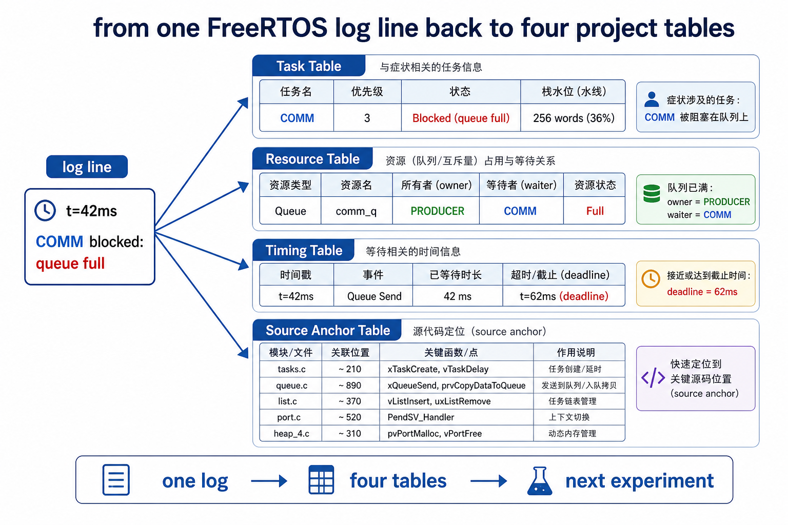

这张图放在四张表前面，读图顺序要从左侧日志开始。先看一条现场怎样被拆成四条证据线，再看每条证据线落到哪张表。这样读者进入空白表格时，心里已经知道每个格子要接住什么现场。

先看任务表。任务表不是为了把任务名列齐，而是为了回答每个任务为什么存在、为什么这个优先级、最常在哪里等待、出问题时能从哪里看到它还活着。LED、SENSOR、COMM、LOG 这四个名字放进去以后，系统就不再是一堆散函数，而是四条有节奏、有等待点的执行流。

| 任务 | 入口 | 优先级理由 | 等待点 | 栈大小依据 | 运行证据 |
| --- | --- | --- | --- | --- | --- |
| LED |  |  |  |  |  |
| SENSOR |  |  |  |  |  |
| COMM |  |  |  |  |  |
| LOG |  |  |  |  |  |

任务表站稳以后，马上看数据怎样在任务之间流动。队列表不要只写“有一个 queue”，而要写清楚生产者、消费者、元素是什么、容量为什么够、满了或空了以后任务会怎么移动。这样队列才不会退化成“线程安全数组”的代名词。

| 队列/事件 | 生产者 | 消费者 | 元素 | 深度依据 | 满/空策略 | 观测指标 |
| --- | --- | --- | --- | --- | --- | --- |
|  |  |  |  |  |  |  |
|  |  |  |  |  |  |  |

有了任务和数据流，再看共享资源。锁表的重点不是“项目用了几把锁”，而是谁可能成为 owner，谁可能被挡住，持锁期间究竟做了什么。只要 owner 和 waiter 写不清，高优先级任务卡住时就很容易被误判成调度问题。

| 共享资源 | owner 可能是谁 | waiter 可能是谁 | 持锁动作 | 持锁上限 | 观测指标 |
| --- | --- | --- | --- | --- | --- |
| UART |  |  |  |  |  |
| I2C |  |  |  |  |  |
| Flash |  |  |  |  |  |

最后收内存表。任务栈、队列存储区、mutex 控制块都要落到 RAM，静态对象要能说出缓冲区从哪里来，动态对象要能说出失败时怎么发现。很多“偶发创建失败”或“跑久了崩”的问题，最后都要回到 RAM 来源、对象生命周期和水位证据。

| 对象 | 内存来源 | 大小依据 | 失败策略 | 长期观测 |
| --- | --- | --- | --- | --- |
| 任务栈 |  |  |  |  |
| 队列存储区 |  |  |  |  |
| mutex 控制块 |  |  |  |  |

写项目资料前，先用这些最小 demo 做一次“校准”。这一步很重要，因为表格很容易被写成愿望：希望 COMM 优先级高，希望 LOG 不影响系统，希望 heap 足够。demo 的作用是把愿望拉回证据，让每个格子都对应一种能观察的现象。

```powershell
powershell -ExecutionPolicy Bypass -File F:\DevelopSrc\embedded_system_learning\tutorials\Chapter6_手撕FreeRTOS_底层核心机制\code\run_demo.ps1
```

| 项目资料 | 先参考的最小 demo | 可以照着回填的证据 |
| --- | --- | --- |
| 任务表 | [`v1_task_stack/demo.c`](F:/DevelopSrc/embedded_system_learning/tutorials/Chapter6_手撕FreeRTOS_底层核心机制/code/v1_task_stack/demo.c)、[`v2_tcb/demo.c`](F:/DevelopSrc/embedded_system_learning/tutorials/Chapter6_手撕FreeRTOS_底层核心机制/code/v2_tcb/demo.c) | 任务名、入口参数、栈顶、优先级 |
| 队列表 | [`v9_queue/demo.c`](F:/DevelopSrc/embedded_system_learning/tutorials/Chapter6_手撕FreeRTOS_底层核心机制/code/v9_queue/demo.c) | count、full、empty、waiting sender、waiting receiver |
| 锁表 | [`v10_mutex_inheritance/demo.c`](F:/DevelopSrc/embedded_system_learning/tutorials/Chapter6_手撕FreeRTOS_底层核心机制/code/v10_mutex_inheritance/demo.c) | owner、waiter、继承前后优先级、释放后恢复 |
| 内存表 | [`v4_static_task_create/demo.c`](F:/DevelopSrc/embedded_system_learning/tutorials/Chapter6_手撕FreeRTOS_底层核心机制/code/v4_static_task_create/demo.c)、[`v11_heap4_allocator/demo.c`](F:/DevelopSrc/embedded_system_learning/tutorials/Chapter6_手撕FreeRTOS_底层核心机制/code/v11_heap4_allocator/demo.c) | 静态材料是否齐全、动态申请是否被最大连续块限制 |

如果已经有自己的工程，这一轮也不需要立刻改代码。先把现有任务、队列、锁、动态对象列出来，再给每一项补一个“我能从哪里看到它”的证据。比如任务表里的栈证据可以来自水位统计，队列表里的容量证据可以来自高峰水位，锁表里的 owner 可以来自 take/give 时间戳，内存表里的长期观测可以来自最小剩余堆和最大连续块记录。

项目证据还要接到 FreeRTOS 源码。源码不是为了证明自己读得多，而是为了给每个判断找一个可靠落点。

| 项目证据 | 源码入口 | 它帮助确认什么 |
| --- | --- | --- |
| 任务创建材料 | [`tasks.c:xTaskCreateStatic()`](F:/DevelopSrc/embedded_system_learning/reference/rtos_src/FreeRTOS-Kernel/tasks.c:1332) | 栈、TCB、入口参数是否组成了任务对象 |
| 任务当前位置 | [`list.c:vListInsert()`](F:/DevelopSrc/embedded_system_learning/reference/rtos_src/FreeRTOS-Kernel/list.c:139) | 任务为什么会在 ready、delayed 或 event wait |
| 调度选择 | [`tasks.c:vTaskSwitchContext()`](F:/DevelopSrc/embedded_system_learning/reference/rtos_src/FreeRTOS-Kernel/tasks.c:5120) | 当前 ready 集合里谁最应该运行 |
| 队列交接 | [`queue.c:xQueueGenericSend()`](F:/DevelopSrc/embedded_system_learning/reference/rtos_src/FreeRTOS-Kernel/queue.c:949) | 数据进入队列时是否可能唤醒等待者 |
| 锁等待 | [`queue.c:xQueueSemaphoreTake()`](F:/DevelopSrc/embedded_system_learning/reference/rtos_src/FreeRTOS-Kernel/queue.c:1795) | 等锁任务和 owner 的关系是否清楚 |
| 动态内存 | [`heap_4.c:pvPortMalloc()`](F:/DevelopSrc/embedded_system_learning/reference/rtos_src/FreeRTOS-Kernel/portable/MemMang/heap_4.c:173) | 失败是总量问题，还是连续块问题 |

这样表格不会停在“我觉得”。它会变成“我能在输出、源码和项目日志里同时证明”。

第一版资料写完后，最怕每一格都有字，却没有一格能支撑排查。检查逻辑可以先压成几条明确条件，不要求真的写成工具，只要能逼着每一行回到证据。

```c
int evidence_row_is_useful(const RtosEvidenceRow *row) {
    if (!row->task || !row->position) {
        return 0; /* 不知道对象和位置，排查会飘 */
    }
    if (!row->source_anchor) {
        return 0; /* 没有源码入口，只是经验判断 */
    }
    if (row->position[0] != 'r' && !row->wait_object) {
        return 0; /* 不在 ready/running，就必须说明等什么 */
    }
    return 1;
}
```

把它翻译成人话，就是三条验收规则。第一，每个任务都要知道对象是谁、当前或典型位置在哪里。第二，每个关键判断都要能回到一个源码入口或 demo 输出。第三，凡是等待，都要说清楚等时间、等数据、等资源，还是等内存材料。满足这三条，表格就已经能服务排查，而不只是帮人复习。

| 第一版表格验收项 | 通过标准 | 不通过时回看 |
| --- | --- | --- |
| 任务表 | 每个任务都有入口、优先级理由、主要等待点、栈证据 | 第 19、20、23、25 节 |
| 队列表 | 每条数据流都有生产者、消费者、容量依据、满/空策略 | 第 26 节 |
| 锁表 | 每个共享资源都能说出 owner、waiter、持锁动作 | 第 27 节 |
| 内存表 | 每个 RTOS 对象都能说出来源、大小依据、失败策略 | 第 28 节 |
| 源码反查 | 每类现象至少有一个 FreeRTOS 源码第一跳 | 第 17 节和附录源码跳转表 |

这些表不是为了把人立刻变成架构师，而是为了第一次把机制拉回自己的工程。只要能填出一部分，下一次回查就会更有目标；填不出来的格子，也会变成非常具体的问题，而不是一团“我好像还不懂 FreeRTOS”的焦虑。

## 19 任务栈细读：任务为什么能从原处继续运行

从这里开始，读法会更靠近源码，但入口仍然是项目问题。任务为什么能在 Delay 后继续往下执行，而不是从函数开头重新来一遍？答案藏在任务栈里，也藏在端口层给第一次运行准备的初始现场里。

如果你是第一次读 FreeRTOS 源码，不要在这一轮追完所有宏和移植分支。每个细读小节只完成一个任务：先抓住最小 demo 证明了什么，再看真实源码里哪一个入口负责这个动作。能把“demo 输出里的词”和“源码函数里的动作”对上，就已经完成这一轮阅读。

### 19.1 LED 为什么能从 Delay 后面继续走

LED 任务在第 10 行代码调用 Delay，过一段时间以后又从 Delay 后面继续执行。这个现象看起来像魔法，其实核心是任务拥有自己的栈和被保存的现场。普通函数调用结束后，局部现场会随调用链消失；任务不同，它的栈长期属于这个任务，调度器只是暂时把 CPU 交给别人。

如果是因为栈水位、HardFault、任务恢复异常回到任务栈这一块，就先把“能继续走”拆成两个问题：任务自己的局部变量和调用链放在哪里，CPU 切走以后又从哪里恢复。前者是普通栈的职责，后者是 RTOS 上下文切换额外加进来的职责。把这两层分开，后面看到 PSP、栈顶指针和初始栈帧就不会混在一起。

### 19.2 任务栈到底保存了什么

如果 LED 在 Delay 前有一个局部计数值，恢复后这个值还在，读者自然会问：它到底藏在哪里。答案不是“内核记住了所有变量”，而是每个任务都有自己的现场空间，也就是任务栈。里面放局部变量、函数调用链，也会在上下文切换时保存 CPU 需要恢复的寄存器信息。入口函数只是任务第一次运行的起点，真正让任务能暂停再继续的，是栈顶指针和 TCB 之间的配合。

任务栈最容易被误解成“只放局部变量”。在 RTOS 里，它还承担了现场保存的角色。任务被切走时，关键寄存器和返回现场会被压到这片栈空间；任务被恢复时，CPU 再从这里把现场拿回来。于是任务栈既是 C 语言调用链的空间，也是内核恢复执行流的依据。

### 19.3 为什么任务函数不是每次从头调用

项目里写任务时，任务函数不是会被反复从头调用的普通函数。它进入循环后会长期存在，Delay 或阻塞只是让出 CPU，不会把函数重启。这个直觉建立起来，才能理解为什么局部变量、递归、较大数组、printf 缓冲都会影响任务栈水位。

### 19.4 代码里先看 stack base 和 top

`v1_task_stack` 用数组模拟任务栈，输出里能看到 LED 和 SENSOR 有各自的 stack base、top、entry slot 和 parameter slot。这个 demo 不模拟真实 Cortex-M 的全部寄存器，只保留教学重点：每个任务都有自己的现场，调度器恢复哪个栈，哪个任务就像从原处继续执行。

任务第一次能不能从入口跑起来，先看 [`code/v1_task_stack/demo.c`](F:/DevelopSrc/embedded_system_learning/tutorials/Chapter6_手撕FreeRTOS_底层核心机制/code/v1_task_stack/demo.c) 里的现场布置。下面几行不追完整寄存器，只追入口、参数和栈顶这三件最关键的证据。

```c
typedef struct {
    const char *name;
    TaskEntry entry;
    void *parameter;
    uint32_t stack[8];
    uint32_t *top_of_stack;
} MiniTaskStack;

static void initialise_stack(MiniTaskStack *task, const char *name, TaskEntry entry, void *parameter) {
    task->name = name;
    task->entry = entry;
    task->parameter = parameter;
    task->top_of_stack = &task->stack[7];
    task->stack[7] = (uint32_t)(uintptr_t)entry;
    task->stack[6] = (uint32_t)(uintptr_t)parameter;
}
```

任务栈模型故意很直白：`stack[7]` 放入口，`stack[6]` 放参数，`top_of_stack` 指向将来要恢复的位置。真实 Cortex-M 的栈帧不会这么简化，但它回答的是同一个问题：第一次启动任务前，入口和参数必须先摆进一份可恢复现场里。

读任务栈输出时，`stack_base` 告诉你这片现场属于谁，`top` 告诉你调度器将来从哪里恢复。`entry_slot` 和 `parameter_slot` 则是在模拟第一次启动任务时，入口函数和参数怎样被摆进初始现场。真实源码里名字和布局会变，但问题不变：入口在哪里，参数在哪里，栈顶交给谁。

项目里如果怀疑栈相关问题，可以把这个 demo 的四个词翻译成调试器里的四个观察点：任务栈起始地址、当前 PSP、TCB 里的栈顶字段、任务入口和参数是否合理。这样 demo 就不是玩具，而是调试 checklist 的雏形。

### 19.5 对账 pxPortInitialiseStack 时只抓三件事

`pxPortInitialiseStack()` 不该被当成一段需要背下来的端口代码。把它放回一个很具体的现场：任务还没有跑过，但内核要提前把“第一次恢复现场时该去哪、带什么参数、从哪里取栈顶”安排好。

排查任务第一次启动时，只看三件事：入口地址怎样放进初始栈帧，参数怎样放到约定位置，函数最后怎样返回新的栈顶。这样就能把 demo 里的 entry slot、parameter slot 和真实端口层动作对上。

第一次任务现场要和真实端口层对上，入口在 [`portable/GCC/ARM_CM4F/port.c:202`](F:/DevelopSrc/embedded_system_learning/reference/rtos_src/FreeRTOS-Kernel/portable/GCC/ARM_CM4F/port.c:202)。这一段里最值得看的不是每个寄存器名，而是三个方向：

| demo 里的动作 | FreeRTOS 源码里的证据 | 要理解的含义 |
| --- | --- | --- |
| `entry_slot = entry` | [`port.c:215`](F:/DevelopSrc/embedded_system_learning/reference/rtos_src/FreeRTOS-Kernel/portable/GCC/ARM_CM4F/port.c:215) 把任务入口放进初始 PC 位置 | 第一次恢复现场时，CPU 会去任务入口 |
| `parameter_slot = parameter` | [`port.c:221`](F:/DevelopSrc/embedded_system_learning/reference/rtos_src/FreeRTOS-Kernel/portable/GCC/ARM_CM4F/port.c:221) 把参数放到 R0 对应位置 | 任务入口第一次运行时能拿到 `pvParameters` |
| `return top_of_stack` | [`port.c:230`](F:/DevelopSrc/embedded_system_learning/reference/rtos_src/FreeRTOS-Kernel/portable/GCC/ARM_CM4F/port.c:230) 返回新的栈顶 | TCB 要保存这个恢复入口 |

这里不是在背寄存器，而是在看第一次启动需要哪些证据。任务还没有真正跑过，所以它的栈里需要被预先摆好一份初始现场，让 CPU 第一次恢复它时，看起来就像正常进入了任务入口。入口地址不是随便放的，参数也不是随便塞的，它们都要符合端口层和处理器异常返回的约定。

排查第一次启动时，可以先不追每个寄存器的名字，但要追方向。应用传进来的是入口函数、参数和栈数组；端口层返回的是新的栈顶；TCB 保存这个栈顶；启动第一个任务或 PendSV 恢复任务时，又会从这个栈顶把现场取回来。把这条线连上，任务栈就从“一段数组”变成了“可恢复现场的入口”。

把 `pxPortInitialiseStack()` 压成伪代码，会更像调试时需要的证据清单：

```c
top--;
*top = initial_xpsr;
top--;
*top = task_entry;        /* PC: first instruction of the task */
top--;
*top = task_return_trap;  /* LR: task must not return */
top -= 5;
*top = pvParameters;      /* R0: first argument */
top--;
*top = initial_exc_return;
top -= 8;                 /* R4-R11 */
return top;
```

伪代码和 demo 输出可以逐项对上。`entry_slot=<entry>` 对应 PC，`parameter_slot=<parameter>` 对应 R0，`top=<addr>` 对应返回给 TCB 的新栈顶。真实源码还会处理 xPSR、LR、异常返回和寄存器保存区，但主线证据就是三个：入口、参数、栈顶。

如果任务第一次启动就崩，检查顺序也可以从初始现场来。入口地址是否落在有效代码区，参数指针是否还有效，栈顶是否按端口要求对齐，PSP 是否落在任务栈范围内。四个问题都比“任务没起来”更具体，也更容易通过调试器验证。


读这张初始现场图时，顺序要从左侧材料开始，而不是从寄存器名开始。先看入口函数和参数怎样进入初始栈帧，再看 `top_of_stack` 怎样交给 TCB，最后回到调试器里检查入口地址、参数指针和 PSP 范围。

### 19.6 栈问题先看水位、PSP 和大局部变量

栈问题常见现象包括任务运行一段时间后 HardFault、上下文切换后崩溃、局部变量值异常、TCB 附近内存被污染。排查时先看栈水位，再看 PSP 是否落在任务栈范围内，再看任务里有没有大数组、深调用或格式化输出。

栈水位适合在压力场景下持续采集，而不是等崩溃后才看一次。比如通信高峰、日志高峰、异常处理、格式化输出最密集的时候，都应该留下水位证据。很多任务平时看起来很稳，一旦错误路径里多了几层调用或一个较大的临时缓冲区，栈就会突然变得紧张。

### 19.7 把函数看成可恢复的执行流

读到这里，任务栈不应该再只是“给任务分配的一块数组”。它更像一条让函数能暂停和恢复的轨道：入口函数从这里第一次出发，Delay 或切换以后又靠这里找回现场。这个直觉站稳以后，后面的 TCB、列表、调度和 PendSV 才有共同地基。

任务栈要解释的关键现象是：任务调用 Delay 后不是消失了，也不是下次从头启动，而是把现场留在自己的栈里，等内核再次恢复它。这个直觉会一直用到 PendSV 和 HardFault 排查。

把这个直觉放到调试台上，可以用 LED 做一个小剧场。LED 任务打印 `before delay`，调用 Delay，过一段时间又打印 `after delay`。这看起来像“内核又调用了一次 LED 函数”，但真正发生的是 LED 的调用链和局部现场仍在它自己的任务栈里。Delay 只是让 LED 离开 ready，CPU 去跑别的任务；等 LED 再被恢复时，程序计数和栈现场让它回到 Delay 后面。

项目里如果 `after delay` 没出现，第一反应不要是“任务函数没有被调用”。更稳的证据清单是：LED 栈是否还完整，TCB 里的栈顶是否合理，LED 是否从 delayed 回到 ready，调度器是否选中过 LED，PendSV 是否真的恢复了 LED 的 PSP。只有把这几步分开，任务栈问题、调度问题和时间等待问题才不会混成一团。

| 看到的现象 | 先不要下的结论 | 更稳的下一问 |
| --- | --- | --- |
| `before delay` 有，`after delay` 没有 | LED 函数没再次被调用 | LED 是否回 ready，现场是否被恢复 |
| 切换后局部变量异常 | C 语言局部变量规则失效 | 任务栈是否溢出，PSP 是否越界 |
| HardFault 停在恢复现场附近 | PendSV 一定写错 | 是否恢复了已经被破坏的栈 |
| 栈水位长期很低 | 任务还能跑就没事 | 高峰路径是否会再压入更深调用链 |

能按这些现象拆开，任务栈就不是“给任务分配一块数组”，而是可恢复现场的证据来源。下一节看 TCB 时，要继续追问一个更具体的问题：这块现场的栈顶究竟被谁记住，任务名、优先级和列表位置又怎样围绕同一个任务对象组织起来。

## 20 TCB 细读：内核怎样记住一个任务

调试器停在任务切换附近时，你经常会看到一个熟悉又有点陌生的东西：`pxCurrentTCB`。它指向的不是某段函数代码，而是内核眼里的“当前任务”。如果只知道任务入口函数名，很快就会卡住；真正要问的是，这个任务的栈顶在哪、优先级是多少、此刻排在哪个列表里。

TCB 细读就从这个调试瞬间进入。它不是字段背诵，而是在追一个任务怎样被识别、怎样保存现场、怎样参与调度、怎样挂进列表，又怎样给调试留下线索。

### 20.1 内核不能只凭函数名认任务

系统里有四个任务以后，内核不能只凭函数名工作。LED、SENSOR、COMM、LOG 都有入口函数，但调度器还需要知道它们的优先级、栈顶、列表位置和状态信息。TCB 就是这些信息的集中入口。

更真实一点看，一个项目里可能有多个任务使用相同入口函数，只是参数不同；也可能一个任务入口名字很清楚，但它当前在等队列、等时间还是 ready，函数名完全看不出来。内核需要的是对象身份，而不是代码名字。TCB 就把“某个入口函数”变成“这个任务对象”。

### 20.2 TCB 为什么像任务档案袋

如果只看函数名，LED、COMM、LOG 都像一段段代码；一旦系统跑起来，你真正想知道的是“现在这个任务是谁、在哪、栈顶在哪、优先级是多少”。TCB 是任务控制块，可以先理解成任务档案。它不是给人看的花名册，而是内核每次调度、等待、唤醒和切换时都会用到的对象。身份字段帮助调试，现场字段连接任务栈，调度字段参与选择，列表字段说明任务在哪里。

档案袋这个比喻只用来帮助进入概念，不能停在比喻上。工程里真正要看的，是每类字段被谁使用：调度器看优先级和 ready 位置，PendSV 看栈顶，队列和 Delay 通过列表项移动任务，调试器通过名字和统计信息帮你定位任务。字段不是用来背的，是在这些动作里被读写的。

### 20.3 调度、列表和 PendSV 为什么都要找 TCB

同一个 LED 任务会出现在很多机制里：创建时被填好，等待时被移到列表，调度时被拿来比较，切换时又要通过它找到栈顶。TCB 的价值就在这里，它把任务从一段函数代码变成内核对象。任务创建时填写 TCB，调度时选择 TCB，PendSV 切换时通过 TCB 保存和恢复栈顶，列表移动时也要通过 TCB 找回任务。

可以把同一个 TCB 放进四个镜头里看。创建镜头里，它刚被填好任务名、入口、优先级和栈顶；列表镜头里，它通过列表项挂到 ready 或 delayed；调度镜头里，它和同优先级或更高优先级任务一起被比较；PendSV 镜头里，它的栈顶字段决定 CPU 从哪里恢复。四个镜头看到的是同一个任务对象，只是被不同机制使用。

这个理解能避免一个常见误判：调试器里看到任务名正常，不代表 TCB 一切正常；看到优先级正常，也不代表栈顶和列表项正常。排查时要按“身份、现场、调度、位置”四组证据分开看。某一组异常，就沿着使用它的机制往回查。

### 20.4 代码里先保留身份、现场、调度和位置

`v2_tcb` 把 TCB 缩到最小：任务名、优先级、栈顶和列表节点。输出里 `TCB name=LED priority=2 top_of_stack=<addr>` 这类信息，正好对应调试器里最先想看的几类证据。

内核怎样认出 LED 这个任务，可以从 [`code/v2_tcb/demo.c`](F:/DevelopSrc/embedded_system_learning/tutorials/Chapter6_手撕FreeRTOS_底层核心机制/code/v2_tcb/demo.c) 里看。这个模型只保留四个字段，让“任务档案袋”先变得可见：

```c
typedef struct {
    const char *name;
    uint32_t *top_of_stack;
    unsigned priority;
    MiniListItem state_item;
} MiniTCB;
```

这个 TCB 模型的价值在于把“很大的源码结构体”缩成四个问题。`name` 回答是谁，`priority` 回答调度时有多急，`top_of_stack` 回答现场在哪里，`state_item` 回答它能挂到哪个列表上。真实 `TCB_t` 里还有很多字段，但这四个问题先读顺，后续源码就有抓手。

项目调试时，也可以按这个顺序看任务窗口或内核感知插件。任务名是否正常，优先级是否符合设计，栈水位是否危险，任务状态是否符合预期。四个证据能对上，再去看更细的源码字段。

### 20.5 对账 TCB_t 时先按用途分组

打开 `TCB_t` 时，最容易产生的挫败感是：字段太多，每个字段都像很重要。主路径先按四组看：身份、现场、调度、位置。后续读 Delay、Queue、Mutex、PendSV 时，再回头看对应字段怎样被使用。

源码入口是 [`tasks.c:375`](F:/DevelopSrc/embedded_system_learning/reference/rtos_src/FreeRTOS-Kernel/tasks.c:375)。不要从结构体开头一路背到结尾，而是按“谁会用它”做标记：

| 字段类型 | 源码锚点 | 谁会用它 | 项目里能解释什么 |
| --- | --- | --- | --- |
| 现场字段 | [`tasks.c:377`](F:/DevelopSrc/embedded_system_learning/reference/rtos_src/FreeRTOS-Kernel/tasks.c:377) `pxTopOfStack` | PendSV 和端口层 | 切换后从哪里恢复 |
| 位置字段 | [`tasks.c:387`](F:/DevelopSrc/embedded_system_learning/reference/rtos_src/FreeRTOS-Kernel/tasks.c:387) `xStateListItem` | ready/delayed/event wait 列表 | 任务现在在哪里 |
| 调度字段 | [`tasks.c:389`](F:/DevelopSrc/embedded_system_learning/reference/rtos_src/FreeRTOS-Kernel/tasks.c:389) `uxPriority` | 调度器和 mutex 继承路径 | 谁更应该先获得 CPU |
| ready 插入 | [`tasks.c:289`](F:/DevelopSrc/embedded_system_learning/reference/rtos_src/FreeRTOS-Kernel/tasks.c:289) | 创建和唤醒路径 | ready 不是口头状态，而是列表动作 |

更具体一点，字段要和“谁会读写它”连起来。任务名主要帮助人和调试工具识别任务，优先级会被调度器和 mutex 继承路径使用，栈顶会被端口层切换代码使用，列表项会被 ready、delayed、event wait 等列表使用。字段一旦和使用者连起来，就不再是结构体朗读。

如果读到配置相关字段，先不要焦虑。FreeRTOS 会根据宏开关增加运行统计、任务通知、互斥锁继承、MPU 等字段；这些字段属于后续边界。只要能把主路径上的四组字段认出来，再遇到复杂配置，就能判断它是在主路径上加功能，而不是另起一个世界。

把 `TCB_t` 放回创建和切换路径，可以得到一段更贴近源码的骨架：

```c
typedef struct {
    StackType_t *pxTopOfStack;     /* PendSV restores from here */
    ListItem_t xStateListItem;     /* ready/delayed/suspended position */
    ListItem_t xEventListItem;     /* queue/mutex/event wait position */
    UBaseType_t uxPriority;        /* scheduler and inheritance */
    StackType_t *pxStack;          /* stack base */
    char pcTaskName[];
    UBaseType_t uxBasePriority;    /* mutex inheritance, when enabled */
} TeachingTCB;
```

这不是要替代真实 `TCB_t`，而是给出一张“字段用途地图”。`pxTopOfStack` 一定要和第 19、24 节连起来看，`xStateListItem` 要和第 21、25 节连起来看，`xEventListItem` 要和队列、mutex 连起来看，`uxPriority/uxBasePriority` 要和调度、优先级继承连起来看。字段只有接上使用场景，才不会变成结构体背诵。


读这张 TCB 字段图时，不要从字段名开始背。先从外侧机制往回问：PendSV 为什么要找栈顶，调度器为什么要看优先级，Delay 为什么能移动任务位置，mutex 为什么能找到等待者。每一问都能回到 TCB 的某一组字段，结构体才会变成任务对象，而不是一大串名字。

demo 里的 `list_owner=LED` 也有真实源码对应。读它时先问一个调试问题：内核从 ready、delayed 或 event wait 列表里拿到的只是 `ListItem_t`，它怎么找回真正的任务？

| 读者问题 | 源码证据 | 工程含义 |
| --- | --- | --- |
| 列表项什么时候准备好 | [`prvInitialiseNewTask()`](F:/DevelopSrc/embedded_system_learning/reference/rtos_src/FreeRTOS-Kernel/tasks.c:1933) | 创建任务时就把两个列表项初始化好 |
| 列表项怎样指回任务 | [`listSET_LIST_ITEM_OWNER`](F:/DevelopSrc/embedded_system_learning/reference/rtos_src/FreeRTOS-Kernel/tasks.c:1938) | owner 指针把 `ListItem_t` 和 TCB 接起来 |
| 为什么这对排查有用 | ready/delayed/event wait 的列表项 | 从列表位置能倒回具体任务对象 |

这样读，owner 就不是一个抽象指针，而是“任务位置”和“任务身份”之间的回家路。

### 20.6 TCB 损坏通常会露出哪些怪现象

TCB 损坏会带来很怪的现象：任务名乱码、优先级异常、列表断裂、切换后崩溃。遇到这类问题，出错函数只是暴露点，还要回头看栈溢出、越界写和错误指针是否破坏了 TCB 周边内存。

TCB 问题最烦人的地方是“故障点常常不是破坏点”。比如 PendSV 恢复现场时崩了，表面看在切换；但真正原因可能是更早之前某个任务数组越界，把相邻 TCB 的栈顶字段写坏。排查时要沿时间往回看：TCB 什么时候创建，什么时候字段第一次异常，异常前哪个任务写过附近内存。

### 20.7 任务从函数变成内核对象

到 TCB 这里，前一节的任务栈终于有了“登记处”。栈保存现场，但内核还要知道这块现场属于谁、优先级是多少、挂在哪个列表里、调度和切换时该从哪里找它。TCB 把这些问题放进同一个任务对象里，FreeRTOS 才能不靠函数名，而是靠对象来管理任务。

任务不再只是 `void Task(void *)` 这个入口函数。它有自己的现场、有自己的档案、有自己的列表位置，也有调试时能观察的证据。看列表和调度时，真正被移动、被选择、被恢复的都是这个任务对象。

TCB 的调试小剧场可以从一个很普通的现象开始：调试器任务列表里出现一个名字异常的任务，或者某个任务优先级看起来不对。先把 TCB 当档案袋检查，再怀疑显示工具。名字异常可能说明初始化字符串或 TCB 周边内存被破坏；优先级异常可能是创建参数、继承路径或越界写影响了字段；列表节点异常则可能让任务从 ready、delayed 或 event wait 里“消失”。

这就是 TCB 比普通结构体更危险的地方。普通业务结构体坏了，影响往往局限在一个模块；TCB 坏了，调度、列表、现场恢复都会被牵连。项目里遇到“任务像随机失踪一样”的现象，要把 TCB 周边内存、栈溢出、数组越界和错误指针都拉进排查范围。

| TCB 证据 | 能解释的问题 | 项目里怎样观察 |
| --- | --- | --- |
| 任务名 | 调试器里认出对象 | 任务列表、日志前缀、Trace 名称 |
| 栈顶字段 | 恢复现场是否有根 | PSP 范围、栈水位、HardFault 现场 |
| 优先级字段 | 为什么被选中或被压住 | 调度日志、ready 集合、继承前后优先级 |
| 列表节点 | 任务到底在哪里 | ready、delayed、event wait 位置 |
| owner/等待相关字段 | mutex 继承和恢复 | owner、waiter、持锁时间 |

这张证据表把 TCB 从字段集合变成了排查入口。你不是为了背结构体而看这些字段，而是为了在任务异常时能回答“它是谁、从哪里恢复、在哪里排队、为什么被选中或被挡住”。下一节进入内核列表时，要记住列表节点并不是孤立节点，它最终还要通过 owner 回到这个任务对象。

## 21 内核列表细读：任务位置为什么比状态名更重要

调试器里看到一个任务显示 blocked 时，新手很容易停在这个词上。可 blocked 只是一个粗标签：它可能在等时间，也可能在等队列，还可能被 mutex owner 挡住。列表细读要把这个粗标签拆开，让任务重新落到 ready、delayed 或 event wait 这些能继续追查的位置上。

### 21.1 任务没输出时先问它在哪个列表

任务没有输出时，第一反应常常是“它卡住了”。这个说法太粗。更准确的问题是：它在哪个列表里。ready、delayed、event wait 代表完全不同的原因，调试方向也不同。

这句话值得在真实项目里反复用。LED 没打印，不一定是 LED 代码没跑到，也可能是它正在等时间；COMM 没响应，不一定是协议解析慢，也可能是它在等队列或 mutex；LOG 不输出，不一定是串口坏了，也可能是低优先级长期拿不到 CPU。列表位置能把这些猜测先分开。

### 21.2 ready、delayed、event wait 各表示什么位置

比如调试窗口里 COMM 和 LOG 都显示 blocked，它们背后的含义可能完全不同。COMM 可能在 event wait 里等一帧数据，LOG 可能在等 UART mutex，LED 可能在 delayed list 里等 tick。更有用的不是状态名，而是位置：ready list 表示任务已经具备运行资格，delayed list 表示任务正在等时间，event wait list 表示任务正在等队列、信号量、互斥锁或其他事件。

“位置”比“状态名”更具体。状态名告诉你一个概括，列表位置告诉你内核接下来会在哪里找到它。Tick 会检查 delayed list，队列 send/receive 会检查对应等待列表，调度器会从 ready list 里选。知道位置，就知道哪个机制负责让它移动。

### 21.3 为什么位置比一句“卡住了”更有用

项目排查时，任务位置图比一句“任务异常”有用得多。把每个任务放到 running、ready、delayed、event wait 四类位置里，再看谁应该移动而没有移动，很多问题会立即变清楚。

这个现场可以画成一张最小位置图。图里没有复杂指针，只有排查时真正需要先判断的位置语义。

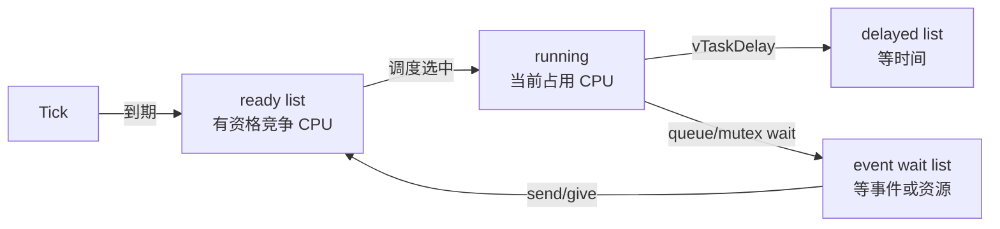
```mermaid
flowchart LR
    Tick["Tick"] -->|"到期"| Ready["ready list\n有资格竞争 CPU"]
    Ready -->|"调度选中"| Running["running\n当前占用 CPU"]
    Running -->|"vTaskDelay"| Delayed["delayed list\n等时间"]
    Running -->|"queue/mutex wait"| EventWait["event wait list\n等事件或资源"]
    EventWait -->|"send/give"| Ready
```

比如一次现场里，LED 在 delayed，COMM 在 event wait，LOG 在 ready，SENSOR 正在 running。这不是四个孤立状态，而是一张系统快照：LED 暂时不用管调度，它在等时间；COMM 要看谁负责给事件；LOG 已经有资格运行但没拿到 CPU，要看优先级；SENSOR 正在占用 CPU，要看它是否应该尽快阻塞或让出。这样读位置图，排查会从“全系统都有可能”缩小到“每个任务各自下一步该看什么”。

列表细读时，特别值得注意的是“谁有资格移动它”。delayed 里的任务通常等 Tick，queue wait 里的任务等 send 或 receive，mutex wait 里的任务等 owner give。任务自己不一定能把自己从等待列表里拉出来。知道谁负责移动它，日志和断点才知道该加在哪里。

### 21.4 代码输出要读成任务位置移动

`v3_kernel_list` 的输出非常直观：任务先进入 ready，SENSOR 被移到 delayed，LOG 被移到 event_wait。这个 demo 的重点不是链表指针技巧，而是让“任务在哪里”这个问题有可观察答案。

任务位置怎样改变，可以从 [`code/v3_kernel_list/demo.c`](F:/DevelopSrc/embedded_system_learning/tutorials/Chapter6_手撕FreeRTOS_底层核心机制/code/v3_kernel_list/demo.c) 看。关键代码只追一个动作：同一个任务离开一个列表，再进入另一个列表。

```c
list_insert_front(&ready, &led);
list_insert_front(&ready, &sensor);
list_insert_front(&ready, &log);

list_remove(&ready, &sensor);
list_insert_front(&delayed, &sensor);

list_remove(&ready, &log);
list_insert_front(&event_wait, &log);
```

把输出翻译成项目语言，就是一张小小的任务快照：LED 仍然有运行资格，SENSOR 正在等下一次采样时间，LOG 正在等事件或资源。这个快照比“系统卡了”有用得多，因为它告诉你下一步应该找谁负责唤醒，谁负责调度。

### 21.5 对账 list.c 时只看插入和移除

排查任务位置时，不需要先把 `list.c` 读成完整数据结构课程。先看两个动作：谁把任务插进一个列表，谁又把它移出来。再看一个回指关系：owner 指针怎样从列表项回到任务对象。

打开源码时也按位置动作来，不需要一次读完整个 `list.c`：

| 读什么 | 源码锚点 | 先抓住什么 |
| --- | --- | --- |
| 列表项结构 | [`include/list.h:144`](F:/DevelopSrc/embedded_system_learning/reference/rtos_src/FreeRTOS-Kernel/include/list.h:144) | `pxNext/pxPrevious/pxContainer` 说明它在哪个列表里 |
| 列表结构 | [`include/list.h:172`](F:/DevelopSrc/embedded_system_learning/reference/rtos_src/FreeRTOS-Kernel/include/list.h:172) | 一个列表怎样保存尾节点、索引和数量 |
| 有序插入 | [`list.c:139`](F:/DevelopSrc/embedded_system_learning/reference/rtos_src/FreeRTOS-Kernel/list.c:139) | 任务或超时节点怎样进入某个位置 |
| 移除节点 | [`list.c:217`](F:/DevelopSrc/embedded_system_learning/reference/rtos_src/FreeRTOS-Kernel/list.c:217) | 任务怎样离开当前位置，列表数量怎样变化 |

列表源码阅读很容易滑向数据结构练习。链表当然有前后指针、尾节点和排序规则，但真正要抓住的是任务位置。插入说明任务进入某种等待或就绪关系，移除说明它离开这种关系，owner 指针说明内核能从列表项回到那个 TCB。

如果列表损坏，后果会很大，因为调度器、Tick、队列和 mutex 都依赖这些位置关系。读源码时记住这点，工程判断才会自然：列表很少无缘无故坏，更多时候是任务对象、等待对象或内存边界先出了问题。

把列表源码压成动作骨架，可以更直观看出“位置移动”到底发生了什么：

```c
/* insert */
find_insert_position_by_item_value(list, item);
item->next = iterator->next;
item->previous = iterator;
item->container = list;
list->number_of_items++;

/* remove */
list = item->container;
item->next->previous = item->previous;
item->previous->next = item->next;
item->container = NULL;
list->number_of_items--;
```

列表骨架解释了 demo 的输出。`move SENSOR -> delayed` 不是复制一个 SENSOR，而是同一个任务对象的列表节点进入 delayed list；`remove LOG <- ready` 则说明 LOG 离开 ready 候选集合，调度器不应该再从 ready list 里选到它。列表动作一旦和任务位置连起来，链表指针就不再只是数据结构细节。

排查时还可以用 `pxContainer` 做一条很实用的判断线。一个列表项在 ready list，`pxContainer` 应该指向对应 ready list；被移除后，`pxContainer` 应该清空；如果任务看起来同时在两个位置，或者已经移除却仍然被某条路径当成在列表中，通常就要怀疑重复插入、重复移除或内存破坏。

### 21.6 列表损坏时先怀疑谁破坏了对象

列表损坏通常不是列表代码本身错，而是内存越界、重复移除、错误上下文调用或对象生命周期不对。现象可能表现为任务丢失、调度异常、队列唤醒失败。

如果列表真的坏了，排查要回到对象生命周期。这个任务是否被重复加入或移除，等待对象是否已经释放，是否在错误中断优先级里调用了不该调用的 API，是否有越界写破坏了列表项。链表代码平时很稳定，真正危险的往往是周围对象被写坏。

### 21.7 状态可见，排查才有方向

列表机制的落点不是链表算法，而是让任务状态变得可见。只要能把“卡住了”翻译成“在哪个列表里”，排查方向就会从模糊感觉变成具体下一跳。

“任务没反应”要翻译成更具体的问题：它在 ready、delayed、event wait，还是正在 running。这个翻译动作，就是从凭感觉调试走向按证据调试的开始。

把列表放进项目现场，最常见的练习是排查 COMM 没有响应。只说“COMM blocked”不够，你要知道它 blocked 在哪。它可能在 RX_QUEUE 的接收等待列表上，说明外部事件还没来；也可能已经被唤醒回 ready，却被更高优先级任务压住；还可能在 UART mutex 的等待链上，说明它被资源 owner 挡住。三种位置都会让 COMM 暂时没有输出，但原因完全不同。

列表机制友好的地方，是它把“卡住”拆成能问的问题。任务在 delayed list，就问目标 tick；在 event list，就问谁负责唤醒；在 ready list，就问优先级和 current task；列表节点异常，就问对象是否被破坏。这样排查不会从一大堆函数里随机挑一个看，而是先把任务位置定住。

| 任务位置 | 看起来的现象 | 下一步证据 |
| --- | --- | --- |
| delayed list | 周期任务暂时没输出 | wake tick、当前 tick、到期回 ready |
| queue event list | 消费者等不到数据 | queue count、发送方是否运行、等待超时 |
| mutex event list | 高优先级任务被挡住 | owner、waiter、持锁时间、继承是否发生 |
| ready list | 任务有资格但没运行 | 优先级、同级轮转、当前任务、PendSV |
| 列表节点异常 | 任务状态混乱或崩溃 | TCB 完整性、越界写、栈水位 |

这张位置表把“任务卡住了”拆成不同机制负责的等待。位置一旦清楚，后面的源码就不再是一堆函数名，而是一条移动路线：进入列表、离开列表、重新回到 ready、再等待调度。再往前倒一步，还要确认任务最初怎样成为对象；只有对象存在并进入某个列表位置，后面的调度和唤醒才有意义。

## 22 任务创建细读：创建成功为什么不等于已经运行

启动阶段最容易让人误判的一幕，是 `xTaskCreateStatic()` 返回成功，却迟迟看不到任务入口第一条日志。直觉会把它归成“创建失败”或“入口函数没写对”，但更常见的问题是创建、ready、running 三段证据没有分清。

函数入口、参数、栈、TCB、列表节点会在创建路径里汇合。这个汇合只代表任务准备好了；它什么时候运行，还要看调度器启动、优先级和等待条件。

### 22.1 创建成功为什么还没打印第一条日志

调用 `xTaskCreateStatic()` 后，很多人会期待任务马上打印第一条日志。实际过程多一步：创建只是把任务对象准备好，并放入 ready list；它什么时候运行，还要看调度器是否启动、优先级是否合适、任务是否立刻进入等待。

这类误解在移植早期特别常见。你看到创建函数返回成功，却没有看到任务入口日志，就以为任务创建失败了。其实创建、ready、running 是三件事：创建成功说明材料组装完，ready 说明有资格竞争 CPU，running 才说明 CPU 真的进入了任务入口。

### 22.2 创建任务是在组装可调度对象

启动日志里看到 `create ok` 时，不要急着把它翻译成“任务已经跑起来了”。更准确地说，任务创建只是对象组装过程。入口函数决定第一次从哪里跑，参数决定入口拿到什么上下文，栈保存现场，TCB 保存档案，优先级参与调度，ready list 表示它有资格竞争 CPU。

静态创建时，这些材料由应用显式提供，所以生命周期尤其重要。栈数组和 TCB 缓冲区不能是一个临时局部变量，不能函数返回后就失效。动态创建时，材料来自 heap，又要额外考虑 heap 是否足够、失败路径是否处理。

### 22.3 创建日志要分清材料、ready 和运行

项目里任务创建建议记录三类日志：创建返回值、任务名和优先级、调度器启动后任务入口第一条日志。三类日志可以区分创建失败、创建成功未调度、创建后立刻阻塞。

启动阶段最怕日志只写一句 `create ok`。这句话只能证明 API 返回成功，不能证明栈和 TCB 后续没有被错误释放，也不能证明任务进入了 ready 后真的被运行。更稳的做法，是把创建阶段拆成三段记录：材料是否有效，任务是否进入 ready，任务入口是否真正执行。

启动阶段的最小时间线可以这样记。

```output
init: LED stack=0x20001000 tcb=0x20000180 priority=2
create: LED -> ready
start scheduler
run: LED entry first log
```

如果只有前两行，没有第四行，问题不一定在创建 API，可能在调度器启动、优先级、PendSV 或任务入口刚开始就阻塞。时间线把“对象准备好了”和“CPU 真的进去过”分开，启动问题就不会全部被归到创建失败。

### 22.4 代码输出里的 ready 不是 running

`v4_static_task_create` 展示了静态栈、静态 TCB、初始化栈顶、填写 TCB、进入 ready list。输出里特别强调 `ready but not necessarily running`，这句话值得保留在脑子里。

创建成功却没有第一条任务日志时，先回到 [`code/v4_static_task_create/demo.c`](F:/DevelopSrc/embedded_system_learning/tutorials/Chapter6_手撕FreeRTOS_底层核心机制/code/v4_static_task_create/demo.c)。关键不是“调用入口函数”，而是填对象并挂到 ready：

```c
static MiniTCB *mini_xTaskCreateStatic(TaskEntry entry,
                                       const char *name,
                                       void *parameter,
                                       unsigned priority,
                                       uint32_t *stack_base,
                                       unsigned stack_words,
                                       MiniTCB *tcb,
                                       ReadyList *ready) {
    tcb->name = name;
    tcb->entry = entry;
    tcb->parameter = parameter;
    tcb->priority = priority;
    tcb->top_of_stack = &stack_base[stack_words - 1];
    ready_insert(ready, tcb);
    return tcb;
}
```

创建代码没有调用 `task_entry()`，这是它最重要的教学点。创建阶段只把入口、参数、栈顶、优先级写进 TCB，并把任务放进 ready。任务入口什么时候真的执行，要留给调度器启动、任务选择和上下文恢复。

把这句输出放回项目里，就是启动阶段最重要的分界线。创建日志出现，只能证明任务对象存在；任务入口日志出现，才证明调度器已经把 CPU 交给了它。如果中间断了，要看调度器是否启动、是否有更高优先级任务一直 ready、任务是否刚启动就进入等待。

### 22.5 对账创建路径时沿着三步走

创建路径要回答的不是“API 做了什么”这么泛的问题，而是三步有没有走完：材料是否齐，任务对象是否初始化，任务是否进入 ready。静态创建先沿着 `xTaskCreateStatic()`、`prvInitialiseNewTask()` 和 `prvAddNewTaskToReadyList()` 走；动态创建再额外看 heap 分配路径。

创建路径可以按三段源码锚点打开：

| 创建段落 | 源码锚点 | 和 demo 对应什么 |
| --- | --- | --- |
| 静态创建入口 | [`tasks.c:1332`](F:/DevelopSrc/embedded_system_learning/reference/rtos_src/FreeRTOS-Kernel/tasks.c:1332) | 应用传入入口、栈、TCB、优先级 |
| 初始化任务对象 | [`tasks.c:1816`](F:/DevelopSrc/embedded_system_learning/reference/rtos_src/FreeRTOS-Kernel/tasks.c:1816) | 填 TCB、准备初始栈顶 |
| 放入 ready | [`tasks.c:1356`](F:/DevelopSrc/embedded_system_learning/reference/rtos_src/FreeRTOS-Kernel/tasks.c:1356) / [`tasks.c:2052`](F:/DevelopSrc/embedded_system_learning/reference/rtos_src/FreeRTOS-Kernel/tasks.c:2052) | ready 是列表动作，不是已经 running |

这三步正好对应项目日志里的三段。材料检查回答“栈和 TCB 从哪里来”，任务初始化回答“入口、参数、栈顶和 TCB 怎样被填好”，加入 ready 回答“它什么时候获得运行资格”。读源码时把这三段切开，创建路径就不会变成一坨大函数。

动态创建只是多了一段材料来源：heap 先要分配 TCB 和栈空间。如果创建失败，就要把创建路径和 heap_4 的 free list 连起来看。静态创建和动态创建的 API 不同，但它们最终都要回答同一个问题：任务对象的材料是否可靠，是否已经进入 ready。

把静态创建路径压成伪代码，更容易看见“创建成功”和“开始运行”的边界：

```c
pxNewTCB = prvCreateStaticTask(entry, name, stack, tcb_buffer);
if (pxNewTCB != NULL) {
    prvInitialiseNewTask(entry, name, priority, parameter, pxNewTCB);
    pxNewTCB->pxTopOfStack = pxPortInitialiseStack(...);
    prvAddNewTaskToReadyList(pxNewTCB);
}
return (TaskHandle_t)pxNewTCB;
```

创建骨架里没有任何地方直接调用任务入口。入口地址被放进初始栈帧，TCB 被填好，列表项被初始化，任务进入 ready list。真正进入入口，要等调度器选择它，并由 SVC 或 PendSV 恢复那份初始现场。

可以把 demo 输出和真实源码对成一条启动证据链：

| demo 输出 | 源码动作 | 证明什么 | 还没证明什么 |
| --- | --- | --- | --- |
| `created LED priority=2 top=<addr>` | [`prvInitialiseNewTask`](F:/DevelopSrc/embedded_system_learning/reference/rtos_src/FreeRTOS-Kernel/tasks.c:1816) 填 TCB 并初始化栈顶 | 对象材料已经组装 | CPU 已经进入 LED |
| `-> ready list` | [`prvAddNewTaskToReadyList`](F:/DevelopSrc/embedded_system_learning/reference/rtos_src/FreeRTOS-Kernel/tasks.c:2052) 更新任务数量并加入 ready | LED 有运行资格 | LED 已经 running |
| `ready but not necessarily running` | [`prvAddTaskToReadyList`](F:/DevelopSrc/embedded_system_learning/reference/rtos_src/FreeRTOS-Kernel/tasks.c:2110) 是列表动作 | ready 是候选集合 | 调度、SVC/PendSV 已完成 |

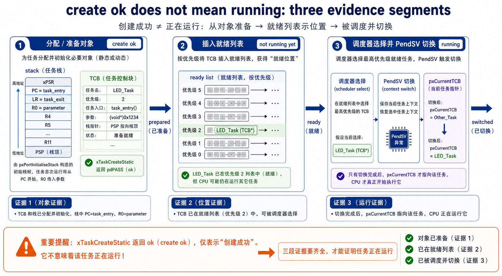

读这张创建证据链时，先别急着找 bug。先把日志放到三段里：对象材料是否成立，ready 资格是否成立，CPU 入口证据是否成立。缺哪一段，就从哪一段继续追，不要把所有启动问题都压回创建 API。

这些启动证据可以直接服务排查。创建返回成功但入口没日志时，不要立刻改入口函数；先确认 TCB/栈材料是否长期有效，再确认 ready list 里是否有它，然后确认调度器是否启动、最高优先级任务是谁、端口层是否真的恢复了任务现场。

### 22.6 创建阶段最容易踩内存生命周期

创建阶段的问题常常和内存生命周期有关。静态创建时，栈数组和 TCB 缓冲区必须长期有效；动态创建时，要处理 heap 不足。句柄保存也要清楚，避免后续操作指向无效对象。

工程上建议给创建阶段留一组固定证据：创建返回值、任务名、优先级、栈地址、TCB 地址、入口第一条日志。这样出现“创建成功但不运行”时，不会在 API、调度、内存之间乱跳。证据一分层，问题会立刻收窄。

### 22.7 创建是生命线起点，不是运行本身

创建路径读完以后，要把一个边界牢牢记住：任务生命线从创建开始，但创建不是运行本身。对象准备好、进入 ready、真正跑到入口，是三段不同证据。

任务只有先成为对象，才谈得上调度、启动、PendSV、Delay、队列和 mutex。把起点看清楚，每一次“任务为什么没有按预期运行”都能先回到创建证据上确认对象是否真的存在。

启动阶段的典型小剧场是：`xTaskCreateStatic()` 返回成功，但 `LedTask start` 没有打印。很多人会回头反复检查任务入口函数，其实入口没打印可能有好几层原因。任务可能创建成功但调度器还没启动，可能进入 ready 但优先级低，可能第一个任务不是 LED，可能启动第一个任务时现场恢复失败，也可能 LED 一开始就阻塞在某个等待点。

因此创建日志最好分层，而不是只打一行 `create ok`：材料检查成功，TCB 初始化成功，任务进入 ready，调度器启动，first task 进入入口。每一层都给一个证据，启动问题就能沿着生命线排查。

| 启动阶段证据 | 说明什么 | 如果缺失，先看哪里 |
| --- | --- | --- |
| `create LED ok` | 应用材料通过创建入口 | 静态栈、TCB 缓冲区、入口和参数 |
| `LED -> ready` | 任务对象获得运行资格 | ready list、优先级、创建路径 |
| `scheduler start` | main 开始交权 | `vTaskStartScheduler()`、heap/idle/timer 任务 |
| `first task=...` | 第一个任务被选择 | 最高优先级 ready 任务 |
| `LED task entered` | CPU 已进入任务上下文 | SVC、初始栈帧、PendSV/端口层 |

启动阶段最容易把三件事混在一起：创建成功、进入 ready、真正跑到入口。创建只说明材料被内核装配成对象，ready 只说明对象有运行资格，入口日志才说明 CPU 已经进入任务上下文。ready 以后还要被选中，被选中以后还要切过去，这个分层会继续决定后面的排查方向。

## 23 调度细读：ready 任务怎样被选中

想象屏幕上同时出现三行日志：`LED ready`、`SENSOR ready`、`COMM ready`。新手最容易以为三件事都会马上发生，但单核 CPU 这一刻只能站到一个任务的现场里。调度要解决的就是这个选择问题：在 ready 集合里，谁先变成 current task。

所以读调度源码时，先别把调度器想成一个后台线程，也别把 ready 当成“马上运行”的承诺。真实动作更克制：内核只是在合适时机从 ready 集合里选出当前任务。第一轮只抓三条线就够：ready list 里有哪些候选，最高 ready 优先级怎样被找到，选中的 TCB 怎样变成 `pxCurrentTCB`。

### 23.1 多个 ready 任务谁先拿到 CPU

多个任务都 ready 时，CPU 仍然只能运行一个。调度器的工作不是让每个任务都感觉公平，而是在规则约束下选出当前运行者。外部响应、周期采样、后台日志，对响应时间的要求不同，优先级也应该表达这种差异。

调度细读时，要把“能运行”和“正在运行”分开。LED、SENSOR、LOG 同时 ready，只说明它们都有资格；真正占用 CPU 的只有一个 current task。调度器的判断，就是把 ready 集合里的资格转换成某一时刻的运行结果。

### 23.2 调度只在 ready 集合里做选择

如果 COMM 还在等队列，优先级再高也轮不到调度器选它。调度只在 ready 集合里选择当前任务：高优先级 ready 任务优先，同优先级任务按时间片或列表顺序轮转，阻塞和延时任务不参与竞争。ready 是资格，不是立即运行承诺。

排查时先把候选集合画小。一个任务如果在 delayed list 或 event wait list，调度器根本不会从它里面选；一个任务如果已经 ready，却迟迟不运行，才需要继续看优先级、时间片、临界区和是否有更高优先级任务长期 ready。候选集合一缩小，调度问题就不会变成全系统乱查。

### 23.3 优先级表达的是响应时间压力

项目设计优先级时，问题应该从响应需求出发，而不是从“这个功能看起来重要不重要”出发。COMM 常常优先级高于 LOG，因为外部响应有时间边界；LOG 重要，但通常可以后台消化。

优先级不是价值排行。LOG 可能对定位故障很重要，但它通常不该压过 COMM 的外部响应，也不该压过 SENSOR 的稳定采样。更好的问法是：这个任务晚 10 ms、50 ms、100 ms 会产生什么后果。后果越敏感，越需要更高的调度机会，或者更清晰的事件唤醒路径。

### 23.4 代码输出要区分同级轮转和高优先级抢占

`v5_priority_scheduler` 展示 LED 和 SENSOR 同级轮转，COMM 变 ready 后以更高优先级被选中。这个输出很好地说明了两个点：blocked 任务不参与选择，高优先级 ready 后会影响低优先级任务机会。

谁能从 ready 集合里拿到 CPU，可以用 [`code/v5_priority_scheduler/demo.c`](F:/DevelopSrc/embedded_system_learning/tutorials/Chapter6_手撕FreeRTOS_底层核心机制/code/v5_priority_scheduler/demo.c) 跑出来。选择函数先看两条规则：

```c
if (task->state != TASK_READY) {
    continue;
}
if (!best || task->priority > best_priority) {
    best = task;
    best_priority = task->priority;
}
```

第一条把 blocked 任务排除在候选集合外，第二条才比较优先级。这个顺序很重要：COMM 优先级再高，只要还在等待队列或 mutex，它就不是本轮调度候选；COMM 一旦被唤醒回到 ready，高优先级才会改变选择结果。

ready 集合怎样一步步变成 current task，可以直接看调度输出。它不模拟完整内核，只把“候选集合”和“当前运行者”的变化跑出来。

```output
t=00 ready: LED(p1), SENSOR(p1), LOG(p0) -> run LED
t=01 ready: SENSOR(p1), LED(p1), LOG(p0) -> run SENSOR
t=02 COMM event: COMM(p3) enters ready
t=02 ready: COMM(p3), LED(p1), SENSOR(p1), LOG(p0) -> run COMM
t=03 COMM blocks on queue wait
t=03 ready: LED(p1), SENSOR(p1), LOG(p0) -> run LED
```

这组输出的重点不是最后谁运行，而是每个 tick 的候选集合怎样变化。先看哪些任务在 ready，再看最高优先级是谁，再看同优先级任务怎样轮转；三件事连起来，调度就不是一个神秘黑盒，而是一连串可以核对的选择。

把调度输出放回项目里，可以得到两类判断。第一，低优先级任务长时间不运行，不一定是 bug，可能只是高优先级任务一直没有阻塞。第二，高优先级任务已经 ready 但仍然响应慢，调度器只解释到“是否被选中”，还要看 PendSV 是否完成切换、它是否又在等 mutex、或者中断/临界区是否拖住了系统。

### 23.5 回到调度源码：ready list、最高优先级、pxCurrentTCB

拿着 `selected COMM` 这类输出打开源码时，目标要足够窄。读 `vTaskSwitchContext()` 不需要第一遍就把整段函数背下来；先抓三根线：任务是否在 ready list，最高 ready 优先级怎么被选中，选中的 TCB 怎样变成 `pxCurrentTCB`。

第一轮对账只需要下面三处入口。

| 读者问题 | 源码入口 | 先证明什么 |
| --- | --- | --- |
| 任务怎样进入 ready | [`tasks.c:prvAddTaskToReadyList`](F:/DevelopSrc/embedded_system_learning/reference/rtos_src/FreeRTOS-Kernel/tasks.c:285) | 任务被挂到对应优先级的 ready list |
| 一次调度从哪里开始 | [`tasks.c:vTaskSwitchContext()`](F:/DevelopSrc/embedded_system_learning/reference/rtos_src/FreeRTOS-Kernel/tasks.c:5120) | 内核进入选择当前任务的路径 |
| 最高优先级任务怎样被选出 | [`tasks.c:5178`](F:/DevelopSrc/embedded_system_learning/reference/rtos_src/FreeRTOS-Kernel/tasks.c:5178) | demo 里的 `switch_to=COMM` 对应真实选择动作 |

看这三处时，目标不是“看完源码”，而是证明 demo 里的调度输出在真实内核里对应哪几个动作。

核心源码可以先压成一个认路骨架。它不是替代源码，而是帮助把 demo 里的选择过程对回真实入口：

```c
if (uxSchedulerSuspended != 0U) {
    xYieldPendings[0] = pdTRUE;
} else {
    traceTASK_SWITCHED_OUT();
    taskCHECK_FOR_STACK_OVERFLOW();
    taskSELECT_HIGHEST_PRIORITY_TASK();
    traceTASK_SWITCHED_IN();
    portTASK_SWITCH_HOOK(pxCurrentTCB);
}
```

调度骨架里最重要的不是 trace，也不是 hook，而是两个判断边界。第一，如果调度器挂起，选择不会立刻发生，只会记一个 pending；第二，如果可以选择，`taskSELECT_HIGHEST_PRIORITY_TASK()` 才会更新当前任务。换句话说，调度不是随时随地都能完成，它也受内核临界状态约束。

把它和 demo 对起来，就能看见简化模型和真实源码之间的对应关系。

| demo 证据 | FreeRTOS 源码入口 | 要证明的动作 | 容易误读成 |
| --- | --- | --- | --- |
| `COMM` 从 blocked 变 ready | [`prvAddTaskToReadyList`](F:/DevelopSrc/embedded_system_learning/reference/rtos_src/FreeRTOS-Kernel/tasks.c:285) | 任务进入对应优先级 ready list | 高优先级任务一定已经运行 |
| `pick_next()` 跳过 blocked | ready list 不包含 delayed/event wait 任务 | 候选集合只来自 ready 位置 | 调度器会扫描所有任务状态 |
| `priority > best_priority` | [`taskSELECT_HIGHEST_PRIORITY_TASK`](F:/DevelopSrc/embedded_system_learning/reference/rtos_src/FreeRTOS-Kernel/tasks.c:5178) | 最高 ready 优先级胜出 | 优先级高就不会被资源挡住 |
| `switch_to=COMM` | [`pxCurrentTCB`](F:/DevelopSrc/embedded_system_learning/reference/rtos_src/FreeRTOS-Kernel/tasks.c:452) | 当前任务指针指向 COMM 的 TCB | CPU 现场已经完全切过去 |

源码表的最后一列很关键。很多排查会把“调度器选中了任务”和“CPU 已经运行到任务代码”混在一起，于是绕远。`vTaskSwitchContext()` 负责更新选择，PendSV 负责保存旧现场、恢复新现场；选中是逻辑结果，切过去是端口层动作。

这个边界可以画成一条很短的链：


```mermaid
flowchart LR
    A["任务被事件唤醒"] --> B["进入对应优先级 ready list"]
    B --> C["vTaskSwitchContext 选择最高 ready 任务"]
    C --> D["pxCurrentTCB 指向被选中的 TCB"]
    D --> E["PendSV 保存旧现场并恢复新现场"]
    E --> F["任务入口或上次暂停点继续运行"]
```

这条链要抓住三个分界点：进入 ready、选择 current task、现场恢复。如果 COMM 已经在 ready list，但 `pxCurrentTCB` 没变，问题更像调度选择或调度挂起；如果 `pxCurrentTCB` 已经变了，但任务代码没继续跑，问题更像 PendSV、栈现场或中断屏蔽边界。

### 23.6 调度异常要把 ready 集合排成时间线

调度问题常见表现包括低优先级任务长期不运行、高优先级任务响应仍然慢、同级任务表现不均。一个任务自己的日志只能说明“我没有向前走”，却常常说明不了是谁占着运行机会。更可靠的做法，是把 ready 集合、当前任务、优先级、让出 CPU 的动作按时间排开。

比如项目日志里只有一句 `COMM timeout`，它说明不了调度器错在哪里。先别急着怀疑调度器，先补三类证据：COMM 什么时候被唤醒，它被唤醒后 ready 集合里还有谁，之后 `current task` 是否真的切到 COMM。

这三类证据会把排查方向分开。如果 COMM 一直没有进入 ready，问题多半在队列或事件等待；如果 COMM 进入 ready 但当前任务仍是别的高优先级任务，应该看优先级设计和阻塞点；如果 current 已经切到 COMM 但它马上又等待 mutex，就要回到锁表。

证据收齐以后，排查表会长成这样：

| 时间点 | 要记录的证据 | 这条证据回答什么 | 下一跳 |
| --- | --- | --- | --- |
| `t0` | 外部事件、队列 send、ISR 唤醒 | COMM 是否真的获得 ready 资格 | 队列或 ISR 路径 |
| `t1` | ready list 快照、COMM 优先级 | COMM 是否进入候选集合 | ready list / 优先级 |
| `t2` | `pxCurrentTCB` 或 `switch_to` | 调度器是否选择 COMM | `vTaskSwitchContext()` |
| `t3` | PSP、栈水位、PendSV 触发 | CPU 是否完成现场切换 | PendSV / 栈现场 |
| `t4` | COMM 下一次等待对象 | COMM 是否又被队列、mutex、delay 挡住 | queue / mutex / delay |

比起只问“COMM 为什么慢”，这五个时间点更适合拿来排查。每个时间点都把下一跳限定住：事件没进队列就看驱动和 queue，已经 ready 就看调度，已经选中就看 PendSV，已经运行又卡住就看新的等待对象。这样就不会在 `tasks.c`、`queue.c`、`port.c` 之间乱跳。

同级轮转也要用时间线看。`v5_priority_scheduler` 的输出里，LED 和 SENSOR 在 COMM 还 blocked 时轮流运行；COMM 变 ready 后连续被选中，是因为它优先级更高，而不是因为轮转坏了。只有当 LED 和 SENSOR 同级、同为 ready、并且时间片配置允许轮转时，你才应该期待它们交替获得机会。

### 23.7 调度把位置和优先级变成运行机会

调度机制真正要帮读者建立的，是从“任务有资格”到“CPU 真的给了谁”的分界。位置先决定谁能进入候选集合，优先级再决定候选集合里谁更先被选中，PendSV 还要负责把这个选择变成真实现场切换。

“ready 了还没运行”不是矛盾，而是调度系统的正常边界：ready 是进入候选集合，运行还要经过优先级选择和上下文切换。

把这句话放回项目里，就是一条很实用的排查分界线。任务不在 ready，就先别谈调度；任务已经 ready，才继续看优先级、时间片、临界区和更高优先级任务是否长期占据机会。调度只回答“谁该运行”，CPU 是否真的切过去还要看 PendSV 证据。

调度的小剧场可以从 LOG 饿死说起。LOG 优先级低，COMM 因为外部事件频繁 ready，SENSOR 又周期性 ready，结果 LOG 队列越来越满。单看 LOG，会觉得 LOG “不工作”；把 ready 集合摆出来以后会发现，它可能一直没有获得足够运行机会。调度器没有情绪，它只是按 ready 集合和优先级做选择。

所以项目里分析调度，要把一个任务的日志放回系统快照里看：ready 集合里还有谁，它们的优先级是多少，是否有高优先级任务长期不阻塞，同级任务是否轮转，当前任务是否主动让出 CPU。低优先级任务长期不运行不一定是 bug，但如果它承担了释放资源、消费队列或喂某个后台通道的职责，就会间接影响高优先级路径。

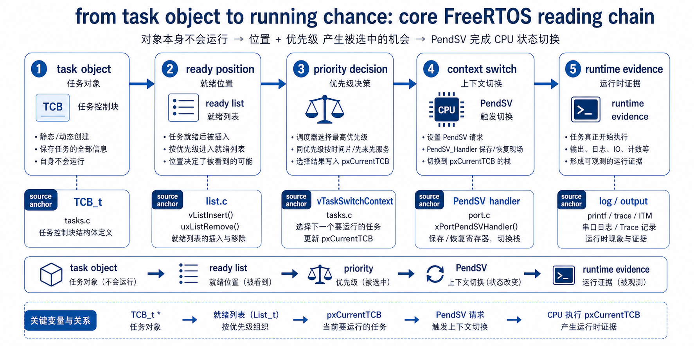

这张链路图的读法，是先沿任务栈、TCB、列表、调度、PendSV 走一遍，再回头看自己的日志卡在哪个节点。它的作用不是再总结名词，而是把“ready 不是 running”“选中不是切换”这些边界固定成一条可检查路线。

| 调度现象 | 可能原因 | 要补的证据 |
| --- | --- | --- |
| LOG 长期不运行 | 高优先级任务持续 ready | ready 集合快照、COMM/SENSOR 阻塞点 |
| COMM ready 后仍慢 | 被更高优先级压住或后续等锁 | 当前任务、mutex owner、PendSV 证据 |
| 同优先级任务不轮转 | 时间片配置或任务不让出 | tick、yield、同级 ready list |
| 低优先级任务影响高优先级任务 | 它持有关键资源 | owner、继承、持锁区长度 |

这些现象把调度问题从“谁优先级高”扩展成“谁在 ready、谁长期占住机会、谁虽然低优先级却握着关键资源”。真正的项目现象常常不是单一机制造成的：LOG 不运行可能是调度机会不足，也可能反过来让队列积压；COMM 慢可能是没被选中，也可能是选中了以后等锁。调度只能回答“选中谁”，还要继续追问 CPU 有没有真的切过去。

## 24 启动与 PendSV 细读：选择结果怎样变成真实运行

启动第一个任务和后续 PendSV 切换都在处理同一类问题：CPU 现场怎样从一个上下文交给另一个上下文。这里会接触端口层和伪汇编模型，但目标仍然很清楚：看懂控制权交接，而不是背处理器手册。

### 24.1 选中了任务为什么还没真正切过去

日志里出现 `switch_to=COMM` 时，先别急着判断 COMM 已经在 CPU 上运行。调度器选中一个任务，只是逻辑选择；CPU 真正从一个任务切到另一个任务，还需要保存当前现场、切换当前任务指针、恢复下一个现场。启动第一个任务和后续 PendSV 切换，都是把逻辑对象落到硬件现场的过程。

启动与 PendSV 的细读，要把三段动作分开：任务被唤醒，调度器选中，CPU 真正切过去。很多响应慢问题只走到了前两段，还没有走到第三段。比如日志显示 COMM 已经 ready，但 current task 仍然停在别的任务里，那就要继续看 PendSV 是否被触发、是否被更高优先级中断或临界区延后。

### 24.2 启动和 PendSV 都在把对象落到 CPU 现场

把系统启动想成一次交权，会更容易读。启动第一个任务，是从 `main()` 初始化世界进入任务世界；PendSV 则负责后续任务之间的上下文切换。二者都围绕任务栈和 TCB 工作，只是发生的时机不同。

启动第一个任务像是第一次交权。此时没有“旧任务现场”需要保存，重点是把已经准备好的第一个任务现场恢复出来。PendSV 则发生在任务世界已经运行之后，重点是保存当前任务，再恢复下一个任务。把这两个动作混在一起，启动故障和运行期切换故障就会被搅成一团。

### 24.3 第一次进入任务和后续切换要分开看

项目里启动问题按日志分段看：创建日志、启动调度器前日志、第一个任务入口日志。切换问题按现场看：current、next、PSP 范围、TCB 栈顶、异常优先级。

启动问题通常发生在系统还没有进入稳定任务循环之前。你要问：任务是否创建成功，调度器是否启动，第一个任务入口有没有执行。切换问题则发生在任务之间来回运行以后。你要问：旧 PSP 保存到哪里，新 PSP 从哪里恢复，`pxCurrentTCB` 是否指向正确任务。

### 24.4 代码输出要分清 main 交权和任务互切

`v6_start_first_task` 展示 main 创建任务并启动调度器，`v7_pendsv_switch` 展示保存 PSP、更新 `pxCurrentTCB`、恢复 PSP。两个 demo 连起来看，就能把“第一次进入任务”和“后续任务切换”分开。

切换现场的最小证据在 [`code/v7_pendsv_switch/demo.c`](F:/DevelopSrc/embedded_system_learning/tutorials/Chapter6_手撕FreeRTOS_底层核心机制/code/v7_pendsv_switch/demo.c)。`pendsv_switch()` 把 PendSV 压成保存旧 PSP、更新当前 TCB、恢复新 PSP 三个动作：

```c
static void pendsv_switch(MiniTCB *next) {
    printf("PendSV: save PSP=0x%08lx into %s TCB\n",
           (unsigned long)pxCurrentTCB->process_stack_pointer,
           pxCurrentTCB->name);
    printf("PendSV: pxCurrentTCB %s -> %s\n", pxCurrentTCB->name, next->name);
    pxCurrentTCB = next;
    printf("PendSV: restore PSP=0x%08lx from %s TCB\n",
           (unsigned long)pxCurrentTCB->process_stack_pointer,
           pxCurrentTCB->name);
}
```

模型代码把真实汇编压成三行工程证据：旧 PSP 保存到旧 TCB，`pxCurrentTCB` 指向新任务，再从新 TCB 恢复 PSP。真实 Cortex-M 会保存寄存器、处理异常返回和中断优先级，但排查方向仍然是这三步。

两段输出要分开读。第一段只关心 main 什么时候不再拥有控制权。

```output
main: create LED, SENSOR, COMM
main: start scheduler
scheduler: select first task COMM
first task: COMM enters task function
main: code after scheduler is not the normal loop anymore
```

第二段才关心任务之间怎样切换。

```output
before PendSV: current=COMM, PSP=0x20001080
save current PSP -> COMM.tcb.stack_top
select next=LED
load LED.tcb.stack_top -> PSP=0x20001A40
after PendSV: current=LED
```

读这两个 demo 时，可以把输出分成两张小卡片。第一张写 `main -> scheduler -> first task`，它证明 `main()` 不再像裸机那样拥有主循环。第二张写 `old task PSP -> pxCurrentTCB -> next task PSP`，它证明任务之间切换时现场怎样交接。两张卡片合起来，才是“选择结果变成真实运行”的完整路径。

### 24.5 对账启动和 PendSV 时只抓控制权方向

启动和切换最怕混成一团。读源码前先把问题拆成两句：控制权怎样离开 `main()`，PendSV 又怎样围绕当前任务和下一个任务保存恢复现场。带着这两句，再打开 `vTaskStartScheduler()`、移植层启动函数、SVC handler 和 `xPortPendSVHandler()`。

源码入口可以按“第一次进入任务”和“后续切换”分成两条线：

| 场景 | 源码锚点 | 主线证据 |
| --- | --- | --- |
| 启动调度器 | [`tasks.c:3700`](F:/DevelopSrc/embedded_system_learning/reference/rtos_src/FreeRTOS-Kernel/tasks.c:3700) | `main()` 创建完任务后，内核开始调度准备 |
| 启动端口层 | [`port.c:305`](F:/DevelopSrc/embedded_system_learning/reference/rtos_src/FreeRTOS-Kernel/portable/GCC/ARM_CM4F/port.c:305) | 移植层配置异常和启动硬件环境 |
| SVC 恢复第一个任务 | [`port.c:260`](F:/DevelopSrc/embedded_system_learning/reference/rtos_src/FreeRTOS-Kernel/portable/GCC/ARM_CM4F/port.c:260) | 第一次从 `pxCurrentTCB` 取栈顶 |
| PendSV 切换任务 | [`port.c:504`](F:/DevelopSrc/embedded_system_learning/reference/rtos_src/FreeRTOS-Kernel/portable/GCC/ARM_CM4F/port.c:504) | 保存旧现场、更新/使用当前 TCB、恢复新现场 |

读启动路径时，先不要纠结每一条汇编指令。先确认控制权方向：应用创建任务，内核选择第一个任务，移植层恢复这个任务的初始现场，CPU 进入任务入口。这个方向对了，就能理解为什么 `main()` 后面的代码不再是裸机主循环。

读 PendSV 时，也按方向读。旧任务的现场必须先被保存到自己的 TCB 里，然后 `pxCurrentTCB` 才能切到下一个任务，最后从下一个任务的栈里恢复现场。保存和恢复方向一旦反了，现象往往不是“切换失败”这么温和，而是栈错、寄存器错、甚至直接 HardFault。

把 `port.c` 的汇编先压成教学骨架，会更容易和 demo 对上。接下来的片段不是可编译代码，而是把 [`xPortPendSVHandler()`](F:/DevelopSrc/embedded_system_learning/reference/rtos_src/FreeRTOS-Kernel/portable/GCC/ARM_CM4F/port.c:504) 的关键方向翻译成 C 风格伪代码：

```c
old_psp = read_psp();
old_tcb = pxCurrentTCB;
old_tcb->top_of_stack = save_core_registers(old_psp);

raise_basepri();
vTaskSwitchContext();        /* updates pxCurrentTCB */
clear_basepri();

new_tcb = pxCurrentTCB;
new_psp = restore_core_registers(new_tcb->top_of_stack);
write_psp(new_psp);
exception_return_to_task();
```

读伪代码骨架时，先盯住两个“方向”。旧现场的方向是 CPU -> PSP -> 旧 TCB，新现场的方向是新 TCB -> PSP -> CPU。中间的 `vTaskSwitchContext()` 不保存寄存器，它只负责把 `pxCurrentTCB` 更新到下一位任务；真正的保存恢复发生在端口层。这个边界越早看清，后面越不容易把调度、切换和 HardFault 混成一锅。

再把 SVC 和 PendSV 放在同一张证据表里看，启动路径也会更清楚。

| 路径 | 真实源码动作 | demo 里对应的证据 | 项目里要补的观测 |
| --- | --- | --- | --- |
| SVC 启动第一个任务 | [`vPortSVCHandler`](F:/DevelopSrc/embedded_system_learning/reference/rtos_src/FreeRTOS-Kernel/portable/GCC/ARM_CM4F/port.c:260) 从 `pxCurrentTCB` 取第一个任务栈顶 | `first task=COMM` | 启动调度器前后日志、第一个任务入口日志 |
| 启动端口层 | [`prvPortStartFirstTask`](F:/DevelopSrc/embedded_system_learning/reference/rtos_src/FreeRTOS-Kernel/portable/GCC/ARM_CM4F/port.c:278) 触发 `svc 0` | `main stops owning CPU` | `main()` 后续代码是否还被当主循环依赖 |
| PendSV 保存旧现场 | [`xPortPendSVHandler`](F:/DevelopSrc/embedded_system_learning/reference/rtos_src/FreeRTOS-Kernel/portable/GCC/ARM_CM4F/port.c:510) 读取 PSP 并保存寄存器 | `save PSP into LED TCB` | old PSP 是否落在旧任务栈范围 |
| PendSV 选择新任务 | [`vTaskSwitchContext`](F:/DevelopSrc/embedded_system_learning/reference/rtos_src/FreeRTOS-Kernel/tasks.c:5120) 更新 `pxCurrentTCB` | `pxCurrentTCB LED -> LOG` | current task 是否符合 ready/priority 证据 |
| PendSV 恢复新现场 | [`port.c:533`](F:/DevelopSrc/embedded_system_learning/reference/rtos_src/FreeRTOS-Kernel/portable/GCC/ARM_CM4F/port.c:533) 从新 TCB 取栈顶并写回 PSP | `restore PSP from LOG TCB` | new PSP 是否落在新任务栈范围 |

这份证据表不是拿来背移植层的，而是给每一步配上可检查的抓手。启动阶段没进第一个任务，优先看 SVC 和第一个任务栈；运行期切换后崩溃，优先看 old PSP、new PSP 和 TCB 栈顶；响应慢但没崩溃，优先看有没有完成从 ready 到 current 再到 PendSV 的三段链。

### 24.6 把 PendSV 汇编按寄存器动作读一遍

有了寄存器表以后，再读 `xPortPendSVHandler()` 就不必把每条汇编都当成陌生符号。它其实是一条很规整的搬运线：先拿到旧任务 PSP，把硬件没自动保存的寄存器补压进旧任务栈，再把新的栈顶写回旧 TCB；中间让调度器更新 `pxCurrentTCB`；最后从新 TCB 取出栈顶，恢复手动保存的寄存器，写回 PSP，交给异常返回恢复剩下的硬件栈帧。

下面把关键指令压成一张读法表。它不是汇编速查表，而是“为什么要这么写”的路线图。

| 源码动作 | 可以怎样读 | 它解决的现场问题 |
| --- | --- | --- |
| `mrs r0, psp` | 把旧任务当前 PSP 读到 `r0`，后面所有保存动作都从这个地址往下压 | 先抓住旧任务现场的栈顶，否则不知道把现场存到哪里 |
| `ldr r3, =pxCurrentTCB`、`ldr r2, [r3]` | `r3` 保存全局指针地址，`r2` 保存当前 TCB 指针 | 找到“旧任务是谁”，才能把旧 PSP 写回旧任务档案 |
| `tst r14, #0x10`、`vstmdbeq r0!, {s16-s31}` | 通过 `EXC_RETURN` 判断任务是否带浮点扩展现场，必要时保存高浮点寄存器 | 用过 FPU 的任务不能丢浮点现场，没用 FPU 的任务不必付出额外成本 |
| `stmdb r0!, {r4-r11, r14}` | 从旧 PSP 继续向下压 `r4-r11` 和 `EXC_RETURN`，并更新 `r0` 为新的栈顶 | 补上硬件异常进入没有自动保存的那部分任务现场 |
| `str r0, [r2]` | 把新栈顶写入旧 TCB 的第一个字段，也就是 `pxTopOfStack` | 旧任务以后要回来，就靠这个 TCB 字段找到自己的现场 |
| `stmdb sp!, {r0, r3}` | 把临时用的 `r0`、`r3` 压到 handler 自己的 MSP 上 | 后面要调用 C 函数，临时寄存器可能被改，先把关键线索保住 |
| `msr basepri, r0` 到 `bl vTaskSwitchContext` | 临时屏蔽一部分中断后调用调度器，让它更新 `pxCurrentTCB` | 调度器会改 ready list 和当前任务指针，这段不能被内核相关中断打断 |
| `mov r0, #0`、`msr basepri, r0` | 调度选择完成后恢复中断屏蔽状态 | 临界区只包住必要的内核结构更新，不把中断关得过长 |
| `ldr r1, [r3]`、`ldr r0, [r1]` | 重新从 `pxCurrentTCB` 取出新任务 TCB，再取出新任务栈顶 | 从这里开始方向反过来：不是保存旧任务，而是恢复新任务 |
| `ldmia r0!, {r4-r11, r14}` | 从新任务栈里弹出手动保存的寄存器和 `EXC_RETURN` | 让新任务回到它上次被切走前的非易失寄存器现场 |
| `vldmiaeq r0!, {s16-s31}` | 如果新任务带 FPU 扩展现场，就恢复高浮点寄存器 | 让浮点任务回来后继续保持自己的浮点计算上下文 |
| `msr psp, r0` | 把弹出手动现场后的新栈顶写回 PSP | PSP 现在指向硬件自动栈帧，等异常返回继续弹 `r0-r3/r12/lr/pc/xPSR` |
| `bx r14` | 使用 `EXC_RETURN` 触发异常返回，而不是普通 C 函数返回 | CPU 按异常返回规则回到线程模式，使用 PSP，继续执行新任务 |

这组读法最值得反复品的是两次“方向反转”。前半段所有动作都在回答“旧任务怎样以后还能回来”：读旧 PSP，补保存 `r4-r11/r14`，把新栈顶写回旧 TCB。后半段所有动作都在回答“新任务怎样现在接住 CPU”：从新 TCB 取 PSP，弹出 `r4-r11/r14`，写回 PSP，再靠 `bx r14` 触发硬件自动恢复剩下的异常栈帧。

这里还有一个容易卡住的点：`r0` 在 PendSV 里不是“任务的 R0 参数”。进入 PendSV 后，任务自己的 `r0` 已经在硬件栈帧里了；汇编里的 `r0` 只是 handler 拿来搬运 PSP 的临时寄存器。类似地，`r14` 在普通 C 里常被叫作返回地址，但在异常 handler 里它保存的是 `EXC_RETURN`，决定异常返回时使用 PSP 还是 MSP、返回线程模式还是处理器模式、是否存在浮点扩展现场。

把这两点吃透，很多汇编就会从“看不懂的寄存器魔法”变成很朴素的账本：旧任务欠一份现场，要写回旧 TCB；新任务有一份现场，要从新 TCB 取出来。TCB 像档案袋，PSP 像档案袋里夹着的现场页码，PendSV 只是按顺序把页码收好、换人、再翻到下一页。

### 24.7 PendSV 后 HardFault 不一定根因在 PendSV

PendSV 后 HardFault 不一定说明 PendSV 写错。它也可能是第一个恢复坏现场的人。真正根因可能是栈溢出、TCB 被破坏、错误中断优先级或不合法 API 调用。

这句话要在排查时反复提醒自己。HardFault 停在 PendSV 附近，只说明故障在恢复现场时爆出来，不说明现场就是 PendSV 破坏的。更稳的办法是记录 current task、next task、旧 PSP、新 PSP、对应栈范围和 TCB 栈顶字段，再倒回去找谁先把这些数据弄坏。

PendSV 最容易出现的误判，可以直接写成表。读 PendSV 不怕暂时看不懂汇编，怕的是把证据归错层。

| 看到的现象 | 容易误判成 | 更稳的证据判断 | 下一步检查 |
| --- | --- | --- | --- |
| COMM 已经 ready 但没响应 | 调度器没有选 COMM | 还缺“是否切过去”的证据 | 看 current task、PendSV pending、临界区时间 |
| HardFault 停在 PendSV 附近 | PendSV 汇编写错 | PendSV 可能只是恢复了坏现场 | 看新 PSP 是否在任务栈范围内 |
| `pxCurrentTCB` 指向异常 | 调度选择错 | TCB 可能更早被越界写破坏 | 回查 TCB 周边内存、栈水位、大数组 |
| 旧任务再也回不来 | 新任务抢占太久 | 旧 PSP 可能没被正确保存 | 看旧 TCB 的栈顶字段是否更新 |

把这组判断放回 COMM 响应慢的现场，就会很实用。`wake COMM` 只说明队列把它送回候选集合，`switch_to=COMM` 只说明调度结果指向它，只有 PSP 和 current task 真的进入 COMM，才算完成切换。三层动作分开，PendSV 才不会变成所有问题的背锅点。

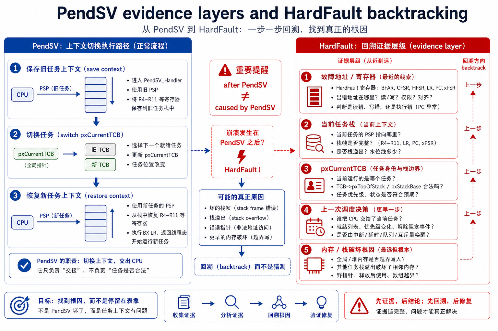

读 PendSV 倒查图时，先顺着正常路径走，再沿 HardFault 倒查路径往回退。这样读者会自然记住：故障停在 PendSV 附近，只能说明坏现场在这里暴露，不等于最早的破坏点就在这里。

### 24.8 调度决定谁，PendSV 让它真的运行

调度决定谁该运行，PendSV 让它真的运行。这句话听起来短，但排查时要拆成三段：任务有没有进入 ready，调度有没有把 current task 指向它，PendSV 有没有恢复它的现场。少掉任何一段，都不能说任务已经真正跑起来。

把 COMM 响应慢放进这三段里，问题会清楚很多。`wake COMM` 只说明队列或事件把它送回候选集合，`switch_to=COMM` 只说明调度结果指向它，PSP 和 `pxCurrentTCB` 才说明 CPU 真的进入了 COMM 的上下文。这样看，响应慢不会被粗暴归成“调度器有问题”或“PendSV 有问题”，而是沿着动作链继续缩小范围。

最后把它收成一个工程习惯：遇到“任务该跑但没跑”，先把 wake、selected、switched 分开记录。

wake 看队列、Delay 或 mutex 释放；selected 看 ready 集合和优先级；switched 看 current task、PSP、TCB 栈顶和 PendSV 时机。进入 Delay 和 Tick 时，同样要保持这个习惯：时间到了，只是 wake 这一段成立，后面还有 selected 和 switched。

## 25 Delay 与 Tick 细读：等待时间时 CPU 去哪里

Delay 的好处不是让任务“睡得更优雅”，而是让等待变成内核可管理的位置变化。Tick 负责推进时间，Delay 负责把任务放到合适的等待位置。细读时一直盯住两个时刻：任务什么时候离开 ready，什么时候回来。

### 25.1 LED 等时间时 CPU 应该去做别的事

LED 等 50 ms 时，CPU 没必要陪它空转。Delay 的意义就是把时间等待交给内核，让任务暂时离开 ready list，把 CPU 让给其他已经准备好的任务。

Delay 要从“延时 API”推进到“位置变化”。LED 从 ready 离开，进入 delayed list；系统时间到期以后，它再回到 ready。这个动作让等待变成可观察状态，也让 CPU 能去做其他工作。

### 25.2 Delay 把等待变成 delayed list 位置

日志里出现 `LED delay until t=60` 时，别把它翻译成“LED 消失 50 ms”。更贴近内核的说法是：任务调用 Delay 后，内核记录唤醒 tick，把任务放进 delayed list。Tick 中断推进系统时间，到期任务再回 ready list。回 ready 后，还要经过调度才能运行。

时间等待有两道门。第一道门是时间门：Tick 到了没有，任务有没有从 delayed 回到 ready。第二道门是调度门：回到 ready 以后，调度器有没有选择它。很多“Delay 不准”的问题，最后发现不是 Delay 不准，而是到期以后没有及时运行。

### 25.3 周期任务要分清相对等待和固定基准

周期任务还要区分相对延时和绝对周期。心跳灯可以使用相对 Delay，采样和控制常常更适合绝对周期，因为处理耗时不应该长期累积到下一次采样点。

相对等待更像“这轮处理完以后再等一段时间”，绝对周期更像“尽量回到下一格固定时间线上”。如果 SENSOR 每轮处理耗时有波动，相对等待会把这份波动带到下一次采样间隔里；绝对周期则更适合控制采样点漂移。先分清业务要表达哪一种节奏，再选择 API。

### 25.4 代码输出要分清到期和运行

看 Delay 输出时不要只盯最后一行，要把 LED 的位置变化一格一格读出来。`v8_delay_blocked_list` 输出里，LED 从 ready 进入 delayed，到 tick 3 回 ready，并说明未必马上运行。这个 demo 把“等待结束”和“真正运行”分开，非常适合建立正确直觉。

时间等待的最小证据在 [`code/v8_delay_blocked_list/demo.c`](F:/DevelopSrc/embedded_system_learning/tutorials/Chapter6_手撕FreeRTOS_底层核心机制/code/v8_delay_blocked_list/demo.c)。关键代码只保留两个动作：Delay 记录唤醒 tick，Tick 到期时把任务送回 ready。

```c
static void mini_delay(MiniTask *task, unsigned now, unsigned ticks_to_delay) {
    task->state = DELAYED;
    task->wake_tick = now + ticks_to_delay;
}

static void tick(MiniTask tasks[], unsigned count, unsigned now) {
    for (unsigned i = 0; i < count; ++i) {
        if (tasks[i].state == DELAYED && now >= tasks[i].wake_tick) {
            tasks[i].state = READY;
        }
    }
}
```

Delay 代码没有调用 LED 任务入口，也没有让 LED 立刻 running。它只证明位置变化：`READY -> DELAYED -> READY`。如果把这一步误读成“Delay 到期就立刻运行”，所有心跳抖动都会被归错因。

Delay 输出按四个时间点读，Delay 和调度的边界就会清楚。

```output
t=00 LED calls delay(3), move ready -> delayed, wake_tick=3
t=01 tick: LED still delayed
t=02 tick: LED still delayed
t=03 tick: LED moves delayed -> ready
t=03 scheduler: COMM has higher priority, run COMM
t=04 scheduler: run LED
```

最容易误读的是 `t=03`。LED 到期了，也回到了 ready，但它没有立刻运行，因为 COMM 在这个时刻更应该拿 CPU。到期是等待机制的结果，运行是调度机制的结果，这两件事靠近但不相同。

项目日志也应该这么拆。记录任务调用 Delay 的 tick，目标唤醒 tick，实际回 ready 的 tick，真正打印或执行业务的 tick。四个点连起来，才能判断问题是在等待、Tick、调度，还是任务自己处理太慢。

### 25.5 对账 Delay 和 Tick 时只看移出与送回

Delay 和 Tick 源码可以先压到一句话：任务怎样离开 ready，又怎样在时间到期后回到 ready。tick 溢出、挂起调度器、临界区这些边界都很重要，但它们要建立在这条主线之后，否则读者会先被边界淹没，反而看不见等待机制本身。

Delay 和 Tick 可以按两段源码锚点打开。

| 函数入口 | 主线证据 | 暂缓的边界 |
| --- | --- | --- |
| [`tasks.c:vTaskDelay`](F:/DevelopSrc/embedded_system_learning/reference/rtos_src/FreeRTOS-Kernel/tasks.c:2469) | 当前任务怎样被放入时间等待 | 所有参数检查和配置分支 |
| [`tasks.c:xTaskIncrementTick`](F:/DevelopSrc/embedded_system_learning/reference/rtos_src/FreeRTOS-Kernel/tasks.c:4736) | 系统 tick 推进后怎样检查到期任务 | tick 溢出和调度挂起的复杂边界 |

这两个入口共同证明一件事：等待被记录成列表位置，到期只是回到 ready。这个结论站稳以后，再去补 tick 溢出、调度器挂起和临界区，边界才会挂在正确的主线上。

| demo 证据 | FreeRTOS 入口 | 要避免的误判 |
| --- | --- | --- |
| `ready -> delayed until tick 3` | [`vTaskDelay`](F:/DevelopSrc/embedded_system_learning/reference/rtos_src/FreeRTOS-Kernel/tasks.c:2469) | Delay 不是忙等，也不是暂停整个系统 |
| `delayed -> ready` | [`xTaskIncrementTick`](F:/DevelopSrc/embedded_system_learning/reference/rtos_src/FreeRTOS-Kernel/tasks.c:4736) | 回 ready 不等于已经 running |
| `not necessarily running yet` | 调度和 PendSV 后续接管 | 心跳晚不一定是 Delay 不准 |

带着上面四个时间点读源码，就不会被 Tick 相关分支绕晕。`vTaskDelay()` 负责把当前任务从 ready 位置移走，并按目标 tick 放进 delayed list。`xTaskIncrementTick()` 负责推进系统时间，检查 delayed list 里有没有到期任务，再把到期任务送回 ready。

这条线只追“移出”和“送回”。等它读顺以后，再看 tick 溢出为什么需要两套 delayed list、调度器挂起时为什么要延后处理、临界区为什么要保护列表修改。这些边界都重要，但它们应该建立在主线之后。

真实源码可以先压成一份“Tick 账本”。它不追求覆盖所有配置项，只保留排查时间问题时最需要的动作：

```c
/* vTaskDelay */
remove_current_task_from_ready_list();
wake_tick = xTickCount + ticks_to_delay;
insert_current_task_into_delayed_list(wake_tick);
yield_after_putting_self_to_sleep();

/* xTaskIncrementTick */
xTickCount++;
while (head_of_delayed_list_is_due(xTickCount)) {
    task = owner_of_head_delayed_item();
    remove_task_from_delayed_list(task);
    remove_task_from_event_list_if_needed(task);
    add_task_to_ready_list(task);
    if (task->priority > pxCurrentTCB->priority) {
        request_context_switch();
    }
}
```

Tick 骨架把“时间到期”和“任务运行”之间的空隙留了出来。`add_task_to_ready_list()` 只说明任务重新获得候选资格；`request_context_switch()` 也只是说明内核认为需要切换；真正切过去，还要接上第 24 节的 PendSV。这样读，LED 到期后晚一拍才亮，就不会被粗暴归因成 “Delay 不准”。

把 demo 输出和源码动作对齐，可以得到一张更适合排查的表：

| 时间点 | demo 证据 | FreeRTOS 动作 | 说明什么 |
| --- | --- | --- | --- |
| `t=0` | `ready -> delayed until tick 3` | [`prvAddCurrentTaskToDelayedList`](F:/DevelopSrc/embedded_system_learning/reference/rtos_src/FreeRTOS-Kernel/tasks.c:8590) 移出 ready 并写入唤醒 tick | 等待已经变成列表位置 |
| `t=1/2` | `LED still delayed` | [`xNextTaskUnblockTime`](F:/DevelopSrc/embedded_system_learning/reference/rtos_src/FreeRTOS-Kernel/tasks.c:4776) 还没到期 | CPU 可以运行其他 ready 任务 |
| `t=3` | `delayed -> ready` | [`listREMOVE_ITEM`](F:/DevelopSrc/embedded_system_learning/reference/rtos_src/FreeRTOS-Kernel/tasks.c:4818) 后 [`prvAddTaskToReadyList`](F:/DevelopSrc/embedded_system_learning/reference/rtos_src/FreeRTOS-Kernel/tasks.c:4833) | 时间等待结束，获得候选资格 |
| `t=3+` | 可能仍未 running | [`xSwitchRequired`](F:/DevelopSrc/embedded_system_learning/reference/rtos_src/FreeRTOS-Kernel/tasks.c:4851) 取决于优先级和配置 | 运行还要经过调度和 PendSV |

这组时间点提醒我们：排查周期任务时，业务函数的打印时间只是最后一段证据。打印晚了，可能是目标 wake tick 设计晚了，可能是 delayed list 送回晚了，也可能是回 ready 后被更高优先级任务压住。四段证据缺一段，结论就会飘。

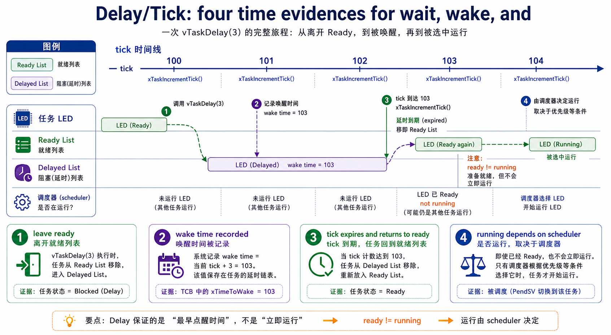

这张时间线要先看四个 tick，而不是先看 API 名。只要能说清进入等待、目标唤醒、实际回 ready、真正 running 这四个点，Delay 问题就不会被粗暴归成“延时不准”。

### 25.6 时间问题要记录四个 tick

时间问题的证据包括进入 Delay 的 tick、目标唤醒 tick、实际回 ready tick、真正运行 tick。四个点连起来，能判断问题在等待、唤醒还是调度。

如果只记录业务日志，很容易把这些点揉成一个“晚了”。一旦拆成四个 tick，结论会清楚很多：目标唤醒点本身漂移，说明周期基准可能不对；回 ready 晚，说明等待或 Tick 路径有问题；回 ready 后运行晚，说明调度或更高优先级任务占用问题。

### 25.7 等待应该变成状态，而不是空耗 CPU

LED 暂时不用亮，SENSOR 暂时不用采，COMM 暂时没有新帧，这些“暂时不用做”的时间不该被 CPU 空转吃掉。Delay 的价值就在这里：它把等待登记成内核状态，让任务离开 ready，把 CPU 让给还能推进的工作。

这也是 RTOS 相比裸机忙等的关键变化。等待不再是执行线上的空白，而是列表里的状态；状态能被观察，等待就能被解释；等待能被解释，时间问题才有排查入口。

真正要带走的不是“Delay 会睡眠”这句口头说法，而是四个时间点：进入等待、目标唤醒、回到 ready、真正运行。四个点能写出来，心跳抖动和周期漂移就有了证据边界。读队列时也沿用同一种想法：等待不是空白，等待会落到某个对象和某个列表上。

Delay 的调试小剧场可以用 LED 和 SENSOR 对比。LED 心跳晚一点，可能只是观感问题；SENSOR 周期漂移，却可能影响数据新鲜度。两者都调用“延时”，但工程含义不一样。LED 更关心翻转间隔是否大体稳定，SENSOR 更关心采样基准是否被处理耗时拖走。这个差别会决定你用相对 Delay，还是用固定基准的周期等待。

项目里记录“任务晚了”还不够，要把时间证据拆开：任务什么时候进入等待，目标唤醒 tick 是多少，实际回 ready 是多少，真正 running 是多少，业务动作完成又是多少。五个点一排，问题自然会分层。如果目标唤醒本身漂移，可能是周期基准设计问题；如果回 ready 准时但 running 晚，可能是调度或更高优先级任务占用；如果 running 准时但完成晚，可能是任务本身工作成本高。

| 时间证据 | 它回答什么 | 常见误判 |
| --- | --- | --- |
| `delay_enter_tick` | 任务从什么时候开始等 | 只看输出时间，不看等待起点 |
| `target_wake_tick` | 目标周期是否稳定 | 把周期基准漂移误判成调度慢 |
| `actual_ready_tick` | Tick 是否按时送回 ready | 把回 ready 当成 running |
| `actual_run_tick` | 调度和 PendSV 是否及时 | 把调度延迟归到 Delay API |
| `finish_tick` | 任务自身工作耗时 | 把业务耗时归到内核 |

这张时间表把“任务晚了”拆成五个不同位置。等待起点、目标唤醒、实际回 ready、真正 running、业务完成，每一格都可能把问题导向不同机制。等数据也有类似的时间线，只是它会分成两条：一条是数据进入和离开缓冲区，另一条是任务等待和被唤醒。

## 26 队列细读：数据交接为什么也是同步关系

先想一个很小的现场：SENSOR 已经采到新值，COMM 还没来得及发，LOG 又想打印一行调试信息。此时队列不是一个普通缓冲区，它同时决定数据放在哪里，也决定任务要不要等待。

所以细读队列时，要把“缓冲区”和“任务等待”放到同一个对象里看。发送、接收、满、空这些词不只是数据状态，也会影响任务是否进入等待或被唤醒。看到队列水位以后，还要能继续问一句：等待者在哪里，谁会把它唤醒。

### 26.1 SENSOR、COMM、LOG 怎样交接数据

SENSOR 产生数据，COMM 消费数据，LOG 接收日志。直接共享变量很快会遇到覆盖、顺序和等待问题。队列把数据流变成有方向、有容量、有等待规则的通道。

想象 SENSOR 每 10 ms 采一次值，COMM 每次打包发送需要 3 ms，LOG 偶尔还要把调试文本写到串口。裸机里最容易写成一个全局变量：SENSOR 改它，COMM 读它，LOG 顺手也打印它。刚开始看起来能跑，数据量一上来就会出现三个难看的问题：新值覆盖旧值，消费者不知道自己有没有漏读，发送方也不知道接收方是不是来得及处理。

队列把这个混乱场面拆开。SENSOR 不再直接把数据塞到 COMM 的手里，而是把一份元素放进通道；COMM 不再猜全局变量是不是新数据，而是从通道里取一份元素。这样一来，数据交接就有了位置、有了顺序，也有了“满了怎么办、空了怎么办”的规则。

### 26.2 队列既是缓冲区也是同步对象

如果只把队列看成一段 FIFO，就只能解释数据顺序，解释不了任务为什么睡下去、又为什么醒过来。FreeRTOS 的队列同时维护两类东西：一边是数据空间，记录元素在哪里；另一边是等待列表，记录谁在等空间、谁在等数据。

所以 send 和 receive 不是单纯的拷贝动作。发送方把元素写入队列，接收方取走元素；队列满时发送方可以等待，队列空时接收方可以等待。等到另一侧完成动作，内核还可能把等待者重新送回 ready。

这就是队列比普通环形缓冲更适合任务协作的地方。环形缓冲通常只回答“有没有数据”，队列还回答“没有数据时谁可以先让出 CPU”。当 COMM 在空队列上等待时，它不是死循环读 count，而是从 ready 集合里离开；当 SENSOR 发入第一条数据时，内核可以把等待的 COMM 重新送回 ready。数据动作和调度动作在这里连到了一起。

### 26.3 容量只能缓冲峰值，不能解决长期失衡

LOG_QUEUE 快满时，最顺手的动作往往是把深度从 8 改成 16。这个动作有时有效，但它只回答“能不能多撑一会儿”，没有回答“为什么一直撑不住”。队列容量能缓冲峰值，不能解决长期消费不足；如果 LOG 本身输出太慢，队列再大也只是把爆掉的时间往后推。

这句话很适合用一个小账本来理解。SENSOR 平均每秒放 100 条数据，COMM 平均每秒只能取 80 条，那么队列再大也只是把爆掉的时间往后推。容量可以吸收短暂尖峰，比如某一小段时间 LOG 写串口慢了一点；但如果生产长期快于消费，队列最终一定会满。

所以项目里估队列容量，不是拍一个“够大”的数字。先看一段最坏窗口：生产者在这段时间最多会放多少条，消费者至少能取多少条，中间差值才是队列需要兜住的峰值。再往下才是工程策略：低价值日志能不能丢弃，消费者优先级是否太低，慢 I/O 是否应该交给专门服务任务处理。

### 26.4 代码输出要同时看 count 和等待者

`v9_queue` 展示空队列、发送唤醒接收者、满队列、接收唤醒发送者。输出里的 count 是数据证据，receiver waits 和 sender waits 是同步证据。

队列的交接证据在 [`code/v9_queue/demo.c`](F:/DevelopSrc/embedded_system_learning/tutorials/Chapter6_手撕FreeRTOS_底层核心机制/code/v9_queue/demo.c)。send 路径里，“数据”和“等待者”会绑在一起：

```c
static int send(MiniQueue *queue, const char *task, int value) {
    if (queue->count == QUEUE_CAPACITY) {
        queue->waiting_sender = task;
        return 0;
    }
    queue->buffer[queue->tail] = value;
    queue->tail = (queue->tail + 1) % QUEUE_CAPACITY;
    queue->count++;
    if (queue->waiting_receiver) {
        queue->waiting_receiver = 0;
    }
    return 1;
}
```

这段代码表面上在写 `buffer` 和 `count`，但真正的教学点是两个分支：满了，发送者要等待；发送成功，可能唤醒接收者。队列不是数组加锁那么简单，它把容量压力和任务唤醒规则放到同一个对象里。

读这段 demo 输出时，先把它当成一段任务交接记录，看每一行到底证明了什么，再去对照 `queue.c`。

```output
t=00 COMM receive: queue empty, COMM waits for data
t=01 SENSOR send 42: count 0 -> 1, wake COMM
t=02 COMM run: receive 42, count 1 -> 0
t=03 SENSOR send 43: count 0 -> 1
t=04 SENSOR send 44: count 1 -> 2
t=05 SENSOR send 45: queue full, SENSOR waits for space
t=06 COMM receive 43: count 2 -> 1, wake SENSOR
```

至少要看两条线。第一条是数据线：count 从 0 到 1，再从 1 到 0，说明元素确实进入和离开了队列。第二条是任务线：COMM 因为空队列等待，SENSOR 因为满队列等待，又分别被对方的成功操作唤醒。count 解释数据水位，等待者解释同步关系；两条线合起来，队列问题才讲得清楚。


读队列双线图时，先走上方数据线，再走下方任务线，最后看两条线在哪里互相触发。这样队列就不会被误读成单纯 buffer，`count`、waiter 和 wake 才能同时进入排查。

### 26.5 对账 queue.c 时先看 send 和 receive 主路径

拿着 `v9_queue` 的输出打开 `queue.c`，最容易被各种队列类型和中断版本带散。第一轮只盯 send 和 receive 两条主路径：数据有没有复制进去或取出来，计数有没有变化，等待列表有没有被使用，另一侧等待者有没有被唤醒。

ISR 版本、锁计数、覆盖队列等边界可以放到主路径清楚以后再看。下面四个入口足够完成第一轮对账：

| 队列动作 | 源码锚点 | 主线动作 |
| --- | --- | --- |
| 发送入口 | [`queue.c:949`](F:/DevelopSrc/embedded_system_learning/reference/rtos_src/FreeRTOS-Kernel/queue.c:949) | 满不满，能不能写入，是否需要等待 |
| 接收入口 | [`queue.c:1509`](F:/DevelopSrc/embedded_system_learning/reference/rtos_src/FreeRTOS-Kernel/queue.c:1509) | 空不空，能不能取走，是否需要等待 |
| 数据写入 | [`queue.c:2393`](F:/DevelopSrc/embedded_system_learning/reference/rtos_src/FreeRTOS-Kernel/queue.c:2393) | 元素进入 buffer，同时可能影响等待者 |
| 数据取出 | [`queue.c:2476`](F:/DevelopSrc/embedded_system_learning/reference/rtos_src/FreeRTOS-Kernel/queue.c:2476) | 元素离开 buffer，同时可能释放空间 |

带着上一段输出去找四个动作会稳很多：有空间时把数据复制进去，更新消息数量；没空间时把发送任务放到等待发送列表；有数据时把数据复制出来，更新消息数量；没数据时把接收任务放到等待接收列表。四件事对上以后，再回头补条件分支。

把 send/receive 的主路径压成伪代码，会更容易看见“数据线”和“任务线”怎样一起变化：

```c
/* send path */
if (queue_has_space(queue)) {
    prvCopyDataToQueue(queue, item);
    if (receiver_is_waiting(queue)) {
        xTaskRemoveFromEventList(&queue->xTasksWaitingToReceive);
        queueYIELD_IF_USING_PREEMPTION();
    }
    return pdPASS;
}
if (can_wait) {
    vTaskPlaceOnEventList(&queue->xTasksWaitingToSend, timeout);
}

/* receive path */
if (queue_has_data(queue)) {
    prvCopyDataFromQueue(queue, out);
    queue->uxMessagesWaiting--;
    if (sender_is_waiting(queue)) {
        xTaskRemoveFromEventList(&queue->xTasksWaitingToSend);
        queueYIELD_IF_USING_PREEMPTION();
    }
    return pdPASS;
}
if (can_wait) {
    vTaskPlaceOnEventList(&queue->xTasksWaitingToReceive, timeout);
}
```

读这段伪代码时，可以先盯住两个分支：每个成功分支都先完成数据动作，再检查是否能唤醒对侧任务；每个失败且允许等待的分支，都把当前任务放进对应等待列表。send 满了等待空间，receive 空了等待数据。队列的同步意义，就藏在这两个等待列表里。

再把 demo 输出、源码动作和工程证据放到同一张表里，排查时会更稳。

| demo 输出 | queue.c 主路径 | 数据线证明 | 任务线证明 |
| --- | --- | --- | --- |
| `LOG receive -> queue empty` | [`vTaskPlaceOnEventList(&xTasksWaitingToReceive)`](F:/DevelopSrc/embedded_system_learning/reference/rtos_src/FreeRTOS-Kernel/queue.c:1616) | 没有可取元素 | LOG 离开 ready 等数据 |
| `COMM send 10 -> count=1` | [`prvCopyDataToQueue`](F:/DevelopSrc/embedded_system_learning/reference/rtos_src/FreeRTOS-Kernel/queue.c:1043) | 元素进入 buffer，消息数增加 | 如果有人等数据，可以唤醒 |
| `wake receiver LOG` | [`xTaskRemoveFromEventList(&xTasksWaitingToReceive)`](F:/DevelopSrc/embedded_system_learning/reference/rtos_src/FreeRTOS-Kernel/queue.c:1049) | 数据已经可取 | 接收者回到调度候选集合 |
| `COMM send 12 -> queue full` | [`traceBLOCKING_ON_QUEUE_SEND`](F:/DevelopSrc/embedded_system_learning/reference/rtos_src/FreeRTOS-Kernel/queue.c:1125) | 没有可写空间 | COMM 进入等待发送列表 |
| `LOG receive 10 -> count=1` | [`prvCopyDataFromQueue`](F:/DevelopSrc/embedded_system_learning/reference/rtos_src/FreeRTOS-Kernel/queue.c:1544) | 元素离开 buffer，空间释放 | 如果有人等空间，可以唤醒 |
| `wake sender COMM` | [`xTaskRemoveFromEventList(&xTasksWaitingToSend)`](F:/DevelopSrc/embedded_system_learning/reference/rtos_src/FreeRTOS-Kernel/queue.c:1553) | 空间已经出现 | 发送者回到调度候选集合 |

这组对应关系也解释了为什么队列问题不能停在返回值。`pdPASS` 只能说明这次 send 或 receive 成功，不一定说明对侧任务已经运行；`errQUEUE_FULL` 或 `errQUEUE_EMPTY` 说明当前状态不满足操作，也不一定说明容量设计错了。还要继续看等待列表、唤醒时刻和调度结果。

等这条主路径读顺以后，再看 ISR 发送、队列锁、覆盖写、超时等待就不会乱。那些都是在主路径之外增加边界处理，不会改变队列的核心直觉：数据在缓冲区里移动，任务在等待列表和 ready list 之间移动。

### 26.6 队列问题要把水位和唤醒时间放到时间线上

队列问题最怕只盯着一个 `count`。`count=0` 可能是消费者太快，也可能是生产者没醒；`count=满` 可能是消费者慢，也可能是接收任务醒了却没有真正运行。把水位、满队次数、空队等待、发送超时、接收超时和唤醒后的运行时刻排在一起，数据流才会清楚。

队列排查可以画成两条线：数据线看 buffer，任务线看等待和唤醒。很多“队列堵了”的说法，都是因为这两条线混在一起。

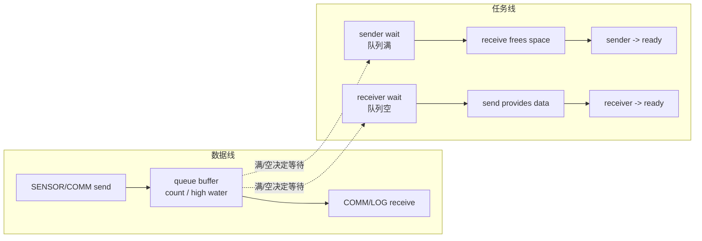
```mermaid
flowchart LR
    subgraph DataLine["数据线"]
        P["SENSOR/COMM send"] --> B["queue buffer\ncount / high water"]
        B --> C["COMM/LOG receive"]
    end
    subgraph TaskLine["任务线"]
        WS["sender wait\n队列满"] --> R1["receive frees space"]
        WR["receiver wait\n队列空"] --> R2["send provides data"]
        R1 --> ReadyS["sender -> ready"]
        R2 --> ReadyR["receiver -> ready"]
    end
    B -. "满/空决定等待" .-> WS
    B -. "满/空决定等待" .-> WR
```

队列问题要同时盯住两条线。上面是数据线：元素有没有进入队列，count 有没有变化，水位有没有接近容量。下面是任务线：谁因为满或空等待，谁又被对侧动作唤醒。两条线都走完以后，再问最后一步：被唤醒的任务有没有真的 running。

调试时最怕一句“队列好像堵了”。堵在哪里，必须拆开看。发送失败说明可能没有空间，接收超时说明可能没有数据，唤醒后迟迟不运行说明可能不是队列本身，而是调度或更高优先级任务占着 CPU。把这些现象都叫“队列堵”，问题会越查越散。

更稳的记录方式，是给每条关键事件带上 tick 和任务名。`send_tick`、`wake_tick`、`run_tick`、`receive_tick` 放在一张时间线上，就能看出数据是卡在容量、消费速度、唤醒路径，还是调度运行机会。队列是协作对象，排查也必须同时看数据和任务。

### 26.7 队列让任务交接变成可观察关系

队列真正留下来的，不该只是 API 名称，而是一种排查眼光：任务之间的交接终于可以被观察。以前全局变量里看不见的覆盖、等待和唤醒，现在都能落到 count、水位、等待列表和运行时刻上。

遇到队列问题，先把现场问成三句话：共享变量为什么撑不住这条交接，队列满是不是长期消费不足，接收任务被唤醒后有没有真的运行。能回答这三个问题，队列就不再只是一个函数调用，而是任务之间可观察、可排查的协作边界。

证据也要分成两类留下来。数据证据是 count、水位、满队次数；任务证据是 sender wait、receiver wait、唤醒 tick 和真正运行 tick。少了前者，不知道数据堵在哪里；少了后者，不知道任务为什么没有继续向前走。

队列的小剧场可以从 LOG_QUEUE 快满开始。COMM、SENSOR、错误处理路径都往 LOG_QUEUE 写消息，LOG 任务负责从队列里取出消息并通过 UART 输出。某一刻 `count=7/8`，发送方开始等待。这里最直接的反应是“把深度改成 16”，但这只是其中一种可能，而且经常不是根因。

更稳的读法是把队列拆成生产、缓冲、消费三段。生产端是不是短时间打印太多低价值日志，缓冲端是不是深度确实兜不住峰值，消费端是不是因为 LOG 优先级太低或 UART 太慢而长期取不走。三段任何一段有问题，都会表现成队列接近满；但工程动作完全不同。

| LOG_QUEUE 证据 | 更像哪类问题 | 工程动作 |
| --- | --- | --- |
| 短时间冲到 7/8，随后恢复 | 峰值缓冲不足 | 估最坏窗口，调整深度或降低低价值日志 |
| 长期维持 7/8 | 消费速度不足 | 看 LOG 运行机会、UART 输出耗时 |
| 高优先级路径因发送日志等待 | 日志反压关键路径 | 限制关键路径日志或改无阻塞策略 |
| 接收者被唤醒但不运行 | 调度问题 | 看 LOG 优先级、ready 集合、PendSV |
| 队列空但消费者还等 | 唤醒或状态证据缺失 | 看 receive 超时、等待列表、事件来源 |

这样看队列，就不会只盯着“一个缓冲区满了”。队列容量只是其中一格，真正要解释的是数据为什么在这里停住、等待者为什么没有继续走。等交接对象从“数据”变成“共享资源”时，读法也会从 count 转向 owner。

## 27 互斥锁细读：资源所有权怎样影响调度

互斥锁的问题经常看起来像“高优先级任务莫名卡住”。真正要查的是资源 owner、等待链和优先级继承。mutex 可以先当成队列机制的一种特殊用法来看，但注意力要落在 owner 身上：谁拥有资源，谁就可能改变调度结果。

### 27.1 高优先级任务为什么会等低优先级 owner

多个任务访问同一个串口、I2C 或 Flash 时，问题不只是数据会不会乱，还包括谁持有资源、谁在等待、等待多久。互斥锁用 owner 表达所有权，用等待列表表达谁被挡住。

这个场景在项目里很常见。LOW_LOG 正在拿串口输出一段长日志，HIGH_COMM 突然要发一帧关键响应，可串口只有一个。HIGH_COMM 优先级更高，并不意味着它能穿过 LOW_LOG 手里的资源直接发送；它只能等待 owner 释放。优先级解决的是 CPU 运行机会，mutex 保护的是资源所有权，两者不是同一个问题。

所以看到高优先级任务卡住时，把问题先放到资源边界上：它是不是在等资源，owner 又是谁。如果它正在等一个低优先级 owner，调度器就算愿意给它 CPU，它也没有办法越过资源边界继续执行。

### 27.2 mutex 表达资源所有权和等待链

想象 UART 正在被 LOW_LOG 拿着输出长日志，HIGH_COMM 此时要发一帧响应。共享总线、串口、Flash 驱动这类资源，不能让几个任务同时伸手改，mutex 表达的就是这条所有权边界。FreeRTOS 的 mutex 还支持优先级继承：高优先级任务等待低优先级 owner 时，owner 可以临时继承更高优先级，尽快运行并释放资源。

owner 是 mutex 最重要的证据。普通二值信号量更像一扇门有没有开，mutex 还会记住这扇门现在由谁拿着钥匙。高优先级任务等待时，内核知道它不是凭空等待，而是被某个 owner 挡住了，这才有机会触发优先级继承。

优先级继承的目的不是让高优先级任务绕过锁，而是让低优先级 owner 少被中优先级任务打断。换句话说，继承不是取消等待，而是缩短“owner 明明该释放却一直拿不到 CPU”的那段时间。这个边界要记牢，否则很容易把继承误解成一种万能加速。

### 27.3 优先级继承只能缩短等待，不能缩短慢 I/O

工程上要缩短持锁区。锁保护资源，不保护整段业务流程。格式化大日志、Flash 擦写、长时间等待都不适合放进持锁区。服务任务有时比多个任务直接抢 mutex 更清楚。

如果 LOW_LOG 拿锁以后在串口里慢慢打印 2 KB 文本，优先级继承也不能让串口物理速度变快。它最多让 LOW_LOG 更快拿到 CPU，把已经开始的持锁动作跑完。真正要优化的是持锁区本身：锁内只做必须互斥的寄存器访问、缓冲区提交或状态更新，锁外做格式化、等待和长耗时准备。

这也是为什么很多项目会用“串口服务任务”替代所有任务直接抢 mutex。其他任务把日志消息发到队列，由一个服务任务串行输出。这样共享资源的 owner 变得单一，等待链也更容易观察，代价是你要重新设计队列容量和日志优先级。

### 27.4 代码输出要按 owner、waiter、inherit 读

`v10_mutex_inheritance` 展示 LOW_LOG 持锁、HIGH_COMM 等待、LOW_LOG 继承优先级、释放后恢复。这个 demo 的重点是等待链，而不是锁 API 本身。

锁等待链的证据在 [`code/v10_mutex_inheritance/demo.c`](F:/DevelopSrc/embedded_system_learning/tutorials/Chapter6_手撕FreeRTOS_底层核心机制/code/v10_mutex_inheritance/demo.c)。关键代码只保留等待和继承：

```c
static void take_mutex(MiniMutex *mutex, MiniTask *task) {
    if (!mutex->owner) {
        mutex->owner = task;
        return;
    }
    task->blocked = 1;
    if (task->current_priority > mutex->owner->current_priority) {
        mutex->owner->current_priority = task->current_priority;
    }
}
```

这段模型代码说明一个容易误解的点：HIGH_COMM 等锁时，并不是 HIGH_COMM 绕过 LOW_LOG 去使用 UART，而是 LOW_LOG 这个 owner 被临时提高优先级。继承改变的是 owner 的运行机会，不改变资源所有权。

mutex 这组输出要看的是资源所有权怎样改变调度结果，而不是背 take/give 的调用顺序。

```output
t=00 LOW_LOG take UART_MUTEX: owner=LOW_LOG, LOW_LOG prio=1
t=01 MID_WORK ready: MID_WORK prio=2
t=02 HIGH_COMM take UART_MUTEX: blocked, waiter=HIGH_COMM prio=4
t=02 inherit: LOW_LOG prio 1 -> 4
t=03 LOW_LOG runs and gives UART_MUTEX
t=03 restore: LOW_LOG prio 4 -> 1, wake HIGH_COMM
t=04 HIGH_COMM owns UART_MUTEX and sends response
```

读这段输出要盯三个词：owner、waiter、inherit。owner 说明资源在谁手里，waiter 说明谁被挡住，inherit 说明内核为了缩短反转时间做了什么。中优先级任务 MID_WORK ready，却没有一直压住 LOW_LOG，是因为 LOW_LOG 临时继承了 HIGH_COMM 的优先级。

### 27.5 对账 mutex 路径时只看 owner 和继承

回到 `queue.c` 中 mutex take/give 相关路径时，先别被“为什么锁在队列文件里”打断。主线只有四个动作：owner 怎样记录，等待者怎样进入列表，继承怎样触发，释放时怎样恢复优先级并唤醒等待者。

源码锚点可以这样看：

| mutex 动作 | 源码锚点 | 主线动作 |
| --- | --- | --- |
| 创建 mutex | [`queue.c:647`](F:/DevelopSrc/embedded_system_learning/reference/rtos_src/FreeRTOS-Kernel/queue.c:647) | mutex 为什么会走 queue 文件 |
| take 时等待 owner | [`queue.c:1795`](F:/DevelopSrc/embedded_system_learning/reference/rtos_src/FreeRTOS-Kernel/queue.c:1795) | 高优先级等待者怎样触发 owner 继承 |
| give 时释放 owner | [`queue.c:2393`](F:/DevelopSrc/embedded_system_learning/reference/rtos_src/FreeRTOS-Kernel/queue.c:2393) / [`queue.c:2411`](F:/DevelopSrc/embedded_system_learning/reference/rtos_src/FreeRTOS-Kernel/queue.c:2411) | 释放资源时怎样恢复优先级 |
| 继承优先级 | [`tasks.c:xTaskPriorityInherit`](F:/DevelopSrc/embedded_system_learning/reference/rtos_src/FreeRTOS-Kernel/tasks.c:6650) | owner 的 `uxPriority` 怎样临时抬高 |
| 恢复优先级 | [`tasks.c:xTaskPriorityDisinherit`](F:/DevelopSrc/embedded_system_learning/reference/rtos_src/FreeRTOS-Kernel/tasks.c:6753) | owner 释放 mutex 后怎样回到基础优先级 |

FreeRTOS 的 mutex 复用了 queue 机制，所以源码入口看起来不像一个单独的 `mutex.c`。这也是容易迷路的地方：明明在查锁，为什么进入了 `queue.c`。先接受这个实现事实，再按 owner 和等待链去读，文件名就不会把你带偏。

调试时也按同样顺序问：当前 owner 是谁，等待者是谁，等待者优先级是否高于 owner，owner 有没有被临时抬高，释放后有没有恢复。源码表和项目日志要回答同一组问题。

把源码主线压成伪代码，可以看得更清楚：

```c
/* create mutex */
queue->u.xSemaphore.xMutexHolder = NULL;
queue->uxQueueType = queueQUEUE_IS_MUTEX;

/* high task takes a mutex already owned by low task */
if (mutex_is_empty(queue)) {
    xTaskPriorityInherit(queue->u.xSemaphore.xMutexHolder);
    vTaskPlaceOnEventList(&queue->xTasksWaitingToReceive, timeout);
}

/* owner gives mutex */
if (queue_is_mutex(queue)) {
    xTaskPriorityDisinherit(queue->u.xSemaphore.xMutexHolder);
    queue->u.xSemaphore.xMutexHolder = NULL;
}
```

这段伪代码要和 demo 的三行输出一起看。`HIGH_COMM waits for mutex owned by LOW_LOG` 对应 owner 字段；`inherit: LOW_LOG priority 1 -> 3` 对应 `xTaskPriorityInherit()`；`LOW_LOG releases mutex` 对应 `xTaskPriorityDisinherit()` 和 holder 清空。

源码名虽然在 `queue.c` 和 `tasks.c` 之间跳，但证据链很直：谁持有，谁等待，owner 是否继承，释放时是否恢复。把这四问放稳，mutex 就不会被误读成单纯调度问题。

再看继承本身的边界。`xTaskPriorityInherit()` 只在等待者优先级高于 owner 时抬高 owner；如果 owner 正在 ready list 里，还要把它从旧优先级 ready list 挪到新优先级 ready list。

继承不是一个“标志位”，它会改变调度器后面看到的 ready 集合。释放时 `xTaskPriorityDisinherit()` 再把 owner 放回基础优先级，这就是为什么调试日志里要同时记录 base priority 和 current priority。

递归 mutex、ISR 限制、队列集等边界先放到旁边。先证明 take 失败时任务怎样等待，owner 怎样被记录，高优先级等待者怎样触发继承，give 时怎样释放 owner 并唤醒等待者。只要这条链通了，mutex 的工程意义就已经站住了。

### 27.6 锁问题先量持锁时间

锁问题证据包括 owner、waiter、take tick、give tick、持锁期间调用链、优先级变化。高优先级任务卡住时，先找 owner，再看 owner 为什么没有尽快释放。

mutex 的等待链也适合画出来。它和队列不同，队列关心“数据有没有位置”，mutex 关心“资源现在归谁”。

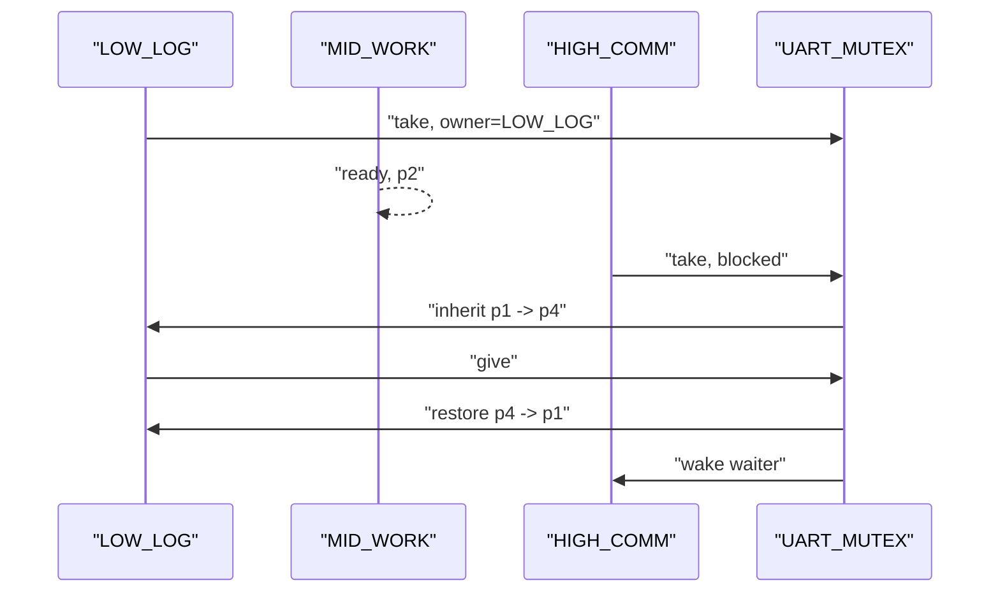
```mermaid
sequenceDiagram
    participant Low as "LOW_LOG"
    participant Mid as "MID_WORK"
    participant High as "HIGH_COMM"
    participant M as "UART_MUTEX"
    Low->>M: "take, owner=LOW_LOG"
    Mid-->>Mid: "ready, p2"
    High->>M: "take, blocked"
    M->>Low: "inherit p1 -> p4"
    Low->>M: "give"
    M->>Low: "restore p4 -> p1"
    M->>High: "wake waiter"
```

这个场景真正要抓住两个边界：HIGH_COMM 等待时没有绕过 owner，资源仍然在 LOW_LOG 手里；继承只是让 LOW_LOG 少被 MID_WORK 插队，不能让 UART 本身变快。排查时如果只有 HIGH_COMM blocked，而没有 owner 和持锁时间，证据还不够。

排查锁问题时，一张“HIGH_COMM blocked”的截图只能证明它等了，不能证明它为什么等。更有用的是一条完整记录：谁在什么 tick 拿锁，谁在什么 tick 开始等待，owner 在持锁期间调用了哪些函数，什么时候释放，释放后等待者什么时候真正运行。

如果持锁时间短但等待者仍然晚，问题可能转到调度或 PendSV；如果持锁时间长，问题就在资源访问路径本身。把“等待锁”和“拿到锁后运行”分开，才能避免把所有延迟都甩给 mutex。


这张等待链要从 owner 状态条读起。先确认资源在 LOW_LOG 手里，再看 HIGH_COMM 为什么只能等待，最后看继承只改变 owner 的运行机会，而不是改变资源归属。

### 27.7 mutex 把隐含约定变成显式所有权

mutex 的结尾要回到项目现场：共享资源不能只靠“大家小心一点”这种隐含约定。它需要明确的 owner、明确的等待者、明确的持锁时间，以及释放后谁被唤醒。

锁最后要看成一条等待链：高优先级任务也会等待低优先级 owner，优先级继承不能缩短慢 I/O，服务任务有时比到处加锁更清楚。锁不是为了让代码看起来安全，而是为了把资源所有权和等待链变成可以被验证的事实。

锁问题可以压成一句调试记录：谁在什么 tick 拿了哪个资源，谁从什么 tick 开始等待，owner 在持锁期间做了什么，什么时候释放。记录不需要漂亮，但必须能说明 owner、waiter 和持锁时间。只要这三件事清楚，优先级继承和锁边界才有讨论基础。

mutex 的小剧场最适合放在 UART 上。LOW_LOG 拿到 UART mutex 后开始输出长日志，HIGH_COMM 收到外部命令，要立刻发响应。HIGH_COMM 优先级高，但资源在 LOW_LOG 手里，所以它只能等待。优先级继承会让 LOW_LOG 临时变得更容易拿到 CPU，尽快跑完持锁区；它不会让 HIGH_COMM 绕过 UART，也不会让 UART 物理发送速度变快。

因此锁优化的重点不是继续抬优先级，而是看持锁区里做了什么：是否在锁内格式化字符串，是否在锁内等待 DMA 完成，是否在锁内做大量循环，是否把多个无关动作包进同一把锁。很多项目把 mutex 当成“保护一大段流程”的工具，结果 owner 边界很模糊，等待链也很长。更稳的做法是锁内只保护真正互斥的最小资源动作，把慢准备和慢输出移到锁外或服务任务里。

| 持锁区内容 | 风险 | 更好的边界 |
| --- | --- | --- |
| 格式化大字符串 | CPU 时间长，高优先级等待变长 | 锁外格式化，锁内提交缓冲 |
| 等待串口发送完成 | 物理 I/O 慢，继承也无能为力 | DMA/服务任务异步输出 |
| Flash 擦写整个过程 | 持锁时间不可接受 | 拆状态机，缩短互斥窗口 |
| 嵌套等待其他对象 | 等待链复杂，容易死锁 | 避免锁内阻塞，统一资源顺序 |
| 多任务直接抢同一外设 | owner 多，排查困难 | 单服务任务 + 队列请求 |

mutex 细读最后要落到一个工程判断：优先级继承只能帮 owner 更快拿到 CPU，不能替你缩短持锁区，也不能让慢外设变快。锁问题要从“谁优先级高”转成“谁拥有资源、持有多久、边界能不能缩短”。再往下一层看，这些任务、队列、锁和栈最终都要在 RAM 里付出成本。

## 28 heap_4 细读：对象成本怎样落到 RAM

项目跑到后期才发现任务偶尔创建失败，最容易先怀疑 API 调错了。可是任务、队列和锁最终都要落到 RAM 上，RAM 的形状不对，软件对象就不一定能顺利出生。

`heap_4` 细读要帮助读者分清三类很像的现象：总量不足、连续块不足、对象生命周期设计错误。它们都会表现成“内存不够”，但排查动作完全不同。

### 28.1 任务、队列和锁最终都要占 RAM

当某个功能没有启动起来时，表面现象可能只是一条任务创建失败日志。再往下追，会发现任务、队列、信号量、互斥锁都不是纯概念，它们都要占内存。静态创建时，材料由应用提供；动态创建时，材料来自 FreeRTOS heap。内存不是背景，它会直接决定任务能不能创建、系统能不能长期稳定运行。

这一步不是换个角度背名词，而是把对象生命周期说清楚。每个任务都要有 TCB 和栈，每个队列都要有控制块和存储区，每个 mutex 也要有内核对象。对象不是凭空出现的，创建成功的背后一定有一块内存被占住。

这就是为什么内存问题常常表现得不像“内存问题”。任务创建失败可能表现成某个功能没启动，栈不够可能表现成运行一段时间后 HardFault，heap 碎片可能表现成总剩余看着不少但申请大块失败。读 heap_4，不是为了写一个分配器，而是为了知道这些现象为什么会发生。

### 28.2 heap_4 管的是可切分、可合并的空闲块

任务栈申请失败时，日志里可能只剩一句“create failed”，但真正的问题往往藏在 heap 的形状里。heap_4 是一种支持空闲块合并的堆管理实现：分配时寻找足够大的连续空闲块，必要时切分；释放时把块放回空闲链表，并尝试和相邻空闲块合并。

内存排查里最重要的词不是“剩余”，而是“连续”。如果 heap 里总共还剩 300 字节，但被切成很多不相邻的小块，一个需要 160 字节连续空间的任务栈仍然可能申请失败。heap_4 通过释放时合并相邻空闲块来减轻碎片，但它不能把隔着已分配对象的两块空闲内存变成一整块。

所以 free list 的形状比单个剩余数字更有解释力。它能告诉你当前有哪些空闲块、每块多大、能不能满足下一次申请。长期运行的系统尤其要看形状变化，而不只是看“free heap 还剩多少”。

### 28.3 创建失败要看总量、连续块和生命周期

项目里经常会遇到一个尴尬现场：启动时一切正常，跑到某个通信高峰或升级流程时，临时 worker 创建失败。日志里只写 `create failed`，看起来像偶发错误；但如果这个对象在运行中反复创建和释放，问题很可能早就埋在 free list 的形状里。

所以动态对象最好被控制在初始化阶段，长期运行中少做频繁创建删除。需要动态创建时，必须记录失败路径，并准备降级策略。静态创建虽然麻烦一些，但对象生命周期更清楚。

静态创建和动态创建不是高级低级之分，而是生命周期表达不同。静态创建把 TCB、栈、队列存储区这些材料放在应用代码里，系统一启动就知道它们在哪里。动态创建把材料交给 heap，写起来灵活，但你必须承担申请失败、碎片和释放时机的管理责任。

对小型嵌入式项目来说，一个很稳的原则是：长期存在的核心对象尽量静态化，临时对象要么少用，要么集中在初始化阶段创建。这样排查时更容易回答一个关键问题：这个对象应该一直存在，还是某个运行路径临时申请出来的。生命周期说不清，内存问题就很难说清。

### 28.4 代码输出要看 free list 形状

`v11_heap4_allocator` 用 100 字节模型展示分配、切分、释放、合并和申请失败。它让“总剩余”和“最大连续块”这两个概念分开。

heap 形状的最小证据在 [`code/v11_heap4_allocator/demo.c`](F:/DevelopSrc/embedded_system_learning/tutorials/Chapter6_手撕FreeRTOS_底层核心机制/code/v11_heap4_allocator/demo.c)。关键模型是一张块表：

```c
typedef struct {
    unsigned start;
    unsigned size;
    int free;
} Block;

blocks[0] = (Block){ 0, 40, 0 };
blocks[1] = (Block){ 40, 30, 0 };
blocks[2] = (Block){ 70, 30, 1 };
blocks[0].free = 1;
```

最后一行释放了前 40 字节，但它旁边还有一个 used block，所以 free list 不是自动变成 70 字节连续空间。这个模型很小，却把 heap_4 最容易误判的地方讲出来了：总空闲和最大连续块不是一回事。

看这个 demo 时，重点不是 100 字节这个数字，而是每次分配释放后 free list 怎样变形。

```output
init:        free [0..99] size=100
malloc 24:   used [0..23],  free [24..99] size=76
malloc 32:   used [24..55], free [56..99] size=44
free 24:     free [0..23] size=24, free [56..99] size=44
malloc 48:   fail, total_free=68, largest_free=44
free 32:     merge -> free [0..99] size=100
```

这段输出故意制造了一个反直觉点：总空闲 68 字节时，申请 48 字节失败。原因不是总量不够，而是没有足够大的连续块。等中间那块也释放以后，相邻空闲块可以合并，最大连续块重新变大，后续大块申请才有机会成功。

### 28.5 对账 heap_4 时先抓查找、切分、插回和合并

读 `heap_4.c` 时，最容易被块头、对齐、链表尾标记和临界区细节淹没。主线先看 free list 的形状怎样变化：分配时查找和切分，释放时插回和合并。对齐、头部结构、临界区、失败 hook 和统计函数都重要，但要挂在这条 free list 主线之后。

源码锚点按这个顺序读：

| heap 动作 | 源码锚点 | 主线动作 |
| --- | --- | --- |
| 分配入口 | [`heap_4.c:173`](F:/DevelopSrc/embedded_system_learning/reference/rtos_src/FreeRTOS-Kernel/portable/MemMang/heap_4.c:173) | 找足够大的空闲块，必要时切分 |
| 释放入口 | [`heap_4.c:354`](F:/DevelopSrc/embedded_system_learning/reference/rtos_src/FreeRTOS-Kernel/portable/MemMang/heap_4.c:354) | 已用块怎样回到 free list |
| 插回并合并 | [`heap_4.c:504`](F:/DevelopSrc/embedded_system_learning/reference/rtos_src/FreeRTOS-Kernel/portable/MemMang/heap_4.c:504) | 相邻空闲块怎样合并 |
| 统计值 | [`heap_4.c:413`](F:/DevelopSrc/embedded_system_learning/reference/rtos_src/FreeRTOS-Kernel/portable/MemMang/heap_4.c:413) / [`heap_4.c:419`](F:/DevelopSrc/embedded_system_learning/reference/rtos_src/FreeRTOS-Kernel/portable/MemMang/heap_4.c:419) | 当前剩余和历史最小值各说明什么 |

这里沿着 demo 输出先读四个动作：申请时找块，块太大时切开，释放时插回有序链表，插回后尝试和前后相邻块合并。主路径顺了，再补那些边界细节。

这样读的好处是，你能把源码和现象对上。创建任务失败时，不是笼统说 heap 不够，而是能继续问：申请大小是多少，当前最大连续块是多少，失败 hook 有没有被触发，历史最小剩余 heap 是否已经逼近边界。

`heap_4.c` 的主线可以压成这个骨架：

```c
typedef struct A_BLOCK_LINK {
    struct A_BLOCK_LINK *next_free_block;
    size_t block_size;
} BlockLink;

/* malloc */
wanted_size = align(request_size + heap_header_size);
block = first_free_block_large_enough(wanted_size);
remove_block_from_free_list(block);
if (block->block_size - wanted_size > minimum_block_size) {
    split_tail_as_new_free_block(block, wanted_size);
}
mark_block_allocated(block);

/* free */
block = header_before_user_pointer(ptr);
mark_block_free(block);
insert_block_by_address(block);
merge_with_previous_if_adjacent(block);
merge_with_next_if_adjacent(block);
```

这段骨架解释了两个容易被忽略的事实。第一，应用申请的 64 字节，不是 heap 里只消耗 64 字节；heap_4 还要保存块头并做对齐，所以实际申请量会变大。第二，释放时能不能合并，取决于地址是否相邻，不取决于“它们都是 free”。两块 free 中间隔着一个 used block，就仍然是两块。

把 demo 输出和 `heap_4.c` 源码对起来，可以这样读：

| demo 现象 | heap_4 源码动作 | 要证明什么 | 常见误判 |
| --- | --- | --- | --- |
| `initial free list` | [`prvHeapInit`](F:/DevelopSrc/embedded_system_learning/reference/rtos_src/FreeRTOS-Kernel/portable/MemMang/heap_4.c:455) 建初始 free block | heap 区域先变成一条空闲链 | heap 是天然可用的一整块背景 |
| `malloc task stack 40` | [`pvPortMalloc`](F:/DevelopSrc/embedded_system_learning/reference/rtos_src/FreeRTOS-Kernel/portable/MemMang/heap_4.c:173) 查找足够大 block | 申请必须命中连续空闲块 | 把总剩余当成唯一证据 |
| `split free block` | [`heap_4.c:272`](F:/DevelopSrc/embedded_system_learning/reference/rtos_src/FreeRTOS-Kernel/portable/MemMang/heap_4.c:272) 切分尾部 | 大块会被切成 used + free | 分配不会改变 free list 形状 |
| `free task stack 40` | [`vPortFree`](F:/DevelopSrc/embedded_system_learning/reference/rtos_src/FreeRTOS-Kernel/portable/MemMang/heap_4.c:354) 找回块头并插回 | 用户指针前面有 heap 块头 | 释放只是把字节数加回去 |
| `coalesce adjacent blocks` | [`prvInsertBlockIntoFreeList`](F:/DevelopSrc/embedded_system_learning/reference/rtos_src/FreeRTOS-Kernel/portable/MemMang/heap_4.c:504) 按地址插入并合并相邻块 | 只有相邻 free block 能合并 | free 总量够就一定能大块申请 |

`largest_free` 不是 FreeRTOS `heap_4.c` 默认直接提供的公开统计值，demo 把它打印出来，是为了让 free list 形状可见。真实项目里如果需要这个证据，可以在调试构建里遍历 free list，或用对象生命周期和失败申请大小间接判断。`xPortGetFreeHeapSize()` 只能告诉你总剩余，不能证明最大连续块还有多大。

### 28.6 内存问题要长期记录 heap 和栈水位

内存问题很少礼貌地在启动那一刻报错。更常见的情况是系统跑了几个小时，某个临时对象突然创建失败，或者一次任务切换后才 HardFault。等到现场出现时，最早的压力来源可能已经过去了，所以必须提前留下当前剩余 heap、历史最小剩余 heap、最大连续块、任务栈水位和对象创建失败返回值。

heap_4 的重难点适合画成一条“内存条”。下面这个例子故意让总空闲大于申请大小，但最大连续块不够；它要解决的不是“还剩多少 RAM”，而是“剩下的 RAM 还能不能连成一块给对象用”。

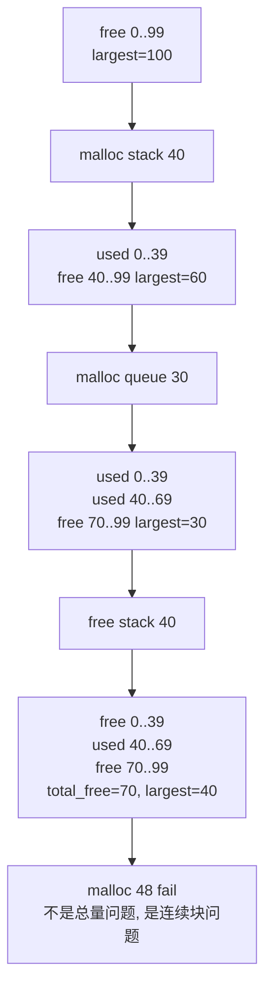
```mermaid
flowchart TB
    A["free 0..99\nlargest=100"] --> B["malloc stack 40"]
    B --> C["used 0..39\nfree 40..99 largest=60"]
    C --> D["malloc queue 30"]
    D --> E["used 0..39\nused 40..69\nfree 70..99 largest=30"]
    E --> F["free stack 40"]
    F --> G["free 0..39\nused 40..69\nfree 70..99\ntotal_free=70, largest=40"]
    G --> H["malloc 48 fail\n不是总量问题, 是连续块问题"]
```

这条内存带要从形状读，而不是只读总数。`free 0..39` 和 `free 70..99` 加起来不少，但中间隔着 `used 40..69`，所以不能满足 48 字节连续申请。heap_4 能合并相邻空闲块，不能跨过仍在使用的对象。

下面这张简图只保留一个判断：`total_free` 够不够，不等于 `largest_free` 够不够。读图时先看中间那块 used 怎样把两段 free 隔开，再看 `malloc 48` 为什么失败。这样回到 `heap_4.c` 时，注意力会落在 free list 形状，而不是只看一个剩余数字。

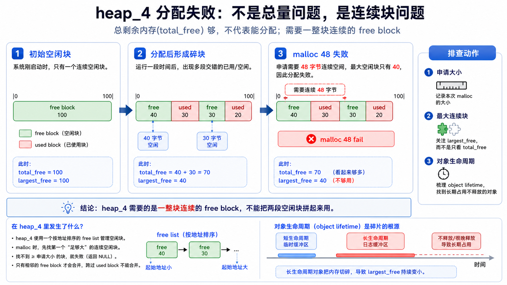

内存问题最讨厌的一点，是它常常需要时间才露出来。刚上电一切正常，跑几个小时以后才创建失败、日志丢失或偶发 HardFault。如果没有历史最小值和栈水位，故障现场很可能已经看不到最早的压力来源。

项目里至少要留下三类证据。第一，heap 的当前值和历史最小值，判断总压力。第二，最大连续块或近似证据，判断碎片压力。第三，各任务栈水位，判断是不是某个任务把自己的现场空间用穿了。heap 和栈是两类 RAM 压力，现象可能互相干扰，但排查时要分开。

### 28.7 动态对象有来源，RAM 永远有边界

heap_4 的重点不只是“释放时会合并空闲块”。更重要的是，动态对象终于有了可追踪的来源：任务栈、TCB、队列存储区、临时 worker 都不是凭空出现，它们要在 RAM 里找到连续空间，也要在生命周期结束后把空间还回去。

所以内存问题要落到三个判断上：“总剩余内存不少”仍然可能申请失败，任务栈水位和 heap 剩余要一起看，长期运行系统要谨慎频繁创建删除对象。内存不是最后才优化的背景变量，它从任务创建那一刻起就在参与系统设计。

把内存问题写进项目表时，“heap 够不够”只是最粗的一列。还要写对象从哪里来、什么时候创建、是否会释放、失败时怎样降级，以及长期运行时最小剩余和最大连续块怎样变化。这样内存机制才会接到资源规划，而不是停在分配器知识。

heap 的小剧场通常发生得很晚。系统刚启动时一切正常，跑了几个小时以后，某个临时 worker 创建失败，日志里显示 `total_free=96`，但 `largest_free=40`。总剩余会让人以为还有 96 字节可用，free list 形状却告诉你空闲空间被分成几块，中间夹着仍在使用的对象，最大连续块不够。

这个现象对任务栈和队列也有提醒。动态创建任务时，栈通常需要一块连续空间；动态创建队列时，控制块和存储区也要落到 RAM。heap_4 可以合并相邻空闲块，但不能跨过仍在使用的对象。对象生命周期越混乱，free list 形状越容易变碎。

| 内存证据 | 说明什么 | 下一步 |
| --- | --- | --- |
| `total_free` 下降 | 总体 RAM 压力增加 | 看对象数量和大小 |
| `minimum_ever_free` 很低 | 历史高峰逼近边界 | 做压力场景复现 |
| `largest_free` 小 | 连续块压力或碎片 | 看 free list 形状和对象生命周期 |
| 某任务栈水位低 | 现场空间可能不足 | 看大局部变量、深调用、格式化 |
| 申请失败但系统未崩 | 失败路径被触发 | 检查降级策略和告警 |

长期项目最好把 heap 和栈证据定期采样，而不是等崩溃后才看。崩溃现场可能只告诉你“最后一次申请失败”，却看不到前面几个小时里 free list 怎样被切碎。能提前记录历史最小值、关键对象生命周期和栈水位，内存问题就会从玄学变成能复盘的工程事实。

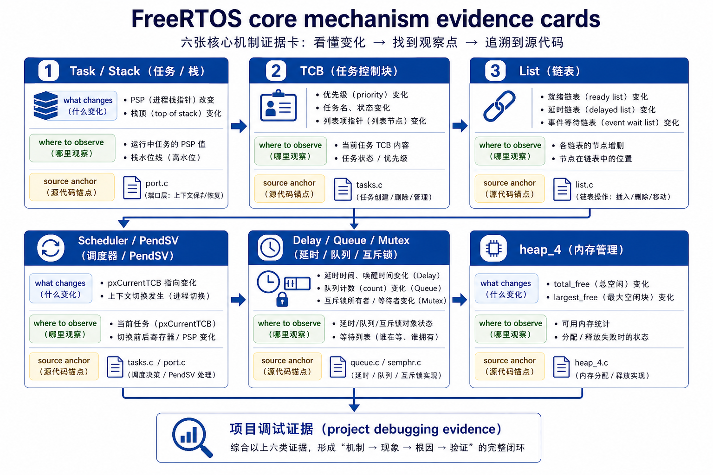

十个底层机制最后要落回四个项目问题：任务材料有没有准备好，任务现在排在哪里，CPU 为什么切到这个任务，RAM 是否支持这些对象长期稳定存在。能把这四问讲清楚，任务表、队列表、锁表和内存表就不是额外文档，而是把底层理解固定到项目里的载体。

## 29 从机制到项目表：怎样接到任务建模

开一次 RTOS 设计评审时，真正被追问的往往不是“TCB 是什么”，而是更贴近项目的几句话：COMM 为什么要比 LOG 急，SENSOR 的数据为什么要排队，UART 为什么不能谁想用谁用，heap 失败以后系统怎样降级。前面讲过的任务栈、列表、调度、PendSV、队列、mutex 和 heap_4，只有能回答这些问题，才算真的进入项目设计。

接下来不急着继续加机制，而是把这些判断放到项目材料里。执行流和优先级要有人能追问，生产消费关系要有人能复盘，资源 owner 和 RAM 成本也要能在评审时摊开说清。文档的价值不在于多一页表，而在于让隐藏在脑子里的判断变成团队能共同检查的东西。

### 29.1 学完机制以后要把项目整理成表

真正整理项目时，可以从白板上四个角色开始，而不是从模板第一格开始。先把 LED、SENSOR、COMM、LOG 写出来，再给每个角色补上节奏、等待点、协作对象和内存材料。写到某一格卡住，就说明这个判断还没有依据。

这个动作像是在给项目补一张可追问的地图。每个 demo 输出都可以变成将来项目资料里的一个字段：它不是装饰，而是判断来源。

如果只停在“我知道 TCB、ready list、queue、mutex、heap_4 是什么”，那还不够。真正进入项目时，你需要把这些机制变成可讨论、可检查、可复盘的设计材料。把隐含判断摊开以后，别人才能看见你为什么这样拆任务、为什么这样设优先级、为什么这条队列容量不是随手填的。

这也能避免一种常见起步困难：打开一个 RTOS 项目，不知道先看哪里。有了执行流、数据流、资源边界和内存成本四个观察口，项目就不再是一堆 API 调用，而是一张能读的系统地图。

如果“四张表”听起来还是像文档任务，可以先把它想成一份很小的项目模型。它不替代真实代码，却把代码里散落的创建、队列、锁和内存判断压到一起，让读者在看源码前先知道自己要追问什么。

```c
typedef struct {
    const char *name;
    const char *entry;
    unsigned priority;
    const char *trigger;
    const char *main_wait;
    unsigned stack_words;
} TaskRow;

typedef struct {
    const char *name;
    const char *producer;
    const char *consumer;
    unsigned depth;
    const char *full_policy;
} QueueRow;

typedef struct {
    const char *resource;
    const char *expected_owner;
    const char *risk;
    unsigned max_hold_ms;
} MutexRow;

static const TaskRow tasks[] = {
    {"LED", "led_task", 1, "periodic delay", "vTaskDelay", 128},
    {"SENSOR", "sensor_task", 2, "periodic delay", "SENSOR_Q", 256},
    {"COMM", "comm_task", 3, "RX_QUEUE wake", "UART_MUTEX", 384},
    {"LOG", "log_task", 1, "LOG_QUEUE wake", "UART_MUTEX", 384},
};

static const QueueRow queues[] = {
    {"RX_QUEUE", "driver_isr", "COMM", 8, "drop oldest or count overflow"},
    {"LOG_QUEUE", "COMM/SENSOR", "LOG", 16, "record high water"},
};

static const MutexRow mutexes[] = {
    {"UART_MUTEX", "LOG or COMM", "HIGH_COMM waits LOW_LOG", 3},
};
```

这段代码块的重点不是让项目真的用数组保存文档，而是把“表格字段”和“内核机制”放在同一个视野里。`priority` 要回到调度，`main_wait` 要回到 ready、delayed 或 event wait，`depth` 要回到队列水位，`max_hold_ms` 要回到 mutex owner 和持锁时间。这样填表时就不会只是在补字，而是在为后续日志和源码留钩子。

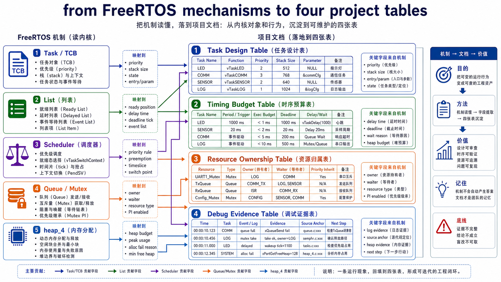

这张转换图要先从左侧机制证据读起，再走到中间项目问题，最后落到四张表。它的目的不是让表格显得完整，而是让每个字段都能说出自己的证据来源。

### 29.2 任务表、队列表、锁表、内存表各回答什么

打开一个已经写了一半的 RTOS 工程时，你可能只能看到一串 `xTaskCreateStatic()`、几个 queue handle、几处 mutex take/give，再加上一堆业务日志。它们都是真的，但它们还没有告诉你系统靠什么向前跑。任务表、队列表、锁表和内存表的作用，就是把这些散点重新分到四个问题里：谁在跑，数据往哪里走，资源归谁，RAM 成本是多少。

任务表先回答“谁在跑”。它至少要写任务入口、职责、优先级、周期或触发方式、最大可接受延迟、栈大小和关键等待对象。这里用到的是任务栈、TCB、ready/delayed list 和调度知识。

队列表回答“数据怎样交接”。它要写生产者、消费者、元素类型、队列深度、满了怎么办、空了等多久、谁被唤醒。这里用到的是队列的缓冲和同步双重身份。

锁表回答“资源归谁”。它要写资源名、owner 可能是谁、等待者可能是谁、持锁区包含哪些动作、最长持锁时间、是否需要服务任务替代。这里用到的是 mutex owner、等待链和优先级继承。

内存表回答“对象成本多少”。它要写任务栈、TCB、队列存储区、动态申请路径、失败策略、历史最小 heap 和栈水位观测点。这里用到的是 heap_4 和对象生命周期。

### 29.3 底层理由要接到任务建模

真正开始拆任务时，问题会突然变得很具体：COMM 和 LOG 要不要分开，SENSOR 数据要不要排队，UART 到底由谁持有，动态对象能不能在运行中创建。它们看起来像架构问题，但前面那些底层机制已经给出了理由。

比如讨论“COMM 和 LOG 要不要拆成两个任务”时，真正有用的不是一句经验判断，而是一串证据问题：它们的响应时间是否不同，它们是否会通过队列交接数据，它们是否争用同一个串口或 DMA，它们的栈和队列成本是否能接受。能回答这些问题，任务拆分就从感觉变成工程判断。

再比如估队列容量时，不应该只说“先给 10 个”。你可以回到队列细读那一节，列出生产速率、消费速率、最坏窗口和满队策略。讨论锁边界时，也可以回到 mutex 细读，问持锁区有没有慢 I/O，是否存在高优先级任务等待低优先级 owner 的风险。

### 29.4 demo 输出怎样变成表里的证据字段

现有 demo 不应该被当成“章节配套例子”看完就放下。更好的用法，是把它们当成项目记录的训练样本：v1-v4 让你看见任务怎样成为对象，v5-v8 让你看见运行、等待和唤醒怎样发生，v9-v10 让你看见数据交接和资源所有权怎样挡住任务，v11 让你看见 RAM 形状怎样影响对象创建。

比如 COMM 响应慢时，`v9_queue` 不是只让你知道队列 API 的调用形式，而是训练你把 `count`、sender wait、receiver wake 写进队列表；`v10_mutex_inheritance` 也不是只演示优先级继承，而是训练你在锁表里留下 owner、waiter 和 hold time。demo 的输出能变成项目字段，源码入口再给这些字段一个真实落点。

| demo 证据 | 项目表字段 | 要能回答的问题 | 源码第一跳 |
| --- | --- | --- | --- |
| current task、ready list | 任务优先级、触发方式 | 为什么这个任务此刻能运行 | [`tasks.c:vTaskSwitchContext`](F:/DevelopSrc/embedded_system_learning/reference/rtos_src/FreeRTOS-Kernel/tasks.c:5120) |
| delay tick、wake tick | 周期、等待方式 | 它是在忙等，还是在内核里等待 | [`tasks.c:vTaskDelay`](F:/DevelopSrc/embedded_system_learning/reference/rtos_src/FreeRTOS-Kernel/tasks.c:2469) |
| queue count、sender/receiver wait | 队列深度、满空策略 | 数据堵在容量，还是堵在消费速度 | [`queue.c:xQueueGenericSend`](F:/DevelopSrc/embedded_system_learning/reference/rtos_src/FreeRTOS-Kernel/queue.c:949) |
| mutex owner、waiter、inherit | 资源 owner、持锁时间 | 高优先级任务为什么被挡住 | [`queue.c:xQueueSemaphoreTake`](F:/DevelopSrc/embedded_system_learning/reference/rtos_src/FreeRTOS-Kernel/queue.c:1795) |
| total free、largest free、stack watermark | RAM 成本、余量策略 | 创建失败或崩溃可能来自哪里 | [`heap_4.c:pvPortMalloc`](F:/DevelopSrc/embedded_system_learning/reference/rtos_src/FreeRTOS-Kernel/portable/MemMang/heap_4.c:173) |

这样一来，项目资料就不再只是“写文档”。它有三条回路：能回到 demo 输出，能回到 FreeRTOS 源码，也能进入项目任务建模。看到某个字段时，不会只觉得“这里要填一个值”，而是知道这个值要靠哪种运行证据支撑。

### 29.5 表格和源码入口要能互相反查

评审里最怕一句话：“这个字段谁能证明？”任务表里写了 COMM 优先级高，就要能回到调度证据；队列表里写了 RX_QUEUE 深度 8，就要能回到队列水位和等待者；锁表里写了 UART_MUTEX owner，就要能回到 mutex 路径；内存表里写了 temp_worker 失败策略，就要能回到 heap_4 的连续块证据。

所以表格和源码不能是两套材料。任务表接到 tasks.c，队列表接到 queue.c，锁表也接到 queue.c 的 mutex 路径，内存表接到 heap_4.c。表格让项目判断能被团队看见，源码让这些判断有真实内核落点。

这也是坚持“简化 demo + FreeRTOS 源码锚点”的原因。demo 给形状，源码给真实入口；少掉任何一边，都容易偏成玩具模型或源码迷路。比如队列满策略写出来以后，你能回到 demo 看现象，也能回到 `queue.c` 看等待和唤醒路径，最后还能回到项目日志看是否真的发生过满队。

以后维护项目时，这种互相反查会很有用。改优先级时，不只改一个数字，还要看响应时间假设是否变化；改队列深度时，不只改宏定义，还要重新估最坏窗口；改锁边界时，不只移动 take/give，还要确认 owner 和持锁时间是否更清楚。

### 29.6 表填不出来，说明机制还没落到项目

评审现场最有价值的，往往不是已经填满的格子，而是突然空出来的一格。COMM 的等待点写不清，说明队列或 mutex 边界还没定；LOG 的持锁时间写不清，说明 UART 使用规则还停在口头约定；heap 失败策略写不清，说明动态对象的生命周期还没有被设计过。

这些空格不要急着用“后面再说”糊过去。先把它们当成项目风险：缺任务位置，就补运行日志；缺资源 owner，就补 take/give 时间戳；缺内存来源，就补栈水位、heap 最小值和最大连续块。表格在这里像一次提前暴露问题的排练，越早暴露，越少在联调阶段靠猜。

表填不出来时，通常不是人不够聪明，而是证据链断了。说不清任务触发方式，就回到 Delay、队列和事件等待；说不清优先级，就回到调度和响应时间压力；说不清队列深度，就回到生产消费速率；说不清锁边界，就回到 owner 和持锁时间；说不清内存余量，就回到 heap 和栈水位。

这正是底层机制和项目建模的交接点。前一段学习负责把机制读明白，下一段建模负责把机制变成项目设计语言。一个机制如果说不进项目材料，说明它还没有真正变成设计语言，需要倒回去补现象、补代码输出、补源码入口。

### 29.7 底层机制最终要服务任务建模

拿 COMM 慢、LED 晚、heap 失败这些现象回头问一遍，底层学习有没有用，其实很快就能看出来。能把它们拆成任务材料、任务位置、调度选择、资源 owner 和 RAM 形状，机制就已经进入项目；如果只能说出 TCB、列表、调度、队列和 heap 这些名词，它们还只是孤立知识点。

API 名称已经不是主角。更重要的是把 demo 输出、源码入口和真实日志接成项目里的判断：某个任务为什么被创建，为什么在这个位置，为什么由这个优先级运行，为什么在这个对象上等待，为什么需要这块 RAM。判断一旦有了来路，任务建模就不再是空泛设计，而是底层机制自然长出来的下一步。

demo 训练和源码跳转也沿用同一套问题：这个执行流是谁，现在排在哪里，谁触发了变化，哪条日志能支撑判断。区别只是视角变了：机制不再单独摆在页面上，而是进入项目建模和源码阅读的同一条路线。

细读最怕散。下面这张反查表不是拿来背的，而是在遇到项目现象时，提醒该回看哪类机制、找哪类输出、打开哪段源码。

| 项目现象 | 先回看哪一节 | 代码输出要找什么 | 源码入口要证明什么 |
| --- | --- | --- | --- |
| 任务 Delay 后没有回来 | 19、25 | 栈顶、wake tick、run tick | 初始现场是否可靠，Delay 是否把任务送回 ready |
| 任务名乱码或切换后崩溃 | 20、24 | TCB 字段、PSP、current task | TCB 是否被破坏，PendSV 是否恢复了错误现场 |
| 任务没有输出但系统没死 | 21、23 | ready/delayed/event wait、current task | 任务位置是否正确，调度是否选中它 |
| 创建返回成功但入口没日志 | 22、24 | created、ready、first task | 创建只完成对象准备，启动和切换是否继续发生 |
| COMM 被唤醒后仍然响应晚 | 23、24、26、27 | wake、switch_to、owner、waiter | 唤醒、调度、切换、资源等待分别卡在哪一步 |
| 队列经常满 | 26 | count、水位、sender wait、receiver run | send/receive 是否只是容量问题，还是消费速度不足 |
| 高优先级任务等低优先级任务 | 27 | owner、waiter、inherit、hold time | mutex owner 是否继承优先级，持锁区是否太长 |
| 动态创建偶发失败 | 28 | free list、largest free、minimum ever | heap_4 是否缺连续块，还是总量长期不足 |

这套映射还有一个隐藏作用：它把“读源码”从大而空的任务变成小而具体的问题。比如要证明队列满，不是打开 `queue.c` 从头读，而是带着 `count`、等待列表和唤醒路径进去；要证明 PendSV 问题，也不是背整段汇编，而是带着旧 PSP、新 PSP 和 `pxCurrentTCB` 去找保存恢复方向。问题足够小，源码阅读压力就会明显下降。

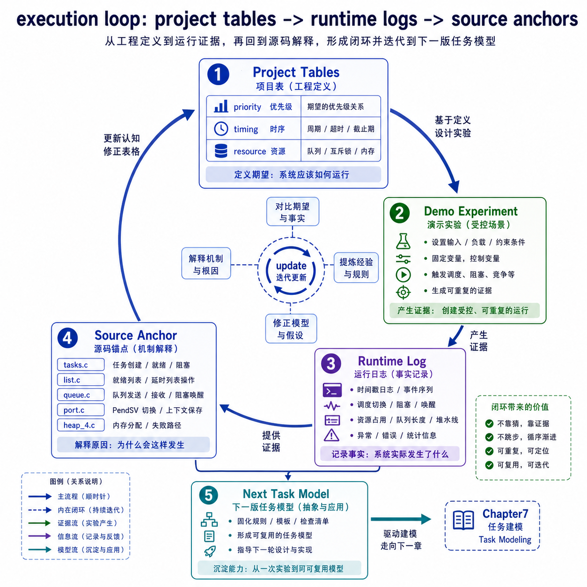

这张闭环图要配合后面的四任务项目一起读。先看静态设计怎样被记录下来，再看一条运行日志怎样逼出下一问，最后用源码第一跳确认这条判断有没有真实内核依据。

### 29.8 给四任务项目填一版任务表

四任务项目可以先填一版粗表。它不是最终架构建议，而是第一轮建模底稿。它的价值在于把隐含判断写出来：为什么 COMM 比 LOG 更急，为什么 LOG 不能随便持有 UART，为什么 SENSOR 的周期证据比 LED 更敏感。

| 任务 | 职责 | 触发方式 | 优先级理由 | 关键等待点 | 栈证据 | 主要风险 |
| --- | --- | --- | --- | --- | --- | --- |
| LED | 心跳观察，证明系统主循环仍在推进 | 周期 Delay | 低实时压力，主要用于观察 | `vTaskDelay()` 或周期等待 | 任务栈较浅，但要看打印路径 | 把心跳晚误判成系统死机 |
| SENSOR | 周期采样，提供新鲜数据 | 固定周期基准 | 采样点要稳定，优先级通常高于 LOG | 时间等待、sample_queue 发送 | 滤波和临时缓冲会吃栈 | 相对 Delay 造成周期漂移 |
| COMM | 外部事件处理和响应 | RX_QUEUE 或事件通知 | 响应压力高，通常高于后台任务 | 队列接收、UART mutex | 协议解析深度影响栈 | 被日志锁或慢 I/O 反压 |
| LOG | 后台日志消费和慢速输出 | LOG_QUEUE 接收 | 后台任务，不应压住关键路径 | 队列接收、UART mutex | 格式化和缓冲区影响栈 | 队列积压、持锁时间过长 |

读项目表时，先别急着争论具体数字，先判断每个字段有没有证据。LED 的栈证据可以来自水位统计；SENSOR 的周期证据要来自 planned/run/finish tick；COMM 的优先级理由要来自响应时间预算；LOG 的风险要来自队列水位和持锁时间。能找到证据，后面再讨论数字才有意义。

如果某个字段填不出来，就说明这不是一个小空格，而是一个真实工程问题。比如 COMM 的关键等待点说不清，说明你还没有画清数据和资源边界；LOG 的持锁时间说不清，说明慢 I/O 可能正在系统里裸奔；SENSOR 的栈证据说不清，说明你还没有在压力路径里观察过栈水位。

当这些字段继续往代码里落地时，通常会变成一小组创建参数、静态存储区和命名约定。接下来的片段不是让项目照抄，而是展示“项目表”怎样收敛成工程里真实存在的对象：

```c
typedef struct {
    const char *name;
    unsigned priority;
    unsigned stack_words;
    const char *trigger;
    const char *main_wait;
} TaskDesign;

static const TaskDesign app_tasks[] = {
    { "LED",    1, 128, "periodic delay", "vTaskDelay" },
    { "SENSOR", 3, 256, "fixed period",   "sample_queue send" },
    { "COMM",   4, 384, "rx event",       "RX_QUEUE receive" },
    { "LOG",    1, 256, "log queue",      "LOG_QUEUE receive" },
};
```

这段代码和前面的任务表是一一对应的。`priority` 回到第 23 节的调度选择，`stack_words` 回到任务栈和 heap 预算，`trigger` 回到 Delay 或队列唤醒，`main_wait` 回到“任务不运行时它在哪里”。进入任务建模时，它就不是一个突然出现的新词；它只是把已经讲过的对象、位置和证据整理成能创建、能检查、能复盘的工程材料。

### 29.9 给同一个项目填队列表和锁表

任务表回答“谁在跑”，队列表回答“数据怎么走”。很多 RTOS 项目混乱，不是因为没有任务，而是任务之间的数据边界没有画清楚。全局变量看起来省事，但它很难表达顺序、容量、等待和唤醒；队列至少能把这些问题放到同一个对象里讨论。

| 队列/事件 | 生产者 | 消费者 | 元素 | 容量依据 | 满/空策略 | 观测指标 |
| --- | --- | --- | --- | --- | --- | --- |
| RX_QUEUE | Driver/ISR | COMM | event id 或接收帧摘要 | 外部突发窗口 | 满时统计溢出，关键事件优先保留 | count、高水位、wake tick |
| sample_queue | SENSOR | COMM | sample frame | 采样周期和通信消费窗口 | 满时丢旧值或标记过载 | count、丢弃次数、消费延迟 |
| LOG_QUEUE | COMM/SENSOR/系统错误路径 | LOG | log item | 高峰日志量和串口吞吐 | 低价值日志可丢，高价值保留 | high water、sender wait、drop count |

队列表最重要的不是容量数字，而是容量背后的场景。RX_QUEUE 的容量要看外部事件可能怎样突发，sample_queue 的容量要看采样和消费之间的最坏窗口，LOG_QUEUE 的容量要看日志峰值和后台吞吐。三条队列都叫 queue，但业务价值不同，满队策略不能一刀切。

锁表回答“资源归谁”。它要比队列表更克制，因为锁本身不会让系统更快，它只是把共享资源边界变得明确。如果锁表写出来以后发现 owner 很多、waiter 很多、持锁动作很长，那不是表写得不好，而是设计本身需要收敛。

| 资源 | 可能 owner | 可能 waiter | 锁内动作 | 锁内禁止 | 替代方案 |
| --- | --- | --- | --- | --- | --- |
| UART | LOG、COMM | COMM、LOG | 提交发送缓冲，启动发送 | 长格式化、等待大量字节发送完成 | UART 服务任务 + 队列 |
| I2C | SENSOR、配置任务 | SENSOR、诊断/配置路径 | 一次事务提交和状态更新 | 锁内做复杂计算或等待其他对象 | 总线服务任务或统一访问层 |
| Flash | 参数任务、日志任务 | 配置保存、故障记录 | 擦写状态机中的短临界动作 | 高优先级任务同步等擦写完成 | 异步擦写请求 + 完成事件 |

这张锁表能直接回到第 27 节。看到 HIGH_COMM 等 LOW_LOG，不要先责怪调度器；先在锁表里看 UART owner 是谁、锁内动作多长、是否有服务任务替代。锁表填得越具体，优先级反转越不神秘。

### 29.10 给内存表补生命周期，而不是只补大小

内存表最容易被写成一列数字：某任务栈 512，某队列深度 8，heap 多少字节。数字当然重要，但如果没有生命周期，数字解释不了长期问题。对象什么时候创建，是否释放，失败后怎么办，是否会和其他对象交错创建，这些才决定 heap_4 的 free list 会不会变碎。

| 对象 | 内存来源 | 生命周期 | 大小依据 | 失败策略 | 长期观测 |
| --- | --- | --- | --- | --- | --- |
| LED TCB/stack | 静态 | 启动后长期存在 | 调用链浅，保留调试余量 | 不应失败，启动阶段检查 | 栈水位 |
| SENSOR TCB/stack | 静态 | 启动后长期存在 | 采样、滤波、临时缓冲 | 不应失败，启动阶段检查 | 栈水位、周期峰值 |
| COMM TCB/stack | 静态 | 启动后长期存在 | 协议解析深度、响应路径 | 不应失败，启动阶段检查 | 栈水位、HardFault 现场 |
| LOG_QUEUE storage | 静态或初始化期创建 | 长期存在 | 高峰日志窗口 | 满时降级或丢低价值日志 | high water、drop count |
| temp_worker | 尽量静态池 | 临时或高峰路径 | 最坏处理对象大小 | 失败时降级，不阻塞关键任务 | 失败次数、largest_free |
| heap_4 free list | FreeRTOS heap | 全系统共享 | 动态对象总预算和碎片余量 | 触发告警或降级 | current free、minimum ever、largest free |

内存表要把“对象成本”讲成人能判断的语言。COMM 栈不是随便填一个大数，而是由协议解析深度、局部缓冲和调用链决定；LOG_QUEUE storage 不是越大越好，而是由日志峰值和后台吞吐决定；temp_worker 如果在高峰路径动态创建，就必须说明失败后系统怎样继续运行。

还要提醒一句：静态和动态不是风格之争，而是证据可见性之争。静态对象生命周期清楚，失败多发生在启动阶段；动态对象更灵活，但需要运行期失败策略、碎片观测和长期测试。小型嵌入式系统里，核心长期对象越静态，后续排查越稳。

### 29.11 用表格反向审查设计是否过早复杂

项目表还有一个作用：它能发现设计过早复杂。学完 RTOS 后，很容易把每个功能都拆成任务、每个共享变量都换成队列、每个资源都加锁、每个临时需求都动态申请。看起来“很 RTOS”，实际可能让系统更难调试。

审查时可以反过来问：这个任务是否真的需要独立执行流，还是可以合到已有任务；这条队列是否真的需要缓冲和等待，还是简单状态就够；这把锁是否保护了真实共享资源，还是掩盖了模块边界不清；这个动态对象是否真的需要运行期创建，还是静态缓冲更稳。每一问都要回到证据，而不是回到个人偏好。

| 设计动作 | 何时合理 | 何时可能过早复杂 |
| --- | --- | --- |
| 新增任务 | 有独立节奏、等待点或响应压力 | 只是为了把函数换个名字 |
| 新增队列 | 需要顺序、容量、等待和唤醒 | 单个最新值即可，无需排队 |
| 新增 mutex | 有真实共享资源和 owner 边界 | 只是为了遮住全局变量混乱 |
| 动态创建对象 | 生命周期确实运行期变化 | 长期对象本可静态化 |
| 提高优先级 | ready 后确实需要更快响应 | 实际在等队列、锁或慢 I/O |

这张审查表能保护后续任务建模。底层机制不是越用越多越好；好的 RTOS 设计，是把不同节奏的工作拆开，把必要的协作显式化，把资源边界讲清楚，把 RAM 成本算进去。该简单的地方保持简单，该拆开的地方拆开，这才是底层理解真正服务项目的方式。

现在可以做一次完整练习：拿自己的项目整理四类材料，再用 demo 和源码锚点逐项反查。字段没有证据时，先留空，再补日志、补输出、补源码入口。这样进入任务建模时，带走的就不是一堆名词，而是一套能落地的方法。

## 30 从表格走向案例：先学会读一条运行证据

任务表、队列表、锁表和内存表只是静态地图，真实故障给出来的却是一串动态证据：某个 tick 的日志、某个任务的状态、某条队列的水位、某个 owner 的持锁时间。新的问题也就出现了：表已经会填了，现场来了一行日志，应该先把它放到哪一格，又该继续补哪一条证据。

比如联调时串口里可能只滚出来几行这样的东西：

```log
t=150 LED delayed -> ready
t=151 current=COMM switch_to=COMM
t=152 COMM waits UART_MUTEX owner=LOW_LOG
t=168 LOW_LOG gives UART_MUTEX
t=169 switch_to=COMM
```

如果只盯着第一行，容易说“LED 到期了怎么还没翻转”。可是第二行到第五行已经把现场换了方向：CPU 先给了 COMM，COMM 又被 UART 的 owner 挡住，直到 LOW_LOG 释放后才继续。读者真正要练的不是背日志格式，而是把每一行放回任务位置、调度选择、资源 owner 和现场切换这几类机制里。

### 30.1 先把一条证据翻译成下一问

先练一个很小的动作：一行运行证据进来，不急着写结论，先问四个问题。对象是谁，位置发生了什么变化，动作由谁触发，还缺哪条证据。

比如 `tick=150 LED delayed -> ready` 不是一句普通日志，它说明 LED 从 delayed 回到 ready，动作由 Tick 触发；但它还没有证明 LED 已经运行，所以下一问要落到调度和 PendSV。

同样，`queue count=2 sender waits` 也不是单纯的队列数字。它告诉你队列还有水位压力，发送者已经被容量挡住；但它还没有告诉你消费者为什么没及时取走数据。容量当然可以调整，但那应该是证据继续走下去以后的工程动作，而不是第一反应。

把这一步落到纸面上，就是下面这种读法：左边保留原始证据，中间把它翻译成机制动作，右边只写下一问。下一问越具体，排查越不容易散。

| 原始证据 | 机制动作 | 下一步追问 |
| --- | --- | --- |
| `LED delayed -> ready` | 时间等待结束，LED 重新进入候选集合 | 谁正在 running，LED 为什么还没运行 |
| `COMM wake by queue` | 队列动作唤醒了 COMM | COMM 是否进入 ready，是否被调度选中 |
| `LOW_LOG owns UART_MUTEX` | UART 资源 owner 是 LOW_LOG | HIGH_COMM 是否等待，持锁多久 |
| `malloc fail, largest_free=44` | 失败点在连续块不足 | 申请大小是多少，free list 怎样变形 |

这不是在整理格式，而是在给判断加一个减速器。看到日志以后，先把已经发生的动作说清楚，再把缺失信息写成下一问。这样结论会慢半拍出来，但更稳；项目案例也会沿着这个节奏走，把现象翻译成可以复查的材料。

这个动作很适合画成一张“读日志的流水线”。读者先看到左边杂乱的一行日志，再把它放进中间的机制翻译区，最后在右边得到下一问。图里不要急着给最终根因，而要突出“慢半拍”的判断过程。

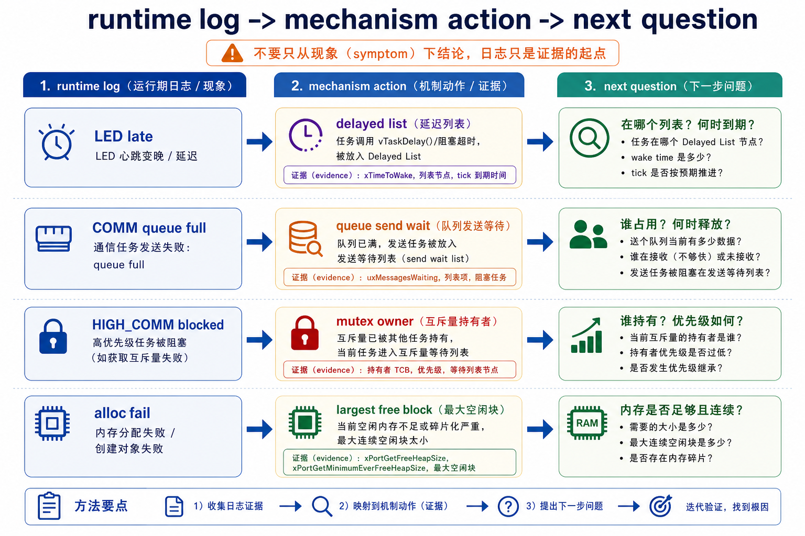

这张流水线图要训练的是“慢半拍”。先把原始日志翻译成机制动作，再拦住不够证据的结论，最后才写下一问；这会直接接到下面的小段伪代码。

### 30.2 用一段小代码固定判断顺序

把一行日志丢到眼前时，人很容易直接跳到结论。下面这段小代码不是要做真正的日志解析器，而是把判断顺序固定住：这行日志已经证明了什么，还缺哪条证据。它把“慢半拍再判断”的动作写成了可重复的步骤。

```c
typedef enum {
    EVIDENCE_DELAY_READY,
    EVIDENCE_QUEUE_WAKE,
    EVIDENCE_MUTEX_OWNER,
    EVIDENCE_HEAP_FAIL,
    EVIDENCE_UNKNOWN
} EvidenceKind;

typedef struct {
    const char *object;
    EvidenceKind kind;
    const char *mechanism;
    const char *next_question;
} EvidenceNote;

static EvidenceNote explain_log_line(const char *line) {
    if (contains(line, "delayed -> ready")) {
        return (EvidenceNote){
            "task", EVIDENCE_DELAY_READY,
            "Tick moved a delayed task back to ready",
            "which task is currently running, and why not this one yet?"
        };
    }
    if (contains(line, "wake") && contains(line, "QUEUE")) {
        return (EvidenceNote){
            "queue waiter", EVIDENCE_QUEUE_WAKE,
            "queue operation woke a waiting task",
            "did the task enter ready, get selected, and actually switch in?"
        };
    }
    if (contains(line, "owner=")) {
        return (EvidenceNote){
            "mutex", EVIDENCE_MUTEX_OWNER,
            "a resource has a current owner",
            "who is waiting, how long is the owner holding it?"
        };
    }
    if (contains(line, "malloc") && contains(line, "largest_free")) {
        return (EvidenceNote){
            "heap", EVIDENCE_HEAP_FAIL,
            "allocation depends on a contiguous free block",
            "is the largest block smaller than the requested object?"
        };
    }
    return (EvidenceNote){"unknown", EVIDENCE_UNKNOWN, "not enough evidence", "collect task, tick, and object context"};
}
```

这段伪代码故意没有实现 `contains()`，因为重点不在字符串处理，而在判断顺序。真实项目里，日志格式可能来自串口、RTT、Trace 工具或自定义事件缓冲；但心里的动作应该类似：一行日志进来，不急着得出“系统慢了”的大结论，先判断它已经说明了什么，再决定下一条材料该去哪找。

### 30.3 每个日志关键词都要回到最小模型

看到 `wake`、`owner`、`largest_free` 这类词时，先不要把它们当孤立日志词。它们都能回到已经跑过的最小模型：先把词翻译成机制，再去找源码或项目日志，阅读会轻很多。

| 日志关键词 | 回到哪个最小模型 | 它提醒你看什么 |
| --- | --- | --- |
| `delayed -> ready` | [`v8_delay_blocked_list/demo.c`](F:/DevelopSrc/embedded_system_learning/tutorials/Chapter6_手撕FreeRTOS_底层核心机制/code/v8_delay_blocked_list/demo.c) | Tick 到期只是把任务送回 ready |
| `wake by queue` | [`v9_queue/demo.c`](F:/DevelopSrc/embedded_system_learning/tutorials/Chapter6_手撕FreeRTOS_底层核心机制/code/v9_queue/demo.c) | 数据交接和任务唤醒是同一条链上的两个动作 |
| `owner=` | [`v10_mutex_inheritance/demo.c`](F:/DevelopSrc/embedded_system_learning/tutorials/Chapter6_手撕FreeRTOS_底层核心机制/code/v10_mutex_inheritance/demo.c) | 先找资源 owner，再判断是否需要继承 |
| `largest_free` | [`v11_heap4_allocator/demo.c`](F:/DevelopSrc/embedded_system_learning/tutorials/Chapter6_手撕FreeRTOS_底层核心机制/code/v11_heap4_allocator/demo.c) | 分配失败可能卡在最大连续块 |

每一类日志都有一个最小模型垫底。真实工程里第一次见到它时，读者就不会只剩一句“系统慢了”，而是能立刻问出下一步：它回 ready 了吗，谁是 owner，最大连续块够不够。

### 30.4 坏日志要改成能回答下一问的日志

还可以练一个非常实用的动作：把“坏日志”改成“好日志”。坏日志不是语法不好，而是它无法回答下一问。比如 `COMM slow` 只告诉你主观感受，不告诉你事件何时到、队列何时唤醒、任务何时 ready、资源 owner 是谁、什么时候真正运行。好日志不一定长，但它要能把原因链拆开。

| 坏日志 | 为什么不好 | 改成什么 |
| --- | --- | --- |
| `COMM slow` | 没有时间点，也没有对象状态 | `t=021 RX_QUEUE wake COMM; t=022 COMM waits UART owner=LOG; t=037 COMM run` |
| `LED late` | 不知道是 Delay、调度还是业务耗时 | `delay_enter=0 target=20 ready=20 toggle=27` |
| `queue full` | 不知道是峰值还是长期消费不足 | `LOG_QUEUE count=8/8 high_water=8 sender=COMM receiver=LOG last_receive=...` |
| `malloc fail` | 不知道申请大小和 free list 形状 | `malloc size=64 total_free=96 largest_free=40 owner=temp_worker` |
| `HardFault in switch` | 不知道是切换错还是现场坏 | `current=LOG next=COMM old_psp=... new_psp=... stack_range=...` |

这个改写训练会暴露一个常见根因：很多“我不会排查”，其实是日志本身没有给出可推理的信息。把日志改好，排查不是自动完成，但至少有了路线。日志语言站稳以后，任务建模和源码跳转才有共同基础。

也要注意，日志不是越多越好。大量没有对象、没有 tick、没有状态的日志，只会制造噪声。RTOS 里更值得记录的是状态变化：进入等待、被唤醒、进入 ready、被调度选中、资源 owner 改变、队列水位变化、heap 统计变化。这些变化一旦按时间排起来，时间线就自然出现了。

## 31 一条日志怎样拆成时间线

真实项目里的日志通常不会替你把原因写好。它只会散落几行：某个事件来了，某个任务醒了，某条队列满了，某个任务很久以后才打印。如果只盯着结果行，就很容易把所有延迟都归成“系统卡了”。更稳的做法，是把日志重新排成一条时间线。

### 31.1 先保留最能说明因果的几行

真实项目的日志通常比教材里的例子吵得多。为了让因果链不被大量日志淹没，先保留最能说明问题的几行：事件什么时候进入系统，谁被唤醒，谁占着资源，什么时候真正切过去，什么时候处理完成。

```output
t=100 COMM event from driver
t=101 RX_QUEUE send ok, count=1, wake COMM
t=102 current task=LOG, UART_MUTEX owner=LOG
t=118 LOG give UART_MUTEX
t=119 PendSV switch LOG -> COMM
t=120 COMM handles event
```

这段日志里，COMM 响应花了 20 ms，但这 20 ms 不是一个单一原因。`t=100` 到 `t=101` 说明事件入队很快；`t=101` 到 `t=119` 说明 COMM 虽然被唤醒，却没有立刻运行；中间 `UART_MUTEX owner=LOG` 又提示它可能被资源所有权挡住。这样拆完，结论就不会停在“COMM 慢”，而会继续追问 LOG 为什么持锁到 `t=118`。

时间线的价值，是让不同机制按顺序站出来。队列负责事件交接，调度负责 ready 以后谁运行，mutex 负责资源 owner，PendSV 负责真正切换。每一段都有自己的证据，排查才不会混在一起。

### 31.2 把 20 ms 响应拆成几段可量时间

这段日志也适合画成一条因果链：事件从驱动进入队列，队列唤醒 COMM；LOG 仍然持有 UART mutex，COMM 即使 ready 也要等资源；等 owner 释放后，PendSV 才把 CPU 切到 COMM。

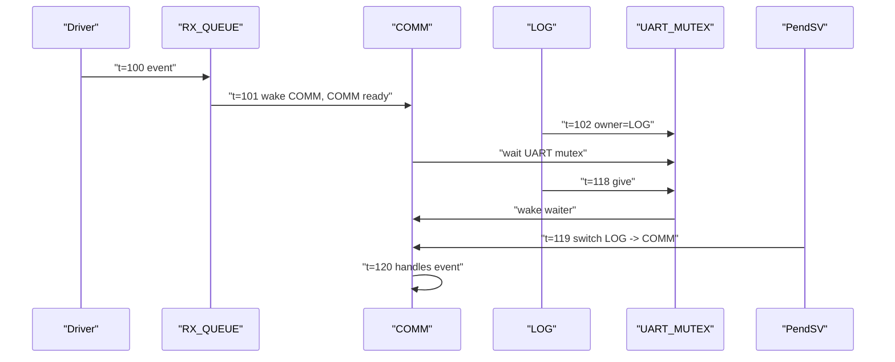
```mermaid
sequenceDiagram
    participant Driver as "Driver"
    participant Queue as "RX_QUEUE"
    participant Comm as "COMM"
    participant Log as "LOG"
    participant Mutex as "UART_MUTEX"
    participant PendSV as "PendSV"
    Driver->>Queue: "t=100 event"
    Queue->>Comm: "t=101 wake COMM, COMM ready"
    Log->>Mutex: "t=102 owner=LOG"
    Comm->>Mutex: "wait UART mutex"
    Log->>Mutex: "t=118 give"
    Mutex->>Comm: "wake waiter"
    PendSV->>Comm: "t=119 switch LOG -> COMM"
    Comm->>Comm: "t=120 handles event"
```

这条因果链把“响应慢”拆成几段可量的时间。事件入队只用了 1 ms，资源等待用了 17 ms，切换到处理又用了 1 ms。拆完以后，优化方向就不会只剩一句“提高 COMM 优先级”：如果 COMM 主要在等 LOG 释放 UART，真正要看的就是持锁区和日志输出路径。

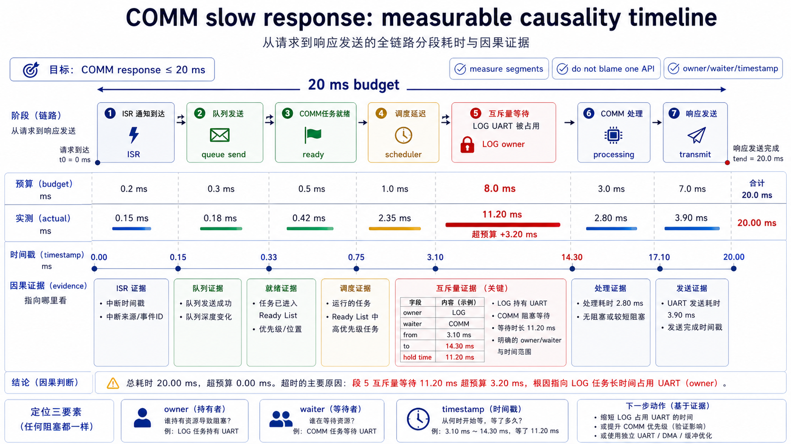

写时间线时，不需要一开始就追求很完整。五类点最值得保留：事件进入系统的时间，任务被唤醒的时间，任务进入 ready 的时间，任务真正 running 的时间，任务完成关键动作的时间。五个点一排，问题通常会从一团雾变成几段可测的延迟。

### 31.3 同一个任务在不同时间点身份不同

时间线还有一个很实用的好处：它能把“同一个任务”在不同机制里的身份分开。COMM 在 `t=101` 是 queue waiter 被唤醒，在 `t=102` 是 ready task 但还没拿到资源，在 `t=119` 才是被 PendSV 切入的 current task。名字都叫 COMM，但证据层次完全不同。

| 时间点 | COMM 的身份 | 对应机制 | 可反查的代码或源码 |
| --- | --- | --- | --- |
| `t=100` | 外部事件的目标任务 | 驱动事件进入队列 | [`v9_queue/demo.c`](F:/DevelopSrc/embedded_system_learning/tutorials/Chapter6_手撕FreeRTOS_底层核心机制/code/v9_queue/demo.c) |
| `t=101` | 被队列唤醒的等待者 | send 成功后唤醒 receiver | [`queue.c:xQueueGenericSend()`](F:/DevelopSrc/embedded_system_learning/reference/rtos_src/FreeRTOS-Kernel/queue.c:949) |
| `t=102` | ready 但被资源挡住的任务 | mutex owner/waiter | [`v10_mutex_inheritance/demo.c`](F:/DevelopSrc/embedded_system_learning/tutorials/Chapter6_手撕FreeRTOS_底层核心机制/code/v10_mutex_inheritance/demo.c) |
| `t=118` | 等待资源释放的任务 | owner give 后等待链变化 | [`queue.c:xQueueSemaphoreTake()`](F:/DevelopSrc/embedded_system_learning/reference/rtos_src/FreeRTOS-Kernel/queue.c:1795) |
| `t=119` | 即将成为 current task 的任务 | PendSV 恢复现场 | [`v7_pendsv_switch/demo.c`](F:/DevelopSrc/embedded_system_learning/tutorials/Chapter6_手撕FreeRTOS_底层核心机制/code/v7_pendsv_switch/demo.c) |
| `t=120` | 正在处理业务的 running task | 业务响应完成 | 项目日志里的响应完成点 |

这份时间点拆解能避免一个很常见的跳步：把“被唤醒”直接当成“已经处理”。被唤醒只是从等待位置回到候选集合；被选中只是调度层给出结果；真正运行还要经过现场切换；运行后还可能被 mutex、队列或慢 I/O 再次挡住。时间线把这些动作拆开，一个 20 ms 延迟就能拆成几个 1 ms、17 ms、1 ms 的小段。

### 31.4 项目日志先固定少量关键字段

项目日志要先能回答关键问题，再追求漂亮。字段可以很朴素：时间、任务、事件、位置、资源 owner、队列水位、heap 状态。只要这些列能稳定出现，关键路径就有了可以复盘的骨架。

| 字段 | 示例 | 为什么要记录 |
| --- | --- | --- |
| `tick` | `119` | 所有证据必须能排成时间线 |
| `task` | `COMM` | 知道当前证据属于哪个执行流 |
| `event` | `wake_by_queue` | 区分数据动作、调度动作、资源动作 |
| `position` | `ready` / `event_wait` | 知道任务是不是有运行资格 |
| `owner` | `UART_MUTEX=LOG` | 资源等待要能追到持有者 |
| `count` | `RX_QUEUE=1/4` | 队列问题要有水位证据 |
| `sp_or_heap` | `PSP=...` / `largest_free=40` | 切换和内存问题要有现场材料 |

这不是让项目从第一天就接入复杂追踪系统。相反，它是在提醒我们：日志的价值不在于多，而在于能不能回答下一问。字段少但能串起来，比字段很多却无法还原因果更有用。

### 31.5 用时间线拆错误归因

同一段时间线，还能反过来拆错误归因。比如只拿 `t=120 COMM handles event` 当证据，很容易以为外部事件到得晚；但日志第一行已经说明 `t=100` 事件就到了。

再比如看到 COMM 没立刻处理就怀疑队列慢，`t=101 RX_QUEUE send ok` 又说明队列交接很快，主要延迟不在入队。若 `t=102` 已经显示 COMM ready，但 UART owner 是 LOG，解释里就必须纳入资源等待。

| 错误归因 | 它忽略了哪行证据 | 正确转向 |
| --- | --- | --- |
| 外部事件到得晚 | `t=100 COMM event from driver` | 事件很早进入系统，继续看内部路径 |
| RX_QUEUE 慢 | `t=101 RX_QUEUE send ok, wake COMM` | 队列唤醒快，继续看 ready 后发生什么 |
| 调度器没工作 | `UART_MUTEX owner=LOG` | COMM 可能被资源挡住，继续看 owner |
| PendSV 慢 | `t=118 LOG give UART_MUTEX` | 资源等待占大头，切换只占最后一段 |
| COMM 代码慢 | `t=120 COMM handles event` 紧跟切换 | COMM 处理本身可能不慢，慢在处理前 |

这种错误归因表，适合放在真实 bug 复盘里。它不是为了证明谁判断错了，而是训练团队把“证据”和“猜测”分开。每个猜测都要能指向一行日志；指不到，就先降级为假设。

如果项目已经有 Trace 工具，时间线仍然有价值。Trace 能给出更多事件，但不会自动替你解释因果。你仍然要问：哪个事件改变了任务位置，哪个事件改变了资源 owner，哪个事件改变了 ready 集合，哪个事件只是业务打印。工具越强，越需要稳定的阅读顺序，不然信息量会把判断淹没。

一行日志能放进时间线以后，还要处理材料之间的配合：图先给结构，demo 让动作可见，源码确认真实入口，项目日志再把它们拉回现场。少掉任何一环，前面的时间线都会变成孤立记录。

## 32 图、代码和源码要互相解释

后半段最容易出现一种假丰富：页面上有图，有 demo，有源码链接，也有项目日志，但每样材料都像在单独说话。读者看完会觉得信息很多，却说不清哪一行输出证明了图上的箭头，哪个源码函数又证明了 demo 的动作。

这里要做的是把材料接起来。图负责给方向，demo 负责跑出最小动作，源码负责确认真实内核的位置，项目日志负责把判断带回自己的系统。四者能互相解释，读者才不会在收尾阶段重新迷路。

### 32.1 图要带着一个具体困惑进入正文

一张图最好从一句困惑开始，而不是从“这里有一张图”开始。比如 ready、delayed、event wait 的图，真正要回答的是“任务没输出时它到底在哪里”。读者先在图上找到位置，再去 demo 里找 `ready -> delayed` 这类移动，最后打开 `list.c` 看插入和移除，理解才会连起来。

demo 也要摆正位置。它是放大镜，只放大一个动作：任务栈怎样初始化，TCB 怎样记录身份，队列满时谁等待，mutex owner 怎样继承优先级。它故意省掉很多边界，是为了让第一口概念能咽下去。真实源码负责补边界，但不应该在第一分钟就把人淹没。

### 32.2 用闭环把图、demo、源码接回项目日志

如果手上是一条 `COMM wake 后仍然慢` 的日志，不要同时打开图、demo 和源码。先让图回答“慢在哪条线”，再让 demo 展示“这条线上的动作长什么样”，再用源码确认“真实内核在哪里做这件事”，最后回到项目日志，判断自己的现象落在哪一段。

这个关系可以画成一个小循环。它不是为了把材料排得漂亮，而是让读者每走一步都有下一步：看结构，找最小动作，确认真实入口，回填项目证据。

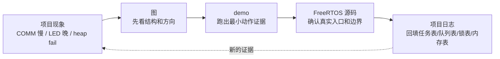
```mermaid
flowchart LR
    Problem["项目现象\nCOMM 慢 / LED 晚 / heap fail"] --> Figure["图\n先看结构和方向"]
    Figure --> Demo["demo\n跑出最小动作证据"]
    Demo --> Source["FreeRTOS 源码\n确认真实入口和边界"]
    Source --> Project["项目日志\n回填任务表/队列表/锁表/内存表"]
    Project -. "新的证据" .-> Problem
```

这条循环从左边的项目现象进来，而不是从源码文件名进来。比如 COMM 慢，先让结构图帮你分清它更像数据线、调度线，还是资源线。

接着按三步走，不要同时打开一堆材料。

| 步骤 | 看什么 | 证明什么 |
| --- | --- | --- |
| 先看图 | COMM 慢更像数据线、调度线，还是资源线 | 先把问题放到正确方向 |
| 再跑 demo | [`v9_queue/demo.c`](F:/DevelopSrc/embedded_system_learning/tutorials/Chapter6_手撕FreeRTOS_底层核心机制/code/v9_queue/demo.c) 看满、空、等待、唤醒；[`v10_mutex_inheritance/demo.c`](F:/DevelopSrc/embedded_system_learning/tutorials/Chapter6_手撕FreeRTOS_底层核心机制/code/v10_mutex_inheritance/demo.c) 看 owner、waiter、inherit | 最小动作长什么样 |
| 最后对源码 | [`queue.c:xQueueGenericSend()`](F:/DevelopSrc/embedded_system_learning/reference/rtos_src/FreeRTOS-Kernel/queue.c:949) 或 [`queue.c:xQueueSemaphoreTake()`](F:/DevelopSrc/embedded_system_learning/reference/rtos_src/FreeRTOS-Kernel/queue.c:1795) | 真实内核在哪条路径上完成这个动作 |

这样读，源码不是毫无准备的入口，而是证据已经指向它。

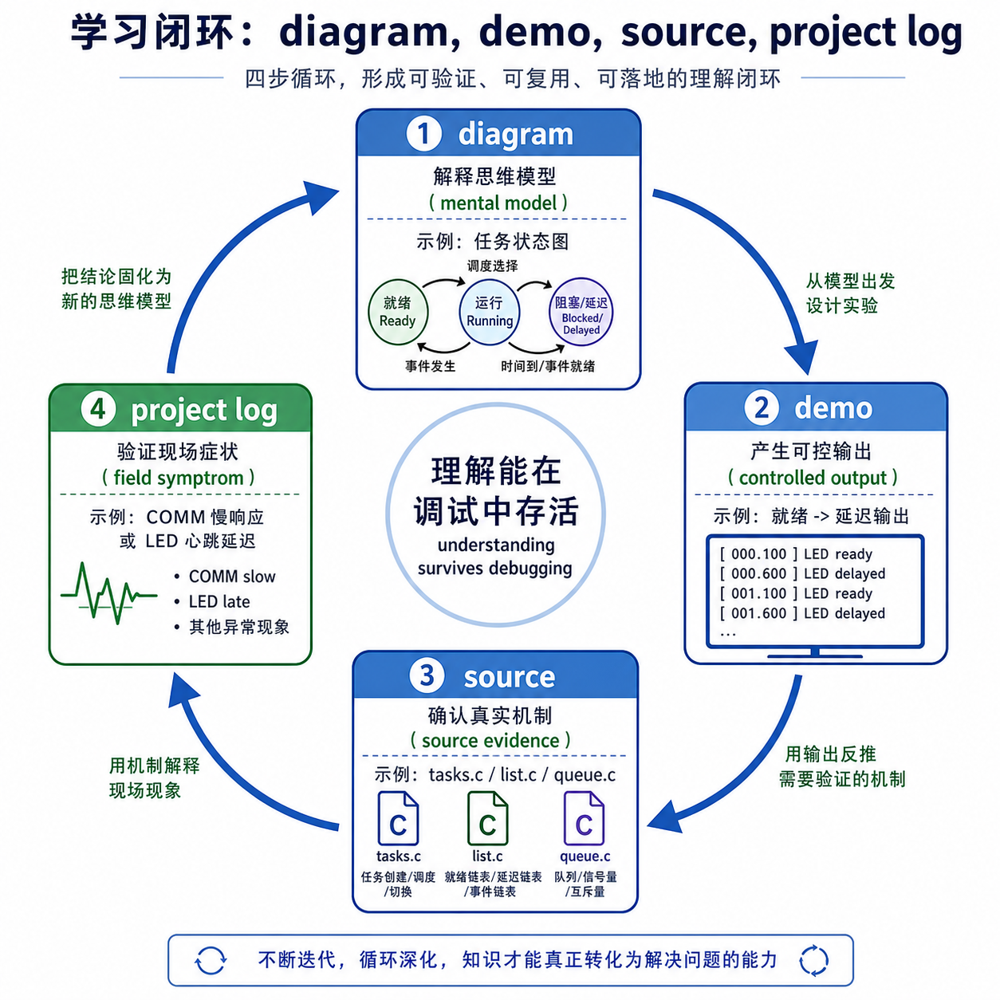

这张闭环图最好配合 COMM 慢的时间线一起看。时间线负责给出一串具体时刻，闭环图负责提醒每个时刻该用哪种材料确认：先用图定方向，再用 demo 看动作，最后用源码和项目日志回到真实系统。

### 32.3 不同材料各自回答不同问题

还是拿 COMM 慢来说。如果它慢在数据线，图应该让你看见队列方向和等待者；如果它慢在资源线，图应该让你看见 UART owner；如果它慢在切换线，图应该把 ready、selected、switched 分开。每种材料只承担自己擅长的那一步，读者才不会在同一页里同时被结构、代码、源码和日志拉扯。

| 材料 | 在 COMM 慢现场里回答什么 | 它不适合承担 | 阅读动作 |
| --- | --- | --- | --- |
| 图 | COMM 慢更像数据等待、调度延迟还是资源 owner 挡住 | 证明具体源码分支 | 说出对象和箭头代表什么 |
| demo | 队列 wake、mutex owner、PendSV switch 这些动作最小长什么样 | 替代真实内核完整行为 | 找到输出里的关键词和状态变化 |
| FreeRTOS 源码 | 真实内核在哪个函数里完成唤醒、继承或切换 | 第一眼建立直觉 | 带着一个问题打开一个函数 |
| 项目日志 | 这次 COMM 慢到底发生在哪几个 tick | 自动解释根因 | 按时间写出谁被唤醒、谁占着资源、谁真正运行 |

### 32.4 用 LED 和 heap 检查四种材料是否接上

拿两个熟悉现场做自检最有效：LED 到期后仍然晚，heap 申请失败。一个偏时间和调度，一个偏内存和生命周期；如果这两个现场都能把图、demo、源码和项目日志接起来，说明前面的材料已经不只是摆在页面上，而是真的能帮你解释问题。

| 现场 | 图先说明什么 | demo 证明什么 | 源码对账什么 | 项目日志要补什么 |
| --- | --- | --- | --- | --- |
| LED 到期后仍然晚 | delayed、ready、running 是三个不同位置 | `delayed -> ready, not necessarily running yet` | [`tasks.c:xTaskIncrementTick()`](F:/DevelopSrc/embedded_system_learning/reference/rtos_src/FreeRTOS-Kernel/tasks.c:4736) 怎样把到期任务送回 ready | LED 什么时候进入 Delay、什么时候回 ready、什么时候真正翻转 |
| heap 申请失败 | free/used/free 的内存条形状 | `total_free` 和 `largest_free` 的差异 | [`heap_4.c:pvPortMalloc()`](F:/DevelopSrc/embedded_system_learning/reference/rtos_src/FreeRTOS-Kernel/portable/MemMang/heap_4.c:173) 怎样找块，[`heap_4.c:prvInsertBlockIntoFreeList()`](F:/DevelopSrc/embedded_system_learning/reference/rtos_src/FreeRTOS-Kernel/portable/MemMang/heap_4.c:504) 怎样合并 | 申请大小、失败时间、当时最大连续块 |

四者合起来，才是一段完整解释。只说“LED 晚”或“heap 不够”都太粗；图、代码、源码、日志一起看，才能分清位置问题、调度问题、总量压力、碎片压力或对象生命周期设计问题。

进入源码跳转和任务建模时，每次出现图或代码，都要带着同一个问题读：它现在帮助我解释哪一个现场。解释不了现场的图，就只是装饰；解释不了证据的代码，就只是展示实现。要留下的能力是：看到现象能找证据，看到证据能回机制。

COMM 慢也可以完整走一遍。先不要急着改优先级，手上这几行日志已经足够把材料串起来：

```log
t=100 driver event -> RX_QUEUE
t=101 RX_QUEUE send ok, wake COMM
t=102 COMM ready, UART_MUTEX owner=LOG
t=118 LOG give UART_MUTEX
t=119 PendSV switch LOG -> COMM
t=120 COMM handles event
```

顺着这 6 行看，结构图先帮你把它分成数据线、资源线和切换线；`v9_queue` 证明 wake 不是处理完成，`v10_mutex_inheritance` 证明 owner 会挡住高优先级任务，`v7_pendsv_switch` 证明被选中以后还要完成现场切换。源码对账时也不需要大范围散开：先看 `queue.c` 的唤醒路径，再看 mutex owner，再看 PendSV 是否真的切过去。

| 材料 | 在这次 COMM 慢里证明什么 | 读者下一步该做什么 |
| --- | --- | --- |
| 结构图 | 慢不只可能来自队列，还可能来自资源 owner 和切换现场 | 先把现象分到数据线、资源线、切换线 |
| demo 输出 | `wake`、`owner`、`switch` 分别长什么样 | 找到最像当前日志的最小动作 |
| FreeRTOS 源码 | 唤醒、owner、现场切换各自在哪条真实路径上发生 | 每次只打开一个入口证明一个动作 |
| 项目日志 | 17 ms 主要落在 `owner=LOG` 到 `give` 之间 | 回头审查 LOG 持锁区和 UART 使用规则 |

这块证据板的价值，是把优化动作也变得克制。看到 20 ms 响应慢，不一定先提高 COMM 优先级；如果 17 ms 都花在等 UART owner，真正要改的是 LOG 的持锁边界、日志输出路径或 UART 服务任务设计。这样从图到源码的闭环，最后会回到项目建模，而不是停在“我看过这些材料”。

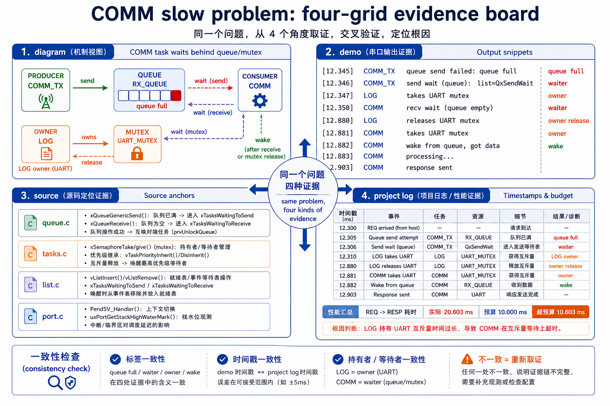

读这张四格证据板时，先从左侧日志进入，不要先看源码文件名。中间两格负责把日志翻译成结构方向和 demo 关键词，右侧源码入口只证明一个动作。读完以后要能说清：COMM 慢主要慢在 owner hold time，而不是 RX_QUEUE send 本身。

### 32.5 错配会直接破坏阅读心流

还有一种常见问题，是图、代码和源码互相“错配”。比如图上画的是 ready、delayed、event wait 三个位置，但代码只展示了一个 `state` 枚举，没有任何插入和移除；刚建立的位置直觉会被代码带偏，以为状态只是一个变量，而不是列表位置。

再比如 demo 输出了 `owner=LOG`，但正文没有交代 mutex 源码在 `queue.c` 里，打开源码时就会困惑：为什么查锁要看队列文件。

错配不是小问题，它会直接破坏阅读心流。图像刚建立，代码却证明不了；demo 刚看懂，源码入口又对不上，读者就会重新回到“我好像懂了，但不知道怎样落到项目”的状态。

为了避免这种断裂，每个图后面最好能回答三个问题：它对应哪个 demo 输出，输出里的哪个词能证明图上的箭头，真实源码里哪个函数负责这条箭头。

| 图或概念 | demo 证据 | 源码入口 | 如果三者没对上会怎样 |
| --- | --- | --- | --- |
| ready/delayed/event wait | `move SENSOR -> delayed` | [`list.c:vListInsert()`](F:/DevelopSrc/embedded_system_learning/reference/rtos_src/FreeRTOS-Kernel/list.c:139) | 容易把位置误解成普通枚举 |
| Delay 到期 | `delayed -> ready, not necessarily running yet` | [`tasks.c:xTaskIncrementTick()`](F:/DevelopSrc/embedded_system_learning/reference/rtos_src/FreeRTOS-Kernel/tasks.c:4736) | 容易误以为到期就运行 |
| 队列唤醒 | `wake receiver LOG` | [`queue.c:xQueueGenericSend()`](F:/DevelopSrc/embedded_system_learning/reference/rtos_src/FreeRTOS-Kernel/queue.c:949) | count 有了，但任务线缺失 |
| mutex owner | `HIGH_COMM waits for mutex owned by LOW_LOG` | [`queue.c:xQueueSemaphoreTake()`](F:/DevelopSrc/embedded_system_learning/reference/rtos_src/FreeRTOS-Kernel/queue.c:1795) | 锁等待被误放进调度问题 |
| heap 最大连续块 | `malloc 48 fails: total_free=70 largest_free=40` | [`heap_4.c:pvPortMalloc()`](F:/DevelopSrc/embedded_system_learning/reference/rtos_src/FreeRTOS-Kernel/portable/MemMang/heap_4.c:173) | 总剩余有了，但内存形状缺失 |

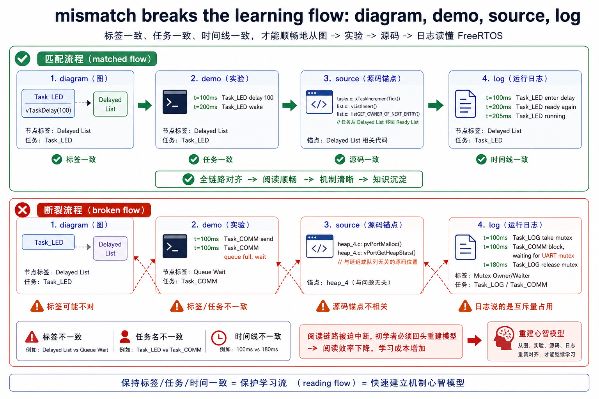

读这张错配图时，先看左半边的证据链怎样一格一格接住同一个动作，再看右半边在哪一格断掉。断点不一定来自技术错误，更多时候来自材料没有互相解释：图讲位置，代码却只讲枚举；demo 讲 owner，源码入口却没有带到 `queue.c`。

这也是为什么这些图表不能只当页面装饰，而要当成证据板。图不是为了让页面热闹，而是为了把任务位置、资源 owner、队列水位、heap 形状放在同一个视野里，先看结构，再回到代码和源码验证每个动作。

当图、demo、源码和项目日志能互相解释时，底层学习就不再停在页面上。接下来不需要再堆新的内核机制，而是把这些已经跑通的理解带进任务建模：任务怎么拆，优先级怎么定，队列和锁怎么画边界，RAM 成本怎么提前算清。

## 结语：把底层机制接到任务建模

合上这一段内容时，脑子里最好留下的不是一串 API，而是一条能反复走的路线。任务先从 C 函数变成内核对象，再进入 ready、delayed 或 event wait；调度器从 ready 集合里选出当前任务，PendSV 把这个选择落到 CPU 现场；队列和 mutex 改变任务之间的等待关系，heap_4 决定这些对象能不能长期待在 RAM 里。

这条路线一旦站稳，任务建模就不会只靠经验。任务怎么拆，要看节奏和等待点；优先级怎么定，要看响应压力和资源 owner；队列容量怎么估，要看生产消费窗口；锁边界怎么画，要看持锁动作和等待链；内存怎么规划，要看对象生命周期、栈水位和 heap 形状。

下次打开一个 RTOS 项目时，可以先不急着翻源码。先问五个朴素问题：这个执行流是谁，它现在排在哪里，谁让它移动，谁可能挡住它，它需要哪些 RAM 材料。每个问题都能回到前面的机制：身份回到 TCB 和任务栈，位置回到内核列表，移动回到 Tick、队列或事件，阻塞回到 mutex owner，材料回到 heap 和静态对象生命周期。

这样进入后续任务建模时，底层源码就不会停在“我读过”这个层面。它会继续变成项目里的判断：这个任务是否该独立出来，这个优先级有没有响应证据，这条队列容量是不是有峰值依据，这把锁会不会把高优先级任务挡住，这块内存是不是能支撑系统长期运行。

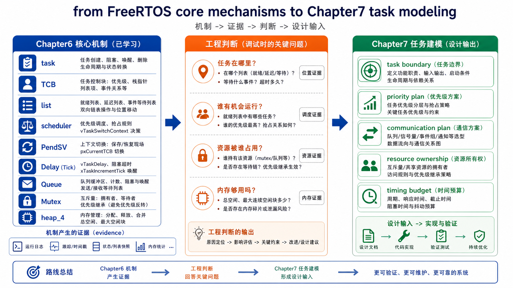

读这张收束路线图时，先从左侧项目现象进入，而不是从机制名进入。中间五个追问是后续任务建模的起点：身份、位置、移动、阻塞、材料。右侧输出则提醒读者，底层学习最终要落到任务拆分、优先级、队列、锁和内存预算这些项目判断上。

## 附录：FreeRTOS 子系统源码跳转表

附录不是让你从头到尾硬啃 FreeRTOS，而是给调试时留一张跳转卡。比如任务创建成功但入口没日志，先去任务对象和创建路径；LED 到期后仍然晚，先拆 Delay/Tick、调度和 PendSV；COMM 被唤醒后仍然慢，再分队列、优先级、mutex owner 和切换现场。

每个子系统只给两级跳转和一个证明目标。第一跳帮你进入正确文件，第二跳帮你补上下文；目标动作证明完，就回到项目日志或前文 demo，不必把整份内核一次读完。

可以把附录当成调试时的一张路牌。手上只有一段日志时，先从现象选入口，再沿着一个证明目标进入源码：

```log
现象：COMM wake 后 17 ms 才处理 RX event
先问：数据到了吗？COMM 进 ready 了吗？谁占着 UART？
第一跳：queue.c 看 wake waiter，tasks.c 看 switch context，queue.c mutex path 看 owner
回填：把 wake tick、switch tick、owner hold time 写回队列表和锁表
```

这样读源码时，`tasks.c`、`queue.c`、`port.c` 和 `heap_4.c` 就不再是四个庞大的文件名，而是四扇门。每次只推开一扇门，证明一个小动作，再回到项目日志继续走。

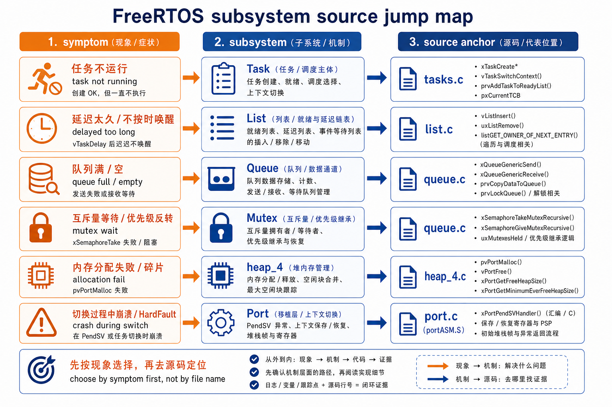

这张源码跳转图不要顺着文件名读。读图时先站在左侧现象里，比如“COMM 被唤醒后仍然慢”；再只沿一条箭头走到 queue、scheduler、mutex 或 PendSV。每走到一个源码入口，都要带着一个很小的证明目标进去，证明完就回到项目日志。

### A.1 先按现象选子系统，不按文件名硬读

第一次打开 FreeRTOS，最容易被宏、配置项和平台分支带散。更稳的方式是从现象进来：LED 到期后没运行，就判断它属于 Delay/Tick、调度还是 PendSV；COMM 被唤醒后仍然慢，就拆成队列唤醒、ready 选择、mutex owner 和现场切换。

可以把每次源码阅读写成一张很小的跳转单。它不要求你读完整个文件，只要求你证明一个动作：

```log
现象：LED target=20 ready=20 toggle=27
怀疑：Delay 到期了，但 LED 没有立刻 running
第一跳：tasks.c:xTaskIncrementTick
第二跳：tasks.c:vTaskSwitchContext / port.c:xPortPendSVHandler
证明目标：到期回 ready 是否发生，调度是否选中，PendSV 是否切入
回填字段：ready_tick=20, run_tick=27, current_task=COMM
```

这张跳转单会把“读源码”压成一个小动作：先证明 ready，再证明 selected，最后证明 switched。证明完一段就停下来，把证据写回项目日志或任务表。这样附录里的链接不会变成目录，而会变成一次次可完成的排查步骤。

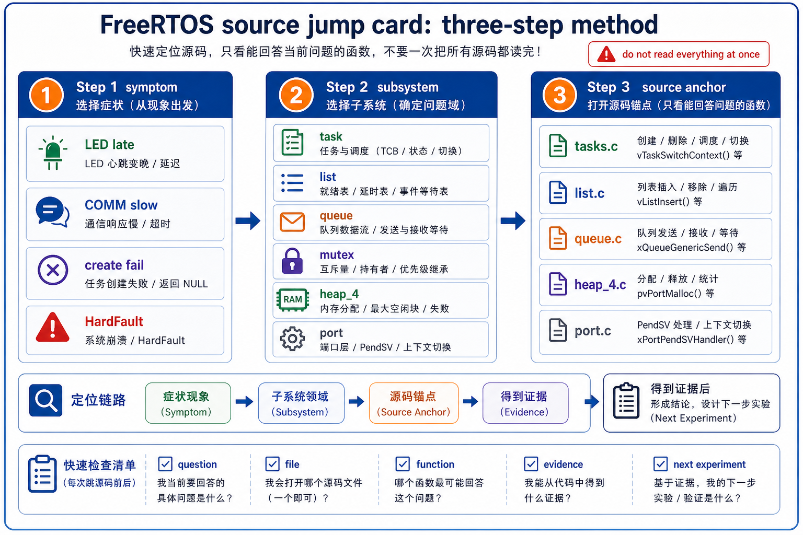

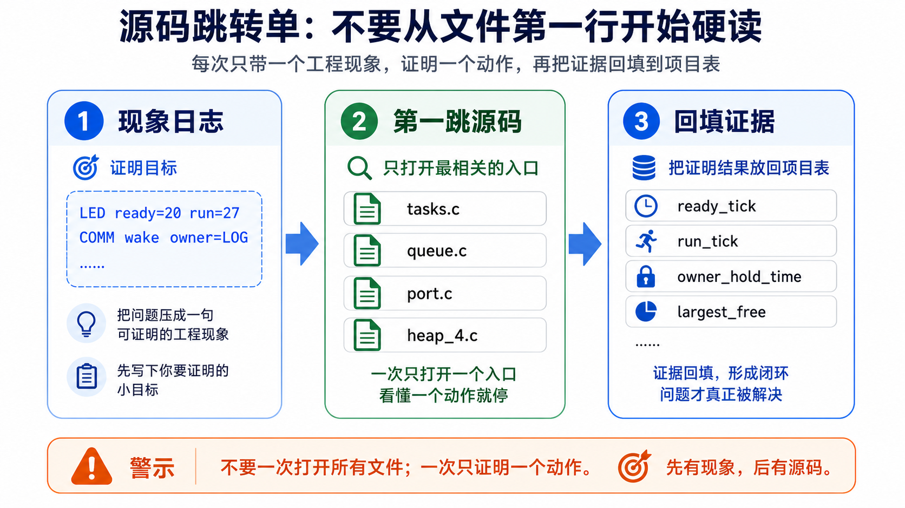

读这张三步图时，先看左侧现象日志，把问题压成一句证明目标；再看中间源码第一跳，只进入一个最相关的函数；最后看右侧回填字段，把证明结果放回任务表、队列表或锁表。它的价值不是让源码入口更多，而是让每次源码阅读都能收束。

| 工程现象 | 优先进入的子系统 | 先证明什么 |
| --- | --- | --- |
| 任务创建成功但入口没日志 | 任务对象与创建路径 | 任务是否完成 TCB/stack 初始化并进入 ready |
| 任务没有输出但系统还活着 | 内核列表与调度 | 任务在 ready、delayed 还是 event wait |
| Delay 到期后仍然晚 | Delay/Tick + 调度 | 到期回 ready 和真正 running 是否被混在一起 |
| COMM 收到事件后响应慢 | Queue + Scheduler + Mutex | 数据到达、任务唤醒、资源 owner 分别卡在哪 |
| 高优先级任务等低优先级任务 | Mutex/优先级继承 | owner 是谁，继承是否发生，持锁区多长 |
| 切换后 HardFault | Port/PendSV + TCB/Stack | PSP、TCB 栈顶、任务栈范围是否一致 |
| 动态创建偶发失败 | heap_4 | 总剩余、历史最小、最大连续块分别说明什么 |
| 软件定时器回调没来 | Timer service | Timer command queue、daemon task 是否运行 |
| EventGroup 等不到事件 | Event groups | bit 是否被设置、等待任务是否被唤醒 |
| StreamBuffer 收发异常 | Stream/message buffer | 数据流、触发级别、等待任务是否匹配 |

附录入口的第一件事，是先选“问题所在的机制层”。同一个现象可能跨多个子系统，但第一跳不能太贪。先证明一段，再接下一段。比如 COMM 慢，先证明队列是否唤醒，再证明调度是否选择，再证明 mutex 是否挡住，再证明 PendSV 是否切过去。这样读源码就像沿着证据链走，而不是在文件里迷路。

### A.2 任务对象子系统：从函数到 TCB、stack、handle

如果现象是“创建成功但任务入口没跑”，附录第一跳不要直接扑进调度器。先确认 FreeRTOS 是否真的把一个 C 函数变成了可调度对象。你在应用层看到的是 `xTaskCreateStatic()` 或 `xTaskCreate()`，内核真正要准备的是 TCB、任务栈、初始现场、优先级和列表节点。创建成功只说明对象材料准备完，并不说明任务已经 running。

| 阅读目标 | 第一跳源码 | 第二跳源码 | 先证明什么 |
| --- | --- | --- | --- |
| TCB 是什么 | [tasks.c:TCB_t](F:/DevelopSrc/embedded_system_learning/reference/rtos_src/FreeRTOS-Kernel/tasks.c:375) | [include/task.h:TaskHandle_t](F:/DevelopSrc/embedded_system_learning/reference/rtos_src/FreeRTOS-Kernel/include/task.h:95) | 任务身份、栈顶、优先级、列表节点怎样集中在一个对象里 |
| 静态创建入口 | [tasks.c:xTaskCreateStatic](F:/DevelopSrc/embedded_system_learning/reference/rtos_src/FreeRTOS-Kernel/tasks.c:1332) | [include/task.h:xTaskCreateStatic](F:/DevelopSrc/embedded_system_learning/reference/rtos_src/FreeRTOS-Kernel/include/task.h:265) | 应用传入的入口、参数、栈、TCB 怎样进入创建路径 |
| 动态创建入口 | [tasks.c:xTaskCreate](F:/DevelopSrc/embedded_system_learning/reference/rtos_src/FreeRTOS-Kernel/tasks.c:1741) | [portable/MemMang/heap_4.c:pvPortMalloc](F:/DevelopSrc/embedded_system_learning/reference/rtos_src/FreeRTOS-Kernel/portable/MemMang/heap_4.c:173) | 动态任务为什么会依赖 heap 材料 |
| 初始化新任务 | [tasks.c:prvInitialiseNewTask](F:/DevelopSrc/embedded_system_learning/reference/rtos_src/FreeRTOS-Kernel/tasks.c:1816) | [portable/GCC/ARM_CM4F/port.c:pxPortInitialiseStack](F:/DevelopSrc/embedded_system_learning/reference/rtos_src/FreeRTOS-Kernel/portable/GCC/ARM_CM4F/port.c:202) | 任务名、栈顶、优先级、入口参数怎样被放好 |
| 加入 ready | [tasks.c:prvAddNewTaskToReadyList](F:/DevelopSrc/embedded_system_learning/reference/rtos_src/FreeRTOS-Kernel/tasks.c:2052) | [tasks.c:prvAddTaskToReadyList](F:/DevelopSrc/embedded_system_learning/reference/rtos_src/FreeRTOS-Kernel/tasks.c:278) | 创建完成为什么只是获得运行资格 |

这组源码只沿着一条主线走：材料进入，TCB 初始化，栈帧初始化，进入 ready。任务通知、运行统计、MPU wrapper 这些分支当然重要，但它们不是第一次解释“函数怎样变成任务对象”的关键。能把这四步说清楚，任务对象子系统就已经站起来了。

项目里最常见的误判，是 `xTaskCreateStatic()` 返回成功后没有看到入口日志，就说“任务创建失败”。源码跳转会提醒你：创建、ready、running 是三段。创建路径证明对象存在，ready list 证明它有资格，调度和 PendSV 才证明 CPU 真正进入任务入口。

### A.3 列表子系统：ready、delayed、event wait 的共同底座

任务没输出时，先别把问题说成“卡住了”，先问它在哪个位置。FreeRTOS 里很多状态不是靠一个简单枚举撑起来的，而是靠列表节点挂到不同容器里表达。ready list、delayed list、event list 背后都离不开 `List_t` 和 `ListItem_t`。位置先清楚，排查范围会小很多。

| 阅读目标 | 第一跳源码 | 第二跳源码 | 先证明什么 |
| --- | --- | --- | --- |
| 列表项结构 | [include/list.h:ListItem_t](F:/DevelopSrc/embedded_system_learning/reference/rtos_src/FreeRTOS-Kernel/include/list.h:144) | [include/list.h:MiniListItem_t](F:/DevelopSrc/embedded_system_learning/reference/rtos_src/FreeRTOS-Kernel/include/list.h:129) | 任务怎样通过节点挂到列表里 |
| 列表结构 | [include/list.h:List_t](F:/DevelopSrc/embedded_system_learning/reference/rtos_src/FreeRTOS-Kernel/include/list.h:172) | [list.c:vListInitialise](F:/DevelopSrc/embedded_system_learning/reference/rtos_src/FreeRTOS-Kernel/list.c:49) | 空列表怎样初始化，列表头怎样组织节点 |
| 有序插入 | [list.c:vListInsert](F:/DevelopSrc/embedded_system_learning/reference/rtos_src/FreeRTOS-Kernel/list.c:139) | [list.c:vListInsertEnd](F:/DevelopSrc/embedded_system_learning/reference/rtos_src/FreeRTOS-Kernel/list.c:101) | 任务怎样进入等待位置或 ready 位置 |
| 移除节点 | [list.c:uxListRemove](F:/DevelopSrc/embedded_system_learning/reference/rtos_src/FreeRTOS-Kernel/list.c:217) | [include/list.h:listGET_OWNER_OF_HEAD_ENTRY](F:/DevelopSrc/embedded_system_learning/reference/rtos_src/FreeRTOS-Kernel/include/list.h:266) | 任务怎样离开列表，并回到拥有者对象 |

列表源码的教学价值不在链表算法本身，而在“位置可见”。Delay 把任务放进 delayed list，队列把等待者放进 event list，调度器从 ready list 里找候选任务。链表函数普通，但它们被用来表达内核状态，这才是关键。

如果任务“卡住了”，先别急着追业务函数。打开列表相关路径时只问：这个任务节点现在挂在哪里，谁应该把它移走，移走后应该去哪里。这个问题比“为什么不运行”更具体。

### A.4 调度子系统：ready 集合怎样变成当前任务

看到多个任务都 ready 时，问题才轮到调度器：谁该运行。它只在 ready 集合里做选择，不负责把 blocked 任务变 ready，也不负责保存和恢复 CPU 现场。把调度和 PendSV 分开，是理解 FreeRTOS 的关键边界。

| 阅读目标 | 第一跳源码 | 第二跳源码 | 先证明什么 |
| --- | --- | --- | --- |
| 当前任务指针 | [tasks.c:pxCurrentTCB](F:/DevelopSrc/embedded_system_learning/reference/rtos_src/FreeRTOS-Kernel/tasks.c:452) | [tasks.c:TCB_t](F:/DevelopSrc/embedded_system_learning/reference/rtos_src/FreeRTOS-Kernel/tasks.c:375) | 当前任务本质上是当前 TCB 指针 |
| ready 优先级选择 | [tasks.c:taskSELECT_HIGHEST_PRIORITY_TASK](F:/DevelopSrc/embedded_system_learning/reference/rtos_src/FreeRTOS-Kernel/tasks.c:289) | [tasks.c:uxTopReadyPriority](F:/DevelopSrc/embedded_system_learning/reference/rtos_src/FreeRTOS-Kernel/tasks.c:499) | 最高 ready 优先级怎样被选中 |
| 切换上下文入口 | [tasks.c:vTaskSwitchContext](F:/DevelopSrc/embedded_system_learning/reference/rtos_src/FreeRTOS-Kernel/tasks.c:5120) | [tasks.c:prvYieldForTask](F:/DevelopSrc/embedded_system_learning/reference/rtos_src/FreeRTOS-Kernel/tasks.c:5331) | 调度器怎样更新当前任务选择 |
| 主动让出 | [tasks.c:taskYIELD](F:/DevelopSrc/embedded_system_learning/reference/rtos_src/FreeRTOS-Kernel/include/task.h:355) | [portable/GCC/ARM_CM4F/portmacro.h:portYIELD](F:/DevelopSrc/embedded_system_learning/reference/rtos_src/FreeRTOS-Kernel/portable/GCC/ARM_CM4F/portmacro.h:99) | 任务让出如何触发一次调度机会 |

调度源码的问题可以压到一个：ready 集合里谁被选成当前任务。队列唤醒、Delay 到期、PendSV 保存现场都是前后相邻的机制，但不是同一件事。

项目里看到 `COMM wake`，只能说明 COMM 可能重新进入 ready；看到 `switch_to=COMM`，只能说明调度选择指向 COMM；只有再看到 PendSV 或 current task 证据，才能说 CPU 真的切到了 COMM。这个边界能避免大量误判。

### A.5 Tick/Delay 子系统：时间等待怎样变成列表位置

如果 LED 在等时间，CPU 不该陪它空转。Delay/Tick 子系统要回答的就是：等时间时，任务去了哪里，CPU 又被让给了谁。任务调用 Delay 后，不是在 CPU 上空转，而是离开 ready，进入时间等待位置。Tick 推进系统时间，到期任务回到 ready。回到 ready 以后，还要经过调度和 PendSV，才能真正 running。

| 阅读目标 | 第一跳源码 | 第二跳源码 | 先证明什么 |
| --- | --- | --- | --- |
| Delay API | [tasks.c:vTaskDelay](F:/DevelopSrc/embedded_system_learning/reference/rtos_src/FreeRTOS-Kernel/tasks.c:2469) | [tasks.c:prvAddCurrentTaskToDelayedList](F:/DevelopSrc/embedded_system_learning/reference/rtos_src/FreeRTOS-Kernel/tasks.c:8580) | 当前任务怎样离开 ready，进入 delayed list |
| 固定周期等待 | [tasks.c:xTaskDelayUntil](F:/DevelopSrc/embedded_system_learning/reference/rtos_src/FreeRTOS-Kernel/tasks.c:2393) | [include/task.h:vTaskDelayUntil](F:/DevelopSrc/embedded_system_learning/reference/rtos_src/FreeRTOS-Kernel/include/task.h:923) | 周期基准怎样避免被处理耗时拖走 |
| Tick 推进 | [tasks.c:xTaskIncrementTick](F:/DevelopSrc/embedded_system_learning/reference/rtos_src/FreeRTOS-Kernel/tasks.c:4736) | [portable/GCC/ARM_CM4F/port.c:xPortSysTickHandler](F:/DevelopSrc/embedded_system_learning/reference/rtos_src/FreeRTOS-Kernel/portable/GCC/ARM_CM4F/port.c:560) | 到期任务怎样回 ready，是否请求切换 |
| Tick 溢出列表 | [tasks.c:pxDelayedTaskList](F:/DevelopSrc/embedded_system_learning/reference/rtos_src/FreeRTOS-Kernel/tasks.c:479) | [tasks.c:pxOverflowDelayedTaskList](F:/DevelopSrc/embedded_system_learning/reference/rtos_src/FreeRTOS-Kernel/tasks.c:480) | 长时间 tick 计数为什么需要两套 delayed list |

带一条日志进这组源码会更稳：`LED delay_enter=0 target=20 ready=20 run=27`。`vTaskDelay()` 解释进入等待，`xTaskIncrementTick()` 解释回 ready，调度和 PendSV 解释为什么 run 到 27。这样就不会把所有心跳晚都归到 Delay。

### A.6 Port/PendSV 子系统：选择结果怎样落到 CPU 现场

看到 `switch_to=COMM` 以后，还不能马上说 CPU 已经进入 COMM。Port/PendSV 子系统回答“CPU 是否真的切过去”。调度器选中任务只是逻辑结果，PendSV 负责保存旧任务现场、切换当前 TCB、恢复新任务现场。这一组路径和具体 Cortex-M 端口强相关，所以以 `portable/GCC/ARM_CM4F/port.c` 为源码锚点。

| 阅读目标 | 第一跳源码 | 第二跳源码 | 先证明什么 |
| --- | --- | --- | --- |
| 初始栈帧 | [port.c:pxPortInitialiseStack](F:/DevelopSrc/embedded_system_learning/reference/rtos_src/FreeRTOS-Kernel/portable/GCC/ARM_CM4F/port.c:202) | [tasks.c:prvInitialiseNewTask](F:/DevelopSrc/embedded_system_learning/reference/rtos_src/FreeRTOS-Kernel/tasks.c:1816) | 第一次运行前入口、参数、栈顶怎样准备 |
| 启动调度器 | [tasks.c:vTaskStartScheduler](F:/DevelopSrc/embedded_system_learning/reference/rtos_src/FreeRTOS-Kernel/tasks.c:3700) | [port.c:xPortStartScheduler](F:/DevelopSrc/embedded_system_learning/reference/rtos_src/FreeRTOS-Kernel/portable/GCC/ARM_CM4F/port.c:305) | main 怎样交出控制权 |
| SVC 第一次进入任务 | [port.c:vPortSVCHandler](F:/DevelopSrc/embedded_system_learning/reference/rtos_src/FreeRTOS-Kernel/portable/GCC/ARM_CM4F/port.c:260) | [port.c:prvPortStartFirstTask](F:/DevelopSrc/embedded_system_learning/reference/rtos_src/FreeRTOS-Kernel/portable/GCC/ARM_CM4F/port.c:278) | 第一个任务现场怎样恢复 |
| PendSV 切换 | [port.c:xPortPendSVHandler](F:/DevelopSrc/embedded_system_learning/reference/rtos_src/FreeRTOS-Kernel/portable/GCC/ARM_CM4F/port.c:504) | [tasks.c:vTaskSwitchContext](F:/DevelopSrc/embedded_system_learning/reference/rtos_src/FreeRTOS-Kernel/tasks.c:5120) | 保存旧 PSP、更新选择、恢复新 PSP |
| 临界区与中断屏蔽 | [portmacro.h:portDISABLE_INTERRUPTS](F:/DevelopSrc/embedded_system_learning/reference/rtos_src/FreeRTOS-Kernel/portable/GCC/ARM_CM4F/portmacro.h:119) | [port.c:vPortEnterCritical](F:/DevelopSrc/embedded_system_learning/reference/rtos_src/FreeRTOS-Kernel/portable/GCC/ARM_CM4F/port.c:446) | 为什么内核改共享结构时要保护临界区 |

PendSV 后 HardFault，不一定是 PendSV 错。它可能只是恢复了被更早破坏的现场。排查时要记录 current task、next task、old PSP、new PSP、任务栈范围和 TCB 栈顶字段。HardFault 停在哪里是暴露点，不一定是最早的破坏点。

### A.7 Queue/Semaphore/Mutex 子系统：数据线和任务线怎样交叉

COMM 被唤醒后仍然慢，常常会把人同时带到队列和锁。`queue.c` 是 FreeRTOS 协作对象的大本营，队列、信号量、mutex 都在这里有路径。队列主要表达数据缓冲和等待关系；mutex 额外表达 owner，并牵出优先级继承。进入这一组路径时，要一直分清数据线和任务线。

| 阅读目标 | 第一跳源码 | 第二跳源码 | 先证明什么 |
| --- | --- | --- | --- |
| 队列结构 | [queue.c:Queue_t](F:/DevelopSrc/embedded_system_learning/reference/rtos_src/FreeRTOS-Kernel/queue.c:98) | [include/queue.h:QueueHandle_t](F:/DevelopSrc/embedded_system_learning/reference/rtos_src/FreeRTOS-Kernel/include/queue.h:50) | 队列对象怎样同时记录 buffer 和等待列表 |
| 队列发送 | [queue.c:xQueueGenericSend](F:/DevelopSrc/embedded_system_learning/reference/rtos_src/FreeRTOS-Kernel/queue.c:949) | [queue.c:prvCopyDataToQueue](F:/DevelopSrc/embedded_system_learning/reference/rtos_src/FreeRTOS-Kernel/queue.c:2393) | 有空间时数据怎样进入，等待者是否被唤醒 |
| 队列接收 | [queue.c:xQueueReceive](F:/DevelopSrc/embedded_system_learning/reference/rtos_src/FreeRTOS-Kernel/queue.c:1509) | [queue.c:prvCopyDataFromQueue](F:/DevelopSrc/embedded_system_learning/reference/rtos_src/FreeRTOS-Kernel/queue.c:2476) | 有数据时怎样取出，空间等待者是否被唤醒 |
| ISR 发送 | [queue.c:xQueueGenericSendFromISR](F:/DevelopSrc/embedded_system_learning/reference/rtos_src/FreeRTOS-Kernel/queue.c:1204) | [portable/GCC/ARM_CM4F/portmacro.h:portYIELD_FROM_ISR](F:/DevelopSrc/embedded_system_learning/reference/rtos_src/FreeRTOS-Kernel/portable/GCC/ARM_CM4F/portmacro.h:97) | 中断里发送为什么可能请求切换 |
| mutex 创建 | [queue.c:xQueueCreateMutex](F:/DevelopSrc/embedded_system_learning/reference/rtos_src/FreeRTOS-Kernel/queue.c:647) | [queue.c:prvInitialiseMutex](F:/DevelopSrc/embedded_system_learning/reference/rtos_src/FreeRTOS-Kernel/queue.c:617) | mutex 为什么复用 queue，又额外有 owner 语义 |
| mutex take | [queue.c:xQueueSemaphoreTake](F:/DevelopSrc/embedded_system_learning/reference/rtos_src/FreeRTOS-Kernel/queue.c:1795) | [tasks.c:xTaskPriorityInherit](F:/DevelopSrc/embedded_system_learning/reference/rtos_src/FreeRTOS-Kernel/tasks.c:6650) | 高优先级等待低优先级 owner 时怎样继承 |
| mutex give | [queue.c:xQueueGiveMutexRecursive](F:/DevelopSrc/embedded_system_learning/reference/rtos_src/FreeRTOS-Kernel/queue.c:731) | [tasks.c:xTaskPriorityDisinherit](F:/DevelopSrc/embedded_system_learning/reference/rtos_src/FreeRTOS-Kernel/tasks.c:6753) | owner 释放后等待者和优先级怎样恢复 |

queue 子系统里的 `count` 只解释数据水位，不能解释任务为什么睡下去或醒过来。mutex 也不能被压成单纯调度问题：高优先级任务等低优先级 owner，不是调度器忘了高优先级，而是资源所有权还没释放。

### A.8 Heap 子系统：对象材料怎样落到 RAM

如果一个对象创建失败，第一问不是“API 名字是不是错了”，而是“材料从哪里来”。heap 子系统回答“对象从哪里来”。任务栈、TCB、队列存储区、mutex 控制块、软件定时器对象都要占 RAM。静态创建时材料来自应用；动态创建时材料来自 FreeRTOS heap。`heap_4.c` 的关键不是“还剩多少”，而是“有没有足够大的连续块”。

| 阅读目标 | 第一跳源码 | 第二跳源码 | 先证明什么 |
| --- | --- | --- | --- |
| 分配入口 | [heap_4.c:pvPortMalloc](F:/DevelopSrc/embedded_system_learning/reference/rtos_src/FreeRTOS-Kernel/portable/MemMang/heap_4.c:173) | [include/portable.h:pvPortMalloc](F:/DevelopSrc/embedded_system_learning/reference/rtos_src/FreeRTOS-Kernel/include/portable.h:173) | 申请怎样从 free list 找到可用块 |
| 释放入口 | [heap_4.c:vPortFree](F:/DevelopSrc/embedded_system_learning/reference/rtos_src/FreeRTOS-Kernel/portable/MemMang/heap_4.c:354) | [heap_4.c:prvInsertBlockIntoFreeList](F:/DevelopSrc/embedded_system_learning/reference/rtos_src/FreeRTOS-Kernel/portable/MemMang/heap_4.c:504) | 释放块怎样插回并尝试合并 |
| heap 统计 | [heap_4.c:xPortGetFreeHeapSize](F:/DevelopSrc/embedded_system_learning/reference/rtos_src/FreeRTOS-Kernel/portable/MemMang/heap_4.c:413) | [heap_4.c:xPortGetMinimumEverFreeHeapSize](F:/DevelopSrc/embedded_system_learning/reference/rtos_src/FreeRTOS-Kernel/portable/MemMang/heap_4.c:419) | 当前剩余和历史最小分别说明什么 |
| 失败 Hook | [heap_4.c:vApplicationMallocFailedHook](F:/DevelopSrc/embedded_system_learning/reference/rtos_src/FreeRTOS-Kernel/portable/MemMang/heap_4.c:288) | [include/FreeRTOS.h:configUSE_MALLOC_FAILED_HOOK](F:/DevelopSrc/embedded_system_learning/reference/rtos_src/FreeRTOS-Kernel/include/FreeRTOS.h:2799) | 分配失败怎样暴露给应用 |
| heap 初始化 | [heap_4.c:prvHeapInit](F:/DevelopSrc/embedded_system_learning/reference/rtos_src/FreeRTOS-Kernel/portable/MemMang/heap_4.c:455) | [heap_4.c:ucHeap](F:/DevelopSrc/embedded_system_learning/reference/rtos_src/FreeRTOS-Kernel/portable/MemMang/heap_4.c:91) | heap 区域怎样变成初始 free list |

如果项目里 `total_free` 还有不少，但申请仍失败，就沿着 `pvPortMalloc()` 看最大连续块。heap_4 能合并相邻空闲块，不能跨过仍在使用的对象。对象生命周期越乱，free list 越可能被切碎。

### A.9 Timer/EventGroup/StreamBuffer 子系统：核心机制之外常见的三类扩展入口

核心主线先放在任务、调度、队列、mutex 和 heap，因为它们足够解释大多数“任务为什么没按预期运行”的问题。不过实际项目里很快会遇到软件定时器、事件组、stream/message buffer。它们不是这里的主线，但源码跳转可以先把入口留出来，后续项目排查时能直接接上。

| 子系统 | 第一跳源码 | 第二跳源码 | 适合解决什么问题 |
| --- | --- | --- | --- |
| 软件定时器对象 | [timers.c:Timer_t](F:/DevelopSrc/embedded_system_learning/reference/rtos_src/FreeRTOS-Kernel/timers.c:82) | [include/timers.h:TimerHandle_t](F:/DevelopSrc/embedded_system_learning/reference/rtos_src/FreeRTOS-Kernel/include/timers.h:79) | 回调为什么由 timer service task 执行 |
| 创建软件定时器 | [timers.c:xTimerCreate](F:/DevelopSrc/embedded_system_learning/reference/rtos_src/FreeRTOS-Kernel/timers.c:336) | [timers.c:xTimerGenericCommand](F:/DevelopSrc/embedded_system_learning/reference/rtos_src/FreeRTOS-Kernel/timers.c:448) | 创建、启动、停止为什么走 command queue |
| Timer daemon task | [timers.c:prvTimerTask](F:/DevelopSrc/embedded_system_learning/reference/rtos_src/FreeRTOS-Kernel/timers.c:765) | [timers.c:prvProcessReceivedCommands](F:/DevelopSrc/embedded_system_learning/reference/rtos_src/FreeRTOS-Kernel/timers.c:839) | 定时器命令和到期回调怎样被处理 |
| EventGroup 等待 | [event_groups.c:xEventGroupWaitBits](F:/DevelopSrc/embedded_system_learning/reference/rtos_src/FreeRTOS-Kernel/event_groups.c:332) | [event_groups.c:xEventGroupSetBits](F:/DevelopSrc/embedded_system_learning/reference/rtos_src/FreeRTOS-Kernel/event_groups.c:544) | 多条件等待和 bit 唤醒怎样工作 |
| EventGroup ISR 设置 | [event_groups.c:xEventGroupSetBitsFromISR](F:/DevelopSrc/embedded_system_learning/reference/rtos_src/FreeRTOS-Kernel/event_groups.c:815) | [timers.c:xTimerPendFunctionCallFromISR](F:/DevelopSrc/embedded_system_learning/reference/rtos_src/FreeRTOS-Kernel/timers.c:1191) | 为什么 ISR 设置 event bits 可能走 deferred call |
| StreamBuffer 创建 | [stream_buffer.c:xStreamBufferGenericCreate](F:/DevelopSrc/embedded_system_learning/reference/rtos_src/FreeRTOS-Kernel/stream_buffer.c:382) | [include/stream_buffer.h:StreamBufferHandle_t](F:/DevelopSrc/embedded_system_learning/reference/rtos_src/FreeRTOS-Kernel/include/stream_buffer.h:90) | 字节流缓冲和队列的差异 |
| StreamBuffer 发送/接收 | [stream_buffer.c:xStreamBufferSend](F:/DevelopSrc/embedded_system_learning/reference/rtos_src/FreeRTOS-Kernel/stream_buffer.c:764) | [stream_buffer.c:xStreamBufferReceive](F:/DevelopSrc/embedded_system_learning/reference/rtos_src/FreeRTOS-Kernel/stream_buffer.c:1056) | 流式数据怎样触发等待者 |

这三类子系统要和核心机制连接起来看。软件定时器依赖 timer service task 和 command queue；事件组仍然会让任务等待和唤醒；stream buffer 仍然有数据线和任务线。换句话说，读法仍然一样：先找到参与的任务或内核对象，再看它等待在哪里，最后确认是哪条路径让它被唤醒、被切换或继续阻塞。

### A.10 配置与移植层：读源码前必须知道哪些开关会改变路径

有时你照着教程打开同一个函数，却发现自己的项目走了另一条分支。原因不一定是源码版本不同，也可能是 `FreeRTOSConfig.h`、端口宏或调度状态改变了路径。配置和移植层最容易制造这种“别人那里这样，我这里那样”的阅读挫败。

读源码时如果完全忽略配置，会觉得路径很乱；如果一上来就背所有配置，又会被淹没。更好的做法，是先知道哪些配置会改变当前关心的机制。

| 配置/移植入口 | 源码位置 | 会影响什么 | 第一轮怎么看 |
| --- | --- | --- | --- |
| `FreeRTOSConfig.h` 模板 | [examples/template_configuration/FreeRTOSConfig.h](F:/DevelopSrc/embedded_system_learning/reference/rtos_src/FreeRTOS-Kernel/examples/template_configuration/FreeRTOSConfig.h:1) | 调度、hook、timer、mutex、heap 等开关 | 先找和当前问题相关的宏 |
| 内核配置检查 | [include/FreeRTOS.h](F:/DevelopSrc/embedded_system_learning/reference/rtos_src/FreeRTOS-Kernel/include/FreeRTOS.h:1) | 默认值、配置约束、宏展开 | 只看当前问题相关配置 |
| 端口宏 | [portable/GCC/ARM_CM4F/portmacro.h](F:/DevelopSrc/embedded_system_learning/reference/rtos_src/FreeRTOS-Kernel/portable/GCC/ARM_CM4F/portmacro.h:1) | 临界区、yield、BASEPRI、栈类型 | 读 PendSV 和中断 API 前先看 |
| 调度器挂起/恢复 | [tasks.c:vTaskSuspendAll](F:/DevelopSrc/embedded_system_learning/reference/rtos_src/FreeRTOS-Kernel/tasks.c:3837) / [tasks.c:xTaskResumeAll](F:/DevelopSrc/embedded_system_learning/reference/rtos_src/FreeRTOS-Kernel/tasks.c:3937) | 列表修改和延迟调度 | 排查“该切换但没切换”时再看 |
| Idle task | [tasks.c:prvIdleTask](F:/DevelopSrc/embedded_system_learning/reference/rtos_src/FreeRTOS-Kernel/tasks.c:5817) | 空闲任务、删除清理、低功耗入口 | 系统空闲和任务删除问题再看 |
| Tickless idle | [tasks.c:prvGetExpectedIdleTime](F:/DevelopSrc/embedded_system_learning/reference/rtos_src/FreeRTOS-Kernel/tasks.c:5913) | 低功耗下 Tick 行为 | 时间异常且启用 tickless 时再看 |

配置项最容易造成“同一段源码在别人项目里走这边，在我项目里走那边”。所以正文讲机制时用主路径，项目落地时再带着配置回来看。要抓住一个原则：配置改变边界，不改变主线。任务仍然是对象，等待仍然落到位置，调度仍然选 ready，PendSV 仍然恢复现场。

### A.11 子系统跳转的推荐阅读顺序

给自己留一条稳定的源码路线时，不必从文件树第一项开始。先看任务材料，再看列表位置、调度选择、现场切换、协作对象和内存成本，最后再看扩展子系统和配置。这个顺序服务的是排查过程：任务是否存在，任务在哪里，谁把它挡住或切走。

真到调试桌边，不要一口气把十行都打开。第一轮只走前五行，把“任务怎样存在、排队、被选中、被切换”讲顺；第二轮再看 Delay、queue、mutex 和 heap，把等待、协作、资源和 RAM 成本接上。扩展对象放到最后，是为了避免 timer、event group、stream buffer 抢走核心主线。

| 顺序 | 子系统 | 先打开 | 读完能回答 |
| --- | --- | --- | --- |
| 1 | 任务对象 | [tasks.c:TCB_t](F:/DevelopSrc/embedded_system_learning/reference/rtos_src/FreeRTOS-Kernel/tasks.c:375) | 任务为什么不是普通函数 |
| 2 | 任务创建 | [tasks.c:xTaskCreateStatic](F:/DevelopSrc/embedded_system_learning/reference/rtos_src/FreeRTOS-Kernel/tasks.c:1332) | 任务材料怎样变成对象 |
| 3 | 列表位置 | [list.c:vListInsert](F:/DevelopSrc/embedded_system_learning/reference/rtos_src/FreeRTOS-Kernel/list.c:139) | ready/delayed/event wait 怎样表达位置 |
| 4 | 调度选择 | [tasks.c:vTaskSwitchContext](F:/DevelopSrc/embedded_system_learning/reference/rtos_src/FreeRTOS-Kernel/tasks.c:5120) | ready 集合怎样选出当前任务 |
| 5 | 启动与切换 | [port.c:xPortPendSVHandler](F:/DevelopSrc/embedded_system_learning/reference/rtos_src/FreeRTOS-Kernel/portable/GCC/ARM_CM4F/port.c:504) | 选择结果怎样落到 CPU 现场 |
| 6 | 时间等待 | [tasks.c:vTaskDelay](F:/DevelopSrc/embedded_system_learning/reference/rtos_src/FreeRTOS-Kernel/tasks.c:2469) | 等待时间时任务去了哪里 |
| 7 | 队列协作 | [queue.c:xQueueGenericSend](F:/DevelopSrc/embedded_system_learning/reference/rtos_src/FreeRTOS-Kernel/queue.c:949) | 数据和等待者怎样同时变化 |
| 8 | 互斥锁 | [queue.c:xQueueSemaphoreTake](F:/DevelopSrc/embedded_system_learning/reference/rtos_src/FreeRTOS-Kernel/queue.c:1795) | owner 和优先级继承怎样影响调度 |
| 9 | 动态内存 | [heap_4.c:pvPortMalloc](F:/DevelopSrc/embedded_system_learning/reference/rtos_src/FreeRTOS-Kernel/portable/MemMang/heap_4.c:173) | 对象成本怎样落到 RAM |
| 10 | 扩展对象 | [timers.c:prvTimerTask](F:/DevelopSrc/embedded_system_learning/reference/rtos_src/FreeRTOS-Kernel/timers.c:765) | 软件定时器等扩展机制怎样接入任务世界 |

每走完一个子系统，都试着用一句话把它带回现场。列表回答“任务在哪里”，调度回答“ready 里谁被选中”，queue 回答“数据水位和等待关系怎样一起变”。能说清这句话，源码就已经变成理解；说不清，就回 demo 看输出，让模型重新站稳。

### A.12 速查：子系统、典型现象和源码第一跳

真正排查时，旁边放一份第一跳入口就够了。它只负责把你带到正确文件，不替代前面的解释。打开第一跳以后，仍然按同一条顺序读：对象是否存在，等待位置和资源 owner 是否清楚，项目日志里的现象是否已经被解释。

用它时不要从第一行读到最后一行，而是拿着现象横向扫描。比如“Delay 到期后仍然晚”只需要先进入 Delay/Tick；如果证明任务已经回 ready，再跳 Scheduler；如果选中了仍没运行，再跳 Port/PendSV。这样，这份入口才是导航，不是另一份要背的目录。

| 子系统 | 典型现象 | 第一跳源码 |
| --- | --- | --- |
| Task object | 任务名、优先级、栈顶异常 | [tasks.c:TCB_t](F:/DevelopSrc/embedded_system_learning/reference/rtos_src/FreeRTOS-Kernel/tasks.c:375) |
| Task create | 创建成功但入口没跑 | [tasks.c:xTaskCreateStatic](F:/DevelopSrc/embedded_system_learning/reference/rtos_src/FreeRTOS-Kernel/tasks.c:1332) |
| List | 任务不知道在哪里 | [list.c:vListInsert](F:/DevelopSrc/embedded_system_learning/reference/rtos_src/FreeRTOS-Kernel/list.c:139) |
| Scheduler | ready 后没有运行 | [tasks.c:vTaskSwitchContext](F:/DevelopSrc/embedded_system_learning/reference/rtos_src/FreeRTOS-Kernel/tasks.c:5120) |
| Delay/Tick | Delay 到期后仍然晚 | [tasks.c:xTaskIncrementTick](F:/DevelopSrc/embedded_system_learning/reference/rtos_src/FreeRTOS-Kernel/tasks.c:4736) |
| Port/PendSV | 切换后 HardFault | [port.c:xPortPendSVHandler](F:/DevelopSrc/embedded_system_learning/reference/rtos_src/FreeRTOS-Kernel/portable/GCC/ARM_CM4F/port.c:504) |
| Queue | 队列满、空、唤醒异常 | [queue.c:xQueueGenericSend](F:/DevelopSrc/embedded_system_learning/reference/rtos_src/FreeRTOS-Kernel/queue.c:949) |
| Mutex | 高优先级任务等低优先级 owner | [queue.c:xQueueSemaphoreTake](F:/DevelopSrc/embedded_system_learning/reference/rtos_src/FreeRTOS-Kernel/queue.c:1795) |
| Priority inheritance | owner 优先级临时变化 | [tasks.c:xTaskPriorityInherit](F:/DevelopSrc/embedded_system_learning/reference/rtos_src/FreeRTOS-Kernel/tasks.c:6650) |
| heap_4 | malloc 失败、碎片、总量误判 | [heap_4.c:pvPortMalloc](F:/DevelopSrc/embedded_system_learning/reference/rtos_src/FreeRTOS-Kernel/portable/MemMang/heap_4.c:173) |
| Timer | 软件定时器回调不执行 | [timers.c:prvTimerTask](F:/DevelopSrc/embedded_system_learning/reference/rtos_src/FreeRTOS-Kernel/timers.c:765) |
| EventGroup | 多事件等待不返回 | [event_groups.c:xEventGroupWaitBits](F:/DevelopSrc/embedded_system_learning/reference/rtos_src/FreeRTOS-Kernel/event_groups.c:332) |
| StreamBuffer | 字节流收发卡住 | [stream_buffer.c:xStreamBufferReceive](F:/DevelopSrc/embedded_system_learning/reference/rtos_src/FreeRTOS-Kernel/stream_buffer.c:1056) |

拿 `LED delay target=20 ready=20 run=27` 练一次。第一跳不是 PendSV，也不是直接怀疑中断，而是先到 Delay/Tick，确认 tick 到期有没有把 LED 送回 ready。

如果这一步成立，再横向扫到 Scheduler，确认 ready 集合里谁被选中；如果 Scheduler 也指向 LED，却仍然没有运行，再扫到 Port/PendSV，看现场切换是否真正发生。这样一条日志会自然分成“到期、被选中、切过去”三段。

再拿 `COMM wake by RX_QUEUE, response late` 练一次。第一跳先到 Queue，确认 RX_QUEUE 的发送或接收路径是否唤醒了等待者；如果 COMM 已经回 ready，再到 Scheduler 看它是否被更高优先级任务压住。

如果选择已经指向 COMM，却发现它马上等 UART，就横向扫到 Mutex，确认 owner 是谁、是否发生优先级继承、持锁时间是不是太长。这个顺序能防止把通信慢一口气归成协议慢。

把理解收束到源码入口上，后续才有稳定依据。demo 负责让动作可见，附录负责让真实内核可跳转。进入任务建模时，这些源码入口会变成底层依据：任务怎么拆，要能回到执行流和等待点；优先级怎么定，要能回到 ready 选择和资源 owner；队列容量怎么估，要能回到生产消费窗口；锁边界怎么画，要能回到持锁动作和等待链。
