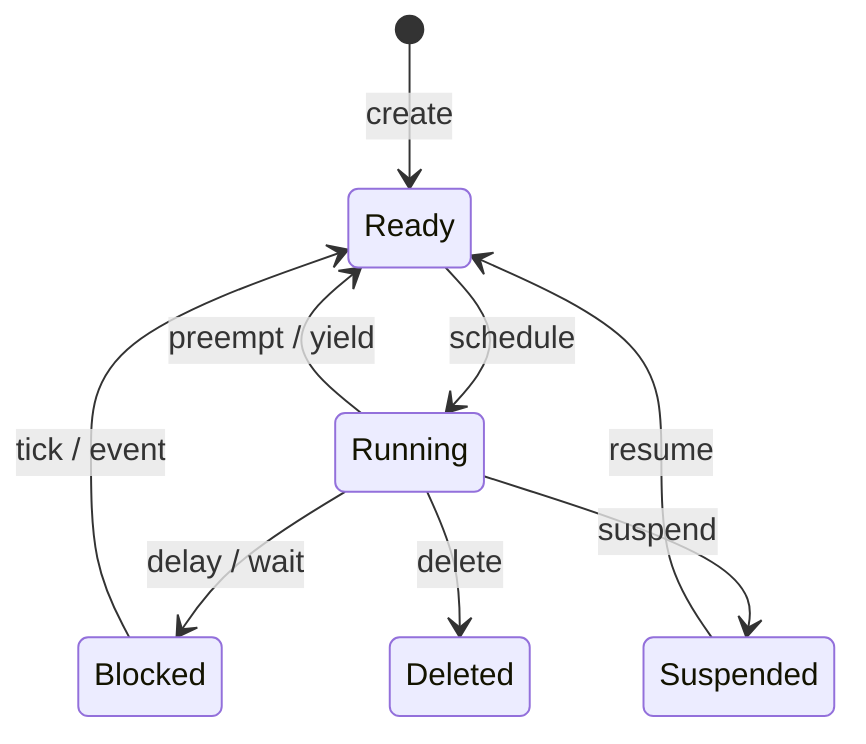

# Chapter 6 手撕 FreeRTOS：底层核心机制

本章重写 FreeRTOS 线的第一半：不从 API 用法开始，而是从裸机前后台系统的问题出发，一路手撕任务、TCB、链表、调度器、上下文切换、阻塞唤醒、队列、互斥锁和堆。

核心目标：

> 读完本章，读者应该能说清楚 FreeRTOS 内核为什么需要这些结构，并能手写一个教学版核心骨架。

本章代码以“概念可读、机制对得上源码”为第一优先级，能跑不是必要条件。

## 0 本章阅读路线

```text
Why FreeRTOS
  -> 任务模型
  -> TCB
  -> 内核链表
  -> 任务创建
  -> 绝对优先级 + round robin
  -> SVC 启动第一个任务
  -> PendSV 上下文切换
  -> Tick / delay / blocked list
  -> queue / semaphore / mutex
  -> heap_4 内存管理
```

| 主题 | FreeRTOS 源码 | 本章代码 |
|------|---------------|----------|
| 任务与调度 | [`tasks.c`](../../reference/rtos_src/FreeRTOS-Kernel/tasks.c) | [`code/`](code/) |
| 内核链表 | [`list.c`](../../reference/rtos_src/FreeRTOS-Kernel/list.c), [`include/list.h`](../../reference/rtos_src/FreeRTOS-Kernel/include/list.h) | [`code/v3_kernel_list/`](code/v3_kernel_list/) |
| 上下文切换 | [`portable/GCC/ARM_CM4F/port.c`](../../reference/rtos_src/FreeRTOS-Kernel/portable/GCC/ARM_CM4F/port.c) | [`code/v6_start_first_task/`](code/v6_start_first_task/), [`code/v7_pendsv_switch/`](code/v7_pendsv_switch/) |
| 队列与同步 | [`queue.c`](../../reference/rtos_src/FreeRTOS-Kernel/queue.c), [`include/semphr.h`](../../reference/rtos_src/FreeRTOS-Kernel/include/semphr.h) | [`code/v9_queue/`](code/v9_queue/), [`code/v10_mutex_inheritance/`](code/v10_mutex_inheritance/) |
| 堆管理 | [`portable/MemMang/heap_4.c`](../../reference/rtos_src/FreeRTOS-Kernel/portable/MemMang/heap_4.c) | [`code/v11_heap4_allocator/`](code/v11_heap4_allocator/) |

## 1 为什么需要 FreeRTOS

### 1.1 从裸机 `while(1)` 到前后台系统

主循环负责业务轮询，中断负责硬件事件。任务少时这种结构清楚；任务多了以后，主循环里的 `if`、flag 和回调会变成隐形调度器。

### 1.2 中断越多，状态越散：前后台系统的高耦合问题

全局 flag、共享状态、中断回调和主循环分支互相牵扯，系统行为开始依赖人脑记忆，而不是清晰的数据结构。

### 1.3 非阻塞轮询为什么会把业务逻辑写碎

非阻塞能避免卡住主循环，但会把连续流程拆成大量状态变量。RTOS 的任务栈让任务能在等待处停住，再从原来的调用栈继续运行。

### 1.4 RTOS 解决的不是“并行”，而是“可管理的并发”

单核 MCU 同一时刻仍然只跑一个上下文。RTOS 的价值是统一管理“谁能运行、谁要等待、谁优先级更高、现场保存在哪里”。

### 1.5 为什么选择 FreeRTOS 做源码主线

FreeRTOS 的核心路径短：`tasks.c` 管任务和调度，`list.c/list.h` 管容器，`port.c` 管 Cortex-M 上下文切换，`queue.c` 管通信和同步。

## 2 FreeRTOS 源码地图

### 2.1 `tasks.c`：任务、状态、调度器

重点读 `TCB_t`、`pxCurrentTCB`、`pxReadyTasksLists`、`xTaskCreateStatic()`、`vTaskStartScheduler()`、`vTaskSwitchContext()`、`vTaskDelay()`、`xTaskIncrementTick()`。

### 2.2 `list.c/list.h`：内核链表

ready list、delayed list、event list 都复用同一套链表抽象。链表节点嵌入 TCB，节点的 `pvOwner` 指回宿主任务。

### 2.3 `queue.c`：队列、信号量、互斥锁的共同底座

队列不只是 FIFO，还维护等待发送和等待接收的任务列表。binary semaphore、counting semaphore、mutex 都复用队列底层模型。

### 2.4 `portable/GCC/ARM_CM4F/port.c`：Cortex-M 上下文切换

重点读 `pxPortInitialiseStack()`、`xPortStartScheduler()`、`prvPortStartFirstTask()`、`vPortSVCHandler()`、`xPortPendSVHandler()`、`xPortSysTickHandler()`。

### 2.5 `heap_4.c`：最常用的堆管理实现

`heap_4.c` 展示空闲链表、块分裂、块合并和碎片控制，是本章动态内存主线。

### 2.6 本章手撕路线：从任务到调度，再到同步和内存

本章按机制递进，不按源码文件从头啃。每一节先提出问题，再看源码，再手撕最小版本。

## 3 任务模型：RTOS 眼里的函数

### 3.1 普通函数为什么不能直接当任务

普通函数只有一条调用栈。任务需要能停住再继续，所以必须有独立栈和保存点。

### 3.2 任务入口函数、参数和无限循环

FreeRTOS 任务入口通常是 `void task(void *argument)`，内部长期循环。任务返回意味着生命周期结束。

### 3.3 任务栈：每个任务为什么必须有自己的栈

任务栈保存函数调用现场、局部变量、异常自动压栈现场和软件保存的寄存器。

### 3.4 任务状态机：Running、Ready、Blocked、Suspended、Deleted



### 3.5 手撕 v1：构造任务入口和独立栈模型

配套目录：[`code/v1_task_stack/`](code/v1_task_stack/)

目标：用 C 数组模拟任务栈，保存任务入口和参数，解释任务为什么不是普通函数调用。

## 4 TCB：任务控制块

### 4.1 TCB 是任务在内核里的身份证

调度器不直接调度函数，而是调度 TCB。TCB 把任务入口、栈、优先级、状态链表节点等信息收束到一个对象里。

### 4.2 FreeRTOS `TCB_t` 关键字段拆解

重点字段：`pxTopOfStack`、`xStateListItem`、`xEventListItem`、`uxPriority`、`pxStack`、`pcTaskName`。

### 4.3 栈顶指针 `pxTopOfStack`

`pxTopOfStack` 是上下文切换和任务对象之间的关键接口。

### 4.4 状态链表节点 `xStateListItem`

用于把任务挂到 ready list、delayed list 或 suspended list。

### 4.5 事件链表节点 `xEventListItem`

任务等待 queue、semaphore、mutex 等事件时，会挂到资源对象的 event list。

### 4.6 优先级、任务名、栈边界和调试字段

这些字段支撑调度、调试、栈检查、trace 和运行时统计。

### 4.7 手撕 v2：最小 TCB

配套目录：[`code/v2_tcb/`](code/v2_tcb/)

目标：定义最小 `TinyTCB`，把入口、参数、栈顶、优先级和任务名组织起来。

## 5 内核链表：调度器的基础容器

### 5.1 FreeRTOS 为什么不用普通数组保存任务

任务会频繁在 ready、blocked、event wait 之间移动。链表适合插入删除，也适合把节点嵌入 TCB。

### 5.2 `List_t`、`ListItem_t`、`MiniListItem_t`

`List_t` 是链表头，`ListItem_t` 是普通节点，`MiniListItem_t` 是尾哨兵。

### 5.3 `owner` 指针和 Chapter5 `container_of` 的关系

FreeRTOS 用 `pvOwner` 保存宿主对象指针。Linux 常用 `container_of` 通过成员地址反推宿主对象。两者目的相同。

### 5.4 ready list、delay list、event list 的共同抽象

所有 list 都是在回答同一个问题：某些任务按照某种规则排队。

### 5.5 手撕 v3：实现最小内核链表

配套目录：[`code/v3_kernel_list/`](code/v3_kernel_list/)

目标：实现 list 初始化、尾插、删除、取 owner，并让 TCB 嵌入 list item。

## 6 任务创建：从 API 到 Ready List

### 6.1 静态创建和动态创建的区别

静态创建由用户提供 TCB 和栈；动态创建由内核通过 heap 分配 TCB 和栈。

### 6.2 `xTaskCreateStatic()` 源码路径

阅读路径：`xTaskCreateStatic()` -> `prvInitialiseNewTask()` -> `prvAddNewTaskToReadyList()`。

### 6.3 `prvInitialiseNewTask()` 初始化了什么

初始化任务函数、参数、栈、优先级、任务名和 list item。

### 6.4 `prvAddNewTaskToReadyList()` 如何把任务交给调度器

任务创建后默认进入 ready list。真正运行它的是调度器，不是创建函数本身。

### 6.5 手撕 v4：静态任务创建

配套目录：[`code/v4_static_task_create/`](code/v4_static_task_create/)

目标：实现 `tiny_task_create_static()`，初始化 TCB 和任务栈，并插入对应优先级 ready list。

## 7 调度原理：绝对优先级 + Round Robin

### 7.1 FreeRTOS 的基本调度策略

FreeRTOS 默认使用固定优先级抢占式调度。高优先级 ready 任务永远优先于低优先级任务。

### 7.2 每个优先级一个 ready list

`pxReadyTasksLists[configMAX_PRIORITIES]` 让调度器按优先级组织候选任务。

### 7.3 最高优先级任务如何被选中

简化模型是从最高优先级向下找第一个非空 ready list；真实源码可用 bitmap 或宏优化。

### 7.4 同优先级任务如何时间片轮转

同优先级任务共享一个 ready list，时间片到期后轮转。

### 7.5 `configUSE_PREEMPTION` 和 `configUSE_TIME_SLICING`

两个配置决定是否抢占、同优先级是否时间片轮转。Chapter7 从工程角度继续讲怎么选。

### 7.6 手撕 v5：优先级 ready list 和轮转调度

配套目录：[`code/v5_priority_scheduler/`](code/v5_priority_scheduler/)

目标：实现多优先级 ready list、最高优先级选择和同优先级 round robin。

## 8 第一次启动任务

### 8.1 创建任务不等于运行任务

创建任务只是在内核数据结构里登记任务。第一次进入任务，需要从裸机主栈切到任务栈。

### 8.2 `vTaskStartScheduler()` 做了什么

通用层创建 idle task、初始化调度状态，然后交给移植层启动调度器。

### 8.3 `xPortStartScheduler()` 配置了什么

Cortex-M 移植层配置 SVC、PendSV、SysTick 优先级，并准备启动第一个任务。

### 8.4 SVC 为什么适合启动第一个任务

SVC 让系统以异常返回的方式进入线程模式任务，和后续 PendSV 恢复任务现场保持一致。

### 8.5 `vPortSVCHandler()` 如何恢复第一个任务现场

它从当前 TCB 的 `pxTopOfStack` 取出伪造好的异常现场，恢复寄存器并异常返回到任务入口。

### 8.6 手撕 v6：启动第一个任务的控制流

配套目录：[`code/v6_start_first_task/`](code/v6_start_first_task/)

目标：用伪代码模拟 SVC 启动路径，明确第一次启动和普通函数调用的区别。

## 9 上下文切换：PendSV 的核心戏

### 9.1 Cortex-M 自动压栈保存了什么

异常入口硬件保存 R0-R3、R12、LR、PC、xPSR。

### 9.2 R4-R11 为什么要软件保存

R4-R11 属于 callee-saved，不由异常入口自动保存，PendSV 必须手动压到当前任务栈。

### 9.3 PSP/MSP、EXC_RETURN 和任务栈

任务运行在线程模式，用 PSP；异常处理通常用 MSP；EXC_RETURN 决定异常返回路径。

### 9.4 `taskYIELD()` 如何触发 PendSV

`taskYIELD()` 不直接切换任务，而是挂起 PendSV。

### 9.5 `xPortPendSVHandler()` 保存旧任务

保存当前 PSP 和 R4-R11，并把新的栈顶写回当前 TCB。

### 9.6 `vTaskSwitchContext()` 选择新任务

调度器只负责更新 `pxCurrentTCB`，不关心寄存器如何保存恢复。

### 9.7 `xPortPendSVHandler()` 恢复新任务

从新 TCB 的 `pxTopOfStack` 取栈顶，恢复 R4-R11，写 PSP，异常返回。

### 9.8 手撕 v7：最小 PendSV 切换模型

配套目录：[`code/v7_pendsv_switch/`](code/v7_pendsv_switch/)

目标：模拟保存旧任务、调度、恢复新任务，并对照 `port.c` 中的真实汇编。

## 10 Tick、Delay 和阻塞态

### 10.1 SysTick 在 FreeRTOS 里的职责

SysTick 推进系统 tick，并决定是否需要触发一次调度。它不直接切任务。

### 10.2 `xTaskIncrementTick()` 的完整角色

增加 tick、检查 delayed list、唤醒到期任务、判断是否需要 PendSV。

### 10.3 `vTaskDelay()` 如何让任务离开 ready list

delay 的核心动作是把当前任务从 ready list 移到 delayed list。

### 10.4 delayed list 如何按唤醒时间管理任务

FreeRTOS 用 list item value 保存唤醒 tick，并按时间排序。

### 10.5 tick 溢出和 overflow delayed list

tick 计数溢出时，当前 delayed list 和 overflow delayed list 交换角色。

### 10.6 手撕 v8：delay、blocked list 和 tick 唤醒

配套目录：[`code/v8_delay_blocked_list/`](code/v8_delay_blocked_list/)

目标：实现 `tiny_delay(ticks)`、tick 推进和任务唤醒。

## 11 队列：FreeRTOS 同步通信的底座

### 11.1 为什么队列是核心原语

队列同时解决数据缓冲和任务等待。信号量、互斥锁也复用队列底层结构。

### 11.2 `Queue_t` 关键字段拆解

重点字段：数据缓冲区、item 大小、队列长度、当前消息数量、等待发送列表、等待接收列表。

### 11.3 发送队列：空间不足时如何阻塞

队列满时，发送任务可以立即失败，也可以进入等待发送列表。

### 11.4 接收队列：没有数据时如何阻塞

队列空时，接收任务可以进入等待接收列表，直到其他任务或 ISR 放入数据。

### 11.5 event list 如何连接“资源”和“等待任务”

event list 是资源对象和 blocked task 之间的桥。

### 11.6 ISR 版本 API 如何唤醒高优先级任务

`FromISR` API 通过 `xHigherPriorityTaskWoken` 把“是否需要立即切换”传回中断尾部。

### 11.7 手撕 v9：最小阻塞队列

配套目录：[`code/v9_queue/`](code/v9_queue/)

目标：实现固定长度队列、空/满时的等待列表，并模拟 ISR 唤醒高优先级任务。

## 12 信号量、互斥锁和优先级继承

### 12.1 二值信号量为什么可以看成特殊队列

二值信号量是长度为 1、item size 为 0 的同步对象。

### 12.2 计数信号量解决什么问题

计数信号量表达多个同类资源的可用数量。

### 12.3 mutex 和 semaphore 的本质区别

mutex 关注所有权，semaphore 不关注所有权。mutex 需要记录持有者，才能做优先级继承。

### 12.4 优先级反转的经典场景

低优先级任务持锁，高优先级任务等待锁，中优先级任务抢占低优先级任务，导致高优先级任务间接受阻。

### 12.5 FreeRTOS priority inheritance 源码主线

mutex take 时记录 holder；高优先级任务等待 mutex 时提升 holder 优先级；mutex give 后恢复 holder 原始优先级。

### 12.6 手撕 v10：最小 mutex 和优先级继承模型

配套目录：[`code/v10_mutex_inheritance/`](code/v10_mutex_inheritance/)

目标：实现 mutex holder，模拟优先级反转，并实现最小优先级继承。

## 13 内存管理：任务栈、TCB 和堆

### 13.1 任务栈空间从哪里来

静态创建时栈来自用户数组；动态创建时栈来自 FreeRTOS heap。

### 13.2 静态任务创建的内存边界

静态创建让内存边界更清晰，适合资源紧张或安全要求更高的项目。

### 13.3 动态任务创建和 `pvPortMalloc()`

动态创建更灵活，但需要面对 heap 大小、碎片和失败处理。

### 13.4 `heap_1` 到 `heap_5` 的定位

`heap_1` 只分配不释放；`heap_2` 可释放但不合并；`heap_3` 包装标准库；`heap_4` 支持合并；`heap_5` 支持多个内存区域。

### 13.5 `heap_4.c` 空闲链表、分裂和合并

重点理解 `BlockLink_t`、空闲链表按地址排序、分配时分裂、释放时合并相邻空闲块。

### 13.6 栈溢出检测和内存碎片问题

栈溢出和 heap 碎片是 FreeRTOS 工程里最常见的隐性故障源。

### 13.7 手撕 v11：简化版 heap allocator

配套目录：[`code/v11_heap4_allocator/`](code/v11_heap4_allocator/)

目标：实现静态数组 heap、空闲链表、块分裂和相邻块合并。

## 14 本章复盘

### 14.1 手撕内核最终具备哪些能力

能描述任务、创建任务、按优先级调度、用 PendSV 模型切换、delay 和 tick 唤醒、用 queue/semaphore/mutex 同步、用简化 heap 分配内存。

### 14.2 教学实现和 FreeRTOS 工业源码的差距

教学实现省略了大量异常分支、配置宏、trace、MPU、SMP、tickless idle、调试钩子和端口兼容性。

### 14.3 哪些源码本章不深挖：timer、event group、stream buffer、tickless idle

这些机制会在 Chapter7 作为工程工具定位说明，但不在本章手撕完整实现。

### 14.4 如何带着本章模型进入工程实践

Chapter7 从真实工程问题出发：任务怎么划分、优先级怎么定、通信方式怎么选、能不能调度得过来、FreeRTOS 如何移植到 STM32/CubeMX/CMSIS 工程。
