# Chapter 6 手撕 FreeRTOS：车间工头速成指南

> 本文件是第六章的可读性重写稿，逐节写入、逐节验收，定稿后替换正式章节。
> 主线比喻：四个脾气迥异的"人"（LED / SENSOR / COMM / LOG）共用一张工作台（CPU）。
> 裸机是一个老师傅把活全包、排队干；FreeRTOS 就是那个自己不下场、只管调度记账的工头。

## 0 开场：四个人，一张工作台

一块很小的板子上，同时住着四个"人"，脾气各不相同。

LED 是**报平安的**：每隔 50 ms 稳稳眨一下眼，告诉外面"我还活着"。它的活最轻，却最讲一个"稳"字——晚眨一下，别人就要怀疑板子是不是死机了。SENSOR 是**掐着表干活的**：每 20 ms 采一个数据，早一点晚一点都不行，采晚了这口数据就"馊"了。COMM 是**接线员**：平时闲着，外面一来命令就得立刻回话，慢半拍对方就当你掉线了。LOG 是**记流水账的**：把运行信息从串口一个字一个字往外吐，天生就慢，也天生不着急。

四个人单看都不难，难就难在**脾气对不上**：LED 要**稳**，SENSOR 要**准**，COMM 要**快**，LOG 天生**慢**。

| 工人 | 节奏 | 它最在乎的证据 | 将来对应的 FreeRTOS 机制 |
| --- | --- | --- | --- |
| LED | 固定周期、动作轻 | 翻转时刻稳不稳 | Delay、就绪列表、调度 |
| SENSOR | 固定周期、要数据新鲜 | 采样点漂没漂 | vTaskDelayUntil、任务栈、队列 |
| COMM | 外部事件驱动、响应压力大 | 从收到事件到回话的耗时 | 优先级、队列、PendSV |
| LOG | 慢 I/O、后台处理 | 队列积压、单次输出耗时 | 队列、互斥锁、低优先级任务 |

现在问题来了：一颗单核 MCU，同一时刻只有**一双手**。这四个脾气不一的人，怎么共用这一双手？

### 0.1 裸机：一个老师傅单干，什么活都排成一队

裸机的答案很朴素——**找个老师傅，把四样活全包了**，排成一队，一件接一件地做。这就是我们再熟悉不过的那个 `while(1)`：进循环，翻一下 LED，采一次 SENSOR，问问 COMM 有没有消息，再让 LOG 打印几行，然后回到开头，周而复始。

活少的时候，这样干挺好，甚至很好懂。可只要队伍里混进一个慢手，麻烦立刻就来：**排在慢手后面的人，只能干等**——哪怕他的活又急又短。老师傅正埋头替 LOG 写那一长串流水账的时候，LED 该眨的眼、SENSOR 该采的样，都只能乖乖排在后面。一个人慢，全场都慢，这就是裸机主循环解不开的死结：**一慢俱慢**。

嘴上说没用，跑一遍看。把四个人塞进一个 `while(1)`，让 LOG 偶尔"卡壳"一下，问题立刻现形。[`v0_bare_loop`](code/v0_bare_loop/demo.c) 只留一个现象：**LOG 一忙，LED 的心跳和 SENSOR 的采样时刻，会跟着一起被推后。**

```c
static void led_heartbeat(void) {
    if (now_ms >= next_led_ms) {
        printf("t=%03d LED toggle\n", now_ms);
        next_led_ms += 50;
    }
}

static int log_flush(void) {
    if (now_ms == 40) log_burst_left = 3;      /* t=40 起 LOG 开始忙 */
    if (log_burst_left > 0) {
        printf("t=%03d LOG flush chunk, main loop blocked 35ms\n", now_ms);
        log_burst_left--;
        return 35;                             /* 这一轮主循环被占住 35ms */
    }
    return 5;
}

int main(void) {
    while (now_ms <= 140) {
        led_heartbeat();
        sensor_sample();
        now_ms += log_flush();                 /* 时间被 log_flush 改写 */
    }
}
```

跑出来是这样（`log_flush` 在 `t=40` 起连卡三次，每次占住主循环 35 ms）：

```output
t=000 LED toggle
t=000 SENSOR sample
t=020 SENSOR sample
t=040 SENSOR sample
t=040 LOG flush chunk, main loop blocked 35ms
t=075 LED toggle
t=075 SENSOR sample
t=075 LOG flush chunk, main loop blocked 35ms
t=110 LED toggle
```

读这份输出，别盯代码，盯时间。前 40 ms 风平浪静，LED、SENSOR 都按自己的点准时出现。可从 `t=040` 起，LOG 进入忙碌期，每卡一次，主循环的表就往后跳 35 ms——于是 LED 本该在 `t=050` 附近的那次眨眼，被硬生生拖到了 `t=075`；SENSOR 也不再是稳稳的每 20 ms 一次。

请特别留意一件事：**LED 和 SENSOR 自己一行代码都没改，也一点没变慢，纯粹是被 LOG 连累的。** 它们和 LOG 拴在同一根绳上，绳子被 LOG 一拽，所有人跟着往后挪。这根被慢手拽长的绳子，画出来就是这样：


先找到 LOG 那一格，再看它后面撑开的一大段空白，最后看 LED、SENSOR 原来的节拍怎样跟着整体偏移。看懂这张图，你就攥住了整章的"病根"。后面要讲的任务、Delay、队列、优先级，没有一个是凭空造出来的名词——**它们全冲着治这一个病来的：把绳子解开，别让慢手拖住所有人。**

### 0.2 RTOS：请个工头，让该等的人先歇一会儿

那 FreeRTOS 是怎么治的？先说清楚它**不是**什么：它不是变魔术，把一双手变成四双手。单核 MCU 同一时刻仍然只有一个人在台上，这点 RTOS 改不了，也没打算改。

它做的是另一件更聪明的事——**请了个工头**。这工头自己不下场干活，只管两件事：

- 谁遇上"要等"（LED 等时间、COMM 等消息、LOG 等串口把字吐完），**准他先退到一边歇着**，把工作台腾出来给别人；
- 手里拿个小本子**记账**：谁在等、等什么、谁现在有资格上台、谁到点了该被叫回来。

就这么两件事，整个局面全变了。裸机里"谁在拖谁"是一笔糊涂账，藏在时间线里看不见摸不着；有了工头这个小本子，它变成了明明白白、能查能改的东西：

> 裸机的等待，是**整条主循环一起卡死**；RTOS 的等待，是**某一个人退到一边、被登记在册**的一种状态——CPU 不必陪他空耗，工头到点了自会把他叫回来。

这本"小账"，就是这一章要一页一页翻开的东西。**`任务`，是给每个人立的规矩**——允许他中途离场、回来接着干；**`Delay`、`队列`、`优先级`，是工头记账的不同栏目**——分别记着"谁在等时间""谁在等料""谁更急着上台"。至于 `TCB`、`就绪列表`、`PendSV`、`heap_4` 这些名字，会陆续登场，但你永远可以把它们拽回四个再具体不过的问题：这个人现在**为什么没上台**？到点了**怎么还没轮到他**？台上这位**为什么被人插了队**？内存看着够，**为什么建对象却失败了**？

读法上给一句建议：第一遍顺着往下读到"全景"那一节，只抓"现象 → 机制 → demo 证据"这条主干，源码链接看到名字就行、不必逐个点开；等主干立住了，再带着具体问题回头对账 `tasks.c`、`list.c`、`queue.c`、`port.c`、`heap_4.c`。四个人会一路跟到底——机制再多，也总能落回他们中某一位的某一次卡壳。


## PART1 任务调度

## 1 任务：一段能暂停、还能回来接着干的活

裸机的死结，在于所有活共用一条执行线。要拆开它，得先换一种眼光看"一件活"。

普通函数是**一次性**的：调用者进来，函数从头跑到尾，返回，控制权还给调用者，这一轮的局部变量、返回地址随调用链一起烟消云散。LED 若只是个普通函数，它每次都得从入口重来，上一轮做到哪儿、算到几，全不记得。

任务不是这样。LED 任务一旦进了自己的循环，就**长期活着**：翻转一下 LED，调用 Delay 主动让出工作台；等时间到、班组长再选中它，它不是从整个程序开头重启，而是**从让出的那个点后面接着走**。这个"能从原地接着走"，正是任务栈和上下文切换要解决的事。

一句话先钉住：**任务是一段能被暂停、保存、恢复的执行流。** 后面所有字段和源码，都绕着这句话转。

普通函数的现场跟着调用链走，任务的现场跟着任务对象走——这个差别，决定了为什么要额外准备任务栈、TCB 和 PendSV。


图左边，普通函数跑完就回到调用者，现场随调用链消失；右边，任务在让出点附近把现场存进自己的栈，之后再从那里恢复。看起来只是多分了几块内存，工程含义却很大：**现场不再只有一份了。** 每个工人都有自己的一份，班组长把工作台交给谁的现场，台上就"变成"谁在干活。

### 1.1 每个任务先得有自己的一块现场

单核 CPU 同一刻只能干一件事，任务机制不是变出多个 CPU，而是给每个工作一块**自己的现场空间**：暂时不需要工作台就退下，需要继续时再被恢复。这样 LED 等时间的空档，SENSOR 可以采样；LOG 慢慢吐字的时候，COMM 不必陪它一起干耗。

这块现场，最小只要盯两个地址就够了：任务自己的**栈底**（stack base，这片现场归谁），和工头将来要恢复的**栈顶**（top of stack，从哪儿把现场取回来）。[`v1_task_stack`](code/v1_task_stack/demo.c) 把这两个地址直接打出来，还顺手把"任务入口"和"参数"预先摆进了初始现场里：

```c
typedef struct {
    const char *name;
    TaskEntry entry;
    void *parameter;
    uint32_t stack[8];
    uint32_t *top_of_stack;
} MiniTaskStack;

static void initialise_stack(MiniTaskStack *task, const char *name,
                             TaskEntry entry, void *parameter) {
    task->name = name;
    task->entry = entry;
    task->parameter = parameter;
    task->top_of_stack = &task->stack[7];      /* 将来从这里恢复 */
    task->stack[7] = (uint32_t)(uintptr_t)entry;      /* 入口预先摆好 */
    task->stack[6] = (uint32_t)(uintptr_t)parameter;  /* 参数预先摆好 */
}
```

地址的具体数值每台机器都不一样，不用记；要看的是结构：

```output
init LED    stack_base=<addr> top=<addr> entry_slot=<entry> parameter_slot=<parameter>
init SENSOR stack_base=<addr> top=<addr> entry_slot=<entry> parameter_slot=<parameter>
scheduler restores LED stack
run task=LED parameter=heartbeat
scheduler restores SENSOR stack
run task=SENSOR period_ms=20
```

两个点：其一，LED 和 SENSOR 有各自不同的 `stack_base/top`，说明它们**不共用一份现场**；其二，"恢复 LED 栈"之后台上就是 LED，"恢复 SENSOR 栈"之后台上就是 SENSOR——入口和参数早就摆进了各自的初始现场，班组长恢复哪一份，谁就像"从那里开始运行"。

真实 Cortex-M 当然不会像 demo 这样直接 `led.entry()` 一调了事，它要靠寄存器、异常返回和栈帧来完成恢复。但 demo 把硬件细节先拿掉，只留下方向：**入口和参数摆进栈里，恢复对应现场，任务就像从那里活过来。**

### 1.2 任务栈里存的不只是局部变量

再往深一层问：如果 LED 在 Delay 之前有个局部计数值，恢复之后这个值居然还在，它到底藏哪儿了？答案不是"内核帮你记住了每个变量"，而是每个任务都有自己的栈——局部变量、函数调用链在这里，上下文切换时 CPU 要恢复的那组寄存器现场也压在这里。

所以**任务栈是双重身份**：既是 C 语言调用链的空间，也是内核恢复执行流的依据。任务被切走时，关键寄存器和返回现场被压进这片栈；被恢复时，CPU 再从这里把现场取回。也正因如此，任务里一个较大的临时数组、一段深调用、一次 `printf` 格式化，都会实实在在地吃掉栈水位——它们和"现场保存"共用同一片空间。

这也解释了写任务时那条最容易搞反的直觉：任务函数**不是**会被反复从头调用的普通函数。它进循环后长期存在，Delay 或阻塞只是让出工作台，从不把函数"重启"。把这一点想通，才会理解为什么栈水位要在**高峰路径**上盯——通信高峰、日志高峰、错误处理里，往往正是调用链最深、临时缓冲最大的时候。

### 1.3 回到 port.c：第一份"开工现场"是怎么摆出来的

demo 里"恢复 LED 栈，LED 就开跑"一句话带过，可真到芯片上，这一下**恢复的到底是什么**？这一节把端口层那段最唬人的初始化，一格一格拆开看——毕竟是手撕源码，得抠到字段。

#### 1.3.1 先认识"现场"：CPU 手边那把随身口袋

CPU 干活时，手边有一小把**寄存器**，把它们想成 CPU 的"随身口袋"就行：此刻算到哪（`PC`）、函数参数是什么（`R0`）、中间结果搁哪（`R1`–`R12`）、栈用到哪（`SP`）、状态标志怎样（`xPSR`）——全临时揣在这几个口袋里。

所谓**保存现场**，存的就是这一把口袋的内容；**恢复现场**，就是把某个任务当初那把口袋原样倒回 CPU。§1.2 说 LED 能从 Delay 后面接着跑，靠的正是这个：它的口袋被完整收着，轮到它时再倒回来，CPU 就"变回"了 LED。**这一节要解决的，是一个更早的问题——LED 从没跑过，它那把口袋里第一次该装什么？**

#### 1.3.2 第一次上工，口袋得由工头预先塞好

LED 第一次上台时，口袋空空如也。于是**工头得在它上工前，先替它把一套"开工现场"塞进栈里**——像新人报到，工位上的工具、图纸、工号提前摆好，人一坐下就能开干。这套预塞的口袋，就叫**初始栈帧**。塞哪几个、为什么，对着表看：

| 口袋 | 大白话 | 第一次为什么得塞它 |
| --- | --- | --- |
| `PC` | 下一条指令地址 | 塞任务入口地址——现场一恢复，CPU 就"落"在任务第一行 |
| `R0` | 第一个参数 | 任务入口 `void task(void *arg)` 的 `arg` 靠它送进去 |
| `LR` | 返回地址 | 任务不该 return，塞一个"陷阱"地址，真返回了立刻报错 |
| `xPSR` | 状态标志 | 塞个合法初值（含 Thumb 位），CPU 恢复后状态才不乱 |
| `R4`–`R11` | 通用寄存器 | 第一次没有效值，先占位，凑齐一整套现场 |

#### 1.3.3 pxPortInitialiseStack：照单把口袋一格格压进栈

真正干这活的是 `pxPortInitialiseStack()`（[port.c:202](../../reference/rtos_src/FreeRTOS-Kernel/portable/GCC/ARM_CM4F/port.c#L202)）。它的真身很直白，照着上表把口袋一个个往栈里塞：

```c
StackType_t *pxPortInitialiseStack( StackType_t *pxTopOfStack,
                                    TaskFunction_t pxCode, void *pvParameters ) {
    pxTopOfStack--;
    *pxTopOfStack = portINITIAL_XPSR;                               /* xPSR：含 Thumb 位 */
    pxTopOfStack--;
    *pxTopOfStack = ((StackType_t) pxCode) & portSTART_ADDRESS_MASK;/* PC ：任务入口 */
    pxTopOfStack--;
    *pxTopOfStack = (StackType_t) portTASK_RETURN_ADDRESS;          /* LR ：return 陷阱 */
    pxTopOfStack -= 5;                                              /*      跳过 R12,R3,R2,R1 */
    *pxTopOfStack = (StackType_t) pvParameters;                    /* R0 ：入口第一个参数 */
    pxTopOfStack--;
    *pxTopOfStack = portINITIAL_EXC_RETURN;
    pxTopOfStack -= 8;                                             /*      R11…R4 占位 */
    return pxTopOfStack;                                           /* 新栈顶 → 交给 TCB */
}
```

一连串 `pxTopOfStack--` 别发怵，它只是**在栈上从高地址往低地址、一格一格往下压**。但这里藏着整段最关键、也最容易被略过的一个"为什么"——**这些口袋的摆放顺序，不是随便定的，而是照着"硬件在中断时会怎样压栈"一比一伪造的**。源码注释原话就是：

> `Simulate the stack frame as it would be created by a context switch interrupt.`（伪造一个"仿佛刚被上下文切换中断打断"时的栈帧。）

换成工头的话：**工头给新人摆的这份开工现场，是故意摆得跟"一个老员工干到一半、被叫下台时留下的半成品现场"一模一样。** 这么做的好处极大——这样一来，"第一次让新人上台"和"以后每一次换班让人接着干"，走的就是**同一套"恢复现场"的流程**（§7 会看到的那段 PendSV 汇编），内核**不用为"第一次"单开一套小灶**。`xPSR` 摆最高地址、`PC`/`LR` 紧随其后、`R0` 落在硬件出栈会读到的那一格……每一格的位置，都对齐了硬件异常返回时自动弹栈的次序。

demo 里打印的那三个词，正好对上这份栈帧的三处关键：

| demo 输出 | 落到栈帧哪一格 | 源码 |
| --- | --- | --- |
| `entry_slot` | `PC` 位（恢复后 CPU 落到任务入口） | [port.c:215](../../reference/rtos_src/FreeRTOS-Kernel/portable/GCC/ARM_CM4F/port.c#L215) |
| `parameter_slot` | `R0` 位（入口第一次就拿到 `pvParameters`） | [port.c:221](../../reference/rtos_src/FreeRTOS-Kernel/portable/GCC/ARM_CM4F/port.c#L221) |
| `top` | 压完后返回的新栈顶 | [port.c:230](../../reference/rtos_src/FreeRTOS-Kernel/portable/GCC/ARM_CM4F/port.c#L230) |

#### 1.3.4 摆好的栈顶，最后交给谁收着

谁来招呼工头摆这一套？是创建任务时的 `prvInitialiseNewTask()`（[tasks.c:1816](../../reference/rtos_src/FreeRTOS-Kernel/tasks.c#L1816)）：它先算好栈顶地址，再把入口、参数、栈顶递给端口层去摆初始现场。而 `pxPortInitialiseStack` 压完栈 `return` 出来的那个**新栈顶**，是这份现场的唯一"书签"——最后被收进 TCB 的第一个字段 `pxTopOfStack`（[tasks.c:377](../../reference/rtos_src/FreeRTOS-Kernel/tasks.c#L377)）。§2.3 会看到，它之所以排在结构体**第一个**，正是为了让将来换班那段汇编一把就抓到它。


到这儿，栈就从"任务名下的一段数组"，变成了**一份可以被随时倒回 CPU 的现场**，栈顶那张书签则夹在 TCB 里等着。任务这层就立住了。可这份现场的书签既然要长期收在 TCB 里，那 TCB 到底还替每个工人记着些什么——名字、优先级、此刻在哪块区？下一节这页账，一栏栏摊开看。

## 2 TCB：工头给每个人记的一页账

还记得 §0 里那个工头吗？他手里拿着个小本子记账。现在把本子翻开看看——**每个工人占一页**，页上就记着他调度时真正要用到的那几样东西：这人是谁、他的工位（现场）在哪、活有多急、此刻在哪块区待命。这一页账，就是 **TCB（Task Control Block，任务控制块）**。

别被"控制块"这三个字唬住。先不看源码，就看工头实际往每一页上记了些什么：

| 工头账本上记的 | LED | SENSOR | COMM | LOG | 记它是为了…… |
| --- | --- | --- | --- | --- | --- |
| 是谁（名字） | LED | SENSOR | COMM | LOG | 调试器、日志、Trace 里一眼认出是谁 |
| 工位在哪（栈顶） | → LED 的栈 | → SENSOR 的栈 | → COMM 的栈 | → LOG 的栈 | 轮到他时，从这儿把现场倒回 CPU |
| 活有多急（优先级） | 中 | 高 | 高 | 低 | 抢工作台时，急的先上 |
| 现在在哪（位置） | 就绪 | 等钟点 | 等料 | 就绪 | 一眼看出他此刻为什么没在台上 |

一句话：**TCB 把"一段函数代码"变成了工头眼里"这一个人"**。有了这页账，调度、切换、唤醒才谈得上；没有它，工头手上只剩一堆长得一模一样的函数地址，谁是谁都分不清。下面就把这页账拆开看：为什么非记不可，源码里又长什么样。

### 2.1 为什么不能只记住一个函数地址

上一节已经知道，任务不只是一段函数代码。麻烦在于：LED 和 LOG 完全可能用**同一个任务入口模板**，只是参数不同；SENSOR、COMM 也各带参数启动。如果内核只记得函数地址，它根本分不清"现在该恢复谁的栈""谁的优先级更高""谁正在队列里等着"。函数名还有个死穴——它看不出**当前状态**：一个入口叫 `comm_task` 写得再清楚，也说不出此刻它是在等数据、等时间还是已经 ready。

所以任务一进内核，就得给它建一份稳定档案，把"某个入口函数"钉成"这一个人"——这份档案就是 TCB，开头那张账本记的，正是它最要紧的四栏。


这张图就是账本那四栏的可视化：记住"是谁、工位在哪、多急、在哪块区"这四组，远比记住几十个字段名有用——**下面每一栏，我们都要回到真源码里，看它为什么长这样、为什么摆这儿。**

### 2.2 四个字段先站出来

TCB 的最小形状看 [`v2_tcb`](code/v2_tcb/demo.c)，`MiniTCB` 故意只留四个字段，让身份、现场、调度、位置先各就各位：

```c
typedef struct {
    const char *name;          /* 身份：它是谁 */
    uint32_t *top_of_stack;    /* 现场：从哪里恢复 */
    unsigned priority;         /* 调度：有多急 */
    MiniListItem state_item;   /* 位置：挂在哪个列表 */
} MiniTCB;
```

```output
TCB name=LED     priority=2 top_of_stack=<addr> list_owner=LED
TCB name=LOG     priority=1 top_of_stack=<addr> list_owner=LOG
TCB is the scheduler handle: identity + stack + priority + list hook
```

四组信息压进一行：`name` 是身份，`priority` 是调度依据，`top_of_stack` 接上一节的任务栈，`list_owner` 预告这个任务将来会通过列表节点被挂进 ready、delayed 或 event wait——**上一节的栈和下一节的列表，就在 TCB 这里接上了头**。真实的 `TCB_t` 比这大得多（还要管配置项、运行统计、任务通知、mutex 优先级继承），但第一轮别贪，先确认这四类字段怎样撑起"任务是内核对象"。

同一个 LED 的 TCB，会被四种机制反复翻看：**创建**时被填好，**列表**移动时被挂到 ready/delayed，**调度**时被拿来比优先级，**PendSV** 切换时被取出栈顶。四个镜头看的是同一个对象，只是各取所需——这也解释了为什么这么多机制都要碰它。

### 2.3 回到 tasks.c：这页账，真身长什么样

打开真实的 `TCB_t`（[tasks.c:375](../../reference/rtos_src/FreeRTOS-Kernel/tasks.c#L375)），会看到一长串字段。别被吓到——大半是 `#if config...` 裹着的**选配栏**（trace、任务通知、TLS 之类，用到某功能才占位）。把选配栏遮掉，剩下的**主干**恰好就是我们那页账的几栏：

```c
typedef struct tskTaskControlBlock {
    volatile StackType_t *pxTopOfStack;   /* 工位：现场存取入口 —— 务必排第一个 */
    ListItem_t  xStateListItem;           /* 在哪块区：候场 / 等钟点 / 挂起 */
    ListItem_t  xEventListItem;           /* 在哪块区：等料（队列 / 锁） */
    UBaseType_t uxPriority;               /* 有多急：当前优先级 */
    StackType_t *pxStack;                 /* 柜子底：栈的起始地址 */
    char        pcTaskName[ configMAX_TASK_NAME_LEN ];  /* 是谁：名字 */
    #if ( configUSE_MUTEXES == 1 )
        UBaseType_t uxBasePriority;       /* 本来多急：还锁后复原用 */
    #endif
    /* …… 一大串 #if config 选配字段 …… */
} tskTCB;
```

真正值得琢磨的，是它**为什么这么摆**——每一处安排背后都有个很实在的理由。

#### 2.3.1 `pxTopOfStack` 凭什么排第一个字段

源码注释甚至用大写吼了一句 `THIS MUST BE THE FIRST MEMBER`。因为换班那段汇编（下一次 §7 会看到）要从 TCB 里**飞快地抓栈顶**——排在第一个，偏移量就是 0，一条 `ldr r0, [r2]` 直接命中，省掉"加偏移"那一步。

这条路径有多烫手？**每一次 tick 抢占、每一次阻塞和唤醒都要走一遍，一秒钟成百上千次**——省下的那一条指令，是实打实乘以千次的。正因这块地皮金贵，规矩还不止一条：开启 MPU 时，那个 `xMPUSettings` 字段被硬性规定**只能屈居第二**（源码同样大写标了 `THIS MUST BE THE SECOND MEMBER`）。**结构体最前面这一两格，是专门给切换快路留的保留席**，谁也不许插队。

#### 2.3.2 为什么要两块牌子（`xStateListItem` + `xEventListItem`）

因为一个工人**可能同时挂在两块区**。设想 COMM 去传送带那头等一批料、但只肯等 100 ms：这一刻它**既在等料区**（挂在传送带的等待名单上）、**又在等钟点区**（挂在延时名单上，等那个超时时刻），谁先到算谁的。可 §3 讲过——**一块牌子（一个 `ListItem_t`）同一时刻只能进一条列表**。要同时挂两处，身上就得有两块牌子。源码把这俩字段并排摆着，正是为这个。

#### 2.3.3 为什么优先级要留两栏（`uxPriority` 和 `uxBasePriority`）

而且 `uxBasePriority` 还被 `#if ( configUSE_MUTEXES == 1 )` 单独裹着——**没开互斥锁，压根没有这一栏**。这栏是给下一步的"钥匙"（§10 互斥锁）准备的：占着钥匙的低优先级工人会被**临时提级**赶工、还锁后再**复原**。这就得两个格子：`uxPriority` 记"现在多急"（可能被抬高），`uxBasePriority` 记"本来多急"（照它填回）。**一个编译开关，精准地说明了"这栏只为那个机制而生"**——用不到就不占地方。

#### 2.3.4 名字为什么用定长数组、不用指针

`pcTaskName` 是 `char[configMAX_TASK_NAME_LEN]`，创建时把名字**整个抄进账页**，而不是记一个指向外部字符串的指针。这样这页账**自带身份、不依赖外头那个字符串还在不在**，调试器随时读得出"这是 LED"。

#### 2.3.5 账页和牌子，怎样互相找到对方

最后一处，补上"账本"和"三块区"之间的回路。§3 会讲到：工头把工人挂进某块区，靠的就是账页里那两块牌子（`xStateListItem`/`xEventListItem`）——**账页借牌子，把自己挂进区**。可反过来呢？工头从区里随手捡起一块牌子，怎么知道是谁的？

答案是**牌子背面写着工号**。创建任务时，`listSET_LIST_ITEM_OWNER` 把牌子的 `pvOwner` 指针指回它所在的这页 TCB。于是账页和牌子结成一条**双向链**：账页 →（牌子）→ 区，区 →（`pvOwner`）→ 账页。从任一头都能一步跳到另一头——所以调度器从候场区捞出一块牌子，翻个面就立刻知道该给谁派活，不用满仓库找人。

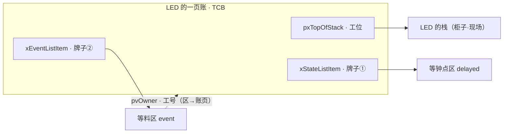


一句话收束：**`TCB_t` 绝不是字段的随机堆叠，而是把"是谁、在哪块区、多急、工位在哪"这几件事，按各个机制取用它的方式精心排布的一页账。** 读它的正确姿势，是照着"哪个机制会翻哪一栏"去认，而不是从头背到尾。下一节就顺着账里那两块牌子往下走，看任务究竟怎样在三块区之间移动。

## 3 内核列表：任务在系统里的位置地图

§2 的账本里有一栏叫"现在在哪"。这一节就专门放大这一栏——工头到底把每个人搁在哪儿，又凭什么这么搁。

任务没输出，不代表它消失了。工头的车间里有**三块待命区**：**候场区**（ready，随时能上台）、**等钟点区**（delayed，在等一个时间点到）、**等料区**（event wait，在等队列里的数据、或某把工具的钥匙）。一个工人没在台上，先看他站在哪块区，比笼统一句"他没干活"有用得多。而这三块区，落到内核里就是三条**列表**。

### 3.1 "他在哪块区"，比"他卡住了"值钱

一个任务半天没动静，脱口而出的往往是"它卡住了"。可这话，就像工头在车间里喊一嗓子"这人怎么不见了"——喊完还是不知道上哪儿找他。**换成"他在哪块区"，下一步立刻就清楚了**：在候场区，就问调度（凭什么还没轮到他上台）；在等钟点区，就问时钟（Tick 到没到他那个点）；在等料区，就问谁负责给他送料、递钥匙。同样一句"没动静"，三块区对着三条完全不同的追查线。

这里有个容易被略过、却是整章地基的点：**工人本人，和他站在哪块区，是两码事**。§2 的账本里"现在在哪"之所以单占一栏，TCB 里之所以挂着一个"列表节点"，就是要把这两件事分开记——人是人（TCB），位置是位置（列表）。分开记，工头才能既一眼认出这是谁、又随时找得到他在哪。而所谓任务"换了个状态"，说到底就是**工头把他从一块区，挪进了另一块区**。


看懂这张走位图，排查不动的任务就不必瞎猜：先认出是谁（找到 TCB），再看他站哪块区（在哪条列表）；区一定，下一步该问调度、问时钟还是问送料，也就跟着定了。

### 3.2 demo：看工头当面挪几次人

[`v3_kernel_list`](code/v3_kernel_list/demo.c) 就干一件事——让工头当着我们的面，把同一个工人从一块区挪到另一块区：

```c
list_insert_front(&ready, &led);
list_insert_front(&ready, &sensor);
list_insert_front(&ready, &log);

list_remove(&ready, &sensor);
list_insert_front(&delayed, &sensor);   /* SENSOR 去等时间 */

list_remove(&ready, &log);
list_insert_front(&event_wait, &log);   /* LOG 去等事件 */
```

```output
move LED    -> ready
move SENSOR -> ready
move LOG    -> ready
ready: LOG SENSOR LED
remove SENSOR <- ready
move SENSOR -> delayed
remove LOG    <- ready
move LOG    -> event_wait
ready: LED
delayed: SENSOR
event_wait: LOG
```

**别把它当链表操作读，当"走位"读**：每一行 `move`，都是工头把某个工人挪进了某块区。前三行，三个人先都进候场区；接着 SENSOR 被挪去等钟点区（它要等下一次采样时间到），LOG 被挪去等料区（它在等一个事件）。末尾那三行，就是此刻的车间一览：候场区只剩 LED，等钟点区是 SENSOR，等料区是 LOG。这张快照比一句"系统卡了"有用太多——它直接告诉你，下一步该去催谁上台、该给谁送料。

### 3.3 回到 list.c：一块牌子、一块区、两个动作

"把工人挪块区"，落到代码里就是改牌子。可这套牌子和区，源码设计得极其精巧——手撕一下，你会发现好几处"为什么这么写"都藏着巧劲。

#### 3.3.1 一块牌子（ListItem_t）上刻了哪些字段

先看牌子本身，`ListItem_t`（[list.h:144](../../reference/rtos_src/FreeRTOS-Kernel/include/list.h#L144)）遮掉体检字段，只剩四样：

```c
struct xLIST_ITEM {
    TickType_t             xItemValue;   /* 牌子上的"号"：多数时候用来排序 */
    struct xLIST_ITEM     *pxNext;       /* 前一位、后一位：双向手拉手 */
    struct xLIST_ITEM     *pxPrevious;
    void                  *pvOwner;      /* 牌子背面的工号：指回 TCB */
    struct xLIST          *pxContainer;  /* 牌子正面：我此刻归哪块区 */
};
```

对着引子一栏栏认：`pxContainer` 是牌子**正面**——写着"我归候场区/等钟点区/等料区"；`pvOwner` 是牌子**背面的工号**——指回它所属的 TCB（§2.3 那句"牌子背面写工号"的真身）。这俩一正一反，**把"人"和"他的位置"双向锁死**：从区里捞到一块牌子，翻背面就知道是谁；拿到一个人，看他牌子正面就知道他在哪。

`pxNext/pxPrevious` 是**双向**的——不是单链表。为什么？因为工头经常要把一个人**从队伍正中间**直接抽走（比如 COMM 在等料区排到一半，料来了就得立刻拎出来）。双向手拉手，抽人时左右两位一牵手就接上了，**不用从头找一遍，一步到位**。

`xItemValue` 是牌子上写的一个"号"，多数时候拿来**排序**——这个号，下面马上会用到。

#### 3.3.2 一块区（List_t）怎么组织：一个永远排最后的"假人"

再看区，`List_t`（[list.h:172](../../reference/rtos_src/FreeRTOS-Kernel/include/list.h#L172)）就三样有用的：

```c
typedef struct xLIST {
    UBaseType_t   uxNumberOfItems;   /* 这块区几个人 */
    ListItem_t   *pxIndex;           /* 巡查游标：上次点到谁 */
    MiniListItem_t xListEnd;         /* 哨兵：一个号最大、永远排最后的"假人" */
} List_t;
```

`xListEnd` 是全章最值得拍案的一处设计。**每块区里都常驻一个"假人"哨兵**，它的 `xItemValue` 被设成**最大可能值**，所以永远排在队尾。图它什么？——**图省掉一切边界特判**。有了这个永不消失的假人，区就永远不是"空指针"：往里插人、从里抽人，代码都不必再为"这区是空的吗""插的是队头吗""删的是最后一个吗"写一堆 `if`。尤其有序插入时，新人一路往后比号，**比到假人这儿必然停下**（谁也大不过它），天然就是循环的终点。一个假人，把链表最烦的边界情况全抹平了。

`pxIndex` 是把**巡查游标**。轮到从候场区选人上台时，工头不是每次都从头点名，而是**从上次停的地方接着往下点**——于是同样急的几个人，就一轮一轮地轮着来。§6 说的"同优先级轮转"，真身就是这根游标在候场区里一圈圈地走。

> 🎨 **配图提示词**（AI 生成后替换为下方图片）

```text
一张干净扁平的技术示意图，浅色背景，单一蓝色强调色。主题：FreeRTOS 就绪列表
的环形双向链表。画一条水平排开的环形链：三个任务节点（标注 LED、SENSOR、LOG）
外加一个特殊的"哨兵"节点（醒目标注 xListEnd：号最大、永远排队尾）。相邻节点之间
用双向箭头相连（标注 pxNext / pxPrevious），并从哨兵绕回队头形成闭环。一个游标
箭头指向其中一个节点（标注 pxIndex：上次点到这里）。整体像"候场区排队"，节点画成
小方卡片，中文标注，无阴影无渐变，线条清爽。
```


#### 3.3.3 挪人：vListInsert 与 uxListRemove 两个动作

有了牌子和区，"挪人"就落到两个函数上。直接抄真身（去掉 trace/断言/整段注释）：

```c
void vListInsert( List_t *const pxList, ListItem_t *const pxNewListItem ) {
    const TickType_t xValueOfInsertion = pxNewListItem->xItemValue;
    ListItem_t *pxIterator;
    /* 从哨兵起步往后走，直到"下一个的号"比新来的大——就插在这儿 */
    for( pxIterator = (ListItem_t *) &pxList->xListEnd;
         pxIterator->pxNext->xItemValue <= xValueOfInsertion;
         pxIterator = pxIterator->pxNext ) { /* 空循环，只为找位；哨兵号最大，必停 */ }
    pxNewListItem->pxNext = pxIterator->pxNext;         /* 四行指针，把新牌子接进链 */
    pxNewListItem->pxNext->pxPrevious = pxNewListItem;
    pxNewListItem->pxPrevious = pxIterator;
    pxIterator->pxNext = pxNewListItem;
    pxNewListItem->pxContainer = pxList;                /* 挂正面：我归这块区 */
    pxList->uxNumberOfItems++;
}

UBaseType_t uxListRemove( ListItem_t *const pxItemToRemove ) {
    List_t *const pxList = pxItemToRemove->pxContainer; /* 翻正面，就知道自己在哪块区 */
    pxItemToRemove->pxNext->pxPrevious = pxItemToRemove->pxPrevious;  /* 左右两位牵手 */
    pxItemToRemove->pxPrevious->pxNext = pxItemToRemove->pxNext;
    if( pxList->pxIndex == pxItemToRemove )             /* 巡查游标正指着他？往回退一格 */
        pxList->pxIndex = pxItemToRemove->pxPrevious;
    pxItemToRemove->pxContainer = NULL;                 /* 摘牌 */
    return --pxList->uxNumberOfItems;
}
```

`vListInsert` 最该盯的是那个 `for` 空循环——它按 `xItemValue` **升序找位**。等钟点区正是靠这个：牌子上的号写的就是"该被叫醒的那个 tick"，于是**最早到点的人永远排在队头**；§8 里挂钟每响，工头只需**瞄一眼队头**，一个排序把每 tick 的开销从"看所有人"压到"看一个人"。而循环条件敢写得这么干脆（不判空、不判尾），全靠 3.3.2 那个**号最大的哨兵**兜底——走到它必停。

`uxListRemove` 则把双向指针用满：`pxNext`/`pxPrevious` 左右一牵手，**任意位置一步抽离**。注意那句 `if( pxList->pxIndex == pxItemToRemove )`——万一巡查游标（§6.3.3 同级轮转那根）正指着要被抽走的人，就先把它往回拨一格，免得游标悬空。这种细节，正是"手撕真源码"才看得到、伪代码会漏掉的地方。

回到 demo：`move SENSOR -> delayed` 不是复制一个 SENSOR，而是**同一个人的那块牌子，正面从"候场"改成了"等钟点"**；`remove LOG <- ready` 是 LOG 的牌子被摘下、从候场区的链里牵走。**链表函数本身普通得很，精巧全在这套牌子—哨兵—游标的组织上**：它让"一个人在哪、这块区有谁、下一个轮到谁"三件事，都变成了 O(1) 或近乎白送的操作。

牌子和区都摸透了。可我们一直默认工人"本来就在那儿"——**他当初是怎么被招进来、第一次站进候场区的**？下一节看任务创建。

## 4 任务创建：给新人办入职，不等于让他上台

前三节，我们把一个"工人"拆成了三样东西：他的**工位**（栈，§1）、他那**页账**（TCB，§2）、他站的**区**（列表，§3）。这一节要做的，是把这三样东西**装到一起**，变成工头真能调度的一个人。干这件事的，就是 `xTaskCreateStatic()`——把它想成**给新人办入职**：备齐工位、建好账页、摆好开工第一天的现场，最后把名字往花名册的"候场区"里一记。

这里有个新手几乎都会踩的误会，先用一句话钉死：

> **办完入职，不等于已经上台干活。** `xTaskCreateStatic()` 返回成功，只说明这个人齐活了、进了候场区待命；他哪一刻真站上工作台，得等工头派活（调度）、甚至等开工铃响（启动调度器）。

### 4.1 "创建成功"到底成了什么

调用 `xTaskCreateStatic()` 时，表面看只是递进去入口函数、任务名、栈、参数、优先级五样东西。可内核在背后跑的是一条**装配线**：拿栈摆好开工现场（§1 那套寄存器口袋），把名字、优先级、栈顶填进账页（§2 的 TCB），最后把这页账挂进候场区（§3 的 ready 列表）。

所以"创建成功"和"任务在跑"根本是两码事。**创建成功 = 装配完成、人在候场区**；至于他什么时候打印第一条日志，还得看三件事：调度器启没启动、优先级够不够高、他一上台会不会又立刻去等钟点或等料。把这条边界记牢，后面一大堆"任务怎么没起来"就能分出层次，而不是一股脑赖到"入口函数写错了"。

### 4.2 demo：办完入职，人却还在候场区待命

[`v4_static_task_create`](code/v4_static_task_create/demo.c) 专门把这个误会拆开。它给 LED、LOG 各办一次入职，然后你会发现——**代码从头到尾没调用过任何任务入口函数**：

```c
static MiniTCB *mini_xTaskCreateStatic(TaskEntry entry, const char *name, void *parameter,
                                       unsigned priority, uint32_t *stack_base,
                                       unsigned stack_words, MiniTCB *tcb, ReadyList *ready) {
    tcb->name = name;
    tcb->entry = entry;                          /* 账页：入口、参数、优先级 */
    tcb->parameter = parameter;
    tcb->priority = priority;
    tcb->top_of_stack = &stack_base[stack_words - 1];   /* 栈顶：开工现场从这儿恢复 */
    ready_insert(ready, tcb);                     /* 送进候场区，仅此而已 */
    return tcb;
}
```

```output
created LED    priority=2 top=<addr> -> ready list
created LOG    priority=1 top=<addr> -> ready list
ready list after creation:
  LOG is ready but not necessarily running
  LED is ready but not necessarily running
```

重点在最后两行那句 **`ready but not necessarily running`**——人办好入职、进了候场区，但一个都还没上台。这正是这个 demo 最想让你记住的：**候场区里"有资格"，和工作台上"正在干"，中间还隔着工头派活和真正切过去两步**。

放回项目里，这句话就是启动阶段的分界线：`xTaskCreateStatic()` 返回成功、任务入口却没打印第一条日志，**先别急着改入口函数**——先确认 TCB 和栈材料是不是长期有效、人是不是真进了候场区，再看调度器启没启动、是不是被更急的任务一直压着。

### 4.3 回到 tasks.c：入职三步，步步有讲究

入职落到源码，就是三个函数接力。可别以为是三句大白话——手撕进去，每一步里都塞着"为什么非这么写不可"的讲究。

#### 4.3.1 三步接力：哪一步都没让人真的上台

| 入职环节 | 源码入口 | 干的活 |
| --- | --- | --- |
| 收材料 | [`xTaskCreateStatic()` `L1332`](../../reference/rtos_src/FreeRTOS-Kernel/tasks.c#L1332) | 接住应用给的静态栈、TCB、入口、参数、优先级 |
| 建账页 + 摆现场 | [`prvInitialiseNewTask()` `L1816`](../../reference/rtos_src/FreeRTOS-Kernel/tasks.c#L1816) | 填 TCB，并调 [`pxPortInitialiseStack()` `L202`](../../reference/rtos_src/FreeRTOS-Kernel/portable/GCC/ARM_CM4F/port.c#L202) 摆好开工现场 |
| 进候场区 | [`prvAddNewTaskToReadyList()` `L2052`](../../reference/rtos_src/FreeRTOS-Kernel/tasks.c#L2052) | 把新人挂进就绪表——**只给资格，不给工作台** |

压成骨架，一眼就看出**哪一步都没有真的让任务跑起来**：

```c
prvInitialiseNewTask(entry, name, priority, parameter, pxNewTCB);   /* 填账页、摆现场 */
prvAddNewTaskToReadyList(pxNewTCB);                                 /* 送进候场区 */
return (TaskHandle_t) pxNewTCB;                                     /* 交回句柄，人却还没上台 */
```

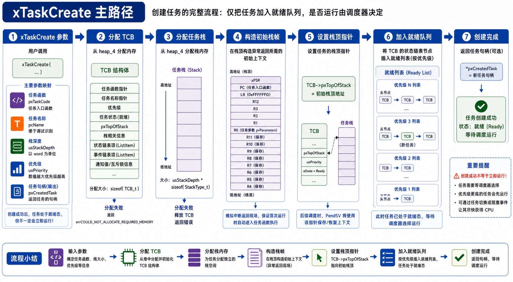

真正的手艺，藏在中间那步 `prvInitialiseNewTask` 里。

#### 4.3.2 prvInitialiseNewTask：那些不起眼却讲究的动作

翻开 `prvInitialiseNewTask`（[tasks.c:1816](../../reference/rtos_src/FreeRTOS-Kernel/tasks.c#L1816)），会看到一串平平无奇的赋值。可每一行几乎都在解决一个具体问题。抄下最要紧的那几段（去掉配置分支）：

```c
/* ① 整块栈刷成已知漆，为高水位测量打底 */
memset( pxNewTCB->pxStack, tskSTACK_FILL_BYTE, uxStackDepth * sizeof( StackType_t ) );

/* ② 栈顶 = 数组末尾，再往下抹到 8 字节对齐 */
pxTopOfStack = &( pxNewTCB->pxStack[ uxStackDepth - 1 ] );
pxTopOfStack = ( StackType_t * )
    ( ( ( portPOINTER_SIZE_TYPE ) pxTopOfStack ) & ( ~( portPOINTER_SIZE_TYPE ) portBYTE_ALIGNMENT_MASK ) );
configASSERT( ( ( portPOINTER_SIZE_TYPE ) pxTopOfStack & portBYTE_ALIGNMENT_MASK ) == 0U );

/* ③ 名字逐字抄进 TCB，末尾强制收尾 */
for( x = 0; x < configMAX_TASK_NAME_LEN; x++ ) {
    pxNewTCB->pcTaskName[ x ] = pcName[ x ];
    if( pcName[ x ] == 0 ) { break; }
}
pxNewTCB->pcTaskName[ configMAX_TASK_NAME_LEN - 1 ] = '\0';

/* ④ 优先级夹紧——它马上要当就绪表的数组下标 */
if( uxPriority >= configMAX_PRIORITIES ) { uxPriority = configMAX_PRIORITIES - 1; }
pxNewTCB->uxPriority = uxPriority;

/* ⑤ 两块牌子建档 */
vListInitialiseItem( &( pxNewTCB->xStateListItem ) );
vListInitialiseItem( &( pxNewTCB->xEventListItem ) );
```

对着逐行拆：

- **先把柜子刷一层漆（栈染色）**：`memset(pxStack, 0xA5, …)`——工位还没人用，先把整个栈刷成同一种漆（`0xA5`）。图啥？将来看这层漆被磨掉了多少，就知道这人干活时最深压到过哪一格——**栈到底用了多少、会不会溢出，一眼可量**。这就是"栈高水位"能测出来的根。
- **栈顶不是随手取的，要对齐**：算栈顶时，不是简单取数组最后一格，而是往下**抹到 8 字节对齐**（Cortex-M 的硬性要求），还配了个 `configASSERT` 兜底。对不齐，将来异常压栈就会出乱子。
- **名字一个字一个字抄**（正是 §2.3.4 那条）：逐字拷进 `pcTaskName`，遇 `\0` 就停，末尾还**强制补一个 `\0`**——哪怕你名字起超长，也保证不越界、读得出。
- **优先级当场夹紧**：`configASSERT` 先挡一道，再把超界的值夹到 `configMAX_PRIORITIES - 1`。为什么这么谨慎？因为**这个优先级马上要拿去当数组下标**索引就绪表（§6 就见到）——下标一越界就是灾难。
- **给两块牌子建档**：`vListInitialiseItem` 把 `xStateListItem`、`xEventListItem` 各初始化好，再用 `listSET_LIST_ITEM_OWNER` 把牌子背面的工号指回这页 TCB——**§2.3.5 那条双向链，就是在这一行接上的**。

> 🎨 **配图提示词**（AI 生成后替换为图片）

```text
一张干净扁平的技术示意图，浅色背景，单一强调色。主题：任务栈的"染色"与高水位测量。
画一根竖直的栈（一列格子），创建时整列填满同一种底色并标注 0xA5（未使用）；运行后
下半段格子变成另一种颜色表示被写过，中间画一条水平"高水位线"，标注"任务用到过的最深处"。
右侧一句话注解：未被覆盖的 0xA5 越少，说明栈越吃紧。中文标注，无阴影无渐变。
```

#### 4.3.3 进候场区，为什么裹在临界区里

材料齐了，最后 `prvAddNewTaskToReadyList`（[tasks.c:2052](../../reference/rtos_src/FreeRTOS-Kernel/tasks.c#L2052)）才把新人挂进候场区。注意它**整段裹在临界区里**（`taskENTER_CRITICAL`）——源码注释写得明白：别让中断在列表更新到一半时来碰它。

为什么这么小心？因为**就绪表是工头（调度器）和中断都会伸手去碰的公共账**：挂一个人要改好几个指针、还要给任务总数 `uxCurrentNumberOfTasks` 加一。要是挂到一半被中断打断、它又恰好来读这张表，就会读到个残缺的半成品。临界区把这几下锁成"一口气做完"。

顺带，这一步还会在两种情况下先把 `pxCurrentTCB` 指向新人：**这是头一个被创建的任务**，或者**调度器还没开工、而这人比当前记着的更急**。于是开工铃一响（§7），第一个被扶上台的，正好是最急的那位。

一句提醒收尾：**静态创建把材料的生命周期交给了你**——那个栈数组和 TCB 缓冲区必须长期活着，绝不能是某个函数里一返回就失效的局部变量，否则人还在候场区，工位和账页却已被回收。

新人办完入职、进了候场区。可有入职就有离场——在看工头怎么派活之前，先把"退场"这件最反直觉的事讲清楚：一个任务，要怎么被干净地删掉？

## 5 任务删除：退场，比入职更讲究

创建（§4）是把一个人装配成可调度对象、挂进候场区。它的反面——删除——你或许以为更省事："把 TCB 和栈还回去不就完了？"偏偏没这么简单。删除是本章头一个真正**反直觉**的机制，也是回头验证"任务是活在自己那块栈上的执行流"（§1）的一块试金石。

### 5.1 人不能锯断脚下的板：为什么删不掉"正在跑的自己"

`vTaskDelete(NULL)` 让一个任务删除自己。问题立刻来了：这个任务此刻正**站在它自己的那块栈上运行**——§1 说过，它的现场、局部变量、调用链，全在它的栈里（那块栈是一段 RAM，§16 会细讲）。你让它当场就把这块栈和自己的 TCB 用 `vPortFree` 还给堆——**它脚下的地就被抽了，连这个删除函数都返回不回去。**

> **人不能一边站在木板上，一边锯断这块木板。** 删除"正在运行的自己"，天生做不到"就地干净利落"。

FreeRTOS 的解法很干脆——**删自己，只做一半；剩下一半，交给一个永远闲着的任务事后来做。**

### 5.2 回到 tasks.c：自杀只做一半，收尸另有其人

#### 5.2.1 vTaskDelete：把将死的人挂进"待终止链"，记一张便条

看 `vTaskDelete` 删的若是"正在运行的任务自己"这条路（[tasks.c:2273](../../reference/rtos_src/FreeRTOS-Kernel/tasks.c#L2273)）：

```c
/* 删的是正在运行的任务：不能立刻释放它的栈和 TCB，
 * 先把它挂进"待终止链"，让空闲任务事后来收。 */
vListInsertEnd( &xTasksWaitingTermination, &( pxTCB->xStateListItem ) );

/* 记一笔：有一个任务待清理，空闲任务据此知道该去翻这张链。 */
++uxDeletedTasksWaitingCleanUp;
```

它一句 `vPortFree` 都没有，只是把这个将死的任务**换了张链表挂着**——从就绪 / 运行，挪到"待终止链" `xTasksWaitingTermination`。**换状态 = 换链表**（§3 立下的那句话），删除也不例外。再给计数器 `uxDeletedTasksWaitingCleanUp` 加一，当作留给收尸人的便条。真正的释放，它一点没碰。

#### 5.2.2 空闲任务：那个永远兜底、顺手收尸的人

这里得正式认识一个角色：**空闲任务（Idle Task）**。它是 `vTaskStartScheduler`（§7 开工那一下）**自动**替你创建的、优先级最低（`tskIDLE_PRIORITY` = 0）的兜底任务——存在的头一个理由是"没有别的任务可跑时，CPU 也得有活干、有个栈可待着"。而它循环体里干的第一件事，恰恰就是收尸（[tasks.c:5833](../../reference/rtos_src/FreeRTOS-Kernel/tasks.c#L5833)）：

```c
static portTASK_FUNCTION( prvIdleTask, pvParameters )
{
    for( ; ; )
    {
        /* 看看有没有任务把自己删了——有的话，
         * 空闲任务负责释放它的 TCB 和栈。 */
        prvCheckTasksWaitingTermination();
        /* ……后面还有低功耗 tickless 等钩子，略 */
    }
}
```

#### 5.2.3 prvCheckTasksWaitingTermination：真把栈和 TCB 还给堆

收尸的活在这（[tasks.c:6110](../../reference/rtos_src/FreeRTOS-Kernel/tasks.c#L6110)）：只要那张便条计数还大于 0，就从待终止链摘下一个，把栈和 TCB **真正**还给堆——

```c
while( uxDeletedTasksWaitingCleanUp > ( UBaseType_t ) 0U )
{
    taskENTER_CRITICAL();
    {
        pxTCB = listGET_OWNER_OF_HEAD_ENTRY( ( &xTasksWaitingTermination ) );
        ( void ) uxListRemove( &( pxTCB->xStateListItem ) );  /* 摘下 */
        --uxCurrentNumberOfTasks;
        --uxDeletedTasksWaitingCleanUp;
    }
    taskEXIT_CRITICAL();

    prvDeleteTCB( pxTCB );   /* 这里才真正 vPortFree 栈和 TCB（还给 §17 的 heap_4） */
}
```

> 补一句对称的：如果你删的是**别的**任务（不是自己），那任务没站在自己栈上，`vTaskDelete` 就地 `prvDeleteTCB` 直接释放，用不着劳烦空闲任务。**只有"自杀"才需要收尸人**——因为没人能亲手拆掉自己脚下的地。

### 5.3 一个工程结论：删除后，内存不是"立刻"回来的

把整条链串起来：`vTaskDelete` 判死刑、挂进终止链、记一笔 → 任务被换下台后不再运行 → 空闲任务某次轮到它跑，翻出终止链、把栈和 TCB 还给 heap_4（§17）。于是有一条**反直觉但必须记死**的工程结论：

> **删一个任务后，堆空间不是"立刻"回来的，而是"等空闲任务跑一趟"才回来。** 你若删完立刻 `xPortGetFreeHeapSize()`，很可能一点没涨——得等 CPU 空下来、让最低优先级的 Idle 收完尸，内存才真正归还。做内存紧张的系统时，这个时间差要心里有数。

入职、退场都讲清了。可工作台只有一个——**工头到底派谁上台**？下一节，调度。

## 6 调度：候场区好几个人，工头派谁上台

上一节，新人办完入职、进了候场区。可候场区常常不止站着一个人，而单核工作台一次只容得下一位。于是那个老问题终于摆到台面上：**工头到底凭什么挑谁上台？**

规则其实很朴素：**谁急，谁先上**（优先级高的先）；**一样急的，轮流来**（同级轮转）。至于还在等钟点区、等料区的人，这轮压根不参与——他们又不是不想上，是还没到能上的时候。

> **ready 是"有资格上台"，running 是"这一刻真被点名站上去了"。** 这俩之间，差的正是工头那一次点名。RTOS 里一大半"怎么没跑"的怪事，都卡在这两个词的缝里。

### 6.1 谁急谁先上——优先级不是"谁重要"

先破一个常见误解：**优先级不是"谁重要"的情绪排序，而是"谁更不能晚"的工程约束**。LOG 对定位故障当然重要，但它天生能后台慢慢消化，晚几十毫秒天塌不下来；COMM 要接外部的话，晚一下对方就当你掉线了。所以 COMM 该比 LOG 急，和"谁更有价值"没关系。设计优先级时，问的不是"这个功能重不重要"，而是"它晚 10 ms、50 ms、100 ms，各会捅出什么娄子"。

### 6.2 demo：COMM 一急，就把 LED 挤下去

[`v5_priority_scheduler`](code/v5_priority_scheduler/demo.c) 里的"工头"就一个动作——扫一遍候场区，挑出最急的那个。注意它挑人的两条规矩，顺序很关键：

```c
if (task->state != TASK_READY) continue;        /* ① 不在候场区的，直接跳过 */
if (!best || task->priority > best_priority) {  /* ② 剩下的里挑最急的 */
    best = task;
    best_priority = task->priority;
}
```

```output
tick=0 switch_to=LED priority=2
tick=1 switch_to=SENSOR priority=2
tick=2 switch_to=LED priority=2
event: COMM becomes ready
tick=3 switch_to=COMM priority=3
tick=4 switch_to=COMM priority=3
```

一个 tick 一个 tick 地读：开头 LED 和 SENSOR 一样急（都是 2），工头就让他俩**轮流上**（tick 0/1/2）；到 tick 3，COMM 来了急活、变进候场区，优先级 3 比谁都高，工头立刻改派 COMM。而 LOG 呢？它一直在候场区待着，可它太不急（优先级 1），**从头到尾没被点过一次名**——这不是 bug，是它本该让路。

这就直接给了两条工程判断：**低优先级任务长期不上台，不一定是坏了**，可能只是更急的人一直占着台；反过来，**COMM 已经很急、却还是响应慢**，那就不能怪调度了，得往后看——是没被点名，还是点了名却没真正切过去。

### 6.3 回到 tasks.c：点名，其实只改一个指针

点名落到代码，最终就是把 `pxCurrentTCB` 指向被挑中那个人的账页。可"从一堆人里挑出最急的那个"这一下，源码用了一套非常漂亮的结构，快到**一条指令**就出结果。手撕开看。

#### 6.3.1 就绪表不是一条队，是一排"桶"

先纠正一个直觉：候场区**不是一条大队**，而是**一排桶**——`pxReadyTasksLists[ configMAX_PRIORITIES ]`，一个优先级一只桶，每只桶就是 §3 那种带哨兵的链表。优先级 5 的人进 5 号桶，优先级 2 的进 2 号桶。

这下 §4.3.2 那个悬念有了着落：**创建时为什么非把优先级夹进合法范围？** 因为**这个优先级就是桶的数组下标**——夹不住，就索引到桶数组外面去了，那是要出人命的越界。

#### 6.3.2 一步找到"最高的那只非空桶"（位图 + 一条 CLZ）

桶可能有几十只，怎么飞快找到"有人、且优先级最高"的那只？一只一只翻太慢。FreeRTOS 的招法极妙：**另存一张位图** `uxTopReadyPriority`——一个 32 位的字，第 N 位是 1，就表示"N 号桶里有人"。于是"找最高非空桶"就化简成了"找这个字里**最高的那个 1**"。

而"找最高位的 1"，Cortex-M 有一条**硬件指令 CLZ（数前导零）**专干这个。连同"挑那只桶的队头"，两个真宏一起抄下来看（[portmacro.h:171](../../reference/rtos_src/FreeRTOS-Kernel/portable/GCC/ARM_CM4F/portmacro.h#L171) + [tasks.c:236](../../reference/rtos_src/FreeRTOS-Kernel/tasks.c#L236)）：

```c
/* portmacro.h：数位图前导零 → 最高非空桶的号，一条指令 */
#define portGET_HIGHEST_PRIORITY( uxTopPriority, uxReadyPriorities ) \
    uxTopPriority = ( 31UL - ( uint32_t ) ucPortCountLeadingZeros( ( uxReadyPriorities ) ) )

/* tasks.c：挑最高桶 → 取该桶队头（推游标）→ 就是当前任务 */
#define taskSELECT_HIGHEST_PRIORITY_TASK()                                     \
    do {                                                                       \
        UBaseType_t uxTopPriority;                                             \
        portGET_HIGHEST_PRIORITY( uxTopPriority, uxTopReadyPriority );         \
        listGET_OWNER_OF_NEXT_ENTRY( pxCurrentTCB,                             \
                                     &( pxReadyTasksLists[ uxTopPriority ] ) );\
    } while( 0 )
```

`ucPortCountLeadingZeros` 就是那条 `clz` 指令的包装。第二个宏一眼串起 5.3.1–5.3.3：`portGET_HIGHEST_PRIORITY` 挑桶（位图 + CLZ）、`pxReadyTasksLists[uxTopPriority]` 是那只桶、`listGET_OWNER_OF_NEXT_ENTRY` 推游标取队头（同级轮转）。

**不管你有 4 个还是 32 个优先级，永远一条指令出结果，O(1)。** 这一处设计还顺带解释了两件事：为什么优先级总数被限制在 **≤ 32**（一个 32 位字刚好装得下这张位图），以及源码里那句"极少有系统需要超过 10~15 个优先级"的底气从哪来。（没有 CLZ 的平台，退回通用版：从最高位那只桶往下、一只一只试空，见 [tasks.c:195](../../reference/rtos_src/FreeRTOS-Kernel/tasks.c#L195)。）

> 🎨 **配图提示词**（AI 生成后替换为图片）

```text
一张干净扁平的技术示意图，浅色背景，单一强调色。主题：FreeRTOS 就绪表的分桶 + 位图选择。
左边画一排竖直的"桶"（标注优先级 0..N），有的桶里有任务卡片、有的空着。右边画一个 32 格的
位图（uxTopReadyPriority），每一位对应一只桶：桶里有人则该位为 1、空则为 0。用一个箭头标出
"最高的那个 1"，旁注 "CLZ 一条指令直接定位 → 最高优先级桶"。中文标注，无阴影无渐变。
```

#### 6.3.3 同一只桶里，轮流上台

选中的是一只**桶**，桶里可能还站着好几个同样急的人（比如 LED 和 SENSOR 都在 2 号桶）。派谁？——`listGET_OWNER_OF_NEXT_ENTRY` 在这只桶里把 §3.3.2 那根游标 `pxIndex` **往前推一格**，这次点到谁就是谁。下次再选到这只桶，游标又往前一格。于是同桶的人**雨露均沾、轮流上台**（源码注释原话：让同优先级任务"get an equal share of the processor time"）。§6 开头说的"同优先级轮转"，落到源码就是这根游标在桶里转圈。

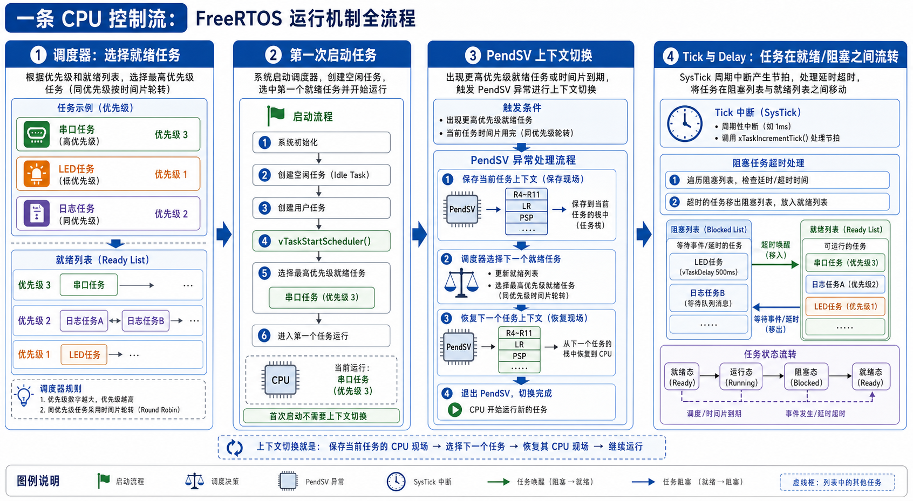

#### 6.3.4 点名，落地就是改一个指针

选出的这个人，写进 `pxCurrentTCB`——`vTaskSwitchContext()`（[tasks.c:5120](../../reference/rtos_src/FreeRTOS-Kernel/tasks.c#L5120)）忙活半天，产出就这一个指针的更新。于是全章最要命的那条分界，也就水落石出：

> **点名（选中），不等于切过去（真站上台）。** `vTaskSwitchContext()` 只把 `pxCurrentTCB` 改成新人；真正保存旧人现场、把新人现场倒回 CPU，是下一节 PendSV 的活。

工头点完名，可被点到的人还稳稳待在候场区没动——**从"点名"到"真站上台"，那惊险的一跳是怎么完成的**？这就是下一节 PendSV 的主场。

## 7 启动与 PendSV：从"点名"到"真站上台"

上一节结尾卡在一个悬念上：工头点了名（`pxCurrentTCB` 改指向 LOG 了），可 CPU 此刻还在 LED 的现场里跑——寄存器、栈指针、执行位置，全是 LED 的。**点名只是定了"下一个该谁"，真把人换上台，是另一码事。**

换班其实分两种情况，难度差得远：

- **开工第一铃**：机器是空的，刚刚打开，工头第一次派人上台。这时候台上**还没有旧人要下台**，只需把准备好的第一个人扶上去，最简单。
- **中途换班**：机器已经跑起来，台上这位正在车床上车一批零件，才车到一半就被换下来。要让他将来还能接着车，就得先把**他这半成品、连同"车到第几刀、下一刀怎么走"的进度一起收好**（存旧人的现场），再把**新上台那位上回同样没做完的活摆回台面**（恢复新人的现场），让他接着干自己那批。这一存一取，才是上下文切换的硬核，也是这一节的重头。

先讲简单的开工铃，再啃换班。

### 7.1 开工第一铃：main 把工作台交出去

裸机里，`main()` 像舞台正中那个人，从头到尾攥着执行节奏：初始化完就进 `while(1)`，所有活都在这条线上排队。RTOS 里，`main()` 的角色变了——它只负责**把台子搭好**（建任务、建队列、备资源），然后按下开工铃 `vTaskStartScheduler()`，**把工作台交给工头，自己退到幕后**。这一交，就再也不回到那个裸机主循环了。

第一次上台之所以简单，是因为**没有旧人要下台**，不必保存谁的现场，只要把创建时给第一个人摆好的那套"开工现场"（§1 里 `pxPortInitialiseStack` 预摆的初始栈帧）倒回 CPU 就行。这活由一条叫 SVC 的异常来干。[`v6_start_first_task`](code/v6_start_first_task/demo.c) 把这一交权拍成了四行：

```output
main: create tasks and start scheduler
SVC model: restore the prepared first task context
first task=COMM priority=3
main stops owning CPU; task context owns execution
```

最要紧的是最后一句 **`main stops owning CPU`**——不是说 `main()` 消失了，而是**系统的执行权已经从 main 主循环，转交给了任务世界**。此后再靠任务的等待、唤醒、调度往前推，而不是靠 main 那根 `while(1)`。真实内核里这一段是这么接力的：

| 环节 | 源码入口 | 干的活 |
| --- | --- | --- |
| 按开工铃 | [`vTaskStartScheduler()` `L3700`](../../reference/rtos_src/FreeRTOS-Kernel/tasks.c#L3700) | 建好 idle 任务、启动内核，转入端口层 |
| 配硬件 | [`xPortStartScheduler()` `L305`](../../reference/rtos_src/FreeRTOS-Kernel/portable/GCC/ARM_CM4F/port.c#L305) | 配好 SysTick、PendSV 等异常优先级 |
| 扶第一个人上台 | [`prvPortStartFirstTask()` `L278`](../../reference/rtos_src/FreeRTOS-Kernel/portable/GCC/ARM_CM4F/port.c#L278) → [`vPortSVCHandler()` `L260`](../../reference/rtos_src/FreeRTOS-Kernel/portable/GCC/ARM_CM4F/port.c#L260) | 从 `pxCurrentTCB` 取第一个任务的栈顶，把现场倒回 CPU |

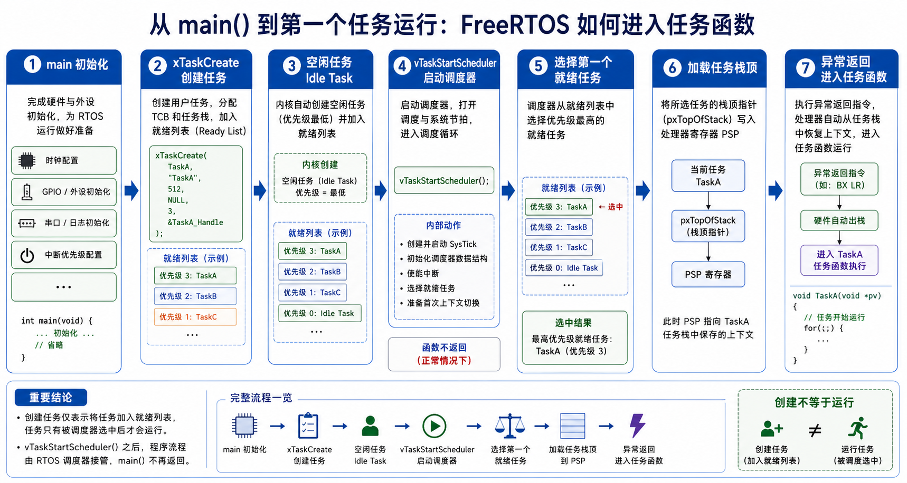

### 7.2 中途换班：上下文切换到底在"切"什么

开工之后，真正天天发生、也最容易讲晕的，是**换班**。先说清楚换的是什么。

台上那位车零件时，"车到第几刀、进给多少、下一步怎么走"这些临时数据，全攥在 CPU 手边那一小把**寄存器**里（§1 说的"随身口袋"）。这批半成品、加上这把记着加工进度的寄存器，合起来就是他的**现场**。要把他换下去、又保证他将来能接着车，就必须**把这套现场原样收进他自己的柜子**；等他下次上台，再从柜子里把它倒回来，接着上一刀往下车。

这个"柜子"，就是每个任务自己的**栈**；而 **PSP（Process Stack Pointer）就是这个人自己柜子的钥匙**——一个专属的栈指针，指向他现场存放的位置。§2 讲过，TCB 的第一个字段 `pxTopOfStack` 存的正是这把钥匙。于是换班的骨架就三步，[`v7_pendsv_switch`](code/v7_pendsv_switch/demo.c) 把它拍得干干净净：

```output
model: scheduler already selected LOG
PendSV: save PSP=0x20001000 into LED TCB
PendSV: pxCurrentTCB LED -> LOG
PendSV: restore PSP=0x20002000 from LOG TCB
```

> 换班三步：**① 把台上 LED 的现场（PSP）锁进 LED 的柜子**（存旧人）→ **② 当前任务牌翻到 LOG**（`pxCurrentTCB` 改指向）→ **③ 从 LOG 的柜子取出他上次的现场，倒回 CPU**（恢复新人）。干这套交接的异常，就叫 **PendSV**。

为什么专门派 PendSV 这么个"交接员"，而不在时钟中断里顺手就切了？因为想换班的场合很多（时钟到点、高优先级被唤醒、当前任务主动阻塞），要是各处随手切，时机乱、还容易在中断里踩坑。把真正的切换**统一收口到 PendSV**，并让它在最低异常优先级上排队执行，时机就集中、可控了。于是分工清清楚楚：

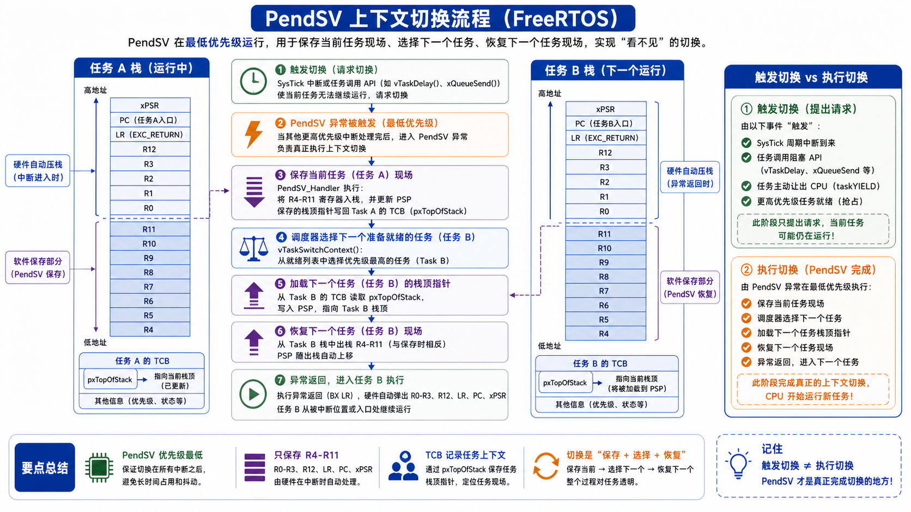

**SysTick（或其他事件）负责"发现该换人了"，调度器负责"点名选谁"，PendSV 才负责"真把班换了"。** 三段分开，后面排查 HardFault 时才不会一股脑赖到 PendSV 头上。

### 7.3 为什么 PendSV 只手动存一半寄存器

这是 PendSV 汇编最唬人、也最关键的一个点，值得慢慢来。很多人第一次读 `xPortPendSVHandler` 都会卡在同一个问题上：**代码里只看见手动保存 `r4-r11`，那 `r0-r3`、`pc`、`xPSR` 这些去哪了？**

答案是：**换班的交接单，一半是"系统自动打印"的，另一半才要交接员手写补上。**

Cortex-M 有个规矩——**只要进异常，硬件会自动把一批寄存器压进当前的栈**：`r0-r3`、`r12`、`lr`、`pc`、`xPSR`。这批正是异常返回时硬件要自己用来"复位现场"的，所以它包办了。PendSV 一进来，这半张交接单已经自动打印好了，不用管。

可硬件只管这半张。另一半 `r4-r11`，按调用约定属于"谁用谁负责保住"的寄存器，硬件进异常时**不会**帮你存。偏偏任务回来后还指着它们里头的局部计算——**这半张，就得 PendSV 亲手补写**，压进这个人自己的柜子（PSP 指向的栈）。一张表看清这条分界：

| 现场 | 谁来存 | 说明 |
| --- | --- | --- |
| `r0-r3`、`r12`、`lr`、`pc`、`xPSR` | **硬件自动**（进异常时压栈） | 异常返回时硬件自己要用，不劳 PendSV 操心 |
| `r4-r11` | **PendSV 手动**（`stmdb`/`ldmia`） | 硬件不管，但任务回来要用，必须亲手补存补取 |
| `PSP` | PendSV 读出/写回 | 每个人柜子的钥匙；存进/取自 TCB 的 `pxTopOfStack` |
| `EXC_RETURN`（在 `r14`） | PendSV 连同 `r4-r11` 一起存 | 它不是普通返回地址，而是告诉 CPU"异常返回后用 PSP、回线程模式、带不带 FPU 现场" |
| `pxCurrentTCB` | 中间由 `vTaskSwitchContext` 更新 | 调度点名的结果，PendSV 照它决定"取哪个柜子" |
| `BASEPRI` | 更新 TCB 前后临时抬高/清零 | 改当前任务、就绪表这些共享账目时，别被内核级中断插队 |

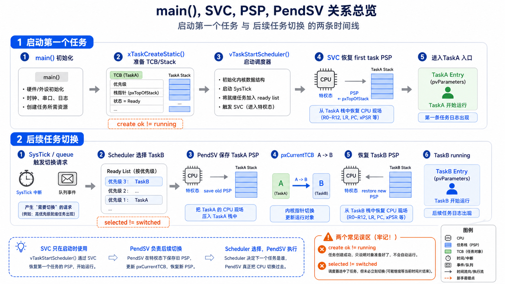

一句话收束：**FreeRTOS 的 PendSV 不是"保存全部寄存器"，而是补齐硬件没自动存的那另一半现场。** 想通这条，再看那几行 `stmdb`/`ldmia` 就不神秘了。

### 7.4 回到 port.c：一条搬运线，两次方向反转

直接抄 [`xPortPendSVHandler()` `L504`](../../reference/rtos_src/FreeRTOS-Kernel/portable/GCC/ARM_CM4F/port.c#L504) 的真汇编（去掉几行 `isb`/`dsb` 内存屏障和 XMC errata 分支）——一条规整的搬运线：

```asm
xPortPendSVHandler:                @ naked 函数，纯汇编
    mrs   r0, psp                  @ ① 读旧人 PSP（旧钥匙）
    ldr   r3, =pxCurrentTCB
    ldr   r2, [r3]                 @    r2 = 旧人的 TCB
    tst   r14, #0x10               @    用了 FPU 吗？（看 EXC_RETURN 的一位）
    it eq
    vstmdbeq r0!, {s16-s31}        @    用了就先压高浮点寄存器 s16-s31
    stmdb r0!, {r4-r11, r14}       @ ② 手动补压 r4-r11 + EXC_RETURN
    str   r0, [r2]                 @ ③ 新栈顶写进旧 TCB 第一个字段(=pxTopOfStack)

    stmdb sp!, {r0, r3}            @    r0,r3 临时寄存到 handler 自己的 MSP
    mov   r0, #configMAX_SYSCALL_INTERRUPT_PRIORITY
    msr   basepri, r0             @ ④ 抬 BASEPRI（挂牌，见 §7.4.2）
    bl    vTaskSwitchContext       @    点名：只改 pxCurrentTCB，不搬一个寄存器
    mov   r0, #0
    msr   basepri, r0             @    摘牌
    ldmia sp!, {r0, r3}

    ldr   r1, [r3]                 @ ⑤ r1 = 新人的 TCB
    ldr   r0, [r1]                 @    r0 = 新人 PSP（新钥匙，取自 pxTopOfStack）
    ldmia r0!, {r4-r11, r14}       @ ⑥ 手动弹回 r4-r11 + EXC_RETURN
    tst   r14, #0x10
    it eq
    vldmiaeq r0!, {s16-s31}        @    用了 FPU 就恢复高浮点
    msr   psp, r0                 @ ⑦ 写回新 PSP
    bx    r14                      @ ⑧ EXC_RETURN：异常返回，硬件自动弹回那半张交接单
```

#### 7.4.1 前半段收旧人，后半段发新人

盯住**两次方向反转**，整段就拿下了：前半段方向是 `CPU → PSP → 旧 TCB`（把旧人现场收进他柜子），后半段方向是 `新 TCB → PSP → CPU`（把新人现场倒回台上）。中间那一下 `vTaskSwitchContext` 是分水岭。

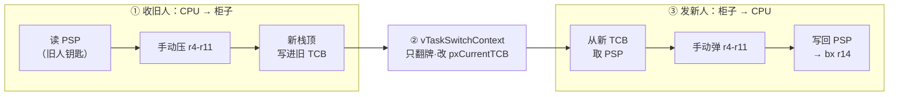

#### 7.4.2 中间那两句 BASEPRI，是给调度器上的一把锁

`vTaskSwitchContext` 被 `raise_basepri()` / `clear_basepri()` 夹在中间，不是摆设。§6.3 讲过，它要翻位图、点最高桶、推游标、改 `pxCurrentTCB`——碰的全是**调度器和中断共用的那本公共账**（跟 §4.3.3 挂人进就绪表是同一类隐患）。挑人挑到一半，若被一个会调用内核 API 的中断插进来，账就乱了。

`BASEPRI` 就是那把临时锁：它把**优先级不高于 `configMAX_SYSCALL_INTERRUPT_PRIORITY` 的中断**先挡在门外，等点完名再放开。**注意它不是关掉所有中断**——比它更紧急的中断照样能抢进来，只是那些中断被约定"不许碰内核 API"，所以碰不到这本账。这一手，既保住了挑人的原子性，又没为了这点事把最急的中断也一起憋死。

#### 7.4.3 收尾的 bx r14：不是返回，是"异常返回"

最后那句 `bx r14` 别当普通函数返回读。此刻 `r14` 里装的是 `EXC_RETURN`——一个特殊值，触发的是**异常返回**：CPU 按它回到线程模式、改用新人的 PSP、（若这人用了 FPU）连浮点现场一起恢复，然后**硬件自动**把那半张自动交接单（`r0-r3`/`r12`/`lr`/`pc`/`xPSR`）弹回寄存器。至此，新人才真正站上了台。软件补的那一半、硬件弹的那一半，在这一跳严丝合缝地拼成一整套现场——这正是 §1.3.3 说的"初始栈帧要伪造成被中断打断的样子"最终兑现的地方。

到这儿，一个任务从"是谁"到"在哪块区"、被"点名"、再"真站上台"的整条链就通了。可我们一直默认一件事没深究：**任务凭什么会主动让出工作台去"等"？** LED 说"我要等 50 ms"，这 50 ms 里 CPU 去干嘛了、时间又是谁在数？下一节就看 Delay 与 Tick。

## 8 Delay 与 Tick：工头怎么数钟点、到点叫人

LED 眨完一次眼，接下来 50 ms 它没事干，就想歇着、到点再回来。问题是：这 50 ms 里，**CPU 该干嘛？时间又是谁在数？** 这一节就答这两个问题。

### 8.1 LED 想等 50 ms，可不能占着工作台干等

最笨的办法，是让 LED 站在工作台上一直数数：`while (没到 50ms);`。可这么一来，它就成了 §0 里那个慢手——**占着工作台却不干正事，SENSOR、COMM、LOG 全被它堵在后面**，一慢俱慢的老毛病立刻重演。

聪明的办法，是让 LED 跟工头打个招呼："我这活得歇 50 ms，这段别派我。" 说完它就**主动从候场区退出来，到"等钟点区"（§3 那条 delayed 列表）挂个号**，号上写一句"到第 50 ms 叫我"。工作台立马腾出来给别人。这，就是 `vTaskDelay()` 干的事。

> **Delay 不是"睡一觉"，而是把"等时间"从"占着工作台干等"，改成"退到等钟点区、挂个号登记在册"。** 挂号的这段时间，CPU 一点不闲着，照样轮给别的能干活的人。

### 8.2 挂钟每响一下，工头就查一次谁到点了

可挂了号，谁来叫醒？——车间墙上有口**挂钟**。这口钟就是 **SysTick**：每隔固定一小格时间（比如 1 ms）"当"地响一声，这一声叫一个 **tick**。钟每响一下，工头就抬头扫一眼等钟点区：**有谁的号到点了？到点的，就把他从等钟点区叫回候场区。**

[`v8_delay_blocked_list`](code/v8_delay_blocked_list/demo.c) 把这套"挂号—挂钟—叫人"拍了下来：

```output
tick=0 LED: ready -> delayed until tick 3
tick=1 sys tick
tick=2 sys tick
tick=3 sys tick
tick=3 LED: delayed -> ready, not necessarily running yet
tick=4 sys tick
```

一格一格读：`tick=0`，LED 挂号去等钟点区，号上写"到 tick 3 叫我"；中间 `tick=1/2/3` 挂钟一声声响；到 `tick=3`，工头一看 LED 到点了，把他叫回候场区。

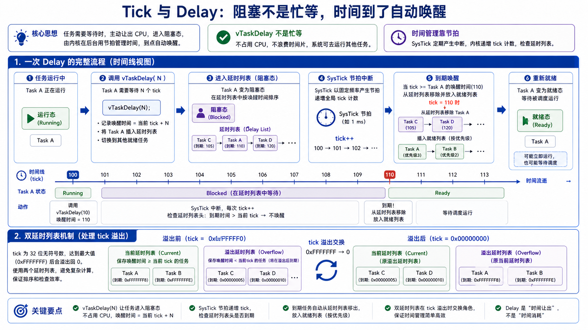

但这一行的结尾藏着最要命的四个字——**`not necessarily running yet`（未必立刻就跑）**。LED 到点了，回的是**候场区**，不是工作台！他只是重新有了"上台资格"，真要上台，还得等工头派活（§6 调度）、还得完成那惊险的换班（§7 PendSV）。这正是前两节那条线在时间维度上的复现：

> **到点回候场，不等于立刻上台。** 时间到期只解决"重新有资格"，"真站上台"是调度和切换的事——中间还隔着两步。

### 8.3 回到 tasks.c：一个负责挂号，一个负责查号

真实内核里，这套动作就落在两个函数一前一后的配合上：

| 环节 | 源码入口 | 干的活 |
| --- | --- | --- |
| 挂号 | [`vTaskDelay()` `L2469`](../../reference/rtos_src/FreeRTOS-Kernel/tasks.c#L2469) | 把当前任务移出候场区，算好唤醒 tick，挂进等钟点区 |
| 挂钟响 | [`xPortSysTickHandler()` `L560`](../../reference/rtos_src/FreeRTOS-Kernel/portable/GCC/ARM_CM4F/port.c#L560) | SysTick 中断，每格时间"当"一声 |
| 查号 | [`xTaskIncrementTick()` `L4736`](../../reference/rtos_src/FreeRTOS-Kernel/tasks.c#L4736) | 时钟 +1，扫等钟点区，把到点的送回候场区 |
| 回候场后还得派活 | [`vTaskSwitchContext()` `L5120`](../../reference/rtos_src/FreeRTOS-Kernel/tasks.c#L5120) | 到点 ≠ 运行，仍要经调度选中 |

#### 8.3.1 挂号：把唤醒 tick 写进牌子，插进一支有序队

`vTaskDelay`（[tasks.c:2469](../../reference/rtos_src/FreeRTOS-Kernel/tasks.c#L2469)）本体薄得很，重活都甩给了一个函数：

```c
void vTaskDelay( const TickType_t xTicksToDelay ) {
    if( xTicksToDelay > 0 ) {
        vTaskSuspendAll();                                  /* 挂号期间先喊"别换班"(§14.3) */
        prvAddCurrentTaskToDelayedList( xTicksToDelay, pdFALSE ); /* ← 挂号的真活 */
        xTaskResumeAll();                                   /* 放开，顺带触发一次换班 */
    }
    /* xTicksToDelay == 0：不挂号，只强制重新调度一次（相当于 taskYIELD）*/
}
```

真正"挂号"的一步是 `prvAddCurrentTaskToDelayedList`：它算出**唤醒 tick = 当前 `xTickCount` + 要等的格数**，写进这人 `xStateListItem` 牌子上的那个号（`xItemValue`），再用 §3.3.3 的**有序插入**挂进等钟点区——于是**最早该醒的人永远排在队头**。而外面那对 `vTaskSuspendAll`/`xTaskResumeAll` 也别放过：挂号要动等钟点区这本公共账，所以先按 §14.3 的法子喊一嗓子"别换班"，挂稳了再放开。

#### 8.3.2 查号的精明：一只"下次闹钟"，让绝大多数 tick 一比就过

最笨的查号法，是挂钟每响一下就把等钟点区从头翻一遍。可 SysTick 一秒响成百上千次，每次全翻，开销受不了。FreeRTOS 的精明就在这儿：它单独存一个 `xNextTaskUnblockTime`——**全场下一个该醒的时刻**，其实就是队头那人的唤醒 tick。

于是 `xTaskIncrementTick` 里每个 tick 只做一次比较（[tasks.c:4776](../../reference/rtos_src/FreeRTOS-Kernel/tasks.c#L4776)）：

```c
xTickCount = xConstTickCount;                             /* tick +1 */
if( xConstTickCount == 0 ) taskSWITCH_DELAYED_LISTS();    /* 绕回 0，两支队一交换(§8.3.4) */

if( xConstTickCount >= xNextTaskUnblockTime ) {           /* ★ 绝大多数 tick 到这就 false，收工 */
    for( ;; ) {
        if( listLIST_IS_EMPTY( pxDelayedTaskList ) ) {
            xNextTaskUnblockTime = portMAX_DELAY; break;   /* 没人在等，闹钟设到最大 */
        }
        pxTCB = listGET_OWNER_OF_HEAD_ENTRY( pxDelayedTaskList );        /* 只看队头 */
        xItemValue = listGET_LIST_ITEM_VALUE( &pxTCB->xStateListItem );
        if( xConstTickCount < xItemValue ) {
            xNextTaskUnblockTime = xItemValue; break;      /* 队头还没到点：记下次闹钟，收工 */
        }
        listREMOVE_ITEM( &pxTCB->xStateListItem );         /* 到点了：从等钟点区摘 */
        if( listLIST_ITEM_CONTAINER( &pxTCB->xEventListItem ) != NULL )
            listREMOVE_ITEM( &pxTCB->xEventListItem );      /* 若也在等料区，一并摘(§2.3.2) */
        prvAddTaskToReadyList( pxTCB );                     /* 送回候场区 */
    }
}
```

一整段的精明全在那颗 `★`：绝大多数 tick 没人到点，`xConstTickCount >= xNextTaskUnblockTime` 直接 `false`，**下面整个 `for` 碰都不碰**。真到点了才进循环，而且**只从队头收**（有序，队头必最早），收完一个就把新队头的时刻记成新的 `xNextTaskUnblockTime`、`break` 收工。这跟 §3.3.3 "只瞄队头"是同一手，把每 tick 的开销压到近乎一次比较。顺带三处呼应也都在真码里：开头 `== 0` 的两支队交换（§8.3.4）、`xEventListItem` 那句"顺手一并摘"（§2.3.2 的两块牌子）、以及 `prvAddTaskToReadyList` 只是送回候场——**到点 ≠ 上台**。

顺带记住那行"请求换班"——被叫回候场的人若比台上这位更急，`xTaskIncrementTick` 只是**返回一个"需要换班"的申请**，真正切过去仍是 §7 PendSV 的活。

#### 8.3.3 到点的人，可能一次从两个名单里摘走

还记得 §2.3.2 那个"两块牌子"吗？COMM 去队列等料、但只肯等 100 ms——这一刻它**同时挂在等料区和等钟点区**。到点收人时，`xTaskIncrementTick` 把他从等钟点区摘掉后，会**顺手检查他那块 `xEventListItem` 还在不在某条等待链上，在的话一并摘掉**（[tasks.c:4822](../../reference/rtos_src/FreeRTOS-Kernel/tasks.c#L4822)）。这正是"谁先到算谁的"落到代码：超时先到，就在这里把两块牌子一起清——省得料随后才来时，还去唤醒一个早已超时走人的家伙。

#### 8.3.4 为什么要两支延时链表（挂钟会绕圈）

最后一个"为什么这么写"最烧脑，却很实在：`xTickCount` 是个有限计数器，**会绕圈**（溢出回 0）。想想一个"绕圈之后才醒"的人——他的唤醒 tick 数值反而比现在还小，塞进同一支有序队里就彻底乱套了。

FreeRTOS 的解法是**备两支队**：`pxDelayedTaskList` 和 `pxOverflowDelayedTaskList`。唤醒 tick 会溢出的，先挂到 overflow 那支候着；挂钟一绕回 0，`taskSWITCH_DELAYED_LISTS()` 把两支队一交换——原来的 overflow 队转正，绕圈问题就这么被抹平了。

一句设计上的延伸：`vTaskDelay` 是**相对**延时（"这轮干完再等 50 ms"），LED 心跳用它没问题；可 SENSOR 要**每 20 ms 一个固定采样点**，相对延时会让每轮处理耗时**一点点累加、把采样点越推越偏**（§0 说的采样点漂移）。它该用**绝对基准**的 `vTaskDelayUntil`——盯"下一格在哪儿"，而不是"从现在起再等多久"。

时间这条线通了，一个任务的独角戏就演全了。可四个人凑一个班组，光会各自等时间还不够——**SENSOR 采到的数据，怎么交到 COMM 手里？** 一个人生产、另一个人消费，中间那段"传送带"就是下一节的队列。


## PART2 任务协作

## 9 队列：传送带

SENSOR 掐着表采数据，COMM 拿去往外发。一个在这头生产，一个在那头消费——**中间这批数据，怎么从 SENSOR 手上稳稳交到 COMM 手上？**

### 9.1 别在两人中间摆一块"公共黑板"

最省事的想法，是在两人中间挂一块**公共黑板**：SENSOR 采完就写上去，COMM 要发就来读。全局变量传数据，就是这么干的。可只要节奏一错开，黑板立刻乱套：COMM 还没来读，SENSOR 新的一笔就把旧的**覆盖**没了；或者 COMM 手快，读到的是一笔**上轮的旧值**；再或者两人同时动手，读到一半的**残数**。想让它不出错，就得靠一堆"你先我后"的口头约定——**又脆又累，正是 §0 那种靠自觉硬凑的老路**。

换个办法：在两个工位之间架一条**传送带**，带上留几个**格子**（这就是队列的容量）。SENSOR 把一笔数据当零件放上带子这头，COMM 从那头一件件取走。有方向、有容量、有先来后到，谁也不覆盖谁——这，就是**队列**。

### 9.2 这条传送带还会"叫人"——它可不只是个数组

到这儿，传送带听着还只是个"排好队的数组"。但队列真正的本事在下一层：**它还管人。**

带上的格子**满了**，SENSOR 手里的零件没处放，怎么办？它不会站那儿干等（又变回占着工作台的慢手），而是**退到等料区（§3 那条 event wait 列表）挂个号**，留话"有空位了叫我"。反过来，带子**空了**，COMM 没得取，同样退到等料区，留话"来料了叫我"。

更妙的是**成功放/取时那一下顺手**：

> **SENSOR 往传送带上放一个零件，不只是把 count 加一——它会顺手看一眼：那头有没有 COMM 正等着料？有的话，一并把 COMM 从等料区叫回候场区。** 反过来 COMM 取走一件、腾出个空格，也会顺手叫醒那个正等着空位的 SENSOR。

这就是队列和普通数组的分水岭：**数组只管"数据放哪儿"，队列还管"没位置时谁停下、来数据时叫醒谁"——它把数据交接和任务唤醒，绑成了同一个动作。**

### 9.3 demo：一条带子，两条线一起读

[`v9_queue`](code/v9_queue/demo.c) 把这条带子拍下来。读它的诀窍是**同时盯两条线**：`count` 是**数据线**，`waits`/`wake` 是**任务线**——只看数字，就漏掉了队列作为"叫人"对象的那一半。

```output
LOG receive -> queue empty, receiver waits
COMM send 10 -> count=1
wake receiver LOG
COMM send 11 -> count=2
COMM send 12 -> queue full, sender waits
LOG receive 10 -> count=1
wake sender COMM
COMM send 12 -> count=2
```

顺着走一遍（这里换 COMM 生产、LOG 消费）：LOG 先来取，带子是空的，它退到等料区等着；COMM 放上 10，`count=1`，**顺手把等料的 LOG 叫回候场**；再放 11，满了（容量 2）；再放 12 没处放，COMM 退到等料区；LOG 取走 10、腾出一格，**顺手叫醒等空位的 COMM**；COMM 补上 12。**每一次 send/receive，数据线和任务线都在联动**——这就是队列的全部戏眼。

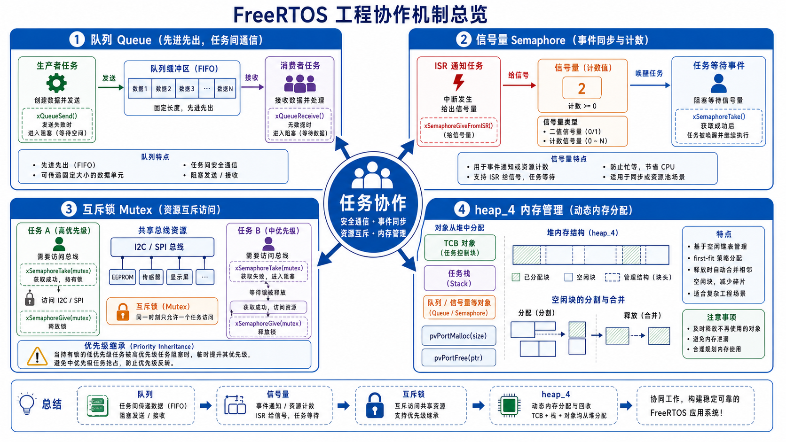

### 9.4 回到 queue.c：一条传送带的真身

`v9` 那条带子，落到源码就是 `Queue_t`。手撕开，它凭什么"既缓存数据、又管人"，就全明白了。

#### 9.4.1 Queue_t 里装了什么

遮掉选配字段，`Queue_t`（[queue.c:103](../../reference/rtos_src/FreeRTOS-Kernel/queue.c#L103)）的主干正好是"一条会叫人的带子"：

```c
typedef struct QueueDefinition {
    int8_t     *pcHead;                  /* 带子仓库的起点 */
    int8_t     *pcWriteTo;               /* 下一件放哪儿（写指针） */
    union { QueuePointers_t xQueue;      /* 当队列用时的数据 */
            SemaphoreData_t xSemaphore;  /* 当信号量/锁用时的数据 */ } u;
    List_t      xTasksWaitingToSend;     /* 等空位的发送者（按优先级排） */
    List_t      xTasksWaitingToReceive;  /* 等数据的接收者（按优先级排） */
    UBaseType_t uxMessagesWaiting;       /* 现在带上有几件 */
    UBaseType_t uxLength;                 /* 一共几格（容量，按"件"算不是字节） */
    UBaseType_t uxItemSize;               /* 每件多大（字节） */
    /* …… cRxLock/cTxLock 等选配字段 …… */
} Queue_t;
```

一眼就看到 §9.2 那句"它还管人"的真身——**两条独立的等待名单**：`xTasksWaitingToSend` 挂"等空位的发送者"，`xTasksWaitingToReceive` 挂"等数据的接收者"，而且都**按优先级排**（所以唤醒时叫醒的是最急的那个）。至于那个 `union{xQueue, xSemaphore}`——**同一副骨架，既能当队列、又能当信号量/锁**。这就是下一节"锁为什么住在 `queue.c`"的伏笔。

#### 9.4.2 环形缓冲：写指针走到头，就绕回起点

带子的格子是**一圈**接起来的。`prvCopyDataToQueue`（[queue.c:2421](../../reference/rtos_src/FreeRTOS-Kernel/queue.c#L2421)）往队尾写一件，就这四行：

```c
memcpy( pxQueue->pcWriteTo, pvItemToQueue, pxQueue->uxItemSize );  /* 拷进仓库 */
pxQueue->pcWriteTo += pxQueue->uxItemSize;                        /* 写指针前进一件 */
if( pxQueue->pcWriteTo >= pxQueue->u.xQueue.pcTail )               /* 到仓库末尾了？ */
    pxQueue->pcWriteTo = pxQueue->pcHead;                          /* 绕回起点 */
```

那句 `if( ... >= pcTail ) pcWriteTo = pcHead` 就是"绕成一圈"；取件那头（`pcReadFrom`）同理反着走。为什么绕圈？——**放/取都不挪动已有元素、也不扩容**，永远 O(1)：来一件写一格、走一件读一格，两个指针沿着圈转。

#### 9.4.3 为什么"按值拷贝"，不传指针

结构体注释里专门写了一句设计原则：**"Items are queued by copy, not reference."**（按值拷贝，不按引用。）`prvCopyDataToQueue` 是实打实把数据 `memcpy` **进队列自己的仓库**，而不是记一个指向发送方变量的指针。

图什么？——这样 COMM `send` 完，它那个局部变量**立刻能销毁、能复用**，队列早把内容抄了一份进自己家。要是传指针，COMM 就得保证那块数据一直活着、还得防两头同时改——又绕回 §9.1 那块"公共黑板"的老毛病了。**按值拷贝，一手交钱一手交货，两头彻底解耦。**（代价是大对象拷贝有成本，所以传大数据时人们才改传指针——但那时，指针指向的生命周期就得自己扛了。）

#### 9.4.4 数据动作和调度动作，在这里接上头

现在两条线合起来看就顺了。`xQueueGenericSend`（[queue.c:949](../../reference/rtos_src/FreeRTOS-Kernel/queue.c#L949)）拷完数据，会扭头看一眼 `xTasksWaitingToReceive`：**非空，就摘下队头那个最急的接收者、送回候场区，并请求一次换班。** 反过来，`xQueueReceive`（[queue.c:1509](../../reference/rtos_src/FreeRTOS-Kernel/queue.c#L1509)）取走一件、腾出空位后，也会去 `xTasksWaitingToSend` 叫醒最急的发送者。

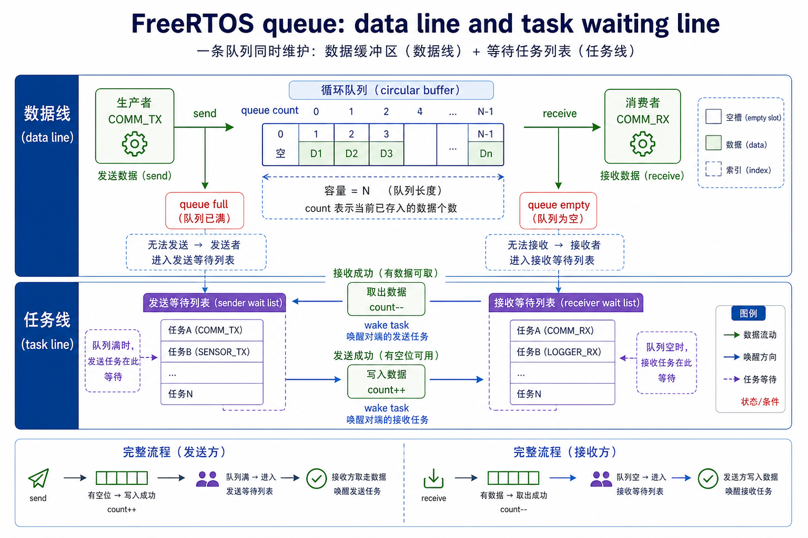

**所以 `send` 从来不只是"拷字节"，它同时可能把一个任务从等料区拎回候场；`receive` 也一样。** 数据动作和调度动作在这里咬合——这正是队列配叫"任务协作对象"、而非"线程安全数组"的原因。（也顺带记住两条边界：容量只吸波峰，长期生产快于消费仍会堵；被叫回候场也只是"有资格"，真上台还得经 §6 派活、§7 换班。）

数据这条线走通了。可任务之间要传的，不总是一整笔数据——**有时只是一个"喂，有事了"的信号，甚至只是"还剩几个名额"的一个数**。传送带上把货一撤、只留个计数，就成了下一节的信号量。

## 10 信号量：一个不装数据的名额

信号量常被摆出一堆吓人的定义。可你只要记住一句就够了：**它就是 §9 那条传送带，把"货"撤掉、只留一个计数。** 传数据叫队列，传"有没有信号 / 还剩几个"就叫信号量。带上有名额＝有信号，空了＝没信号。就这么点区别。

它有两种用法，对应两种很实在的场景。

### 10.1 二值信号量：中断和任务之间的一根"叫醒绳"

先看一个绕不开的现实难题。COMM 那路 UART 来了一帧数据，触发中断。可中断处理**必须极短**（§15 会讲为什么），绝不能在中断里慢慢解析协议、查表、组包——那会把整个系统卡住。可解析的活又不能不干。怎么办？

**把这活拆成两半**：中断里只做一件最快的事——**拉一下"叫醒绳"**，然后立刻退出；真正的解析，交给一个平时睡着、专等这根绳的 COMM 任务。绳一拉，任务醒来慢慢干。这根绳，就是**二值信号量**：

- 中断那头：`give`（拉绳）——把一个空名额往传送带上一放；
- 任务那头：`take`（等绳）——平时阻塞在传送带上等名额，一有就醒。

**它只有两态**："有信号 / 没信号"（带上那唯一的名额，在或不在）。这一下，就把"中断要短"和"活要细"这对死结解开了：**中断只管发信号，重活全甩给任务。** 落到源码，它就是一条**长度 1、每件 0 字节**的队列——是不是和 §11 的锁几乎一模一样？没错，差别只在锁多记了个"主人"。

### 10.2 计数信号量：一叠令牌，管一池资源

再看另一种场景：手上有 **3 条**一模一样的 DMA 通道，可能同时有五六个任务想用。怎么协调，既不超发、又不让人白等？

发**3 张令牌**就行。想用通道，先来**领一张**（`take`，令牌少一张）；用完**还回来**（`give`，令牌多一张）。**令牌发光了（计数到 0），后来的就在门口排队等**，直到有人还牌。这就是**计数信号量**——落到源码，是一条**长度 N、每件 0 字节**的队列，`uxMessagesWaiting` 就是"当前还剩几张令牌"。

它还有个二值信号量给不了的本事：**当计数器用**。中断每来一次事件就 `give` 一下（计数 +1），任务慢慢 `take`（一件件处理）。就算任务一时忙不过来，**攒下的事件数也一个不丢**——这是二值信号量（只有 0/1 两态、多按几下也还是 1）做不到的。

### 10.3 回到 queue.c：为什么信号量"不搬数据、只改一个数"

#### 10.3.1 信号量 = 每件 0 字节的队列

信号量的源码，你几乎不用重新读——**它就是 §9 那套队列，跑在 `uxItemSize == 0` 这条特例上**。

`xSemaphoreCreateBinary`、`xQueueCreateCountingSemaphore`（[queue.c:912](../../reference/rtos_src/FreeRTOS-Kernel/queue.c#L912)）说穿了，都是拿队列的创建函数、把**每件大小设成 0**（§9 开头那个 `queueSEMAPHORE_QUEUE_ITEM_LENGTH` 就是 0）造出来的。`give` 走的还是 `xQueueGenericSend`，`take` 走的还是 `xQueueSemaphoreTake`——全是 §9/§11 见过的同一批函数。

#### 10.3.2 那条"不搬数据"的分支

关键就在"每件 0 字节"这一下。`prvCopyDataToQueue`（[queue.c:2404](../../reference/rtos_src/FreeRTOS-Kernel/queue.c#L2404)）开头就分岔：

```c
if( pxQueue->uxItemSize == ( UBaseType_t ) 0 ) {   /* 信号量/锁：根本不装数据 */
    /* ……这里一个 memcpy 都没有；若这条队是 mutex，还顺手做优先级复原…… */
}
else if( xPosition == queueSEND_TO_BACK ) {
    memcpy( pxQueue->pcWriteTo, pvItemToQueue, pxQueue->uxItemSize );  /* 队列才真拷数据 */
    /* …… 环形推进，见 §9.4.2 …… */
}
```

**`uxItemSize == 0` 这条分支里，连一个 `memcpy` 都没有**——数据搬运整个省了，`send`/`receive` 就退化成把 `uxMessagesWaiting` 加一 / 减一。所以"发信号"＝"计数 +1"、"等信号"＝"等计数 > 0"，只剩一个数在动。（还顺手看见：这条分支里若是 mutex，`give` 时会做**优先级复原**——那正是 §11 那把"带主人的信号量"比普通信号量多出来的活。）

而满/空/挂等待链/按优先级唤醒——这套机器，信号量**原封不动白捡** §9 的：等信号的任务照样挂在 `xTasksWaitingToReceive`，`give` 一下照样把里头最急的那个拎回候场。

#### 10.3.3 队列 / 信号量 / 互斥锁：同一副骨架，三种用法

于是三样东西，在你眼前收成了同一副骨架的三种用法：

| 用法 | 传送带上传的是 | 每件大小 | 特有的东西 |
| --- | --- | --- | --- |
| **队列**（§9） | 一笔笔数据 | `uxItemSize` 字节 | 环形缓冲 |
| **信号量**（§10） | 一个信号 / 一个计数 | **0** | 无（纯计数） |
| **互斥锁**（§11） | 一把唯一的钥匙 | 0 | **owner + 优先级继承** |

顺着这张表往下看就顺理成章了：**互斥锁，本质就是一个"带主人"的二值信号量**。而"带主人"这三个字，又牵出四个人一直共用的**那支笔**——那唯一一路 UART，一次只容一个人写。谁想写，就得先"占住"它、写完再"放开"。下一节，就把这支笔和它那把钥匙讲透。

## 11 互斥锁：一支笔，一把钥匙

传送带解决了"数据怎么交"，可有些东西天生**只能一个人用**：那一支 UART 笔、那条 SPI 总线、那块正在擦写的 Flash。LOG 写日志要用笔，COMM 发响应也要用笔——**两人同时下笔，写出来的字就叠成一团谁也认不得**。这类"同一时刻只容一个人"的资源，得有个规矩管着。

### 11.1 给笔配一把唯一的钥匙

规矩很朴素：**给这支笔配一把、且只配一把钥匙**。想用笔，先来领钥匙；用完，把钥匙还回去。领着钥匙的那位，叫 **owner（当前持有者）**；想用却没领到的，只能在门外排队等钥匙还回来，叫 **waiter（等待者）**。这把钥匙，就是**互斥锁 mutex**。

注意它和传送带（队列）的分工不一样：队列关心"**东西**从谁传到谁"，钥匙关心"这件**独占资源**眼下归谁"。所以读 mutex，眼睛别盯数据，盯两样：**钥匙在谁手里（owner）、谁在门外等（waiter）**。

### 11.2 优先级反转：一个不相干的人，拖垮了急件

钥匙的规矩听着天经地义，可它会捅出一个特别阴、又特别经典的娄子。看这么一幕（三个人：LOG 低优先级、COMM 高优先级，中间还杵着个跟笔毫不相干的中优先级活，就叫它 MID）：

1. LOG 领了钥匙，正低头写它那长长的流水账；
2. COMM 来了急件，也要用笔——可钥匙在 LOG 手里，**COMM 只能等**。到这儿都还合理，急件等一下持有者，认了；
3. 坏就坏在这时候：**MID 醒了**。它根本不用笔，但它比 LOG 急，**一上来就把 LOG 从工作台上挤了下去**，自顾自干它的活。

结果呢？LOG 被 MID 压着、迟迟写不完、**还不了钥匙**；COMM 在门外**跟着一起干等**。绕了一圈，一个跟笔八竿子打不着、优先级还没 COMM 高的 MID，硬生生把最急的 COMM 拖住了。这就是臭名昭著的**优先级反转**——

> **优先级反转：高优先级任务，被一个跟锁毫不相干的中优先级任务，间接拖慢了。** 根子在于：占着钥匙的是个低优先级的人，他一被中优先级插队，那把钥匙就迟迟还不回来。

工头的补救，叫**优先级继承**：**当 COMM 来等 LOG 手里的钥匙时，工头临时把 LOG 提到和 COMM 一样急。** 这么一来 MID 就再也挤不动 LOG 了，LOG 得以尽快写完、把钥匙还掉；LOG 一还钥匙，**立刻被恢复成原来的低优先级**。

> 继承**不是**让 COMM 绕过钥匙抢笔——资源边界一直都在。它只是**给那个占着钥匙的低优先级的人临时"提级"，催他赶紧用完归还**，别被不相干的人插队拖死。

### 11.3 demo：owner 被临时"提级"，还锁后复原

[`v10_mutex_inheritance`](code/v10_mutex_inheritance/demo.c) 把这条链原样跑了一遍，顺着 owner 读最顺：

```output
LOW_LOG takes mutex
MID_WORK is ready and could preempt LOW_LOG if no inheritance exists
HIGH_COMM waits for mutex owned by LOW_LOG
inherit: LOW_LOG priority 1 -> 3
LOW_LOG releases mutex, priority restores 3 -> 1
```

一行行对着看：LOW_LOG 领钥匙成为 owner；MID_WORK 醒了、**本可以把 LOW 挤下去**（`could preempt ... if no inheritance`——这行就是反转的隐患）；HIGH_COMM 来等钥匙，触发 `inherit`，把 LOW 从 1 临时提到 3——**MID（2）这下压不动 LOW 了**；LOW 用完 `releases`，优先级从 3 复原回 1。

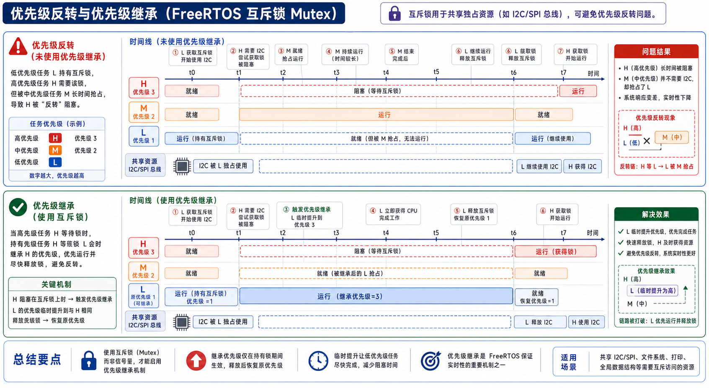

最该盯的证据是 `HIGH_COMM waits for mutex owned by LOW_LOG`：**COMM 优先级最高，却照样越不过还没还钥匙的 LOG**——资源所有权，比优先级更硬。

### 11.4 回到源码：锁为什么住在 queue.c

第一次翻源码会错愕：**mutex 的代码，居然在 `queue.c` 里。** 手撕一下就懂了——一把锁，本质上就是上一节那条传送带的一个"退化版"。

#### 11.4.1 一把锁，就是一条"长度 1、不装货"的特殊队列

回想 §9.4.1 那个 `union{xQueue, xSemaphore}`——当这副骨架当锁用时，激活的是 `xSemaphore`（[queue.c:74](../../reference/rtos_src/FreeRTOS-Kernel/queue.c#L74)），里头就两样：`xMutexHolder`（谁拿着钥匙）和 `uxRecursiveCallCount`（递归锁重入几次）。

而"钥匙"本身，就是一条**容量为 1、每件 0 字节**的队列里那**唯一一个名额**：

- 带上**有那个名额**（队列非空）＝ **钥匙在架上，可领**；
- 带上**空了**（`uxMessagesWaiting == 0`）＝ **钥匙被人拿走了，有 owner**。

于是"领钥匙"就是对这条队列做一次 `receive`，"还钥匙"就是做一次 `send`。**整套满/空/等待/唤醒的机器，直接复用队列的**——这就是它住在 `queue.c` 的全部原因。

#### 11.4.2 领钥匙、记 owner：xQueueSemaphoreTake

领钥匙走 `xQueueSemaphoreTake`（[queue.c:1659](../../reference/rtos_src/FreeRTOS-Kernel/queue.c#L1659)）。领到，就把 `u.xSemaphore.xMutexHolder` 记成自己——**账上从此写明"这把笔归 COMM"**。领不到（已有 owner），就把自己挂进 §9.4.1 那条 `xTasksWaitingToReceive`——**这正是"门外排队"的真身**，而且照样按优先级排。挂之前，还顺手触发一次优先级继承。

#### 11.4.3 继承：只动 uxPriority，`uxBasePriority` 原封不动

继承的核心，抄下来就这么一段（[xTaskPriorityInherit](../../reference/rtos_src/FreeRTOS-Kernel/tasks.c#L6650)）：

```c
if( pxMutexHolderTCB->uxPriority < pxCurrentTCB->uxPriority ) {   /* owner 比抢锁人低 */
    /* owner 若正躺在就绪表里，得给它搬桶 */
    if( listIS_CONTAINED_WITHIN( &pxReadyTasksLists[ pxMutexHolderTCB->uxPriority ],
                                 &pxMutexHolderTCB->xStateListItem ) != pdFALSE ) {
        uxListRemove( &pxMutexHolderTCB->xStateListItem );      /* ① 从旧(低)桶摘出 */
        pxMutexHolderTCB->uxPriority = pxCurrentTCB->uxPriority; /* ② 抬 uxPriority */
        prvAddTaskToReadyList( pxMutexHolderTCB );              /* ③ 挂进新(高)桶 */
    } else {
        pxMutexHolderTCB->uxPriority = pxCurrentTCB->uxPriority; /* 不在就绪表就只改数 */
    }
}
```

盯两处：一是全程**只写 `uxPriority`，`uxBasePriority` 一个字节都不碰**——§2.3.3 埋的伏笔兑现，一个记"现在多急"、一个记"本来多急"，还锁时照后者填回。二是①②③——**"提级"不是改个数就完**：§6.3.1 说过就绪表**按优先级分桶**，所以得先把 owner 从旧(低)桶 `uxListRemove` 摘出、改完再 `prvAddTaskToReadyList` 挂进新(高)桶。**"提级"落到源码，就是一次跨桶搬家**，调度器下次挑人才会真把它当高优先级、不让中优先级再插队。

#### 11.4.4 还钥匙、复原：xTaskPriorityDisinherit

`give` 一把锁时，`xTaskPriorityDisinherit`（[tasks.c:6753](../../reference/rtos_src/FreeRTOS-Kernel/tasks.c#L6753)）把 `uxPriority` 照着 `uxBasePriority` 填回去（同样是一次跨桶搬家，搬回原桶），清掉 `xMutexHolder`，再唤醒 `xTasksWaitingToReceive` 里最急的那个去领钥匙。一次完整的"提级—复原"闭环，就此合上。

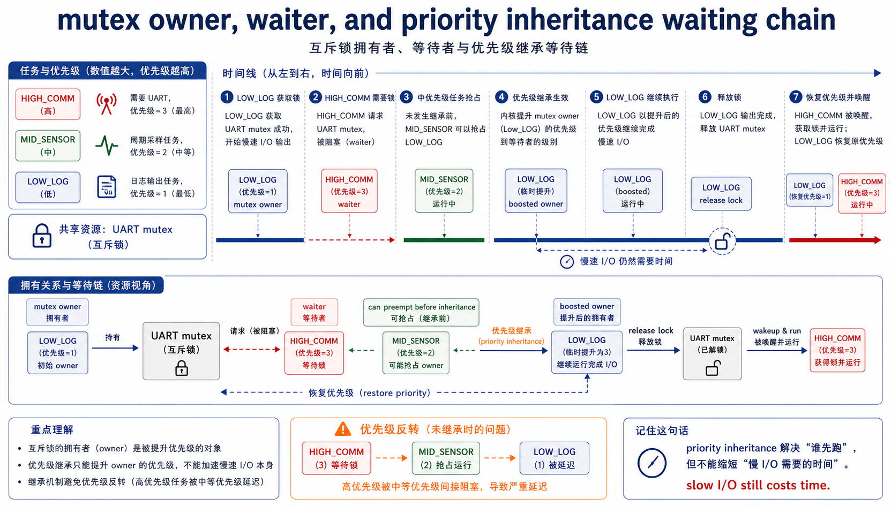

最后留一条最要命、也最容易被误解的工程判断收尾：

> **继承是止血，不是根治。** 它只省得下"被中优先级插队"那段时间，却**变不快慢串口本身，也替你缩不短持锁区**。真正该优化的，永远是**持锁区的大小**——别在攥着钥匙时去干慢串口、擦 Flash、大段格式化。钥匙攥得越久，全班组等得越久。

锁讲完了，任务协作还差最后一件。前面这三样——队列、信号量、互斥锁——你回头看 §10、§11 会发现它们**是同一副骨架变的**：都住在 `queue.c`，都是那条"传送带"（`Queue_t`）改改参数得来。可有一类协作，用队列硬套会别扭得很，FreeRTOS 干脆没让它做队列——那就是**事件组**。

## 12 事件组：一堵挂满信号灯的墙

### 12.1 有一种等待，队列表达不了：等"好几件事一起齐活"

先看一个真实场景。设备开机要能干活，得同时满足三件事：**Wi-Fi 连上了、配置从 Flash 读好了、传感器自检通过了**。这三件事由三个不同的任务各自去办，办完的先后没准。而"主逻辑"这个任务，得**等这三件全齐**才能启动。

用队列或信号量怎么表达这个"**等三件事一起齐活**"？很别扭。你可以摆三个二值信号量，然后 `take` 第一个、再 `take` 第二个、再 `take` 第三个——可这是**依次死等**，顺序被你写死了；万一它们完成顺序是反的，你就卡在第一个 `take` 上，白等。更别说"等这三件里**随便任一件**先成就走"（OR）这种需求，信号量根本没有天然的说法。

问题的根子在于：**队列家族表达的是"有没有一件货 / 一个名额 / 一把钥匙"，是"一对一的移交"；而这里要表达的是"一组相互独立的『是/否』标志，外加它们的组合条件（且 / 或）"。** 这是两种东西。于是内核给了它一个**独立的小机制**——事件组。

> **事件组 = 一堵挂满信号灯的墙。** 每一盏灯（一个 bit）代表某件事"成了没有"；谁把自己那件事办成，就去**点亮**自己那盏灯；等的人可以说"**等这几盏全亮我才走**"（AND），也可以说"**等其中任一盏亮我就走**"（OR）。

### 12.2 一堵信号墙：点灯、等灯，还能"看完就灭"

把这堵墙画出来，事情就直观了：


对着图，事件组的用法就三个动作：

- **点灯**——`xEventGroupSetBits(墙, bit)`：把某几盏灯点亮，宣告"我这件事成了"。中断里则用 `xEventGroupSetBitsFromISR`。
- **等灯**——`xEventGroupWaitBits(墙, 要哪几盏, xClearOnExit, xWaitForAllBits, 超时)`：两个开关最关键——`xWaitForAllBits` 决定你是要**全亮**（AND）还是**任一亮**（OR）；`xClearOnExit` 决定等到之后要不要"**看完就灭**"（把这几盏灯清掉，好让下一轮重新开始）。
- **灭灯**——`xEventGroupClearBits(墙, bit)`：手动把灯熄了。

回到开机那个例子：主逻辑任务 `xEventGroupWaitBits(墙, WIFI|CFG|SENSOR, ..., xWaitForAllBits=pdTRUE, ...)` 挂上去睡；三个准备任务各自办完各自 `set` 一盏；等最后一盏被点亮的那一刻，主逻辑**恰好齐活、被叫醒**。**一次登记，等的是一组事件的组合，而不是死等某一个**——这正是队列给不了的。

### 12.3 回到 event_groups.c：一堵墙，就是一个整数 + 一张名单

#### 12.3.1 EventGroup_t：没有缓冲区，只有"灯排"和"名单"

先看这堵墙的真身（[event_groups.c:54](../../reference/rtos_src/FreeRTOS-Kernel/event_groups.c#L54)）——它和 `Queue_t` 一比，简单得让人意外：

```c
typedef struct EventGroupDef_t
{
    EventBits_t uxEventBits;          /* 一排信号灯：每一位就是一盏灯 */
    List_t      xTasksWaitingForBits; /* 谁在等灯、各等哪几盏——一张等待名单 */
    /* …（trace 编号、静态分配标记，条件编译，略）… */
} EventGroup_t;
```

对照着 §9 的 `Queue_t`（环形缓冲 `pcHead`/`pcWriteTo` + 两条等待链）你就看出**根本差别**了：

1. **它没有数据缓冲区。** 队列要搬货，所以有一圈环形内存；事件组**不搬任何数据**，一盏灯只表示某件事"成了/没成"，一个整数 `uxEventBits` 就把所有灯装下了。
2. **它只有一张等待名单，不是两张。** 队列分"等着发"和"等着收"两拨人；事件组只有一拨——"等灯的人"，所以只需 `xTasksWaitingForBits` 一条 `List_t`。
3. `EventBits_t` 通常是 32 位，但**最高 8 位被内核征用**当控制位（`eventEVENT_BITS_CONTROL_BYTES`），所以你实际能用的是低 **24 盏**灯（16 位配置下是 8 盏）。这就是为什么源码里到处在做 `uxBitsToWaitFor & eventEVENT_BITS_CONTROL_BYTES` 的检查——怕你去点内核自留的那几盏。

#### 12.3.2 等灯 xEventGroupWaitBits：够了就走，不够才把"要求"记进牌子

等灯的核心逻辑（[event_groups.c:312](../../reference/rtos_src/FreeRTOS-Kernel/event_groups.c#L312)，节选）：

```c
vTaskSuspendAll();                    /* 查灯、改名单这段，先喊"别换班"（§14.3） */
{
    const EventBits_t uxCurrentEventBits = pxEventBits->uxEventBits;

    /* 先问一句：我要的灯，现在够了吗？ */
    xWaitConditionMet = prvTestWaitCondition( uxCurrentEventBits, uxBitsToWaitFor, xWaitForAllBits );

    if( xWaitConditionMet != pdFALSE ) {
        uxReturn = uxCurrentEventBits;         /* 够了，直接走人，压根不必等 */
        if( xClearOnExit != pdFALSE )          /* 要"看完就灭"？把这几盏灭掉 */
            pxEventBits->uxEventBits &= ~uxBitsToWaitFor;
    }
    else if( xTicksToWait == ( TickType_t ) 0 ) {
        uxReturn = uxCurrentEventBits;         /* 不够、又不肯等，报个超时就回 */
        xTimeoutOccurred = pdTRUE;
    }
    else {
        /* 不够、又愿意等：把"我要哪几盏 + 怎么等(AND/看完就灭)"打包成控制位 */
        if( xClearOnExit   != pdFALSE ) uxControlBits |= eventCLEAR_EVENTS_ON_EXIT_BIT;
        if( xWaitForAllBits != pdFALSE ) uxControlBits |= eventWAIT_FOR_ALL_BITS;

        /* 记在自己这块牌子(xEventListItem)的"号"上，然后睡过去 */
        vTaskPlaceOnUnorderedEventList( &( pxEventBits->xTasksWaitingForBits ),
                                        ( uxBitsToWaitFor | uxControlBits ), xTicksToWait );
    }
}
xAlreadyYielded = xTaskResumeAll();
```

有两个点值得咂摸：

1. **条件先测、够了就不睡。** `prvTestWaitCondition` 一测，若此刻灯已经够了，直接返回，连阻塞都省了——这和 §9 队列"有货就不必等"是同一个精神。
2. **睡之前，它把"要求"随身带走了。** 注意 `vTaskPlaceOnUnorderedEventList` 的第二个参数：`uxBitsToWaitFor | uxControlBits`——**这个任务"想等哪几盏灯、是 AND 还是 OR、看完灭不灭"，全被打包成一个整数，刻在了它那块 `xEventListItem` 牌子的"号"（`xItemValue`）里**（§3.3.1 那块牌子上的号，这里派上了大用场）。为什么非得随身带？因为**点灯的人得照着这个号，才知道该不该叫醒他**——见下。
3. 这条是**"无序"**事件链（`Unordered`），不像 §8 延时链按唤醒 tick 排序。因为灯的组合没有天然先后，点灯时只能**挨个扫一遍**名单去比对。

#### 12.3.3 点灯 xEventGroupSetBits：一次点灯，叫醒所有"够条件"的人

点灯这头，才是事件组的真正看家本领（[event_groups.c:547](../../reference/rtos_src/FreeRTOS-Kernel/event_groups.c#L547)，节选）：

```c
vTaskSuspendAll();
{
    pxListItem = listGET_HEAD_ENTRY( pxList );
    pxEventBits->uxEventBits |= uxBitsToSet;      /* ① 点灯：把要点的灯全点亮 */

    while( pxListItem != pxListEnd )              /* ② 挨个翻等待名单上的人 */
    {
        pxNext          = listGET_NEXT( pxListItem );
        uxBitsWaitedFor = listGET_LIST_ITEM_VALUE( pxListItem );      /* 取他牌子上的"号" */
        uxControlBits   = uxBitsWaitedFor & eventEVENT_BITS_CONTROL_BYTES;  /* 拆出 AND/灭 标志 */
        uxBitsWaitedFor &= ~eventEVENT_BITS_CONTROL_BYTES;                  /* 剩下他要的灯 */

        if( ( uxControlBits & eventWAIT_FOR_ALL_BITS ) == 0 ) {   /* OR：要的灯里亮了任一盏 */
            if( ( uxBitsWaitedFor & pxEventBits->uxEventBits ) != 0 ) xMatchFound = pdTRUE;
        }
        else if( ( uxBitsWaitedFor & pxEventBits->uxEventBits ) == uxBitsWaitedFor ) {
            xMatchFound = pdTRUE;                                 /* AND：要的灯全亮了 */
        }

        if( xMatchFound != pdFALSE ) {
            if( uxControlBits & eventCLEAR_EVENTS_ON_EXIT_BIT )   /* 他要"看完就灭"，记下 */
                uxBitsToClear |= uxBitsWaitedFor;
            /* 把他从等待名单摘走、拎回就绪——他等到了 */
            vTaskRemoveFromUnorderedEventList( pxListItem,
                    pxEventBits->uxEventBits | eventUNBLOCKED_DUE_TO_BIT_SET );
        }
        pxListItem = pxNext;
    }
    pxEventBits->uxEventBits &= ~uxBitsToClear;   /* ③ 该"看完就灭"的灯，统一灭掉 */
}
( void ) xTaskResumeAll();
```

这段就是图里下半部分在干的事，逐句对上：

1. **先点灯，再逐个比对。** `|=` 把灯点亮后，`while` 从头扫整张名单——这就是为什么它是"无序"链：**点灯人必须一个不落地看过每个等待者**，因为不知道谁的条件恰好被这次点灯凑齐了。
2. **每个人的"要求"就在他自己牌子上。** `listGET_LIST_ITEM_VALUE` 取出的，正是 §12.3.2 睡前打包进去的那个号；`& eventEVENT_BITS_CONTROL_BYTES` 把"AND 还是 OR、灭不灭"拆出来，剩下的就是他要的那几盏灯。
3. **AND 和 OR，就是两句位运算。** OR 是 `(要的 & 现亮的) != 0`（沾着一盏就算）；AND 是 `(要的 & 现亮的) == 要的`（必须全亮）。清清爽爽。
4. **一次点灯，能叫醒好几个。** 循环里谁够条件就摘谁、拎谁回就绪——所以事件组是**一对多的广播式同步**：一盏灯亮，可能同时让好几个等待者齐活。这是队列（发一件货只唤醒一个收货人）做不到的。

顺带看一眼那句判断条件的 `prvTestWaitCondition`（[event_groups.c:778](../../reference/rtos_src/FreeRTOS-Kernel/event_groups.c#L778)）——它和上面 `while` 里的比对是**同一套位运算**，只是等灯那头先自测一次用得上：

```c
if( xWaitForAllBits == pdFALSE )   /* OR：要的灯里，亮了任意一盏就算数 */
    xWaitConditionMet = ( uxCurrentEventBits & uxBitsToWaitFor ) != 0;
else                                /* AND：要的灯必须全亮 */
    xWaitConditionMet = ( uxCurrentEventBits & uxBitsToWaitFor ) == uxBitsToWaitFor;
```

#### 12.3.4 为什么它偏不做成队列（对照 §9–§11）

现在能把这节开头那句话坐实了。队列、信号量、互斥锁全挤在 `queue.c`、共用 `Queue_t`，是因为它们的语义**本质相同**：一件带不带数据的"东西"，在人与人之间**一对一移交**，收发各排一队。而事件组的语义是**另一个维度**：

| | 队列家族（§9–§11） | 事件组（§12） |
| --- | --- | --- |
| 表达什么 | 有没有一件货 / 名额 / 钥匙 | 一组独立的"是/否"标志 |
| 组合条件 | 无——要么有要么没有 | **AND / OR** 任意组合 |
| 唤醒关系 | 一对一（发一件、醒一个） | **一对多广播**（点一盏、可醒一片） |
| 载体 | `Queue_t` + 环形缓冲 + 两条等待链 | 一个整数 `uxEventBits` + 一条等待链 |

硬把"等 A 且 B 且 C"塞进队列，你既没有"按位组合"的天然表达，也享不到"一次点灯唤醒一片"的便利。**所以内核没有勉强复用队列，而是给了它最贴身的一副骨架：一个整数当灯排，一张名单记谁在等、各等什么。** 结构跟着语义走，而不是反过来——这正是读内核源码最值得学的那点手艺。

到这儿，PART2 的**任务协作四件套**就配齐了：传送带（队列）、名额（信号量）、钥匙（互斥锁）、信号墙（事件组）。但光有四块砖还不够——**真正盖房子，靠的是图纸。** 并发编程里有几套反复出现、也早被学界研究透了的"图纸"，下一节先挑两套最常用的，看它们怎么用我们刚拆过的砖搭起来。

## 13 两种并发设计模式：从"机制"到"架构"

前面 §9–§12，我们把队列、信号量、互斥锁、事件组一件件拆到了源码——这些是**机制（mechanism）**，是砖。可写真实系统时，你脑子里想的往往不是"我该调 `xQueueSend` 还是 `xEventGroupSetBits`"，而是"这里是**谁产、谁消**""那里是**一处发生、多处关心**"。这种反复出现的结构，就是**设计模式（pattern）**，是图纸。这一节我们把话题从砖抬到图纸，挑两套并发编程里最经典的模式——它们都有几十年的学术渊源，也都能用手上这几块砖直接搭出来。

> 这是本章少有的"往上抽一层"的一节：不再拆新源码，而是把已拆过的原语，**放回它们在软件架构里的位置**。读源码是"向下钻"，认模式是"向上看"——两样都会，才算真懂并发。

### 13.1 生产者-消费者：一条有界缓冲，解耦快慢两端

第一套图纸，你其实在 §9 已经见过它的雏形。场景是这样：一头有人**源源不断地产**数据（串口收帧、传感器采样），另一头有人**慢慢地消费**（解析、落盘、上报）。两头速度对不齐——直接让产的人调用消费的人，就会**一快一慢互相拖**：产得快时消费方来不及、产得慢时消费方空等。

经典解法是在中间摆一个**有界缓冲（bounded buffer）**：产的人往里放，放满了就自己**阻塞**等空位；消费的人往外取，取空了就自己**阻塞**等新货。两端从此**各按各的节奏跑**，缓冲替它们吸收突发。


> **学术旁注。** 这就是并发领域的"Hello World"——**有界缓冲问题**。Dijkstra 在 1960 年代提出**信号量（semaphore）**时，给出的教科书解法正是：一个互斥量保护缓冲区，外加**两个计数信号量**——`empty` 记还剩几个空位（初值 = 容量）、`full` 记有几件货（初值 = 0）。生产者 `wait(empty)→放→signal(full)`，消费者 `wait(full)→取→signal(empty)`。这套"双计数信号量 + 互斥"是所有操作系统课本的必讲内容。

而 FreeRTOS 的漂亮之处在于：**队列（§9）把这套解法整个封装好了。** 你不用自己摆两个信号量加一把锁——`xQueueCreate` 给的队列，本身就是一个"自带同步的有界缓冲"：`xQueueSend` 在满时阻塞（相当于 `empty` 见 0）、`xQueueReceive` 在空时阻塞（相当于 `full` 见 0），内部的临界区（§14）替你做了那把互斥。所以在 FreeRTOS 里落地生产者-消费者，就是**建一个队列、两端各自收发**，几行而已。回头看 §10 会心一笑：**计数信号量**其实就是这套模式的退化版——货不带数据、只数个数，令牌即货。

一句话记住这套图纸的价值：**它把"谁产"和"谁消"在时间上解开了耦——两端不必同时在场、不必同速，缓冲负责削峰填谷。**

### 13.2 发布-订阅：一次发生，多处关心，而彼此互不相识

第二套图纸，针对的是另一种结构。场景：系统里发生了一件事（"网络断了""按钮被按下""一帧数据到了"），**好几个模块都想知道**——日志要记一笔、UI 要刷个提示、上报模块要发条消息。

最朴素的写法是发生方**挨个通知**：`log_on_event(); ui_on_event(); report_on_event();`。但这样发生方就得**认识每一个关心方**——将来多加一个"告警"模块，你得回去改发生方的代码。耦合死死的。

**发布-订阅（publish–subscribe）**把这层关系倒过来：发生方（**发布者**）只管把消息扔给一个**主题 / 中介**，谁关心谁自己去主题上**登记（订阅）**；发布者**根本不知道、也不关心**有几个订阅者、都是谁。


> **学术旁注。** Eugster 等人在综述《The Many Faces of Publish/Subscribe》（ACM Computing Surveys, 2003）里，把发布-订阅的精髓总结为**三重解耦**：**空间解耦**（发布者不持有订阅者的引用，双方互不相识）、**时间解耦**（双方不必同时在线）、**同步解耦**（发布是异步的，发完立刻返回、不被订阅者拖住）。这三条，正是它比"直接调用"更适合搭松耦合系统的根本原因。

FreeRTOS 没有内建一个重量级的"消息中介"，但**这套图纸能用手上的砖搭出来**，而且能搭出好几种精度：

- **最轻的广播——事件组（§12）。** 一次 `xEventGroupSetBits`（发布）能同时唤醒多个等灯的任务（订阅者），这正是 pub-sub 的**一对多广播**内核。代价是它只传"发生了/没发生"这一个 bit，**不带数据载荷**。
- **要带数据的一对多——扇出（fan-out）。** 给每个订阅者各配一条队列（§9），发布者往每条队列各投一份副本。订阅者增减，只动"订阅表"，发布逻辑不变。
- **更轻的点对点通知——任务通知（task notification）** 等机制，适合"一个发布者、一个订阅者"的高频场景，开销比队列还小。

关键不在于"用哪个 API"，而在于**先想清楚这是不是一个 pub-sub 结构**——一旦是，你就知道该在中间插一层主题、让发布者对订阅者"失明"，日后加订阅者才不用回去动发布方。**内核给的是砖（原语），主题这层图纸得你自己搭；认得出模式，才摆得对砖。**

### 13.3 两套图纸，一句话分辨

把两者并排，选型其实很清楚：

| | 生产者-消费者 | 发布-订阅 |
| --- | --- | --- |
| 关系 | 点对点，**搬运数据** | 一对多，**广播通知** |
| 谁认识谁 | 两端都对着同一条缓冲 | 发布者**不认识**订阅者 |
| 解耦的是 | 快慢**速率**（时间上削峰） | 模块**身份**（空间上失明） |
| FreeRTOS 落地 | 一条**队列**（§9） | **事件组**（§12）广播 / 每订阅者一条队列 |

> **一句话收束：** 当你纠结"该用队列还是事件组"，别从 API 选——**先问自己：这是'点对点把货搬过去'，还是'一处发生、多处各自关心'？** 想清是哪套图纸，砖自然就摆对了。这，就是从"会调 API"到"会设计并发"的那道坎。

搭房子的图纸看过了。可无论生产者-消费者还是发布-订阅，都默认"大家排好队、按规矩来"。真实系统里总有**急件**——中断——会突然闯进来，在工头正改账改到一半时插一脚。改到一半被打断，账会不会乱？这就是下一 PART 要守的门。

## PART3 中断与并发安全

## 14 临界区与调度器挂起

车间干得好好的，门外忽然有人**猛拍门**——一封急件，火烧眉毛。这就是**中断**。它最霸道的地方是：**不排队、也不等工头派活**，门铃一响，不管此刻工作台上是谁在干活，都得当场撂下手里的活、先把这封急件办了，办完再回原处接着干。

这套"闯进来、办完、回原处"，第 2 章其实已经讲透了：门上得先装门铃（外设中断使能），门口的**保安队长 NVIC** 按急件的加急等级（优先级）决定放不放行、要不要打断当前的活（抢占），放行了就照**地址簿**（向量表）找到该办它的人（`IRQHandler`）。而急件闯进、办完退出那两下，**你手里的活计——那几个寄存器——硬件会自动先替你收进抽屉、办完再原样摆回来**（`R0-R3`/`R12`/`LR`/`PC`/`xPSR` 自动压栈、靠 `EXC_RETURN` 弹栈）。这套你不光第 2 章见过，§7 换班时又见了一遍——**PendSV 说白了就是一封"工头发给自己的急件"**。

所以急件**怎么进、怎么出**，我们不重复了。这一节补的，是 RTOS 真正新添的那点麻烦：**急件闯进来的时候，可能和台上的工人抢同一本账。**

工头手里有几本**公共账**——谁在候场、谁在等钟点、传送带那头排了谁在等。这几本账，**会有两拨人来插手改**：一拨是**门外闯进来的急件**（中断也要动账，比如 §10 那样往传送带扔个信号）；另一拨更隐蔽——**工头一听见墙上那口挂钟"当"地报点（§8 的 tick），就可能把台上的人换下、顶另一个上来**，这顶上来的工人也来翻同一本账。两拨同时改一本，账就**改花**。这一节就讲：工头改账那几步时，怎么把这两拨人都摁在外头。

### 14.1 什么叫"临界区"：一段"改到一半谁也别插手"的活

看一句最不起眼的 `count++`。它落到机器上是**三步**：把账上的数读进手里 → 加一 → 写回账上。只要这三步**中途被人插一手**——工头刚读进旧数 `5`、还没写回就被打断，别人也把它改成 `6` 写回，工头回来再把手里的 `5`＋1＝`6` 一写——**账被改了两回，数却只涨一个**，丢了一笔。

所以有些代码，天生要求"**要么一步不做，要么一口气做完，中间绝不容别人插手**"。这样一段代码，就叫**临界区**（critical section）；**护临界区，就是趁改账这几步，把会来插手的人挡在外头。**

而会来插手的，就开头那**两拨人**：① **门外闯进来的急件**（中断）；② **被挂钟叫来接班、顶上台的另一个工人**（任务切换）。FreeRTOS 对付它俩，给了两招——**一招闩门，一招喊话**，区别只在挡谁。

### 14.2 回到源码：两把锁的真身，一把一把拆

#### 14.2.1 头一招·闩门：门一闩，急件全挡在外

头一招最彻底：`taskENTER_CRITICAL()`——**改账前，工头把车间大门"哐当"一闩**。抄真码看它怎么闩（`portENTER_CRITICAL()` → `vPortEnterCritical()`，[port.c:475](../../reference/rtos_src/FreeRTOS-Kernel/portable/GCC/ARM_CM4F/port.c#L475)）：

```c
void vPortEnterCritical( void ) {
    portDISABLE_INTERRUPTS();       /* ← 唯一的实招：抬 BASEPRI = 闩门 */
    uxCriticalNesting++;            /*   记一下门闩了几道 */
    if( uxCriticalNesting == 1 )
        configASSERT( ( portNVIC_INT_CTRL_REG & portVECTACTIVE_MASK ) == 0 );
}                                   /*   顺手断言：不许从急件(ISR)里闩这道门 */

void vPortExitCritical( void ) {
    uxCriticalNesting--;
    if( uxCriticalNesting == 0 )    /* 门闩退到 0 道，才真开门 */
        portENABLE_INTERRUPTS();
}
```

"闩门"这个动作，落到硬件就一条汇编——`portDISABLE_INTERRUPTS()` 展开成 `vPortRaiseBASEPRI()`（[portmacro.h:213](../../reference/rtos_src/FreeRTOS-Kernel/portable/GCC/ARM_CM4F/portmacro.h#L213)）：

```asm
msr basepri, %0    @ %0 = configMAX_SYSCALL_INTERRUPT_PRIORITY
```

把那条红线的值写进 `BASEPRI`——CPU 从此把"加急等级不高于红线"的急件全挡门外（Cortex-M 数值越大越不急，挡的是数值 ≥ 红线那批），只有比红线更急的（真·特大火警）才撞得开门。这一条 `msr`，跟 §7.4.2 PendSV 那两句是同一条指令。

（另两点：`uxCriticalNesting` 让门能**上好几道闩**、退到 0 道才真开，免得里层函数替外层提前开了门；`configASSERT` 那句提醒——**这道普通门闩不许在急件里插**，急件另有专用通道 §15 的 `FromISR`。）用法两条铁律：门闩着的这几步要**极短**、且**绝不能在闩门时调用会让工人睡过去（阻塞）的 API**——门闩着人却去睡，全车间跟着僵死。

#### 14.2.2 一闩，为什么连"换班"也停了

`taskENTER_CRITICAL` 从头到尾没写一句"禁止换班"，可换班确实也停了——**凭什么？** 别忘了第 ② 拨人是**被挂钟叫来的**：工头听见"当"一声（§8 的 tick 中断）才去换人。**可挂钟那声"当"，本身也是从门外传进来的一记急件呀**——门一闩，急件拍门进不来，**连挂钟的报点声也传不进来了**，工头压根听不到钟点，自然不会去换人。**闩一扇门，两拨人全挡在外——这，才是"临界区连换班也一并停住"的真正道理。**

#### 14.2.3 第二招·喊话：门照开，只喊一嗓子"别接班"

闩门虽狠，却连急件也一并挡了、连累一批中断的延迟。可很多时候，你要护的账**只有别的工人会翻、急件根本不碰**（比如工头从头数一遍花名册）。为这点事把整扇门闩死，太亏。

于是有第二招、轻得多：**门照开着，工头只朝徒弟们喊一嗓子"这阵子谁都别来接班"**。急件照进照办、挂钟照响，单单"接班换人"这件事被喊停。真身抄下来就一句：

```c
void vTaskSuspendAll( void ) {
    /* 没有闩门，一根门闩都不碰 */
    uxSchedulerSuspended = uxSchedulerSuspended + 1U;   /* 就这一句：喊话——别接班 */
}
```

把 `uxSchedulerSuspended` 自增一下，这声"别接班"就喊出去了。别的工人接不了班，**可急件照闯照办**——门根本没动。数完了 `xTaskResumeAll()` 把话收回。（它敢**不加锁**自增，源码上头压着一段挺妙的并发论证，感兴趣可去啃那段注释。）

它**怎么做到"只停接班、不挡急件"**？——正好和闩门相反：不动大门，只在"**接班**"这个动作上设了道关卡。§6.3 / §8 那两处伏笔就是这道关卡——挂钟照样"当当"响，可 `xTaskIncrementTick` 每 tick 进门先听工头这声喊：喊着"别接班"呢，就**先把这记钟点记账攒着**（pended ticks）、先不换人；等 `xTaskResumeAll` 收话时，攒下的钟点一次补做。于是急件一封封照办，单单"换人上台"被摁住。（代价同样是这声喊要短。）

### 14.3 闩门还是喊话：就看这本账会不会被急件碰

两招怎么选，一句话——**看你要护的这本账，会不会被急件碰**：

| 这本账…… | 使哪招 | 挡住谁 | 急件还进得来吗 |
| --- | --- | --- | --- |
| **急件也会翻**（如 §15 中断里往队列扔数据） | 闩门 `taskENTER_CRITICAL` | 急件 ＋ 换班（一并） | 红线内的撞不开门 |
| **只有工人会翻** | 喊话 `vTaskSuspendAll` | 只停接班 | **照进照办** |

到这儿，"临界区、调度器挂起到底是什么"就透了：**两招都是"趁改账那几步，把插手的人挡在外头"，区别只在挡谁——闩门，把大门一关，急件连同挂钟报点（换班）一起挡死；喊话，门不动，只叫停"接班"这一个动作，所以轻。**

那条红线 `configMAX_SYSCALL_INTERRUPT_PRIORITY`——它到底给中断立了什么规矩、凭什么"红线内的急件才准碰账"？下一节，专讲急件和 RTOS 怎么打交道。

## 15 中断里的 RTOS：急件怎么安全地喊人干活

§14 里，那条门框上的**红线**反复冒头，还立了句狠规矩——"红线外的急件绝不许碰账"。这条红线到底划的是什么、急件究竟怎么跟 RTOS 打交道，这一节讲透。而它正好是 §10.1 那根"叫醒绳"的**中断那一头**：当初说"中断只管拉绳、把重活甩给任务"，可这根绳在急件里到底怎么安全地拉——答案全在这儿。

### 15.1 门框上那条红线：谁准碰账，谁享"撞门"特权

第 2 章讲过，门口的保安队长 NVIC 会给每封急件盖一个**加急章**（优先级）。工头就着这个加急等级，在门框上画了条**红线**，把急件劈成两拨——这条红线，就是 `configMAX_SYSCALL_INTERRUPT_PRIORITY`：

- **红线以内**（不够急的那拨，Cortex-M 里数值 ≥ 红线）：**准进车间碰账**，但只能走"报备"通道（`xxxFromISR`，见下）。它们的另一个身份，正是 §14.2 那道**门闩拦得住**的急件——**正因为拦得住，工头闩着门改账时它们插不进来，账才护得住。**
- **红线以外**（比红线更急的，数值 < 红线）：享受**"闩门也拦不住、随到随进"的撞门特权**（给真·特大火警留的最低延迟），代价是——**绝不许碰工头任何一本账**。为什么？因为门闩拦不住它，一旦它去碰账，工头没有任何办法护住，账必乱。

Ch2 里那个"**数值越小越急**"的反直觉，到这儿才见真章。而且它牵出一条铁规矩：**那口挂钟（tick 中断）必须落在红线以内**——否则 §14.2 的"闩门连钟声一起挡"就不成立，工头闩着门也会被钟点戳穿、账就护不住了。（FreeRTOS 源码注释里专门红着脸警告过这条。）

### 15.2 急件不能"等"：所以有一整套 FromISR

再看那个"报备通道"是什么，为什么非它不可。普通的 `xQueueSend`，传送带满了会让发送者**阻塞**——退到等料区睡一觉，等腾出空位再被叫醒（§9）。可这套**在急件里是灾难**：急件**根本不是工人**，它没工位、没柜子、没 TCB，**不能睡、也不能让出工作台**。真让一封急件"阻塞"，就是死锁——它睡死在那儿，而它不是任务，谁也没法把它叫醒。

所以内核给了一整套 **`xxxFromISR`** 版本（`xQueueSendFromISR`、`xSemaphoreGiveFromISR`……），规矩就一条：**永不阻塞**。传送带满了？直接回你个"没塞进去"（`pdFALSE`），绝不把急件摁那儿睡。（也正因如此，FromISR 版**没有"等多久"那个 `xTicksToWait` 参数**——急件压根不许等。）

### 15.3 回到源码：叫醒了更急的人，退出那一刻立刻换班

现在把 §10.1 的"叫醒绳"接上。UART 急件拉一下绳（`xQueueSendFromISR` 把料扔上传送带、顺手叫醒等料的 COMM 任务）。可要是被叫醒的 COMM，**比"刚被这封急件打断的那个人"更急**呢？按理该让 COMM **立刻上台**，别傻等到下一记钟点。偏偏急件自己**不能换人**——它得赶紧退出，而换人还得走 PendSV（§7）。

FreeRTOS 的解法很巧：让急件在退出前**捎带补一次换班申请**。看那段几乎所有中断都长一个样的标准写法：

```c
void USARTx_IRQHandler( void ) {
    BaseType_t xHigherPriorityTaskWoken = pdFALSE;   /* ① 先假设：没叫醒更急的 */
    xQueueSendFromISR( xRxQueue, &byte,              /* ② 拉绳：扔料 + 叫人， */
                       &xHigherPriorityTaskWoken );  /*    回执写进这个变量 */
    /* …… 清中断标志 …… */
    portYIELD_FROM_ISR( xHigherPriorityTaskWoken );  /* ③ 回执是真→退出即换班 */
}
```

① 只是把回执变量先设成 `pdFALSE`，没啥可说；真戏在 ② 和 ③，对着真码拆：

#### 15.3.1 谁把回执写成真的

**②** 是 `xQueueSendFromISR` 内部——扔完料，它扭头看等料区有没有人，有就叫醒队头，而且那人**若比当前更急**，就在回执上记一笔（[queue.c:1285](../../reference/rtos_src/FreeRTOS-Kernel/queue.c#L1285)）：

```c
if( listLIST_IS_EMPTY( &pxQueue->xTasksWaitingToReceive ) == pdFALSE )
    if( xTaskRemoveFromEventList( &pxQueue->xTasksWaitingToReceive ) != pdFALSE )
        *pxHigherPriorityTaskWoken = pdTRUE;   /* 叫醒的这位更急，记一笔 */
```

#### 15.3.2 这笔回执怎么变成换班

**③** `portYIELD_FROM_ISR` 展开开来，就是"回执为真，就挂一个 PendSV"（[portmacro.h:114](../../reference/rtos_src/FreeRTOS-Kernel/portable/GCC/ARM_CM4F/portmacro.h#L114)）：

```c
#define portYIELD_FROM_ISR( x )       portEND_SWITCHING_ISR( x )
#define portEND_SWITCHING_ISR( x )    do { if( x ) portYIELD(); } while( 0 )
#define portYIELD()   ( portNVIC_INT_CTRL_REG = portNVIC_PENDSVSET_BIT )   /* 挂起 PendSV */
```

于是链条闭合了：急件一退出，**那封"工头发给自己的急件"——PendSV（§7）立刻接手**，把刚叫醒的 COMM 换上台。**一根叫醒绳（§10.1）、接上一次换班（§7），中间那段"急件里怎么安全地喊人、又不自己去换"，填的正是 `FromISR` + `pxHigherPriorityTaskWoken` + `portYIELD_FROM_ISR` 这套。**

（最后一问：干嘛不在中断里直接换人？因为 §7.4.2 说过，切换**统一收口到 PendSV** 才可控——急件只管记个申请，真换交给优先级最低的 PendSV，等所有嵌套的急件都办完了再切，最稳。）

到这儿，PART3 的中断线就通了：急件闯门、护账的闩门与喊话（§14）、红线 + FromISR + 退出即换班（§15）。任务怎么活、怎么协作、急件怎么安全掺和进来——三条线齐了。可这一路上，任务栈、TCB、队列缓冲、信号量、锁，桩桩都在吃 RAM——**它们到底从哪块地里长出来的？** 下一 PART，就去见这块地的两位管家：**栈**和**堆**。

## PART4 内存：栈与堆

## 16 栈：多任务凭什么成为可能

栈是什么、堆是什么，学过 C 的人早清楚，这里不从头讲。这一 PART 只回答一个更要紧的问题：**同样是单片机，8 位机基本只能跑一条主线程，凭什么 Cortex-M 上能跑起 FreeRTOS、让好几个任务各自独立地活着？**

答案不在软件，在**硬件**——具体说，在 CPU 拿什么给不同执行流做**内存隔离**。这一节先把这条硬件线讲透，再看 FreeRTOS 怎么顺着它把"任务"搭出来。

### 16.1 一条内存隔离的谱系：8 位机 → MMU → Cortex-M

一个系统能不能让多个执行流并存、又互不踩烂对方的现场，取决于它有没有、有什么样的**内存隔离**。三档：

- **8 位机（PIC、51 这类）——没有隔离。** 一套栈、一片没有边界的 RAM，谁都能写谁。想同时养几个独立执行流？没有硬件替你把它们的现场隔开，所以本质上只能一条主循环跑到底——**从设计上就撑不起"任务"这种东西。**
- **跑通用操作系统的大 CPU——MMU 级的强隔离。** 芯片里有个 **MMU（内存管理单元）**，维护着**页表**：每个进程只看得见自己的一套**虚拟地址空间**，彼此完全隔离；虚拟内存还能远大于物理内存（靠换页）。强大，但也复杂、开销大，由操作系统统一管、对应用完全透明。
- **Cortex-M 这类嵌入式芯片——不上不下：它没有 MMU。** 那它靠什么让任务各自独立？——靠一个便宜得多的硬件机制：**双栈，MSP 与 PSP。**

一句话定调：**不是 FreeRTOS "发明"了多任务，是 Cortex-M 的双栈让"多个执行流各有各的现场"在硬件上成为可能，FreeRTOS 只是把这个硬件能力，组织成了我们叫"任务"的东西。**

### 16.2 双栈 MSP / PSP：没有 MMU，也能把现场隔开

Cortex-M 有**两个栈指针**，硬件层面就分好了工：

- **PSP（Process Stack Pointer）**——线程模式（跑普通代码时）用的栈指针；
- **MSP（Main Stack Pointer）**——handler 模式（跑异常/中断时）用的栈指针，也是芯片复位后默认用的那个。

关键全在 PSP 这一半。FreeRTOS 给**每个任务单独划一块 RAM 当栈**，并把这块栈的当前栈顶记进它自己的 TCB（§2 的 `pxTopOfStack`）。任务在台上跑时，CPU 的 PSP 指的就是它那块栈；**换任务，本质上就是换一个 PSP 值**（§7 PendSV 干的"存旧 PSP、载新 PSP"）。于是每个任务的调用链、局部变量、被打断时的寄存器现场，全待在**各自独立的那块栈**里，谁也踩不到谁——**这，就是"多个执行流并存"落到物理上的样子。**

MSP 那一半，是留给内核和中断的**公用栈**：急件闯进来（§14）时 CPU 切到 handler 模式、用 MSP，**不去啃任何一个任务本就不宽裕的栈**；芯片一上电、`main` 还没交权前（§7.1），用的也是 MSP。

拿它和 MMU 对一下，就看清 Cortex-M 的取舍了：

| | MMU（大 CPU） | 双栈 MSP/PSP（Cortex-M） |
| --- | --- | --- |
| 隔离粒度 | 整个虚拟地址空间，进程间完全隔离 | 只隔离**栈 / 现场**，地址空间还是同一个 |
| 靠什么 | 页表 + TLB + 换页 | 两个栈指针 + 每任务一块栈 |
| 代价 | 复杂、开销大、要 OS 统一管 | 极轻、确定性好、无页表 |
| 虚拟内存 | 有，可远大于物理内存 | 无，全是实打实的物理 RAM |

**Cortex-M 走的是务实那条路**：不追求进程级强隔离，只用双栈把"每个任务的现场"分开——刚好够 RTOS 搭多任务，又便宜到能塞进几十 KB RAM 的芯片里。（题外一句：Cortex-M 另有个可选的 **MPU**，能给内存划几段权限区，但那是"再加一层保护"的选配，不是 MMU 那种地址翻译，跟这里的多任务地基是两码事。）

### 16.3 一块任务栈的一生：SP 到底怎么一升一降

地基讲清了，来看这块栈在 RTOS 里**具体怎么用起来**——把 SP 从任务被创建到跑起来的每一步升降拆开。（Cortex-M 栈**向下生长**：SP 越用越往低地址走。下图 `pxStack` 是低地址那头、`pxEndOfStack` 是高地址那头。）


1. **创建时（§4.3.2）**：FreeRTOS 划一块 RAM 给它当栈（`pxStack`…`pxEndOfStack`），整块刷成 `0xA5`；再在**高地址那头**摆好一份伪造的初始栈帧（§1.3），把这个栈顶地址存进 `pxTopOfStack`。此刻任务还没跑，SP 也还没指向它。
2. **第一次上台（§7）**：启动 / PendSV 把这块栈的栈顶载入 PSP——PSP 一指过来，CPU 就从那份伪造现场里"异常返回"，任务像从入口活了过来，SP 落在栈顶附近。
3. **每调进一层函数**：SP **往下走**——压入返回地址、要保护的寄存器、这一层的局部变量；函数一返回，SP **再往上弹回**。图里"已用"那半，就是当前 SP 以上被这样一层层压出来的。
4. **干活时被急件打断（§14 / §15）**：硬件把一套异常帧（`R0-R3/R12/LR/PC/xPSR`）压进**当前这块 PSP 栈**（SP 又下探一截），再切 MSP 去跑 handler；handler 返回时从 PSP 弹回，任务接着跑。**——所以任务栈必须替随时可能来的急件预留出这份空间。**
5. **被换下台（§7.4）**：PendSV 把 `R4-R11` 也补压进它的 PSP 栈，把此刻栈顶存回 `pxTopOfStack`；下次上台，再从 TCB 取回栈顶、反着弹出来。

这里要把 §16.2 那两根栈指针，落到**一块真实的 RAM**上看清楚——初学者最容易糊涂的，就是把 MSP、PSP 想成"两块内存"。**它俩不是两块内存，是同一块 RAM 里两段地址上的两根指针。** 看下图这块 SRAM：


- **顶段是"主栈 / 中断栈"，`MSP` 钉死指着它**——复位后的 `main`、内核、所有中断和 PendSV，用的都是这一块，全系统就这一块公用栈；
- **中间从堆 `ucHeap` 里挖出的一段段，是每个任务各自的栈，`PSP` 指着"当前在跑"的那个**（图里是任务 A）。**换任务，本质就是把 PSP 从 A 那段改指 B 那段**——这正是 §7 PendSV 收尾那句 `msr psp, r0` 干的事。
- **谁是"当前 SP"只看模式**：线程模式（跑任务）时 SP 就是 PSP，Handler 模式（中断/异常）时 SP 就是 MSP。所以上面第 4、5 步里 SP 的"切"，切的不是位置，是**换了另一根指针来当家**；被打断时硬件压的那套异常帧，压进的是**被打断那段（任务的 PSP 栈）**，handler 的函数体才跑在 MSP 段。
- 最要紧的一句：**这几段是同一块 RAM，段与段之间没有任何硬件墙。** 任务栈一旦写过界，照样踩烂隔壁（邻居的栈、TCB）——这就是下一节栈溢出的由来。想要真正的"墙"，得另配 MPU（§16.2 末尾那句），那是再加一层的事，不是这里多任务的地基。

收束一句：**任务的栈，就是它"能被暂停、能恢复"这件事的物理载体；SP 每一次升降，都是这条执行流在自己那块地上进退。** §1 说任务是"能暂停再继续的执行流"，到这儿才算落到了硬件上。

### 16.4 用好它：栈开多深、怎么知道快爆了

栈是任务自己的一块定长 RAM，于是两个现实问题绕不开。

**开多深**：至少装得下——最坏那条调用链的层数 × 每层局部变量，加偶尔的大数组 / `printf` 缓冲，**再加上被急件打断时压进来的那套异常帧**（还可能嵌套）。最后这项最常被忘、也最坑人（平时没事、一忙就崩）。开小了是偶发溢出（RTOS 里最难查的 bug），开大了白占 RAM——**正解：先开宽松、跑起来量高水位、再收到刚好留够余量。**

**怎么知道快爆了**：FreeRTOS 把检查塞进每次换班（§7 切走任务前查一眼），开关 `configCHECK_FOR_STACK_OVERFLOW` 两档。法一只看 SP 有没有贴到栈底（[stack_macros.h:70](../../reference/rtos_src/FreeRTOS-Kernel/include/stack_macros.h#L70)），法二再摸一把栈底那圈 `0xA5` 守卫字节——**漆被磨掉过，就说明 SP 曾扎穿到这**（[stack_macros.h:103](../../reference/rtos_src/FreeRTOS-Kernel/include/stack_macros.h#L103)）：

```c
/* 法二（configCHECK_FOR_STACK_OVERFLOW > 1）：SP 越界，或栈底守卫漆被磨掉 */
if( ( pxCurrentTCB->pxTopOfStack <= pxCurrentTCB->pxStack + portSTACK_LIMIT_PADDING ) ||
    ( pulStack[0] != 0xa5a5a5a5U ) || ( pulStack[1] != 0xa5a5a5a5U ) ||
    ( pulStack[2] != 0xa5a5a5a5U ) || ( pulStack[3] != 0xa5a5a5a5U ) )
    vApplicationStackOverflowHook( pxCurrentTCB, pxCurrentTCB->pcTaskName );
```

同一层漆反过来用，就能量**高水位**——`uxTaskGetStackHighWaterMark` 从栈底一路数还没被磨掉的 `0xA5`（[tasks.c:6375](../../reference/rtos_src/FreeRTOS-Kernel/tasks.c#L6375)），剩得越少越吃紧：

```c
while( *pucStackByte == tskSTACK_FILL_BYTE ) { pucStackByte -= portSTACK_GROWTH; uxCount++; }
return uxCount / sizeof( StackType_t );   /* 还剩几格从没沾过 */
```

栈是每个任务**创建时就分好、专属自己**的一块 RAM。可队列、信号量、锁这些**运行中现造**的对象，它们的内存又是从哪临时切出来的？下一节的**堆**，管的就是这个。

## 17 heap_4：动态对象的 RAM 管家

§16 的栈，是每个任务创建时就分好的固定 RAM。可 `xQueueCreate`、`xSemaphoreCreateMutex` 这些**运行中现造**的对象，内存得当场**动态申请**——这就是 `pvPortMalloc` / `vPortFree`，扮演的正是 C 里 `malloc` / `free` 的角色，只不过 FreeRTOS 没用 libc 的，而是自己实现了一套（还不止一套）。

`malloc/free` 大家都熟，这里不讲它是什么；要讲的是嵌入式里一个绕不开的现实——**FreeRTOS 给了五种堆实现，取舍差得远，得先认清，再说为什么默认用第 4 种。**

### 17.1 五种堆实现，各有取舍

FreeRTOS 在 `portable/MemMang/` 下给了**五份** `pvPortMalloc` 实现（`heap_1.c` … `heap_5.c`），编译时挑**一份**链进去。一张表先摆开：

| 实现 | 能还地(free)？ | 找地策略 | 合并碎片？ | 典型场合 |
| --- | --- | --- | --- | --- |
| **heap_1** | ✗ 只分不还 | — | — | 全程只创建、**绝不删**任何对象——最确定、代码最小 |
| **heap_2** | ✓ | 最佳适配 best-fit | ✗ 不合并 | 已**弃用**：不合并→碎片，官方叫你改用 heap_4 |
| **heap_3** | ✓ | 包了标准 `malloc/free` | 交给 libc | 想用编译器自带堆、又不在乎实时确定性 |
| **heap_4** | ✓ | 首次适配 first-fit | ✓ **相邻块合并** | **通用默认**：能删、抗碎片、一块连续 RAM |
| **heap_5** | ✓ | 同 heap_4 | ✓ | RAM 分散在**几块不连续**地址段时（heap_4 + 跨区） |

### 17.2 为什么一般就用 heap_4

把另外四个一个个排除，就知道 heap_4 为什么是"甜点"了：

- **heap_1 不能还地**——只配那种"开机建好一切、之后永不删"的系统。一旦你要 `vTaskDelete` 或删个队列，它就抓瞎。
- **heap_2 能还、却不合并**——反复分了还、还了分，空闲地被切得七零八落：**加起来明明够大，却没有一块连续的大地**。这就是碎片，官方已把它标为弃用。
- **heap_3 借的是 libc 的 `malloc`**——行为不确定（耗时飘）、还得链接器留好堆，嵌入式实时系统不爱。
- **heap_5 是 heap_4 的跨区版**——只有当你的 RAM 真的**断成好几段地址**时才需要，否则白白多一层配置。
- **heap_4 刚好卡在正中间**：能自由分/还、**相邻空闲块自动合并压制碎片**、一整块连续地够用、耗时也可控。所以——**没有特殊理由，默认就它。**

### 17.3 回到 heap_4.c：一块地怎么分、怎么还、怎么合

#### 17.3.1 每块地钉一块牌：BlockLink_t，最高位当"已占"旗

heap_4 把整块大地切成若干小块，**空闲的那些串成一条链**（又是链表——和 §3 一个套路）。每块地边上钉块牌 `BlockLink_t`（[heap_4.c:100](../../reference/rtos_src/FreeRTOS-Kernel/portable/MemMang/heap_4.c#L100)）：

```c
typedef struct A_BLOCK_LINK {
    struct A_BLOCK_LINK *pxNextFreeBlock;   /* 下一块空闲地在哪 */
    size_t               xBlockSize;        /* 这块多大（外加：最高位当"已占用"旗）*/
} BlockLink_t;

#define heapBLOCK_ALLOCATED_BITMASK   ( 1 << (最高位) )   /* xBlockSize 的最高位 */
```

一个精打细算的小机关：块大小 `xBlockSize` 用不到最高那一位，于是 heap_4 **拿这一位当"这块地已被占用"的旗**——省下一整个字段，一位搞定。链的两头是 `xStart` / `pxEnd` 两个哨兵（和 §3 那个"永远排最后的假人"同一招）。

#### 17.3.2 分地 pvPortMalloc：首次适配，富余就切一块

要地时，`pvPortMalloc`（[heap_4.c:173](../../reference/rtos_src/FreeRTOS-Kernel/portable/MemMang/heap_4.c#L173)）沿空闲链从头走，**遇到第一块够大的就停**（这就是"首次适配"first-fit）：

```c
pxPreviousBlock = &xStart;
pxBlock = xStart.pxNextFreeBlock;
while( ( pxBlock->xBlockSize < xWantedSize ) && ( pxBlock->pxNextFreeBlock != NULL ) )
{                                                    /* 太小就往下找 */
    pxPreviousBlock = pxBlock;
    pxBlock = pxBlock->pxNextFreeBlock;
}
if( pxBlock != pxEnd ) {                             /* 找到一块够大的 */
    pvReturn = ( uint8_t * ) pxBlock + xHeapStructSize;         /* 跳过牌子，把地给你 */
    pxPreviousBlock->pxNextFreeBlock = pxBlock->pxNextFreeBlock; /* 从空闲链摘掉 */

    if( ( pxBlock->xBlockSize - xWantedSize ) > heapMINIMUM_BLOCK_SIZE ) {   /* 富余太多 → 切两块 */
        pxNewBlockLink = ( void * )( ( uint8_t * ) pxBlock + xWantedSize );
        pxNewBlockLink->xBlockSize = pxBlock->xBlockSize - xWantedSize;      /* 后半：剩的 */
        pxBlock->xBlockSize = xWantedSize;                                   /* 前半：给你的 */
        /* 把切剩的后半，插回空闲链 */
        pxNewBlockLink->pxNextFreeBlock = pxPreviousBlock->pxNextFreeBlock;
        pxPreviousBlock->pxNextFreeBlock = pxNewBlockLink;
    }
    xFreeBytesRemaining -= pxBlock->xBlockSize;
}
```

拿到一块比你要的大不少的地，它不整块塞给你（那太浪费），而是**切成两半：前半按需给你，后半剩的插回空闲链**继续待命。

#### 17.3.3 还地 + 合并 prvInsertBlockIntoFreeList：抗碎片的命根子

`vPortFree` 把地标回空闲，真正的精华在它调的 `prvInsertBlockIntoFreeList`（[heap_4.c:504](../../reference/rtos_src/FreeRTOS-Kernel/portable/MemMang/heap_4.c#L504)）。**它的空闲链是按"地址"从小到大排的**——这一点是关键，因为**只有按地址排，才能一眼看出左右邻居是不是紧挨着自己**：

```c
/* 按地址走到该插的位置 */
for( pxIterator = &xStart; pxIterator->pxNextFreeBlock < pxBlockToInsert;
     pxIterator = pxIterator->pxNextFreeBlock ) { }

/* ① 和"前一块"首尾相连？→ 并成一块 */
if( ( uint8_t * ) pxIterator + pxIterator->xBlockSize == ( uint8_t * ) pxBlockToInsert ) {
    pxIterator->xBlockSize += pxBlockToInsert->xBlockSize;
    pxBlockToInsert = pxIterator;
}
/* ② 和"后一块"首尾相连？→ 再吞并一块 */
if( ( uint8_t * ) pxBlockToInsert + pxBlockToInsert->xBlockSize
        == ( uint8_t * ) pxIterator->pxNextFreeBlock ) {
    pxBlockToInsert->xBlockSize += pxIterator->pxNextFreeBlock->xBlockSize;
    pxBlockToInsert->pxNextFreeBlock = pxIterator->pxNextFreeBlock->pxNextFreeBlock;
}
```

还回来一块地，它左看看、右看看：**前邻居若紧挨着，两块并一块；后邻居若也紧挨着，再吞一块。** 于是零碎的相邻空闲地会**自动长回大块**——这，正是 heap_4 比"能还却不合并"的 heap_2 强的地方，也是 §17.2 说它"抗碎片"的全部底气。

把"切块 → 留洞 → 合并"这条时间线画出来，最能看清合并这一步救回了什么：


（顺带一个对照：这条空闲链**按地址排**，为的是合并；而 §3 就绪/延时链**按 `xItemValue` 排**，为的是"最早到点的在队头"。同一套链表 + 哨兵，排序键一换，各干各的活。）

### 17.4 剩多少、最惨剩过多少：两个水位

地主还留着两个数：`xFreeBytesRemaining`（当前总共还剩多少空闲字节）、`xMinimumEverFreeBytesRemaining`（**历史上最少的时候剩过多少**——和 §16 栈的高水位一个思路）。`xPortGetFreeHeapSize()` / `xPortGetMinimumEverFreeHeapSize()` 读的就是它俩。

但有一句判断得记死：**"总剩余够、却分不出一块来" = 碎片。** 光看 `xFreeBytesRemaining` 会被骗——它说还剩 2 KB，可要是这 2 KB 碎成十几小块、没一块连续到 500 字节，你要 500 字节照样失败。所以判内存够不够，得同时看"**总剩余**"和"**最大连续块**"。heap_4 的合并已经把碎片压到很小，但极端的分/还模式下仍可能碎——这也是为什么内存要**长期盯着这两个水位**。

对象从哪来——栈（§16）和堆（§17），到此都清楚了。那么把整条线收个尾：一个任务从被创建、上台、等待、协作、到最后被删，这一整趟"活法"，该合到一张图上看看了。这就是下一 PART 的**全景**。

## PART5 收束与落地

## 18 全景：任务的一生

前面十四节，我们是"一台机器一台机器"地拆的：TCB 是档案袋、就绪链是账本、PendSV 管换台、队列/信号量/锁管协作、临界区管上锁、栈和堆管内存。拆到这儿，该退一步、把镜头拉远了——**一个任务从被造出来到被抹掉，中间到底会在哪几种"活法"之间来回跳？** 这一节不引入任何新机制，只做一件事：把散落各节的状态，收进一张图。

### 18.1 五种活法：任务在工头眼里的五种身份

还是那个车间。工头（调度器）手里管着四个工人，但**任何一个工人，在任一时刻，只会处于下面五种身份之一**——而且我们已经全都见过了，只是从没并排摆一块儿：

| 身份（状态） | 工头视角 | 记在哪张表（§3 的账本） | 谁把它弄成这样 |
| --- | --- | --- | --- |
| **运行 Running** | 正站在工作台前干活 | `pxCurrentTCB` 指着它 | 工头点它上台（§7） |
| **就绪 Ready** | 活儿备齐、就等叫号 | `pxReadyTasksLists[优先级]` | 创建完 / 等到了 / 被唤醒 |
| **阻塞 Blocked** | 在等一个"条件"——等钟点或等资源 | `pxDelayedTaskList` + 某个事件等待链 | `vTaskDelay`、拿不到的 `xQueueReceive`… |
| **挂起 Suspended** | 被无条件按停，工头当它不存在 | `xSuspendedTaskList` | 别人喊了 `vTaskSuspend` |
| **删除 Deleted** | 已经判了死刑、等收尸 | `xTasksWaitingTermination` | 有人喊了 `vTaskDelete` |

> **一个任务的"状态"，本质就是"它此刻被挂在内核哪张链表上"。** §3 我们说链表是任务的"位置地图"，现在这句话有了最完整的含义——换一张表，就是换一种活法。`eTaskGetState()`（[tasks.c L2519](../../reference/rtos_src/FreeRTOS-Kernel/tasks.c#L2519)）判断任务状态的办法，干脆就是**挨个问"它的 `xStateListItem` 挂在哪张链表的 `pxContainer` 上"**——挂在挂起链就返回 `eSuspended`，挂在终止链就返回 `eDeleted`。状态不是 TCB 里存的一个枚举字段，而是"人在哪张表里"这个事实本身。

### 18.2 一张图看全：状态之间怎么跳

把五种身份和它们之间的跳转画出来，就是任务的一生：

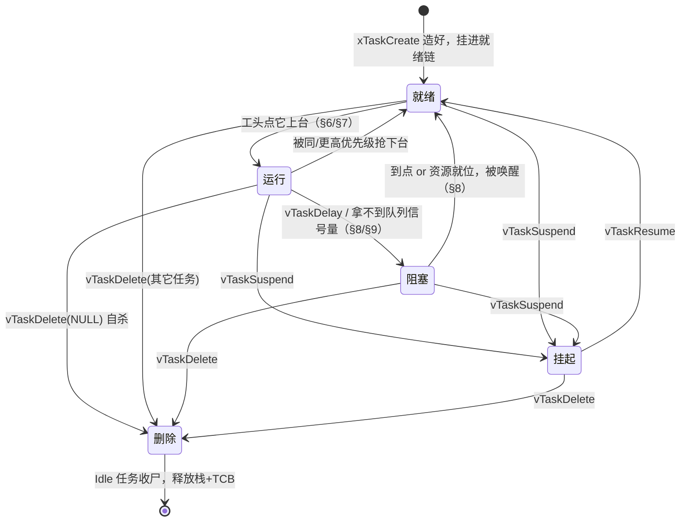

图里有三件事值得停下来说清楚——正好是初学者最容易混的三处。

### 18.3 阻塞 vs 挂起：都是"下台"，差在有没有"回来的条件"

这两个状态长得像——都不在就绪链、工头都不会点它上台。但它们是**两种完全不同的下台**：

- **阻塞（Blocked）是"带着条件等"**：`vTaskDelay(100)` 是等到第 100 个 tick、`xQueueReceive` 是等队列里来数据。这个条件被内核**记在册**——延时挂在 `pxDelayedTaskList`（按醒来时刻排序，§8），等资源挂在队列的等待链（§9）。**条件一满足，内核自动把它拎回就绪**，不需要任何人操心。这正是 §8 那句"**RTOS 的等待，是被登记在册的一种状态**"。
- **挂起（Suspended）是"无条件按停"**：`vTaskSuspend` 不带任何条件，任务进了 `xSuspendedTaskList` 就**再没有任何自动事件能把它捞出来**——哪怕它等的队列来了数据、哪怕它 delay 的时刻早过了，工头都当它不存在。**只有另一个任务显式喊 `vTaskResume`，它才回到就绪。**

一句话记死：**阻塞是"我等一个会到来的东西"，挂起是"我被拔了电，得别人来合闸"。** 前者内核替你盯着，后者内核撒手不管。

### 18.4 删除：一种"等着被回收"的终态

删除的完整机制——为什么"自杀"只能做一半、空闲任务如何择机收尸、栈和 TCB 何时才真正还给 heap_4——我们已经在 **§5** 手撕过了，这里只把它**放回全景**：`vTaskDelete` 把任务挂进 `xTasksWaitingTermination`（又是"换状态 = 换链表"），从此它不再被调度；真正回收内存的，是空闲任务某次跑到的 `prvCheckTasksWaitingTermination`。

所以在这张全景图里，**删除同样是"挂在某张链表上"的一种状态**——只不过这张链表是**终点站**：下一步不是回就绪，而是被抹去。五种状态至此收齐：运行、就绪、阻塞、挂起，加这一个终态。

### 18.5 把一生连起来读

现在回看 §18.2 那张图，它其实就是本章前十七节的一条总索引：

- **造出来**（§4）→ 进就绪链，等工头点名；
- **上台/下台**（§6、§7）→ 在运行↔就绪之间被 PendSV 搬来搬去；
- **主动等**（§8、§9、§10、§11）→ 掉进阻塞，条件满足再被拎回；
- **被按停/放行**（`vTaskSuspend`/`vTaskResume`）→ 进出挂起；
- **被抹掉**（`vTaskDelete` + Idle）→ 挂进终止链，等空闲任务把栈和堆还回去。

**任务的"一生"，就是它的 `xStateListItem` 在这几张内核链表之间搬家的一生。** 想通了这句，第六章最核心的世界观就立住了：FreeRTOS 调度的全部戏法，归根结底是**一组链表 + 一个哨兵 + 一次 PendSV**。下一节，我们拿一条真实的项目日志，把这套戏法完整地走一遍。

## 19 项目演练：一条日志串起全部机制

> （待写）一条项目日志把 §1–§17 的机制串成一条链，纯机制串讲，无排查。

## 20 结语：拆到了什么，接下来往哪走

一整章"手撕"下来，我们从一个任务的栈帧，一路撕到了调度、协作、中断、内存。收个尾——但这个尾，值得往回退一步、也往前看一步。

### 20.1 我们真正学到的，其实不止是 FreeRTOS

如果这一章你只记住了几个函数名，那太可惜了。真正拿得走的，是一套**看任何抢占式实时内核都通用的"世界观"**——把它拎成几条，你会发现每一条都不绑定 FreeRTOS：

- **对象 = 一个结构体 + 挂在身上的几块"牌子"。** 任务是 `TCB_t` + `xStateListItem`/`xEventListItem`（§2）；队列、事件组也都是"一个结构体 + 一两条链表"。认对象，先认它那几个字段。
- **状态 = 它此刻挂在内核哪张链表上。** 就绪、阻塞、挂起、终止，全是"换状态 = 换链表"（§3、§18）。没有一个神秘的状态机，只有"人在哪张表里"。
- **调度 = 从就绪集合里 O(1) 选出最急的那个。** 优先级位图 + 一条 CLZ（§6）。
- **切换 = 存一半寄存器、翻一个栈指针。** PendSV 手工存 R4–R11、硬件存另一半，PSP 一换，人就换了（§7、§16）。
- **等待 = 被登记在册的一种状态，不是空转。** 延时挂进有序链、等资源挂进等待链（§8、§9）。
- **协作 = 队列家族 + 事件组。** 点对点搬货用队列，一处发生多处关心用事件组（§9–§12）。
- **并发安全 = 关中断 / 挂调度器两把锁。** 红线、临界区、FromISR（§14、§15）。
- **内存 = 双栈软隔离 + 一个堆管家。** 没有 MMU，靠 MSP/PSP 分现场、靠 heap_4 管动态对象（§16、§17）。

> **手撕 FreeRTOS 的真正收获，是从此你不再"信"一个 RTOS，而是"看得穿"它。** 换任何一个内核，你都知道该去翻哪几个结构体、哪几张链表、哪一段汇编。

### 20.2 换一个 RTOS，甚至换到 Linux，你已经识字了

正因为学到的是通用世界观，**迁移的成本比你想的低得多**。下面这张表，把我们撕过的每一样，对到另外三家常见内核上——你会发现"同一套概念，只是各家换了个名字"：

| 概念（本章） | FreeRTOS | RT-Thread（国产） | Zephyr（工业/多架构） | Linux |
| --- | --- | --- | --- | --- |
| 任务 / 线程 | `TCB_t` | `rt_thread` | `k_thread` | `task_struct` |
| 就绪选择 | 优先级位图 + CLZ | 优先级位图 | 可插拔调度器 | CFS + 实时调度类 |
| 上下文切换 | PendSV | PendSV（Cortex-M） | 架构相关 | 架构相关 + 内核抢占 |
| 互斥 + 优先级继承 | `xSemaphoreCreateMutex` | `rt_mutex` | `k_mutex` | `futex` / PI-mutex |
| 事件 / 标志位 | 事件组 | `rt_event` | `k_event` | eventfd / 条件变量 |
| 内存隔离 | 双栈软隔离 | 同（可选 MPU） | 同（可选 MPU） | **真 MMU 硬隔离** |
| 配置 / 构建 | `FreeRTOSConfig.h` | Kconfig + scons | Kconfig + devicetree + west | Kconfig + Make |

看这张表最该体会两件事：

1. **越往右，"外壳"越重，内核那点核心思想却没变。** RT-Thread 和 FreeRTOS 几乎是"同款不同名"——一样的优先级位图、一样在 Cortex-M 上用 PendSV 换栈。Zephyr 把同样的原语，裹进了一套更像大工程的 Kconfig + 设备树 + 多架构构建里。到了 Linux，线程还是"有自己栈和现场的执行流"，但底下换成了**真正的 MMU 硬隔离**——这正是我们 §16 那条"8 位机 → Cortex-M 双栈 → MMU"谱系的最右端。**你在 §16 建立的那把标尺，一直能量到 Linux。**
2. **该往哪深钻，取决于你要解决什么。** 想吃透国产生态、上手快 → RT-Thread；要多架构、工业级配置管理 → Zephyr；要跑大型应用、文件系统、网络协议栈 → Linux（配 `PREEMPT_RT` 补丁做实时）。但无论哪条路，**你现在都"识字"了**：能读它的 TCB、能找到它的就绪队列、能看懂它怎么切上下文。

### 20.3 从"怎么实现"到"怎么用好、怎么证明它对"：下一章

这一章回答的是**"它怎么实现的"**（mechanism）。可真到你手上做一个产品，还有两个问题它没回答，而这正是 **Chapter 7** 的两条主线：

**其一，部署 —— 说白了就是配置与裁切。** 一个 RTOS 不是拿来即用，而是拿 `FreeRTOSConfig.h` **量身裁**出来的：`configUSE_PREEMPTION` 决定抢不抢占、`configMAX_PRIORITIES` 定几档优先级（§6）、`configTICK_RATE_HZ` 定挂钟多快（§8）、`configTOTAL_HEAP_SIZE` 和 heap_1~5 的选择定内存怎么管（§17）、`configUSE_MUTEXES` / `configUSE_EVENT_GROUPS` / `configUSE_TIMERS` 决定把哪些子系统**编进去、哪些裁掉**省下 RAM 和 Flash。本章你手撕过的每一个机制，在那张配置表里都有一个开关——**读懂了实现，才知道每个开关拨下去，究竟动了底层的哪根筋。**

**其二，分析 —— 说白了就是"凭什么保证它按时完成"。** §6 我们让"谁急谁先上"，可"这一组任务摆在一起，到底能不能全都赶在各自的截止期前跑完"，是内核实现之外、必须**算出来**的问题。这就是实时系统理论：**RMS / EDF** 两种调度策略、**利用率界**与**响应时间分析**这两套可调度性判据、以及作为输入的 **WCET（最坏执行时间）**；还有我们在 §11 已经手撕过的**优先级继承**，在那里会被放回"资源访问协议"（含**优先级天花板**）的完整理论框架里。换句话说，§6 的优先级、§11 的继承，都是 Chapter 7 分析理论**埋下的伏笔**——下一章把它们收成一套能拿去证明系统正确性的方法。

> **拆到这里，你已经把 FreeRTOS 从一个"黑盒库"变成了一张"看得懂的图纸"。** 下一章，我们拿着这张图纸，去做真正的工程：把它裁到刚好合身，再证明它跑得又对又准时。

## 21 速查表 + 附录

> （待写）核心机制速查表（对象/链表/关键函数一页纸）+ 子系统跳转表 + 扩展清单（软件定时器 / 任务通知 / 流缓冲 / tickless 属扩展，见官方文档）。
