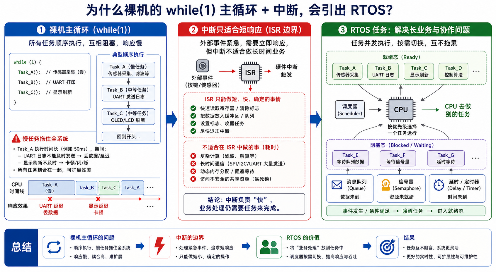
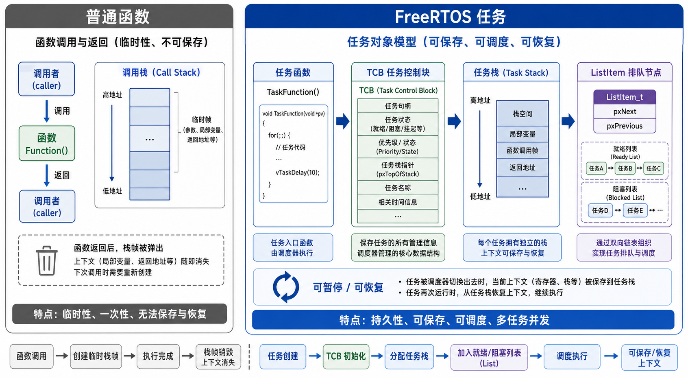
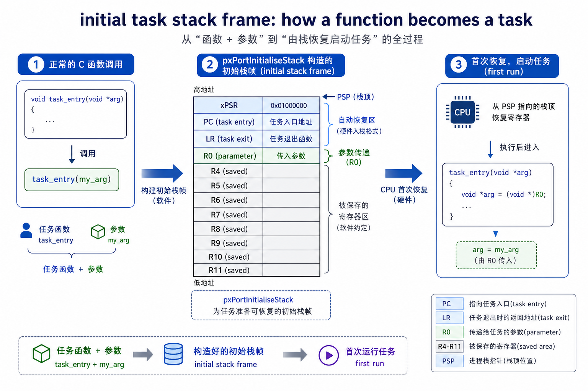
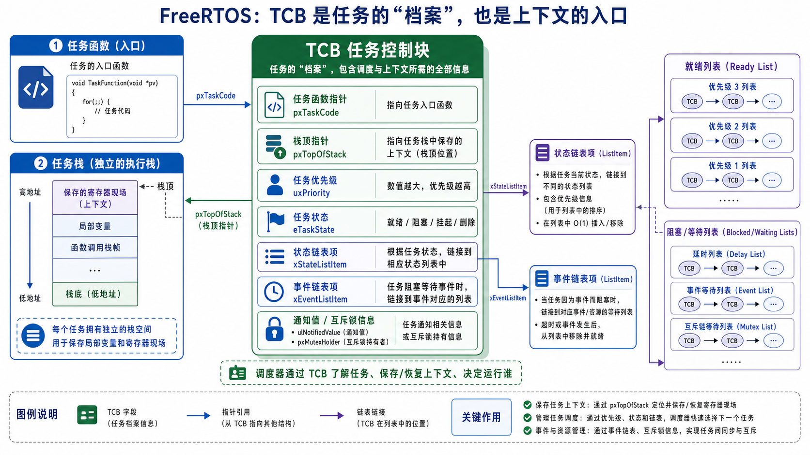
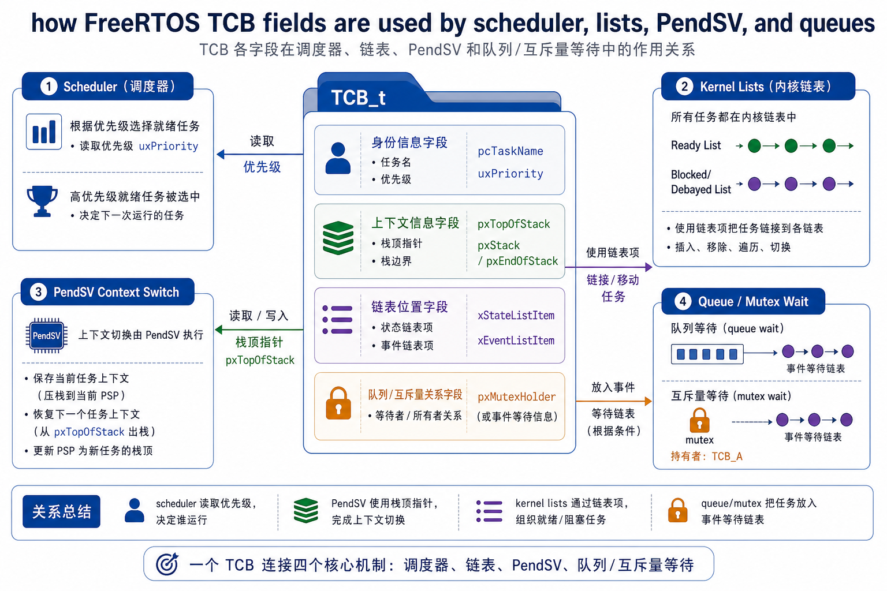
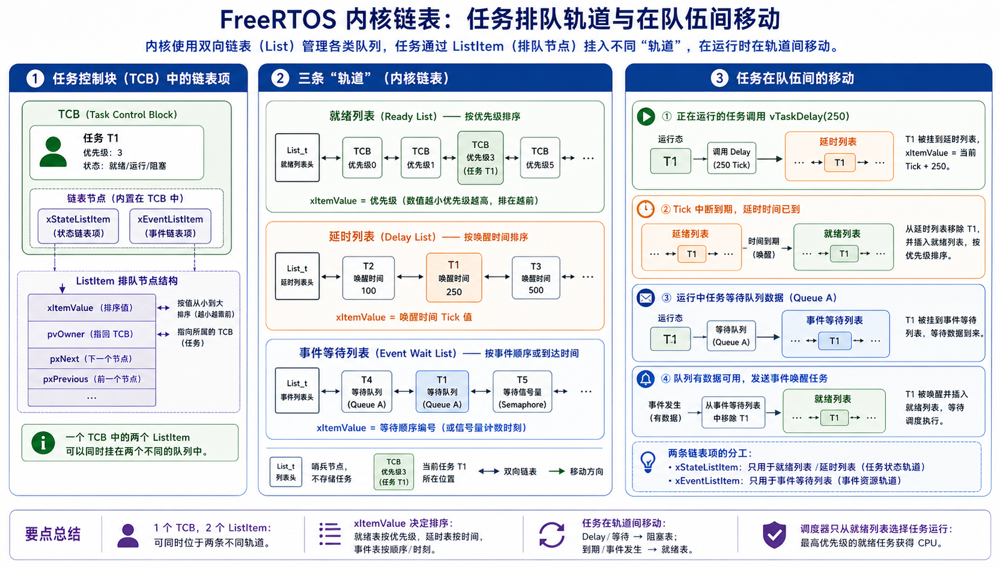

# Chapter 6 手撕 FreeRTOS：从一个人单干，到请个工头带班

> 本文件是第六章的可读性重写稿，逐节写入、逐节验收，定稿后替换正式章节。
> 主线比喻：四个脾气迥异的"人"（LED / SENSOR / COMM / LOG）共用一张工作台（CPU）。
> 裸机是一个老师傅把活全包、排队干；FreeRTOS 就是那个自己不下场、只管调度记账的工头。

## 0 开场：四个人，一张工作台

一块很小的板子上，同时住着四个"人"，脾气各不相同。

LED 是**报平安的**：每隔 50 ms 稳稳眨一下眼，告诉外面"我还活着"。它的活最轻，却最讲一个"稳"字——晚眨一下，别人就要怀疑板子是不是死机了。SENSOR 是**掐着表干活的**：每 20 ms 采一个数据，早一点晚一点都不行，采晚了这口数据就"馊"了。COMM 是**接线员**：平时闲着，外面一来命令就得立刻回话，慢半拍对方就当你掉线了。LOG 是**记流水账的**：把运行信息从串口一个字一个字往外吐，天生就慢，也天生不着急。

四个人单看都不难，难就难在**脾气对不上**：LED 要**稳**，SENSOR 要**准**，COMM 要**快**，LOG 天生**慢**。

| 工人 | 节奏 | 它最在乎的证据 | 将来对应的 FreeRTOS 机制 |
| --- | --- | --- | --- |
| LED | 固定周期、动作轻 | 翻转时刻稳不稳 | Delay、就绪列表、调度 |
| SENSOR | 固定周期、要数据新鲜 | 采样点漂没漂 | vTaskDelayUntil、任务栈、队列 |
| COMM | 外部事件驱动、响应压力大 | 从收到事件到回话的耗时 | 优先级、队列、PendSV |
| LOG | 慢 I/O、后台处理 | 队列积压、单次输出耗时 | 队列、互斥锁、低优先级任务 |

现在问题来了：一颗单核 MCU，同一时刻只有**一双手**。这四个脾气不一的人，怎么共用这一双手？

### 0.1 裸机：一个老师傅单干，什么活都排成一队

裸机的答案很朴素——**找个老师傅，把四样活全包了**，排成一队，一件接一件地做。这就是我们再熟悉不过的那个 `while(1)`：进循环，翻一下 LED，采一次 SENSOR，问问 COMM 有没有消息，再让 LOG 打印几行，然后回到开头，周而复始。

活少的时候，这样干挺好，甚至很好懂。可只要队伍里混进一个慢手，麻烦立刻就来：**排在慢手后面的人，只能干等**——哪怕他的活又急又短。老师傅正埋头替 LOG 写那一长串流水账的时候，LED 该眨的眼、SENSOR 该采的样，都只能乖乖排在后面。一个人慢，全场都慢，这就是裸机主循环解不开的死结：**一慢俱慢**。

嘴上说没用，跑一遍看。把四个人塞进一个 `while(1)`，让 LOG 偶尔"卡壳"一下，问题立刻现形。[`v0_bare_loop`](code/v0_bare_loop/demo.c) 只留一个现象：**LOG 一忙，LED 的心跳和 SENSOR 的采样时刻，会跟着一起被推后。**

```c
static void led_heartbeat(void) {
    if (now_ms >= next_led_ms) {
        printf("t=%03d LED toggle\n", now_ms);
        next_led_ms += 50;
    }
}

static int log_flush(void) {
    if (now_ms == 40) log_burst_left = 3;      /* t=40 起 LOG 开始忙 */
    if (log_burst_left > 0) {
        printf("t=%03d LOG flush chunk, main loop blocked 35ms\n", now_ms);
        log_burst_left--;
        return 35;                             /* 这一轮主循环被占住 35ms */
    }
    return 5;
}

int main(void) {
    while (now_ms <= 140) {
        led_heartbeat();
        sensor_sample();
        now_ms += log_flush();                 /* 时间被 log_flush 改写 */
    }
}
```

跑出来是这样（`log_flush` 在 `t=40` 起连卡三次，每次占住主循环 35 ms）：

```output
t=000 LED toggle
t=000 SENSOR sample
t=020 SENSOR sample
t=040 SENSOR sample
t=040 LOG flush chunk, main loop blocked 35ms
t=075 LED toggle
t=075 SENSOR sample
t=075 LOG flush chunk, main loop blocked 35ms
t=110 LED toggle
```

读这份输出，别盯代码，盯时间。前 40 ms 风平浪静，LED、SENSOR 都按自己的点准时出现。可从 `t=040` 起，LOG 进入忙碌期，每卡一次，主循环的表就往后跳 35 ms——于是 LED 本该在 `t=050` 附近的那次眨眼，被硬生生拖到了 `t=075`；SENSOR 也不再是稳稳的每 20 ms 一次。

请特别留意一件事：**LED 和 SENSOR 自己一行代码都没改，也一点没变慢，纯粹是被 LOG 连累的。** 它们和 LOG 拴在同一根绳上，绳子被 LOG 一拽，所有人跟着往后挪。这根被慢手拽长的绳子，画出来就是这样：



先找到 LOG 那一格，再看它后面撑开的一大段空白，最后看 LED、SENSOR 原来的节拍怎样跟着整体偏移。看懂这张图，你就攥住了整章的"病根"。后面要讲的任务、Delay、队列、优先级，没有一个是凭空造出来的名词——**它们全冲着治这一个病来的：把绳子解开，别让慢手拖住所有人。**

### 0.2 RTOS：请个工头，让该等的人先歇一会儿

那 FreeRTOS 是怎么治的？先说清楚它**不是**什么：它不是变魔术，把一双手变成四双手。单核 MCU 同一时刻仍然只有一个人在台上，这点 RTOS 改不了，也没打算改。

它做的是另一件更聪明的事——**请了个工头**。这工头自己不下场干活，只管两件事：

- 谁遇上"要等"（LED 等时间、COMM 等消息、LOG 等串口把字吐完），**准他先退到一边歇着**，把工作台腾出来给别人；
- 手里拿个小本子**记账**：谁在等、等什么、谁现在有资格上台、谁到点了该被叫回来。

就这么两件事，整个局面全变了。裸机里"谁在拖谁"是一笔糊涂账，藏在时间线里看不见摸不着；有了工头这个小本子，它变成了明明白白、能查能改的东西：

> 裸机的等待，是**整条主循环一起卡死**；RTOS 的等待，是**某一个人退到一边、被登记在册**的一种状态——CPU 不必陪他空耗，工头到点了自会把他叫回来。

这本"小账"，就是这一章要一页一页翻开的东西。**`任务`，是给每个人立的规矩**——允许他中途离场、回来接着干；**`Delay`、`队列`、`优先级`，是工头记账的不同栏目**——分别记着"谁在等时间""谁在等料""谁更急着上台"。至于 `TCB`、`就绪列表`、`PendSV`、`heap_4` 这些名字，会陆续登场，但你永远可以把它们拽回四个再具体不过的问题：这个人现在**为什么没上台**？到点了**怎么还没轮到他**？台上这位**为什么被人插了队**？内存看着够，**为什么建对象却失败了**？

读法上给一句建议：第一遍顺着往下读到"全景"那一节，只抓"现象 → 机制 → demo 证据"这条主干，源码链接看到名字就行、不必逐个点开；等主干立住了，再带着具体问题回头对账 `tasks.c`、`list.c`、`queue.c`、`port.c`、`heap_4.c`。四个人会一路跟到底——机制再多，也总能落回他们中某一位的某一次卡壳。

## 1 任务：一段能暂停、还能回来接着干的活

裸机的死结，在于所有活共用一条执行线。要拆开它，得先换一种眼光看"一件活"。

普通函数是**一次性**的：调用者进来，函数从头跑到尾，返回，控制权还给调用者，这一轮的局部变量、返回地址随调用链一起烟消云散。LED 若只是个普通函数，它每次都得从入口重来，上一轮做到哪儿、算到几，全不记得。

任务不是这样。LED 任务一旦进了自己的循环，就**长期活着**：翻转一下 LED，调用 Delay 主动让出工作台；等时间到、班组长再选中它，它不是从整个程序开头重启，而是**从让出的那个点后面接着走**。这个"能从原地接着走"，正是任务栈和上下文切换要解决的事。

一句话先钉住：**任务是一段能被暂停、保存、恢复的执行流。** 后面所有字段和源码，都绕着这句话转。

普通函数的现场跟着调用链走，任务的现场跟着任务对象走——这个差别，决定了为什么要额外准备任务栈、TCB 和 PendSV。



图左边，普通函数跑完就回到调用者，现场随调用链消失；右边，任务在让出点附近把现场存进自己的栈，之后再从那里恢复。看起来只是多分了几块内存，工程含义却很大：**现场不再只有一份了。** 每个工人都有自己的一份，班组长把工作台交给谁的现场，台上就"变成"谁在干活。

### 1.1 每个任务先得有自己的一块现场

单核 CPU 同一刻只能干一件事，任务机制不是变出多个 CPU，而是给每个工作一块**自己的现场空间**：暂时不需要工作台就退下，需要继续时再被恢复。这样 LED 等时间的空档，SENSOR 可以采样；LOG 慢慢吐字的时候，COMM 不必陪它一起干耗。

这块现场，最小只要盯两个地址就够了：任务自己的**栈底**（stack base，这片现场归谁），和班组长将来要恢复的**栈顶**（top of stack，从哪儿把现场取回来）。[`v1_task_stack`](code/v1_task_stack/demo.c) 把这两个地址直接打出来，还顺手把"任务入口"和"参数"预先摆进了初始现场里：

```c
typedef struct {
    const char *name;
    TaskEntry entry;
    void *parameter;
    uint32_t stack[8];
    uint32_t *top_of_stack;
} MiniTaskStack;

static void initialise_stack(MiniTaskStack *task, const char *name,
                             TaskEntry entry, void *parameter) {
    task->name = name;
    task->entry = entry;
    task->parameter = parameter;
    task->top_of_stack = &task->stack[7];      /* 将来从这里恢复 */
    task->stack[7] = (uint32_t)(uintptr_t)entry;      /* 入口预先摆好 */
    task->stack[6] = (uint32_t)(uintptr_t)parameter;  /* 参数预先摆好 */
}
```

地址的具体数值每台机器都不一样，不用记；要看的是结构：

```output
init LED    stack_base=<addr> top=<addr> entry_slot=<entry> parameter_slot=<parameter>
init SENSOR stack_base=<addr> top=<addr> entry_slot=<entry> parameter_slot=<parameter>
scheduler restores LED stack
run task=LED parameter=heartbeat
scheduler restores SENSOR stack
run task=SENSOR period_ms=20
```

两个点：其一，LED 和 SENSOR 有各自不同的 `stack_base/top`，说明它们**不共用一份现场**；其二，"恢复 LED 栈"之后台上就是 LED，"恢复 SENSOR 栈"之后台上就是 SENSOR——入口和参数早就摆进了各自的初始现场，班组长恢复哪一份，谁就像"从那里开始运行"。

真实 Cortex-M 当然不会像 demo 这样直接 `led.entry()` 一调了事，它要靠寄存器、异常返回和栈帧来完成恢复。但 demo 把硬件细节先拿掉，只留下方向：**入口和参数摆进栈里，恢复对应现场，任务就像从那里活过来。**

### 1.2 任务栈里存的不只是局部变量

再往深一层问：如果 LED 在 Delay 之前有个局部计数值，恢复之后这个值居然还在，它到底藏哪儿了？答案不是"内核帮你记住了每个变量"，而是每个任务都有自己的栈——局部变量、函数调用链在这里，上下文切换时 CPU 要恢复的那组寄存器现场也压在这里。

所以**任务栈是双重身份**：既是 C 语言调用链的空间，也是内核恢复执行流的依据。任务被切走时，关键寄存器和返回现场被压进这片栈；被恢复时，CPU 再从这里把现场取回。也正因如此，任务里一个较大的临时数组、一段深调用、一次 `printf` 格式化，都会实实在在地吃掉栈水位——它们和"现场保存"共用同一片空间。

这也解释了写任务时那条最容易搞反的直觉：任务函数**不是**会被反复从头调用的普通函数。它进循环后长期存在，Delay 或阻塞只是让出工作台，从不把函数"重启"。把这一点想通，才会理解为什么栈水位要在**高峰路径**上盯——通信高峰、日志高峰、错误处理里，往往正是调用链最深、临时缓冲最大的时候。

### 1.3 回到源码：第一次现场是谁摆好的

demo 说明了任务要有自己的现场，回到 FreeRTOS 只追三个问题：第一次的现场在哪里摆好、谁去摆、摆好的栈顶交给谁记住。

把端口层的 `pxPortInitialiseStack()`（[port.c:202](reference/rtos_src/FreeRTOS-Kernel/portable/GCC/ARM_CM4F/port.c:202)）压成伪代码，它其实就是 demo 那几行的"硬件完整版"：

```c
top--;  *top = xPSR;             /* 213: 初始状态字 */
top--;  *top = task_entry;       /* 215: PC —— 任务第一条指令 */
top--;  *top = task_return_trap; /* 217: LR —— 任务不允许 return */
top -= 5;
*top = pvParameters;             /* 221: R0 —— 任务入口的第一个参数 */
top--;  *top = exc_return;
top -= 8;                        /* R4-R11 预留 */
return top;                      /* 230: 新栈顶，交给 TCB */
```

demo 输出里的三个词，逐一对得上真实源码：`entry_slot` 就是那个 PC，`parameter_slot` 就是 R0，`top` 就是最后返回、将来要被 TCB 记住的新栈顶。真实版本多处理了 xPSR、LR、异常返回和寄存器保存区，但主线证据始终是三个：**入口、参数、栈顶。**

谁来调用它摆现场？是创建任务时的 `prvInitialiseNewTask()`（[tasks.c:1816](reference/rtos_src/FreeRTOS-Kernel/tasks.c:1816)）：它先算好栈顶地址，再把入口、参数、栈顶交给端口层布置初始栈帧。摆好的栈顶最终落进 TCB 的第一个字段 `pxTopOfStack`（[tasks.c:377](reference/rtos_src/FreeRTOS-Kernel/tasks.c:377)）——它被特意放在结构体最前面，因为上下文切换的汇编要用最快的方式够到它。

| demo 里的动作 | FreeRTOS 源码里的证据 | 要理解的含义 |
| --- | --- | --- |
| `entry_slot = entry` | [port.c:215](reference/rtos_src/FreeRTOS-Kernel/portable/GCC/ARM_CM4F/port.c:215) 把入口放进初始 PC 位 | 第一次恢复现场，CPU 就落到任务入口 |
| `parameter_slot = parameter` | [port.c:221](reference/rtos_src/FreeRTOS-Kernel/portable/GCC/ARM_CM4F/port.c:221) 把参数放到 R0 位 | 任务入口第一次运行就能拿到 `pvParameters` |
| `return top_of_stack` | [port.c:230](reference/rtos_src/FreeRTOS-Kernel/portable/GCC/ARM_CM4F/port.c:230) 返回新栈顶 | 栈顶交给 `pxTopOfStack`，将来靠它恢复 |



这张图从左边的"材料"看起，别一上来就盯寄存器名：入口函数和参数先进初始栈帧，`top_of_stack` 再交给 TCB，最后回到调试器里检查入口地址、参数指针和 PSP 范围是否都落在该任务的栈内。

把这条线连上，**栈就从"一段数组"变成了"可恢复现场的入口"**，排查也有了具体抓手。任务如果第一次运行就 HardFault，第一反应不该只是"任务函数第一行写错了"——更稳的是回头核对初始现场：入口地址是否落在有效代码区、参数指针是否还有效、栈顶是否按端口要求对齐、PSP 是否落在任务栈范围内。这四个问题，每一个都比"任务没起来"更能在调试器里验证。

同样，当 LED 打了 `before delay` 却迟迟不见 `after delay`，也别急着下"函数没被再调用"的结论。LED 的调用链和局部现场还在它自己的栈里，Delay 只是让它离开就绪、把工作台让给别人；该追的是下面这几步到底断在哪：

| 看到的现象 | 先别急着下的结论 | 更稳的下一问 |
| --- | --- | --- |
| 有 `before delay`，没 `after delay` | LED 函数没被再次调用 | LED 是否从 delayed 回到 ready、现场是否被恢复 |
| 切换后局部变量错乱 | C 语言局部变量规则失效了 | 任务栈是否溢出、PSP 是否越界 |
| HardFault 停在恢复现场附近 | 一定是 PendSV 写错了 | 是否恢复了一份已经被破坏的栈 |

任务这一层立住了，下一节接着追一个更具体的问题：这块现场的栈顶到底被谁长期记着，任务名、优先级、在系统里的位置，又怎样围着同一个任务对象组织起来——那份"档案"就是 TCB。

## 2 TCB：内核给每个任务的档案袋

任务能被调度，前提是**内核得先认得出它、记得住它、还能移动它**。班组长手里，每个工人都对应一张档案卡：卡面写着名字，卡里记着他的工位在哪、活有多急、此刻在哪个区域待命。这张卡，就是 **TCB（Task Control Block，任务控制块）**。读它不用一上来背字段，先把它当成任务档案袋。

### 2.1 为什么不能只记住一个函数地址

上一节已经知道，任务不只是一段函数代码。麻烦在于：LED 和 LOG 完全可能用**同一个任务入口模板**，只是参数不同；SENSOR、COMM 也各带参数启动。如果内核只记得函数地址，它根本分不清"现在该恢复谁的栈""谁的优先级更高""谁正在队列里等着"。函数名还有个死穴——它看不出**当前状态**：一个入口叫 `comm_task` 写得再清楚，也说不出此刻它是在等数据、等时间还是已经 ready。

所以任务一进内核，就需要一份稳定资料把"某个入口函数"钉成"这个任务对象"。**TCB 要回答的四个问题，正好分成四组**：身份（它是谁）、现场（从哪里恢复）、调度（有多急）、位置（现在在哪个列表）。后面所有机制翻的都是这四组。



拿 LED 代进去复述一遍，图就落地了：**任务名**让调试器显示"这是 LED"，**栈顶**指向 LED 自己的现场，**优先级**决定它和 LOG、SENSOR 的竞争关系，**列表节点**说明它此刻在 ready、delayed 还是 event wait 里。能这么复述，TCB 就不再是一张字段清单，而是任务对象的证据中心。

### 2.2 四个字段先站出来

TCB 的最小形状看 [`v2_tcb`](code/v2_tcb/demo.c)，`MiniTCB` 故意只留四个字段，让身份、现场、调度、位置先各就各位：

```c
typedef struct {
    const char *name;          /* 身份：它是谁 */
    uint32_t *top_of_stack;    /* 现场：从哪里恢复 */
    unsigned priority;         /* 调度：有多急 */
    MiniListItem state_item;   /* 位置：挂在哪个列表 */
} MiniTCB;
```

```output
TCB name=LED     priority=2 top_of_stack=<addr> list_owner=LED
TCB name=LOG     priority=1 top_of_stack=<addr> list_owner=LOG
TCB is the scheduler handle: identity + stack + priority + list hook
```

四组信息压进一行：`name` 是身份，`priority` 是调度依据，`top_of_stack` 接上一节的任务栈，`list_owner` 预告这个任务将来会通过列表节点被挂进 ready、delayed 或 event wait——**上一节的栈和下一节的列表，就在 TCB 这里接上了头**。真实的 `TCB_t` 比这大得多（还要管配置项、运行统计、任务通知、mutex 优先级继承），但第一轮别贪，先确认这四类字段怎样撑起"任务是内核对象"。

同一个 LED 的 TCB，会被四种机制反复翻看：**创建**时被填好，**列表**移动时被挂到 ready/delayed，**调度**时被拿来比优先级，**PendSV** 切换时被取出栈顶。四个镜头看的是同一个对象，只是各取所需——这也解释了为什么这么多机制都要碰它。

### 2.3 回到 tasks.c：把字段接回使用它的机制

打开真实 `TCB_t`（[tasks.c:375](reference/rtos_src/FreeRTOS-Kernel/tasks.c:375)）最容易挫败——字段太多，个个都像很重要。**破解办法是不按声明顺序背，而是按"谁会读写它"分组**。和当前主线相关的就四组，其余配置字段先搁一边，等读到队列、mutex、任务通知再回补：

| TCB 字段 | 源码锚点 | 谁在用它 | 项目里能解释什么 |
| --- | --- | --- | --- |
| `pxTopOfStack` 现场 | [tasks.c:377](reference/rtos_src/FreeRTOS-Kernel/tasks.c:377) | PendSV、端口层 | 切换后从哪里恢复现场 |
| `xStateListItem` 位置 | [tasks.c:387](reference/rtos_src/FreeRTOS-Kernel/tasks.c:387) | ready/delayed/suspended 列表 | 任务此刻在哪里 |
| `xEventListItem` 位置 | [tasks.c:388](reference/rtos_src/FreeRTOS-Kernel/tasks.c:388) | queue/mutex/事件等待列表 | 任务在等哪个资源 |
| `uxPriority` 调度 | [tasks.c:389](reference/rtos_src/FreeRTOS-Kernel/tasks.c:389) | 调度器、mutex 继承 | 谁更该先拿到 CPU |

注意 `pxTopOfStack` 被特意排在结构体**第一个字段**（源码注释也强调了 THIS MUST BE THE FIRST MEMBER）——因为上下文切换的汇编要用最快的方式够到它。这不是随意的声明顺序，而是给切换路径留的近道。



读这张字段图，别从字段名往下背，**从外侧机制往回问**：PendSV 为什么要找栈顶、调度器为什么看优先级、Delay 为什么能移动任务、mutex 为什么能找到等待者。每一问都落回 TCB 的某一组字段，结构体就变成了任务对象。demo 里那个 `list_owner=LED` 也有真实出处：内核从列表里拿到的只是一个 `ListItem_t`，靠的是节点里的 **owner 指针**（创建时由 `prvInitialiseNewTask` 一并初始化）把列表项指回 TCB——这是"任务位置"回到"任务身份"的**回家路**。

有了这份档案袋，排查就有了固定入口。而 TCB 比普通业务结构体更值得警惕的一点是：**故障点常常不是破坏点**。PendSV 恢复现场时崩了，表面在切换，真凶可能是更早某个任务数组越界、把相邻 TCB 的栈顶字段写坏了。所以排查要沿时间往回看，也要按四组证据分开查：

| TCB 证据 | 能解释的问题 | 项目里怎样观察 |
| --- | --- | --- |
| 任务名 | 调试器里认出是谁 | 任务列表、日志前缀、Trace 名称 |
| 栈顶字段 | 恢复现场是否有根 | PSP 范围、栈水位、HardFault 现场 |
| 优先级字段 | 为什么被选中或被压住 | 调度日志、ready 集合、继承前后优先级 |
| 列表节点 | 任务到底在哪里 | ready / delayed / event wait 位置 |

**TCB 坏了，调度、列表、现场恢复会被一起牵连**，所以遇到"任务像随机失踪"的现象，要把 TCB 周边内存、栈溢出、数组越界、错误指针都拉进排查范围。下一节就顺着"列表节点"往下走：任务到底挂在哪里，为什么"它在哪个列表"比"它是不是卡住了"更有用。

## 3 内核列表：任务在系统里的位置地图

任务没输出，不代表它消失了。它可能在 **ready** 里等 CPU、在 **delayed** 里等时间、在 **event wait** 里等队列或锁。班组长的车间里有三块待命区，一个工人不上台，先看他站在哪块区，比笼统说一句"他没干活"有用得多。

### 3.1 先问"它在哪个列表"，而不是"它是不是卡住了"

任务不打印日志时，最容易脱口而出的是"任务卡住了"。这句话既不精确、也无从下手。**换成"它在哪里"，排查方向立刻分岔**：ready 的任务要看调度，delayed 的任务要看 Tick，event wait 的任务要看谁负责唤醒它。只说"卡住"，这三个方向会糊成一团。

内核列表记录的就是这个位置。**ready list** 表示任务已具备竞争 CPU 的资格，**delayed list** 表示它在等时间，**event wait list** 表示它在等队列、信号量、mutex 或其他事件。别把这里的"列表"当成数据结构课的链表题——重点是**位置语义**：一个任务在哪个列表，就说明它此刻因为什么理由能跑或不能跑。而**状态变化，本质上就是从一个列表移到另一个列表**。

这也回答了上一节的悬念：为什么 TCB 里要放列表节点。任务本体是 TCB，位置由 TCB 里的列表项挂到不同列表上——**对象和位置分开**，系统才能既知道"它是谁"，又知道"它在哪里"。



有了这张位置图，排查不运行的任务就不必到处猜：先找到任务对象，再看它挂在哪个列表；位置定了，才知道下一步该看调度、Tick、队列还是锁。这个顺序能避免一上来就翻一大堆无关源码。

### 3.2 位置变化就是列表移动

把任务当成会移动的卡片，[`v3_kernel_list`](code/v3_kernel_list/demo.c) 就干一件事：同一个任务离开一个列表、再进入另一个列表。

```c
list_insert_front(&ready, &led);
list_insert_front(&ready, &sensor);
list_insert_front(&ready, &log);

list_remove(&ready, &sensor);
list_insert_front(&delayed, &sensor);   /* SENSOR 去等时间 */

list_remove(&ready, &log);
list_insert_front(&event_wait, &log);   /* LOG 去等事件 */
```

```output
move LED    -> ready
move SENSOR -> ready
move LOG    -> ready
ready: LOG SENSOR LED
remove SENSOR <- ready
move SENSOR -> delayed
remove LOG    <- ready
move LOG    -> event_wait
ready: LED
delayed: SENSOR
event_wait: LOG
```

**按"位置变化"读，不要按链表操作读**：每出现一行 `move`，就问这个任务离开了哪个集合、又进了哪个集合。翻成项目语言，末尾三行就是一张任务快照——LED 仍有运行资格，SENSOR 在等下一次采样时间，LOG 在等事件或资源。这张快照比"系统卡了"有用得多，因为它直接告诉你：下一步该找谁负责唤醒、谁负责调度。

### 3.3 回到 list.c：插入和移除就是位置变化

排查任务位置，不必先把 `list.c` 读成一门数据结构课。**只追三件事：谁把任务插进列表、谁把它移出来、owner 指针怎样从列表项回到任务**。

| 读什么 | 源码锚点 | 先抓住什么 |
| --- | --- | --- |
| 列表项结构 `ListItem_t` | [list.h:144](reference/rtos_src/FreeRTOS-Kernel/include/list.h:144) | `pxNext/pxPrevious/pxContainer` 说明它在哪个列表 |
| 列表结构 `List_t` | [list.h:172](reference/rtos_src/FreeRTOS-Kernel/include/list.h:172) | 一个列表怎样保存尾节点、索引和数量 |
| 有序插入 `vListInsert` | [list.c:139](reference/rtos_src/FreeRTOS-Kernel/list.c:139) | 任务或超时节点怎样进入某个位置 |
| 移除节点 `uxListRemove` | [list.c:217](reference/rtos_src/FreeRTOS-Kernel/list.c:217) | 任务怎样离开当前位置，列表数量怎样变 |

把源码压成动作骨架，`move`/`remove` 到底发生了什么就一目了然：

```c
/* insert：进入某个位置 */
item->pxContainer = list;        /* 记住"我在这个列表里" */
list->uxNumberOfItems++;

/* remove：离开当前位置 */
list = item->pxContainer;
item->pxContainer = NULL;        /* 清空归属 */
list->uxNumberOfItems--;
```

`move SENSOR -> delayed` 不是复制一个 SENSOR，而是**同一个任务对象的列表节点进入了 delayed list**；`remove LOG <- ready` 说明 LOG 离开 ready 候选集合，调度器不该再从 ready 里选到它。**链表函数本身很普通，它的意义全来自调用者**：Delay 调用 `vListInsert` 是为了按唤醒时间放进 delayed，队列调用它是为了把等待者挂到 event list，调度路径读 ready list 是为了找有资格的任务。

这里的 `pxContainer` 还是一条实用的排查线：节点在 ready list，它应指向那个 ready list；被移除后应清空。**如果一个任务看起来同时在两个位置，或已移除却仍被当成在列表里，通常就是重复插入、重复移除或内存破坏**——而且列表很少无缘无故坏，多半是任务对象、等待对象或内存边界先出了问题。

所以项目里说"任务 blocked"其实还不够。同样一句 blocked，COMM 可能在 `RX_QUEUE` 的接收等待列表上（外部事件没来），可能已被唤醒回 ready 却被更高优先级压住，也可能卡在 UART mutex 的等待链上（被资源 owner 挡住）。三种都让 COMM 暂时没输出，原因却南辕北辙。**把"卡住了"翻译成"在哪个列表"，就是从凭感觉调试走向按证据调试的起点**：

| 任务位置 | 看起来的现象 | 下一步证据 |
| --- | --- | --- |
| delayed list | 周期任务暂时没输出 | wake tick、当前 tick、到期是否回 ready |
| queue event list | 消费者等不到数据 | queue count、发送方是否运行、等待超时 |
| mutex event list | 高优先级任务被挡住 | owner、waiter、持锁时间、是否发生继承 |
| ready list | 有资格却没运行 | 优先级、同级轮转、当前任务、PendSV |
| 列表节点异常 | 状态混乱或崩溃 | TCB 完整性、越界写、栈水位 |

位置清楚了，源码就不再是一堆函数名，而是一条移动路线：进入列表、离开列表、回到 ready、再等调度。可再往前倒一步会发现一个更基本的前提——**任务得先"成为对象"、并被放进某个列表位置，后面的调度和唤醒才谈得上**。下一节就看这一步：任务创建，到底把函数、栈和 TCB 组装成了什么。
