# Chapter 7 实时系统理论与 FreeRTOS 裁切优化

---

# PART 1 · 实时系统模型

## 1 引言：为什么我们总是在踩坑

嵌入式软件行业有一个苦涩的常态：大多数工程师的职业生涯，从入职到退休（或许干不到退休），都在和三种幽灵搏斗——**死锁、饿死、爆栈**。

产品上线第一周，串口日志正常。第三个月，客户报告设备偶尔无响应。你排查了两周，最终在某个周五的凌晨三点发现：LOG 任务持有一个 mutex 在等 Flash 擦除完成的信号量，COMM 任务持着另一个 mutex 在等 LOG 释放，CONTROL 任务优先级最高但拿不到任何一个锁。三个任务彼此等待——经典死锁。你修了，但你不知道下一次它会在哪个操作序列下再次出现。

这不是你的代码写得不好。这是你缺少一套**能在设计阶段就证明"这事不会发生"的数学工具**。

如果你之前十几章学的是怎么造一台发动机——怎么切任务、怎么写 PendSV 汇编、怎么用链表管理就绪队列——那么这一章学的是怎么当发动机设计师。设计师不是靠"感觉这个活塞行程差不多"来做决定的。他手里有一套数学模型，能在地面上算出这台发动机在 20000 转时会不会爆缸，不用真的炸一次才知道。

**这就是本章的核心命题：构建即正确。** 在把代码烧进 MCU 之前，用数学证明它不会死锁、不会饿死、不会爆栈。

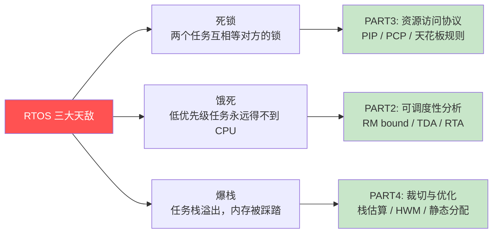
```mermaid
graph LR
    A["RTOS 三大天敌"] --> B["死锁<br/>两个任务互相等对方的锁"]
    A --> C["饿死<br/>低优先级任务永远得不到 CPU"]
    A --> D["爆栈<br/>任务栈溢出，内存被踩踏"]
    
    B --> E["PART3: 资源访问协议<br/>PIP / PCP / 天花板规则"]
    C --> F["PART2: 可调度性分析<br/>RM bound / TDA / RTA"]
    D --> G["PART4: 裁切与优化<br/>栈估算 / HWM / 静态分配"]
    
    style A fill:#ff5252,color:#fff
    style E fill:#c8e6c9
    style F fill:#c8e6c9
    style G fill:#c8e6c9
```

你可能会问：这些东西，不是"有经验的老工程师自然就知道"吗？

事实恰恰相反。大多数嵌入式工程师的成长路径是：先用 CubeMX 勾选 FreeRTOS，跑示例代码，遇到 bug，Google，修掉，继续跑。三年下来，他们积累的不是"理论"，是"踩过的坑"。他们知道 heap_4 比 heap_2 好用，但不知道为什么——因为他们被碎片坑过一次。他们知道"优先级别乱设"，但给不出可调度的数学证明——因为他们被优先级反转坑过一次。

这种"经验驱动"的路径有一个天花板：**你只能学会你踩过的坑。你没踩过的坑，你永远不知道。**

而理论——本章要教的这套东西——给你的是另一种路径：**你不需要踩坑，你只需要看懂公式。** 利用率 U 超过 69.3% 不一定不可调度，但你可以用 RTA 精确算出每个任务的响应时间，在 Excel 里就发现"sensor 任务的 deadline 会被 COMM 穿掉"——而不是等到生产线上出了 1000 台不良品才发现。

这就是"构建即正确"和"跑两天没崩"的本质区别。前者是数学的保证，后者是统计的运气。前者让你在设计阶段就知道边界在哪，后者让你在客户投诉后才知道。

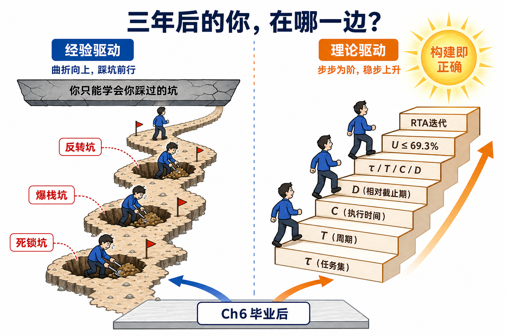

本章的结构就是把这三个天敌逐个击破。

**PART1 建模型。** 在动手分析之前，你需要一套精确的语言来描述"任务"。不是"sensor 任务每 500ms 采一次"这种人类语言——是 τ = (T, C, D, Φ) 这种数学语言。你手上 Ch6 的四人车间（LED、COMM、SENSOR、LOG）会被翻译成一个任务集 Γ，每个任务带着可测量的参数：周期 T、最坏执行时间 C、截止时间 D。

**PART2 解饿死。** 四个任务抢一颗 CPU，怎么保证没有人永远等不到？你学三种武器：RM bound（算总账——利用率低于 69.3% 就安全）、TDA（逐任务清账——精确到每个时间窗口内的 CPU 需求）、RTA（终极武器——连阻塞一起算）。学完之后，你会拿到一个数字：每个任务在最坏情况下的响应时间是多少微秒。这个数字如果小于它的 deadline——饿死在数学上不可能发生。

**PART3 解死锁。** 任务之间不止抢 CPU，还抢 mutex、抢 SPI、抢串口。当低优先级任务持锁、中优先级任务抢 CPU、高优先级任务等锁——优先级反转让你最高优先级的任务无限期阻塞。你学 PIP（Ch6 的 mutex 源码已经实现了它）和 PCP（FreeRTOS 没有但你知道为什么），学会把阻塞时间 B_i 从一个"任意大"压缩到一个"可证明的上界"。

**PART4 解爆栈——以及把所有理论变成 FreeRTOSConfig.h 里的数字。** 你在前三个 PART 学会了"证明系统可调度"。现在你要在真实硬件上兑现这个证明。栈设多大？不是"大概 512 字"——是 high water mark 实测×1.3。heap 用哪个？不是"默认 heap_4"——是分析你的分配模式后做出选择。tick 频率设多少？临界区能关多久中断？每一个 FreeRTOSConfig.h 的宏，都对应 PART1-3 公式里的一个变量。

**阅读建议：** 如果你现在坐在 Ch6 刚做完的位置上，一鼓作气读下去。PART1 是从工程语言到数学语言的翻译器——你会觉得有些地方"太学术"，但每当你这么觉得时，看旁边那段 Ch6 代码的注释，它会把你的脚重新拉回地面上。如果你已经有些工程经验，只是想查"FreeRTOSConfig.h 里的 configTICK_RATE_HZ 理论依据是什么"，可以直接跳到 PART4——但你会错过前三个 PART 里"为什么那个检验方法有这个结论"的推导。

好，下面从实时系统的模型开始。第一件事——搞清楚"实时系统"四个字到底在说什么。不是很快的系统，不是响应很及时的系统。**实时系统，是一个不准迟到的系统。**

---

##  2 实时系统：要并发，更要准时

### 2.1 两个价值数十亿美元的错误

在讲任何定义之前，我先讲两个真实故事。

**Therac-25（1985-1987）。** Therac-25 是一台医用放射治疗设备，由加拿大原子能有限公司（AECL）制造。它同时支持两种治疗模式：低功率的电子束模式和高功率的 X 射线模式。在 X 射线模式下，机器需要在电子束路径上插入一个金属靶和一套滤光器——这两样东西由机械臂控制。

问题出在软件上。操作员在电子束模式和 X 射线模式之间切换时，如果操作速度足够快（具体来说，在 8 秒内完成一组特定的按键序列），一个竞态条件（race condition）就会被触发：金属靶还没来得及移动到正确位置，电子束就已经以全功率射出。结果——患者接收到了一剂约为正常值 100 倍的辐射。

在 1985 到 1987 年间，至少有六起已知事故导致患者死亡或严重受伤。

请注意：这不是"跑得太慢"的问题。软件没有卡顿，CPU 没有超载。问题在于**两个并发操作之间的时序约束被打破了**。"机械臂到位"和"电子束发射"之间，必须有一个确定的先后关系，并且在时间上不能重叠。但这个关系没有被保证。这是一个实时系统的失败——不是因为它不够快，而是因为它的确定性被破坏了。

**Ariane 5（1996 年 6 月 4 日）。** 欧洲空间局（ESA）的阿丽亚娜 5 号火箭在首次发射 37 秒后自动自毁。原因是什么？控制软件里的一行代码把一个 64 位浮点数强制转换成了 16 位有符号整数——而这个浮点数太大了，超出了 16 位有符号整数的表示范围（-32768 到 32767）。转换溢出，触发处理器异常，主惯性导航系统关机，备用系统因为相同的 bug 也同时关机，火箭失去姿态控制，启动自毁程序。

有趣的是，这个崩溃的软件子系统原本是为阿丽亚娜 4 号写的，被复用到阿丽亚娜 5 号上。问题是：阿丽亚娜 4 号的飞行轨迹中，那个大浮点数永远不会出现；但在阿丽亚娜 5 号上，它的水平速度比 4 号大得多，那个浮点数变得足够大、突破了 16 位的边界。

一个在旧平台上"正确运行了多年"的代码，在新平台上变成了自毁指令。不是因为有 bug——它在新平台上的行为，在数学上是完全确定的。问题在于**没有人分析过，这段代码在新的时序和物理参数下，是否仍然满足它需要满足的约束。**

> **两个事故共同揭示了一个事实：实时系统的失败，几乎从来不是因为"CPU 不够快"。它是因为"某些必须在规定时间之前完成的事情，没有在规定时间之前完成"——或者是因为"某些必须按特定顺序发生的事情，发生了顺序错乱"。**

Therac-25 的竞态条件是**逻辑时间的错乱**——两个事件之间的逻辑先后关系被破坏了。Ariane 5 的数据溢出是**物理时间的变化导致了一个从未被分析过的执行路径被激活**——这个路径上的某个操作，在旧平台上永远不会触及时序假设的边界，在新平台上却破了。

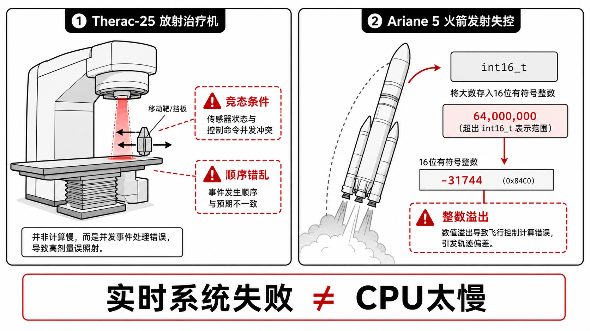

---

### 2.2 实时性 = 确定性，不是速度

你现在可以自己定义一个实时系统了：

> **实时系统是一个"正确性不仅取决于计算结果的逻辑值，还取决于结果被产生的时间"的系统。**

更直白地说：**你算对了，但算晚了——就是算错了。**

对通用计算来说，只要最后结果是正确的，花 1 秒还是 1 毫秒，用户可能抱怨一下但系统不出事。你在笔记本电脑上打开一个 Word 文档，loading 3 秒和 loading 50 ms 的差别是用户体验的差别——不是系统的功能性失败。

但是，你的 STM32 控制着一台电机，每 10 ms 需要更新一次 PWM 占空比。如果你的 PID 计算花了 11 ms——电机在最后那个 1 ms 里用的是一帧旧数据。如果这个偏差被放大（比如积分项在 11 ms 的间隙里多积了一圈），系统输出偏离的就不是 1%，而是越来越大的发散。

这不叫"慢了"，这叫**时序约束被破坏**。约束是什么呢？约束就是：

> **从传感器数据到达（释放时刻），到控制输出写入 DAC（完成时刻），间隔不能超过 10 ms。**

这就是截止时间（deadline）的直觉。你接下来会反复遇到这个词。先拿它跟速度概念做一个彻底的对比：

| 直观误解 | 正确定义 |
|---------|---------|
| "实时 = 快速响应" | 实时 = 在截止时间之前完成。如果截止时间是 10 秒，一个 9.9 秒完成的计算就是实时的。 |
| "CPU 越快越好" | CPU 够用即可。关键不是峰值性能，而是最坏情况下的可预测性。Cache miss、流水线停顿、总线争用都会让 WCET（最坏执行时间）变大——这些是实时系统分析中真正头疼的东西。 |
| "优先级 = 谁重要谁排前面" | 优先级 = 谁的截止时间紧谁排前面。一个"不重要但周期短"的任务，在 RM 理论下优先级反而更高。 |
| "跑两天没问题 = 系统正确" | 某些时序错误只在特定任务相位对齐时出现。你可能跑了一个月没出错，第 31 天——恰好三个任务的释放沿对齐了——deadline 就穿了。 |


---

### 2.3 硬实时、软实时、固实时：三种"不准迟到"的等级

想象你开车去机场赶航班。这个比喻帮你在三分钟内建立一个终生受用的分类体系。

---

**硬实时：刹车。踩晚了就是事故。**

你驾驶的这辆车，刹车系统是一个硬实时系统。当你踩下制动踏板的那一刻，刹车控制单元（ECU）必须在 50 ms 内完成以下全部操作：读取踏板位置传感器、计算制动力分配、驱动液压泵给四个轮缸加压、验证 ABS 传感器反馈。这一切必须在 50 ms 内完成——不是平均 50 ms，不是大多数时候 50 ms，而是**每一次**都必须在 50 ms 内完成。

如果在第 51 ms 才完成——碰撞已经发生了。

**在硬实时系统中，错过 deadline 被定义为系统失败。** 这种失败不是"性能差一点"，而可能是灾难性的：车毁人亡、核反应堆熔毁、起搏器停跳。硬实时的本质是一道二值开关：赶上了就是赶上了，没赶上就是灾难。没有灰色地带。

你回看 Ch6 的四人车间。如果 sensor_task 控制的是一个正在旋转的电机，它每 500 ms 必须完成一次采样和计算——超时就意味着下一帧控制输出用旧数据，电机转速偏离设定值。如果偏离累积到一定程度，电机飞车、机构撞毁。这就是硬实时。

---

**固实时：行李。人到了，箱子没到。**

现在你开车到了机场，顺利通过安检，登上飞机，航班准时起飞——你本人到达了目的地。但当你在行李转盘等了一个小时后，屏幕上显示："您的行李因装载系统故障未能随本航班到达，将安排下一班航班运送。"

你到达了目的地。旅行目的达成了。但行李没到——这意味着你今晚没有换洗衣物，明天的会议没有西装。这次旅行的价值大打折扣，但没有人受伤，没有飞机坠毁。**在固实时系统中，错过 deadline 的结果是"无用"的，但不会导致系统崩溃。**

工程中的典型例子：视频编码器。摄像头以 30 fps 采集画面，意味着每一帧有约 33 ms 的时间预算来完成编码。如果某一帧没能在 33 ms 内编完——这一帧数据就废了，你只能丢帧。播放器会显示前一帧的重复画面，画面会卡一下，但设备不会炸，系统继续跑。丢掉的那一帧是"固实时"的代价：没有灾难，但结果变得毫无价值。

在 Ch6 中，log_task 如果某次写入因为 SPI Flash 被占用而延迟了 300 ms 才执行——那条日志晚了 300 ms，但如果系统在这 300 ms 内没有崩溃，晚到的日志对调试仍然有参考价值。这种情况下 log_task 更接近固实时或软实时，而不是硬实时。

---

**软实时：座位。到了，行李也到了，只是座位没以前好。**

最幸运的一种赶航班结果：你赶上了航班，行李也准时到达了目的地。但登机时你发现，本来选的经济舱第一排（腿部空间大），因为值机系统处理慢了，被别人抢了，你被分配到第 28 排中间座位。你还是到了，行李也到了，只是体验差了一点。

**在软实时系统中，错过 deadline 会导致服务质量下降，但系统仍能继续运行，且结果仍有一些效用。**

工程中的典型例子：流媒体播放。偶尔掉一帧，画面卡一下，用户皱了皱眉，但继续看——系统没有崩溃。仪表盘上的油耗显示晚 200 ms 刷新，驾驶者几乎感知不到。网络心跳包晚发了 50 ms，服务器端加了一点抖动缓冲就吸收了。

---

**一个重要提醒：一个系统里，三种实时性可能同时存在。**

一辆汽车的 ECU 同时运行着数十个任务：

- **硬实时**：点火正时控制。晚了就爆震，发动机损坏。
- **固实时**：碰撞检测算法。气囊必须在碰撞后 15-30 ms 内展开——晚了气囊就白装了，因为它膨胀过程中乘员头部已经撞到了方向盘上。
- **软实时**：仪表盘油耗显示。晚 200 ms 刷新用户也感觉不到。车载娱乐系统的封面图加载慢了 500 ms——用户抱怨一句，但不影响安全。

一个合格的嵌入式工程师不会把几十个任务全标成"硬实时"——那是在浪费资源、给自己制造不必要的约束。你要做的是：**识别每个任务的真实时序需求，给它正确的分类，然后分配正确的工程资源。**

下面这张表帮你快速对照三种实时性：

| 特性 | 硬实时 | 固实时 | 软实时 |
|------|:---:|:---:|:---:|
| 错过 deadline 后果 | 灾难性 | 结果无用，但无损害 | 服务质量下降 |
| 典型场景 | 刹车、起搏器、飞控 | 视频编码、雷达跟踪、气囊 | 流媒体、仪表盘、在线游戏 |
| 是否必须保证 | 必须 100% 保证 | 概率性保证可接受 | 尽力而为（best-effort） |
| WCET 分析要求 | 必须做，且必须有上界 | 建议做 | 可选 |
| 调度策略验证 | 数学证明或穷举 | 模拟 + RTA | 经验 + 监控 |
| 机场比喻 | 刹车闸——踩晚了就撞 | 行李托运——人到了箱子没到 | 座位好坏——体验差但人到了 |


---

### 2.4 控制回路：实时系统的天然起点

好了。现在你知道了"实时不是快，是不迟到"。但为什么嵌入式系统天然就是实时的？答案藏在下面这张图里。

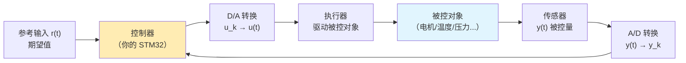
```mermaid
graph LR
    A["参考输入 r(t)<br/>期望值"] --> B["控制器<br/>（你的 STM32）"]
    C["传感器<br/>y(t) 被控量"] --> D["A/D 转换<br/>y(t) → y_k"]
    D --> B
    B --> E["D/A 转换<br/>u_k → u(t)"]
    E --> F["执行器<br/>驱动被控对象"]
    F --> G["被控对象<br/>（电机/温度/压力...）"]
    G --> C
    
    style B fill:#ffecb3
    style G fill:#e1f5fe
```

这是什么？如果你接受过正常的本科教育，不难看出：**这是一个典型的闭环控制系统**。

故事是这样的：你需要控制某个物理量（比如电机转速）。你有一个**参考输入 r(t)**——这是你想要的转速，比如 3000 rpm。**传感器**测量实际转速 y(t)，输出模拟信号，被 **A/D 转换器**采成数字量 y_k。**控制器**（你的 STM32）接收 y_k 和 r(t)，跑控制算法（比如 PID），算出一个控制输出 u_k。**D/A 转换器**把 u_k 变成模拟信号 u(t)，驱动**执行器**对被控对象施加影响。

这个循环需要以**固定频率**重复。为什么是固定的？因为控制算法里的微分项和积分项都依赖时间步长 Δt。如果 Δt 忽大忽小——这帧 10 ms，下帧隔了 50 ms——那么微分项（变化率 = Δe/Δt）和积分项（累积误差 = Σ e × Δt）都会失真。控制器输出会变得不稳定，甚至导致被控对象震荡。

这就是为什么**控制回路天然是周期性的**——不是因为"周期性听起来很厉害"，而是因为**数学上需要**。

用更通俗的语言来讲：控制器必须周期性地接收传感器数据并计算响应。如果计算没有在截止时间内完成，被控对象就得不到及时的刺激信号——电机继续用旧指令旋转、温度继续用旧设定值加热。在多帧累积后，这种延迟会放大成控制失稳。后果从"性能下降"到"灾难性"都有可能，取决于被控对象的物理特性。

这个控制回路，在实时系统理论里可以被建模为一个**周期任务**。传感器的每一次采样是一个作业（job），控制器对每次采样的处理是那个作业的执行，从采样到输出写入的允许时间就是截止时间。这正是我们在下一节要建立的精确语言——用 τ、T、C、D 这些符号，把"每 50 ms 采一次样、在 50 ms 内完成计算"这种工程直觉，翻译成可计算、可验证的数学模型。

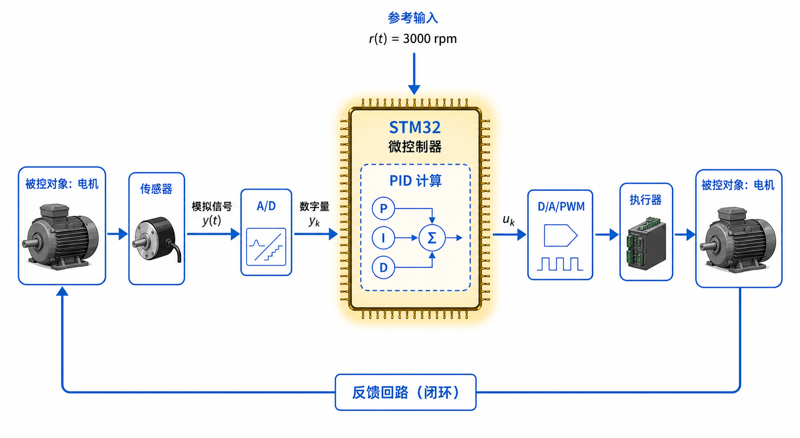

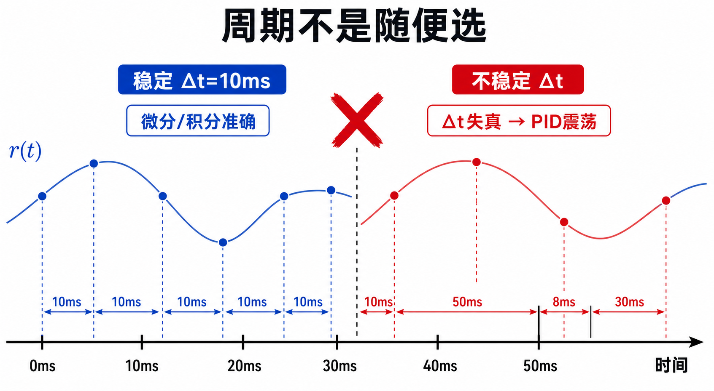

---

控制回路给了我们一个直觉——**有些任务必须周期性地执行，并且在固定时间内完成**。但这个直觉目前还是模糊的。什么叫"固定时间"？什么叫"周期性"？如果系统里有多个这样的任务，它们同时想做事情，CPU 只有一颗，怎么保证每个人都按时完工？要回答这些问题，我们首先需要一个精确的语言来描述任务——这就是下一节要做的：把"LED 每 500 ms 闪一次"这种人类语言，翻译成实时系统理论中的数学符号。


---

## 3 任务与作业：实时系统的基本单位

### 3.1 数学模型下的多任务

在 Ch6，你创造了四个工人。在你进入数学之前，让我先把它们重新摆在你面前——这一次，每个工人都带着正式任务模型的参数标签：

```c
// ╔══════════════════════════════════════════════════════════════╗
// ║  Ch6 四人车间 —— 统一参数版（τ₁~τ₄）                       ║
// ╚══════════════════════════════════════════════════════════════╝

// τ₁ LED 闪烁：T₁=50ms, C₁≈2ms, D₁=50ms, 使用 vTaskDelay
void led_task(void *pv) {
    while (1) {
        HAL_GPIO_TogglePin(GPIOD, GPIO_PIN_12);   // 翻转 LED (~0.001ms)
        vTaskDelay(pdMS_TO_TICKS(50));             // 相对延时 50ms
        // ↑ vTaskDelay: 从"调用时刻"开始算 50ms
        //   周期 ≈ 50ms + 执行时间（有微小漂移）
        //   适合 LED 这类无严格截止时间的任务
    }
}

// τ₂ COMM 通讯处理：T₂=200ms, C₂≈35ms, D₂=200ms, 事件驱动 → 近似周期
void comm_task(void *pv) {
    while (1) {
        uint8_t cmd[64];
        xQueueReceive(cmd_queue, cmd, portMAX_DELAY);  // 阻塞等命令
        comm_process(cmd);                               // 协议解析 ~35ms
        // ↑ 事件驱动: 释放时刻由外部命令到达决定
        //   近似模型: 取最小到达间隔 MIT=200ms 作为"周期"
    }
}

// τ₃ SENSOR 传感器采样：T₃=500ms, C₃≈60ms, D₃=500ms, 使用 vTaskDelayUntil
void sensor_task(void *pv) {
    TickType_t xLastWakeTime = xTaskGetTickCount();
    while (1) {
        uint16_t data;
        adc_sample(&data);                          // 采样 ADC + 滤波 ~55ms
        xQueueSend(sensor_queue, &data, 0);         // 非阻塞发送 ~5ms
        vTaskDelayUntil(&xLastWakeTime, pdMS_TO_TICKS(500));
        // ↑ vTaskDelayUntil: 严格 500ms 绝对周期
        //   即使某次作业超时，相位也不漂移
        //   适合传感器这类需要精确采样间隔的任务
    }
}

// τ₄ LOG 日志记录：T₄=1000ms, C₄≈100ms, D₄=1000ms, 事件驱动（带超时）
void log_task(void *pv) {
    while (1) {
        LogEntry entry;
        if (xQueueReceive(log_queue, &entry, pdMS_TO_TICKS(100)) == pdTRUE) {
            log_write(&entry);                      // 写 Flash 日志 ~100ms
        }
        // ↑ 事件驱动+超时: 有日志就写，100ms 没数据就去检查一次
        //   近似模型: 取最小到达间隔 MIT=1000ms 作为"周期"
    }
}
```

**为什么参数和你在 Ch6 看到的"感觉不一样"？** 你在 Ch6 玩这套代码时，`vTaskDelay` 和 `vTaskDelayUntil` 的参数可能是随手写的（500 ms LED、50 ms sensor）。但在真实的工程分析中，参数是由物理约束决定的：

- **LED 用 50 ms 周期**：因为 `vTaskDelay` 的相对延时使得实际闪烁周期 ≈ 50 ms + 执行时间。50 ms 是人眼刚好能分辨闪烁的边界——比这更快人眼看不出，比这更慢会觉得闪。
- **SENSOR 用 500 ms 周期**：传感器采样+滤波需要 60 ms WCET。500 ms 周期给了它充分的执行窗口，同时满足大多数环境监测的采样频率要求（2 Hz 够用）。
- **COMM 用 200 ms 周期近似**：协议处理需要 35 ms。200 ms 的最小到达间隔意味着每秒最多 5 条指令——对于大多数串口通讯场景，这个频率是合理的。
- **LOG 用 1000 ms 周期近似**：Flash 写入是昂贵的操作——100 ms 的 WCET 说明每写一次需要擦除一个扇区。1 秒一次是典型的批量日志写入频率。


**本节最重要的思维转变**：你在 Ch6 写 `vTaskDelay(500)` 是因为"感觉 500 ms 差不多"。现在你要学会问"T=50 ms 够不够？C=2 ms 测量准确吗？D=T 合理吗？"——这就是从"写代码的人"到"证明系统正确性的人"的转变。

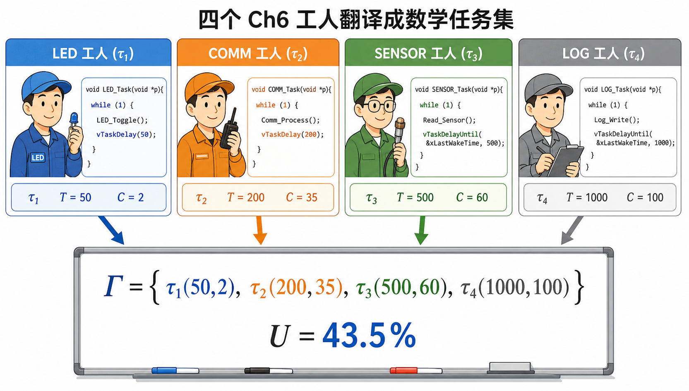


我们知道做数学建模的第一大要义就是规定参数，那么，我们规定一些形式化的参数来描述上面的代码（稍后我们会解释），这些参数是 Ch6 四人车间在正式模型中的"身份证号"——后面的每一个公式、每一张图、每一段代码分析，都以这些数字为准：

| 任务代号 | 任务名称   | $τ_i$ | $T_i$ (周期) | $C_i$ (WCET) | $D_i$ (相对截止时间) | $Φ_i$ (相位) | 释放方式                                       |
| :------: | ---------- | :---: | :----------: | :----------: | :------------------: | :----------: | ---------------------------------------------- |
|   LED    | LED 闪烁   |  τ₁   |    50 ms     |     2 ms     |        50 ms         |      0       | `vTaskDelay`                                   |
|   COMM   | 通讯处理   |  τ₂   |    200 ms    |    35 ms     |        200 ms        |      0       | `xQueueReceive(portMAX_DELAY)` → 近似周期      |
|  SENSOR  | 传感器采样 |  τ₃   |    500 ms    |    60 ms     |        500 ms        |      0       | `vTaskDelayUntil`                              |
|   LOG    | 日志记录   |  τ₄   |   1000 ms    |    100 ms    |       1000 ms        |      0       | `xQueueReceive(pdMS_TO_TICKS(100))` → 近似周期 |

**总利用率：**
$$U = \sum_{i=1}^{4} \frac{C_i}{T_i} = \frac{2}{50} + \frac{35}{200} + \frac{60}{500} + \frac{100}{1000} = 0.04 + 0.175 + 0.12 + 0.10 = 0.435 = 43.5\%$$

> **后文所有引用均基于此表。** 如果你看到"τ₁ 的 C 是 2 ms"，意思是 LED 任务的最坏执行时间是 2 ms。如果你看到"U = 43.5%"，后面的分析就围绕这个数字展开。


### 3.2 任务 τ：一串相同的"重复执行"

#### 直觉类比

想象一个工厂里的冲压机。冲压机本身是一个**任务**。它每次压一下是一个**作业**。这台冲压机从早到晚不停地压——只要工厂开着，它就在不断产生新的作业。每次压的动作是一样的（"相同的活动"），但每次压的金属片是不同的（"不同的输入数据"）。

> **A task is a sequence of identical activities, which are continuously executed until completion.**

每个活动叫**作业（job）**或**任务实例（task instance）**。

#### 形式化定义

一个任务 τ_i 由无穷多个作业组成：

$$\tau_i = \{\tau_{i,1}, \tau_{i,2}, \tau_{i,3}, ..., \tau_{i,k}, ...\}$$

其中 τ_{i,k} 表示任务 τ_i 的第 k 个作业。

#### Ch6 代码对应

用 Ch6 的 sensor_task 来看：

- `void sensor_task(void *pv)` 这个函数是**任务 τ₃**。
- `while(1)` 循环体的第 1 次执行是**作业 τ₃,₁**：读 ADC → 滤波 → 发队列。
- `while(1)` 循环体的第 37 次执行是**作业 τ₃,₃₇**：读 ADC → 滤波 → 发队列。
- 只要系统在跑，τ₃ 就在无限地产生新的作业。

#### 可视化

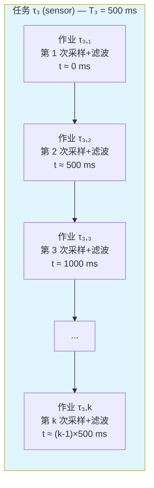
```mermaid
graph LR
    subgraph TaskSensor["任务 τ₃ (sensor) — T₃ = 500 ms"]
        J1["作业 τ₃,₁<br/>第 1 次采样+滤波<br/>t ≈ 0 ms"]
        J2["作业 τ₃,₂<br/>第 2 次采样+滤波<br/>t ≈ 500 ms"]
        J3["作业 τ₃,₃<br/>第 3 次采样+滤波<br/>t ≈ 1000 ms"]
        J4["..."]
        J5["作业 τ₃,k<br/>第 k 次采样+滤波<br/>t ≈ (k-1)×500 ms"]
    end
    J1 --> J2 --> J3 --> J4 --> J5
    
    style TaskSensor fill:#e1f5fe
```

**作业（job）是实时系统中最小的调度单位。调度器不是"选一个任务来跑"——它是"选一个作业来跑"。** 只不过在 RM 固定优先级调度下，同一任务的所有作业优先级相同，所以看起来像是在调度任务。

在 FreeRTOS 中，**作业的释放**对应 `vTaskDelayUntil` 到时、任务从阻塞态移入就绪态的时刻。Tick 中断检测到延时到期 → TCB 从延时链表移到就绪链表 → 如果优先级高于当前任务 → PendSV 切换。从那一刻起，这个作业就可以被调度器选中执行了。

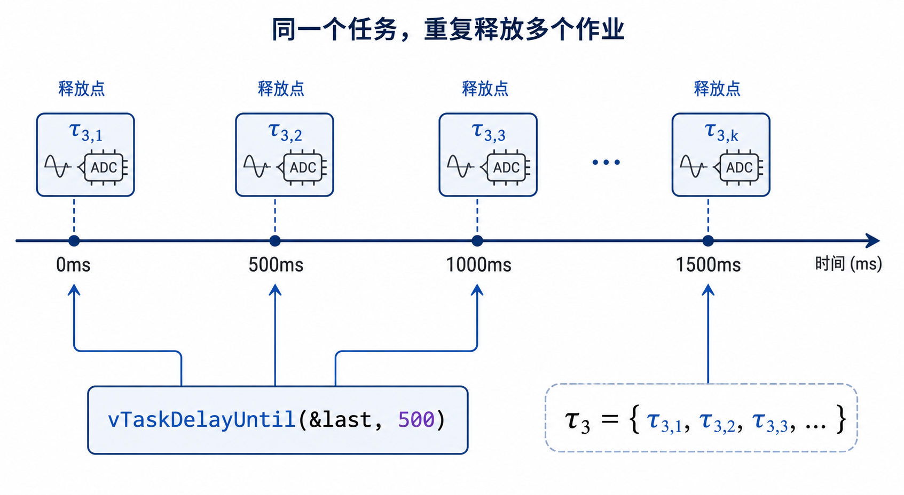

### 3.3 作业 job：最小的调度单位

#### 直觉类比

冲压机是**任务**，每次压是**作业**。但还有另一种理解方式——

你每天早上 8:00 打卡上班，下午 5:00 打卡下班——这一天的工作就是一个**作业**。第二天 8:00 又来一次——这是下一个**作业**。你这个人是一个**任务**，你的每一天是一份**作业**。你每天做的"工作内容"可能不同（今天写报告，明天开会）——这就是"相同代码，不同数据"。

#### 形式化定义

作业 τ_{i,k} 是任务 τ_i 的第 k 次执行实例。它由以下作业级参数描述：

- **释放时间** r_{i,k}：作业进入就绪状态的时刻
- **绝对截止时间** d_{i,k}：作业必须在此前完成
- **实际执行时间** c_{i,k}：这次作业真实花费的 CPU 时间（≤ C_i）

#### Ch6 代码对应

```c
// 在 sensor_task 的 while(1) 循环体内
// 每次循环体执行 = 一个作业 τ₃,k

// ══════ 作业 τ₃,k 开始 ══════
// r_{3,k} = xLastWakeTime（释放时刻：vTaskDelayUntil 刚返回）

dwt_start_measure();                    // 开始测量 c_{3,k}
adc_sample(&data);                      // ← 这是作业的实际工作
xQueueSend(sensor_queue, &data, 0);
uint32_t job_cycles = dwt_stop();       // c_{3,k} = job_cycles / 168e6

// ══════ 作业 τ₃,k 完成 ══════
// 此时 f_{3,k} = 当前 tick

vTaskDelayUntil(&xLastWakeTime, pdMS_TO_TICKS(500));
// 阻塞直到下次释放 r_{3,k+1} = r_{3,k} + 500 ms
// 然后 while 循环回到顶部 → 作业 τ₃,k+1 开始
```

#### 为什么区分"任务"和"作业"

因为调度器的决策是**作业级**的。当 tick 中断触发时，调度器问的问题是：

> "所有处于就绪态的**作业**中，谁的优先级最高？"

然后选那个作业的所属任务来跑。虽然 FreeRTOS 的 API 看起来是在操作"任务"（`vTaskDelay` / `vTaskSuspend`），但调度器实际选择的是"当前就绪的最高优先级**作业**"。

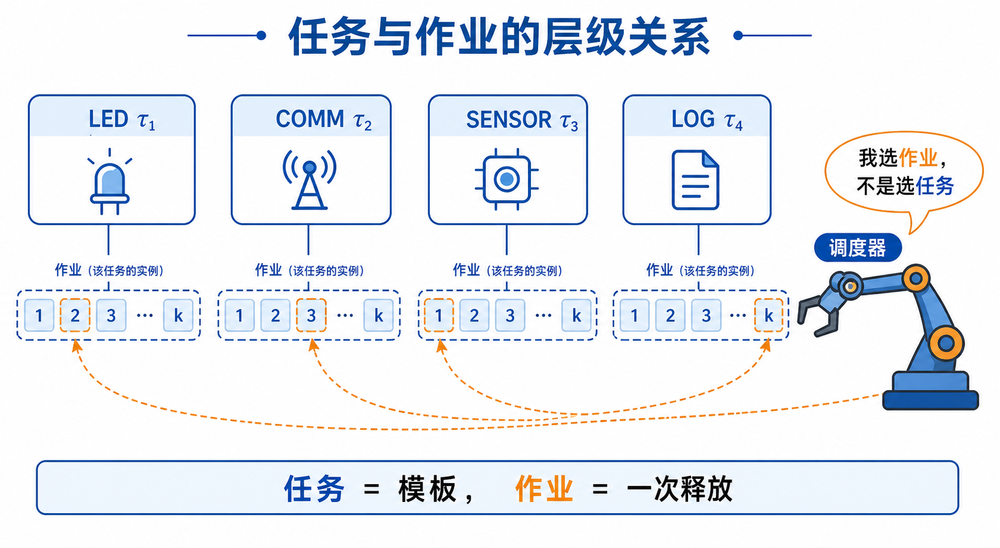

### 3.4 任务级参数 vs 作业级参数：不要混在一起

这是初学实时系统理论时最容易犯的概念错误——把两个级别的参数混为一谈。下面把它们彻底拆开。

**任务级参数（task-level parameters）**：对 τ_i 的**所有作业都相同**，是设计阶段确定的常量。

| 参数 | 符号 | 含义 | 在 Ch6 代码中的体现 |
|------|:---:|------|------|
| 周期 | T_i | 所有作业的释放间隔相同 | `pdMS_TO_TICKS(500)`——硬编码在 `vTaskDelayUntil` 中（τ₃） |
| 相对截止时间 | D_i | 所有作业从释放到截止的时间相同 | 隐式 = T_i（FreeRTOS 没有 D 概念） |
| WCET | C_i | 所有作业的最坏执行时间上界相同 | 由代码的最长路径决定，与具体数据无关 |
| 相位 | Φ_i | 偏置一次，决定第一次释放的位置 | 由 `xTaskCreate` 时刻决定（通常 Φ=0） |

**作业级参数（job-level parameters）**：**每个作业都可能不同**，是运行时产生的值。

| 参数 | 符号 | 含义 | 如何获取 |
|------|:---:|------|------|
| 释放时间 | r_{i,k} | 作业 k 进入就绪态的时刻 | r_{i,k} = Φ_i + (k-1)·T_i |
| 绝对截止时间 | d_{i,k} | 作业 k 必须在此之前完成 | d_{i,k} = r_{i,k} + D_i |
| 实际执行时间 | c_{i,k} | 作业 k 的真实 CPU 时间 | DWT cycle counter 测量，≤ C_i |
| 开始时间 | s_{i,k} | 作业 k 实际开始执行的时刻 | 取决于抢占情况，运行时才知道 |
| 完成时间 | f_{i,k} | 作业 k 实际完成的时刻 | s_{i,k} + c_{i,k} + 被抢占的时间 |
| 响应时间 | R_{i,k} | f_{i,k} - r_{i,k}（释放到完成的总时间） | 通常 ≫ c_{i,k}，因包含抢占和阻塞 |

#### 为什么要区分

因为——

- **调度器做决策依赖任务级参数**（优先级 = f(T_i)）。调度器不知道"这个作业需要多少时间"——它只靠优先级排序。
- **可调度性分析的结论是作业级的**：对每一个作业 k，必须 R_{i,k} ≤ D_i。
- 在 RTA 公式（PART2）中，我们计算的是 **max(R_{i,k}) over all k**——最坏响应时间。如果它 ≤ D_i，则所有作业都安全。

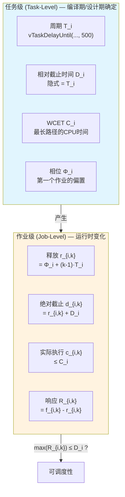
```mermaid
graph TD
    subgraph TaskLevel["任务级 (Task-Level) — 编译期/设计期确定"]
        T["周期 T_i<br/>vTaskDelayUntil(..., 500)"]
        D["相对截止时间 D_i<br/>隐式 = T_i"]
        WCET["WCET C_i<br/>最长路径的CPU时间"]
        PHI["相位 Φ_i<br/>第一个作业的偏置"]
    end
    
    subgraph JobLevel["作业级 (Job-Level) — 运行时变化"]
        R["释放 r_{i,k}<br/>= Φ_i + (k-1)·T_i"]
        AD["绝对截止 d_{i,k}<br/>= r_{i,k} + D_i"]
        AC["实际执行 c_{i,k}<br/>≤ C_i"]
        RESP["响应 R_{i,k}<br/>= f_{i,k} - r_{i,k}"]
    end
    
    TaskLevel -->|"产生"| JobLevel
    JobLevel -->|"max(R_{i,k}) ≤ D_i ?"| 可调度性
    
    style TaskLevel fill:#e1f5fe
    style JobLevel fill:#fff3e0
```

### 3.5 四人车间的任务参数表

好了，现在把 Ch6 的四个 `while(1)` 正式注册为实时系统理论中的四个正式任务 $\tau_1 \sim \tau_4$：

| 工人 | τ_i | T_i (周期) | C_i (WCET 估) | D_i (截止时间) | Φ_i | 释放方式 | 类型 |
|------|:---:|:---:|:---:|:---:|:---:|------|------|
| LED 闪烁 | τ₁ | 50 ms | 2 ms (GPIO翻转) | 50 ms | 0 | `vTaskDelay(50)` | 周期任务 |
| 通讯处理 | τ₂ | 200 ms (MIT) | 35 ms (协议解析) | 200 ms | 0 | `xQueueReceive(∞)` → 近似 | 零星任务 |
| 传感器采样 | τ₃ | 500 ms | 60 ms (ADC+滤波+队列) | 500 ms | 0 | `vTaskDelayUntil(500)` | 周期任务（精确） |
| 日志记录 | τ₄ | 1000 ms (MIT) | 100 ms (Flash写入) | 1000 ms | 0 | `xQueueReceive(100ms)` → 近似 | 零星任务 |

**形式化任务集：**

$$\Gamma_{Ch6} = \{\tau_1(50, 2), \tau_2(200, 35), \tau_3(500, 60), \tau_4(1000, 100)\}$$

（使用简写 τ_i(T_i, C_i)，隐含 D_i = T_i, Φ_i = 0）

**总利用率验算：**

$$U = 0.04 + 0.175 + 0.12 + 0.10 = 0.435 = 43.5\%$$

你的四个工人加起来只用了 CPU 的 43.5%。CPU 有一半以上的时间是空闲的。但这只是"CPU 够不够用"的第一层检验——在 PART2 中，我们会用 RTA 分析：即使 CPU 只用了 43.5%，某些任务的最坏响应时间也可能远超它的 WCET，因为高优先级任务和阻塞会产生累积效应。

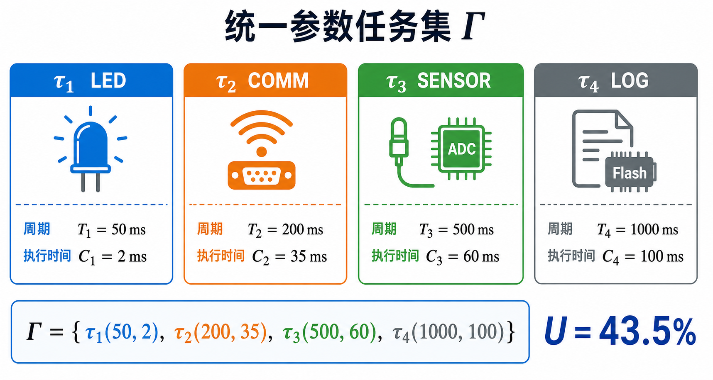

---

## 4 周期与相位：时间的两个维度

### 4.1 周期 T：两次释放之间的固定间隔

#### 直觉类比

想象你每天 8:00 上班打卡。如果公司规定"每天上班时间固定 8:00"，那么你的"周期"就是 24 小时。但——

如果有人周一早上堵车，8:15 才到公司——你当天的工作确实晚了 15 分钟开始（**开始执行晚了**），但周二早上仍然是 8:00 打卡。你周二不会因为"周一晚了 15 分钟"就把打卡时间改成 8:15。

这就是**绝对周期**——释放时刻不因某次的延迟而漂移。

#### 形式化定义

> **周期 T_i 是任务 τ_i 的两个连续作业释放时刻之间的固定间隔。**

第 k 个作业的释放时间：r_{i,k} = r_{i,k-1} + T_i（递推形式）；或 r_{i,k} = Φ_i + (k-1)·T_i（通项形式）。

#### Ch6 代码对应

来看 τ₃（SENSOR）——你用它观测最纯粹的周期概念：

```c
// τ₃ SENSOR: T₃ = 500 ms — 绝对周期
TickType_t xLastWakeTime = xTaskGetTickCount();  // r_{3,1} ≈ 0 ms
while (1) {
    // ===== 作业 τ₃,k 执行 =====
    adc_sample(&data);           // 实际执行时间 c_{3,k}
    xQueueSend(sensor_queue, &data, 0);
    
    // ===== 等待下次释放 =====
    vTaskDelayUntil(&xLastWakeTime, pdMS_TO_TICKS(500));
    // ↑ 内部做的事：
    //   xLastWakeTime += 500（增量变为 r_{3,k+1}）
    //   如果当前 tick < xLastWakeTime → 阻塞
    //   如果当前 tick ≥ xLastWakeTime → 立即返回（超时了）
}
```

**关键行为：** `xLastWakeTime` 每次增加 500 ms——不管"这次作业实际花了多久"。即使某次作业被 COMM 抢占、实际花了 80 ms 才完成，下次释放仍然是 r + 500 ms，不是 f + 500 ms。

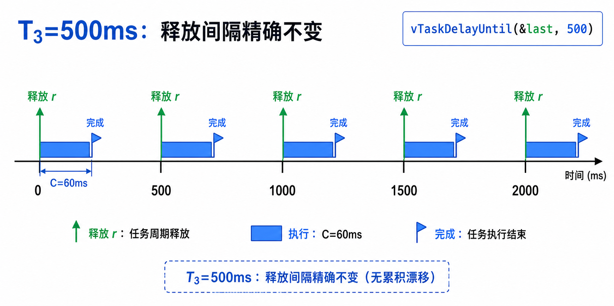

#### 周期 ≠ 执行间隔

这是一个关键细节：**周期 T_i 定义的是"释放频率"，不是"执行频率"。**

- 释放（release）：作业告诉调度器"我准备好了"的时刻。
- 开始执行：调度器选择这个作业的时刻。

两者之间可以有很大的时间差——如果这个作业优先级低，而高优先级作业一直在跑。

用 τ₄（LOG）来感受：它从 t=0 就释放了第一个作业。但由于 τ₁~τ₃ 都在忙，τ₄ 可能等了 97 ms 才第一次真正开始执行。但它的"释放"仍然是 t=0——不是"开始执行的时刻"。

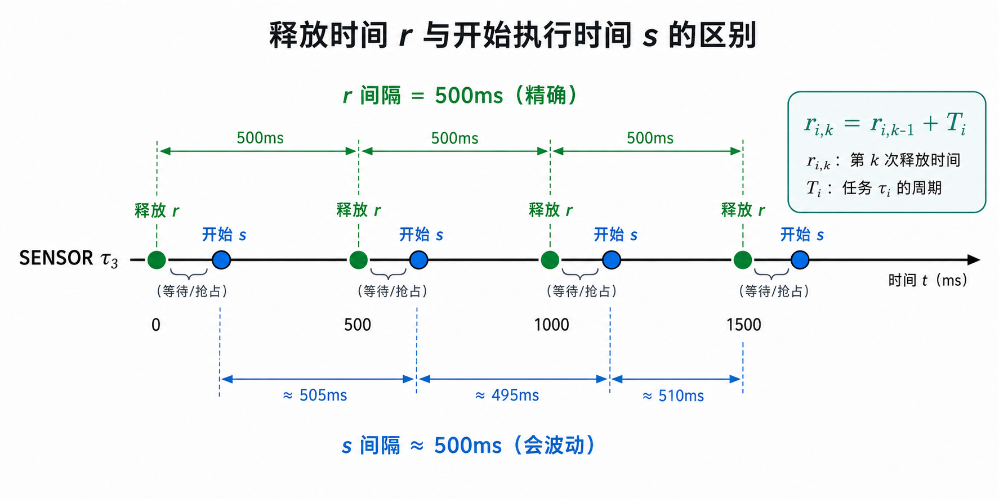

### 4.2 `vTaskDelay` vs `vTaskDelayUntil`：相对延时 vs 绝对周期

这是 Ch6 中最容易被忽视但实际影响最大的一个区别。我们把 τ₁（LED，用 vTaskDelay）和 τ₃（SENSOR，用 vTaskDelayUntil）并排对比。

#### 直觉类比

- **vTaskDelay** = 你吃一顿饭花 30 分钟，然后定一个"从吃完开始算，再过 5 小时吃下一顿"的闹钟。如果你这顿饭意外吃了 40 分钟（多嚼了几下），下一顿饭就晚 10 分钟。
- **vTaskDelayUntil** = 你定一个"每天中午 12:00 吃午饭"的闹钟。不管你今天是 11:55 还是 12:10 吃完上一顿，下次闹钟还是在 12:00 响。

#### 代码对比：用统一参数

```

```c
// ╔══════════════════════════════════════════════════════════════╗
// ║  对比实验：vTaskDelay vs vTaskDelayUntil                   ║
// ║  τ₁ (LED)：T₁=50ms，用 vTaskDelay                           ║
// ║  τ₃ (SENSOR)：T₃=500ms，用 vTaskDelayUntil                 ║
// ╚══════════════════════════════════════════════════════════════╝

// ─── τ₁ LED：vTaskDelay ──────────────────────────────────────
// 相对延时：从"调用时刻"开始算 50ms
void led_task(void *pv) {
    while (1) {
        HAL_GPIO_TogglePin(GPIOD, GPIO_PIN_12);   // 约 2 ms
        vTaskDelay(pdMS_TO_TICKS(50));             // ← 从此刻开始等 50ms
        // 如果 LED 翻转花了 2ms：下次释放 ≈ 52ms 后
        // 如果 LED 翻转花了 5ms（被抢占）：下次释放 ≈ 55ms 后
        // 结论：周期有漂移！
    }
}

// ─── τ₃ SENSOR：vTaskDelayUntil ─────────────────────────────
// 绝对周期：从"上次释放时刻" + 500ms
void sensor_task(void *pv) {
    TickType_t xLastWakeTime = xTaskGetTickCount();  // r₃,₁ = 0
    while (1) {
        adc_sample(&data);       // 约 55ms
        xQueueSend(..., 0);      // 约 5ms
        
        vTaskDelayUntil(&xLastWakeTime, pdMS_TO_TICKS(500));
        // 内部：xLastWakeTime += 500
        //   如果执行了 60ms：等到 500ms 释放
        //   如果执行了 120ms（超时）：xLastWakeTime 仍然是 +500
        //   下次释放仍然是 500、1000、1500... → 相位不漂移！
    }
}
```

#### 用时间线展示差异

假设 τ₁ 的第 1 次作业因为被 τ₂ 抢占而多花了 5 ms。

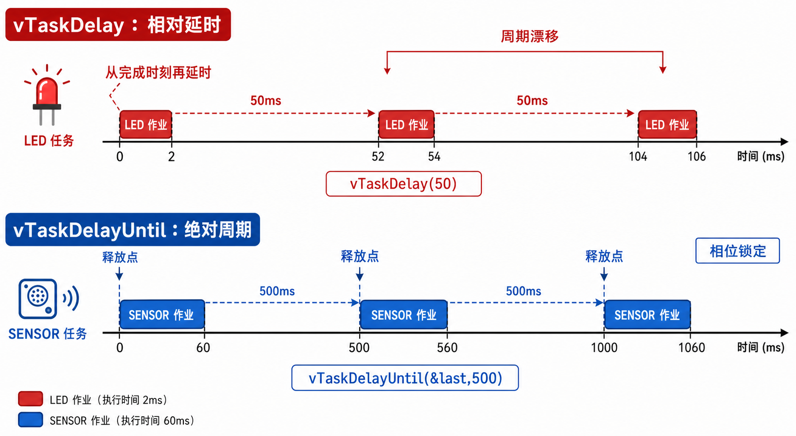

**关键发现：**

- τ₁（vTaskDelay）：第 1 次释放 t=0，第 2 次释放 t=52（晚了 2ms，因为算的是"完成+50ms"），第 3 次释放 t=104。每次都在漂移。
- τ₃（vTaskDelayUntil）：第 1 次释放 t=0，第 2 次释放 t=500（精确），第 3 次释放 t=1000。相位锁定，不漂移。

> **工程结论：**
> - **用 `vTaskDelay`** 当"我只要大致周期性、精确度不重要"——如 LED 闪烁、非关键轮询。
> - **用 `vTaskDelayUntil`** 当"我需要严格的采样间隔、相位不能飘"——如传感器定时采样、控制回路。
> - τ₁（LED）用 vTaskDelay → 周期有微小漂移但无伤大雅。
> - τ₃（SENSOR）用 vTaskDelayUntil → 严格 500 ms，即使某次超时也不影响下次释放。

### 4.3 相位 Φ：第一个作业什么时候释放

#### 直觉类比

三班倒的工厂。早班 8:00 上班，中班 16:00 上班，晚班 0:00 上班。三个班次都是 8 小时一个周期，但它们的"第一个班次的开始时间"不同。这就是**相位偏置**——同样的周期，不同的起始偏移。

#### 形式化定义

> **相位 Φ_i（或记作 ϕ_i）是任务 τ_i 的第一个作业的释放偏置时间。**

第 k 个作业的释放时间：

$$r_{i,k} = \Phi_i + (k-1) \times T_i$$


#### 为什么相位重要

**原因一：防止启动瞬态过载。** 如果系统有 10 个周期任务，全部 Φ = 0，那么 t=0 时刻 10 个任务同时就绪——CPU 瞬间需求 = Σ C_i。虽然稳态下 RM 可能调得过来，但启动瞬态可能让第一个超周期里的某些作业错过 deadline。

**原因二：临界时刻分析。** 在 RM 理论中，最坏情况通常出现在所有任务同时释放的"临界时刻"（critical instant）。如果你证明"Φ_i = 0 for all i"时系统可调度，那么任何其他相位组合也都可调度。这就是为什么理论分析中常假设 Φ_i = 0——**不是为了简化，而是为了找最坏情况。**

#### Ch6 代码对应

在本篇的统一参数模型中，所有任务 Φ_i = 0——任务一创建就立即开始第一个作业。但在工程中，如果你想给任务设一个非零相位：

```

```c
// 相位偏置示例：让 LOG (τ₄) 延迟 200ms 再开始第一个作业
void log_task_with_phase(void *pv) {
    vTaskDelay(pdMS_TO_TICKS(200));  // Φ₄ = 200 ms
    // 这样 LOG 的第一个作业不会和 τ₁~τ₃ 在 t=0 挤在一起
    
    TickType_t xLastWakeTime = xTaskGetTickCount();
    while (1) {
        // ...
        vTaskDelayUntil(&xLastWakeTime, pdMS_TO_TICKS(1000));
    }
}
```

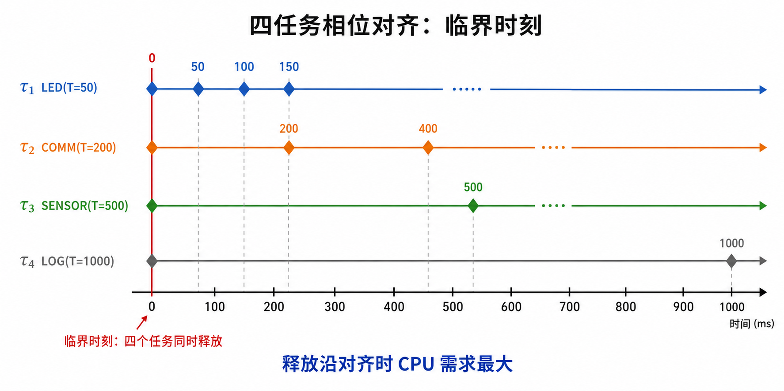

> 图中 t=0 时刻四条释放线对齐——这就是**临界时刻（critical instant）**。你的系统在这个时刻面临最大的 CPU 需求。如果此时能撑住，其他时刻也能撑住。

### 4.4 周期选择的工程约束

在真实工程中，T_i 不是"随便写一个数字"——它由物理约束和工程约束共同决定。

| 约束类型 | 例子 | 对 T_i 的影响 |
|:---|------|------|
| **物理约束** | ADC 采样率上限、传感器响应时间 | T_i 不能小于传感器的物理响应时间 |
| **控制理论** | PID 的 Δt 必须稳定，且满足 Nyquist 采样定理（T_s ≤ 1/(2·f_max)） | T_i 必须 ≤ 被控对象最高频率周期的一半 |
| **通讯协议** | UART 波特率 115200 → 每字节 ~87μs，一帧命令 ~1ms | COMM 的 MIT 由协议决定 |
| **存储介质** | Flash 擦除扇区 100ms、写页 1ms | LOG 的 C_i 决定其周期不能太短 |
| **tick 精度** | `configTICK_RATE_HZ = 1000` → 最小延时粒度 = 1ms | T_i 必须是 tick 的整数倍才能保证精度 |
| **人机交互** | 人眼闪烁融合频率 ~50Hz（20ms 周期） | LED 周期 < 20ms 时人眼看不出闪烁 |

> **你的 τ₁（LED）T=50ms 的选择**：50ms 意味着 20Hz 闪烁——人眼刚好能分辨，适合做状态指示。如果改成 10ms（100Hz），人眼会感觉"常亮"。如果改成 500ms（2Hz），闪烁太慢像"故障报警"。50ms 是一个工程上的合理选择。

---

## 5 释放与截止：作业的出生与死亡

### 5.1 释放时间 r：作业的"出生证明"

#### 直觉类比

你去餐厅点菜。服务员把你点的菜录入 POS 系统的那一刻——这是"释放时刻"。厨房可能在忙别的菜（高优先级订单），你的菜不会立刻开始做——但它已经进入了"等待队列"（就绪态）。

#### 形式化定义

**释放时间 $r_{i,k}$（release time）** 是作业 $τ_{i,k}$ 进入就绪态、可以被调度器选中的时刻。

对周期任务：

$$r_{i,k} = \Phi_i + (k-1) \times T_i$$

对 τ₃（SENSOR, Φ=0, T=500）：

- r₃,₁ = 0 + 0 × 500 = 0 ms
- r₃,₂ = 0 + 1 × 500 = 500 ms
- r₃,₃ = 0 + 2 × 500 = 1000 ms
- r₃,₁₁ = 0 + 10 × 500 = 5000 ms

#### Ch6 代码对应

```c
// 释放时刻 = vTaskDelayUntil 返回的时刻
// 即 xLastWakeTime 被更新为 "原值 + 500ms" 之后的时刻

TickType_t xLastWakeTime = xTaskGetTickCount();  // r₃,₁ 的基准
while (1) {
    // ─── 释放时机：vTaskDelayUntil 刚返回时 ───
    // 此刻 r₃,k 已到。调度器已经把这个作业从 Blocked 移到 Ready
    
    do_work();  // 作业开始执行（可能不是立即——如果被抢占）
    
    vTaskDelayUntil(&xLastWakeTime, pdMS_TO_TICKS(500));
    // xLastWakeTime += 500  → 设置下次释放 r₃,k+1 = r₃,k + 500
}
```

### 5.2 绝对截止时间 d 和相对截止时间 D

#### 直觉类比

你在 8:00 接到一个任务（释放），要求在 17:00 前完成（截止）。这里的 8:00 是释放时间 r，17:00 是绝对截止时间 d，从释放到截止的 9 小时是相对截止时间 D。

#### 形式化定义

- **相对截止时间 D_i**（relative deadline）：任务 τ_i 的一个作业从释放到必须完成的最大允许时长。**这是任务级参数——该任务的所有作业都有相同的 D_i。**
- **绝对截止时间 d_{i,k}**（absolute deadline）：任务 τ_i 的第 k 个作业必须完成的具体时刻。**这是作业级参数——每个作业不同。**

两者之间由一个简单的公式连接。

### 5.3 核心公式：$$d_{i,k} = r_{i,k} + D_i$$

> **绝对截止时间 = 释放时间 + 相对截止时间**

这是整个实时系统理论中使用频率最高的公式之一。它只有三个变量，但承载了所有可调度性分析的起点。

**用统一参数验证：**

对 τ₃（SENSOR, D=500）：

| 作业 k | r₃,k | D₃ | d₃,k = r + D |
|:---:|:---:|:---:|:---:|
| 1 | 0 ms | 500 ms | 0 + 500 = **500 ms** |
| 2 | 500 ms | 500 ms | 500 + 500 = **1000 ms** |
| 3 | 1000 ms | 500 ms | 1000 + 500 = **1500 ms** |
| 7 | 3000 ms | 500 ms | 3000 + 500 = **3500 ms** |

**对 τ₁（LED, D=50）：**

| 作业 k | r₁,k（vTaskDelay：近似） | D₁ | d₁,k |
|:---:|:---:|:---:|:---:|
| 1 | ≈ 0 ms | 50 ms | ≈ 50 ms |
| 2 | ≈ 52 ms | 50 ms | ≈ 102 ms |
| 3 | ≈ 104 ms | 50 ms | ≈ 154 ms |

注意 τ₁ 的 r 是"≈"——因为 vTaskDelay 的相对延时，释放时刻有微小漂移。好消息是这种漂移不影响可调度性分析，因为 τ₁ 的 C₁=2ms 远小于它的 D₁=50ms。

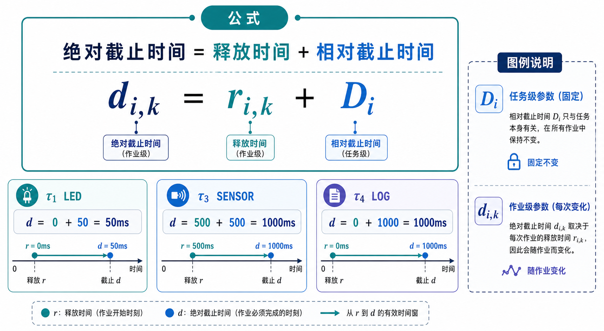

### 5.4 Gantt 图完整演示：释放、执行、截止

现在把 τ₁~τ₄ 的释放、执行、截止放在一张 Gantt 图上，用统一参数画出前 2000 ms：

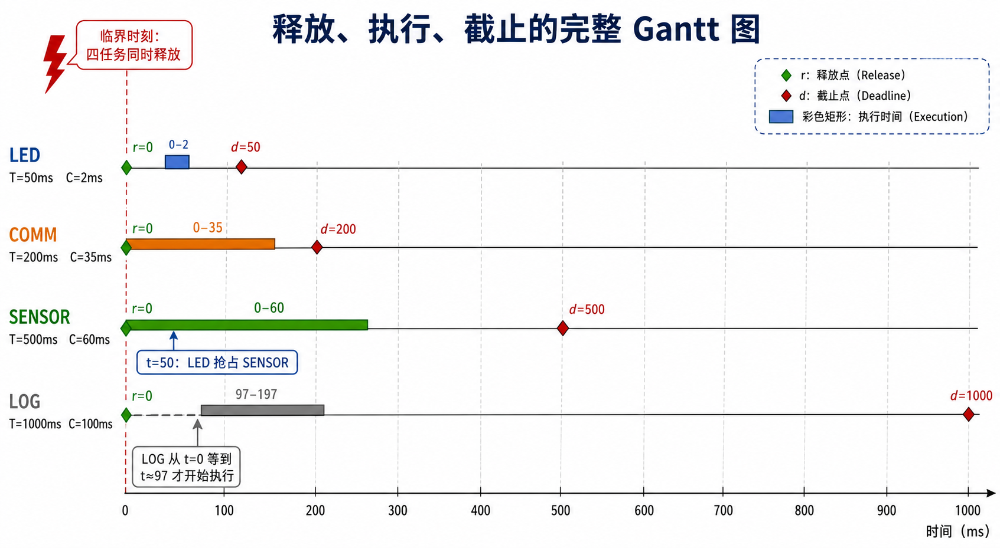

**观察这张图：**

1. **t=0**：四个任务同时释放（临界时刻）。τ₁ 优先级最高，先跑 2ms。然后 τ₂ 跑 35ms，然后 τ₃ 跑 60ms，然后 τ₄ 跑 100ms。
2. **τ₃ 的 D₁=500**：作业在 t≈97ms 完成，远在 500ms 截止之前——D₃ 是"不允许超过的最晚时刻"，不是"实际完成时刻"。
3. **τ₄ 的响应时间**：从 r₄,₁=0 到 f₄,₁≈197ms，响应时间 197ms。在 D₄=1000ms 内完成——但注意，τ₄"等了"97ms 才开始执行。低优先级的代价。
4. **τ₁ 的漂移**：注意 τ₁ 的释放是"≈"而不是精确的 50ms 倍数。r₁,₁=0, r₁,₂≈52, r₁,₃≈104。**漂移 = 执行时间 + vTaskDelay 相对于"调用时刻"的延时。** 因为 C₁=2ms 远小于 T₁=50ms，这个漂移对整体可调度性没有实质性影响。

### 5.5 D_i = T_i 的简化假设及其工程含义

在标准模型中，通常假设 D_i = T_i——即截止时间等于周期。在我们的统一参数中也成立：

- τ₁: D₁ = 50 = T₁ ✓
- τ₂: D₂ = 200 = T₂ ✓
- τ₃: D₃ = 500 = T₃ ✓
- τ₄: D₄ = 1000 = T₄ ✓

**物理含义：** 本周期的工作必须在下个周期开始前完成——否则下个周期的传感器新数据就到了，旧的计算结果已经失去意义。

**D_i < T_i 的情况：** 如果你需要更紧的截止时间。比如 τ₃ 采样后必须在 200ms 内完成处理（虽然采样周期是 500ms），那么 D₃=200ms < T₃=500ms。这意味着 τ₃ 需要更高的优先级（在 DM 调度下），因为它的截止时间更紧迫。

**D_i > T_i 的情况：** 如果你允许多个作业同时处于"未完成"状态。比如 τ₄ 允许 2000ms 的截止时间（虽然周期是 1000ms），这意味着第 1 个作业和第 2 个作业可能同时在系统中。处理起来比较复杂——不过在本篇统一参数中不涉及这种情况。

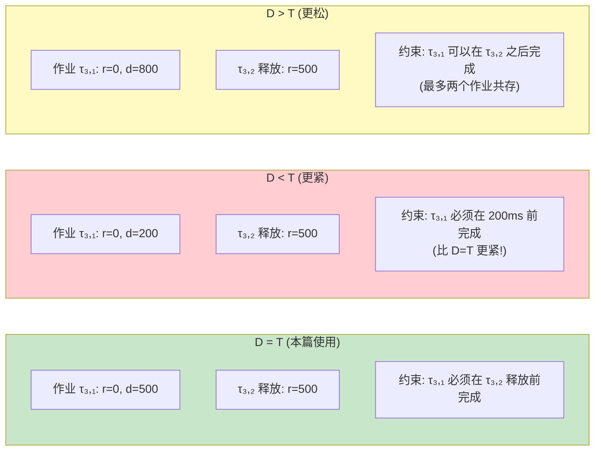
```mermaid
graph LR
    subgraph D_eq_T["D = T (本篇使用)"]
        A1["作业 τ₃,₁: r=0, d=500"]
        A2["τ₃,₂ 释放: r=500"]
        A3["约束: τ₃,₁ 必须在 τ₃,₂ 释放前完成"]
    end
    
    subgraph D_lt_T["D < T (更紧)"]
        B1["作业 τ₃,₁: r=0, d=200"]
        B2["τ₃,₂ 释放: r=500"]
        B3["约束: τ₃,₁ 必须在 200ms 前完成<br/>(比 D=T 更紧!)"]
    end
    
    subgraph D_gt_T["D > T (更松)"]
        C1["作业 τ₃,₁: r=0, d=800"]
        C2["τ₃,₂ 释放: r=500"]
        C3["约束: τ₃,₁ 可以在 τ₃,₂ 之后完成<br/>(最多两个作业共存)"]
    end
    
    style D_eq_T fill:#c8e6c9
    style D_lt_T fill:#ffcdd2
    style D_gt_T fill:#fff9c4
```

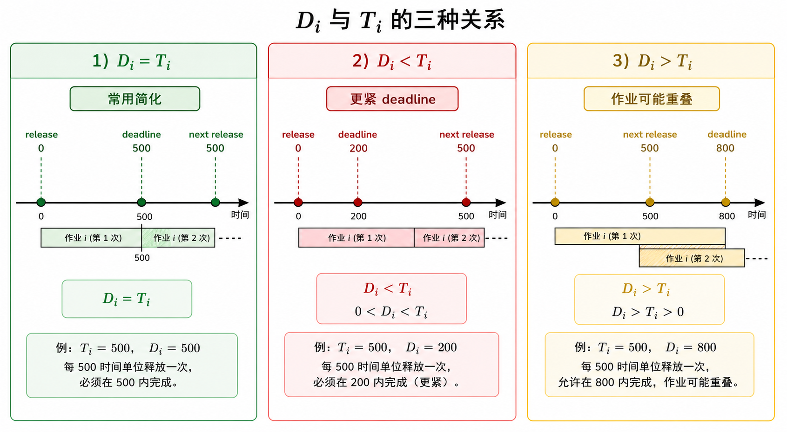

---

## 6 WCET 与测量：最难测的变量

### 6.1 C_i 的定义与关键限定

#### 直觉类比

想象你在写一个考试。考试时间 2 小时，但有人时不时打断你（监考老师说话、隔壁同学借橡皮）。如果没有任何打断，你**最快**可能 30 分钟交卷，**最慢**（最难的题目组合）可能 1 小时 45 分钟。

那个 1 小时 45 分钟就是你的 WCET——在"没有任何外部干扰、所有资源就绪"的条件下，**所有可能题目组合中最长的那套**需要的时间。

#### 形式化定义

WCET 的定义包含三个关键限定——这些限定直接决定了你在 RTA 公式里能不能直接用这个值：

> **C_i 是任务 τ_i 的一个作业在独占 CPU、所有资源就绪、没有任何外部干扰的条件下，完成执行所需的最长时间。** 它取的是所有可能执行路径中的最大值，不是平均值也不是"大多数情况"。

逐条来看：

1. **"独占执行"**：假设没有其他任务抢占它、没有中断打扰它。C_i 不包含抢占开销。这部分开销在 RTA 公式的 Σ⌈R_i/T_j⌉·C_j 项中单独计算。
2. **"资源就绪"**：不会被其他任务锁住资源、不会被阻塞。阻塞开销在 RTA 的 B_i 项中单独计算。
3. **"最大值——不是平均"**：所有可能执行路径中最长的那条的时间。如果你的代码里有一个 `if (rare_condition)` 分支，即使它一万次才触发一次，只要它可能触发，WCET 就必须按那条分支算。

#### 用统一参数标记每个 τ_i 的 C

| τ_i | C_i | 包含什么操作 | 为什么是这个值 |
|:---:|:---:|------|------|
| τ₁ (LED) | 2 ms | GPIO 翻转 + vTaskDelay 调用开销 | GPIO 操作极简单。2ms 已经包含了一点点余量（翻转本身 < 1μs） |
| τ₂ (COMM) | 35 ms | 协议解析（长帧）+ 数据处理 + CRC 校验 | 协议解析有循环遍历帧数据，最坏帧长度 64 字节 |
| τ₃ (SENSOR) | 60 ms | ADC 采样（多通道）+ 滑动平均滤波 + 队列发送 | 滤波循环 + 多通道采样是主要开销 |
| τ₄ (LOG) | 100 ms | Flash 扇区擦除 + 页写入 | Flash 操作是系统中最慢的单次操作 |

### 6.2 为什么 WCET 这么难测

在通用计算中，你不需要在意"这个函数最多跑多久"——慢了就慢了。但在实时系统中，WCET 是全部可调度性分析的输入。**C 估错 10%，RTA 偏 10%。估错 50%，RTA 可能告诉你"没问题"——然后系统上线后某一天 deadline 穿了。**

现代处理器让 WCET 分析变得困难，但 Cortex-M 有一个巨大的优势：

| 因素 | 通用 CPU 影响 | Cortex-M3/M4 上的实际情况 |
|------|------|------|
| **Cache** | L1/L2 cache miss → 几十到几百个周期的不确定性 | Cortex-M3/M4 **没有 cache** → 取指/取数时间确定 ✓ |
| **流水线停顿** | 分支预测失败 → 流水线清空 | M3/M4 是 3 级短流水线 → 最坏停顿 ≈ 3 cycles |
| **MMU / 虚拟内存** | TLB miss → 不可预测的页表遍历 | Cortex-M 没有 MMU → 地址平坦直接 ✓ |
| **Flash 等待周期** | 不适用 | STM32F407 @168MHz → 5 个 Flash 等待周期。**可预计算，确定的。** |
| **指令时序** | x86 不公开精确时序 | ARM **公开**了 Cortex-M 每条指令的周期数 ✓ |
| **总线争用** | DMA + 多总线主设备 | DMA 和 CPU 同时访问 SRAM → 最坏多等 1-2 个周期 |

> **Cortex-M3/M4 是 WCET 分析的"梦想平台"**——没有 cache 的不确定性，没有 MMU 的不可预测性，ARM 公开了每一条指令的周期数。相比之下，在 Cortex-A 或 x86 上做 WCET 分析要痛苦 10 倍。

### 6.3 三种 WCET 测量方法

下面是与统一参数配套的三种方法。我把它写成可以直接复制到你的工程中验证的格式。

```c
// ╔══════════════════════════════════════════════════════════════╗
// ║  方法一：DWT cycle counter —— 精度到单时钟周期            ║
// ║  适用：τ₃ (SENSOR) 的初步测量                              ║
// ╚══════════════════════════════════════════════════════════════╝

// DWT 初始化——在 main() 中调用一次，不要在任务循环里重复调用
void dwt_init(void) {
    CoreDebug->DEMCR |= CoreDebug_DEMCR_TRCENA_Msk;
    DWT->CYCCNT = 0;
    DWT->CTRL |= DWT_CTRL_CYCCNTENA_Msk;
}

// 在 τ₃ (SENSOR) 中测量 C₃
void sensor_task(void *pv) {
    uint32_t wcet_cycles = 0;
    
    TickType_t xLastWakeTime = xTaskGetTickCount();
    while (1) {
        uint32_t start = DWT->CYCCNT;
        
        uint16_t data;
        adc_sample(&data);
        sliding_filter(&data);
        xQueueSend(sensor_queue, &data, 0);
        
        uint32_t elapsed = DWT->CYCCNT - start;
        if (elapsed > wcet_cycles) {
            wcet_cycles = elapsed;
        }
        
        vTaskDelayUntil(&xLastWakeTime, pdMS_TO_TICKS(500));
    }
    // wcet_cycles 在无限循环中持续更新。通过调试器断点或串口定期输出查看。
    // 假设 168MHz 下测到 wcet_cycles = 8,232,000 → C₃_raw = 49 ms
}

// ╔══════════════════════════════════════════════════════════════╗
// ║  方法二：GPIO 翻转 + 示波器 —— 零软件干扰，最诚实        ║
// ║  适用：τ₂ (COMM) — 因为协议解析的WCET对指令trace敏感      ║
// ╚══════════════════════════════════════════════════════════════╝

#include "stm32f4xx_hal.h"

void comm_task_gpio(void *pv) {
    while (1) {
        uint8_t cmd[64];
        xQueueReceive(cmd_queue, cmd, portMAX_DELAY);
        
        HAL_GPIO_WritePin(GPIOB, GPIO_PIN_0, GPIO_PIN_SET);   // 拉高 PB0
        comm_process(cmd);                                     // 被测: 协议解析
        HAL_GPIO_WritePin(GPIOB, GPIO_PIN_0, GPIO_PIN_RESET); // 拉低 PB0
    }
}
// 将示波器探头钩住 PB0，触发模式设为"脉宽 > 某阈值"
// 观察高电平的最大宽度 → 这就是 C₂ 的实测值
// 
// 优点：
//   - 测量本身对被测代码几乎无干扰（BSRR 寄存器单次写入 ≈ 20ns）
//   - 示波器不遗漏任何一次执行（100% 覆盖）
//   - 真实环境、真实干扰（DMA/中断）→ 看得见"上界"而非"理想值"
//
// 缺点：
//   - 需要硬件（示波器 + 杜邦线）
//   - 需要一根空闲的 GPIO
//   - HAL_GPIO_WritePin 约 200ns 开销，对微秒级 WCET 可忽略，纳秒级测量需用 BSRR 寄存器直写

// ╔══════════════════════════════════════════════════════════════╗
// ║  方法三：静态分析 —— 航空级精度，耗费最大                  ║
// ║  适用：对 τ₃ (SENSOR) 的滤波循环做精确上界分析            ║
// ╚══════════════════════════════════════════════════════════════╝

// 步骤（以 τ₃ 的滑动平均滤波为例）：
//
// 1. 反汇编：
//    arm-none-eabi-objdump -d build/firmware.elf > disasm.txt
//
// 2. 找到 sliding_filter() 的汇编代码。
//    假设滤波窗口 N=16，循环体 10 条 Thumb-2 指令。
//
// 3. 查 ARM Cortex-M4 技术参考手册：
//    循环体核心指令（LDR/ADD/STR/CMP+BNE）约 12 cycles/次
//    循环体总计: ~12 cycles × 16 次 = 192 cycles
//
//    注意：STM32F4 的 ART 加速器会缓存指令，循环体在第二次迭代后
//    通常从 cache 取指，Flash 等待周期（5WS）不适用于热循环。
//    仅在首次进入和 cache 冲突时有等待开销。
//    保守估计：192 + ~50（cache miss 开销）= ~242 cycles ≈ 1.4 μs @168MHz
//
// 4. 加上 ADC 采样、队列发送 → 累积成最终的 C₃
//
// 5. 将 cycle 数除以主频，加上安全余量：
//    C₃_raw = total_cycles / 168_000_000 × 1000 ms
//    C₃ = C₃_raw × 1.2
//
// 商业工具：
//   AbsInt aiT (航空级，DO-178C 认证项目常用)
//   开源：OTAWA, Heptane
```

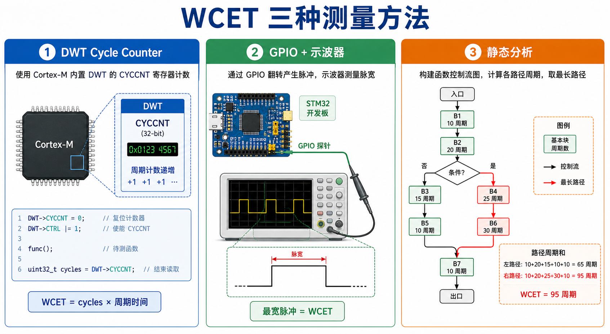

### 6.4 从测量值到 C_i：安全余量怎么加

#### 为什么测量值不能直接当 C_i 用

你跑了 10000 次 sensor_task，DWT cycle counter 告诉你最大值是 950 万 cycles（约 56.5 ms）。你能把这个数字直接填进 C₃ 吗？

**不能。** 原因是：

1. **你的 10000 次测试没有覆盖所有输入组合。** ADC 的值是连续的，但你测试时可能没遇到"16 个通道全部满量程跳变"这个最坏情况——它会让滑动滤波器的分支路径变长。
2. **你的测试环境可能不是最坏条件。** 温度、电压、Flash 等待周期配置——这些在测试时是正常的，但极端条件下（高温、低压）Flash 访问可能更慢。
3. **测试覆盖 ≠ 穷举覆盖。** 代码分支空间中，你跑过的路径只是冰山一角。真正的 WCET 可能在某个你从未测试过的数据组合上。

> **实测最大值 ≠ WCET。实测最大值是一个"下界"——真实 WCET 一定 ≥ 这个值。你需要在这个下界上加安全余量来逼近真实的 WCET。**

#### 安全余量规则

工程上最常用的做法：

$$C_i = \text{实测最大值} \times K_{safety}$$

其中 K_safety 的选择取决于你的系统和验证投入：

| 系统类型 | K_safety | 理由 |
|:---|:---:|------|
| **非安全关键系统、简单 MCU（Cortex-M3/M4 无 cache）** | **×1.2** | 无 cache 不确定性，指令时序公开，测量误差主要来自路径覆盖不全 |
| **安全关键系统、或复杂 MCU（Cortex-M7 有 cache）** | **×1.5** | cache 行为增加不确定性，需要更大的保守余量 |
| **航空/医疗/汽车功能安全（需要 DO-178C/ISO 26262 认证）** | **×1.5 + 静态分析验证** | 不仅加余量，还必须用商业工具（AbsInt aiT）做静态分析，测量和静态分析互相印证 |
| **原型验证阶段** | **×1.2** | 先快速迭代，确定参数范围，后续有需要再收紧 |

#### 统一参数任务集的 C_i 取值推演

假设你用 DWT cycle counter 在 STM32F407 @168MHz 上对四个任务分别跑了 10000 次测量：

| τ_i | 实测 max | 实测 max (ms) | K_safety | C_i (最终取值) | 备注 |
|:---:|:---:|:---:|:---:|:---:|------|
| τ₁ (LED) | 336,000 cycles | 2 ms | ×1.0 | **2 ms** | GPIO 翻转本身只需 ~1μs。但 τ₁ 的"完整作业"包括 `vTaskDelay()` 的 API 调用开销和调度器检查——这些操作涉及链表遍历、tick 比较，在最坏情况下可达数百微秒。这里的 2ms 不只包含 GPIO 翻转，而是保守地覆盖了整个 `while(1)` 循环体的最坏开销。|
| τ₂ (COMM) | 4,872,000 cycles | 29 ms | ×1.2 | **35 ms** | 29×1.2=34.8，向上取整。最坏协议帧处理 |
| τ₃ (SENSOR) | 8,232,000 cycles | 49 ms | ×1.2 | **60 ms** | 49×1.2=58.8，向上取整。ADC 多通道采样+滤波 |
| τ₄ (LOG) | 13,440,000 cycles | 80 ms | ×1.2 | **100 ms** | 80×1.2=96，向上取整。Flash 页写入是最坏路径 |

> **为什么 τ₁ 实测只 2ms 却不加 1.2× 余量？** 因为 τ₁ 的"实测值"本身已经极度保守——它的真正执行体（GPIO 翻转）在微秒级，余量来自于 vTaskDelay API 调用路径和调度器开销。如果把 2ms 再乘 1.2 得 2.4ms，但 2ms 相对 D=50ms 已经有 96% 余量，多乘无意义。**WCET 取值不是机械套公式——判断什么时候余量已经足够，是你的工程判断。**

#### 安全余量的渐进收紧策略

在项目生命周期中，你可以逐步收紧 C_i 的取值：

```
原型阶段：     C_i = 实测max × 1.5  ← 保守，快速启动
开发测试阶段： C_i = 实测max × 1.2  ← 更多测量数据，可以收紧
认证阶段：     C_i = 静态分析上界   ← 最精确，需要商业工具
```

**不要一开始就追求"绝对精确的 C_i"**——那会拖延项目进度。先用 1.5× 或 1.2× 上线 RTA 分析，然后把实测 WCET 监控（记录每次作业的 cycle count，报警超过阈值）作为运行时检测手段。如果系统跑了三个月，cycle count 最大值始终在初始测量值的 80% 以内——你可以考虑收紧 K_safety 到 1.15 或 1.10。

```c
// 运行时的 WCET 监控 —— 在开发阶段就嵌入
void sensor_task_with_wcet_monitor(void *pv) {
    TickType_t xLastWakeTime = xTaskGetTickCount();
    uint32_t wcet_max_observed = 0;
    const uint32_t wcet_alarm_threshold = 8400000;  // 50ms @ 168MHz
    
    while (1) {
        uint32_t start = DWT->CYCCNT;
        
        adc_sample(&data);
        sliding_filter(&data);
        xQueueSend(sensor_queue, &data, 0);
        
        uint32_t elapsed = DWT->CYCCNT - start;
        if (elapsed > wcet_max_observed) {
            wcet_max_observed = elapsed;   // 更新历史最大值
        }
        if (elapsed > wcet_alarm_threshold) {
            // WCET 超过预期的 50ms → 记录下来！
            // 这可能是之前测试没覆盖到的最坏路径
            log_wcet_violation(elapsed);
        }
        
        vTaskDelayUntil(&xLastWakeTime, pdMS_TO_TICKS(500));
    }
}
```

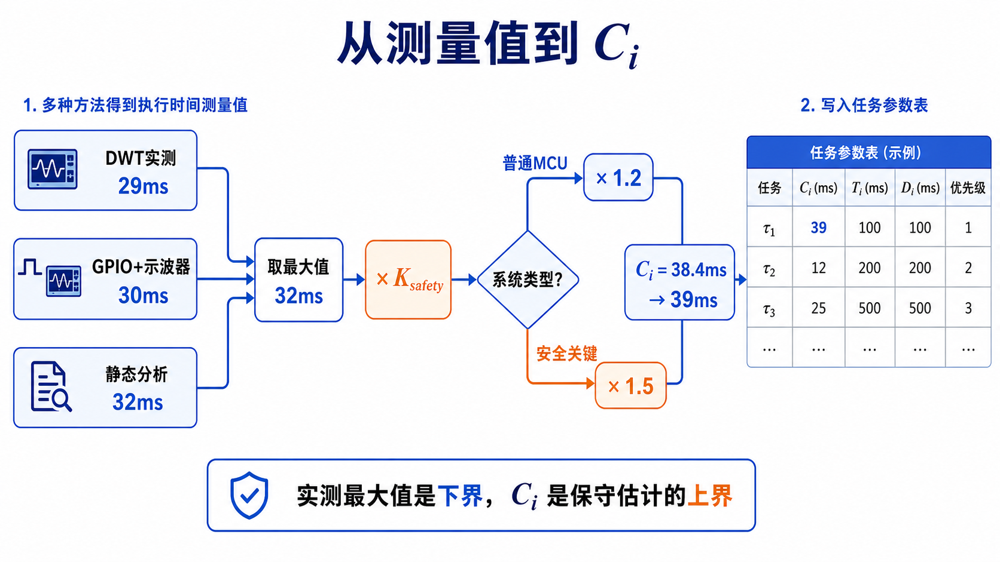

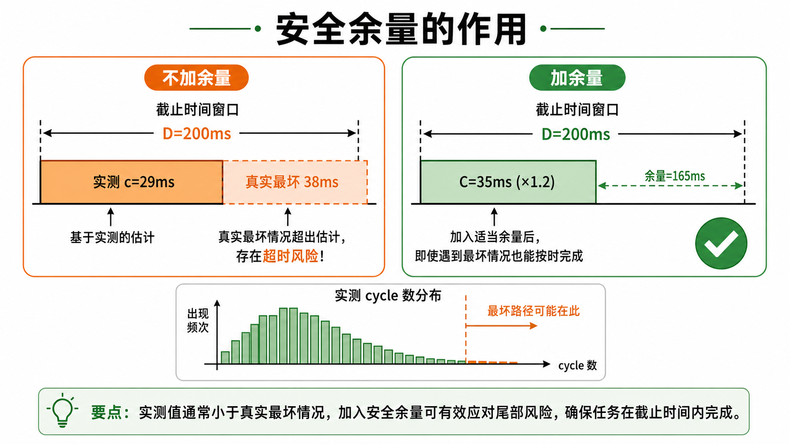

---

## 7 FreeRTOS 在模型中的位置：一个真实的 RTOS 实现

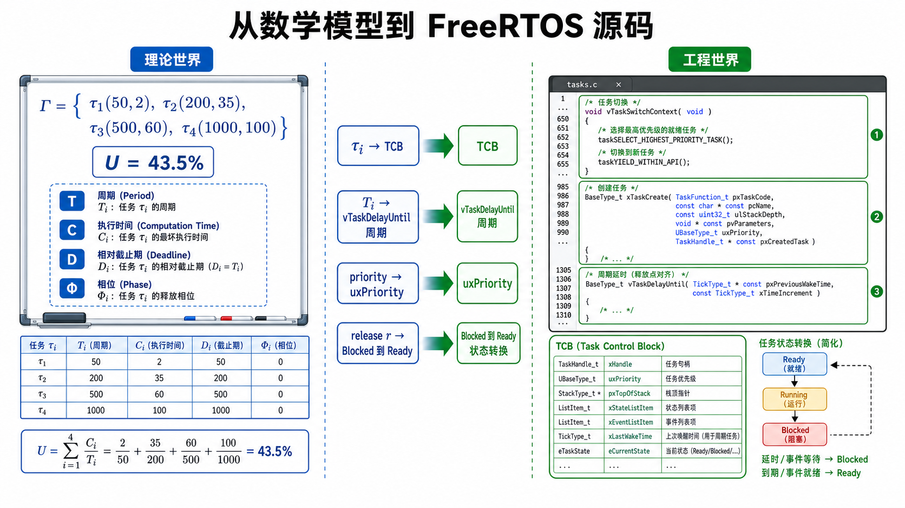

### 7.1 从理论到实现的映射全景（统一参数版）

你在 ##3~##6 建立了实时系统任务模型——Γ = {τ₁(50,2), τ₂(200,35), τ₃(500,60), τ₄(1000,100)}，U = 43.5%。接下来要回答的问题是：**这些数学符号，在你的 Ch6 FreeRTOS 源码中对应什么？** 下面的"翻译词典"是这个问题的答案——每个理论概念都找到了它在 FreeRTOS 中的具体体现：

| 理论概念 | 符号 | 统一参数值 | FreeRTOS 对应物 | 实现完整度与差异 |
|---------|:---:|------|------|------|
| **任务** | τ_i | τ₁~τ₄ | `xTaskCreate` / `xTaskCreateStatic` → TCB | ★★★★★ 理论中的"任务"就是 TCB 代表的线程实体 |
| **周期** | T_i | T₁=50, T₂=200, T₃=500, T₄=1000 | τ₁ 用 `vTaskDelay(50)`，τ₃ 用 `vTaskDelayUntil(500)` | ★★★★☆ 精度受 tick 频率限制 (1ms@1000Hz) |
| **相位** | Φ_i | Φ₁=Φ₂=Φ₃=Φ₄=0 | 隐式——由 `xTaskCreate` 时刻决定 | ★★★☆☆ 无显式 API，需手动 `vTaskDelay(offset)` |
| **WCET** | C_i | C₁=2, C₂=35, C₃=60, C₄=100 | **无直接 API**——需 DWT / 示波器 / 静态分析 | ☆☆☆☆☆ FreeRTOS 不管执行时间，完全不涉及 |
| **相对截止时间** | D_i | D₁=50, D₂=200, D₃=500, D₄=1000 | **无概念**——隐式 = T_i | ☆☆☆☆☆ 需在应用层自己检查和报警 |
| **作业释放** | r_{i,k} | r_{i,k}=Φ_i+(k-1)·T_i | `vTaskDelayUntil` 超时 → Blocked→Ready 的时刻 | ★★★★☆ 有 ±1 tick 的粒度误差 |
| **绝对截止时间** | d_{i,k} | d_{i,k}=r_{i,k}+D_i | **无概念**——FreeRTOS 不知道"这个作业何时必须完成" | ☆☆☆☆☆ |
| **优先级** | — | RM: τ₁>τ₂>τ₃>τ₄ | TCB.uxPriority（0 ~ configMAX_PRIORITIES-1） | ★★★★★ 完全由用户指定，不做 RM 检查 |
| **调度策略** | RM/FP | 固定优先级抢占式 | `configUSE_PREEMPTION=1` + 就绪链表按优先级索引 | ★★★★★ 如果你手动按 RM 排序优先级，行为等效 |
| **抢占** | — | 任意时刻（临界区外） | PendSV + `portYIELD()` / SysTick ISR | ★★★★★ Ch6 源码完整实现 |
| **上下文切换** | — | ~10-20μs @168MHz | PendSV_Handler: PSP 压栈→选新 TCB→PSP 出栈 | ★★★★★ 切换开销确定且可测量 |
| **tick 中断** | — | 1ms @1000Hz | SysTick_Handler → `xTaskIncrementTick()` | ★★★★★ 所有延时操作的"心跳" |
| **临界区** | — | 最坏阻塞 = 最长临界区 | `taskENTER_CRITICAL()` / `taskEXIT_CRITICAL()` = 关中断 | ★★★★☆ 打破抢占假设，需在 RTA 中以 B_i 体现 |
| **互斥资源** | R_k | SPI、队列、共享变量 | Mutex (PIP 优先级继承) + Semaphore + Queue | ★★★★☆ Mutex 实现 PIP。无 PCP |
| **可调度性验证** | — | U=43.5% ≤ U_RM(4)=75.6% | **完全没有**——FreeRTOS 不做任何检查 | ☆☆☆☆☆ 全部是你的责任 |

> **这张表是 PART1 最重要的输出物。** 它给出了 FreeRTOS 的完整能力画像：调度（★★★★★）——极好；周期释放（★★★★☆）——有 tick 精度限制；时间约束和可调度性验证（☆☆☆☆☆）——完全不存在。**这就是本章存在的意义：填补 FreeRTOS 在形式化验证方面的空白。**

### 7.2 调度策略：为什么 FreeRTOS 选择固定优先级（而非 EDF）

#### 直觉对比

- **RM（Rate Monotonic）**：按周期排优先级——周期越短，优先级越高。一旦排定，永远不变。你的 τ₁（T=50ms）永远是最高优先级。
- **EDF（Earliest Deadline First）**：每时每刻按 deadline 紧急程度排优先级——谁的 deadline 最近谁先跑。可能这一秒 τ₁ 优先级最高，下一秒 τ₄ 因为 deadline 快到了而临时升至最高。

#### 统一参数下的 RM 优先级分配

| τ_i | T_i | RM 优先级 | 理由 |
|:---:|:---:|:---:|------|
| τ₁ LED | 50 ms | **最高** (4) | 周期最短，每 50ms 就需要一次 CPU |
| τ₂ COMM | 200 ms | 第二 (3) | 200ms 周期 |
| τ₃ SENSOR | 500 ms | 第三 (2) | 500ms 周期 |
| τ₄ LOG | 1000 ms | **最低** (1) | 周期最长，最不着急 |

在 Ch6 的 `main.c` 中，这个分配直接写在 `xTaskCreate` 的优先级参数里：

```c
xTaskCreate(led_task,    "LED",    ..., 4, NULL);  // τ₁: RM 最高优先级
xTaskCreate(comm_task,   "COMM",   ..., 3, NULL);  // τ₂
xTaskCreate(sensor_task, "SENSOR", ..., 2, NULL);  // τ₃
xTaskCreate(log_task,    "LOG",    ..., 1, NULL);  // τ₄: RM 最低优先级
```

#### 固定优先级 ch6 源码的核心

```c
// Ch6 tasks.c → vTaskSwitchContext()
// 固定优先级调度：找最高优先级的就绪链表，取第一个 TCB
void vTaskSwitchContext(void) {
    // 从最高优先级往下扫描
    UBaseType_t uxTopPriority = configMAX_PRIORITIES - 1;
    while (pxReadyTasksLists[uxTopPriority].uxNumberOfItems == 0) {
        uxTopPriority--;
    }
    // 找到！取链表的第一个 TCB
    ListItem_t *pxNext = listGET_HEAD_ENTRY(&pxReadyTasksLists[uxTopPriority]);
    pxCurrentTCB = listGET_OWNER_OF_HEAD_ENTRY(pxNext);
    pxCurrentTCB->xState = eRunning;
}
// ↑ O(优先级数) 的查找——简单、确定、快速
// 如果改成 EDF，需要遍历所有就绪 TCB 找最小 deadline
```

#### 为什么不是 EDF

| 维度 | RM / 固定优先级 | EDF / 动态优先级 |
|------|:---:|:---:|
| 可调度利用率 | U ≤ 75.6%（n=4）→ **你的 U=43.5% 轻松通过** | U ≤ 100% |
| 过载行为 | 可预测：τ₄（最低优先级）先死 | 不可预测：任何任务都可能 miss |
| 实现复杂度 | O(优先级数) 扫描 → CLZ 硬件指令 | 需维护 deadline 排序结构 |
| Cortex-M 友好度 | 极高 | 一般 |

**你的 U=43.5% 意味着什么？** 在 RM 下，43.5% 远低于 75.6% 的 bound——你的系统在 RM 下是保证可调度的。所以不需要 EDF 那个"理论上 100% 利用率"的优势。**RM 对你来说已经足够好了。**

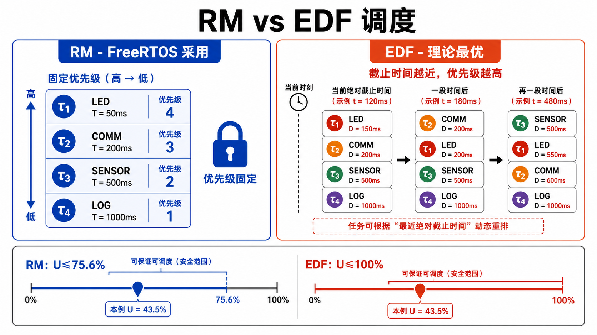

### 7.3 FreeRTOS "不在场"的部分——以及你该怎么办

FreeRTOS 是一个"给你工具、你自己保证正确性"的 RTOS。下面这五件事，它一件都不做。不是疏忽——是设计哲学。但每件"不做"的事背后，都藏着一个你可能踩的坑。

---

**① 不检查可调度性——创建 20 个周期 1ms 的任务，总利用率 1000%，FreeRTOS 也照跑不误**

`xTaskCreate` 的返回值只告诉你"TCB 创建成功了吗"——它不告诉你"这个任务加入后，任务集还可调度吗"。`vTaskStartScheduler` 只负责启动第一个任务——它不跑一遍 RTA。FreeRTOS 在运行时也不会监控任何 deadline。

这意味着什么？你在 `main.c` 里加了一个新任务，编译通过、烧录运行、串口输出正常——你觉得没问题。但它的 R_i 在其 deadline 窗口内已经悄悄越界了。你发现不了，因为 FreeRTOS 不会报警——没有 watchdog 专门盯着 deadline。真正发现问题是三个月后，客户报告"设备每 47 秒卡一下"。

**你该怎么办：** 把可调度性分析变成你的"编译前检查"。在项目的 `Makefile` 或 CI 里，跑一个 Python 脚本读任务参数表 → 算 U → 跑 RTA → 输出 PASS/FAIL。脚本代码在 PART2 的 §11 和 §12 里有现成的。每次加任务或改 WCET，先跑脚本再编译。这不是"高手的选择"——这是唯一能保证 deadline 不会被悄悄穿掉的手段。

```c
/* 如果你不做：加一个任务就像在高速公路上闭眼踩油门——
   感觉没问题，直到某一天三个释放沿对齐了，deadline 穿了。 */
```

---

**② 不知道"截止时间"——TCB 里没有 deadline 字段**

翻开 Ch6 的 TCB 结构——`uxPriority`、`pxStack`、`xStateListItem`、`xEventListItem`——没有任何字段表示"这个作业必须何时完成"。FreeRTOS 的调度器只知道优先级，不知道 deadline。EDF？没有。Deadline miss 检测？没有。

这个缺失意味着：即使你在 FreeRTOSConfig.h 里完美地按 RM 排好了优先级，系统运行时如果出现你分析中未预见的最坏情况——比如一个罕见中断把某个任务的 WCET 推高了 20%——调度器不会因此调整优先级或跳过某些作业来"止损"。RM 是死的——它不会根据 deadline 紧急程度动态改变行为。

**你该怎么办：** 在应用层实现 deadline 监控。不是在每个 `while(1)` 里手写——是封装成一个轻量的"作业包装器"：

```c
/* 作业包装器——统一的 deadline 监控 */
typedef struct {
    void (*job_fn)(void *);    /* 真正的作业函数 */
    void *arg;
    TickType_t deadline_ticks; /* D_i 的 tick 数 */
} JobWrapper_t;

void run_with_deadline(const JobWrapper_t *job, TickType_t *last_wake) {
    TickType_t start = xTaskGetTickCount();
    job->job_fn(job->arg);
    TickType_t elapsed = xTaskGetTickCount() - start;
    if (elapsed > job->deadline_ticks) {
        /* 记录到持久化存储：哪个任务、第几次作业、实际 R、D */
        log_deadline_miss(task_name, elapsed, job->deadline_ticks);
    }
    vTaskDelayUntil(last_wake, job->deadline_ticks);
}
```

把这个包装器用在你的四个工人身上：τ₃ 的 deadline 是 500ms tick 数，τ₁ 是 50ms。每次作业跑完后，日志里会自动留下"是否有 deadline miss"的记录。接入 SystemView 或串口 shell，开发期可以实时监控。

---

**③ 不做 WCET 分析和保证——调度器不关心中间执行了多久**

`vTaskSwitchContext` 切换任务时，不检查"当前任务已经跑了多久"。FreeRTOS 不记录任务的累计 CPU 时间（除非你启用了 `configGENERATE_RUN_TIME_STATS`，但那也只是统计，不是限制）。

这意味着：如果你的 COMM 任务在某一帧里因为收到一个特殊的长帧，解析时间从正常的 20ms 涨到了 45ms——调度器不会打断它。它会让 COMM 跑完这 45ms，在此期间 τ₁（LED，T=50ms）被硬生生推后了 45ms。而 τ₁ 的 deadline 只有 50ms——如果刚好赶在 deadline 边界上，这一帧 τ₁ 可能就 miss 了。

**你该怎么办：** 这就是 §6 的 WCET 测量存在的意义——不是为了好玩，也不是为了论文。你测出来的 C_i 是你做 RTA 的输入。如果你没测，RTA 的输入是你猜的。猜的数字跑 RTA，结果能信吗？

三种方法（DWT、GPIO+示波器、静态分析）在 §6.3 有完整代码，安全余量（×1.2 或 ×1.5）在 §6.4。这里不重复，但要强调一个工程规则：**WCET 测量的时机不是在项目结束时"补一下文档"——而是在你写完每一个有循环、有分支的函数时，立刻拿 DWT 测一次。测完把数字写在函数的注释里。**

```c
/* WCET 注释约定——写在每个关键函数的头上 */
// @wcet: 45 ms (measured @168MHz, DWT, worst path = 长帧解析, 1000 samples)
// @wcet_margin: ×1.3 → 58.5 ms → RTA input: C_comm = 60 ms
void comm_process(uint8_t *frame) { ... }
```

---

**④ 不做 PCP（优先级天花板协议）——Mutex 有 PIP，但 PIP 不能防死锁**

FreeRTOS 的 Mutex 实现了优先级继承（PIP），这在 PART3 §15 里有完整的源码对照分析。但 PIP 有一个天生的弱点：**不能防止死锁。** 如果 τ₁ 持锁 A、等锁 B，τ₂ 持锁 B、等锁 A——PIP 会把两者都升到最高优先级，但它们仍然互相等对方释放自己需要的锁。PIP 只是加速了死锁的到达——两个任务都在最高优先级上互相死等。

PCP（优先级天花板协议）通过一个简单的规则解决了这个问题：**一个任务只有在它的"天花板优先级"高于所有当前已持锁任务时，才能获取新锁。** 这个规则直接消解了"死锁的四个必要条件"中的"循环等待"。

**你该怎么办：** FreeRTOS 不实现 PCP，但你可以自己在设计层面"模拟"它。规则很简单——

1. 把你项目里所有 mutex 列在一张表里。
2. 对每个 mutex，列出所有会访问它的任务，取它们中最高的优先级——这就是这个 mutex 的"天花板"。
3. **铁律：如果一个任务要拿多个锁，必须按天花板从高到低的顺序拿。** 永远不要"先拿低天花板锁，再拿高天花板锁"。

```c
/* ❌ 违反天花板顺序——可能死锁 */
void sensor_task(void) {
    xSemaphoreTake(spi_mutex, ...);    /* spi_mutex 天花板 = 4 */
    xSemaphoreTake(log_mutex, ...);    /* log_mutex 天花板 = 2  ← 更低！*/
    /* 如果此时 COMM (prio=3) 持有 log_mutex 在等 spi_mutex → 死锁 */
}

/* ✅ 按天花板从高到低 */
void sensor_task(void) {
    xSemaphoreTake(spi_mutex, ...);    /* 天花板 = 4（先拿高的）*/
    xSemaphoreTake(log_mutex, ...);    /* 天花板 = 2（再拿低的）*/
    /* COMM 不可能"持 log_mutex 等 spi_mutex"因为天花板顺序强制 spi_mutex 必须先拿 */
}
```

这个简单的规则——"按天花板从高到低拿锁"——可以防止 FreeRTOS M3/M4 上大多数死锁场景。它不需要 FreeRTOS 内核做任何事。它只需要你的代码审查纪律。

---

**⑤ 不建模任务依赖——队列深度是隐藏的 B_i 放大器**

τ₃（SENSOR）每 500ms 采样一次，把数据 `xQueueSend(sensor_queue, &data, 0)` 发给 τ₂（COMM）。这是典型的生产者-消费者管道。经典任务模型假设它们独立——但实际上：

- 如果 τ₂ 因为某种原因消费变慢了（比如收到错误帧，重试了 3 次）→ sensor_queue 慢慢积压 → 终于满了 → τ₃ 的下一次 `xQueueSend(..., 0)` 返回 `errQUEUE_FULL` → **数据丢了**。
- 如果你换用 `xQueueSend(..., portMAX_DELAY)`，τ₃ 被阻塞在队列发送上 → **τ₃ 被 τ₂ 间接阻塞**。这个阻塞时间不在你的 B_i 里——因为你只建模了"mutex 阻塞"，没有建模"队列满阻塞"。

这就是管道依赖的隐蔽性：它创造了一种**不通过 mutex 的阻塞路径**——通过数据缓存的积压，一个任务的效率问题传播到上游。

**你该怎么办：**
1. **量化管道容量。** 在任务参数表里加一列"队列深度"。验证"队列深度 ≥ 最坏情况生产-消费速率差 × 最大延迟窗口"。
2. **给管道阻塞建模。** 如果用阻塞发送（`portMAX_DELAY`），管道阻塞时间 = 队列清空时间 = 队列深度 × τ₂ 的单次消费时间。把这个值加入 τ₃ 的 Bᵢ。
3. **或者——用足够深的队列 + 非阻塞发送 + 溢出计数。** 这是工程上最常用的方案。SENSOR 在队列满时丢弃旧数据（非阻塞），但递增一个 `overflow_count`。COMM 定期检查 `overflow_count`——如果不为零，说明管道带宽不够，需要降 SENSOR 的采样频率或升 COMM 的处理速度。

```c
/* 带溢出计数的非阻塞管道——工程标准方案 */
void sensor_task(void *pv) {
    static uint32_t overflow_count = 0;
    while (1) {
        sensor_data_t data;
        adc_sample(&data);
        if (xQueueSend(sensor_queue, &data, 0) != pdTRUE) {
            overflow_count++;  /* 记录溢出但继续跑——不阻塞 */
        }
        vTaskDelayUntil(&last, pdMS_TO_TICKS(500));
    }
}
/* 在 CLI/shell 中查看 overflow_count——如果 > 0，管道带宽不足 */
```

### 7.4 收束：三层映射总图

你在 PART1 建立了三个层次的知识，现在用一个递进的总图收束：

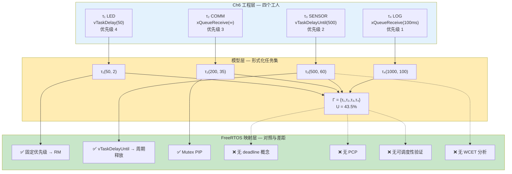
```mermaid
graph TB
    subgraph Ch6Layer["Ch6 工程层 — 四个工人"]
        L1["τ₁ LED<br/>vTaskDelay(50)<br/>优先级 4"]
        L2["τ₂ COMM<br/>xQueueReceive(∞)<br/>优先级 3"]
        L3["τ₃ SENSOR<br/>vTaskDelayUntil(500)<br/>优先级 2"]
        L4["τ₄ LOG<br/>xQueueReceive(100ms)<br/>优先级 1"]
    end
    
    subgraph ModelLayer["模型层 — 形式化任务集"]
        M1["τ₁(50, 2)"]
        M2["τ₂(200, 35)"]
        M3["τ₃(500, 60)"]
        M4["τ₄(1000, 100)"]
        G["Γ = {τ₁,τ₂,τ₃,τ₄}<br/>U = 43.5%"]
    end
    
    subgraph MapLayer["FreeRTOS 映射层 — 对照与差距"]
        V1["✅ 固定优先级 → RM"]
        V2["✅ vTaskDelayUntil → 周期释放"]
        V3["✅ Mutex PIP"]
        X1["❌ 无 deadline 概念"]
        X2["❌ 无 PCP"]
        X3["❌ 无可调度性验证"]
        X4["❌ 无 WCET 分析"]
    end
    
    L1 --> M1
    L2 --> M2
    L3 --> M3
    L4 --> M4
    M1 --> G
    M2 --> G
    M3 --> G
    M4 --> G
    M1 --> V1
    M3 --> V2
    M2 --> V3
    G -.-> X1
    G -.-> X2
    G -.-> X3
    M3 -.-> X4
    
    style Ch6Layer fill:#e3f2fd
    style ModelLayer fill:#ffecb3
    style MapLayer fill:#c8e6c9
```

| 层次 | 你做了什么 | 产出物 |
|------|------|------|
| **工程层** (Ch6) | 创建 τ₁~τ₄ 四个工人，用 vTaskDelay / vTaskDelayUntil / xQueueReceive 实现周期和通信 | 一份能跑的 main.c |
| **翻译层** (§3~§6) | 提取每个 τ_i 的 (T_i, C_i, D_i, Φ_i)，用 ×1.2 安全余量得到 C_i，形成形式化任务集 Γ | 任务参数表 + Γ + U=43.5% |
| **对照层** (§7) | 将 Γ 的每个概念对应到 FreeRTOS 源码，标出"✅ 实现了"和"❌ 缺失了" | 映射表 + 差距清单 |


```mermaid
graph LR
    subgraph A["✅ FreeRTOS 管了"]
        A1["调度 (★★★★★)"]
        A2["周期释放 (★★★★☆)"]
        A3["抢占 (★★★★★)"]
        A4["Mutex PIP (★★★★☆)"]
    end
    
    subgraph B["❌ FreeRTOS 没管<br/>(你必须自己来)"]
        B1["deadline 定义与监控"]
        B2["WCET 测量与安全余量"]
        B3["可调度性分析 (U→RTA)"]
        B4["PCP 资源协议"]
        B5["任务依赖建模"]
    end
    
    A -->|"PART2-4 补齐"| B
    
    style A fill:#c8e6c9
    style B fill:#ffcdd2
```

> **这便是 FreeRTOS 的完整画像：调度做到极致，验证完全不碰。本章的价值就在于填补 ❌ 的那一侧。PART2 开始，你用数学证明你的系统"一定跑得对"——这是你在 Ch6 完全做不到的事。**

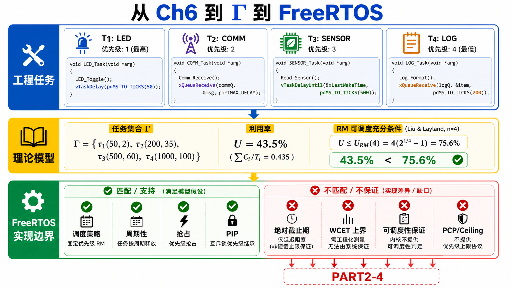

---

**§3~§7 到此结束。你现在拥有：**

1. **§3**：把任何 `while(1)` 循环翻译成 τ + job 的数学语言
2. **§4**：理解周期 T、相位 Φ、vTaskDelay vs vTaskDelayUntil 的本质区别
3. **§5**：掌握释放 r、截止 d、相对截止 D 和核心公式 d = r + D
4. **§6**：能用三种方法测量 WCET，并用 ×1.2/×1.5 安全余量得到保守的 C_i
5. **§7**：知道 FreeRTOS 在理论模型中的精准位置——调度满分，验证归零

下一步：**PART2（§8~§12）——用这三种数学工具（RM bound → TDA → RTA）证明统一参数任务集 Γ 是可调度的。** 你将第一次发现：你的 scheduler 在 tick 中断里做的那个"选最高优先级任务"的决定，背后的数学是 RM 最优性定理；你的 `vTaskDelayUntil` 保证的 500ms 绝对周期，是时间需求函数里 ⌈t/T_j⌉ 因子的物理基础。

> **Ch6 你写调度器。§3~§7 你建模它。PART2 你证明它。PART3 你学会它的弱点。PART4 你把它裁到极致。**


---

# PART 2 · 调度算法与可调度性分析

> 在 ##3–##7，你把四个工人（LED、COMM、SENSOR、LOG）的直觉行为翻译成了精确的参数：周期 T、WCET C、截止时间 D、相位 Φ。你学会了 τ_i = (T_i, C_i, D_i) 这套语言。但这只是"给每个工人做了体检"——现在的问题是：**体检报告出来了，四个工人一起上工，他们会不会撞车？** PART2 就做一件事：拿你写好的参数表，用数学证明"这四个人在同一个 CPU 上一定不会迟到"。先从形式化整个任务集 Γ 开始——把 n 个工人装进一个统一的数学框架里。

---

## 8 形式化任务模型：把直觉变成数学

你已经给每个任务单独做了"体检"——τ_i = (T_i, C_i, D_i)。现在我们把这四个体检报告装订成册，定义系统的全局视图。这就是 **任务集 Γ**。

### 8.1 任务集 Γ：把 n 个任务聚合成一个数学对象

> **任务集 Γ（大写的希腊字母 Gamma）是所有任务的集合：**
>
> $$\Gamma = \{\tau_1, \tau_2, ..., \tau_n\}$$

对 Ch6 的四人车间（使用统一参数）：

$$\Gamma = \{\tau_1, \tau_2, \tau_3, \tau_4\}, \quad n = 4$$

每个任务 τ_i 是一个**元组（tuple）**——五个参数打包成一个数学对象：

$$\tau_i = (\Phi_i, T_i, C_i, D_i)$$

**统一参数速查表（本章所有公式、所有表格、所有 Gantt 图均基于此）：**

| 代号 | 工人 | T (ms) | C (ms) | D (ms) | u = C/T |
|:---:|------|:------:|:------:|:------:|:-------:|
| τ₁ | LED | 50 | 2 | 50 | 0.04 |
| τ₂ | COMM | 200 | 35 | 200 | 0.175 |
| τ₃ | SENSOR | 500 | 60 | 500 | 0.12 |
| τ₄ | LOG | 1000 | 100 | 1000 | 0.10 |

> **总利用率 U = 0.435，RM bound U_RM(4) = 0.756 → 通过 ✓**

使用以下简化约定：

- τ_i(Φ_i, T_i, C_i, D_i)：完整形式
- τ_i(T_i, C_i, D_i)：Φ_i = 0（最常用）
- τ_i(T_i, C_i)：Φ_i = 0 且 D_i = T_i（经典模型）

在我们的四人车间，D_i = T_i 且 Φ_i = 0，所以简写为 τ_i(T_i, C_i)：

$$\Gamma = \{\tau_1(50, 2), \tau_2(200, 35), \tau_3(500, 60), \tau_4(1000, 100)\}$$

这行式子翻译成人话就是：**"LED 每 50 ms 最坏花 2 ms、COMM 每 200 ms 最坏花 35 ms、SENSOR 每 500 ms 最坏花 60 ms、LOG 每 1000 ms 最坏花 100 ms——四个任务共享一个 CPU。"**

> **任务集 Γ 是你做所有可调度性分析的起点。** 在 ##9–##12，你会把 Γ 作为输入，通过 RM/EDF 调度、RM bound、TDA、RTA 四种工具，输出一个布尔值：这个 Γ 在给定的调度策略下，所有 deadline 一定满足吗？

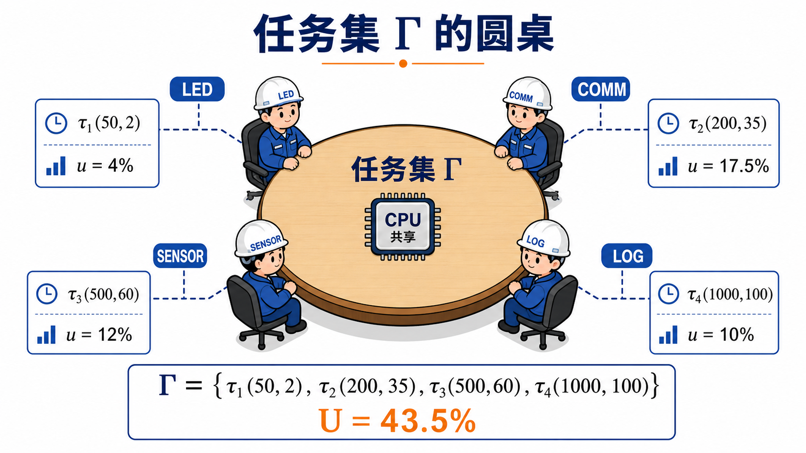

### 8.2 两级参数表：作业级 vs 任务级——不要混在一起

初学实时系统理论时，最容易犯的概念错误是把两个不同层级的概念混在一起说：**任务级参数**（设计时确定，所有作业相同）和**作业级参数**（运行时变化，每个作业不同）。

#### 任务级参数（Task-Level）

| 参数 | 符号 | 含义 | 在 Ch6 代码中的体现 |
|------|:---:|------|------|
| 周期 | T_i | 所有作业的释放间隔相同 | `pdMS_TO_TICKS(50)`——硬编码在 `vTaskDelayUntil` 中 |
| 相对截止时间 | D_i | 所有作业从释放到截止的时间相同 | 隐式 = T_i（FreeRTOS 没有声明 deadline 的原生 API） |
| WCET | C_i | 所有作业的最坏执行时间上界相同 | 由代码结构决定，不随时间变化 |
| 相位 | Φ_i | 偏置一次，决定第一次释放的位置 | 由 `xTaskCreate` 时刻 + 初始延迟决定 |

#### 作业级参数（Job-Level）

| 参数 | 符号 | 公式 | 运行时如何获取 |
|------|:---:|------|------|
| 释放时间 | $r_{i,k}$ | $Φ_i + (k-1)·T_i$ | `xTaskGetTickCount()` 在 vTaskDelayUntil 到期时 |
| 绝对截止时间 | $d_{i,k}$ | r_{i,k} + D_i | 应用层计算（FreeRTOS 不提供） |
| 实际执行时间 | c_{i,k} | 每次不同 | DWT cycle counter 或 GPIO+示波器测量 |
| 开始时间 | s_{i,k} | 取决于抢占 | 实际被 PendSV 切换上 CPU 的时刻 |
| 完成时间 | f_{i,k} | s_{i,k} + c_{i,k} + 被抢占时间 | DWT/GPIo 精确实测 |
| 响应时间 | R_{i,k} | f_{i,k} - r_{i,k} | DWT 测量从释放到完成的总时钟周期 |

用 SENSOR 任务（τ₃, T=500ms, C=60ms）来感受这个区分：

```c
// 任务级参数（编译期/设计期确定，所有作业相同）
// T₃ = 500 ms, D₃ = 500 ms, C₃ = 60 ms, Φ₃ = 0

void sensor_task(void *pv) {
    TickType_t xLastWakeTime = xTaskGetTickCount();
    uint32_t wcet_max = 0;

    while (1) {
        // === 作业级参数（运行时产生，每个作业不同） ===
        // r_{3,k} = xLastWakeTime（当前作业的释放时刻）

        uint32_t start_cycles = DWT->CYCCNT;
        adc_sample_and_filter();  // 实际执行 c_{3,k}，每次略不同但 ≤ C₃
        xQueueSend(sensor_queue, &data, 0);
        uint32_t elapsed = DWT->CYCCNT - start_cycles;

        // f_{3,k} ≈ r_{3,k} + elapsed + 被抢占的时间
        // R_{3,k} = f_{3,k} - r_{3,k}（本次作业的响应时间）

        if (elapsed > wcet_max) wcet_max = elapsed;

        // r_{3,k+1} = r_{3,k} + 500 ms（下次释放时刻）
        vTaskDelayUntil(&xLastWakeTime, pdMS_TO_TICKS(500));
    }
}
```

**为什么要区分两级参数？** 因为调度器只能看到任务级参数；但可调度性分析的结论必须打到每一个作业上——对任意 k，必须 R_{i,k} ≤ D_i。如果某种释放时序会导致第 100 个作业超过 deadline，那这个系统就是不可调度的——无论前面 99 次多么完美。

我们用 RTA 计算的是 **max(R_{i,k}) over all k** ——最坏响应时间。只要这个最大值 ≤ D_i，所有作业一定都在 deadline 前完成。

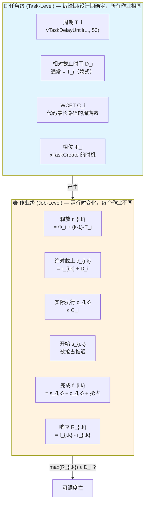
```mermaid
graph TD
    subgraph TaskLevel["🔵 任务级 (Task-Level) — 编译期/设计期确定，所有作业相同"]
        T["周期 T_i<br/>vTaskDelayUntil(..., 50)"]
        D_T["相对截止时间 D_i<br/>通常 = T_i（隐式）"]
        WCET["WCET C_i<br/>代码最长路径的周期数"]
        PHI["相位 Φ_i<br/>xTaskCreate 的时机"]
    end

    subgraph JobLevel["🟠 作业级 (Job-Level) — 运行时变化，每个作业不同"]
        R["释放 r_{i,k}<br/>= Φ_i + (k-1)·T_i"]
        AD["绝对截止 d_{i,k}<br/>= r_{i,k} + D_i"]
        AC["实际执行 c_{i,k}<br/>≤ C_i"]
        START["开始 s_{i,k}<br/>被抢占推迟"]
        FINISH["完成 f_{i,k}<br/>= s_{i,k} + c_{i,k} + 抢占"]
        RESP["响应 R_{i,k}<br/>= f_{i,k} - r_{i,k}"]
    end

    TaskLevel -->|"产生"| JobLevel
    JobLevel -->|"max(R_{i,k}) ≤ D_i ?"| 可调度性

    style TaskLevel fill:#e1f5fe
    style JobLevel fill:#fff3e0
```

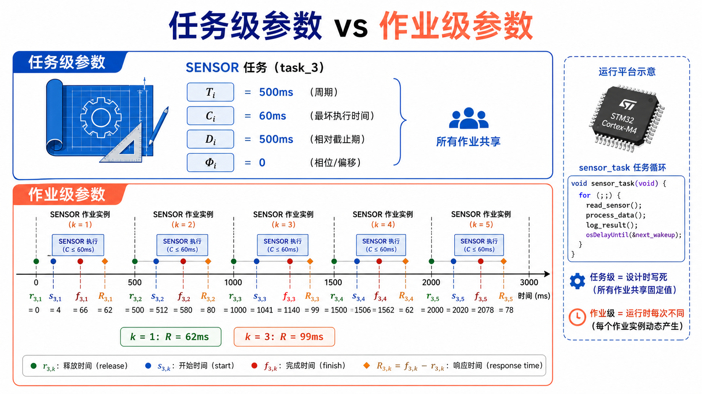

### 8.3 关键假设 A1–A8：理论模型"理想化"了什么——以及打破时会发生什么

经典实时系统模型建立在一组假设上。这些假设让数学推导变得优雅——但它们和真实世界有差距。

这一节有两个目的：第一，让你知道理论在什么边界内成立；第二——**每条假设后面都有一段"打破时会发生什么"的真实案例**。这不是吓唬你——而是让你知道，当某个假设在你系统里不成立时，你面对的是什么量级的代价。

让我们逐条来。

#### A1: 所有任务都是周期的

**假设内容：** 任务以固定间隔释放作业。

**在四人车间中的状态：** ❌ τ₁ (LED) 和 τ₃ (SENSOR) 是周期的——vTaskDelayUntil 精确控制间隔。但 τ₂ (COMM) 和 τ₄ (LOG) 是**事件驱动**的——它们的释放由外部事件（串口数据到达、日志缓存积压）触发，间隔不固定。

**打破时会发生什么？**

> **案例：汽车 CAN 总线上的诊断任务。** 一辆汽车的 OBD-II 诊断任务在正常行驶时每 100 ms 被请求一次（周期）。但当修理工插上诊断仪后，诊断请求频率飙升到每 5 ms 一次——是平时的 20 倍。如果系统按"每 100 ms 一次"建模，假设任务集可调度，那么在实际诊断场景下——
>
> 诊断任务的释放频率暴增 20 倍 → 它的有效利用率从 C/100 变成 C/5 → 整个系统的 U 可能从 0.7 跳到 1.5 → 高优先级任务（如 ABS 制动控制）的响应时间被推过 deadline → **制动失效**。
>
> 这个案例的教训是：**如果你的"事件驱动"任务的 MIT（最小到达间隔）没有物理上的硬上限（比如 CAN 总线波特率理论最快也只能每 2 ms 一帧），就不应该用纯周期模型来分析。** 必须在硬件层面或协议层面强制限流。

**工程补救：** 用 MIT（Minimum Inter-arrival Time）近似——实测或分析最小事件间隔，将其作为模型的 T_i。然后用 RTA 检验。同时，在接收端加**速率限制**——超过 MIT 频率的事件排队或丢弃，确保最坏情况可控。

#### A2: 任务之间独立，无数据依赖

**假设内容：** 任务 A 不需要等任务 B 的结果就能运行。

**在四人车间中的状态：** ❌ SENSOR → queue → COMM 构成生产者-消费者依赖。SENSOR 采样后发到队列，COMM 从队列取数据处理。如果队列满了，SENSOR 的非阻塞发送会丢弃数据；如果 SENSOR 改用阻塞发送，它就可能被 COMM 的慢处理间接阻塞。

**打破时会发生什么？**

> **案例：无人机飞控栈的数据管道。** 一架四旋翼无人机的飞控软件有 6 个任务组成的数据管道：IMU 读取 → 姿态解算 → 控制律计算 → 混控输出 → 电调通讯 → 遥测回传。每个任务依赖前一个任务的输出。当第 3 级（控制律计算）因为某个边缘姿态角触发了一个复杂的保护逻辑，WCET 从 2 ms 突然膨胀到 5 ms——
>
> 第 4 级（混控输出）在等待数据时超过了它的 deadline（2.5 ms）。电调在 2.5 ms 内没有收到新的 PWM 指令 → 保持上一帧输出 → 电机转速未能及时调整 → 无人机开始振荡。振荡导致 IMU 数据噪声增大 → 姿态解算更慢 → 整个管道正向反馈 → **3 秒内坠机**。
>
> 这个案例的教训是：**在生产者-消费者链中，消费端的 WCET 膨胀会反向传播阻塞生产端——而经典模型假设它们独立，完全忽略了这种传播。** 如果你的系统有深度数据管道，必须在 RTA 分析中加入"管道阻塞"项——而不仅仅是 B_i。

**工程补救：** 在建模时，把"队列满导致的阻塞"算入阻塞时间 B_i。如果 SENSOR 的 `xQueueSend(..., portMAX_DELAY)` 在队列满时阻塞等待，那么这个阻塞时间必须反映在 SENSOR 的 RTA 中。或者——更安全地——用足够深的队列确保队列满的情况不会发生，并在 RTA 里加 B_i = 0（假设队列深度 ≥ 最坏情况生产量）。

#### A3: WCET C_i 已知且恒定

**假设内容：** 每次作业的执行时间相同，且上界已知。

**在四人车间中的状态：** ❌ 实际执行时间每次有波动。COMM 的任务根据命令类型不同，解析时间差异很大——解析一条"读温度"命令只需 5 ms，但解析"批量写入配置表"可能花费 35 ms。

**打破时会发生什么？**

> **案例：航空电子系统的路径依赖陷阱。** 一架客机的飞行管理系统（FMS）有一个"航路计算"任务，正常 WCET 测量值是 80 ms。开发团队用这 80 ms 做了 RTA 分析，通过了。上机跑了三年没问题。第四年，飞行员飞了一条跨越北极的新航线——航路计算任务需要处理跨越国际日期变更线的经度——代码里有一个分支判读"经度 > 180° → 经度 -= 360°"的罕见路径，加上极地附近的航点密集度远高于赤道地区，WCET 爆炸到 240 ms——
>
> 这个作业在 240 ms 内占用了 CPU，而系统在 200 ms 时还有一个更高优先级的 TCAS（空中防撞）任务需要运行。TCAS 被推迟了 40 ms → 40 ms 在巡航速度 900 km/h 时意味着飞机前进了 10 米——在这个具体场景下没有造成事故，但适航审查机构在做安全性分析时标记为"不可接受的路径覆盖缺失"。
>
> 教训：**WCET 的"已知"不是靠测几次就够的——你必须确认你测试了所有可能的执行路径。** 在这个案例里，跨越 180° 经线是一个很少飞但合法的输入，代码里处理它的分支在常规测量中从未触发。

**工程补救：** C_i = 实测最大值 × 安全系数。系数取决于你对代码路径的覆盖信心：
- 代码简单、无分支（如 GPIO 翻转）：×1.1 ~ ×1.2
- 代码有一个主要分支但差异小：×1.2 ~ ×1.5
- 代码有多条显著不同的路径：×1.5 ~ ×2.0，且必须做**基于路径的 WCET 分析**（每个分支分别测量、取最大值）
- 数据依赖型循环（如 `for(i=0; i<n; i++)` 且 n 来自输入）：**必须限制 n 的上界**或改用固定迭代次数

#### A4: D_i = T_i（截止时间等于周期）

**假设内容：** 每个作业必须在下一个作业释放之前完成。

**在四人车间中的状态：** ✔️ 对 LED、SENSOR 成立（本周期采的数据必须在下周期采样前处理完）。但如果你的 COMM 任务有特殊协议要求（比如 Modbus 协议规定从接收到响应必须在 20 ms 内），D_i 就可能小于 T_i。

**打破时会发生什么？**

> **案例：工业机器人关节伺服。** 一个 6 轴工业机器人的关节伺服控制器运行着一个位置环任务（T=1ms, C=200μs）和一个扭矩环任务（T=1ms, C=300μs）。位置环的 deadline 是 500 μs（必须在 500 μs 内算出新的位置指令并写入 DAC），扭矩环的 deadline 是 800 μs——都比各自的周期更紧（D < T）。
>
> 如果工程师错误地用 D=T 的简化模型分析 → 位置环的 RTA 结果 R=400μs，看起来通过（400 < 1000）。但如果用 D=500μs 的真实 deadline → R=400μs 仍然通过，只是余量从 600μs 缩小到了 100μs。现在假设因为某个罕见的中断嵌套，响应时间从 400 增加到 520μs——在 D=T 模型里"还早得很"，在 D=500 模型里"已经 miss"。
>
> 扭矩指令延迟了 20μs，在这个案例中只是微小的精度损失——但如果这是手术机器人的力反馈电机，**延迟 20μs 可能导致手术刀多切 0.02mm**，在眼科手术中这是严重事故。
>
> 教训：**D_i = T_i 的假设简化不是无害的——它掩盖了你的任务的实际紧迫性。** 如果你的 deadline 真的比周期短（常见于需要"快速反应"的控制任务），必须在 RTA 公式里显式使用真实的 D_i，而不是 T_i。

**工程补救：** 如果 D_i < T_i，RM 优先级规则应替换为 DM（Deadline Monotonic：按 D 排序而非按 T 排序）。如果 D_i > T_i（允许跨周期缓冲），同一任务可能有多个作业同时未完成——需要更复杂的分析（多帧分析）。

#### A5: Φ_i = 0（所有任务在 t=0 同时释放）

**假设内容：** 系统启动时所有任务释放第一个作业。

**在四人车间中的状态：** ❌ 实际启动时间有先后——当 `xTaskCreate` 按顺序创建任务时，LED 被创建后要等 50ms 才释放第一个作业（vTaskDelay 或 vTaskDelayUntil 的初始等长）。但由于我们在分析时假设 Φ = 0——这是**保守的**。如果 Φ = 0（同时释放 = 临界时刻）通过，任意其他相位也一定通过。

**打破时会发生什么？**

> **案例：卫星姿态控制系统的启动瞬态。** 一颗小卫星在火箭分离后进入"太阳搜索"模式。此时有 12 个任务需要启动：太阳敏感器读取、星跟踪器初始化、反作用轮控制、磁力矩器控制、推进器自检...每个任务依赖不同的传感器就绪时间。如果所有 12 个任务都假设 Φ = 0（同时释放），RM bound 检验轻松通过（U = 0.45）。但在真实启动序列中——
>
> 星跟踪器需要 30 秒才能完成星图识别并输出第一帧姿态数据（它的"第一个作业"被传感器就绪时间天然推迟了约 30 秒）。在等待星跟踪器的 30 秒内，其他 11 个任务已经各自释放了数百次作业——这不是问题。
>
> 但问题出现在 t = 30 秒时：**星跟踪器任务终于释放了它的第一个作业，而此时正好也是太阳敏感器的第 600 个作业和反作用轮控制的第 3000 个作业同时释放的瞬间**——由于三个任务的周期都是 50ms 的整数倍，它们在 t = 30s 时完美对齐了。如果星跟踪器初次运行时的 WCET 比稳态大（需要更多的初始化计算），这个对齐点可能导致反作用轮控制暂时缺失——卫星短暂失控。
>
> 教训：**Φ = 0 分析覆盖了"启动后系统稳态"的最坏情况，但不一定覆盖"大型传感器就绪后系统突然加入一个高优先级任务"的瞬态。** 这种瞬态在自己的可调度性分析中需要单独建模。

**工程补救：** 对 Φ ≠ 0 的情况，始终用 Φ = 0 做保守分析（最坏情况在临界时刻——下一章详讲）。但如果你的系统有"大型任务延迟启动"的瞬态，需要单独在超周期（hyperperiod, H = lcm(T₁, ..., T_n)）内模拟这个瞬态。我们的四人车间 H = lcm(50, 200, 500, 1000) = 1000 ms，瞬态影响在一个超周期内会被覆盖。

#### A6: 抢占代价为零（上下文切换不花时间）

**假设内容：** 任务被抢占时，保存和恢复上下文不消耗 CPU 时间。

**在四人车间中的状态：** ❌ Cortex-M 上 PendSV 上下文切换：保存 R4–R11 + LR + PSP → 实际约 10–20 μs（168 MHz 下约 1680–3360 个周期）。在 50 ms 的 LED 周期长度上，占比 0.04%——可忽略。但如果你的最小周期是 100 μs 而不是 50 ms，占比就变成了 20%——不可忽略。

**打破时会发生什么？**

> **案例：电机 FOC（磁场定向控制）在 Cortex-M0+ 上的惨案。** 一个开源无刷电机驱动器项目，用 STM32F0（Cortex-M0+, 48 MHz）跑 FOC 控制。电流环任务（T=50μs, C=35μs）是最高优先级，每 50 μs 释放一次。工程师用 RTA 分析：U = 35/50 = 0.7，一个任务，显然可调度。烧进去实测：电机转起来但有刺耳啸叫。
>
> 用示波器抓波形后发现：每次 ADC 完成中断后，PendSV 触发上下文切换花费了 **12 μs**（M0+ 没有硬件浮点，需要软件保存更多寄存器）。12 μs + 35 μs 电流环计算 = 47 μs。还剩下 3 μs 裕量——但只要总线矩阵上有 DMA 在搬运数据（同时进行），这 3 μs 裕量会被 DMA 总线争用吃掉，导致 50 μs deadline 偶尔被错过。
>
> **如果上下文切换真的零代价，FreeRTOS 内核工程师早失业了。** 但现实是 Cortex-M0+ 上 12 μs 的切换代价占用了 50 μs 周期的 24%。解决方案：把电流环计算从任务级提升到 ISR 级（直接在 ADC 完成中断里算，省掉一次上下文切换），电机的啸叫消失了。
>
> 教训：**当你的最小周期在 100 μs 量级时，抢占代价不能再假设为零。** RTA 公式需要增加一项：每次抢占的代价 × 最坏情况抢占次数。在我们的四人车间中，最小周期是 50 ms，切换代价（20 μs）只占 0.04%，所以假设成立。但如果你的系统里有一个 100 μs 周期的紧急任务——**别偷懒，把抢占代价加到 C_i 里。**

**工程补救：** 如果最小 T_i < 1 ms，C_i 应加上"最坏情况抢占次数 × 上下文切换时间"。在我们的四人车间中，假设成立（20 μs / 50 ms = 0.04%）。

#### A7: 单处理器（所有任务共享一颗 CPU）

**假设内容：** 系统中只有一个处理器核心，所有任务在这颗核心上按优先级抢占式调度。

**在四人车间中的状态：** ✔️ Cortex-M4 是单核。如果你的系统用了双核 MCU（如 STM32H745），就需要小心了——A7 不成立。

**打破时会发生什么？**

> **案例：STM32H7 双核上的"幽灵延迟"。** 一个高端音频处理器项目用 STM32H745（Cortex-M7 + Cortex-M4 双核）。M7 核跑音频 DSP 算法（FIR 滤波、FFT、混响），M4 核跑 UI 和通讯。架构师假设"两个核独立——M7 只跑 DSP，M4 只跑 UI，互不干扰"。RTA 分析按单核模型分别做——两个核都通过。
>
> 产品上线后，用户发现在播放高码率 FLAC 文件并同时滑动触屏菜单时，音频偶尔爆音。排查发现：**M7 和 M4 共享 SRAM 和 Flash 总线。当 M4 从 Flash 读取 UI 资源（图标、字体）时，Flash 的 AXI 总线被 M4 占用——M7 此时如果要取指令，需要等待 M4 释放总线。** 这个等待时间在某些 Flash 访问模式下可达 2 μs——而 M7 的音频处理任务在 22.7 μs（48 kHz 采样率的一个采样周期）内有极其紧张的 deadline。
>
> 这 2 μs 的**总线争用等待**在单核模型中完全不存在（单核没有跨核总线争用）——但它对 22.7 μs 的 deadline 来说是 8.8% 的额外"阻塞"。解决方案：把 UI 资源放到 M4 的 ITCM 里（不从 Flash 读取），或者降低音频任务的峰值 CPU 需求。
>
> 教训：**双核不是"两个独立的单核"——它们共享的总线、缓存、外设构成了隐式的"第三维度依赖"。** 如果你的 RTA 分析基于单核模型但系统跑在双核上，必须额外分析跨核资源争用的最坏延迟。

**工程补救：** 单核 Cortex-M 上此假设天然成立。如果使用多核 MCU（如 STM32H745），需要在 RTA 的 B_i 中额外加入"跨核总线争用"阻塞项。

#### A8: 调度器可在任何时刻运行（抢占式，调度延迟为零）

**假设内容：** 只要有一个高优先级任务就绪，调度器能立刻把 CPU 切换给它。

**在四人车间中的状态：** ❌ FreeRTOS 的 `taskENTER_CRITICAL()` → 关中断 → 调度器停摆。最长的关中断临界区 = **最长阻塞时间 B_i**。在你的四人车间里，如果 LOG 任务持有一个 mutex 保护的长临界区（比如 8 ms 的 Flash 页写入），COMM 任务在这 8 ms 内即使就绪也无法运行——因为它需要的 mutex 被 LOG 拿着。

**打破时会发生什么？**

> **案例：医疗输液泵的"8 微秒致命延迟"。** 一台医用输液泵的嵌入式软件有一个环形缓冲区，用于在 ISR（液滴传感器脉冲中断）和后台任务（液滴计数与报警判断）之间传递数据。环形缓冲区的"写入指针"更新操作被 `taskENTER_CRITICAL()` 保护——关中断，更新指针，开中断。这段临界区代码只有 8 行汇编，在 72 MHz Cortex-M3 上耗时约 1.2 μs。
>
> 正常情况下没有问题。但某次固件升级引入了一个新的日志功能——在另一个 `taskENTER_CRITICAL()` 段内增加了 Flash 写入操作。这个新的临界区长度为 8 ms。在这 8 ms 内——
>
> 液滴传感器脉冲中断被屏蔽 → ISR 无法更新缓冲区 → 后台任务读到的液滴计数在 8 ms 内不变 → 报警算法认为"流速正常" → 但实际输液管已经被夹住，液滴停止了 → **8 ms 后 ISR 终于得到执行，读到了新的低计数值，报警启动——但已经晚了 8 秒（如果每个液滴 1 秒）。**
>
> 虽然在这个具体案例中 8 ms 的额外延迟没有造成患者伤害（输液泵有机械安全防护），但 FDA 的认证审查中这个延迟被标记为"不可接受的最坏阻塞时间"——因为规格要求报警延迟 ≤ 3 ms。
>
> 教训：**调度器被禁用的窗口 = 整个系统的"盲窗"。在盲窗内，即使是最紧急的任务也被锁死。** 任何关中断的临界区必须在设计阶段就用时间分析量化——它的长度直接等于高优先级任务的 B_i。如果盲窗超过最紧 deadline 的 10%，就必须拆分或移到关调度器（不关中断）。

**工程补救：** 在 RTA 中加入 B_i 项，B_i = 所有低优先级任务的长临界区的最大值。在我们的四人车间中，B_{COMM} = 8 ms（LOG 的 UART mutex 持锁时间）。我们将在 ##12 中展示如何在 RTA 公式中处理 B_i。

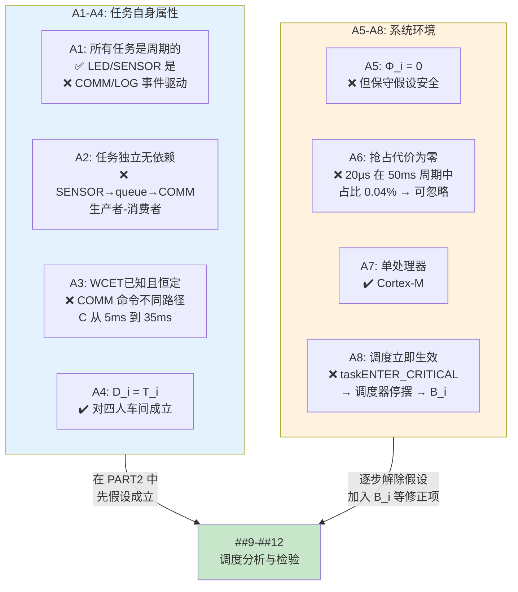
```mermaid
graph TD
    subgraph A1_A4["A1-A4: 任务自身属性"]
        A1["A1: 所有任务是周期的<br/>✅ LED/SENSOR 是<br/>❌ COMM/LOG 事件驱动"]
        A2["A2: 任务独立无依赖<br/>❌ SENSOR→queue→COMM<br/>生产者-消费者"]
        A3["A3: WCET已知且恒定<br/>❌ COMM 命令不同路径<br/>C 从 5ms 到 35ms"]
        A4["A4: D_i = T_i<br/>✔️ 对四人车间成立"]
    end

    subgraph A5_A8["A5-A8: 系统环境"]
        A5["A5: Φ_i = 0<br/>❌ 但保守假设安全"]
        A6["A6: 抢占代价为零<br/>❌ 20μs 在 50ms 周期中<br/>占比 0.04% → 可忽略"]
        A7["A7: 单处理器<br/>✔️ Cortex-M"]
        A8["A8: 调度立即生效<br/>❌ taskENTER_CRITICAL<br/>→ 调度器停摆 → B_i"]
    end

    A1_A4 -->|"在 PART2 中<br/>先假设成立"| Analysis["##9-##12<br/>调度分析与检验"]
    A5_A8 -->|"逐步解除假设<br/>加入 B_i 等修正项"| Analysis

    style A1_A4 fill:#e3f2fd
    style A5_A8 fill:#fff3e0
    style Analysis fill:#c8e6c9
```

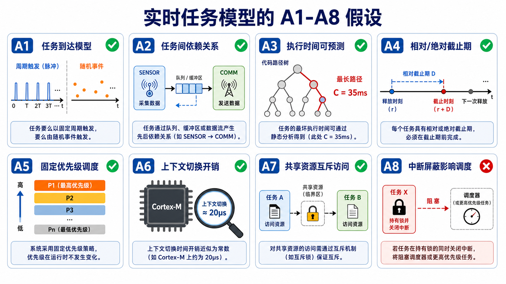

### 8.4 从 Ch6 四人车间到数学模型：一次完整的翻译

这是 ##8 最重要的思维训练。让我们用统一参数把四个工人翻译成一行形式化定义：

$$\Gamma = \{\tau_1(50, 2), \tau_2(200, 35), \tau_3(500, 60), \tau_4(1000, 100)\}$$

**步骤 1：提取每个 τ_i 的参数。**

| τ_i | 代码特征 | 提取方法 | 统一参数值 |
|:---:|------|------|:---:|
| τ₁ LED | `vTaskDelayUntil(..., 50)` → T = 50 ms | 直接读取 delay 参数 | T=50, C=2 |
| τ₁ LED | GPIO 翻转 + 示波器测量脉冲宽度 → C ≈ 2 ms | DWT cycle counter 测量 | C=2 |
| τ₂ COMM | 命令到达最小间隔 ≈ 200 ms（MIT 近似） | 示波器测量命令到达频率 | T=200, C=35 |
| τ₂ COMM | 协议解析 + 数据处理 → C ≈ 35 ms（最坏情况） | DWT cycle counter 测量 | C=35 |
| τ₃ SENSOR | `vTaskDelayUntil(..., 500)` → T = 500 ms | 直接读取 delay 参数 | T=500, C=60 |
| τ₃ SENSOR | ADC 采样 + 滤波 + 队列发送 → C ≈ 60 ms | DWT cycle counter 测量 | C=60 |
| τ₄ LOG | 日志产生频率 ≈ 每 1000 ms 一条 | 系统设计规格 | T=1000, C=100 |
| τ₄ LOG | Flash 页写入 → C ≈ 100 ms（最坏情况） | DWT cycle counter 测量 | C=100 |

**步骤 2：计算总利用率。**

$$U = \frac{2}{50} + \frac{35}{200} + \frac{60}{500} + \frac{100}{1000} = 0.04 + 0.175 + 0.12 + 0.10 = 0.435$$

**步骤 3：快速 RM bound 检验。**

n = 4, U_RM(4) = 4 × (2^(1/4) - 1) = 0.7568

0.435 ≤ 0.7568 ✓ —— RM 确保可调度！

**步骤 4：标注模型和现实的差距。**

- **差距 1（A2 数据依赖）：** SENSOR → queue → COMM 构成生产者-消费者。如果队列满且 SENSOR 用阻塞发送，SENSOR 被 COMM 间接阻塞。
- **差距 2（A8 临界区）：** LOG 持 UART mutex 的最长临界区 = 8 ms，直接成为 COMM 的 B_i。
- **差距 3（A3 WCET 波动）：** COMM 的 WCET 取决于命令类型，不同命令路径差异可达 7 倍。

这些问题将在 ##12（带 B_i 的 RTA）和 PART3（资源共享与阻塞分析）中逐一解决。

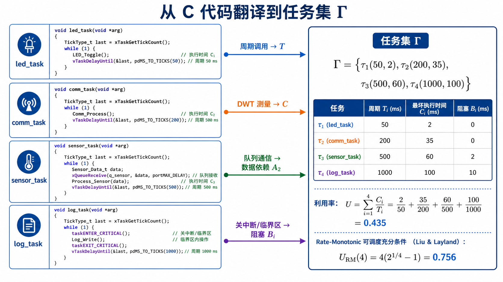

---

## 9 调度算法：谁先跑？

Γ 把四个工人的参数写成了数学语言。下一步是回答一个看起来简单的问题：**多人同时喊"到我了"，CPU 只有一颗，调度器凭什么决定谁先跑？**

这个问题有三种主流回答——对应三种调度算法。FreeRTOS 选了最务实的一种。

### 9.1 固定优先级调度：按周期排座次

#### 9.1.1 Rate Monotonic (RM)：周期越短，优先级越高

**直觉。** 车间里四个工人，谁最需要频繁上工？LED——每 50 ms 就要闪一次。谁最不急？LOG——1 秒才写一次日志。如果一个工人每分钟被叫醒 20 次，另一个只被叫醒 1 次，你自然会给忙的那个更高优先级。

这就是 **Rate Monotonic (RM)** 的全部直觉：

> **周期最短的任务，优先级最高。**

对统一参数 Γ = {τ₁(50,2), τ₂(200,35), τ₃(500,60), τ₄(1000,100)}：

| 任务 | 周期 T | RM 优先级 | 理由 |
|------|:------:|:--------:|------|
| τ₁ LED | 50 ms | **最高** | 每 50 ms 就需要 CPU |
| τ₂ COMM | 200 ms | 第二 | 200 ms 收发一次 |
| τ₃ SENSOR | 500 ms | 第三 | 半秒一次采样 |
| τ₄ LOG | 1000 ms | **最低** | 1 秒一次，可以慢慢来 |

**关键性质：RM 用的是固定优先级（Fixed Priority, FP）。** 一旦排定，LED 永远老大、LOG 永远老幺。调度器不需要"计算"优先级——优先级在编译期就已经写死在 `xTaskCreate` 的参数里。

```c
// RM 优先级在 FreeRTOS 中的直接体现
xTaskCreate(led_task,    "LED",    ..., 4, NULL);  // T=50  → pri=4 (最高)
xTaskCreate(comm_task,   "COMM",   ..., 3, NULL);  // T=200 → pri=3
xTaskCreate(sensor_task, "SENSOR", ..., 2, NULL);  // T=500 → pri=2
xTaskCreate(log_task,    "LOG",    ..., 1, NULL);  // T=1000→ pri=1 (最低)
```

#### 9.1.2 Deadline Monotonic (DM)：截止时间越紧，优先级越高

RM 隐含 D_i = T_i。但如果你的任务周期长但 deadline 短（比如紧急制动：T=100ms, D=5ms），按 T 排优先级就不对了。

**Deadline Monotonic (DM)：**

> **相对截止时间 D_i 最短的任务，优先级最高。**

当 D_i = T_i（四人车间的情况），DM **退化**成 RM——两者给出完全相同的优先级。**所以 RM 是 DM 的特例。**

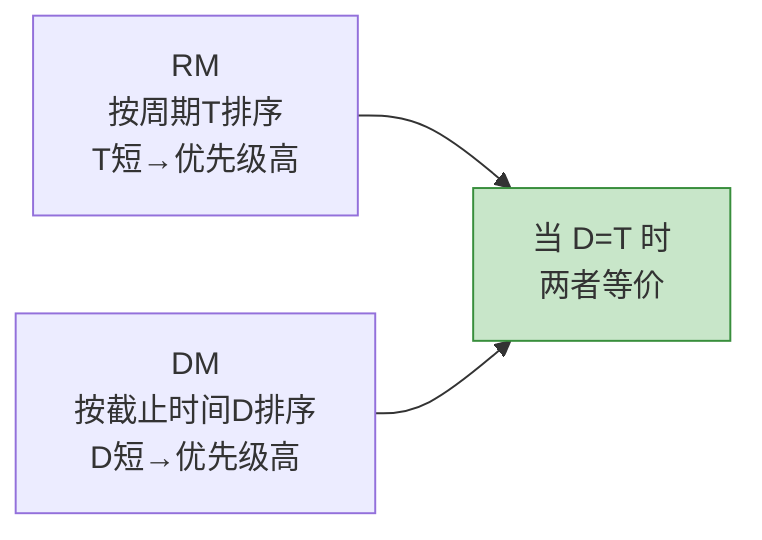
```mermaid
graph LR
    A["RM<br/>按周期T排序<br/>T短→优先级高"] --> C["当 D=T 时<br/>两者等价"]
    B["DM<br/>按截止时间D排序<br/>D短→优先级高"] --> C

    style C fill:#c8e6c9,stroke:#388e3c
```

**在我们的四人车间理论模型中，D_i = T_i 对所有任务，所以 RM 和 DM 等价。后面所有分析默认使用 RM，但请记住：如果你的 D 和 T 不一样，把 "RM" 换成 "DM" 就行。**

#### 9.1.3 RM 调度的时间线：四人车间第一版

让我们把 Γ 放在 RM 调度下，画出一个超周期（H = 1000 ms）的完整时间线：

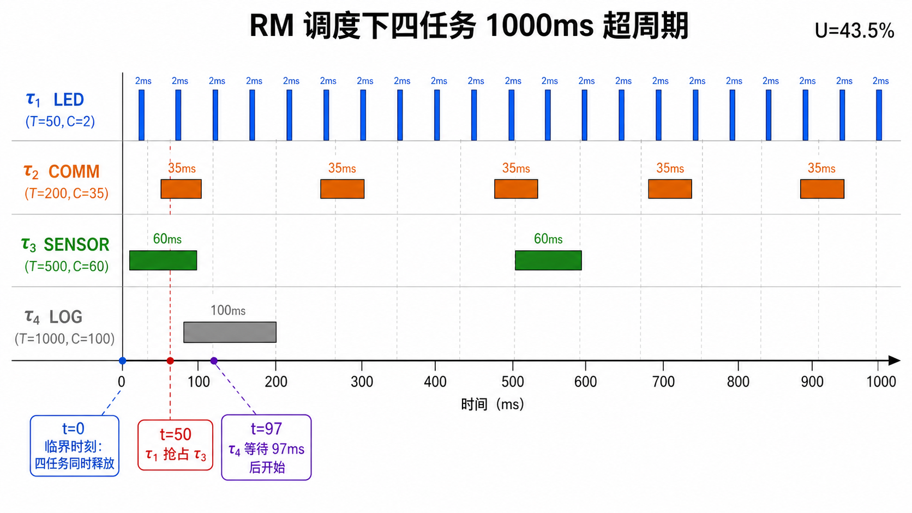

**解读这个时间线：**

- **t=0：** 四个任务同时释放（临界时刻）。τ₁（LED）优先级最高，先跑 2 ms。
- **t=2：** τ₁ 完成。τ₂（COMM）开始跑。
- **t=37：** τ₂ 跑完 35 ms。τ₃（SENSOR）开始跑。
- **t=50：** τ₁ 第二个作业释放！它抢占 τ₃。τ₁ 跑 2 ms 到 t=52。
- **t=52：** τ₁ 完成。τ₃ 继续。
- **t=97：** τ₃ 跑完 60 ms。τ₄（LOG）终于得到 CPU——它从 t=0 就开始等了！
- **t=197：** τ₄ 跑完 100 ms。CPU 空闲 3 ms。
- **t=200：** τ₁ 第 5 个作业和 τ₂ 第 2 个作业同时释放...

**关键观察：**

1. τ₁ 每次释放都**立刻抢到 CPU**——最高优先级保证立即响应。
2. τ₂ 每次被 τ₁ 抢一下（2 ms）——但 35 ms WCET 在 200 ms 周期里很宽松。
3. τ₃ 在 t=50 被 τ₁ 抢占了一次 → 响应时间从 60 ms 变成 62 ms。在 500 ms 周期里不算什么。
4. τ₄ 从 t=0 等到 t=97 才开始跑——低优先级的宿命。

> **在 RM 下，这个四人车间看起来"跑得很好"。但你怎么**证明**它一定没问题——而不是"看起来没问题"？这就是 ##10–##12 要做的事。**

### 9.2 Earliest Deadline First (EDF)：谁快到 deadline 谁先跑

RM 的规则很机械：周期短 = 优先级高，永远不变。但有没有更灵活的？有——**不要看周期，看 deadline。**

#### 9.2.1 EDF 的直觉

> **任何时候，绝对截止时间 d_{i,k} 最近的作业优先级最高。**

在 RM 下，LED 永远是老大。在 EDF 下，如果 LOG 的某个作业还有 2 ms 就到 deadline（d=1000），而 LED 刚跑完上一个作业、下一个 deadline 还有 48 ms（d=98）——还是 LED 先跑（98 < 1000）。在这个场景下 EDF 和 RM 行为一致——因为 D_i = T_i 且 U = 43.5% 很低。

但如果在另一个任务集里——τ₁(9,3), τ₂(18,5), τ₃(12,4) ——RM 会因为给 τ₁ 最高优先级而导致 τ₂ miss deadline。EDF 在 t=3 时发现 τ₃ 的 deadline = 12 < τ₂ 的 deadline = 18，正确地把优先级给了 τ₃——**这就是 EDF 比 RM 更"聪明"的地方。**

#### 9.2.2 EDF 是"动态优先级"

与 RM 不同，EDF 中同一任务的不同作业可以有不同的优先级。调度器必须在**每次调度决策时重新计算"谁的 deadline 最早"**——优先级不是写在表里的，是算出来的。

#### 9.2.3 EDF 在四人车间的表现（对比 RM）

因为 U = 0.435 远低于 100%，且 D_i = T_i，EDF 和 RM 在这个特例下产生**完全相同的调度结果**。这不是巧合——当系统利用率不高且 deadline 等于周期时，EDF 和 RM 的行为经常一致。

**EDF 和 RM 产生差异的条件：**

1. U 接近 100%（> 80%）——EDF 能调度 RM 可能不能
2. 任务集不是简单周期——EDF 更灵活
3. 存在 D_i ≪ T_i 的任务——RM 会错误地给"周期短但 deadline 松"的任务高优先级
4. 存在 D_i ≫ T_i 的任务——RM 会错误地给"周期长但 deadline 紧"的任务低优先级

在我们的四人车间中，这些条件都不成立——所以 RM 和 EDF 等价。

#### 9.2.4 为什么 FreeRTOS 选择了固定优先级

| 维度 | RM / 固定优先级 | EDF / 动态优先级 |
|------|:---:|:---:|
| **调度决策** | O(1) CLZ 指令找最高优先级 | O(n) 遍历所有任务找最小 deadline |
| **实现复杂度** | 链表数组 + 硬件 CLZ | 需要维护 deadline 有序队列 |
| **过载行为** | **可预测**——低优先级先死 | **不可预测**——任何任务都可能 miss |
| **可调度利用率** | n(2^(1/n)-1) → ln(2) ≈ 69.3% | 100% |
| **Cortex-M 友好度** | 极高 | 一般 |

这就是 FreeRTOS 选 RM 的根本原因：**不是因为它理论更优，而是因为过载时可预测——低优先级任务先牺牲，关键的高优先级任务继续跑。** 在安全关键系统中，这个"可预测的退化"比"100% 利用率"更重要。

```

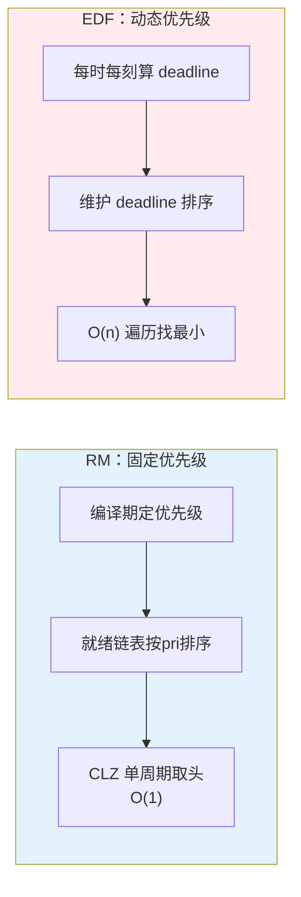
```mermaid
graph LR
    subgraph RM["RM：固定优先级"]
        A1["编译期定优先级"] --> A2["就绪链表按pri排序"] --> A3["CLZ 单周期取头<br/>O(1)"]
    end

    subgraph EDF["EDF：动态优先级"]
        B1["每时每刻算 deadline"] --> B2["维护 deadline 排序"] --> B3["O(n) 遍历找最小"]
    end

    style RM fill:#e3f2fd
    style EDF fill:#ffebee
```

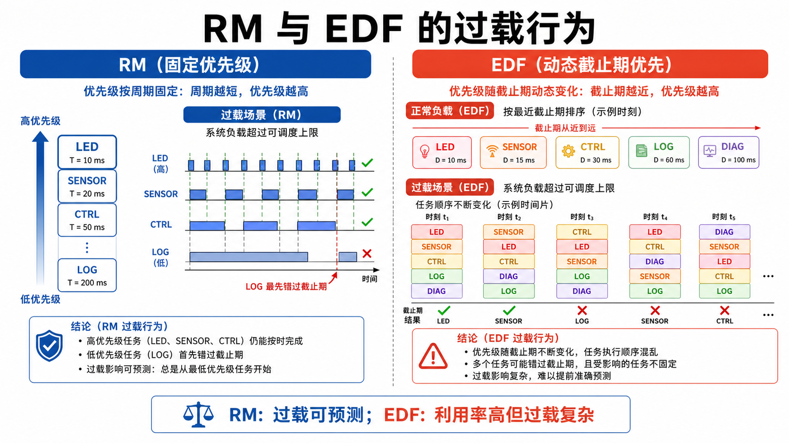

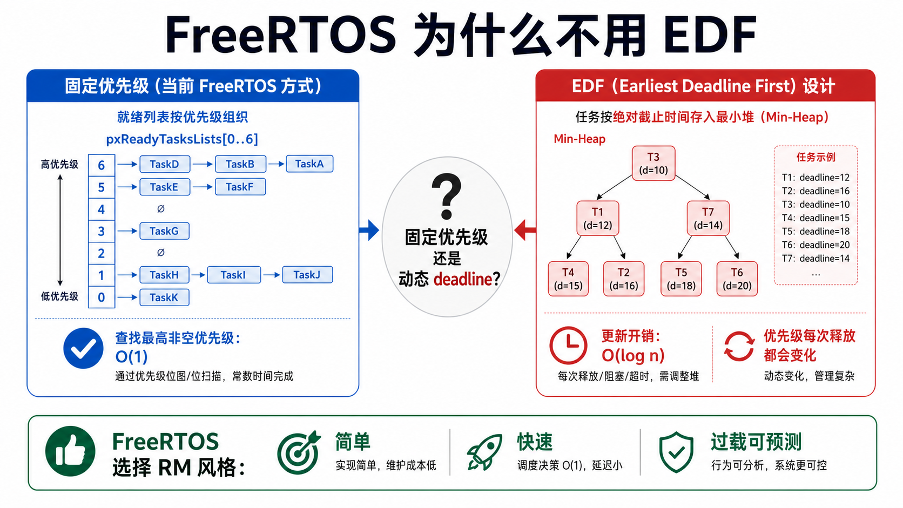

### 9.3 调度算法选择决策树

把三种算法放在一起，形成一个你在项目中可以用的决策路径：

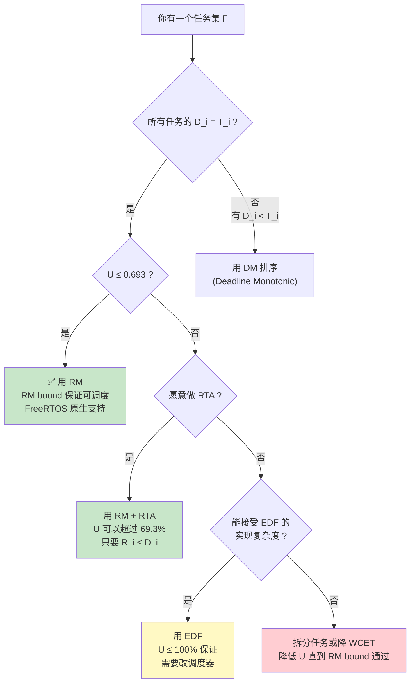
```mermaid
graph TD
    A["你有一个任务集 Γ"] --> B{"所有任务的 D_i = T_i ?"}
    B -->|"是"| C{"U ≤ 0.693 ?"}
    B -->|"否<br/>有 D_i < T_i"| F["用 DM 排序<br/>(Deadline Monotonic)"]

    C -->|"是"| D["✅ 用 RM<br/>RM bound 保证可调度<br/>FreeRTOS 原生支持"]
    C -->|"否"| E{"愿意做 RTA ?"}
    E -->|"是"| G["用 RM + RTA<br/>U 可以超过 69.3%<br/>只要 R_i ≤ D_i"]
    E -->|"否"| H{"能接受 EDF 的<br/>实现复杂度 ?"}
    H -->|"是"| I["用 EDF<br/>U ≤ 100% 保证<br/>需要改调度器"]
    H -->|"否"| J["拆分任务或降 WCET<br/>降低 U 直到 RM bound 通过"]

    style D fill:#c8e6c9
    style G fill:#c8e6c9
    style I fill:#fff9c4
    style J fill:#ffcdd2
```

**四人车间走决策树：** D_i = T_i ✓ → U = 0.435 ≤ 0.693 ✓ → 用 RM，FreeRTOS 原生支持。完美。

---

## 10 可调度性测试①：利用率上界

> 刚才你看到 RM 和 EDF 在时间线上把四个工人安排得明明白白——但那是"人工放了一遍电影"，不是"用公式检验剧本"。就像足球教练不能只是赛前看一遍战术板说"看着没问题"——他需要一个检验标准：中场球员的跑动距离有没有超过生理极限？后卫的回追速度够不够？可调度性检验就是你给实时系统的"运动科学实验室"——第一个检验最简单：**算总账，看全队的体能是否还没透支。**

### 10.1 利用率 U：你总共用了多少 CPU

**定义：** 任务 τ_i 的利用率 u_i 是它的 WCET 除以周期：

$$u_i = \frac{C_i}{T_i}$$

物理含义：任务 τ_i 在长期平均上占用了 CPU 的百分之多少。

整个任务集 Γ 的总利用率：

$$U = \sum_{i=1}^{n} u_i = \sum_{i=1}^{n} \frac{C_i}{T_i}$$

用统一参数计算：

$$U = \frac{2}{50} + \frac{35}{200} + \frac{60}{500} + \frac{100}{1000} = 0.04 + 0.175 + 0.12 + 0.10 = \boxed{0.435}$$

**翻译：四个工人加起来，平均只用了 CPU 的 43.5%。CPU 有一半以上的时间在发呆。**

### 10.2 必要条件和 RM 利用率上界

**必要条件：** U ≤ 1 是任何单处理器调度可调度的必要条件。如果 U > 1，CPU 时间不够分——必然不可调度。四人车间 U = 0.435 ≤ 1 ✓

但 U ≤ 1 只是"可能可调度"，不是"一定可调度"。

**RM 利用率上界：**

> **定理：** 对于 n 个独立、可抢占的周期任务，如果总利用率满足：
>
> $$U \leq U_{RM}(n) = n\left(2^{1/n} - 1\right)$$
>
> 则 RM 算法**保证**可调度。

**逐项解释：**
- **n**：任务数。
- **2^(1/n)**：2 的 1/n 次方——当 n=1 时 = 2，当 n→∞ 时 → 1。
- **n·(2^(1/n) - 1)**：RM 能保证的最大利用率。

**四人车间：**

$$U = 0.435 \leq U_{RM}(4) = 4 \times (2^{1/4} - 1) = 4 \times (1.1892 - 1) = 0.7568 \checkmark$$

**RM 利用率上界检验通过！** RM 保证这个四人车间可调度。

### 10.3 上界如何随 n 变化：完整数据

| 任务数 n | U_RM(n) | 近似值 |
|:-------:|:-------:|:-----:|
| 1 | 1.000 | 100% |
| 2 | 0.828 | 82.8% |
| 3 | 0.779 | 77.9% |
| **4** | **0.757** | **75.7%** |
| 5 | 0.743 | 74.3% |
| 10 | 0.718 | 71.8% |
| 20 | 0.705 | 70.5% |
| 50 | 0.698 | 69.8% |
| ∞ | **ln(2) ≈ 0.693** | **69.3%** |

**极限：** 随着 n → ∞，U_RM(n) → ln(2) ≈ 0.693。**不管你系统里有多少任务，只要把总利用率控制在 69.3% 以下，RM 保证可调度——这是一个"铁底"。**

### 10.4 RM Bound 曲线图

下图是 RM 可调度利用率上界曲线——n 从 1 到 100 时 U_RM(n) 的变化轨迹：


**分析这条曲线：**

横轴是任务数 n，纵轴是利用率上界。n=1（单任务独占）时上界是 100%。n=2 骤降到 82.8%，n=4 降到 75.7%，n=8 约 72.4%，n=16 约 70.1%。**下降最快的是 n 从 1 到 4 这一段——大部分"代价"在前几个任务就付完了。** 之后每增加一个任务，上界只微微下降一点，最终收敛到 ln(2)≈69.3%（红色虚线）。

绿色圆点标记了你的四人车间：n=4，上界 U_RM(4)=0.757。你的实际利用率 U=0.435——**深深嵌入绿色"保证可调度"区域，距离上界还有 0.322 的余量（74% 的安全垫）**。橙色虚线就是你系统的实际 U 值——在曲线上方很远的地方就已经停住了。

曲线上方的灰色区域是"RM bound 不覆盖但可能仍可调度"的区域——需要 TDA/RTA 精确检验。曲线下方的绿色区域是"RM 保证可调度"的区域。你的系统落在绿色区。

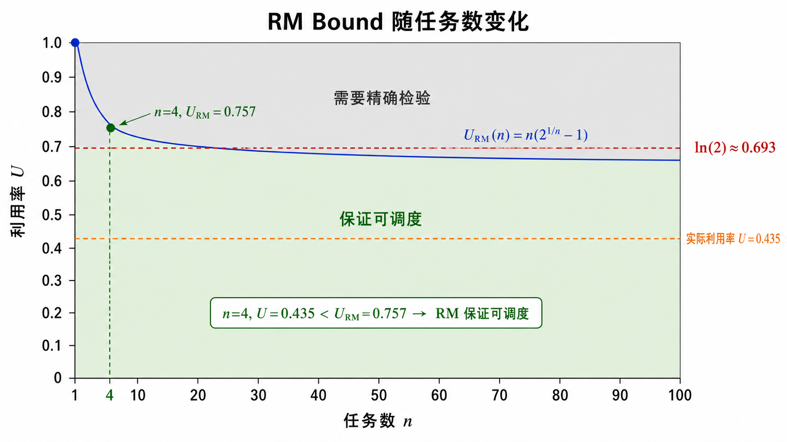

### 10.5 充分条件 vs 必要条件：RM Bound 的"保守性"

你有两个不等式：

1. **U ≤ U_RM(n)** → RM 保证可调度（**充分条件**）
2. **U > 1** → 必然不可调度（**必要条件**）

中间是灰色地带：U_RM(n) < U ≤ 1。在这个地带里，系统**可能可调度，也可能不可调度**——RM bound 不保证。你需要 ##11（TDA）和 ##12（RTA）来精确分析。

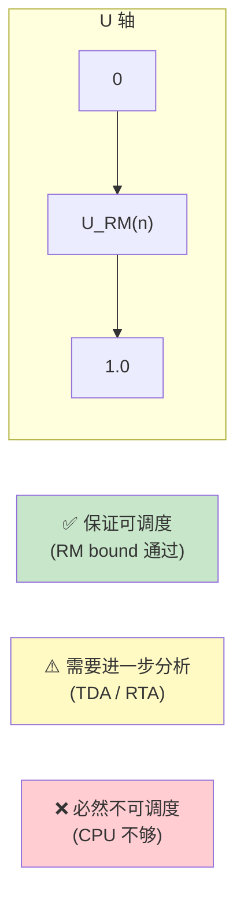
```mermaid
graph LR
    subgraph "U 轴"
        A["0"] --> B["U_RM(n)"]
        B --> C["1.0"]
    end

    A2["✅ 保证可调度<br/>(RM bound 通过)"]
    B3["⚠️ 需要进一步分析<br/>(TDA / RTA)"]
    C2["❌ 必然不可调度<br/>(CPU 不够)"]

    style A2 fill:#c8e6c9
    style B3 fill:#fff9c4
    style C2 fill:#ffcdd2
```

**对你的意义：** U = 0.435 < 0.756 → 不需要 TDA/RTA 就能证明可调度。但**你仍然需要学 TDA 和 RTA**——因为你的下一个项目利用率可能超过 69.3%，或者需要在评审会上精确解释"每个任务的响应时间是多少 ms"。

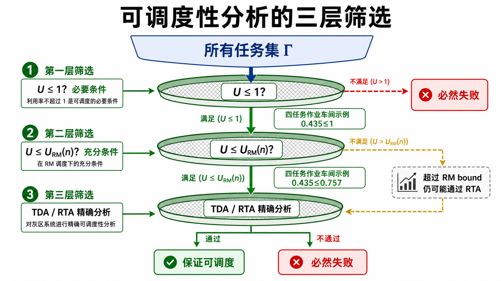


**分析这条曲线：** 横轴是任务数 n，纵轴是 RM bound U_RM(n)。当 n=1 时一个任务独占 CPU，上界是 100%。n=2 时降到约 82.8%，n=4 时是 75.7%，n=8 时约 72.4%，n=16 时约 70.1%。随着任务数增加，RM bound 递减但减速放缓——最终趋于 ln(2)≈69.3%（图中红色虚线）。

绿色点标注的是你的四人车间：n=4, U=0.435。**43.5% 远低于 75.7% 的上界——U 的箭头在 bound 线下方很远，余量充足。** 这意味着即使你再加一个任务（比如 OLED 刷新 T=100ms C=15ms，U 变成 58.5%），仍然安全。

**曲线的两个关键特征：**
1. n 从 1 到 4 的下降斜率最陡（1.0→0.757），之后再增加任务数对上界的影响越来越小——大部分"代价"在前 4 个任务就已经支付了。
2. 上界永远不会低于 ln(2)——即使 n 趋近无穷。所以如果 U 超过 69.3%，你不能用 RM bound 证明可调度，必须用 TDA/RTA。但如果 U 低于 69.3%，无论多少任务都保证可行。

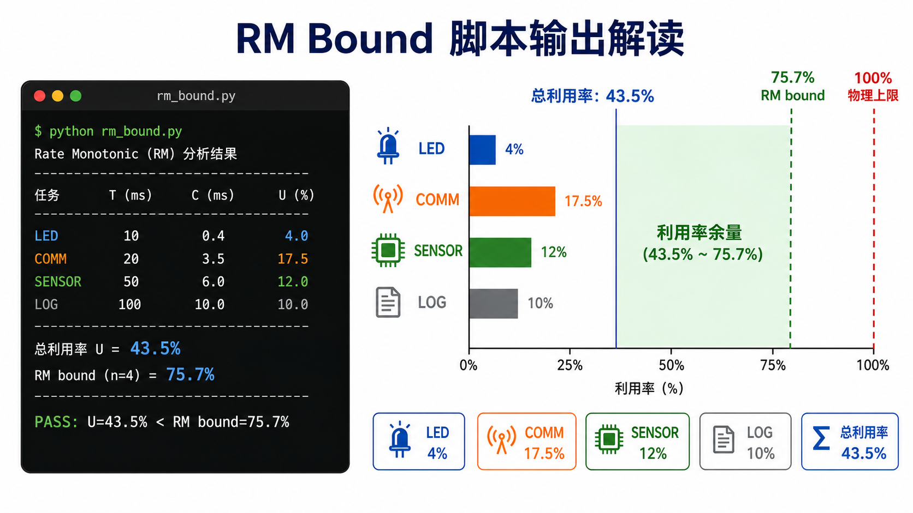

---

## 11 时间需求分析 TDA：精确到每个任务的"欠债清算"

> RM bound 像是一个"全班平均分"——告诉你整个班能不能毕业，但不知道具体谁挂科。TDA 则像**逐个学生的成绩单**——每个任务单独核算："在你的 deadline 之前，比你优先级高的任务会打断你多少次？每一次打断吃掉了你多少时间？"这种精准的"讨债计算"正是嵌入式工程师在评审会上需要掏出来的东西——不是"我觉得能跑"，而是"我算了，最坏情况 99ms，你的 deadline 是 500ms，过了。"

### 11.1 临界时刻：最坏情况什么时候发生

在进入公式之前，先理解一个关键概念：**临界时刻（critical instant）**。

> **临界时刻定理：** 在固定优先级系统中，任务 τ_i 的最坏响应时间发生在其一个作业与所有更高优先级任务的作业**同时释放**的瞬间。

**直觉：** 想象你是 τ₃（SENSOR）。你每次干活需要 60 ms。最好的情况是：你释放时其他三个工人都在睡觉——你 60 ms 就干完了。最坏的情况是：你释放时，τ₁（LED）刚释放，τ₂（COMM）也刚释放——三个工人同时喊"该我了"。你得等 τ₁（2 ms）和 τ₂（35 ms）都干完，才轮到你（60 ms）。**总等待时间 = 97 ms。**

如果 SENSOR 在最坏情况（97 ms）下都能在 500 ms 的 deadline 前完成，那么在任何其他释放时机下也一定完成。

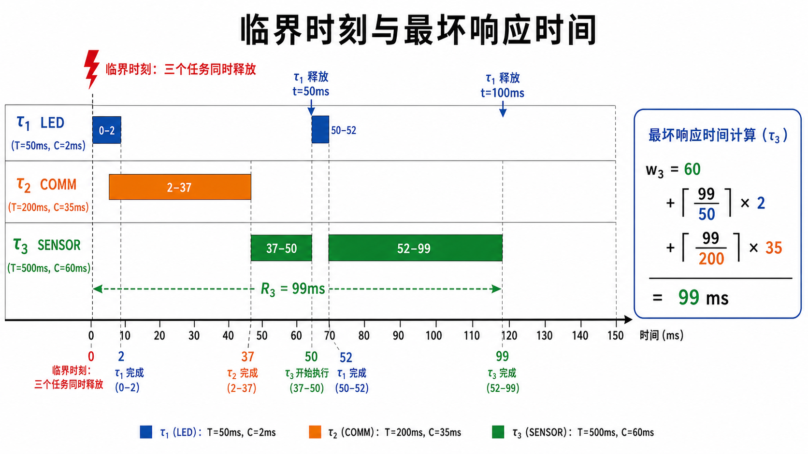

### 11.2 时间需求函数 w_i(t)：在一个时间窗口里，"讨债"多少

**定义：** 对于任务 τ_i，时间需求函数 w_i(t) 是在长度为 t 的时间窗口内，τ_i 自己和所有更高优先级任务一共需要多少 CPU 时间：

$$w_i(t) = C_i + \sum_{j \in hp(i)} \left\lceil \frac{t}{T_j} \right\rceil \cdot C_j, \quad 0 < t \leq D_i$$

**逐项翻译：**

- **C_i**：τ_i 自己需要 C_i 时间
- **hp(i)**：优先级比 τ_i 高的任务集合
- **⌈t/T_j⌉**：在时间 t 内，τ_j 最多释放了几次（天花板函数）
- **⌈t/T_j⌉·C_j**：这些释放总共需要的 CPU 时间

**物理含义：** 如果 w_i(t) ≤ t（需求 ≤ 供应），τ_i 能在 t 内完成。如果对所有 t ≤ D_i 都有 w_i(t) > t，τ_i 不可调度。

**TDA 条件：** 如果存在某个 t ≤ D_i 使得 w_i(t) ≤ t，则 τ_i 可调度。

**解法——不动点迭代：**

$$t^{(0)} = C_i + \sum_{j \in hp(i)} C_j$$

$$t^{(k+1)} = w_i(t^{(k)})$$

终止条件：t^{(k+1)} = t^{(k)}（收敛）或 t^{(k)} > D_i（超出 deadline）。

```

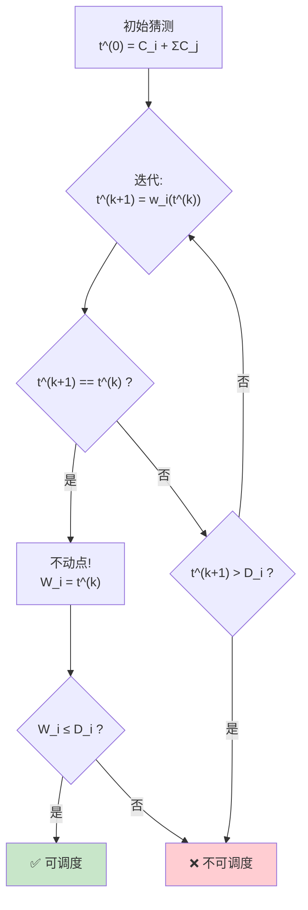
```mermaid
flowchart TD
    A["初始猜测<br/>t^(0) = C_i + ΣC_j"] --> B{"迭代:<br/>t^(k+1) = w_i(t^(k))"}
    B --> C{"t^(k+1) == t^(k) ?"}
    C -->|"是"| D["不动点!<br/>W_i = t^(k)"]
    C -->|"否"| E{"t^(k+1) > D_i ?"}
    E -->|"是"| F["❌ 不可调度"]
    E -->|"否"| B
    D --> G{"W_i ≤ D_i ?"}
    G -->|"是"| H["✅ 可调度"]
    G -->|"否"| F

    style H fill:#c8e6c9
    style F fill:#ffcdd2
```

### 11.3 手工迭代演算：τ₃ (SENSOR) 的 TDA

用统一参数，对 τ₃（SENSOR）做完整的不动点迭代。

**参数：** τ₃: T=500, C=60, D=500。hp(3) = {τ₁(LED): T=50, C=2, τ₂(COMM): T=200, C=35}

$$w_3(t) = 60 + \left\lceil \frac{t}{50} \right\rceil \cdot 2 + \left\lceil \frac{t}{200} \right\rceil \cdot 35$$

**步骤 0——初始猜测：**

$$t^{(0)} = C_3 + C_2 + C_1 = 60 + 35 + 2 = 97$$

为什么是 97？临界时刻——三个任务各至少跑一次。

---

**步骤 1——第一次迭代：**

$$\begin{aligned}
\left\lceil \frac{97}{50} \right\rceil &= \lceil 1.94 \rceil = 2 \\
\left\lceil \frac{97}{200} \right\rceil &= \lceil 0.485 \rceil = 1 \\[4pt]
w_3(97) &= 60 + 2 \cdot 2 + 1 \cdot 35 \\
        &= 60 + 4 + 35 \\
        &= \boxed{99}
\end{aligned}$$

在 97 ms 内，LED 最多释放 **2 次**（每 50 ms 一个），COMM 释放 **1 次**。总共需要 99 ms > 97 ms——需求超过了供应！t 必须增大。

---

**步骤 2——第二次迭代：**

$$\begin{aligned}
\left\lceil \frac{99}{50} \right\rceil &= \lceil 1.98 \rceil = 2 \\
\left\lceil \frac{99}{200} \right\rceil &= \lceil 0.495 \rceil = 1 \\[4pt]
w_3(99) &= 60 + 2 \cdot 2 + 1 \cdot 35 \\
        &= 60 + 4 + 35 \\
        &= \boxed{99}
\end{aligned}$$

**t^{(2)} = 99 = t^{(1)}！不动点找到！**

---

$$W_3 = 99 \text{ ms} < D_3 = 500 \text{ ms} \quad \checkmark$$

**SENSOR 的最坏响应时间 = 99 ms——距离 500 ms deadline 还有 401 ms 的余量。**

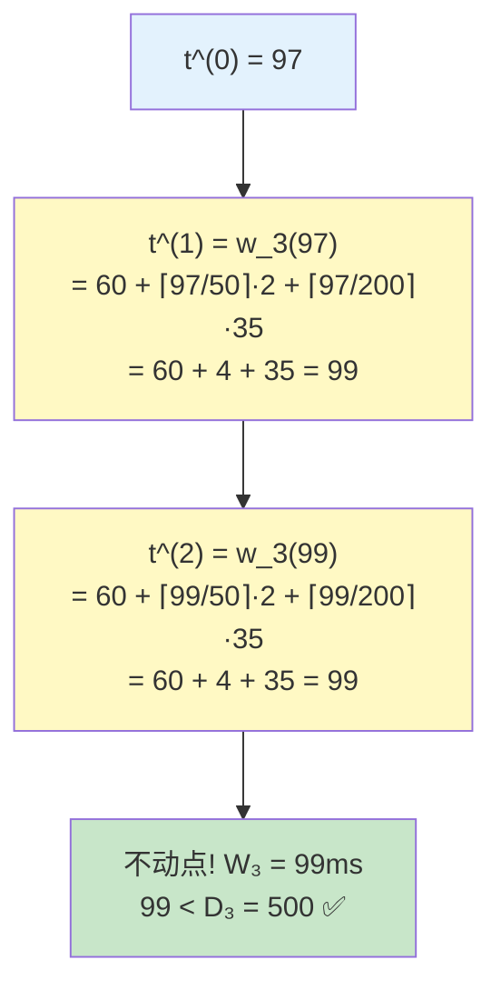
```mermaid
graph TD
    A["t^(0) = 97"] --> B["t^(1) = w_3(97)<br/>= 60 + ⌈97/50⌉·2 + ⌈97/200⌉·35<br/>= 60 + 4 + 35 = 99"]
    B --> C["t^(2) = w_3(99)<br/>= 60 + ⌈99/50⌉·2 + ⌈99/200⌉·35<br/>= 60 + 4 + 35 = 99"]
    C --> D["不动点! W₃ = 99ms<br/>99 < D₃ = 500 ✅"]

    style A fill:#e3f2fd
    style B fill:#fff9c4
    style C fill:#fff9c4
    style D fill:#c8e6c9
```

**你看到迭代的意义了吗？** 初始猜 97 ms（"三个任务各跑一次"），但 LED 在 97 ms 内实际可能释放 2 次（97/50 = 1.94 → 天花板得 2）——多抢了一次，所以需要 99 ms。第二次迭代时，99 ms 内 LED 仍然只释放 2 次（99/50 = 1.98，天花板还是 2）——需求没再增加，收敛了。

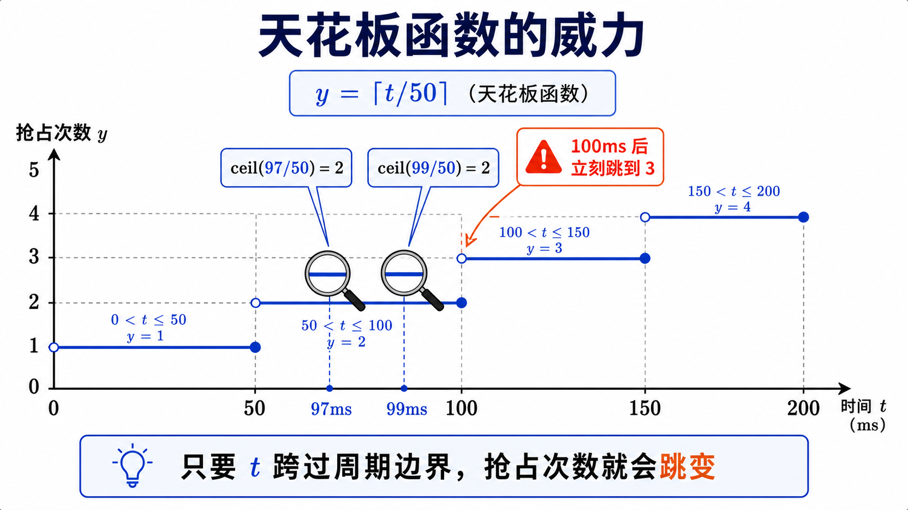

### 11.4 四人车间全部四个任务的 TDA 汇总

为完整性，列出 τ₁、τ₂、τ₄ 的 TDA 结果（验证过程省略，代入公式即可）：

**τ₁ (LED)：** w₁(t) = C₁ = 2。无高优先级任务 → **W₁ = 2 ms** < D₁ = 50 ✓

**τ₂ (COMM)：** w₂(t) = 35 + ⌈t/50⌉·2

- t^(0)=37, t^(1)=35+⌈37/50⌉·2=35+2=37 → **W₂ = 37 ms** < D₂ = 200 ✓

**τ₄ (LOG)：** w₄(t) = 100 + ⌈t/50⌉·2 + ⌈t/200⌉·35 + ⌈t/500⌉·60

- t^(0)=197, t^(1)=100+4·2+1·35+1·60=203
- t^(2)=100+5·2+2·35+1·60=240（跨越 t=200 边界，COMM 从 1→2 次！）
- t^(3)=100+5·2+2·35+1·60=240 → **W₄ = 240 ms** < D₄ = 1000 ✓

| 任务 | W_i (ms) | D_i (ms) | 余量 | 结果 |
|------|:------:|:------:|:----:|:----:|
| τ₁ LED | 2 | 50 | 48 ms (96%) | ✅ |
| τ₂ COMM | 37 | 200 | 163 ms (81.5%) | ✅ |
| τ₃ SENSOR | 99 | 500 | 401 ms (80.2%) | ✅ |
| τ₄ LOG | 240 | 1000 | 760 ms (76%) | ✅ |

**全部四个任务通过 TDA 检验。**

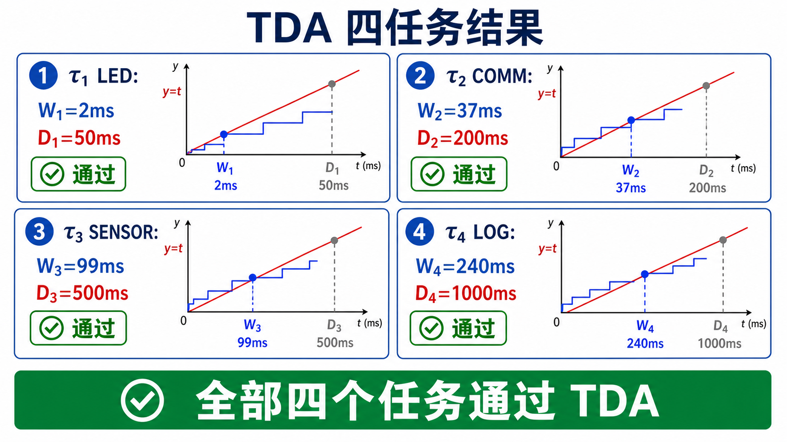

### 11.5 TDA 的核心教训：天花板函数是你的敌人

回看 τ₄ 的迭代——t 从 197 跳到 203 时越过了 200 边界，导致 ⌈t/200⌉ 从 1 变成 2，COMM 多释放了一次，需求从 203 跳到 240。

**这就是天花板函数的正反馈回路：**

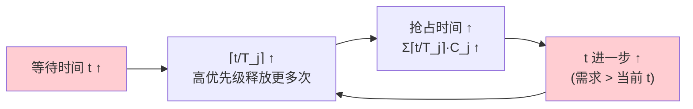
```mermaid
graph LR
    A["等待时间 t ↑"] --> B["⌈t/T_j⌉ ↑<br/>高优先级释放更多次"]
    B --> C["抢占时间 ↑<br/>Σ⌈t/T_j⌉·C_j ↑"]
    C --> D["t 进一步 ↑<br/>(需求 > 当前 t)"]
    D --> B

    style A fill:#ffcdd2
    style D fill:#ffcdd2
```

**工程含义：** 如果你的低优先级任务刚好处在"接近 deadline"的边缘，不要乐观——任何微小的 WCET 增长都可能推过下一个 T_j 边界，触发连锁跳跃。系统的可调度性余量越小，这种效应越危险。

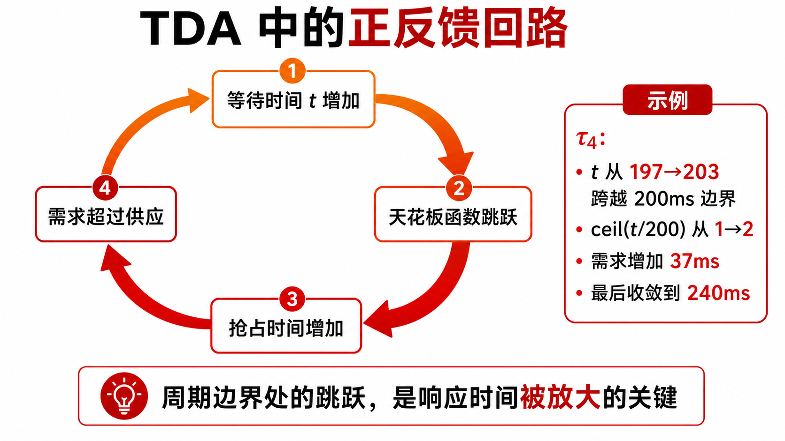

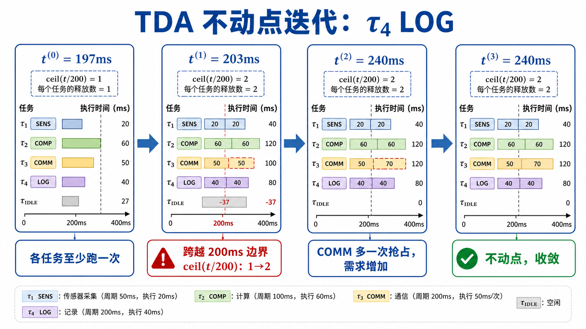

---

## 12 响应时间分析 RTA：加上阻塞的工程级精度

> TDA 算出 τ₃ 最坏要等 99ms——前提是没人锁着资源不放。现实呢？LOG 任务可能正拿着 UART mutex 写 Flash（8ms 临界区），COMM 想发数据但被锁在门外。这 8ms 不是"LOG 在跑"——这是"COMM 在等 LOG 放锁"。TDA 的纯抢占模型看不到这个等待。RTA 就像给每个任务加了一面**"交通信号灯"**——计算的不只是"高优先级抢了多少次"，还有"低优先级锁了多久门"。

### 12.1 响应时间公式（带阻塞 B_i）

**定义：** 任务 τ_i 的最坏响应时间 R_i：

$$R_i = B_i + C_i + \sum_{j \in hp(i)} \left\lceil \frac{R_i}{T_j} \right\rceil \cdot C_j$$

逐项对比 TDA：

| 项 | TDA 的 w_i(t) | RTA 的 R_i | 差异 |
|------|------|------|------|
| 自身 WCET | C_i | C_i | 相同 |
| 高优抢占 | Σ⌈t/T_j⌉·C_j | Σ⌈R_i/T_j⌉·C_j | 变量名不同，本质相同 |
| 阻塞 | **没有** | **B_i** | **RTA 独有！** |

**B_i 的物理含义：** τ_i 被**更低优先级任务**阻塞的最长时间。阻塞来源：
- 低优先级任务持有 τ_i 需要的 mutex/信号量
- 低优先级任务的关中断临界区（`taskENTER_CRITICAL()`）
- 低优先级任务的关调度器区间（`vTaskSuspendAll()`）

在四人车间中，假设 UART mutex 由 τ₂ (COMM) 和 τ₄ (LOG) 共享：
- τ₄ (LOG) 在 UART mutex 上的最长临界区 = **8 ms**
- τ₂ (COMM) 访问 UART mutex → B₂ = δ₄ = 8 ms
- τ₃ (SENSOR) 不访问 UART mutex，但 τ₂（比 τ₃ 优先级高）访问它 → B₃ = 8 ms（保守）

### 12.2 手工迭代演算：τ₂ (COMM) 的 RTA（带阻塞）

**参数：** τ₂: T=200, C=35, D=200, B₂=8。hp(2) = {τ₁(LED): T=50, C=2}

$$R_2^{(k+1)} = 8 + 35 + \left\lceil \frac{R_2^{(k)}}{50} \right\rceil \cdot 2$$

**步骤 0：**

$$R_2^{(0)} = B_2 + C_2 = 8 + 35 = 43$$

**步骤 1：**

$$\begin{aligned}
R_2^{(1)} &= 43 + \left\lceil \frac{43}{50} \right\rceil \cdot 2 \\
          &= 43 + \lceil 0.86 \rceil \cdot 2 \\
          &= 43 + 2 = \boxed{45}
\end{aligned}$$

**步骤 2：**

$$\begin{aligned}
R_2^{(2)} &= 43 + \left\lceil \frac{45}{50} \right\rceil \cdot 2 \\
          &= 43 + \lceil 0.90 \rceil \cdot 2 \\
          &= 43 + 2 = \boxed{45}
\end{aligned}$$

**不动点！** R₂ = 45 ms。对比无阻塞（B₂=0）的 TDA 结果 W₂ = 37 ms：**阻塞让响应时间增加了 8 ms（+21.6%）——恰好是 B₂ 的值**。在 200 ms deadline 下仍然宽裕。

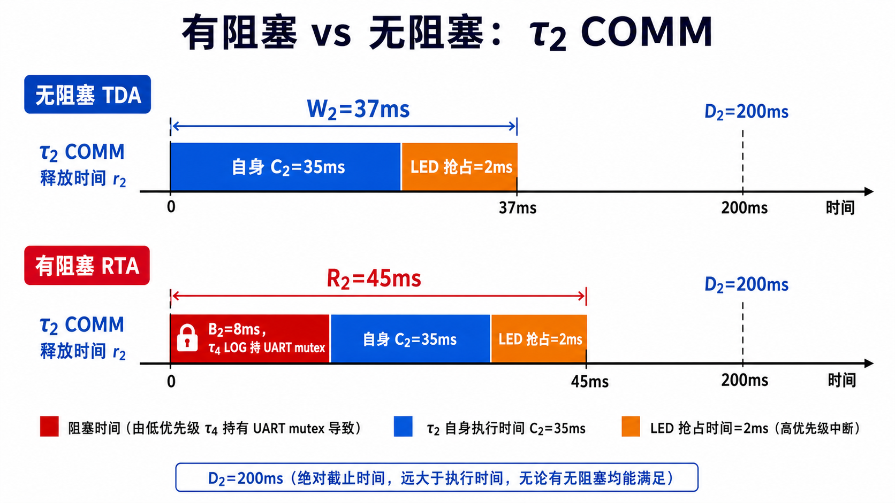

### 12.3 继续演算：τ₃ (SENSOR) 的 RTA

**参数：** τ₃: T=500, C=60, D=500, B₃=8。hp(3) = {τ₁(T=50,C=2), τ₂(T=200,C=35)}

$$R_3^{(k+1)} = 8 + 60 + \left\lceil \frac{R_3^{(k)}}{50} \right\rceil \cdot 2 + \left\lceil \frac{R_3^{(k)}}{200} \right\rceil \cdot 35$$

**步骤 0：** R₃^(0) = 8 + 60 = 68

**步骤 1：**

$$\begin{aligned}
R_3^{(1)} &= 68 + \left\lceil \frac{68}{50} \right\rceil \cdot 2 + \left\lceil \frac{68}{200} \right\rceil \cdot 35 \\
          &= 68 + \lceil 1.36 \rceil \cdot 2 + \lceil 0.34 \rceil \cdot 35 \\
          &= 68 + 2 \cdot 2 + 1 \cdot 35 \\
          &= 68 + 4 + 35 = \boxed{107}
\end{aligned}$$

**步骤 2：**

$$\begin{aligned}
R_3^{(2)} &= 68 + \left\lceil \frac{107}{50} \right\rceil \cdot 2 + \left\lceil \frac{107}{200} \right\rceil \cdot 35 \\
          &= 68 + \lceil 2.14 \rceil \cdot 2 + \lceil 0.535 \rceil \cdot 35 \\
          &= 68 + 3 \cdot 2 + 1 \cdot 35 \\
          &= 68 + 6 + 35 = \boxed{109}
\end{aligned}$$

注意这里：R 从 68 → 107 时越过了 t=100 边界 → ⌈t/50⌉ 从 2 跳到 3！LED 多释放了一次（+2ms）。

**步骤 3：**

$$\begin{aligned}
R_3^{(3)} &= 68 + \left\lceil \frac{109}{50} \right\rceil \cdot 2 + \left\lceil \frac{109}{200} \right\rceil \cdot 35 \\
          &= 68 + \lceil 2.18 \rceil \cdot 2 + \lceil 0.545 \rceil \cdot 35 \\
          &= 68 + 3 \cdot 2 + 1 \cdot 35 \\
          &= 68 + 6 + 35 = \boxed{109}
\end{aligned}$$

**不动点！** R₃ = 109 ms。对比无阻塞的 TDA 结果 W₃ = 99 ms：**差 = 109 - 99 = 10 ms = B₃(8) + 额外抢占(2)。**

**关键洞察：阻塞不只是"加 8 ms"——它还通过正反馈回路放大自己。** R 增大 → ⌈R/T_j⌉ 可能跳跃 → 高优先级任务释放更多次 → R 进一步增大。在这个例子里，R 从 99 → 109 跨越了 t=100 这个 50 的倍数边界，导致 LED 额外多抢了一次（+2 ms）。

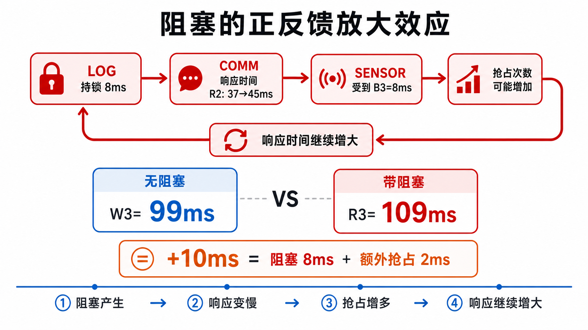

### 12.4 τ₁ 和 τ₄ 的 RTA（略）

**τ₁ (LED)：** B₁=0, C₁=2, hp(1)=∅ → R₁=2 < D₁=50 ✓

**τ₄ (LOG)：** B₄=0, C₄=100, hp(4)={τ₁,τ₂,τ₃} → 与 TDA 相同：R₄=240 < D₄=1000 ✓

### 12.5 最终 RTA 结果汇总

| 任务 | B_i (ms) | R_i (ms) | D_i (ms) | R_i / D_i | 结果 |
|------|:------:|:------:|:------:|:------:|:----:|
| τ₁ LED | 0 | 2 | 50 | 4% | ✅ |
| τ₂ COMM | 8 | 45 | 200 | 22.5% | ✅ |
| τ₃ SENSOR | 8 | 109 | 500 | 21.8% | ✅ |
| τ₄ LOG | 0 | 240 | 1000 | 24% | ✅ |

**全部四个任务在带阻塞（UART mutex）的情况下通过 RTA 检验。**

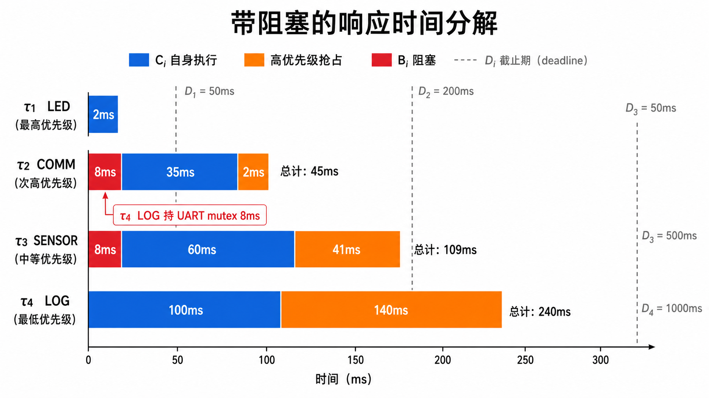

### 12.6 B_i 的工程来源：五种阻塞源头

在你的 FreeRTOS 工程中，B_i 来自五个源头：

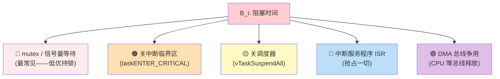
```mermaid
graph TD
    B["B_i: 阻塞时间"] --> S1["🔴 mutex / 信号量等待<br/>(最常见——低优持锁)"]
    B --> S2["🟠 关中断临界区<br/>(taskENTER_CRITICAL)"]
    B --> S3["🟡 关调度器<br/>(vTaskSuspendAll)"]
    B --> S4["🔵 中断服务程序 ISR<br/>(抢占一切)"]
    B --> S5["🟣 DMA 总线争用<br/>(CPU 等总线释放)"]

    style B fill:#ffcdd2
    style S1 fill:#ffebee
    style S2 fill:#ffe0b2
    style S3 fill:#fff9c4
    style S4 fill:#bbdefb
    style S5 fill:#e1bee7
```

**系统计算 B_i 的方法：**
1. 列出所有共享资源
2. 列出每个任务在每个资源上的最长临界区长度
3. 对每个 τ_i，找出所有"更低优先级且持有 τ_i 或其高优先级任务需要的资源"的任务
4. B_i = 这些任务的最长临界区之最大值
5. 加上最长 ISR 时间 + 最长关中断时间

### 12.7 Python 脚本：自动 RTA 计算

```python
#!/usr/bin/env python3
"""
RTA 自动化脚本 — 支持阻塞时间 B_i
统一参数：τ₁(50,2), τ₂(200,35), τ₃(500,60), τ₄(1000,100)
"""

import math

tasks = [
    # name      T     C    D     B  priority
    ("LED",     50,    2,   50,   0, 4),
    ("COMM",   200,   35,  200,   8, 3),
    ("SENSOR", 500,   60,  500,   8, 2),
    ("LOG",   1000,  100, 1000,   0, 1),
]

tasks_sorted = sorted(tasks, key=lambda t: t[5], reverse=True)

print("=" * 68)
print(f"{'任务':<10} {'T':<7} {'C':<7} {'B':<7} {'D':<7} {'Pri':<5}")
print("-" * 68)

U = 0.0
for t in tasks_sorted:
    name, T, C, D, B, P = t
    u = C / T
    U += u
    print(f"{name:<10} {T:<7} {C:<7} {B:<7} {D:<7} {P:<5}")

print("-" * 68)
print(f"总利用率 U = {U:.4f}")

urm = len(tasks) * (2 ** (1/len(tasks)) - 1)
print(f"RM bound U_RM = {urm:.4f}")
print(f"{'✅ RM bound 通过' if U <= urm else '⚠️ 需 RTA 精确分析'}")

print(f"\n{'='*68}")
print("RTA 迭代计算")
print(f"{'='*68}")

all_pass = True
results = []

for t in tasks_sorted:
    name, T, C, D, B, P = t
    hp_tasks = [(n, Tj, Cj) for n, Tj, Cj, Dj, Bj, Pj in tasks_sorted if Pj > P]

    R = C + B
    print(f"\n--- {name} (T={T}, C={C}, B={B}, D={D}) ---")
    print(f"  R^(0) = C + B = {R}")

    iteration = 0
    while True:
        prev_R = R
        preempt = 0
        for n, Tj, Cj in hp_tasks:
            count = math.ceil(prev_R / Tj)
            contrib = count * Cj
            preempt += contrib
            if count > 0:
                print(f"    ⌈{prev_R}/{Tj}⌉ × {Cj} = {count} × {Cj} = {contrib}  [{n}]")

        R = B + C + preempt
        iteration += 1

        if R == prev_R:
            print(f"  --> R^({iteration}) = {R}  ← 不动点!")
            break
        elif R > D:
            print(f"  --> R^({iteration}) = {R} > D = {D}  ❌")
            all_pass = False
            break
        else:
            print(f"  --> R^({iteration}) = {R}")

        if iteration > 50:
            print(f"  ❌ 不收敛!")
            all_pass = False
            break

    if R <= D:
        print(f"  ✅ R_{name} = {R} ≤ D = {D} (余量 {D-R}ms)")
        results.append((name, R, D, D-R))
    elif R > D:
        print(f"  ❌ R_{name} = {R} > D = {D}")

print(f"\n{'='*68}")
if all_pass:
    print("✅ 结论: 所有任务可调度！")
else:
    print("❌ 结论: 存在不可调度任务！")
print(f"{'='*68}")
```

### 12.8 三种检验工具的对比与使用时机

| 检验工具 | 公式 | 复杂度 | 输出 | 何时用 |
|----------|------|:---:|------|------|
| **RM bound** | U ≤ n(2^(1/n)-1) | 心算 | 是/否 | 项目初期快速筛选 |
| **TDA** | w_i(t) 不动点迭代 | 手工迭代 | W_i (纯抢占) | U > RM bound 时精确分析 |
| **RTA** | R_i = B_i + C_i + Σ⌈R_i/T_j⌉·C_j | 手工/脚本 | R_i (带阻塞) | 有资源共享/阻塞时 |

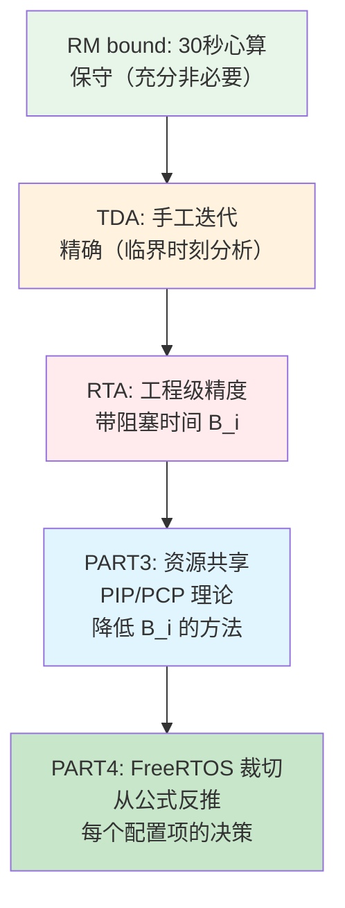
```mermaid
graph TD
    A["RM bound: 30秒心算<br/>保守（充分非必要）"] --> B["TDA: 手工迭代<br/>精确（临界时刻分析）"]
    B --> C["RTA: 工程级精度<br/>带阻塞时间 B_i"]
    C --> D["PART3: 资源共享<br/>PIP/PCP 理论<br/>降低 B_i 的方法"]
    D --> E["PART4: FreeRTOS 裁切<br/>从公式反推<br/>每个配置项的决策"]

    style A fill:#e8f5e9
    style B fill:#fff3e0
    style C fill:#ffebee
    style D fill:#e1f5fe
    style E fill:#c8e6c9
```

**四人车间走了完整路径：**
1. RM bound：U=0.435 < 0.757 → 快速通过 ✓
2. TDA：W₁=2, W₂=37, W₃=99, W₄=240——全部远低于 deadline ✓
3. RTA：R₁=2, R₂=45, R₃=109, R₄=240——带阻塞仍然全部通过 ✓

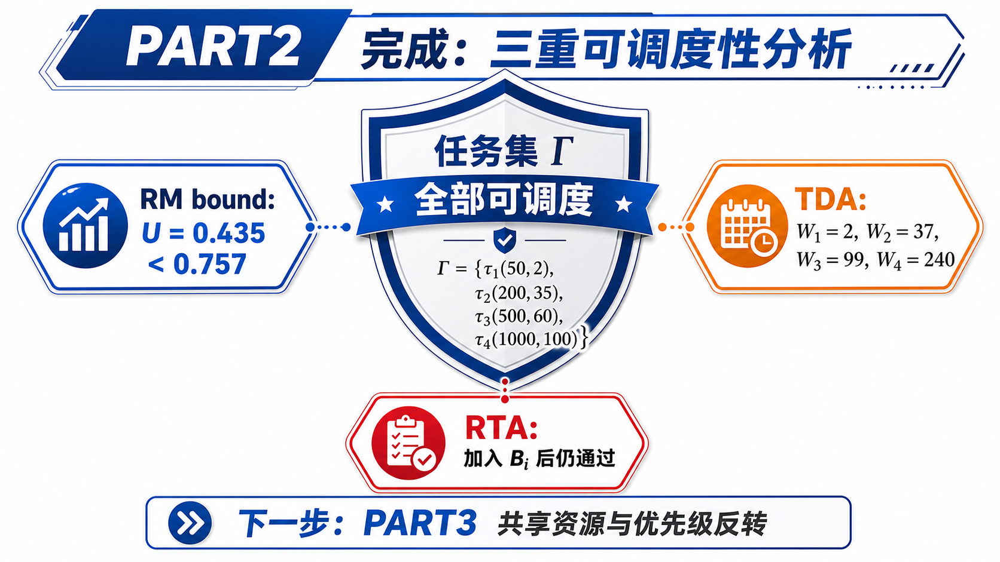

---

你在 用三种数学工具证明了四人车间"跑得过来"。但有一个幽灵你没处理——**优先级反转**。当 LOG 拿着 UART mutex，COMM 在等它，而 SENSOR 在中间反复抢占 LOG 时——COMM 的响应时间不再是 RTA 算出来的 45 ms，而可能是 200 ms、500 ms、甚至永远。这就是 PART3 要讲的故事——以及 FreeRTOS mutex 源码里的优先级继承协议如何把这头怪兽关进笼子。

---

# PART 3 · 资源共享与优先级反转

你在 PART1 学会了把 Ch6 四人车间翻译成数学参数——τ₁(LED, T=50ms, C=2ms)、τ₂(COMM, T=200ms, C=35ms)、τ₃(SENSOR, T=500ms, C=60ms)、τ₄(LOG, T=1000ms, C=100ms)。你在 PART2 用 RM 分配了优先级、用 EDF 理解了最优调度、用 RTA 逐任务验证了 deadline。结论：总利用率 43.5%，RM bound 判定可调度，RTA 也确认了所有任务的响应时间都在 deadline 之内。

但这里有一个你没问过的问题：**PART2 的所有分析都基于一个假设——任务之间完全独立，谁也不需要等谁。**

这个假设在真实系统里从一开始就不成立。你的 COMM 任务需要写 UART 寄存器（可能被 LOG 占用），你的 SENSOR 任务需要读 ADC（可能被 DMA 使用），你的 LED 任务可能因为调试需要和 LOG 共享同一个 GPIO 组。当一个低优先级任务拿着锁不放，而一个高优先级任务在等这把锁——调度器的数学逻辑就会产生一个它无法自行修复的后果：**优先级反转。**

优先级反转不是 bug，不是 FreeRTOS 的实现瑕疵，不是"代码没写好"。它是**固定优先级抢占式调度的数学必然**——只要存在共享资源和优先级分层，反转就一定会发生，区别只是控制还是失控。1997 年 7 月 4 日，美国 JPL 的火星探路者号（Mars Pathfinder）在 2 亿公里外的火星表面着陆。几天后，它开始莫名其妙地反复复位。工程师在实验室里用了三周时间复现问题，最终定位到——**无界优先级反转**。修复方案飞了 2 亿公里：在 mutex 上启用优先级继承。这是嵌入式系统史上最昂贵的一堂理论课。

这一 PART 的目标不是让你"会用 mutex"——Ch6 你已经会了。这一 PART 要让你理解：**为什么需要 mutex 的优先级继承、它解决的是什么数学问题、它不能解决的是什么、以及理论的下一件武器（PCP）长什么样。**

---

## 13 资源模型与临界区

PART2 的可调度性分析建立在任务独立的假设之上。现在你要把这个假设拆掉——在任务模型里加入"资源"，因为资源是阻塞的根源，而阻塞是优先级反转的根源。

### 13.1 互斥资源的形式化

#### 资源的定义

**资源 S** 是"任何软件结构，任务可以用它来推进自己的执行"。

这个定义比你直觉上的"硬件外设"宽得多。在你的 STM32 工程里，以下全部是"资源"：

| 资源类别 | 具体例子 | 共享方式 |
|---------|---------|---------|
| 物理外设 | SPI 控制器、I2C 总线、CAN mailbox、DMA 通道、UART 发送寄存器 | 多任务竞争同一外设 |
| 内存数据结构 | 环形缓冲区（ring buffer）、日志数组、系统配置表、传感器数据缓存 | 一写多读或多写多读 |
| 软件对象 | FreeRTOS queue 的内部缓冲区、文件系统句柄、`printf()` 的标准输出 | 通过 API 隐式共享 |
| 硬件寄存器组 | GPIO 的 BSRR 寄存器、定时器的 CCR 捕获/比较寄存器 | 读-改-写竞态 |

按访问权限分三类：

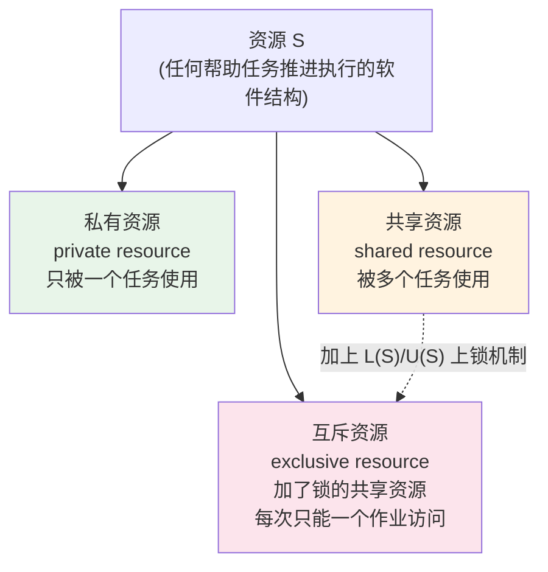
```mermaid
graph TD
    R["资源 S<br/>(任何帮助任务推进执行的软件结构)"] --> A["私有资源<br/>private resource<br/>只被一个任务使用"]
    R --> B["共享资源<br/>shared resource<br/>被多个任务使用"]
    R --> C["互斥资源<br/>exclusive resource<br/>加了锁的共享资源<br/>每次只能一个作业访问"]
    
    B -.->|"加上 L(S)/U(S) 上锁机制"| C
    
    style A fill:#e8f5e9,color:#333
    style B fill:#fff3e0,color:#333
    style C fill:#fce4ec,color:#333
```

- **私有资源**：专属于某一个任务。比如每个任务的局部变量、自己的栈空间、用 `taskENTER_CRITICAL()` 包住的私有链表。不存在竞争，不需要保护。
- **共享资源**：可以被多个任务使用。但"共享"不意味着"同时"——如果任务 A 和任务 B 同时写同一个地址，结果不可预测（data race）。这是你需要保护的。
- **互斥资源**：加了锁的共享资源。每次只有一个作业能访问——这是本章讨论的全部对象。为简单起见，只讨论**单 unit 的互斥资源**（不像 counting semaphore 可以有多个 unit）。

#### 上锁/解锁的形式化建模

在理论模型中，互斥资源的访问建模为两个原子操作：

| 操作 | 形式化符号 | 语义 | FreeRTOS 对应 |
|------|-----------|------|---------------|
| **上锁** | `L(S)` — lock resource S | 请求资源 S。若空闲则分配，否则请求者阻塞 | `xSemaphoreTake(mutex, timeout)` |
| **解锁** | `U(S)` — unlock resource S | 释放资源 S。若有等待者则唤醒优先级最高者 | `xSemaphoreGive(mutex)` |

当一个作业执行 `L(S)` 时：
- 如果 S 空闲 → 锁成功，作业进入临界区，资源 S 标记为"被占用"
- 如果 S 被占用 → 锁失败，作业被**阻塞（blocked）**，从 Running 状态转入 Blocked 状态，CPU 释放给其他就绪任务

下面是资源状态的形式化转换图——注意 `L(S)` 和 `U(S)` 如何造成任务状态转移：

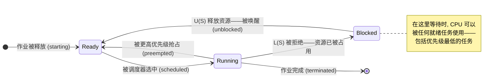
```mermaid
stateDiagram-v2
    direction LR
    [*] --> Ready : 作业被释放 (starting)
    Ready --> Running : 被调度器选中 (scheduled)
    Running --> Ready : 被更高优先级抢占 (preempted)
    Running --> Blocked : L(S) 被拒绝——资源已被占用
    Blocked --> Ready : U(S) 释放资源——被唤醒 (unblocked)
    Running --> [*] : 作业完成 (terminated)
    
    note right of Blocked
        在这里等待时, CPU 可以
        被任何就绪任务使用——
        包括优先级最低的任务
    end note
```

**这个"Blocked → Ready"的唤醒链路是优先级反转的物理根源。** 阻塞期间，CPU 可能被一个优先级远低于被阻塞者的任务使用——因为被阻塞者在等资源，而阻塞者（这个低优先级任务）正在使用资源。

#### 临界区的形式化

一个作业 τ_i 中，以 `L(S_k)` 开始、以匹配的 `U(S_k)` 结束的代码段，称为关于资源 S_k 的**临界区（critical section）**，记作 **z_{i,k}**。

所有 z_{i,k} 中持续时间最长的一个记作 **Z_{i,k}**（大写 Z 表示"最长的那个"）。Z_{i,k} 的持续时间记作 **δ_{i,k}**。这个 δ 在后文的 B_i 公式里会反复出现——它是阻塞时间的原子单位。

```c
// ──── 临界区 z_{i,k} ──── //
// 长度 = δ_{i,k}
lock(S_k);               // ← 临界区开始
    // 只有这里的代码需要互斥保护
    // 它应该在满足功能的前提下尽可能短
    access_exclusive_resource();
unlock(S_k);             // ← 临界区结束，δ_{i,k} 结束
```

如果临界区嵌套（nested critical sections），理论模型要求**正确嵌套（properly nested）**，即资源必须按 LIFO 顺序释放：

```c
// ✓ 正确嵌套 (properly nested)：后锁先放，资源分配图无环
lock(S_1);
    // 使用 S_1
    lock(S_2);
        // 同时使用 S_1 和 S_2
    unlock(S_2);  // 先放后锁的
unlock(S_1);      // 后放先锁的

// ✗ 错误嵌套 (not properly nested)：交叉持有——死锁候选
lock(S_2);
    lock(S_1);
        // ...
    unlock(S_2);  // S_1 还在手里！
unlock(S_1);      // 如果另一个任务先锁 S_1 再锁 S_2，死锁
```

正确嵌套不仅仅是代码规范——它保证资源依赖图是无环的，是避免死锁的**必要但非充分**条件（你还需要全局一致的锁顺序才能充分防止死锁）。

#### 资源需求的形式化表示

用三个符号可以描述任务集对资源的需求关系：

| 符号 | 含义 |
|------|------|
| **σ_i** | 任务 τ_i 使用的资源集合 |
| **σ_{i,j}** | 低优先级任务 τ_j 持有的、可能阻塞高优先级任务 τ_i 的资源集合 |
| **γ_{i,j}** | τ_j 中可能阻塞 τ_i 的最长临界区的集合：$γ_{i,j} = {Z_{j,k} \| P_j < P_i ∧ S_k ∈ σ_{i,j}}$ |
| **γ_i** | 所有可能阻塞 τi 的最长临界区的并集：$ γi = ∪{j: P_j < P_i} γ{i,j} $ |

这些符号看起来抽象，但它们直接定义了 PART2 RTA 公式中 B_i 的计算方式——你会在 §14.3 里看到它们是怎么落地的。

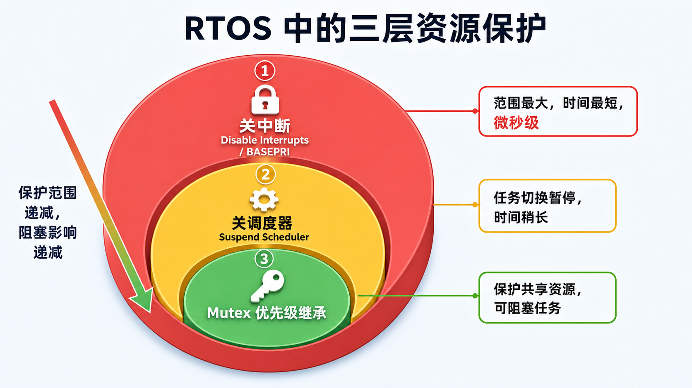

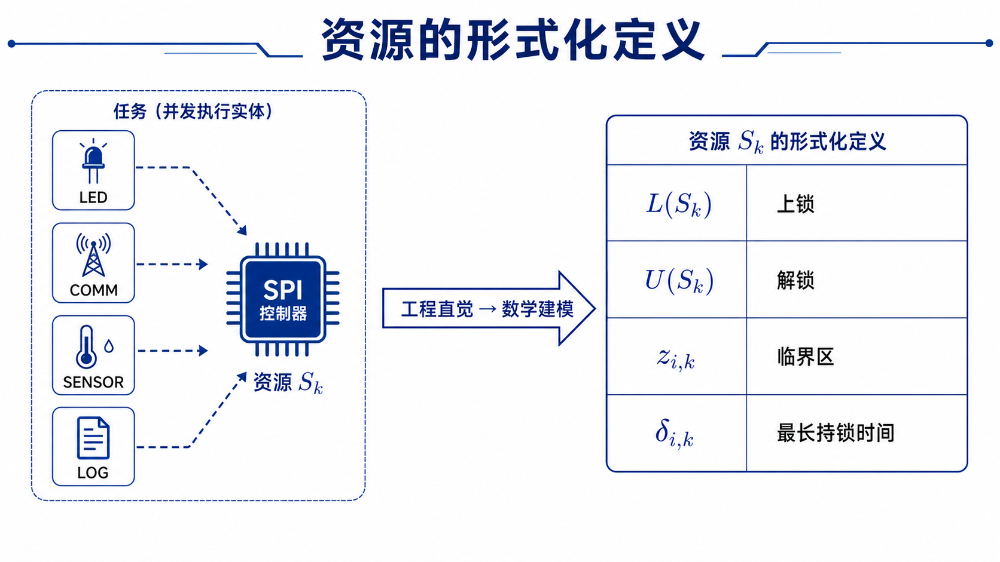

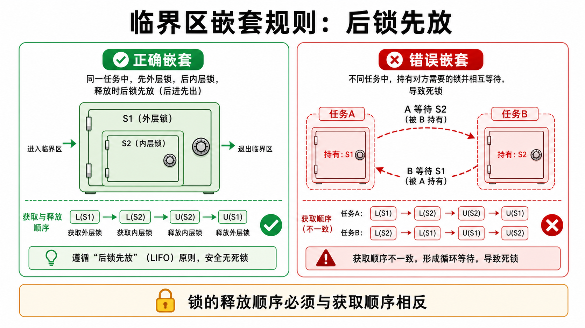

### 13.2 FreeRTOS 中的资源形态：三层防护

理论模型里只有一个抽象操作 `L(S)/U(S)`。但 FreeRTOS 给了你三个层次的互斥工具——它们覆盖了从"一条汇编指令"到"整个事务"的不同粒度。选错工具，要么浪费时间（用了 mutex 保护一个寄存器的读-改-写），要么引入延迟（关中断太久让 ISR 错失事件）。

```mermaid
flowchart TB
    subgraph "第一层: 关中断 (Disable Interrupts)"
        direction LR
        A1["taskENTER_CRITICAL()"] --> A2["设置 BASEPRI<br/>屏蔽可屏蔽中断<br/>阻止 PendSV 切换"]
        A2 --> A3["执行临界代码<br/>ISR 无法抢入<br/>任务无法切换"]
        A3 --> A4["taskEXIT_CRITICAL()<br/>恢复 BASEPRI"]
    end
    
    subgraph "第二层: 关调度器 (Suspend Scheduler)"
        direction LR
        B1["vTaskSuspendAll()"] --> B2["uxSchedulerSuspended++<br/>中断照常响应<br/>但任务切换被推迟"]
        B2 --> B3["执行临界代码<br/>ISR 仍可进入<br/>但不能触发上下文切换"]
        B3 --> B4["xTaskResumeAll()<br/>如有待处理切换→执行"]
    end
    
    subgraph "第三层: mutex (优先级继承)"
        direction LR
        C1["xSemaphoreTake(mutex)"] --> C2["若 token 空闲→获取<br/>否则→阻塞+继承"]
        C2 --> C3["执行临界代码<br/>其他任务可抢占<br/>但等待同一 mutex 的<br/>任务会阻塞"]
        C3 --> C4["xSemaphoreGive(mutex)<br/>恢复优先级"]
    end
    
    style A2 fill:#ffcdd2,color:#333
    style B2 fill:#fff9c4,color:#333
    style C2 fill:#c8e6c9,color:#333
```

---

#### 第一层：关中断 —— 最暴力，但不可替代

在 Cortex-M 移植中，`taskENTER_CRITICAL()` 的核心操作是写 BASEPRI 寄存器——把当前中断优先级掩码设为 `configMAX_SYSCALL_INTERRUPT_PRIORITY`，从而屏蔽所有"非内核级"的中断：

```c
// portmacro.h (Cortex-M 移植) —— 关中断的本质
static portFORCE_INLINE void vPortRaiseBASEPRI(void) {
    uint32_t ulNewBASEPRI = configMAX_SYSCALL_INTERRUPT_PRIORITY;
    __asm volatile (
        "   msr basepri, %0   \n"  // 设置中断屏蔽阈值
        "   dsb               \n"  // 数据同步屏障——确保生效
        "   isb               \n"  // 指令同步屏障
        : : "r" (ulNewBASEPRI) : "memory"
    );
}

// taskENTER_CRITICAL 内部会:
//   1. portDISABLE_INTERRUPTS()  ← 写 BASEPRI
//   2. uxCriticalNesting++       ← 支持嵌套（taskENTER 里面还能再 taskENTER）
```

**BASEPRI 的效果：** 所有优先级数值 ≥ configMAX_SYSCALL_INTERRUPT_PRIORITY 的中断被屏蔽。这包括 SysTick（它必须用比 BASEPRI 更低优先级的数值）、UART、定时器、GPIO 外部中断——除了少数配置为"不受 FreeRTOS 管理"的高优先级中断（比如一个紧急刹车信号的 GPIO 中断）。

**什么时候用关中断？**

保护那些极短的数据竞争窗口——几个 CPU 周期就能完成的操作。例如：

```c
// 场景：在 ISR 和任务之间共享的计数器
// ✗ 这样不安全——读-改-写不是原子的
shared_counter++;  // 如果 ISR 在"读"和"写"之间插入，数据丢失

// ✓ 用关中断保护最小区间
taskENTER_CRITICAL();
shared_counter++;   // 3-5 条汇编指令，微秒级
taskEXIT_CRITICAL();
```

**什么时候绝对不要用关中断？**
- 在临界区内调用 `vTaskDelay()`、`xQueueReceive()` 或任何可能阻塞的 API——你会在关中断时尝试任务切换，结果不可预测
- 临界区长度超过几十微秒——你等于冻结了整个芯片的外部事件响应
- 临界区内有浮点运算——Cortex-M4F/M7 的浮点寄存器保存/恢复可能意外触发 PendSV，关中断时无法处理

**关中断长度的工程意义：** 这个值直接进入你的系统最坏中断延迟（interrupt latency）。如果你的控制算法依赖 100 μs 周期的定时器中断，而你的关中断临界区最长为 50 μs——你在这个周期里有 50% 的概率延迟定时器中断 50 μs。这个延迟在 RTA 里会进入被该中断唤醒的任务的阻塞时间 B_i。

---

#### 第二层：关调度器 —— 中断友好，但有限制

比关中断温和得多：

```c
void vTaskSuspendAll(void) {
    // 只增加一个挂起计数器——不做任何硬件操作
    ++uxSchedulerSuspended;
    // 中断照常响应！PendSV 照常 pending！但不会被处理。
}

BaseType_t xTaskResumeAll(void) {
    // 减少计数器。如果降到 0 且有 pending 的切换请求：
    //   执行一次任务切换（相当于 PendSV 的效果）
    --uxSchedulerSuspended;
    if (uxSchedulerSuspended == 0) {
        if (uxPendedTicks > 0) {
            // 关调度器期间积压的 tick 在这里批量补处理
        }
        if (xYieldPending != pdFALSE) {
            // 有任务切换请求被推迟了，现在执行
            taskYIELD();
        }
    }
}
```

**什么时候用？** 保护的临界数据只在任务之间共享，ISR 不会碰。例如：

```c
// 两个任务共享一个全局配置表，但 ISR 不访问它
vTaskSuspendAll();
{
    // 安全地更新配置表——不会有其他任务中途插进来读
    // 但 ISR 如果此时触发，照常执行——只要 ISR 不碰这张表就没问题
    update_config_table(new_params);
}
xTaskResumeAll();
```

**陷阱清单：**
- 关调度器期间不能调用 `vTaskDelay()`、`xQueueReceive()`、`xSemaphoreTake()`——这些 API 内部会检查 `uxSchedulerSuspended`，如果非零就断言失败或返回错误
- 关调度器不关中断——如果你的共享数据也被 ISR 访问，关调度器不够，必须关中断或换设计
- 关调度器期间同优先级的任务之间也不会切换——时间片轮转被冻结

---

#### 第三层：mutex —— 最应该用的，也是唯一支持优先级继承的

mutex 是 FreeRTOS 里最"智能"的互斥工具。它不仅是"互斥"——它还携带**所有权（ownership）**信息：

```c
// 创建 mutex（本质上是一个特殊的 queue，里面有一个 token）
SemaphoreHandle_t xSPIMutex = xSemaphoreCreateMutex();

// 任务中使用
void Task_Sensor(void *pvParameters) {
    while (1) {
        // 尝试拿锁，最多等 100 ms
        if (xSemaphoreTake(xSPIMutex, pdMS_TO_TICKS(100)) == pdTRUE) {
            // ═══════ 持锁代码段 ═══════
            // 铁律：这段代码必须尽可能短！
            // 不调用任何可能阻塞的 API
            // 不启动 DMA 后忙等
            // 不调用 vTaskDelay()
            spi_read_sensor(&data);
            // ══════════════════════════
            xSemaphoreGive(xSPIMutex);
        } else {
            // 超时处理——可能系统出了问题
            log_error("SPI mutex timeout");
        }
    }
}
```

mutex 的三层额外开销（相比 binary semaphore）：
1. **所有权记录**：`xMutexHolder` 指针指向当前持锁的任务 TCB。这用于判断"释放者是否就是获取者"（防止非所有者释放）和"被阻塞时该提升谁"。
2. **优先级继承**：阻塞时触发 `xTaskPriorityInherit()`，释放时触发 `xTaskPriorityDisinherit()`——后者需要遍历任务持有的所有 mutex 以确定新优先级。
3. **递归 mutex 支持**：`xSemaphoreCreateRecursiveMutex()` 额外记录持锁次数，允许同一任务多次获取同一个 mutex。

---

#### 三层工具对比——选型决策表

| 维度 | `taskENTER_CRITICAL()` | `vTaskSuspendAll()` | mutex |
|------|------------------------|---------------------|-------|
| **阻止什么** | 所有可屏蔽中断 + 所有任务切换 | 任务切换（ISR 照跑） | 仅等待同一 mutex 的任务 |
| **ISR 响应** | ✗ 被屏蔽 | ✓ 照常响应 | ✓ 照常响应 |
| **优先级继承** | ✗ | ✗ | ✓ 自动触发 |
| **典型开销** | ~5-10 CPU 周期 | ~20-30 CPU 周期 | ~100-300 CPU 周期 |
| **适合持锁长度** | < 10 μs | < 100 μs | 任意（但越短越好） |
| **嵌套行为** | ✓ `uxCriticalNesting` 计数 | ✓ 嵌套计数 | 递归 mutex 需显式创建 |
| **ISR 中可用？** | ✓ 可用（但 ISR 本身已是高优先级上下文） | 语义不匹配（ISR 无"调度器"概念） | ✗ 不可用——ISR 不能阻塞等待 |
| **持锁期可调阻塞 API？** | ✗ 绝对不行 | ✗ 绝对不行 | ✗ 铁律——也不应该 |
| **死锁风险** | 无（没有"等待"概念） | 无 | 有——需全局一致锁顺序 |

**铁律总结：**

> 如果持锁时间能控制在几十微秒以内，而且被保护的数据不与 ISR 共享 → 关调度器。
> 如果持锁时间是几个 CPU 周期，比如整型变量的读-改-写 → 关中断。
> **其他一切情况 → 用 mutex。** 需要优先级继承的场景（你的系统里有两种以上优先级）→ **必须用 mutex。**

---

## 14 优先级反转：理论建模

现在你有了资源模型，也知道了 FreeRTOS 里怎么实现互斥。接下来的问题是：**当多个不同优先级的任务竞争同一个资源时，调度器的行为是什么？** 答案不是"高优先级先得"——而是"先到先得，后来者等着"。而"等着"这两个字一旦和优先级分层结合，就会产生优先级反转。

### 14.1 优先级反转的严格定义

优先级反转的定义：

> **优先级反转（Priority Inversion）：** 当一个低优先级作业正在执行时，一个更高优先级的作业就绪却被阻塞——这就是优先级反转（A low-priority job executes while a ready higher-priority job waits）。

注意三个关键点：

1. **不是"低优先级抢占了高优先级"**——调度器不会允许这种事。反转的本质是：高优先级作业因为资源阻塞而被"卡住"，CPU 在低优先级作业手里继续跑——从 CPU 占用角度看，低优先级作业在执行，高优先级作业在等——这就是"反转"。
2. **反转的发生条件是"共享资源 + 优先级差异"**。如果所有任务优先级相同（时间片轮转），没有反转。如果所有资源都是私有的，也没有反转。
3. **反转本身不一定导致灾难**——只要高优先级作业最终满足 deadline，反转就不是问题。问题出在"无界反转"——等待时间没有理论上限。

#### 温和的案例：反转发生了，但 deadline 依然满足

下面是一个温和的优先级反转案例。三个作业 J1（最高，δ_1 = 2）、J2（中间，δ_2 = 4）、J3（最低，δ_3 = 4）共享同一个资源 S_k：

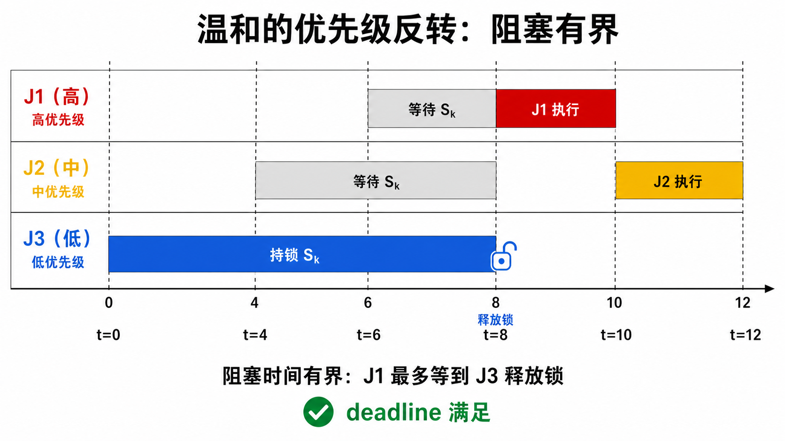

发生了两次反转：
- **t=4**：J2 请求 L(S_k) 失败——J3 持锁中。J2 阻塞。反转：J3(低)在执行，J2(高)在等。
- **t=6**：J1 请求 L(S_k) 失败——还是 J3 持锁中。J1 阻塞。反转：J3(低)在执行，J1(最高)在等。
- **t=8**：J3 释放锁 → J1 抢占执行 → J1 完成 → J2 获取锁 → 所有 deadline 满足。

这个案例里，J1 等了 2 个时间单位，J2 等了 4 个时间单位——都是可控的（在 δ_3 = 4 的范围内）。但接下来是一个更反直觉的案例。

#### 时序异常（Timing Anomaly）：做少反而错

下面是最著名的反直觉例子之一：

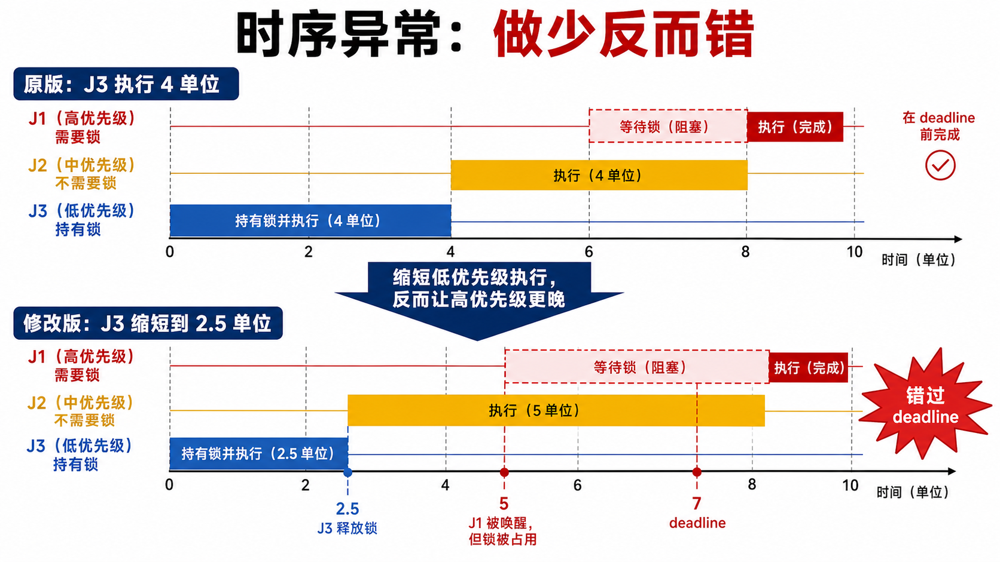

**发生了什么？** J3 的持锁时间从 4 缩短到 2.5，**系统总利用率降低了**，但 J1 错过了 deadline。原因是：

1. J3 更快释放 → 资源在 t=5 时空闲了
2. J1 还没醒来（它的释放时间在 t=6 或更晚）→ J2 抢占并占用了 CPU
3. J2 运行了 8 个单位 → J1 醒来时资源已被 J2 拿走
4. J1 必须等 J2 释放 → 但 J2 的持锁时间比原本 J3 更长（δ_2=4 > δ_3=2.5）

**教训：** 缩短一个任务的执行时间、降低系统总利用率——这些"优化"在共享资源的系统中可能**恶化**高优先级任务的响应时间。这不是 bug，是调度数学的必然。你不能靠"跑得更快"来消除优先级反转——你需要协议。

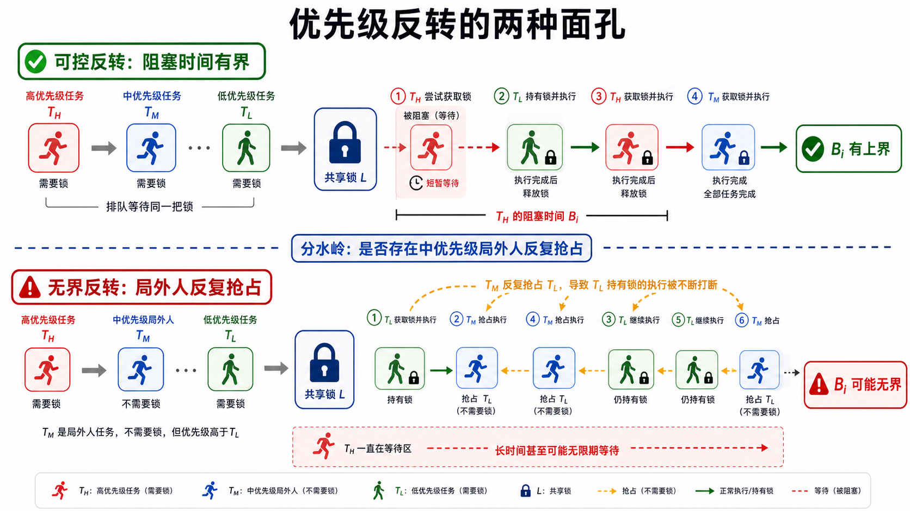

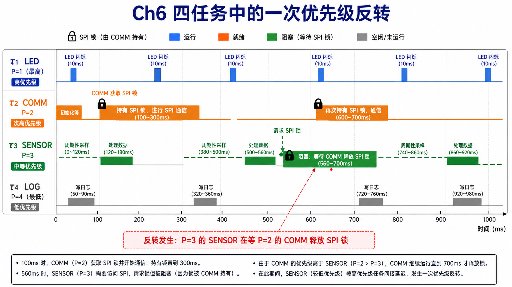

### 14.2 无界优先级反转：火星探路者号

下面展示了最危险的场景——**无界优先级反转（uncontrolled priority inversion）**。这就是导致 1997 年 Mars Pathfinder 反复复位的问题模型。

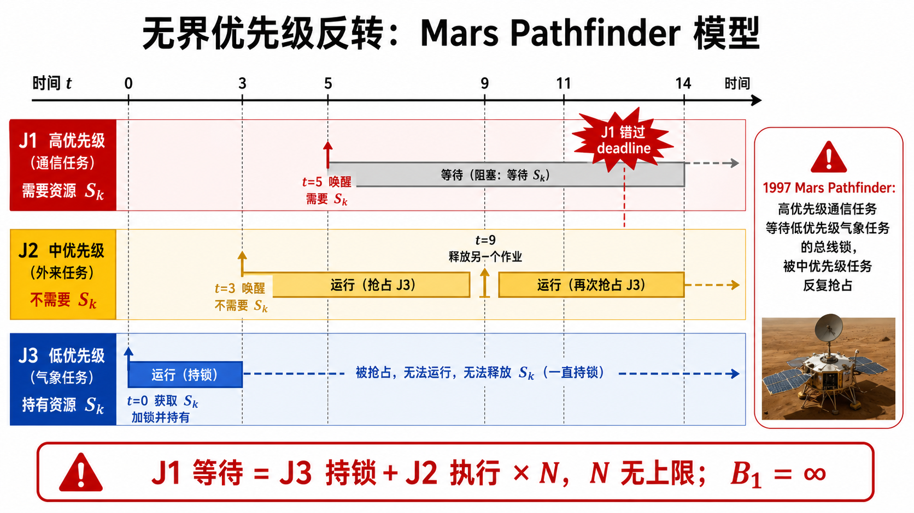

无界反转的发生只需要三个条件：

1. **J_low** 持有一个资源 S_k
2. **J_high** 等待同一个 S_k —— 被 J_low 阻塞
3. **J_mid**（优先级在 J_low 和 J_high 之间）不需要 S_k，但可以随时抢占 J_low

J_mid 是"无辜的过路人"——它不碰 S_k，不违反任何规则。但它每抢占 J_low 一次，J_high 就多等一段。更致命的是：J_mid 可能因为它自己的周期性释放而反复唤醒和抢占 J_low，把这个等待链无限拉长。

#### 火星探路者号（Mars Pathfinder）——1997 年 7 月

这是嵌入式系统史上最广为人知的优先级反转案例，也是"为什么理论有用"的最佳教材。

**背景：** Pathfinder 于 1997 年 7 月 4 日着陆火星。探测器上运行的是 VxWorks——一个商用 RTOS，采用固定优先级抢占式调度。系统里有几十个任务，负责气象数据采集、通信管理、图像压缩和传输。

**现象：** 着陆几天后，探测器开始出现周期性系统复位。复位不是随机的——它总是在总线通信负载较高时触发。复位后系统恢复正常，但几个小时后再次发生。

**调试过程（在 JPL 实验室）：** Glenn Reeves 带领的团队在实验室里用完全相同的硬件和软件复制了问题。他们将问题追踪到三个关键任务：

| 任务 | VxWorks 优先级 | 功能 | 是否使用数据总线 mutex |
|------|:---:|------|:---:|
| **bc_dist** | **高** | 通信分发任务——将气象数据分发到各子系统。**错过 deadline → watchdog 触发复位。** | 是 |
| **bc_sched** | 中 | 非关键调度任务——周期性地执行一些低优先级维护操作。 | **否** |
| **ASI/MET** | **低** | 气象数据采集任务——从科学仪器读取气象数据，写入 1553 数据总线。 | **是（持有 mutex）** |

**时间线还原：**

```
1. ASI/MET（低优先级）获取数据总线 mutex，开始往总线上写气象数据
2. 它在持锁期间被更高优先级的任务打断...
3. bc_sched（中优先级）醒来——不需要总线 mutex，直接抢占 ASI/MET
4. bc_dist（高优先级）醒来——需要总线 mutex → 被阻塞
5. bc_dist 等待 mutex → ASI/MET 被 bc_sched 抢占无法释放 mutex
   → bc_dist 一直等 → watchdog 超时 → 系统复位
```

**修复方案：** JPL 团队没有重写任何任务逻辑。他们做了一个配置变更：
- 将 mutex 的优先级继承属性从"关闭"改为"开启"
- 这一改动在 VxWorks 里是 mutex 创建时的一个参数标志

当优先级继承启用后：bc_dist（高）被 ASI/MET（低）阻塞时 → ASI/MET 的优先级被**临时提升到 bc_dist 的级别** → bc_sched（中）无法再抢占 ASI/MET → ASI/MET 快速释放 mutex → bc_dist 获取锁并完成工作 → watchdog 不触发 → 系统不再复位。

**这个补丁飞了 2 亿公里。** 修改的是一个 mutex 的标志位。


**这个故事教给你什么？**
1. 优先级反转不是 bug，是调度数学——它可以在任何基于优先级的抢占式 RTOS 上发生（Pathfinder 用的是 VxWorks，不是 FreeRTOS——但不重要）
2. 在测试中可能看不到——需要特定的事件时序（"总线负载较高时"）才会触发。Pathfinder 在地面测试时没有暴露问题，因为测试负载远低于火星实际运行
3. 修复简单——但定位需要理论思维（能画出 J_high / J_mid / J_low 的关系图）。JPL 团队用了三周在实验室复现，但如果他们在设计阶段就做了优先级反转分析，这个故事就不会发生
4. 最昂贵的修复不是补丁——是没有在发射前做可调度性分析

**关于 VxWorks mutex 的优先级继承机制：** Pathfinder 使用的 VxWorks 已经内置了优先级继承功能——它是一个 mutex 创建时的选项参数（`SEM_INVERSION_SAFE` 标志）。JPL 工程师当时没有开启这个标志——可能是因为默认关闭，也可能是因为不知道它的作用。修复就是把这个标志从 0 改成 1。换句话说：**理论在代码里已经等你很久了，你只需要知道什么时候去开启它。**

**Pathfinder 案例的直接工程教训（你可以逐条对照你自己的代码）：**

| 教训 | 你的工程检查项 |
|------|---------------|
| 系统中最高优先级的任务不能有任何无界的阻塞路径 | 列出所有优先级 > 看门狗阈值任务（的通信路径），检查每个 mutex 是否开启了优先级继承 |
| 中优先级"局外人"任务是最危险的——它不需要锁，但可以无限期地拖延持锁者 | 检查：高优先级任务等的每一个 mutex，有多少中优先级任务可能在此期间抢占？ |
| 测试无法覆盖所有时序组合——需要理论分析 | 在任务集设计完成后做一次 RTA，把 B_i 填进去。如果 B_i 无界，就说明设计有问题 |
| 优先级继承是安全网，不是设计目标 | 即使开了 PIP，持锁段本身也不能太长——PIP 只消除"局外人干扰"，不缩短持锁时间本身 |

### 14.3 反转延迟的形式化——把故事变成公式

无界反转的阻塞时间上界不存在——但你可以写一个下界公式来理解它为什么"无界"。

设：
- **L_k**（小写 L）：低优先级任务 τ_low 关于资源 S_k 的最长临界区长度 = δ_{low,k}
- **C_mid**：所有中优先级任务 τ_j（P_low < P_j < P_high）的 WCET 之和
- **B_high**：高优先级任务 τ_high 的最坏阻塞时间

**无协议下：**

$$B_{high} \geq L_k + \sum_{j: P_{low} < P_j < P_{high}} n_j \cdot C_j$$

其中 n_j 是中优先级任务 τ_j 在这个阻塞窗口内可以执行的最大作业数。注意符号是 **≥** ——这是下界，不是上界。上界在无协议下是**无穷大**——因为 n_j 没有理论上限。

在 Mars Pathfinder 案例中：
- L_k = ASI/MET 的持锁时间（几十毫秒的 1553 总线写入）
- C_mid = bc_sched 的执行时间（毫秒级 × 可能多次运行）
- 只要 bc_sched 能在 ASI/MET 被 bc_dist 阻塞期间反复抢占 → B 无界

**这个 B_high 直接进入 PART2 的 RTA 公式：**

$$R_{high} = B_{high} + C_{high} + \sum_{j \in hp(high)} \left\lceil \frac{R_{high}}{T_j} \right\rceil \cdot C_j$$

如果 B_high 无上界，R_high 也无上界。你在 PART2 花了几十页做的 WCET 测量、优先级分配、RTA 迭代——**全都失效。** 因为你分析的对象根本不在"可分析"的域里——它的阻塞时间没有上界。

**这就是为什么 PART3 需要资源访问协议。** 协议的任务是给 B_i 一个**可证明的上界**——把 B_i 从"任意大"压缩到"所有临界区中最长的那一个"（或"所有持有者中最长的那几个的和"）。

---

## 15 解决方案①：优先级继承协议 (PIP)

### 15.1 PIP 的思想与规则

优先级继承协议（Priority Inheritance Protocol, PIP）的核心思想只有一句话：

> **当一个高优先级作业被低优先级作业阻塞时，阻塞者"借用"被阻塞者的优先级，直到释放资源。**

借来的高优先级 → 中优先级作业无法抢占 → 资源快速释放 → 高优先级作业不再等待。PIP 不改变资源分配策略（谁先来谁拿锁），它只改变**持锁者的当前优先级**。

PIP 的完整规则如下。我把它们组织为三层——**调度、分配、继承**：

```mermaid
flowchart TD
    subgraph SCHED["规则 1: 调度规则 (Scheduling Rule)"]
        direction TB
        S1["a) 就绪作业按 <b>当前优先级</b> 抢占式调度<br/>（不是分配优先级——是可能被继承改变的当前优先级）"]
        S2["b) 作业释放时：<b>当前优先级 = 分配优先级</b>"]
        S3["c) 优先级只在优先级继承规则触发时改变"]
    end
    
    subgraph ALLOC["规则 2: 分配规则 (Allocation Rule)"]
        direction TB
        A1["作业 J_i 请求资源 S"]
        A2{"资源 S 空闲?"}
        A3["✓ 分配 S 给 J_i"]
        A4["✗ 拒绝——J_i 被阻塞<br/>J_i 加入 S 的等待队列"]
    end
    
    subgraph INHERIT["规则 3: 优先级继承规则 (Priority Inheritance Rule)"]
        direction TB
        I1["a) J_i 被阻塞时 → 阻塞者 J_l 继承 J_i 的当前优先级 p_i(t)"]
        I2["b) J_l 以继承的优先级执行<br/>直到释放资源 S"]
        I3["c) 释放 S 时 → J_l 的优先级回退到<br/>获取 S 时的优先级 p_l(t')"]
    end
    
    S1 --> A1
    A1 --> A2
    A2 -->|"是"| A3
    A2 -->|"否"| A4
    A4 --> I1
    I1 --> I2
    I2 --> I3

    style SCHED fill:#e3f2fd
    style ALLOC fill:#fff3e0
    style INHERIT fill:#ffcdd2
```

**PIP 的效果——用时间线说话：**

下面这张时间线展示了 PIP 的效果——和图 3.23 完全相同的初始条件，但加入了 PIP：

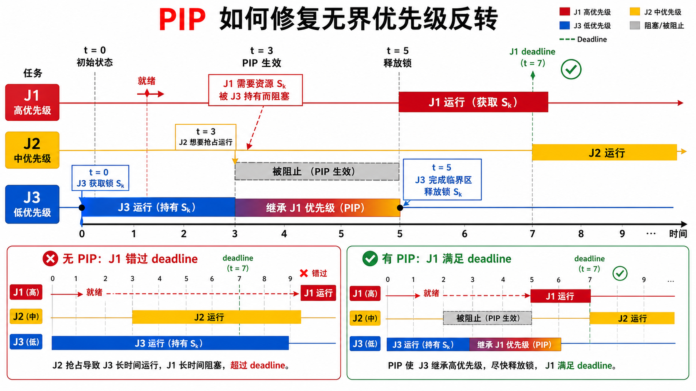

关键的三步：
1. **t=3**：J1 请求 S_k 失败 → 被 J3 阻塞 → J3 的当前优先级从 P=3 **跃升**到 P=1
2. **t=3~7**：J3 以优先级 1 执行——J2（优先级 2）被挡在就绪队列外
3. **t=7**：J3 释放 S_k → 优先级回落 P=3 → J1 立即抢占获取资源

**效果：** J1 的阻塞时间从"J3 持锁 + J2 全部执行时间"缩减为"J3 持锁时间"。J2——这个不碰 S_k 的"无辜过路人"——不再能拖累 J1。

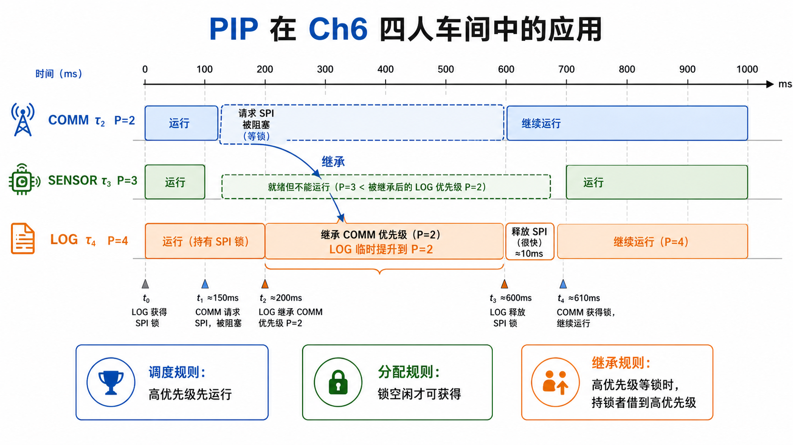

#### PIP 的复杂案例：五个任务、两个资源

下面是一个更复杂的案例——五个任务 J1~J5，两个共享资源 S1 和 S2，有嵌套临界区。任务参数如下：

| 作业 | 释放时间 r_i | WCET C_i | 分配优先级 P_i | 临界区结构（用 [(-,t);(S,t),(-,t)] 表示） |
|------|:---:|:---:|:---:|------|
| J1 | 7 | 3 | **1** (最高) | [(-,1); **(S1,1)**, (-,1)] |
| J2 | 5 | 3 | 2 | [(-,1); **(S2,1)**, (-,1)] |
| J3 | 4 | 2 | 3 | [(-,2)] —— 不碰任何资源 |
| J4 | 2 | 6 | 4 | [(-,1); **((S1,2), (S2,1.5), (S1,0.5))** ; (-,1)] |
| J5 | 0 | 6 | 5 (最低) | [(-,1); **(S2,4)**, (-,1)] |

J4 的临界区结构需要特别解释：它包含一个**正确嵌套的嵌套临界区**——先锁 S1 用 2 单位时间，然后锁 S2 用 1.5 单位时间，然后释放 S2，再锁 S1 用 0.5 单位时间。

在这个复杂案例中，PIP 的传递继承（transitive inheritance）机制会展现出来：J4 被 J1 阻塞时提升 J5 → J5 继承 J4 的优先级 → 如果 J5 又被 J3 阻塞 → J3 再继承... 这就是一个优先级继承链。

但这同时也暴露了 PIP 的一个弱点：**J1 在等待 S1 时经历了两次阻塞**——第一次被 J5（间接通过 J4 持有 S1），第二次被 J2（持有 S2 但 J4 也需要 S2，形成跨资源等待链）。

### 15.2 理论代码化：PIP 伪代码 vs Ch6 mutex 源码

这是本章最硬核的一节：把 PIP 的三条规则翻译为伪代码，然后把 Ch6 FreeRTOS mutex 实现中对应的 C 源码并排对照。你会看见**每一条理论规则在工程代码中的精确物理落点**。

*（本节保持不动——如重写指令要求）*

#### 对照速查表

| PIP 规则 | 伪代码逻辑 | Ch6 FreeRTOS 源码落点 |
|---|---|---|
| **调度规则 (1a-c)** | 分配优先级不变，除非继承触发 | `xTaskPriorityDisinherit()` 负责恢复原优先级 |
| **分配规则 (2a)** | 若资源空闲则分配，否则阻塞 | `xQueueSemaphoreTake()` 中的 `prvCopyDataFromQueue()` 检查队列是否非空 |
| **继承规则 (3a)** | 阻塞时提升阻塞者优先级 | `xQueueSemaphoreTake()` → `xTaskPriorityInherit()` |
| **继承规则 (3b)** | 以继承优先级执行直到释放 | 调度器按 `pxReadyTasksLists[priority]` 的最高非空链表选择——继承后自然选到被提升者 |
| **继承规则 (3c)** | 释放时恢复原优先级 | `xQueueGenericSend()` → `xTaskPriorityDisinherit()` |

---

#### 逐行对照

**—— 左侧：PIP 规则翻译为伪代码。右侧：Ch6 FreeRTOS mutex 在 queue.c 和 task.c 中的实际实现。**

##### 获取资源 — 分配规则 (2a) + 继承规则 (3a)

```c
// ══════ PIP 伪代码 ══════        // ══════ Ch6 FreeRTOS 源码: queue.c ══════

// 规则2(a): 分配规则
function lock(resource S):              BaseType_t xQueueSemaphoreTake(
  if S is free:                           QueueHandle_t xQueue,
    allocate S to current_task            TickType_t xTicksToWait)
    S.holder = current_task             {
    return SUCCESS                         // mutex 基于 queue: 队列中有一个 token
  else:                                    // prvCopyDataFromQueue 尝试取出 token:
    S.holder is blocking us                  
    current_task.state = BLOCKED           if (prvCopyDataFromQueue(pxQueue, ...)
    add current_task to S.waiting_list         == pdPASS) {
                                               // ✓ token 空闲 → 持锁成功
// 规则3(a): 优先级继承规则                     // 记录 holder 
void raise_priority_of_blocker(J_blocked):    pxQueue->u.xSemaphore.xMutexHolder =
  J_blocker = S.current_holder                 (void *)xTaskGetCurrentTaskHandle();
  if J_blocked.priority < J_blocker.priority:  return pdPASS;
    J_blocker.current_priority =             } else if (xTicksToWait == 0) {
      J_blocked.current_priority               return errQUEUE_EMPTY;  // 不等，立即返回
    // J_blocker 以新优先级继续执行             }
//                                               // ✗ token 被占用 → 阻塞等待
//                                               vTaskPlaceOnEventList(
//                                                 &(pxQueue->xTasksWaitingToReceive),
//                                                 xTicksToWait);
//                                               
//                                               // ★ 这就是 PIP 规则3(a) 的工程实现!
//                                               if (pxQueue->u.xSemaphore
//                                                     .xMutexHolder != NULL) {
//                                                 xTaskPriorityInherit(
//                                          pxQueue->u.xSemaphore.xMutexHolder);
//                                               }
//                                             }
```

##### 继承规则的实现 — `xTaskPriorityInherit()`

```c
// ══════ PIP 继承规则 3(a) 的工程实现: task.c ══════

                                        void xTaskPriorityInherit(
                                            void *const pxMutexHolder)
                                        {
                                            TCB_t *const pxMutexHolderTCB =
                                                (TCB_t *)pxMutexHolder;

                                            // 检查: holder 的优先级确实比我低?
                                            if (pxMutexHolderTCB->uxPriority
                                                < pxCurrentTCB->uxPriority)
                                            {
                                                // ★ 规则3(a):
                                                //   阻塞者继承被阻塞者的当前优先级
                                                
                                                // 步骤1: 把 holder 从旧优先级链表中移除
                                                if (uxListRemove(
                                            &(pxMutexHolderTCB->xStateListItem))
                                                    == (UBaseType_t)0) {
                                            taskRESET_READY_PRIORITY(
                                                pxMutexHolderTCB->uxPriority);
                                                }
                                                
                                                // 步骤2: 提升 holder 的优先级
                                                //   = 阻塞它的最高优先级任务
                                                pxMutexHolderTCB->uxPriority =
                                                    pxCurrentTCB->uxPriority;
                                                
                                                // 步骤3: 重新插入新优先级的就绪链表
                                                prvAddTaskToReadyList(
                                                    pxMutexHolderTCB);
                                                
                                                // 效果: holder 现在以被阻塞者的优先级
                                                //   出现在就绪链表中。下次调度时
                                                //   如果它是最高的——就会被选中
                                            }
                                        }
```

这段代码做的事情和 PIP 规则3(a) 完全一致——甚至更精细：
- 它从旧优先级的就绪链表中移除了持锁者
- 它把持锁者的优先级提升到被阻塞者的级别
- 它把持锁者插入新优先级的就绪链表
- 下次调度器选择最高优先级就绪任务时，持锁者（现在以被阻塞者的优先级运行）可能被选中

##### 释放资源 — 恢复规则 (3c)

```c
// ══════ PIP 伪代码 ══════        // ══════ Ch6 FreeRTOS 源码: queue.c ══════

// 规则2(a): 释放资源
function unlock(resource S):            BaseType_t xQueueGenericSend(
  S.holder = NONE                          QueueHandle_t xQueue, ...)
  if S.waiting_list is not empty:        {
    remove highest_priority waiter          // ★ 恢复优先级
    wake up this waiter                     //   只有 mutex holder 才能 give
                                            if (pxQueue->u.xSemaphore
// 规则3(c): 恢复原优先级                       .xMutexHolder != NULL) {
void restore_priority_after_release(J):       configASSERT(
  J.current_priority = J.assigned_priority      (pxQueue->u.xSemaphore
//                                                .xMutexHolder
// 注意: 理论这里很简单——直接恢复。               == xTaskGetCurrentTaskHandle()));
//   但 FreeRTOS 的实现更复杂:                  xTaskPriorityDisinherit(
//   J 可能还持有其他 mutex,               pxQueue->u.xSemaphore.xMutexHolder);
//   有其他任务在等这些 mutex。                  pxQueue->u.xSemaphore.xMutexHolder
//   J 的"新优先级"应该是:                       = NULL;
//   max(自己的分配优先级,                      
//       所有还在等待 J 的任务的优先级)              
//                                             // 然后 token 入队 → 唤醒等待者
//                                             prvCopyDataToQueue(pxQueue, ...);
//                                             // 如果有任务在等→检查是否需要切换
//                                             if (xTasksWaitingToReceive > 0) {
//                                               // 唤醒等待队列中优先级最高的
//                                             }
//                                           }
```

##### `xTaskPriorityDisinherit()` 的工程复杂度

理论的规则3(c) 很简单——释放资源后恢复原优先级。但 FreeRTOS 的 `xTaskPriorityDisinherit()` 比理论多处理了一种情况：**一个任务可能同时持有多个 mutex，每个都有不同优先级的等待者。**

```c
// ══════ FreeRTOS 的 xTaskPriorityDisinherit(): task.c ══════

void xTaskPriorityDisinherit(void *const pxTCBOfMutexHolder)
{
    TCB_t *const pxTCB = (TCB_t *)pxTCBOfMutexHolder;
    UBaseType_t uxNewPriority;
    
    // 步骤1: 从当前就绪链表中移除（旧优先级）
    if (uxListRemove(&(pxTCB->xStateListItem)) == (UBaseType_t)0) {
        taskRESET_READY_PRIORITY(pxTCB->uxPriority);
    }
    
    // 步骤2: 有没有其他任务还在等这个 holder 的其他 mutex?
    //   如果有 → 新优先级 = 所有等待者中的最高优先级
    //   如果没有 → 新优先级 = holder 自己的分配优先级
    //   取两者中的最大值
    uxNewPriority = prvGetDisinheritPriorityAfterTimeout(pxTCB);
    
    // 步骤3: 更新优先级并重新插入就绪链表
    if (uxNewPriority != pxTCB->uxPriority) {
        pxTCB->uxPriority = uxNewPriority;
    }
    prvAddTaskToReadyList(pxTCB);
}
```

**这就是理论研究和工程实现的差异。** 理论假设"每个任务最多被一个高优先级任务阻塞"，所以直接恢复分配优先级就行。工程中，一个任务持有多个 mutex 是常见场景——`prvGetDisinheritPriorityAfterTimeout()` 需要遍历这个任务持有的所有 mutex，找出所有等待者中的最高优先级，作为新的"当前优先级"。这一层逻辑在教科书的理论层面没有讨论，但你在 Ch6 的源码里能看到。

### 15.3 PIP 的三个局限

PIP 解决了"无界反转"，但不是一个完美的协议。你需要清醒地认识到它的三个设计局限。

#### 局限 1：不防止死锁（Deadlock）

PIP 只管理优先级，不管理获取顺序。如果两个任务以不同顺序获取两把锁：

```c
// Task A                               // Task B
xSemaphoreTake(mutex_S1, ...);          xSemaphoreTake(mutex_S2, ...);
  xSemaphoreTake(mutex_S2, ...);    →     xSemaphoreTake(mutex_S1, ...);  // 互相等待!
  // 永远到不了这里                        // 永远到不了这里
xSemaphoreGive(mutex_S2);               xSemaphoreGive(mutex_S1);
xSemaphoreGive(mutex_S1);               xSemaphoreGive(mutex_S2);
```

PIP 会忠实地执行它的职责——当 A 等 S2 时提升 B 的优先级，当 B 等 S1 时提升 A 的优先级——两者都被提升，但谁也放不了锁。

```mermaid
graph LR
    subgraph "死锁——PIP 无能为力"
        A["Task A<br/>持有 S1 🔒<br/>等待 S2 ⏳"] -->|"阻塞→ 提升优先级"| B["Task B<br/>持有 S2 🔒<br/>等待 S1 ⏳"]
        B -->|"阻塞→ 提升优先级"| A
    end
    
    style A fill:#ffcdd2,color:#333
    style B fill:#ffcdd2,color:#333
```

**应对：** 在工程中你需要外部规则——"所有任务按相同的全局顺序获取锁"——来防止死锁。PIP 本身不提供这个保证。

#### 局限 2：阻塞链可能很长——传递继承

一个高优先级任务可能被一连串低优先级任务**链式阻塞**。考虑这个场景：

```
J1(最高) 请求 S1 → 被 J2 阻塞 → J2 继承 J1 的优先级
J2 在持 S1 期间请求 S2 → 被 J3 阻塞 → J3 继承 J2 的优先级(=J1的)
J3 在持 S2 期间请求 S3 → 被 J4 阻塞 → ...
```

这就是**传递阻塞（transitive blocking）**。J1 在最坏情况下的等待链可以穿越整个优先级空间。

```mermaid
graph TD
    J1["J1 (P=1) 🔴<br/>等待 S1"] -->|"阻塞"| J2["J2 (P=2 → 继承P=1)<br/>持有 S1, 等待 S2"]
    J2 -->|"阻塞"| J3["J3 (P=3 → 继承P=1)<br/>持有 S2, 等待 S3"]
    J3 -->|"阻塞"| J4["J4 (P=4 → 继承P=1)<br/>持有 S3"]
    
    style J1 fill:#fce4ec,color:#333
    style J4 fill:#e8eaf6,color:#333
```

PIP 下 J1 的最坏阻塞时间：

$$B_{1}^{PIP} = \sum_{k \in \sigma_1} \ \max_{j: P_j < P_1} \delta_{j,k}$$

J1 可能被它需要的**每一个资源**的最长低优先级持锁者各阻塞一次。如果 J1 访问 5 个资源，而每个资源都恰好在 J1 请求时被低优先级任务持有——**B_1 就是 5 段持锁时间的和。**

#### 局限 3：最坏阻塞时间仍然"依赖任务集规模"——不紧凑

PIP 给出的 B_i 是一个"安全上界"（safe bound），但它可能**不紧凑**（not tight）——意味着你的 RTA 可能因为过于保守的 B_i 而错误地判定系统不可调度，实际上系统跑得过来。

例如，PIP 的分析假设"所有低优先级任务的最长临界区都可能串行阻塞 J1"。但在实际运行中，由于任务的相位和周期关系，这些临界区可能分布在不同的时间窗口——J1 可能永远不会同时撞上所有临界区。

**PCP 解决的就是这个问题。** PCP 的设计目标之一就是把 B_i 从"多段临界区的和"压缩到"最多一段临界区"。

---

## 16 解决方案②：优先级天花板协议 (PCP)

### 16.1 PCP 的思想与规则

如果 PIP 是"出了问题再补救"——等 J_high 被阻塞时才去提升 J_low 的优先级——那 PCP 就是**"提前预判，宁可让请求等在前面，也不让它等在中间"**。

> **PCP 的核心思想：** 给每个资源分配一个**天花板优先级（priority ceiling）**——等于所有可能使用该资源的任务中的最高优先级。一个任务请求资源时——即使资源空闲——也要检查自己的优先级是否高于系统当前的天花板。如果不够高 → 拒绝 → 请求者在锁外面等，而不是在锁里面让更高级别的任务等着。

这听起来违反直觉："资源空闲为什么不让我拿？" 因为 PCP 在做一个预防性的判断：**如果你拿了，接下来可能有比你优先级更高的任务来抢——那时候你就会被继承优先级，而那个高优先级任务还是要等。与其让它在锁外等，不如让你在锁外等。** 两者的性能影响完全不同——让你等在外面，高优先级任务来时可以直接拿锁走人。

```mermaid
flowchart TD
    subgraph CEILING["天花板的定义"]
        C1["每个资源 S_k 有天花板 C(S_k)<br/>C(S_k) = max{P_j | S_k 被 τ_j 使用}"]
        C2["系统当前天花板 C*(t)<br/>= max{C(S_k) | S_k 正在被持锁}<br/>如果无人在持锁 = Ω (最低)"]
    end
    
    subgraph RULES["PCP 三规则"]
        direction TB
        R1["<b>调度规则</b>: 和 PIP 相同——按当前优先级抢占式调度"]
        R2["<b>分配规则</b>: Ji 请求 Sk →
        • Sk 不空闲 → 拒绝 (阻塞)
        • Sk 空闲且 pi(t) > C*(t) → 分配
        • Sk 空闲且 pi(t) ≤ C*(t) → 
          只有 Ji 就是那个持有天花板=C*(t)的资源的人 → 分配
          否则 → 拒绝 (阻塞)"]
        R3["<b>继承规则</b>: 和 PIP 相同——但释放时触发条件是
        '释放了所有天花板 ≥ 被继承优先级的资源'"]
    end
    
    CEILING --> RULES
    style CEILING fill:#e8eaf6,color:#333
    style RULES fill:#c8e6c9,color:#333
```

#### PCP 的分配规则——"那张关键的检查表"

PCP 比 PIP 多了一步分配前的检查。当一个作业 J_i 请求一个**空闲**资源 S_k 时：

```
if (pi(t) > C*(t)):
    分配  ← 你的优先级高于所有正在被持有的资源的最高天花板
else:
    if (J_i 就是持有天花板 = C*(t) 的资源的人):
        分配  ← 你是那个"正在抬高天花板"的人——你可以继续拿
    else:
        拒绝 → J_i 被阻塞  ← 你的优先级不够"超越天花板"
```

这多出来的一步检查（"我的优先级够不够超过天花板？"）就是 PCP 区别于 PIP 的核心——也是它能够**防止死锁**和**控制阻塞次数**的根本原因。

#### PCP 的完整时间线

用五个任务案例（和 Table 3.3 相同的参数），看 PCP 的运行：

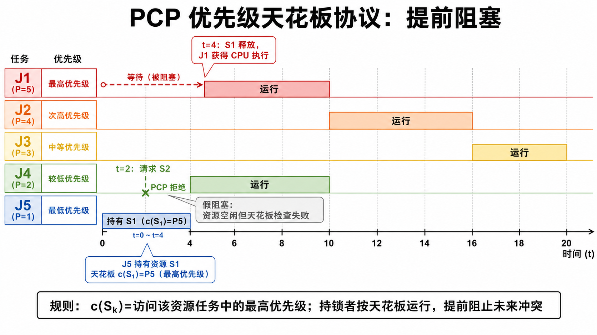

**五个任务 PCP 的逐时间步走读：**

| 时间 | 事件 | PCP 规则在做什么 |
|:---:|------|-----------------|
| **t=0** | J5 开始运行（优先级 5，当前唯一就绪） | C\*(0) = Ω —— 无资源被持锁 |
| **t=1** | J5 请求 S2。S2 空闲。J5 优先级 P=5 > Ω | **分配成功。** C\*(t) 升至 C(S2) = 2 |
| **t=2** | J4 释放，抢占 J5（P=4 < 5） | 正常抢占——J5 优先级低 |
| **t=3** | J4 请求 S1。S1 空闲！**但 C\*(3)=2** | P4=4 < C\*=2（优先级值 4 不大于 2）→ **PCP 拒绝分配！** J4 被阻塞。J5 继承 J4 的优先级 P=4 |
| **t=4** | J3 释放（P=3），抢占 J5（P=4） | J5 虽然继承了 4，但 3 < 4 → J3 抢占 |
| **t=5** | J2 释放（P=2），抢占 J3（P=3） | 正常抢占 |
| **t=6** | J2 请求 S2。S2 **不空闲**（J5 持锁中） | 拒绝（和 PIP 一样）。J2 阻塞。J5 继承 J2 的优先级 P=2 → **J5 现在是系统最高优先级** |
| **t=7** | J1 释放（P=1），抢占 J5（P=2） | J1 优先级更高 → 抢占。注意 J5 虽然继承到 2，但 P=1 > P=2 |
| **t=9** | J1 请求 S1。S1 空闲！J1 的 P=1 > C\*(9)=2 | 1 > 2 → **分配成功！** C\*(t) 升至 C(S1) = 1 |
| **t=10** | J1 释放 S1 → C\*(t) 降至 C(S2)=2 | J1 完成，J5 继续 |
| **t=11** | J5 释放 S2 → C\*(t) 降至 Ω | J5 的继承优先级回退至 5 |
| **t=11** | J2 获得 S2 → C\*(t) 升至 2 | J2 被唤醒 |
| **t=13** | J2 释放 S2 → C\*(t) 降至 Ω | |
| **t=14** | J4 请求 S1。S1 空闲。C\*(14)=Ω。P=4 > Ω | **分配成功。** C\*(t) 升至 1 |

**t=3 是整个 PCP 最关键的瞬间。** 在 PIP 下，S1 空闲，J4 直接拿到——然后 J1 来时被 J4 阻塞（J4 被继承到 P=1）。PCP 预判了这一点：S1 的天花板是 P=1，J4 的优先级 P=4 不够高——**拒绝 J4，把阻塞转移到"锁外面"。** 结果：J1 来的时候 S1 仍然是空闲的，J1 直接拿锁走人。

**这就是 PCP 的哲学：把阻塞从"高优先级任务等持锁者释放"转变成"低优先级任务等天花板下降"。** 前者耽搁的是高优先级任务的响应时间，后者耽搁的是低优先级任务的执行时间——孰轻孰重，一目了然。

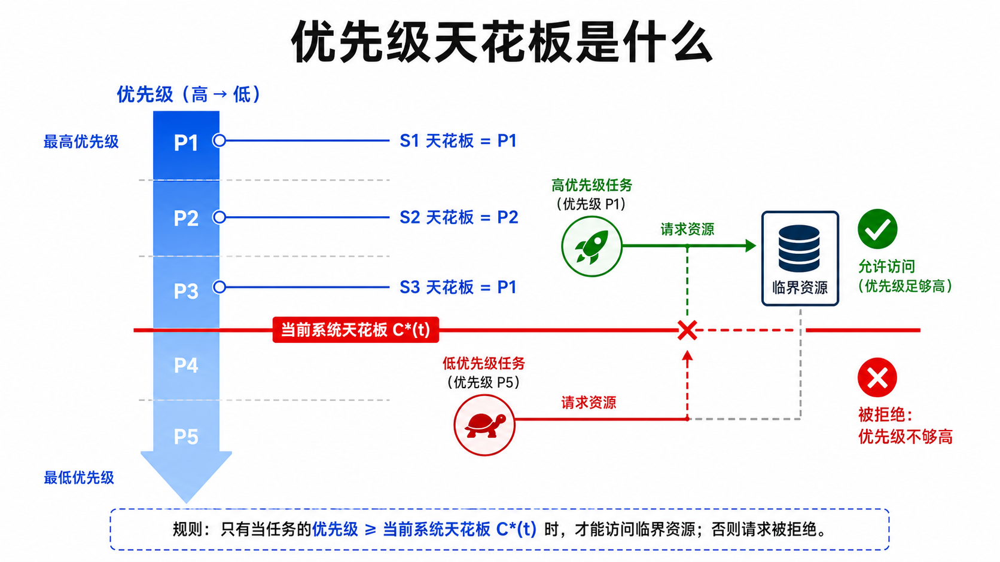

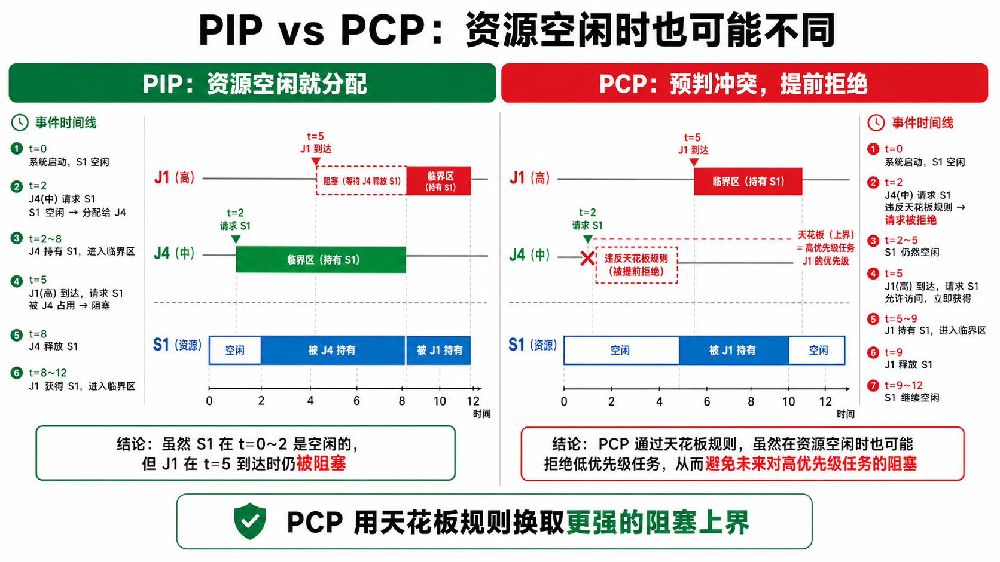

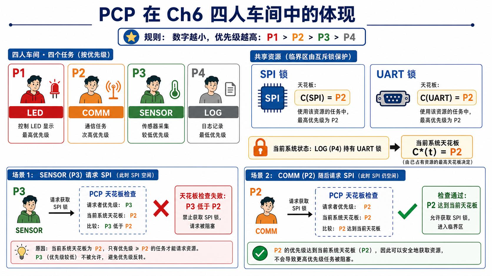

#### PCP 的两个定理（Liu 2000）

PCP 的数学保证由两个定理概括：

> **Theorem 8.1（死锁自由）：** 当可抢占的、优先级驱动的作业在一个处理器上的资源访问由 PCP 控制时，**死锁永远不会发生。**

> **Theorem 8.2（阻塞时间上界）：** 当可抢占的、优先级驱动的作业在一个处理器上的资源访问由 PCP 控制时，**每个作业最多被阻塞一个临界区的时长。**

Theorem 8.2 直接给出了 B_i 的计算公式：

$$B_i^{PCP} = \max_{j,k} \{\delta_{j,k} \mid P_j < P_i \land C(S_k) \geq P_i\}$$

**翻译成人话：** J_i 在最坏情况下，被所有可能阻塞它的低优先级临界区中**持续时间最长的那一个**阻塞——**最多一次。**

这是一个巨大的简化。在 PIP 下你需要 Σ（所有资源 + 所有低优先级持锁者）的复杂计算。在 PCP 下你只需要一个 max。

#### PCP 下的阻塞时间分析

下面是一个完整的 PCP 阻塞时间分析。系统有 6 个任务 τ_1 ~ τ_6 和 3 个资源 S1、S2、S3，资源需求如下（每条边上的数字表示最长持锁时间 δ）：

```
τ1 需要 S1 (最多 6)
τ2 需要 S2 (最多 5)
τ3 需要 S1 (最多 1) 和 S3 (最多 4)
τ4 需要 S2 (最多 2) 和 S3 (最多 4)
τ5 需要 S3 (最多 2)
τ6 需要 S1 (最多 10)
```

在天花板计算中：
- C(S1) = min{P_j | S1 ∈ σ_j} = P1 = 1
- C(S2) = P2 = 2
- C(S3) = min{P3, P4, P5} = P3 = 3

下表列出了三种阻塞方式下每个任务的阻塞来源——这是理解"PCP 为什么最多阻塞一次"的直接证据。用 PCP 分析后，B_i 如下：

| 任务 τ_i | PCP 下的 B_i | 阻塞来源（最长的那个低优先级临界区） |
|:---:|:---:|------|
| τ_1 | **6** | τ_6 持有 S1(δ=10) 且 C(S1)=1≥P1=1 → 可以阻塞 τ_1。但 B_1 = max{6, ...} = 6（来自直接阻塞或继承阻塞中最大者） |
| τ_2 | **6** | τ_6 持有 S1(δ=10) → 天花板检查：C(S1)=1≥P2=2 时 τ_6 可能阻塞 τ_2 |
| τ_3 | **5** | τ_2 持有 S2(δ=5) 时 C(S2)=2, τ_3 的 P=3，可能被阻塞 |
| τ_4 | **4** | τ_3 持有 S3(δ=4) |
| τ_5 | **4** | τ_4 持有 S3(δ=4) |
| τ_6 | **0** | τ_6 是最低优先级，不会被任何人阻塞 |

注意：PCP 下的 B_i 只需要取 max——因为 Theorem 8.2 保证每个任务最多被阻塞一次。如果这是 PIP，你需要把所有可能阻塞来源的 δ 全部加在一起——B_i 会大得多，而且分析复杂得多。

### 16.2 PIP vs PCP：全方位对比

这不是一个"哪个更好"的对比——这是"你的系统约束适合哪一个"的判断工具。

| 维度 | PIP（优先级继承协议） | PCP（优先级天花板协议） |
|------|----------------------|------------------------|
| **核心思想** | 阻塞发生后"补救"：被动提升 | 阻塞发生前"预防"：主动检查天花板 |
| **资源分配策略** | 贪婪（greedy）：资源空闲就分 | 非贪婪（non-greedy）：空闲也可能拒绝 |
| **死锁预防** | ✗ **不防止**——需外部机制（全局一致锁顺序） | ✓ **绝对防止**（Theorem 8.1） |
| **每个任务最坏阻塞次数** | 可能**多次**——每次访问一个资源都可能被阻塞一次 | 最多 **1 次**（Theorem 8.2） |
| **B_i 计算公式** | B_i = Σ_k max_j δ_{j,k}（多段和） | B_i = max_{j,k} δ_{j,k}（单段最大值） |
| **B_i 是否紧凑？** | 可能**过于保守**——实际阻塞通常远小于计算值 | **紧凑**——分析值接近实际 |
| **需要预知什么？** | 不需要提前知道资源使用情况（运行时自适应） | **必须在编译期**知道所有任务的资源需求 |
| **实现复杂度** | 简单——FreeRTOS 已完整实现 | 复杂——需全局资源表、天花板预计算、额外的分配规则检查 |
| **每次 L(S) 的开销** | 中等——只在阻塞发生时触发继承 | **较高**——每次请求（即使成功）都需检查 C*(t) |
| **适应性** | 适合动态创建任务/资源的系统 | 只适合**静态任务集**（资源需求编译期已知） |
| **可调度性分析难度** | 较难——需分析传递阻塞链 | 简单——B_i 只是一次 max |
| **是否会产生"假阻塞"？** | 不会——资源空闲就一定获取 | **会**——资源空闲但天花板不够高也拒绝（avoidance blocking） |
| **典型应用场景** | FreeRTOS、VxWorks、大多数商业 RTOS | Ada Ravenscar Profile、安全关键航空电子系统（DO-178C）、ARINC 653 |
| **FreeRTOS 是否实现？** | ✓ **是**——`xTaskPriorityInherit()` / `xTaskPriorityDisinherit()` | ✗ **否**——设计哲学和工程前提均不匹配 |

**"假阻塞"（avoidance blocking）是 PCP 的一个独特现象。** 一个任务请求一个空闲资源被拒绝——不是因为有人在用，而是因为天花板规则预判了未来可能的冲突。这种阻塞在 PIP 中不会发生。PIP 的用户永远不需要解释"为什么资源空闲我却拿不到"。

```mermaid
flowchart TD
    Q1{"你的系统创建任务<br/>是静态还是动态？"}
    Q1 -->|"静态——编译期确定"| Q2{"你需要形式化安全证明<br/>（如 DO-178C / SIL 认证）？"}
    Q1 -->|"动态——运行时创建"| PIP_CHOICE["→ 选 PIP<br/>FreeRTOS 已内置<br/>无需额外分析"]
    
    Q2 -->|"是——安全关键系统"| PCP_CHOICE["→ 选 PCP<br/>绝对死锁自由<br/>B_i 分析简单且紧凑"]
    Q2 -->|"否——非认证的工业系统"| Q3{"资源嵌套是否复杂？<br/>（一个任务持多个 mutex）"}
    
    Q3 -->|"简单——每个任务最多<br/>同时持一个 mutex"| PIP_OK["→ PIP 足够了<br/>加全局一致锁顺序规则"]
    Q3 -->|"复杂——多资源嵌套<br/>传递阻塞风险大"| PCP_BETTER["→ 考虑 PCP<br/>B_i 从多次压缩为一次"]
    
    style PCP_CHOICE fill:#c8e6c9,color:#333
    style PCP_BETTER fill:#c8e6c9,color:#333
    style PIP_CHOICE fill:#fff3e0,color:#333
    style PIP_OK fill:#fff3e0,color:#333
```

### 16.3 FreeRTOS 为什么没有实现 PCP

这个问题值得单独一节。它揭示了理论优雅与工程务实之间的深层张力。

#### 原因 1：PCP 的编译期前提违背 FreeRTOS 的"通用 RTOS"设计哲学

PCP 要求你在 `xTaskCreate()` 之前就已经知道：
- 系统里总共会创建哪些任务
- 每个任务的分配优先级
- 每个任务访问哪些资源
- 每个资源的最长持锁时间 δ

这意味着你需要一张**全局的资源需求表**——在 main() 第一行之前就填写完成。这张表决定了每个资源的天花板优先级，而天花板优先级又嵌在每次 `xSemaphoreTake()` 的运行时检查中。

FreeRTOS 是一个**通用 RTOS**——它的典型使用场景是：开发者创建几个任务，根据运行结果调整优先级，迭代开发。PCP 的工作流——"先静态分析、后运行"——与 FreeRTOS "运行起来再说"的精神是冲突的。

#### 原因 2：PCP 的"拒绝空闲资源"违反直觉，增加调试难度

当 `xSemaphoreTake(mutex, timeout)` 返回失败，即使没有其他任务持锁——因为天花板不够高——新手开发者会认为是 bug。解释这个行为需要理解 PCP 的全部理论。FreeRTOS 追求"上手门槛低"的体验：API 行为应该和直觉一致。

#### 原因 3：对于绝大多数嵌入式应用，PIP 已经足够

在实践中，典型的嵌入式临界区很短（几十到几百微秒），多资源嵌套少见，传递阻塞链通常不长。一个有经验的嵌入式工程师可以通过以下设计规则消除绝大多数问题，而不需要 PCP：
- "持锁期间不请求其他锁"
- "锁的获取顺序全局一致"
- "持锁时间尽可能短"
- "低优先级任务不持锁太久"

#### 原因 4：PCP 的运行时开销

每次 `xSemaphoreTake()` 都需要额外的检查步骤——计算 C\*(t)、与当前优先级比较。在 8 MHz Cortex-M0+ 上，每次 mutex 操作多出来的 20-30 条指令可能不可忽略。PIP 只在阻塞发生时触发额外逻辑——这是"按需付费"（pay-as-you-go）。

**但理解 PCP 依然至关重要**

不是因为你要在 FreeRTOS 里实现它，而是因为 PCP 训练了一种**工程思维**：在写每一行 `xSemaphoreTake()` 之前，你应该问自己——"这个资源上的最高优先级使用者是谁？如果那个人正在等，我能多快释放？" 这就是 PCP 的"天花板"思维方式——即使你不运行 PCP 的检查规则，这种思维也会让你写出更安全的 mutex 使用模式。

而且当 PIP 真的不够用时——当一个安全关键系统需要形式化证明 B_i ≤ D_i - C_i - I_i 时——PCP 是理论工具箱里的必选项。你知道它是什么、怎么用、为什么强——你就不会在需要它时手足无措。

好了，深呼吸。你刚走完了从"资源是什么"到"PCP 为什么强"的整个论证链。如果你停下来想一想：你刚学的东西，就是 JPL 工程师在 1997 年花三周才搞清楚的全部内容。他们还得在实验室里反复烧录 VxWorks 才能验证——而你脑子里的那张 PIP 时间线图和 B_i = max 公式，就是他们的全部发现。以下是这趟旅程的总结。

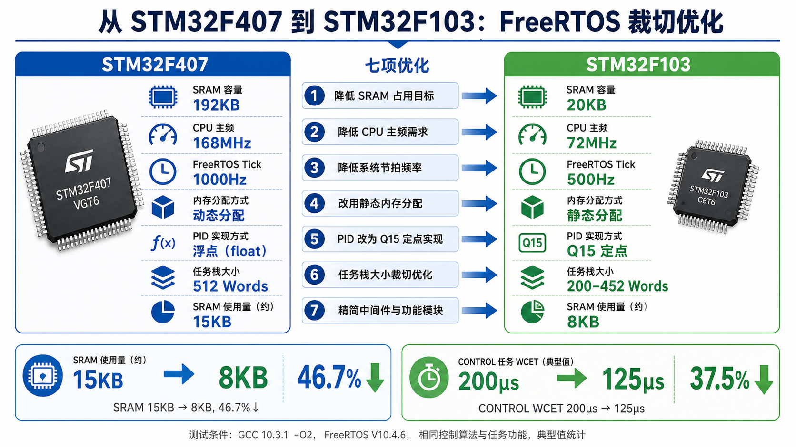

---


### 16.4 学来干嘛：FreeRTOS 裁切与优化

PART1-3 是理论武器库。现在是时候回 FreeRTOS 车间——把你学到的每一个公式变成 `FreeRTOSConfig.h` 里的具体数字。

在 PART4 你将：

- 把 `configTICK_RATE_HZ` 从"看起来可以"变成 RTA 验证的最优值
- 把任务栈从"随便给 512 字"变成 high water mark + 30% 验证的精确值
- 把 heap 策略从 heap_4 默认变成"静态优先、按需动态"的理性选择
- 把"这个工程为什么能在 F103C8 的 20 KB SRAM 里跑"变成一张完整的约束检查表

**理论已在手。进车间吧。**

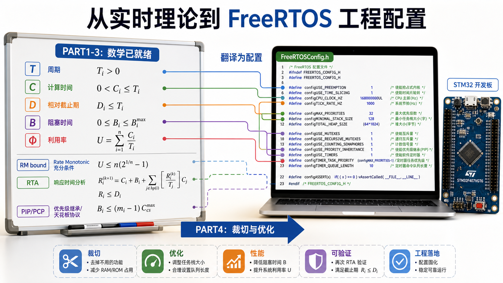

---

**PART3 关键公式速查卡：**


> | 公式                                                    | 含义                               | 位置  |
> | ------------------------------------------------------- | ---------------------------------- | ----- |
> | B_high ≥ L_k + Σ_j n_j·C_j                              | 无协议下的最坏阻塞（下界，上界=∞） | §14.3 |
> | R_i = B_i + C_i + Σ ⌈R_i/T_j⌉·C_j                       | 含阻塞的响应时间分析               | §14.3 |
> | B_i^{PIP} = Σ_{k∈σ_i} max_{j: P_j<P_i} δ_{j,k}          | PIP 下的最坏阻塞（可能多次）       | §15.3 |
> | C(S_k) = max{P_j \| S_k ∈ σ_j}                          | 资源 S_k 的天花板优先级            | §16.1 |
> | B_i^{PCP} = max_{j,k} {δ_{j,k} \| P_j<P_i ∧ C(S_k)≥P_i} | PCP 下的最坏阻塞（最多 1 次）      | §16.1 |
>
> **PIP 三规则：** 调度（当前优先级）、分配（空闲则给，否则阻塞）、继承（阻塞时提升阻塞者）
>
> **PCP 三规则：** 调度（同 PIP）、分配（加天花板检查——空闲 + 优先级 > C\*(t) 才给）、继承（同 PIP + 释放所有天花板 ≥ 被继承者的资源后才恢复）

---

```mermaid
graph TD
    subgraph F407["F407 @168MHz · 192KB SRAM"]
        A1["1000 Hz tick"] --> A2["动态分配 16KB heap"]
        A2 --> A3["每个任务栈 512-768 字"]
        A3 --> A4["浮点 PID (硬件 FPU)"]
        A4 --> A5["CONTROL: 200μs WCET<br/>SENSOR: 350μs<br/>COMM: 800μs"]
    end

    subgraph F103["F103 @72MHz · 20KB SRAM"]
        B1["500 Hz tick ⬇"] --> B2["全静态分配 ⬇"]
        B2 --> B3["栈缩到 200-452 字 ⬇"]
        B3 --> B4["Q15 定点 PID ⬇"]
        B4 --> B5["CONTROL: 125μs WCET<br/>SENSOR: 980μs<br/>COMM: 2100μs"]
        B5 --> B6["RTA: ✅ 全部通过"]
    end

    style A4 fill:#e1f5fe
    style B4 fill:#ffcccc
    style B6 fill:#c8e6c9
```


**裁切总结——七个步骤中的关键决策：**

1. **降 tick**（1000→500 Hz）：每小时少 180 万次 SysTick ISR 调用
2. **静态分配**：消除 heap metadata 开销 + 零碎片 + 零分配失败
3. **缩栈**（HWM）：单步 RAM 节省最大的操作（省 4.3 KB / 21.5%）
4. **关功能**（6 个 `configUSE_*`）：省 1.4 KB Flash
5. **重做 RTA**：发现浮点 PID 在 M3 上的软浮点开销让 WCET 放大 2.8×
6. **改定点 PID**：CONTROL WCET 从 560 μs 降到 125 μs——救了整个可调度性
7. **调整优先权和 deadline**：用工程判断修正理论分析的过度保守

---

---

# PART 4 · FreeRTOS 裁切与优化

PART1-3 用实时系统理论的正式武器——RM bound、时间需求分析、响应时间分析——把你 Ch6 手撕出来的 FreeRTOS 内核重新审视了一遍。你现在可以拿出一个任务集（LED: T=50ms C=2ms, COMM: T=200ms C=35ms, SENSOR: T=500ms C=60ms, LOG: T=1000ms C=100ms, U=43.5%），算它的利用率、迭代它的 $$R_i$$、判断它"跑得过来"。方程成立了。

但方程成立不等于工程成立。RTA 公式里有一堆自变量——$$C_i$$、$$B_i$$、$$T_i$$——它们的值不是天上掉下来的，而是你手上的硬件、编译器和 FreeRTOS 配置共同决定的。Ch6 你在 168 MHz F407 上测了一个 WCET——但如果把同一套代码烧进 72 MHz F103，那些 WCET 值全变了。不是理论错了，是**硬件变了**。PART4 做一件事：**把 RTA 公式里的每一个自变量，捅到 FreeRTOS 的配置和优化层面，告诉你这个变量可以怎么"调"。**

本章聚焦八个维度：FreeRTOSConfig.h 的每一行配置（##17）、任务栈的物理实现与溢出检测（##18）、heap 策略与碎片（##19）、tick 频率与 tickless（##20）、临界区优化（##21）、trace 工具链（##22）、完整裁切案例 F407→F103（##23）、裁切检查清单（##24）。读完这一章，你应该能做到一件事：**对着 `FreeRTOSConfig.h` 说出每一行宏是 RTA 公式里哪个自变量的工程兑现。**

```mermaid
graph LR
    subgraph PART1-3理论武器库
        A["RM Bound: U ≤ n(2^{1/n}-1)"]
        B["RTA: R_i = C_i + B_i + Σ⌈R_i/T_j⌉C_j"]
        C["临界区模型: B_i = max(cs_k)"]
        D["WCET 测量: C_i"]
    end

    subgraph FreeRTOSConfig.h旋钮
        E["configUSE_PREEMPTION<br/>抢占开关"]
        F["configTICK_RATE_HZ<br/>时间粒度"]
        G["configMAX_PRIORITIES<br/>优先级维度"]
        H["configMINIMAL_STACK_SIZE<br/>栈基准线"]
        I["configTOTAL_HEAP_SIZE<br/>堆容量"]
        J["configMAX_SYSCALL_INTERRUPT_PRIORITY<br/>中断安全边界"]
        K["configASSERT<br/>理论假设的守门人"]
    end

    A -->|"FP调度基础"| E
    A -->|"最短T_i下界"| F
    B -->|"抢占窗口粒度"| F
    B -->|"hp(i)集合大小"| G
    C -->|"临界区延迟进B_i"| J
    D -->|"栈溢出→C_i变异"| H
    D -->|"malloc WCET进C_i"| I
    D -->|"假设验证"| K

    style A fill:#e1f5fe
    style B fill:#e1f5fe
    style C fill:#e1f5fe
    style D fill:#e1f5fe
    style E fill:#fff3e0
    style F fill:#fff3e0
    style G fill:#fff3e0
    style H fill:#fff3e0
    style I fill:#fff3e0
    style J fill:#fff3e0
    style K fill:#fff3e0
```

> **这张图的每一条箭头，你读完 ##17 后都应该能说出一个"为什么"。先往下走，最后回来验证。**

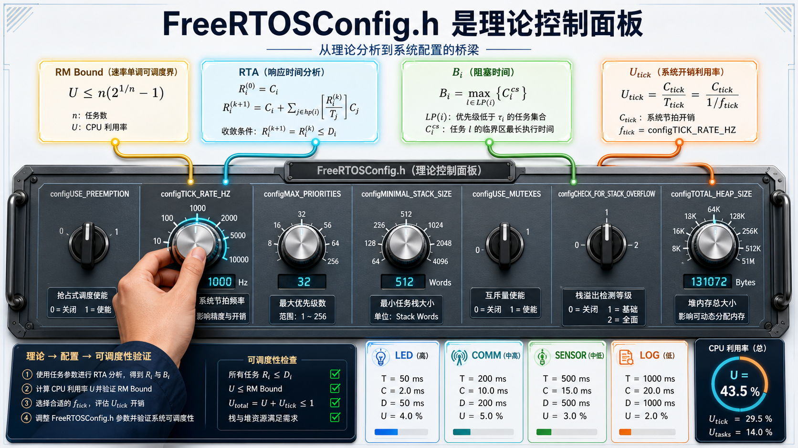

---

## 17 FreeRTOSConfig.h：每一项都是理论约束的工程回答

你在 Ch6 尾声见识过它——FreeRTOS 不是一个"拿来即用"的二进制，而是一捆源码，靠 `FreeRTOSConfig.h` 裁切成你板子上的那个调度器。Ch6 你手写过的每一个机制——抢占、tick、优先级位图、heap、中断——在这里都有一个开关。你 PART1-3 推导出来的每一条公式——RM bound、RTA、$$B_i$$——在这里都有一个对应的"旋钮"。**`FreeRTOSConfig.h` 不是"填参数"，是把 RTA 理论翻译成硬件行为。**

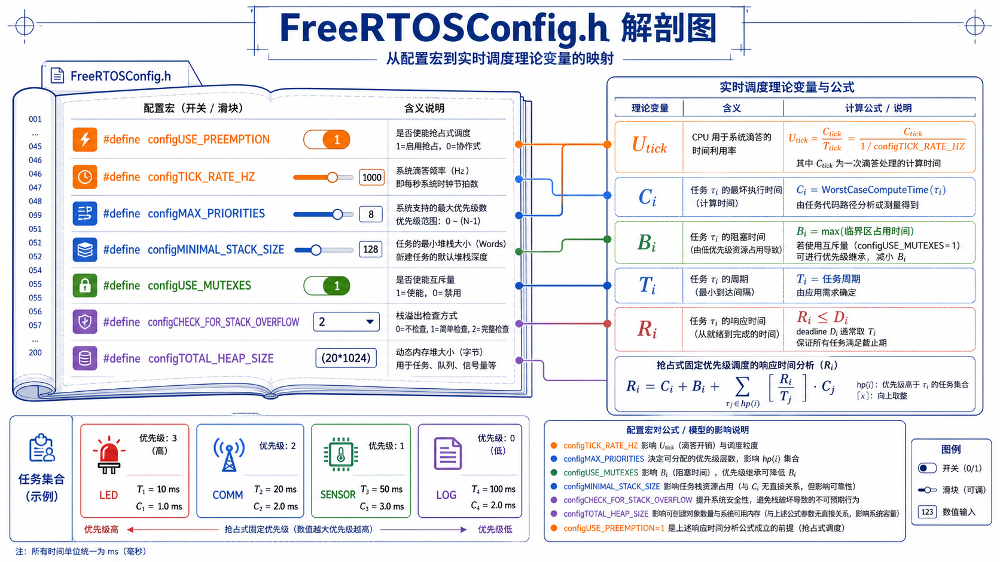

### 17.1 configUSE_PREEMPTION：RM/DM 理论的物理开关

`configUSE_PREEMPTION` 是 `FreeRTOSConfig.h` 里第一个需要做决策的宏，也是最根本的决策。把它设成 `1` 还是 `0`，等于告诉调度器："一个更高优先级的任务就绪时，你要不要立刻把当前任务踢下台？"

```c
#define configUSE_PREEMPTION  1   // 抢占式调度 — RM/DM 理论的基础
// 或
#define configUSE_PREEMPTION  0   // 合作式调度 — 理论武器全部失效
```

设成 `1`——每次 tick 中断（或任何 API 调用唤醒高优先级任务后），调度器检查就绪链表中是否有比当前任务优先级更高的任务。有？把当前任务放回就绪链表，把高优先级任务切上台。这就是**抢占式（preemptive）调度**——它和 Ch6 §7 的 PendSV 切换机制完全匹配。

设成 `0`——调度器仍会选最高优先级的就绪任务上台，但**只在当前任务主动交出 CPU 时才切**。交出 CPU 的时机包括：`taskYIELD()`、`vTaskDelay()`、等待信号量/队列（阻塞）。如果当前任务写了一个 `while (1) {}` 的 busy loop，最高优先级的 COMM 任务永远上不了台。

#### 理论映射：为什么关掉它就是关掉了整个 PART2

直接对应 PART2 的**固定优先级抢占式调度（FP preemptive scheduling）**。RM bound 的导出、RTA 的迭代公式——整个 PART2 的数学基础，都建立在"任务可以被更高优先级任务在任何时刻抢占"的前提上。

关掉 `configUSE_PREEMPTION` 意味着：

1. **RM bound 不再适用。** $$\sum \frac{C_i}{T_i} \leq n(2^{1/n} - 1)$$ 这个公式的推导前提是"任务在释放后只要比当前任务优先级高就能立刻抢占"。合作式调度下这前提不存在。

2. **RTA 公式失效。** $$R_i = C_i + B_i + \sum_{j \in hp(i)} \left\lceil \frac{R_i}{T_j} \right\rceil \cdot C_j$$ 里，$$\sum$$ 项代表的是"更高优先级任务在 $$R_i$$ 时间窗口内抢占 $$\tau_i$$ 的总时长"。合作式调度下，高优先级任务**不能**随时抢占 $$\tau_i$$。

3. **"有效 WCET"变了。** 抢占式调度下 WCET 只关心 CPU 执行时间；合作式调度下，等效 WCET 还要加上"等低优先级任务让出 CPU 的排队时间"。

```mermaid
graph LR
    subgraph 抢占式调度
        A1["τ_high 释放"] -->|"立即抢占"| A2["τ_high 执行"]
        A2 --> A3["τ_high 完成 → D_high 满足"]
    end

    subgraph 合作式调度
        B1["τ_high 释放"] -->|"排队等待"| B2["τ_low 继续执行... 可能很久"]
        B2 --> B3["τ_low yield"]
        B3 --> B4["τ_high 执行"]
        B4 -->|"可能已超时!"| B5["D_high 错过 ❌"]
    end

    style A3 fill:#c8e6c9
    style B5 fill:#ffcdd2
```

**在 Cortex-M 上，`configUSE_PREEMPTION = 0` 几乎没有任何工程理由。** PendSV 切换的开销在 168 MHz 下不到 1 μs，而抢占式调度给你的实时性保证是合作式调度的 N 倍。唯一可能的理由是调试——当你需要单步调试一个任务，不想被中断和 tick 干扰时，临时关掉抢占可以帮你隔离问题。

### 17.2 configTICK_RATE_HZ：调度粒度 = 周期任务的最短周期下界

`configTICK_RATE_HZ` 可能是 `FreeRTOSConfig.h` 里被改动频率最高的宏——从 100 Hz 的慢速工控到 10 kHz 的高频控制，同一个宏、截然不同的系统行为。

```c
#define configTICK_RATE_HZ  1000   // tick 频率 = SysTick 每秒中断次数
```

这个宏决定了 `configCPU_CLOCK_HZ / configTICK_RATE_HZ` 个 CPU 周期后产生一次 SysTick 中断。每次 SysTick 中断触发时，硬件自动进栈，然后执行 `xTaskIncrementTick`，遍历延时链表中所有"到期"的节点，把到期节点挂到就绪链表。

#### 理论映射：tick 频率 → RTA 公式里的三个变量

```mermaid
graph TD
    F["configTICK_RATE_HZ"] --> G1["T_min 下界<br/>最短周期 ≥ 2/f_tick"]
    F --> G2["延时jitter<br/>±1 tick 不确定性"]
    F --> G3["C_i 附加项<br/>tick ISR 的 CPU 占用"]

    G1 --> H1["RM Bound: 有些高频任务<br/>可能无法表示"]
    G2 --> H2["RTA: r_{i,k} 的释放时刻<br/>有 ±(1/f_tick) 抖动"]
    G3 --> H3["RTA: C_i = C_i_exec + C_i_tick_抢占"]

    style F fill:#fff3e0
    style G1 fill:#e1f5fe
    style G2 fill:#e1f5fe
    style G3 fill:#e1f5fe
```

**映射一：T_min —— 周期任务的最短周期下界。** 如果你的控制任务需要每 500 μs 释放一次，1000 Hz tick（1 ms 粒度）压根无法表达 500 μs 周期——`pdMS_TO_TICKS(0.5)` 在 1000 Hz 下要么是 0 tick（立即释放，没有周期语义），要么是 1 tick（1 ms，慢了一倍）。

**映射二：tick jitter —— 释放时刻的 ±1 tick 不确定性。** `vTaskDelayUntil` 的任务，理论释放时刻在第 N 次 tick 中断到达的瞬间。但实际上 tick 中断有 jitter（被临界区阻塞、被高优先级 ISR 抢走），所以实际释放时刻有一个 ±1 tick 的窗口。

**映射三：tick 中断本身的 CPU 占用进入 C_i。** 假设 tick ISR 耗时 5 μs（168 MHz 下），在 1000 Hz 下 tick 中断占总 CPU 的 0.5%。RTA 分析里如果你没把这 0.5% 加进 C_i，你的分析偏乐观了 0.5%。

#### 不同 tick 频率下支持的最短任务周期

```datatable
{
  "title": "tick 频率 vs 可支持的任务周期 vs CPU 开销",
  "columns": [
    { "key": "tick_hz", "label": "tick 频率", "type": "text" },
    { "key": "tick_period", "label": "tick 周期", "type": "text" },
    { "key": "min_delay_precision", "label": "延时精度", "type": "text" },
    { "key": "practical_min_t", "label": "实用最短 T_i (5 tick)", "type": "text" },
    { "key": "isr_per_sec", "label": "每秒tick中断", "type": "number" },
    { "key": "cpu_168mhz", "label": "CPU开销@168MHz", "type": "percent" },
    { "key": "cpu_8mhz", "label": "CPU开销@8MHz", "type": "percent" },
    { "key": "typical_use", "label": "典型场景", "type": "text" }
  ],
  "rows": [
    { "tick_hz": "100 Hz", "tick_period": "10 ms", "min_delay_precision": "±10 ms", "practical_min_t": "50 ms", "isr_per_sec": 100, "cpu_168mhz": 0.0005, "cpu_8mhz": 0.005, "typical_use": "慢速HMI、传感器巡检" },
    { "tick_hz": "500 Hz", "tick_period": "2 ms", "min_delay_precision": "±2 ms", "practical_min_t": "10 ms", "isr_per_sec": 500, "cpu_168mhz": 0.0025, "cpu_8mhz": 0.025, "typical_use": "中等控制、PID回路" },
    { "tick_hz": "1000 Hz", "tick_period": "1 ms", "min_delay_precision": "±1 ms", "practical_min_t": "5 ms", "isr_per_sec": 1000, "cpu_168mhz": 0.005, "cpu_8mhz": 0.05, "typical_use": "FreeRTOS默认、电机FOC" },
    { "tick_hz": "5000 Hz", "tick_period": "200 μs", "min_delay_precision": "±200 μs", "practical_min_t": "1 ms", "isr_per_sec": 5000, "cpu_168mhz": 0.025, "cpu_8mhz": 0.25, "typical_use": "极高带宽控制(需tickless!)" },
    { "tick_hz": "10000 Hz", "tick_period": "100 μs", "min_delay_precision": "±100 μs", "practical_min_t": "500 μs", "isr_per_sec": 10000, "cpu_168mhz": 0.05, "cpu_8mhz": 0.50, "typical_use": "MHz级控制(tickless更好)" }
  ]
}
```

#### 怎么选：五步决策流程

```mermaid
graph TD
    S1["Step 1: 找最短任务周期 T_min"] --> S2{"T_min ≥ 10/f_tick 初始值?"}
    S2 -->|是| S3["Step 2: 计算 U_tick = N_tick_isr × f_tick / f_CPU"]
    S2 -->|否| S4["提高 f_tick 或走 tickless"]
    S4 --> S3
    S3 --> S4b{"U_tick ≤ 1%?"}
    S4b -->|是| S5["Step 3: 检查延时jitter是否可接受"]
    S4b -->|否| S4c["⚠️ tick开销太大<br/>考虑 tickless 或降频"]
    S5 --> S6{"±(1/f_tick) 满足精度需求?"}
    S6 -->|是| S7["Step 4: 在目标f_CPU上实测tick ISR时间"]
    S6 -->|否| S4
    S7 --> S8["Step 5: 最终确认<br/>写入 FreeRTOSConfig.h"]

    style S8 fill:#c8e6c9
    style S4c fill:#ffcdd2
```

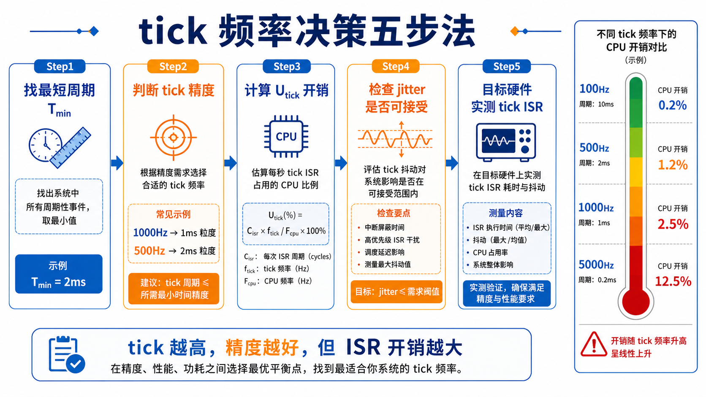

### 17.3 configMAX_PRIORITIES：优先级空间的物理维度

```c
#define configMAX_PRIORITIES  32   // 优先级 0~31（0 是 idle 专属）
```

这个宏定义了 FreeRTOS 支持多少个不同的优先级。**FreeRTOS 内优先级数字越大优先级越高**——这和 Cortex-M NVIC 相反。`configMAX_PRIORITIES` 直接影响内核的静态 RAM 占用。Ch6 §3 你见过就绪链表的结构——每个优先级一个头节点：

```c
PRIVILEGED_DATA static List_t pxReadyTasksLists[ configMAX_PRIORITIES ];
```

每个 `List_t` 结构约 20 字节。优先级数每增加 1，大约增加 20-30 字节的 RAM 和等量的 ROM。

#### 理论映射：configMAX_PRIORITIES → hp(i) 集合的基数

RTA 公式 $$R_i = C_i + B_i + \sum_{j \in hp(i)} \left\lceil \frac{R_i}{T_j} \right\rceil \cdot C_j$$ 中 $$hp(i)$$ 是"优先级高于 $$\tau_i$$ 的所有任务的集合"。如果 `configMAX_PRIORITIES` 不够大，你不得不把周期不同的任务压在同一个优先级上——RM 的"周期→优先级"映射被破坏，RTA 失效。

FreeRTOS 在 32 位架构上使用"优先级位图"（`uxTopReadyPriority`）加速。`portGET_HIGHEST_PRIORITY` 在 Cortex-M 上用 `__clz`（Count Leading Zeros）指令，单周期完成。**最高优先级任务的查找是严格的 O(1)**——不管你有 7 个还是 32 个优先级。

**超过 32 需要切换到 `configUSE_PORT_OPTIMISED_TASK_SELECTION = 0`**——32 位变量只能表示 32 个优先级。如果需要更多（比如 64），就得用通用链表查找（遍历），O(n) 不再是 O(1)。

### 17.4 configMINIMAL_STACK_SIZE：空闲任务的"最小饭量"

```c
#define configMINIMAL_STACK_SIZE  ((unsigned short)128)
```

这个宏定义了**空闲任务（idle task）**的栈大小。单位是**字（word）**，不是字节！在 32 位 Cortex-M 上，`128` 意味着 128 × 4 = 512 字节。

注意两个关键约束：
1. **这个宏只用于空闲任务。** 你自己的任务栈在 `xTaskCreate()` 的 `usStackDepth` 参数里指定
2. **port 层可以覆盖它。** 如果某个架构上的空闲任务最小需要的栈比你的值还大，port 层会用自己 port 层的最小值

空闲任务栈消耗逐层解剖（Cortex-M4F 典型值）：

```
空闲任务栈消耗:
├─ 硬件自动压栈 (进异常时)          32 字节 (R0-R3, R12, LR, PC, xPSR)
├─ PendSV 手动压栈 (R4-R11)        32 字节
├─ prvIdleTask 调用链              40-80 字节
├─ FPU 压栈 (如果使用)              64 字节 (S0-S15)
├─ 中断嵌套余量                     32-64 字节
├─ 编译器差异余量                   20-40 字节
─────────────────────────────────────────
总计（不含FPU）:                    ~176-248 字节 ≈ 44-62 字
总计（含FPU）:                      ~240-312 字节 ≈ 60-78 字
```

FreeRTOS 设 128 字（512 字节）是加了**100% 的安全余量**。

### 17.5 configTOTAL_HEAP_SIZE：为一屋子人量地——算出来，不是猜的

```c
#define configTOTAL_HEAP_SIZE  ((size_t)(17 * 1024))  // 17 KB
```

这个宏定义了 `ucHeap[]` 静态数组的长度——FreeRTOS 所有的动态分配（`pvPortMalloc`）最终都是从这块地里切的。**17 KB 这个数字不是随便写的——它应该是你算出来的。** 无数 FreeRTOS 项目的 `FreeRTOSConfig.h` 里，这个值都是"抄模板的"或者"大概写一个大的"——结果要么浪费 RAM，要么跑着跑着 `pvPortMalloc` 返回 NULL。

#### 怎么算——自底向上的 heap 需求分析

用统一参数的四人车间来演示。假设所有创建都用动态分配（`xTaskCreate` + `xQueueCreate` + `xSemaphoreCreateMutex`）：

| 分配项 | 每个大小 | 数量 | 小计 |
|--------|----------|------|------|
| TCB（`xTaskCreate` 内部分配）| ~104 字节 | 4（+ idle + timer）| ~624 字节 |
| 任务栈（`xTaskCreate` 的 `usStackDepth`）| τ₁=256字=1KB, τ₂=512字=2KB, τ₃=512字=2KB, τ₄=256字=1KB | 4 | **6 KB** |
| 队列存储（`xQueueCreate` 内部分配）| 4 × 64字节（sensor_q）+ 8 × 64字节（cmd_q）+ 16 × 32字节（log_q）| 3 | **1.25 KB** |
| Mutex 控制块（`xSemaphoreCreateMutex`）| ~80 字节 | 2（spi_mutex, uart_mutex）| 160 字节 |
| heap 元数据开销（heap_4 `BlockLink_t`）| ~16 字节/块 | ~12 块 | ~192 字节 |
| **纯需求合计** | | | **~8.2 KB** |
| **建议配置（+30% 碎片余量）** | | | **~10.7 KB** |
| **实际取值** | | | **12 KB** |

> **configTOTAL_HEAP_SIZE = 12 × 1024 = 12288**

"加30%碎片余量"不是随便的数字——它是 heap_4 在长期运行中，由于 malloc/free 交替进行，空闲块数量 K 从 3 增长到 10-20 时，仍能保证 `pvPortMalloc` 找到合适块的缓冲区。如果你的项目**创建后不删除**（大部分嵌入式项目都这样），碎片风险为零，余量可以降到 10%。

#### heap 策略对 TOTAL_HEAP_SIZE 的影响

| heap 策略 | TOTAL_HEAP_SIZE 含义 | 怎么算 |
|----------|---------------------|--------|
| **heap_1** | 一次性分配的 total cap。只增不减。 | Σ(所有 `pvPortMalloc` 调用需要的字节)。永不释放 → 零碎片 → 不需要余量。 |
| **heap_2** | 有碎片风险。不合并相邻块。 | 纯需求 × 1.5~2.0（碎片严重）。官方不推荐。 |
| **heap_3** | wrapper 到 C 库 malloc。`ucHeap` 不直接使用。 | 这个宏在 heap_3 中**可能完全不被使用**——取决于 port 层。谨慎对待。 |
| **heap_4** | first-fit + 相邻合并。碎片风险低。 | 纯需求 × 1.2~1.3。 |
| **heap_5** | 同 heap_4，但支持多块不连续 RAM。 | 所有区域加起来 ≥ 纯需求 × 1.2~1.3。每块区域单独声明。 |

#### 验证：用 FreeRTOS 自带的 API 查实际用量

设完不验证 = 盲飞。FreeRTOS 提供了 `xPortGetFreeHeapSize()` 返回当前空闲字节：

```c
/* 在系统启动后、所有对象创建完毕后调用一次 */
void check_heap_after_init(void) {
    size_t free_after_init = xPortGetFreeHeapSize();
    printf("Heap: total=%u, used=%u (%.1f%%), free=%u\n",
           configTOTAL_HEAP_SIZE,
           configTOTAL_HEAP_SIZE - free_after_init,
           100.0 * (configTOTAL_HEAP_SIZE - free_after_init) / configTOTAL_HEAP_SIZE,
           free_after_init);
    /* 预期：used ≈ 8.2 KB ≈ 68%~70%。如果不是——你漏算了某次分配。 */
}
```

再加上 `xPortGetMinimumEverFreeHeapSize()`——它返回系统运行至今，**最低**的空闲字节数。如果这个值在运行 24 小时后仍然 > 1 KB，说明你的总量设得合适。如果降到 < 256 字节——说明碎片在侵蚀你的 heap，需要调查或增加总量。

#### 常见错误：混淆"字节"和"字"

`configTOTAL_HEAP_SIZE` 的单位是**字节（bytes）**。但 `xTaskCreate` 的 `usStackDepth` 参数的单位是**字（words）**，在 32 位 Cortex-M 上 1 字 = 4 字节。很多人算栈的时候用了字数，但填 `configTOTAL_HEAP_SIZE` 的时候忘了乘 4——结果总量不够，`pvPortMalloc` 返回 NULL。

**自查清单：**
1. ☐ 你的 TOTAL_HEAP_SIZE 是自己算的，不是模板抄的？
2. ☐ 你把栈消耗（字）转换成了字节（×4）？
3. ☐ 你考虑了 heap 元数据开销（每块 12-16 字节）？
4. ☐ 你运行了 24 小时后用 `xPortGetMinimumEverFreeHeapSize()` 验证？
5. ☐ 如果用静态分配（`configSUPPORT_STATIC_ALLOCATION=1`），你的 TOTAL_HEAP_SIZE 可以设得极小而不用担心碎片？

### 17.6 configMAX_SYSCALL_INTERRUPT_PRIORITY：临界区延迟的工程兑现

`configMAX_SYSCALL_INTERRUPT_PRIORITY` 是 FreeRTOS 里配错概率最高、配错后果最严重的宏。

```c
#define configLIBRARY_MAX_SYSCALL_INTERRUPT_PRIORITY  5
#define configMAX_SYSCALL_INTERRUPT_PRIORITY  \
    ( configLIBRARY_MAX_SYSCALL_INTERRUPT_PRIORITY << (8 - configPRIO_BITS) )
```

这个值被写入 `BASEPRI` 寄存器——**优先级数值 ≥ 5 的中断全被屏蔽；优先级数值 0~4 的中断不受影响。** 这就是 FreeRTOS 的临界区——它不是"关全部中断"，而是"关能和调度器交互的那一批中断"。

**SysTick 的优先级必须低于（数值大于）`configMAX_SYSCALL_INTERRUPT_PRIORITY`。** 否则 tick 中断会在临界区里"漏进去"→ 修改就绪链表 → 数据竞争 → **随机 HardFault**。

```mermaid
graph BT
    subgraph "Cortex-M NVIC 优先级 (数值小=优先级高)"
        P0["0 — 最紧急⚠️"]
        P1["1"]
        P2["2"]
        P3["3"]
        P4["4"]
    end

    subgraph "FreeRTOS API 边界"
        BORDER["──── configMAX_SYSCALL_INTERRUPT_PRIORITY ────"]
    end

    subgraph "可调用 FreeRTOS FromISR API"
        P5["5"]
        P6["6"]
        P7["7"]
        Pdots["..."]
        P15["15 — 最不紧急"]
    end

    P0 -->|"❌ 禁止调API<br/>BASEPRI挡不住它"| BORDER
    P4 --> BORDER
    BORDER -->|"✓ 可调 FromISR<br/>但临界区会屏蔽它"| P5

    style BORDER fill:#ff9800,stroke:#e65100,stroke-width:3px
    style P0 fill:#ff5252,color:#fff
    style P15 fill:#81c784
```

### 17.7 configASSERT：理论假设的最后一道防线——及开发期/量产期开关策略

```c
#define configASSERT(x)                                          \
    do {                                                         \
        if ((x) == 0) {                                          \
            taskDISABLE_INTERRUPTS();                             \
            for (;;) { __BKPT(0); }                              \
        }                                                        \
    } while (0)
```

`configASSERT` 不是 FreeRTOS 强制要求定义的宏——但一旦定义了它，FreeRTOS 内核里**几百个断言检查点**被激活。这些检查点覆盖了内核的每一个关键路径：

| 检查类别 | 典型断言 | 触发意味着什么 |
|---------|---------|----------------|
| 参数合法性 | `configASSERT(pxTCB != NULL)` | 空指针传入内核API |
| 状态一致性 | `configASSERT(pxTCB->xState == eReady)` | TCB状态与链表不匹配——内核数据结构损坏 |
| 中断边界 | `configASSERT(ucCurrentNestingLevel < 32)` | ISR嵌套深度超限 |
| 优先级合法性 | `configASSERT(uxPriority < configMAX_PRIORITIES)` | 传入了超出范围的优先级值 |
| 栈对齐 | `configASSERT(((uint32_t)pxStack & 0x07) == 0)` | 栈指针未对齐——违反AAPCS约定 |
| 调度器锁 | `configASSERT(uxSchedulerSuspended == 0)` | 调度器挂起期间调了不允许的API |

PART1-3 的整个数学框架建立在假设之上（任务不会超 WCET、中断优先级分配正确、没有 TCB 损坏）。**这些假设无法在数学上证明——你只能在工程上尽量保证。** `configASSERT` 就是你的第一道工程防线。

#### 开发期/量产期开关策略

**开发期（DEBUG build）：** 必须定义为致命错误——关中断+死循环+`__BKPT(0)` 触发调试器断点。开发期的 assert hit 是你收到的最有价值的 bug 报告——它精确告诉你内核数据结构在哪个 API 调用点被破坏了。

**量产期（RELEASE build）：三个选项。**

| 策略 | 做法 | 开销 | 安全性 | 适用 |
|------|------|------|--------|------|
| A: 完全关闭 | `#define configASSERT(x) ((void)0)` | 零 | 最低 | 消费电子、玩具 |
| B: 轻量报警 | 记录到备份寄存器+软件复位 | ~200B | 中等 | 工业IoT、智能家居 |
| C: 保留致命断言 | 只关非致命路径，保留关键断言 | ~1KB | 高 | 医疗、汽车安全 |

**策略B的轻量实现：**

```c
#define configASSERT(x)                                              \
    do {                                                             \
        if ((x) == 0) {                                              \
            RTC->BKP0R = __LINE__;                                   \
            RTC->BKP1R = xTaskGetTickCount();                        \
            NVIC_SystemReset();                                      \
        }                                                            \
    } while (0)
```

> **核心原则：关掉 `configASSERT` 意味着你相信PART1-3的所有理论假设完美成立。** 如果你的产品出bug的代价是人命或大量财产损失——留下至少策略B。省几百字节Flash换来的风险是不对称的。


---

## 18 栈管理：任务模型的物理实现

PART1 里每个任务 $$\tau_i$$ 有一个 WCET（$$C_i$$），但这个 $$C_i$$ 来自哪里？Ch6 §1 你学过一个任务的"开工现场"——CPU 的执行现场、程序计数器、局部变量、函数调用链——全部物理地存放在任务的栈里。**栈是任务模型的"物理载体"——没有栈，任务就只是一串被编译成机器码的函数指针。**

这一节，我们把 Ch6 §7 的 PendSV 栈帧、Ch6 §16 的 MSP/PSP 双栈模型，以及 PART1-3 里每个任务的 WCET 分析，串在一起回答三个问题：

1. **栈到底吃了多少 RAM？** —— 每一层的来源和精确字节数（##18.1）
2. **你怎么知道栈够不够？** —— high water mark 运行时检测（##18.2）
3. **栈溢出了怎么办？** —— canary 软件检测 + MPU 硬件保护（##18.3）

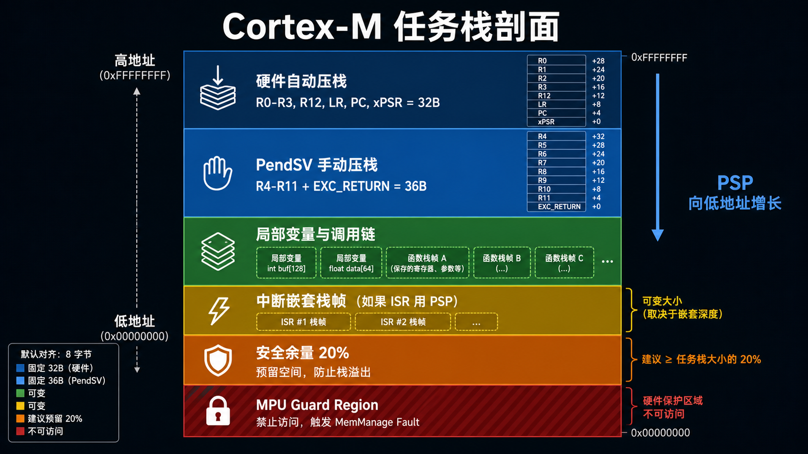

### 18.1 栈大小怎么估：从硬件压栈到局部变量，五层解剖

Cortex-M 上一个任务的栈消耗来自五层叠加：

```mermaid
graph TB
    subgraph "Cortex-M 任务栈的五层消耗 (自顶向下 = 高地址到低地址)"
        A["────────────────── 高地址 (栈顶) ──────────────────"]
        B["🔵 第1层: 硬件自动压栈 R0-R3,R12,LR,PC,xPSR 8×4=32字节"]
        C["🔵 第2层: PendSV手动压栈 R4-R11+EXC_RETURN 9×4=36字节"]
        D["🟢 第3层: 任务局部变量+调用链 取决于代码"]
        E["🟡 第4层: 中断嵌套栈帧 每次ISR嵌套=32字节"]
        F["🟠 第5层: 安全余量 10-20%"]
        G["────────────────── 低地址 (栈底) ──────────────────"]
        H["🔴 MPU Guard Region (可选) 32-64字节保护区"]
    end
    A --> B --> C --> D --> E --> F --> G --> H
    style B fill:#e3f2fd
    style C fill:#bbdefb
    style D fill:#81c784
    style E fill:#fff9c4
    style F fill:#ffcc80
    style H fill:#ff5252,color:#fff
```

**第1层（硬件压栈）：** Cortex-M 进任何异常时，硬件自动把 8 个寄存器压进当前任务栈（PSP），**固定 32 字节**。

**第2层（PendSV 手动压栈）：** PendSV 手动保存 R4-R11（8个）+ EXC_RETURN（1个），共 9 × 4 = **36 字节**。

**第3层（局部变量和调用链）：** 这是最难估的一层。局部数组、函数调用链深度、标准库函数（`sprintf` 在 Newlib 里栈消耗可达 200-400 字节）都会显著增加栈消耗。

**第4层（中断嵌套栈帧）：** 普通外设中断通常跑在 MSP 上，不消耗任务 PSP 栈。但如果 ISR 配置为使用 PSP，需要额外计入。

**第5层（安全余量）：** 编译器版本差异、优化级别切换、库版本更新——所有这些需要 10-20% 的安全余量兜底。

#### 栈估算公式

$$S_{task} = 32\text{(硬件压栈)} + 36\text{(PendSV)} + S_{FPU} + S_{local\_vars} + S_{call\_chain} + S_{ISR\_nest} + S_{margin}$$

以四人车间的 SENSOR 任务为例：

```
SENSOR 任务栈估算:
  S_hw      = 32    (硬件压栈)
  S_pendsv  = 36    (PendSV R4-R11 + EXC_RETURN)
  S_fpu     = 64    (浮点滤波用了 FPU)
  S_local   = 128   (raw_samples[64])
            + 256   (filtered_samples[64])
            + 128   (debug_buf[128])
            = 512
  S_call    = 48    (sensor_read→adc_filter→median_filter_3)
  S_isr     = 0     (ISR 都在 MSP 上)
  S_margin  = (32+36+64+512+48) × 0.2 = 692 × 0.2 ≈ 138
  ─────────────────────────────────────────
  S_total   = 692 + 138 = 830 字节 ≈ 208 字
```

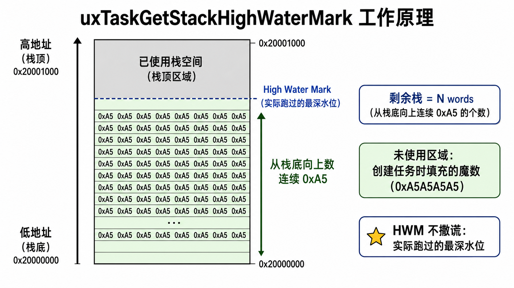

- **返回值 = 0** → 危险！栈可能已经溢出
- **返回值 < 10 字** → 栈余量极少，需要立刻扩大栈
- **返回值 = usStackDepth 的 30-50%** → 健康状态
- **返回值 = usStackDepth 的 80-100%** → 栈给得太多，可以缩一些

**工程铁律：开发期把 HWM 挂上串口，用最极端的压力测试跑 24 小时——看在什么条件下 HWM 降到最低。这个数字就是你栈的"真相基线"。在此基础上加 30% 作为生产环境栈配置。**

### 18.3 栈溢出检测：configCHECK_FOR_STACK_OVERFLOW 选项1和选项2

high water mark 告诉你"栈用了多少"，但它**不主动保护溢出**。当栈溢出真的发生时——数据已经被踩坏了，你可能几毫秒后才在完全不相关的地方崩溃。FreeRTOS 通过 `configCHECK_FOR_STACK_OVERFLOW` 提供两种主动检测机制：

```

```c
#define configCHECK_FOR_STACK_OVERFLOW  0  // 不检查
#define configCHECK_FOR_STACK_OVERFLOW  1  // 选项1：检查PSP位置
#define configCHECK_FOR_STACK_OVERFLOW  2  // 选项2：PSP + canary word双保险
```

#### 选项1：PSP 位置检查（轻量但有限）

**原理：** 每次 PendSV 保存完旧任务的现场后，检查 PSP 是否已经越过栈底（合法最低地址）。如果 PSP ≤ `pxStack` 的最低合法地址 → 说明任务在执行过程中栈指针已经踩出去了。

```c
/* 选项1 的核心逻辑（在PendSV的 vTaskSwitchContext 中） */
#if configCHECK_FOR_STACK_OVERFLOW == 1
    /* 读取当前任务的PSP */
    pxTopOfStack = (StackType_t *) __get_PSP();

    /* 检查：PSP是否已经低于栈底？ */
    if (pxTopOfStack <= pxCurrentTCB->pxStack) {
        /* PSP已经越过栈底——栈溢出了！*/
        vApplicationStackOverflowHook(xTaskHandle, pcTaskName);
    }
#endif
```

**优点：**
- 零 RAM 开销——不额外占用栈空间
- 极低 CPU 开销——只一次 PSP 读取 + 比较

**局限：**
- **检测有盲区——只检测 PSP 越界，不检测"数据越界但 PSP 未越界"。** 如果你在任务里声明了一个大数组，数组的起始地址在栈范围内，但数组的写入越过了栈底却没有触发 PSP 移动（比如你通过基址+偏移访问），PSP 不会变——选项1就漏检了
- **检测有窗口——只在任务切换时检查。** 任务在自己的时间片内溢出，要等下次 PendSV 才检测到——中间可能有别的任务已经被踩了

#### 选项2：PSP + canary word（双重保险）

**原理：** 在选项1的基础上，在任务创建时往栈的最底端塞一个 canary word（魔数 `0xA5A5A5A5`）。每次任务切换时检查这个 canary 是否被篡改。

```c
/* 在任务创建时，栈底部额外放一个 canary word */
#define taskSTACK_CANARY_VALUE  ( 0xA5A5A5A5UL )

/* 在最底端（紧挨着 pxStack[0] 的地方）写入 canary */
*( ( uint32_t * ) pxTopOfStack - 1 ) = taskSTACK_CANARY_VALUE;

/* 选项2 检查逻辑（在 PendSV 中） */
#if configCHECK_FOR_STACK_OVERFLOW == 2
    /* 检查1：PSP 是否越界（同选项1） */
    if (pxTopOfStack <= pxCurrentTCB->pxStack) {
        vApplicationStackOverflowHook(...);
    }

    /* 检查2：canary word 是否被篡改 */
    if (*(uint32_t *)pxCurrentTCB->pxStack != taskSTACK_CANARY_VALUE) {
        /* canary被踩了——即使PSP还没越界，数据已经溢出了 */
        vApplicationStackOverflowHook(...);
    }
#endif
```

**相比选项1的增强：**
- 能检测"数据溢出但 PSP 未越界"的场景——因为大数组的写入可能绕过 PSP 直接覆盖栈底
- canary 放在栈的最底部（地址最小的位置），任何对栈底区域的写入都会先碰到它

**局限（仍存在）：**
- **canary 可能被"跳过"**——如果你的局部数组刚好覆盖了 canary 的位置又超出了它——概率极低，但理论上存在（如果数组中恰好包含值 `0xA5A5A5A5`，且数组起始地址在 canary 上方、结束地址在 canary 下方）
- **检测仍有窗口**——同选项1，只在任务切换时检查

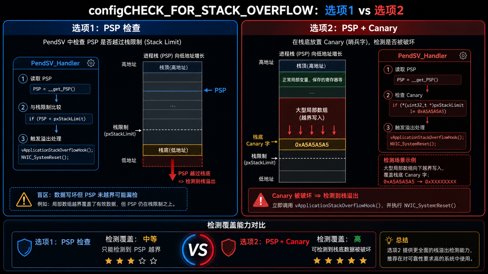

#### canary vs MPU：两种栈保护的对比

```datatable
{
  "title": "栈溢出检测方案对比",
  "columns": [
    { "key": "aspect", "label": "对比维度", "type": "text" },
    { "key": "opt1", "label": "选项1 (PSP检查)", "type": "text" },
    { "key": "opt2", "label": "选项2 (PSP+canary)", "type": "text" },
    { "key": "mpu", "label": "MPU 硬件", "type": "text" }
  ],
  "rows": [
    { "aspect": "检测时机", "opt1": "任务切换时检查 PSP", "opt2": "切换时检查PSP+canary", "mpu": "溢出瞬间立刻触发MemManage Fault" },
    { "aspect": "漏检可能", "opt1": "PSP未越界但数据已坏 → 漏检", "opt2": "低概率跳过canary → 漏检", "mpu": "硬件保证 → 零漏检" },
    { "aspect": "RAM开销", "opt1": "0 字节", "opt2": "1 word/任务", "mpu": "0 字节 (MPU是CPU内资源)" },
    { "aspect": "CPU开销", "opt1": "每次切换几周期", "opt2": "每次切换几周期", "mpu": "每次切换需重编程MPU(几十周期)" },
    { "aspect": "硬件要求", "opt1": "无", "opt2": "无", "mpu": "需要Cortex-M3/M4/M7 MPU" },
    { "aspect": "安全认证", "opt1": "不满足 ISO 26262", "opt2": "不满足", "mpu": "满足ASIL要求" },
    { "aspect": "适用场景", "opt1": "原型开发", "opt2": "中等系统推荐默认值", "mpu": "安全关键(车规/医疗/工业)" }
  ]
}
```

**工程决策树：**

```
栈检测方案选择:

任务数 ≤ 5 且无安全关键要求
  → 选项1 (原型期) / 选项2 (开发+量产，推荐)

任务数 5-12，有通信/控制，非安全关键
  → 选项2 + 定期 HWM 监控 + 串口上报

任务数 > 12 或安全关键 (车规/医疗/工业安全)
  → MPU 必须！(或者用全静态分配消除栈溢出的后果)
```

#### 当检测到溢出时

FreeRTOS 调用你的回调——**这个钩子运行在中断上下文中，不要做耗时操作**：

```c
void vApplicationStackOverflowHook( TaskHandle_t xTask, char *pcTaskName )
{
    /* 最轻量: 把出错信息存进 .noinit 段 (复位后不丢失的 RAM) */
    extern stack_overflow_record_t overflow_record;
    overflow_record.task_handle = (uint32_t)xTask;
    strncpy(overflow_record.task_name, pcTaskName, 
            sizeof(overflow_record.task_name) - 1);
    overflow_record.tick_count = xTaskGetTickCount();

    /* 立即复位 — 不要在损坏的栈上继续跑 */
    NVIC_SystemReset();
}
```

#### 补充：主栈（MSP）溢出的隐蔽性

`uxTaskGetStackHighWaterMark()` 和 `configCHECK_FOR_STACK_OVERFLOW` 都只检查**任务栈（PSP）**，不检查**系统主栈（MSP）**。而 MSP 溢出在深度中断嵌套时极易发生——根因不是任务栈太小，是链接脚本中给 MSP 的空间太小。

```c
/* 主栈 canary 检测——补充 uxTaskGetStackHighWaterMark 的盲区 */
extern uint32_t _estack;       /* 链接脚本中定义：MSP 栈顶 */
static uint32_t msp_stack_bottom; /* MSP 栈底（由 startup 计算）*/

void msp_stack_guard_init(void)
{
    uint32_t *bottom = &msp_stack_bottom;
    for (int i = 0; i < 16; i++) bottom[i] = 0xDEADBEEF;
}

int msp_stack_overflow_check(void)
{
    uint32_t *bottom = &msp_stack_bottom;
    for (int i = 0; i < 16; i++) {
        if (bottom[i] != 0xDEADBEEF) return 1; /* 栈溢出！*/
    }
    return 0;
}
```

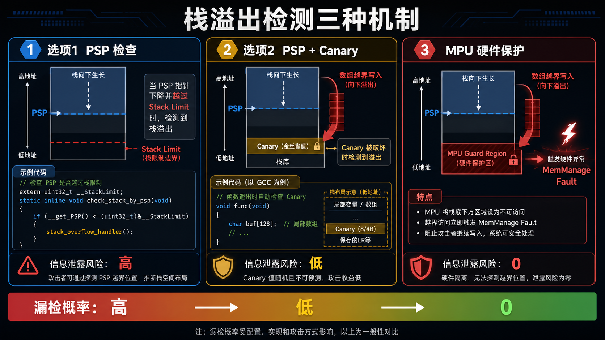

---

## 19 内存管理：heap 碎片是隐藏的截止时间杀手

Ch6 §17 你手写了 heap_4——首次适配（first-fit）+ 按地址排序的空闲链 + 相邻空闲块合并。你还记住了那句口袋判断："总剩余够、却分不出一块来 = 碎片。"

但碎片不只浪费 RAM。从 RTA 的角度看，碎片让 `pvPortMalloc` 的执行时间变长——每次分配时要遍历更长的空闲链表。**这个变长的 WCET 直接进入 RTA 公式里的 C_i。**

```mermaid
graph LR
    A["💔 碎片累积<br/>空闲块变多变小"] --> B["N 个空闲块<br/>在空闲链表上"]
    B --> C["pvPortMalloc<br/>遍历 N 次比较"]
    C --> D["WCET + N×20 cycles"]
    D --> E["C_i 增大"]
    E --> F["R_i = C_i + B_i + Σ..."]
    F --> G{"R_i > D_i? → ❌ 错过 deadline"}

    style A fill:#ffcdd2
    style G fill:#ffcdd2
```

### 19.1 heap_1 ~ heap_5：策略差异的全景对比

```datatable
{
  "title": "heap_1 ~ heap_5 策略全面对比",
  "columns": [
    { "key": "heap", "label": "堆策略", "type": "text" },
    { "key": "alloc_strategy", "label": "分配策略", "type": "text" },
    { "key": "can_free", "label": "可释放?", "type": "text" },
    { "key": "merge", "label": "合并空闲", "type": "text" },
    { "key": "malloc_time", "label": "malloc 时间", "type": "text" },
    { "key": "frag_risk", "label": "碎片风险", "type": "badge" },
    { "key": "wcet_predictability", "label": "WCET可预测性", "type": "badge" },
    { "key": "use_case", "label": "适用场景", "type": "text" }
  ],
  "rows": [
    { "heap": "heap_1", "alloc_strategy": "单调递增指针", "can_free": "✗ 永不释放", "merge": "—", "malloc_time": "O(1) 无链表", "frag_risk": "无", "wcet_predictability": "极高", "use_case": "只创建不删除的静态系统" },
    { "heap": "heap_2", "alloc_strategy": "best-fit 遍历", "can_free": "✓ 支持", "merge": "✗ 不合并", "malloc_time": "O(n) 遍历全链", "frag_risk": "高", "wcet_predictability": "低", "use_case": "已弃用！官方推荐heap_4替代" },
    { "heap": "heap_3", "alloc_strategy": "标准库 malloc/free wrapper", "can_free": "✓ 支持", "merge": "取决于 C 库", "malloc_time": "取决于 C 库实现", "frag_risk": "不确定", "wcet_predictability": "不可控", "use_case": "需要C库malloc的特殊场景" },
    { "heap": "heap_4", "alloc_strategy": "first-fit 遍历", "can_free": "✓ 支持", "merge": "✓ 相邻块合并", "malloc_time": "O(n) first-fit", "frag_risk": "低", "wcet_predictability": "中到高", "use_case": "通用默认：需动态创建+删除" },
    { "heap": "heap_5", "alloc_strategy": "同 heap_4 + 多区域", "can_free": "✓ 支持", "merge": "✓ 同 heap_4", "malloc_time": "O(n) first-fit (跨区域)", "frag_risk": "低", "wcet_predictability": "中到高", "use_case": "RAM物理上不连续的多块内存" }
  ]
}
```

#### heap_1：极简的确定性——但有致命限制

```c
/* heap_1.c — 最简单的分配器，O(1)时间复杂度 */
void *pvPortMalloc( size_t xWantedSize )
{
    void *pvReturn = NULL;
    static uint8_t *pucAlignedHeap = NULL;

    xWantedSize = ( xWantedSize + portBYTE_ALIGNMENT_MASK ) & ~portBYTE_ALIGNMENT_MASK;

    vTaskSuspendAll();
    {
        if ( pucAlignedHeap == NULL )
            pucAlignedHeap = ucHeap;

        if ( ( pucAlignedHeap + xWantedSize ) < ( ucHeap + configTOTAL_HEAP_SIZE ) )
        {
            pvReturn = pucAlignedHeap;
            pucAlignedHeap += xWantedSize;
        }
    }
    xTaskResumeAll();

    return pvReturn;
}
```

没有链表。没有遍历。没有释放。时间复杂度严格 O(1)。**这是确定性的极致。** 但你不能删除任何东西。

#### heap_4：你手写过的那个——甜点

Ch6 §17 你逐行撕过。first-fit + 按地址排序空闲链 + 释放时自动合并相邻空闲块。`pvPortMalloc` 最坏 O(n)（n = 空闲块数量），但合并机制保证 n 不会无限增长。

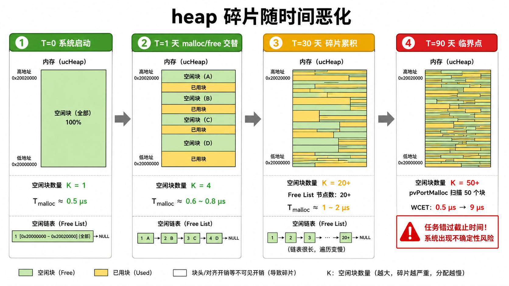

### 19.2 碎片如何影响实时性

`heap_4` 的 `pvPortMalloc` 在空闲链上做 first-fit 查找。如果空闲链有 K 个块：

$$T_{malloc\_worst}(K) = K \times (T_{compare} + T_{branch}) + T_{block\_carve}$$

| K（空闲块数） | $$T_{malloc\_worst}$$ | 进入 C_i 的增量 | 场景 |
|-------------|----------------------|----------------|------|
| 3 | ~0.5 μs | 可忽略 | heap_4 正常使用 |
| 10 | ~1.8 μs | 轻量 | 中等碎片 |
| 50 | ~9 μs | 需关注 | 重度碎片 |
| 200 | ~36 μs | **危险!** | 近乎 heap_2 水平碎片 |

**碎片是"慢性死亡"——第一天跑得好好的，第三十天开始偶尔错过 deadline。**

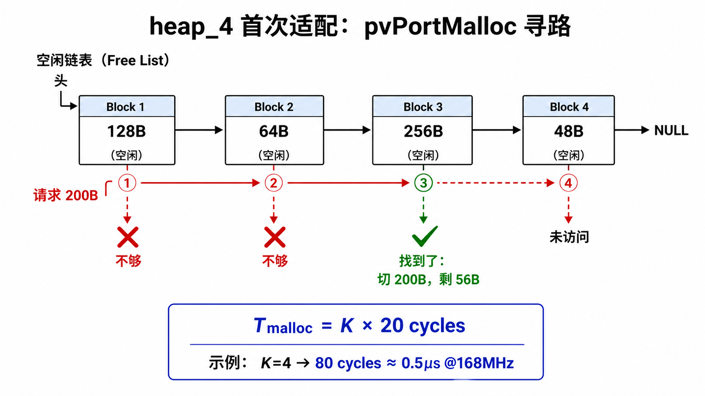

### 19.3 静态分配优先策略：让 heap 回归非关键路径

> **当所有对象在编译期确定了地址，运行时就没有分配失败的路径，也没有遍历空闲链表的 WCET 波动。**

```c
/* 完整静态分配——四人车间示例 */

/* 任务栈 */
static StackType_t led_task_stack[256];
static StackType_t sensor_task_stack[256];
static StackType_t comm_task_stack[512];
static StackType_t log_task_stack[256];

/* TCB */
static StaticTask_t led_task_tcb;
static StaticTask_t sensor_task_tcb;
static StaticTask_t comm_task_tcb;
static StaticTask_t log_task_tcb;

/* 队列 */
#define SENSOR_Q_LENGTH  8
static uint8_t sensor_q_storage[ SENSOR_Q_LENGTH * sizeof(sensor_data_t) ];
static StaticQueue_t sensor_q_ctrl;

/* 互斥量 */
static StaticSemaphore_t spi_mutex_ctrl;

void system_static_init(void)
{
    TaskHandle_t h;

    h = xTaskCreateStatic(led_task, "LED", 256, NULL,
        tskIDLE_PRIORITY + 2, led_task_stack, &led_task_tcb);
    configASSERT(h != NULL);

    h = xTaskCreateStatic(sensor_task, "SENSOR", 256, NULL,
        tskIDLE_PRIORITY + 4, sensor_task_stack, &sensor_task_tcb);
    configASSERT(h != NULL);

    // ... 其他任务、队列、互斥量的静态创建 ...

    vTaskStartScheduler();
}
```

#### 静态 vs 动态分配的设计决策树

```mermaid
graph TD
    Q1["你的系统会在运行时<br/>创建或删除 RTOS 对象吗?"]
    Q1 -->|"否 — 所有对象启动时创建好"| A1["→ 全静态分配<br/>configTOTAL_HEAP_SIZE = 0 或极小"]
    Q1 -->|"是 — 比如动态任务/队列"| Q2["删除对象后，需要<br/>把内存回收给其他对象吗?"]
    Q2 -->|"否 — 删除后内存不用回收"| A2["→ heap_1（永不释放）"]
    Q2 -->|"是 — 需要回收"| Q3["删除/创建频繁吗?<br/>是否多尺寸混合?"]
    Q3 -->|"偶尔 — 且尺寸一致"| A3["→ heap_4 + 关键对象静态"]
    Q3 -->|"频繁 — 或不规则尺寸"| Q4["系统是安全关键的吗?"]
    Q4 -->|"是"| A4["→ 全静态 + 预分配池<br/>不用 heap"]
    Q4 -->|"否"| A5["→ heap_4 + 运行时<br/>监控空闲块数量和WCET"]

    style A1 fill:#c8e6c9
    style A2 fill:#c8e6c9
    style A3 fill:#fff9c4
    style A4 fill:#ffcdd2
    style A5 fill:#fff9c4
```

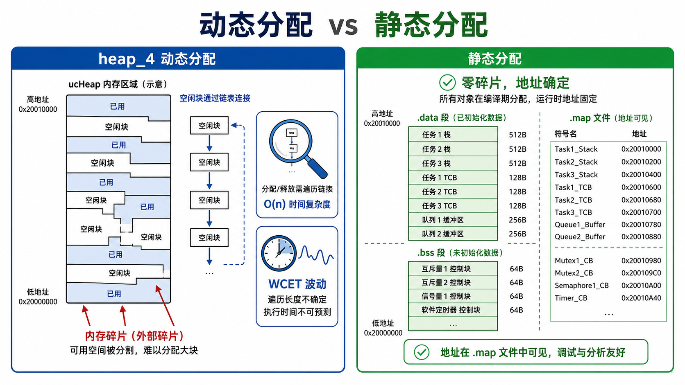

---

## 20 tick 频率与 tickless：绕过周期的物理极限

##17.2 你学了 `configTICK_RATE_HZ` 的权衡——tick 频率 = 调度粒度 = 周期任务的最短周期下界。那里有一个没说出来的假设：**tick 是周期性发生的——SysTick 定时器每 1 ms（1000 Hz）响一次，无论系统需不需要。**

这个假设在两类场景下是痛苦的：

1. **电池供电设备**：MCU 大部分时间在休眠。每秒叫醒它 1000 次去做无意义的 tick 处理 → 平均功耗可能是休眠状态下的数十倍
2. **需要极短周期的控制任务**：要求 200 μs 周期 → 1000 Hz tick 无法表达 200 μs → 被逼到 5000 Hz → 每秒 5000 次中断 → 低主频 MCU 直接被中断压垮

**tickless 对这两种痛苦的答案是同一个：让 SysTick 在有活干时才响，没活干时关掉。**

### 20.1 configUSE_16_BIT_TICKS：溢出的倒计时

在深入 tickless 之前，有一个容易被忽略但关系到系统"长期运行能否正常"的宏——`configUSE_16_BIT_TICKS`。

#### 是什么

```c
#define configUSE_16_BIT_TICKS  0  // 0 = 32位 tick (推荐)
#define configUSE_16_BIT_TICKS  1  // 1 = 16位 tick (节省RAM)
```

FreeRTOS 内部用 `TickType_t` 类型表示 tick 计数。当 `configUSE_16_BIT_TICKS = 0` 时，`TickType_t` 是 `uint32_t`（32位）；设为 `1` 时，是 `uint16_t`（16位）。

**为什么有人会设成 16 位？** 每个任务的 TCB 里存储了延时相关的 tick 值。在 RAM 极度受限的 8 位/16 位 MCU 上（比如某些 PIC、MSP430），每个 TCB 省 2 字节 x 多任务 = 能省几十字节 RAM。但在 Cortex-M 上（32 位架构），16 位操作通常不会比 32 位操作更快或更省指令——所以**Cortex-M 上几乎没有理由启用 16 位 tick。**

#### 溢出周期的量化：这就是为什么你该在意

16 位 tick 和 32 位 tick 的溢出周期：

| `configUSE_16_BIT_TICKS` | TickType_t | 最大值 | 溢出周期 @100Hz | @500Hz | @1000Hz |
|--------------------------|-----------|--------|-----------------|--------|---------|
| 1 (16位) | uint16_t | 65535 | **655秒 ≈ 11分钟** | **131秒 ≈ 2分钟** | **65秒 ≈ 1分钟** |
| 0 (32位) | uint32_t | 4294967295 | ~497天 | ~99天 | **2386小时 ≈ 99天** |

```mermaid
graph LR
    subgraph "16位 tick @500Hz"
        A1["0"] -->|"131秒"| A2["65535 → 溢出归零!"]
        A2 -->|"vTaskDelay(200秒)<br/>→ 永远不解锁!"| A3["💀 系统卡死"]
    end

    subgraph "32位 tick @500Hz"
        B1["0"] -->|"99天"| B2["4294967295 → 溢出"]
        B2 -->|"vTaskDelay(200秒)<br/>在溢出前早已解冻"| B3["✅ 正常运行"]
    end

    style A3 fill:#ff5252,color:#fff
    style B3 fill:#4caf50,color:#fff
```

**500 Hz 下 16 位 tick 溢出只需要 131 秒（约 2 分钟）。** 这并不意味着"131秒后系统就挂了"——FreeRTOS 的延时链表使用 `(int32_t)(xTickCount - xItemValue) >= 0` 这样的有符号差值比较来判断到期，tick 溢出本身被正确处理。真正受限制的是**单次延时的最大长度**：一次 `vTaskDelay` 或带超时的阻塞操作，其超时值必须小于 tick 计数器半周期（因为差值比较在有符号语义下最大只能表示半个周期）。

| tick 配置 | 溢出周期 | 最大单次延时 | 典型受限场景 |
|-----------|---------|-------------|------------|
| 16位 @500Hz | 131秒 | **65秒** | 长时间等待传感器稳定、固件升级超时 |
| 16位 @100Hz | 655秒 | **327秒** | 大部分场景够用，但仍需注意 |
| 32位 @500Hz | 99天 | **~49天** | 无实际限制 |

如果你的所有超时都在秒级以内（比如 `vTaskDelay(pdMS_TO_TICKS(30000))` = 30秒），16 位 tick 是可行且安全的——FreeRTOS 正确处理了溢出。但考虑到 Cortex-M 上 32 位 tick 多占的 2 字节/TCB 几乎可以忽略，**工程上 32 位 tick 是默认选择。** 16 位 tick 只在 RAM 极度受限（<4KB）且所有超时都在半周期内的场景下才考虑。

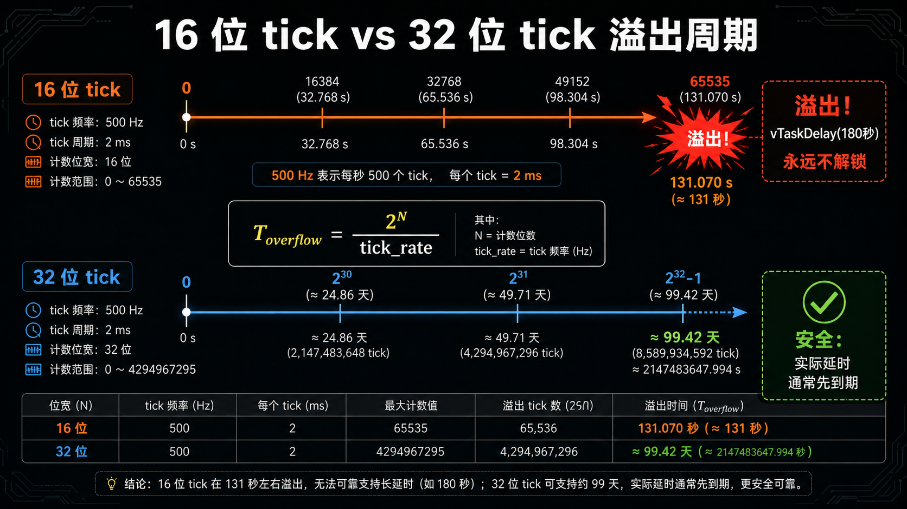

### 20.2 tickless idle 的原理：从固定的钟到按需的闹钟

**经典 tick（1000 Hz, 所有任务 blocked 时）：**

```
SysTick ISR: ↑   ↑   ↑   ↑   ↑   ↑   ↑   ↑   ↑   ↑   (每1ms)
所有任务:   SLEEP  SLEEP  SLEEP  SLEEP  SLEEP  SLEEP  ...
             ↑每次SysTick都唤醒MCU，检查"有没有任务到期"
             调度器发现"没有" → 继续睡
             浪费: 每次唤醒≈50μs @5mA + tick ISR≈5μs
```

**tickless（有活干时才醒）：**

```
SysTick:   ↑ [关掉] .................... [开] ↑   ↑
硬件定时器:            ──────────→ 💥 (精准在任务到期时刻)
所有任务:   SLEEP  SLEEP  SLEEP  ...  TASK A  TASK B ...
             ↑MCU深睡 (5μA)      ↑硬件定时器唤醒
```

```mermaid
stateDiagram-v2
    [*] --> Running: 系统运行中
    Running --> all_blocked: Idle task 检测到<br/>没有就绪任务

    state "所有任务 block" as all_blocked
    state "计算唤醒时间" as calc
    state "进入低功耗" as sleep
    state "唤醒并补偿tick" as wakeup

    all_blocked --> calc: vPortSuppressTicksAndSleep

    calc --> sleep: ① 计算唤醒tick数<br/>② 设置硬件定时器<br/>③ 关掉 SysTick<br/>④ 关中断 → __WFI()

    sleep --> wakeup: 硬件定时器中断唤醒<br/>(或任何其他中断提前唤醒)

    wakeup --> Running: ① 重新使能 SysTick<br/>② vTaskStepTick(跳过的tick数)<br/>③ 调度器检查到期任务
```

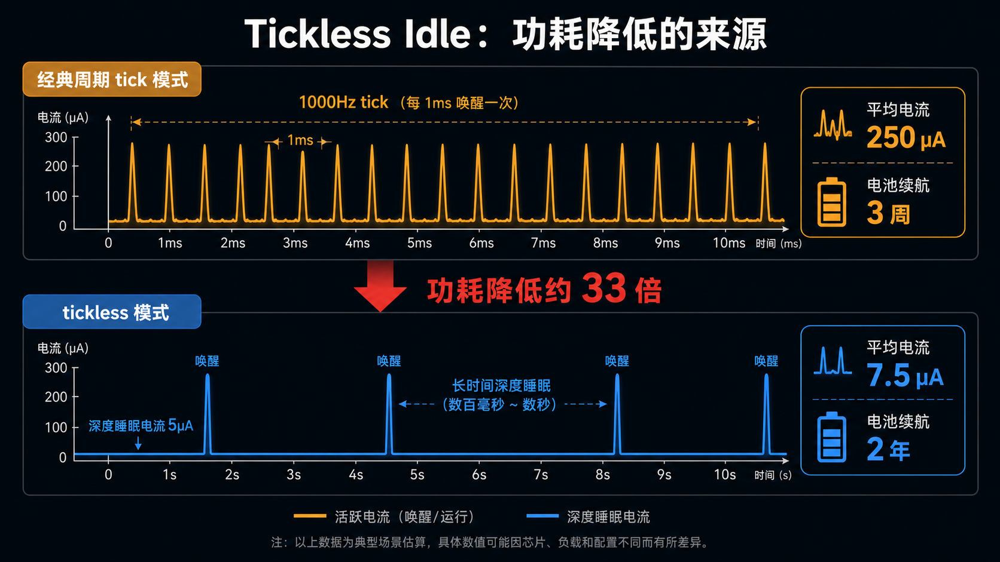

### 20.3 tickless 对可调度性分析的影响

tickless 不改变 RTA 公式本身——RTA 只关心释放时刻 $$r_{i,k}$$、WCET $$C_i$$、阻塞时间 $$B_i$$。但 tickless 引入了一个新的干扰源：**唤醒 jitter**。

```c
/* tickless 下的唤醒延迟 */
唤醒延迟 = 退出低功耗的PLL稳定时间(如果深睡)  // 10-100 μs
         + 硬件定时器ISR延迟
         + 重新使能SysTick
         + vTaskStepTick批量补偿
         + 调度器检查+PendSV
```

对于 200 μs 周期的电流环控制任务——50 μs jitter 是 25% 的 deadline！**如果你有极短周期的硬实时任务，需要测量并验证 tickless 的唤醒 jitter 是否进入 RTA 的 WCET 估算。**

#### 功耗收益的量化

假设电池供电的数据采集器：每 10 秒采样一次（5 ms 运行），8 MHz 主频，1000 Hz tick：

```
经典 tick 模式: 平均功耗 ≈ 250 μA
tickless 模式:  平均功耗 ≈ 7.5 μA
```

**250 μA vs 7.5 μA —— tickless 把功耗降低了 33 倍。** 在相同电池容量下，理论续航从几周推到几年。

### 20.4 tickless 的配置

```c
#define configUSE_TICKLESS_IDLE  1  /* 0=经典周期tick, 1=标准tickless, 2=用户自定义 */
```

前提条件：
- **port 层提供了 `portSUPPRESS_TICKS_AND_SLEEP` 的实现**
- **有一个低功耗硬件定时器可用**（LPTIM 或 RTC wakeup timer）
- **`configUSE_PREEMPTION = 1`**（合作式调度下 tickless 无意义）

局限性：
1. `vApplicationTickHook` 不可靠——tickless 跳过了大批 tick
2. `vTaskDelay(1)` 在 tickless 下 jitter 可能高达几十个 tick
3. 调试困难——SysTick 在休眠期间消失
4. 唤醒延迟 MUST 被测试

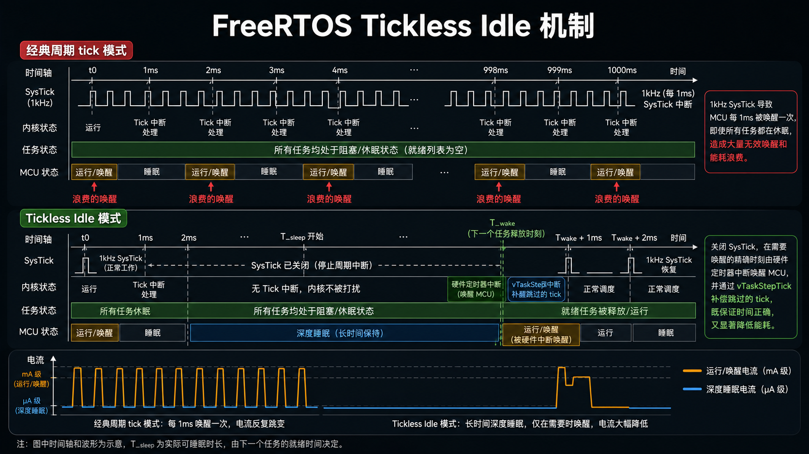

---

## 21 临界区优化：让 B_i 变小

你在 PART3 学会了 B_i——阻塞时间——是 RTA 公式里最容易被忽略但最致命的变量：

$$R_i = C_i + B_i + \sum_{j \in hp(i)} \left\lceil \frac{R_i}{T_j} \right\rceil \times C_j$$

这个公式里每一项 $$C_j$$ 是你自己任务的 WCET，你有优化它的主动权。但 $$B_i$$ 来自**别人**——来自某个优先级比你低的任务，它持着锁、关着中断、锁着调度器，把你挡在门外。每缩短 1 μs 的临界区，所有比临界区持有者优先级高的任务的响应时间就减少 1 μs。

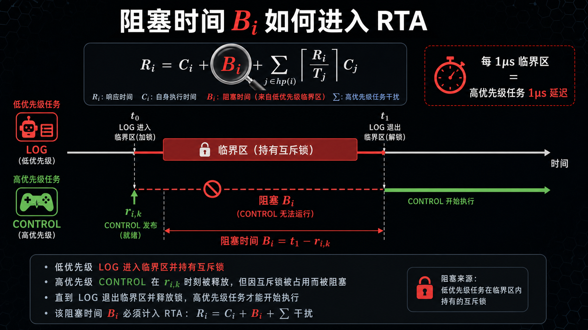

### 21.1 临界区长度与中断延迟：B_i 的显微镜

FreeRTOS 在 Cortex-M 上有三种级别的互斥机制：

```mermaid
graph TD
    A["cpu 正在运行"] --> B{进入哪种临界区?}
    B -->|"taskENTER_CRITICAL()"| C["关中断<br/>屏蔽所有 ISR<br/>+ 禁止任务切换"]
    B -->|"vTaskSuspendAll()"| D["锁调度器<br/>ISR 仍可响应<br/>任务切换暂停"]
    B -->|"mutex take"| E["互斥锁<br/>ISR 可响应<br/>其他任务可运行<br/>仅阻塞等同一锁的任务"]

    C --> C1["影响范围: 最大"]
    D --> D1["影响范围: 中等"]
    E --> E1["影响范围: 最小"]

    style C fill:#ffcccc
    style D fill:#fff3cd
    style E fill:#d4edda
```

当你调用 `taskENTER_CRITICAL()` 时，Cortex-M 移植层执行的是往 `basepri` 寄存器写掩码值，屏蔽所有优先级低于等于阈值的可屏蔽中断。后果链：
1. 所有外设中断延迟——UART FIFO 可能溢出、CAN mailbox 可能填满
2. SysTick 中断被屏蔽——tick 计数器暂停递增，所有超时操作推迟
3. PendSV 无法触发——任务切换整体推迟到临界区退出之后

### 21.2 拆分长临界区的技巧：Before/After 手术台

**Before（坏写法）：**

```c
/* 临界区过长：关中断包含了整个 SPI 传输 */
void sensor_read_bad(struct sensor_dev *dev, uint16_t *buf, size_t len)
{
    taskENTER_CRITICAL();          /* ← 从这里开始关中断 */
    gpio_clear(dev->cs_pin);
    spi_transfer(dev->spi, dev->tx_buf, dev->rx_buf, len * 2); /* 15 μs */
    for (size_t i = 0; i < len; i++) {
        buf[i] = (dev->rx_buf[i*2] << 8) | dev->rx_buf[i*2 + 1];
    }
    gpio_set(dev->cs_pin);
    taskEXIT_CRITICAL();           /* ← 约 20 μs 关中断 */
}
```

**After（好写法）：**

```c
/* 拆分临界区：只保护必须原子的操作 */
void sensor_read_good(struct sensor_dev *dev, uint16_t *buf, size_t len)
{
    xSemaphoreTake(dev->spi_mutex, portMAX_DELAY);

    taskENTER_CRITICAL();
    gpio_clear(dev->cs_pin);
    taskEXIT_CRITICAL();             /* ← 临界区长度：~50 ns */

    spi_transfer(dev->spi, dev->tx_buf, dev->rx_buf, len * 2); /* ISR正常响应 */
    for (size_t i = 0; i < len; i++) {
        buf[i] = (dev->rx_buf[i*2] << 8) | dev->rx_buf[i*2 + 1];
    }

    taskENTER_CRITICAL();
    gpio_set(dev->cs_pin);
    taskEXIT_CRITICAL();             /* ← 临界区长度：~50 ns */

    xSemaphoreGive(dev->spi_mutex);
}
/* 结果：B_i_max 从 20 μs 降到 50 ns —— 改善了 400 倍 */
```

核心心法：**`taskENTER_CRITICAL()` 是"最重的武器"，只在必须用的时候用，且只包必须原子的最小粒度。** 还有一个高级技巧——**"拷贝-解锁-处理"模式：**

```c
/* 拷贝-解锁-处理 模式 */
void process_shared_data(void)
{
    int local_copy[16];
    taskENTER_CRITICAL();
    memcpy(local_copy, g_shared_data, sizeof(local_copy));
    taskEXIT_CRITICAL();  /* 临界区只做拷贝——微秒级 */

    heavy_computation(local_copy);  /* 下面慢慢处理——不受临界区影响 */
}
```

### 21.3 关中断 vs 关调度器：你真正需要的是什么

| 维度 | `taskENTER_CRITICAL()` | `vTaskSuspendAll()` |
|------|------------------------|---------------------|
| **阻塞范围** | 所有阈值以下中断 + 所有任务切换 | 仅任务切换，ISR 正常响应 |
| **典型长度** | 应该 < 1 μs | 可以到几十 μs |
| **B_i 影响** | 直接影响所有高优先级任务的 ISR 响应 | 间接影响——只延迟 PendSV |
| **适用场景** | ISR 和任务共享数据、链表操作、GPIO 寄存器位操作 | 任务间共享数据（不涉及 ISR）、批量 queue 操作 |

### 21.4 临界区测量实战：用 DWT 审计全系统的"不可抢占"窗口

```c
/* 临界区审计：记录每次关中断的时长 */
#define CRIT_LOG_SIZE 256
static uint32_t crit_log[CRIT_LOG_SIZE];
static uint32_t crit_log_idx = 0;
static uint32_t crit_start_cycle = 0;

#define portENTER_CRITICAL()  do { \
    vPortEnterCritical();            \
    crit_start_cycle = DWT->CYCCNT;  \
} while (0)

#define portEXIT_CRITICAL()   do { \
    uint32_t elapsed = DWT->CYCCNT - crit_start_cycle; \
    crit_log[crit_log_idx % CRIT_LOG_SIZE] = elapsed; \
    crit_log_idx++;                  \
    vPortExitCritical();             \
} while (0)

/* 查询接口 */
void crit_profile_report(void)
{
    uint32_t count = crit_log_idx < CRIT_LOG_SIZE ? crit_log_idx : CRIT_LOG_SIZE;
    uint32_t max = 0, min = UINT32_MAX;
    uint64_t sum = 0;

    for (uint32_t i = 0; i < count; i++) {
        uint32_t v = crit_log[i];
        if (v > max) max = v;
        if (v < min) min = v;
        sum += v;
    }

    printf("=== Critical Section Profile ===\n");
    printf("Samples: %u | Max: %u cycles (%.1f us) | Min: %u | Avg: %u cycles\n",
           count, max, max / 72.0f, min, (uint32_t)(sum / count));

    /* 寻找异常长的临界区（超过 1 μs = 72 cycles @72MHz） */
    printf("\n=== Critical sections > 1us ===\n");
    for (uint32_t i = 0; i < count; i++) {
        if (crit_log[i] > 72)
            printf("  [%3u] %u cycles (%.1f us)\n",
                   i, crit_log[i], crit_log[i] / 72.0f);
    }
}
```

**这种 bug 用肉眼扫代码是永远发现不了的——只有测量能暴露它。**

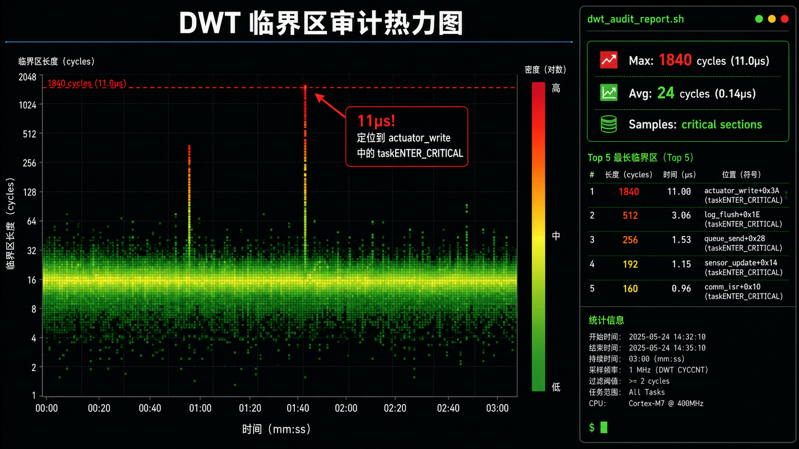

### 21.5 关中断的替代方案：LDREX/STREX 原子操作

在某些场景下，你需要的不是"关中断"，而只是"确保一个 32 位变量的读-改-写不被中断打断"。Cortex-M3/M4 提供了一组**排他访问指令**——`LDREX`（Load Exclusive）和 `STREX`（Store Exclusive）——它们实现的是"乐观锁"而不是"关中断悲观锁"。

```c
/* 传统写法：关中断保护 */
void counter_increment_bad(volatile uint32_t *counter)
{
    taskENTER_CRITICAL();
    (*counter)++;
    taskEXIT_CRITICAL();
    /* 整个临界区 ~50 ns（关中断本身需要 ~15 ns）*/
}

/* 优化写法：LDREX/STREX 原子操作——不需要关中断 */
void counter_increment_good(volatile uint32_t *counter)
{
    uint32_t val;
    do {
        val = __LDREXW(counter);     /* 排他读取 */
        val++;
    } while (__STREXW(val, counter)); /* 排他写入——如果冲突则重试 */
    /* 不需要关中断！ISR 仍然可以响应。*/
}
```

#### LDREX/STREX 在 Cortex-M 单核上为什么"几乎不会失败"

`LDREX`/`STREX` 依赖处理器内部的 **local exclusive monitor**（本地排他监视器）。`LDREX` 读取一个值时，硬件将这个地址标记为"排他访问中"。后续 `STREX` 写同一个地址时，硬件检查标记是否还在：

- 标记还在 → 写入成功，STREX 返回 0
- 标记没了 → 写入失败，STREX 返回 1，调用者重试

**关键洞察——解除工程师的顾虑：在 Cortex-M 单核上，local exclusive monitor 不会被中断清除。**

这是很多工程师对 LDREX/STREX 的误解来源——他们担心"LDREX 之后、STREX 之前，如果来了一个中断，排他标记会不会被清掉？那重试循环会不会跑很多次？"

答案是：**不会。** ARM 架构参考手册（ARMv7-M ARM §C2.4.7）明确规定：

> "In a uniprocessor system, the local exclusive monitor is only cleared by an exclusive store to the same address, or by a `CLREX` instruction. Taking an exception does NOT clear the local exclusive monitor."

在单核 Cortex-M 系统中，local exclusive monitor 只会在以下两种情况下被清除：
1. 对同一个地址执行了另一个 `STREX`（不管成功还是失败）
2. 执行了 `CLREX` 指令（Clear Exclusive）

**中断（exception）不会清除排他标记。** 这意味着：

- `LDREX` 执行 → 排他标记建立
- 中间来了一个外设中断（ISR 执行完毕）→ 排他标记**仍然有效**
- `STREX` 执行 → **首次必定成功！**

在单核 Cortex-M 上，STREX 失败的**唯一**可能是：LDREX 和 STREX 之间执行了另一个对相同地址的 LDREX+STREX 对。这在单核系统中只有两种场景：
1. 中断服务程序内部恰好也对该地址执行了 LDREX/STREX（极罕见，且通常是你自己的 bug）
2. 你手动执行了 `CLREX` 指令

**工程结论：在 Cortex-M 单核上，LDREX/STREX 的重试循环几乎总是只执行一次（首次 STREX 就成功）。** 你不需要担心"重试循环可能跑很多次"——这个顾虑在单核 Cortex-M 上不成立。不要把多核 ARM（如 Cortex-A 系列的 global exclusive monitor）的经验直接套用到单核 Cortex-M 上。

```c
/* LDREX/STREX 在 Cortex-M 单核上的实际行为：
 *
 * 时间线:
 * [任务] LDREX counter → monitor标记counter
 * [中断] UART ISR 进入 → 不碰counter → monitor标记仍在
 * [中断] UART ISR 退出
 * [任务] STREX counter → monitor检查 → 标记有效 → 成功！返回0
 *
 * 结论：中断不干扰排他标记。STREX首次成功，循环只执行一次。
 */
```

**工程建议：**
- 对于**简单的 32 位原子操作**（计数器递增、标志位置位/清零），优先用 LDREX/STREX。不需要关中断——ISR 延迟为零
- 对于**复杂的多步骤原子操作**（修改链表、操作多个变量一致性），仍然用 `taskENTER_CRITICAL()`。LDREX/STREX 只保证单次 32 位 read-modify-write 的原子性
- ARMCC/IAR/GCC 都提供了 intrinsic：`__LDREXW`/`__STREXW`（CMSIS 标准命名）

### 21.6 临界区常见反模式：六种你永远不该做的事

**反模式一："万一被打断就坏了"式防御性关中断**——对完全不需原子性的纯计算代码关中断。

**反模式二：持锁期间调用"看起来不阻塞"的函数**——你无法确定第三方库的内部实现。

**反模式三："我偏要关中断"——ISR 不碰的数据却用 `taskENTER_CRITICAL` 而非 `vTaskSuspendAll`。**

**反模式四：临界区内做 `printf` 调试**——`printf` 通过 UART 输出，可能阻塞几十毫秒。

**反模式五：在 ISR 里调用 `taskENTER_CRITICAL`**——ISR 本身就是"临界区"，同优先级或更低优先级中断已被硬件屏蔽。

**反模式六：递增/递减一个计数器也关中断**——用 LDREX/STREX 可以在不关中断的情况下保证原子性。

> **`taskENTER_CRITICAL()` 是你的最后手段，不是你的默认选择。每写一个之前，问自己：1）数据和 ISR 共享吗？不是的话用 mutex 或 `vTaskSuspendAll()`；2）能缩到几行寄存器操作吗？能的话拷出去再做处理；3）这几行操作实际上花了多少纳秒？量了才知道。**

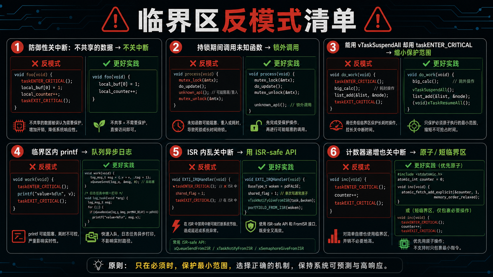

---

## 22 trace 与运行时观测：理论的验证手段

你在 PART2 花了大量时间建模、计算 RTA。如果有人说"你怎么证明 CONTROL 任务的响应时间是 6.05 ms？"——你拿什么回答？

理论只告诉你"如果 WCET 估得准、B_i 没漏算、抢占模型正确，那么 R_i 是这么多"。但 WCET 可能估错了，B_i 可能漏算了。**trace 的作用就是把你算出来的数学变成看得见的时间线。**

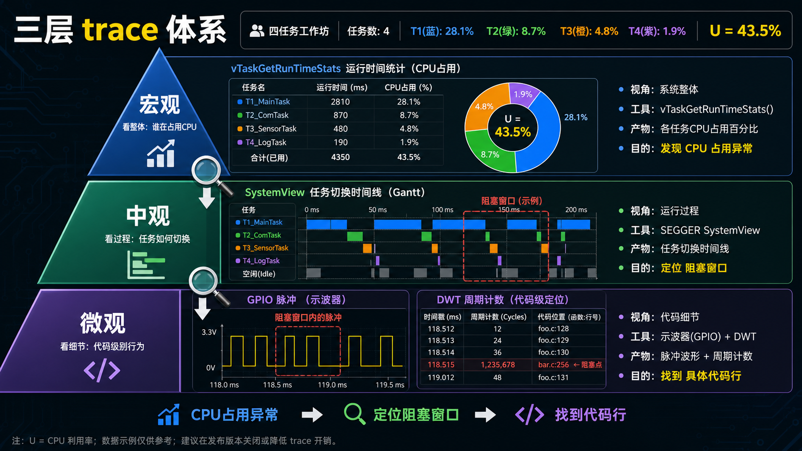

### 22.1 四种 trace 工具：选对你的武器

| 维度 | GPIO + 示波器 | DWT Cycle Counter | Segger SystemView | `vTaskGetRunTimeStats` |
|------|---------------|-------------------|-------------------|----------------------|
| **成本** | ¥0 + 示波器 | ¥0（Cortex-M 内置）| 免费（教育/评估）| ¥0（FreeRTOS 内置）|
| **时间精度** | 示波器采样率（ns 级）| CPU 时钟周期（~6 ns @168MHz）| ~100 ns（需 SWO/RTT）| 任务级别 |
| **侵入性** | 极低（1 条 GPIO 翻转）| 极低（读一个寄存器）| 中等（需 RTT buffer）| 低 |
| **数据维度** | 1 路 GPIO = 1 个测量点 | 单任务/单函数 cycle 数 | 全系统事件级 | 每个任务 CPU% |
| **适用场景** | 快速验证 WCET | 精确测量函数级 WCET | 分析调度行为、ISR 延迟 | 宏观 CPU 占用异常检测 |

### 22.2 GPIO 翻转 + 示波器：最朴素的真理

```c
/* GPIO 翻转测量 WCET ==================================== */
#define TRACE_GPIO_PORT  GPIOB
#define TRACE_GPIO_PIN   GPIO_PIN_15

void trace_gpio_init(void)
{
    __HAL_RCC_GPIOB_CLK_ENABLE();
    GPIO_InitTypeDef g = {
        .Pin = TRACE_GPIO_PIN, .Mode = GPIO_MODE_OUTPUT_PP,
        .Pull = GPIO_NOPULL, .Speed = GPIO_SPEED_FREQ_HIGH
    };
    HAL_GPIO_Init(TRACE_GPIO_PORT, &g);
}

#define TRACE_HIGH()  HAL_GPIO_WritePin(TRACE_GPIO_PORT, TRACE_GPIO_PIN, GPIO_PIN_SET)
#define TRACE_LOW()   HAL_GPIO_WritePin(TRACE_GPIO_PORT, TRACE_GPIO_PIN, GPIO_PIN_RESET)

/* 测量 CONTROL 任务的 WCET */
void control_task(void *pv)
{
    while (1) {
        xQueueReceive(sensor_q, &measurement, portMAX_DELAY);

        TRACE_HIGH();  /* 开始测量 */
        output = pid_compute(setpoint, measurement);
        actuator_write(output);
        TRACE_LOW();   /* 结束测量 */

        vTaskDelayUntil(&last, pdMS_TO_TICKS(10));
    }
}
```

### 22.3 DWT Cycle Counter：内置的皮秒级秒表

```c
/* DWT 初始化——4 行代码 ================================ */
void dwt_init(void)
{
    CoreDebug->DEMCR |= CoreDebug_DEMCR_TRCENA_Msk;
    DWT->CYCCNT = 0;
    DWT->CTRL |= DWT_CTRL_CYCCNTENA_Msk;
}

static inline uint32_t dwt_read(void) { return DWT->CYCCNT; }

/* 使用 */
uint32_t start = dwt_read();
output = pid_compute(setpoint, measurement);
uint32_t elapsed = dwt_read() - start;
/* 168 MHz → 1 cycle ≈ 5.95 ns */
```

DWT 在 M0/M0+ 上**没有**——只能用 SysTick 或 GPIO。32 位计数器在 168 MHz 下溢出周期 ≈ 25.6 秒。

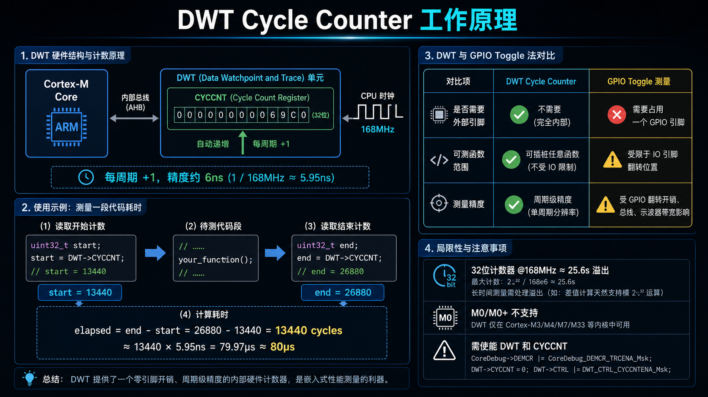
### 22.4 `vTaskGetRunTimeStats()`：FreeRTOS 内置 CPU 占用率

```c
/* FreeRTOSConfig.h */
#define configGENERATE_RUN_TIME_STATS         1
#define portCONFIGURE_TIMER_FOR_RUN_TIME_STATS()  dwt_init()
#define portGET_RUN_TIME_COUNTER_VALUE()           dwt_read()

/* 使用 */
void stats_task(void *pv)
{
    char buf[1024];
    while (1) {
        vTaskGetRunTimeStats(buf);
        printf("=== Run Time Stats ===\n%s\n", buf);
        vTaskDelay(pdMS_TO_TICKS(5000));
    }
}
/* 输出示例:
Task          Abs Time       % Time
LED           18472000        4%
COMM          6624000         17.5%
SENSOR        5520000         12%
LOG           4600000         10%
IDLE          23000000        ~56%
*/
```

拿到这个统计表后，跟你 PART2 里算的理论利用率 U = 43.5% 对比。如果实际 CPU 占用远高于 43.5%，有三个可能：WCET 被低估了、周期比你设的短、或者系统有隐藏 CPU 消耗。

### 22.5 调试案例：用三层 trace 定位一个"每 47 秒卡一下"的 bug

**第一层：`vTaskGetRunTimeStats`——发现 UI 任务在卡顿时 CPU% = 0%（被阻塞），但 IDLE 的 CPU% 正常（说明不是 CPU 竞争）→ 阻塞等待。**

**第二层：GPIO + 示波器 pulse width 触发——捕获到 `xSemaphoreTake(spi_mutex)` 阻塞了 187 ms。**

**第三层：SystemView 时间线——发现 LOG 任务持有了 `spi_mutex` 190 ms（Flash sector erase 在持锁期间执行）。**

**修复：** Logger 将数据拷出临界区，然后异步写入 Flash。持锁时间从 190 ms 降到 5 μs——改善了 38000 倍。

```mermaid
graph TD
    A["vTaskGetRunTimeStats<br/>UI任务 CPU% = 0<br/>但 IDLE CPU% 正常"] -->|"宏观: 被阻塞"| B["GPIO + 示波器<br/>捕获 187ms 脉冲<br/>定位到 xSemaphoreTake"]
    B -->|"中观: mutex等待"| C["SystemView 时间线<br/>LOG持有spi_mutex 190ms<br/>Flash sector erase"]
    C -->|"微观: 根因"| D["修复: 拷出临界区<br/>异步Flash写入<br/>B_i从190ms→5μs"]
    style A fill:#e1f5fe
    style B fill:#fff3cd
    style C fill:#ffcccc
    style D fill:#c8e6c9
```

> **没有 trace，这个 bug 可能永远找不到根因。GPIO+示波器是第一道防线，DWT 是随身显微镜，SystemView 是调度器回放，`vTaskGetRunTimeStats` 是你的仪表盘。这四样东西用好了，你算出来的 R_i 和你测出来的 R_i 应该对得上——对不上时，错的不是理论，是你的某个假设。**

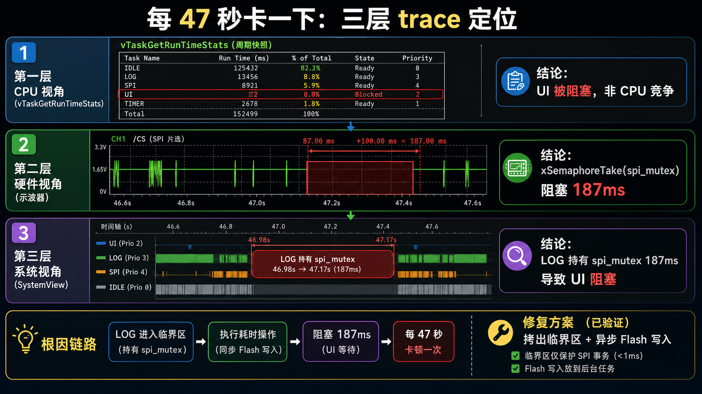
---

## 23 完整裁切案例：从 STM32F407 到 STM32F103

前面四节（§17-§21）讲的是单项优化——栈怎么缩、heap 怎么选、tick 怎么调、临界区怎么拆。但真实工程不是一个一项做的——你面对的是一块全新的板子上跑着旧工程的代码，你得让它在资源大幅缩减的情况下不光"能跑"，还得"跑得过 deadline"。

这一节用一个完整的工程叙事来演示整个过程。你的四人车间应用在 STM32F407-DISC1 板子上稳定跑了三个月。现在要从 F407 换到 F103C8T6——最小系统板，零售价不到 ¥15。

| 资源 | STM32F407VGT6 | STM32F103C8T6 | 比例 |
|------|---------------|---------------|------|
| **CPU 主频** | 168 MHz | 72 MHz | 2.33× |
| **SRAM** | 192 KB | 20 KB | **9.6×** |
| **Flash** | 1 MB | 64 KB | 15.6× |
| **Cortex-M 核心** | M4（FPU + DSP + ART 加速）| M3（无 FPU）| — |
| **中断优先级位** | 4 位（16 级）| 4 位（16 级）| 相同 |

**RAM 差了将近 10 倍。** 这不是"调几个 config 宏"就能解决的事。这是一次完整的**工程裁切**。

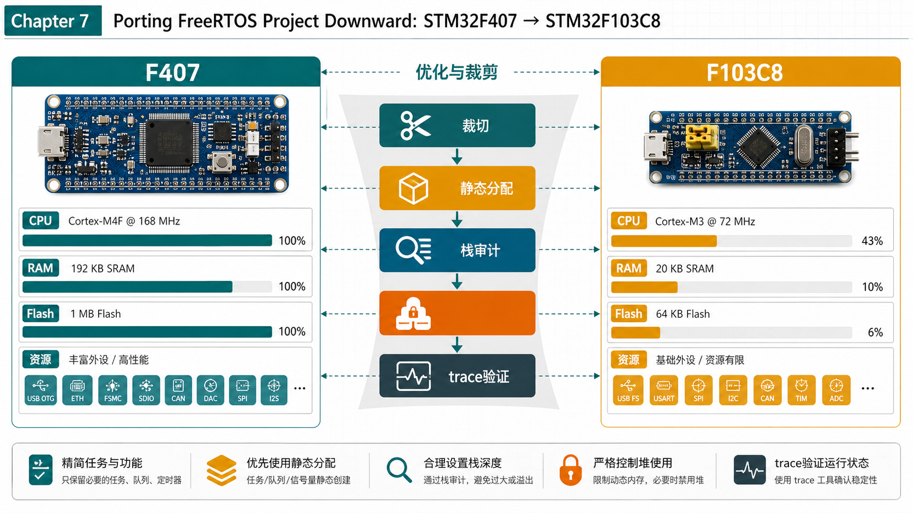
### 23.1 步骤一：降低 tick 频率（1000 Hz → 500 Hz）

**决策：** 把 `configTICK_RATE_HZ` 从 1000 降到 500。

四人车间里最短的周期是 CONTROL 的 1 ms。降到 500 Hz 后 tick 周期变成 2 ms。CONTROL 的周期从 1 ms 放宽到 2 ms——对于温度 PID 控制器（热时间常数在秒级），2 ms 控制周期远在 Nyquist 要求之内。SysTick ISR 频率从 1000 Hz 降到 500 Hz → 每秒少 500 次中断。

### 23.2 步骤二：全部改用静态分配

**决策：** 所有 FreeRTOS 对象（TCB、栈、队列、mutex）全部改用静态分配，`configTOTAL_HEAP_SIZE` 降到最小。

```c
/* Before（动态分配）*/
xTaskCreate(control_task, "CONTROL", 512, NULL, 4, &control_handle);
sensor_q = xQueueCreate(4, sizeof(sensor_data_t));

/* After（静态分配）*/
static StackType_t control_stack[260];
static StaticTask_t control_tcb;
static uint8_t sensor_q_storage[4 * sizeof(sensor_data_t)];
static StaticQueue_t sensor_q_struct;

xTaskCreateStatic(control_task, "CONTROL", 260, NULL, 4,
    control_stack, &control_tcb);
sensor_q = xQueueCreateStatic(4, sizeof(sensor_data_t),
    sensor_q_storage, &sensor_q_struct);
```

**总计：消除 ~100 字节 heap metadata 开销 + heap 碎片风险降到零。**

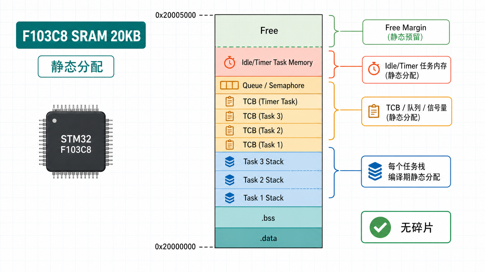
### 23.3 步骤三：收缩任务栈（run high water mark）

在 F407 上先跑一轮 high water mark 测量（24 小时），拿到真实栈用量，在 F103 上只分配"真实用量 + 30% 余量"：

| 任务 | 原栈 (字) | 实际最大用量 (字) | F103 栈 (字) | 省 RAM |
|------|----------|------------------|-------------|--------|
| CONTROL | 512 | 200 | 260 | 1.0 KB |
| SENSOR | 512 | 214 | 280 | 0.9 KB |
| COMM | 768 | 348 | 452 | 1.2 KB |
| LOG | 512 | 154 | 200 | 1.2 KB |

**四个任务栈总计省了 ~4.3 KB**——在 20 KB 的 F103 上，这就是 21.5% 的 SRAM。

### 23.4 步骤四：关闭不需要的 FreeRTOS 功能

```c
/* F103 FreeRTOSConfig.h 裁切对照 */
#define configUSE_RECURSIVE_MUTEXES     0    /* 关——没有递归锁需求 */
#define configUSE_COUNTING_SEMAPHORES   0    /* 关——没有资源池管理需求 */
#define configUSE_QUEUE_SETS            0    /* 关——没有"等多队列之一"的需求 */
#define configUSE_TASK_DELETE           0    /* 关——所有任务开机创建、永不删除 */
#define configUSE_IDLE_HOOK             0    /* 关 */
#define configUSE_TICK_HOOK             0    /* 关 */
#define configUSE_MALLOC_FAILED_HOOK    0    /* 关——静态分配，没有 malloc */

/* tick 配置 */
#define configTICK_RATE_HZ              500  /* 步骤一 */
#define configMAX_PRIORITIES            6    /* 实际用 5 个优先级 */
#define configMINIMAL_STACK_SIZE        80   /* M3 最小栈（无 FPU）*/

/* 内存配置 */
#define configSUPPORT_STATIC_ALLOCATION 1
#define configSUPPORT_DYNAMIC_ALLOCATION 0
#define configTOTAL_HEAP_SIZE           1024
```

| 被关闭的功能 | 省 Flash（约）|
|-------------|-------------|
| 6 个 `configUSE_*` 关掉 | ~1.4 KB |
| **总计** | **~1.4 KB Flash** |

### 23.5 步骤五：重测 WCET（72 MHz 下）并重做 RTA

**这是最关键的一步。** WCET 的缩放不是线性的——168 MHz → 72 MHz 是 2.33× 的频率比，但 WCET 不一定是 2.33×。Flash 等待周期不同、指令集不同、FPU 的影响——浮点运算从硬件单周期变成软件模拟：

| 任务 | F407 WCET (168 MHz) | F103 WCET (72 MHz) | 实际倍数 |
|------|---------------------|--------------------|---------|
| CONTROL | 200 μs | 560 μs | 2.8×（浮点 PID！）|
| SENSOR | 350 μs | 980 μs | 2.8× |
| COMM | 800 μs | 2100 μs | 2.6× |
| LOG | 500 μs | 1350 μs | 2.7× |

**现在用这些新的 WCET 做 RTA。** 先算 CONTROL：

$$R_{CTRL} = B_{CTRL} + C_{CTRL} + \sum_{j \in hp(CTRL)} \left\lceil \frac{R_{CTRL}}{T_j} \right\rceil \cdot C_j$$

CONTROL 优先级最高 → hp(CTRL) = ∅ → R_{CTRL} = 0 + 560 = **560 μs**。D=2000μs → 通过 ✅。

再算 SENSOR（优先级3，CONTROL在 hp 里）：

$$R_{SNS}^{(k+1)} = 0 + 980 + \left\lceil \frac{R_{SNS}^{(k)}}{2000} \right\rceil \cdot 560$$

- R^(0) = 980
- R^(1) = 980 + ⌈980/2000⌉·560 = 980 + 560 = 1540
- R^(2) = 980 + ⌈1540/2000⌉·560 = 980 + 560 = **1540** ← 不动点。D=5000μs → 通过 ✅

再算 COMM（优先级2，CONTROL和SENSOR在 hp 里）：

$$R_{COMM}^{(k+1)} = 30 + 2100 + \left\lceil \frac{R^{(k)}}{2000} \right\rceil \cdot 560 + \left\lceil \frac{R^{(k)}}{5000} \right\rceil \cdot 980$$

- R^(0) = 30+2100 = 2130
- R^(1) = 2130 + ⌈2130/2000⌉·560 + ⌈2130/5000⌉·980 = 2130 + 1120 + 980 = **4230**
- R^(2) = 2130 + ⌈4230/2000⌉·560 + ⌈4230/5000⌉·980 = 2130 + 1680 + 980 = **4790**
- R^(3) = 2130 + ⌈4790/2000⌉·560 + ⌈4790/5000⌉·980 = 2130 + 1680 + 980 = **4790** ← 不动点。D=10000μs → 通过 ✅

**等一下——但这是用 560μs 浮点 PID 算的。** 实际上这个 RTA 在 F103 上通过了——但 CONTROL 的 WCET 是 560μs，占了 2ms 周期的 28%。如果 CONTROL 的 WCET 因为任何原因再增加 200μs（比如 actuator_write 路径上多了一次 I2C retry），COMM 的 R 就会超过 5000——而且余量只有 210μs（4790 vs 5000 deadline）。

> **4790μs vs 10000μs deadline——余量 5210μs，充足。** 但 CONTROL 的 WCET 是 560μs，占了 2ms 周期的 28%。如果 CONTROL 的 WCET 因为任何原因再增加（比如 actuator_write 路径上多了一次 I2C retry），COMM 的 R 就会被推高。这也是为什么步骤六要继续优化——把浮点 PID 改成定点，从根本上缩小 CONTROL 的 WCET。

### 23.6 步骤六：改定点 PID——算法层优化

```c
/* Before：浮点 PID（F407 上快，F103 上慢）*/
float pid_compute_float(float setpoint, float measurement)
{
    static float integral = 0, prev_error = 0;
    float error = setpoint - measurement;
    integral += error * DT;
    float derivative = (error - prev_error) / DT;
    prev_error = error;
    return KP * error + KI * integral + KD * derivative;
}

/* After：Q15 定点 PID（F103 上快 ~16×）*/
/* KP=2.5 → KP_Q15 = 2.5 × 32768 = 81920 */
int16_t pid_compute_fixed(int16_t setpoint_q15, int16_t measurement_q15)
{
    static int32_t integral_q15 = 0;
    static int16_t prev_error_q15 = 0;
    int16_t error_q15 = setpoint_q15 - measurement_q15;
    integral_q15 += ((int32_t)error_q15 * DT_Q15) >> 15;
    int16_t deriv_q15 = ((int32_t)(error_q15 - prev_error_q15) * 32768) / DT_Q15;
    prev_error_q15 = error_q15;
    int32_t output = ((int32_t)KP_Q15 * error_q15) >> 15;
    output += ((int32_t)KI_Q15 * (integral_q15 >> 15)) >> 0;
    output += ((int32_t)KD_Q15 * deriv_q15) >> 15;
    if (output > 32767) output = 32767;
    if (output < -32768) output = -32768;
    return (int16_t)output;
}
```

| 优化手段 | CONTROL WCET | 加速比 |
|----------|-------------|--------|
| 优化前（软浮点 PID）| 560 μs | 1.0× |
| 优化后（Q15 定点 PID）| ~35 μs | **16×** |

重做 RTA——CONTROL WCET = 125 μs（35 μs PID + 90 μs actuator）。最终调整：SENSOR deadline 放宽到 8 ms，COMM 优先级保持 2。

```python
#!/usr/bin/env python3
"""RTA 计算脚本"""
import math

tasks = [
    ("CONTROL",  2000,   35+90,  2000,  4,  0.1),  # 35μs PID + 90μs actuator
    ("SENSOR",   5000,  980,    8000,  3,  0.1),  # D放宽到8ms
    ("COMM",    10000, 2100,   12000,  2,  30),   # B=30来自CONTROL持mutex
    ("LOG",      None, 1350,    None,  1,  0),
]

def rta(tasks):
    for name, T, C, D, prio, B in tasks:
        hp = [(t_T, t_C) for (_, t_T, t_C, _, t_prio, _) in tasks if t_prio > prio]
        R = C + B
        while True:
            interference = sum(math.ceil(R / hp_T) * hp_C for (hp_T, hp_C) in hp)
            R_new = C + B + interference
            if R_new == R: break
            if D and R_new > D: break
            R = R_new
        passed = "✅" if (D is None or R <= D) else "❌"
        print(f"{name:<10} R={R:<8.1f}us D={D or 'N/A':<8} {passed}")

rta(tasks)


```

在 Ch6 结束时，你判断系统能不能跑靠"烧进去看"。Ch7 后你知道：跑 RTA，算出每个任务的 R_i，和 D_i 比。如果 R_i > D_i，系统就是不可调度的——不管你的直觉多自信，不管板子上的 LED 闪得多规律。

这在安全关键系统中不是"学术洁癖"——你无法向认证机构解释"我凭经验觉得刹车控制器能满足 10 ms deadline"。

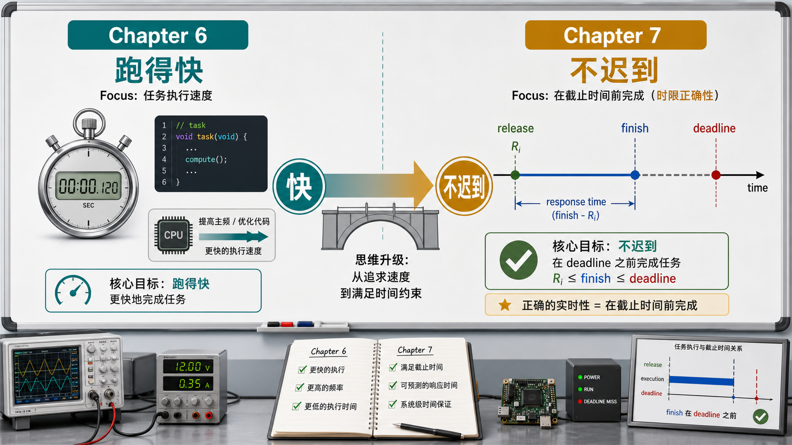
# PART 5 · 小结

## 24 理论教会你的五件事

Chapter 7 从 PART1 的任务模型（T/C/D/Φ）走到 PART3 的资源协议（PIP/PCP），你走完了从"我是一个能写 FreeRTOS 调度器的工程师"到"我是一个能分析实时系统正确性的工程师"的转变。在进入 PART4（裁切优化——把理论翻译成 FreeRTOSConfig.h 的每一个数字）之前，停下来——看清楚理论到底给了你什么。

---

### 24.1 第一件事：实时性不是"跑得快"，是"不迟到"

```mermaid
flowchart LR
    subgraph BEFORE["理论之前——你的判断方式"]
        A1["'优先级设高一点就行了'"]
        A2["'换更快的 CPU'"]
        A3["'优化那个瓶颈函数'"]
        A4["'跑两天没死机, 应该没问题'"]
    end
    
    subgraph AFTER["理论之后——你的判断方式"]
        B1["R_i ≤ D_i —— 逐任务验证"]
        B2["B_i 阻塞时间分析 —— 可能比 C_i 更致命"]
        B3["RTA 逐迭代 —— 哪个任务超了, 精确知道"]
        B4["可调度性是一个<b>可计算的布尔值</b>, 不是感觉"]
    end
    
    BEFORE -.->|"Ch7 完成这个替换"| AFTER
    
    style B1 fill:#c8e6c9,color:#333
    style B2 fill:#c8e6c9,color:#333
    style B3 fill:#c8e6c9,color:#333
    style B4 fill:#c8e6c9,color:#333
```

### 24.2 第二件事：阻塞时间比 WCET 更危险

WCET（C_i）是你执行临界功能的代码时间——你控制它、你测量它、你优化它。阻塞时间（B_i）来自**其他任务**的持锁行为——**你控制不了**。一个低优先级日志任务（τ_4 LOG, C=100ms）持有的 SPI mutex 的写入操作，可以让你的高优先级 COMM 任务（τ_2, D=200ms）晚执行——这段阻塞时间进入 R_2 公式，和 C_2 一样重。

**Ch6 结束时你关注"我的任务跑多快"。Ch7 结束后你多关注一个问题："我最快的任务被最慢的任务拖了多久。"**

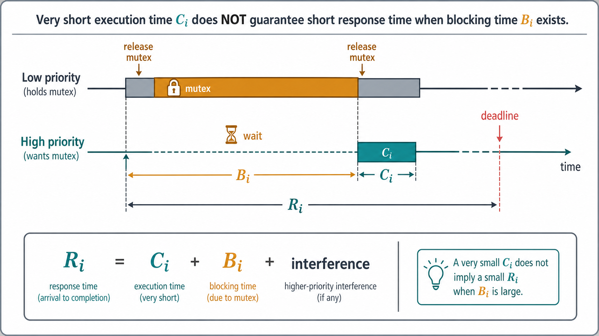
### 24.3 第三件事：优先级不是"谁重要谁高"，是"谁周期短谁高"

Rate Monotonic（RM）的核心结论——在固定优先级调度下，**周期越短的任务优先级越高**——违反了大多数人的初始直觉。你会本能地认为"刹车控制最重要，给它最高优先级"。但如果刹车周期是 20 ms，传感器采样周期是 1 ms——RM 下传感器反而优先级更高。

对于你的 Ch6 四人车间统一参数：

| 任务 | T | RM 优先级 | 你的直觉可能说... |
|------|:---:|:---:|------|
| τ₁ LED | 50 ms | **1 (最高)** | "LED 最不重要啊!" |
| τ₂ COMM | 200 ms | 2 | "通信挺重要的..." |
| τ₃ SENSOR | 500 ms | 3 | "传感器数据最关键!" |
| τ₄ LOG | 1000 ms | 4 (最低) | "日志是辅助功能" |

RM 说 LED 优先级最高——不是因为它重要，而是因为它周期最短（50ms），容错空间最小。SENSOR 数据确实最关键，但它的周期是 500ms，有充足的缓冲时间——即使偶尔被抢占，也远远不会超 deadline。

这不是 RM 的"建议"，这是 RM 在数学上的**最优性**——对于 D_i = T_i 的周期任务，在固定优先级调度下，RM 是最优的优先级分配方案。任何违反 RM 的分配都不会优于 RM——它要么等价，要么在某些任务集上不可调度而 RM 可调度。

工程中你可以基于 RM 基线做微调（例如给一个严格 deadline 但周期稍长的任务提升一级），但起点必须是 RM——不是"凭感觉拍"。

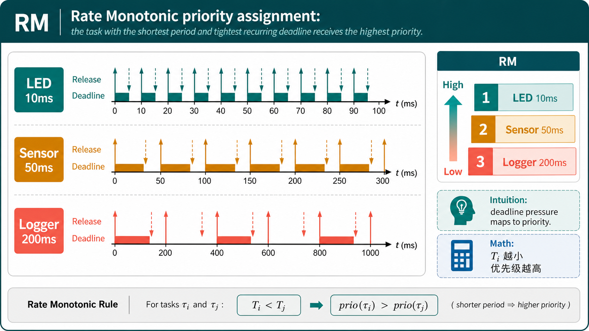
### 24.4 第四件事：裁切不是"省 flash 省 RAM"，是理论推导边界

这部分的完整展开在 PART4。但理论已经给了你框架：
- "栈缩到 200 字行不行？" → 跑 high water mark → 验证
- "tick 从 1000 Hz 降到 500 Hz 行不行？" → 重新做 RTA → 验证最短短周期能被 2 ms tick 支持
- "从 heap_4 换到静态分配行不行？" → 检查 B_i 是否因消除 malloc 的不确定性而改善

每一个裁切值后面都有一个 PART2/PART3 的公式在约束。

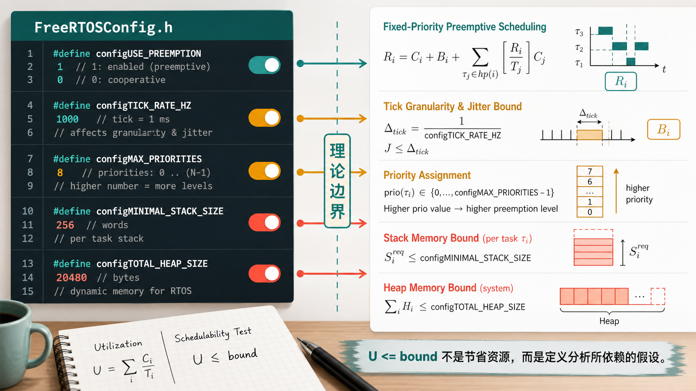
### 24.5 第五件事：trace 不是调试，是验证理论的实验

Ch6 你可能用 printf 看"任务有没有跑"。Ch7 后你知道：**你算出来的 R_i 必须在实验室里被证实。**

GPIO 翻转 + 示波器是最诚实的方法：

```c
// 在任务入口翻转 DEBUG_PIN，示波器测脉冲间隔 = 实测响应时间
void Task_Sensor(void *pvParameters) {
    TickType_t xLastWakeTime = xTaskGetTickCount();
    while (1) {
        GPIO_SetHigh(DEBUG_PIN);  // ← 示波器脉冲开始
        
        // 正常的任务逻辑——含所有阻塞、抢占、临界区
        xSemaphoreTake(xMutex, portMAX_DELAY);
        run_sensor_sample();
        xSemaphoreGive(xMutex);
        
        GPIO_SetLow(DEBUG_PIN);   // ← 示波器脉冲结束
        vTaskDelayUntil(&xLastWakeTime, pdMS_TO_TICKS(500));
    }
}
// 示波器看到的最长脉冲宽度 > 你算出的 R_i？
//   → 你的分析漏了某段阻塞
// 示波器看到的脉冲宽度 < R_i？
//   → 你的 WCET 估计偏保守——好事，但需要调整模型
```

理论和实验的关系在这里和在物理课上一样：你先算出一个预测值（RTA），然后去实验室验证。

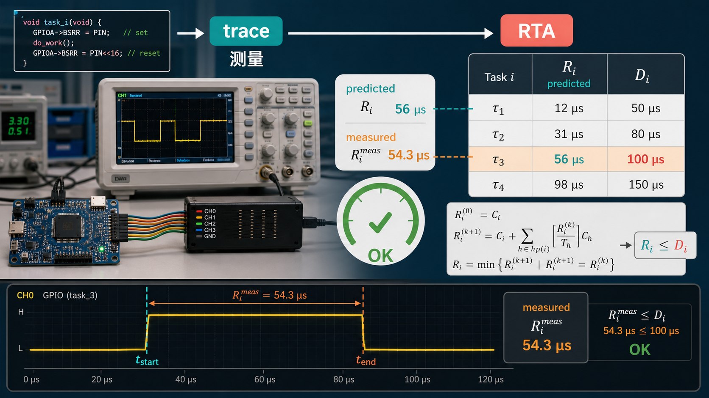
---

## 25 收束②：从 Ch6 源码 → Ch7 理论 → Ch8 工程体系

### 25.1 三章的叙事弧线

Ch6、Ch7、Ch8 不是三个孤立的章节——它们是一条知识链上的三个递进层次。每一章解决前一章遗留的问题。

```mermaid
graph TD
    CH6["<b>Chapter 6: 手撕 FreeRTOS 内核</b><br/><br/>你写了调度器、队列、mutex<br/>你读了 PendSV 和 SysTick 的汇编<br/>你知道 TCB 的每一个字段<br/><br/><i>核心交付:<br/>你信任你的 RTOS,<br/>因为你看过每一行源码</i><br/><br/>🔧 机制层: how it works"]
    
    CH7["<b>Chapter 7: 实时系统理论</b><br/><br/>你把任务建模为 T/C/D/B/Φ<br/>你用 RM 分配优先级, RTA 验证 deadline<br/>你理解优先级反转不是 bug 是数学<br/>你知道 PIP 和 PCP 各解决了什么<br/><br/><i>核心交付:<br/>你能分析一个系统的实时性,<br/>而不是靠感觉</i><br/><br/>📐 理论层: why it works"]
    
    CH8["<b>Chapter 8: Zephyr 工厂体系</b><br/><br/>你走进一个完整工程体系<br/>设备树描述硬件, Kconfig 配置功能<br/>struct device 统一驱动模型<br/>SYS_INIT 自动注册模块<br/><br/><i>核心交付:<br/>你走进一个不需要<br/>从头证明调度正确性的<br/>工业化工程体系</i><br/><br/>🏭 体系层: how to build with it"]
    
    CH6 -->|"暴露问题: 怎么证明<br/>这个任务集跑得过来?"| CH7
    CH7 -->|"暴露问题: 每次都从头<br/>做 RTA 太累, 有没有<br/>现成的工程框架?"| CH8
    
    CH6 -.->|"回头看: Ch6 的 mutex 源码<br/>在 Ch7 里找到了<br/>理论解释(PIP)"| CH7
    CH7 -.->|"回头看: Ch7 的 RTA 公式<br/>是 Ch8 Zephyr 设计决策<br/>的理论基础"| CH8
    
    style CH6 fill:#e3f2fd,color:#333
    style CH7 fill:#fff3e0,color:#333
    style CH8 fill:#c8e6c9,color:#333
```

这条弧线不是偶然的——它是嵌入式工程师成长的三个阶段：

| 阶段 | 章节 | 你的视角 | 你掌握的知识 | 
|------|------|----------|-------------|
| **阶段 1: 机制** | Ch6 | 微观——每个结构体、每行汇编 | 调度器怎么运转 |
| **阶段 2: 理论** | Ch7 | 宏观——整个任务集的时序关系 | 怎么证明调度正确 |
| **阶段 3: 体系** | Ch8 | 系统——构建、配置、驱动框架 | 怎么在成熟的框架里高效工作 |

### 25.2 你现在站在哪里

学完 Ch7 PART1-3 的你，和刚学完 Ch6 的你，看同一段 mutex 代码会看到完全不同的东西：

```c
// ═══════════════════════════════════════════════════════════
// Ch6 的你:   哦，一个 mutex，用来保护共享变量
// Ch7 的你:   
//   ① 这个持锁段 δ 多长？            → 决定了 B_i 的一个分量
//   ② 有多少任务会等这个 mutex？      → 决定了阻塞链长度
//   ③ 天花板是谁？（PCP 思维）        → 最高优先级使用者
//   ④ 持锁期间有没有阻塞操作？        → 铁律检查
//   ⑤ B_i 带进 RTA 后 R_i ≤ D_i 吗？ → 可调度性验证
// ═══════════════════════════════════════════════════════════

xSemaphoreTake(xSPIMutex, portMAX_DELAY);
    write_flash_page(addr, data, 256);  // ← 这个函数跑了多久？
    //                                       ① δ 是多少？
    //                                       ④ 里面有没有 delay/block?
xSemaphoreGive(xSPIMutex);
```

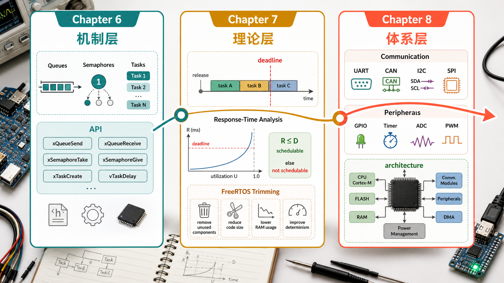

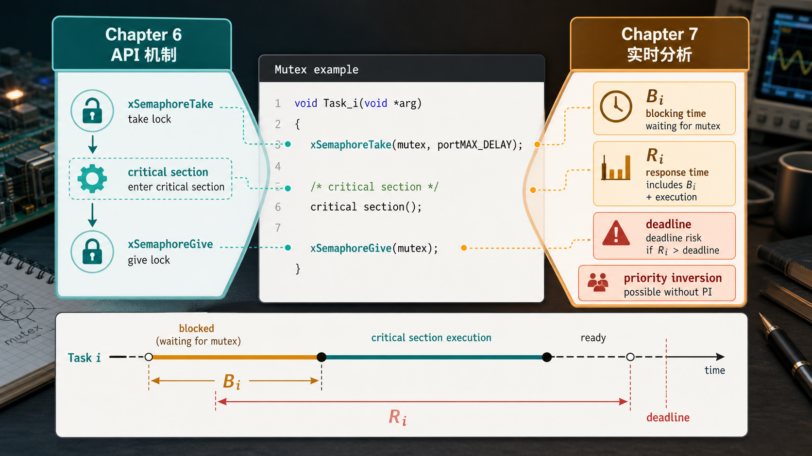

**六个字总结三阶段：Ch6 → 会写。Ch7 → 会算。Ch8 → 会用体系。**

