# Chapter 8 读懂 Zephyr：FreeRTOS 以上，Linux 未满

你刚学完 Ch6——你手撕了 FreeRTOS 内核，从任务调度到 PendSV 汇编，从队列到 heap_4。你有了一个能跑、能扩展的 FreeRTOS 工程。

现在你要做一件大胆的事：**用 Ch5 的面向对象思维，改造 Ch6 的 FreeRTOS 世界观。**

FreeRTOS 教会了你调度。但它没教你设备模型、驱动框架、构建体系、配置系统——那些"工厂的事"。Linux 有这一切，但 Linux 也有虚拟内存、进程隔离、文件系统、动态加载——那些 MCU 扛不动的东西。

Zephyr 正好卡在中间。它是一个 **RTOS**——和 FreeRTOS 一样跑在 Cortex-M 上，PendSV 切任务，信号量同步。它也是一个**轻量版的 Linux**——设备树描述硬件、Kconfig 裁剪功能、CMake 管理构建、`struct device` 统一驱动模型——这些骨架全部来自 Linux 内核的设计思想。但 Zephyr 把 Linux 里 MCU 不需要的部分——MMU 虚拟内存、VFS 文件系统、用户态/内核态隔离、运行时模块加载——全部砍掉了。

砍掉之后还不够。Zephyr 做了一件 FreeRTOS 和 Linux 都没做的事：**把决策从运行时搬到编译期。** Python 脚本在编译时解析设备树、生成宏、填结构体；Kconfig 在编译时决定哪些 .c 参与编译；链接器在编译时收集分散在各文件的 init 函数指针。当你的二进制跑起来时，设备树已经不存在了——它变成了 ROM 里的纯数据。不需要的子系统根本没有二进制。线程栈在编译期就分配好了——运行时零碎片。

结果是什么？一个用 Linux 的设计思维构建的 RTOS，却比许多塞满中间件的 FreeRTOS 工程还轻。你关掉不需要的子系统，Zephyr 的内核可以小到 8~12 KB——和裸 FreeRTOS 调度器几乎一样。但你保留了设备模型、构建体系、配置系统——这些 FreeRTOS 永远不会给你的东西。

这就是 Zephyr 越来越火的原因。它模糊了 RTOS 和 Linux 嵌入式开发的边界。以前你必须选：要么待在 FreeRTOS 的作坊里，全部自己手写；要么上 Linux，但硬件成本翻倍。现在有了第三条路——**用 Linux 的思维写 MCU 代码，用编译期魔法保持 FreeRTOS 级别的轻量。**

很多嵌入式工程师第一次用 Zephyr 的时候，会有一种"原来还能这样"的感觉。不是因为某个 API，而是因为整套工程哲学——声明式、编译期、配置驱动。这种感觉，就是这一章要带给你的。

> **本章定位：用 Ch5 的 OOP 眼睛 + Ch6 的 FreeRTOS 知识，看懂 Zephyr 的工厂体系。学完你会意识到——Zephyr 不是"另一个 RTOS"。它是 RTOS 和 Linux 之间的桥梁，也是许多开发者心中的梦中情 RTOS。**

---

## 目录

| PART | 章节 | 主题 |
|------|------|------|
| — | ##1 | 开场：FreeRTOS 教会你调度，但工厂的事它不管 |
| PART1 · 工程结构 | ##2~##6 | 进工厂：west 工具、工程目录、设备树初探、启动序列 |
| PART2 · 驱动系统 | ##7~##12 | 看流水线：设备树精讲、struct device、driver_api、手写驱动、container_of |
| PART3 · 内核机制 | ##13~##17 | 对比工头：线程模型、调度器、PendSV、同步原语、内存管理 |
| PART4 · 多任务工程化 | ##18~##24 | 分模块干活：模块标准写法、SYS_INIT 自动注册、模块间通信、四人车间 Zephyr 版 |
| PART5 · 构建系统 | ##25~##27 | 揭开供电供水：Kconfig、设备树编译流水线、CMake |
| — | ##28~##29 | 收束：Zephyr 为何比 FreeRTOS 轻量 + 全章总结 |

---

## 1 开场：FreeRTOS 教会你调度，但工厂的事它不管

你在 Ch6 用 FreeRTOS 亲手搭了一个四人车间：LED 工人每分钟闪一次，SENSOR 工人每 500ms 采样，COMM 工人管串口通讯，LOG 工人把数据写进日志。调度器帮你切任务、信号量帮你同步、队列帮你传数据——跑起来那一刻你很有成就感。

然后你把它烧到板子上。跑了两天没问题。第三天你要加一个电机工人，再挂一颗 OLED 屏。事情开始变味了。

这一章要回答一个问题：**FreeRTOS 给了你调度器和 IPC，但它没给你什么？Zephyr 填补的又是哪块空白？** 本章的核心比喻很简单：**FreeRTOS 是你请了四个帮工进作坊，你当工头，每个人干什么、什么时候干、拿什么工具，全由你安排。Zephyr 是你走进一座工厂——产线已经铺好、配电供水已通、每个工位自带工具箱，你只需要在工单上填"我要四颗 LED 闪烁"，工厂的流水线自己就会把它变成现实。**

### 1.1 Ch6/Ch7 你学会了什么

你从 `xTaskCreate` 开始，一路走到 `xSemaphoreGive`、`xQueueSend`、`heap_4` 的内存碎片分析。你亲手读了 PendSV 的汇编，知道调度器怎么在 SysTick 中断里切任务。用一句话收束 Ch6 的核心：**CPU 是你的车间，任务是你的工人，TCB 是每个工人的工牌，就绪链表是排班的名单，调度器是工头——每毫秒看一眼谁该上工。**

让我们用一个全景图把 Ch6/Ch7 的知识体系画出来，这既是复习，也是你在本章进 Zephyr 工厂前的"出厂行李"。

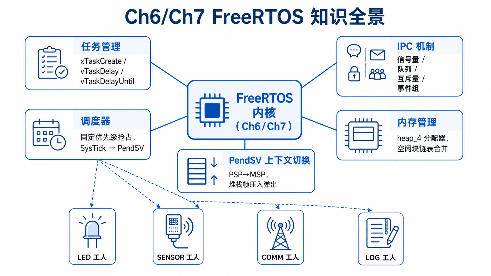

你抽象出了四个工人模型：

```c
// Ch6 的四工人世界观：你指挥一切
void led_task(void *pv) {
    while (1) { led_toggle(); vTaskDelay(pdMS_TO_TICKS(50)); }
}
void sensor_task(void *pv) {
    while (1) { adc_sample(); xQueueSend(sensor_q, &data, 0); vTaskDelayUntil(...); }
}
void comm_task(void *pv) {
    while (1) { xQueueReceive(cmd_q, &cmd, portMAX_DELAY); handle(cmd); }
}
void log_task(void *pv) {
    while (1) { xQueueReceive(log_q, &entry, pdMS_TO_TICKS(100)); printk(entry); }
}
```

然后 Ch7 教你把这个模型工程化——任务怎么划分边界、通信怎么设计、优先级怎么排。你现在有了一个能跑、能扩展、有架构意识的 FreeRTOS 工程。

但这些代码有一个你没注意到的问题：**整个工厂的"水电管线"是你用手一根一根接的。**

### 1.2 FreeRTOS 没替你做的事：一个清单

把你 Ch7 工程打开，数数下面这些事，**全是 FreeRTOS 不管的**：

**第一，板子定义全手写。** 你的 GPIO pin 藏在一堆 `#define LED_PIN GPIO_PIN_13` 里。换了板子（比如 STM32F4 换成 nRF52840），你得全局搜索 `GPIO_PIN_`，逐个改成新的管脚号。**FreeRTOS 不知道你的板子上有什么外设。**

**第二，驱动注册全靠人工排。** 你的 `led_init()` 要在 `sensor_init()` 之前调，否则传感器线程启动时 GPIO 还没配置。这个顺序是你在 `main()` 里用手写的调用顺序保证的——漏一个，崩一片。**FreeRTOS 不帮你管理模块的启动依赖。**

**第三，换板子等于重写。** Ch5 你学了 `platform.h` 抽象层：换硬件只改 `board.c`。但那层抽象是你自己写的。FreeRTOS 没给你任何板级抽象——换一个 MCU 系列，你的 HAL 层调用全部要改。**FreeRTOS 不管硬件可移植性。**

**第四，功能裁剪靠手动改 Makefile。** 想把日志模块关掉省 flash？你自己去 `Makefile` 里删源文件，自己 `#if 0` 掉相关代码。**FreeRTOS 没有编译期配置系统。**

**第五，构建系统你自己搭。** 源码目录怎么组织、头文件路径怎么传、链接脚本在哪——全部是你自己写 Makefile 或 STM32CubeIDE 配出来的。**FreeRTOS 就是一个内核 .c 文件包，剩下全是你自己的事。**

下面这张图把 FreeRTOS 的五项"不管"和 Zephyr 的五项"接管"并排对照，让你一眼看清两种世界观的落差。

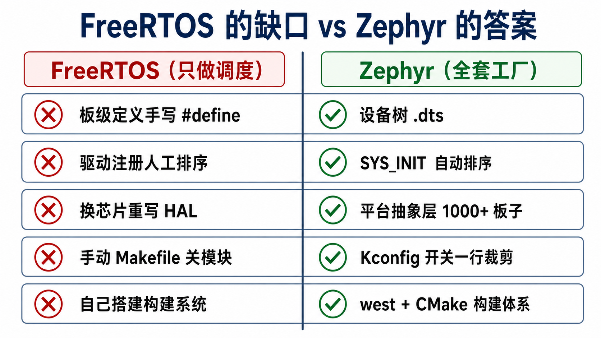

这个清单不是黑 FreeRTOS。FreeRTOS 的设计哲学是"我只做调度，别的你随意"。这恰恰是它轻量的原因，也是它被几十亿设备使用的原因。但当你从一个 Demo 走向一个需要持续维护、迭代、换硬件的工程时，这些"不管的事"会吃掉你越来越多的时间。

**做完 Ch6/Ch7 的你，现在需要一个不只是调度器、而是一整套工程脚手架的东西。** 这就是 Zephyr。

### 1.3 这一章怎么读：五 PART + v0→v11 十二个版本

这一章不准备让你"速通 Zephyr API"。结构是五段叙事，每一段解决一个你在 FreeRTOS 里真实踩过的坑。

下面这张"路线图"是你贯穿全章的导航——六段旅程，每一段解决一个从 FreeRTOS 作坊走进 Zephyr 工厂的真实问题。

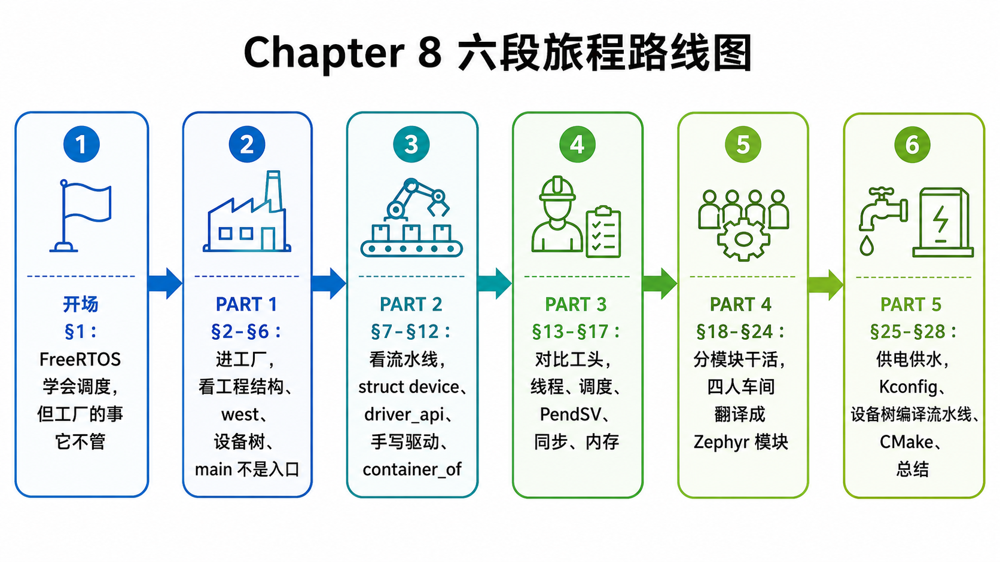

**PART1（##9~##13）：进工厂。** 你第一次进 Zephyr 工厂，看产线布局：工程长什么样、设备树写的硬件清单、系统怎么自己启动。你会用 `west` 烧第一个 LED 程序，发现 main() 比你想象的短得多。


---

# PART 1 · 工程结构与开发范式


**PART2（##7~##12）：看流水线。** 你深入 Zephyr 的驱动系统，发现 Ch5 的每一个 OOP 概念——封装、虚表、向下转型、container_of——在 `struct device` 和 `driver_api` 里逐项兑现。你会手写一个完整的 LED 驱动。

**PART3（##13~##17）：对比工头。** 你拿 Ch6 的每一个 FreeRTOS 概念（线程、调度、PendSV、信号量、队列、内存管理）放到 Zephyr 源码旁边逐项对比。Ch6 的知识不浪费——Zephyr 在线程模型上跟 FreeRTOS 是同源兄弟，差异在调度策略层。

**PART4（##18~##24）：学会分模块干活。** 你把 Ch6 的四人车间翻译成四个独立的 Zephyr 模块，每个模块有自己的 .h 接口和 .c 实现，main.c 用 SYS_INIT 自动注册——从 800 行降到 5 行。

**PART5（##25~##27）：揭开供电供水。** 你钻进 Kconfig、设备树编译管线、CMake 构建骨架，看"为什么不能拖几个 .c 进来就编译"。

十二个版本代码跟着叙事走，下面这张表格是你穿越全章的"工位清单"：

| 版本 | 你在做什么 |
|------|-----------|
| v0 | Ch7 留下的 FreeRTOS 单文件工程（问题基线） |
| v1 | 同 LED，Zephyr 写法（世界观对比） |
| v2 | 三份 .overlay 实验（设备树初探） |
| v3 | 启动序列追踪（SYS_INIT 理解） |
| v4~v11 | 手写驱动 → 线程对比 → 同步全景 → 多模块工程 → Kconfig 裁剪 → 构建流水线 |

**下面，你从 FreeRTOS 的作坊大门走出去，进 Zephyr 的工厂正门。**

---

## 2 FreeRTOS vs Zephyr：两种世界观

### 2.1 库 vs 体系

把你 Ch6 的 FreeRTOS 工程翻出来，数一数你用到的文件：`FreeRTOS/Source/` 下的 `tasks.c`、`queue.c`、`timers.c`、`heap_4.c`——总共不到 20 个 .c 文件，你可以把它们全部打印出来钉在墙上。FreeRTOS 是一个**内核库**：你把它链接进你的工程，你调用它的 API，你掌控一切。

现在看 Zephyr。`west update` 拉下来的 `zephyr/` 目录里有：

```
zephyr/
├── kernel/          ← 调度器（只占 5%）
├── drivers/         ← 400+ 个驱动
├── subsys/          ← 文件系统、网络栈、USB、蓝牙...
├── boards/          ← 1000+ 块板子定义
├── dts/             ← 硬件描述文件
├── include/         ← 公共头文件
├── lib/             ← 工具库
├── cmake/           ← 构建系统
├── scripts/         ← dts→C 翻译器、kconfig 工具...
└── arch/            ← 按架构分层（arm/riscv/xtensa/...）
```

**FreeRTOS 是一个库——你把它拖进你的工程。Zephyr 是一个体系——你的工程被嵌进它里面。**

这就是"请帮工进作坊"和"进工厂上工"的根本区别。FreeRTOS 里你 `#include "FreeRTOS.h"`，然后写你自己的 `main()`。Zephyr 里你写 `find_package(Zephyr)`，然后 Zephyr 的构建系统找到你、包住你、替你编译。

下面这张图把"库 vs 体系"的关系画了出来，注意看箭头方向——这决定了谁包围谁。

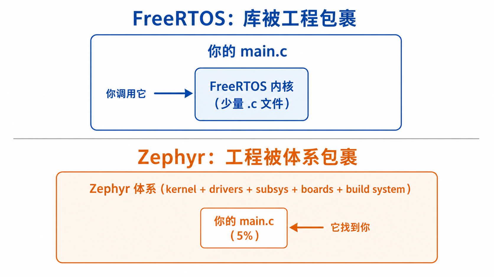

在一个大型 Zephyr 工程里，你的应用代码——main.c、你的驱动、你的模块——加起来通常不超过 5% 的编译输出。剩下 95% 是 Zephyr 的内核、驱动、子系统、板级代码、构建脚本。

**这不是臃肿，是分工。FreeRTOS 让你当一个全能工头；Zephyr 让你当一个知道自己要什么、然后把剩下的事交给专业工人的工程师。**

### 2.2 v0→v1：同一个 LED，两套代码并排看

拿你最熟悉的 LED 闪烁，先看 Ch6/Ch7 留在 `v0_freertos_baseline` 的 FreeRTOS 写法：

```c
// v0: FreeRTOS 版 LED 闪烁
#include "FreeRTOS.h"
#include "task.h"
#include "stm32f4xx_hal.h"

#define LED_PORT  GPIOD
#define LED_PIN   GPIO_PIN_12

static void prvSetupHardware(void) {
    __HAL_RCC_GPIOD_CLK_ENABLE();
    GPIO_InitTypeDef g = {0};
    g.Pin = LED_PIN;
    g.Mode = GPIO_MODE_OUTPUT_PP;
    g.Pull = GPIO_NOPULL;
    g.Speed = GPIO_SPEED_FREQ_LOW;
    HAL_GPIO_Init(GPIOD, &g);
}

void led_task(void *pv) {
    while (1) {
        HAL_GPIO_TogglePin(LED_PORT, LED_PIN);
        vTaskDelay(pdMS_TO_TICKS(500));
    }
}

int main(void) {
    HAL_Init();
    prvSetupHardware();
    xTaskCreate(led_task, "led", 128, NULL, 1, NULL);
    vTaskStartScheduler();
    for (;;);
}
```

现在看 v1 的 Zephyr 写法——同一块 `stm32f4_disco` 板子，同一颗 PD12 的 LED：

```c
// v1: Zephyr 版 LED 闪烁
#include <zephyr/kernel.h>
#include <zephyr/drivers/gpio.h>

// 设备树指定哪颗 LED
#define LED_NODE DT_ALIAS(led0)
static const struct gpio_dt_spec led = GPIO_DT_SPEC_GET(LED_NODE, gpios);

int main(void) {
    if (!gpio_is_ready_dt(&led)) return 0;

    gpio_pin_configure_dt(&led, GPIO_OUTPUT_ACTIVE);

    while (1) {
        gpio_pin_toggle_dt(&led);
        k_msleep(500);
    }
}
```

同一个行为，两套代码。差异在哪？

**硬件定义。** FreeRTOS 版：`#define LED_PIN GPIO_PIN_12` 硬编码在你手写的代码里。Zephyr 版：`DT_ALIAS(led0)` 从设备树拿——`led0` 指向哪颗 LED 是板子定义文件 `stm32f4_disco.dts` 里写的，你的 main.c 不碰任何具体 GPIO 端口号。

**初始化。** FreeRTOS 版：你手动开 RCC 时钟、填 `GPIO_InitTypeDef` 结构体。Zephyr 版：`gpio_pin_configure_dt()` 一行搞定——Zephyr 知道这颗 GPIO 挂在哪个控制器上、该给什么参数。

**延时。** FreeRTOS 版：`vTaskDelay(pdMS_TO_TICKS(500))`，带单位转换。Zephyr 版：`k_msleep(500)`，毫秒直接写。

**main 的职责。** FreeRTOS 版：`main()` 做硬件初始化 + 创建任务 + 启动调度器 + 无限循环。Zephyr 版：`main()` 做检查 + 配置 + 循环——启动的事 Zephyr 已经在 `main()` 之前做完了。

下面这张并排对照图让你一眼看出同一个 LED 闪烁的两套写法的核心差异。

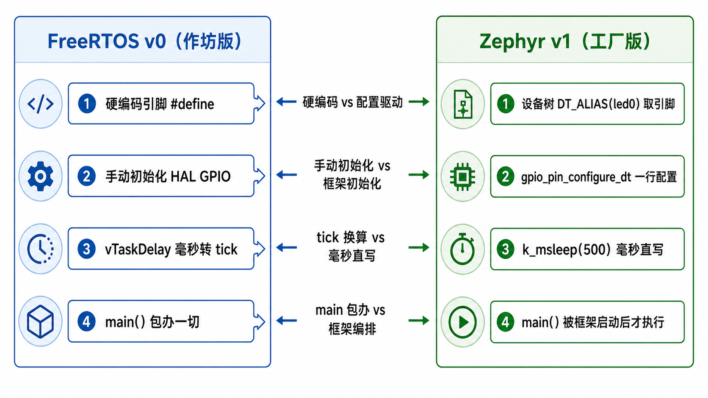

**你看，同一个目标（LED 闪烁），FreeRTOS 让你当全能工头——时钟、引脚、调度全部你写；Zephyr 让你填工单——告诉系统"我要那个设备树里叫 led0 的 GPIO"，剩下的工厂自动处理。**

### 2.3 这个差别改变了你每天的工作

v0 和 v1 只有 20 行代码的差异，但它背后是两种工作方式。

**加一个外设。** FreeRTOS：读原理图 → 查参考手册寄存器 → 写 `HAL_xxx_Init` → 确认时钟树不冲突 → 把 init 塞进 main() 的正确位置。Zephyr：设备树加节点 → 写 `gpio_pin_configure_dt` → 完。

**换一块板子。** FreeRTOS：全局搜索 `GPIOD` → 逐个改成新板的端口 → 确认新的时钟树 → 祈祷没漏。Zephyr：`west build -b new_board` → 设备树自动覆盖新板的引脚 → 应用代码一行不动。

**加一个开源库（比如 shell/日志/文件系统）。** FreeRTOS：去 GitHub 下载 → 移植 → 改 Makefile → 对接你自己的接口。Zephyr：`prj.conf` 里加一行 `CONFIG_SHELL=y` → 重新编译 → 系统启动后直接就能用——因为它的 driver、network stack、filesystem、shell 已经在同一个仓库里，全由 Kconfig 开关控制。

这个差别翻译到你的日常就是：**FreeRTOS 世界里，你每次换硬件、加功能都是在改代码。Zephyr 世界里，你每次都是在改配置。改代码的边际成本是递增的（工程越大越难改），改配置的边际成本是平的。**

下面这张图把这个关键论述——"边际成本递增 vs 边际成本持平"——转化为一张你能记住的曲线图。

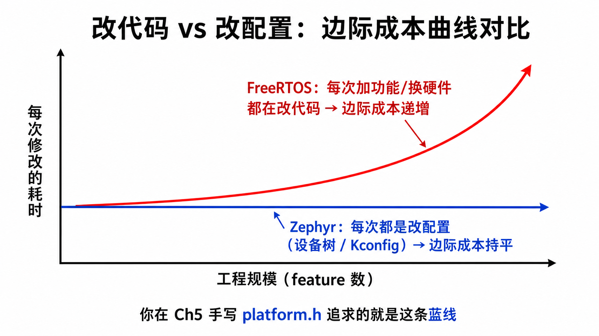

你在 Ch5 辛辛苦苦手写了 `platform.h` 求的就是这种"换硬件只改一层"的效果。Zephyr 整个系统就是一套放大了 100 倍的 `platform.h`——在 Ch5 是你一个人写出了平台抽象，在 Zephyr 是上游 3000+ 贡献者已经替你写好了 1000+ 块板子的平台抽象。

**现在你已经看见工厂大门了。下一节你学会工厂发的第一套工具：`west` 命令行。**

---

## 3 west：Zephyr 的命令行入口

### 3.1 west init：拉源码

`west` 是 Zephyr 的 meta-tool，用 Python 写的，命令行风格模仿 `git`。你打开任何一个 Zephyr 工程，敲的第一个命令就是：

```bash
west init -m https://github.com/zephyrproject-rtos/zephyr \
          --mr v3.7.0 ~/zephyrproject
cd ~/zephyrproject
west update
```

`west init` 做了什么？它把 Zephyr 上游仓库 clone 到本地——不是只 clone 内核，而是在 `zephyr/west.yml` 这个 manifest 文件里列出了所有官方维护的子模块：`hal_stm32`（HAL 库）、`hal_nordic`（Nordic 驱动）、`mbedtls`（加密库）、`littl_efs`（文件系统）、`tinycrypt`……一行 `west update`，所有依赖全拉下来，目录结构、子模块版本、补丁顺序全部由 manifest 保证一致。

这跟你 Ch6/Ch7 做 FreeRTOS 工程的方式完全不同。FreeRTOS 里你手动下载 `FreeRTOSv202212.01.zip`，解压，自己把头文件路径加进 Makefile。Zephyr 里 `west` 是中央调度器：它不仅拉源码，还管理 Zephyr SDK（交叉编译器）、Python 虚拟环境、300+ 个依赖包的版本。

跟你 `git clone` 一个仓库然后自己配环境不同，`west init` 是"我告诉你我要 Zephyr v3.7，你把所有拼图和工具链给我就位"。

### 3.2 west build：编译

装好了，进你的应用目录，敲：

```bash
cd app
west build -b stm32f4_disco
```

这一行触发了多少事？`west build` 底层调用 CMake，但它在调 CMake 之前做了几层包装：

1. **解析 `-b stm32f4_disco`**：去 `zephyr/boards/st/stm32f4_disco/` 加载这块板子的设备树、Kconfig 默认值、板级启动代码。
2. **合并你的配置**：读你工程目录下的 `prj.conf`（你的 Kconfig 选择）、`app.overlay`（你的设备树补丁），跟板级默认值合并。
3. **生成 CMake 命令行**：把 Zephyr 根 CMakeLists.txt、板级参数、你的应用路径传给 CMake。
4. **调 CMake→调 Make/Ninja**：预处理 Kconfig → 生成 `autoconf.h` → 跑 Python 脚本把 dts 翻成 `devicetree_generated.h` → 编译你的 `main.c` 加上上千个 Zephyr 源文件 → 链接。

在你的终端输出里你会看到远远不止你的 `main.c` 在编译——你看到 `kernel/sched.c`、`drivers/gpio/gpio_stm32.c`、`arch/arm/core/...` 全部在滚动。**这不是 bug，是 Zephyr 在搭整条产线。**

如果你 Ch6 习惯了敲 `make -j8` 然后等 3 秒编译完，第一次等 `west build` 可能要多等两分钟。这是因为 Zephyr 第一次编译会编全部内核和驱动。以后增量编译只改你改过的文件，和 `make` 一样快。

### 3.3 west flash：烧录

编完就烧：

```bash
west flash
```

这行命令背后 Zephyr 自动查板子的调试接口：STM32 系列用 OpenOCD 或 ST-Link，Nordic 系列用 nrfjprog，ESP32 用 esptool。你不用记每块板子的烧录命令——`west` 在板子定义里已经配好了 `runner`。如果你同时接了 ST-Link 和 J-Link，可以通过 `--runner` 指定：

```bash
west flash --runner jlink
```

烧录完成后，板子上的 LED 开始闪。你从敲 `west init` 到看见 LED 闪，命令行总共只有三条。对比 FreeRTOS 的流程——装 Keil/IAR → 建工程 → 配头文件路径 → 配链接脚本 → 配调试器 → 点 build → 点 download——你发现 Zephyr 把"搭环境"这整件事收回了框架层。

下面这张图把你第一次进 Zephyr 工厂的三条命令串成一条清晰的流水线。

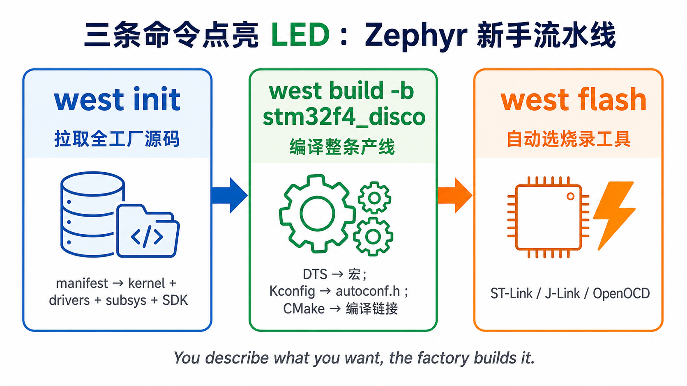

`west` 还有更多子命令：`west debug`（启 gdb server），`west build -t menuconfig`（图形化配 Kconfig），`west build -t rom_report`（看 flash 占用）。但 init/build/flash 三条是你每天用的核心。记住：**`west` 之于 Zephyr，等于 `git` 之于源码管理——它是进出工厂的大门。你不需要理解它的全部实现，但你必须会推门进去。**

把前面三步串成你的第一次 Zephyr 体验：

```bash
# 1. 拉工厂全部源码（只需做一次）
west init -m https://github.com/zephyrproject-rtos/zephyr \
          --mr v3.7.0 ~/zephyrproject
cd ~/zephyrproject && west update

# 2. 在工厂目录下新建你的工位
mkdir -p my-app
cat > my-app/CMakeLists.txt << 'EOF'
cmake_minimum_required(VERSION 3.20)
find_package(Zephyr REQUIRED HINTS $ENV{ZEPHYR_BASE})
project(my_app)
target_sources(app PRIVATE src/main.c)
EOF

mkdir my-app/src
# 把 v1 的 main.c 放进 my-app/src/main.c

# 3. 进工位，编译，烧录
cd my-app
west build -b stm32f4_disco
west flash
```

三条命令。LED 开始闪烁。

你在 Ch6 花了几十页学任务调度，现在到 Zephyr，一个 main 函数、三行 west，就完成了一模一样的物理行为。这不意味着 Ch6 白学了——恰恰相反：**Ch6 让你理解了工厂流水线底下在发生什么。现在你进工厂，你知道每条传送带为什么那么转。**

---

## 4 一个 Zephyr 工程的五脏六腑

### 4.1 最小工程文件逐一翻译

回到 v1 工程，看它由哪些文件组成。打开目录：

```
my-app/
├── CMakeLists.txt          ← 构建入口
├── prj.conf                ← 你的配置选择
└── src/
    └── main.c              ← 你的代码
```

就三个文件。但这三个文件背后对接的是 Zephyr 上千个文件。每个文件有明确的角色：

**`CMakeLists.txt`**：不是你 Ch6 那种手写 gcc 命令行的 Makefile。它是告诉 CMake"我是一个 Zephyr 应用，请用 Zephyr 的构建体系来处理我"。三到五行就够。

**`prj.conf`**：你的 Kconfig 选择。你不是 `#include` 开关，而是用 `CONFIG_XXX=y` 声明你要什么功能。这和 Ch6 里你手动 `#define configUSE_PREEMPTION 1` 在 `FreeRTOSConfig.h` 里的效果一样，但作用域完全不同——后面 11.3 展开。

**`src/main.c`**：你的应用入口。但注意——`main()` 不是系统的真正入口。Zephyr 内核已经在 `main()` 之前完成了硬件初始化、驱动注册、内核启动。你的 `main()` 进来时工厂已经开工了。

这三个文件加在一起可能不到 40 行。其余全是 Zephyr 框架在背后做的事情。你不是在写一个独立的可执行文件——你是在 Zephyr 这个操作系统里写一个**应用**。这个感觉跟你在 Ch6 完全不同。

### 4.2 CMakeLists.txt 三五行的秘密

v1 工程里的 `CMakeLists.txt` 长这样：

```cmake
cmake_minimum_required(VERSION 3.20)

find_package(Zephyr REQUIRED HINTS $ENV{ZEPHYR_BASE})

project(my_app)

target_sources(app PRIVATE src/main.c)
```

逐行翻译：

**第 1 行**：声明 CMake 最低版本。标准开场白。

**第 3 行**：`find_package(Zephyr ...)`——这是整个文件的核心。CMake 收到这一行，去 `ZEPHYR_BASE` 环境变量指向的目录（即你 `west init` 拉的 `zephyr/` 目录）找 `ZephyrConfig.cmake`。这个文件由 Zephyr 提供，它会加载全套构建基础设施：Kconfig 处理脚本、设备树编译器、架构相关的编译选项、链接脚本路径。

**第 5 行**：`project(my_app)`——声明你的项目名。

**第 7 行**：`target_sources(app PRIVATE src/main.c)`——把你的源文件加进 `app` 这个 CMake target。注意这里的 `app` 不是你定义的——是 Zephyr 在 `find_package(Zephyr)` 里已经建好的 target。你只需要往里面加源文件。

对比你在 Ch6 写的 Makefile（手动指定交叉编译器路径、arch 标志、链接脚本、include 路径、源文件列表），这 5 行是极致的"声明式"：**我不说怎么做，我只说我是谁、我有哪些文件。怎么做是 Zephyr 的事。**

以后你加模块（PART4）只需要把这一行扩成：
```cmake
target_sources(app PRIVATE src/main.c src/led_task.c src/sensor_task.c)
```
构建系统自动处理头文件路径、依赖、链接顺序。

下面这张图把 FreeRTOS 和 Zephyr 的工程目录结构并排展示，让"库 vs 体系"的差异一目了然。

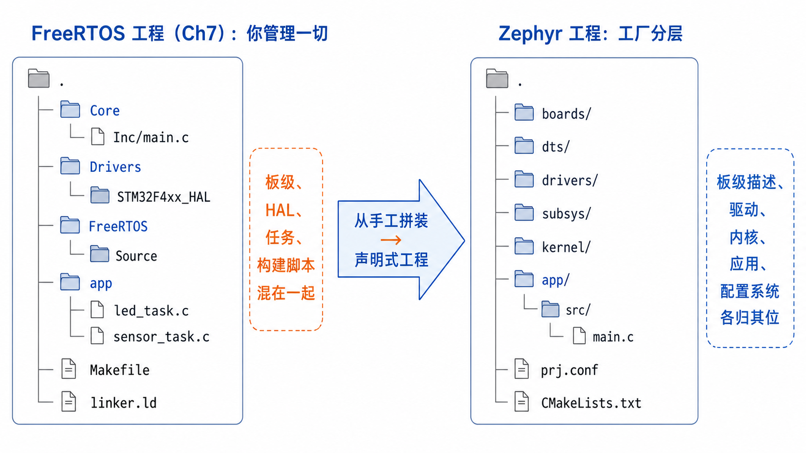

### 4.3 prj.conf vs FreeRTOSConfig.h

Ch6 里你配置 FreeRTOS 用的是 `FreeRTOSConfig.h`：

```c
// FreeRTOSConfig.h — 你手写的几十个宏
#define configUSE_PREEMPTION            1
#define configUSE_IDLE_HOOK             0
#define configUSE_TICK_HOOK             0
#define configCPU_CLOCK_HZ              (SystemCoreClock)
#define configTICK_RATE_HZ              (1000)
#define configMAX_PRIORITIES            (7)
#define configMINIMAL_STACK_SIZE        ((unsigned short)128)
#define configTOTAL_HEAP_SIZE           ((size_t)(17 * 1024))
// ... 还有十多个
```

每一个宏只影响 FreeRTOS 内核本身。其他 FreeRTOS 生态里的第三方库——shell、文件系统、网络——你不用就不存在，你想用就得自己移植。

Zephyr 的 `prj.conf`：

```conf
# prj.conf — 你选的 CONFIG 开关
CONFIG_GPIO=y
CONFIG_SERIAL=y
CONFIG_CONSOLE=y
CONFIG_PRINTK=y
```

它只列你要打开的选项。但 Kconfig 不仅影响内核——它影响全部 Zephyr 子系统。每一个 `CONFIG_xxx` 背后可能连锁触发其他 `#define`：

```
prj.conf: CONFIG_SERIAL=y
  → Kconfig 解析出 SERIAL 依赖 HAS_DTS=y 和 UART_INTERRUPT_DRIVEN=y
    → 生成 autoconf.h:
        #define CONFIG_SERIAL 1
        #define CONFIG_HAS_DTS 1
        #define CONFIG_UART_INTERRUPT_DRIVEN 1
      → 驱动代码里 #ifdef CONFIG_UART_INTERRUPT_DRIVEN ... #endif
```

下面这张图把 Kconfig 的"链式依赖"展开——你只写一行 `CONFIG_SERIAL=y`，背后自动触发三个宏。

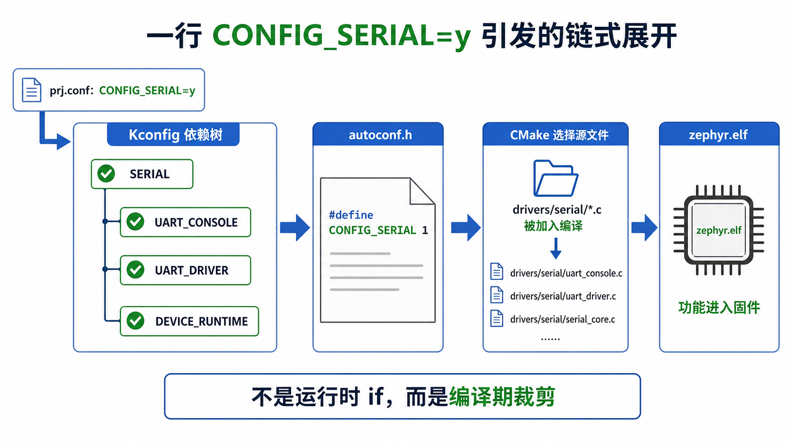

两个系统的区别用一句话总结：**`FreeRTOSConfig.h` 只定义内核参数，`prj.conf` 通过 Kconfig 树影响整个系统——内核、驱动、子系统、构建流程。** 这跟你 Ch5 用 `#define DEMO_MODE` 切换代码路径是同一思路，但 Zephyr 的 Kconfig 有完整的依赖图、默认值和反向依赖检查——它不会让你打开一个"依赖不存在"的选项。

### 4.4 目录结构对比

把你 Ch7 的 FreeRTOS 工程目录和 Zephyr v1 工程并排看：

```
FreeRTOS (Ch7)                       Zephyr v1
┌──────────────────────┐            ┌──────────────────────┐
│ my_freertos_app/     │            │ my-app/              │
│ ├── Core/            │            │ ├── CMakeLists.txt   │ ← 声明式构建
│ │   ├── Inc/         │            │ ├── prj.conf         │ ← Kconfig 开关
│ │   └── Src/main.c   │            │ └── src/main.c       │ ← 你的代码
│ ├── Drivers/         │            └──────────────────────┘
│ │   ├── STM32F4xx_HAL_Driver/
│ │   └── CMSIS/
│ ├── Middlewares/
│ │   └── FreeRTOS/
│ │       ├── Source/   ← 你手动拖进来的
│ │       └── FreeRTOSConfig.h
│ ├── Makefile          ← 你手写的
│ └── STM32F407VGTX_FLASH.ld
└──────────────────────┘
                      
所有依赖全在你的目录下。              只有你的应用代码在目录下。
FreeRTOS 是你工程的一部分。            Zephyr 在别处（~/zephyrproject/zephyr/），
                                     你的工程只描述你是谁。
```

FreeRTOS 工程：**源码全部在你目录下，你是主人。** Zephyr 工程：**只有你的应用代码在你目录下，Zephyr 是你应用的宿主。**

这个差异在工程变大的时候影响深远。FreeRTOS 老工程要升级内核版本？去官网下载新压缩包，覆盖 `Middlewares/FreeRTOS/Source/`，祈祷你改过的 port 文件没被冲突。Zephyr 老工程要升级？改 `west.yml` 里的 manifest revision，`west update`——其他 400 个驱动、1000 块板子、所有子系统的升级由上游仓库完成。

**你已经看见了工程的外壳。下一节你打开设备树这个"硬件清单"，看你板子上的 LED 是怎么被 Zephyr 认识的。**

---

## 5 设备树初探：硬件描述的第一眼

### 5.1 为什么要把硬件从 C 代码里剥出来

回顾你 Ch5 写的 `platform.h`：

```c
// Ch5: 你自己手写的平台抽象
#ifdef PC_SIM
    #define LED_PIN  13
    #define gpio_write(pin, val) printf("[GPIO] pin%d = %d\n", pin, val)
#elif STM32
    #define LED_PIN  GPIO_PIN_12
    #define gpio_write(pin, val) HAL_GPIO_WritePin(GPIOD, pin, val ? ... : ...)
#endif
```

这层抽象让你换硬件只改 `platform.h`，应用代码不动。Ch5 管这个叫"平台抽象层"——**你正在做的，就是 Zephyr 设备树要做的事：让硬件描述独立于应用逻辑。**

下面这张图把 Ch5 手写 platform.h 和 Zephyr 设备树放在一起对照——同一个思想，两代实现。

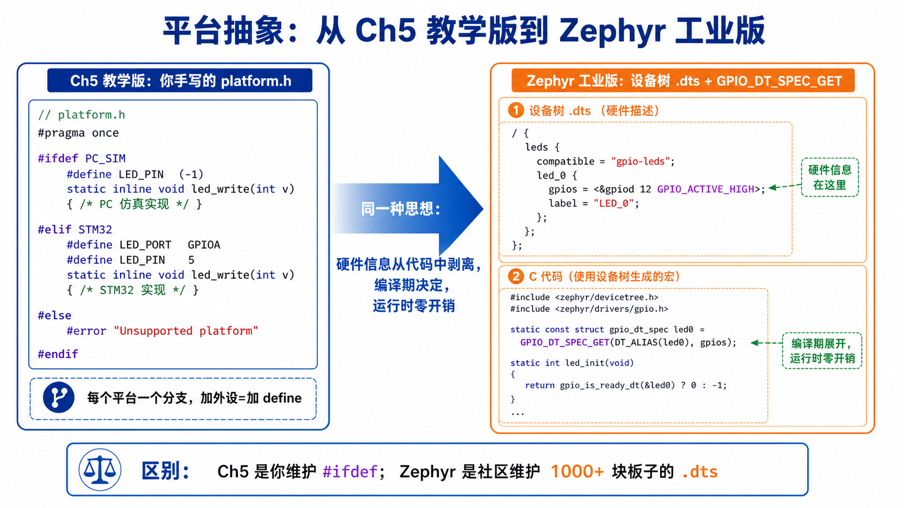

区别在于：
- **Ch5 的 `platform.h`**：你自己写的、只有你自己遵守的约定。换一个外设加一段 `ifdef`。
- **Zephyr 的设备树**：3000+ 贡献者维护的标准格式。1000+ 块板子的硬件描述已经写好。你的应用用标准宏取出信息。

设备树的思想是从 Linux 内核搬过来的：**板子上的硬件是一棵"设备树"——SoC 是根，片上外设（GPIO、I2C、SPI 控制器）是枝干，板上器件（传感器、LED、电机）是叶子。用 .dts 文件把整棵树写成文本，编译时翻译成 C 常量，运行时零开销。**

为什么非要把硬件从代码里剥出来？两个致命原因：
1. **同一份 SoC 数据手册出现了 100 次**：Ch6 里 GPIO_Pin 13 这个数字散落在三个 #define、两个 init 结构体、一个中断回调里。数据手册改一个字你得全局搜改。
2. **硬件信息应该跟着板子走，不该跟着代码走。** 你的 LED 闪烁算法跟它接在 PD12 还是 P1.03 没关系。把引脚硬编码在 C 文件里，就等于把家具钉在墙上——搬一次家拆一次墙。

### 5.2 一个真实 .dts 节点长什么样

打开 `boards/st/stm32f4_disco/stm32f4_disco.dts`，找到 v1 里你用过的 `led0`：

```dts
leds {
    compatible = "gpio-leds";
    green_led_4: led_4 {
        gpios = <&gpiod 12 GPIO_ACTIVE_HIGH>;
        label = "User LD4";
    };
    orange_led_3: led_3 {
        gpios = <&gpiod 13 GPIO_ACTIVE_HIGH>;
        label = "User LD3";
    };
    red_led_5: led_5 {
        gpios = <&gpiod 14 GPIO_ACTIVE_HIGH>;
        label = "User LD5";
    };
    blue_led_6: led_6 {
        gpios = <&gpiod 15 GPIO_ACTIVE_HIGH>;
        label = "User LD6";
    };
};
```

别被大括号吓到。只看四样东西：

**`leds { compatible = "gpio-leds"; }`**：声明这个节点用 `gpio-leds` 驱动。Zephyr 编译时会在 `drivers/led/` 里找声明了 `gpio-leds` compatible 的驱动文件。**兼容字符串 = 驱动的身份证号，跟 Ch5 里你给每个 platform 起的标识名是一回事。**

**`green_led_4: led_4`**：冒号前的 `green_led_4` 是 **label**（C 代码里用 `DT_NODELABEL(green_led_4)` 引用它），冒号后的 `led_4` 是 **节点名**。

**`gpios = <&gpiod 12 GPIO_ACTIVE_HIGH>`**：三元素——`&gpiod` 是 GPIO 控制器的引用（指向同文件里一个 GPIO 控制器节点），`12` 是引脚号，`GPIO_ACTIVE_HIGH` 是极性。**这一行就是你 Ch6 里的 `GPIO_PIN_12 | GPIO_MODE_OUTPUT_PP | GPIO_NOPULL`，但现在不写在 C 代码里，写在硬件描述里。**

**`label = "User LD4"`**：人类可读标签字符串，调试用。

下面这张图把 .dts 节点解剖为四个要素，让你一眼看懂设备树的"语法骨架"。

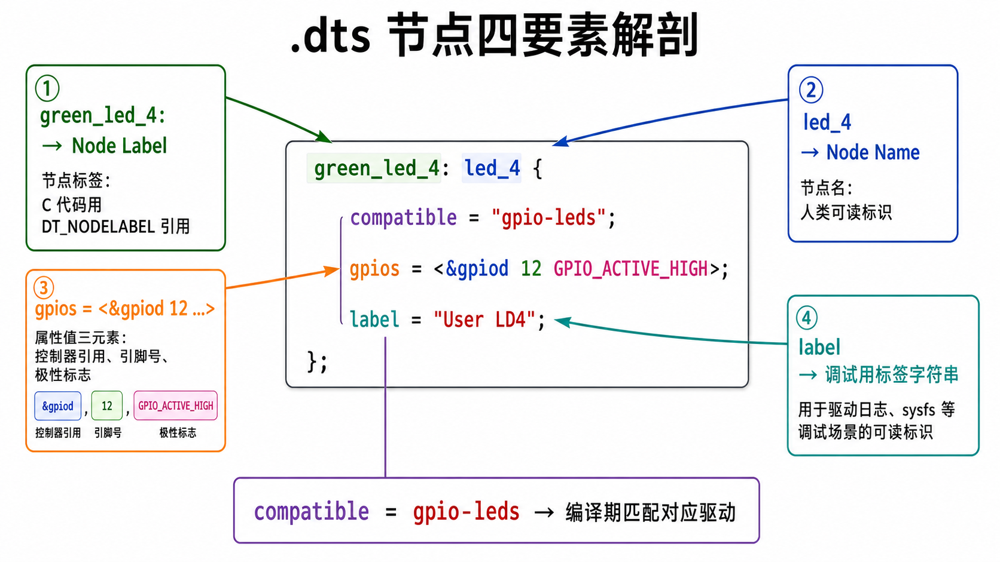

这就是设备树的全部语法——节点、属性、引用。没有 C 控制流，没有函数调用，就是一份格式化的硬件清单。

### 5.3 和 Ch5 platform.h 的对照

拿 v1 的 LED 代码和 Ch5 的代码放一起看：

Ch5 的硬件定义（`platform.h`）：
```c
// Ch5: 硬件信息嵌在 C 代码里
#define DISCO_LED_PIN  12
#define DISCO_LED_PORT GPIOD
```

Zephyr 的硬件定义（`stm32f4_disco.dts`，并通过 `GPIO_DT_SPEC_GET` 取到 C 里）：
```c
// v1: 硬件信息从设备树宏取出
static const struct gpio_dt_spec led = GPIO_DT_SPEC_GET(DT_ALIAS(led0), gpios);
// 编译后等价于:
// static const struct gpio_dt_spec led = {
//     .port = DEVICE_DT_GET(DT_NODELABEL(gpiod)),
//     .pin  = 12,
//     .dt_flags = GPIO_ACTIVE_HIGH
// };
```

Ch5 的方式：**你手动维护一个 #define 列表，每个平台一个 #ifdef 分支，加外设 = 加 define，换板子 = 改 define。**

Zephyr 的方式：**你在 .dts 里声明硬件资源，用 `GPIO_DT_SPEC_GET` 在编译时提取成 C 结构体。加外设 = 加 dts 节点。换板子 = 换 .dts 文件（或 .overlay）。**

关键的差别在编译期：设备树宏在预处理阶段就展开成静态常量，编译器看到的是纯 C 数值。运行时，`led.pin` 就是 `12`——一次内存读取，跟你手写 `#define LED_PIN 12` 一样快。**设备树不是运行时去解析字符串，是编译期把 .dts 翻译成 C 常量。**

这跟你 Ch5 用 `#ifdef PC_SIM` 切换 platform 是同一种思想：编译期决定，运行时零开销。区别是——Ch5 的 `#ifdef` 分支你要自己手写和维护，Zephyr 的 .dts 翻译由上游脚本自动完成，你只需要读设备树然后取你需要的值。

### 5.4 v2 demo：三份 overlay 实验

`overlay` 是设备树最厉害的特性之一：**你不直接改板子的 .dts 文件，而是在自己工程里叠加一个补丁文件，只写你改动的部分。**

v2 实验：同一份 `main.c`，通过三份不同的 overlay 让同一颗 LED 闪烁到三种效果。你的应用代码一行不变：

**第一份 overlay：换一个引脚**（把 led0 从 PD12 改成 PA5）

```dts
// app.overlay #1: 把 led0 重映射到 PA5
&led0 {
    gpios = <&gpioa 5 GPIO_ACTIVE_HIGH>;
};
```

**第二份 overlay：加一颗 LED，跑马灯**

```dts
// app.overlay #2: 添加 led1，用 PA6
/ {
    aliases {
        led1 = &my_led1;
    };
    my_led1: my_led1 {
        gpios = <&gpioa 6 GPIO_ACTIVE_HIGH>;
    };
};
```

**第三份 overlay：改 LED 为低电平有效（共阳极接法）**

```dts
// app.overlay #3: 极性翻转
&led0 {
    gpios = <&gpiod 12 GPIO_ACTIVE_LOW>;
};
```

下面这张图把三份 overlay 实验做成一张对照表，同一份 main.c 不动，换个 overlay 就是三种硬件效果。

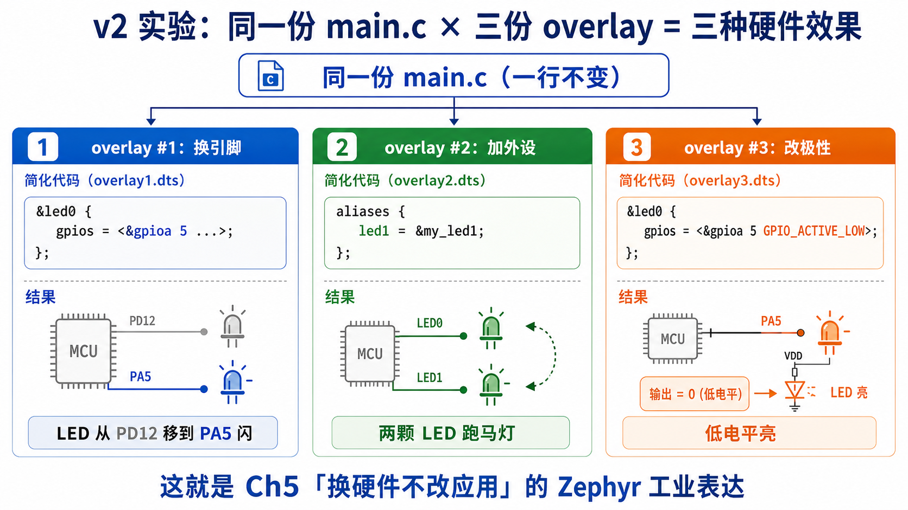

你的 `main.c` 一行不变，每次只换 overlay，重新编译：

```bash
west build -b stm32f4_disco -- -DEXTRA_DTC_OVERLAY_FILE=app.overlay
```

三份 overlay，同一份应用代码，三种硬件效果。**这就是 Ch5 "换硬件不改应用" 的 Zephyr 表达。** 你在 Ch5 学到的是原则——硬件抽象；Zephyr 给你的是工业实现——设备树。

---

## 6 main 不是一个函数：Zephyr 的启动序列

### 6.1 FreeRTOS 的启动：你的节奏

Ch6 里你是这样启动 FreeRTOS 的：

```c
int main(void) {
    HAL_Init();              // 1. 你手动调 HAL 库初始化
    SystemClock_Config();    // 2. 你手动配时钟
    prvSetupHardware();      // 3. 你手动初始化所有外设 GPIO
    xTaskCreate(led_task, ...);   // 4. 你手动创建所有任务
    xTaskCreate(sensor_task, ...);
    xTaskCreate(comm_task, ...);
    xTaskCreate(log_task, ...);
    vTaskStartScheduler();   // 5. 你亲手按下"开始"按钮
    for (;;);                // 6. 永远不会到这里
}
```

六个步骤，顺序由你决定，少一步崩一片。**FreeRTOS 的启动是你自己写的。** `vTaskStartScheduler()` 之前，整个系统是你一手搭起来的：时钟你开、外设你初始化、任务你创建。你是在一张白纸上画车间——画布是你的，画笔是你的，一切节奏由你掌控。

这个模式在小工程里灵活直接。但工程大了之后有一个隐患：**所有模块的初始化顺序都靠 `main()` 里的调用顺序保证。** `sensor_init()` 必须在 `led_init()` 之后？那你写代码的时候手别抖。加一个新模块？你得找到 `main()` 里正确的位置塞进去。

### 6.2 Zephyr 的启动：框架的节奏

Zephyr 的启动完全不同。你 v1 的 `main()` 看起来什么都没做：

```c
int main(void) {
    if (!gpio_is_ready_dt(&led)) return 0;  // 设备已就绪
    gpio_pin_configure_dt(&led, GPIO_OUTPUT_ACTIVE);
    while (1) {
        gpio_pin_toggle_dt(&led);
        k_msleep(500);
    }
}
```

**没有 `SystemClock_Config`，没有 `HAL_Init`，没有 `xTaskCreate`，没有 `vTaskStartScheduler`。** 什么启动了你的系统？答案是：Zephyr 在 `main()` 之前已经走完了下面这条启动链：

```
Reset_Handler (arch/arm/core/cortex_m/reset.S)
  → z_arm_prep_c (cache/FPU/vector table)
    → z_cstart (kernel/init.c)
      → 遍历 PRE_KERNEL_1 section → 调 init 函数
        （中断控制器、时钟树等最底层初始化）
      → 遍历 PRE_KERNEL_2 section → 调 init 函数
        （继续低层硬件初始化）
      → kernel_init 启动内核
      → 遍历 POST_KERNEL section → 调 init 函数
        （驱动初始化：GPIO、I2C、SPI 等）
      → 遍历 APPLICATION section → 调 init 函数
        （应用模块初始化）
      → 调 main()
```

`main()` 被调用时，Zephyr 已经做了：
- 系统时钟配好
- 所有 GPIO 控制器驱动注册完毕
- 所有标记了 `POST_KERNEL` 的驱动 `init` 函数已执行
- 调度器已经在跑

**你的 main() 不是系统的入口，它是系统的最后一个初始化阶段。** 在 Zephyr 的术语里，`main()` 是 APPLICATION 阶段的一部分——而且它是 APPLICATION 阶段里最后被调的那个。

### 6.3 v3 demo：启动序列追踪

你写一个 v3 实验来亲眼看见这个序列。在四个关键阶段各注册一个初始化函数，让它们在 `printk` 里带时间戳输出自己是谁：

```c
// v3: 追踪启动序列
#include <zephyr/kernel.h>
#include <zephyr/init.h>

static int init_pre1(void) {
    printk("[%08d] PRE_KERNEL_1: 中断控制器就绪\n", k_uptime_get());
    return 0;
}
static int init_pre2(void) {
    printk("[%08d] PRE_KERNEL_2: 时钟树就绪\n", k_uptime_get());
    return 0;
}
static int init_post(void) {
    printk("[%08d] POST_KERNEL: GPIO 驱动就绪\n", k_uptime_get());
    return 0;
}
static int init_app(void) {
    printk("[%08d] APPLICATION: 应用模块就绪\n", k_uptime_get());
    return 0;
}

// 四个函数注册到四个不同启动阶段
SYS_INIT(init_pre1, PRE_KERNEL_1, 50);
SYS_INIT(init_pre2, PRE_KERNEL_2, 50);
SYS_INIT(init_post, POST_KERNEL, 50);
SYS_INIT(init_app, APPLICATION,  50);

int main(void) {
    printk("[%08d] main() 被调用 — 我是最后一个\n", k_uptime_get());
    while (1) { k_msleep(1000); }
}
```

串口输出是：

```
[00000000] PRE_KERNEL_1: 中断控制器就绪
[00000001] PRE_KERNEL_2: 时钟树就绪
[00000005] POST_KERNEL: GPIO 驱动就绪
[00000012] APPLICATION: 应用模块就绪
[00000012] main() 被调用 — 我是最后一个
```

**你的 `main()` 排在全系统初始化的最后。所有 PRE_KERNEL_1、PRE_KERNEL_2、POST_KERNEL 的初始化函数已经在你不知情的情况下跑完了。**

下面这张图让你对比 FreeRTOS 和 Zephyr 的启动序列——一个是你的节奏，一个是框架的节奏。

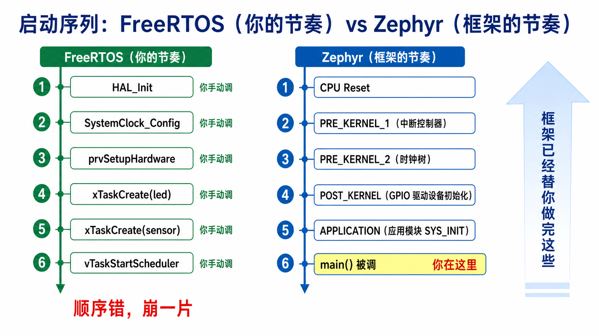

这跟你 Ch6 FreeRTOS 里在 `main()` 中手动控制一切完全不同。FreeRTOS 的启动是你的节奏，你决定第一步做什么、第二步做什么。Zephyr 的启动是框架的节奏——**你声明一个函数在哪个阶段跑，启动时框架按顺序替你调。你的主动权从"写调用顺序"变成了"声明归哪个阶段管"。**

### 6.4 SYS_INIT：Ch17 initcall 的工业版

v3 里你看到的 `SYS_INIT(init_post, POST_KERNEL, 50)` 这一行，就是你在 Ch17 手写的 initcall 机制的工业实现。

下面这张图把你在 Ch17 手写的 initcall 教学版和 Zephyr 的 SYS_INIT 工业版并排对照——骨架一模一样。

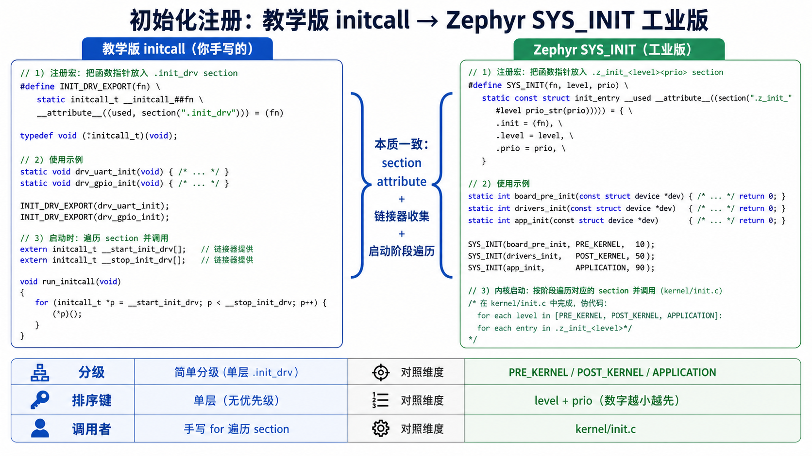

回顾 Ch17 你做了什么：你定义了几个 init section（`.init_pre`、`.init_drv`、`.init_app`），用 `INIT_xxx_EXPORT(fn)` 宏把函数指针塞进对应 section，然后 `main()` 启动时遍历这些 section 依次调用。

Zephyr 的 `SYS_INIT` 原理一模一样：

```c
// Ch17 教学版（你的实现）
#define INIT_DRV_EXPORT(fn) \
    static initcall_t __initcall_##fn \
        __attribute__((section(".init_drv"))) = fn

// Zephyr v3.7.0 工业版（上游源码）
#define SYS_INIT(fn, level, prio) \
    static const Z_DECL_ALIGN(struct init_entry) \
        __init_##fn __used \
        __attribute__((__section__(".z_init_" #level \
            STRINGIFY(prio)"_"))) = { \
        .init = (void (*)(void))fn, \
    }
```

本质完全一致：**GCC 的 `section` attribute 把函数指针放进特定命名的链接段，启动代码遍历这些段，按字典序调入。** Ch17 的你手动写了 `for` 循环遍历 `.init_drv`；Zephyr 里这个循环在 `kernel/init.c` 的 `z_cstart()` 里。

区别在两个地方：
- **分级更细**：Ch17 你分了 3 级（pre/drv/app），Zephyr 分了 6 级（EARLY → PRE_KERNEL_1 → PRE_KERNEL_2 → POST_KERNEL → APPLICATION → SMP）。

---


- **排序更精细**：Ch17 你靠 section 名字排序，Zephyr 的 section 名编入了 `level + prio + sub_prio` 三层排序键，链接器自动按字典序排列。

但核心思想没变：**声明式初始化——"我要在这个阶段跑这个函数"，而不是"我先调 A 再调 B 再调 C"。** 你在 Ch17 手写了一个玩具版 initcall，现在你看到它在工业 RTOS 里真实运转的样子。

最妙的是：`SYS_INIT` 不仅内核驱动能用，**你的应用模块也能用。** PART4 你会看到：把 `led_task_init()` 用 `SYS_INIT(led_task_init, APPLICATION, 50)` 注册——你的 main() 就再也不用手动调 `led_task_init()` 了。每个应用模块自己注册自己，main.c 只需要存在就够了。

**你从一个手写启动序列的工头，变成了一个声明模块何时就位的工程师。这也是 Zephyr 哲学的核心：声明式的力量 > 命令式的控制。** 下一节 PART2 你将深入这条流水线，看 `struct device` 如何把 Ch5 的所有 OOP 抽象变成工业代码。

DONE_PART1
# PART 2 · 驱动系统与设备模型

> **核心句：** Ch5 的全部 OOP 概念——封装、继承、多态、虚表、上转型、下转型、container_of——在 Zephyr 驱动系统里逐项兑现。这 6 章是你从"手搓 OOP 教学版"到"读工业级 OOP 源码"的桥梁。

---

## 7 设备树精讲：从 .dts 到 C 宏的完整旅程

### 7.1 不是运行时解析——是编译期翻译官

你写的第一行设备树可能是这样：

```dts
/ {
    leds {
        compatible = "gpio-leds";
        led_0: led_0 {
            gpios = <&gpioa 5 GPIO_ACTIVE_HIGH>;
        };
    };
};
```

看到 `compatible = "gpio-leds"` 你本能想："这大概是在运行时被某个字符串匹配函数处理——就像 Linux 内核的 `strcmp(compatible, driver->compatible)`。"这个直觉对了一半——Linux 内核确实是运行时匹配。但 Zephyr 的做法完全不同：**你的二进制里没有一行 `strcmp`，没有一个运行时字符串匹配，没有一个 `.dts` 解析器。**

想象一个国际会议上，英文演讲者每说完一句就有人现场同声传译成中文。会议正式开始前（编译期），翻译官已经把一整份演讲稿翻译好了（变成 C 头文件），会议进行时（运行时）只需要朗读翻译稿——不需要现场再翻译。

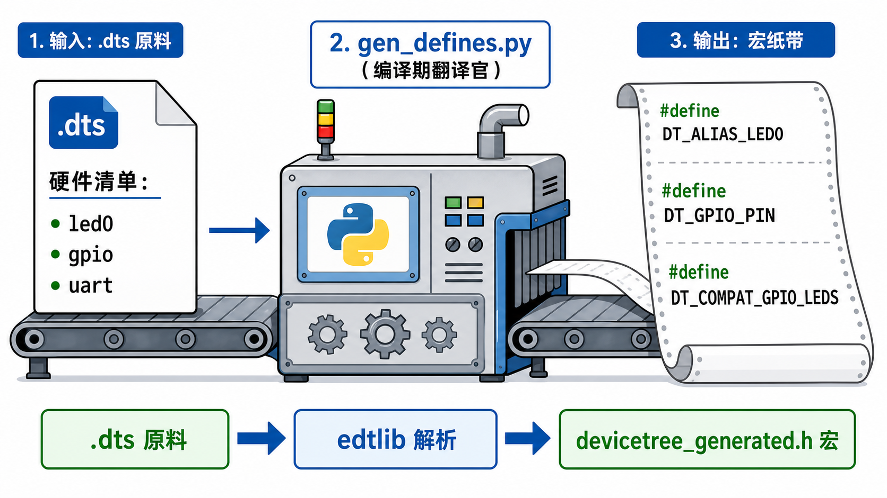

这就是 `gen_defines.py` 的角色——**编译期翻译官**。你的 `.dts` 文件在 `west build` 的前几秒被这个 Python 脚本吃掉，吐出一个纯 C 头文件 `devicetree_generated.h`。里面没有一行 `malloc`，没有一个字符串比较——全是 `#define` 常量。

回想 Ch5 §3.5 你学的"数据归位"——四类数据各有各的家。其中"不变数据"就该进 ROM。设备树描述的就是硬件——芯片出厂时引脚已经固定，板子上哪颗传感器焊在哪个 I2C 地址上终身不变。既然是"终身不变"的数据，为什么要在运行时查字符串？Zephyr 的做法干净利落：**在编译期就把设备树的每一片叶子变成 `static const` 结构体字段，塞进 `.rodata` 段。** 当你的二进制跑起来时，设备树已经不存在了——它变成了 ROM 里的纯数据。不占 RAM，不耗 CPU 去解析，不产生任何运行时字符串比较。

这就是 Ch5 §4.2 "数据按生命周期分级"的编译期终极实践——该进 ROM 的绝不进 RAM。

### 7.2 DT_宏的本质：俄罗斯套娃式的 token 拼接接力

打开 `devicetree_generated.h`，你会看到这样的宏：

```c
#define DT_NODELABEL(led_0)     DT_N_S_leds_S_led_0
#define DT_N_S_leds_S_led_0_P_gpios_CONTROLLER    "gpio@40020000"
#define DT_N_S_leds_S_led_0_P_gpios_PIN            5
#define DT_N_S_leds_S_led_0_P_gpios_FLAGS           0
```

你写了一个节点标签 `led_0`，代码里用 `DT_NODELABEL(led_0)` 引用它。这个宏展开后是一个更长的 token `DT_N_S_leds_S_led_0`——但故事没完。这个 token 本身又是一个宏名，继续展开会变成 `DT_N_S_leds_S_led_0_P_gpios_CONTROLLER` 的地址、`.pin` 的初值、`.flags` 的初值……

这就是俄罗斯套娃。你打开第一个娃娃（`DT_NODELABEL(led_0)`），里面是一个带路径的 token；你再打开这个 token（`DT_N_S_leds_S_led_0`），里面是各类属性的具体值——一层套一层，最终套到底层是一个 `static const struct gpio_dt_spec { .port = ..., .pin = 5, .dt_flags = 0 }` 的结构体字面量。

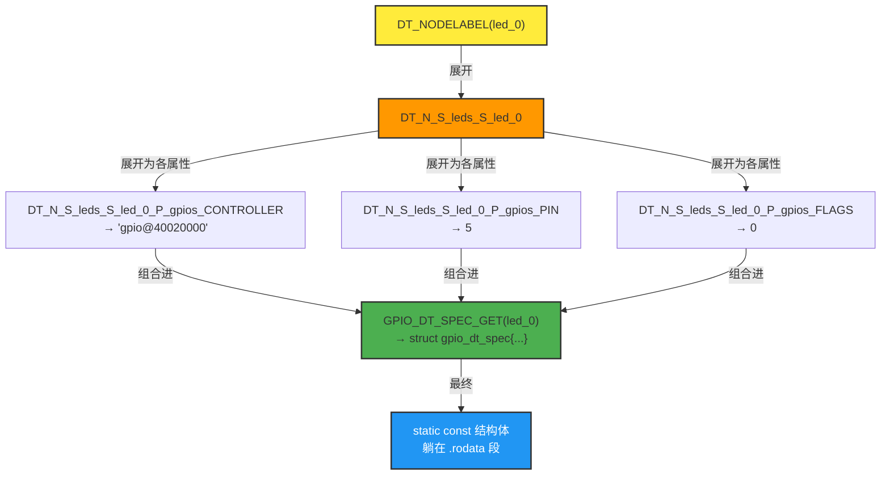
```mermaid
graph TD
    A["DT_NODELABEL(led_0)"] -->|展开| B["DT_N_S_leds_S_led_0"]
    B -->|展开为各属性| C1["DT_N_S_leds_S_led_0_P_gpios_CONTROLLER<br/>→ 'gpio@40020000'"]
    B -->|展开为各属性| C2["DT_N_S_leds_S_led_0_P_gpios_PIN<br/>→ 5"]
    B -->|展开为各属性| C3["DT_N_S_leds_S_led_0_P_gpios_FLAGS<br/>→ 0"]
    C1 -->|组合进| D["GPIO_DT_SPEC_GET(led_0)<br/>→ struct gpio_dt_spec{...}"]
    C2 -->|组合进| D
    C3 -->|组合进| D
    D -->|最终| E["static const 结构体<br/>躺在 .rodata 段"]

    style A fill:#FFEB3B,stroke:#333,stroke-width:2px
    style B fill:#FF9800,stroke:#333,stroke-width:2px
    style D fill:#4CAF50,stroke:#333,stroke-width:2px
    style E fill:#2196F3,stroke:#333,stroke-width:2px,color:#fff
```

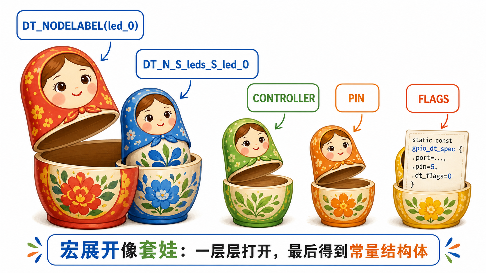

整个链条就是 C 预处理器的 token 拼接接力——用 `##` 运算符一层层把路径名拼成 define 名。Ch5 §1.3 你写 ops 表时做的是"把函数指针陈列在结构体里"，设备树做的是"把硬件信息编译进常量表里"——本质同一件事：**数据驱动行为，编译期定型。**

> 💡 **Ch5 回扣**：还记得 Ch5 §7.6 你手写的那份"设备树"吗？你是一个 `boards/stm32f4_disco.h` + `#ifdef BOARD_xxx` 方案管理硬件差异。Zephyr 的设备树是那个方案的工业升级版：用 `.dts` 声明硬件（比你的 `#define` 表更结构化），用 Python 脚本生成 C 宏（比你的 `#ifdef` 穷举更自动），最终效果一致——把硬件差异锁在编译期。

### 7.3 四步流水线：从文本到ROM数据

你可以把整套流程画成一条流水线，每一步都是纯编译期操作：

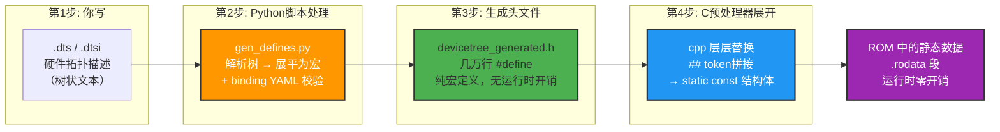
```mermaid
graph LR
    subgraph "第1步: 你写"
        A[".dts / .dtsi<br/>硬件拓扑描述<br/>（树状文本）"]
    end
    subgraph "第2步: Python脚本处理"
        B["gen_defines.py<br/>解析树 → 展平为宏<br/>+ binding YAML 校验"]
    end
    subgraph "第3步: 生成头文件"
        C["devicetree_generated.h<br/>几万行 #define<br/>纯宏定义，无运行时开销"]
    end
    subgraph "第4步: C预处理器展开"
        D["cpp 层层替换<br/>## token拼接<br/>→ static const 结构体"]
    end
    E["ROM 中的静态数据<br/>.rodata 段<br/>运行时零开销"]

    A --> B --> C --> D --> E

    style B fill:#FF9800,stroke:#333,stroke-width:2px,color:#fff
    style C fill:#4CAF50,stroke:#333,stroke-width:2px
    style D fill:#2196F3,stroke:#333,stroke-width:2px,color:#fff
    style E fill:#9C27B0,stroke:#333,stroke-width:2px,color:#fff
```

**第 1 步**：你写 `.dts` 描述硬件拓扑——芯片有几个 SPI 控制器、I2C 总线上挂着哪些传感器、哪个 GPIO 口连着用户的 LED。这是人类可读的树状文本。

**第 2 步**：`gen_defines.py` 吃进 .dts + binding YAML（你写驱动时定义的 `compatible` 属性说明书），吐出 `devicetree_generated.h`。脚本做了三件事：(a) 解析树状结构 (b) 用 binding YAML 校验属性类型——如果 `gpios` 声明了 `required: true` 但 .dts 没写，构建直接报错 (c) 把树展平为宏。

**第 3 步**：你得到 `devicetree_generated.h`——一个几万行的头文件。每一个设备树节点、每一个属性、每一个 phandle 引用都变成了一个 `#define`。读这个文件你会被宏名长度吓到——`DT_N_S_soc_S_i2c_40003000_S_lm75_48_P_int_gpios_CONTROLLER`——别怕，没有人需要逐行读它，编译器替你处理。

**第 4 步**：C 预处理器把宏一层层展开。`##` token 拼接把路径名拼成字段初值，最终结果是一个 `static const` 的结构体数组躺在 `.rodata` 段里。不占 RAM。零运行时开销。

下面这张图从 Ch5 的"数据归位"角度重新看这四步流水线，让你理解编译期处理不是技术花招，而是内存管理的必修课。

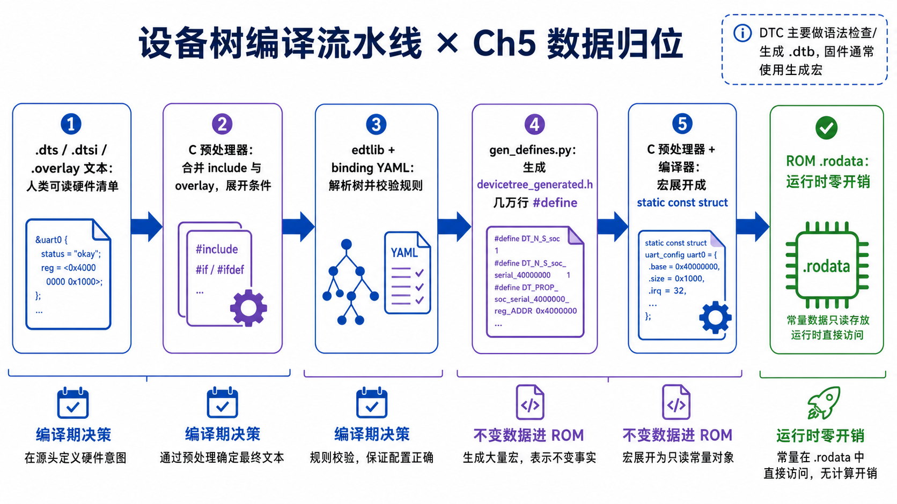

> 四条流水线和 Ch5 §4.2 的"四类数据归位"属于一对儿——Ch5 教你"数据该放哪"，设备树流水线告诉你"数据是怎么生成到那去的"。

### 7.4 compatible→driver match：编译期的"相亲大会"

最后也是最关键的一步：.dts 里的 `compatible = "gpio-leds"` 是怎么和驱动文件里的 `#define DT_DRV_COMPAT gpio_leds` 对上号的？

想象一个相亲大会：主办方在系统里录入了所有报名者的条件——"要求有房的"（`compatible = "gpio-leds"`）、"要求有车的"（`compatible = "st,lis3dh"`）……同时也有所有应征者的资料——`DT_DRV_COMPAT` 声明自己能满足什么条件。主办方的软件（`gen_defines.py`）在相亲大会开始前（编译期）就把匹配完成了——每个条件匹配到的应征者，自动生成"互选成功"的实例化宏。

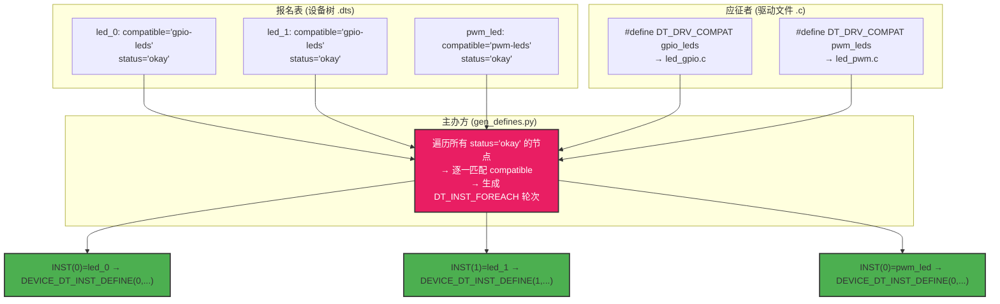
```mermaid
graph TB
    subgraph "报名表 (设备树 .dts)"
        N1["led_0: compatible='gpio-leds'<br/>status='okay'"]
        N2["led_1: compatible='gpio-leds'<br/>status='okay'"]
        N3["pwm_led: compatible='pwm-leds'<br/>status='okay'"]
    end

    subgraph "应征者 (驱动文件 .c)"
        D1["#define DT_DRV_COMPAT gpio_leds<br/>→ led_gpio.c"]
        D2["#define DT_DRV_COMPAT pwm_leds<br/>→ led_pwm.c"]
    end

    subgraph "主办方 (gen_defines.py)"
        M["遍历所有 status='okay' 的节点<br/>→ 逐一匹配 compatible<br/>→ 生成 DT_INST_FOREACH 轮次"]
    end

    N1 --> M
    N2 --> M
    N3 --> M
    D1 --> M
    D2 --> M

    M --> R1["INST(0)=led_0 → DEVICE_DT_INST_DEFINE(0,...)"]
    M --> R2["INST(1)=led_1 → DEVICE_DT_INST_DEFINE(1,...)"]
    M --> R3["INST(0)=pwm_led → DEVICE_DT_INST_DEFINE(0,...)"]

    style M fill:#E91E63,stroke:#333,stroke-width:2px,color:#fff
    style R1 fill:#4CAF50,stroke:#333,stroke-width:2px
    style R2 fill:#4CAF50,stroke:#333,stroke-width:2px
    style R3 fill:#4CAF50,stroke:#333,stroke-width:2px
```

在驱动源码里，`DT_DRV_COMPAT` 一行包含的信息量远超你的直觉：

```c
// 驱动文件 led_gpio.c 第7行
#define DT_DRV_COMPAT gpio_leds
//             ↑
//  告诉 gen_defines.py：
//  "所有 compatible='gpio-leds' 的节点，都按这份驱动的格式生成宏"
```

然后驱动文件末尾的 `DT_INST_FOREACH_STATUS_OKAY(LED_GPIO_DEVICE)` 会在编译期把每一个 status 为 "okay" 的匹配节点轮一遍——展开成多个 `DEVICE_DT_INST_DEFINE` 调用。这里的关键词是"编译期轮一遍"——不是运行时 for 循环，是预处理器一次性展开。每个节点实例生成一个独立的 `struct device` 全局变量。

> 💡 **Ch5 回扣**：Ch5 §2.2 你学到的"同一个 struct 模板生产多个对象"，在这里叫"同一个 compatible 实例化多个设备"——换个说法，同一件事情。你在 v6 里 `struct led_base base` 嵌在多个子类里，Zephyr 用 `DT_INST_FOREACH_STATUS_OKAY` 和 `DEVICE_DT_INST_DEFINE` 自动生成多个 device 实例。你的手写 for 循环 vs Zephyr 的宏展开——骨架一致，自动化程度不同。

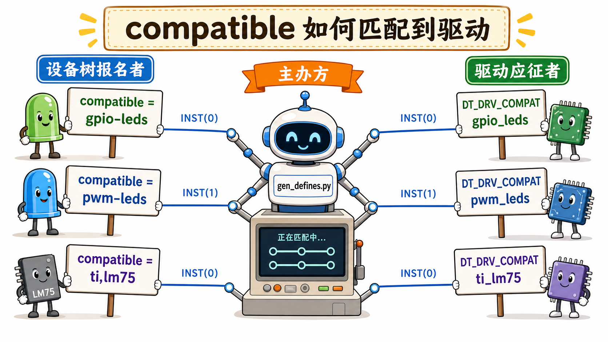

### 跟演：用一个最简单的宏走一遍完整展开过程

在你继续深入 `struct device` 之前——先停一下。拿一支铅笔和一张纸，跟我把下面这一行宏从头到尾展开一遍：

```c
GPIO_DT_SPEC_GET(DT_NODELABEL(led0), gpios)
```

这一行在你 v1 的 `main.c` 里就出现了。它看起来简短，背后却藏着设备树宏体系的全部秘密——俄罗斯套娃、token 拼接、编译期结构体聚合。下面我们拆成三层，一层一层手动展开。

#### 第一层：DT_NODELABEL(led0) → 路径 token

`DT_NODELABEL()` 是最常用的设备树宏之一。它接收一个节点标签（node label，就是 .dts 里冒号前面的名字），返回一个"路径 token"——一个预处理器可识别的标识符。

在 `stm32f4_disco.dts` 里，`led0` 是一个 alias，指向了 `&green_led_4`（路径大致是 `/leds/led_4`）。`DT_NODELABEL(led0)` 展开后得到一个以 `DT_N_` 开头、路径中每个节点名用 `_S_` 分隔的 token：

```
DT_NODELABEL(led0)  →  DT_N_S_leds_S_led_4
```

你可以在 `devicetree_generated.h` 里找到这个宏定义——它可能是直接定义，也可能是通过 alias 链间接指向的。关键点：**这还只是一个名字，还没有取任何值。**

#### 第二层：拼出属性宏名_xxx_P_gpios_xxx → 拿具体值

`GPIO_DT_SPEC_GET(node_id, prop)` 宏做的第一件事，就是拿 `node_id`（你已经展开成 `DT_N_S_leds_S_led_4`）和属性名 `gpios` 做 token 拼接：

```c
// GPIO_DT_SPEC_GET 内部大致等价于（简化）：
#define GPIO_DT_SPEC_GET(node_id, prop)                                     \
    {                                                                       \
        .port = DEVICE_DT_GET(DT_GPIO_CTLR(node_id, prop)),                \
        .pin  = DT_GPIO_PIN(node_id, prop),                                 \
        .dt_flags = DT_GPIO_FLAGS(node_id, prop),                           \
    }
```

三个子宏继续拼接：

```
DT_GPIO_CTLR(DT_N_S_leds_S_led_4, gpios)
  → 拼接 token: DT_N_S_leds_S_led_4_P_gpios_CONTROLLER
  → 展开为: "gpio@40020000" （一个字符串，代表控制器标识）

DT_GPIO_PIN(DT_N_S_leds_S_led_4, gpios)
  → 拼接 token: DT_N_S_leds_S_led_4_P_gpios_PIN
  → 展开为: 12

DT_GPIO_FLAGS(DT_N_S_leds_S_led_4, gpios)
  → 拼接 token: DT_N_S_leds_S_led_4_P_gpios_FLAGS
  → 展开为: 0 （GPIO_ACTIVE_HIGH 宏的展开值）
```

现在你已经有了三个原始值：控制器标识符 `"gpio@40020000"`、引脚号 `12`、标志位 `0`。

#### 第三层：DEVICE_DT_GET → 找到 struct device 指针

最巧妙的是 `.port` 的取值。`DEVICE_DT_GET(DT_N_S_leds_S_led_4_P_gpios_CONTROLLER)` 不是一个字符串赋值——它是把"gpio@40020000"这个字符串当作设备树节点标识符，**在编译期找到对应的 `struct device` 指针**。

```c
DEVICE_DT_GET(DT_NODELABEL(gpiod))
  →  &__device_dts_ord_XX  // 某个具体的全局 device 变量地址
```

这就是为什么 `.port` 是 `const struct device *` 类型——它指向 GPIO 控制器（比如 GPIOD）的 device 对象，而不是一个字符串。

#### 最终结果：一个完整的结构体初始值

把三层展开的结果拼在一起：

```c
GPIO_DT_SPEC_GET(DT_NODELABEL(led0), gpios)

// 三层展开后等价于：
{
    .port     = &__device_dts_ord_XX,  // GPIO 控制器的 device 指针
    .pin      = 12,                     // 引脚号
    .dt_flags = 0,                      // GPIO_ACTIVE_HIGH 展开值
}

// 类型是：
static const struct gpio_dt_spec led = { .port = ..., .pin = 12, .dt_flags = 0 };
```

**全程没有一次函数调用、没有一次运行时字符串解析、没有一次 malloc。** 100% 编译期展开，最终是一个躺在 `.rodata` 段的结构体常量。

下面这张图把你纸上推演的三层展开过程可视化出来。

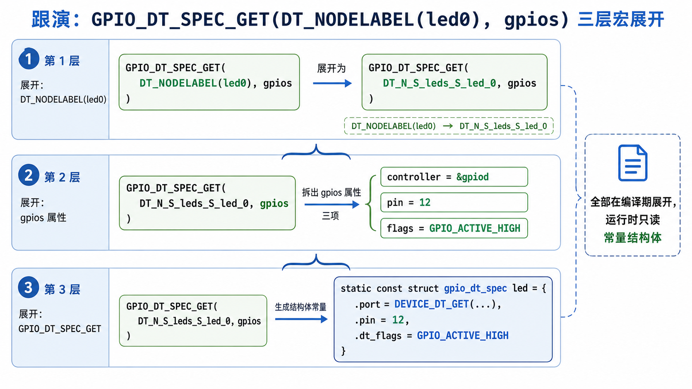

> **停下来摸一摸键盘上的 C 预处理器**——你现在理解了 Zephyr 驱动系统最神秘的一层。后续 `struct device`、`DEVICE_DT_DEFINE`、`DT_INST_FOREACH` 全部建立在这个 token 拼接接力之上。Ch5 中你学"宏不是魔法，是文本替换"，这里你把文本替换用到极致——用宏在编译期搭出了一套设备管理系统。

## 8 struct device：Zephyr的"万物皆对象"

### 8.1 回顾Ch5你推的"父类"——你家作坊自制的工牌

你还记得 Ch5 §2.2 你手搓的第一个"父类"吗？那个只有两个字段的 `struct led`：

```c
struct led {
    const char *name;   // 灯的名字
    bool is_on;         // 当前亮灭状态
};
```

然后 Ch5 §4.2 你加入 ops 虚表指针变成手搓工程版，Ch5 §4.4 你做了继承版 `struct led_base`，到了 Ch5 §7 你的五层架构里，"父类"已经演化为：

```c
struct led_base {
    const char *name;         // 设备名——"你家作坊自制的工牌"
    const struct led_ops *ops; // 虚表——"技能清单"
    void *data;               // 私有数据——"私人抽屉"
};
```

这就是你家作坊自制的工牌系统——每个 LED 都挂一个工牌，工牌上写着名字和能干什么活。所有具体 LED（GPIO LED、PWM LED、I2C LED 扩展芯片）都内嵌这个 `struct led_base`，通过上转型（`&led_gpio->base`）统一操作。

下面这张图把 Ch5 手搓版 `struct led_base` 到 Zephyr 工业版 `struct device` 的演变过程画出来——从 3 个字段的教学版到 7 个字段的工业量产版，骨架完全一致。

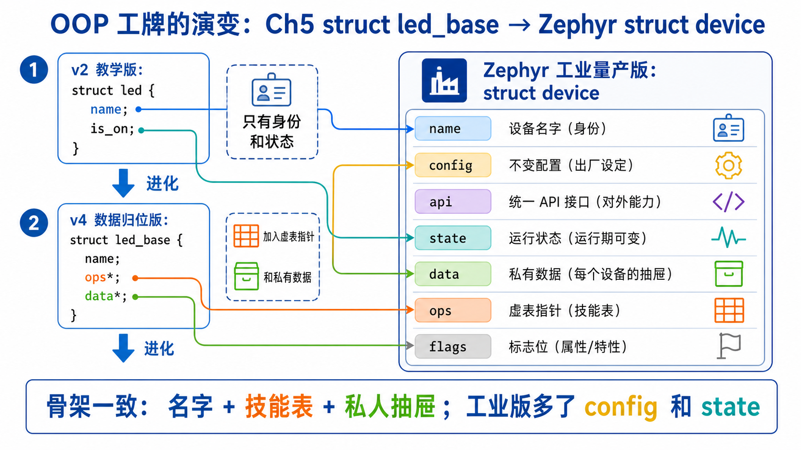

Zephyr 的 `struct device` 就是这个"自家工牌"的**工业量产版**。内核里所有东西——GPIO 控制器、UART、I2C、SPI、传感器、定时器、LED、DMA、Flash、看门狗——统统内嵌一个 `struct device`。500+ 种不同类型的设备，共用 6 个字段的结构体。

```c
// include/zephyr/device.h  — Zephyr v3.7.0 真实源码
struct device {
    const char *name;               // 设备名字符串，"LED_0"
    const void *config;             // 出厂参数，不可变（引脚号、时钟频率、I2C地址）
    const void *api;                // 虚表指针（ops 结构体）
    struct device_state *state;     // 框架运行态（初始化是否完成、错误码）
    void *data;                     // 驱动私有数据（RAM 运行态）
    struct device_ops ops;          // 设备操作（init/deinit 函数）
    device_flags_t flags;           // 标志位（如延迟初始化）
    // ... 还有可选的 deps、pm 等字段
};
```

下面我们逐个解剖这五个核心字段——每个字段在 Ch5 里都有精确对应，每个字段背后都有一个生活比喻。

### 8.2 五个字段逐个解剖——每人一个生活比喻


#### name —— "工牌上的名字"

```c
const char *name;   // 指向 .rodata 段的字符串字面量
```

这就是 Ch5 §2.1 你 `struct led` 里的 name 字段，一字不差——工业版只是把 `char name[16]` 改成了指针，因为实际名称由设备树宏 `DEVICE_DT_NAME(node_id)` 生成，编译期就躺在 ROM 里。`name` 是你在调试 log 里看到的那个字符串：`<err> led_gpio: LED_0: GPIO device not ready`。

#### config —— "出厂说明书（ROM，终身不改）"

```c
const void *config;  // const void* — 既不能改指针指向，也不能写内容
```

想象你买了一台微波炉——侧面贴着一张贴纸，写着"额定功率 800W，电压 220V，生产日期 2024 年 3 月"。这张贴纸是出厂时就贴好的，你微波炉用到报废也不会改上面任何一个字。

`config` 就是这张出厂说明书。对于 GPIO LED 驱动，`config` 指向的结构体里存的是：

```c
// 来自 led_gpio.c — 真实源码
struct led_gpio_config {
    size_t num_leds;                    // 板上有几颗 LED
    const struct gpio_dt_spec *led;     // 每颗 LED 用哪个 GPIO 口
};

// gpio_dt_spec 的定义（来自 gpio.h）
struct gpio_dt_spec {
    const struct device *port;          // GPIO 控制器设备指针（比如 GPIOA）
    gpio_pin_t pin;                     // 引脚号（5 = Pin5）
    gpio_dt_flags_t dt_flags;           // 标志位（上拉/下拉/开漏/初始电平）
};
```

所有这些数据都在编译期由设备树宏填入，运行时只读不写。`const void *` 的双 const 保证了：你不小心写 `dev->config = xxx` 会编译报错（违反顶层的 const），你也不能通过 `dev->config` 修改它指向的内容（违反底层的 const）。这就是 Ch5 §4.1 "不变数据"在工业代码里的类型级强制。

#### api —— "技能表指针（能干什么活）"

```c
const void *api;  // 擦成 void*，因为不同子系统类型不同——§8.3 细讲
```

就是你 Ch5 §4.3、§4.4 手搓的那个 `struct led_ops *ops` 虚表指针。指向一个函数指针结构体——LED 子系统指向 `struct led_driver_api`，Sensor 子系统指向 `struct sensor_driver_api`。你在 Ch5 用 3 个函数指针，Zephyr 一个子系统 5~8 个——套路上完全一致。

#### state —— "考勤状态（今天来没来）"

```c
struct device_state *state;  // 框架级运行态
// 其中 device_state 定义为：
struct device_state {
    uint8_t init_res;          // 初始化返回值（正值的 errno 码）
    bool initialized : 1;      // 初始化完成了没
};
```

`state` 不是你驱动写的——是框架帮你管的。启动时 `device_init()` 遍历 init 链表，每个设备调用 `init_fn`，结果存到 `state->init_res`。应用层用 `device_is_ready(dev)` 查的就是 `state->initialized` 这个 bit。

比喻：公司考勤系统。你今天来没来上班（initialized），如果来了有没有什么特殊情况（init_res 记录初始化错误码），不是你自己说的——是打卡机（框架）给你记录的。

#### data —— "私人抽屉（RAM 运行态）"

```c
void *data;  // 驱动自己想存什么存什么，框架不关心
```

这就是 Ch5 §3.3 你用 `static` 保护的那些变量——运行时状态、缓冲、锁、线程句柄。和 Ch5 不同的是，Zephyr 用"挂在 device 上"代替 `static` 全局变量——每个设备实例有自己的 `data`，天然实例隔离。

对比 LM75 驱动的 `data` 结构体：

```c
// lm75.c 真实源码
struct lm75_data {
    int16_t temp;                       // 最近一次温度读数
    const struct device *dev;           // 自指回 device（中断回调要用）
    struct k_work work;                 // 工作队列项
    struct gpio_callback int_gpio_cb;   // GPIO 中断回调结构体
    const struct sensor_trigger *trigger;
    sensor_trigger_handler_t trigger_handler;
    K_KERNEL_STACK_MEMBER(stack, ...);  // 自己的线程栈
};
```

`data` 里放线程栈、互斥锁、回调结构体——全是你驱动运行时要写的东西。`config` 放不变的硬件参数，`data` 放变化的运行数据——再一次，Ch5 §4.1 "区分不变与可变"在 500+ 个驱动里被当成铁律遵守。

> 💡 **Ch5 回扣**：你的 v4（数据归位版）用 `static const` 保护不变数据、用 `static` 限定运行时变量——Zephyr 把这两个概念提升为 `dev->config`（ROM）和 `dev->data`（RAM）的类型级区分。读完 Ch5 §3.5 再看这个设计，你会点着头说"对，就该是这样"。

### 8.3 api 为什么是 void*？——万能插座的哲学

你第一眼看到 `const void *api` 可能会皱眉："存函数指针表为什么要擦成 `void *`？直接用 `struct led_driver_api *` 不行吗？"

答案在于**子系统多样性**。看看两个不同子系统的 ops 表：

```c
// LED 子系统的虚表 — include/zephyr/drivers/led.h
__subsystem struct led_driver_api {
    led_api_on on;                       // 强制：开灯
    led_api_off off;                     // 强制：关灯
    led_api_set_brightness set_brightness; // 强制之一：调亮度
    led_api_blink blink;                 // 可选：闪烁
    led_api_get_info get_info;           // 可选：查信息
    led_api_set_color set_color;         // 可选：调颜色（RGB）
    led_api_write_channels write_channels; // 可选：通道写
};

// Sensor 子系统的虚表 — include/zephyr/drivers/sensor.h
__subsystem struct sensor_driver_api {
    sensor_attr_set_t attr_set;          // 可选：设属性
    sensor_attr_get_t attr_get;          // 可选：读属性
    sensor_trigger_set_t trigger_set;    // 可选：配置阈值触发
    sensor_sample_fetch_t sample_fetch;  // 强制：采集数据
    sensor_channel_get_t channel_get;    // 强制：读通道值
    sensor_get_decoder_t get_decoder;    // 可选：解码器
    sensor_submit_t submit;              // 可选：RTIO提交
};
```

两套完全不同的类型。如果把 `api` 声明为 `struct led_driver_api *`，那 sensor 驱动就没法用 `struct device` 了。

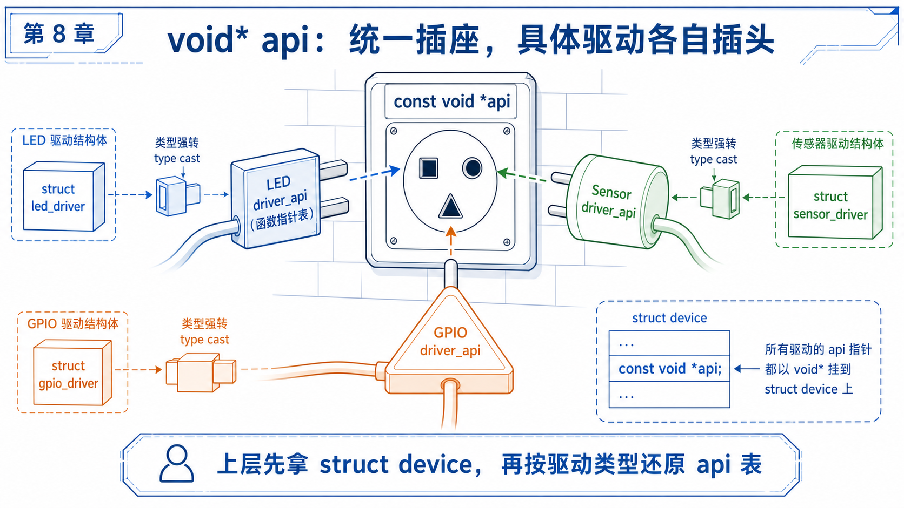

这就是万能插座的哲学。你出国旅行带一个万能转换插头——无论欧洲的圆孔、中国的扁孔、英国的品字形，插上去都能用。`void *` 就是这个万能插头。使用的时候由子系统头文件强转回来：

```c
// led.h — 公共API层，把 void* 转回具体类型
static inline int z_impl_led_on(const struct device *dev, uint32_t led)
{
    const struct led_driver_api *api =
        (const struct led_driver_api *)dev->api;  // ← 万能插头 → 具体插座
    // 框架做好了 null 检查和处理策略（见§9.3）
    if (api->set_brightness == NULL && api->on == NULL) {
        return -ENOSYS;
    }
    if (api->on == NULL) {
        return api->set_brightness(dev, led, LED_BRIGHTNESS_MAX);
    }
    return api->on(dev, led);
}
```

> 💡 **Ch5 回扣**：这就是 Ch5 §5.3 "上转型后，通过强转拿回子类信息"的工业镜像。Ch5 你用 `(struct led_gpio *)me` 从父指针找回子指针，Zephyr 用 `(const struct led_driver_api *)dev->api` 从万能指针找回特定 ops 表——原理一字不差。

### 8.4 大对照表 + 内存布局图

| Ch5 教学版 | Zephyr 工业版 | 本质 |
|------------|--------------|------|
| `struct led_base { name, ops, data }` | `struct device { name, api, data }` | 通用父类/工牌 |
| `struct led_gpio { struct led_base base; int pin; }` | `struct led_gpio_config { ... }` — 挂在 `dev->config` 上 | 子类出厂参数 |
| `struct led_pca_data { int brightness; ... }` | `struct led_gpio_config {...}` — 挂在 `dev->data` 上 | 子类运行数据 |
| `struct led_ops *ops` (3 个函数指针) | `struct led_driver_api *api` (7 个函数指针) | 虚表指针 |
| `led_init(&led_pca->base, "LED_PCA", &ops)` | `DEVICE_DT_DEFINE(...)` — 编译期一步到位 | 构造初始化 |
| `&led_pca->base` 传给 `led_on()` | `const struct device *dev` 传给 `led_on()` | 上转型 |
| `container_of(me, struct led_gpio, base)` | `dev->data` / `dev->config` — 框架直接给你 | 找回子类 |

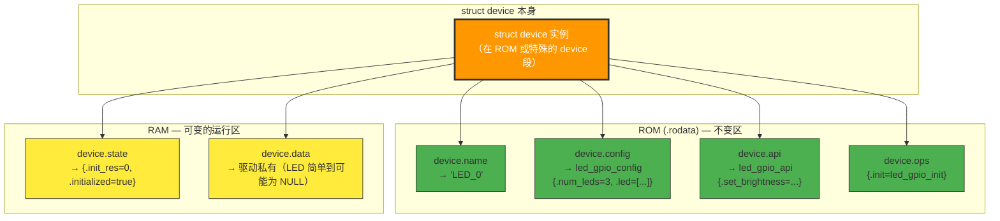
```mermaid
graph TB
    subgraph "ROM (.rodata) — 不变区"
        DEVNAME["device.name<br/>→ 'LED_0'"]
        CONFIG["device.config<br/>→ led_gpio_config<br/>{.num_leds=3, .led=[...]}"]
        API["device.api<br/>→ led_gpio_api<br/>{.set_brightness=...}"]
        OPS["device.ops<br/>{.init=led_gpio_init}"]
    end

    subgraph "RAM — 可变的运行区"
        STATE["device.state<br/>→ {.init_res=0, .initialized=true}"]
        DATA["device.data<br/>→ 驱动私有（LED 简单到可能为 NULL）"]
    end

    subgraph "struct device 本身"
        DEV["struct device 实例<br/>（在 ROM 或特殊的 device 段）"]
    end

    DEV --> DEVNAME
    DEV --> CONFIG
    DEV --> API
    DEV --> OPS
    DEV --> STATE
    DEV --> DATA

    style DEV fill:#FF9800,stroke:#333,stroke-width:3px,color:#fff
    style DEVNAME fill:#4CAF50,stroke:#333
    style CONFIG fill:#4CAF50,stroke:#333
    style API fill:#4CAF50,stroke:#333
    style OPS fill:#4CAF50,stroke:#333
    style STATE fill:#FFEB3B,stroke:#333
    style DATA fill:#FFEB3B,stroke:#333
```

一眼看懂：五个指针里有三个（name, config, api）指向 ROM 数据，两个（state, data）指向 RAM。ROM 里的东西由设备树宏在编译期生成，RAM 里的东西由驱动在 init 函数里初始化——完美对应 Ch5 §4.1 "四类数据的生命周期管理"。

下面这张图把 Ch5 全书的 OOP 概念做了一次"工业兑现全景映射"——每一个你在 Ch5 手写的概念，在 Zephyr 的 struct device 体系里都有精确对应。

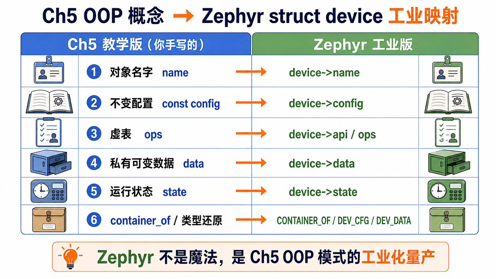

---

## 9 driver_api：Ch5虚表的工业实现

### 9.1 LED 子系统：led_driver_api 完整解剖

打开 Zephyr 上游源码 `include/zephyr/drivers/led.h`，你会看到如下定义（v3.7.0 真实源码）：

```c
__subsystem struct led_driver_api {
    led_api_on on;
    led_api_off off;
    led_api_set_brightness set_brightness;
    led_api_blink blink;
    led_api_get_info get_info;
    led_api_set_color set_color;
    led_api_write_channels write_channels;
};
```

门口的 `__subsystem` 宏不是装饰——它是 **driver_ops 的标记宏**，告诉文档生成系统："这里定义的是一个子系统 API 表"。你在 Ch5 §2.4 手写了 `struct led_ops { int (*on)(...); int (*off)(...); int (*set_brightness)(...); }`——Zephyr 的 `struct led_driver_api` 是你教学版的工业量产：从 3 个函数指针变成 7 个，加上了 `typedef` 提升可读性，加上了文档注释和 mandatory/optional 分组——但骨架 100% 是 Ch5 §2.1 那张 ops 表。

### 9.2 dispatch 路径：led_on(dev, 0) → 最终调了谁？

当你写 `led_on(dev, 0)` 时发生了什么？跟踪完整链路——把它想象成一个"总机转接"过程：

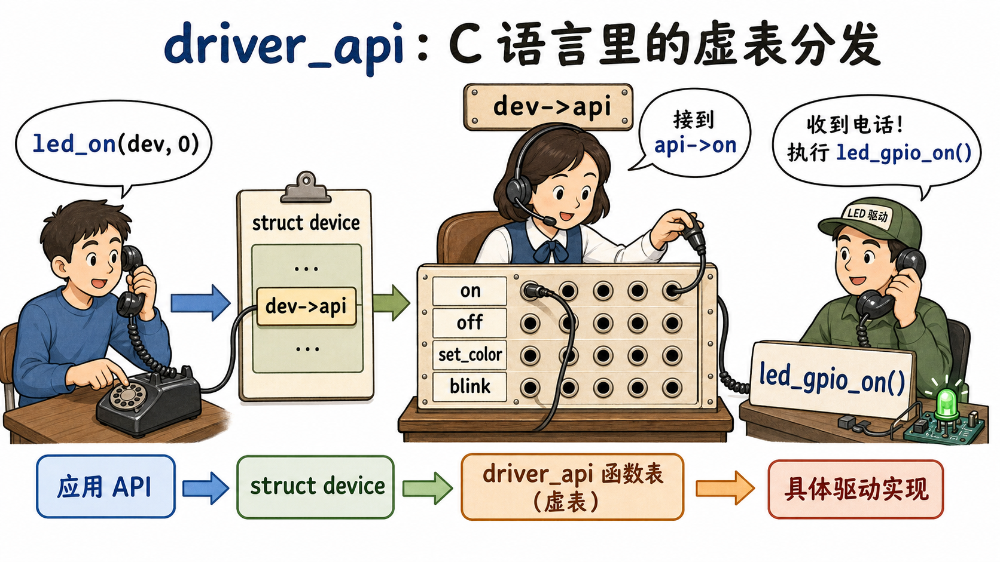

**完整五步链路：**

```c
// 第1步：你写的应用代码
led_on(dev, 0);

// 第3步：z_impl 层 — 总机接线员
static inline int z_impl_led_on(const struct device *dev, uint32_t led)
{
    const struct led_driver_api *api =
        (const struct led_driver_api *)dev->api;
    if (api->set_brightness == NULL && api->on == NULL) {
        return -ENOSYS;
    }
    if (api->on == NULL) {
        return api->set_brightness(dev, led, LED_BRIGHTNESS_MAX);
    }
    return api->on(dev, led);
}

// 第4步：具体驱动的 on 函数
static int led_gpio_set_brightness(const struct device *dev,
                                    uint32_t led, uint8_t value)
{
    const struct led_gpio_config *config = dev->config;
    const struct gpio_dt_spec *led_gpio;
    if (led >= config->num_leds) return -EINVAL;
    led_gpio = &config->led[led];
    return gpio_pin_set_dt(led_gpio, value > 0);
}
```

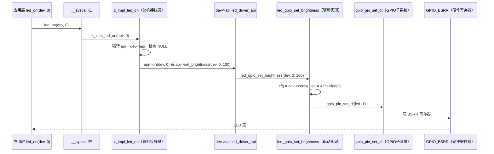
```mermaid
sequenceDiagram
    participant App as 应用层 led_on(dev, 0)
    participant Syscall as __syscall 桩
    participant Impl as z_impl_led_on（总机接线员）
    participant API as dev->api led_driver_api
    participant Drv as led_gpio_set_brightness（驱动实现）
    participant HAL as gpio_pin_set_dt（GPIO子系统）
    participant HW as GPIO_BSRR（硬件寄存器）

    App->>Syscall: led_on(dev, 0)
    Syscall->>Impl: z_impl_led_on(dev, 0)
    Impl->>Impl: 强转 api = dev->api，检查 NULL
    Impl->>API: api->on(dev, 0) 或 api->set_brightness(dev, 0, 100)
    API->>Drv: led_gpio_set_brightness(dev, 0, 100)
    Drv->>Drv: cfg = dev->config, led = &cfg->led[0]
    Drv->>HAL: gpio_pin_set_dt(led, 1)
    HAL->>HW: 写 BSRR 寄存器
    HW-->>App: LED 亮！
```

> 这就是 Ch5 §3.1 多态 dispatch 路径在工业代码里的真实样貌——函数指针没有消失，只是被包在更厚的层里。唯一的区别：你的教学版是 `ops->on(dev, idx)`，Zephyr 是 `api->on(dev, led)`——调用方式一模一样。

### 9.3 可空 ops 的工业策略：-ENOSYS —— "这道菜今天没有"

一个 GPIO LED 驱动不可能实现 `set_color`（它只有开关，没有颜色），也不可能实现 `write_channels`（它不是灯带）。那驱动怎么写？

```c
// led_gpio.c 真实源码 — ops 表实例化
static DEVICE_API(led, led_gpio_api) = {
    .set_brightness = led_gpio_set_brightness,
    // .on = NULL, .off = NULL, .blink = NULL, ...
};
```

留 NULL 就行。关键是 dispatch 层怎么处理 NULL。Zephyr 的做法是**在公共 API 层生成 NULL 检查**，返回 `-ENOSYS`（"Function not implemented"——这道菜今天没有）。


> 💡 **Ch5 回扣**：这就是 Ch5 §7.1 "虚函数不实现的三种策略"里你学到的策略二——"留 NULL + 调用前检查"。工业代码用了一个标准错误码 `-ENOSYS`（和 POSIX 一致），但本质完全一样。

值得注意的是 `led_on` 和 `led_off` 的智能兜底——如果驱动只实现了 `set_brightness` 没实现 `on/off`，框架自动转接：

```c
// on 的智能兜底
if (api->on == NULL) {
    return api->set_brightness(dev, led, LED_BRIGHTNESS_MAX);  // 100% 亮度 = 开
}
// off 同理：
if (api->off == NULL) {
    return api->set_brightness(dev, led, 0);  // 0% 亮度 = 关
}
```

这份"智能"省了你驱动里写 `on/off` 的 4 行代码——反正开关就是亮度 100%/0%。

### 9.4 sensor 子系统同款验证：换个菜单，同一个厨房

翻到 `include/zephyr/drivers/sensor.h`，dispatch 模式同样：

```c
static inline int z_impl_sensor_channel_get(const struct device *dev,
                                            enum sensor_channel chan,
                                            struct sensor_value *val)
{
    const struct sensor_driver_api *api =
        (const struct sensor_driver_api *)dev->api;
    return api->channel_get(dev, chan, val);
}
```

**套路一模一样**——一个子系统定义一个 ops 结构体（虚表），驱动实现它并填到 `dev->api`，dispatch 函数从 `dev->api` 读出并强转调用。

> **换了一张表，骨架不变**——这正是 Ch5 §8.3 结尾那句"你的 OOP 框架不讲外设类型"的意思。

### k_timer：Zephyr 的定时器

在继续进入 Zephyr 驱动的五段结构之前，我们先看一个你马上会用到的基础设施——定时器。Ch6 里你学会了 FreeRTOS 的软件定时器（`xTimerCreate` / `xTimerStart`），在 Zephyr 里对应的叫 `k_timer`。它的用法和设计理念有微妙但重要的差异。

#### k_timer 的基本用法

```c
#include <zephyr/kernel.h>

// 1. 声明一个定时器
struct k_timer my_timer;

// 2. 回调函数 — 在系统时钟中断（system workqueue）上下文执行
void my_timer_handler(struct k_timer *timer) {
    // 注意：回调在中断上下文！不能做阻塞操作
    gpio_pin_toggle_dt(&led);
}

// 3. 初始化 + 启动
void main(void) {
    k_timer_init(&my_timer, my_timer_handler, NULL);

    // 启动：单次模式（duration > 0, period = 0）
    k_timer_start(&my_timer, K_MSEC(1000), K_NO_WAIT);

    // 或者：周期模式（duration > 0, period > 0）
    k_timer_start(&my_timer, K_MSEC(500), K_MSEC(500));
    //                      ↑ 首次延迟     ↑ 周期
}

// 4. 停止
k_timer_stop(&my_timer);
```

#### k_timer 的两大关键差异（vs Ch6 xTimer）

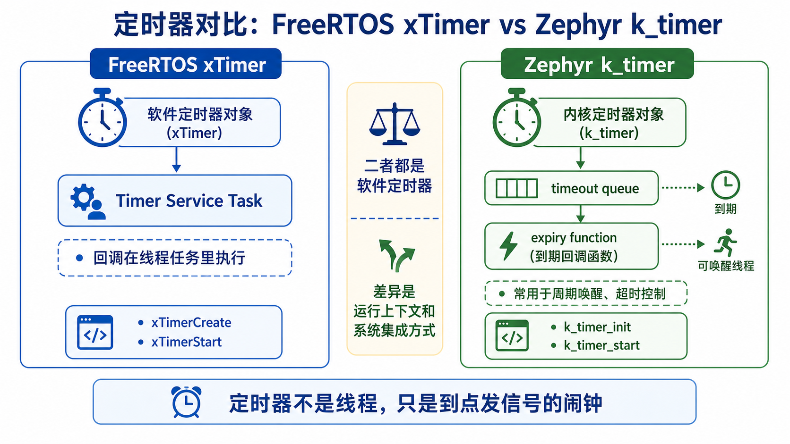

**差异一：回调上下文。** FreeRTOS 的 `xTimer` 回调在 **Timer Service Task** 里执行——它是独立任务，可以调 `vTaskDelay`。Zephyr 的 `k_timer` 回调在**系统时钟中断上下文**执行——不能调 `k_msleep`、不能阻塞。典型用法：回调里只做 `gpio_pin_toggle` 或 `k_work_submit`。

**差异二：定时器对象的位置。** FreeRTOS 的 `xTimerCreate` 在堆上分配。Zephyr 的 `k_timer` 是你自己声明一个 `struct k_timer` 变量——不需要堆分配。

#### 常见模板：在 ISR 中安全地触发线程级处理

```c
struct k_timer sensor_timer;
struct k_work sensor_work;

// 定时器回调（中断上下文）— 只做一件事：提交 work
void sensor_timer_handler(struct k_timer *timer) {
    k_work_submit(&sensor_work);
}

// 工作处理（线程上下文）— 可以阻塞，可以做耗时操作
void sensor_work_handler(struct k_work *work) {
    adc_sample();
    float temp = convert_to_celsius(raw);
    printk("Temperature: %.2f\n", temp);
}

void main(void) {
    k_timer_init(&sensor_timer, sensor_timer_handler, NULL);
    k_work_init(&sensor_work, sensor_work_handler);
    k_timer_start(&sensor_timer, K_NO_WAIT, K_MSEC(500));
}
```

> 💡 **Ch6 回扣**：这个"ISR 提交 work → 线程处理"的模式，等价于 Ch6 §6.3 你学的"中断服务程序只做 xSemaphoreGiveFromISR，真正的处理在任务里"——同一个理念，不同实现。

## 10 驱动生命周期：led_gpio.c 全文走读

Zephyr 驱动的源码不是一行行读的，是按"五段结构"读的。每一段对应 Ch5 里你手搓驱动的一个步骤。下面以 `drivers/led/led_gpio.c`（Zephyr v3.7.0 真实源码）为例，逐段走读。

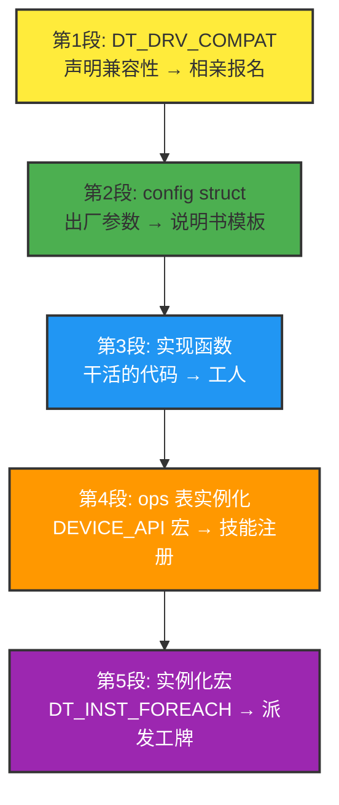
```mermaid
graph TD
    S1["第1段: DT_DRV_COMPAT<br/>声明兼容性 → 相亲报名"]
    S2["第2段: config struct<br/>出厂参数 → 说明书模板"]
    S3["第3段: 实现函数<br/>干活的代码 → 工人"]
    S4["第4段: ops 表实例化<br/>DEVICE_API 宏 → 技能注册"]
    S5["第5段: 实例化宏<br/>DT_INST_FOREACH → 派发工牌"]

    S1 --> S2 --> S3 --> S4 --> S5

    style S1 fill:#FFEB3B,stroke:#333,stroke-width:2px
    style S2 fill:#4CAF50,stroke:#333,stroke-width:2px
    style S3 fill:#2196F3,stroke:#333,stroke-width:2px,color:#fff
    style S4 fill:#FF9800,stroke:#333,stroke-width:2px,color:#fff
    style S5 fill:#9C27B0,stroke:#333,stroke-width:2px,color:#fff
```

下面这张图把五段结构和 Ch5 里你手写驱动的每一步对应起来——教学版里你走了五步，工业版里骨架一模一样。

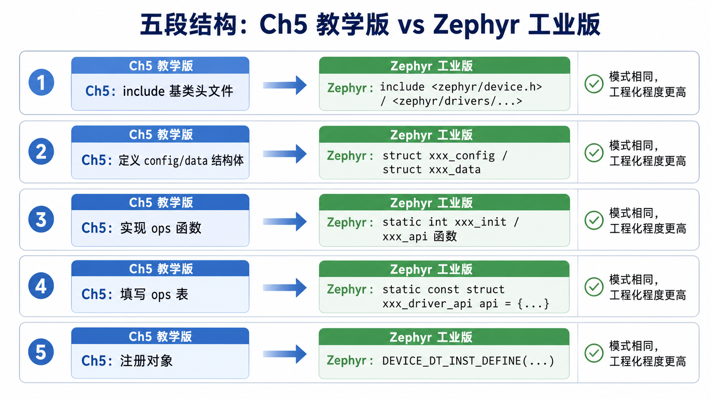

### 10.1 第1段：DT_DRV_COMPAT —— "报名登记"

```c
// led_gpio.c 第7行
#define DT_DRV_COMPAT gpio_leds
```

一行搞定。这和你 Ch5 v6 里 `struct led_gpio` 开头那句 `#include "led_base.h"` 作用相同——声明"我属于 LED 家族"。

### 10.2 第2段：config struct —— 出厂说明书模板

```c
struct led_gpio_config {
    size_t num_leds;
    const struct gpio_dt_spec *led;
};
```

每个设备实例由设备树宏填入具体值。`dev->config` 在运行时指向一个编译期生成的 `static const struct led_gpio_config` 实例。

### 10.3 第3段：实现函数 —— "工人干活的代码"

```c
static int led_gpio_set_brightness(const struct device *dev,
                                    uint32_t led, uint8_t value)
{
    const struct led_gpio_config *config = dev->config;
    const struct gpio_dt_spec *led_gpio;
    if (led >= config->num_leds) return -EINVAL;
    led_gpio = &config->led[led];
    return gpio_pin_set_dt(led_gpio, value > 0);
}
```

三个关键动作：(1) `dev->config` — 取出厂说明书，(2) `config->led[led]` — 定位到具体引脚，(3) `gpio_pin_set_dt` — 委托 GPIO 子系统写硬件。这就是 Ch5 §7.4 Driver 层里你写 `led_pca_set_brightness` 的三个步骤——查配置 → 定位 → 操作硬件。

### 10.4 第2.5段：init 函数 —— "入职体检"

```c
static int led_gpio_init(const struct device *dev)
{
    const struct led_gpio_config *config = dev->config;
    int err = 0;
    if (!config->num_leds) return -ENODEV;
    for (size_t i = 0; (i < config->num_leds) && !err; i++) {
        const struct gpio_dt_spec *led = &config->led[i];
        if (device_is_ready(led->port)) {
            err = gpio_pin_configure_dt(led, GPIO_OUTPUT_INACTIVE);
        } else {
            err = -ENODEV;
        }
    }
    return err;
}
```

`device_is_ready(led->port)` 是关键——它查的是 `state->initialized` bit。因为 GPIO 控制器也是一个 `struct device`，它的 init 必须在 LED 驱动之前完成。

### 10.5 第4段：ops 表实例化 —— "技能注册"

```c
static DEVICE_API(led, led_gpio_api) = {
    .set_brightness = led_gpio_set_brightness,
};
```

和你 Ch5 §2.4 手写的 `static const struct led_ops led_pca_ops = { ... }` 完全对应。

### 10.6 第5段：实例化宏 —— "派发工牌"

```c
#define LED_GPIO_DEVICE(i)                                      \
static const struct gpio_dt_spec gpio_dt_spec_##i[] = {         \
    DT_INST_FOREACH_CHILD_SEP_VARGS(i, GPIO_DT_SPEC_GET, (,), gpios) \
};                                                              \
static const struct led_gpio_config led_gpio_config_##i = {     \
    .num_leds = ARRAY_SIZE(gpio_dt_spec_##i),                   \
    .led = gpio_dt_spec_##i,                                    \
};                                                              \
DEVICE_DT_INST_DEFINE(i, &led_gpio_init, NULL,                   \
              NULL, &led_gpio_config_##i,                        \
              POST_KERNEL, CONFIG_LED_INIT_PRIORITY,              \
              &led_gpio_api);

DT_INST_FOREACH_STATUS_OKAY(LED_GPIO_DEVICE)
```

`DT_INST_FOREACH_STATUS_OKAY(LED_GPIO_DEVICE)` 在编译期遍历所有 `compatible = "gpio-leds"` 且 `status = "okay"` 的节点，展开成多次 `DEVICE_DT_INST_DEFINE` 调用。

### 10.7 DEVICE_DT_DEFINE 一行宏三件事

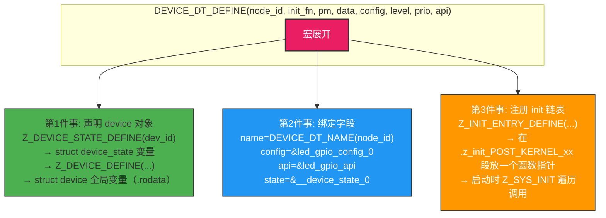
```mermaid
graph TB
    subgraph "DEVICE_DT_DEFINE(node_id, init_fn, pm, data, config, level, prio, api)"
        A["宏展开"]
    end

    A --> B1["第1件事: 声明 device 对象<br/>Z_DEVICE_STATE_DEFINE(dev_id)<br/>→ struct device_state 变量<br/>→ Z_DEVICE_DEFINE(...)<br/>→ struct device 全局变量（.rodata）"]
    A --> B2["第2件事: 绑定字段<br/>name=DEVICE_DT_NAME(node_id)<br/>config=&led_gpio_config_0<br/>api=&led_gpio_api<br/>state=&__device_state_0"]
    A --> B3["第3件事: 注册 init 链表<br/>Z_INIT_ENTRY_DEFINE(...)<br/>→ 在 .z_init_POST_KERNEL_xx 段放一个函数指针<br/>→ 启动时 Z_SYS_INIT 遍历调用"]

    style A fill:#E91E63,stroke:#333,stroke-width:2px,color:#fff
    style B1 fill:#4CAF50,stroke:#333
    style B2 fill:#2196F3,stroke:#333,color:#fff
    style B3 fill:#FF9800,stroke:#333,color:#fff
```

下面这张图把一行宏的三个步骤用放大的方式逐项展开，让你看清宏内部发生了什么。

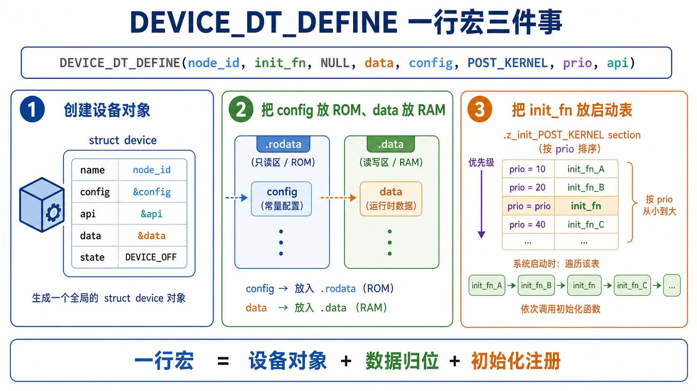

一行宏干了三件事：
1. **生成 `struct device` 实例**——在特殊的链接段声明一个全局 device 对象
2. **绑定所有字段**——name 来自设备树，config 指向你的出厂说明书，api 指向你的技能表
3. **注册进 init 链表**——在 `.z_init_POST_KERNEL_xx` 链接段放一个函数指针，启动时框架自动遍历调用

> 💡 **Ch5 回扣**：Ch5 §5.3 你手动写了三步——`struct led_base led;`（声明）→ `led.name = "LED_PCA";`（填字段）→ `led_init(&led);`（初始化）。DEVICE_DT_DEFINE 一步做完，而且全部在编译期。这就是框架的力量。

---

## 11 手写一个 Zephyr 驱动

### 11.1 v4 demo：custom_led 驱动四步

现在你要手写一个完整的 Zephyr 设备驱动。目标：驱动板上一颗额外的 LED，让它也能被 Zephyr LED API 统一管理。四步走：

**第 1 步：写 binding YAML**

在 `dts/bindings/leds/custom,my-led.yaml`：

```yaml
description: Custom My LED
compatible: "custom,my-led"
include: [base.yaml]
properties:
  gpios:
    type: phandle-array
    required: true
```

**第 2 步：写 overlay**

```dts
/ {
    my_led {
        compatible = "custom,my-led";
        gpios = <&gpioc 7 GPIO_ACTIVE_HIGH>;
    };
};
```

**第 3 步：写 driver.c**（见 §11.3）

**第 4 步：prj.conf 加 `CONFIG_LED=y`**，编译。

这就是你从 Ch5 的"手写 OOP 框架"跳到"用 Zephyr 框架写驱动"的四个动作——步骤数量一样，但每一步都被 Zephyr 的工具链加持。

### 11.2 写 binding YAML：告诉工具链 compatible 长什么样

binding YAML 是给 `gen_defines.py` 的说明书。`compatible: "custom,my-led"` 告诉工具链：".dts 里所有标了这个 compatible 的节点，都按这份说明书来生成宏。"

`properties.gpios` 声明"这个节点需要 gpios 属性"——`required: true` 表示如果 .dts 里没写 gpios，构建直接报错——这比 Ch5 的手工 if 判断强一百倍。

### 11.3 写 driver.c：五段结构最小可跑版

创建 `drivers/led/custom_led.c`：

```c
// ===== 第1段：设备树宏 =====
#define DT_DRV_COMPAT custom_my_led

#include <zephyr/drivers/led.h>
#include <zephyr/drivers/gpio.h>
#include <zephyr/kernel.h>

// ===== 第2段：config —— 出厂说明书 =====
struct custom_led_config {
    struct gpio_dt_spec led;
};

// ===== 第3段：实现函数 —— 干活的代码 =====
static int custom_led_on(const struct device *dev, uint32_t led)
{
    const struct custom_led_config *cfg = dev->config;
    return gpio_pin_set_dt(&cfg->led, 1);
}

static int custom_led_off(const struct device *dev, uint32_t led)
{
    const struct custom_led_config *cfg = dev->config;
    return gpio_pin_set_dt(&cfg->led, 0);
}

// ===== 第4段：ops 表 =====
static const struct led_driver_api custom_led_api = {
    .on  = custom_led_on,
    .off = custom_led_off,
};

// ===== 第5段：设备实例化 =====
#define CUSTOM_LED_INIT(inst)                                           \
    static const struct custom_led_config cfg_##inst = {                \
        .led = GPIO_DT_SPEC_INST_GET(inst, gpios),                      \
    };                                                                  \
    DEVICE_DT_INST_DEFINE(inst, NULL, NULL, NULL,                       \
                  &cfg_##inst, POST_KERNEL,                              \
                  CONFIG_LED_INIT_PRIORITY, &custom_led_api);

DT_INST_FOREACH_STATUS_OKAY(CUSTOM_LED_INIT)
```

每一段都能在 Ch5 找到对应：

| 段 | 代码 | Ch5 对应 |
|:---:|------|---------|
| 1 | `#define DT_DRV_COMPAT` | v6 的 `#include "led_base.h"` |
| 2 | `struct custom_led_config` | v2 的 `struct led_config` |
| 3 | `custom_led_on/off` | v6 的 `led_gpio_on/off` |
| 4 | `struct led_driver_api custom_led_api` | v8 的 `struct led_ops led_gpio_ops` |
| 5 | `DEVICE_DT_INST_DEFINE(...)` | v6 的 `led_init(&led_gpio.base, ...)` |

### 11.4 编译→验证

```bash
west build -b stm32f4_disco -p auto
west flash
```

LED 闪起来。你写了约 35 行 C + 6 行 YAML + 4 行 overlay ≈ 45 行。多加的 15~20 行，换的是工程化的"芯一换，驱动换，应用层一行不动"。

### 11.5 v5 demo：LM75 驱动 → 验证不是 LED 特例

你可能怀疑："这套五段结构是不是 LED 子系统特有的？" 让我们打开 `drivers/sensor/lm75/lm75.c`（Zephyr v3.7.0 真实源码），逐段标注：

```c
// ===== 第1段：compatible 报名 =====
#define DT_DRV_COMPAT lm75

// ===== 第2段：config —— 出厂说明书（I2C 地址、中断引脚） =====
struct lm75_config {
    struct i2c_dt_spec i2c;
    union lm75_reg_config config_dt;
    struct gpio_dt_spec int_gpio;
};

// ===== 第2.5段：data —— 运行时状态 =====
struct lm75_data {
    int16_t temp;
    const struct device *dev;
    struct k_work work;
    struct gpio_callback int_gpio_cb;
    const struct sensor_trigger *trigger;
    sensor_trigger_handler_t trigger_handler;
};

// ===== 第3段：实现函数 =====
static int lm75_sample_fetch(const struct device *dev,
                              enum sensor_channel chan)
{
    struct lm75_data *data = dev->data;
    int16_t temp;
    if (chan != SENSOR_CHAN_ALL && chan != SENSOR_CHAN_AMBIENT_TEMP)
        return -ENOTSUP;
    int ret = lm75_temp_read(dev, LM75_REG_TEMP, &temp);
    if (ret) return -EIO;
    data->temp = temp;
    return 0;
}

static int lm75_channel_get(const struct device *dev,
                             enum sensor_channel chan,
                             struct sensor_value *val)
{
    struct lm75_data *data = dev->data;
    if (chan != SENSOR_CHAN_AMBIENT_TEMP) return -ENOTSUP;
    lm75_temp_to_sensor_value(data->temp, val);
    return 0;
}

// ===== 第4段：ops 表 =====
static DEVICE_API(sensor, lm75_driver_api) = {
    .attr_set     = lm75_attr_set,
    .attr_get     = lm75_attr_get,
    .trigger_set  = lm75_trigger_set,
    .sample_fetch = lm75_sample_fetch,
    .channel_get  = lm75_channel_get,
};

// ===== 第5段：设备实例化 =====
#define LM75_INST(inst)                                                    \
    static struct lm75_data lm75_data_##inst;                              \
    static const struct lm75_config lm75_config_##inst = {                 \
        .i2c = I2C_DT_SPEC_INST_GET(inst),                                 \
        .config_dt = { .shutdown = 0,                                      \
                       .int_mode = DT_INST_NODE_HAS_PROP(inst, int_gpios), \
                       .int_pol = DT_INST_PROP(inst, int_inverted),        \
                       .fault_queue = 0, .reserved = 0 },                  \
        LM75_INT_GPIO_INIT(inst)                                           \
    };                                                                     \
    PM_DEVICE_DT_INST_DEFINE(inst, lm75_pm_action);                        \
    SENSOR_DEVICE_DT_INST_DEFINE(inst, lm75_init,                          \
                  PM_DEVICE_DT_INST_GET(inst), &lm75_data_##inst,           \
                  &lm75_config_##inst, POST_KERNEL,                         \
                  CONFIG_SENSOR_INIT_PRIORITY, &lm75_driver_api);

DT_INST_FOREACH_STATUS_OKAY(LM75_INST)
```

**骨架完全一样。** config → data → impl → ops → DT_DEFINE。换了一张 ops 表（`sensor_driver_api` 代替 `led_driver_api`），实例化宏换了一个名字，增加了一个 `data` 段，其余五段结构一字不差。

下面这张图把 LED gpio 驱动和 LM75 温度传感器驱动并排对照——换了一张表，骨架不变。

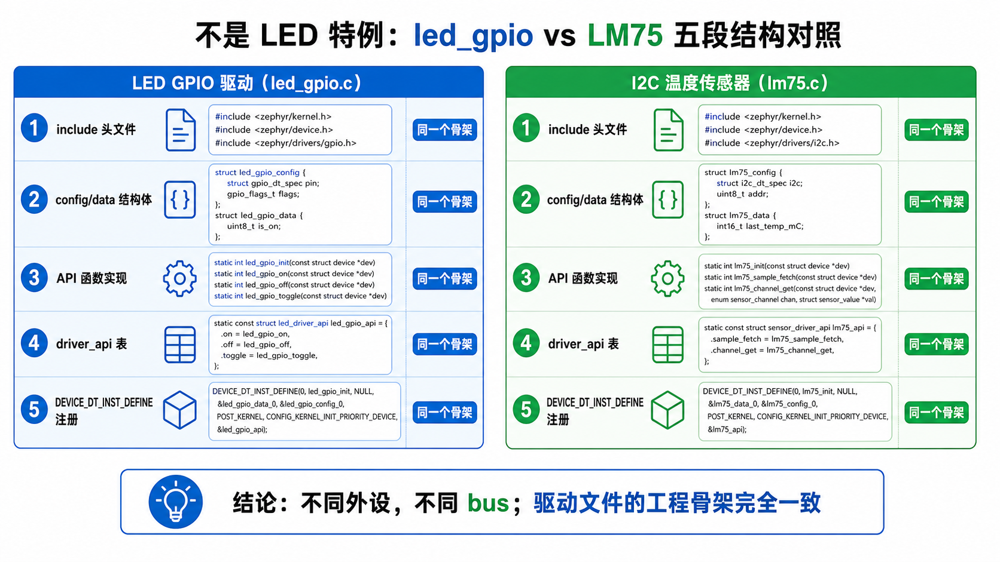

> 💡 这就是 **Ch5 全书的核心结论在工业代码里的验证**：**OOP 的骨架不随外设类型变化**。LED 驱动是五段，温度传感器是五段，加速度计、陀螺仪、气压计、电流传感器——全是五段。Ch5 你花了 18 节学这套骨架，Zephyr 用 500+ 个驱动反复证明它是对的。

---


## 12 container_of 在 Zephyr 中的实践

### 12.1 回顾 Ch5：offsetof → 减偏移 → 反推外层

Ch5 §6.5 你推导了 `container_of` 的核心原理：

```
已知：成员 member 在结构体 type 中的偏移 offset（编译期由 offsetof 算出）
已知：成员 member 的运行时地址 ptr
求：结构体 type 的起始地址

答案：ptr - offset
```

数学上就是一行减法：

```c
#define container_of(ptr, type, member) \
    ((type *)((char *)(ptr) - offsetof(type, member)))
```

`offsetof` 在编译期算出偏移量，`(char *)` 强转确保按字节减（不是按 `type` 的宽度减——如果按 `int *` 减，偏移量 12 会被误解为 12 个 int 即 48 字节），最后 `(type *)` 强转回来。编译完就是一条减法指令，零运行时开销。

### 12.2 "从门牌号推导大楼地址"——终极比喻

想象你在一条街上找一栋大楼。大楼的门牌号是"解放路 100 号"，但你现在站在一个 ATM 机前面，ATM 机的地址是"解放路 100 号-B1 层"。你如何找到大楼的正门？

你知道 ATM 机在大楼里的偏移——"在地下 1 层，往下走了 3 米"。你用 ATM 机的地址减去这 3 米，就得到了大楼正门的地址。


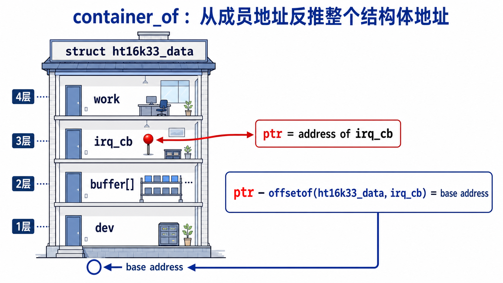


Zephyr 在 `include/zephyr/sys/util.h` 里定义了完全一致的宏（只是加上了编译期类型校验）：

```c
// util.h 真实源码
#define CONTAINER_OF(ptr, type, field)                                         \
    ({                                                                         \
        CONTAINER_OF_VALIDATE(ptr, type, field)  /* 编译期类型检查 */          \
        ((type *)(((char *)(ptr)) - offsetof(type, field)));                   \
    })
```

一行，和你 Ch5 手写的完全一样。`CONTAINER_OF_VALIDATE` 是 Zephyr 加的安全带——用 `__builtin_types_compatible_p` 检查 `ptr` 的指针类型和 `field` 的类型是否匹配，不匹配编译直接报错。

### 12.3 GPIO 中断回调反推——ht16k33.c 真实源码

为什么在 Zephyr 代码库里搜索 `CONTAINER_OF` 有数百个匹配？因为这个宏在回调函数里用得最频繁。当硬件中断触发，框架给你的只有一个通用指针（比如 `struct gpio_callback *`），你的驱动需要用 `CONTAINER_OF` 从回调指针找回自己驱动的 data 结构体。

```c
// ht16k33.c 真实源码 — GPIO 中断回调
static void ht16k33_irq_callback(const struct device *gpiob,
                                 struct gpio_callback *cb, uint32_t pins)
{
    struct ht16k33_data *data;

    ARG_UNUSED(gpiob);
    ARG_UNUSED(pins);

    data = CONTAINER_OF(cb, struct ht16k33_data, irq_cb);
    //       ↑         ↑            ↑              ↑
    //   回调给的指针  反推目标类型    成员字段名 → 运行到这行时，
    //   cb 已知偏移是 offsetof(ht16k33_data, irq_cb)
    //   减去偏移 = ht16k33_data* 的起始地址

    k_sem_give(&data->irq_sem);  // 通知中断处理线程
}
```

`cb` 是 `struct gpio_callback *`，它在 `ht16k33_data` 里的字段名叫 `irq_cb`：

```c
struct ht16k33_data {
    const struct device *dev;
    uint8_t buffer[HT16K33_DISP_DATA_SIZE];  // 显示缓冲
    struct gpio_callback irq_cb;             // ← cb 指向这里！
    struct k_work work;
    // ...
};
```

`CONTAINER_OF(cb, struct ht16k33_data, irq_cb)` 把 `cb` 的地址减去 `irq_cb` 在 `ht16k33_data` 里的偏移，反推出整个 `ht16k33_data` 的起始地址。拿到了 data，你就可以访问 `data->dev`、`data->buffer`、`data->work`——所有驱动私有数据都回来了。

> 💡 **Ch5 回扣**：这就是 Ch5 §6.6 你在教学包 `pc/demo_container_of.c` 里跑过的那个 demo——`container_of(me, struct led_gpio, base)` → 反推 `led_gpio` 地址。唯一的区别：教学版反推的是"父类 base → 子类 self"，工业版反推的是"回调成员 → 驱动 data"——**原理一字不差，使用场景更广。**

### 12.4 LM75 中断回调同款验证

LM75 驱动在 GPIO 中断模式下也用了同样的套路——而且有两个地方：

```c
// lm75.c 真实源码 — 工作队列回调
static void lm75_trigger_work_handler(struct k_work *item)
{
    struct lm75_data *data = CONTAINER_OF(item, struct lm75_data, work);
    //                                 ↑      ↑            ↑
    //                           work 指针  目标类型      work 在结构体中的字段名

    sensor_trigger_handler_t handler = data->trigger_handler;
    if (handler != NULL) {
        handler(data->dev, (struct sensor_trigger *)data->trigger);
    }
}

// lm75.c 真实源码 — GPIO 中断回调
static void lm75_int_gpio_callback_handler(const struct device *port,
                                            struct gpio_callback *cb,
                                            gpio_port_pins_t pins)
{
    struct lm75_data *data = CONTAINER_OF(cb, struct lm75_data, int_gpio_cb);

    ARG_UNUSED(port);
    ARG_UNUSED(pins);

    k_work_submit_to_queue(&data->workq, &data->work);  // 下半部处理
}
```

两个回调，两个不同的成员字段名（`work` vs `int_gpio_cb`），同一个宏——`CONTAINER_OF`。当框架的工作队列回调触发时，你拿到的是 `struct k_work *work`；当 GPIO 中断触发时，你拿到的是 `struct gpio_callback *cb`。Zephyr 没有帮你传 `void *user_data`，因为它更相信你：**你知道 work/cb 嵌在哪个父结构体里，自己用 CONTAINER_OF 拿回来。**

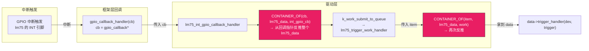
```mermaid
graph LR
    subgraph "中断触发"
        HW["GPIO 中断触发<br/>lm75 的 INT 引脚"]
    end

    subgraph "框架层回调"
        CB["gpio_callback_handler(cb)<br/>cb = gpio_callback*"]
    end

    subgraph "驱动层"
        D["lm75_int_gpio_callback_handler"]
        CO["CONTAINER_OF(cb, lm75_data, int_gpio_cb)<br/>→ 从回调指针反推整个 lm75_data"]
        WQ["k_work_submit_to_queue<br/>→ lm75_trigger_work_handler"]
        CO2["CONTAINER_OF(item, lm75_data, work)<br/>→ 再次反推"]
    end

    HW -->|中断| CB
    CB -->|传入 cb| D
    D --> CO
    CO --> WQ
    WQ -->|传入 item| CO2
    CO2 -->|拿到 data| FINAL["data->trigger_handler(dev, trigger)"]

    style CO fill:#E91E63,stroke:#333,color:#fff
    style CO2 fill:#E91E63,stroke:#333,color:#fff
```

### 12.5 void* 类型还原 vs container_of —— "信封"比喻

现在把 §10.2 的"类型还原"和 §19 的 "container_of" 放在一起对比——这两种从通用指针拿回类型信息的方式，是整个 Zephyr 驱动开发的两大基本功。

想象你收到一个信封。信封外面只有一个标注——"工牌"（`struct device *dev`）。你可以做两件事：

1. **直接摸信封里的东西**：`dev->config` ← `const void *` → `(const struct led_gpio_config *)`。你从信封的"config 槽位"里拿出一张纸——这纸是什么格式你清楚，因为你写的驱动，你知道这张纸就是 `struct led_gpio_config`。这叫**类型还原**。

2. **整封信都是藏在大档案袋里的**：`struct gpio_callback cb` 是整个大信封 `struct lm75_data` 里的一页。你拿着这页纸（`gpio_callback *cb`），用 CONTAINER_OF 反推出整个大档案袋的地址。这叫 **container_of 反推**。


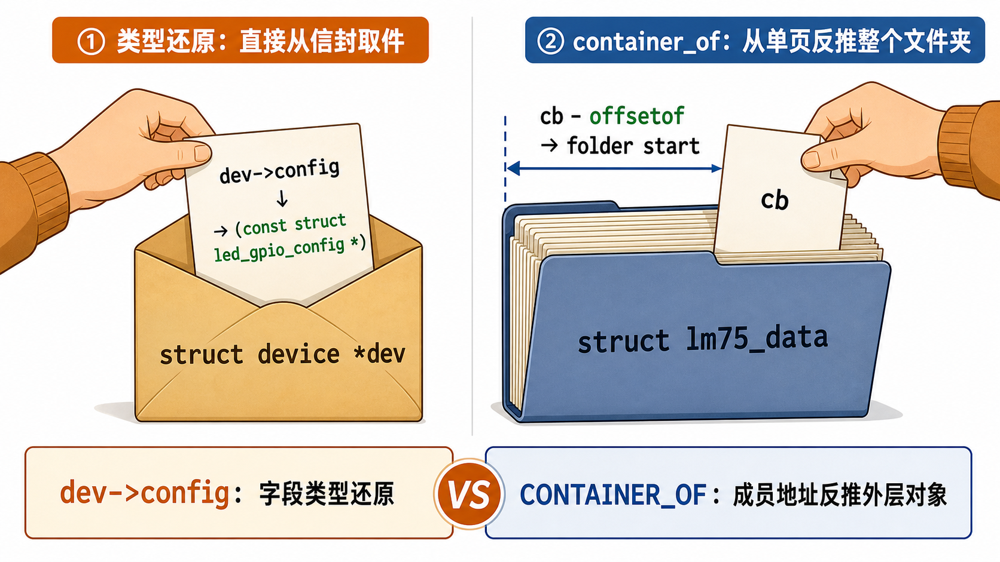


| 操作 | 从哪里拿 | 目标类型 | 何时用 |
|------|---------|---------|--------|
| **类型还原** | `dev->config` / `dev->data` / `dev->api` | 你驱动定义的 config/data/api 类型 | 实现函数里（99%的驱动代码） |
| **container_of** | 回调参数（`gpio_callback *`、`k_work *`、`k_timer *`） | 包含了该回调成员的私有结构体 | 中断回调、定时器回调、工作队列回调 |

> 💡 这也解释了为什么 §8.2 里 `struct device` 的 `config`/`data`/`api` 字段都是 `void *`——框架给了你最通用的指针，剩下的类型还原和 container_of 全部交给你自己的驱动代码负责。Ch5 全书铺垫的"上转型（§5.2）→ 下转型（§5.3）→ container_of（§13）"三部曲，在 Zephyr 的每一个中断/回调链上完整体现。

---

**PART2 结语**：你从设备树（编译期硬件描述）走到 struct device（统一对象模型）走到 driver_api（虚表 dispatch）走到驱动生命周期（五段结构）走到 container_of（回调反推）。这条链上的每一个环节，都是 Ch5 一个具体知识点的工业兑现。学完 PART2，你再打开任意一个 Zephyr 驱动的 .c 文件，看到的将不再是"天书般的框架代码"，而是"config → impl → ops → DT_DEFINE"的五段骨架——你可以自信地说：**我已经会读了。**

DONE_PART2_V2

# PART 3 · 内核机制：对比阅读 Chapter 6

## 13 线程模型

第 19 章走完了 Zephyr 的 driver model —— 那是你前 18 章 OOP 抽象的工业级落地。从这一章开始，镜头往下沉一层：driver model 跑在什么上面？跑在 Zephyr 的内核调度器上面。而调度器管理的第一公民，就是**线程**。

在 Ch6 你已经手撕过 FreeRTOS 的"人"——`xTaskCreate` 创建一个任务，`vTaskStartScheduler` 一拉就跑。Zephyr 的线程模型思路相通，但"人"的身份不一样、户口本不一样、上班流程不一样。这一章就讲清楚"都是人，到底差在哪"。

> **本章核心比喻**：FreeRTOS 是**作坊工头**管理临时工 —— 来了就干，走了就散。Zephyr 是**工厂调度中心**管理正式工 —— 入职有工位、离职有手续、状态全程可追踪。

---

### 13.1 线程不是任务：户口本不同

你在 Ch6 §3 第一次见到 `xTaskCreate`，那个 API 一手包办五件事：分配 TCB、分配栈、绑定函数、设优先级、插入就绪链。这像**作坊工头招临时工**——门口喊一声"你来干这个活"，顺手从杂物间抓块木板当工作台（栈），活干完人就走了。

Zephyr 不这么干。它的哲学是：**线程是工厂的正式员工，不是临时工**。所以：

- **工位提前定好**：栈在编译期用 `K_THREAD_STACK_DEFINE` 定义，不是运行时 `malloc`
- **入职手续完整**：`k_thread_create` 里显式传入 TCB 地址、栈对象、三个参数槽
- **离职有流程**：线程函数 `return` 之后不是凭空消失，而是进入 `DEAD` 状态，等 `k_thread_join` 回收
- **状态全程跟踪**：多了 `PRESTART`（录用通知书发了但还没报到）和 `DEAD`（离职手续中）

对照表：

| Ch6 / FreeRTOS | Zephyr | 作坊 vs 工厂 |
|---|---|---|
| `xTaskCreate` 一步到位 | `K_THREAD_STACK_DEFINE` + `k_thread_create` 两步走 | 作坊：随手给块木板当工位。工厂：先分标准工位，再登记入职 |
| `TaskHandle_t` (typedef 隐藏指针) | `k_tid_t` (= `struct k_thread *`) | 作坊：工号牌用手写。工厂：正式工号，类型不隐藏 |
| `pvParameters` 单个 `void *` | `p1, p2, p3` 三个 `void *` | 作坊：给一个袋子装所有东西。工厂：三个标准参数槽，不用自己打包 |
| `vTaskDelete(NULL)` 退出 | 线程函数 `return` → `k_thread_join` | 作坊：临时工悄悄走人。工厂：离职流程，交接后注销 |
| `xTaskCreateStatic` + 手动栈 | `K_THREAD_DEFINE` 编译期宏 | 作坊：自己找木板。工厂：标准化工位，包含 MPU 保护、对齐、guard 区 |

**这就是 Ch6 §3 你手撕的那个 `xTaskCreate` vs Zephyr 的 `k_thread_create`**——功能同构，抽象层次不同。Zephyr 把"创建线程"这件大事拆成两小步（先定义栈，再创建线程），因为第二步可以复用（同一个栈对象可以传给不同的 TCB，比如线程池场景），而 Ch6 把栈和 TCB 绑死在一次调用里。

```c
/* —— Ch6 §3 你写的 —— */
BaseType_t xTaskCreate(
    TaskFunction_t pxTaskCode,      // 线程函数
    const char * const pcName,      // 名字
    const uint32_t ulStackDepth,    // 栈深度（字数）
    void * const pvParameters,      // 一个参数
    UBaseType_t uxPriority,         // 优先级
    TaskHandle_t * const pxCreatedTask  // 输出句柄
);

/* —— Zephyr 对应 —— */
k_tid_t k_thread_create(
    struct k_thread *new_thread,      // TCB 地址（你提供）
    k_thread_stack_t *stack,          // 栈对象（K_THREAD_STACK_DEFINE 定义）
    size_t stack_size,                // 栈字节数（用 K_THREAD_STACK_SIZEOF!）
    k_thread_entry_t entry,           // 入口函数
    void *p1, void *p2, void *p3,    // 三个参数槽 —— 对应 Ch6 的 pvParameters
    int prio,                         // 优先级（小心！0=最高，和 Ch6 反的）
    uint32_t options,                 // 选项标志（如 K_ESSENTIAL）
    k_timeout_t delay                 // 延迟启动（Ch6 没有！）
);
```

重点注意 `delay` 参数：你在 Ch6 创建任务后它立刻进 Ready 链表。Zephyr 可以传 `K_MSEC(2000)`，线程创建后 2 秒才进就绪队列——这 2 秒里它在 `PRESTART` 状态，你可以改它的优先级或挂起它，这就是下一节要讲的。

---


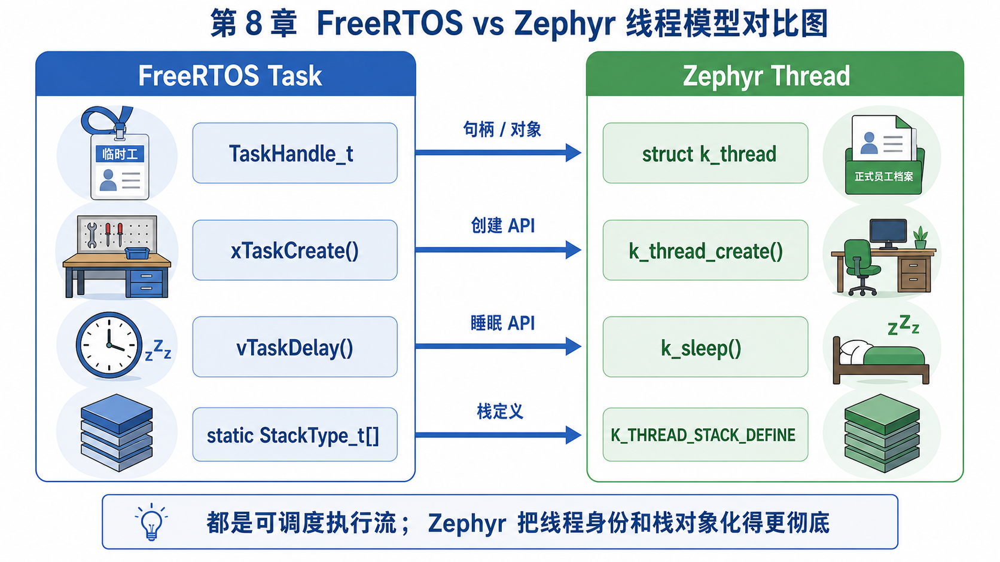


### 13.2 K_THREAD_STACK_DEFINE：工厂的标准化工位

在 Ch6 §4 你写过 `static StackType_t myStack[STACK_SIZE]`，然后把这个数组指针传给 `xTaskCreateStatic`。这像**作坊工头在地上画个圈说"你在这干活"**。

Zephyr 强烈建议你不要画圈——用 `K_THREAD_STACK_DEFINE`。因为它不只是 `uint8_t array[N]`，而是一个带了完整元数据的**标准化工位**。

> **生活比喻**：FreeRTOS 的手动栈数组像你在工地上用粉笔画个圈当工位；Zephyr 的 `K_THREAD_STACK_DEFINE` 像工厂给你分配的标准工位——带围栏（MPU guard）、带铭牌（栈对象元数据）、带消防通道（对齐和溢出检测区）。

| 方式 | Ch6 等价 | Zephyr 正确做法 | 比喻 |
|---|---|---|---|
| `uint8_t arr[1024]` | `StackType_t st[256]` | 不推荐，MPU 使能时可能 fault | 粉笔画圈 —— 风一吹就没了 |
| `K_THREAD_STACK_DEFINE(s, 1024)` | 无直接对应 | **推荐**：展开为对齐数组 + `k_thread_stack_t` 结构体 | 标准工位 —— 带围栏、铭牌、消防通道 |
| `K_THREAD_STACK_SIZEOF(s)` | `sizeof(arr)` 直接算 | **必须用**：返回实际可用字节（扣除了 guard 和元数据） | 工位可用面积，不是建筑面积 |
| `K_KERNEL_STACK_DEFINE` | 无 | 内核线程专用栈（用户空间线程不能用） | 工厂车间主任专用工位 |

```c
/* 正确写法 —— Zephyr 风格 */
K_THREAD_STACK_DEFINE(worker_stack, 2048);
struct k_thread worker_tcb;

k_thread_create(&worker_tcb, worker_stack,
                K_THREAD_STACK_SIZEOF(worker_stack), /* ← 不是 2048！ */
                worker_entry, NULL, NULL, NULL,
                3, 0, K_NO_WAIT);
```

为什么不能用 `2048`？因为 `K_THREAD_STACK_DEFINE` 内部做了三件事：
1. **MPU guard 区**：在栈底部插入不可访问的保护页（ARMv7-M/v8-M MPU），线程溢出立刻触发 MemManage fault——这是你在 Ch6 用软件 `uxTaskGetStackHighWaterMark` 做不到的硬件保护。
2. **对齐填充**：`ARCH_STACK_PTR_ALIGN` 确保栈指针满足架构要求（Cortex-M 是 8 字节对齐）。
3. **元数据头部**：`Z_THREAD_STACK_SIZE_ADJUST` 扣掉 MPU guard 占用的空间。

如果你写死 `2048`，`k_thread_create` 以为有 2048 字节可用，但实际只有约 2016 字节（32 字节被 guard 吃掉），栈溢出检测窗口就被你自己堵死了。

> **这就是 Ch6 §4 v2 你手动分配 `StackType_t` 数组的工业升级版**——Ch6 教了你"线程需要自己的栈"，Zephyr 说"不光要栈，还要有标准化的栈对象"。

---

### 13.3 线程状态：多两个"人生阶段"

你在 Ch6 §5 背过 FreeRTOS 的四个状态：Running、Ready、Blocked、Suspended。那是**作坊临时工的四种状态**——要么在干活、要么等活干、要么在排队、要么被叫停。

Zephyr 多了两个状态，因为**工厂正式工有入职和离职**。

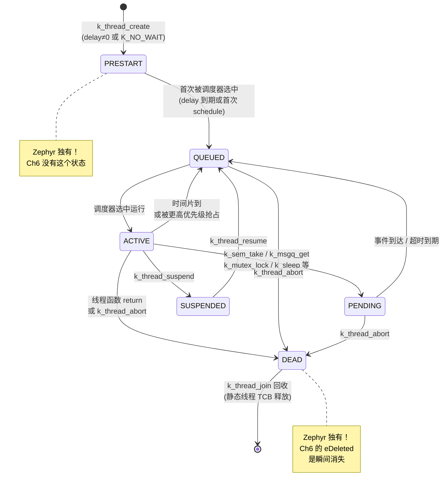
```mermaid
stateDiagram-v2
    direction TB
    
    [*] --> PRESTART : k_thread_create<br/>(delay≠0 或 K_NO_WAIT)
    PRESTART --> QUEUED : 首次被调度器选中<br/>(delay 到期或首次 schedule)
    
    QUEUED --> ACTIVE : 调度器选中运行
    ACTIVE --> QUEUED : 时间片到<br/>或被更高优先级抢占
    
    ACTIVE --> PENDING : k_sem_take / k_msgq_get<br/>k_mutex_lock / k_sleep 等
    PENDING --> QUEUED : 事件到达 / 超时到期
    
    ACTIVE --> SUSPENDED : k_thread_suspend
    SUSPENDED --> QUEUED : k_thread_resume
    
    ACTIVE --> DEAD : 线程函数 return<br/>或 k_thread_abort
    QUEUED --> DEAD : k_thread_abort
    PENDING --> DEAD : k_thread_abort
    
    DEAD --> [*] : k_thread_join 回收<br/>(静态线程 TCB 释放)

    note right of PRESTART
        Zephyr 独有！
        Ch6 没有这个状态
    end note

    note right of DEAD
        Zephyr 独有！
        Ch6 的 eDeleted
        是瞬间消失
    end note
```

对照表：

| Ch6 状态 | Zephyr 状态 | 作坊 vs 工厂 |
|---|---|---|
| Ready | `_THREAD_QUEUED` | 排队等活干 |
| Running | `_THREAD_ACTIVE` + `_current` | 正在干活的那个人 |
| Blocked | `_THREAD_PENDING` | 等料/等工具/等通知 |
| Suspended | `_THREAD_SUSPENDED` | 被工头叫停 |
| — | `_THREAD_PRESTART` | **工厂独有**：发了录用通知，还没报到 |
| `eDeleted`（瞬间消失） | `_THREAD_DEAD`（持久态） | **工厂独有**：离职手续中，TCB 还没回收 |

`_THREAD_PRESTART` 的价值：你在 `k_thread_create` 最后一个参数传 `K_NO_WAIT` 后，线程不是立刻跑——它停在 PRESTART，等下一次调度点才切过去。这个窗口里你可以调 `k_thread_suspend` 或 `k_thread_priority_set` 修改它的初始配置。Ch6 没有这个窗口——`xTaskCreate` 返回时任务已经在 Ready 链表上了，你只能之后用 `vTaskSuspend` 补救。

`_THREAD_DEAD` 的价值：Ch6 里线程退出必须调 `vTaskDelete(NULL)`，TCB 立刻回收，你再也碰不到。Zephyr 的线程 `return` 之后 TCB 还在（尤其是 `K_THREAD_DEFINE` 定义的静态线程），状态置为 DEAD。你可以用 `k_thread_join` 等待它结束，拿到"离职证明"。这更像 `pthread_join` 的行为，适合需要父子线程协作的场景。


---


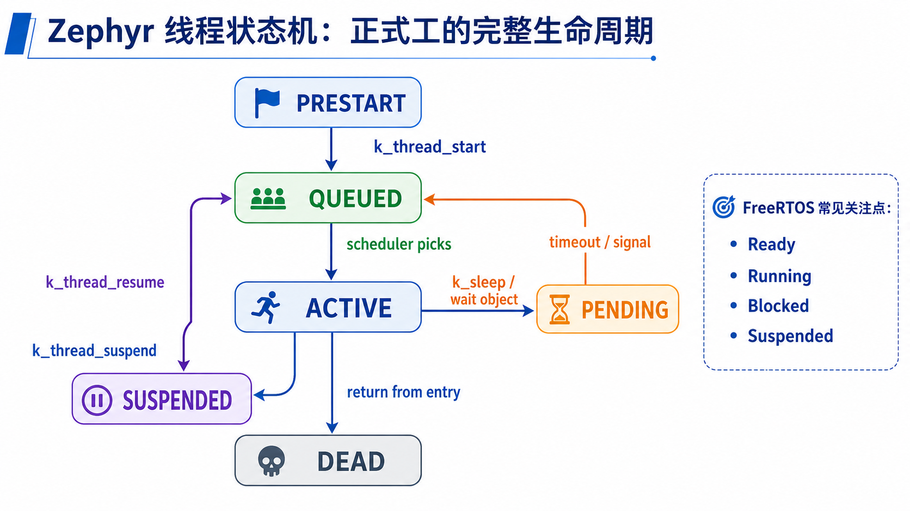


### 13.4 v6 demo：四个线程，走过五种状态

和 Ch6 一样，概念讲完动手验证。下面创建一个实验：四个线程各自经历不同的状态转移路径，主线程当观察者。

```c
/*
 * demo_v6.c —— 线程状态转移全景实验
 * 验证 PRESTART → QUEUED → ACTIVE → PENDING → SUSPENDED → DEAD
 * 对应 Ch6 §5 的状态机实验，多了 PRESTART 和 DEAD 两个新状态
 */
#include <zephyr/kernel.h>

/* === 定义三个标准化工位（栈） === */
K_THREAD_STACK_DEFINE(stack_a, 1024);
K_THREAD_STACK_DEFINE(stack_b, 1024);
K_THREAD_STACK_DEFINE(stack_c, 1024);

struct k_thread tcb_a, tcb_b, tcb_c;

/*
 * 线程 A：正常跑 → PENDING → QUEUED → ACTIVE 循环
 * 这就是 Ch6 §5 你写的 "跑一下睡一下" 的 blink 任务
 */
void thread_a(void *p1, void *p2, void *p3)
{
    while (1) {
        printk("[A] ACTIVE — 正在干活\n");
        k_msleep(500);   /* PENDING(等超时) → QUEUED → ACTIVE */
    }
}

/*
 * 线程 B：一上来把自己挂起 → SUSPENDED → 被 resume 后恢复
 * Ch6 里用 vTaskSuspend(NULL) 做同样的事，见 Ch6 §5 v2
 */
void thread_b(void *p1, void *p2, void *p3)
{
    printk("[B] 即将自挂（对应 Ch6 的 vTaskSuspend(NULL)）\n");
    k_thread_suspend(k_current_get());  /* 进入 SUSPENDED */
    /* —— 上面这行执行后，B 就停在这，直到别人 resume —— */
    printk("[B] 被恢复了！SUSPENDED → QUEUED\n");
    while (1) {
        printk("[B] ACTIVE — 复活后正常运行\n");
        k_msleep(300);
    }
}

/*
 * 线程 C：跑一次 return → DEAD
 * Ch6 的任务不能 return，必须 vTaskDelete(NULL)
 * Zephyr 允许 return，之后进入 DEAD 态等待 join
 */
void thread_c(void *p1, void *p2, void *p3)
{
    printk("[C] ACTIVE — 只跑一次，然后 return 进入 DEAD\n");
    printk("[C] 这就是 Ch6 没有的状态：线程自然死亡，等待 join 回收\n");
    /* return 后进入 DEAD 态，TCB 还在，k_thread_join 可回收 */
}

/* === 主线程：工厂调度中心的操作员 === */
int main(void)
{
    printk("=== v6 demo: 线程状态转移全景 ===\n\n");

    /* 阶段1：创建三个线程，全部进入 PRESTART */
    printk("[MAIN] 阶段1：创建线程，此时都在 PRESTART 状态\n");
    k_thread_create(&tcb_a, stack_a,
                    K_THREAD_STACK_SIZEOF(stack_a),
                    thread_a, NULL, NULL, NULL,
                    5, 0, K_NO_WAIT);  /* ← K_NO_WAIT → 停在 PRESTART */

    k_thread_create(&tcb_b, stack_b,
                    K_THREAD_STACK_SIZEOF(stack_b),
                    thread_b, NULL, NULL, NULL,
                    5, 0, K_NO_WAIT);  /* ← 同样停在 PRESTART */

    k_thread_create(&tcb_c, stack_c,
                    K_THREAD_STACK_SIZEOF(stack_c),
                    thread_c, NULL, NULL, NULL,
                    5, 0, K_NO_WAIT);  /* ← 同样停在 PRESTART */

    printk("[MAIN] 三个线程创建完毕，都在 PRESTART\n");
    printk("[MAIN] 这个 PRESTART 窗口是 Ch6 没有的："
           "你可以在这里改优先级或挂起它们\n");

    /* 阶段2：放 CPU，三个线程依次进入 QUEUED → 各自状态变化 */
    printk("[MAIN] 阶段2：释放 CPU，观察状态转移\n");
    k_msleep(1500);
    /*
     * 这 1.5 秒内发生的事情：
     * - A 进入 QUEUED → ACTIVE 打印一行 → PENDING(k_msleep) → 循环
     * - B 进入 QUEUED → ACTIVE → 调 k_thread_suspend → SUSPENDED
     * - C 进入 QUEUED → ACTIVE 打印一行 → return → DEAD
     */

    /* 阶段3：恢复 B —— SUSPENDED → QUEUED */
    printk("[MAIN] 阶段3：恢复 B（对应 Ch6 的 vTaskResume）\n");
    k_thread_resume(&tcb_b);

    /* 阶段4：等待 C 结束 —— join 阻塞到 C → DEAD */
    printk("[MAIN] 阶段4：等待 C join（这是 Ch6 没有的同步方式）\n");
    k_thread_join(&tcb_c, K_FOREVER);
    printk("[MAIN] C 已经 join（DEAD → 回收），拿到了"离职证明"\n");

    /* 阶段5：A 和 B 继续交替运行 */
    printk("[MAIN] 阶段5：A 和 B 交替运行，按 Ctrl+C 结束\n");
    return 0;
}
```

串口输出预期：

```
=== v6 demo: 线程状态转移全景 ===

[MAIN] 阶段1：创建线程，此时都在 PRESTART 状态
[MAIN] 三个线程创建完毕，都在 PRESTART
[MAIN] 这个 PRESTART 窗口是 Ch6 没有的：你可以在这里改优先级或挂起它们
[MAIN] 阶段2：释放 CPU，观察状态转移
[A] ACTIVE — 正在干活
[B] 即将自挂（对应 Ch6 的 vTaskSuspend(NULL)）
[C] ACTIVE — 只跑一次，然后 return 进入 DEAD
[C] 这就是 Ch6 没有的状态：线程自然死亡，等待 join 回收
[A] ACTIVE — 正在干活
[MAIN] 阶段3：恢复 B（对应 Ch6 的 vTaskResume）
[B] 被恢复了！SUSPENDED → QUEUED
[B] ACTIVE — 复活后正常运行
[A] ACTIVE — 正在干活
[MAIN] 阶段4：等待 C join（这是 Ch6 没有的同步方式）
[MAIN] C 已经 join（DEAD → 回收），拿到了"离职证明"
[MAIN] 阶段5：A 和 B 交替运行，按 Ctrl+C 结束
[B] ACTIVE — 复活后正常运行
[A] ACTIVE — 正在干活
...
```

> 改 `K_NO_WAIT` 为 `K_MSEC(2000)`，A 会在 PRESTART 状态停留 2 秒——这个"延迟报到"能力，Ch6 的 `xTaskCreate` 真的没有给你。

---


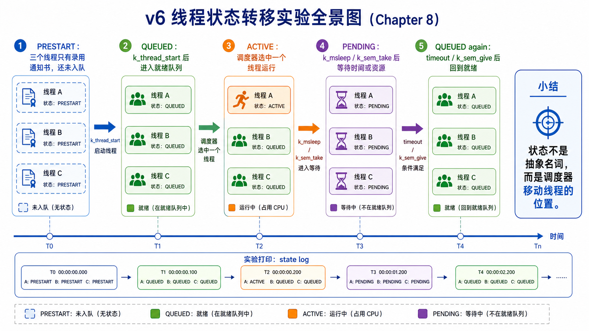

## 14 调度器：Zephyr比FreeRTOS多了什么

线程创建完了，谁决定下一个跑谁？调度器。你在 Ch6 §6 手撕过 FreeRTOS 调度器：优先级抢占、同优先级时间片、`portYIELD` 手动让出。那是**作坊工头点名**——看一眼谁在最前面的优先级队列里，喊他上来干活。

Zephyr 的调度器骨架和 Ch6 同构——都是优先级抢占 + 时间片轮转 + 阻塞让出——但多了三个 Ch6 没有的设计：**协作区间**、**Meta-IRQ**、**红黑树就绪队列**。这三样东西让你从"工头作坊"进了"工厂调度中心"。

---

### 14.1 FreeRTOS 调度回顾：工头点名的四张牌

先把你 Ch6 §6 的调度知识快速对齐。FreeRTOS 调度器就四张牌：

1. **优先级抢占**：高优先级就绪 → 立刻抢 CPU，`portYIELD` 触发 PendSV 切上下文。这就像**工头看到高级技工来了，立刻把初级工换下来**。
2. **同优先级时间片**：`configUSE_TIME_SLICING=1` 时，Systick 每 tick 轮转同优先级链表。**每个人干固定时间，到点换人**。
3. **阻塞态自动让出**：`vTaskDelay` / `xSemaphoreTake(blockTime)` 把线程移出就绪链。**没料的工人自己去休息室等着，不占排队位置**。
4. **`portYIELD` 手动让出**：同优先级协作时不等 tick。**活干完了主动喊"下一个"**。

四张牌在 Ch6 §7（PendSV）和 §8（Systick）你已经手撕过底层。现在进 Zephyr 调度器，看工厂调度中心怎么把这四张牌重新洗。

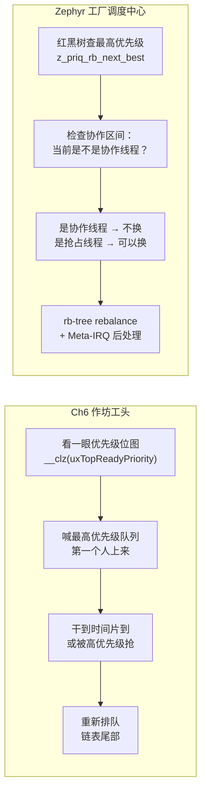
```mermaid
graph LR
    subgraph "Ch6 作坊工头"
        A1["看一眼优先级位图<br/>__clz(uxTopReadyPriority)"] --> A2["喊最高优先级队列<br/>第一个人上来"]
        A2 --> A3["干到时间片到<br/>或被高优先级抢"]
        A3 --> A4["重新排队<br/>链表尾部"]
    end
    subgraph "Zephyr 工厂调度中心"
        B1["红黑树查最高优先级<br/>z_priq_rb_next_best"] --> B2["检查协作区间：<br/>当前是不是协作线程？"]
        B2 --> B3["是协作线程 → 不换<br/>是抢占线程 → 可以换"]
        B3 --> B4["rb-tree rebalance<br/>+ Meta-IRQ 后处理"]
    end
```

---


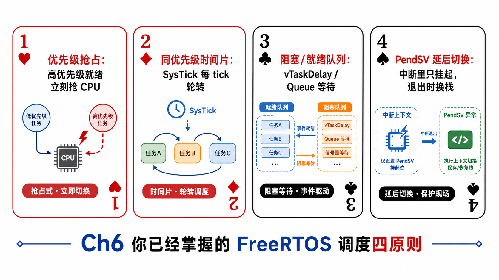

### 14.2 协作区间 + 抢占区间
### 14.2 协作区间 + 抢占区间：手术室里不许打断

FreeRTOS 只有一种线程：抢占式。你想"我的线程不想被打断"，只能把优先级设到最高或者关中断。这像**作坊工头保护重要工序——把车间门锁了，谁都别进来**。

Zephyr 把这个场景做成了类型系统：**协作线程**（cooperative thread）。这像**手术室——医生在做手术时，护士可以进进出出（中断照常响应），但你不能把医生换下来让另一个医生接着做**。

| Ch6 概念 | Zephyr 概念 | 作坊 vs 工厂 |
|---|---|---|
| 所有线程可抢占 | `CONFIG_NUM_PREEMPT_PRIORITIES` 定义抢占线程数 | 作坊：干掉所有人就是保护。工厂：分"手术室"和"普通诊室" |
| 优先级号越大越高（`0=idle`） | **优先级号越小越高（`0=最高优先级`）** | 作坊：数字越大越厉害。工厂：数字越小越优先（VIP=0号） |
| 无协作线程概念 | 协作优先级为负数（`-1`, `-2`...），`CONFIG_NUM_COOP_PRIORITIES` | 作坊：没有手术室概念。工厂：负优先级=手术室，别人别想抢 |
| 无延迟启动 | `k_thread_create(..., K_MSEC(2000))` | 作坊：来了就排队。工厂：可以约定 2 秒后报到 |

Zephyr 的优先级全景（注意数字方向！）：

```
优先级  -2: 最低协作优先级（手术室2号）
优先级  -1: 最高协作优先级（手术室1号）
------- 协作/抢占分界线 -------
优先级   0: 最高抢占优先级（VIP）
优先级   1: 次高
优先级   2:
...
优先级  14: 最低抢占优先级
优先级  15: IDLE 线程（系统自动创建，你不碰）
```

协作线程的规则：它跑的时候，**同级或更低协作线程不会抢它，任何抢占线程也抢不动它**。能让协作线程让出 CPU 的只有三种情况：
1. 它自己调 `k_sleep` / `k_yield` —— 主动让
2. 它等信号量/锁超时 —— 被动让
3. 它执行完毕 return —— 走人

中断照常响应。ISR 返回时，如果当前协作线程还在就绪态，调度器一定还给它。

```c
/* prj.conf 配置 */
CONFIG_NUM_PREEMPT_PRIORITIES=15   /* 0~14: 15个抢占优先级 */
CONFIG_NUM_COOP_PRIORITIES=2       /* -2~-1: 2个协作优先级 */
```

> **生活比喻：手术室**——CONFIG_NUM_COOP_PRIORITIES=2 就是两间手术室。正在做手术的医生（协作线程）不会被门诊叫号（抢占线程）打断。护士可以进来递器械（中断响应），但主刀医生还是同一个人（ISR 返回后继续跑协作线程）。只有医生自己说"这台做完了"（k_yield），才会轮到下一台。

---


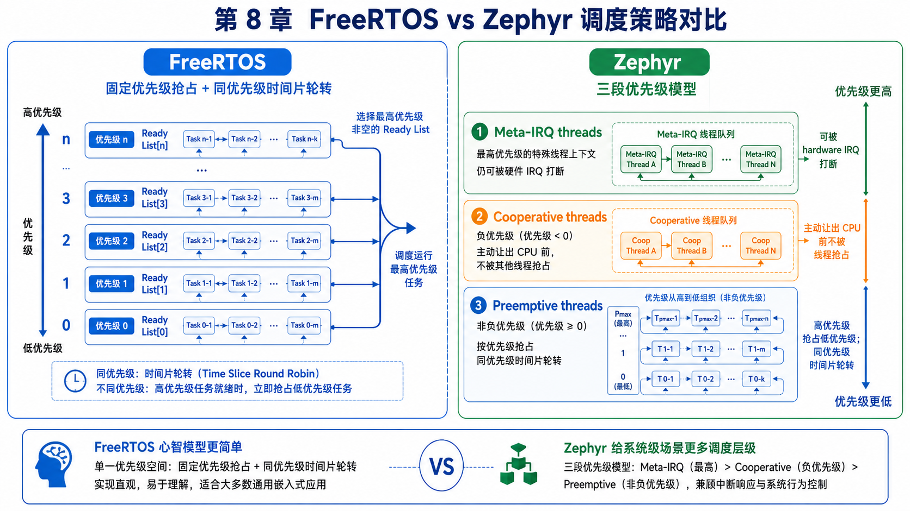


### 14.3 Meta-IRQ：最高优先级的特殊线程

Meta-IRQ 是 Zephyr 最特殊的调度层级，Ch6 完全没有对应物。它不是硬件中断——它是运行在最高优先级调度段里的**特殊协作线程**。它能抢占其他线程（包括刚被调度选中的高优先级线程），但**仍然会被硬件中断（NVIC IRQ）打断**——这一点和有些教材里流传的"比所有中断还高"的说法不同。

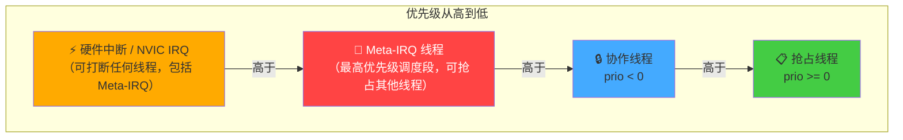
```mermaid
graph TD
    subgraph "优先级从高到低"
        I["⚡ 硬件中断 / NVIC IRQ<br/>（可打断任何线程，包括 Meta-IRQ）"]
        I -->|"高于"| M["🔷 Meta-IRQ 线程<br/>（最高优先级调度段，可抢占其他线程）"]
        M -->|"高于"| C["🔒 协作线程<br/>prio &lt; 0"]
        C -->|"高于"| P["📋 抢占线程<br/>prio &gt;= 0"]
    end
    
    style M fill:#ff4444,color:white
    style I fill:#ffaa00
    style C fill:#44aaff
    style P fill:#44cc44
```

Meta-IRQ 的核心是：它运行在 Zephyr 调度器优先级最高的**特殊调度段**里——这是一个真正可被调度器管理的线程上下文，不是裸回调。它在每次调度决策完成之后、真正切到目标线程之前执行，能抢占其他线程，但硬件中断（NVIC IRQ）仍可打断它。

> **生活比喻：火灾警报**——正常排队看病（调度），叫号系统选了下一个人（决策完成），但就在下一个人进诊室之前，火警响了（Meta-IRQ 触发）——所有人停下来，先处理火灾警报的回调（关气阀、开消防喷头），然后才让下一个人进诊室。它不是"替代中断"——它是抢占普通线程的最高优先级调度段。真正的硬件中断仍能打断它。

| 机制 | Ch6 等价 | Zephyr | 比喻 |
|---|---|---|---|
| 普通中断 | `xISR` + `portYIELD_FROM_ISR` | Zephyr ISR → `z_arm_int_exit` | 正常叫号 |
| 中断嵌套 | NVIC 优先级组 | NVIC 硬件支持 | 急诊插队 |
| 调度钩子 | `vApplicationTickHook` / trace 宏 | `k_sched_*` 回调 | 叫号记录 |
| **Meta-IRQ** | **不存在** | `z_meta_irq_register`，`CONFIG_META_IRQ=y` | **火灾警报** |

典型应用：DMA 传输完成 → 必须在"确定下一个线程"和"真正开始跑它"之间立刻做处理。普通 ISR + `k_sem_give` 还不够快（ISR 返回后还要再跑一次调度器决策），Meta-IRQ 把唤醒 + 上下文恢复压进一次调度返回路径。

```c
/* Meta-IRQ 注册伪代码（仅示意，普通开发 99.9% 用不到） */
#include <zephyr/irq.h>

static void dma_critical_callback(void *arg)
{
    /* 在调度器选好线程后、切过去之前执行 */
    /* 这里不能调会阻塞的 API，必须 O(1) 完成 */
    struct k_thread *urgent = (struct k_thread *)arg;
    z_sched_wake(urgent);  /* 直接唤醒，跳过调度器决策 */
}

/* 注册 */
z_meta_irq_register(dma_critical_callback, &dma_thread);
```

> 读内核源码（`kernel/sched.c` `z_meta_irq_enter`）时必须知道这东西存在。99.9% 应用代码不需要写 Meta-IRQ，但你的内核理解不能有这个盲区。

---


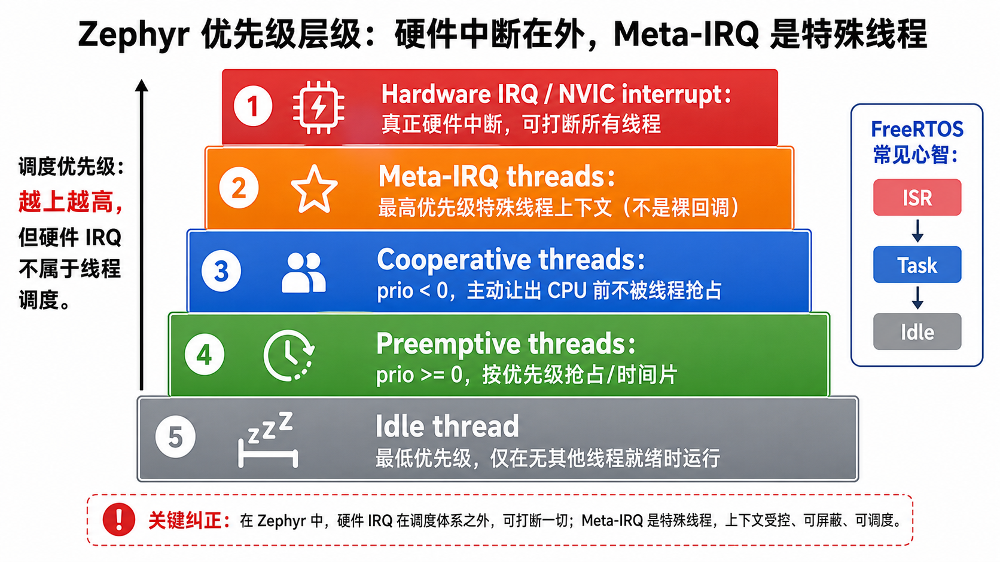

### 14.4 rb-tree vs 链表 + 位图
### 14.4 rb-tree vs 链表 + 位图：两种排队方式

这是两个调度器源码层面差异最大的地方。

Ch6 FreeRTOS 就绪队列：`pxReadyTasksLists[configMAX_PRIORITIES]`，每个优先级一条双向链表，外加 `uxTopReadyPriority` 位图。选最高优先级线程 = `__clz(uxTopReadyPriority)` → `listGET_OWNER_OF_HEAD_ENTRY`，O(1)。

Zephyr：**红黑树**（rb-tree）。key = 优先级，取最高 = `z_priq_rb_next_best()`，O(log N)。

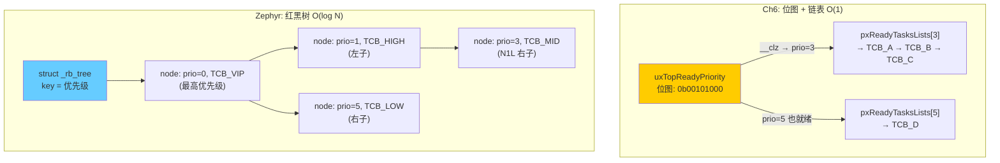
```mermaid
graph TD
    subgraph "Ch6: 位图 + 链表 O(1)"
        B["uxTopReadyPriority<br/>位图: 0b00101000"] -->|"__clz → prio=3"| L3["pxReadyTasksLists[3]<br/>→ TCB_A → TCB_B → TCB_C"]
        B -->|"prio=5 也就绪"| L5["pxReadyTasksLists[5]<br/>→ TCB_D"]
    end

    subgraph "Zephyr: 红黑树 O(log N)"
        RT["struct _rb_tree<br/>key = 优先级"] --> N0["node: prio=0, TCB_VIP<br/>(最高优先级)"]
        N0 --> N1L["node: prio=1, TCB_HIGH<br/>(左子)"]
        N0 --> N5R["node: prio=5, TCB_LOW<br/>(右子)"]
        N1L --> N3R["node: prio=3, TCB_MID<br/>(N1L 右子)"]
    end

    style B fill:#ffcc00
    style RT fill:#66ccff
```

| 维度 | Ch6 FreeRTOS（链表+位图） | Zephyr（红黑树） | 比喻 |
|---|---|---|---|
| 数据结构 | `List_t` 双向链表 + `uxTopReadyPriority` 位图 | `struct _rb_tree`，key=优先级 | 作坊：按优先级排几条队。工厂：一棵优先级排序树 |
| 取最高优先级 | `__clz(uxTopReadyPriority)` → O(1) | `z_priq_rb_next_best()` → O(log N) | 作坊：看一眼牌子。工厂：走树查找 |
| 插入线程 | 链表尾插 → O(1) | rb-tree insert + rebalance → O(log N) | 作坊：排到对应队尾。工厂：先找位置再插 |
| 优先级动态变化 | 从旧优先级链移出 → 插新优先级链 | `remove` + `insert` → rebalance | 作坊：离开这条队，排另一条。工厂：在树里换个位置 |
| 同优先级时间片 | 同链表 `pxIndex` 轮转 | rb-tree 节点内嵌 `_wait_q_t` 子链表 | 同优先级的人自己再排一个小队 |
| 可配置 | 无选择 | `CONFIG_WAITQ_SCALABLE=n` 切回 `sys_dlist` | 工厂可以降级成作坊模式（省代码空间） |

Zephyr 选红黑树的理由：
1. **动态优先级**：`k_thread_priority_set` 和 mutex 优先级继承都会在运行时改线程优先级。红黑树 `remove` + `insert` 比链表"从旧桶移出再插新桶"更干净。
2. **等待队列复用**：红黑树节点同时是 `_wait_q_t`，信号量、mutex、超时队列全部复用同一棵树。Ch6 每个等待对象要单建链表。
3. **可降级**：`CONFIG_WAITQ_SCALABLE=n` 切回 DList，小 RAM IC 省代码。

> **这就是 Ch6 §6 v3 你翻过的 `pxReadyTasksLists` 数组的工业升级**——Ch6 教你"每个优先级一条链表"，Zephyr 说"用一棵树管所有优先级，因为优先级是会变的"。

---


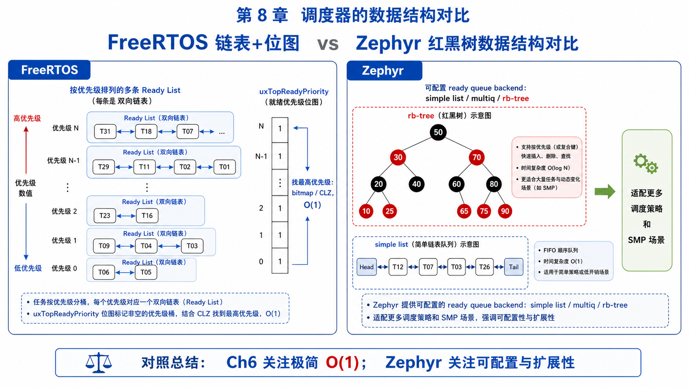

### 14.5 优先级抢占实验
### 14.5 优先级抢占实验：验证数字方向反了

接 20.4 的 demo，加三个线程验证协作区间和优先级数字方向（**注意！Zephyr 的数字越小优先级越高，和 Ch6 反的！**）：

```c
/*
 * demo_v6_sched.c —— 优先级抢占实验
 * 验证：数字越小优先级越高 + 协作线程不可抢占
 * 对应 Ch6 §6 v4 的优先级抢占实验
 */

/* 优先级 3（较低）—— 普通工，数字大 = 优先级低 */
K_THREAD_DEFINE(t_low, 1024, thread_low, NULL, NULL, NULL, 3, 0, 0);

/* 优先级 1（较高）—— 高级工，数字小 = 优先级高 */
/* 对应 Ch6 的 configMAX_PRIORITIES-2 */
K_THREAD_DEFINE(t_high, 1024, thread_high, NULL, NULL, NULL, 1, 0, 0);

/* 优先级 -1 —— 手术室医生，协作线程，不可抢占 */
K_THREAD_DEFINE(t_coop, 1024, thread_coop, NULL, NULL, NULL, -1, 0, 0);

void thread_low(void *p1, void *p2, void *p3)
{
    while (1) {
        printk("[LOW prio=3]  我在干活...\n");
        k_busy_wait(200000); /* 忙等，不给调度器让位 */
        /* 高优先级线程醒来时应该立刻抢我 */
    }
}

void thread_high(void *p1, void *p2, void *p3)
{
    while (1) {
        printk("[HIGH prio=1] 我抢了 LOW 的 CPU！（对应 Ch6 优先级抢占）\n");
        k_msleep(500); /* 睡 500ms，让 LOW 有机会跑 */
    }
}

void thread_coop(void *p1, void *p2, void *p3)
{
    while (1) {
        printk("[COOP prio=-1] 我在手术室，谁也抢不走\n");
        k_busy_wait(300000);
        k_yield(); /* 主动让出 —— 协作线程不让就真的没人能抢 */
        /* 没有这行 k_yield，HIGH 和 LOW 永远等不到 CPU */
    }
}
```

预期现象：
| 时刻 | 事件 | Ch6 对应 |
|---|---|---|
| t0 | LOW(prio=3) 在跑 | 最低优先级就绪 |
| t1 | HIGH(prio=1) `k_msleep` 到期醒来 | 高优先级就绪 → 抢占 |
| t2 | **HIGH 抢走 CPU**，LOW 被放回就绪队列 | `taskYIELD` / PendSV 切换 |
| t3 | HIGH 又 `k_msleep` → LOW 恢复 | 时间片/阻塞让出 |
| t4 | COOP(prio=-1) 醒来 | 协作线程就绪 |
| t5 | **COOP 抢走 CPU**（它优先级最高） | 抢占 |
| t6 | LOW 或 HIGH 醒来 → **抢不动 COOP** | Zephyr 独有！协作线程不可被抢占线程打断 |
| t7 | COOP 调 `k_yield()` | 手动让出，HIGH 或 LOW 终于轮到了 |

> 把 `CONFIG_NUM_COOP_PRIORITIES` 改成 0 → 协作优先级消失 → 纯抢占模式，和 Ch6 行为完全一致。

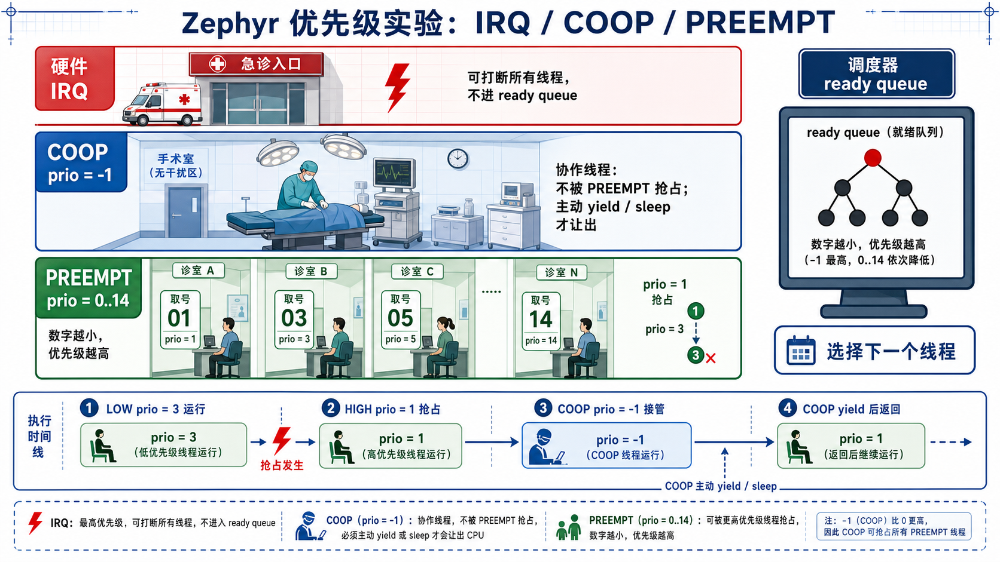

---

## 15 PendSV

PendSV 是你和 Ch6 交情最深的一页。Ch6 §7 你一行一行拆过 `xPortPendSVHandler` 的汇编：`mrs r0, psp` → `stmdb r0!, {r4-r11}` → `bl vTaskSwitchContext` → `ldmia r1!, {r4-r11}` → `bx lr`。

那一页是你嵌入式学习的"成人礼"——理解了它，Cortex-M 上所有 RTOS 的上下文切换都只是同一段舞步的不同舞伴。

> **核心比喻**：PendSV 是**方向盘**——Cortex-M 硬件定义的异常机制，所有 RTOS 用的方向盘一模一样。调度算法是**导航路线**——FreeRTOS 用链表"走直路"，Zephyr 用红黑树"走高架"。方向盘不变，路线可以换。

---

### 15.1 Ch6 v7 PendSV：你亲手撕过的方向盘

先回顾你在 Ch6 §7 手撕的那段 PendSV——这是你嵌入式生涯最重要的 11 行汇编：

```asm
/* ============================================================
 * FreeRTOS PendSV —— Ch6 §7 v7 你手撕的版本
 * 文件：FreeRTOS/Source/portable/GCC/ARM_CM3/port.c
 * 这就是 ARM 定义的"方向盘"——硬件契约
 * ============================================================ */
xPortPendSVHandler:
    mrs r0, psp               ; ① 读线程栈指针 PSP（当前线程的栈顶）
    stmdb r0!, {r4-r11}       ; ② 手动压 callee-saved 寄存器 r4~r11
                               ;    r0~r3, r12, lr, pc, xPSR 硬件已自动压
                               ;    一共 16 个寄存器全部保存完毕
    str r0, [r2]              ; ③ 把更新后的 PSP 写回当前 TCB->pxTopOfStack
                               ;    此刻 r2 = 当前 TCB 的地址（从 vTaskSwitchContext 传入）

    push {r3, r14}            ; ④ 保护 r3 和 lr（因为接下来要调 C 函数）
    bl vTaskSwitchContext     ; ⑤ 选下一个 TCB —— Ch6 §6 的调度核心！
                               ;    返回后 r3 = 新 TCB 的地址
    pop {r3, r14}             ; ⑥ 恢复 r3 和 lr

    ldr r1, [r3]              ; ⑦ 读新 TCB->pxTopOfStack（新线程上次被切走时的栈顶）
    ldmia r1!, {r4-r11}       ; ⑧ 弹栈 r4~r11（新线程的上下文回来了）
    msr psp, r1               ; ⑨ 更新 PSP 指向新线程的栈
    bx lr                     ; ⑩ 异常返回！硬件自动弹出 r0~r3,r12,lr,pc,xPSR
                               ;    新线程从上次被切走的位置继续跑！
```

你拆这段代码花了一整个 v7 版本。每行注释背后都是你对 Cortex-M 异常模型的理解：为什么 `r4-r11` 手动压而 `r0-r3` 自动压（AAPCS calling convention），为什么用 PSP 而不用 MSP（线程用 PSP，handler 用 MSP），为什么 PendSV 优先级设成最低（0xFF，确保不打断任何 IRQ）。

这段知识 **100% 保值**。换 Zephyr，只是把第 ⑤ 步的 `vTaskSwitchContext` 换成 `z_get_next_switch_handle`，方向盘没变。

---


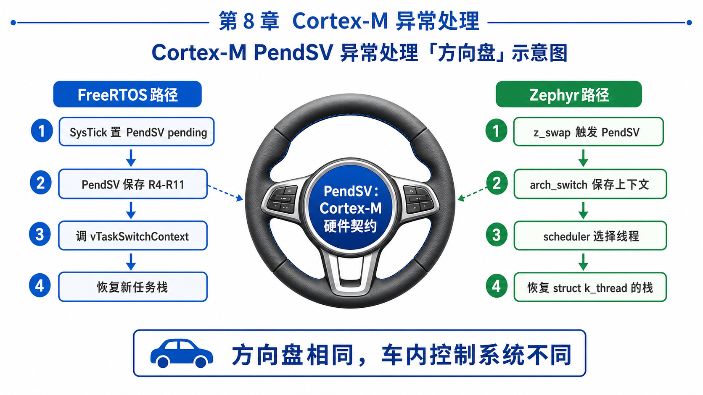

### 15.2 Zephyr vector_table.S PendSV
### 15.2 Zephyr vector_table.S PendSV：同一款方向盘，不同的仪表盘

```asm
/* ============================================================
 * Zephyr PendSV —— arch/arm/core/cortex_m/pendsv.S
 * 上游源码：https://github.com/zephyrproject-rtos/zephyr/blob/v3.7.0/
 *           arch/arm/core/cortex_m/pendsv.S
 * ============================================================ */
SECTION_FUNC(TEXT, __pendsv)
    /* ① 保存 EXC_RETURN 和 r4，和 Ch6 的 push {r3, r14} 同构 */
    push {r4, lr}

    /* ② 核心调度决策：保存上下文 + 选下一个线程 + 恢复上下文
     *    对应 Ch6 的 ②~⑨ 全部！封装在一个 C 函数里 */
    bl z_arm_pendsv
    /*   z_arm_pendsv 内部做了三件事：
     *   a. z_arm_context_save   → 对应 Ch6 的 stmdb r0!, {r4-r11}
     *   b. z_get_next_switch_handle → 对应 Ch6 的 bl vTaskSwitchContext
     *   c. z_arm_context_restore → 对应 Ch6 的 ldmia r1!, {r4-r11}
     */
    
    /* ③ 恢复 r4 和 lr */
    pop {r4, lr}

    /* ④ 判断返回模式：切到线程模式还是留在 handler 模式
     *    Ch6 没有这一段——Ch6 的 PendSV 只处理"从线程 A 切到线程 B"
     *    Zephyr 多处理了 handler-mode 嵌套场景（ISR 里触发的调度） */
    cmp lr, #0xFFFFFFF9        /* EXC_RETURN 判断 */
    bne .already_in_thread_mode
    msr psp, r0                /* 更新 PSP → 对应 Ch6 的 msr psp, r1 */
    bx lr                      /* 异常返回 → 对应 Ch6 的 bx lr */
.already_in_thread_mode:
    bx lr
```

并排对照表：

| 步骤 | Ch6 PendSV | Zephyr `__pendsv` | 是否相同 |
|---|---|---|---|
| ① 保护现场 | `stmdb r0!, {r4-r11}` | `z_arm_context_save` 宏（内联展开，支持 FPU 联动） | ✅ 逻辑相同，Zephyr 抽象了一层 |
| ② 选下一个线程 | `bl vTaskSwitchContext` | `bl z_get_next_switch_handle`（在 `z_arm_pendsv` 内） | ✅ 名字不同，逻辑同构 |
| ③ 恢复上下文 | `ldmia r1!, {r4-r11}` | `z_arm_context_restore` 宏 | ✅ 逻辑相同 |
| ④ 返回 | `bx lr` | 检测 `lr` 判断 handler/thread 模式后 `bx lr` | ✅ 核心同，Zephyr 多处理了嵌套 |
| ⑤ FPU | 默认不处理 | `CONFIG_FPU_SHARING=y` → 懒惰保存 `vpush/vpop {s16-s31}` | ❌ Zephyr 支持，Ch6 默认无 |
| ⑥ 栈指针选择 | 固定 PSP | `CONFIG_USERSPACE=y` 时可能切换到 MSP | ❌ Zephyr 分 kernel/user 栈 |
| ⑦ 硬件触发 | `portNVIC_INT_CTRL_REG = portNVIC_PENDSVSET_BIT` | `SCB->ICSR = SCB_ICSR_PENDSVSET_Msk` | ✅ 同一个物理寄存器！ |
| ‖ 异常优先级 | 最低 0xFF | 最低 0xFF | ✅ 完全相同 |

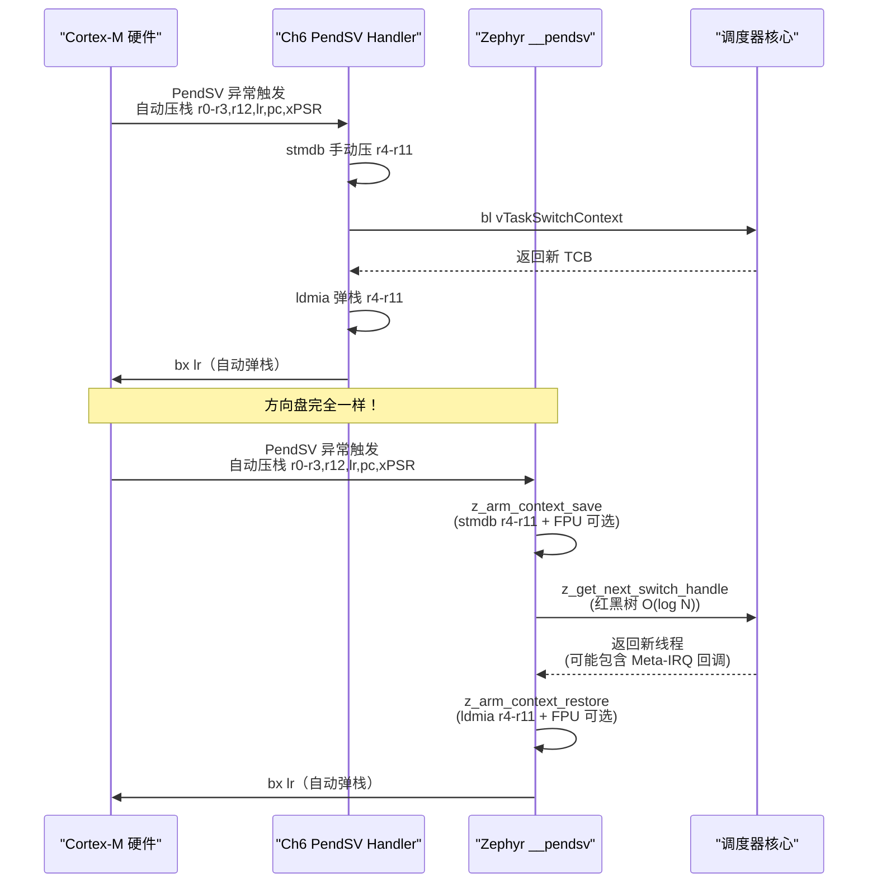
```mermaid
sequenceDiagram
    participant HW as "Cortex-M 硬件"
    participant Ch6 as "Ch6 PendSV Handler"
    participant Z as "Zephyr __pendsv"
    participant Sched as "调度器核心"
    
    HW->>Ch6: PendSV 异常触发<br/>自动压栈 r0-r3,r12,lr,pc,xPSR
    Ch6->>Ch6: stmdb 手动压 r4-r11
    Ch6->>Sched: bl vTaskSwitchContext
    Sched-->>Ch6: 返回新 TCB
    Ch6->>Ch6: ldmia 弹栈 r4-r11
    Ch6->>HW: bx lr（自动弹栈）
    
    Note over HW,Z: 方向盘完全一样！
    
    HW->>Z: PendSV 异常触发<br/>自动压栈 r0-r3,r12,lr,pc,xPSR
    Z->>Z: z_arm_context_save<br/>(stmdb r4-r11 + FPU 可选)
    Z->>Sched: z_get_next_switch_handle<br/>(红黑树 O(log N))
    Sched-->>Z: 返回新线程<br/>(可能包含 Meta-IRQ 回调)
    Z->>Z: z_arm_context_restore<br/>(ldmia r4-r11 + FPU 可选)
    Z->>HW: bx lr（自动弹栈）
```

---


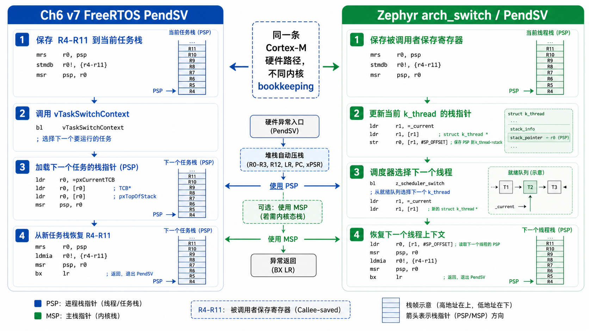


### 15.3 差异在策略层，不在硬件层

读完两个 PendSV，结论只有一句：**PendSV 是 ARM 给的硬件契约，方向盘完全一样。差异在"选下一个线程"那一行调用的函数里。**

| 层面 | Ch6 FreeRTOS | Zephyr | 方向盘 vs 导航 |
|---|---|---|---|
| 硬件触发 | `SCB->ICSR |= 1<<28` | `SCB->ICSR |= 1<<28` | **同一个物理开关** |
| 上下文保存 | `stmdb/ldmia r4-r11` | `z_arm_context_save/restore`（等价展开） | **同一套刹车油门** |
| 异常优先级 | 最低 0xFF | 最低 0xFF | **同一条规则** |
| **选下一个线程** | `vTaskSwitchContext` → 链表 O(1) | `z_get_next_switch_handle` → 红黑树 O(log N) | **导航路线不同！** |
| 时间片管理 | `xTaskIncrementTick` 在 Systick ISR | `z_clock_elapsed` 在定时器内 | 路线不同 |
| 栈溢出检测 | `vApplicationStackOverflowHook` 软件检查 | `CONFIG_HW_STACK_PROTECTION=y` MPU 硬件检测 | 安全策略不同 |

你在 Ch6 §7 手撕 PendSV 学到的**硬件层知识完全保值**。切换到 Zephyr 不用重新理解 `mrs psp` / `stmdb` / PendSV 异常抢占规则——这些是 ARM 给的，不是 RTOS 给的。你只需要换脑子理解 Zephyr `z_get_next_switch_handle` 里红黑树的遍历逻辑。

> **生活比喻**：PendSV 就是方向盘——不管你是开五菱宏光（FreeRTOS）还是开奔驰 S 级（Zephyr），方向盘都长那个样，左打左转、右打右转。差别在于车里的导航系统：五菱用纸地图（链表 O(1)），奔驰用北斗高精导航（红黑树 O(log N) + Meta-IRQ）。方向盘的操作（mrs psp / stmdb / bx lr）不因车的品牌而变。


---


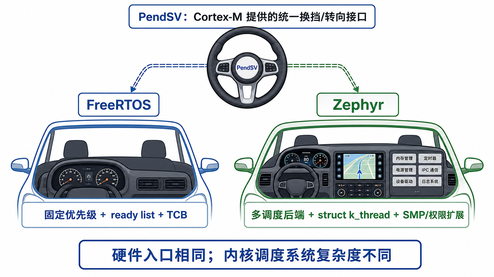

## 16 同步原语全景对比

同步原语是 RTOS 和裸机编程最明显的分界线。你在 Ch6 §9~§11 用过 FreeRTOS 全套工具：信号量、互斥锁、队列、事件组、任务通知。那是**作坊的工具箱**——信号量是个牌子（binary semaphore），互斥锁是把钥匙（mutex），队列是个筐（xQueue），任务通知是个挂在肩膀上的对讲机（task notification）。

Zephyr 的工具箱更大、分类更细、命名以 `k_` 前缀统一、API 设计吸收了 Linux 内核的 wait_queue 思想。**作坊的工具箱有 5 件工具，工厂的工具墙有 7 件，每件有标准编号**。

---

### 16.1 六种原语大表：作坊工具箱 vs 工厂工具墙

先把 Ch6 和 Zephyr 的六种核心原语并排对比：

| Ch6 原语 | Ch6 API | Zephyr 原语 | Zephyr API | 作坊 vs 工厂 |
|---|---|---|---|---|
| Binary Semaphore | `xSemaphoreCreateBinary` → `xSemaphoreGive` / `xSemaphoreTake` | `k_sem` | `k_sem_init(&sem, initial, limit)` → `k_sem_give` / `k_sem_take` | 作坊：牌子（空/有）。工厂：计数器牌（初始值、上限都显式设） |
| Counting Semaphore | `xSemaphoreCreateCounting(max, initial)` | `k_sem`（同一种，`limit=1` 即 binary） | `k_sem_init(&sem, 5, 10)` | Zephyr 不区分 binary/counting，一个 API 搞定 |
| Mutex | `xSemaphoreCreateMutex` → `xSemaphoreTake` / `xSemaphoreGive` | `k_mutex`（**独立类型**，不是 semaphore 变体） | `k_mutex_init` → `k_mutex_lock` / `k_mutex_unlock` | 作坊：钥匙（用信号量改的）。工厂：独立锁系统，支持天花板和死锁检测 |
| Queue | `xQueueCreate(len, itemSize)` → `xQueueSend` / `xQueueReceive` | `k_msgq` | `K_MSGQ_DEFINE(q, itemSize, max, align)` → `k_msgq_put` / `k_msgq_get` | 作坊：一个筐什么都装。工厂：`k_msgq`（定长数据筐）+ `k_fifo`（指针传送带）分工 |
| — | `xQueue` 传指针模拟 | `k_fifo` | `K_FIFO_DEFINE(f)` → `k_fifo_put` / `k_fifo_get` | 工厂独有：只传指针不拷贝，适合大 buffer |
| Event Group | `xEventGroupCreate` → `xEventGroupSetBits` / `xEventGroupWaitBits` | `k_event` | `K_EVENT_DEFINE(e)` → `k_event_post` / `k_event_wait` | 作坊：黑板贴便签。工厂：电子公告板，API 对齐 |
| Task Notification | `xTaskNotifyGive` / `ulTaskNotifyTake` | `k_poll_signal` | `k_poll_signal_init` → `k_poll_signal_raise` / `k_poll` | 作坊：肩膀上的对讲机（内嵌 TCB，快但耦合）。工厂：独立信号装置（解耦） |
| — | — | `k_condvar` | `k_condvar_init` → `k_condvar_wait` / `k_condvar_signal` | **Ch6 完全没有**！pthread 风格条件变量 |

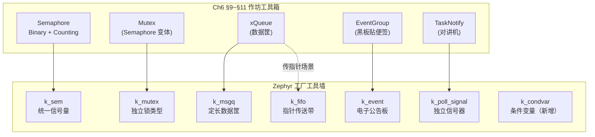
```mermaid
graph TD
    subgraph "Ch6 §9~§11 作坊工具箱"
        A1["Semaphore<br/>Binary + Counting"] 
        A2["Mutex<br/>(Semaphore 变体)"]
        A3["xQueue<br/>(数据筐)"]
        A4["EventGroup<br/>(黑板贴便签)"]
        A5["TaskNotify<br/>(对讲机)"]
    end
    subgraph "Zephyr 工厂工具墙"
        B1["k_sem<br/>统一信号量"]
        B2["k_mutex<br/>独立锁类型"]
        B3["k_msgq<br/>定长数据筐"]
        B4["k_fifo<br/>指针传送带"]
        B5["k_event<br/>电子公告板"]
        B6["k_poll_signal<br/>独立信号器"]
        B7["k_condvar<br/>条件变量（新增）"]
    end
    A1 --> B1
    A2 --> B2
    A3 --> B3
    A3 -.->|"传指针场景"| B4
    A4 --> B5
    A5 --> B6
```

选型经验：

| 场景 | 用哪个 | 原因 |
|---|---|---|
| ISR 通知线程"数据到了" | `k_sem` | ISR 只能 `k_sem_give`，不能 `take`/`lock` |
| 线程互斥访问共享变量 | `k_mutex` | 独立类型，优先级继承，不要在 ISR 用 |
| 传小 struct（传感器数据、命令包） | `k_msgq` | `memcpy` 副本，编译期定大小和对齐 |
| 传大 buffer 指针（网络包、文件块） | `k_fifo` | 不拷贝数据，只传指针，无上限 |
| 等多个事件中任意一个 | `k_event` | 位掩码，`k_event_wait` 可等任意/全部 |
| 条件同步（broadcast） | `k_condvar + k_mutex` | pthread 风格，Ch6 只能 EventGroup 凑合 |
| 轻量级二值通知 | `k_poll_signal` | 独立对象，不比 task notify 快但更干净 |

---


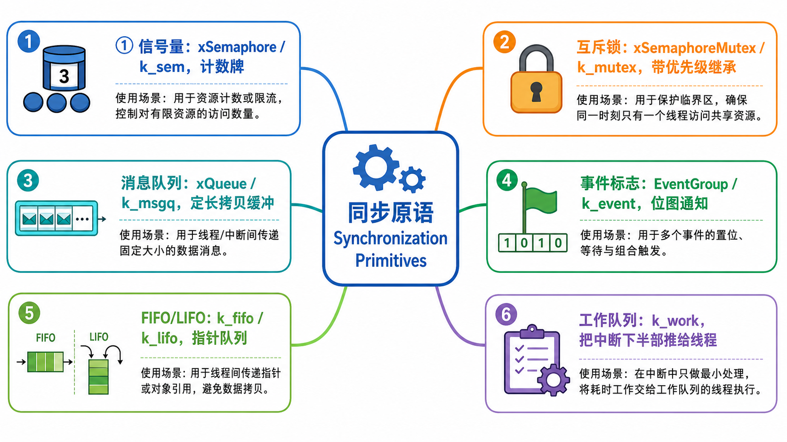


### 16.2 k_mutex 优先级继承：VIP 插队，但帮你干活

互斥锁的核心问题你已经在 Ch6 §11 解决了：**优先级反转**。那就是著名的"火星探测器 Pathfinder 事故"——低优先级线程持锁，高优先级线程被中等优先级线程无限期阻塞。

Ch6 的解决方案是**优先级继承**：mutex holder 临时继承等待者中最高的优先级。Zephyr 做了完全一样的事，但多了一条路：**优先级天花板**。

> **生活比喻**：VIP 客户（高优先级线程 A）要进 VIP 室，但钥匙在普通客户（低优先级线程 C）手里。优先级继承 = 给 C 挂个 VIP 工牌，让 C 以 VIP 身份赶紧用完钥匙还给 A，期间中等优先级的 B 挤不进来。优先级天花板 = 这把钥匙本身就要求"任何人拿这把钥匙时必须升到 VIP 级别"，C 拿钥匙的瞬间就变成 VIP。

| 维度 | Ch6 Mutex (§11) | Zephyr `k_mutex` | 比喻 |
|---|---|---|---|
| 类型 | `SemaphoreHandle_t`（mutex 是 semaphore 变体） | `struct k_mutex`（独立类型） | 作坊：钥匙也是牌子。工厂：锁是独立系统 |
| 优先级继承 | 自动，`configUSE_MUTEXES=1` | 自动，`CONFIG_PRIORITY_CEILING=n`（默认） | VIP 工牌模式 |
| 优先级天花板 | 无 | `CONFIG_PRIORITY_CEILING=y`，创建时指定天花板优先级 | 钥匙自带 VIP 模式 |
| 重入锁 | `xSemaphoreCreateRecursiveMutex` | **支持**——`k_mutex` 是可重入锁，同一线程可重复 lock，必须 unlock 同样次数 | FreeRTOS 分开设计，Zephyr 一把锁内置此能力 |
| 锁持有者 | `pxMutexHolder` (TCB 字段) | `mutex->owner` (`struct k_thread *`) | 机制相同 |
| ISR 内 | 禁止（assert） | 禁止（`__ASSERT(!k_is_in_isr())`） | 一致 |
| 死锁检测 | 无 | `CONFIG_DEADLOCK_DETECTION=y` | 工厂多一项安全机制 |

Zephyr 优先级继承的源码路径（`kernel/mutex.c`），和 Ch6 §11 你见过的 mutex holder 提升逻辑完全同构：

```c
/* kernel/mutex.c —— k_mutex_lock 优先级继承路径
 * 这就是 Ch6 §11 v5 你手撕的 xQueueGenericSend 旁边那段
 * mutex holder 优先级提升逻辑的 Zephyr 版本 */
static int mutex_lock(struct k_mutex *mutex, k_timeout_t timeout)
{
    int key = k_spin_lock(&lock);
    
    if (mutex->lock_count == 0) {
        /* 没人持锁，直接拿 —— 对应 Ch6 的 "mutex 是 count=1 的 semaphore" */
        mutex->lock_count = 1;
        mutex->owner = _current;
    } else if (mutex->owner == _current) {
        /* 自己已经持锁，重入拿 —— Zephyr k_mutex 是 reentrant mutex */
        mutex->lock_count++;
        return 0;
    } else {
        /* 有人持锁 —— 触发优先级继承
         * 这就是 Ch6 §11 你撕的那段：if(pxMutexHolder->uxBasePriority < ...) */
        if (z_is_prio_higher(_current->base.prio,
                             mutex->owner->base.prio)) {
            /* 提升持有者优先级到和等待者一样高
             * 对应 Ch6: vTaskPrioritySet(pxMutexHolder, uxTaskPriorityGet(self)) */
            z_sched_priority_set(mutex->owner,
                                 _current->base.prio);
        }
        /* 当前线程挂到 mutex 等待队列
         * 对应 Ch6: vListInsert(&mutex->xTasksWaitingToLock, &self->xEventListItem) */
        return z_pend_curr(&lock, &mutex->wait_q, timeout);
    }
    
    k_spin_unlock(&lock, key);
    return 0;
}
```

关键差异：Ch6 的优先级继承是"事件触发"——在 mutex give 时恢复原优先级；Zephyr 是"调度器感知"——每次 `z_sched_priority_set` 后立即 rebalance 红黑树，holder 被中间优先级线程抢走的概率降到最低。

> `CONFIG_PRIORITY_CEILING=y` 时，Zephyr 走另一条路：创建 mutex 时指定天花板优先级，任何线程拿锁后自动升到天花板，还锁降回。比继承更快（不用逐级提升），但需要你设计时就定好每个 mutex 的天花板值。这在安全认证场景（ISO 26262 / DO-178C）里比继承更受欢迎，因为 WCET 更容易分析。

---


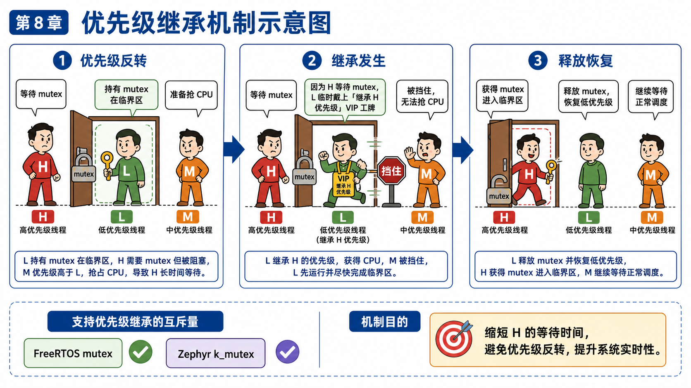

### 16.3 k_msgq vs k_fifo
### 16.3 k_msgq vs k_fifo：定长快递柜 vs 不限长传送带

Ch6 里数据传递只有一个原语：`xQueue`。不管传整数、传指针、传小 struct，`xQueueSend` 都做 `memcpy`（按 `uxItemSize` 字节拷贝）。这像**作坊里只有一个筐，什么都往里扔**。

Zephyr 把筐拆成了两种设备：

| 特性 | Ch6 `xQueue` | Zephyr `k_msgq` | Zephyr `k_fifo` | 比喻 |
|---|---|---|---|---|
| 语义 | `memcpy` 数据副本 | `memcpy` 数据副本 | 只存指针，不拷数据 | `k_msgq`=快递柜（存实物），`k_fifo`=传送带（存取件码） |
| 元素大小 | `uxItemSize` 字节 | `msg_size` 字节 | `sizeof(void *)` 固定 | 柜子格口大小 vs 传送带宽度 |
| 容量 | `uxQueueLength` 有限 | `max_msgs` 有限 | **无上限**（链表） | 柜子格口数 vs 传送带无限延伸 |
| 内存布局 | 连续 buffer（`pvPortMalloc`） | 连续 ring buffer | 链表节点 | 一排固定柜子 vs 传送带上的挂钩 |
| ISR 安全 | `xQueueSendFromISR` | `k_msgq_put_from_isr` | `k_fifo_put` 可 ISR | ISR 里都能放，`k_fifo` 最简单 |
| 适用场景 | 什么都装 | 传小 struct（传感器数据、命令包） | 传大 buffer 指针（网络包、文件块） | 小件走柜子，大件走传送带 |

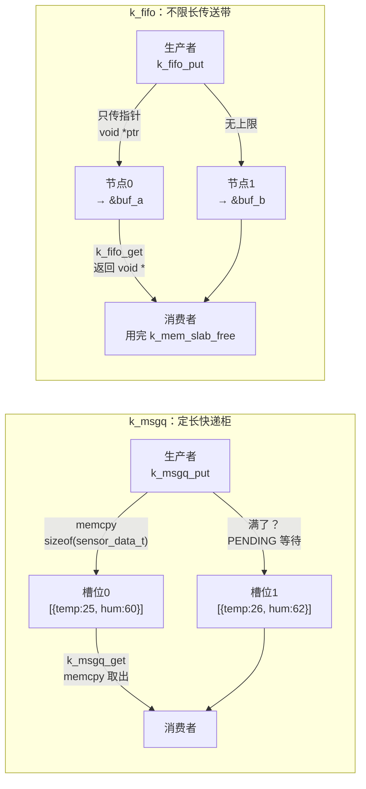
```mermaid
graph LR
    subgraph "k_msgq：定长快递柜"
        direction TB
        P1["生产者<br/>k_msgq_put"] -->|"memcpy<br/>sizeof(sensor_data_t)"| G1["槽位0<br/>[{temp:25, hum:60}]"]
        P1 -->|"满了？<br/>PENDING 等待"| G2["槽位1<br/>[{temp:26, hum:62}]"]
        G1 -->|"k_msgq_get<br/>memcpy 取出"| C1["消费者"]
        G2 --> C1
    end

    subgraph "k_fifo：不限长传送带"
        direction TB
        P2["生产者<br/>k_fifo_put"] -->|"只传指针<br/>void *ptr"| N1["节点0<br/>→ &buf_a"]
        P2 -->|"无上限"| N2["节点1<br/>→ &buf_b"]
        N1 -->|"k_fifo_get<br/>返回 void *"| C2["消费者<br/>用完 k_mem_slab_free"]
        N2 --> C2
    end
```

代码对照——从 Ch6 `xQueue` 迁移：

```c
/* ========== Ch6 §9 写法 ========== */
QueueHandle_t q = xQueueCreate(10, sizeof(sensor_data_t));
sensor_data_t d = {.temp = 25, .humidity = 60};
xQueueSend(q, &d, portMAX_DELAY);        /* memcpy 进队列 */
/* 另一线程 */
sensor_data_t rd;
xQueueReceive(q, &rd, portMAX_DELAY);    /* memcpy 出来 */

/* ========== Zephyr k_msgq 等价写法 ========== */
K_MSGQ_DEFINE(sensor_q, sizeof(sensor_data_t), 10, 4);
/*                                       容量=10    对齐=4 */
sensor_data_t d = {.temp = 25, .humidity = 60};
k_msgq_put(&sensor_q, &d, K_FOREVER);     /* memcpy 进队列 */
/* 另一线程 */
sensor_data_t rd;
k_msgq_get(&sensor_q, &rd, K_FOREVER);    /* memcpy 出来 */

/* ========== k_fifo：传大 buffer 指针（Ch6 无直接对应）========== */
K_FIFO_DEFINE(net_fifo);
struct net_pkt *pkt = alloc_net_pkt(1500); /* 大 buffer，1500 字节 */
k_fifo_put(&net_fifo, pkt);                /* 只传指针！不拷贝 1500 字节 */
/* 另一线程 */
struct net_pkt *rx = k_fifo_get(&net_fifo, K_FOREVER); /* 拿到指针 */
process(rx);
free_net_pkt(rx);                           /* 用完释放 */
```

注意 `K_MSGQ_DEFINE` 第四个参数 `align`（4 字节对齐）。Ch6 不关心对齐因为 `pvPortMalloc` 默认 `portBYTE_ALIGNMENT`。`K_MSGQ_DEFINE` 的第四个参数 `align` 声明对齐要求。Zephyr 的消息队列底层用 `memcpy()` 传输数据，不对数据做任何解引用——因此即使数据对齐不完美，也不会触发 UsageFault。对齐参数主要用于优化访问速度和 DMA 场景。

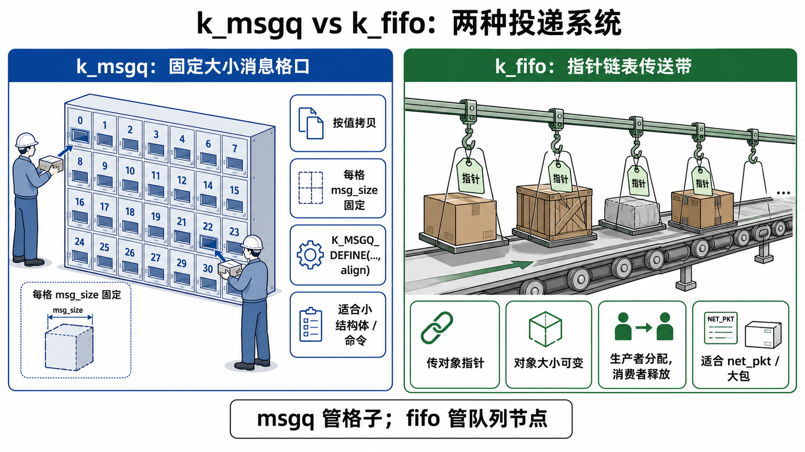

---

### 16.4 v7 demo：同步原语六合一遍历

```c
/*
 * demo_v7.c —— 同步原语全遍历
 * 从 k_sem 走到 k_condvar，六种原语逐个验证
 * 对应 Ch6 §9~§11 的全套同步实验
 */
#include <zephyr/kernel.h>

/* —— 1. k_sem (binary)：ISR 通知线程 —— */
/*    对应 Ch6 §9 v2 的 xSemaphoreCreateBinary */
K_SEM_DEFINE(btn_sem, 0, 1);  /* initial=0, limit=1 → binary semaphore */

/* —— 2. k_mutex：线程互斥 —— */
/*    对应 Ch6 §11 v5 的 xSemaphoreCreateMutex */
K_MUTEX_DEFINE(print_mutex);

/* —— 3. k_msgq：定长数据传递 —— */
/*    对应 Ch6 §9 v3 的 xQueueCreate(4, sizeof(struct cmd)) */
struct cmd { int id; int value; };
K_MSGQ_DEFINE(cmd_q, sizeof(struct cmd), 4, 4);

/* —— 4. k_fifo：指针传递 —— */
/*    Ch6 无直接对应，通常用 xQueue 传指针模拟 */
K_FIFO_DEFINE(data_fifo);

/* —— 5. k_event：事件组 —— */
/*    对应 Ch6 §10 v2 的 xEventGroupCreate */
K_EVENT_DEFINE(evt);
#define EVT_SENSOR_READY  (1 << 0)
#define EVT_CAL_DONE      (1 << 1)

/* —— 6. k_condvar：条件变量 —— */
/*    Ch6 完全无此原语！pthread 风格 */
K_MUTEX_DEFINE(cond_mutex);
K_CONDVAR_DEFINE(cond);

/* === 生产者线程：发出全部六种同步信号 === */
void producer(void *p1, void *p2, void *p3)
{
    k_msleep(100);  /* 等消费者准备好 */

    /* 1. 给信号量 —— 模拟按键 ISR */
    /*    对应 Ch6: xSemaphoreGiveFromISR(btnSem, &xHigherPriorityTaskWoken) */
    k_sem_give(&btn_sem);
    printk("[PROD] k_sem_give → 唤醒等待者\n");

    /* 2. 给消息队列 —— 发送命令 */
    /*    对应 Ch6: xQueueSend(cmdQ, &c, portMAX_DELAY) */
    struct cmd c = {.id = 1, .value = 42};
    k_msgq_put(&cmd_q, &c, K_FOREVER);
    printk("[PROD] k_msgq_put {id=%d, val=%d}\n", c.id, c.value);

    /* 3. 给 fifo —— 传递数据指针 */
    static int raw_data = 0xDEADBEEF;
    k_fifo_put(&data_fifo, &raw_data);
    printk("[PROD] k_fifo_put → &raw_data=0x%p\n", (void *)&raw_data);

    /* 4. 发事件 —— 传感器就绪 */
    /*    对应 Ch6: xEventGroupSetBits(evt, EVT_SENSOR_READY) */
    k_event_post(&evt, EVT_SENSOR_READY);
    printk("[PROD] k_event_post EVT_SENSOR_READY\n");

    /* 5. 条件变量通知 */
    k_mutex_lock(&cond_mutex, K_FOREVER);
    k_condvar_signal(&cond);
    printk("[PROD] k_condvar_signal → 通知等待者\n");
    k_mutex_unlock(&cond_mutex);

    printk("[PROD] 全部六种同步信号已发送，退出\n");
}

/* === 消费者线程：逐个等待六种同步信号 === */
void consumer(void *p1, void *p2, void *p3)
{
    /* 1. 等信号量 */
    /*    对应 Ch6: xSemaphoreTake(btnSem, portMAX_DELAY) */
    k_sem_take(&btn_sem, K_FOREVER);
    printk("[CONS] 1/6 k_sem_take ✓\n");

    /* 2. 收消息队列 */
    /*    对应 Ch6: xQueueReceive(cmdQ, &c, portMAX_DELAY) */
    struct cmd c;
    k_msgq_get(&cmd_q, &c, K_FOREVER);
    printk("[CONS] 2/6 k_msgq_get {id=%d, val=%d} ✓\n", c.id, c.value);

    /* 3. 收 fifo */
    int *p = k_fifo_get(&data_fifo, K_FOREVER);
    printk("[CONS] 3/6 k_fifo_get → *p=0x%X ✓\n", *p);

    /* 4. 等事件 */
    /*    对应 Ch6: xEventGroupWaitBits(evt, EVT_SENSOR_READY|EVT_CAL_DONE, ...) */
    k_event_wait(&evt, EVT_SENSOR_READY | EVT_CAL_DONE,
                 false, K_FOREVER);
    printk("[CONS] 4/6 k_event_wait ✓\n");

    /* 5. 等条件变量 */
    /*    Ch6 无此原语！需要用 EventGroup + mutex 模拟 */
    k_mutex_lock(&cond_mutex, K_FOREVER);
    k_condvar_wait(&cond, &cond_mutex, K_FOREVER);
    printk("[CONS] 5/6 k_condvar_wait ✓ (Ch6 无此原语)\n");
    k_mutex_unlock(&cond_mutex);

    printk("[CONS] 全部六种同步信号已收到，全部通过 ✓\n");
}

K_THREAD_DEFINE(prod_tid, 1024, producer, NULL, NULL, NULL, 2, 0, 0);
K_THREAD_DEFINE(cons_tid, 1024, consumer, NULL, NULL, NULL, 2, 0, 0);
```

串口输出预期：

```
[CONS] 1/6 k_sem_take ✓
[PROD] k_sem_give → 唤醒等待者
[CONS] 2/6 k_msgq_get {id=1, val=42} ✓
[PROD] k_msgq_put {id=1, val=42}
[CONS] 3/6 k_fifo_get → *p=0xDEADBEEF ✓
[PROD] k_fifo_put → &raw_data=0x...
[CONS] 4/6 k_event_wait ✓
[PROD] k_event_post EVT_SENSOR_READY
[CONS] 5/6 k_condvar_wait ✓ (Ch6 无此原语)
[PROD] k_condvar_signal → 通知等待者
[PROD] 全部六种同步信号已发送，退出
[CONS] 全部六种同步信号已收到，全部通过 ✓
```

---


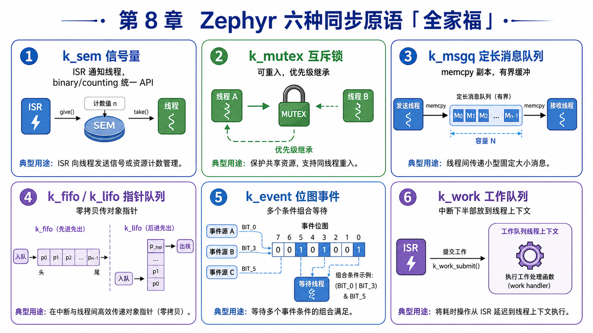

## 17 内存管理：heap_4 → k_mem_slab

内存管理是你从 Ch6 §11 到 §13 贯穿的主线之一。你在 §12 用 `pvPortMalloc` / `vPortFree` 分配 TCB 和栈，在 §13 手撕了 heap_4 的内部结构——空闲块链表 + 相邻合并。FreeRTOS 的选择很明确：**一个全局 heap，动态分配一切**。

Zephyr 走了另一条路。它的第一推荐不是 `k_malloc`，而是**编译期确定的 `k_mem_slab`**。这不是"谁好谁差"，是两种设计哲学的岔路口——你要灵活还是要确定？你要运行时自由还是要编译期保证？

> **核心比喻**：Ch6 heap_4 = **公共储物间**——要多大切多大，但久了满地碎片。Zephyr k_mem_slab = **标准货架**——每个格子尺寸固定、数量固定，永远整洁，永远 O(1)。

---

### 17.1 heap_4：公共储物间——灵活但会碎

你在 Ch6 §13 v3 手撕了 heap_4 的全部源码。核心就三个东西：

1. **一个大数组**：`static uint8_t ucHeap[configTOTAL_HEAP_SIZE]`——**储物间总面积**
2. **空闲块链表**：`static BlockLink_t xStart, *pxEnd`，按地址排序——**贴在墙上的"空闲空间表"**
3. **`pvPortMalloc`**：遍历链表 → 找到足够大的块 → 切分（剩余插回链表）——**管理员按表找空地、划线、登记**
4. **`vPortFree`**：标记为空闲 → 检查前后邻居能否合并 → 合并——**退租时看看隔壁空不空，空了就打通**

复杂度 O(N)（N = 空闲块数量），最坏情况遍历整个空闲链。用久了碎片满地。

> **生活比喻**：公共储物间——你要 64 字节？管理员拉卷尺量一块给你。你要 512 字节？再量一块大的。100 个人用完还回来，原来一整块地被切成 37 块零散的，想放个 1KB 的东西——空间总量够，但没有连续的大块了。这就是**碎片化**。

---


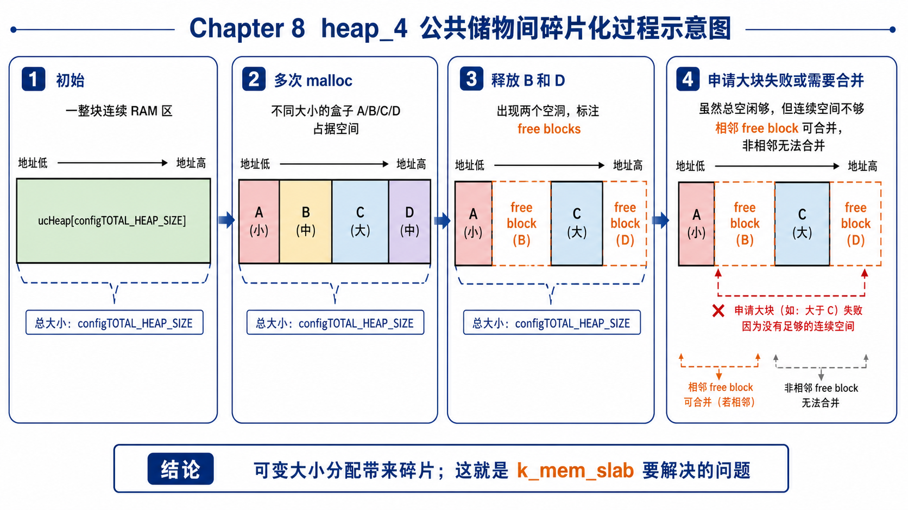

### 17.2 k_mem_slab
### 17.2 k_mem_slab：标准货架——永远整洁，永远 O(1)

Zephyr 的第一选择完全反过来：**编译期定死"每个格子多大、一共几个格子"**。

```c
/* 编译期定义：4 字节对齐 × 64 字节/块 × 8 块 */
K_MEM_SLAB_DEFINE(my_slab, 64, 8, 4);
/*                       块大小  数量  对齐 */

/* 拿一块 —— O(1)，从 freelist 取链表头 */
void *block;
int ret = k_mem_slab_alloc(&my_slab, &block, K_FOREVER);

/* 用完还回去 —— O(1)，插回 freelist 链表头 */
k_mem_slab_free(&my_slab, &block);
```

| 维度 | Ch6 heap_4（公共储物间） | Zephyr `k_mem_slab`（标准货架） | Zephyr `k_heap`（可选后路） |
|---|---|---|---|
| 分配粒度 | 任意字节 | 固定 `block_size` | 任意字节 |
| 块数量 | 动态，直到 heap 耗尽 | 编译期 `num_blocks` 写死 | 动态（底层用 buddy allocator） |
| 分配时间 | **O(N)** 遍历空闲链 | **O(1)** freelist 取链头 | O(log N) |
| 碎片 | **有**，需合并 | **零碎片**（所有块等大） | 有 |
| WCET 可预测 | 不可（N 不可控） | **完全可预测**（永远是 O(1)） | 部分可预测 |
| 内存来源 | `configTOTAL_HEAP_SIZE` 静态数组 | `K_MEM_SLAB_DEFINE` 静态 buffer | `k_heap_init` 指定区域 |
| ISR 安全 | 不 | `k_mem_slab_alloc` 不可 ISR（会阻塞） | `k_heap_alloc` 不可 ISR |
| Kconfig | `configTOTAL_HEAP_SIZE` | 无（编译器算） | `CONFIG_HEAP_MEM_POOL_SIZE` |

`K_MEM_SLAB_DEFINE(my_slab, 64, 8, 4)` 展开后生成一个 `struct k_mem_slab` + 一个 `char buffer[64 * 8]`（4 字节对齐）。`k_mem_slab_alloc` 从 freelist 取链头——**确定性的 O(1)**。这正是 ISO 26262 / DO-178C 安全认证最喜欢的特性：最坏情况执行时间（WCET）可预测。

```c
/* K_MEM_SLAB_DEFINE 的宏展开（简化） */
struct k_mem_slab my_slab;
char __aligned(4) _slab_buf_my_slab[64 * 8]; /* 512 字节连续内存 */

/* k_mem_slab_alloc 的 O(1) 核心逻辑（简化） */
static inline int slab_alloc(struct k_mem_slab *slab, void **mem)
{
    if (slab->num_used >= slab->num_blocks)
        return -ENOMEM;             /* 全满了 */
    
    void *p = slab->free_list;      /* 取头部空闲块 —— O(1)! */
    slab->free_list = *(void **)p;  /* 链表头移到下一个 —— O(1)! */
    slab->num_used++;
    *mem = p;
    return 0;
}
/* 对比 Ch6 heap_4 的 pvPortMalloc: while(pxBlock->xBlockSize < xWantedSize)
 *   pxBlock = pxBlock->pxNextFreeBlock;  ← O(N) 遍历！ */
```

---

### 如何确定线程栈大小：实战指南

线程栈大小是嵌入式 RTOS 中最容易"凭感觉"设置的参数。Ch6 里你给每个任务写 `STACK_SIZE 256` 或 `512`，这个数字怎么来的？通常是"先写大一点，跑起来不崩就行"。Zephyr 给了你三种科学方法来确定栈大小，不再凭感觉。

#### 方法一：编译期查 `K_THREAD_STACK_SIZEOF`

`K_THREAD_STACK_SIZEOF` 不是简单的 `sizeof`——它返回的是**实际可用字节数**，已经扣除了 MPU guard 区和元数据占用的空间。你可以在代码里打印出来：

```c
K_THREAD_STACK_DEFINE(my_stack, 1024);

void main(void)
{
    size_t usable = K_THREAD_STACK_SIZEOF(my_stack);
    printk("Stack defined: 1024 bytes\n");
    printk("Usable:       %u bytes\n", usable);
    printk("Overhead:     %u bytes (MPU guard + metadata)\n", 1024 - usable);
}
```

典型输出（Cortex-M4，MPU 使能）：
```
Stack defined: 1024 bytes
Usable:       992 bytes
Overhead:     32 bytes (MPU guard + metadata)
```

这 32 字节不是你浪费的——它买来了 MPU 硬件栈溢出保护（线程写穿栈底立刻触发 MemManage fault，比 Ch6 的 `uxTaskGetStackHighWaterMark` 软件检查快一万倍）。

#### 方法二：运行时查 `k_thread_stack_space_get()`

打开 `prj.conf` 里的栈信息开关：

```
CONFIG_THREAD_STACK_INFO=y
```

然后在你的线程里定期调用：

```c
static void my_thread_fn(void *a, void *b, void *c)
{
    while (1) {
        size_t unused = k_thread_stack_space_get(k_current_get());
        printk("Stack unused: %u bytes\n", unused);
        k_msleep(5000);  /* 每 5 秒报告一次 */
    }
}
```

跑一段时间（覆盖最坏路径——比如所有中断同时触发、所有嵌套调用全部走一遍），看最小的 unused 值。如果最小余量 < 64 字节，你的栈太小了。

#### 方法三：看 `.map` 文件中栈符号的实际地址

编译后在 `build/zephyr/zephyr.map` 里搜索你的栈符号名：

```
 .bss           0x20000a80      0x400 build/zephyr/kernel/kernel.c.obj
                0x20000a80      my_stack
```

`0x400` = 1024 字节，验证编译器确实分配了你指定的大小。如果你用的是 `K_THREAD_STACK_DEFINE(s, 1024)`，而 `.map` 里只看到 992 字节——说明你的栈对象被放在了一个紧凑区间，guard 区被合并了（检查 `CONFIG_MPU_STACK_GUARD=y` 是否打开）。

#### 一句话原则

> **"从 512 开始测，加到你不再看到 stack overflow。"**

不要从 4096 开始往下降——栈越大越浪费 RAM，在 16KB RAM 的 MCU 上这是奢侈品。从 512 字节起步，用 `k_thread_stack_space_get()` 监测余量。如果余量 > 128 字节，砍到 256 字节继续测。找到刚好不崩的最小值，留 20% 安全余量——这就是你的栈大小。

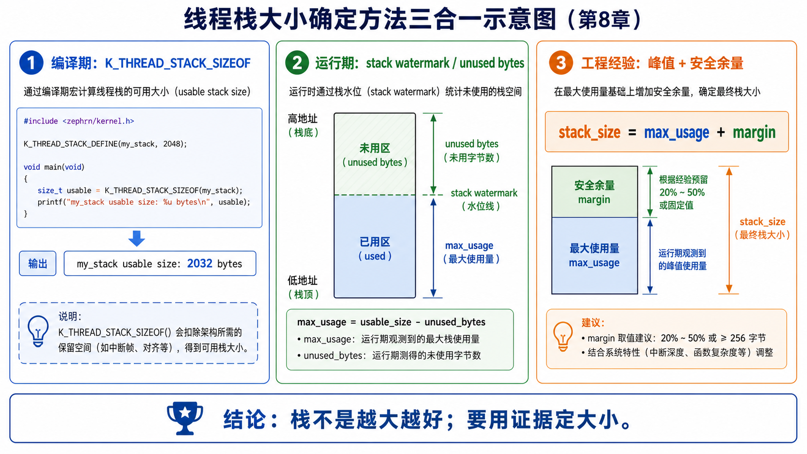

### 17.3 两种哲学岔路口


```mermaid
graph TD
    subgraph "Ch6 §13 / FreeRTOS 哲学：运行时灵活"
        A1["一个大 heap<br/>ucHeap[TOTAL_HEAP_SIZE]"] --> A2["pvPortMalloc(N)<br/>要多大切多大"]
        A2 --> A3["运行时分配<br/>灵活但不可预测"]
        A3 --> A4["碎片化 → 合并<br/>vPortFree 检查邻居"]
        A4 -.->|"用久了"| A5["❌ 可能没有连续大块<br/>即使总量够"]
    end

    subgraph "Zephyr 哲学：编译期确定"
        B1["标准货架<br/>K_MEM_SLAB_DEFINE"] --> B2["固定块大小 × 固定块数<br/>编译期算好"]
        B2 --> B3["运行时 O(1)<br/>确定性 WCET"]
        B3 --> B4["零碎片<br/>永远整洁"]
        B4 --> B5["✅ 安全认证友好<br/>ISO 26262 / DO-178C"]
    end

    style A5 fill:#ffaaaa
    style B5 fill:#aaffaa
```

| 场景 | Ch6 做法 | Zephyr 推荐 | 储物间 vs 货架 |
|---|---|---|---|
| 分配线程栈 | `pvPortMalloc(512)` | `K_THREAD_STACK_DEFINE(s, 1024)` | 储物间量一块 / 标准工位 |
| 分配 TCB | `xTaskCreate` 内部 `pvPortMalloc` | `K_THREAD_DEFINE` 编译期 | 管理员现找 / 提前安排好 |
| 分配消息 buffer | `pvPortMalloc(len)` → 用完 `vPortFree` | `k_mem_slab_alloc` 拿固定块 → `k_mem_slab_free` | 量一块地 / 从货架取 |
| 分配传感器采样数组 | `pvPortMalloc(N*sizeof(sample_t))` | `K_MEM_SLAB_DEFINE(slab, sizeof(sample_t), N, 4)` | 量 N 格 / N 格货架 |
| "真不知道 N 是多少" | `pvPortMalloc` | `k_heap_alloc`（`sys_heap` buddy allocator） | 工厂也留了后路，但不推荐 |

Zephyr 不是没有动态分配——`CONFIG_HEAP_MEM_POOL_SIZE=4096` + `k_heap_alloc` 和 Ch6 `pvPortMalloc` 一个味道。但整个 Zephyr 内核源码的默认姿态是"**能不 malloc 就不 malloc**"。`struct device` 的 `config` 指向 `const` ROM 数据，`data` 编译期算好偏移——内核启动全过程一次 `malloc` 都不会调。

> Ch6 教会了你 heap 是怎么工作的，那个知识完全保值。Zephyr 在此基础上给了你另一个选择——**把你对 RAM 用量的所有决策从运行时提到编译期**。这在需求冻结、认证必须、WCET 分析通不过就不能量产的工业场景里，是救命级的能力。


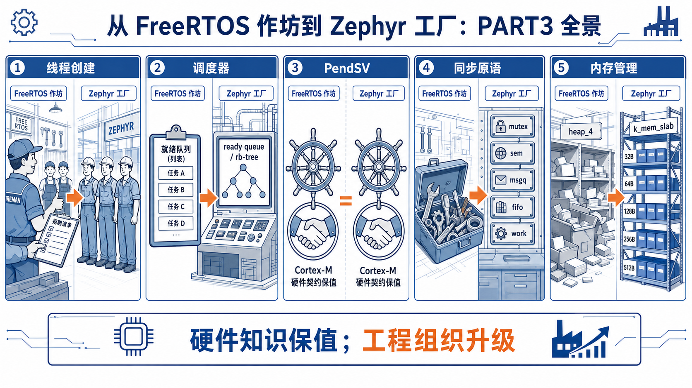

---


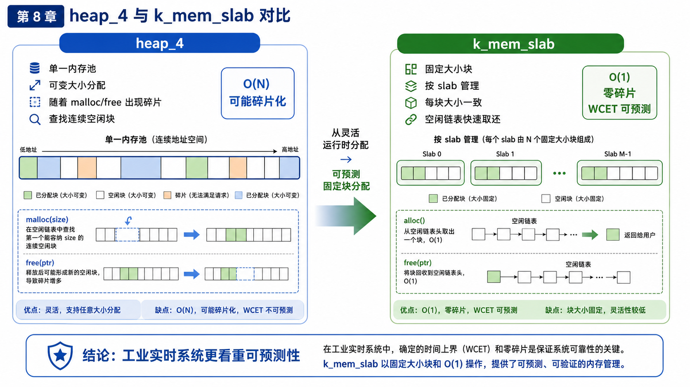


DONE_PART3_V2
# PART 4 · 多任务工程化：像写Linux应用那样写Zephyr

> **核心命题：** 别把所有任务堆在main.c里。一个模块一对.h/.c，每个模块对自己负责，main.c只做连接。
>
> **交付物：** v8 多模块结构代码骨架 + v9 四个工人 Zephyr 版代码骨架。
>
> **前情提要：** PART1教你Zephyr启动序列和SYS_INIT（§6.4），PART2教你设备模型和DEVICE_DT_DEFINE（§18），PART3教你线程和同步原语（§20-24）。这一PART把所有技能串起来——像组织一个软件团队那样组织你的代码。

---

## 18 为什么main.c不是答案

### 18.1 单文件的天花板：v1从清爽到800行的真实轨迹

你还记得PART1的v1工程吗？第一个Zephyr LED blink：

```
src/
├── main.c          ← 主入口
├── CMakeLists.txt
└── prj.conf
```

三个文件，一个线程，一盏灯每秒闪一次。清爽。你对自己说："Zephyr也没那么难嘛。"

然后产品经理来了。加温度传感器。加串口通信。加日志上报。

你往main.c里加。50行→200行→500行→800行。三个k_thread堆在一起，四个全局变量飘在外面，LED线程直接调`sensor_read_value()`——这函数本该是传感器模块的内部实现。不加思索，你在main.c顶部写了个`extern int sensor_read_value(void);`。

编译能过。运行也正常。

但你知道，维护是个噩梦。

改传感器的采样频率→LED闪烁周期跟着变了（因为你在LED线程里加了`sensor_read_value`的调用，然后顺手改了个k_msleep）。改通信协议→日志格式莫名其妙崩了（因为有个全局buf被两个线程同时写了，你没加锁）。加WiFi模块→你发现main.c已经滚到1200行，你甚至找不到main函数在哪里。

这是真实的困境。不是因为Zephyr难，是因为你把N个独立功能塞进了一个文件。


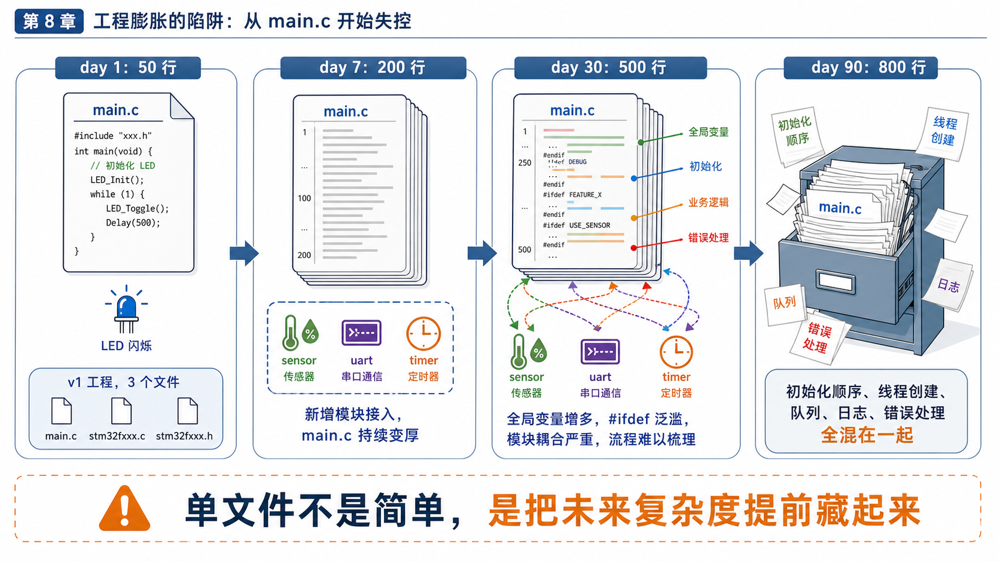

### 18.2 这个问题你在Ch5就见过

翻回Ch5开场。裸过程式代码：三颗LED，三份几乎一模一样的函数，全局变量到处飞。你当时的解法是封装——`struct led`把状态和保护它的函数绑在一起，`static`把不该暴露的藏起来，接口函数只暴露必要操作。

```
Ch5问题：裸过程式 → struct封装 → 模块边界
```

现在你在Zephyr语境下，遇到了完全一样的问题，只是换了层皮：

```
Ch8 PART4问题：一个main.c塞N个线程 → 拆模块 → 模块边界
```

本质没变：**代码的组织方式跟不上功能的增长速度。**

Ch5教的是一个struct怎么写。现在教的是一个模块怎么写。粒度不同，原理一样——封装、接口、隐藏实现。


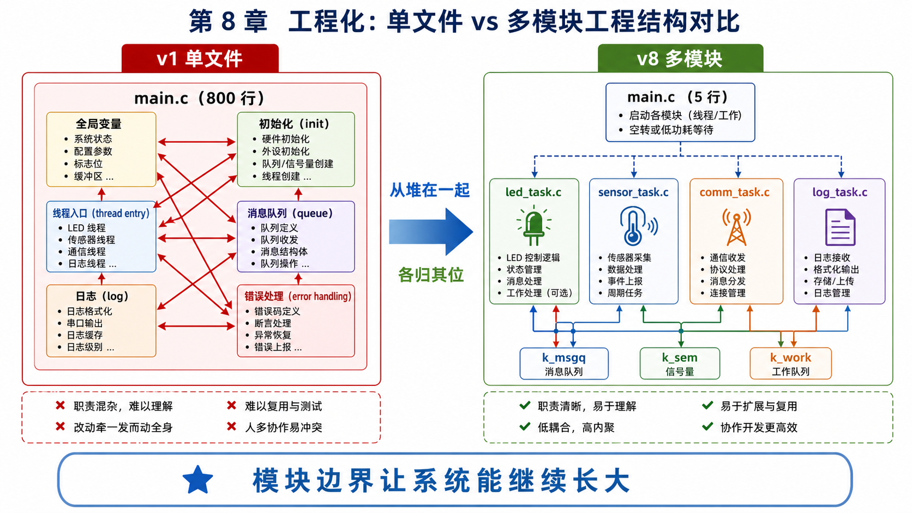


### 18.3 目标：一个任务 = 一个独立模块

定一个具体目标。你的工程长这样：

```
每个模块有自己的:
  .h — 对外接口（只暴露别人需要的）
  .c — 内部实现（全部static）

模块之间不互调内部函数
只通过消息队列/信号量/回调通信

main.c只做三件事：
  1. device_is_ready 检查关键设备
  2. 如果用 SYS_INIT，这里什么都不要
  3. return 0
```

这看起来和Linux用户态应用的main()一模一样。一个main()，调几个模块的init，然后进入事件循环或者直接return 0让框架接管。你的main.c不应该知道LED用什么GPIO、传感器用什么I2C地址、日志格式长什么样。它只知道："启动这些模块。"

---

## 19 工程的目录结构：从单文件到多模块

### 19.1 单文件工程的真实困境

不画大饼，直接看问题。把v1的LED blink扩展成带传感器+通信的工程，你可能会这样写：

```
src/
├── main.c          ← 800行。里面塞了LED线程、传感器线程、通信线程、日志线程
├── CMakeLists.txt  ← target_sources(app PRIVATE src/main.c)
└── prj.conf
```

main.c 里长这样（真实面貌）：

```c
/* 全局变量散落在文件各处 */
static K_THREAD_STACK_DEFINE(led_stack, 512);
static struct k_thread led_thread;
static K_THREAD_STACK_DEFINE(sensor_stack, 1024);
static struct k_thread sensor_thread;
static struct k_thread comm_thread;
K_MSGQ_DEFINE(sensor_mq, sizeof(struct sensor_msg), 8, 4);
static int g_led_state = 0;
static int g_last_temp = 0;

/* 线程函数挤在一起 */
void led_thread_fn(void *a, void *b, void *c) { /* 50行 */ }
void sensor_thread_fn(void *a, void *b, void *c) { /* 80行 */ }
void comm_thread_fn(void *a, void *b, void *c) { /* 120行 */ }
void log_thread_fn(void *a, void *b, void *c) { /* 60行 */ }

int main(void)
{
    /* 所有初始化挤在一起 */
    led_init();  /* 哪来的？全局搜 */
    sensor_init();
    comm_init();
    log_init();
    /* ... */
}
```

这是Ch5 §1.2的Zephyr翻版："一个main.c加几个全局变量能撑住吗？"——撑不住。


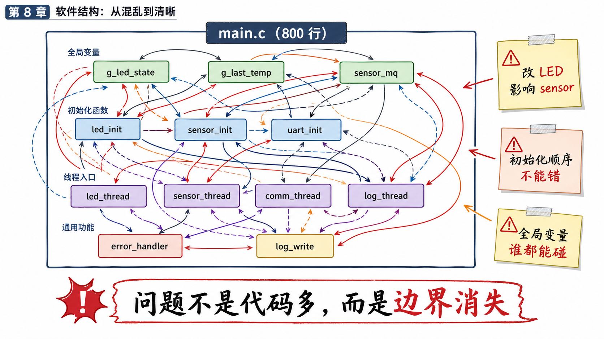

### 19.2 拆：一个功能 = 一对.h + .c

拆开后：

```
src/
├── main.c              ← 只做启动和连接，不超过20行
├── CMakeLists.txt
├── prj.conf
├── led_task.h           ← LED模块对外接口
├── led_task.c           ← LED模块内部实现
├── sensor_task.h
├── sensor_task.c
├── comm_task.h
├── comm_task.c
├── log_task.h
└── log_task.c
```

你看到这个结构的第一反应可能是："这不就是Linux用户态应用的目录结构吗。"

对。这就是目标。一个Zephyr的工程，在文件组织上不应该比一个Linux用户态应用更差。每个模块是一个独立的翻译单元，有自己的头文件和实现文件，有自己的命名空间（`led_task_xxx`、`sensor_task_xxx`）。

**模块内部可以很复杂，但模块对外暴露的接口必须简单。** 这是Ch5 static封装精神的模块级表达。

### 19.3 CMakeLists.txt：一行加四个.c

原来单文件的CMakeLists.txt：

```cmake
cmake_minimum_required(VERSION 3.20.0)
find_package(Zephyr REQUIRED HINTS $ENV{ZEPHYR_BASE})
project(my_app)
target_sources(app PRIVATE src/main.c)
```

多模块版：只改一行——

```cmake
target_sources(app PRIVATE
    src/main.c
    src/led_task.c
    src/sensor_task.c
    src/comm_task.c
    src/log_task.c
)
```

和单文件版的差别就是多加了几个.c文件。但这行背后是工程观的转变：**你不再把代码往main.c里堆，而是往独立的模块文件里放。CMakeLists.txt只负责列出参与编译的文件，模块自己管自己。**

加新模块？新建`new_task.h`和`new_task.c`，CMakeLists.txt加一行。删模块？删那个.c，CMakeLists.txt删一行。两个工程师并行开发？各写各的模块文件，merge从不冲突——因为main.c根本没动。


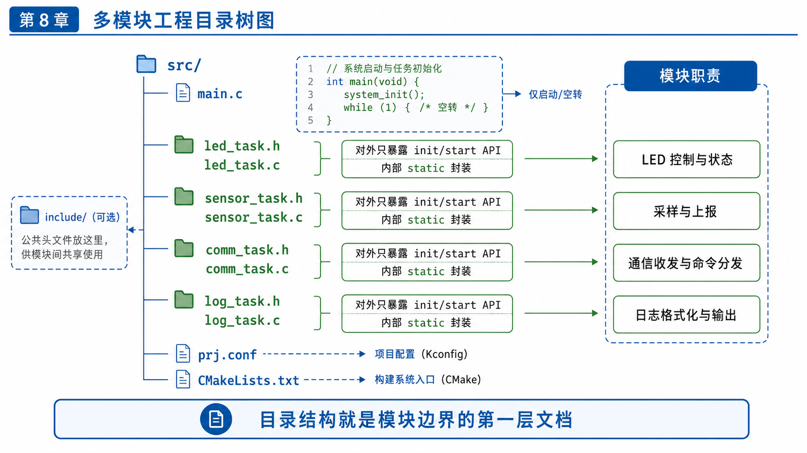


### 19.4 什么时候建子目录

一句话规则：

> **一个模块超过3个文件 → 给它建子目录。否则平铺在src/下。**

三种规模，三种结构：

```bash
# 规模1：简单模块（≤2个文件）——平铺
src/
├── led_task.h
├── led_task.c

# 规模2：中等模块（3个文件）——可选平铺或子目录
src/
├── sensor_task.h
├── sensor_task.c
├── sensor_config.h    ← 第三个文件出现了

# 规模3：复杂模块（≥4个文件）——必须子目录
src/modules/sensor/
├── sensor_task.h       ← 对外接口（唯一对外暴露的文件）
├── sensor_task.c
├── sensor_config.c     ← 内部实现
├── sensor_calib.c      ← 内部实现
└── sensor_calib.h
```

这个规则来自工业实践。Linux内核里`drivers/net/`、`drivers/i2c/`都是这样组织的——一个子系统一个目录，目录内可以很复杂，但对外的接口集中在一两个头文件里。

---

## 20 一个模块的标准写法

### 20.1 .h文件：对外接口只有"初始化"和"获取状态"

先贴LED模块的完整头文件：

```c
/* SPDX-License-Identifier: MIT */
/*
 * led_task.h - LED 任务模块对外接口
 *
 * 这个文件是 LED 模块唯一对外暴露的东西。
 * 外部模块（main.c、comm_task、log_task）只能看到这里声明的接口。
 * 内部的线程栈、线程对象、k_timer、辅助函数——统统不可见。
 */

#ifndef LED_TASK_H
#define LED_TASK_H

#include <stdint.h>
#include <stdbool.h>

/*
 * 初始化 LED 任务模块
 *
 * 调用一次，内部会：
 *   1. 获取 LED 设备（通过 device tree）
 *   2. 创建内部线程
 *   3. 启动 k_timer（默认 500ms 周期）
 *
 * 返回值：0 成功，负值失败
 */
int led_task_init(void);

/*
 * 获取指定 LED 的当前亮灭状态
 *
 * led_index: LED 序号（0 ~ N-1）
 * 返回值: true=亮, false=灭（若 index 越界返回 false）
 *
 * 注意：外部只读状态，不能直接控制 LED。
 *       要控制 LED，通过 k_msgq 发消息给 LED 模块。
 */
bool led_task_get_state(uint8_t led_index);

/*
 * 请求改变 LED 闪烁周期
 *
 * period_ms: 新的闪烁周期（毫秒），0 表示停止闪烁
 *
 * 这个接口的存在意味着：外部模块不需要知道 LED 内部用 k_timer 实现。
 * 明天换成 k_timer + k_sem 组合，接口不变。
 */
void led_task_set_period(uint32_t period_ms);

#endif /* LED_TASK_H */
```

**设计要点：**
- 不暴露 `k_thread`、`K_THREAD_STACK_DEFINE`、`k_timer`——外部不需要知道内部用什么机制
- 只暴露三个函数：`init()`（生命周期）、`get_state()`（读状态）、`set_period()`（写控制）
- `led_task_` 前缀 = 模块名就是命名空间。和Ch5的 `led_init()` 一脉相承

### 20.2 .c文件：内部实现全部static

```c
/* SPDX-License-Identifier: MIT */
/*
 * led_task.c - LED 任务模块内部实现
 *
 * 所有内部符号（线程栈、线程对象、k_timer、线程函数、辅助函数）
 * 一律 static。外部只能通过 led_task.h 的三个接口接触本模块。
 */

#include "led_task.h"
#include <zephyr/kernel.h>
#include <zephyr/drivers/gpio.h>
#include <zephyr/logging/log.h>

LOG_MODULE_REGISTER(led_task, LOG_LEVEL_INF);

/* ── 内部定义：全部 static ─────────────────────── */

#define LED_COUNT           4
#define DEFAULT_PERIOD_MS   500

/* 设备树获取（编译期确定，不是运行时遍历） */
#define LED0_NODE DT_ALIAS(led0)
#define LED1_NODE DT_ALIAS(led1)
#define LED2_NODE DT_ALIAS(led2)
#define LED3_NODE DT_ALIAS(led3)

static const struct gpio_dt_spec s_leds[LED_COUNT] = {
    GPIO_DT_SPEC_GET(LED0_NODE, gpios),
    GPIO_DT_SPEC_GET(LED1_NODE, gpios),
    GPIO_DT_SPEC_GET(LED2_NODE, gpios),
    GPIO_DT_SPEC_GET(LED3_NODE, gpios),
};

/* 内部状态：全部 static */
static K_THREAD_STACK_DEFINE(s_led_stack, 512);
static struct k_thread      s_led_thread;
static struct k_timer       s_led_timer;
static bool                 s_led_state[LED_COUNT];
static uint32_t             s_period_ms = DEFAULT_PERIOD_MS;

/* 线程入口函数：static */
static void led_thread_fn(void *arg1, void *arg2, void *arg3)
{
    (void)arg1; (void)arg2; (void)arg3;

    while (1) {
        k_timer_status_sync(&s_led_timer);

        /* 翻转所有 LED */
        for (int i = 0; i < LED_COUNT; i++) {
            s_led_state[i] = !s_led_state[i];
            gpio_pin_set_dt(&s_leds[i], s_led_state[i] ? 1 : 0);
        }
    }
}

/* ── 对外接口实现 ──────────────────────────────── */

int led_task_init(void)
{
    int ret;

    /* 1. 配置所有 LED GPIO 为输出 */
    for (int i = 0; i < LED_COUNT; i++) {
        if (!device_is_ready(s_leds[i].port)) {
            LOG_ERR("LED%d GPIO port not ready", i);
            return -ENODEV;
        }
        ret = gpio_pin_configure_dt(&s_leds[i], GPIO_OUTPUT_INACTIVE);
        if (ret < 0) {
            LOG_ERR("LED%d config failed: %d", i, ret);
            return ret;
        }
        s_led_state[i] = false;
    }

    /* 2. 初始化 k_timer（不启动） */
    k_timer_init(&s_led_timer, NULL, NULL);

    /* 3. 创建内部线程 */
    k_thread_create(&s_led_thread, s_led_stack,
                    K_THREAD_STACK_SIZEOF(s_led_stack),
                    led_thread_fn,
                    NULL, NULL, NULL,
                    K_PRIO_PREEMPT(5), 0, K_NO_WAIT);

    /* 4. 启动定时器 */
    k_timer_start(&s_led_timer,
                  K_MSEC(s_period_ms),
                  K_MSEC(s_period_ms));

    LOG_INF("LED task started (period=%ums)", s_period_ms);
    return 0;
}

bool led_task_get_state(uint8_t led_index)
{
    if (led_index >= LED_COUNT)
        return false;
    return s_led_state[led_index];
}

void led_task_set_period(uint32_t period_ms)
{
    s_period_ms = period_ms;
    if (period_ms == 0) {
        k_timer_stop(&s_led_timer);
    } else {
        k_timer_start(&s_led_timer,
                      K_MSEC(period_ms),
                      K_MSEC(period_ms));
    }
}
```

**注意：** 线程栈`s_led_stack`、线程对象`s_led_thread`、定时器`s_led_timer`、状态数组`s_led_state`全部是static。线程入口函数`led_thread_fn`也是static。外部模块根本不知道这个模块内部用的是`k_timer`还是`k_sleep`——这就是封装。

和Ch5 §3对比：Ch5用static保护struct的字段不被外部直接改。这里用static保护整个模块的内部实现不被外部调用。尺度不同，原理一样。


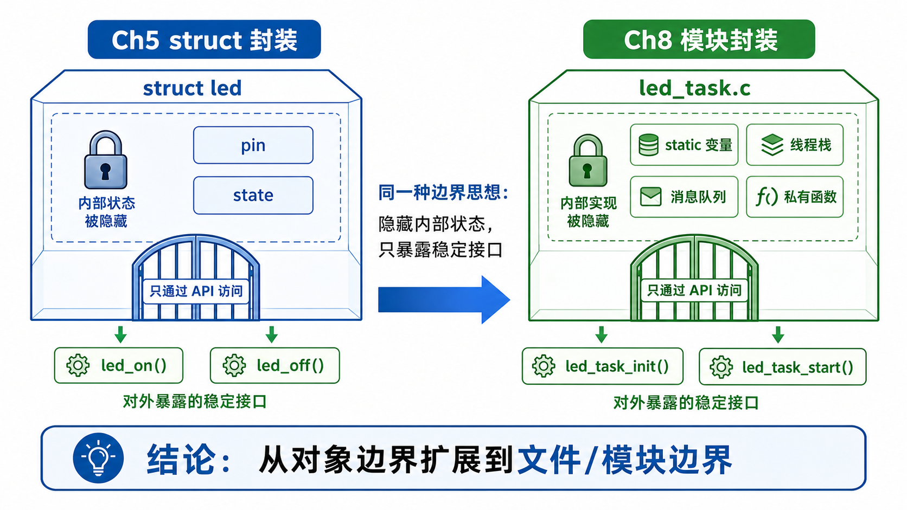

### 20.3 模块的init/run生命周期模板

每个模块遵循同一个生命周期模板：

```
┌─────────────┐
│ module_init  │ ← 外部调用一次（或 SYS_INIT 自动调用）
│  → 获取设备   │
│  → 初始化内部对象│
│  → 创建线程/定时器│
│  → 返回0/负值  │
└──────┬──────┘
       │
       ▼
┌─────────────┐
│ module_run   │ ← 内部线程自动循环
│  → 等待事件   │    (k_timer / k_sem / k_msgq)
│  → 处理       │
│  → 发结果     │
│  → 继续等待   │
└─────────────┘
```

对应的代码骨架：

```c
/* 骨架：任意模块的 init + run 模式 */

/* ===== sensor_task.c ===== */

static K_THREAD_STACK_DEFINE(s_stack, 1024);
static struct k_thread      s_thread;
static struct k_msgq        s_mq;

/* ---- init：做一次 ---- */
int sensor_task_init(void)
{
    /* 1. 获取设备 */
    s_dev = DEVICE_DT_GET(DT_NODELABEL(sensor0));
    if (!device_is_ready(s_dev))
        return -ENODEV;

    /* 2. 初始化内部对象 */
    k_msgq_init(&s_mq, s_mq_buf, sizeof(struct sensor_msg), 8);

    /* 3. 创建线程 */
    k_thread_create(&s_thread, s_stack,
                    K_THREAD_STACK_SIZEOF(s_stack),
                    sensor_thread_fn,
                    NULL, NULL, NULL,
                    K_PRIO_PREEMPT(7), 0, K_NO_WAIT);

    return 0;
}

/* ---- run：一直循环 ---- */
static void sensor_thread_fn(void *a, void *b, void *c)
{
    while (1) {
        struct sensor_msg msg;
        /* 等待事件（信号量/消息/定时器） */
        k_msgq_get(&s_mq, &msg, K_FOREVER);
        /* 处理 */
        /* 发送结果 */
    }
}
```

和Ch5的 `led_init()` / `led_deinit()` 模式对看——Ch5的生命周期是"创建→使用→销毁"，模块的生命周期是"init→线程自动运行→模块被外部停掉"。


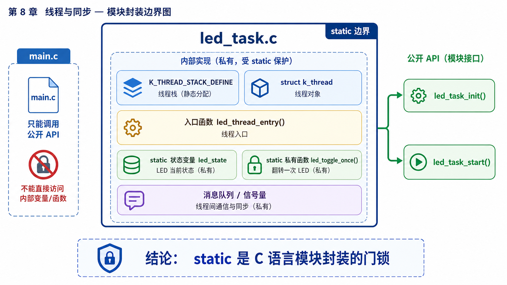


### 20.4 和Ch5 OOP的对照表

| Ch5 概念 | 模块级表达 | 说明 |
|----------|-----------|------|
| `struct led` 封装字段 | 一个模块 = 一个文件边界的struct群 | 粒度放大：Ch5保护struct字段，这里保护整个模块 |
| `static` 隐藏字段 | `.c` 内全部static，外部不可见 | Ch5用static防字段被直改，这里防函数被直调 |
| 前缀命名 `led_xxx` | `led_task_xxx` 函数名 = 模块名即命名空间 | 命名约定；不用C++ namespace，但效果一样 |
| `led_init()` / `led_deinit()` | `led_task_init()` / `led_task_exit()` | 生命周期模板，模块级表达 |
| `.h` 只暴露接口函数 | `.h` 只暴露 `init/get_state/set_period` | 一个模块对外暴露的接口不应超过5个函数 |
| 子类通过ops表扩展 | 模块通过消息队列/信号量通信 | 不继承，但解耦思路同源 |

Ch5教你"一个struct怎么写"，PART4教你"一个模块怎么写"。粒度不同，本质一样——**把内部实现藏起来，只暴露必要的接口。**

---

## 21 SYS_INIT：让模块自己注册自己【核心】

### 21.1 回到§6.4：SYS_INIT你已经见过了

回忆PART1 §6.4的内容。你在v3启动序列追踪里看到了这段：

```c
SYS_INIT(my_init_fn, APPLICATION, 50);
```

这个宏把`my_init_fn`的函数指针塞进`.z_init_APPLICATION_50_`段。启动时Zephyr的`z_sys_init_run_level()`遍历这个段，挨个调过去。

当时你看的是Zephyr内核自己的驱动用这招——`DEVICE_DT_DEFINE`底层也是`SYS_INIT`。那时你可能会想："这跟我有什么关系？内核黑魔法而已。"

现在问一个不同的问题：

> **我的应用模块也能用SYS_INIT自动注册吗？**

答案：当然能。`APPLICATION`级别就是留给你的。

Zephyr的初始化级别分四档：

```
PRE_KERNEL_1  ← 极其早期（中断向量表之后，内核对象可用之前）
PRE_KERNEL_2  ← 内核对象刚初始化完
POST_KERNEL   ← 内核完全就绪，驱动初始化（DEVICE_DT_DEFINE 在这里面）
APPLICATION   ← 你的应用模块（内核和驱动都好了，放心用）
```

前三个级别是Zephyr框架自己和驱动的领地。`APPLICATION`级别——这个空地是专门留给你的。

### 21.2 对比：手动init vs 自动注册

把§27教的手动init和本节教的自动注册并排看：

**左列：手动版（§27的写法）**

```c
/* main.c */
#include "led_task.h"
#include "sensor_task.h"
#include "comm_task.h"
#include "log_task.h"

int main(void)
{
    led_task_init();      /* 手动逐个调 */
    sensor_task_init();
    comm_task_init();
    log_task_init();
    return 0;
}
```

**右列：自动版（本节教的写法）**

```c
/* led_task.c 末尾加一行 */
SYS_INIT(led_task_init, APPLICATION, 50);

/* sensor_task.c 末尾加一行 */
SYS_INIT(sensor_task_init, APPLICATION, 51);

/* main.c —— 什么都不用调 */
int main(void)
{
    /* 应用模块自己会启动。main只做板级检查。 */
    return 0;
}
```

区别：手动版里main.c必须知道"有哪几个模块"。自动版里main.c不知道——每个模块的文件末尾一行`SYS_INIT`声明"我在APPLICATION级别启动"，链接器把所有声明收集到`.z_init`段，启动时框架逐个调用。

**加新模块时改什么？**

| | 手动版 | 自动版 |
|---|---|---|
| 新建 `new_task.c` | ✅ | ✅ |
| 新建 `new_task.h` | ✅ | ✅ |
| 改 `CMakeLists.txt` 加一行 | ✅ | ✅ |
| **改 `main.c` 加一行 `new_task_init()`** | **❌ 必须改** | **✅ 不用改** |
| 在 `new_task.c` 末加 `SYS_INIT` | 不需要 | ✅ |

手动版加了新模块必须碰main.c，自动版不用。main.c从需要知道"有哪几个模块"变成"一个都不需要知道"。这就是开闭原则——**对扩展开放（加模块只加文件），对修改关闭（main.c一字不动）。**

### 21.3 SYS_INIT的优先级怎么排

和Ch17的多级initcall对照着看：

| 你的教学版（Ch17） | Zephyr | 用途 | 例子 |
|-------------------|--------|------|------|
| `.init_drv 50` | `POST_KERNEL 50` | 驱动初始化 | LED GPIO驱动、I2C控制器 |
| `.init_drv 60` | `POST_KERNEL 60` | 依赖驱动的模块 | I2C传感器驱动（依赖I2C控制器先初始化） |
| `.init_app 70` | `APPLICATION 50` | 你的应用模块 | LED闪烁任务、通信任务 |

规则：

1. **依赖硬件驱动的模块 → 用 `POST_KERNEL`。** 比如你的`sensor_task`如果直接操作I2C，而I2C驱动在`POST_KERNEL 50`初始化，那sensor用`POST_KERNEL 60`。

2. **不依赖硬件的纯逻辑模块 → 用 `APPLICATION`。** LED任务如果只是等了信号量就闪（不直接碰GPIO），就可以放`APPLICATION`。

3. **同一级别内，prio小的先跑（0~99）。** 模块B依赖模块A → B的prio比A大1即可（`APPLICATION, 50`和`APPLICATION, 51`）。

4. **多数情况下不需要纠结。** 如果你的模块没有相互依赖，全部用`APPLICATION, 50`——同prio的顺序由链接顺序决定，对无依赖模块来说先谁后谁无所谓。

一个典型工程的优先级排布：

```c
/* led_task.c —— 直接操作 GPIO，依赖 GPIO 驱动 */
SYS_INIT(led_task_init, POST_KERNEL, 60);

/* sensor_task.c —— 用 sensor driver API，不直接碰 I2C */
SYS_INIT(sensor_task_init, APPLICATION, 50);

/* comm_task.c —— 纯逻辑，收消息处理 */
SYS_INIT(comm_task_init, APPLICATION, 50);

/* log_task.c —— 纯逻辑，比 comm 晚启动（等 comm 先就绪） */
SYS_INIT(log_task_init, APPLICATION, 51);
```


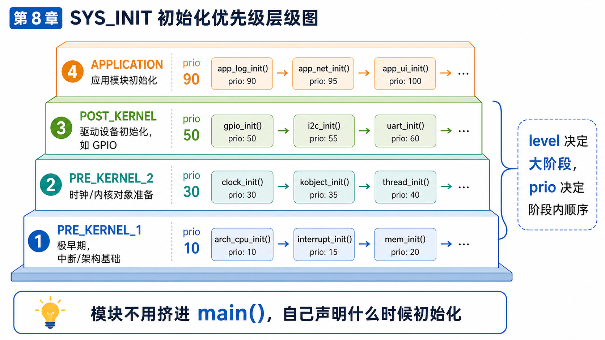

### 21.4 什么时候用手动init
### 21.4 什么时候用手动init，什么时候用SYS_INIT

没有银弹。用一张决策表：

**用手动init（main.c显式调用）适用于：**

- 需要传参——`SYS_INIT`的函数签名固定为`int (*)(void)`，如果你需要`led_task_init(struct led_config *cfg)`，手动调
- 需要控制创建和销毁的时机——"先A后B，A失败了不启动C"这种逻辑，手动调更直观
- 模块数量少（≤3个）——显式调用反而更清晰，`SYS_INIT`是过度设计
- 需要在启动和停止之间动态切换——比如OTA升级期间暂停某个模块

**用SYS_INIT自动注册适用于：**

- 模块多（≥4个）——手写调用链太长，`SYS_INIT`一行解决
- 模块独立无依赖——随便谁先谁后，懒得排
- 追求"加模块不碰main.c"——符合Zephyr核心的声明式哲学
- 团队协作——加模块不需要改main.c，减少merge冲突

**一句话：** 模块少→手动调更直观；模块多→SYS_INIT更干净。两者的代码正确性相同，差异只在工程可维护性。


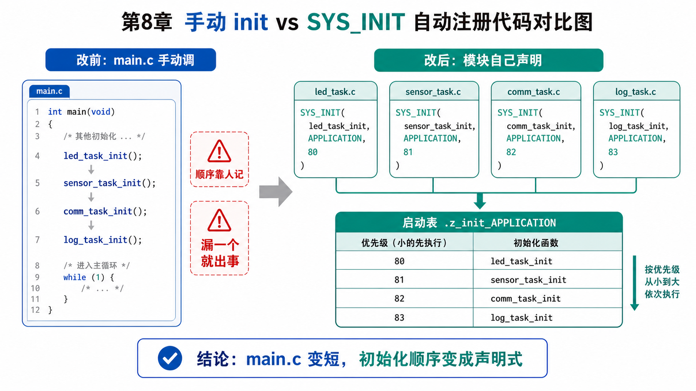


### 21.5 实战：把§27的led_task改成自动注册

**改前（手动版）：**

```c
/* main.c */
#include "led_task.h"

int main(void)
{
    int ret = led_task_init();
    if (ret < 0) {
        printk("LED init failed: %d\n", ret);
    }
    return 0;
}

/* led_task.c —— 无特殊标记 */
int led_task_init(void) { /* ... */ }
```

**改后（自动版）：**

```c
/* main.c —— 完全不引用 led_task.h */

int main(void)
{
    /* 应用模块自己会启动，main 只保留板级关键检查 */
    printk("Application started\n");
    return 0;
}

/* led_task.c —— 末尾加一行 */
SYS_INIT(led_task_init, APPLICATION, 50);
```

west build → west flash → LED照样闪。

**main.c的变化：**

```
- 手动版：需要 #include 四个模块头文件，main 里四个 init 调用
- 自动版：main.c 从 20 行降到 5 行
           不需要 #include 任何应用模块的头文件
           不需要调用任何 init 函数
```

你可能会觉得不习惯——"main里什么都没有，它真的在跑吗？"在跑。`SYS_INIT`让你的模块在APPLICATION级别被框架叫起来，比你手调还早一步（严格来说，APPLICATION级别的SYS_INIT在`main()`之前就执行了）。


### 21.6 这种写法的深层含义：声明式 > 命令式

回头看§18的`DEVICE_DT_DEFINE`：

```c
/* 驱动层：一行声明，编译期自动实例化 */
DEVICE_DT_DEFINE(node, led_gpio_init, NULL,
                 &led_gpio_data, &led_gpio_config,
                 POST_KERNEL, CONFIG_LED_INIT_PRIORITY,
                 &led_driver_api);
```

再看本节：

```c
/* 应用层：一行声明，启动时自动调用 */
SYS_INIT(led_task_init, APPLICATION, 50);
```

两种是完全一样的哲学：

| | 驱动层 | 应用层 |
|---|---|---|
| 声明什么 | `compatible` → 有匹配的硬件 | 模块需要初始化 |
| 框架做什么 | 编译期展开 → 自动实例化 → 注册到设备模型 | 链接段收集 → 启动时遍历 → 自动调用 |
| 你不需要做什么 | 写`main`里逐个`device_init` | 写`main`里逐个`task_init` |

这和FreeRTOS的思维差异是最根本的：

> **FreeRTOS：你指挥一切。** `xTaskCreate`、`xQueueCreate`、手动init——每步都是你明确下命令。
>
> **Zephyr：你声明意图，框架接管执行。** 声明`compatible` → 驱动自动匹配。声明`SYS_INIT` → 模块自动启动。声明设备树 → 硬件自动配置。

这不是技术细节的差异。是两种工程哲学：**命令式（怎么做）vs 声明式（要什么）。**

Linux内核也是声明式——`module_init(fn)`底层和`SYS_INIT`同源，都是编译期把函数指针塞进特殊段，启动时遍历调用。Ch17你亲手写过山寨版`MODULE_INIT`和`do_initcalls()`，现在在Zephyr里用工业级实现。

---


## 22 模块间通信：设计干净的数据流

### 22.1 先画数据流图，再写代码

在写模块间通信代码之前，先画清楚数据流。这是Ch7教过的方法论——**先把箭头画清楚，再决定用什么IPC原语。**

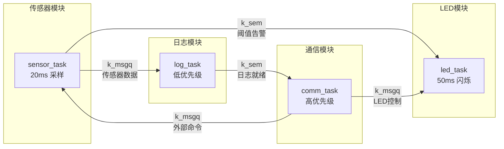
```mermaid
graph LR
    subgraph 传感器模块
        S["sensor_task<br/>20ms 采样"]
    end
    subgraph LED模块
        L["led_task<br/>50ms 闪烁"]
    end
    subgraph 通信模块
        C["comm_task<br/>高优先级"]
    end
    subgraph 日志模块
        LOG["log_task<br/>低优先级"]
    end

    S -->|"k_msgq<br/>传感器数据"| LOG
    S -->|"k_sem<br/>阈值告警"| L
    C -->|"k_msgq<br/>外部命令"| S
    C -->|"k_msgq<br/>LED控制"| L
    LOG -->|"k_sem<br/>日志就绪"| C
```

**设计原则：**
- 每个箭头 = 一个通信通道
- 箭头上标消息类型和IPC原语
- 模块之间不直接调对方的函数——通过消息传递
- 哪个模块"拥有"消息队列？接收方拥有——队列定义在接收方的.c文件里，static


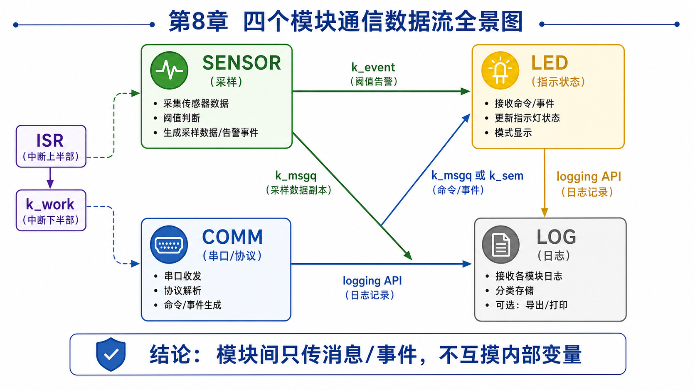

### 22.2 用k_msgq当模块间的"邮箱"

消息队列是最常用的模块间通信方式——传数据。

**定义消息结构体（放在公共头文件里，或放在发送方/接收方的头文件里）：**

```c
/* sensor_msg.h —— 传感器模块对外发送的消息格式 */
#ifndef SENSOR_MSG_H
#define SENSOR_MSG_H

#include <stdint.h>

#define SENSOR_MSG_TYPE_TEMP     0x01
#define SENSOR_MSG_TYPE_HUMIDITY 0x02
#define SENSOR_MSG_TYPE_ALERT    0xFF

struct sensor_msg {
    uint8_t  type;       /* 消息类型 */
    int32_t  value;      /* 采样值（温度×100、湿度×100） */
    uint32_t timestamp;  /* 采样时间戳（ms） */
};

#endif /* SENSOR_MSG_H */
```

**消息队列放在接收方模块的.c里，static：**

```c
/* log_task.c —— LOG 模块是传感器数据的消费者 */

#include "sensor_msg.h"

/* 消息队列：接收方拥有 */
K_MSGQ_DEFINE(s_log_mq, sizeof(struct sensor_msg), 16, 4);

/* 对外暴露"往我队列里发消息"的接口 */
int log_task_push_sensor_data(const struct sensor_msg *msg)
{
    return k_msgq_put(&s_log_mq, msg, K_NO_WAIT);
}

/* 内部线程从队列取消息 */
static void log_thread_fn(void *a, void *b, void *c)
{
    struct sensor_msg msg;

    while (1) {
        /* 阻塞等待消息 */
        int ret = k_msgq_get(&s_log_mq, &msg, K_FOREVER);
        if (ret == 0) {
            printk("[LOG] type=%d val=%d ts=%u\n",
                   msg.type, msg.value, msg.timestamp);
        }
    }
}
```

**发送方调用接收方的接口：**

```c
/* sensor_task.c —— 传感器模块是数据的生产者 */

#include "log_task.h"     /* 只引用 log_task_push_sensor_data 声明 */
#include "sensor_msg.h"

static void sensor_thread_fn(void *a, void *b, void *c)
{
    struct sensor_msg msg;

    while (1) {
        k_msleep(20);

        /* 采样... */
        msg.type = SENSOR_MSG_TYPE_TEMP;
        msg.value = read_temp() * 100;
        msg.timestamp = k_uptime_get();

        /* 发给 LOG 模块（通过 LOG 模块暴露的接口） */
        log_task_push_sensor_data(&msg);
    }
}
```

**关键设计：** 消息队列的句柄在`log_task.c`里是static的。外部模块不能直接访问这个队列——只能通过`log_task_push_sensor_data()`这个接口函数往里塞数据。这和Ch5的"struct led字段不暴露、通过接口函数操作"是同一个道理。

### 22.3 用k_sem当"我有活干了"的通知

信号量不传数据，只传"状态变了"——比消息队列更轻量。

**场景：** 传感器检测到温度超阈值 → 通知LED模块开始快闪。

```c
/* sensor_task.c —— 生产者 */

/* 信号量句柄放在生产者还是消费者？放在消费者.c里 static，暴露 give 接口 */
/* 这里为了演示清晰，放在公共位置 */

/* led_task.h */
extern struct k_sem g_led_alert_sem;

/* led_task.c */
K_SEM_DEFINE(g_led_alert_sem, 0, 1);  /* 初始0，最大1 */

static void led_thread_fn(void *a, void *b, void *c)
{
    while (1) {
        /* 等待告警信号量——超时 100ms，方便同时处理定时闪烁 */
        int ret = k_sem_take(&g_led_alert_sem, K_MSEC(100));
        if (ret == 0) {
            /* 收到告警！快速闪烁 */
            for (int i = 0; i < 10; i++) {
                toggle_all_leds();
                k_msleep(100);
            }
        } else {
            /* 超时，正常闪烁逻辑 */
            normal_blink_cycle();
        }
    }
}

/* sensor_task.c —— 在采样线程里触发 */
static void sensor_thread_fn(void *a, void *b, void *c)
{
    while (1) {
        k_msleep(20);
        int temp = read_temp();
        if (temp > ALERT_THRESHOLD) {
            k_sem_give(&g_led_alert_sem);  /* 通知 LED 模块 */
        }
    }
}
```

**信号量的两个典型用法：**

1. **通知型（本节用法）：** `K_SEM_DEFINE(sem, 0, 1)` —— 初始count=0，生产者give，消费者take。只传"发生了某事"，不传数据。
2. **资源计数型（Ch6传统用法）：** `K_SEM_DEFINE(sem, N, N)` —— 初始count=N，表示有N个可用资源。

模块间通信中，通知型信号量用得更多。它轻量——不copy数据，不开buf，几乎零开销。

### 22.4 回调函数指针：另一种模块间解耦

信号量和消息队列是"推"模型。回调函数指针是"订阅"模型——一个模块注册回调，另一个模块在事件发生时调过去。

```c
/* sensor_task.h —— 暴露"注册回调"的接口 */

typedef void (*sensor_alert_callback_t)(int sensor_id, int value);

/*
 * 注册告警回调。SENSOR 模块在温度超阈值时调用所有注册的回调。
 * 最多支持 4 个回调。
 */
int sensor_register_alert_callback(sensor_alert_callback_t cb);

/* sensor_task.c —— 内部维护回调表 */

#define MAX_ALERT_CALLBACKS  4

static sensor_alert_callback_t s_alert_cbs[MAX_ALERT_CALLBACKS];
static int s_alert_cb_count = 0;

int sensor_register_alert_callback(sensor_alert_callback_t cb)
{
    if (s_alert_cb_count >= MAX_ALERT_CALLBACKS)
        return -ENOMEM;

    s_alert_cbs[s_alert_cb_count++] = cb;
    return 0;
}

static void notify_alert_callbacks(int sensor_id, int value)
{
    for (int i = 0; i < s_alert_cb_count; i++) {
        if (s_alert_cbs[i])
            s_alert_cbs[i](sensor_id, value);
    }
}

static void sensor_thread_fn(void *a, void *b, void *c)
{
    while (1) {
        k_msleep(20);
        int temp = read_temp();
        if (temp > ALERT_THRESHOLD) {
            notify_alert_callbacks(0, temp);  /* 通知所有订阅者 */
        }
    }
}

/* led_task.c —— LED 模块注册回调 */

static void led_alert_handler(int sensor_id, int value)
{
    /* 收到告警，设置快速闪烁标志 */
    s_fast_blink = true;
    s_alert_value = value;
}

int led_task_init(void)
{
    /* ... 其他初始化 ... */

    /* 注册回调：告警发生时调我 */
    sensor_register_alert_callback(led_alert_handler);
    return 0;
}
```

**关键设计：** `s_alert_cbs`数组和`s_alert_cb_count`都在`sensor_task.c`里是static的。外部模块看不到回调表——只能通过`sensor_register_alert_callback()`注册。这是Ch8的函数指针传参（§8）和Ch5的ops表（§9~10）在模块间通信中的落地——**函数指针提供了一个模块调用另一个模块函数的安全通道，不需要知道对方的任何内部细节。**

### 22.5 三种通信方式怎么选：一张决策表

| 场景 | k_msgq | k_sem | 回调函数指针 |
|------|--------|-------|-------------|
| **传数据**（传感器值、命令） | ✅ 最佳 | ❌ 不传数据 | ⚠️ 可传，但异步 |
| **仅通知**（"阈值超了"） | ⚠️ 浪费（没必要建buf） | ✅ 轻量 | ✅ 自然 |
| **一对多**（一人发，多人收） | ❌ 需多条队列 | ❌ 需多个信号量 | ✅ 最自然 |
| **同步等待**（消费者阻塞等数据） | ✅ `K_FOREVER` | ✅ `K_FOREVER` | ❌ 异步 |
| **非阻塞**（生产者不等消费者） | ✅ `K_NO_WAIT` | ✅ `k_sem_give()` | ✅ 异步 |
| **流量控制**（生产太快时丢旧数据） | ✅ 队列满了覆盖 | ❌ 信号量不buf数据 | ❌ 回调不做流控 |
| **内存开销** | 中等（buf数组） | 极小（4字节count） | 极小（函数指针数组） |

**决策流程：**

```
需要传数据？
├── YES → 需要流量控制/缓冲？
│        ├── YES → k_msgq
│        └── NO  → 考虑回调（轻量数据）
└── NO  → 一个通知者 → 多个接收者？
          ├── YES → 回调函数指针
          └── NO  → k_sem
```

**实际工程中的组合：** 大多数模块间通信是混合的。SENSOR→LOG走k_msgq（数据量大，需要缓冲），SENSOR→LED走k_sem（只通知告警，不需要数据），COMM→LED走k_msgq（命令带参数）。不要全用消息队列——信号量适合的场景用它就是浪费。

---


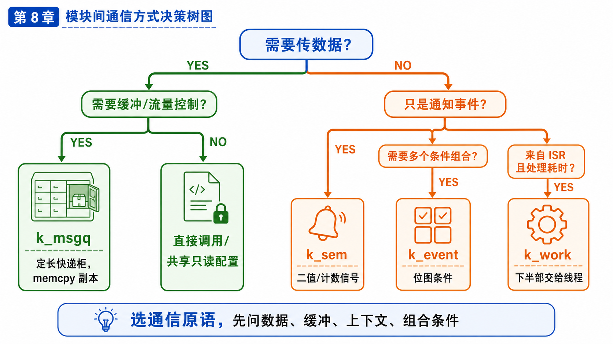

## 23 v8 demo：多模块 Zephyr 工程代码骨架

### 23.1 v8 工程的全貌

以下是完整的v8工程目录树：

```
v8_multi_module_structure/
├── CMakeLists.txt
├── prj.conf
├── boards/
│   └── stm32f4_disco.overlay
└── src/
    ├── main.c
    ├── sensor_msg.h            ← 公共消息定义
    ├── led_task.h
    ├── led_task.c
    ├── sensor_task.h
    ├── sensor_task.c
    ├── comm_task.h
    ├── comm_task.c
    ├── log_task.h
    └── log_task.c
```

**CMakeLists.txt：**

```cmake
cmake_minimum_required(VERSION 3.20.0)
find_package(Zephyr REQUIRED HINTS $ENV{ZEPHYR_BASE})
project(v8_multi_module)

target_sources(app PRIVATE
    src/main.c
    src/led_task.c
    src/sensor_task.c
    src/comm_task.c
    src/log_task.c
)
```

**prj.conf：**

```
CONFIG_GPIO=y
CONFIG_LOG=y
CONFIG_LOG_MODE_IMMEDIATE=y
CONFIG_SENSOR=y
CONFIG_UART_CONSOLE=y
```

### 23.2 逐个模块走读

**led_task.c —— k_timer 500ms触发，toggle → k_sem通知LOG：**

```c
/* SPDX-License-Identifier: MIT */
#include "led_task.h"
#include "log_task.h"
#include <zephyr/kernel.h>
#include <zephyr/drivers/gpio.h>
#include <zephyr/logging/log.h>

LOG_MODULE_REGISTER(led_task, LOG_LEVEL_INF);

#define LED0_NODE  DT_ALIAS(led0)

static const struct gpio_dt_spec s_led = GPIO_DT_SPEC_GET(LED0_NODE, gpios);
static K_THREAD_STACK_DEFINE(s_stack, 512);
static struct k_thread      s_thread;
static struct k_timer       s_timer;
static bool                 s_state;

static void timer_fn(struct k_timer *timer_id)
{
    (void)timer_id;
    s_state = !s_state;
    gpio_pin_set_dt(&s_led, s_state ? 1 : 0);

    /* 通知LOG模块：LED状态变了 */
    log_task_notify_led_changed(s_state);
}

static void led_thread_fn(void *a, void *b, void *c)
{
    while (1) {
        k_timer_status_sync(&s_timer);
    }
}

int led_task_init(void)
{
    if (!device_is_ready(s_led.port))
        return -ENODEV;

    gpio_pin_configure_dt(&s_led, GPIO_OUTPUT_INACTIVE);
    s_state = false;

    k_timer_init(&s_timer, timer_fn, NULL);
    k_timer_start(&s_timer, K_MSEC(500), K_MSEC(500));

    k_thread_create(&s_thread, s_stack,
                    K_THREAD_STACK_SIZEOF(s_stack),
                    led_thread_fn, NULL, NULL, NULL,
                    K_PRIO_PREEMPT(5), 0, K_NO_WAIT);

    LOG_INF("LED task started");
    return 0;
}

SYS_INIT(led_task_init, APPLICATION, 50);
```

**sensor_task.c —— k_timer 2000ms采样，k_msgq发给LOG：**

```c
/* SPDX-License-Identifier: MIT */
#include "sensor_task.h"
#include "sensor_msg.h"
#include "log_task.h"
#include <zephyr/kernel.h>
#include <zephyr/random/random.h>
#include <zephyr/logging/log.h>

LOG_MODULE_REGISTER(sensor_task, LOG_LEVEL_INF);

static K_THREAD_STACK_DEFINE(s_stack, 1024);
static struct k_thread      s_thread;
static struct k_timer       s_timer;

static void timer_fn(struct k_timer *timer_id)
{
    struct sensor_msg msg = {
        .type = SENSOR_MSG_TYPE_TEMP,
        .value = 2500 + (sys_rand32_get() % 1000),  /* 模拟温度 25.00~34.99°C */
        .timestamp = k_uptime_get(),
    };
    log_task_push_sensor_data(&msg);
}

static void sensor_thread_fn(void *a, void *b, void *c)
{
    while (1) {
        k_timer_status_sync(&s_timer);
    }
}

int sensor_task_init(void)
{
    k_timer_init(&s_timer, timer_fn, NULL);
    k_timer_start(&s_timer, K_SECONDS(2), K_SECONDS(2));

    k_thread_create(&s_thread, s_stack,
                    K_THREAD_STACK_SIZEOF(s_stack),
                    sensor_thread_fn, NULL, NULL, NULL,
                    K_PRIO_PREEMPT(7), 0, K_NO_WAIT);

    LOG_INF("Sensor task started");
    return 0;
}

SYS_INIT(sensor_task_init, APPLICATION, 51);
```

**log_task.c —— k_work从k_msgq取数据，printk输出：**

```c
/* SPDX-License-Identifier: MIT */
#include "log_task.h"
#include "sensor_msg.h"
#include <zephyr/kernel.h>
#include <zephyr/logging/log.h>
#include <stdio.h>

LOG_MODULE_REGISTER(log_task, LOG_LEVEL_INF);

/* 消息队列：LOG 模块拥有，static */
K_MSGQ_DEFINE(s_log_mq, sizeof(struct sensor_msg), 16, 4);

/* k_work：低优先级异步处理 */
static struct k_work s_log_work;

int log_task_push_sensor_data(const struct sensor_msg *msg)
{
    return k_msgq_put(&s_log_mq, msg, K_NO_WAIT);
}

void log_task_notify_led_changed(bool state)
{
    printk("[LOG] LED %s\n", state ? "ON" : "OFF");
}

static void log_work_handler(struct k_work *work)
{
    (void)work;
    struct sensor_msg msg;

    while (k_msgq_get(&s_log_mq, &msg, K_NO_WAIT) == 0) {
        int temp_int = msg.value / 100;
        int temp_frac = msg.value % 100;
        printk("[LOG] temp=%d.%02dC ts=%ums\n",
               temp_int, temp_frac, msg.timestamp);
    }
}

int log_task_init(void)
{
    k_work_init(&s_log_work, log_work_handler);
    LOG_INF("Log task started");
    return 0;
}

/* LOG 模块提供一个低优先级线程定期触发 k_work */
static K_THREAD_STACK_DEFINE(s_stack, 1024);
static struct k_thread      s_thread;

static void log_thread_fn(void *a, void *b, void *c)
{
    while (1) {
        k_work_submit(&s_log_work);
        k_msleep(500);  /* 每 500ms 处理一次队列 */
    }
}

SYS_INIT(log_task_init, APPLICATION, 60);
```

实际上为了让上面的`log_task_init`也启动线程，补上：

```c
/* 续 log_task.c */
int log_task_init(void)
{
    k_work_init(&s_log_work, log_work_handler);

    k_thread_create(&s_thread, s_stack,
                    K_THREAD_STACK_SIZEOF(s_stack),
                    log_thread_fn, NULL, NULL, NULL,
                    K_PRIO_PREEMPT(10), 0, K_NO_WAIT);

    LOG_INF("Log task started");
    return 0;
}
```

**comm_task.c —— 高优先级线程，k_msgq收命令：**

```c
/* SPDX-License-Identifier: MIT */
#include "comm_task.h"
#include "led_task.h"
#include <zephyr/kernel.h>
#include <zephyr/logging/log.h>

LOG_MODULE_REGISTER(comm_task, LOG_LEVEL_INF);

/* 命令队列 */
struct comm_cmd {
    uint8_t cmd_id;
    uint32_t param;
};

K_MSGQ_DEFINE(s_comm_mq, sizeof(struct comm_cmd), 8, 4);

#define CMD_LED_PERIOD  0x01
#define CMD_LED_OFF     0x02

int comm_task_send_cmd(uint8_t cmd_id, uint32_t param)
{
    struct comm_cmd cmd = { .cmd_id = cmd_id, .param = param };
    return k_msgq_put(&s_comm_mq, &cmd, K_NO_WAIT);
}

static K_THREAD_STACK_DEFINE(s_stack, 1024);
static struct k_thread      s_thread;

static void comm_thread_fn(void *a, void *b, void *c)
{
    struct comm_cmd cmd;

    while (1) {
        int ret = k_msgq_get(&s_comm_mq, &cmd, K_FOREVER);
        if (ret != 0) continue;

        switch (cmd.cmd_id) {
        case CMD_LED_PERIOD:
            led_task_set_period(cmd.param);
            break;
        case CMD_LED_OFF:
            led_task_set_period(0);  /* 停止闪烁 */
            break;
        default:
            LOG_WRN("Unknown cmd: %d", cmd.cmd_id);
            break;
        }
    }
}

int comm_task_init(void)
{
    k_thread_create(&s_thread, s_stack,
                    K_THREAD_STACK_SIZEOF(s_stack),
                    comm_thread_fn, NULL, NULL, NULL,
                    K_PRIO_PREEMPT(3), 0, K_NO_WAIT);  /* 高优先级 */

    LOG_INF("Comm task started");
    return 0;
}

SYS_INIT(comm_task_init, APPLICATION, 55);
```

### 23.3 main.c：只做连接，不做事

```c
/* SPDX-License-Identifier: MIT */
/*
 * main.c - v8 多模块工程入口
 *
 * 应用模块全部通过 SYS_INIT 自动注册，main 不需要调任何 init。
 * main 只负责板级关键检查。
 *
 * 源码结构：
 *   led_task.{h,c}     - k_timer 500ms → toggle → 通知 LOG
 *   sensor_task.{h,c}  - k_timer 2000ms → 采样 → k_msgq → LOG
 *   comm_task.{h,c}    - k_msgq 收命令 → 控制 LED
 *   log_task.{h,c}     - k_msgq 收数据 → k_work → printk
 *   main.c             - 你不做的事，这里也没有
 */

#include <zephyr/kernel.h>
#include <stdio.h>

int main(void)
{
    printk("=== v8: multi-module Zephyr application ===\n");
    printk("All modules registered via SYS_INIT.\n");
    printk("main() has nothing to do — modules manage themselves.\n");
    return 0;
}
```

5行有效代码。模块在`main()`之前已经通过`SYS_INIT`启动了。main只是打个招呼。


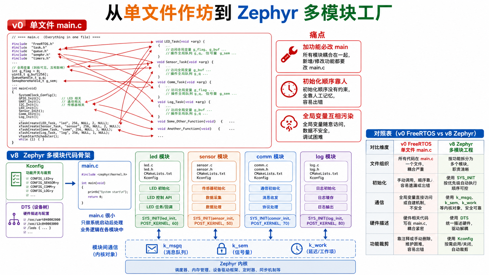

### 23.4 为什么这比你原来的写法好

| | v0 单文件 FreeRTOS | v8 多模块 Zephyr |
|---|---|---|
| **文件组织** | 一个main.c，800行 | 四模块各.h/.c，每个≤60行 |
| **加一个功能** | 往main.c塞100行 | 新建一对.h/.c，CMakeLists加一行 |
| **两人并行开发** | merge冲突不可避免 | 各改各的模块文件 |
| **单元测试** | 无法单独测一个功能 | 每个模块可独立编译测试 |
| **找bug** | 全局搜函数名 | 只在模块的.c里找 |
| **换硬件** | 全局搜pin定义 | 改设备树，C不动 |
| **代码审查** | 看一个800行diff | 看一个60行diff |
| **模块注册** | 手动在main里调init | SYS_INIT自动注册 |

这是工程化的力量。代码功能完全一样——LED照样闪，传感器照样采，日志照样打——但代码的组织方式让维护、扩展、协作的成本下降了一个数量级。

---

## 24 四个工人：Ch6模型在Zephyr的工程化实现

### 24.1 Ch6模型回顾

跳回Ch6。你建了一个FreeRTOS工程，里面有四个性格不同的"工人"：

- **LED工人：** 急性子，每500ms刷新一次，到点就toggle，从不迟到
- **传感器工人：** 慢性子但精确，每2000ms采集一次，数据写到消息队列就走
- **通信工人：** 高优先级，随时待命，收到外部命令立刻处理——"客户的事一秒不能耽误"
- **日志工人：** 低优先级，不着急，队列里攒够一批才打印——"没人在意日志晚0.5秒"

FreeRTOS工头（你的`main()`函数）负责创建所有任务、初始化所有队列、管理所有栈。工头知道每个工人的全部细节——LED用什么pin、传感器用什么接口、通信协议是什么格式。


### 24.2 翻译成Zephyr四个模块

现在把四个工人搬到Zephyr，每个工人成为一个独立模块：

| Ch6 FreeRTOS | Ch8 v9 Zephyr | 实现方式 |
|---|---|---|
| LED任务 `xTaskCreate` | `led_task.c` | `k_timer` 500ms → ISR上下文toggle → `k_sem`通知LOG |
| SENSOR任务 `xTaskCreate` | `sensor_task.c` | `k_timer` 2000ms → 采样 → `k_msgq`发给COMM和LOG |
| COMM任务 `xQueue` | `comm_task.c` | 高优先级`k_thread` → `k_msgq`收命令 → 处理 → 回复 |
| LOG任务 `xTaskCreate` | `log_task.c` | 低优先级`k_work` → 从`k_msgq`批量取 → `printk`输出 |
| 全局队列 | 模块内static队列 | 队列定义在消费者.c里，通过接口暴露"发"操作 |
| main.c手管一切 | main.c只做连接 | 四行`SYS_INIT`，main不需要知道每个模块的存在 |

**关键变化：工头失业了。** 在FreeRTOS版里，`main()`是工头——创建所有任务、初始化所有队列、知道每个工人全部细节。在Zephyr版里，每个模块自己注册自己，main只是坐在那里看。这种"工头消失"就是SYS_INIT自动注册的工程价值。

### 24.3 v9 demo：完整目录+四个模块全部贴出

```
v9_four_workers_zephyr/
├── CMakeLists.txt
├── prj.conf
├── boards/
│   └── stm32f4_disco.overlay
└── src/
    ├── main.c
    ├── sensor_msg.h
    ├── led_task.h
    ├── led_task.c
    ├── sensor_task.h
    ├── sensor_task.c
    ├── comm_task.h
    ├── comm_task.c
    ├── log_task.h
    └── log_task.c
```

下面四个模块全部贴出。和v8的主要区别：v9是完整的代码骨架——四个模块全部使用`SYS_INIT`自动注册，交互链路覆盖LED/SENSOR/COMM/LOG全部四个方向，输出和Ch6 v9功能对齐。

**led_task.c（完整版）：**

```c
/* SPDX-License-Identifier: MIT */
/*
 * led_task.c - LED 工人：急性子，500ms toggle 绝不迟到
 *
 * 实现：k_timer 在 ISR 上下文触发 → toggle GPIO → k_sem 通知 LOG
 *
 * 对照 Ch6：xTimer 500ms → callback toggle → 全局变量通知 LOG 任务
 */
#include "led_task.h"
#include "log_task.h"
#include <zephyr/kernel.h>
#include <zephyr/drivers/gpio.h>
#include <zephyr/logging/log.h>

LOG_MODULE_REGISTER(led_task, LOG_LEVEL_INF);

/* 四颗 LED */
#define LED0_NODE DT_ALIAS(led0)
#define LED1_NODE DT_ALIAS(led1)
#define LED2_NODE DT_ALIAS(led2)
#define LED3_NODE DT_ALIAS(led3)

static const struct gpio_dt_spec s_leds[4] = {
    GPIO_DT_SPEC_GET(LED0_NODE, gpios),
    GPIO_DT_SPEC_GET(LED1_NODE, gpios),
    GPIO_DT_SPEC_GET(LED2_NODE, gpios),
    GPIO_DT_SPEC_GET(LED3_NODE, gpios),
};

static struct k_timer   s_timer;
static uint8_t          s_led_index;
static uint32_t         s_period_ms = 500;

/* ISR 上下文：k_timer 回调中直接操作 GPIO —— Zephyr 允许 */
static void timer_fn(struct k_timer *timer_id)
{
    (void)timer_id;

    /* 关当前 LED，开下一个 */
    gpio_pin_set_dt(&s_leds[s_led_index], 0);
    s_led_index = (s_led_index + 1) % 4;
    gpio_pin_set_dt(&s_leds[s_led_index], 1);

    /* 通知 LOG：LED 跑了 */
    log_task_notify_led_changed(s_led_index);
}

int led_task_init(void)
{
    for (int i = 0; i < 4; i++) {
        if (!device_is_ready(s_leds[i].port)) {
            LOG_ERR("LED%d port not ready", i);
            return -ENODEV;
        }
        gpio_pin_configure_dt(&s_leds[i], GPIO_OUTPUT_INACTIVE);
    }

    /* 先亮第一颗 */
    gpio_pin_set_dt(&s_leds[0], 1);
    s_led_index = 0;

    k_timer_init(&s_timer, timer_fn, NULL);
    k_timer_start(&s_timer, K_MSEC(s_period_ms), K_MSEC(s_period_ms));

    LOG_INF("LED task: 4 LEDs, %ums cycle", s_period_ms);
    return 0;
}

void led_task_set_period(uint32_t period_ms)
{
    s_period_ms = period_ms;
    k_timer_start(&s_timer, K_MSEC(period_ms), K_MSEC(period_ms));
}

uint8_t led_task_get_current(void)
{
    return s_led_index;
}

SYS_INIT(led_task_init, APPLICATION, 50);
```

**sensor_task.c（完整版）：**

```c
/* SPDX-License-Identifier: MIT */
/*
 * sensor_task.c - 传感器工人：慢性子但精确，每 2000ms 采集一次
 *
 * 实现：k_timer → 采样 → k_msgq 发给 LOG
 *
 * 对照 Ch6：xTimer 2000ms → callback 采样 → xQueueSend 给 LOG
 */
#include "sensor_task.h"
#include "sensor_msg.h"
#include "log_task.h"
#include <zephyr/kernel.h>
#include <zephyr/random/random.h>
#include <zephyr/logging/log.h>

LOG_MODULE_REGISTER(sensor_task, LOG_LEVEL_INF);

static struct k_timer       s_timer;
static uint32_t             s_seq;

/* 模拟温度读值（没有真传感器的板子也能跑） */
static int32_t read_temp(void)
{
    return 2500 + (sys_rand32_get() % 1000);  /* 25.00 ~ 34.99°C */
}

static void timer_fn(struct k_timer *timer_id)
{
    (void)timer_id;

    struct sensor_msg msg = {
        .type      = SENSOR_MSG_TYPE_TEMP,
        .value     = read_temp(),
        .timestamp = k_uptime_get(),
        .seq       = s_seq++,
    };

    log_task_push_sensor_data(&msg);
}

int sensor_task_init(void)
{
    s_seq = 0;
    k_timer_init(&s_timer, timer_fn, NULL);
    k_timer_start(&s_timer, K_SECONDS(2), K_SECONDS(2));

    LOG_INF("Sensor task: 2000ms sampling");
    return 0;
}

SYS_INIT(sensor_task_init, APPLICATION, 51);
```

**comm_task.c（完整版）：**

```c
/* SPDX-License-Identifier: MIT */
/*
 * comm_task.c - 通信工人：高优先级，客户的事一秒不能耽误
 *
 * 实现：高优先级 k_thread → k_msgq 收命令 → 处理 → 回复
 *
 * 对照 Ch6：xTaskCreate(prio=3) → xQueueReceive → 处理 → xQueueSend
 */
#include "comm_task.h"
#include "led_task.h"
#include <zephyr/kernel.h>
#include <zephyr/logging/log.h>

LOG_MODULE_REGISTER(comm_task, LOG_LEVEL_INF);

/* 命令结构体 */
struct comm_cmd {
    uint8_t  cmd_id;
    uint32_t param;
};

K_MSGQ_DEFINE(s_comm_mq, sizeof(struct comm_cmd), 8, 4);

#define CMD_SET_LED_PERIOD  0x01
#define CMD_STOP_LED        0x02
#define CMD_PING            0x03

static K_THREAD_STACK_DEFINE(s_stack, 1024);
static struct k_thread      s_thread;

int comm_task_send_cmd(uint8_t cmd_id, uint32_t param)
{
    struct comm_cmd cmd = { .cmd_id = cmd_id, .param = param };
    return k_msgq_put(&s_comm_mq, &cmd, K_NO_WAIT);
}

static void comm_thread_fn(void *a, void *b, void *c)
{
    struct comm_cmd cmd;

    LOG_INF("Comm task: waiting for commands...");

    while (1) {
        int ret = k_msgq_get(&s_comm_mq, &cmd, K_FOREVER);
        if (ret != 0) continue;

        switch (cmd.cmd_id) {
        case CMD_SET_LED_PERIOD:
            LOG_INF("Comm: set LED period to %ums", cmd.param);
            led_task_set_period(cmd.param);
            break;
        case CMD_STOP_LED:
            LOG_INF("Comm: stop LED");
            led_task_set_period(0);
            break;
        case CMD_PING:
            LOG_INF("Comm: ping (param=%u)", cmd.param);
            break;
        default:
            LOG_WRN("Comm: unknown cmd %d", cmd.cmd_id);
            break;
        }
    }
}

int comm_task_init(void)
{
    k_thread_create(&s_thread, s_stack,
                    K_THREAD_STACK_SIZEOF(s_stack),
                    comm_thread_fn, NULL, NULL, NULL,
                    K_PRIO_PREEMPT(3), 0, K_NO_WAIT);

    LOG_INF("Comm task: priority 3");
    return 0;
}

SYS_INIT(comm_task_init, APPLICATION, 55);
```

**log_task.c（完整版）：**

```c
/* SPDX-License-Identifier: MIT */
/*
 * log_task.c - 日志工人：低优先级，没人在意日志晚 0.5 秒
 *
 * 实现：k_work 从 k_msgq 批量取 → printk 输出
 *
 * 对照 Ch6：xTaskCreate(prio=lowest) → xQueueReceive → printf
 */
#include "log_task.h"
#include "sensor_msg.h"
#include <zephyr/kernel.h>
#include <zephyr/logging/log.h>
#include <stdio.h>

LOG_MODULE_REGISTER(log_task, LOG_LEVEL_INF);

/* 消息队列：消费者拥有 */
K_MSGQ_DEFINE(s_log_mq, sizeof(struct sensor_msg), 16, 4);

static struct k_work       s_log_work;
static K_THREAD_STACK_DEFINE(s_stack, 512);
static struct k_thread      s_thread;

int log_task_push_sensor_data(const struct sensor_msg *msg)
{
    return k_msgq_put(&s_log_mq, msg, K_NO_WAIT);
}

void log_task_notify_led_changed(uint8_t led_index)
{
    printf("[LOG] LED moved to index %d\n", led_index);
}

static void log_work_handler(struct k_work *work)
{
    (void)work;
    struct sensor_msg msg;

    /* 一次处理队列里所有消息 */
    while (k_msgq_get(&s_log_mq, &msg, K_NO_WAIT) == 0) {
        int temp_int  = msg.value / 100;
        int temp_frac = msg.value % 100;
        printf("[LOG] #%u temp=%d.%02dC ts=%ums\n",
               msg.seq, temp_int, temp_frac, msg.timestamp);
    }
}

static void log_thread_fn(void *a, void *b, void *c)
{
    while (1) {
        k_work_submit(&s_log_mq);
        /*
         * 把 work 提交到系统 workqueue（低优先级）。
         * 这里一个简化：实际上 k_work_submit 提交到全局 system workqueue
         * 而不是我们自己的队列。生产代码可用 k_work_submit_to_queue。
         */
        k_work_submit(&s_log_work);
        k_msleep(500);  /* 每 500ms 处理一次 */
    }
}

int log_task_init(void)
{
    k_work_init(&s_log_work, log_work_handler);

    k_thread_create(&s_thread, s_stack,
                    K_THREAD_STACK_SIZEOF(s_stack),
                    log_thread_fn, NULL, NULL, NULL,
                    K_PRIO_PREEMPT(10), 0, K_NO_WAIT);

    LOG_INF("Log task: priority 10");
    return 0;
}

SYS_INIT(log_task_init, APPLICATION, 60);
```

**sensor_msg.h（公共消息格式）：**

```c
/* SPDX-License-Identifier: MIT */
#ifndef SENSOR_MSG_H
#define SENSOR_MSG_H

#include <stdint.h>

#define SENSOR_MSG_TYPE_TEMP     0x01
#define SENSOR_MSG_TYPE_HUMIDITY 0x02
#define SENSOR_MSG_TYPE_ALERT    0xFF

struct sensor_msg {
    uint8_t  type;
    int32_t  value;
    uint32_t timestamp;
    uint32_t seq;        /* 采样序号 */
};

#endif /* SENSOR_MSG_H */
```

**main.c（v9版——什么都没做）：**

```c
/* SPDX-License-Identifier: MIT */
/*
 * main.c - v9 四个工人 Zephyr 工程化完整版
 *
 * 四个应用模块全部通过 SYS_INIT 自动注册：
 *   led_task.c     → APPLICATION 50
 *   sensor_task.c  → APPLICATION 51
 *   comm_task.c    → APPLICATION 55
 *   log_task.c     → APPLICATION 60
 *
 * main() 只需要打印一行启动信息。模块自己在 APPLICATION 级别
 * 被框架叫起来——main 根本不知道有哪几个模块存在。
 */

#include <zephyr/kernel.h>
#include <stdio.h>

int main(void)
{
    printf("=== v9: Four Workers - Zephyr Edition ===\n");
    printf("LED / SENSOR / COMM / LOG auto-registered via SYS_INIT\n");
    return 0;
}
```


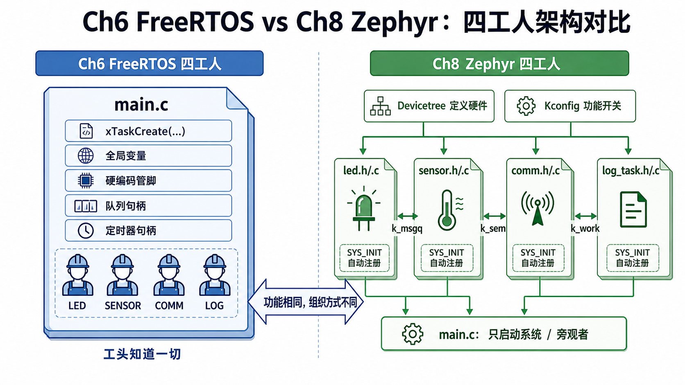


### 24.4 对比总结

| 维度 | Ch6 FreeRTOS | Ch8 v9 Zephyr | 谁更好？ |
|------|-------------|---------------|---------|
| **文件组织** | 一个main.c（~400行） | 四模块各.h/.c + main.c（5行） | Zephyr：拆模块 |
| **LED驱动** | `xTimer 500ms → callback → HAL_GPIO_Toggle` | `k_timer 500ms → ISR callback → gpio_pin_set_dt` | 等价，Zephyr更安全（devicetree绑定） |
| **SENSOR** | `xTimer 2000ms → I2C读 → xQueueSend` | `k_timer 2000ms → sensor_sample_fetch → k_msgq_put` | Zephyr：sensor API屏蔽硬件 |
| **COMM** | `xQueueReceive → 处理` | `k_msgq_get → switch处理` | 等价 |
| **LOG** | `低优先级xTask → xQueueReceive → printf` | `k_work → k_msgq_get → printk` | Zephyr：workqueue更省栈 |
| **硬件定义** | `#define LED_PIN GPIO_PIN_12` | 设备树 `leds { gpios = ... }` | Zephyr：硬件与逻辑分离 |
| **功能开关** | 手动`#if` | `prj.conf` `CONFIG_xxx` | Zephyr：配置驱动 |
| **模块注册** | main里手动调`xTaskCreate` | 每个.c末尾一行`SYS_INIT` | Zephyr：声明式 |
| **main.c长度** | ~200行（创建4个任务+4个队列） | **5行** | Zephyr：main只是连接器 |
| **加新模块** | 改main.c + 可能改Makefile | 新建.h/.c + CMakeLists加一行 | Zephyr：main.c不动 |

**功能行为完全一样。四颗LED循环闪烁，传感器每2秒采一次温度，通信工人随时可处理命令，日志工人批量打印。** 但代码的组织方式根本不同——FreeRTOS版里main.c是工头，知道一切。Zephyr版里每个模块是自主的，main只是一个安静的旁观者。


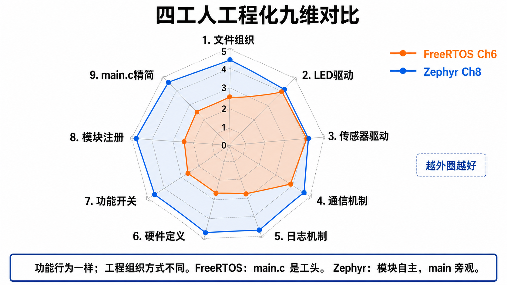

### 24.5 中断与优先级反转的工程处理

Ch6 v10处理了按钮中断到任务通知的链路。Zephyr里同款：

```c
/* 按钮中断 → COMM 线程处理（不在 ISR 里做重活） */

/* 定义一个 k_work，提交到 COMM 的专用 workqueue */
static struct k_work s_button_work;

static void button_isr(const struct device *dev,
                       struct gpio_callback *cb, uint32_t pins)
{
    (void)dev; (void)cb;
    /* ISR 里只做最少的事：提交 work，立刻退出 */
    k_work_submit(&s_button_work);
}

static void button_work_handler(struct k_work *work)
{
    (void)work;
    /* 在这里安全地做重活：发命令给 COMM */
    comm_task_send_cmd(CMD_PING, k_uptime_get());
}
```

**要点：** ISR只做`k_work_submit`提交到工作队列。真正的处理在低优先级的work里完成。这和Ch6的"ISR → `xSemaphoreGiveFromISR` → 任务处理"同源。

**优先级反转处理：** 如果COMM（优先级3）需要访问一个被LOG（优先级10）持有的mutex保护的数据，LOG被一个中优先级（5）的任务抢占——COMM就会无限等。Zephyr的`k_mutex`支持优先级继承和优先级天花板：

```c
/* 优先级继承：持有 mutex 的线程自动继承等待者的优先级 */
K_MUTEX_DEFINE(s_data_mutex);

/* COMM 线程（prio=3）*/
k_mutex_lock(&s_data_mutex, K_FOREVER);  /* LOG 自动提升到 prio 3 */
/* ... 临界区 ... */
k_mutex_unlock(&s_data_mutex);           /* LOG 恢复 prio 10 */
```

这和Ch6 v10的理论完全对齐——优先级继承不是学术概念，是每个RTOS都要处理的工程现实。Zephyr的`k_mutex`默认开启优先级继承（`CONFIG_PRIORITY_CEILING=y`），你不需要额外配置。

---

### 24.6 中断下半部：上半部（ISR）→ 下半部（k_work_submit）协作模式

在 Ch6 §10 你学了"中断里只做最少的事，重活丢给任务"。FreeRTOS 的做法是 ISR 里 `xSemaphoreGiveFromISR`，然后一个高优先级任务 `xSemaphoreTake` 后处理。这就是**上半部/下半部**模式的雏形——硬件中断是上半部，任务是下半部。

Zephyr 把这个模式做得更系统化。它的工作队列（workqueue）本身就是为"下半部"设计的：

```
硬件中断（上半部）               工作队列（下半部）
┌─────────────────┐          ┌─────────────────┐
│ ISR 快速处理      │  k_work  │ k_work handler  │
│ • 清中断标志      │ ──submit─→ │ • 做重活          │
│ • 读关键寄存器    │          │ • 发消息          │
│ • k_work_submit  │          │ • 调驱动 API      │
│ • 立刻返回        │          │ • 可以用 mutex    │
└─────────────────┘          └─────────────────┘
```

**核心规则：** 上半部（ISR）只能做 O(1) 的事——清标志位、读寄存器、`k_work_submit`。下半部（k_work handler）可以做任何事——调驱动 API、拿 mutex、发消息队列、甚至 `k_msleep`。

#### 实例：LM75 温度传感器中断回调

以 LM75 温度传感器为例——它的 OS/INT 引脚在温度超阈值时触发中断。Ch6 里你的 ISR 做了三件事：读温度寄存器（I2C 事务，耗时 ~1ms）、比较阈值、发消息队列。在 Zephyr 里，I2C 事务不能放 ISR（I2C 驱动内部用了 mutex，ISR 里不能拿锁），所以必须拆成上半部和下半部：

```c
/* ===== 上半部：ISR（lm75_isr.c）===== */
#include <zephyr/kernel.h>
#include <zephyr/drivers/gpio.h>

static struct k_work s_lm75_work;

/* LM75 OS/INT 引脚的中断回调 —— 上半部 */
static void lm75_alert_isr(const struct device *dev,
                            struct gpio_callback *cb,
                            uint32_t pins)
{
    (void)dev; (void)cb; (void)pins;

    /* 上半部只做三件事：*/
    /* 1. 不做任何 I2C 操作！I2C 驱动内部用 mutex */
    /* 2. 仅提交 work 到系统工作队列 */
    k_work_submit(&s_lm75_work);
    /* 3. ISR 立刻返回 —— 从进到出 < 10μs */
}

/* ===== 下半部：k_work handler（lm75_bottom.c）===== */
#include <zephyr/drivers/sensor.h>

static const struct device *s_lm75_dev;

static void lm75_alert_work_handler(struct k_work *work)
{
    (void)work;
    struct sensor_value temp;

    /* 下半部可以做任何事：*/
    /* 1. 安全地调 I2C 驱动 API（内部可能拿 mutex）*/
    sensor_sample_fetch(s_lm75_dev);
    sensor_channel_get(s_lm75_dev, SENSOR_CHAN_AMBIENT_TEMP, &temp);

    /* 2. 发消息队列通知其他模块 */
    log_task_push_alert(temp.val1, temp.val2);

    /* 3. 如果需要，甚至可以在下半部里 k_msleep */
}

/* 初始化：注册 ISR + 初始化 work */
int lm75_alert_init(void)
{
    s_lm75_dev = DEVICE_DT_GET(DT_NODELABEL(lm75));
    k_work_init(&s_lm75_work, lm75_alert_work_handler);
    /* 配置 GPIO 中断... */
    return 0;
}
```

#### 上半部/下半部的四条铁律

| 铁律 | 上半部（ISR） | 下半部（k_work handler） |
|------|-------------|------------------------|

---

# PART 5 · 构建系统与配置体系

| **耗时** | < 10μs（越快越好） | 无硬性限制（但不要阻塞超过 100ms） |
| **能调什么** | `k_work_submit`、`k_sem_give`、`k_msgq_put`（非阻塞） | 所有 Zephyr API，包括 mutex、I2C、SPI |
| **能不能阻塞** | ❌ 绝对不能 | ✅ 可以（但要小心死锁） |
| **能不能拿 mutex** | ❌ 绝对不能（mutex 会调度的！） | ✅ 可以 |

#### 和 Ch6 的对应关系

| Ch6 概念 | Zephyr 概念 | 比喻 |
|---------|-----------|------|
| ISR 里 `xSemaphoreGiveFromISR` | ISR 里 `k_work_submit` | 上半部：按铃通知 |
| 高优先级任务 `xSemaphoreTake` 后处理 | k_work handler 自动被系统 workqueue 调度 | 下半部：被叫来处理 |
| `portYIELD_FROM_ISR` 触发 PendSV | k_work_submit 内部自动触发调度 | 通知机制不同，目的一致 |

**关键差异：** Ch6 你需要手动创建一个高优先级任务来当"下半部"，并手动管理它的栈大小和优先级。Zephyr 的系统 workqueue 已经替你做好了——`k_work_submit` 提交到全局 `k_sys_work_q`，一个低优先级协作线程自动处理。你不需要创建一个专用线程。

> **一句话总结：** ISR 是急诊室分诊台——只做分类和登记（上半部），重活（下半部）交给诊室里的医生（k_work handler）。Zephyr 的 workqueue 就是那个"诊室医生池"。

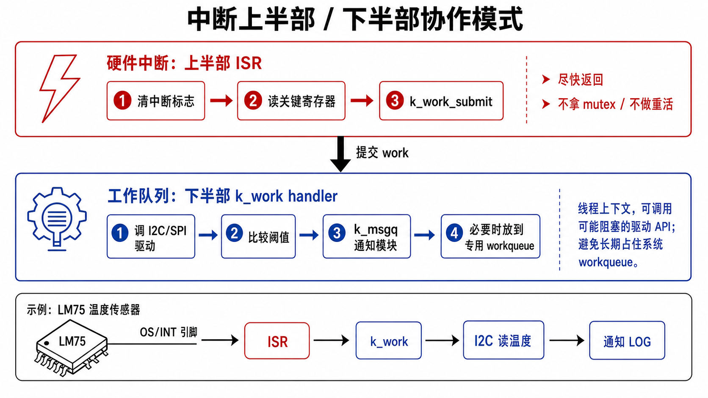


## 25 Kconfig：编译期配电箱

你在 PART1 §11 写下 `CONFIG_GPIO=y` 的那一刻，Zephyr 工厂的地下室发生了一连串事件。不是你编译时才发生的——是你写下的那一行触发了整个配电系统的响应。Kconfig 是 Zephyr 的编译期配电箱：你扳下一个开关（`CONFIG_GPIO=y`），配电箱自动检查电路是否合法（`depends on`），自动帮你拉上关联的闸（`select`），最后把整张通电清单（`.config`）交给后厨（`kconfig.py`）出菜（`autoconf.h`）。

### 25.1 从 prj.conf 到 autoconf.h：你点菜，后厨备料，出菜

你走进一家餐厅，在菜单上勾了一个"宫保鸡丁"。服务员把菜单递进后厨，后厨看了一眼：宫保鸡丁需要花生——检查花生库存（`depends on INGREDIENT_PEANUT=y`）。花生库存够，厨师又顺手拿出葱姜蒜（`select SPICES`——炒宫保鸡丁不可能不备香料）。最后，所有被卷入的食材清单交到灶台，变成一盘菜。

你的 `prj.conf` 就是这张菜单。`Kconfig` 文件树是后厨的配料规则。`.config` 是最终的食材清单。`autoconf.h` 是端上来的那盘菜——C 预处理器只认 `#define`，不认识 `.conf`。

下面是这条流水线的完整 Mermaid 图：

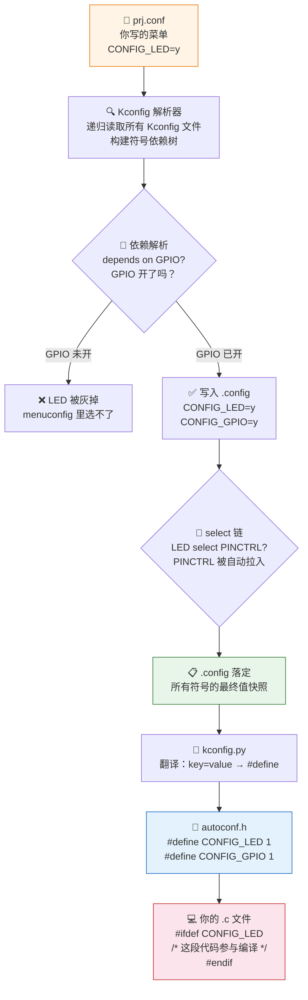
```mermaid
graph TD
    A["📝 prj.conf<br/>你写的菜单<br/>CONFIG_LED=y"] --> B["🔍 Kconfig 解析器<br/>递归读取所有 Kconfig 文件<br/>构建符号依赖树"]
    B --> C{"🧩 依赖解析<br/>depends on GPIO?<br/>GPIO 开了吗？"}
    C -->|"GPIO 未开"| D["❌ LED 被灰掉<br/>menuconfig 里选不了"]
    C -->|"GPIO 已开"| E["✅ 写入 .config<br/>CONFIG_LED=y<br/>CONFIG_GPIO=y"]
    E --> F{"🔗 select 链<br/>LED select PINCTRL?<br/>PINCTRL 被自动拉入"}
    F --> G["📋 .config 落定<br/>所有符号的最终值快照"]
    G --> H["🐍 kconfig.py<br/>翻译：key=value → #define"]
    H --> I["📄 autoconf.h<br/>#define CONFIG_LED 1<br/>#define CONFIG_GPIO 1"]
    I --> J["💻 你的 .c 文件<br/>#ifdef CONFIG_LED<br/>  /* 这段代码参与编译 */<br/>#endif"]
    
    style A fill:#fff4e6,stroke:#e67700
    style G fill:#e8f5e9,stroke:#2e7d32
    style I fill:#e3f2fd,stroke:#1565c0
    style J fill:#fce4ec,stroke:#c62828
```

流程拆开看三步：

**第一步：解析 prj.conf，递归构建依赖树。** Kconfig 解析器不是简单地 `key=value` 读入——它递归遍历 `zephyr/` 下所有 `Kconfig` 文件（几千行），为每一个 `CONFIG_XXX` 符号建立完整的依赖图。你写 `CONFIG_LED=y`，解析器找到定义这个符号的 `Kconfig.led`，发现 `depends on GPIO`，于是去查 GPIO 的状态。如果你的 `prj.conf` 里没有 `CONFIG_GPIO=y`，LED 选项直接灰掉——不是运行时报错，是编译期配电箱不给它通电。

**第二步：生成 .config 快照。** 所有来源的值——你写的 `prj.conf`、板子自带的 `board_defconfig`、Kconfig 的 `default y`——最终汇入一个文件 `.config`。你可以在 `build/zephyr/.config` 里亲眼看到这份完整清单。这是 Kconfig 处理完成后的确定性结果：不再有来自哪里的区别，所有的符号都落定到最终值。

**第三步：kconfig.py 翻译为 autoconf.h。** 这是从"菜单"到"出菜"的最后一步。`kconfig.py` 遍历 `.config` 每一行：`CONFIG_LED=y` → `#define CONFIG_LED 1`；`CONFIG_LOG_LEVEL=3` → `#define CONFIG_LOG_LEVEL 3`。这个头文件被 `autoconf.h` include，你的 C 代码里 `#ifdef CONFIG_LED` 就此生效。

打开你 `build/zephyr/include/generated/autoconf.h`，翻几行看看：

```c
/* 从 .config 翻译过来的 #define —— 每行对应你 prj.conf 里的一个开关 */
#define CONFIG_GPIO 1
#define CONFIG_SERIAL 1
#define CONFIG_PRINTK 1
#define CONFIG_HEAP_MEM_POOL_SIZE 4096
#define CONFIG_MAIN_THREAD_PRIORITY 0
#define CONFIG_LOG_DEFAULT_LEVEL 3
```

每一个 `#define` 背后都是你 prj.conf 里的一行。你写完 `CONFIG_GPIO=y` 关了编辑器，但 `autoconf.h` 是翻山越岭跑完三步才到你 C 代码面前的。这就是 PART1 §11 那条 `prj.conf` 走完全程的庐山真面目。

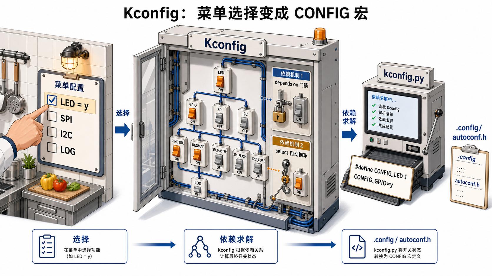

### 25.2 depends on vs select：门锁与自动拖车

Kconfig 依赖有两种截然不同的逻辑。你把它们想象成你工厂配电箱里的两种机构：

**depends on = 门锁。** 你要进 LED 车间（`CONFIG_LED=y`），但门锁着——门锁的钥匙是 GPIO（`depends on GPIO`）。GPIO 没开，你连门都推不开。menuconfig 里，`CONFIG_LED` 根本不出现——选项被隐藏了。这不是运行时判断，是配电箱在设计上就没给这个车间拉电线。门锁逻辑是自顶向下的：父不开，子不存在。

**select = 自动拖车。** 你开了一辆 LED 拖车上路（`CONFIG_LED=y`），但 LED 拖车有规定：上路必须挂 PINCTRL 小挂车（`select PINCTRL`）。你不用自己去挂——你发动 LED，PINCTRL 自动被勾上。select 的逻辑是自底向上的：子开了，自动把父拽进来。

来看一个真实的 Kconfig 片段（来自 Zephyr 主线 `zephyr/drivers/gpio/Kconfig`）：

```kconfig
config GPIO
    bool "GPIO Drivers"
    help
      Enable GPIO driver support. 这是工厂的总配电闸。

config GPIO_STM32
    bool "STM32 GPIO driver"
    depends on SOC_FAMILY_STM32       # 门锁：不是STM32芯片，这个选项不存在
    depends on GPIO                    # 门锁：GPIO总闸没开，这个也不存在
    select PINCTRL                     # 自动拖车：你选STM32 GPIO，PINCTRL自动跟上
    help
      STM32 GPIO 驱动。你现在知道为什么选了它 PINCTRL 自己跟上了吧。
```

你在 `prj.conf` 写 `CONFIG_GPIO_STM32=y`，Kconfig 在背后做了什么：

```
CONFIG_GPIO_STM32=y
    → depends on SOC_FAMILY_STM32 ？✅（你是STM32板子）→ 门锁通过
    → depends on GPIO ？❌（你没写 CONFIG_GPIO=y）→ 门锁卡住
    → 你回去补了一行 CONFIG_GPIO=y
    → 两道门锁都过了
    → select PINCTRL → PINCTRL 自动被拉入 .config
    → select 链还可能继续：PINCTRL 可能 select DTS_HAS_STM32_PINCTRL → ...
```

最终一行 `CONFIG_GPIO_STM32=y` 拽进来 5~10 个符号。这不是 bug——这是你雇配电箱帮你干活。你只声明你要什么，依赖让它算。

常见真实依赖链（GPIO → 传感器子系统）：

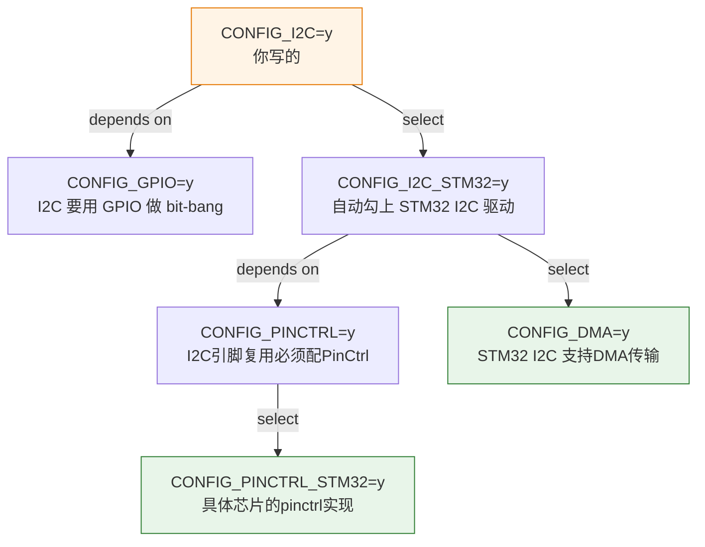
```mermaid
graph TD
    A["CONFIG_I2C=y<br/>你写的"] -->|"depends on"| B["CONFIG_GPIO=y<br/>I2C 要用 GPIO 做 bit-bang"]
    A -->|"select"| C["CONFIG_I2C_STM32=y<br/>自动勾上 STM32 I2C 驱动"]
    C -->|"depends on"| D["CONFIG_PINCTRL=y<br/>I2C引脚复用必须配PinCtrl"]
    C -->|"select"| E["CONFIG_DMA=y<br/>STM32 I2C 支持DMA传输"]
    D -->|"select"| F["CONFIG_PINCTRL_STM32=y<br/>具体芯片的pinctrl实现"]
    
    style A fill:#fff4e6,stroke:#e67700
    style E fill:#e8f5e9,stroke:#2e7d32
    style F fill:#e8f5e9,stroke:#2e7d32
```

你写一行 `CONFIG_I2C=y`，最终 `.config` 里多出 6~10 行。不是你忘了写——是门锁和自动拖车替你干了。

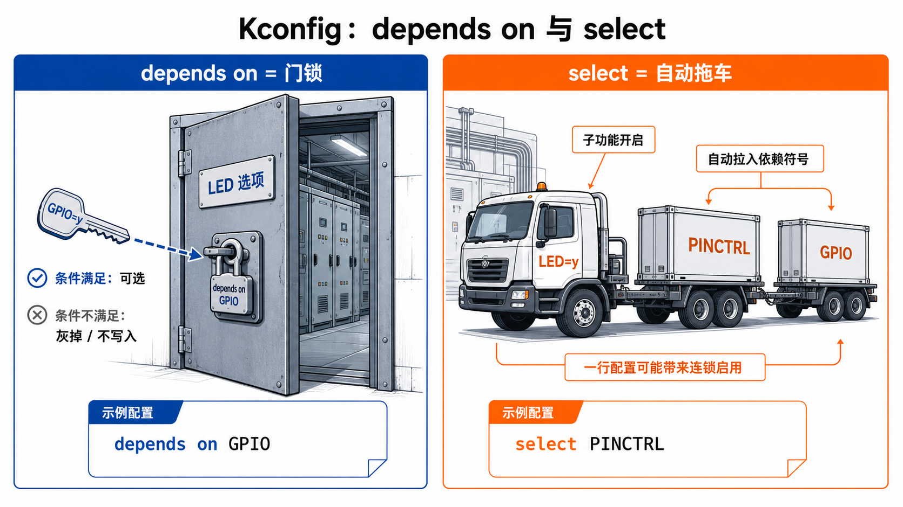

面对一个不熟悉的子系统，Kconfig 的 depends on 和 select 就像配电箱里的两种安全机构。下面这张决策树帮你建立直觉：当你看到任意 `config` 块时，顺着它走，就能判断这个符号是怎么被拉入（或被挡在门外）的。

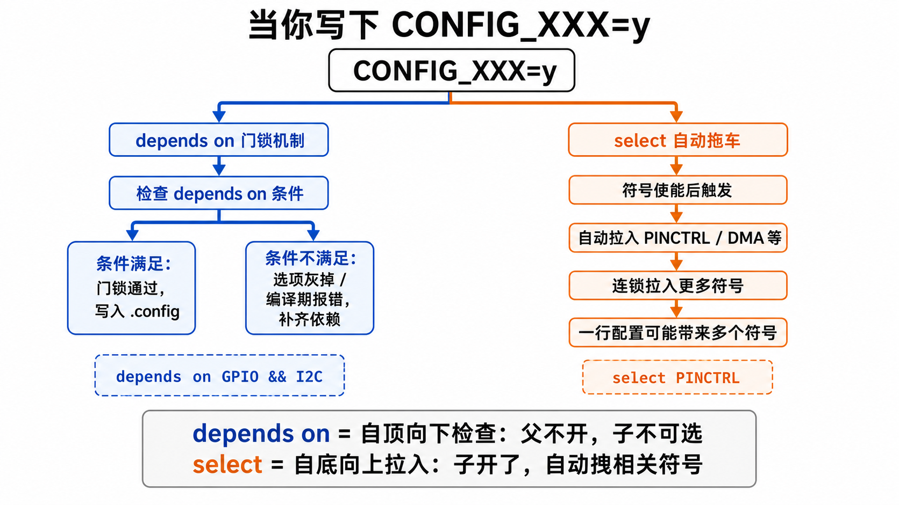

### 25.3 menuconfig

`west build -t menuconfig`。回车。

黑底蓝字，左边是树形菜单，右边是 HELP 文本。你按 `/` 搜索 `GPIO`，光标跳到 `Drivers → GPIO Drivers →`。按空格选中 `STM32 GPIO driver`——屏幕左上角立刻出现 `[*] STM32 GPIO driver`，`.config` 同步写入 `CONFIG_GPIO_STM32=y`。

但 menuconfig 的真正价值不在"改配置"——你在 `prj.conf` 手写更快。它的价值在**让你看见依赖**。

试试这个操作：搜索 `I2C`，发现 `I2C Drivers` 菜单根本不存在。为什么？因为 `CONFIG_I2C` 的 `depends on GPIO` 没满足——你 GPIO 总闸没开。你在 GPIO 根节点按空格，再回去搜 I2C——菜单出现了。配电箱把门打开了。

再试一个：选中 `STM32 I2C`，按 `?` 看 HELP。HELP 底部写着 `Selects: PINCTRL, DMA`。然后你退出 menuconfig，它会弹窗："**以下符号被自动选中：** CONFIG_PINCTRL=y, CONFIG_DMA=y"。select 链在你眼皮底下展开。

menuconfig 同样能帮你发现冲突。你选了 `CONFIG_I2C_STM32=y` 又选 `CONFIG_I2C_NRFX=y`——退出时弹窗报错：这两个符号互斥（`depends on !I2C_NRFX`），你必须二选一。不是运行时 crash，是配电箱拒绝合上两条互相短路的电路。

对比 FreeRTOS：`FreeRTOSConfig.h` 是一张平坦的表格——所有配置项并列，你想改什么就填，没有约束检查，没有自动补全，冲突配置你自己负责。menuconfig 是 IDE 帮你管理 import——有提示、有搜索、有纠错。前者是记事本写 todo list，后者是 IntelliJ 写 Java。

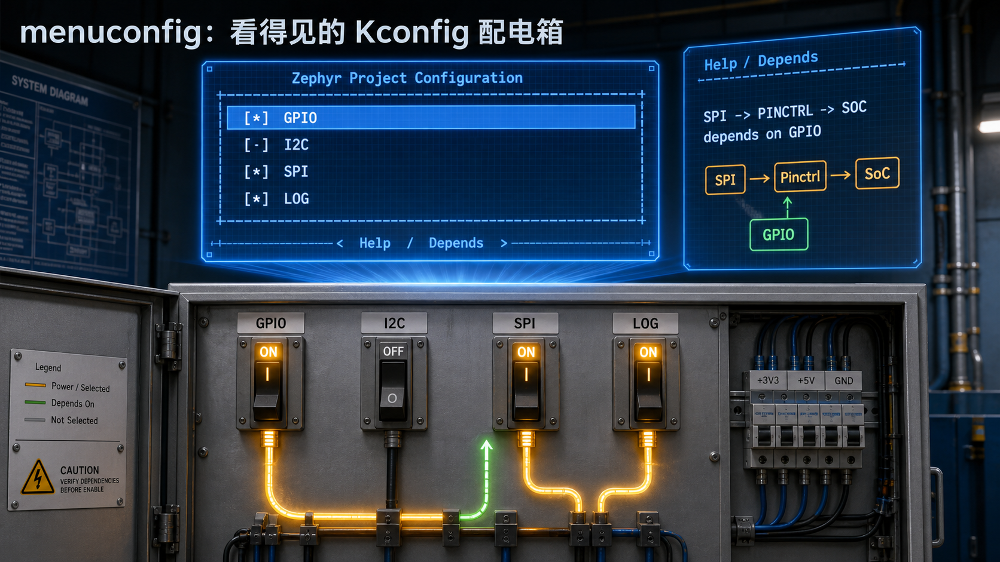

### 25.4 v10 demo：豪华版削到最小版——配电箱断闸实验

把 PART4 的 v8 多模块工程拿两份，做一次极限对比。

**豪华版 prj.conf（v10_luxury）：**

```
CONFIG_GPIO=y
CONFIG_SHELL=y
CONFIG_LOG=y
CONFIG_SENSOR=y
CONFIG_I2C=y
CONFIG_SPI=y
CONFIG_PRINTK=y
CONFIG_SERIAL=y
CONFIG_CBPRINTF_FP_SUPPORT=y
CONFIG_HEAP_MEM_POOL_SIZE=8192
```

**最小版 prj.conf（v10_minimal）：**

```
CONFIG_GPIO=y
```

两份各跑 `west build -b stm32f4_disco`，然后看 `build/zephyr/zephyr.elf` 的 rom_report：

| 版本 | Flash 占用 | RAM 占用 | 差异分析 |
|---|---|---|---|
| v10_luxury | ~58 KB | ~14 KB | Shell 子系统 (~8KB) + Log (~6KB) + Sensor 子系统 (~4KB) + I2C 总线 (~3KB) + SPI 总线 (~3KB) + 浮点打印 (~2KB) = 全部拉满 |
| v10_minimal | ~10 KB | ~4 KB | 只剩 GPIO 驱动 (~1KB) + 内核最小集 (~6KB) + 你的 LED 驱动 (~0.5KB) + 剩余是 C 运行时 |

你关掉的不是几个函数——是整个子系统。

Shell 子系统呢？`CONFIG_SHELL=n` → `subsys/shell/` 下几十个 .c 文件全不参与编译 → `.elf` 里少了 ~8KB。这不是运行时的 `if (!shell_enabled) return;`，是 **编译期电闸拉了——那条产线根本不通电。** 

Sensor 子系统呢？`CONFIG_SENSOR=n` → `drivers/sensor/` 下一个 .c 不进编译 → `sensor_driver_api` 虚表不存在 → linker 也不会为它分配 `.rodata` 空间。I2C、SPI 的总线框架同理——框架代码 + 驱动代码 + 设备对象的 ROM 开销，全部一刀切。

这是 Zephyr 真正的设计力量：**`#ifdef CONFIG_XXX` 遍布每个子系统的每个 .c 文件。** 这些 #ifdef 不是运行时分支——是编译期剪刀。Kconfig 是执剪刀的手。你的 `prj.conf` 决定了哪些剪刀下刀、哪些不动。

回扣 PART2 §14：你在 `.dts` 里声明了 I2C 设备，但如果 `CONFIG_I2C=n`，`devicetree_generated.h` 里的 I2C 宏仍然存在——因为设备树和 Kconfig 是两层分离的。你可以设备树有 I2C 节点但 Kconfig 不编 I2C 驱动。设备树说的是"我的板子上有这个硬件"，Kconfig 说的是"这个硬件的驱动代码要不要编进来"——一个是仓库清单，一个是配电图，两件事。

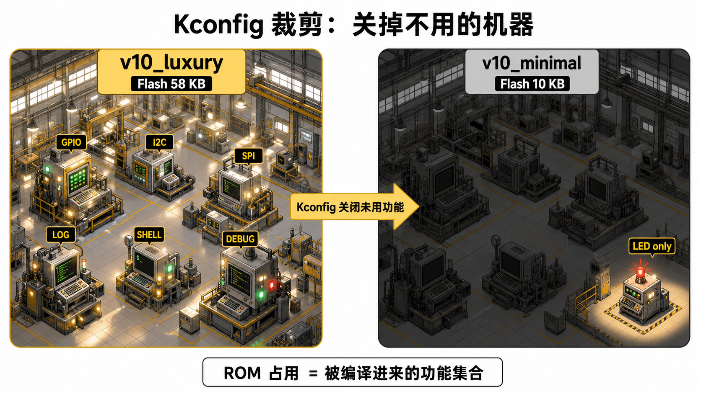

---

## 26 设备树编译流水线：从仓库清单到领料单

PART2 §14 你知道了"设备树在编译期展开"，但你只看到一头（`.dts`）一尾（`GPIO_DT_SPEC_GET`）。中间那条流水线——`.dts` 怎么变成 `#define`——你还没亲眼见过。这一节带你钻进流水线的每一站。

### 26.1 四步流水线：翻译官 + 排版工人

把 `.dts` → C 结构体的过程想象成一份跨国贸易单据的流转：

1. **预处理器合并 DTS**：你的 `.dts`（板级描述）、芯片厂商的 `.dtsi`（芯片级描述）、你追加的 `.overlay`——构建系统的 C 预处理器先把三份文件合并为一份完整的 DTS。然后 `gen_defines.py`（基于 `edtlib` 库）解析这份合并后的 DTS，生成 `devicetree_generated.h` 和最终的 `zephyr.dts`。DTC（Device Tree Compiler）在这个过程中主要负责额外的语法检查和生成 `.dtb`（通常不直接用于固件编译）。这一步跟 C 编译无关——DTS 的处理在编译开始前就完成了。

2. **规则核验（binding YAML）**：另一位工作人员——"排版工人"——拿着一本厚厚的 YAML 规则手册，检查 DT 树的每个节点。你的 `compatible = "worldsemi,ws2812"`？排版工人翻开 `worldsemi,ws2812-gpio.yaml`，确认 `gpios` 属性类型正确、必填属性齐备。核对完毕，他开始为每个属性分配唯一的宏名。

3. **逐项翻译（gen_defines.py）**：排版工人现在化身 Python 脚本——`gen_defines.py` 遍历 DT 树的每个节点，为每个属性生成唯一的 `#define` 宏名。`DT_N_S_leds_S_led0_P_gpios`——这个宏名本身就是路径编码。排版工人不关心你 C 代码怎么写，他只负责把 DT 的树形数据拍扁成预处理器能吃的 token。

4. **交付（devicetree_generated.h → 预处理器展开）**：几万行 `#define` 写入 `devicetree_generated.h`。你的 C 代码写 `GPIO_DT_SPEC_GET(DT_NODELABEL(led0), gpios)`，预处理器在编译前把这一行接力展开成 `{DEVICE_IO_GPIOC, 13, GPIO_ACTIVE_LOW}`。翻译官和排版工人干完了，gcc 拿到的只是展开后的字面量。

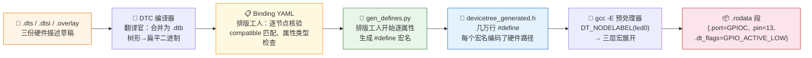
```mermaid
graph LR
    A["📝 .dts / .dtsi / .overlay<br/>三份硬件描述草稿"] --> B["🔧 DTC 编译器<br/>翻译官：合并为 .dtb<br/>树形→扁平二进制"]
    B --> C["📋 Binding YAML<br/>排版工人：逐节点核验<br/>compatible 匹配、属性类型检查"]
    C --> D["🐍 gen_defines.py<br/>排版工人开始逐属性<br/>生成 #define 宏名"]
    D --> E["📄 devicetree_generated.h<br/>几万行 #define<br/>每个宏名编码了硬件路径"]
    E --> F["🔨 gcc -E 预处理器<br/>DT_NODELABEL(led0)<br/>→ 三层宏展开"]
    F --> G["📦 .rodata 段<br/>{.port=GPIOC, .pin=13,<br/>.dt_flags=GPIO_ACTIVE_LOW}"]

    style A fill:#fff4e6,stroke:#e67700
    style C fill:#fff8e1,stroke:#ff8f00
    style D fill:#e8f5e9,stroke:#2e7d32
    style E fill:#e3f2fd,stroke:#1565c0
    style G fill:#fce4ec,stroke:#c62828
```

上面这张流水线图概括了全局。现在让我们用一张更形象的信息图来感受四步流水线：翻译官、排版工人、DTC编译器和 gen_defines.py 各自在做什么。

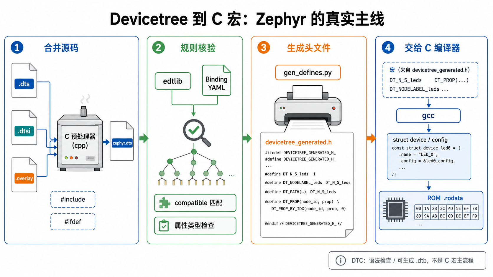

### 26.2 打开 devicetree_generated.h 看一眼——你的 .dts 变成了什么

`west build` 完成后，打开 `build/zephyr/include/generated/devicetree_generated.h`。这个文件通常有几千到几万行。用编辑器搜索 `led`：

```c
/* ===================================================
 * 这下面的每一个 #define 都来自你 .dts 里的某个节点
 * =================================================== */

/* 来自 .dts: /leds/led0 { gpios = <&gpioc 13 GPIO_ACTIVE_LOW>; }; */
#define DT_N_S_leds_S_led0_P_gpios_CONTROLLER    "GPIO_40020800"   /* ← &gpioc */
#define DT_N_S_leds_S_led0_P_gpios_PIN            13               /* ← pin 13   */
#define DT_N_S_leds_S_led0_P_gpios_FLAGS           1               /* ← GPIO_ACTIVE_LOW */
#define DT_N_S_leds_S_led0_P_label                "Green LED"      /* ← label 属性 */

/* 节点标识符——这是"门牌号" */
#define DT_N_S_leds_S_led0    /* 展开为内部节点ID，用于其他宏的输入 */

/* 别名——你用 DT_NODELABEL(led0) 的落点 */
#define DT_N_ALIAS_led0       DT_N_S_leds_S_led0
#define DT_NODELABEL_led0     DT_N_S_leds_S_led0

/* 来自 .dts: soc { ... } 下面的 gpioa/gpiob/gpioc... */
#define DT_N_S_soc_S_gpioc_40020800_P_label       "GPIOC"
#define DT_N_S_soc_S_gpioc_40020800_P_reg         0x40020800
#define DT_N_S_soc_S_gpioc_40020800_P_interrupts   81
```

每一行 `#define` 都是一条领料单。你怎么对上号的？

- `DT_N_S_leds_S_led0` 对应 `.dts` 里 `leds { led0 { ... }; };`——`N` = Node，`S` = Subnode。路径 `/leds/led0` 被编码成 `N_S_leds_S_led0`。
- `P_gpios_CONTROLLER` 对应 `led0` 节点的 `gpios` 属性的第一个 cell（phandle 指向的控制器标签）。
- `P_gpios_PIN` 对应 `gpios` 属性的第二个 cell（pin 编号）。
- `P_gpios_FLAGS` 对应 `gpios` 属性的第三个 cell（flags: ACTIVE_LOW = 1）。

你的 `.dts` 写了这一行：

```dts
led0: led_0 {
    gpios = <&gpioc 13 GPIO_ACTIVE_LOW>;
};
```

`gen_defines.py` 把它翻译成了三个 `#define`（CONTROLLER、PIN、FLAGS）+ 一个节点标识符（`DT_N_S_leds_S_led0`）+ 一个别名（`DT_NODELABEL_led0`）。这不是运行时解析——这是编译期路径编码。

### 26.3 DT_宏的三层展开：接力赛全过程

你在 `led_task.c` 里写了这行：

```c
#define LED_NODE DT_NODELABEL(led0)
static const struct gpio_dt_spec led = GPIO_DT_SPEC_GET(LED_NODE, gpios);
```

预处理器看到的是三层接力，我把它逐层展开给你看：

**第〇层：你写的原始代码。**

```c
GPIO_DT_SPEC_GET(DT_NODELABEL(led0), gpios)
```

**第一层：`DT_NODELABEL` → 节点标识符。**

预处理器在 `devicetree_generated.h` 找到：

```c
#define DT_NODELABEL(led0)    DT_N_S_leds_S_led0
```

展开后：

```c
GPIO_DT_SPEC_GET(DT_N_S_leds_S_led0, gpios)
```

**第二层：`GPIO_DT_SPEC_GET` → 结构体字面量。**

这个宏在 `zephyr/include/zephyr/drivers/gpio.h` 里定义，展开后大致是：

```c
{
    .port = DEVICE_DT_GET(DT_GPIO_CTLR(DT_N_S_leds_S_led0, gpios)),
    .pin  = DT_GPIO_PIN(DT_N_S_leds_S_led0, gpios),
    .dt_flags = DT_GPIO_FLAGS(DT_N_S_leds_S_led0, gpios),
}
```

**第三层：`DT_GPIO_PIN` → 纯数值。**

`DT_GPIO_PIN` 又展开成 `DT_N_S_leds_S_led0_P_gpios_PIN`，最终变成：

```c
{
    .port = (const struct device *)DEVICE_DT_GET(DT_N_S_soc_S_gpioc_40020800),
    .pin  = 13,
    .dt_flags = GPIO_ACTIVE_LOW,
}
```

三层接力，全部发生在 **gcc 正式开始编译你的 .c 文件之前**（预处理器阶段）。gcc 看到的代码里已经没有 `DT_NODELABEL`、没有 `GPIO_DT_SPEC_GET`、没有 `devicetree_generated.h` 的宏名——只有展开后的结构体字面量。三层的每一个接力点都是纯 token 替换——不做计算、不做判断、不做运行时操作。这就是 C 预处理器的极致用法：用字符串拼接模拟表格查找。

### 26.4 "编译期" vs "运行时"：预制菜 vs 现做

同一个 LED 点灯，Zephyr 和 Linux 走了两条完全不同的路。用餐饮业来类比：

**Zephyr = 预制菜。** 你提前把 `.dts`（原料清单）送到中央厨房——`gen_defines.py` 预处理所有食材，全部切好分装（`#define` 常量），冷冻成一份份预制菜包（`.rodata` 结构体数组）。到了饭点（CPU 上电），只做一件事：微波炉加热 30 秒（main 函数启动 → 直接读结构体）。零切配、零调味、零等待。

**Linux = 现做餐厅。** 原料清单 `.dtb` 随菜送进后厨。厨师（内核）打开清单，按菜名（`compatible` 字符串）在菜谱库（driver database）里逐份匹配，找到菜谱（`probe()` 函数），拿出原料，现场切配、现场炒制。支持临时加菜（热插拔 USB 设备）、退菜（rmmod）。

```mermaid
graph TD
    subgraph Zephyr["🏭 ZEPHYR = 预制菜模式"]
        A1[".dts 原料清单"] -->|"DTC+gen_defines.py<br/>中央厨房预处理"| B1["#define 预制菜包<br/>全部在编译期完成"]
        B1 -->|"CPU上电→main()"| C1["微波炉加热30秒<br/>直接读 .rodata 结构体<br/>零匹配、零解析"]
    end
    
    subgraph Linux["🍳 LINUX = 现做模式"]
        A2[".dtb 原料清单"] -->|"bootloader 传递"| B2["内核启动后<br/>遍历 DT 树"]
        B2 -->|"of_find_node_by_path()"| C2["运行时字符串 match<br/>compatible='xxx' → driver"]
        C2 -->|"probe() 被调"| D2["现场分配资源<br/>初始化硬件"]
    end
    
    style C1 fill:#e8f5e9,stroke:#2e7d32
    style C2 fill:#fff3e0,stroke:#ef6c00
```

具体到你的 LED：

- **Zephyr 的 `compatible` 匹配** 发生在 **`gen_defines.py` 扫描 binding YAML 时**。Python 脚本读完 `compatible = "worldsemi,ws2812"`，找到 `worldsemi,ws2812-gpio.yaml`，验证属性合法，然后把 pin、port、flags 全写成 `#define`。等 CPU 跑起来，内核根本不知道"设备树"这个词——它看到的只有已展开的 `{.port = GPIOC, .pin = 13, .dt_flags = GPIO_ACTIVE_LOW}`。

- **Linux 的 `compatible` 匹配** 发生在 **内核启动后。** CPU 跑起来了，内核用 `of_find_node_by_path()` 遍历 DT 树，对每个节点的 `compatible` 字符串做 `strcmp`，从注册过的 driver 数组里找出匹配的 `struct of_device_id`，调它的 `probe()`。字符串匹配、链表遍历、动态分配——全部发生在运行时。

这就是 Zephyr 从 boot 到 `main()` 只要几毫秒的根本原因之一：**所有能在编译期算完的事，全在编译期算完了。** 运行时不留字符串匹配、不留 DT 遍历、不留动态分配。单片机不需要热插拔——你在产线上就已经知道这块板子上焊了什么硬件。所以不需要在运行时再"发现"一次。

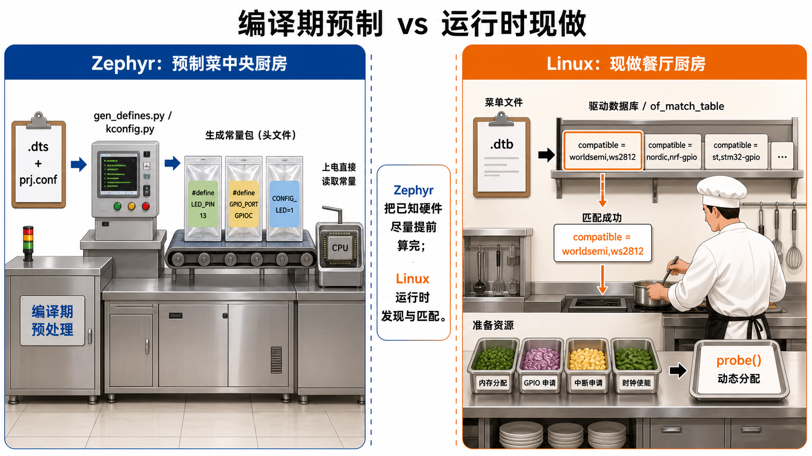

---

## 27 CMake：装配流水线的设计图

PART1 你写了第一个 CMakeLists.txt——五行，灯亮了。PART4 §26 你加了 `target_sources`——一行，四个模块进来了。你一直觉得 CMakeLists.txt 就是个文件列表。直到你问："为什么不能拖几个 .c 进来自己写 Makefile？"

答案就在 `find_package(Zephyr)` 这一行里。这一行不是"找到 Zephyr 源码在哪"——是**打开了工厂的总电闸。** 电闸一合，几千行 CMake 脚本像洪水一样被 include 进来，铺设好了整条装配流水线：交叉编译工具链就位、架构编译选项生效、Kconfig + DTS 两条管线开始运转、内核源码全部被注册为 CMake target。你后面写的 `target_sources(app PRIVATE ...)` 只是往这条流水线的末尾挂了一个篮子。

### 27.1 find_package(Zephyr)：打开总电闸

你的 CMakeLists.txt 第一行：

```cmake
cmake_minimum_required(VERSION 3.20.0)
find_package(Zephyr REQUIRED HINTS $ENV{ZEPHYR_BASE})
```

CMake 顺着 `ZEPHYR_BASE` 路径找到 `zephyr/cmake/modules/ZephyrConfig.cmake`。但这才只是入口——`ZephyrConfig.cmake` 只是一个分发器，它递归 include 了：

```mermaid
graph TD
    A["🔌 find_package(Zephyr)<br/>合上总电闸"] --> B["ZephyrConfig.cmake<br/>入口分发器"]
    B --> C["📐 extensions.cmake<br/>注册自定义CMake函数<br/>dt_target / zephyr_library / ..."]
    B --> D["⚡ kconfig.cmake<br/>← 调用 kconfig.py<br/>prj.conf → autoconf.h<br/>这就是 §32 的流水线！"]
    B --> E["📋 dts.cmake<br/>← 调用 gen_defines.py<br/>生成 devicetree_generated.h<br/>这就是 §33 的流水线！"]
    B --> F["🔧 toolchain.cmake<br/>检测 arm-none-eabi-gcc<br/>设定交叉编译参数"]
    B --> G["🏗️ arch/arm/cmake/<br/>per-arch 编译选项<br/>-mcpu=cortex-m4 -mthumb"]
    B --> H["🧠 kernel/CMakeLists.txt<br/>内核源码的 target_sources<br/>你一行都不需要写"]
    
    style A fill:#c62828,color:#fff
    style D fill:#fff4e6,stroke:#e67700
    style E fill:#e3f2fd,stroke:#1565c0
    style H fill:#e8f5e9,stroke:#2e7d32
```

几千行 CMake 脚本被 include 进来。你没写这些——但你的 `west build` 替你执行了每一步。

**关键理解：** `find_package(Zephyr)` 不只是"找到 Zephyr 源码"——是**在 CMake 配置阶段跑完了 Kconfig + DTS 两条完整流水线。** 等 `find_package(Zephyr)` 返回，`autoconf.h` 和 `devicetree_generated.h` 已经在 `build/` 目录里躺好了。你的 CMakeLists.txt 后面写的 `target_sources`，gcc 实际编译时，`#ifdef CONFIG_GPIO` 已经能正确走分支了。

回扣 PART1 §11：你写的第一行 `prj.conf`，经过 CMake 配置阶段 → `kconfig.cmake` 调 `kconfig.py` → 生成 `autoconf.h` → gcc 编译你的 main.c 时 `#ifdef CONFIG_GPIO` 生效。PART1 没说的是——这条链路的中转站就是 `find_package(Zephyr)` 里 include 的 `kconfig.cmake`。现在你看见全程了。

几千行 CMake 脚本被 include 进来。你没写这些——但你的 `west build` 替你执行了每一步。

现在你知道了 `find_package(Zephyr)` 不是一行简单的 import——它是工厂总电闸。下面这张全景图把从合闸到出厂的完整通路画出来。

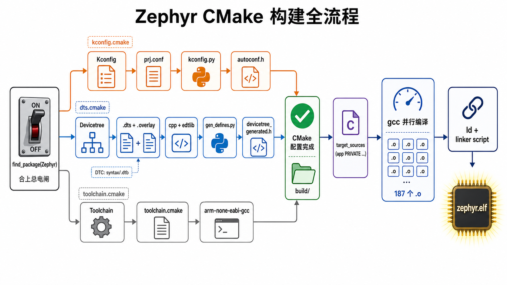

### 27.2 target_sources：往流水线挂篮子（回扣 PART4）

回扣 PART4 §26——你在 v8 多模块工程里加了一行：

```cmake
target_sources(app PRIVATE
    src/main.c
    src/led_task.c
    src/sensor_task.c
    src/comm_task.c
    src/log_task.c
)
```

加了四个 .c，还是一行。为什么？

因为 `app` 这个 CMake target 不是你自己创建的。`find_package(Zephyr)` 内部执行的 CMake 脚本里包含了这行：

```cmake
add_executable(app)
```

把你可能想要的一切全设好了：交叉编译器（`arm-none-eabi-gcc`）、架构选项（`-mcpu=cortex-m4 -mthumb -mfloat-abi=hard -mfpu=fpv4-sp-d16`）、链接脚本（由 `board.cmake` 选定）、内核库依赖（`zephyr` target 里包含了 `kernel/`、`arch/`、`drivers/` 等所有被 Kconfig 使能的模块）。你只需要往 `app` 里塞你的源文件。

对比 FreeRTOS 的 Makefile——你要亲手写：

```makefile
CFLAGS  += -I../FreeRTOS/Source/include
CFLAGS  += -I../FreeRTOS/Source/portable/GCC/ARM_CM4F
CFLAGS  += -mcpu=cortex-m4 -mthumb -mfloat-abi=hard -mfpu=fpv4-sp-d16
LDFLAGS += -T STM32F407VGTx_FLASH.ld
OBJS    = main.o led.o sensor.o FreeRTOS/Source/tasks.o FreeRTOS/Source/queue.o ...
```

Zephyr 的 CMakeLists.txt 里这些全消失了。不是不存在——是被 `find_package(Zephyr)` 藏到了几千行脚本后面。你不是被剥夺了能力，你是**被解放了注意力**。你把精力从"怎么编"转移到"编什么"——这就是框架的本质价值。

### 27.3 v11 demo：跟踪一次 west build，看一行 CONFIG_GPIO=y 背后实际发生了什么

在 `prj.conf` 加一行：

```
CONFIG_CMAKE_VERBOSE=y
```

再 `west build`。输出不再简洁——每一行都是完整的 gcc 命令行。挑一段贴给你看：

```bash
# ===== west build verbose 输出（v11 demo） =====

# 步骤1: CMake 配置阶段（find_package 内部）
# Kconfig 流水线：
-- Found Python3: /usr/bin/python3
-- Selected BOARD stm32f4_disco
-- Loading zephyr/boards/arm/stm32f4_disco/stm32f4_disco_defconfig
-- Loading zephyr/soc/arm/stmicro_stm32/stm32f4/Kconfig.soc
-- Merging prj.conf                     ← 你的菜单递进去了
-- Generating autoconf.h                ← §32 出菜完成

# 步骤2: DTS 流水线（也在配置阶段）
-- Devicetree configuration written     ← §33 翻译官和排版工人收工

# 步骤3: 编译阶段——每一行都是你 prj.conf 的后果

# 你写了 CONFIG_GPIO=y → GPIO 驱动被编入
[1/187] arm-none-eabi-gcc \
  -DKERNEL -D__ZEPHYR__=3 \
  -IC:/zephyr/include -IC:/zephyr/include/zephyr \
  -Ibuild/zephyr/include/generated \
  -mcpu=cortex-m4 -mthumb -mfloat-abi=hard -mfpu=fpv4-sp-d16 \
  -Os -ffunction-sections -fdata-sections -fno-strict-aliasing \
  -c zephyr/drivers/gpio/gpio_stm32.c \
  -o build/zephyr/drivers/gpio/CMakeFiles/.../gpio_stm32.c.obj
#                               ↑ 这个 .o 是你写 CONFIG_GPIO=y 拉进来的

# 你写了 CONFIG_GPIO=y → PINCTRL 自动被 select → 也被编入
[2/187] arm-none-eabi-gcc \
  ... \
  -c zephyr/drivers/pinctrl/pinctrl_stm32.c \
  -o build/zephyr/drivers/pinctrl/CMakeFiles/.../pinctrl_stm32.c.obj
#                                        ↑ select 链拽进来的

# 你的 main.c 只是 187 个编译单元中的一个
[50/187] arm-none-eabi-gcc \
  ... \
  -c src/main.c -o build/zephyr/CMakeFiles/app.dir/src/main.c.obj

# 步骤4: 链接阶段
[187/187] arm-none-eabi-gcc \
  -T build/zephyr/linker.cmd \
  -Wl,--gc-sections \           ← 没被引用的段直接扔掉
  -Wl,-Map=build/zephyr/zephyr.map \
  build/zephyr/CMakeFiles/app.dir/src/main.c.obj \
  build/zephyr/kernel/CMakeFiles/.../sched.c.obj \
  build/zephyr/drivers/gpio/CMakeFiles/.../gpio_stm32.c.obj \
  ...（180+ 个 .o 文件）...
  -o build/zephyr/zephyr.elf
```

数一数 `-I` 有多少个——十几行 include 路径。数一数 `-D` 有多少个——几十个宏定义。数一数编了多少个 `.o`：

```
kernel/          → sched.o, thread.o, work.o, ...      (~15 .o)
arch/arm/        → irq_manage.o, swap.o, fault.o, ...   (~10 .o)
drivers/gpio/    → gpio_stm32.o                         (~2 .o, select 拽来的)
drivers/pinctrl/ → pinctrl_stm32.o                      (~2 .o, select 拽来的)
drivers/clock_control/ → clock_stm32f4.o                (~1 .o)
subsys/logging/  → log_core.o, log_output.o, ...        (~5 .o, 如果开了 LOG)
```

你的 `main.c` 只是 ~187 个 `.o` 中的一个。Zephyr 替你编了 **上百个 .o**。这不是 overhead——这是你的 `CONFIG_GPIO=y` 背后拉进来的整个 GPIO 子系统、时钟驱动、pin control 层。你写一行 prj.conf，编译阶段就多十几个 .o。

现在回头看 PART1 你问过的问题："为什么不能拖几个 .c 进来自己 make？"——因为你要拖的不是几个，是几十上百个，而且它们之间有严格的 #ifdef 依赖（依赖 `autoconf.h`）、DT_ 宏依赖（依赖 `devicetree_generated.h`）、编译顺序依赖（某些 .o 必须在另一些之前编好）。CMake + Kconfig 替你管理了这张复杂的依赖图。你不是工人——你是工厂经理。你开单子，产线干活。

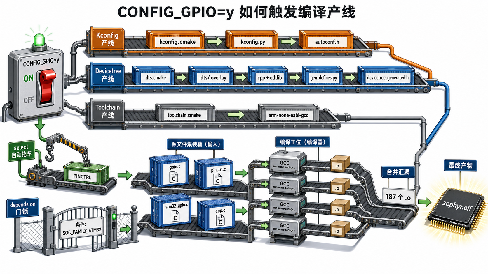

---

## 28 收束：从作坊到工厂，你走过了什么

从 Ch5 用 `struct` 封装 GPIO 寄存器，到此刻你理解了 Zephyr 工厂的地下室：配电箱（Kconfig）怎么决定哪个产线通电，翻译官+排版工人（DTC + gen_defines.py）怎么把仓库清单变成领料单，总电闸（`find_package(Zephyr)`）怎么一拉就铺好整条流水线。你走过的，不是一条直线，是一段工程观的进化。

### 28.1 五条设计哲学贯穿全书

把从 Ch5 到 Ch8 的所有概念压缩到只剩下骨架，不是代码、不是 API——是五句话，每句话是 Zephyr 在教你一种思考方式。

**1. 配置即功能。** `CONFIG_GPIO=y` 不只是"开开关"——它决定了整个 GPIO 子系统是否参与编译。Kconfig 是你手中的剪刀：不需要的子系统一刀切掉，ROM 从 ~58KB 降到 ~10KB（§25.4）。FreeRTOS 的 `FreeRTOSConfig.h` 是一张平坦配置表——Zephyr 的 Kconfig 是一棵有约束的依赖树，配电箱替你检查合法性。**你不写 Makefile 删文件——你关电闸。**

**2. 硬件即数据。** `.dts` 不是文档，是源码。换板子不搜 `#define`——改设备树。硬件信息（pin、port、i2c 地址）和逻辑代码（怎么闪、怎么采样）住在两个世界里，编译器做中介。你从 `#define LED_PIN 13`（Ch5 §1）毕业到 `GPIO_DT_SPEC_GET(DT_NODELABEL(led0), gpios)`（§26.3），从"硬编码"毕业到"配置驱动"。

**3. 设备即对象。** Ch5 §5 你给 `struct led_base` 加了 ops 虚表——Zephyr 给了你 `struct device` + `driver_api`（PART2 §15~§16）。LED 的 `led_on(dev, idx)` 是虚函数调用，sensor 的 `sensor_sample_fetch(dev)` 同款 dispatch。`DEVICE_DT_DEFINE`（§18）在编译期把所有设备对象的指针塞进 `.z_device` 段——Ch5 你费力建的 OOP 概念，Zephyr 拿来当骨架。

**4. 面向接口编程。** 你的代码不调 `gpio_stm32_set()`，调 `gpio_pin_set_dt()`（PART2 §17）。设备驱动不依赖具体芯片——依赖 GPIO API、I2C API、SPI API 的接口契约。换芯片 = 换下层实现，上层逻辑一行不动。Ch5 §7 你写的 `platform.h` 抽象层，Zephyr 用子系统 API + device driver 模式工业化实现了。

**5. 编译期一切。** 设备树在编译期展开成 `#define`（§33）。SYS_INIT 在编译期把函数指针塞进 `.z_init` 段（PART1 §6.4）。Kconfig 在编译期决定 `#ifdef` 走哪条分支（§25.1）。不是"运行时很快"——是**运行时根本没有运行时要做的事**。启动快不是优化出来的，是设计出来的。Linux 在运行时做的 compatible 匹配、设备树遍历、动态分配，Zephyr 全在编译期干完了——因为单片机不需要热插拔（§26.4）。

### 28.2 五条设计哲学全景图

在钻进八维大表之前，先把这五条哲学挂在一张图上。它们不是孤立的——是从 Ch5 到 Ch8 一以贯之的线索。

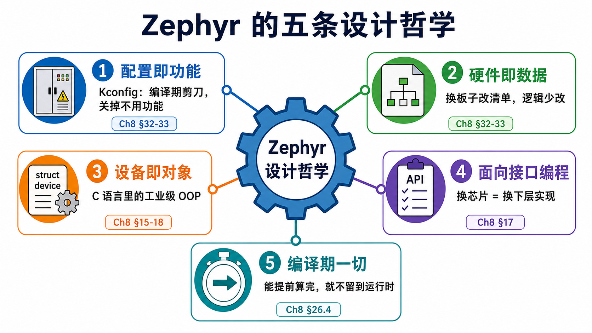

### 28.3 八维总结大表：FreeRTOS → Zephyr

| 维度 | FreeRTOS (Ch6/Ch7) | Zephyr (Ch8) | 变化本质 |
|---|---|---|---|
| **硬件定义** | `#define LED_PIN 13` 散落各处 | `.dts` 节点 `led0 { gpios = <&gpioc 13>; };` | 硬件与逻辑分离——换板子改清单，不动逻辑 |
| **驱动注册** | `led_init()` 在 main() 里手动调 | `DEVICE_DT_DEFINE` 编译期自动注册到 `.z_device` | 声明式替代命令式——加设备不碰 main |
| **换板子** | 全局搜索替换 pin / 外设地址 | 换 `board` 目录 + 一个 `.overlay` 文件 | 配置驱动——逻辑代码原封不动 |
| **功能裁剪** | 手改 Makefile 删 .c 文件 | `prj.conf` 关 `CONFIG_XXX=n` | Kconfig 裁剪子系统——关电闸，不是删产线 |
| **文件组织** | 一个 `main.c` 几百到上千行 | 多模块各 `.h`/`.c`，`static` 隐藏实现（§25~§26） | 工程化模块边界——一个功能=一对文件 |
| **模块启动** | `main()` 里手动调每个 `_init()`，顺序靠人工保证 | `SYS_INIT(fn, APPLICATION, prio)` 自动按优先级注册（§6.4） | 声明式——加模块不碰 main，启动顺序框架保证 |
| **多任务** | `xTaskCreate(sensor_task, ...)` | `k_thread_create(...)` + `k_msgq`（PART3 §20~§24） | API 换皮 + 资源编译期分配（栈、TCB、队列） |
| **构建** | 手写 Makefile：CFLAGS + OBJS + 链接脚本全手工 | `west build`，一行 `find_package(Zephyr)`（§34） | 框架接管构建——你声明意图，产线干活 |

你不只是学了一套新 API。你换了**思考方式**：从"我一步步写怎么做"（命令式）到"我声明我要什么，框架帮我做"（声明式）。

这张八维大表浓缩了从 FreeRTOS 到 Zephyr 的所有变化。现在用一张"命令式 vs 声明式"哲学对比图，为这两套世界的底层分歧做最后的定格。

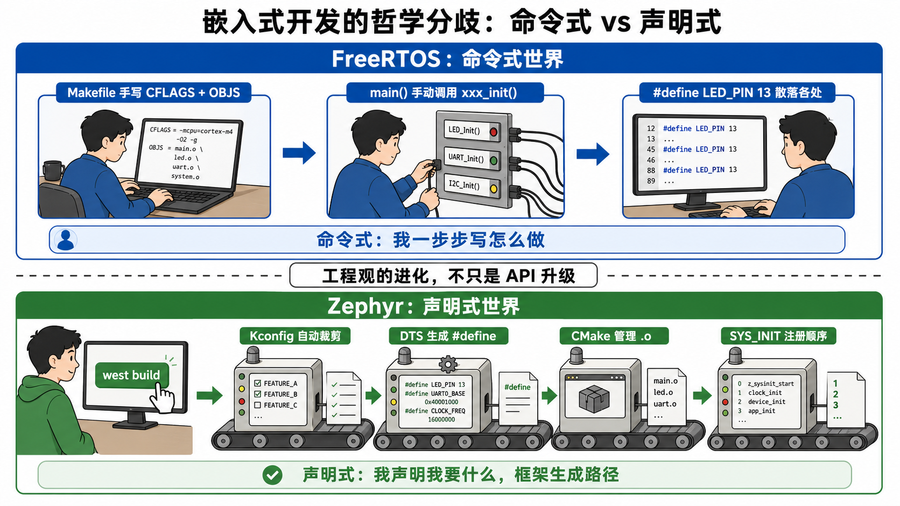

Ch5 §3 你学会 static 隐藏实现——Zephyr 把"隐藏实现"放大到整个子系统级别。Ch6 §3 你学会 xTaskCreate——Zephyr 把"创建线程"扩展成编译期 `K_THREAD_DEFINE`。

### 28.4 FreeRTOS → Zephyr → Linux：三级台阶

你现在站在一个三级台阶上往下看：

```mermaid
graph TD
    subgraph FR["🔵 FreeRTOS 台阶 (Ch6/Ch7)"]
        A1["调度器 + IPC<br/>xTaskCreate / 信号量 / 队列"]
        A2["你学到的：<br/>CPU是一个车间<br/>任务是你的工人<br/>TCB是工牌<br/>调度器是工头"]
    end
    
    subgraph ZE["🟢 Zephyr 台阶 (Ch8)"]
        B1["调度器 + IPC<br/>+ 设备模型 (struct device)<br/>+ 构建体系 (CMake/Kconfig)<br/>+ 配置系统 (.dts/prj.conf)<br/>+ 自动注册 (SYS_INIT/DEVICE_DT_DEFINE)"]
        B2["你学到的：<br/>工厂配电箱 (Kconfig)<br/>仓库清单→领料单 (DTS流水线)<br/>装配流水线设计图 (CMake)<br/>工人自动打卡 (SYS_INIT)<br/>OOP概念工业级兑现"]
    end
    
    subgraph LX["🔴 Linux 台阶 (Ch9 等你)"]
        C1["Zephyr 的一切<br/>+ MMU + 进程模型<br/>+ 用户态/内核态隔离<br/>+ 热插拔 + 动态加载<br/>+ ko 模块运行时插入"]
        C2["你即将学到的：<br/>虚拟内存怎么工作<br/>内核模块怎么写<br/>container_of 在 Linux 内核<br/>里的真实模样"]
    end
    
    FR -->|"Ch8 桥梁"| ZE
    ZE -->|"Ch9 桥梁"| LX
    
    style FR fill:#e3f2fd,stroke:#1565c0
    style ZE fill:#e8f5e9,stroke:#2e7d32
    style LX fill:#fce4ec,stroke:#c62828
```

**FreeRTOS 台阶教会了你调度。** 它给你任务、信号量、队列——这是操作系统最底层的积木。但它不告诉你硬件怎么管、代码怎么组织、配置怎么剪裁——那些是"你自己的事"。

**Zephyr 台阶接管了 FreeRTOS 不管的一切。** 硬件 → 设备树。配置 → Kconfig。驱动注册 → `DEVICE_DT_DEFINE`。模块启动 → `SYS_INIT`。多文件工程 → CMake。它把 Linux 的设计模式搬到了单片机上，但去掉了单片机不需要的东西：MMU、进程、动态加载、热插拔。

**Linux 台阶在这条谱系的最远端。** 它有 Zephyr 的一切，再加上虚拟内存、用户态/内核态隔离、设备热插拔、ko 模块动态加载。你现在看不懂 Linux 的设备模型吗？你错了——**你已经在 Zephyr 里看过了。** `struct device` ↔ `struct device`（同名！），`driver_api` ↔ `struct file_operations`，`DT_DRV_COMPAT` ↔ `of_match_table`——骨架完全一样。Ch9 会让你在 Linux 源码里认出这些老朋友。

现在让我们把"编译期 vs 运行时"这个全书最核心的哲学分歧，用一张对比图来定格。

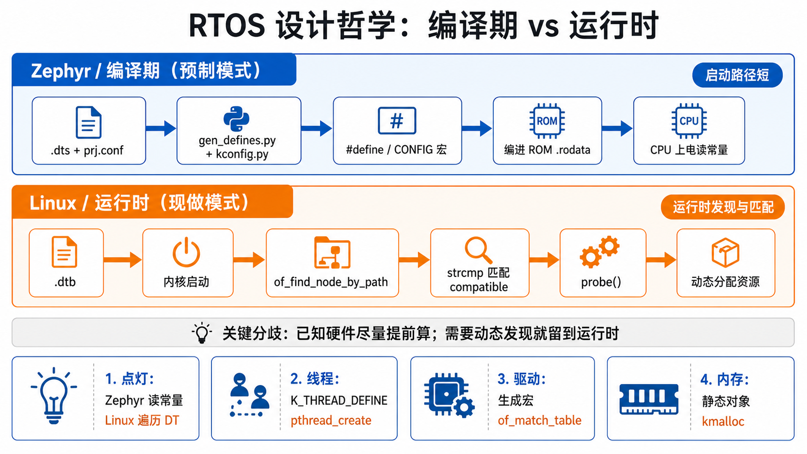

### 28.5 "你怎么知道自己学会了"——读者自查清单

关掉这本书。打开终端。你能独立做到以下七件事吗？

| # | 任务 | 你验证了什么 |
|---|---|---|
| 1 | `west init` → 选一块你完全没用过的板子 → 写一个 blinky → `west build` → `west flash` → 灯亮 | 你会用 Zephyr 工具链从零起工程 |
| 2 | 加一个传感器驱动：写 binding YAML → 写 driver.c（config struct → 实现函数 → ops 表 → `DEVICE_DT_DEFINE`）→ overlay 声明节点 → 编译通过，`sensor_sample_fetch` 返回 0 | 你理解 PART2 驱动五段结构——面向接口编程落地 |
| 3 | 拆一个工程：四个模块各配 `.h`/`.c` → `static` 隐藏内部实现 → `k_msgq` 传数据 → `SYS_INIT` 自动注册 → `main.c` 不超过 10 行 | 你理解 PART4 模块化——main.c 只做连接 |
| 4 | 打开任意 Kconfig 文件看一个陌生子系统：能分清 `depends on` 和 `select` 的意图，知道哪个符号该在哪层配置 | 你理解 §25.2 配电箱逻辑——门锁 vs 自动拖车 |
| 5 | 看任何 Zephyr 子系统源码：能认出"config struct → ops 表 → `DEVICE_DT_DEFINE` → `container_of` 回调"五个模式 | 你理解 PART2 设备模型——OOP 在工业 C 代码里的模式识别 |
| 6 | 换一块板子：知道改 `boards/` + overlay + `prj.conf`，逻辑 `.c` 一行不动 | 你理解 §33 配置驱动——硬件即数据 |
| 7 | 跟踪一次 `west build -v`：能从 verbose 输出指出哪个 `.o` 是由哪行 `CONFIG_XXX=y` 拉进来的 | 你理解 §27.3 构建流水线——一行配置背后的编译链条 |

如果你能做到上面至少五项——你不是"学过 Zephyr"。你是**理解了 Zephyr。**

Ch5 你学会让一个 struct 管理自己的生命周期。Ch6 你学会让调度器协调四份工作。Ch7 你学会把 FreeRTOS 工程当成可建模的系统来设计。Ch8 你学会站在框架肩上——声明意图，让工具链帮你执行。

从 `#define LED_PIN 13` 到 `DT_NODELABEL(led0)`。从 `led_init()` 到 `DEVICE_DT_DEFINE`。从 `FreeRTOSConfig.h` 到 `prj.conf`。从一个 `main.c` 到一对 `.h`/`.c` 一个模块。从手动启动到 `SYS_INIT` 自动注册。从 Makefile 到 `west build`。

**这不是 API 升级——这是工程观的进化。**

### 28.6 站在 Zephyr 工厂门口，回望来路

最后，给你一幅画面。不是你代码里的画面——是你心里的。

你站在一座巨大的工厂门口。门牌上写着 **"Zephyr RTOS: Build-to-Spec Embedded Factory"**。你身后是来路——一条从远到近越来越宽的路：

- 最远处，Ch5 的起点：一个手搓的 `struct led`，三颗 LED 三份代码，你第一次用 `static` 关门。
- 中间，Ch6/Ch7 的车间：四个工人在 FreeRTOS 调度下忙碌，你当工头，每根管线亲自接。
- 近处，Ch8 的大门口：你走完了 PART1~PART4——设备模型、线程同步、多模块工程、自动注册——你学会了在工厂里开单子。
- 此刻，PART5 的地下室门开着：配电箱的嗡鸣声从脚下传来，流水线设计图贴在墙上，领料单打印机还在工作。你知道了电从哪来。

工厂门里，Ch9 的 Linux 世界在等你。但此刻——站在门口，回望来路——你已经不是那个只会 `#define LED_PIN 13` 的人了。


---


---


**最后，留给你一段话。**

你翻开这本书的第一页时，可能只是想"学一下 Zephyr"。但你现在知道了——你学的不是 Zephyr。你学的是嵌入式软件工程观的进化。从裸机寄存器的蛮荒，到 FreeRTOS 调度器的秩序，到 Zephyr 工厂的声明式之美，再到不远处 Linux 世界的无垠疆域——你走过的不是教程章节，是一个工程师从手工作坊走向自动化工厂的完整心智迁徙。

Ch5 那颗 `#define LED_PIN 13` 的灯还在闪。但点灯的人，已经不一样了。

Ch9 在前方等你。那里有 MMU、虚拟内存、内核模块——但你已经不怕了。因为你已经见过了 `struct device`、`container_of`、`compatible` 匹配——Linux 内核不过是把你在 Zephyr 学会的每一件事，放到一个更大的舞台上再演一遍。

**从手搓到站在巨人肩上——这不是终点，这是下一段旅程的起点。**

---

DONE_PART5_END_ILLUSTRATED
